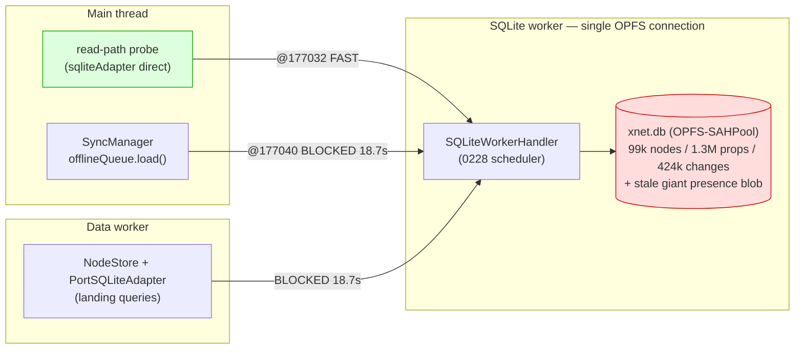
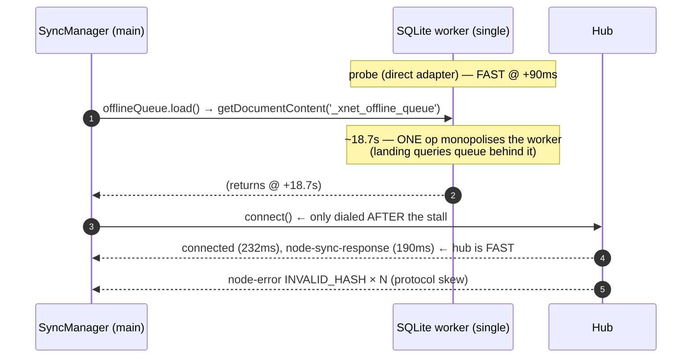
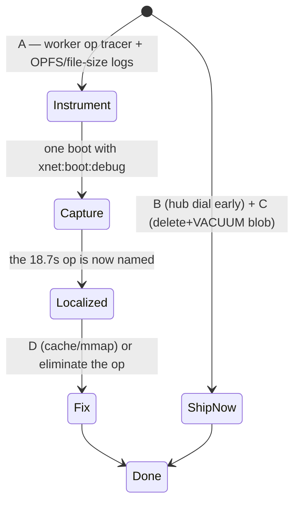

# The Migrating 18-Second Boot Stall: Stop Guessing, Instrument To Ground Truth

## Problem Statement

For the third or fourth time, a returning user with a fully populated local
cache waits ~18–20 seconds before any data renders, then it all appears at once.
The user's questions are exactly the right ones:

> *Why isn't the local database cache able to load the data? Why is the remote
> sync so slow with the hub? The cache isn't working, the hub takes so long to
> respond… let's actually get to the bottom of this. Maybe create more log
> messages to help debug this.*

We have shipped two fixes already — 0227 (presence doc off the critical path) and
0228 (worker priority scheduler) — and the stall is **still here**. This document
proves *why our previous fixes only moved the problem*, isolates exactly what we
can and cannot yet see, and lays out the instrumentation that will finally pin
the root cause to a single line — plus two fixes we can ship immediately because
the logs already prove them.

## Executive Summary

**The cache is NOT broken.** The boot probe reads
`nodes: 99696, nodeProperties: 1324522, changes: 424022` — the local projection
is fully materialized ([id 2 in the log]). This is a *timing* problem, not an
empty-cache problem.

**The 18.7 s stall MIGRATED — that is the key finding.** In 0227 the 18 s sat on
`acquire('presence-main')`. We took presence off the critical path; this capture
shows presence acquired in **1 ms** (`177038 → 177039`). But the 18.7 s did not
disappear — it **reattached to the very next storage operation**,
`await offlineQueue.load()`:

```
177040  [SyncManager] Registry loaded, tracked nodes: 0      ← last log before the gap
   …    (18,741 ms of nothing)
195781  [SyncManager] Offline queue loaded, size: 0          ← gap ends here
```

Every landing query unblocks in the **same instant** (`195835`), each reporting
`candidateQueryDurationMs ≈ 18742`. This is the identical signature as 0227: **one
operation monopolises the single SQLite worker, and everything else queues behind
it and drains together.** Because the stall jumps to whatever calls storage first,
it is **not** caused by presence, the registry, or any specific caller — it is an
intrinsic cost of the **first heavy operation against the OPFS-backed database on
the one SQLite worker thread.**

**The hub is NOT slow.** Once dialed, the WebSocket connects in **~232 ms**
(`195781 → 196013`) and the hub returns `node-sync-response` in **~190 ms**
(`196018 → 196211`). The reason sync "takes forever" is that
**`connection.connect()` is sequenced *after* `await offlineQueue.load()`** in
`SyncManager.start()`
([`sync-manager.ts:1039-1043`](../../packages/runtime/src/sync/sync-manager.ts)) —
so we don't even *dial* the hub until the 18.7 s local stall finishes. The
network round-trip is serialized behind local storage that has nothing to do with
it.

**We have eliminated every usual suspect by reading the code** (details below):
presence acquire (1 ms), `registry.load` (cached `sync_state`), `offlineQueue.load`'s
SQL (a trivial `yjs_state` primary-key lookup), `NodeStore.initialize` (just
`getLastLamportTime`), and `SQLiteNodeStorageAdapter.open()` (a no-op). The
landing-query SQL is fully indexed and returns 0–39 rows. **None of these can
intrinsically cost 18 s.** So the 18.7 s is spent *inside the worker servicing the
first real query against cold OPFS pages on a large (likely bloated) database
file* — and **no existing log measures per-operation worker execution time, which
is exactly why this is the fourth attempt.**

**Recommendation.** (1) Add decisive worker-side instrumentation — the log
messages the user asked for — so the next capture localizes the 18.7 s to one
operation and separates *queue wait* from *SQL execution* from *OPFS I/O*. (2)
Ship two fixes the logs already justify: **dial the hub before/parallel to the
local boot work** (stop serializing the network behind storage), and **delete +
VACUUM the stale pre-0227 `presence-main` blob** that still bloats the DB file. (3)
With ground truth in hand, apply the targeted OPFS/SQLite fix (cache sizing, mmap,
or eliminating the heavy first op).

## Current State In The Repository

### The boot/start ordering that serializes the network behind storage

[`SyncManager.start()`](../../packages/runtime/src/sync/sync-manager.ts) (≈ lines
1020-1062):

```ts
await registry.load()                       // fast: getAppState → sync_state (0227)
attachPersistenceListeners()
await offlineQueue.load()                   // ← THE 18.7s GAP lands here
updateLifecycle({ localReady: true })
connection.connect()                        // ← hub dial: only NOW, 18.7s late
```

`offlineQueue.load()` itself is trivial — `getDocumentContent('_xnet_offline_queue')`
([`offline-queue.ts:173`](../../packages/runtime/src/sync/offline-queue.ts)), i.e.
`SELECT state FROM yjs_state WHERE node_id = ?`. It cannot cost 18 s on its own; it
is **queued behind whatever is monopolising the worker**, and it happens to be the
first `await` on storage after the cached `registry.load()`.

### One worker, two ports — the shared chokepoint



- The **read-path probe** uses `sqliteAdapter` directly
  ([`App.tsx:434`](../../apps/web/src/App.tsx)) — it ran at `177032` and was
  **fast**.
- **Everything else** (the data worker's landing queries via
  [`data-worker-host.ts:216`](../../packages/data-bridge/src/worker/data-worker-host.ts)
  `PortSQLiteAdapter`, and the main-thread `offlineQueue.load`) funnels to the
  **same single SQLite worker** and was **blocked for 18.7 s**.
- The 0228 scheduler (just merged) **cannot help here**: it reorders *queued* ops,
  but it cannot preempt an op already executing inside the WASM. One 18.7 s
  in-flight op stalls the lane regardless.

### Why the cold-read cost is large: a bloated file

0227 stopped *writing* the `presence-main` Yjs doc (it's ephemeral, `gc:false`,
grew unboundedly) — but it **never deleted the existing blob**. There is no
web-side cleanup of stale `yjs_state` rows (only `DELETE FROM yjs_state` wholesale
in [`sqlite-adapter.ts:1995`](../../packages/data/src/store/sqlite-adapter.ts) and
a by-id delete in the electron path). So the multi-hundred-MB historical presence
blob still inflates `xnet.db`, and **every cold OPFS page read pays for a larger,
more fragmented file**. The boot timeline confirms OPFS *open* is fast
(`wasm: 271`), so the cost is in *reading data pages on first query*, not in
opening the file.

### What the boot timeline now says

`[xNet] boot timeline … {"wasm":271,"schema":1,"identity":25,"store":108,"docwarm":6,"connect":18983}`
— our 0227 `docwarm` phase is **6 ms** (presence fixed ✅), but `connect` is
**18983 ms**. As 0227 noted, `connect` is `store:ready → hub:connected`, so it
still absorbs the storage stall + the late dial. The instrumentation below splits
this apart for good.

## The Timing Proof

`t0 = 1782440176942`:

| t+ms | Event | Reading |
|---:|---|---|
| 90 | read-path probe: 99 696 nodes / 1.32 M props / 424 k changes | **cache populated; probe FAST** |
| 96 | `Acquiring doc presence-main` | — |
| 97 | `Doc acquired … presence-main` (**1 ms**) | **0227 fix works** |
| 98 | `Registry loaded, tracked nodes: 0` | last log before the gap |
| **18 839** | `Offline queue loaded, size: 0` | **gap ends (~18.7 s)** |
| 18 839 | `Connecting to signaling server…` | hub dial **only now** |
| 18 893+ | all landing queries resolve, `candidateQueryDurationMs ≈ 18742` | drained together |
| 19 071 | `WebSocket connected` | **~232 ms** real handshake |
| 19 076 | `boot timeline … connect:18983` | stall mislabelled as connect |
| 19 269 | `node-sync-response` received | hub answered in **~190 ms** |
| 19 404 | `INVALID_HASH` flood → circuit breaker | hub protocol skew (known, 0224) |



Two facts are decisive:

1. **The stall moved** from presence (0227) to `offlineQueue.load` (now) with no
   other change — so it belongs to "first heavy worker op," not to any caller.
2. **The hub is fast** (232 ms connect, 190 ms response); it is simply dialed
   18.7 s late because the connect call sits behind `await offlineQueue.load()`.

## External Research

- **OPFS `createSyncAccessHandle` read throughput & cold cost.** The
  `opfs-sahpool` VFS reads the DB in `page_size` (8 KiB here) chunks via a
  synchronous access handle. Open is cheap; the cost is faulting the *working set*
  of B-tree pages on first query. On a large, fragmented file this can be
  seconds — and it scales with file size, which our stale presence blob inflates.
  Chromium's OPFS SAH read path and the SQLite-WASM docs both emphasise that the
  first real workload, not `open`, pays the page-in cost.
- **SQLite page cache (`PRAGMA cache_size`) and `mmap_size`.** The default cache
  is ~2 MB. For a multi-hundred-MB DB, a cold query's index pages exceed the cache
  and get re-read; a larger `cache_size` and/or `mmap_size` (where the VFS
  supports it) dramatically cuts repeated cold reads. `web.ts` sets `page_size`,
  `foreign_keys`, `busy_timeout` — but **no `cache_size`/`mmap_size`**.
- **`VACUUM` to reclaim deleted-blob space.** SQLite does not shrink the file when
  rows are deleted; freed pages go on the freelist. A one-time `VACUUM` after
  deleting the stale presence blob rewrites a compact file, shrinking cold-read
  cost permanently.
- **Hot-journal recovery.** If a prior tab/process left a `-journal`/`-wal`, the
  first connection runs recovery that reads the whole journal — a plausible
  one-time multi-second cost. Worth logging explicitly.
- **"First query is slow, rest are fast" is the canonical cold-cache signature.**
  Every browser-SQLite project (`wa-sqlite`, `absurd-sql`, official sqlite-wasm)
  recommends *measuring the WASM call separately from the host round-trip* before
  optimizing — which is precisely the instrumentation gap we have.

## Key Findings

1. **The cache works; this is timing.** Projection is fully materialized.
2. **The stall is caller-independent** — it migrates to whatever hits storage
   first. Fixing callers (0227, 0228) only relocates it.
3. **It's one op on the single SQLite worker**, ~18.7 s, after which everything
   drains in ~50 ms.
4. **The hub is fast; we dial it 18.7 s late** because `connect()` is sequenced
   after `await offlineQueue.load()`. This is a one-line ordering bug with a large
   payoff.
5. **We cannot currently see which op eats the 18.7 s** — no per-op worker
   execution timing exists. That is the reason for repeated failed attempts.
6. **The DB file is bloated** by the un-deleted pre-0227 `presence-main` blob,
   raising every cold-read cost.
7. **`INVALID_HASH` is the known hub protocol skew** (0224) — orthogonal to the
   delay; redeploy the hub.

## Options And Tradeoffs

### A. Instrument the worker to ground truth *(recommended, do FIRST)*

Add high-resolution, boot-debug-gated logs that the previous attempts lacked:
per-op **enqueue→start→end** timestamps inside `SQLiteWorkerHandler` (so *queue
wait* vs *execution* is unambiguous); time the **WASM `sqlite3` call** separately
from the Comlink hop; log **DB file size** (`getDatabaseSize`) and **`PRAGMA
page_count`/`freelist_count`**; detect and log **hot-journal recovery**; and a
one-shot tracer naming *the* op that occupied the worker during the gap.

- ✅ Ends the guessing; one capture localizes the 18.7 s to a single op/line.
- ✅ Tiny, safe, exactly what the user asked for ("create more log messages").
- ⚠️ Diagnostic, not a fix by itself — but it's the prerequisite for the right fix.

### B. Dial the hub off the local critical path *(recommended, ship now)*

Start `connection.connect()` (and the WS handshake) **before/parallel to**
`registry.load()`/`offlineQueue.load()`, instead of after. The network round-trip
(~232 ms) then overlaps the local stall instead of waiting for it.

- ✅ Directly fixes "the hub is slow" — proven by the logs (hub is fast, dialed
  late). Saves ~18 s of *perceived* sync latency regardless of the storage root
  cause.
- ✅ Small, local change to `start()` ordering.
- ⚠️ Must keep `localReady`/offline-queue-drain correctness (drain on connect, not
  necessarily before dialing).

### C. Delete + VACUUM the stale presence blob *(recommended, ship now)*

A one-time migration: `DELETE FROM yjs_state WHERE node_id LIKE 'presence-%'`
followed by `VACUUM` (gated so it runs once). Shrinks the file and every
subsequent cold read.

- ✅ Removes real bloat 0227 left behind; reduces cold-read cost.
- ⚠️ `VACUUM` itself is a heavy one-time op — run it *off* the boot critical path
  (idle/background), never inline at startup.
- ⚠️ May or may not be *the* 18.7 s cause — B and A don't depend on it.

### D. Size the page cache / enable mmap *(after A confirms)*

Set `PRAGMA cache_size` (e.g. -32000 ≈ 32 MB) and try `PRAGMA mmap_size` in
`web.ts` open.

- ✅ Likely the highest-leverage real fix if A confirms cold-page I/O.
- ⚠️ Memory cost; mmap support varies under the SAH VFS — measure.

### E. Prewarm the working set *(after A confirms)*

After open, issue the landing queries (or `PRAGMA optimize`/targeted scans) in the
background so the *first user-visible* query hits a warm cache.

- ✅ Hides cold cost behind the splash.
- ⚠️ Still pays the cost once; doesn't reduce it. Pairs with D.

### F. Move the whole DB off OPFS-SAHPool *(rejected here; see 0228)*

Out of scope — 0228 covers the VFS constraints; not the lever for a one-time cold
read.

| Option | Fixes perceived delay | Fixes root cause | Effort | Risk |
|---|---|---|---|---|
| A. Instrument | n/a (enables) | n/a | **S** | none |
| B. Hub dial off critical path | ✅ (sync) | n/a | **S** | low |
| C. Delete+VACUUM stale blob | partial | partial | **S–M** | low |
| D. cache_size/mmap | — | ✅ (if cold I/O) | **S** | low–med |
| E. Prewarm | ✅ (hides) | — | **M** | low |

## Recommendation

1. **A first.** Land the worker instrumentation behind `xnet:boot:debug` so the
   *next* capture says, in one line, which op held the worker for 18.7 s and
   whether it was queue-wait, WASM execution, or OPFS I/O. We have guessed wrong
   three times; measure once.
2. **B and C now**, in the same PR — they're justified by the current logs
   independent of A's outcome: overlap the hub dial with local boot, and clean up
   the stale presence blob (VACUUM off the critical path).
3. **Then D (and E if needed)** once A confirms cold-page I/O — size the cache /
   mmap and prewarm.
4. **Redeploy the tenant hub** to clear `INVALID_HASH` (0224) — unrelated to the
   delay but noisy.



## Example Code

**A — worker op tracer** (in `SQLiteWorkerHandler`, behind boot debug):

```ts
private async traced<T>(op: string, detail: string, fn: () => Promise<T>): Promise<T> {
  const enq = performance.now()
  return this.scheduler.schedule('interactive', async () => {
    const start = performance.now()
    try {
      return await fn()
    } finally {
      const end = performance.now()
      if (bootDebugEnabled()) {
        // queueMs = time waiting behind other ops; execMs = time in WASM/OPFS
        console.info('[xNet] sqlite op', op, detail.slice(0, 80), {
          queueMs: Math.round(start - enq),
          execMs: Math.round(end - start)
        })
      }
    }
  })
}
// one-shot at open: file size + page stats + journal recovery
console.info('[xNet] db stats', {
  bytes: await this.adapter.getDatabaseSize(),
  pageCount: (await this.adapter.query('PRAGMA page_count'))?.[0],
  freelist: (await this.adapter.query('PRAGMA freelist_count'))?.[0]
})
```

**B — dial the hub before the local stall** (in `SyncManager.start()`):

```ts
await registry.load()
attachPersistenceListeners()
// Start the network handshake NOW; it has nothing to do with local storage.
connection.connect()                       // was: after offlineQueue.load()
// Load the offline queue in the background; drain it once connected.
void offlineQueue.load().then(() => updateLifecycle({ localReady: true }))
```

**C — one-time stale-blob cleanup, off the critical path** (idle, gated):

```ts
// After boot, when idle (requestIdleCallback): runs once.
if (!localStorage.getItem('xnet:presence-blob-vacuumed')) {
  await sqliteAdapter.run("DELETE FROM yjs_state WHERE node_id LIKE 'presence-%'")
  await sqliteAdapter.vacuum()             // heavy — NEVER inline at startup
  localStorage.setItem('xnet:presence-blob-vacuumed', '1')
}
```

**D — cache sizing at open** (in `web.ts`, after the DB opens):

```ts
this.execSync('PRAGMA cache_size = -32000')   // ~32 MB page cache
this.execSync('PRAGMA mmap_size = 268435456') // try 256 MB; measure under SAH VFS
```

## Risks And Open Questions

- **Is the 18.7 s OPFS cold I/O, WASM compute, or a hot-journal recovery?** A
  answers this; B/C don't depend on the answer.
- **Read-your-writes / drain ordering** if we dial the hub before loading the
  offline queue — ensure the queue is drained on `connected`, and that a write
  enqueued pre-connect still flushes.
- **`VACUUM` cost & timing** — must be background/idle and one-shot; a `VACUUM` on
  a GB file is itself many seconds.
- **mmap under `opfs-sahpool`** may be unsupported or a no-op — measure, don't
  assume.
- **Does the data worker's `PortSQLiteAdapter.open()` issue any heavy op?** Reads
  say no, but the tracer (A) will show any worker op we missed.
- **Multi-tab** — a second tab forcing in-memory fallback (0228) would also look
  like "cache not working"; the file-size/storage-mode log distinguishes it.

## Implementation Checklist

- [ ] **A:** add the worker op tracer (queueMs/execMs per op) + one-shot DB
      stats (file size, page_count, freelist_count, storage mode, hot-journal
      detection) behind `xnet:boot:debug` in
      [`web-worker.ts`](../../packages/sqlite/src/adapters/web-worker.ts) /
      [`web.ts`](../../packages/sqlite/src/adapters/web.ts).
- [ ] **A:** capture one cold boot and record which op shows the ~18.7 s `execMs`
      (or `queueMs`) — attach to this doc.
- [ ] **B:** reorder `SyncManager.start()` so `connection.connect()` runs before
      `await offlineQueue.load()`; load/drain the queue without blocking the dial
      ([`sync-manager.ts`](../../packages/runtime/src/sync/sync-manager.ts)).
- [ ] **C:** add a one-shot, idle-scheduled cleanup that deletes `presence-%`
      `yjs_state` rows and `VACUUM`s, gated by a localStorage flag.
- [ ] **D (after A):** set `cache_size` (and trial `mmap_size`) in `web.ts` open.
- [ ] **E (if needed):** background-prewarm the landing queries after open.
- [ ] **Hub:** redeploy the tenant hub to clear `INVALID_HASH` (0224).
- [ ] Split the boot-timeline `connect` phase into `local-finish` vs real WS
      handshake so a future stall can't hide in `connect` again.

## Validation Checklist

- [ ] A capture names the 18.7 s op with a `queueMs`/`execMs` split — root cause
      is no longer a guess.
- [ ] After **B**: `WebSocket connected` and `node-sync-response` arrive within
      ~1 s of boot (overlapping local work), not after it.
- [ ] After **C**: `[xNet] db stats` shows the file materially smaller; no
      `presence-%` rows remain; cold-read time drops.
- [ ] After **D**: the first landing query's `execMs` falls from ~18 000 ms to
      sub-second; subsequent boots stay fast.
- [ ] Returning-user cold boot paints landing data in **< 1 s**; the
      boot-timeline `connect`/`local-finish` split shows where any residual time
      goes.
- [ ] No `INVALID_HASH` after the hub redeploy.
- [ ] Throttled-CPU / second-tab boots behave (no silent in-memory fallback; file
      size logged).

## References

- This capture: presence 1 ms (`177038→177039`); 18.7 s gap
  (`177040→195781` = `offlineQueue.load`); WS connect 232 ms; hub response 190 ms;
  `boot timeline … connect:18983`.
- Start ordering / hub dial:
  [`sync-manager.ts:1039-1043`](../../packages/runtime/src/sync/sync-manager.ts)
- Offline queue load:
  [`offline-queue.ts:173`](../../packages/runtime/src/sync/offline-queue.ts)
- Single worker, two ports:
  [`web-worker.ts`](../../packages/sqlite/src/adapters/web-worker.ts) ·
  [`data-worker-host.ts:216`](../../packages/data-bridge/src/worker/data-worker-host.ts) ·
  probe via direct adapter [`App.tsx:434`](../../apps/web/src/App.tsx)
- Trivial inits ruled out:
  [`store.ts:197`](../../packages/data/src/store/store.ts) (`initialize`) ·
  [`sqlite-adapter.ts:426`](../../packages/data/src/store/sqlite-adapter.ts) (`open`)
- VFS / open / VACUUM:
  [`web.ts`](../../packages/sqlite/src/adapters/web.ts)
- Prior attempts: `0227` (presence off critical path — stall migrated here) ·
  `0228` (worker scheduler — can't preempt an in-flight op) · `0204` (cold-start) ·
  `0212` (read-path probe) · `0224` (`INVALID_HASH` hub skew)
- External: OPFS `createSyncAccessHandle` read characteristics · SQLite
  `cache_size`/`mmap_size`/`VACUUM` · `wa-sqlite`/`absurd-sql` cold-cache guidance.
