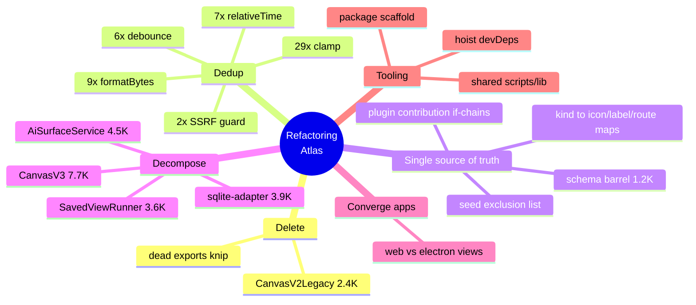

# Codebase Refactoring Atlas: Dead Code, God Files, and Deduplication

> Status: unimplemented (`[_]`). A survey + prioritized plan, not a single PR.
> Numbers in this doc were measured against the repo at `ad68420d`
> (2026-06-26) and should be re-measured before acting.

## Problem Statement

xNet is a ~406K-LOC TypeScript monorepo (47 publishable packages, 5 apps).
It has grown fast and shipped a lot (the changelog runs to PR #280). Growth at
that pace leaves sediment: dead code that nobody deleted, "god" files that
accreted responsibilities, view components copy-pasted between `apps/web` and
`apps/electron`, importers that share 80% of their skeleton, and dozens of
hand-rolled copies of the same five-line helper. None of it is on fire — but it
slows every future change, multiplies the surface where a fix lands in one copy
and not the other, and makes the codebase harder to onboard into.

The ask: **do a thorough search for where the codebase can be refactored,
cleaned up, or made less repetitive**, and turn the findings into a prioritized,
low-risk plan — ranked by leverage (lines removed / drift eliminated) against
effort and blast radius.

## Executive Summary

Seven independent sweeps (cross-app duplication, social importers, god files,
schema/registry boilerplate, micro-utility sprawl, config, and scripts) converge
on a clear picture. The opportunities sort into a **leverage ladder** — start at
the top, where the wins are large and the risk is near zero, and descend into
the structural work only as appetite allows.

| # | Theme | Headline finding (verified) | LOC reach | Risk | Leverage |
|---|-------|------------------------------|-----------|------|----------|
| 1 | **Dead code** | `CanvasV2Legacy.tsx` (2,380 LOC) has **zero production importers** — only 1 story + 1 test | ~2.4K removable | Very low | ★★★★★ |
| 2 | **Micro-utility sprawl** | **29** `clamp`, **9** `formatBytes`, **7** relative-time, **6** `debounce` independent copies | ~1–1.5K | Low | ★★★★★ |
| 3 | **Divergent security helper** | **2** SSRF/private-IP guards; the simpler `hub` one misses ranges the `plugins` one catches | small but **bug** | Med | ★★★★☆ |
| 4 | **Schema "register-in-N-places"** | 1,183-line schema barrel + parallel `kind→{icon,label,route}` maps + plugin `if`-chains | drift, not LOC | Med | ★★★★☆ |
| 5 | **Social importer boilerplate** | 8 importers repeat helpers, bucket logic, node factories, dispatch — ~1.7K reducible | ~1.7K | Med | ★★★☆☆ |
| 6 | **God files** | `CanvasV3.tsx` 7,733 · `ai-surface/service.ts` 4,496 · `sqlite-adapter.ts` 3,922 · `SavedViewRunner.tsx` 3,583 | splittable | Med–High | ★★★☆☆ |
| 7 | **Cross-app web/electron dup** | `CanvasView`/`PageView`/`DataWorkspaceView`/`SocialImportView` exist twice, drifting | ~1.6–2K | High | ★★☆☆☆ |
| 8 | **Config + scripts** | 47 identical `tsconfig.json`; no package scaffold; `scripts/` lacks a shared lib | ~300 + DX | Low | ★★★☆☆ |

**Recommended path:** ship the top of the ladder as small, mechanical,
independently-reviewable PRs (delete dead code → land a `@xnetjs/core/utils`
barrel and codemod the duplicates → unify the SSRF guard). Then take on one
structural theme at a time (schema single-source-of-truth, then the social
importer toolkit, then god-file splits behind characterization tests). Defer the
cross-app view consolidation — it has real feature drift and the highest blast
radius, so it needs a parity audit first, not a refactor.



## Current State In The Repository

### The shape of the tree

- 47 packages under `packages/*`, 5 apps under `apps/*` (`web`, `electron`,
  `expo`, `cloud`, plus shared).
- `@xnetjs/core` already exists (`packages/core/src/`) and is depended on by
  **24** packages — it is the natural home for shared primitives, but today it
  holds only `auth-types`, `content`, `hashing`, `permissions`, `federation`.
- There is **no** `utils` / `std` / `common` / `shared` package. Helpers have
  nowhere obvious to live, which is the root cause of theme #2.

### Largest non-test source files (the god-file shortlist)

| File | LOC | Note |
|------|----:|------|
| `packages/canvas/src/renderer/CanvasV3.tsx` | 7,733 | viewport + selection + 10 popovers + render + 162 hooks + geometry |
| `packages/plugins/src/ai-surface/service.ts` | 4,496 | `AiSurfaceService` god class: resources + page MD + DB ops + canvas + search |
| `packages/data/src/store/sqlite-adapter.ts` | 3,922 | query builder + FTS + statement cache + row mappers + authz + snapshots |
| `packages/react/src/components/SavedViewRunner.tsx` | 3,583 | runner + table + facets + canvas projection + 72 derivers |
| `apps/electron/src/renderer/components/CanvasView.tsx` | 3,195 | the heavier of two `CanvasView`s |
| `packages/data/src/store/store.ts` | 2,763 | |
| `packages/hub/src/storage/sqlite.ts` | 2,539 | ~600-line inline `SCHEMA_SQL` string + inline migrations |
| `packages/canvas/src/renderer/CanvasV2Legacy.tsx` | 2,380 | **dead** (see below) |
| `packages/editor/src/components/FloatingToolbar.tsx` | 1,937 | 10+ popover subcomponents inline |

### Verified duplication counts

Measured with `grep` over `packages/` + `apps/`, excluding `dist/` and tests:

- **`CanvasV2Legacy.tsx`** — referenced only by
  `packages/canvas/src/Canvas.stories.tsx:6` and
  `packages/canvas/src/__tests__/canvas-navigation-shell.test.tsx:6,550`. The
  public `Canvas` export resolves to **`CanvasV3`** at
  `packages/canvas/src/index.ts`. The legacy file is **provably dead** in
  production.
- **`clamp`** — **29** independent definitions.
- **`formatBytes` / `formatFileSize`** — **9** definitions, incl.
  `packages/canvas/src/performance/memory-profile.ts:42`,
  `packages/devtools/src/utils/formatters.ts:42` (caps at MB — silently wrong
  ≥1 GB), `packages/editor/src/extensions/file/FileNodeView.tsx:34`,
  `packages/react/src/components/DemoQuotaIndicator.tsx:18`,
  `apps/web/src/components/StorageWarningBanner.tsx:22`,
  `apps/web/src/components/CanvasView.tsx:148`.
- **relative-time** (`formatRelativeTime` / `relativeTime` / `timeAgo`) — **7**
  definitions across `packages/ui` (×3 — `ThreadPicker`, `CommentBubble`,
  `OrphanedThreadList`), `packages/dashboard/src/widgets/shared.ts:64`,
  `packages/devtools` (×2), `apps/web/src/comms/InboxTray.tsx:52`. They disagree
  on whether to append "ago" and on the date fallback format.
- **`debounce` / `throttle`** — **6** definitions.
- **SSRF / private-IP guard** — **2** implementations:
  `packages/plugins/src/actions/ssrf.ts` (literal IPv4 parse + CIDR masks +
  IPv6 + `.local`/`.internal`) vs. `packages/hub/src/utils/url.ts`
  (regex-only — misses e.g. `127.1`, integer-form loopback). The hub copy backs
  `unfurl`, `federation`, and `crawl` routes — the weaker guard is on the
  network-facing surface.

### The "register-in-N-places" tax

Adding one schema/content type touches several files that must stay in sync:

- `packages/data/src/schema/schemas/index.ts` (**623 lines**) — named exports +
  a `builtInSchemas` lazy-loader map that lists **each schema twice** (versioned
  IRI + unversioned legacy alias).
- `packages/data/src/schema/index.ts` (**560 lines**) — the public re-export
  barrel mirroring the above.
- Parallel UI metadata maps keyed by the same identifiers, which drift
  independently: `apps/web/src/workbench/tabs.ts:38` (`TAB_VIEWS` →
  `{label, icon, route}`), `apps/web/src/components/SpaceHomeView.tsx:52`
  (`KIND_META`), and schema-id `if`-chains in
  `packages/canvas/src/ingestion.ts:328`,
  `packages/canvas/src/edges/source-semantics.ts`,
  `packages/canvas/src/mind-map/conversion.ts`.
- Inline-vs-exported `select` options that re-declare the same option set (e.g.
  `packages/data/src/schema/schemas/task.ts:40` options vs `:173`
  `TASK_STATUS_CATEGORIES`; several in `crm.ts`).
- Plugin contributions: a ~30-branch `if`-chain in
  `packages/plugins/src/registry.ts` `registerStaticContributions()`.
- Seed coverage: a hand-maintained `SEED_EXCLUDED_SCHEMA_IDS` blocklist in
  `packages/devtools/src/seed/seed-manifest.ts`.

### Config & scripts

- **47/47** `packages/*/tsconfig.json` are the identical 8-line
  `extends ../../tsconfig.json` boilerplate; build/test/clean scripts and
  `tsup`/`typescript`/`vitest` devDeps are re-declared per package.
- No `scripts/new-package.*` scaffold — new packages are copy-paste.
- `scripts/` (~46 files) has no shared `lib/`: `parseEnv`, a GitHub REST helper,
  a git wrapper, `.changeset/config.json` parsing, and recursive file-walk are
  each re-implemented in 2+ scripts.

## External Research

**Dead code & unused exports.** `ts-prune` is archived/maintenance-mode and now
points users to **Knip**, which uses the same mark-and-sweep algorithm but adds
unused *files*, unused *dependencies/devDependencies*, and is monorepo- and
plugin-aware (150+ framework plugins incl. Vite, Vitest, Storybook, Nx). For a
JS/TS monorepo in 2025+ the consensus recommendation is to start with Knip. It
would have flagged `CanvasV2Legacy` (file reachable only from a story/test) and
will surface the long tail of dead exports behind the god files.

**Copy-paste detection.** `jscpd` is a fast token-based clone detector (223
formats, CI threshold gate via `--threshold`, JSON/console reporters). The
common playbook: add it to CI starting at a loose threshold (~5% / `minTokens`
~50) and tighten as the baseline improves, failing PRs that *introduce* new
duplication. This turns "stop the bleeding" into an automated ratchet rather than
a one-time cleanup that re-rots.

**Dependency-version consistency.** `syncpack` / `manypkg` enforce a single
version per dependency across a workspace and can hoist shared devDeps — directly
relevant to the 46× `tsup`/`typescript`/`vitest` re-declarations.

**Mechanical edits at scale.** For the 29-copy `clamp` / 9-copy `formatBytes`
sweep, AST codemods (`ts-morph`, `jscodeshift`) make "delete local def, add
import from `@xnetjs/core`" a scripted, reviewable transform rather than 40 hand
edits — the same approach this repo already used for the lamport-integer refactor
(exploration 0210/0229 history).

**Decomposing god objects.** The standard safe sequence for large files:
(1) pin behavior with characterization tests, (2) extract *pure* functions
first (geometry, formatting, SQL-building) since they're side-effect-free and
trivially testable, (3) extract sub-components/sub-services behind the existing
public API, (4) slim the orchestrator last. Extract-pure-first is what keeps the
risk low on `CanvasV3` and `AiSurfaceService`.

Sources:
- [Effective TypeScript — use knip to detect dead code](https://effectivetypescript.com/2023/07/29/knip/)
- [Knip — comparison & migration](https://knip.dev/explanations/comparison-and-migration)
- [Why we chose Knip over ts-prune](https://levelup.gitconnected.com/dead-code-detection-in-typescript-projects-why-we-chose-knip-over-ts-prune-8feea827da35)
- [ts-prune (archived, recommends Knip)](https://github.com/nadeesha/ts-prune)
- [jscpd — copy/paste detector](https://github.com/kucherenko/jscpd)
- [jscpd config & CI thresholds](https://jscpd.dev/)

## Key Findings

1. **There is provably-dead production code worth ~2.4K LOC.** `CanvasV2Legacy`
   is the headline, but it is almost certainly the tip — a Knip pass will find
   the long tail of unused exports the god files accumulated.

2. **The micro-utility sprawl is the single highest-leverage dedup.** 29 + 9 +
   7 + 6 = **51 copies of four trivial helpers**, and at least two of the copies
   are *wrong* (the devtools `formatBytes` caps at MB; relative-time copies
   disagree on output). One copy is also a latent **bug class**: when a helper is
   forked, fixes land in one fork. This is the cheapest big win and is
   codemod-able.

3. **The one duplication that is actively a security risk** is the SSRF guard.
   This isn't cosmetic — the weaker `hub` regex guard sits on `unfurl` /
   `federation` / `crawl`, exactly the fetch-from-user-input paths SSRF guards
   exist to protect. Unify on the stricter `plugins` implementation.

4. **The schema system taxes every new content type.** ~1.2K lines of barrel
   that must be hand-synced, plus 3–4 parallel `kind→metadata` maps that drift.
   A single source-of-truth record (schema id → `{loader, icon, label, route,
   canvasKind, …}`) collapses the barrel (generate it), the UI maps, and the
   canvas dispatch chains into one place — and kills a recurring drift bug
   category, not just LOC.

5. **The social importers are a textbook "extract a toolkit" case.** 8 files of
   1K–1.6K LOC each share helpers (`cleanString`, `isoOrUndefined`,
   `trimPreview`, `cleanUrl`), bucket detection/creation, `sourceBase`, node
   factories, and an `if`/`else if` dispatch — ~1.7K reducible LOC. The
   format-specific parsing is legitimately different and should stay per-file;
   the skeleton should not.

6. **The god files have clean internal seams.** They aren't tangled — they're
   *aggregated*. `CanvasV3` bundles geometry (pure, ~700 LOC), 10 popovers, a
   viewport module, and an interaction hook. `AiSurfaceService` is 5–6
   domain services in one class. `sqlite-adapter` is a query-builder + FTS +
   statement-cache + row-mappers. These split cleanly behind their current
   public APIs.

7. **Cross-app view duplication is real but the riskiest to touch** — the two
   copies have *diverged in features* (electron `CanvasView` has query-frame
   execution and peek surfaces web lacks; web has hub-URL normalization electron
   lacks). Consolidating blindly would either regress features or smuggle in a
   parity audit disguised as a refactor. Extract the *shared utilities* now;
   defer the component merge until a deliberate parity pass.

8. **Config/scripts repetition is low-stakes but high-friction.** It doesn't
   cause bugs, but it taxes every new package and every new script. A `scripts/lib/`
   and a `new-package` scaffold pay back quickly.

## Options And Tradeoffs

### How aggressive to be

| Approach | Pros | Cons |
|----------|------|------|
| **A. Big-bang refactor PR** | One review, done | Huge blast radius, un-reviewable, merge-conflict magnet, blocks the team |
| **B. Incremental leverage-ladder** (recommended) | Each PR small/mechanical/independently revertible; risk rises only as you descend | More PRs, more ceremony |
| **C. Tooling-only ratchet** (Knip + jscpd in CI, no cleanup) | Stops new rot for ~zero effort | Leaves existing debt; baseline-allowlist hides it |

**B + C together:** clean top-of-ladder by hand/codemod, *and* add the CI
ratchet so it doesn't grow back.

### Where shared helpers should live

| Option | Pros | Cons |
|--------|------|------|
| **New `@xnetjs/utils` package** | Clean boundary, no risk to `core` | One more package to publish/version; import churn |
| **`@xnetjs/core/utils` subpath** (recommended) | `core` already a dep of 24 pkgs; no new publish unit; subpath keeps tree-shaking | `core` grows; must keep it dependency-free |
| **Leave in place, just dedupe within each package** | Minimal | Doesn't fix cross-package copies (the actual problem) |

Pure, dependency-free helpers (`clamp`, `formatBytes`, `debounce`, time-format,
SSRF) belong in `@xnetjs/core/utils`. React-coupled ones (a `useDebounced` hook,
comment time-format with locale fallback) belong in `@xnetjs/ui` or
`@xnetjs/react`.

### Schema metadata: codegen vs. runtime registry

| Option | Pros | Cons |
|--------|------|------|
| **Generated barrel** from a metadata record (recommended for the barrel) | Eliminates the hand-synced 1.2K lines; one edit point | Adds a codegen step + a "is generated file current" CI check |
| **Runtime registry only** (no codegen) | No build step | Loses static `import {X}` ergonomics; barrel still hand-written |
| **Single `SCHEMA_UI_METADATA` record** for icon/label/route (recommended for the UI maps) | Kills `TAB_VIEWS`/`KIND_META`/dispatch drift | Crosses a data→ui boundary; needs a shared, dependency-light home |

### God files: split now vs. leave

Splitting is *not* free — it churns a 7.7K-LOC file's blame and risks subtle
behavior changes. The gate is **characterization tests first**. Extract-pure-first
(geometry, SQL-building, formatting) is near-zero-risk and worth doing eagerly;
extracting stateful interaction hooks is worth doing only when you're already in
that file for a feature, to amortize the risk.

## Recommendation

Walk the leverage ladder top-down, as **separate PRs**, plus a CI ratchet so the
gains stick.

```mermaid
flowchart TD
    subgraph Now["Phase 0 — Now (mechanical, ~zero risk)"]
        A[Delete CanvasV2Legacy<br/>+ Knip sweep of dead exports]
        B[Add @xnetjs/core/utils<br/>clamp · formatBytes · debounce · time-format]
        C[Codemod 51 call sites<br/>to import from core/utils]
        D[Add jscpd + knip to CI<br/>baseline-allowlist, ratchet down]
    end
    subgraph Sec["Phase 1 — Security (small, important)"]
        E[Unify SSRF guard on plugins impl<br/>hub uses it via core/security]
    end
    subgraph SSoT["Phase 2 — Single source of truth"]
        F[SCHEMA_METADATA record<br/>generate the two barrels]
        G[SCHEMA_UI_METADATA<br/>replace TAB_VIEWS / KIND_META / dispatch]
        H[Derive select-option categories<br/>plugin contribution map · auto seed-exclude]
    end
    subgraph Toolkit["Phase 3 — Importer toolkit"]
        I[@xnetjs/social importer helpers<br/>+ bucket framework + node factories]
    end
    subgraph God["Phase 4 — Decompose (test-gated)"]
        J[Extract pure geometry/SQL/format first]
        K[Split AiSurfaceService into sub-services]
        L[Split CanvasV3 popovers + viewport + hook]
    end
    subgraph Defer["Phase 5 — Deferred"]
        M[Cross-app view convergence<br/>AFTER a feature-parity audit]
    end
    A --> B --> C --> D --> E --> F
    F --> G --> H --> I --> J --> K --> L --> M
```

**Concrete next steps (first PR-sized chunks):**

1. **Delete `CanvasV2Legacy.tsx`** (and repoint the story + test at `CanvasV3`,
   or delete the legacy-only story). ~2.4K LOC gone, zero production risk.
2. **Stand up `@xnetjs/core/utils`** with canonical `clamp`, `formatBytes`,
   `debounce`/`throttle`, and a single relative-time formatter; **codemod** the
   51 call sites; delete the local copies. Pick the most-correct existing impl as
   the canonical one (e.g. the `plugins` `formatBytes` that handles TB; the
   `dashboard` time formatter that takes an injectable `now` for testability).
3. **Add Knip + jscpd to CI** with a committed baseline; fail PRs that add new
   duplication or new unused exports. This converts the rest of the atlas from
   "manual cleanup" into "ratchet."
4. **Unify the SSRF guard** on the strict `plugins` implementation, exported
   from `@xnetjs/core` (or a small `@xnetjs/security`), and switch the hub's
   `unfurl`/`federation`/`crawl` to it. Add a test table of bypass vectors
   (`127.1`, `::ffff:127.0.0.1`, trailing-dot, `fe80::/10`).

Then take Phases 2–4 one theme per PR series, gated by tests. Hold Phase 5
(cross-app views) until someone owns a parity audit.

## Example Code

**`@xnetjs/core/utils` — one canonical home (illustrative):**

```ts
// packages/core/src/utils/format.ts
const BYTE_UNITS = ['B', 'KB', 'MB', 'GB', 'TB', 'PB'] as const

/** Single canonical byte formatter — replaces the 9 forks. */
export function formatBytes(bytes: number, precision = 1): string {
  if (!Number.isFinite(bytes)) return '—'
  const neg = bytes < 0
  let n = Math.abs(bytes)
  let u = 0
  while (n >= 1024 && u < BYTE_UNITS.length - 1) {
    n /= 1024
    u++
  }
  const v = u === 0 ? n : Number(n.toFixed(precision))
  return `${neg ? '-' : ''}${v} ${BYTE_UNITS[u]}`
}

/** Single canonical clamp — replaces 29 forks. */
export const clamp = (value: number, min: number, max: number): number =>
  value < min ? min : value > max ? max : value

/** Injectable `now` so callers can test deterministically. */
export function formatRelativeTime(at: number, now = Date.now()): string {
  const s = Math.round((now - at) / 1000)
  if (s < 60) return 'just now'
  const m = Math.round(s / 60)
  if (m < 60) return `${m}m ago`
  const h = Math.round(m / 60)
  if (h < 24) return `${h}h ago`
  return `${Math.round(h / 24)}d ago`
}
```

**Schema single-source-of-truth (collapses barrel + UI maps + dispatch):**

```ts
// packages/data/src/schema/registry.ts
export const SCHEMA_METADATA = {
  'xnet://xnet.fyi/Task@1.0.0': {
    load: () => import('./schemas/task').then((m) => m.TaskSchema),
    legacyAlias: 'xnet://xnet.fyi/Task',
    ui: { icon: 'check-square', label: 'Task', route: '/tasks' },
    canvasKind: 'task',
  },
  // …one entry per schema — the ONLY place a new content type is registered
} as const

// builtInSchemas, the public barrel, TAB_VIEWS, KIND_META, and
// getCanvasObjectKindFromSchema() all derive from this object
// (the barrel via a small codegen + a "generated file is current" CI check).
```

**Importer toolkit (shrinks 8 importers by the shared skeleton):**

```ts
// packages/social/src/importers/_toolkit.ts
export const cleanString = (v?: string | null) => v?.trim() || undefined
export const isoOrUndefined = (v?: string | number | null) => {
  /* one multi-format parser, was forked per importer */
}
export function createBucketsFromPatterns(
  manifest: ArchiveManifest,
  patterns: readonly BucketPattern[],
): ImportBucket[] {
  /* the identical ~40-line bucket builder, lifted out of every importer */
}
export async function* dispatchBuckets(
  buckets: ImportBucket[],
  handlers: Record<string, BucketHandler>,
  ctx: SocialImportContext,
): AsyncIterable<StagedSocialRecord> {
  for (const b of buckets) yield* handlers[b.id]?.(ctx, b) ?? []
}
// Each importer keeps only its bucket *patterns* + format-specific map* fns,
// and replaces its if/else-if dispatch with a handler map.
```

## Risks And Open Questions

- **Codemod correctness.** The 51 helper call sites must be verified
  semantically equal to the canonical impl (the devtools `formatBytes` *differs*
  — it's a bug, so "make it match canonical" is the intended behavior change, but
  it must be called out in the PR, not silently shipped).
- **`@xnetjs/core` must stay dependency-free.** Putting utils there is only safe
  if they import nothing heavy. SSRF parsing is pure; keep it that way.
- **Generated barrel ergonomics.** Codegen adds a "is this file stale?" CI gate
  and a regeneration step. Worth it for 1.2K hand-synced lines, but it's a new
  workflow contributors must learn. Document it in `CLAUDE.md`.
- **God-file splits change blame and can mask behavior drift.** Gate every split
  on characterization tests; extract pure functions before stateful ones.
- **Cross-app convergence hides a parity question, not a refactor.** Open
  question: *should* web have query frames / peek surfaces, and *should* electron
  have hub-URL normalization? That's a product decision; surface it before
  merging the components.
- **Changeset noise.** Touching publishable packages requires changesets (Stop
  hook enforced). Mechanical dedup PRs are mostly `--empty` / `patch`; the
  SSRF-guard change is a real `patch` fix; a removed/renamed export (e.g. if a
  forked helper was exported) can be a **major** — bump from the diff.
- **jscpd/Knip baseline churn.** Introduce both in *report-only* mode first,
  commit a baseline, then flip to failing — otherwise the first PR is a 400-file
  red wall.

## Implementation Checklist

Phase 0 — mechanical
- [x] Delete `packages/canvas/src/renderer/CanvasV2Legacy.tsx`; repoint
      `Canvas.stories.tsx` + `canvas-navigation-shell.test.tsx` at `CanvasV3`
      (or remove the legacy-only story).
- [ ] Run Knip; triage and delete the dead-export tail it finds.
- [x] Create `packages/core/src/utils/` (`format`, `math`, `timing`,
      `relative-time`) exported via a `@xnetjs/core/utils` subpath.
- [x] Pick the canonical impl per helper (most-correct wins); write unit tests.
- [ ] Codemod (`ts-morph`) the 9 `formatBytes`/`formatFileSize`, 29 `clamp`, 7
      relative-time, 6 `debounce` call sites to import from core; delete locals.
- [ ] Add `jscpd` + `knip` to CI in report-only mode; commit baselines; then
      flip to fail-on-new.

Phase 1 — security
- [ ] Export the strict SSRF guard from `@xnetjs/core` (or `@xnetjs/security`).
- [ ] Switch `packages/hub/src/utils/url.ts` consumers (`unfurl`, `federation`,
      `crawl`) to it; delete the regex guard.
- [ ] Add a bypass-vector test table.

Phase 2 — single source of truth
- [ ] Introduce `SCHEMA_METADATA`; generate `builtInSchemas` + both barrels from
      it with a "generated file current" CI check.
- [ ] Introduce `SCHEMA_UI_METADATA`; replace `TAB_VIEWS`, `KIND_META`, and the
      canvas `getCanvasObjectKindFromSchema`/edge/mind-map `if`-chains.
- [ ] Derive `select`-option category maps from the option arrays
      (`task.ts`, `crm.ts`, `memory.ts`).
- [ ] Replace `registerStaticContributions()` `if`-chain with a handler map.
- [ ] Auto-compute the seed exclusion set; require an explicit `@noSeed`
      annotation instead of the hand-maintained blocklist.

Phase 3 — importer toolkit
- [ ] Extract `packages/social/src/importers/_toolkit.ts` (helpers, bucket
      builder, `sourceBase`, node factories, dispatcher).
- [ ] Migrate importers one at a time (reddit → x → tiktok → openai → youtube →
      instagram → …), keeping only format-specific parsing per file.

Phase 4 — decompose (each behind characterization tests)
- [ ] Extract pure geometry/hit-test/format from `CanvasV3` → `canvas-geometry.ts`.
- [ ] Extract the 10 selection popovers → `renderer/popovers/`.
- [ ] Split `AiSurfaceService` into page-markdown / db-mutation / canvas /
      search sub-services behind the existing facade.
- [ ] Extract `sqlite-adapter` query-builder + FTS + statement-cache + row-mappers.
- [ ] Lift `hub/storage/sqlite.ts` `SCHEMA_SQL` into a `.sql`/migration registry.

Phase 5 — deferred
- [ ] Feature-parity audit of web vs electron `CanvasView`/`PageView`/
      `DataWorkspaceView`/social-import; *then* extract shared logic to
      `@xnetjs/react`/`@xnetjs/canvas` with thin per-platform wrappers.

Tooling/DX (any time)
- [ ] `scripts/lib/` with `env`, `github`, `git`, `packages`, `files` modules;
      migrate `cloud-*`, `changelog/*`, `changeset/*`, `check-*` callers.
- [ ] `scripts/new-package.mjs` scaffold (package.json, tsconfig, vitest, barrel).
- [ ] Hoist `tsup`/`typescript`/`vitest` to root devDeps (syncpack/manypkg).

## Validation Checklist

- [ ] `pnpm -r build && pnpm -r typecheck && pnpm -r test` green after each PR.
- [ ] Bundle size of `apps/web` does not regress (dead-code delete + dedup should
      *reduce* it) — capture before/after.
- [ ] Knip reports **0** new unused exports/files vs. baseline on every PR.
- [ ] jscpd duplication % is monotonically non-increasing; threshold tightened at
      least once after Phase 0.
- [ ] SSRF: the bypass-vector test table passes against the unified guard;
      `unfurl`/`crawl`/`federation` reject all private targets.
- [ ] Schema SSoT: adding a throwaway test schema requires editing exactly **one**
      file; the generated-barrel CI check fails if it's stale.
- [ ] Importer toolkit: each migrated importer's existing
      `benchmark-social-*`/import tests still pass with identical output node
      counts.
- [ ] God-file splits: characterization tests written *before* the split still
      pass after; public package exports unchanged (verify with a typed import
      smoke test).
- [ ] Changesets present for every touched publishable package; bumps justified
      from the diff (Stop hook green).

## References

- Repo: schema barrels `packages/data/src/schema/schemas/index.ts` (623 LOC) +
  `packages/data/src/schema/index.ts` (560 LOC).
- Repo: god files table above (`CanvasV3.tsx`, `ai-surface/service.ts`,
  `sqlite-adapter.ts`, `SavedViewRunner.tsx`, `hub/storage/sqlite.ts`,
  `FloatingToolbar.tsx`).
- Repo: dead code `packages/canvas/src/renderer/CanvasV2Legacy.tsx` (refs only in
  `Canvas.stories.tsx`, `canvas-navigation-shell.test.tsx`).
- Repo: SSRF guards `packages/plugins/src/actions/ssrf.ts` vs
  `packages/hub/src/utils/url.ts`.
- Repo: UI metadata maps `apps/web/src/workbench/tabs.ts`,
  `apps/web/src/components/SpaceHomeView.tsx`,
  `packages/canvas/src/ingestion.ts`.
- Repo: importers `packages/social/src/importers/{reddit,x,tiktok,openai,youtube,instagram}.ts`.
- [Knip](https://knip.dev/) · [Knip vs ts-prune](https://knip.dev/explanations/comparison-and-migration) · [Effective TypeScript: use knip](https://effectivetypescript.com/2023/07/29/knip/)
- [ts-prune (archived)](https://github.com/nadeesha/ts-prune)
- [jscpd](https://github.com/kucherenko/jscpd) · [jscpd config/CI](https://jscpd.dev/)
- [syncpack](https://github.com/JamieMason/syncpack) · [manypkg](https://github.com/Thinkmill/manypkg) for workspace dep consistency.
- [ts-morph](https://ts-morph.com/) / [jscodeshift](https://github.com/facebook/jscodeshift) for the dedup codemods.
