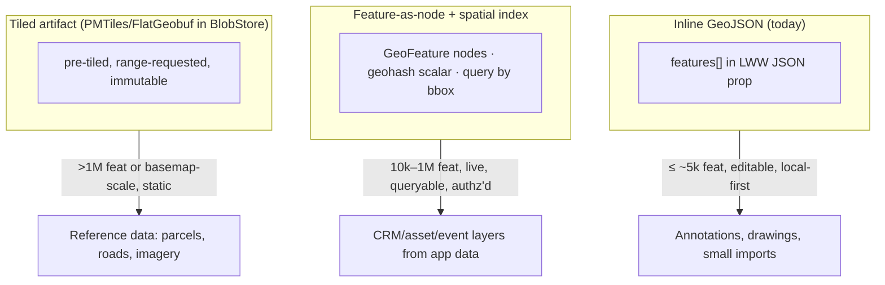
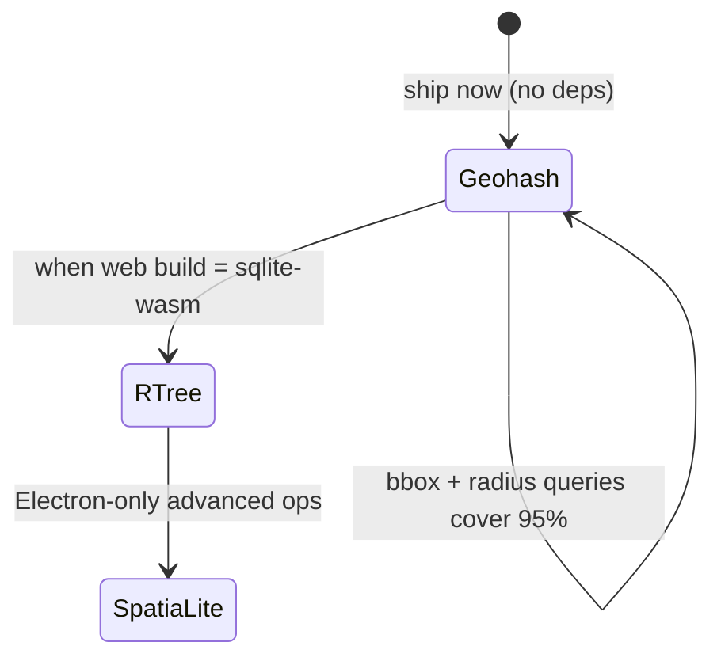
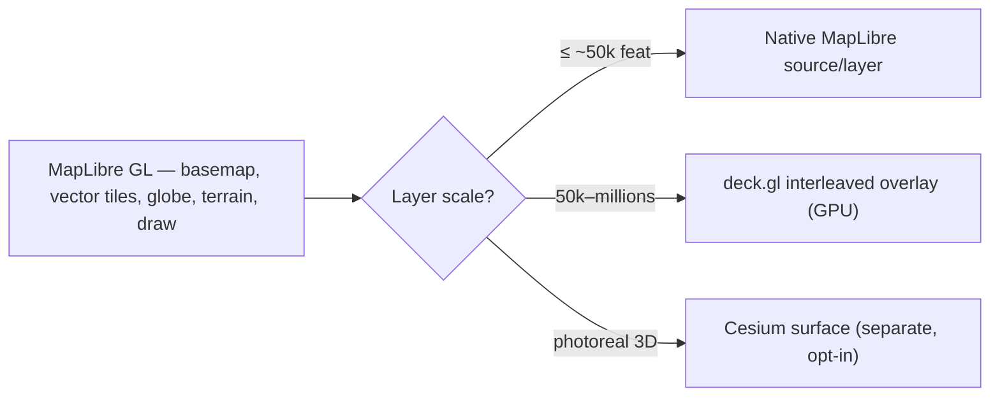
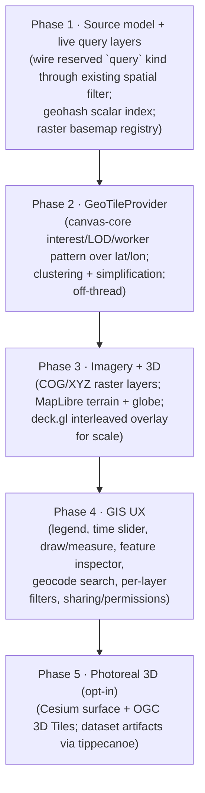
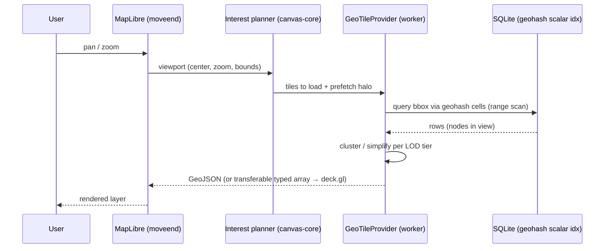
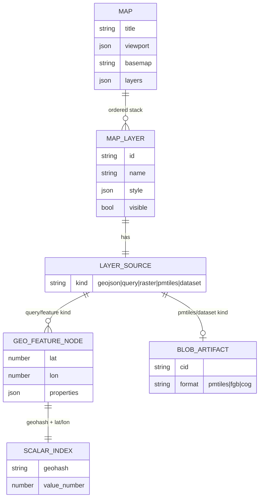

# Google-Earth-Class GIS Mapping: LOD Tiles, A SQLite Spatial Index, And A Layered Map API/UX

## Problem Statement

xNet already ships a small but real mapping surface — `@xnetjs/maps`
(exploration 0187): a MapLibre GL renderer over an open Protomaps/PMTiles
basemap, with a layer panel and inline GeoJSON/CSV layers persisted on a
`Map` node. It is a *viewer*, not a *GIS*. Today a layer is a blob of
GeoJSON stored inside a JSON property; there is no tiling, no spatial index,
no live-data binding, no imagery, no 3D, and the UX is a basemap picker plus
a flat layer list.

The ask: **what would it take to get a really good GIS mapping system going**
— "Google Earth with layers", SQLite-indexed mapping data, level-of-detail
(LOD) tiles, and a genuinely nice mapping API and UI/UX. This document maps
the gap between what exists and that ambition, mines the considerable prior
art *already in this repo* (a full canvas LOD/tiling engine, a generic
spatial query filter, content-addressed blob storage), surveys the external
state of the art (PMTiles, tippecanoe/planetiler, FlatGeobuf/GeoParquet/COG,
deck.gl, Cesium/3D Tiles, geohash/H3/R\*Tree indexing), and recommends a
phased path that reuses xNet's own machinery instead of bolting on a parallel
stack.

## Executive Summary

- **We are not starting from zero — on two fronts.** `@xnetjs/maps` gives us
  the renderer and the persisted `Map` schema, and the schema *already
  reserves* the two source kinds we need (`dataset`, `query`). Separately,
  `@xnetjs/canvas-core` is a complete, tested, worker-offloaded **LOD + tile
  + interest-management engine** for an infinite canvas, and
  `@xnetjs/data` already defines **generic spatial query filters**
  (`NodeQuerySpatialWindow`/`Radius`, `matchesSpatialFilter`,
  `spatialIndexKey`) that the data-bridge already routes to the hub. A
  Google-Earth-class map is largely the act of pointing this existing
  machinery at lat/lon instead of arbitrary world coordinates.

- **The real bottleneck is the data model, not the renderer.** Inline GeoJSON
  in an LWW JSON property tops out at a few thousand features (whole-list
  last-writer-wins means every edit reserializes the entire layer). To go to
  "Google Earth", features must become **nodes** (or tiled artifacts) with a
  **spatial index**, queried by viewport, and **materialized to GeoJSON
  on-demand per tile**.

- **SQLite indexing is achievable today without new native deps.** The web
  build is `sql.js` (no R\*Tree, no FTS5), but the existing
  `node_property_scalars` table already B-tree-indexes numeric/text
  properties. A **geohash / H3 string column + lat/lon numeric columns**
  turns "features in this bbox" into an indexed range scan that works on
  `sql.js` *now*, and upgrades cleanly to the R\*Tree virtual table once the
  app moves to the official `@sqlite.org/sqlite-wasm` build (which ships
  R\*Tree).

- **Recommended renderer stack: MapLibre GL as the spine** (we already have
  it; it now does globe + 3D terrain + building extrusion), **deck.gl as an
  optional interleaved GPU overlay** for million-feature layers, and a
  **deferred Cesium/OGC-3D-Tiles surface** for true photorealistic 3D. Don't
  rip out MapLibre.

- **Recommended path:** a phased plan — (1) a real **layer-source model** +
  live **query layers** wired through the existing spatial filter; (2) a
  **`GeoTileProvider`** modeled directly on `canvas-core`'s interest/LOD/
  worker pattern, backed by the geohash scalar index; (3) **imagery + 3D**
  (raster/COG basemaps, MapLibre terrain & globe, deck.gl overlay); (4) a
  proper **GIS UX** (legend, time slider, draw/measure, feature inspector,
  geocode search, per-layer filters, sharing); (5) optional **Cesium 3D
  globe** surface. Each phase ships standalone value.

## Current State In The Repository

### The map surface that exists today (exploration 0187)

`@xnetjs/maps` is a clean, tested package:

- [`packages/maps/src/MapCanvas.tsx`](packages/maps/src/MapCanvas.tsx) — the
  React renderer. `maplibre-gl` and `pmtiles` are **dynamically imported** so
  the ~200 KB WebGL bundle never touches first paint. It creates the map,
  registers the `pmtiles://` protocol once, wires `moveend` →
  `onViewportChange`, and `click` → feature popup. Data layers are synced by
  *clearing and re-adding* every `xnet-`-prefixed source/layer on each change.
- [`packages/maps/src/style.ts`](packages/maps/src/style.ts) — pure,
  dependency-free MapLibre **style construction**: basemap styles
  (`buildBasemapStyle` reads the Protomaps v4 vector schema —
  `earth`/`water`/`roads`/`buildings`/`boundaries`), and `buildDataLayers`
  maps a layer's geometry (`point`/`line`/`fill`/`heatmap`) to paint layers.
  All unit-tested without a WebGL context.
- [`packages/maps/src/layers.ts`](packages/maps/src/layers.ts) — immutable
  layer-list editing (`createGeoJsonLayer`, `moveLayer`,
  `toggleLayerVisible`, `updateLayerStyle`, …).
- [`packages/maps/src/geojson.ts`](packages/maps/src/geojson.ts) — GeoJSON/CSV
  ingestion, geometry inference, bounds.
- [`packages/maps/src/basemap-registry.ts`](packages/maps/src/basemap-registry.ts)
  — a **pluggable basemap registry** (extension seam from 0205): basemaps can
  be registered/resolved by id, which is exactly where satellite/terrain/
  custom-raster basemaps slot in.
- [`packages/maps/src/LayerPanel.tsx`](packages/maps/src/LayerPanel.tsx) — the
  current layer UI (visibility toggle, reorder, style).

It is wired into the app:

- [`apps/web/src/routes/map.$mapId.tsx`](apps/web/src/routes/map.$mapId.tsx)
  → [`apps/web/src/components/MapView.tsx`](apps/web/src/components/MapView.tsx)
  → mounted via `HOSTED_VIEWS` in
  [`apps/web/src/workbench/ViewHost.tsx`](apps/web/src/workbench/ViewHost.tsx).
  (Gap noted by exploration: Map is not yet in the dashboard's
  `NODE_OPEN_TARGETS` matcher in
  [`apps/web/src/components/DashboardView.tsx`](apps/web/src/components/DashboardView.tsx),
  so clicking a Map node from a dashboard doesn't route to the map.)

### The persisted contract

[`packages/data/src/schema/schemas/map.ts`](packages/data/src/schema/schemas/map.ts)
defines `MapSchema` and — crucially — the **forward-looking source union**:

```ts
export type MapLayerSource =
  | { kind: 'geojson'; data: GeoFeatureCollection }              // implemented
  | { kind: 'dataset'; datasetId: string }                       // RESERVED
  | { kind: 'query'; schemaId: string; geoProperty?: string;     // RESERVED
      latProperty?: string; lonProperty?: string }
```

`viewport`, `layers[]`, and `basemap` persist as whole-value LWW JSON
(same pattern as Dashboard's `widgets`). The two reserved kinds are the
explicit seams for "live database query layers" and "tiered bulk dataset
artifacts" — the heart of this exploration.

### The hidden asset: a complete LOD/tile engine in `canvas-core`

This is the most important finding. `@xnetjs/canvas-core` is a production
infinite-canvas engine whose entire job is *rendering more objects than fit in
the DOM by tiling space and choosing a level of detail per object*. Every
piece has a geospatial analogue:

| `canvas-core` file | What it does | Geospatial analogue |
|---|---|---|
| [`lod.ts`](packages/canvas-core/src/lod.ts) | `chooseObjectLod()` → `live-dom` → `shell-dom` → `thumbnail` → `vector-tile` → `raster-tile`, by screen area + budget | Feature LOD: full geometry → simplified → clustered → heatmap dot |
| [`interest.ts`](packages/canvas-core/src/interest.ts) | Viewport → visible + prefetch **tile coverage** with halo, velocity-aware | Which map tiles to load/prefetch on pan/zoom |
| [`tiles.ts`](packages/canvas-core/src/tiles.ts) | `z/x/y` tile addressing, `getTileCoverageForRect`, `listTileAddresses` | Slippy-map tile math (already z/x/y!) |
| [`camera.ts`](packages/canvas-core/src/camera.ts) | anchor-tile camera, screen↔world, viewport bounds in tile coords | Map camera (we read center/zoom from MapLibre instead) |
| [`workers.ts`](packages/canvas-core/src/workers.ts) | transferable binary tile-summary protocol | Off-thread feature tiling |
| [`summary.ts`](packages/canvas-core/src/summary.ts) | `createCanvasTileSummaries()` clusters objects per tile + minimap | Server/worker-side feature clustering per tile |
| [`provider.ts`](packages/canvas-core/src/provider.ts) | `CanvasSceneProvider.subscribeViewport(interest, onSnapshot)` → snapshot split by LOD tier | **`GeoTileProvider`** — the exact interface we want |

A map's `GeoTileProvider` is essentially `CanvasSceneProvider` with lng/lat
tiles. We should generalize, not duplicate.

### The hidden asset: generic spatial query already exists

[`packages/data/src/store/query.ts`](packages/data/src/store/query.ts) defines
a full spatial filter vocabulary used today by the canvas:

```ts
export type NodeQuerySpatialWindow = { kind: 'window'; rect: …; fields: {x,y,width,height}; overscan? }
export type NodeQuerySpatialRadius = { kind: 'radius'; center: …; radius: number; fields: {x,y} }
export type NodeQuerySpatialFilter = NodeQuerySpatialWindow | NodeQuerySpatialRadius
```

with `matchesSpatialFilter(descriptor, node)` reading **numeric properties by
name** (`spatial.fields.x` / `.y`) — i.e. it is already coordinate-agnostic. A
geo query layer is `fields: { x: lonProperty, y: latProperty }`. There is even
a `spatialIndexKey` on the descriptor. The data-bridge already routes spatial
queries to the hub:
[`packages/data-bridge/src/remote-query-execution.ts`](packages/data-bridge/src/remote-query-execution.ts)
has `spatialToRemote: true` and an `auto-spatial` routing reason.

### SQLite: what we can index with, today and tomorrow

[`packages/sqlite`](packages/sqlite/package.json) ships **three backends**:
`sql.js` (web/OPFS — pure-wasm, **no FTS5, no R\*Tree**), the official
`@sqlite.org/sqlite-wasm` (optional peer — **does** ship R\*Tree + FTS5),
and `better-sqlite3` (Electron — extension-capable, could load SpatiaLite).
The web path runs off-thread via
[`adapters/web-proxy.ts`](packages/sqlite/src/adapters/web-proxy.ts) (Comlink).

The schema
([`packages/sqlite/src/schema.ts`](packages/sqlite/src/schema.ts)) stores
node properties as BLOBs in `node_properties`, **but** maintains an indexed
`node_property_scalars(schema_id, property_key, value_text, value_number,
value_boolean, node_id)` projection with B-tree indexes on
`(schema_id, property_key, value_number, node_id)` etc. **This is the spatial
index seam.** A geohash string in `value_text` (or quantized lat/lon in
`value_number`) is a range-scannable spatial index with zero new dependencies
and zero schema migration — it's just two more indexed scalar properties on a
`GeoFeature` node. No SpatiaLite, no R\*Tree required to start. FTS5 lives in
[`fts.ts`](packages/sqlite/src/fts.ts), gated by capability — the same
capability-gating pattern applies to R\*Tree when we adopt sqlite-wasm.

### Other relevant assets

- **Blob storage** —
  [`packages/storage/src/blob-store.ts`](packages/storage/src/blob-store.ts):
  content-addressed (CID) `put`/`get` with chunking. This is where a
  self-hosted `.pmtiles`, a COG, or a FlatGeobuf artifact lives — the backing
  store for the reserved `dataset` source kind.
- **Charts** — [`packages/charts`](packages/charts/package.json) wraps ECharts
  (choropleth side-panels, "value by region").
- **Unreal** — [`packages/unreal`](packages/unreal/package.json) is a UE6 game
  connector, not directly GIS (but a future 3D/world consumer).
- **Seed** —
  [`packages/devtools/src/seed/seeders/viz.ts`](packages/devtools/src/seed/seeders/viz.ts)
  already seeds an "Office Locations" Map with a Point layer (`mapId('offices')`),
  so there's a fixture to grow.

## External Research

### Tiles & delivery: the cloud-native geospatial stack

- **PMTiles** — a single-file tile archive (vector or raster) read directly by
  the browser over **HTTP range requests**; no tile server, just static
  hosting + CDN. We already depend on `pmtiles@4` and use the Protomaps demo
  basemap. This is the "COG for tiles" model and the right default for any
  bounded, mostly-static layer. ([guide.cloudnativegeo.org](https://guide.cloudnativegeo.org/pmtiles/intro.html),
  [Simon Willison](https://til.simonwillison.net/gis/pmtiles))
- **Tile generation: tippecanoe / planetiler** — `tippecanoe` (now
  Felt-maintained) builds vector tilesets from large GeoJSON/FlatGeobuf/
  GeoParquet, generating **smart per-zoom overviews** and adaptively dropping/
  simplifying features to keep tiles small — i.e. it *is* an LOD generator.
  `planetiler` builds whole-planet basemaps fast.
  ([felt/tippecanoe](https://github.com/felt/tippecanoe))
- **Cloud-native source formats** — **FlatGeobuf** (streamable vector with a
  built-in packed Hilbert R-tree, range-request friendly), **GeoParquet**
  (columnar analytics), **COG** (Cloud-Optimized GeoTIFF for imagery). PMTiles
  is positioned as a *complement* to these for the visualization tier.
  ([Where is COG for Vector?](https://cloudnativegeo.org/blog/2023/10/where-is-cog-for-vector/))

### Spatial indexing in (and around) SQLite

- **SpatiaLite** — full OGC Simple Features on SQLite, R\*Tree-backed. Native;
  great on Electron via `better-sqlite3`, **not** browser-friendly.
  ([SpatiaLite](https://en.wikipedia.org/wiki/SpatiaLite))
- **SQLite R\*Tree module** — multi-dimensional bbox index, answers
  containment/overlap/nearest-neighbor. Compiled in via `SQLITE_ENABLE_RTREE`;
  **the official `sqlite-wasm` builds include it** (the ~1.5 MB async wasm
  bundle ships R-tree + JSON + FTS5). Not in `sql.js`.
  ([sqlite.org/rtree](https://www.sqlite.org/rtree.html))
- **Grid indexes without any extension — geohash / S2 / H3** — encode a
  point's cell as a **string with a plain B-tree index**; "everything in a
  cell" becomes a `LIKE 'prefix%'` / range scan; "bbox" becomes a small set of
  covering cells scanned as integer/string ranges. S2's `RegionCoverer` covers
  a viewport with far fewer cells than uniform geohash. **This is the only
  option that works on `sql.js` today** and maps perfectly onto
  `node_property_scalars`. ([Geospatial indexing explained](https://benfeifke.com/posts/geospatial-indexing-explained/),
  [Uber H3](https://github.com/uber/h3))

### Renderers: 2D, GPU-overlay, and true 3D

- **MapLibre GL JS** — our renderer. Now supports a **full globe
  projection**, **3D terrain** (raster-DEM hillshade + elevation), and
  building **extrusions**, all open / key-less.
  ([3D Terrain example](https://maplibre.org/maplibre-gl-js/docs/examples/3d-terrain/))
- **deck.gl** — WebGL2/WebGPU framework for **millions of points** with GPU
  filtering; **interleaves** into MapLibre's GL context (`MapboxOverlay`,
  `interleaved: true`, requires maplibre ≥ 3 / WebGL2) so deck layers sit
  correctly among MapLibre layers and in 3D. The standard "big-data overlay"
  answer. ([deck.gl + MapLibre](https://deck.gl/docs/developer-guide/base-maps/using-with-maplibre))
- **CesiumJS + OGC 3D Tiles** — purpose-built 3D globe; streams
  **Google Photorealistic 3D Tiles** (glTF, an OGC 3D Tiles standard) — the
  literal "do-it-yourself Google Earth". Heavyweight; a separate surface, not a
  MapLibre replacement. ([Cesium photorealistic 3D Tiles](https://cesium.com/learn/cesiumjs-learn/cesiumjs-photorealistic-3d-tiles/))

**Takeaway:** keep MapLibre as the spine, add deck.gl as an optional overlay
for scale, and treat Cesium/3D-Tiles as an opt-in premium surface — not a
rewrite.

## Key Findings

1. **The schema already anticipates this.** `MapLayerSource`'s `dataset` and
   `query` kinds are the exact extension points; we're filling in reserved
   seams, not redesigning.
2. **The hardest part is already built — twice.** Viewport→tile→LOD→worker is
   `canvas-core`; spatial filtering + remote routing is `data/store/query.ts`
   + `data-bridge`. The map work is *adaptation*, not *invention*.
3. **Inline GeoJSON-in-a-property is the scaling wall.** Whole-list LWW means a
   100k-feature layer reserializes on every edit and bloats the CRDT. Features
   must become indexable rows/nodes or out-of-band tiled artifacts.
4. **We can have a SQLite spatial index this week** via a geohash scalar on
   `node_property_scalars` — no new deps — and upgrade to R\*Tree when we move
   the web build to `@sqlite.org/sqlite-wasm`.
5. **Renderer is a solved-enough problem.** MapLibre covers 2D + globe +
   terrain; deck.gl covers scale; Cesium covers photoreal 3D. The decision is
   *composition*, not *selection*.
6. **There is no tile-generation pipeline yet.** "Google Earth" implies
   pre-tiled overviews; tippecanoe/planetiler (server-side) or an in-worker
   tiler (client-side) is net-new.

## Options And Tradeoffs

### A. Layer data model — where do features live?



| Model | Scale | Editable | Live/authz | New deps | Verdict |
|---|---|---|---|---|---|
| Inline GeoJSON | ~5k | ✅ | n/a | none | Keep for drawings/small imports |
| Feature-as-node + geohash | 10k–~1M | ✅ | ✅ (node authz) | none | **Primary path** — reuses store + scalars |
| Tiled artifact (PMTiles/FGB) | unbounded | ❌ (rebuild) | coarse | tiler | For reference/basemap-scale data |

**Recommendation:** support all three behind the one `MapLayerSource` union;
make **feature-as-node + spatial index** the headline new capability (it
unlocks "map any database by lat/lon", which is the differentiator), keep
inline GeoJSON for sketches, add tiled artifacts for bulk.

### B. SQLite spatial index — what kind?

| Option | Works on `sql.js` (web today) | Query power | Migration cost | Verdict |
|---|---|---|---|---|
| **Geohash/H3 scalar on `node_property_scalars`** | ✅ | bbox + radius (good enough) | none | **Start here** |
| **R\*Tree virtual table** | ❌ (needs sqlite-wasm) | true bbox/NN, fast | adopt sqlite-wasm build | **Upgrade target** |
| **SpatiaLite (full OGC)** | ❌ (Electron only) | full OGC ops | native loader | Electron-only power user |



**Recommendation:** geohash (or H3 at a fixed resolution) scalar now; design
the query layer so the index is an internal detail (`spatialIndexKey`) and
swapping to R\*Tree later doesn't touch callers.

### C. Renderer composition



| Renderer | Strength | Cost | When |
|---|---|---|---|
| MapLibre GL (have it) | 2D, vector tiles, globe, terrain, key-less | ~200 KB lazy | Default for everything |
| deck.gl overlay | millions of pts, GPU filter, interleaved | ~?? KB lazy | Big live layers |
| Cesium/3D Tiles | true 3D globe, photoreal | heavy, API-keyed data | Premium opt-in surface |

**Recommendation:** MapLibre spine + lazy deck.gl overlay; defer Cesium to a
clearly-scoped Phase 5 (and only behind a feature flag — it's a second renderer
and a licensing/key story).

### D. Tile generation — server vs client

- **Server-side (tippecanoe/planetiler in the hub or a job):** correct
  overviews, handles planet-scale, but net-new infra and a build step.
- **Client/worker-side tiler (mirror `canvas-core/summary.ts`):** generate
  per-tile feature buckets + clusters in a Web Worker on the fly from the
  spatial index; zero infra, bounded to what fits the local DB; reuses our LOD
  code.

**Recommendation:** **client/worker-side first** (it's the canvas-core pattern
and needs no new services), with a server-side tippecanoe path reserved for the
`dataset` artifact kind when someone imports a parcel/road dataset too big for
the local DB.

## Recommendation

Build a **layered geospatial platform on the renderer we already have**, in
five phases, each independently shippable:



### Why this path

- **Maximum reuse, minimum new surface area.** Phase 1–2 are almost entirely
  *adaptation* of `canvas-core` + `data/store/query.ts` + `node_property_scalars`.
  No new renderer, no new database engine, no new service.
- **The differentiator ships first.** "Open any of your databases as a map
  layer, filtered and permissioned" (Phase 1) is the thing a generic GIS
  *can't* do — it's xNet-native. Imagery and 3D (commodity) come later.
- **Each phase de-risks the next.** Phase 1 proves the source model; Phase 2
  proves scale; only then do we spend bundle budget on deck.gl/Cesium.

### The API shape

A clean, composable layer/source model is the keystone. Extend
`MapLayerSource`, add a `GeoTileProvider` interface (the `CanvasSceneProvider`
analogue), and expose both a **declarative** layer list (persisted) and an
**imperative** map handle for plugins/automation.

## Example Code

### 1. Extend the layer-source union (`packages/data/src/schema/schemas/map.ts`)

```ts
export type MapLayerSource =
  | { kind: 'geojson'; data: GeoFeatureCollection }
  // Live query over app nodes, materialized to features per tile (NEW):
  | {
      kind: 'query'
      schemaId: string
      latProperty: string
      lonProperty: string
      filter?: NodeQueryFilter        // reuse existing query filters
      tooltip?: string[]              // property keys for the inspector
    }
  // Raster/imagery basemap or overlay (NEW):
  | { kind: 'raster'; tileUrl: string; tileSize?: 256 | 512; attribution?: string }
  // Self-hosted vector tiles in BlobStore (NEW):
  | { kind: 'pmtiles'; artifactCid: string; sourceLayer: string }
  // Bulk dataset artifact (FlatGeobuf/COG) in BlobStore:
  | { kind: 'dataset'; datasetId: string }
```

### 2. The `GeoTileProvider` — generalized from `CanvasSceneProvider`

```ts
// packages/maps/src/provider.ts
import type { TileAddress } from '@xnetjs/canvas-core' // reuse z/x/y math

export interface GeoInterest {
  /** Visible tiles + a velocity-aware prefetch halo (interest.ts pattern). */
  tiles: TileAddress[]
  zoom: number
  bounds: { west: number; south: number; east: number; north: number }
}

export interface GeoFeatureLod {
  full: GeoFeatureCollection      // live-dom equivalent: real geometry
  clustered: GeoFeatureCollection // thumbnail equivalent: count bubbles
  heatmap: GeoFeatureCollection   // vector-tile equivalent: density dots
}

export interface GeoTileProvider {
  /** Subscribe a layer to viewport changes; emits per-LOD feature sets. */
  subscribeViewport(
    interest: GeoInterest,
    onSnapshot: (snapshot: GeoFeatureLod) => void
  ): () => void
}
```

### 3. A live query layer backed by the existing spatial filter + geohash index

```ts
// packages/maps/src/query-layer.ts
import { geohashCellsForBounds } from './geohash'

/** Materialize a `query` source into GeoJSON for the current viewport. */
export async function materializeQueryLayer(
  store: NodeStore,
  src: Extract<MapLayerSource, { kind: 'query' }>,
  interest: GeoInterest
): Promise<GeoFeatureCollection> {
  const result = await store.query({
    schemaId: src.schemaId,
    filter: src.filter,
    // Reuse the EXISTING spatial filter — fields are just lon/lat properties:
    spatial: {
      kind: 'window',
      rect: bboxToRect(interest.bounds),
      fields: { x: src.lonProperty, y: src.latProperty, width: 'w', height: 'h' }
    },
    // Hint the planner at the geohash scalar index (sql.js-friendly):
    spatialIndexKey: 'geohash',
  })
  return {
    type: 'FeatureCollection',
    features: result.nodes.map((n) => ({
      type: 'Feature',
      geometry: {
        type: 'Point',
        coordinates: [num(n, src.lonProperty), num(n, src.latProperty)],
      },
      properties: pickTooltip(n, src.tooltip),
      id: n.id,
    })),
  }
}
```

The geohash column is just two more indexed scalar properties when a
`GeoFeature`/geo-tagged node is written — no schema migration, works on `sql.js`:

```ts
// On write, derive an indexed cell from lat/lon (B-tree range scans for bbox).
scalars.set('geohash', geohashEncode(lat, lon, /*precision*/ 8)) // value_text
scalars.set(latProperty, lat)  // value_number
scalars.set(lonProperty, lon)  // value_number
```

### 4. deck.gl interleaved overlay for million-feature layers (Phase 3)

```ts
// packages/maps/src/deck-overlay.ts — lazy-loaded, only when a layer is "big"
const { MapboxOverlay } = await import('@deck.gl/mapbox')
const { ScatterplotLayer } = await import('@deck.gl/layers')
map.addControl(
  new MapboxOverlay({
    interleaved: true, // share MapLibre's WebGL2 context (maplibre ≥ 3)
    layers: [
      new ScatterplotLayer({
        id: `deck-${layer.id}`,
        data: src.tileUrl,           // or a typed-array of positions
        getPosition: (d) => d.position,
        radiusMinPixels: 2,
        getFillColor: colorForFeature,
      }),
    ],
  })
)
```

### Pan/zoom → tiled spatial query → render (sequence)



### Source/index data model (ER)



## Risks And Open Questions

- **Bundle budget.** MapLibre is already lazy (~200 KB). deck.gl and Cesium are
  large; both must be **dynamically imported only when a layer needs them**, and
  Cesium probably gated behind a flag/plan. Watch the prod vite web build (the
  0211 lesson: native deps like `usearch` broke the browser build and were only
  caught by the typecheck job).
- **CRDT cost of large layers.** Whole-list LWW on `layers` is fine for the
  *layer definitions* but **must not** hold feature arrays at scale — features
  belong in nodes/artifacts. Decide the cutover threshold and enforce it.
- **OPFS eviction (cold start).** The 0204/0229 boot-stall work shows OPFS is
  evictable and SQLite boot is on the critical path. A map that depends on a
  large local spatial index needs the same prewarm/restore-from-hub treatment;
  don't add a second multi-second stall.
- **`sql.js` → `sqlite-wasm` migration.** Geohash buys time, but R\*Tree
  (and true nearest-neighbor / polygon ops) needs the official wasm build.
  That migration has its own risk surface (size, OPFS VFS, worker) — sequence
  it deliberately.
- **Projection.** Web Mercator (MapLibre default) vs globe vs the equiremainder
  for analysis. Globe changes tile math and label placement; validate the
  interest/tile code against globe mode.
- **Authz on features.** A "query layer" must respect per-node authorization
  (0179/0181 space cascade) — features the viewer can't see must not leak into
  tiles. The spatial query must run *through* the authz'd store, not around it.
- **Tile generation ownership.** Client-worker tiling is bounded by the local
  DB; planet-scale reference data needs a server tippecanoe/planetiler step —
  who runs it, where do artifacts live, how are they versioned?
- **Imagery licensing / keys.** Open basemaps (Protomaps) are key-less;
  satellite imagery, Google Photorealistic 3D Tiles, and most geocoders need
  API keys and have ToS — a managed-key story (cf. the 0208 managed-AI
  forwarder pattern) rather than shipping keys client-side.
- **Geocoding/search.** "Nice UX" implies place search; pick an open
  (Nominatim/Pelias) vs managed provider and route via the hub.

## Implementation Checklist

### Phase 1 — Source model + live query layers
- [x] Extend `MapLayerSource` in `packages/data/src/schema/schemas/map.ts` with
      `query` (lat/lon + filter + tooltip), `raster`, and `pmtiles` kinds;
      bump the persisted-shape tests.
- [ ] Add a `geohash` (or H3) derivation + two indexed scalar properties when a
      geo-tagged node is written; expose a `spatialIndexKey: 'geohash'` planner
      hint in `packages/data/src/store/query.ts`.
- [ ] Implement `geohashEncode` / `geohashCellsForBounds` (pure, unit-tested) in
      `packages/maps`.
- [ ] Implement `materializeQueryLayer()` reusing `NodeQuerySpatialWindow` +
      `matchesSpatialFilter`; respect node authz via the store.
- [ ] Render `query` and `raster` sources in `MapCanvas.tsx` (raster source +
      `setData` for query layers on `moveend`).
- [ ] Register `/Map` in `NODE_OPEN_TARGETS` (`DashboardView.tsx`) so map nodes
      route from dashboards.
- [ ] Extend the basemap registry with a satellite/raster preset.

### Phase 2 — GeoTileProvider (LOD + worker)
- [ ] Define `GeoTileProvider` + `GeoInterest` + `GeoFeatureLod` in
      `packages/maps/src/provider.ts`, reusing `canvas-core` tile math.
- [ ] Port the interest/halo/velocity-prefetch logic from
      `canvas-core/src/interest.ts` to lng/lat tiles.
- [ ] Implement per-tile clustering + simplification (mirror
      `canvas-core/src/summary.ts`) in a Web Worker (mirror `workers.ts`
      transferable protocol).
- [ ] Wire `MapView` to subscribe the provider on `moveend` and feed snapshots
      (GeoJSON or transferable typed arrays) to the renderer.
- [ ] Benchmark 100k / 1M synthetic features (mirror `canvas-core` benchmarks).

### Phase 3 — Imagery + 3D
- [ ] Raster/COG layer support + XYZ raster basemaps in the registry.
- [ ] Enable MapLibre **globe** + **3D terrain** (raster-DEM) behind a viewport
      toggle; validate tile/interest math under globe projection.
- [ ] Lazy deck.gl interleaved overlay (`@deck.gl/mapbox`) auto-selected when a
      layer exceeds a feature threshold.
- [ ] Self-hosted `.pmtiles` artifacts in `BlobStore`, served by the hub via
      range requests; `pmtiles` source kind reads from a CID.

### Phase 4 — GIS UX
- [ ] Legend + per-layer opacity/filter/style editor (extend `LayerPanel`).
- [ ] Feature inspector pane (selected feature → properties, with deep-link to
      the underlying node for `query` layers).
- [ ] Draw + measure tools (point/line/polygon, distance/area) writing to an
      inline-GeoJSON annotation layer.
- [ ] Time slider for temporal layers (filter features by a time property).
- [ ] Geocode/search box routed through the hub (managed key).
- [ ] Share/permissions: layer visibility honors space-cascade authz; shareable
      map view state (viewport + active layers) in the URL.

### Phase 5 — Photoreal 3D (opt-in)
- [ ] Cesium surface (separate route/view), feature-flagged, with OGC 3D Tiles /
      Google Photorealistic 3D Tiles via a managed key.
- [ ] Server-side tippecanoe/planetiler pipeline for `dataset` artifacts too
      large for the local DB; artifact versioning.

### Cross-cutting
- [ ] Seed: grow `viz.ts` with a `query`-layer map and a raster map.
- [ ] No publishable-package changeset needed for docs; `@xnetjs/maps`/`data`
      changes need a changeset (`/changeset`) per CLAUDE.md.

## Validation Checklist

- [ ] A `query` layer over a seeded database (e.g. CRM accounts with lat/lon)
      renders points, re-queries on pan/zoom, and shows correct tooltips.
- [ ] Spatial queries hit the geohash scalar index (verified via the DevTools
      Data panel plan inspector / `EXPLAIN QUERY PLAN`), not a full scan.
- [ ] A 100k-feature synthetic layer pans/zooms at ≥ 50 fps with worker-side
      clustering; a 1M-feature layer is usable via the deck.gl overlay.
- [ ] Features the current identity cannot see (per space-cascade authz) never
      appear in any tile/snapshot (authz leak test).
- [ ] Cold-start: opening a map with a large local index does not regress the
      boot watchdog (0229) — measured against the boot timeline instrument.
- [ ] MapLibre **globe** + **terrain** render correctly and the interest/tile
      math produces no missing/duplicated tiles at the antimeridian/poles.
- [ ] Raster (COG/XYZ) and self-hosted `.pmtiles` (range-requested from
      BlobStore) layers display with correct attribution.
- [ ] Bundle: maplibre/deck.gl/cesium are absent from the initial chunk
      (verified in the prod vite build) and load only when a map/large-layer/3D
      surface is opened.
- [ ] `pnpm --filter @xnetjs/maps test` and `typecheck` green; web build green;
      seed-render/seed-coverage tests pass.

## References

### In-repo
- `packages/maps/` — current map surface (0187): `MapCanvas.tsx`, `style.ts`,
  `layers.ts`, `geojson.ts`, `basemap-registry.ts`, `LayerPanel.tsx`.
- `packages/data/src/schema/schemas/map.ts` — `MapSchema` + `MapLayerSource`.
- `packages/data/src/store/query.ts` — `NodeQuerySpatial*`, `matchesSpatialFilter`,
  `spatialIndexKey`.
- `packages/data-bridge/src/remote-query-execution.ts` — `spatialToRemote`.
- `packages/canvas-core/src/` — `lod.ts`, `interest.ts`, `tiles.ts`, `camera.ts`,
  `workers.ts`, `summary.ts`, `provider.ts` (the LOD/tile engine to generalize).
- `packages/sqlite/src/schema.ts` — `node_property_scalars` (the index seam);
  `fts.ts` (capability-gating pattern); `adapters/web-proxy.ts`.
- `packages/storage/src/blob-store.ts` — content-addressed artifact storage.
- `apps/web/src/components/MapView.tsx`, `routes/map.$mapId.tsx`,
  `workbench/ViewHost.tsx`, `components/DashboardView.tsx` (`NODE_OPEN_TARGETS`).
- `packages/devtools/src/seed/seeders/viz.ts` — Map seeder.
- Related explorations: 0187 (maps), 0204/0228/0229 (SQLite boot/perf),
  0211 (vector/native-dep build pitfalls), 0179/0181 (space-cascade authz).

### External
- PMTiles — [guide.cloudnativegeo.org](https://guide.cloudnativegeo.org/pmtiles/intro.html),
  [Simon Willison's TIL](https://til.simonwillison.net/gis/pmtiles)
- tippecanoe — [github.com/felt/tippecanoe](https://github.com/felt/tippecanoe)
- Cloud-native vector (FlatGeobuf/GeoParquet/COG) —
  [cloudnativegeo.org: Where is COG for Vector?](https://cloudnativegeo.org/blog/2023/10/where-is-cog-for-vector/)
- SQLite R\*Tree — [sqlite.org/rtree.html](https://www.sqlite.org/rtree.html)
- SpatiaLite — [en.wikipedia.org/wiki/SpatiaLite](https://en.wikipedia.org/wiki/SpatiaLite)
- Geohash/S2/H3 indexing —
  [benfeifke.com](https://benfeifke.com/posts/geospatial-indexing-explained/),
  [Uber H3](https://github.com/uber/h3)
- MapLibre 3D terrain/globe —
  [maplibre.org 3D terrain](https://maplibre.org/maplibre-gl-js/docs/examples/3d-terrain/)
- deck.gl + MapLibre —
  [deck.gl docs](https://deck.gl/docs/developer-guide/base-maps/using-with-maplibre)
- Cesium + Google Photorealistic 3D Tiles —
  [cesium.com](https://cesium.com/learn/cesiumjs-learn/cesiumjs-photorealistic-3d-tiles/)
