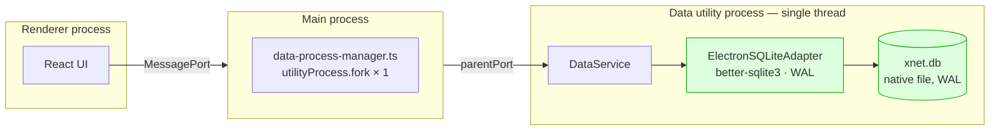
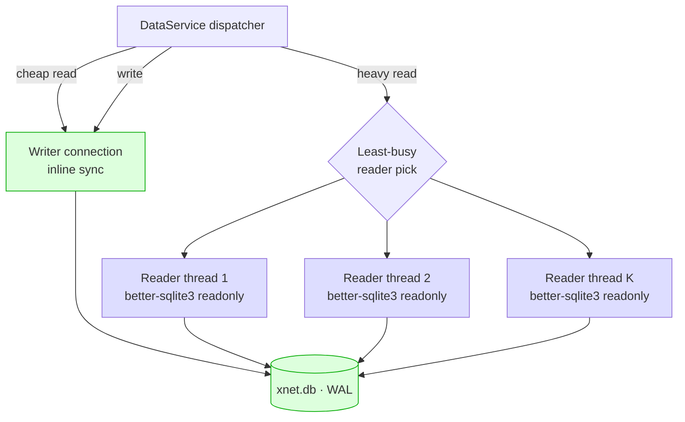
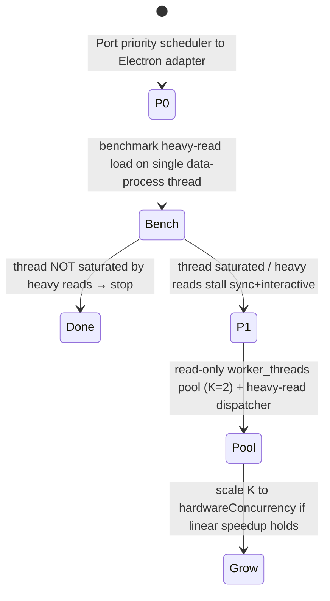

# Parallel SQLite Readers In Electron: WAL, Worker Threads, And Why The OPFS Wall Doesn't Apply

## Problem Statement

Exploration [0228](0228_[_]_PARALLEL_SQLITE_READS_WORKER_POOL_AND_DISPATCHER.md)
concluded that the **web** app cannot run multiple SQLite reader workers in
parallel: the `opfs-sahpool` VFS takes an **exclusive** `SyncAccessHandle` per
database file, so a second worker pointed at the same `.db` is locked out and
silently falls back to an in-memory database. The single Comlink-wrapped worker
is the only thing that can touch durable OPFS storage, and the Phase-1 fix was a
priority *scheduler* (ordering, not parallelism).

The natural follow-up — and the question this doc answers:

> *We found out reader workers can't really run in parallel in the **browser**.
> But Electron doesn't use OPFS — it uses native `better-sqlite3`. Could SQLite
> reader workers run in **parallel** there?*

The short answer is **yes, genuinely** — the hard browser constraint is absent —
but "yes" comes with a different bottleneck (better-sqlite3 is *synchronous* and
the whole data layer lives on one thread today) and a real cost/benefit question.

## Executive Summary

**The OPFS exclusivity wall does not exist in Electron.** The desktop build uses
`ElectronSQLiteAdapter` over `better-sqlite3`
([`packages/sqlite/src/adapters/electron.ts:40`](../../packages/sqlite/src/adapters/electron.ts)),
already running `PRAGMA journal_mode = WAL`
([`electron.ts:60`](../../packages/sqlite/src/adapters/electron.ts)). SQLite's WAL
mode is **explicitly designed** for *one writer + many concurrent readers*, and
native SQLite happily opens **multiple independent connections** to the same file
from multiple OS threads/processes. None of OPFS's `createSyncAccessHandle`
exclusivity applies — that was a browser File-System-Access constraint, not a
SQLite one.

**So why aren't reads parallel today?** Because the entire Electron data layer
runs in **one utility process, single-threaded**:

- The main process spawns exactly one data process via `utilityProcess.fork`
  ([`apps/electron/src/main/data-process-manager.ts:107`](../../apps/electron/src/main/data-process-manager.ts)).
- That process creates **one** `ElectronSQLiteAdapter`
  ([`apps/electron/src/data-process/data-service.ts:108`](../../apps/electron/src/data-process/data-service.ts)).
- `better-sqlite3` is **synchronous** — every `stmt.all()` blocks the data
  process's event loop until it returns
  ([`electron.ts:108`](../../packages/sqlite/src/adapters/electron.ts)). A heavy
  read (large scan, FTS, JSON extraction) head-of-line blocks *every* other read,
  *every* write, *and* the Y.Doc sync handling sharing that process — the same
  shape of stall as web [0227](0227_[_]_BOOT_STALL_SQLITE_WORKER_HEAD_OF_LINE_BLOCKING.md),
  just in a Node process instead of a Web Worker.

Note: there is **no scheduler** on the Electron path. The 0228 `WorkerScheduler`
is wired only into the web worker
([`web-worker.ts:55`](../../packages/sqlite/src/adapters/web-worker.ts)); the
Electron adapter runs SQL inline, synchronously, with no lane prioritisation.

**The Electron-specific opportunity:** spin up a small pool of **reader threads**
(Node `worker_threads`) inside the data process, each with its **own**
`better-sqlite3` connection opened **read-only** against the same WAL database
file, and route read queries to idle readers through a least-busy dispatcher. The
single existing connection stays the **writer**. This is *real* multi-core
parallelism — exactly what 0228 said the browser couldn't have — because native
WAL gives every reader connection a consistent snapshot without blocking the
writer.

**But measure first.** Most reads in this app are millisecond-scale, and the
worker boundary adds **structured-clone serialisation cost** to every result —
for small result sets, the IPC overhead can exceed the query time and make
parallelism a net loss. The win is concentrated in a few **heavy** read classes
(FTS over large corpora, analytics scans, dashboard fan-out, `count(*)` over
99k+ nodes). The right design is **asymmetric**: keep the synchronous inline path
for cheap reads, offload only *classified-heavy* reads to the reader pool.

**Recommendation:** Phase 0 — port the 0228 priority scheduler to the Electron
adapter (cheap, removes the in-process head-of-line stall regardless of
pooling). Phase 1 — add a **read-only `better-sqlite3` reader-thread pool** with a
heavy-read dispatcher, gated behind a benchmark proving heavy reads actually
saturate the single data-process thread. Reject "just open N connections on the
main data-process thread" — they'd still serialise on that one event loop.

## Current State In The Repository

### Electron runs one data process, one connection, synchronously



- **One utility process.** `data-process-manager.ts` holds a single
  `dataProcess: UtilityProcess | null`
  ([`data-process-manager.ts:65`](../../apps/electron/src/main/data-process-manager.ts))
  and forks it once
  ([`:107`](../../apps/electron/src/main/data-process-manager.ts)). The header
  comment in [`data-process/index.ts:15-21`](../../apps/electron/src/data-process/index.ts)
  documents the topology: `Renderer <-MessagePort-> Main <-parentPort-> Data
  Process`.
- **One adapter.** `data-service.ts` imports
  `createElectronSQLiteAdapter`
  ([`:27`](../../apps/electron/src/data-process/data-service.ts)) and creates a
  single instance with `{ walMode: true, foreignKeys: true, busyTimeout: 5000 }`
  ([`:108`](../../apps/electron/src/data-process/data-service.ts)).
- **Synchronous reads.** `ElectronSQLiteAdapter.query` calls
  `stmt.all(...params)` directly and returns
  ([`electron.ts:103-113`](../../packages/sqlite/src/adapters/electron.ts)) — no
  worker, no scheduler, no yielding. The async signature is cosmetic
  ([`electron.ts:5`](../../packages/sqlite/src/adapters/electron.ts) "*async
  interface is maintained for compatibility*").
- **WAL is already on.** `open()` runs `pragma('journal_mode = WAL')`,
  `synchronous = NORMAL`, `cache_size = -64000`, `temp_store = MEMORY`
  ([`electron.ts:59-76`](../../packages/sqlite/src/adapters/electron.ts)) — i.e.
  the database is *already* configured for concurrent readers; we just don't have
  any.

### No `worker_threads` anywhere in the data path

A repo-wide search finds **zero** uses of `node:worker_threads` in
`apps/electron/src` or `packages/sqlite/src`. The only concurrency primitive in
play is Electron's `utilityProcess`, used once. There is no connection pool, no
read replica, and no read/write connection split anywhere in the codebase.

### The browser constraint, restated — and why it's browser-only

0228's wall is a property of **OPFS**, not SQLite:

- [`web.ts`](../../packages/sqlite/src/adapters/web.ts) installs
  `opfs-sahpool`, which "*acquires an exclusive sync access handle per file at
  install time*"; a second worker triggers `NoModificationAllowedError` →
  in-memory fallback ([`opfs-retry.ts`](../../packages/sqlite/src/adapters/opfs-retry.ts)).
- The web worker therefore sets **no WAL** — sahpool is single-connection and the
  OPFS VFS doesn't deliver cross-connection WAL in the browser (0228 §"For
  contrast").

Electron has **none** of this: a native `.db` file on the OS filesystem, WAL
journaling, and `better-sqlite3` opening as many connections as we want. The
exact thing 0228 had to reject is *available by default* on desktop.

### The real Electron bottleneck: one synchronous thread

Because `better-sqlite3` is synchronous and the data process is single-threaded,
the in-process execution timeline looks like this:

```mermaid
sequenceDiagram
  participant Sync as Y.Doc sync handler
  participant Loop as Data-process event loop
  participant SQL as better-sqlite3 (sync)
  Note over Loop: single thread, no scheduler
  Sync->>Loop: applyNodeBatch (write)
  Loop->>SQL: stmt.run × N  (blocks)
  Note over Loop: interactive read arrives...
  Loop-->>Loop: ...but cannot run until the write returns
  SQL-->>Loop: done
  Loop->>SQL: heavy FTS read (blocks 200ms)
  Note over Loop: every other op stalls for 200ms
```

This is the desktop analogue of the 0227 head-of-line stall, and it is the
problem parallel readers (or, more cheaply, a scheduler) would address.

## External Research

- **SQLite WAL concurrency model.** WAL mode permits **one writer concurrent with
  many readers**: readers operate against a consistent snapshot (the last
  committed frame) and *do not block the writer*, and the writer does not block
  readers. This is the canonical "readers-don't-block-writer" property and is
  exactly why high-throughput local-first apps use WAL. Each reader still needs
  its **own connection** — a single `sqlite3*` handle is not safe to use
  concurrently from multiple threads.
- **`better-sqlite3` + `worker_threads`.** better-sqlite3's own docs and issue
  history recommend `worker_threads` for parallelism: open a separate `Database`
  instance **inside each worker** (never share one handle across threads). It is a
  native N-API addon; each worker thread `require`s its own copy. Opening the
  database **`readonly: true`** in reader threads makes intent explicit and lets
  SQLite skip writer-side locking entirely. Because calls are synchronous, a
  reader thread fully utilises a core for the duration of a query — which is the
  point.
- **Synchronous = blocking is a feature, not a bug — until it isn't.**
  better-sqlite3 is faster than async bindings *because* it's synchronous (no
  event-loop round trip per row). The downside is precisely that a long query
  blocks its thread. The community-standard answer is "move the *long* queries to
  worker threads, keep the *short* ones inline" — not "make everything async."
- **The serialisation tax.** Returning rows from a worker thread crosses a
  `postMessage` boundary → structured clone of the result set. For a 5-row,
  sub-millisecond query this overhead **dominates** and parallelism loses. The
  break-even is around queries whose *compute* time exceeds the clone+IPC of their
  *result* — heavy scans/aggregations with small results are the sweet spot;
  "select 10k rows" is ambiguous (big result, big clone).
- **Electron `utilityProcess` vs `worker_threads`.** Both work. `worker_threads`
  share the data process (lighter, faster to spawn, shared memory possible via
  `SharedArrayBuffer`); `utilityProcess` gives full process isolation and its own
  V8 heap (heavier, but a crash in a reader can't take down the data process).
  For a read pool, `worker_threads` is the lighter and more idiomatic choice.
- **Read replicas are unnecessary here.** 0228 needed *replicas* (private copies)
  because OPFS couldn't share a file. Native WAL lets every reader open the **same
  file** read-only — no replication protocol, no lag, no per-replica memory
  blow-up, no consistency reconciliation. This is a strictly simpler world than
  the browser Phase-2 design.

## Key Findings

1. **The 0228 blocker is gone on desktop.** OPFS `SyncAccessHandle` exclusivity is
   a browser-only constraint. Native `better-sqlite3` + WAL supports multiple
   concurrent reader connections to one file out of the box. WAL is *already*
   enabled ([`electron.ts:60`](../../packages/sqlite/src/adapters/electron.ts)).
2. **Parallel readers in Electron are real, not coordinated-serial.** Unlike
   0228 Option C (multi-connection `opfs` VFS, which "*still serialises at the
   storage-lock layer*"), WAL readers genuinely run on independent cores
   simultaneously.
3. **The current bottleneck is the single synchronous thread, not SQLite.** One
   data process, one connection, `stmt.all()` blocking inline — a heavy read
   stalls writes, other reads, and sync alike.
4. **No scheduler exists on the Electron path.** The 0228 priority scheduler is
   web-worker-only. Porting it is a cheap, independent win that removes the
   in-process head-of-line stall *without* any pooling.
5. **Replicas are unnecessary.** Readers share the real file read-only; no delta
   protocol, no staleness, no memory × N. The desktop design is far simpler than
   the browser Phase-2 replica fleet.
6. **The cost is the worker boundary.** Every offloaded read pays structured-clone
   + IPC on its result. Parallelism only pays off for *compute-heavy, modest-
   result* reads — so the dispatcher must be **selective**, not "route everything."
7. **`readonly` connections sharpen intent.** Reader threads opening with
   `{ readonly: true }` can't accidentally write and let SQLite skip writer locks.

## Options And Tradeoffs

### A. Port the 0228 priority scheduler to the Electron adapter *(recommended Phase 0)*

Wrap the synchronous `ElectronSQLiteAdapter` calls in the same
`interactive | bulk | write` lane scheduler used by the web worker
([`worker-scheduler.ts`](../../packages/sqlite/src/adapters/worker-scheduler.ts)),
plus cooperative yielding (`setImmediate`) between chunks of long bulk ops.

- ✅ Removes the in-process head-of-line stall (heavy write burst can't starve an
  interactive read) — the desktop 0227/0228 fix.
- ✅ Tiny, shares code with web, no new threads, no native-addon risk.
- ✅ Independent of pooling — ships value on its own and de-risks Phase 1.
- ⚠️ Still single-core: total read *throughput* unchanged; only *ordering* and
  *fairness* improve. A genuinely CPU-bound read still occupies the one thread for
  its full duration (yielding only helps *between* ops, not mid-`stmt.all()`).

### B. Read-only `better-sqlite3` reader-thread pool + heavy-read dispatcher *(recommended Phase 1, conditional)*

Keep the existing connection as the **writer**. Spawn K `worker_threads`, each
opening the same DB file `{ readonly: true }` in WAL mode. A dispatcher in the
data process routes **classified-heavy** reads (FTS, large scans, aggregates,
dashboard fan-out) to the least-busy reader; cheap reads stay on the inline sync
path.



- ✅ **Real parallel reads across cores** — the thing 0228 couldn't give the
  browser. No replication; one source of truth via WAL snapshots.
- ✅ Readers can't block the writer (WAL); a heavy analytics read no longer stalls
  sync or interactive reads.
- ✅ `readonly` reader connections are crash-isolated from write corruption and
  let SQLite skip writer locking.
- ⚠️ **Serialisation tax** on every offloaded result — only pays off for
  compute-heavy reads; needs a classification heuristic + benchmark to avoid net
  losses on small reads.
- ⚠️ **Native addon in worker threads** — better-sqlite3 must load cleanly in each
  worker (build/rebuild already handled by `@electron/rebuild`, see
  [`apps/electron/package.json`](../../apps/electron/package.json) `deps:electron`),
  and the `electron.vite.config.ts` alias rewrite must resolve inside workers too.
- ⚠️ **Read-your-writes:** a reader's WAL snapshot is the last *checkpointed/
  committed* state its connection has seen. A read issued immediately after a
  write may need to route to the writer connection (or wait for the reader's
  snapshot to advance) to avoid staleness.
- ⚠️ Prepared-statement cache is per-connection — each reader rebuilds its own
  (acceptable; statements are cheap to prepare).

### C. Multiple `utilityProcess` data processes *(rejected)*

Fork additional reader utility processes instead of worker threads.

- ✅ Full crash isolation, separate heaps.
- ❌ Heavier (separate V8 + module graph per process), slower spawn, more memory.
- ❌ More IPC hops (main-process relay) for no extra concurrency vs threads.
- ❌ `worker_threads` inside the existing data process achieve the same
  parallelism more cheaply. **Reject** unless isolation becomes a hard
  requirement.

### D. Open N connections on the *same* data-process thread *(rejected — doesn't parallelise)*

Tempting because it's a one-liner, but better-sqlite3 is synchronous: N
connections on one event loop still execute one `stmt.all()` at a time. You get
WAL's reader/writer *isolation* but **zero parallelism**. **Reject** as a
parallelism strategy (though a separate read-vs-write connection split has
isolation merit — see Phase 0.5 in the checklist).

### E. Reduce/precompute heavy reads instead *(do regardless)*

Materialized views ([0226](0226_[_]_PERSISTENT_AND_SECURE_MATERIALIZED_VIEWS.md)),
narrower queries, result caching — fewer heavy reads means less to parallelise.
Complementary to, not competitive with, B.

| Option | True parallel reads | Effort | Native-addon risk | Notes |
|---|---|---|---|---|
| A. Port scheduler | ❌ (fairness only) | **S** | none | desktop 0227 fix; ship first |
| B. Reader-thread pool | ✅ | **M** | medium | the real answer; gate on benchmark |
| C. Reader processes | ✅ | **L** | medium | heavier, only if isolation needed |
| D. N conns, one thread | ❌ | S | none | isolation only, no parallelism |
| E. Cut read demand | n/a | S–M | none | always worth doing |

## Recommendation



1. **Phase 0 — port the scheduler (do now).** Reuse
   [`worker-scheduler.ts`](../../packages/sqlite/src/adapters/worker-scheduler.ts)
   in front of `ElectronSQLiteAdapter` so a write/import burst can't head-of-line
   block an interactive read inside the data process, with cooperative `yield`
   between bulk chunks. Cheap, shared code, no addon risk, valuable on its own.
2. **Phase 1 — read-only reader-thread pool (B), conditional.** Only if a
   benchmark shows heavy reads genuinely saturate the single data-process thread
   (FTS, dashboard fan-out, large aggregates). Keep the existing connection as the
   writer; add K=2 `worker_threads` each with a `{ readonly: true }`
   better-sqlite3 connection to the same WAL file; route **classified-heavy** reads
   via a least-busy dispatcher; keep cheap reads inline. Add read-your-writes
   routing (post-write reads → writer connection for a window).
3. **Reject C and D** as parallelism strategies; pursue **E** (cut read demand)
   regardless.

The headline for the user: **yes — unlike the browser, Electron can run SQLite
readers truly in parallel**, because native WAL + `better-sqlite3` has no OPFS
exclusivity wall and already runs in WAL mode. The work isn't fighting a
substrate limit (as it was on web); it's (a) getting off the single synchronous
thread and (b) being selective about which reads are worth the worker-boundary
cost.

## Example Code

**Phase 1 — a read-only reader worker thread** (`reader-thread.ts`, runs inside
the Electron data process):

```ts
// reader-thread.ts — one better-sqlite3 connection per thread, READ-ONLY.
import { parentPort, workerData } from 'node:worker_threads'
import Database from 'better-sqlite3'

const db = new Database(workerData.dbPath, { readonly: true })
db.pragma('journal_mode = WAL') // observe WAL; readers get a consistent snapshot
db.pragma('cache_size = -32000')
db.pragma('temp_store = MEMORY')

const cache = new Map<string, Database.Statement>()
const prep = (sql: string) => cache.get(sql) ?? cache.set(sql, db.prepare(sql)).get(sql)!

parentPort!.on('message', ({ id, sql, params }) => {
  try {
    const rows = params ? prep(sql).all(...params) : prep(sql).all()
    parentPort!.postMessage({ id, rows }) // structured-clone cost lives here
  } catch (err) {
    parentPort!.postMessage({ id, error: (err as Error).message })
  }
})
```

**Phase 1 — a least-busy dispatcher with heavy-read classification** (in the data
process; cheap reads still go to the inline synchronous writer connection):

```ts
import { Worker } from 'node:worker_threads'

interface Reader { worker: Worker; inFlight: number }

export class ReaderPool {
  private readers: Reader[]
  private seq = 0
  private pending = new Map<number, (v: { rows?: unknown[]; error?: string }) => void>()

  constructor(dbPath: string, k = 2) {
    this.readers = Array.from({ length: k }, () => {
      const worker = new Worker(new URL('./reader-thread.js', import.meta.url), {
        workerData: { dbPath }
      })
      const r: Reader = { worker, inFlight: 0 }
      worker.on('message', (m: { id: number; rows?: unknown[]; error?: string }) => {
        r.inFlight--
        this.pending.get(m.id)?.(m)
        this.pending.delete(m.id)
      })
      return r
    })
  }

  /** Heuristic: offload only reads whose compute is likely to dwarf the IPC. */
  static isHeavy(sql: string): boolean {
    return /\bMATCH\b|\bGROUP BY\b|\bcount\(|\bjson_extract\(|\bORDER BY\b.*\bLIMIT\b\s*\d{3,}/i.test(sql)
  }

  query(sql: string, params?: unknown[]): Promise<unknown[]> {
    const r = this.readers.reduce((a, b) => (b.inFlight < a.inFlight ? b : a))
    r.inFlight++
    const id = ++this.seq
    return new Promise((resolve, reject) => {
      this.pending.set(id, (m) => (m.error ? reject(new Error(m.error)) : resolve(m.rows!)))
      r.worker.postMessage({ id, sql, params })
    })
  }
}

// In the adapter's query path:
//   if (!inTransaction && ReaderPool.isHeavy(sql) && pool) return pool.query(sql, params)
//   return this.writerConnection.query(sql, params)   // cheap/inline, read-your-writes safe
```

## Risks And Open Questions

- **Does anything actually saturate one thread?** The whole premise rests on heavy
  reads existing. Need a profile of real desktop sessions (FTS, dashboard panels,
  big `count(*)`) before building the pool — Phase 0 may suffice for most users.
- **Worker-boundary cost vs query cost.** The classification heuristic must avoid
  offloading small reads where structured-clone dominates. Validate the heuristic
  with a microbenchmark (compute time vs result-clone time) per query class.
- **better-sqlite3 in `worker_threads` under Electron packaging.** Confirm the
  native addon loads in worker threads in a *packaged* build (asar/unpack,
  `@electron/rebuild` ABI, the `electron.vite.config.ts` alias resolving inside
  the worker module graph). This is the highest-risk integration point.
- **Read-your-writes.** A reader connection's WAL snapshot advances at its next
  transaction; a read issued right after a write could see stale data. Route
  post-write reads to the writer connection for a short window, or gate on the
  writer's last-commit marker.
- **WAL checkpoint pressure.** Many long-lived reader connections can hold back
  WAL checkpointing (the WAL file grows while a reader pins an old snapshot).
  Monitor WAL size; ensure readers use short-lived transactions, not one giant
  open snapshot.
- **Statement cache duplication.** Each reader maintains its own prepared-statement
  cache — more memory, but bounded and cheap. Acceptable.
- **Expo / mobile.** This is desktop-only reasoning. `expo-sqlite`
  ([`adapters/expo.ts`](../../packages/sqlite/src/adapters/expo.ts)) has its own
  threading model; out of scope here.
- **Is the juice worth the squeeze vs 0226 materialized views?** Precomputing the
  expensive reads may remove the need for a pool entirely. Weigh B against E.

## Implementation Checklist

**Phase 0 — Electron scheduler (do now)**

- [ ] Add a benchmark to the perf harness: fire a heavy read (FTS / large
      aggregate) concurrently with a write/import burst inside the data process;
      record interactive-read p50/p95 and sync-handler latency.
- [ ] Wrap `ElectronSQLiteAdapter` reads/writes in the shared
      `WorkerScheduler` (`interactive | bulk | write` lanes), preserving existing
      transaction semantics.
- [ ] Add cooperative `setImmediate` yielding between chunks of `applyNodeBatch` /
      bulk import so an interactive read can interleave.
- [ ] Surface scheduler depth in the desktop diagnostics (mirror the web perf
      panel's lane view).

**Phase 0.5 — read/write connection split (optional, low-risk isolation)**

- [ ] Open a second `{ readonly: true }` connection on the data-process thread for
      reads, keeping the writer separate. (No parallelism, but isolates read
      snapshots from in-flight write locks.)

**Phase 1 — reader-thread pool (conditional on the Phase 0 benchmark)**

- [ ] Confirm `better-sqlite3` loads in a `worker_threads` worker in a **packaged**
      Electron build (ABI, asarUnpack, vite alias inside the worker bundle).
- [ ] Implement `reader-thread.ts`: per-thread `{ readonly: true }` WAL connection
      + per-connection statement cache.
- [ ] Implement `ReaderPool` dispatcher: least-busy routing, K=2 initial,
      `isHeavy(sql)` classification, request/response correlation, error
      propagation.
- [ ] Wire the adapter read path: heavy + non-transactional + no-pending-write →
      pool; everything else → inline writer connection.
- [ ] Implement read-your-writes routing (post-write window → writer connection or
      writer-commit-marker gate).
- [ ] Monitor WAL size / checkpoint lag with readers active; ensure short reader
      transactions.
- [ ] Make K adaptive to `os.availableParallelism()` if the benchmark shows linear
      scaling.

## Validation Checklist

- [ ] **Phase 0:** under a sustained write/import burst, an interactive read's p95
      stays low (no head-of-line stall) inside the data process.
- [ ] **Phase 0:** a single slow read no longer delays sync handling or other
      interactive reads beyond its own execution.
- [ ] **Phase 1:** two concurrent heavy reads complete in ≈ max(t1, t2), not
      t1 + t2, on a multi-core machine (proves genuine parallelism).
- [ ] **Phase 1:** offloading a *small* read is **not** slower than the inline path
      (the heuristic correctly keeps cheap reads inline).
- [ ] **Phase 1:** read-your-writes holds — a write immediately followed by a read
      never returns stale data.
- [ ] **Phase 1:** WAL file size stays bounded with K readers active over a long
      session (no checkpoint starvation).
- [ ] **Packaging:** the reader pool works in a signed/packaged desktop build, not
      just `electron-vite dev`.
- [ ] **Regression:** web path unchanged; the shared scheduler still passes
      `worker-scheduler.test.ts`.

## References

- Electron adapter + WAL: [`packages/sqlite/src/adapters/electron.ts`](../../packages/sqlite/src/adapters/electron.ts)
  (`journal_mode = WAL` at `:60`, synchronous `stmt.all` at `:108`)
- Single data process: [`apps/electron/src/main/data-process-manager.ts`](../../apps/electron/src/main/data-process-manager.ts)
  (`utilityProcess.fork` at `:107`) ·
  [`apps/electron/src/data-process/index.ts`](../../apps/electron/src/data-process/index.ts) (topology) ·
  [`apps/electron/src/data-process/data-service.ts`](../../apps/electron/src/data-process/data-service.ts)
  (`createElectronSQLiteAdapter` at `:108`)
- Native build of better-sqlite3: [`apps/electron/package.json`](../../apps/electron/package.json)
  (`deps:electron` → `@electron/rebuild`) ·
  [`apps/electron/electron.vite.config.ts`](../../apps/electron/electron.vite.config.ts) (alias rewrite)
- Shared scheduler (web-only today): [`packages/sqlite/src/adapters/worker-scheduler.ts`](../../packages/sqlite/src/adapters/worker-scheduler.ts) ·
  wired at [`web-worker.ts:55`](../../packages/sqlite/src/adapters/web-worker.ts)
- The browser wall (does NOT apply here): [`packages/sqlite/src/adapters/web.ts`](../../packages/sqlite/src/adapters/web.ts)
  (`opfs-sahpool`) · [`opfs-retry.ts`](../../packages/sqlite/src/adapters/opfs-retry.ts)
- Related explorations: [`0228`](0228_[_]_PARALLEL_SQLITE_READS_WORKER_POOL_AND_DISPATCHER.md)
  (browser parallelism, the OPFS wall) · [`0227`](0227_[_]_BOOT_STALL_SQLITE_WORKER_HEAD_OF_LINE_BLOCKING.md)
  (head-of-line stall) · [`0226`](0226_[_]_PERSISTENT_AND_SECURE_MATERIALIZED_VIEWS.md)
  (cut read demand) · [`0184`](0184_[x]_INITIAL_LOAD_PERFORMANCE_AT_LARGE_DATABASE_SCALE.md)
  (large-DB load)
- External: SQLite WAL concurrency model (one writer + many concurrent readers;
  readers-don't-block-writer) · `better-sqlite3` `worker_threads` guidance
  (one `Database` per worker, `{ readonly: true }`) · Node `worker_threads` vs
  Electron `utilityProcess` tradeoffs · structured-clone / `postMessage` cost.
