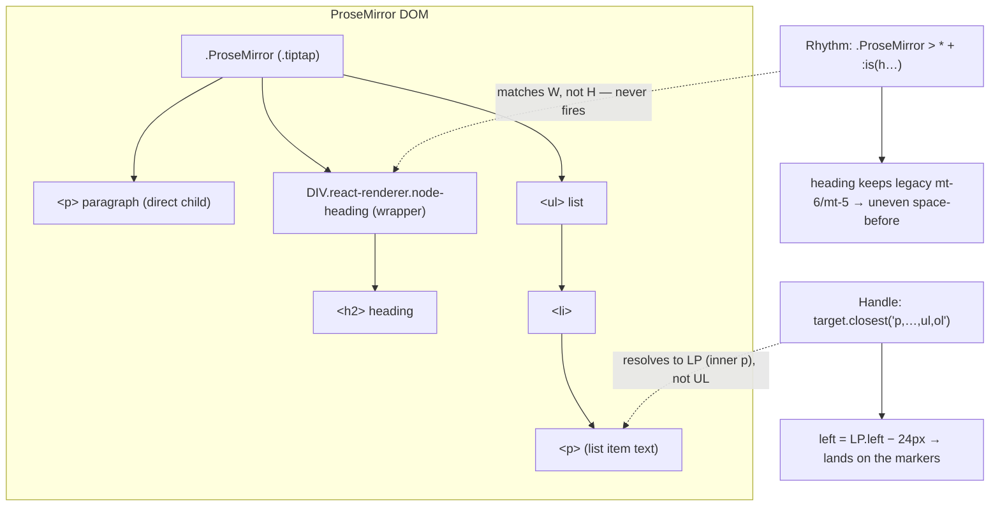
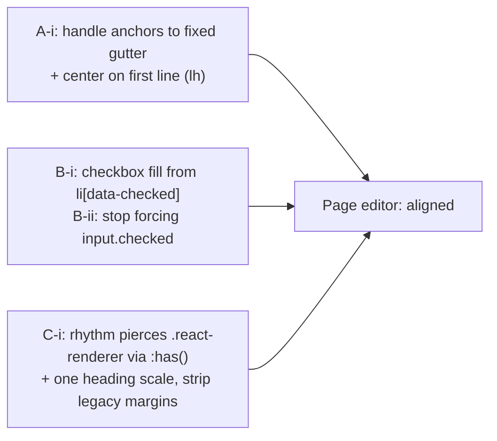

# Page Editor Typography & Alignment: Bullets, Checkboxes, Drag Handles

> Status: unimplemented (`[_]`). Exploration only — recommends a concrete
> fix set. Empirically grounded: every number below was measured live in
> the running web app against the seeded **"Sample Page – All Block Types"**
> document (`getBoundingClientRect`, computed styles, annotated screenshots).

## Problem Statement

The page/document editor's typography "mostly works" but several alignment
details feel off when you look closely:

1. **Checkboxes vs. their text line** look misaligned, and unchecked tasks
   appear to render in a checked-looking state.
2. **Drag handles** seem to sit too close to — or directly on top of —
   bullets/checkboxes on list blocks.
3. The overall **typography** (line-height, heading sizes, vertical rhythm,
   margins) hasn't been dialed in to a single consistent system on the page
   surface.

The ask: build a robust, full-featured sample page, screenshot it heavily,
and *measure* what is actually misaligned, then specify the typography +
alignment fixes so the page component reads cleanly.

This document is the measurement + recommendation. The companion fix work is
tracked by the Implementation Checklist at the end.

## Executive Summary

Most of the **horizontal** alignment is already excellent — exploration
[0198] built a real em-based rhythm system in
`apps/web/src/styles/globals.css` (`.page-prose .ProseMirror`), and on the
page surface bullet text, numbered text, and to-do text all share one left
edge (measured at the same x within 0.1px). The problems are concentrated in
four places:

| # | Issue | Severity | Evidence (measured) | Root cause |
|---|-------|----------|---------------------|------------|
| **A1** | Drag handle **overlaps** list bullets / checkboxes | High | Handle button spans `x=[414.8, 434.8]`; checkbox spans `[414.0, 432.4]` → **17.6px overlap** | `draggableSelector` matches the **inner `<p>`** of a list item before the `<ul>`, so the handle anchors to the *indented* text edge, then the fixed `−24px` offset lands it on the markers |
| **A2** | Drag handle sits **~3px low** vertically on paragraphs/lists | Med | Button center vs first-line center: paragraph **+3.3px**, lists **+2.8px**, H2 **+0.4px** | `.xnet-drag-handle { padding-top: 0.25rem }` is a fixed offset; it only centers for one block height (≈H2), not for the body line-height |
| **B1** | **Unchecked** tasks render **checked** (blue fill + ✓) | High | `li[data-checked="false"]` but `input.checked === true`, `input.defaultChecked === false`, `input.matches(':checked') === true` | The blue fill keys off `input:checked` (a DOM property that has desynced from node state) instead of the authoritative `li[data-checked]` |
| **C1** | Heading **vertical rhythm** bypasses the 0198 system | Med | Space-before is uneven: P=12, **H2=24, H3=20**, code=16, callouts=16px (should be one flow unit + a heading exception) | Headings/callouts/code/quote are React node views wrapped in `DIV.react-renderer`; the rhythm's **direct-child** selectors (`> *`, `* + :is(h…)`) operate on the wrapper, not the heading, so the "space precedes headings" rule never fires and legacy Tailwind margins leak through |

Secondary findings: checkboxes are large (1.15em ≈ 18.4px) near-circular
(8px radius) blue shapes that read like radio/status dots (**B2**); the
checkbox is well-centered on cap-height but ~2px above the lowercase
x-height center because of an over-large `+0.2em` fudge (**B3**); two
competing sources of heading style disagree (`editor.css` `mb-3` vs
`HeadingView` `mb-4`, and `HeadingView` only styles levels 1–3) (**C2**); the
measure is ~80ch, a touch wide (**D1**).

Recommendation: a small, targeted patch set — anchor the drag handle to a
**fixed editor gutter** and center it on the **first line**; drive the
checkbox visual from `li[data-checked]`; and make the rhythm selectors
**pierce the `.react-renderer` wrapper** (via `:has()`), with one
consolidated heading scale. None of this requires re-architecting the editor.

## Current State In The Repository

### The page surface and its rhythm system

`apps/web/src/components/PageView.tsx:880` lays out the document:

```tsx
<div data-page-margin className="mx-auto flex w-full max-w-3xl grow flex-col px-6 pt-10">
  <input aria-label="Page title" className="... px-8 text-[2.5rem] font-bold leading-tight ..." />
  <EditorComponent className="page-prose mt-3 flex-1" ... />
</div>
```

So the page is `max-w-3xl` (768px) with `px-6` (24px) gutters, the title has
an extra `px-8` (32px), and the editor body lives under `.page-prose`.

`apps/web/src/styles/globals.css:61` is the single source of document
typography (exploration [0198]) — an em-based rhythm:

```css
.page-prose .ProseMirror {
  --prose-flow: 0.75em;        /* between sibling blocks */
  --prose-flow-tight: 0.2em;   /* between list items */
  --prose-h-before: 1.7em;     /* heading top — space precedes */
  --prose-h-after: 0.4em;      /* heading bottom */
  --prose-indent: 1.55em;      /* one list-indent step (~25px) */
  --prose-check: 1.15em;       /* checkbox size */
  --page-pad-x: 2rem;          /* symmetric gutter; the drag handle lives in it */
  font-size: var(--font-prose-size);   /* 16px (packages/ui/src/theme/tokens.css:51) */
  line-height: 1.65;
}
/* Flow: clear default block margins, then one unit between siblings. */
.page-prose .ProseMirror > * { margin-top: 0; margin-bottom: 0; }
.page-prose .ProseMirror > * + * { margin-top: var(--prose-flow); }
.page-prose .ProseMirror > * + :is(h1,h2,h3,h4,h5,h6) { margin-top: var(--prose-h-before); }
.page-prose .ProseMirror :is(h1,h2,h3,h4,h5,h6) + * { margin-top: var(--prose-h-after); }
```

The to-do alignment was already reworked here to use the line-relative `lh`
unit instead of a magic pixel offset (`globals.css:130`):

```css
.page-prose .ProseMirror ul[data-type='taskList'] li > label {
  margin-top: 0.35em; /* fallback for browsers without lh */
  margin-top: calc((1lh - var(--prose-check)) / 2 + 0.2em);
}
```

### The base editor styles

`packages/editor/src/styles/editor.css` carries the package defaults that the
page surface overrides. Relevant bits:

- Task rows (`:165`): `li { @apply flex items-start gap-2 }`,
  `label { @apply flex-shrink-0 mt-1 }`, checkbox `w-4 h-4 rounded border-2`,
  and the blue fill keyed off **`input[type='checkbox']:checked`** (`:183`).
- Drag handle (`:434`): `.xnet-drag-handle { align-items: flex-start;
  padding-top: 0.25rem }` and a `1.25rem × 1.5rem` button.

### The drag handle

`packages/editor/src/extensions/drag-handle/index.ts:22` sets the selector:

```ts
draggableSelector: 'p, h1, h2, h3, h4, h5, h6, ul, ol, blockquote, pre, hr',
```

`packages/editor/src/extensions/drag-handle/DragHandle.ts:77` positions it:

```ts
const blockLeft = blockRect.left - parentRect.left
const handleWidth = 24             // width of handle + small gap
const left = blockLeft - handleWidth
```

`block` is `target.closest(draggableSelector)`. Because list items contain a
`<p>` (`<li><p>text</p></li>`), `closest('p, …, ul, ol')` resolves to the
**inner `<p>`** — whose left edge is the *indented* text edge — not the outer
`<ul>`. That is the overlap bug (A1). Vertically, the handle is appended with
a fixed `padding-top: 0.25rem`, so it does not track line-height (A2).

### Task items and headings

`packages/editor/src/extensions/page-tasks/index.ts:34` —
`PageTaskItemExtension = TaskItem.extend(...)` adds `taskId`/`blockId` attrs
and an input rule, but **no `renderHTML`/`addNodeView` override**. So the
checkbox DOM comes from the base `@tiptap/extension-task-item` node view; the
visual state is therefore at the mercy of whatever sets `input.checked`.

`packages/editor/src/nodeviews/HeadingView.tsx:10` renders headings as React
node views with their own scale:

```ts
const HEADING_STYLES = {
  1: 'text-3xl font-bold mt-8 mb-4 leading-tight',
  2: 'text-2xl font-semibold mt-6 mb-3 leading-snug',
  3: 'text-xl font-medium mt-5 mb-2 leading-snug',
  4: 'text-lg font-medium mt-4 mb-2', 5: '...', 6: '...'
}
```

This both **duplicates and conflicts** with `editor.css`
(`.ProseMirror h1 { … mt-8 mb-3 }` vs `HeadingView` `mb-4`), and only levels
1–3 carry a `leading-*`.

## External Research

- **TipTap's official Drag Handle** (`@tiptap/extension-drag-handle`,
  drag-handle-react) defaults to `placement: 'left-start'` with floating-ui
  and ships **edge detection** to "prefer the parent node over a nested
  node" for lists. The community
  `tiptap-extension-global-drag-handle` solves the same nesting problem with
  a `selector`/`excludedTags` config and a fixed left padding gutter. Both
  converge on the same lesson the xNet handle missed: **anchor the handle to
  the outer/top-level block (or a fixed gutter), not the deepest matched
  element.** TipTap issue #2930 ("data-drag-handle drags inappropriate
  element") is the same class of bug.
- **Checkbox ↔ first-line alignment**: the modern guidance is flexbox
  `align-items: flex-start` + a top offset on the box to land it on the first
  line; the robust, font-size-independent version of that offset is the CSS
  **`lh` unit** (`margin-top: calc((1lh − <box>)/2)`), which is exactly what
  0198 adopted. The remaining tuning is the optical correction term (the ink
  of lowercase text sits below the line-box center), where a smaller nudge
  than `0.2em` lands closer to the visual center.
- **ProseMirror/TipTap React node views** wrap each node in a
  `div.react-renderer` (an `addNodeView` requirement). This is well known to
  break CSS that assumes the semantic element is a **direct child** of
  `.ProseMirror` — the standard fixes are to target the wrapper, use
  `:has()`, or render non-structural decorations (e.g. the `#` prefix) without
  a full node view.

Sources:
- [Drag Handle | Tiptap](https://tiptap.dev/docs/editor/extensions/functionality/drag-handle)
- [Drag Handle React | Tiptap](https://tiptap.dev/docs/editor/extensions/functionality/drag-handle-react)
- [tiptap-extension-global-drag-handle](https://github.com/NiclasDev63/tiptap-extension-global-drag-handle)
- [tiptap#2930 — drag handle drags inappropriate element](https://github.com/ueberdosis/tiptap/issues/2930)
- [Aligning checkboxes and labels across browsers](https://1stwebdesigner.com/how-to-align-checkboxes-and-their-labels-consistently-across-browsers/)

## Key Findings (measured)

All numbers measured at a 1440×900 viewport on the seeded sample page; x/y in
viewport px.

### Horizontal alignment — already good

```
paragraph text left ........ 414.0
bullet text left ........... 438.8
numbered text left ......... 438.8
to-do text left ............ 438.8   ← all list text shares one edge ✔
checkbox left .............. 414.0   ← flush with body text; box hangs in the indent ✔
indent step ................ 24.8px (= 1.55em) ✔
```

The 0198 intent ("checkbox + gap = one indent step, so to-do text shares the
bullet text edge") is achieved. No change needed here.

### Drag handle — A1 (overlap) and A2 (vertical)

```
block        handle button x     content left          gap        btn-center vs first-line-center
paragraph    [390.0, 410.0]      414.0                 +4.0 ✔     +3.3 (low)
H2           [390.0, 410.0]      414.0                 +4.0 ✔     +0.4 ✔
bullet <ul>  [414.8, 434.8]      text 438.8            overlaps   +2.8 (low)
task <ul>    [414.8, 434.8]      checkbox [414,432.4]  −17.6 ✗    +2.8 (low)
H1           (handle not shown — see open questions)
```

The handle is correct in the gutter for paragraphs/headings, but for lists it
shifts right by one indent step (because it anchors to the list item's inner
`<p>`) and **lands on top of the bullet disc / checkbox**.

### Checkbox — B1 (state), B2 (shape), B3 (vertical)

```
task            li[data-checked]   input.checked   input.defaultChecked   matches(:checked)
Unchecked task  "false"            true            false                  true   ← renders blue/✓ (BUG)
Completed task  "true"             true            false                  true
checkbox size ......... 18.4px (1.15em)   border-radius 8px (≈ circular)   fill rgb(37,99,235)
cb center vs line-box center ... −0.7px
cb center vs cap-height center . −0.9px   (good)
cb center vs lowercase x-center  −2.3px   (slightly high; the +0.2em fudge overshoots)
```

### Heading / vertical rhythm — C1, C2

```
DOM:  H2  <  DIV.react-renderer.node-heading  <  DIV.tiptap.ProseMirror   (heading is NOT a direct child)
       P  <  DIV.tiptap.ProseMirror                                        (paragraph IS a direct child)

space-before each block (visual gap to previous):
  P after H1 ......... 12  (= --prose-flow 0.75em ✔)
  H2 ................. 24  (legacy mt-6 leaking through wrapper; intended 1.7em ≈ 27)
  H3 ................. 20  (legacy mt-5; intended 1.7em)
  bullet <ul> ........ 8   (heading mb leaking; intended --prose-h-after 0.4em ≈ 6.4)
  ordered <ol> ....... 12
  task <ul> .......... 12
  blockquote ......... 12
  code block ......... 16
  callouts ........... 16

heading inner margins (legacy, collapsing through wrappers):
  H1 mt32/mb12   H2 mt24/mb8   H3 mt20/mb8
font sizes / line-heights:
  title 40/50   H1 30/36   H2 24/31.2   H3 20/28   body 16/26.4
measure ≈ 656px ≈ ~80ch (slightly above the 66ch ideal)
```

### Why the handle and the rhythm break — one diagram



## Options And Tradeoffs

### A. Drag handle horizontal placement

| Option | How | Pros | Cons |
|--------|-----|------|------|
| **A-i (recommended): fixed gutter** | Compute `left` from the editor's content-left (the constant prose padding edge), not per-block: `left = proseContentLeft − handleWidth`. Independent of block indentation. | One rule fixes paragraphs, headings, *and* lists; handle always in the gutter; trivial diff | Handle no longer "hugs" deeply nested content (acceptable — Notion/Linear keep it in a fixed rail) |
| **A-ii: exclude inner list `<p>`** | Change `draggableSelector` / the `closest` walk to skip list-item paragraphs and resolve to the `<ul>`/`<li>`. | Keeps per-block anchoring | Still uses `blockLeft − 24`, which is fragile for blockquotes/callouts; more edge cases |
| **A-iii: adopt `@tiptap/extension-drag-handle`** | Replace the hand-rolled plugin with the official extension (floating-ui + edge detection). | Battle-tested; nested-list aware; less code to own | Larger change/dependency; restyle; behavior churn for an otherwise-working handle |

### B. Checkbox visual state (B1)

| Option | How | Pros | Cons |
|--------|-----|------|------|
| **B-i (recommended): style from `data-checked`** | Drive the fill/checkmark from `li[data-checked="true"] > label input` instead of `input:checked`. | Visual always matches the authoritative node state, regardless of the desynced `.checked` property | Doesn't fix *why* `.checked` is wrong (do both) |
| **B-ii: fix the property** | Find and stop whatever sets `input.checked = true` on render (custom node view, or the page task pipeline in `page-tasks`/PageView). | Addresses root cause | Requires tracing the mutation; base-extension behavior |

### C. Heading rhythm (C1/C2)

| Option | How | Pros | Cons |
|--------|-----|------|------|
| **C-i (recommended): pierce wrappers with `:has()`** | Make rhythm rules target the wrapper that contains a heading: `.page-prose .ProseMirror > *:has(> :is(h1..h6))`, and strip legacy heading margins on the page surface. | Keeps node views; one rhythm owns all spacing; small CSS-only diff | `:has()` support (fine in current evergreen targets; verify) |
| **C-ii: tag wrappers** | Add `data-block`/`data-node-type` to node-view wrappers, select on that. | No `:has()` dependency | Touches every node view |
| **C-iii: drop the heading node view** | Render the `#` prefix as a decoration/widget so `<h1..6>` are direct children again. | Cleanest long-term; rhythm "just works" | Biggest change; reworks focus/`#`-prefix logic |

## Recommendation

Ship the small, surgical set — **A-i + B-i (+ B-ii) + C-i** — and consolidate
the heading scale. This dials in the typography without re-architecting the
editor:



Concretely:

1. **Drag handle horizontal** — anchor to the editor content-left so the
   handle always lives in the `--page-pad-x` gutter, never on the markers.
2. **Drag handle vertical** — center the button on the block's **first line**
   (height = `1lh` of the block, `align-items: center`), replacing the fixed
   `padding-top: 0.25rem`.
3. **Checkbox state** — style the fill/check from `li[data-checked="true"]`
   (B-i), and remove whatever forces `input.checked` true (B-ii) so the
   property and node state agree.
4. **Checkbox polish** — drop the radius to ~4–5px (rounded square, reads as a
   checkbox) and trim the `+0.2em` optical fudge to ~`0.06em`.
5. **Heading rhythm** — make the 0198 selectors pierce the `.react-renderer`
   wrapper with `:has()`, strip the legacy `mt-*/mb-*` from headings on the
   page surface, and define **one** heading scale (sizes, weights,
   line-heights, levels 1–6) as the single source of truth.
6. **Measure** — optionally narrow the column toward ~66–72ch.

## Example Code

> Sketches to anchor the implementation; not drop-in. Validate against the
> measurements above.

**A-i + A2 — gutter anchoring + first-line centering** (`DragHandle.ts`):

```ts
// Anchor X to the editor content box (constant gutter), not the matched block.
const contentLeft = editor.view.dom.getBoundingClientRect().left
  + parseFloat(getComputedStyle(editor.view.dom).paddingLeft || '0')
const left = (contentLeft - parentRect.left) - handleWidth   // always in the gutter

// Center the button on the block's FIRST line, not a fixed padding.
const firstLine = block.getClientRects()[0] ?? blockRect
const lineH = firstLine.height
dragHandleElement.style.top = `${firstLine.top - parentRect.top + parentEl.scrollTop}px`
dragHandleElement.style.height = `${lineH}px`   // button is align-items:center within this
```

```css
/* editor.css — button centers within the first-line-tall handle box */
.xnet-drag-handle { align-items: center; padding-top: 0; }
```

**B-i — checkbox fill from authoritative state** (`globals.css` / `editor.css`):

```css
/* was: input[type='checkbox']:checked { … blue … } */
.page-prose .ProseMirror ul[data-type='taskList'] li[data-checked='true'] > label input {
  background-color: rgb(var(--editor-primary));
  border-color: rgb(var(--editor-primary));
}
.page-prose .ProseMirror ul[data-type='taskList'] li:not([data-checked='true']) > label input {
  background-color: transparent;   /* unchecked is always empty, regardless of .checked */
}
.page-prose .ProseMirror ul[data-type='taskList'] li > label input {
  border-radius: 5px;              /* rounded square, not a circle */
}
.page-prose .ProseMirror ul[data-type='taskList'] li > label {
  margin-top: calc((1lh - var(--prose-check)) / 2 + 0.06em);  /* trimmed optical nudge */
}
```

**C-i — rhythm pierces node-view wrappers** (`globals.css`):

```css
/* Treat "a wrapper that contains a heading" as the heading for spacing. */
.page-prose .ProseMirror > * + *:has(> :is(h1,h2,h3,h4,h5,h6)) { margin-top: var(--prose-h-before); }
.page-prose .ProseMirror > *:has(> :is(h1,h2,h3,h4,h5,h6)) + * { margin-top: var(--prose-h-after); }
/* Neutralise the legacy inner-heading margins on the page surface. */
.page-prose .ProseMirror :is(h1,h2,h3,h4,h5,h6) { margin: 0; }
```

## Risks And Open Questions

- **Why is `input.checked` true for unchecked tasks?** Confirmed reproducible
  across reloads (`defaultChecked=false`, `checked=true`). The base
  `@tiptap/extension-task-item` node view sets `checkbox.checked =
  node.attrs.checked`, yet `li[data-checked]` (same source) reports the
  correct value — so something **external** forces `.checked` after render
  (candidate: the page task pipeline in `page-tasks` / `PageView`'s
  `onPageTasksChange`, or collaboration re-hydration). B-i makes the *visual*
  correct regardless; B-ii still needs the trace.
- **H1 handle didn't appear** on hover in testing. Likely the
  `.react-renderer` heading wrapper interferes with `posAtDOM`/`closest`
  (same wrapper issue as C1). Confirm and ensure the handle resolves the
  top-level block for wrapped node views.
- **`:has()` support** — verify against the project's browser targets
  (Electron/Chromium and current Safari/Firefox are fine; confirm no older
  target in the matrix).
- **Other surfaces** — `editor.css` is shared by canvas/compact editors that
  do **not** use `.page-prose`. Keep page-specific fixes scoped to
  `.page-prose` so canvas/compact rhythm is unaffected; only the shared
  drag-handle and checkbox-state changes touch the base.
- **Checkbox shape is partly taste** — circular vs rounded-square is a design
  call; flagged because at 1.15em the circle reads like a status/radio dot.
- **Scope discipline** — this is editor-package + web-app CSS/TS. Any change
  to publishable `packages/editor` needs a changeset (`/changeset`); the
  app-only `globals.css`/`PageView` changes do not.

## Implementation Checklist

- [ ] **A-i** Anchor the drag handle X to the editor content-left (fixed
  gutter) in `packages/editor/src/extensions/drag-handle/DragHandle.ts`;
  remove the per-block `blockLeft − 24` dependence on the matched element.
- [ ] **A2** Center the handle button on the block's first line (height =
  `1lh`, `align-items: center`); drop the fixed `padding-top: 0.25rem` in
  `packages/editor/src/styles/editor.css`.
- [ ] **A (lists)** Ensure `closest`/selector resolves the **top-level** block
  for list items (don't anchor to the inner `<p>`); confirm nested lists.
- [ ] **A (H1)** Make the handle resolve wrapped node-view headings so it
  shows and aligns on `<h1>`.
- [ ] **B-i** Style the checkbox fill/checkmark from
  `li[data-checked="true"]` rather than `input:checked` (scoped to
  `.page-prose`, and/or base `editor.css`).
- [ ] **B-ii** Trace and stop the code that forces `input.checked = true`;
  verify unchecked tasks have `input.checked === false`.
- [ ] **B2/B3** Reduce checkbox radius to ~5px and trim the optical nudge from
  `+0.2em` to ~`0.06em` in `apps/web/src/styles/globals.css`.
- [ ] **C-i** Rewrite the heading rhythm rules in `globals.css` to pierce
  `.react-renderer` wrappers via `:has()`; verify space-before is uniform
  (one flow unit) with the heading "space precedes" exception applied.
- [ ] **C2** Consolidate heading sizes/weights/line-heights/margins into one
  source of truth (reconcile `nodeviews/HeadingView.tsx` `HEADING_STYLES` and
  `editor.css` `.ProseMirror h1..h6`); cover levels 1–6 with `leading-*`.
- [ ] **D1 (optional)** Tune the measure toward ~66–72ch.
- [ ] Add a `changeset` for `@xnetjs/editor` (drag-handle + checkbox state are
  consumer-visible); app-only CSS needs none.
- [ ] Re-run the seed sample page and re-measure (see Validation).

## Validation Checklist

Re-run against the seeded **"Sample Page – All Block Types"**
(`devtools → Seed → Seed everything`, then `/doc/seed%2Fpage%2Fsample`):

- [ ] On a **list/task** block, the drag handle button's right edge is ≥4px
  **left** of the bullet disc / checkbox (no overlap; `gapButtonToBlock > 0`).
- [ ] On **paragraph, H1, H2, H3, list, blockquote, code**, the handle button
  center is within **±1px** of the block's first-line center.
- [ ] The **handle X is identical** for a paragraph and a list item (both in
  the gutter).
- [ ] An **unchecked** task shows an **empty** box (`input.checked === false`,
  `li[data-checked="false"]`, no blue fill); a **checked** task shows the
  fill + strikethrough.
- [ ] Checkbox center within **±1px** of the first line's cap/x-height optical
  center across font sizes (toggle a larger heading-in-task if applicable).
- [ ] **Space-before** is one flow unit for body blocks and the heading
  exception for headings, **uniform across levels** (no 24-vs-20 drift); a
  heading binds visually to the text below it (more space above than below).
- [ ] Bullet/numbered/to-do text still share one left edge (regression guard
  on the already-good horizontal alignment).
- [ ] Canvas/compact editor surfaces are visually unchanged (page-scoped
  fixes didn't leak).
- [ ] Dark mode + `prefers-reduced-motion` unaffected.

## References

- Exploration [0198] — page document rhythm system (`globals.css`
  `.page-prose`), the basis this builds on.
- `apps/web/src/components/PageView.tsx` — page surface (`max-w-3xl`, title,
  `.page-prose`).
- `apps/web/src/styles/globals.css` — rhythm tokens + to-do `lh` centering.
- `packages/editor/src/styles/editor.css` — base task list, checkbox `:checked`
  fill, drag handle.
- `packages/editor/src/extensions/drag-handle/{index,DragHandle}.ts` —
  selector + positioning.
- `packages/editor/src/extensions/page-tasks/index.ts` — `PageTaskItemExtension`
  (inherits base task-item rendering).
- `packages/editor/src/nodeviews/HeadingView.tsx` — heading node view +
  `HEADING_STYLES`.
- `packages/ui/src/theme/tokens.css` — `--font-prose-size: 16px`.
- [Drag Handle | Tiptap](https://tiptap.dev/docs/editor/extensions/functionality/drag-handle),
  [Drag Handle React | Tiptap](https://tiptap.dev/docs/editor/extensions/functionality/drag-handle-react),
  [tiptap-extension-global-drag-handle](https://github.com/NiclasDev63/tiptap-extension-global-drag-handle),
  [tiptap#2930](https://github.com/ueberdosis/tiptap/issues/2930).
- [Aligning checkboxes and labels across browsers](https://1stwebdesigner.com/how-to-align-checkboxes-and-their-labels-consistently-across-browsers/).
