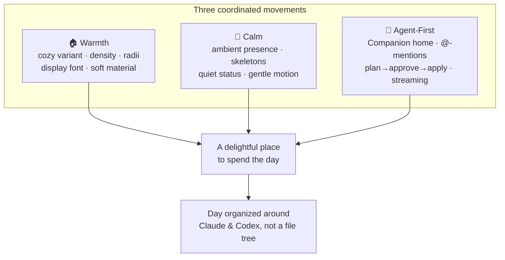
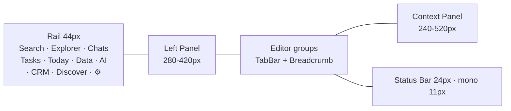
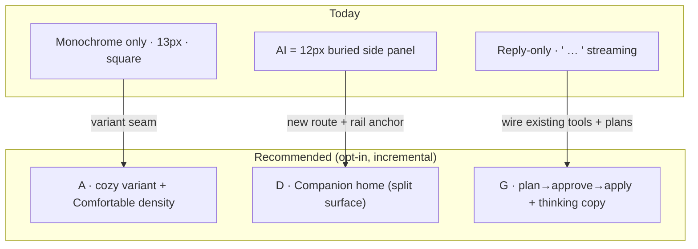
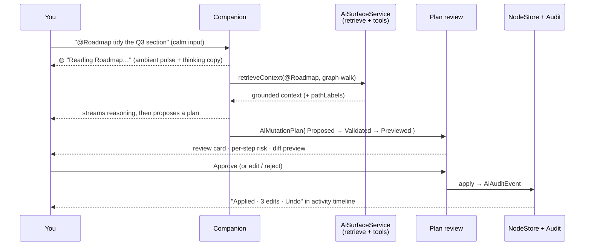
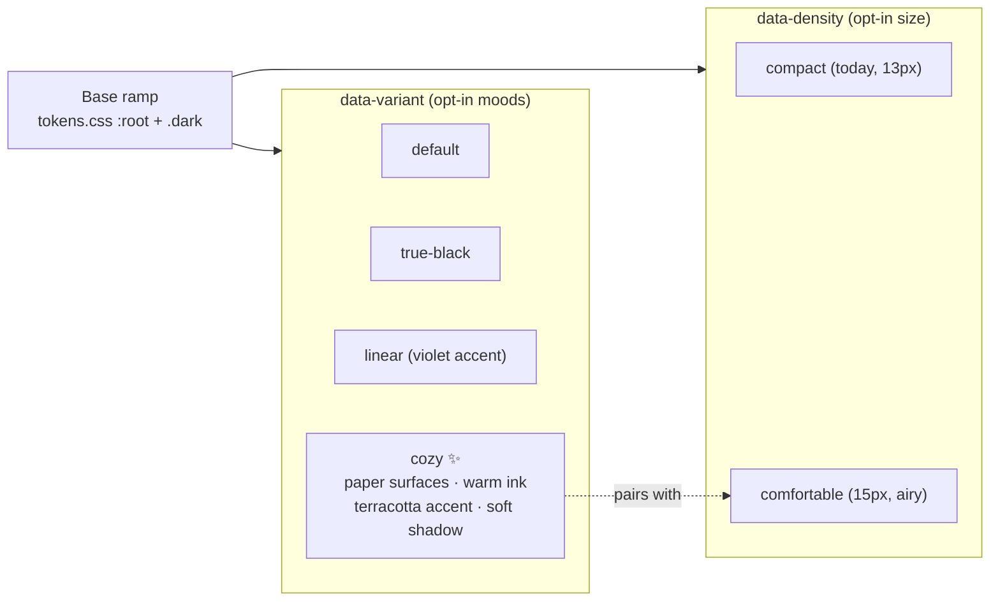

# Cozy, Calm, and Agent-First — Making xNet a Delightful Place to Spend the Day

## Problem Statement

xNet today is a *well-engineered* workspace. It is not yet a *warm* one.

The current visual system (exploration 0166) is deliberately monochrome,
APCA-tuned, and tight: 13px chrome, hairline borders, a three-step grey ramp,
and a doctrine that "chrome may not have hue; hue belongs to data"
([`packages/ui/src/theme/tokens.css`](packages/ui/src/theme/tokens.css)). The
shell has VS-Code DNA — a 44px icon rail, a tab bar, splittable editor groups, a
24px status bar
([`apps/web/src/workbench/Workbench.tsx`](apps/web/src/workbench/Workbench.tsx),
[`Rail.tsx`](apps/web/src/workbench/Rail.tsx),
[`StatusBar.tsx`](apps/web/src/workbench/StatusBar.tsx)). It is precise,
efficient, and quietly cold. It reads as an *IDE*, not a *room you want to spend
the day in*.

The user wants the opposite feeling — the one you get from **Claude Desktop**
(warm cream "paper" canvas, terracotta accent, calm conversation), **OpenAI
Codex** (legible plan/diff review, streaming as a trust signal), **Dia browser**
(an AI that lives quietly in the periphery, familiar-then-novel), and **Apple**
(deference, depth, soft materials, generous whitespace, spring motion). And
crucially, the day's *workflow* should be organized around **AI agents** —
Claude and Codex — not around a file tree.

Two concrete gaps make this urgent:

1. **The AI is buried.** The single most important surface for an agent-first
   workflow — the assistant — is a **12px monochrome side panel** behind a
   `Sparkles` icon in the rail, reply-only, with a tiny `Bot` glyph empty state
   ([`apps/web/src/workbench/views/AiChatPanel.tsx:383`](apps/web/src/workbench/views/AiChatPanel.tsx)).
   It is one of six equally-weighted rail items
   ([`Rail.tsx:37`](apps/web/src/workbench/Rail.tsx)). Nothing about the app says
   "this is where you and an agent get work done."
2. **The room is cold.** Pure-white `#FFFFFF` surfaces, near-black `#0A0A0A`,
   hairlines you're meant to *feel not see*, 13px everything, no warmth, no
   personality, no large radii, motion that is correct but invisible. It is
   *minimal*; it is not *cozy*. Minimal and cozy are not the same thing — the
   difference is warmth, breathing room, and care.

This exploration asks: **how do we make xNet feel cozy, calm, and centered on
working with AI agents — without throwing away the disciplined system we already
have?**

## Executive Summary

The good news: **the substrate is already there.** The theme layer already
supports *opt-in variants* that relax the monochrome doctrine — the `linear`
variant adds a violet accent, `true-black` collapses surfaces for OLED
([`tokens.css:222`](packages/ui/src/theme/tokens.css)). The motion system is a
real, enforced vocabulary with "two laws"
([`packages/ui/src/theme/motion.css`](packages/ui/src/theme/motion.css)). The AI
stack is *deep* — graph-aware retrieval, a context-pack seam, a full tool
catalog, and an intent→validate→apply→audit mutation-plan lifecycle — it's just
**not surfaced** ([`packages/plugins/src/ai-surface/service.ts`](packages/plugins/src/ai-surface/service.ts)).

So the recommendation is **three coordinated "movements," all opt-in and
incremental, none of which require a rewrite:**

1. **Warmth** — a `cozy` theme variant (cream/paper surfaces, warm ink, a
   terracotta-amber accent, warm-tinted shadows), a `Comfortable` density mode
   (larger type, more breathing room), softer radii, a characterful display font
   for headings, and Apple-flavored material (soft translucency + spring on
   direct manipulation). Shipped exactly like the existing `linear` variant —
   the 0166 doctrine stays the default; warmth is a *choice*.
2. **Calm** — move the agent and the chrome from *demanding* to *ambient*:
   skeleton states over spinners, optimistic UI, a quieter status bar, a "good
   morning" home instead of a cold file list, ambient agent presence in the
   periphery, and gentle, restrained motion.
3. **Agent-First** — promote the AI from a buried 12px side panel to a
   **first-class Companion home**: a Claude-Desktop-style split (conversation +
   live workspace artifact), `@`-mention workspace context (Dia), a
   **plan → approve → apply** review surface that finally exposes the
   already-built `AiMutationPlan` lifecycle, streaming with concrete "thinking"
   microcopy (Codex), threads/projects, and an outcome-labeled model picker.

The throughline: **xNet should feel like sitting down at a warm desk with a
capable collaborator who already knows your work** — not like opening an IDE.



## Current State In The Repository

### The design system is disciplined, intentional, and cold

| Concern | Where | Current character |
| --- | --- | --- |
| Color ramp | [`tokens.css`](packages/ui/src/theme/tokens.css) | Monochrome only. `--surface-0: #FFFFFF` light / `#0A0A0A` dark. "Chrome may not have hue." |
| Theme variants | [`tokens.css:216-247`](packages/ui/src/theme/tokens.css), [`ThemeProvider.tsx`](packages/ui/src/theme/ThemeProvider.tsx) | `default` · `true-black` · `linear`. **Variants already relax the doctrine** — `linear` adds a violet accent. |
| Type | [`tokens.css:50-51`](packages/ui/src/theme/tokens.css), [`globals.css:1-2`](apps/web/src/styles/globals.css) | `--font-ui-size: 13px`, `--font-prose-size: 16px`. Inter Variable + Geist Mono. **No display/serif face.** |
| Radii | [`tokens.css:30-35`](packages/ui/src/theme/tokens.css) | `--radius: 0.5rem` max; **shells are square** (radii only reach inputs/buttons). |
| Motion | [`motion.css`](packages/ui/src/theme/motion.css), [`docs/MOTION.md`](docs/MOTION.md) | Real enforced vocabulary; "enter slow/out, exit fast/in." Spring reserved for direct manipulation. Correct but invisible. |
| Density | — | **No density setting.** 13px chrome is the single, tight density. |
| Shadows | [`tokens.css`](packages/ui/src/theme/tokens.css) | Essentially none; elevation carried by 3-5 lightness points + hairlines. |

The key realization: **the variant system is the seam.** `[data-variant='linear']`
already proves we can ship a *whole alternate mood* (accent, sidebar washes,
focus ring) as an opt-in layer over the same ramp, without touching a single
component. A `cozy` variant is the same move — just bolder (it touches surfaces
and ink, not only the accent).

### The shell is an IDE



Every region is square, hairline-bordered, and tight
([`Workbench.tsx`](apps/web/src/workbench/Workbench.tsx),
[`TabBar.tsx`](apps/web/src/workbench/TabBar.tsx),
[`ContextPanel.tsx`](apps/web/src/workbench/ContextPanel.tsx),
[`Hairline.tsx`](apps/web/src/workbench/Hairline.tsx)). The Electron window uses a
frameless native drag with no custom warmth
([`apps/electron/src/renderer/App.tsx`](apps/electron/src/renderer/App.tsx)). The
home route is a cold list — *"No documents yet. Create your first page,
database, or canvas!"* ([`apps/web/src/routes/index.tsx`](apps/web/src/routes/index.tsx)).
First-run is a three-step skippable form
([`apps/web/src/routes/welcome.tsx`](apps/web/src/routes/welcome.tsx)) plus
non-blocking coachmarks ([`apps/web/src/coachmarks/`](apps/web/src/coachmarks/)).

### The AI is deep but buried

The assistant surface is genuinely capable under the hood:

- **Bring-your-own-model** with auto-detected connectors ranked by capability:
  managed (xNet Cloud) → bridge (Claude Code / Codex on loopback) → cloud-key →
  local (Ollama/LM Studio) → WebLLM → Chrome Prompt API
  ([`packages/plugins/src/ai/connectors/detect.ts`](packages/plugins/src/ai/connectors/detect.ts),
  [`ai-chat-connector.ts`](apps/web/src/workbench/views/ai-chat-connector.ts)).
- **Graph-aware retrieval** that walks typed relations with a token/hop budget
  and a readable provenance `pathLabel`
  ([`ai-graph-retriever.ts`](apps/web/src/workbench/views/ai-graph-retriever.ts),
  [`packages/brain/`](packages/brain/)), plus opt-in on-device semantic search
  ([`ai-vector-search.ts`](apps/web/src/workbench/views/ai-vector-search.ts)).
- **A full tool catalog** — `xnet_search`, `xnet_graph_expand`,
  `xnet_read_page_markdown`, `xnet_plan_page_patch`, `xnet_apply_page_markdown`,
  `xnet_database_query`, canvas tools — each risk-rated and scope-gated
  ([`service.ts`](packages/plugins/src/ai-surface/service.ts)).
- **A mutation-plan lifecycle** built for safe agent writes: `AiMutationPlan`
  goes Proposed → Validated → Previewed → Applied/Rejected → Audited, each plan
  carrying `risk` and `requiredScopes`, reversing to an `AiAuditEvent`
  ([`service.ts`](packages/plugins/src/ai-surface/service.ts)).
- **An MCP server** so external agents (Claude Desktop) can drive the same
  surface ([`packages/plugins/src/services/mcp-server.ts`](packages/plugins/src/services/mcp-server.ts)).

But the **web UI exposes almost none of this**. The chat is reply-only (tools
defined, not yet invoked from the runtime). The capability badge honestly says
"reads workspace," not "agentic." And it all lives in a 12px panel
([`AiChatPanel.tsx`](apps/web/src/workbench/views/AiChatPanel.tsx)) registered as
one left-panel view among many
([`apps/web/src/workbench/views/register.ts`](apps/web/src/workbench/views/register.ts)).

**The gap is presentation, not capability.** That's the most encouraging finding
in this whole document.

## External Research

A full, sourced survey lives in the design notes below; the load-bearing
findings:

### Claude Desktop — warmth as a palette
- A **warm "paper" canvas** (`#F0ECE0` light) and **terracotta accent**
  (`#c96442` ≈ `oklch(0.70 0.14 45)`) that reads as paper, not screen
  ([Mobbin](https://mobbin.com/colors/brand/claude),
  [getdesign.md](https://getdesign.md/claude/design-md)).
- Anthropic's own design guidance bans generic system fonts in favor of
  **characterful display faces** (e.g. Fraunces) + clean body, **3×+ size
  jumps**, weight extremes
  ([Anthropic](https://www.anthropic.com/news/claude-design-anthropic-labs)).
- **Artifacts**: a side-by-side split — conversation as the command channel,
  a persistent work surface beside it
  ([guide](https://albato.com/blog/publications/how-to-use-claude-artifacts-guide)).
- **Projects**: persistent memory so the agent feels like a colleague who
  remembers the work, not a tool you re-brief each time.

### OpenAI Codex — legible agency
- **Three approval stances** (read-only / auto / full) make autonomy a *dial*,
  not a default
  ([docs](https://developers.openai.com/codex/agent-approvals-security)).
- **Plan → validate → execute** with per-step checkmarks; **streaming as a trust
  signal**, not a perf trick
  ([925 Studios](https://www.925studios.co/blog/chatgpt-interface-design-breakdown)).
- **Outcome-labeled models** ("Thinking" / "Fast"), not spec names.

### Dia browser — the calm, familiar assistant
- **Familiar-then-novel**: start where users already are, layer AI on top.
- **`@`-mention** open tabs/history; **animated presence** when the assistant
  opens; **progressive disclosure** (chrome appears on hover); invitational
  copy ("Add idea or link" not "Search")
  ([Browser Company](https://browsercompany.substack.com/p/the-strategy-behind-dias-design)).
- **Skills**: context-aware actions auto-invoked from the page.

### Apple HIG — deference, depth, soft material
- Three pillars: **clarity, deference, depth**
  ([HIG](https://developer.apple.com/design/human-interface-guidelines/)).
- **Liquid Glass** (WWDC 2025): translucent floating controls *above* content,
  specular highlights, material that adapts to what's behind it
  ([Apple](https://www.apple.com/newsroom/2025/06/apple-introduces-a-delightful-and-elegant-new-software-design/)).
- Generous radii (12-20px), weight contrast for hierarchy, spring motion.

### Calm technology & warm minimalism
- Amber Case's **calm-tech principles**: minimum attention, use the periphery,
  communicate without speaking, still work when it fails
  ([Calm Tech Institute](https://www.calmtech.institute/calm-tech-principles)).
- **Linear**: 4px base grid, 40-60% opacity for non-primary text, **skeletons
  over spinners**, optimistic UI, <100ms transitions as a quality signal
  ([925 Studios](https://www.925studios.co/blog/linear-design-breakdown-saas-ui-2026)).
- **Bear / Things 3 / Craft**: custom vertical rhythm, hide-chrome-until-hover,
  haptic confirmation, "no useless decoration," off-white not pure white.
- **Warm minimalism** = off-whites (cream/ivory) over pure white; **warm-tinted
  shadows**; earth accents (terracotta/amber/sage) over saturated digital hues.
  This reduces the "screen" quality and increases the "material" quality.

### Agent-centric UX patterns
- **Goal-oriented** supervision (you watch a mission, not each click);
  **progressive autonomy**; **plan → validate → execute**; **action transparency**
  (activity timeline + receipts + rollback); **confidence as a qualitative
  badge**, not a percentage
  ([Fuselab](https://fuselabcreative.com/ui-design-for-ai-agents/),
  [HatchWorks](https://hatchworks.com/blog/ai-agents/agent-ux-patterns/),
  [Onething](https://www.onething.design/post/agentic-ai-ux-design)).
- **Anti-patterns** to avoid: black-box launches, generic retry, chatbot
  templates pasted onto agent workflows, full-autonomy-by-default.
- The **"calm collaborator" frame**: the agent is *always present in the
  periphery, working; you check in rather than wait.*

## Key Findings

1. **Warmth can be opt-in without a rewrite.** The `[data-variant]` seam already
   layers an entire mood (`linear`) over the ramp. A `cozy` variant is the same
   pattern, applied to surfaces + ink + accent + shadow.
2. **The 0166 doctrine and "cozy" are reconcilable.** "Chrome may not have hue"
   was a *default* choice, and the `linear` variant already breaks it on purpose.
   Cozy is a sanctioned, user-selected relaxation — not a betrayal of the system.
3. **The biggest delight lever is free.** The agent stack (retrieval, tools,
   mutation plans, audit) exists; promoting it to a first-class, calm surface is
   *presentation work over a finished engine.*
4. **Density is the most-felt change.** Going from a single 13px tight density to
   an opt-in `Comfortable` mode (≈15px chrome, more padding, bigger tap targets)
   is what most changes "IDE" → "room." It also helps mobile
   ([`MobileShell.tsx`](apps/web/src/workbench/MobileShell.tsx)) and accessibility.
5. **Motion is correct but unfelt.** The vocabulary is disciplined to the point of
   invisibility. Cozy wants a *touch* more spring on direct manipulation and a
   few signature "presence" moments (the assistant swelling open, à la Dia) —
   within the two laws, never gratuitous.
6. **Empty states are missed warmth.** "No documents yet" is a cold dead end where
   a "good morning, here's where we left off" home would set the tone for the day.
7. **Streaming with personality builds trust cheaply.** The current stream shows
   `…`; concrete "thinking" microcopy ("Reading 3 pages…", "Drafting a patch…")
   is a proven anxiety-killer for agent work.

## Options And Tradeoffs

### Axis 1 — How far to push warmth

| Option | What it is | Pros | Cons |
| --- | --- | --- | --- |
| **A. New `cozy` variant (opt-in)** ✅ | Cream/paper surfaces, warm ink, terracotta-amber accent, soft radii, warm shadows — shipped like `linear` | Zero risk to existing users; honors the variant doctrine; reversible; ships fast | Two moods to maintain; warmth is hidden behind a setting |
| **B. Warm the default ramp** | Shift `--surface-*` to off-white, ink to warm grey for everyone | Everyone feels it; one system | Overrides a deliberate, APCA-verified 0166 decision; risks regressions across every surface; contentious |
| **C. Cosmetic only** | Add radii + a warmer accent, keep pure-white surfaces | Cheap | Doesn't actually feel cozy; pure white is the "screen" tell |

### Axis 2 — Where the agent lives

| Option | What it is | Pros | Cons |
| --- | --- | --- | --- |
| **D. Promote to a Companion home** ✅ | A first-class, full-surface AI home (split: conversation + workspace artifact), reachable as the default landing + a prominent rail anchor | Matches Claude Desktop / Codex; makes the day agent-organized; uses the existing runtime | New top-level surface to design + route |
| **E. Keep the side panel, dress it up** | Restyle `AiChatPanel` (bigger type, warmer, suggestion chips) but leave it in the 44px rail | Low effort | Still feels secondary; doesn't reorganize the day around the agent |
| **F. Floating "Dia-style" overlay** | A summonable assistant overlay (⌘-space) over any view | Ambient, fast | Overlaps GlobalSearch (⌘K); doesn't give the agent a *home* |

### Axis 3 — How much agency to expose

| Option | What it is | Pros | Cons |
| --- | --- | --- | --- |
| **G. Plan → approve → apply (gated)** ✅ | Surface the existing `AiMutationPlan` lifecycle as a review card; default to read-only/suggest, let users dial up autonomy | Safe, legible, matches Codex stances; unlocks the engine that already exists | Requires building the review/approval UI + wiring tools into the runtime |
| **H. Full auto-apply** | Let the agent write directly | Powerful | Anxiety-inducing; the documented anti-pattern; risky on CRDT data |
| **I. Stay reply-only** | Don't expose writes | Simplest | Leaves the whole agent value on the table; "reads workspace" forever |

### The shape of the recommendation



**Chosen: A + D + G** — opt-in warmth, an agent home, gated agency. It's the only
combination that delivers the *feeling* the user asked for while respecting the
disciplined system and the finished-but-hidden engine.

## Recommendation

Ship the three movements as **phased, opt-in increments**, each independently
valuable and reversible.

### Movement 1 — Warmth (the `cozy` variant + `Comfortable` density)

1. **`cozy` theme variant** layered exactly like `linear` in
   [`tokens.css`](packages/ui/src/theme/tokens.css): warm off-white surfaces
   (paper, not `#FFFFFF`), warm ink, a terracotta-amber **accent confined to
   interactive/selection** (preserving "hue belongs to data" for charts), and
   **warm-tinted shadow tokens** (new — elevation by soft shadow, not just
   lightness). Dark cozy = warm charcoal (`#1A1714`-ish) over flat black.
2. **`Comfortable` density** — a `data-density` attribute toggling a small set of
   size tokens (`--font-ui-size` 13→15px, panel/row paddings, 44px→48px rail,
   larger tap targets). `Cozy` (default for the variant) vs `Compact` (today's
   IDE feel) lets power users keep tight density.
3. **Soft radii** — bump shells from square to `--radius-lg`/`xl` on panels,
   cards, the Companion, popovers, and tab "chips." Apple-range corners.
4. **A characterful display font for headings and the assistant** — add a warm
   display/serif (Fraunces or Newsreader via `@fontsource`) for H1/H2, the
   home greeting, and assistant name; keep Inter for body, Geist Mono for data.
   This is the single highest-warmth-per-byte change.
5. **Apple-flavored material** — opt-in translucency (`backdrop-blur` + low-alpha
   surface) on floating layers (Companion, command palette, popovers,
   context panel) and a *touch* more spring (`--ease-spring`) on direct
   manipulation — within the two laws of [`motion.css`](packages/ui/src/theme/motion.css).

### Movement 2 — Calm (ambient, quiet, reassuring)

6. **A "good morning" home** replacing the cold list
   ([`index.tsx`](apps/web/src/routes/index.tsx)): a warm greeting, "pick up
   where you left off" (recents), a few **suggestion chips** ("Summarize today's
   changes", "Draft from this page"), and a single calm input that *is* the
   agent. Empty states become invitations (Dia's "Add idea", not "No documents
   yet").
7. **Skeletons over spinners; optimistic UI** — adopt Linear's loading psychology
   across views; <100ms transitions on chrome.
8. **A quieter status bar** ([`StatusBar.tsx`](apps/web/src/workbench/StatusBar.tsx))
   — sync/job state communicated in the periphery (calm-tech principle 3), not
   as competing chrome; warm-toned dots.
9. **Ambient agent presence** — a small, calm indicator (a gentle pulse, à la the
   Alexa ring / Dia swell) showing the agent is idle / reading / working /
   waiting-for-you, visible without opening the Companion.

### Movement 3 — Agent-First (the Companion home)

10. **A first-class Companion surface** — a new route + a promoted rail anchor
    (visually distinct from the six utility items in
    [`Rail.tsx`](apps/web/src/workbench/Rail.tsx)). Layout = **Claude-Desktop
    split**: conversation (command channel) on one side, the **live workspace
    artifact** (the page/db/canvas being worked) on the other, reusing
    `EditorArea` host components.
11. **`@`-mention workspace context** (Dia) — type `@` to attach a page, database,
    person, or saved view as grounding for the turn; render attached context as a
    small stack. This rides the existing `AiSurfaceService` retrieval seam
    ([`ai-graph-retriever.ts`](apps/web/src/workbench/views/ai-graph-retriever.ts)).
12. **Plan → approve → apply review** — finally surface the `AiMutationPlan`
    lifecycle from [`service.ts`](packages/plugins/src/ai-surface/service.ts) as a
    **review card**: the agent proposes a plan (vertical step list, per-step
    risk), the user sees a **diff preview**, and approves / edits / rejects.
    Default stance = *suggest* (read-only); a settings dial offers *auto* and
    *full* (Codex's three stances). Every applied plan writes an `AiAuditEvent`
    to a glanceable **activity timeline** with rollback.
13. **Streaming with personality** — replace `…` with concrete thinking microcopy
    derived from the active tool ("Reading 3 pages", "Searching your databases",
    "Drafting a patch to *Roadmap*") and a calm typing shimmer.
14. **Threads & projects** (Claude Projects) — persistent named threads so the
    agent remembers a line of work; one is the "Today" thread that the home opens.
15. **Outcome-labeled model picker** — keep the powerful BYO-connector machinery
    ([`ai-chat-connector.ts`](apps/web/src/workbench/views/ai-chat-connector.ts))
    but front it with friendly labels (Fast / Balanced / Thinking) and tuck the
    raw model ids under "advanced."

### How an agent turn should feel



### Theme/variant layering (how warmth slots in)



## Example Code

### A `cozy` variant, layered like `linear` (in `tokens.css`)

```css
/* Cozy variant (exploration 0231): opt-in warmth.
   Unlike `linear` (accent only), `cozy` warms surfaces + ink too — a
   sanctioned relaxation of the 0166 "chrome has no hue" default for users
   who want a paper-and-terracotta room. Data hues (charts, status) stay. */
[data-variant='cozy'] {
  /* Warm paper, not screen-white */
  --surface-0: 40 33% 96%;   /* #F6F2EA  warm paper canvas */
  --surface-1: 40 30% 93%;   /* #EFEADF  panels */
  --surface-2: 40 26% 90%;   /* #E8E1D4  tray / hover */
  /* Warm ink instead of pure neutral grey */
  --ink-1: 28 16% 16%;       /* #2C2620 */
  --ink-2: 30 12% 38%;       /* #6B6258 */
  --ink-3: 32 12% 58%;       /* #9C9388 */
  --hairline: 38 22% 86%;    /* warm hairline */
  /* Terracotta-amber accent — interactive & selection only */
  --accent-ink: 18 58% 52%;  /* #C96442 */
  --primary: 18 58% 52%;
  --primary-hover: 18 58% 46%;
  --primary-active: 18 58% 40%;
  --primary-foreground: 40 33% 97%;
  --ring: 18 58% 52%;
  --accent: 30 40% 90%;      /* warm hover wash */
  --accent-foreground: 28 16% 16%;
  /* Soft, warm-tinted elevation (new shadow tokens) */
  --shadow-color: 28 30% 20%;
  --shadow-soft: 0 1px 2px hsl(var(--shadow-color) / 0.06),
                 0 4px 12px hsl(var(--shadow-color) / 0.08);
  --radius: 0.75rem;          /* softer shells */
}
.dark[data-variant='cozy'] {
  --surface-0: 30 12% 10%;   /* warm charcoal, not flat black */
  --surface-1: 30 11% 13%;
  --surface-2: 30 10% 16%;
  --ink-1: 38 22% 90%;
  --ink-2: 36 14% 70%;
  --ink-3: 34 12% 50%;
  --hairline: 30 10% 22%;
  --accent-ink: 20 65% 60%;
  --primary: 20 65% 60%;
}
```

### Wire it into `ThemeProvider` (extend the existing union)

```ts
// packages/ui/src/theme/ThemeProvider.tsx
export type ThemeVariant = 'default' | 'true-black' | 'linear' | 'cozy'
export type Density = 'compact' | 'comfortable'

// applied at the root, exactly like data-variant today:
//   root.dataset.variant = variant
//   root.dataset.density = density   // new
```

### Density tokens (opt-in `Comfortable`)

```css
/* Comfortable density (exploration 0231): the "room, not IDE" dial. */
[data-density='comfortable'] {
  --font-ui-size: 15px;       /* chrome breathes (13 → 15) */
  --density-pad: 0.625rem;    /* panels/rows reference this, not magic px */
  --rail-width: 3rem;         /* 44px → 48px, friendlier targets */
}
```

### A warm display font for headings + the assistant (in `globals.css`)

```css
@import '@fontsource-variable/fraunces';      /* warm display face */
/* --font-display drives H1/H2, the home greeting, the assistant name only;
   Inter still owns body, Geist Mono still owns data. */
:root { --font-display: 'Fraunces Variable', Georgia, serif; }
.cozy-heading { font-family: var(--font-display); letter-spacing: -0.01em; }
```

### Suggestion chips on a warm home (sketch)

```tsx
// apps/web/src/routes/index.tsx — replace the cold "No documents yet" list
<section className="mx-auto max-w-2xl px-6 py-16 text-center">
  <h1 className="cozy-heading text-3xl text-ink-1">Good morning.</h1>
  <p className="mt-2 text-ink-2">Pick up where you left off, or ask the Companion.</p>
  <CompanionInput placeholder="Ask, draft, or @mention a page…" className="mt-6" />
  <div className="mt-4 flex flex-wrap justify-center gap-2">
    {['Summarize today's changes', 'Draft from my last page', 'What changed in Roadmap?']
      .map((s) => <SuggestionChip key={s} label={s} />)}
  </div>
</section>
```

### A plan-review card exposing the existing `AiMutationPlan`

```tsx
// Surfaces service.ts's Proposed → Validated → Previewed before any write.
<PlanCard plan={plan}>
  <PlanSteps steps={plan.steps} />            {/* per-step risk + checkmark */}
  <DiffPreview before={plan.before} after={plan.after} />
  <footer className="flex gap-2">
    <Button intent="primary" onClick={() => plan.apply()}>Apply</Button>{/* → AiAuditEvent */}
    <Button variant="ghost" onClick={() => plan.edit()}>Edit steps</Button>
    <Button variant="ghost" onClick={() => plan.reject()}>Reject</Button>
  </footer>
</PlanCard>
```

## Risks And Open Questions

- **Doctrine tension (0166).** A `cozy` variant deliberately relaxes "chrome may
  not have hue." Mitigation: it's *opt-in* and *additive* (like `linear`); the
  default stays monochrome; the data-hue rule is preserved for charts/status.
  **Open:** does the team want cozy *available* or eventually *default*? (Recommend
  available first; measure adoption.)
- **APCA contrast on warm surfaces.** The cozy tokens above are illustrative and
  must be re-tuned to hit the 0166 Lc targets (≥90 body, ≥60 secondary) on cream.
  **Action:** run the same APCA pass that produced the base ramp.
- **Two moods + two densities = a test matrix.** Variant × density × light/dark =
  more visual states. Mitigation: token-only changes (no per-component forks);
  add a Storybook/Ladle matrix and the existing motion-vocab guard
  ([`scripts/check-motion-vocab.mjs`](scripts/check-motion-vocab.mjs)) keeps
  motion honest.
- **Translucency cost & legibility.** Liquid-Glass-lite blur can hurt perf and
  contrast. Mitigation: confine to floating layers, respect
  `prefers-reduced-transparency`, and keep `prefers-reduced-motion` collapse
  (already in [`motion.css`](packages/ui/src/theme/motion.css)).
- **Adding a font = bundle weight.** Fraunces Variable is ~real KB. Mitigation:
  subset to the weights/axes used; load only for the cozy variant if needed.
- **Promoting the Companion competes with the workbench.** Two "homes" (editor vs
  Companion) could confuse. **Open:** is the Companion the *default* landing, or a
  prominent peer? (Recommend: default landing for new users, remembered last-view
  for returning ones.)
- **Wiring tools into the runtime is real work.** Reply-only → plan→apply means
  the runtime must actually call `getTools()` and drive the plan lifecycle.
  Mitigation: ship read-only "suggest" first (lowest risk), then enable writes
  behind the approval card; this is also where adversarial review pays off.
- **Mobile.** Comfortable density + a split Companion must degrade gracefully on
  [`MobileShell.tsx`](apps/web/src/workbench/MobileShell.tsx) (stack, don't split).
- **Scope.** This is large. It must be sliced so each PR ships a felt improvement
  (the phasing below is built for that).

## Implementation Checklist

### Phase 1 — Warmth (lowest risk, highest felt-per-effort)
- [x] Add `cozy` to `ThemeVariant` and `data-density` to `ThemeProvider`
      ([`ThemeProvider.tsx`](packages/ui/src/theme/ThemeProvider.tsx)); persist to
      `localStorage` like the existing theme/variant keys.
- [x] Add the `cozy` variant block + warm shadow tokens to
      [`tokens.css`](packages/ui/src/theme/tokens.css); APCA-tune to 0166 targets.
- [x] Add `comfortable` density tokens; reference them from rail/panel/row paddings
      instead of hard-coded sizes (start with [`Rail.tsx`](apps/web/src/workbench/Rail.tsx),
      [`TabBar.tsx`](apps/web/src/workbench/TabBar.tsx),
      [`StatusBar.tsx`](apps/web/src/workbench/StatusBar.tsx)).
- [x] Soften shell radii (panels, cards, popovers, Companion) to `--radius-lg/xl`.
- [ ] Add the `--font-display` face + `.cozy-heading`; apply to H1/H2 + home + assistant name.
- [ ] Add an opt-in translucent material utility for floating layers; honor
      `prefers-reduced-transparency`.
- [ ] Settings → Appearance: variant + density + true-black/linear/cozy pickers.

### Phase 2 — Calm
- [ ] Replace the cold home with a "good morning" greeting + recents + suggestion
      chips + a single Companion input ([`index.tsx`](apps/web/src/routes/index.tsx)).
- [ ] Rewrite empty states as invitations across home / space / panels.
- [ ] Adopt skeleton loaders + optimistic UI in the heaviest views.
- [ ] Quiet the status bar; warm-tone its dots; move job state to the periphery.
- [ ] Add an ambient agent-presence indicator (idle / reading / working / waiting).

### Phase 3 — Agent-First Companion
- [ ] New Companion route + a promoted, visually-distinct rail anchor.
- [ ] Split layout (conversation + live workspace artifact) reusing `EditorArea` hosts.
- [ ] `@`-mention attach (page/db/person/saved view) → existing retrieval seam.
- [ ] Streaming with concrete thinking microcopy + calm shimmer (replace `…`).
- [ ] Outcome-labeled model picker (Fast/Balanced/Thinking) over the BYO connectors.
- [ ] Threads & projects; "Today" thread opened by the home.

### Phase 4 — Gated agency
- [ ] Wire `getTools()` into `AiAgentRuntime` (start read-only "suggest").
- [ ] Build the plan-review card surfacing `AiMutationPlan` (steps + risk + diff).
- [ ] Approve / edit / reject → `apply()` → `AiAuditEvent`.
- [ ] Activity timeline with rollback; autonomy dial (suggest / auto / full).
- [ ] Adversarial review pass on the write path before enabling `auto`.

## Validation Checklist

- [ ] A first-time user can switch to `cozy` + `comfortable` in Settings and *feel*
      the difference (cream surfaces, warm accent, more air) without any layout breakage.
- [ ] APCA contrast on cozy light + dark meets the 0166 targets (Lc ≥90 / ≥60 / ≥30).
- [ ] `prefers-reduced-motion` and `prefers-reduced-transparency` fully collapse
      the new material/motion.
- [ ] The motion-vocab guard ([`check-motion-vocab.mjs`](scripts/check-motion-vocab.mjs))
      still passes (no `transition-all`, raw durations, or ad-hoc animations added).
- [ ] The home greets and suggests; no user ever sees a bare "No documents yet."
- [ ] Opening the Companion is an obvious, delightful, first-class action — not a
      hunt through a 12px panel.
- [ ] An agent turn streams concrete "thinking" copy, proposes a plan, shows a diff,
      and applies **only after approval**, leaving an undoable audit entry.
- [ ] The autonomy dial defaults to *suggest*; `auto`/`full` are explicit opt-ins.
- [ ] Mobile degrades gracefully (Companion stacks; comfortable density still fits).
- [ ] Variant × density × light/dark renders correctly across a Storybook/Ladle matrix.
- [ ] No regression for users who keep `default` + `compact` — today's experience is intact.

## References

### Repository
- [`packages/ui/src/theme/tokens.css`](packages/ui/src/theme/tokens.css) — the 0166 ramp + variant seam
- [`packages/ui/src/theme/motion.css`](packages/ui/src/theme/motion.css) — the motion vocabulary ("two laws")
- [`packages/ui/src/theme/ThemeProvider.tsx`](packages/ui/src/theme/ThemeProvider.tsx) — theme/variant switching
- [`apps/web/src/styles/globals.css`](apps/web/src/styles/globals.css) — fonts (Inter + Geist Mono) + prose rhythm
- [`apps/web/src/workbench/Workbench.tsx`](apps/web/src/workbench/Workbench.tsx) · [`Rail.tsx`](apps/web/src/workbench/Rail.tsx) · [`StatusBar.tsx`](apps/web/src/workbench/StatusBar.tsx) · [`TabBar.tsx`](apps/web/src/workbench/TabBar.tsx) · [`MobileShell.tsx`](apps/web/src/workbench/MobileShell.tsx) — the shell
- [`apps/web/src/workbench/views/AiChatPanel.tsx`](apps/web/src/workbench/views/AiChatPanel.tsx) — the buried assistant
- [`apps/web/src/workbench/views/ai-graph-retriever.ts`](apps/web/src/workbench/views/ai-graph-retriever.ts) · [`ai-context.ts`](apps/web/src/workbench/views/ai-context.ts) · [`ai-vector-search.ts`](apps/web/src/workbench/views/ai-vector-search.ts) — retrieval seam
- [`packages/plugins/src/ai-surface/service.ts`](packages/plugins/src/ai-surface/service.ts) — tools + `AiMutationPlan` lifecycle
- [`packages/plugins/src/ai/connectors/detect.ts`](packages/plugins/src/ai/connectors/detect.ts) — BYO connector tiers
- [`packages/brain/`](packages/brain/) — graph-aware retrieval (expl 0211)
- [`apps/web/src/routes/index.tsx`](apps/web/src/routes/index.tsx) · [`welcome.tsx`](apps/web/src/routes/welcome.tsx) — home + first run
- [`apps/web/src/coachmarks/`](apps/web/src/coachmarks/) — first-run tips (expl 0206)
- Design lineage: 0166 (monochrome system), 0176 (welcome), 0196 (mobile foundation), 0198 (rhythm + linear variant), 0206 (coachmarks), 0174/0192 (AI chat), 0211 (brain GraphRAG)

### External
- Claude Desktop design — [Mobbin palette](https://mobbin.com/colors/brand/claude) · [getdesign.md](https://getdesign.md/claude/design-md) · [Anthropic: Claude Design](https://www.anthropic.com/news/claude-design-anthropic-labs) · [Artifacts guide](https://albato.com/blog/publications/how-to-use-claude-artifacts-guide) · [Claude Code desktop redesign](https://claude.com/blog/claude-code-desktop-redesign)
- OpenAI Codex — [agent approvals & security](https://developers.openai.com/codex/agent-approvals-security) · [Codex CLI features](https://developers.openai.com/codex/cli/features) · [ChatGPT interface breakdown](https://www.925studios.co/blog/chatgpt-interface-design-breakdown)
- Dia browser — [the strategy behind Dia's design](https://browsercompany.substack.com/p/the-strategy-behind-dias-design) · [Dia adds Arc features](https://techcrunch.com/2025/11/03/dias-ai-browser-starts-adding-arcs-greatest-hits-to-its-feature-set/)
- Apple — [Human Interface Guidelines](https://developer.apple.com/design/human-interface-guidelines/) · [Materials](https://developer.apple.com/design/human-interface-guidelines/materials) · [Liquid Glass announcement](https://www.apple.com/newsroom/2025/06/apple-introduces-a-delightful-and-elegant-new-software-design/) · [Liquid Glass deep dive](https://www.createwithswift.com/liquid-glass-redefining-design-through-hierarchy-harmony-and-consistency/)
- Calm tech & warm minimalism — [Calm Tech Institute: 8 principles](https://www.calmtech.institute/calm-tech-principles) · [IDEO: the ambient revolution](https://edges.ideo.com/posts/the-ambient-revolution-why-calm-technology-matters-more-in-the-age-of-ai) · [Linear design breakdown](https://www.925studios.co/blog/linear-design-breakdown-saas-ui-2026) · [LogRocket on Linear](https://blog.logrocket.com/ux-design/linear-design/) · [Bear 2 review](https://robertbreen.com/2024/02/23/bear-2-for-writing-and-thinking/) · [Things 3 critique](https://ixd.prattsi.org/2020/02/design-critique-things-3-ios-app/)
- Agent UX patterns — [Fuselab: UI for AI agents](https://fuselabcreative.com/ui-design-for-ai-agents/) · [HatchWorks: agent UX patterns](https://hatchworks.com/blog/ai-agents/agent-ux-patterns/) · [Onething: agentic UX](https://www.onething.design/post/agentic-ai-ux-design) · [agentic-design.ai patterns](https://agentic-design.ai/patterns/ui-ux-patterns)
