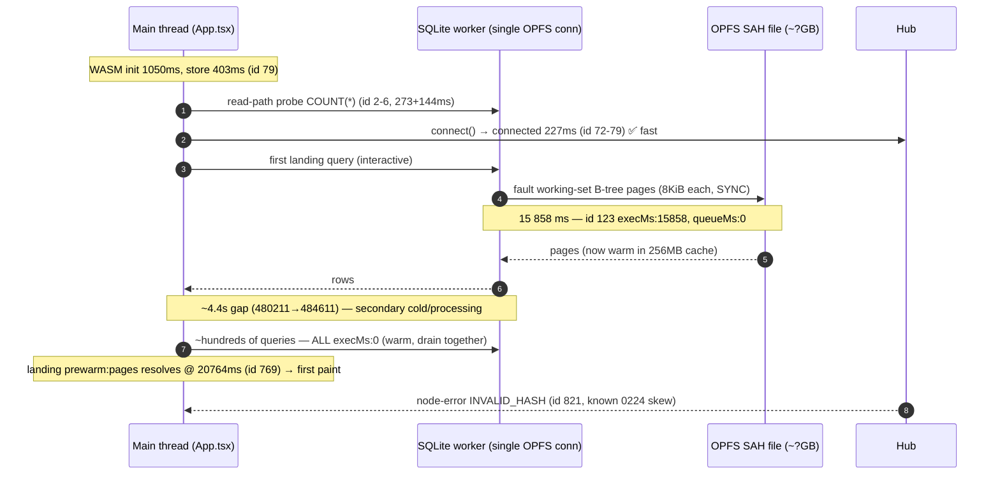
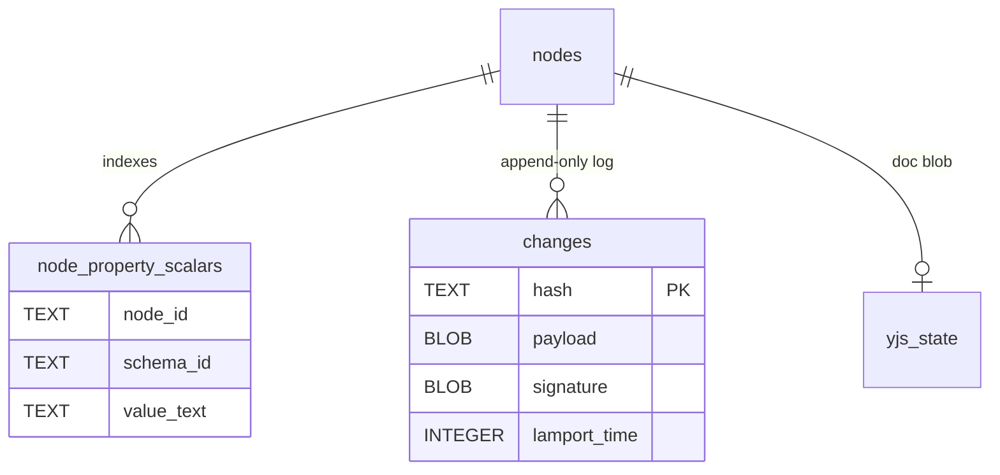
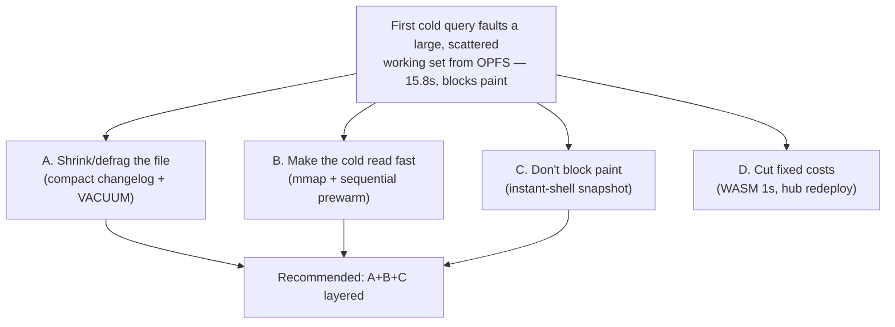
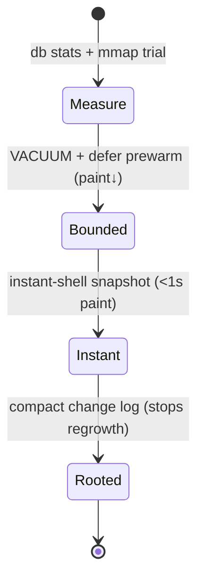

# The 15-Second Cold First Query: First Paint Blocked by Cold OPFS Page-In

## Problem Statement

A returning user with a fully populated local cache waits ~20 seconds before any
data renders, then everything appears at once. This is the fourth or fifth time
we've chased this stall (0204, 0227, 0228, 0229). Every prior fix only moved the
problem, because we never had per-operation worker timing. This time we do — the
[0229 boot-debug bridge](../../packages/sqlite/src/adapters/boot-log-bridge.ts)
(shipped in #288) surfaces the SQLite worker's `execMs`/`queueMs` on the main
console — and the capture finally names the culprit in **one line**.

## Executive Summary

**It is one query. The first interactive SQL query after boot takes 15.858
seconds of *real execution time* and blocks the single SQLite worker; everything
else drains in milliseconds the instant it finishes.** From the capture:

```
id 123  [xNet] sqlite op query {"lane":"interactive","queueMs":0,"execMs":15858}
```

`queueMs: 0` — it was not waiting behind anything; it ran first. `execMs: 15858`
— it spent 15.8 s *inside the WASM/OPFS read path*. Every subsequent op reports
`execMs: 0` (warm). This is the canonical cold-cache signature: **the first query
faults its working set of B-tree pages from cold OPFS storage, synchronously, on
the one worker thread, and only the first one pays.**

**This overturns three earlier theories.** It is *not* the hub (connected in
227 ms — `id 79`), *not* an empty cache (probe reads 99 699 nodes / 1.32 M
properties / 424 k changes — `id 6`), *not* head-of-line blocking behind a
trivial op (0227/0228/0229 all guessed this), and *not* an N+1 query flood (the
flood is real — hundreds of `query` ops — but every one is `execMs: 0`; they are
victims queued behind the 15.8 s op, not the cause).

**The 256 MB page cache (0229 fix D) cannot help the first read.** `cache_size`
only avoids *re-reading* pages; the first cold fault still pays full price. That
is exactly why everything *after* the monster query is instant and the monster
itself is not.

**Why one query touches so many cold pages: the file is huge and fragmented.**
The `changes` table — the append-only, signed, hash-chained change log
([`schema.ts:126`](../../packages/sqlite/src/schema.ts)) — holds **424 026 rows**,
each a `payload BLOB` + `signature BLOB` + hash + metadata. Plus `node_property_scalars`
at **1.32 M rows** across five indexes. The projection tables the landing query
reads (`nodes`, `node_property_scalars`) are interleaved across a multi-hundred-MB
/ GB file, so a cold index walk faults pages scattered the whole way through it.

**Recommendation (layered).** (1) Confirm file size from the `db stats @ open`
line we already emit. (2) Attack the file-size root cause: **compact/snapshot the
424 k-row change log** and **background-VACUUM** to defragment. (3) Make the
unavoidable first cold read cheap: **trial `PRAGMA mmap_size`** and add a
**sequential working-set prewarm** that pulls the landing indexes in file order.
(4) Stop blocking paint on it entirely with an **instant-shell snapshot**.
(5) Redeploy the tenant hub to clear the orthogonal `INVALID_HASH` flood.

## Current State In The Repository

### The boot read path and where the 15.8 s lands



### The pragmas already in place (0184, 0229)

[`web.ts:258-276`](../../packages/sqlite/src/adapters/web.ts) sets, on open:

```ts
this.execSync('PRAGMA page_size = 8192')        // bigger pages, fewer reads
this.execSync('PRAGMA synchronous = NORMAL')
this.execSync('PRAGMA cache_size = -262144')    // 256 MB — helps RE-reads only
this.execSync('PRAGMA temp_store = MEMORY')
this.execSync('PRAGMA journal_mode = TRUNCATE')
```

No `mmap_size`. `PRAGMA optimize` runs on `close()` ([`web.ts:286`](../../packages/sqlite/src/adapters/web.ts)),
which a hard reload never reaches.

### The single worker + scheduler (0228)

All storage funnels through one `opfs-sahpool` connection on one worker
([`worker-scheduler.ts`](../../packages/sqlite/src/adapters/worker-scheduler.ts)).
The scheduler reorders *queued* work but, by its own contract, **cannot preempt
an op already executing in WASM** — so one 15.8 s in-flight read stalls the lane
no matter how the queue is prioritized. The per-op `onOp` reporter
([`web-worker.ts:55`](../../packages/sqlite/src/adapters/web-worker.ts)) is what
gave us `execMs`/`queueMs`.

### What hits the worker at boot (the fan-out, all victims of the cold read)

[`WorkingSetPrewarm`](../../apps/web/src/components/WorkingSetPrewarm.tsx) mounts
at provider level and fires five `useQuery` subscriptions (Page, Database,
Canvas, Channel, Task). The app shell adds its own: Profile, ConnectionWave,
Project, Space, Tag, InboxState, MessageRequest (all visible in the `query plan`
logs, ids 749–819). Plus six tracked-doc `yjs_state` reads via
[`loadDoc`](../../packages/runtime/src/sync/node-pool.ts) (`id 187`+, each
`readMs ≈ 19925` — pure queue wait behind the monster). Whichever query reaches
the worker *first* eats the 15.8 s; the rest are warm.

### The bloat source: an un-pruned change log



`changes` is never pruned client-side (the web path only ever does a wholesale
`DELETE FROM yjs_state`; there is no change-log compaction). 424 k signed change
rows is the dominant share of the file, and it grows monotonically — so every
returning-user cold boot reads index pages scattered across an ever-larger file.

## The Timing Proof

`t0 = 1782510463968` (first log).

| t+ms | Event | Reading |
|---:|---|---|
| 380 | read-path probe: 99 699 nodes / 1.32 M props / 424 k changes | **cache full; probe fast (273+144ms)** |
| 610 | `boot timeline … {wasm:1050, store:403, connect:227}` | WASM 1 s; **hub fast** |
| ~385→16 243 | **first landing query executes** | **`id 123` execMs:15858, queueMs:0** |
| 16 243→20 643 | (no worker ops logged) | **~4.4 s secondary gap** |
| 20 643–20 768 | hundreds of queries, **all execMs:0** | warm drain + 6 loadDocs (`readMs≈19925`) |
| 20 764 | `landing query prewarm:pages: 20764ms` | **first data paint** |
| 20 827 | `INVALID_HASH` | hub protocol skew (0224, orthogonal) |

Two facts are decisive:

1. **One op, 15.858 s, `queueMs:0`** — it ran first and the time is *execution*,
   not waiting. The cache works; this is cold I/O on the first access.
2. **Everything after is `execMs:0`** — once the working set is warm in the
   256 MB cache, the identical queries are free. The cost is paid exactly once,
   on the first cold read, and it is the whole stall.

The **~4.4 s gap** after the monster (16 243→20 643 ms) has no traced worker op —
it is either a second cold read on a different table/connection (e.g. the data
worker's `PortSQLiteAdapter` first touch) or main-thread processing of the
result. It needs one more capture to localize (see Open Questions).

## External Research

- **OPFS `createSyncAccessHandle` cold reads.** The `opfs-sahpool` VFS reads the
  DB in `page_size` chunks through a *synchronous* access handle. Open is cheap;
  the cost is faulting the working set on the first real query. On a large,
  fragmented file this is seconds and scales with file size — every browser-SQLite
  project (`wa-sqlite`, `absurd-sql`, official sqlite-wasm) documents "first query
  slow, rest fast" as the canonical cold-cache signature. Our trace is a textbook
  instance.
- **`PRAGMA mmap_size`.** Memory-mapping lets SQLite fault pages via the OS rather
  than copying through synchronous `xRead` calls. Where the VFS supports it, it
  dramatically cuts cold random-read cost. Support under `opfs-sahpool` is **not
  guaranteed** (the SAH VFS may ignore it) — must be measured, not assumed.
- **`VACUUM` / `PRAGMA incremental_vacuum`.** SQLite never shrinks a file on
  delete; freed pages go on a freelist and tables/indexes fragment as they grow
  interleaved. `VACUUM` rewrites a compact, contiguous file so cold reads become
  near-sequential. It is itself heavy on a GB file (must run off the critical
  path), but it is a one-time cost that pays back every subsequent boot.
- **Sequential vs. random OPFS reads.** A single sequential pass over a file is
  far cheaper than the same bytes faulted in random index order. Prewarming the
  hot index pages in file order (or a `PRAGMA integrity_check`-style scan) warms
  the cache much faster than letting the first user query walk a B-tree.
- **Event-log compaction (event sourcing).** Append-only logs are universally
  snapshotted + truncated; a client that has already projected the log into a
  queryable store does not need full history resident — it needs the projection
  plus a recent tail for conflict resolution. Our `changes` table keeps all
  424 k rows. (See repo 0177 cold-storage tiering and 0200 portable-protocol
  kernel notes.)

## Key Findings

1. **The stall is a single 15.8 s cold OPFS page-in**, not the hub, an empty
   cache, queueing, or N+1. Proven by `execMs:15858, queueMs:0` with all later
   ops `execMs:0`.
2. **`cache_size` is the wrong lever for this** — it accelerates re-reads, and
   the first read is the entire problem. (0229-D was a reasonable guess; the
   trace disproves it as a fix.)
3. **File size is the multiplier.** A 424 k-row signed change log + 1.32 M-row
   scalar index across a fragmented file means the cold read traverses a large,
   scattered working set. Shrinking/defragmenting the file shrinks the stall.
4. **We still have not read the `db stats @ open` line** (it is emitted but was
   not in the paste). File size / freelist count converts hypothesis (3) into
   measurement and tells us if 0229-C's presence VACUUM ever ran.
5. **The hub is fast and the boot ordering is already fixed** (0229-B): connect
   227 ms, sync round-trips ~1 ms each. Sync is not on the critical path.
6. **A ~4.4 s secondary gap** exists after the monster query, currently
   unexplained by the trace.
7. **`INVALID_HASH`** is the known 0224 hub protocol skew — orthogonal; redeploy.

## Options And Tradeoffs



### A. Shrink and defragment the file *(root cause, highest leverage)*

- **A1 — Compact/snapshot the change log.** Keep a projection snapshot + a recent
  change tail; prune fully-applied, synced history. Attacks the dominant file
  contributor (424 k rows). ✅ Permanent, scales. ⚠️ Must preserve the hash-chain
  invariants and conflict-resolution window (portable-protocol kernel); design
  carefully.
- **A2 — Move `changes` to a separate DB file/connection.** The projection tables
  the landing queries read then live in a small, dense file that cold-reads fast,
  independent of log growth. ✅ Strong isolation. ⚠️ Larger refactor; two attach
  points.
- **A3 — One-time background VACUUM.** Defragment after A1/cleanup. ✅ Simple, big
  win on a fragmented file. ⚠️ Heavy; idle/off-critical-path only; needs free disk.

### B. Make the unavoidable first cold read cheap

- **B1 — `PRAGMA mmap_size`.** Trial 128–256 MB at open. ✅ Potentially turns
  15.8 s into low seconds for free. ⚠️ May be a no-op under `opfs-sahpool` —
  measure with the `db stats`/`execMs` we now log.
- **B2 — Sequential working-set prewarm.** Right after open, in the background,
  pull the landing indexes' pages in file order (e.g. targeted scans of
  `idx_nodes_all_schema_updated` / `idx_prop_scalars_text`) so the real first
  query hits warm cache. ✅ Converts random faults to sequential. ⚠️ Still pays I/O
  once; pairs with A so the file it scans is small.

### C. Stop blocking paint on it

- **C1 — Instant-shell snapshot.** Maintain a tiny, cheap-to-cold-read snapshot
  (last-N items per landing schema, a small dedicated table or single KV blob).
  Paint from it in <1 s, hydrate from full tables in the background. ✅ Fixes
  *perceived* latency regardless of the cold-read cost. ⚠️ A second source of
  truth to keep fresh (write-through on mutation).
- **C2 — Minimal critical-path query.** Put only the *current route's* query on
  the boot path; defer the `WorkingSetPrewarm` fan-out a tick so the first cold
  fault is the smallest possible working set. ✅ Small change. ⚠️ Marginal alone;
  multiplies with B.

### D. Fixed costs

- **D1 — WASM init 1 s.** Cache/stream-compile the sqlite-wasm module. ✅ ~1 s off
  every boot. ⚠️ Secondary to the 15.8 s.
- **D2 — Redeploy hub.** Clears `INVALID_HASH`. Orthogonal but noisy.

| Option | Fixes first paint | Fixes root cause | Effort | Risk |
|---|---|---|---|---|
| A1 compact log | ✅✅ | ✅ | **L** | med (kernel invariants) |
| A2 split DB | ✅✅ | ✅ | **L** | med |
| A3 VACUUM | ✅ | partial | **S–M** | low |
| B1 mmap | ✅ (if supported) | partial | **S** | low |
| B2 seq prewarm | ✅ | — | **M** | low |
| C1 instant shell | ✅✅ (perceived) | — | **M** | low–med |
| C2 minimal path | ✅ | — | **S** | low |

## Recommendation

Ship in three waves, measuring after each with the `execMs`/`db stats` we now
emit:

1. **Measure + cheap wins (this PR-sized step).**
   - Capture the `[xNet] db stats @ open` line; record `bytes`/`freelistCount`.
   - Trial **B1 `mmap_size`** at open (guarded) — if `execMs` on the first query
     drops, this alone may be most of the fix.
   - **A3**: schedule a one-time background `VACUUM` when idle (verify 0229-C's
     presence cleanup actually ran first).
   - **C2**: defer the prewarm fan-out one tick behind the active route's query.
2. **Perceived-latency fix.** **C1 instant-shell snapshot** so first paint is
   <1 s independent of the cold read.
3. **Root cause.** **A1 change-log compaction** (and evaluate **A2** splitting
   `changes` into its own file). This is what stops the stall from regrowing as
   the workspace ages — the others bound it, this removes the source.

Redeploy the tenant hub (**D2**) alongside, and keep **B2** in reserve if A+B1
don't get first paint under target.



## Example Code

**B1 — trial mmap at open** ([`web.ts`](../../packages/sqlite/src/adapters/web.ts), after `cache_size`):

```ts
// Memory-map reads so the first cold query faults via the OS instead of
// thousands of synchronous 8KiB xRead calls. May be a no-op under opfs-sahpool —
// the boot-debug execMs on the first query tells us if it helped (0233).
try {
  this.execSync('PRAGMA mmap_size = 268435456') // 256 MB
} catch (err) {
  log('[WebSQLiteAdapter] mmap_size not applied:', err)
}
```

**A3 — one-time background VACUUM, idle-scheduled** (mirrors the 0229 presence
cleanup gating in [`presence-blob-cleanup.ts`](../../apps/web/src/lib/presence-blob-cleanup.ts)):

```ts
if (!localStorage.getItem('xnet:db-vacuumed:v1')) {
  requestIdleCallback(async () => {
    const before = await adapter.getDatabaseSize()
    await adapter.vacuum()                 // heavy — NEVER inline at startup
    const after = await adapter.getDatabaseSize()
    localStorage.setItem('xnet:db-vacuumed:v1', '1')
    console.info('[xNet] vacuum', { before, after })
  }, { timeout: 15000 })
}
```

**B2 — sequential working-set prewarm** (background, after open, before the real
landing queries resolve):

```ts
// Warm the landing indexes' pages in file order so the first user query hits a
// warm cache. Cheap counts that walk the covering indexes the landing queries use.
void adapter.query(`SELECT count(*) FROM nodes WHERE schema_id IS NOT NULL`)
void adapter.query(`SELECT count(*) FROM node_property_scalars`)
```

## Risks And Open Questions

- **Is the 15.8 s OPFS random I/O, or something mmap can't touch?** B1 + the
  `execMs` log answer it in one capture before we invest in A.
- **What is the file size?** Unread `db stats @ open` line; gates the A-track ROI.
- **The ~4.4 s secondary gap** — second cold read (data-worker `PortSQLiteAdapter`
  first touch?) or main-thread processing? Add a one-shot tracer around the
  bridge result handling and the data-worker open.
- **Change-log compaction vs. protocol invariants.** `changes` is the
  hash-chained kernel (0200). Pruning must keep verification + the LWW
  conflict-resolution window intact; snapshot semantics need a spec.
- **`VACUUM` cost/safety** on a GB OPFS file — must be idle, one-shot, with disk
  headroom; abort cleanly if the tab closes.
- **mmap under SAH VFS** may be unsupported or silently ignored — treat as a
  measured experiment, not a guaranteed win.
- **Instant-shell staleness** — the snapshot must be write-through on mutation or
  it shows stale data for a beat after edits.

## Implementation Checklist

- [ ] Capture and record `[xNet] db stats @ open` (`bytes`, `pageCount`,
      `freelistCount`) — confirm/deny file bloat and whether 0229-C VACUUM ran.
- [ ] **B1**: add guarded `PRAGMA mmap_size` in [`web.ts`](../../packages/sqlite/src/adapters/web.ts) open; re-capture the
      first-query `execMs`.
- [ ] **C2**: defer the `WorkingSetPrewarm` fan-out one tick behind the active
      route's query ([`WorkingSetPrewarm.tsx`](../../apps/web/src/components/WorkingSetPrewarm.tsx) / [`App.tsx`](../../apps/web/src/App.tsx)).
- [ ] **A3**: idle-scheduled one-time `VACUUM` gated by a localStorage flag.
- [ ] Instrument the ~4.4 s secondary gap (bridge result handling + data-worker
      `PortSQLiteAdapter` first op).
- [ ] **C1**: design + build the instant-shell snapshot (write-through; paint <1 s).
- [ ] **A1**: spec change-log compaction/snapshot preserving hash-chain + LWW
      window; implement prune + snapshot; guard with a test.
- [ ] Evaluate **A2** (separate `changes` DB file) once A1 lands.
- [ ] **D1**: cache/stream-compile the sqlite-wasm module (trim the ~1 s WASM cost).
- [ ] **D2**: redeploy the tenant hub to clear `INVALID_HASH` (0224).

## Validation Checklist

- [ ] A boot capture shows the first landing query's `execMs` falls from
      ~15 800 ms to sub-second (B1) or the query never lands on the critical path
      (C1/C2).
- [ ] After **A3**: `db stats` shows the file materially smaller; cold first-query
      `execMs` drops; subsequent boots stay fast.
- [ ] After **A1**: `changes` row count is bounded (snapshot + tail), and it no
      longer dominates file size as the workspace ages.
- [ ] Returning-user cold boot paints landing data in **< 1 s** (instant shell),
      with full data hydrated shortly after.
- [ ] The ~4.4 s secondary gap is named and addressed.
- [ ] No `INVALID_HASH` after hub redeploy.
- [ ] Throttled-CPU / second-tab boots behave (no silent in-memory fallback; file
      size logged).

## References

- **This capture**: first query `execMs:15858, queueMs:0` (id 123); all later ops
  `execMs:0`; hub connect 227 ms (id 79); 6 loadDocs `readMs≈19925` (id 187+);
  landing prewarm:pages 20764 ms (id 769); `INVALID_HASH` (id 821).
- Pragmas / open: [`web.ts:258-296`](../../packages/sqlite/src/adapters/web.ts)
- Single worker + scheduler: [`worker-scheduler.ts`](../../packages/sqlite/src/adapters/worker-scheduler.ts) · [`web-worker.ts:55`](../../packages/sqlite/src/adapters/web-worker.ts)
- Boot-debug bridge (this capture's enabler): [`boot-log-bridge.ts`](../../packages/sqlite/src/adapters/boot-log-bridge.ts) (PR #288)
- Change log + scalar index schema: [`schema.ts:53,126`](../../packages/sqlite/src/schema.ts)
- Landing fan-out: [`WorkingSetPrewarm.tsx`](../../apps/web/src/components/WorkingSetPrewarm.tsx) · boot in [`App.tsx:390-442`](../../apps/web/src/App.tsx)
- Doc cold-load: [`node-pool.ts:125`](../../packages/runtime/src/sync/node-pool.ts)
- Batched hydration (ruled out as N+1 source): [`sqlite-adapter.ts:2053`](../../packages/data/src/store/sqlite-adapter.ts)
- Prior attempts: `0204` (cold-start) · `0212` (read-path probe) · `0227`
  (presence off critical path) · `0228` (worker scheduler) · `0229` (instrument +
  hub-dial-early + cache_size) · `0184` (large-DB initial load) · `0177` (cold
  storage tiering) · `0200` (portable-protocol change-log kernel) · `0224`
  (`INVALID_HASH` hub skew).
- External: OPFS `createSyncAccessHandle` cold-read characteristics · SQLite
  `mmap_size`/`VACUUM`/`incremental_vacuum` · `wa-sqlite`/`absurd-sql` cold-cache
  guidance · event-sourcing snapshot/compaction.
