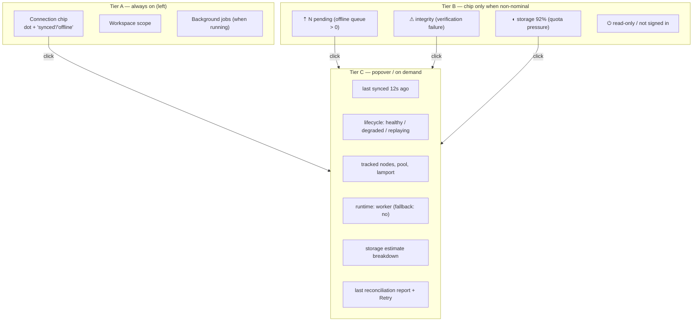
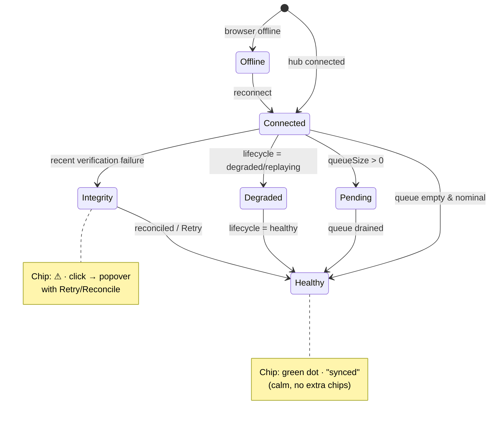
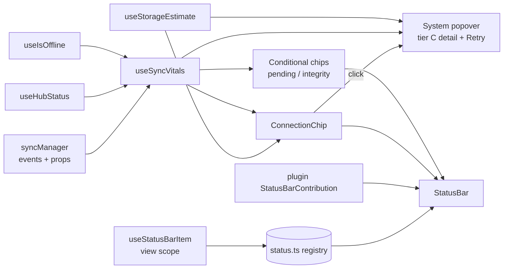

# System Info In The Bottom Status Bar

> What can — and should — the 24px bottom bar tell you about the
> running system, and how do we surface it without turning a calm
> ambient strip into a dashboard?

## Problem Statement

xNet already ships a real desktop status bar
([`apps/web/src/workbench/StatusBar.tsx`](apps/web/src/workbench/StatusBar.tsx)):
a 24px mono strip with a hub sync dot, the data-runtime flag, the
active workspace scope, background jobs, and a right-hand set of
view-published items plus the theme toggle. It is glanceable and
deliberately minimal.

Underneath the app, however, there is a **deep, already-reactive pool
of system signals** that never reaches the user: an offline queue
size, sync lifecycle phases, hash-verification failures, reconciliation
reports, tracked-node / pool counts, runtime mode + fallback, storage
quota (demo mode and OPFS), identity / security level, billing plan,
upload/verification progress, and presence awareness. Today most of
this is only observable in DevTools or not at all.

The question for this exploration: **which of these signals belong in
the bottom bar, which belong one click away, and which belong nowhere
near it** — and what's the smallest set of new plumbing that unlocks
the valuable ones without violating the bar's "ambient, glanceable,
never modal" contract (the explicit design note at the top of
`StatusBar.tsx`).

## Executive Summary

- The status bar's **architecture is already right**: a Zustand
  registry ([`status.ts`](apps/web/src/workbench/status.ts)) with a
  `left = workspace scope` / `right = view scope` split, a
  `useStatusBarItem` hook for views, `reportJob` for long work, and a
  plugin `StatusBarContribution` surface. This mirrors VS Code's
  primary/secondary guidance almost exactly. We should **extend it, not
  replace it**.
- The single highest-value change is to **promote the lone sync dot
  into a "connection chip" with a click-through popover**. The dot stays
  glanceable; the popover becomes the canonical home for the deep
  signals (queue size, last-synced, lamport, tracked nodes, last
  verification failure, last reconciliation, runtime mode, storage
  estimate). This answers "what system info can be displayed" with a
  layered answer instead of cramming everything onto one row.
- A few signals deserve their **own always-on chip** when non-nominal:
  offline / pending-changes count, a verification-failure warning, and
  storage pressure (demo quota or OPFS near-full). These follow the
  local-first UX norm: subtle when healthy, a quiet badge when not,
  color only as a last resort.
- **Mobile has no status bar at all** ([`MobileShell.tsx`](apps/web/src/workbench/MobileShell.tsx)
  uses a top bar + bottom nav). The critical health signals (offline,
  pending, errors) need a home there too — most cheaply as a single
  icon in the existing `MobileTopBar`.
- Net new plumbing is small: a `useSyncVitals()` aggregator hook over
  `syncManager`, a `useStorageEstimate()` hook over
  `navigator.storage.estimate()`, and a generic `<StatusChip>` /
  popover primitive. Everything else already exists and is reactive.

## Current State In The Repository

### The bar itself

[`apps/web/src/workbench/StatusBar.tsx`](apps/web/src/workbench/StatusBar.tsx)
renders a single `<footer>`:

```tsx
<footer className="flex h-6 shrink-0 items-center gap-4 border-t border-hairline
                    bg-surface-2 px-3 font-mono text-[11px] text-ink-2">
  {/* left / workspace scope */}
  <span … >  <dot className={hub.tone} /> {hub.label} </span>   // sync
  <span>{runtimeMode()}</span>                                  // data runtime
  <ScopeStatus />                                               // workspace scope
  {jobList.map(…)}                                              // background jobs
  {leftItems.map(…)}                                            // contributed/published
  <span className="flex-1" />                                   // spacer
  {/* right / view scope */}
  {rightItems.map(…)}                                           // view-published
  <WhatsNewButton />
  <button onClick={toggleTheme}>…</button>                      // theme toggle
</footer>
```

The hub status is the only "system" signal, mapped through a tiny
label table:

```tsx
const HUB_LABEL = {
  disconnected: { label: 'offline', tone: 'bg-ink-3' },
  connecting: { label: 'connecting…', tone: 'bg-warning' },
  connected: { label: 'synced', tone: 'bg-success' },
  error: { label: 'sync error', tone: 'bg-destructive' }
}
```

### The publishing registry

[`apps/web/src/workbench/status.ts`](apps/web/src/workbench/status.ts)
is an ephemeral Zustand store with two surfaces:

- `useStatusBarItem(item | null)` — a view publishes a `StatusBarItem`
  (`{ id, text, side, title?, onClick? }`) for its lifetime.
- `reportJob(job)` / `WorkbenchJob` (`{ id, label, progress? }`) —
  imperative, for non-React call sites (imports, sync).

### Who publishes today

- **Comms** ([`comms/StatusItems.tsx`](apps/web/src/comms/StatusItems.tsx)):
  `InboxBellItem` (`🔔 N` mentions / `🔔 ·` activity) and
  `PresenceStatusItem` (`◉ N here`), both left side, both click to open
  a panel.
- **Pages** ([`components/PageView.tsx`](apps/web/src/components/PageView.tsx)):
  right-side "saving… / saved" and "N peers".
- **Plugins**: `StatusBarContribution`
  ([`packages/plugins/src/contributions.ts`](packages/plugins/src/contributions.ts))
  — `{ id, text | () => text, side?, tooltip?, command?, priority? }`,
  merged and sorted in
  [`workbench/contributions.tsx`](apps/web/src/workbench/contributions.tsx).

### The mounting points

- Desktop: `DesktopWorkbench` in
  [`workbench/Workbench.tsx`](apps/web/src/workbench/Workbench.tsx)
  renders `<StatusBar />` as the last child of the shell frame.
- Mobile: [`workbench/MobileShell.tsx`](apps/web/src/workbench/MobileShell.tsx)
  has **no status bar** — a 12px `MobileTopBar` (menu / title / details)
  and a static `MobileBottomNav` (Explorer / Search / New / Tasks /
  Settings) via [`packages/ui/src/components/BottomNav.tsx`](packages/ui/src/components/BottomNav.tsx).

### The signal pool (already reactive, mostly unused by the bar)

The runtime exposes far more than the bar shows. Highlights:

| Domain    | Signal                                                                             | Source                                                                                                     |
| --------- | ---------------------------------------------------------------------------------- | ---------------------------------------------------------------------------------------------------------- |
| Sync      | `useHubStatus()` → `disconnected\|connecting\|connected\|error`                    | [`packages/react/src/hooks/useHubStatus.ts`](packages/react/src/hooks/useHubStatus.ts)                     |
| Sync      | browser offline (`useIsOffline()`)                                                 | [`packages/react/src/components/OfflineIndicator.tsx`](packages/react/src/components/OfflineIndicator.tsx) |
| Sync      | lifecycle phase `idle\|connecting\|healthy\|degraded\|replaying\|…`                | [`packages/runtime/src/sync/sync-manager.ts`](packages/runtime/src/sync/sync-manager.ts)                   |
| Sync      | `queueSize` (offline pending), `trackedCount`, `poolSize`, `pendingBlobCount`      | `sync-manager.ts` (readonly props + events)                                                                |
| Integrity | `lastVerificationFailure` `{ nodeId, sender, reason, at }`                         | `sync-manager.ts` (`on('verification-failure')`)                                                           |
| Integrity | `lastReconciliationReport` `{ reason, replayedOfflineChanges, repaired…, at }`     | `sync-manager.ts` (`on('reconciliation')`)                                                                 |
| Presence  | `onAwarenessSnapshot(nodeId, …)` → online users                                    | `sync-manager.ts`; surfaced via `useComms()`                                                               |
| Storage   | demo mode `{ limits, usage }` (`useDemoMode()`)                                    | [`packages/react/src/hooks/useDemoMode.ts`](packages/react/src/hooks/useDemoMode.ts)                       |
| Storage   | OPFS estimate — **not yet surfaced** (`navigator.storage.estimate()`)              | n/a                                                                                                        |
| Identity  | `useIdentity()` `{ did, isAuthenticated }`; `useSecurity()` `{ level, hasPQKeys }` | [`packages/react/src/hooks/useIdentity.ts`](packages/react/src/hooks/useIdentity.ts)                       |
| Runtime   | `runtimeStatus` `{ requestedMode, activeMode, usedFallback, phase }`               | [`packages/react/src/runtime.ts`](packages/react/src/runtime.ts)                                           |
| Billing   | `useBilling()` `{ plan, status, isActive }`                                        | [`packages/react/src/hooks/useBilling.ts`](packages/react/src/hooks/useBilling.ts)                         |
| Progress  | `useFileUpload().progress`, `useBackup().uploading`, `useVerification().progress`  | `packages/react/src/hooks/*`                                                                               |
| Data      | `useQuery(...).pageInfo.totalCount`, `nodeStoreReady`                              | [`packages/react/src/hooks/useQuery.ts`](packages/react/src/hooks/useQuery.ts)                             |

## External Research

**VS Code status bar UX guidelines**
([code.visualstudio.com](https://code.visualstudio.com/api/ux-guidelines/status-bar))
codify exactly the split xNet already uses:

- **Primary (left)** = workspace-wide status, problems/warnings, sync.
  **Secondary (right)** = contextual info (language, indentation,
  feedback).
- Use concise text labels; **icons sparingly**, only for recognizable
  metaphors.
- **Do not** apply custom background colors; reserve high-visibility
  warning/error backgrounds for blocking issues **as a last resort**.
- For background activity, show a **loading/spin icon**; escalate to a
  progress notification only if user attention is critical.
- **Limit the number of items** — many extensions compete for the same
  strip; don't overload it.

**Editor statuslines** (Helix, Cursor) show the broader vocabulary that
a status strip can carry — mode, diagnostics (error/warning counts),
cursor position, selection count, file encoding, line endings, git
branch, LSP spinner — arranged in left/center/right sections
([Helix docs](https://docs.helix-editor.com/master/editor.html)). The
relevant lesson is _sectioning + configurability_, not copying the
file-centric items.

**Local-first / offline-first sync UX** consistently recommends:

- A **subtle, non-intrusive** indicator beats a banner — a small
  "syncing" glyph or a quiet "3 pending" label near where edits happen
  ([dev.to](https://dev.to/daliskafroyan/builing-an-offline-first-app-with-build-from-scratch-sync-engine-4a5e),
  [appmaster.io](https://appmaster.io/blog/offline-first-background-sync-conflict-retries-ux)).
- Give users **one place** to understand sync — an "Outbox / Pending
  changes" view listing queued operations in plain language
  ([Google Open Health Stack](https://developers.google.com/open-health-stack/design/offline-sync-guideline)).
- **Color-code states** (pending / in-progress / synced / failed) and
  let users **retry** failures and **inspect** details.

The convergent conclusion across all three: keep the always-on row tiny
and calm; put depth and retry behind a click.

## Key Findings

1. **The split is already correct.** `left = workspace`, `right = view`
   matches VS Code's primary/secondary rule. No re-architecture needed.
2. **The bar is signal-starved, not signal-poor.** A rich, reactive
   pool exists; almost none of it is wired to the UI.
3. **"What can be displayed" is the wrong framing; "what tier" is the
   right one.** Three tiers: (A) always-on chip, (B) chip only when
   non-nominal, (C) popover/detail-on-demand. Most deep signals are
   tier C.
4. **One chip should aggregate sync.** Today's dot answers "is the hub
   connected?" but not "are my changes safe?" — `connected` can coexist
   with a non-empty offline queue, a degraded lifecycle, or a recent
   verification failure. These should fold into one **connection chip**.
5. **Storage is the biggest blind spot.** OPFS usage / demo quota is
   never shown; users hit eviction or quota with no warning. A
   `useStorageEstimate()` hook is missing and cheap to add.
6. **Mobile is a gap.** Health signals have no home on `MobileShell`.
7. **Don't over-show.** The VS Code guidance and the calm-UI direction
   of [exploration 0232](docs/explorations/0232_[_]_COZY_CALM_AND_AGENT_FIRST_A_DELIGHTFUL_PLACE_TO_SPEND_THE_DAY.md)
   both argue for restraint: nominal state should be near-silent.

### Tiering the signals



## Options And Tradeoffs

### Option 1 — Do nothing / status quo

Keep the single dot. **Pro:** zero work, maximally calm. **Con:** the
valuable safety signals (pending changes, integrity, storage) stay
invisible; users can lose data confidence with no recourse. Rejected —
the whole point of the bar is trust-at-a-glance.

### Option 2 — Flat expansion: add many always-on chips

Render queue size, lamport, tracked nodes, runtime, storage, identity,
plan all the time. **Pro:** everything visible, no clicks. **Con:**
directly violates VS Code's "limit items / don't overload" and 0232's
calm direction; turns a glanceable strip into a noisy dashboard; mono
text at 11px gets unreadable past ~6 items; nominal noise hides real
signal. Rejected.

### Option 3 — Layered: connection chip + conditional chips + popover (recommended)

Promote the dot to a **connection chip** that opens a **system popover**
(tier C home). Add tier-B chips that appear **only when non-nominal**.
Keep tier-A minimal. **Pro:** honors the calm contract, matches both VS
Code and local-first guidance, scales to many signals without crowding,
gives users a retry/inspect surface. **Con:** needs a small popover
primitive and an aggregator hook. This is the sweet spot.

### Option 4 — A dedicated "System / Diagnostics" panel (no bar changes)

Put all of it in a context-panel section instead. **Pro:** unlimited
room; good for deep DevTools-style data. **Con:** not glanceable —
defeats the "ambient" purpose for the critical few (offline, pending,
integrity). **Verdict:** complementary, not a substitute — tier C's
_overflow_ can deep-link into such a panel (or reuse DevTools), but the
chips + popover remain the front door.

### Comparison

|                  | Always-on noise | Depth reachable | Calm-UI fit      | New plumbing |
| ---------------- | --------------- | --------------- | ---------------- | ------------ |
| 1 status quo     | minimal         | none            | ✅               | none         |
| 2 flat expansion | high            | n/a             | ❌               | low          |
| 3 layered (rec.) | minimal         | high            | ✅               | small        |
| 4 panel only     | minimal         | high            | ⚠ not glanceable | medium       |

## Recommendation

Adopt **Option 3** in three phases.

**Phase 1 — Connection chip + system popover.** Replace the static dot
with a `<ConnectionChip>` backed by a new `useSyncVitals()` aggregator
(see Example Code) that folds `useHubStatus`, `useIsOffline`, and
`syncManager` (`queueSize`, `lifecycle`, `lastVerificationFailure`,
`lastReconciliationReport`, `trackedCount`, `poolSize`) into one object.
The chip label stays terse ("synced" / "offline" / "syncing…"); the dot
tone stays. Clicking opens a popover anchored above the bar listing tier
C details and a **Retry sync / Reconcile** action wired to the existing
reconciliation path. Derive **"last synced N ago"** from
`lifecycle.lastTransitionAt`.

**Phase 2 — Conditional safety chips.** Add tier-B chips that render
_only_ when non-nominal:

- `⇡ N pending` when `queueSize > 0` (the local-first "pending changes"
  norm) — clicking opens the same popover.
- `⚠` integrity when `lastVerificationFailure` is recent.
- `◐ N%` storage when demo quota or a new `useStorageEstimate()` crosses
  a threshold (e.g. >85%).

**Phase 3 — Mobile parity + view-scope richness.** Add a single health
glyph to `MobileTopBar` that mirrors the connection chip (tap → a Sheet
with the same popover content). Optionally let views publish richer
right-side items (selection count, row/word count) — the
`useStatusBarItem` surface already supports this; it's a content
question, not a plumbing one.

**Non-goals / explicitly keep out of the always-on row:** lamport clock,
tracked-node counts, runtime mode + fallback, security level, billing
plan, pool internals — all of these live in the **popover** (tier C) or
behind a "Details → DevTools" link. They are diagnostics, not ambient
status.

### How the chip resolves what to show



### Data flow



## Example Code

A focused aggregator hook — the one genuinely new piece of plumbing.
Everything it reads is already reactive:

```ts
// apps/web/src/workbench/useSyncVitals.ts
import { useHubStatus, useXNet } from '@xnetjs/react'
import { useIsOffline } from '@xnetjs/react' // OfflineIndicator export
import { useEffect, useState } from 'react'

export interface SyncVitals {
  /** Coarse chip state used for dot tone + label. */
  state: 'offline' | 'syncing' | 'degraded' | 'integrity' | 'synced'
  hub: ReturnType<typeof useHubStatus>
  offline: boolean
  queueSize: number
  trackedCount: number
  poolSize: number
  lifecyclePhase: string
  lastSyncedAt: number | null
  verificationFailure: { nodeId: string; reason: string; at: number } | null
}

export function useSyncVitals(): SyncVitals {
  const hub = useHubStatus()
  const offline = useIsOffline()
  const { syncManager } = useXNet()
  const [, force] = useState(0)

  // syncManager exposes readonly props + events; re-render on change.
  useEffect(() => {
    if (!syncManager) return
    const bump = () => force((n) => n + 1)
    const offs = [
      syncManager.on('lifecycle', bump),
      syncManager.on('status', bump),
      syncManager.on('verification-failure', bump),
      syncManager.on('reconciliation', bump)
    ]
    return () => offs.forEach((off) => off?.())
  }, [syncManager])

  const queueSize = syncManager?.queueSize ?? 0
  const lifecycle = syncManager?.lifecycle
  const failure = syncManager?.lastVerificationFailure ?? null

  const state: SyncVitals['state'] = offline
    ? 'offline'
    : failure && isRecent(failure.at)
      ? 'integrity'
      : lifecycle?.phase === 'degraded' || lifecycle?.phase === 'replaying'
        ? 'degraded'
        : queueSize > 0 || hub === 'connecting'
          ? 'syncing'
          : 'synced'

  return {
    state,
    hub,
    offline,
    queueSize,
    trackedCount: syncManager?.trackedCount ?? 0,
    poolSize: syncManager?.poolSize ?? 0,
    lifecyclePhase: lifecycle?.phase ?? 'idle',
    lastSyncedAt: lifecycle?.lastTransitionAt ?? null,
    verificationFailure: failure
  }
}

function isRecent(at: number): boolean {
  // Date.now() lives in the component, not here, in real code.
  return at > 0
}
```

A tiny storage hook (the missing signal):

```ts
// apps/web/src/workbench/useStorageEstimate.ts
import { useEffect, useState } from 'react'

export interface StorageEstimate {
  usage: number
  quota: number
  ratio: number // 0..1
  persisted: boolean
}

export function useStorageEstimate(pollMs = 30_000): StorageEstimate | null {
  const [est, setEst] = useState<StorageEstimate | null>(null)
  useEffect(() => {
    if (!navigator.storage?.estimate) return
    let alive = true
    const read = async () => {
      const { usage = 0, quota = 0 } = await navigator.storage.estimate()
      const persisted = (await navigator.storage.persisted?.()) ?? false
      if (alive) setEst({ usage, quota, ratio: quota ? usage / quota : 0, persisted })
    }
    void read()
    const id = setInterval(read, pollMs)
    return () => {
      alive = false
      clearInterval(id)
    }
  }, [pollMs])
  return est
}
```

The chip then renders terse, with depth behind a click — and a
conditional pending chip:

```tsx
const v = useSyncVitals()
const tone = TONE[v.state]          // reuse HUB_LABEL-style table
// always-on connection chip
<button onClick={openPopover} title={`Hub: ${v.hub} · ${v.lifecyclePhase}`}>
  <span className={`dot ${tone}`} /> {LABEL[v.state]}
</button>
// tier-B: only when there is queued work
{v.queueSize > 0 && (
  <button onClick={openPopover} title="Unsynced local changes">
    ⇡ {v.queueSize} pending
  </button>
)}
```

## Risks And Open Questions

- **`syncManager` event API surface.** Confirm `on(...)` returns an
  unsubscribe and that all of `lifecycle / status / verification-failure
/ reconciliation` are emitted (the inventory says yes; verify against
  [`sync-manager.ts`](packages/runtime/src/sync/sync-manager.ts) before
  building). If props aren't event-backed, a short poll is an acceptable
  fallback.
- **Re-render cost.** A `force()` on every sync event could be chatty
  during replay. Throttle to animation-frame or coalesce; the bar is
  11px text, so visual update rate can be low.
- **`navigator.storage.estimate()` accuracy.** Browsers report coarse,
  padded numbers and Safari under-reports; treat the storage chip as a
  _pressure hint_, not an accountant. Only show it past a threshold.
- **Overload creep.** Each new chip invites the next. Enforce the tiers
  in review: tier B chips must be _conditional_; anything always-on
  needs an explicit justification against the VS Code "limit items"
  rule.
- **Mobile real estate.** `MobileTopBar` is 12px and already has three
  controls; one health glyph is fine, more is not. Confirm the Sheet
  pattern is the right detail surface vs. a dedicated route.
- **Overlap with DevTools.** Several tier-C signals already live in the
  DevTools panels ([exploration 0217](docs/explorations/0217_[x]_DEVTOOLS_OVERHAUL_HERO_PANELS_DATA_BROWSER_AND_PROFILING.md)).
  Decide: does the popover _reimplement_ a mini-view or _deep-link_ into
  DevTools? (Recommend: popover shows the calm summary + a "Open in
  DevTools" link to avoid duplication.)
- **i18n / width.** "connecting…", "N workspaces", "N pending" must
  truncate gracefully; the bar already uses `truncate` + `max-w-*`.

## Implementation Checklist

- [x] Add `useSyncVitals()` aggregator hook in
      `apps/web/src/workbench/` over `useHubStatus`, `useIsOffline`, and
      `syncManager` events/props.
- [x] Verify `syncManager.on(...)` unsubscribe semantics and event names
      against [`sync-manager.ts`](packages/runtime/src/sync/sync-manager.ts);
      add AF/throttle coalescing for replay storms.
- [x] Add `useStorageEstimate()` hook (`navigator.storage.estimate` +
      `persisted()`), threshold-gated.
- [x] Build a small `<StatusPopover>` primitive anchored above the bar
      (reuse the existing popover/menu primitive if one exists in
      [`packages/ui`](packages/ui/src)).
- [x] Replace the static hub dot in
      [`StatusBar.tsx`](apps/web/src/workbench/StatusBar.tsx) with
      `<ConnectionChip>` (terse label + dot, click → popover).
- [x] Populate the popover with tier-C detail: last-synced, lifecycle
      phase, tracked/pool counts, runtime mode + fallback, storage
      breakdown, last verification failure, last reconciliation + a
      **Retry / Reconcile** action.
- [x] Add conditional tier-B chips: `⇡ N pending` (`queueSize > 0`),
      integrity `⚠` (recent verification failure), storage `◐ N%`
      (>85%). Each opens the popover.
- [x] Add a single health glyph to `MobileTopBar`
      ([`MobileShell.tsx`](apps/web/src/workbench/MobileShell.tsx)) →
      opens a Sheet mirroring the popover.
- [x] Keep diagnostics (lamport, security level, billing plan) **out**
      of the always-on row; link to DevTools where relevant.
- [x] If any edited file is a publishable `packages/*` lib, run
      `/changeset` (most work here is in `apps/web`, which needs none).

## Validation Checklist

- [x] With the hub disconnected, the chip reads "offline" and a mutation
      bumps `⇡ N pending`; reconnecting drains the queue and the chip
      returns to "synced" with no leftover pending chip.
- [x] Forcing a hash-verification failure surfaces the `⚠` chip and the
      popover shows the failing `nodeId` + reason + a working Retry.
- [x] Nominal/healthy state shows **only** the connection chip + scope —
      no tier-B chips (calm baseline holds).
- [x] Storage chip appears only past the threshold; Safari's
      under-reporting doesn't false-trigger.
- [x] The bar stays one line at 24px with all chips active and a long
      workspace name (truncation verified).
- [x] Mobile top-bar glyph reflects the same coarse state and opens the
      Sheet with matching content.
- [x] No measurable render regression during a large replay (chip
      updates coalesced).
- [x] A11y: chips are buttons with `title`/`aria-label`; popover is
      keyboard-dismissible and focus-trapped.
- [x] Lint passes (eslint **and** prettier) and the `Stop` changeset
      gate is satisfied.

## References

- Repo — bar: [`apps/web/src/workbench/StatusBar.tsx`](apps/web/src/workbench/StatusBar.tsx),
  registry: [`status.ts`](apps/web/src/workbench/status.ts),
  consumers: [`comms/StatusItems.tsx`](apps/web/src/comms/StatusItems.tsx),
  [`components/PageView.tsx`](apps/web/src/components/PageView.tsx)
- Repo — shells: [`workbench/Workbench.tsx`](apps/web/src/workbench/Workbench.tsx),
  [`workbench/MobileShell.tsx`](apps/web/src/workbench/MobileShell.tsx),
  [`packages/ui/src/components/BottomNav.tsx`](packages/ui/src/components/BottomNav.tsx)
- Repo — signals: [`packages/runtime/src/sync/sync-manager.ts`](packages/runtime/src/sync/sync-manager.ts),
  [`packages/react/src/hooks/useHubStatus.ts`](packages/react/src/hooks/useHubStatus.ts),
  [`packages/react/src/hooks/useDemoMode.ts`](packages/react/src/hooks/useDemoMode.ts),
  [`packages/react/src/runtime.ts`](packages/react/src/runtime.ts),
  [`packages/plugins/src/contributions.ts`](packages/plugins/src/contributions.ts)
- Related explorations: [0166 workbench shell](docs/explorations) (status-bar origin),
  [0232 cozy/calm/agent-first](docs/explorations/0232_[_]_COZY_CALM_AND_AGENT_FIRST_A_DELIGHTFUL_PLACE_TO_SPEND_THE_DAY.md),
  [0217 DevTools overhaul](docs/explorations/0217_[x]_DEVTOOLS_OVERHAUL_HERO_PANELS_DATA_BROWSER_AND_PROFILING.md)
- VS Code — [Status Bar UX guidelines](https://code.visualstudio.com/api/ux-guidelines/status-bar)
- Helix — [statusline config](https://docs.helix-editor.com/master/editor.html)
- Offline-first UX — [build-from-scratch sync engine](https://dev.to/daliskafroyan/builing-an-offline-first-app-with-build-from-scratch-sync-engine-4a5e),
  [Google Open Health Stack offline/sync guidelines](https://developers.google.com/open-health-stack/design/offline-sync-guideline),
  [AppMaster background-sync UX](https://appmaster.io/blog/offline-first-background-sync-conflict-retries-ux)
