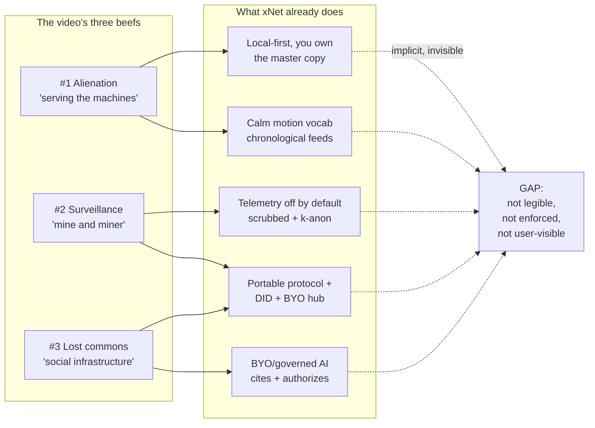
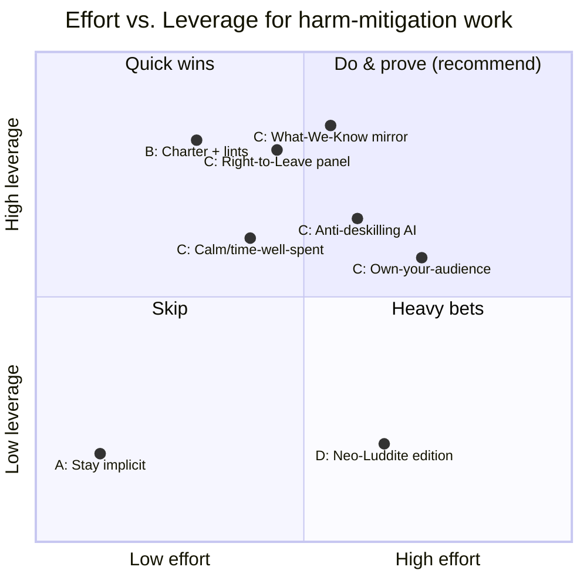
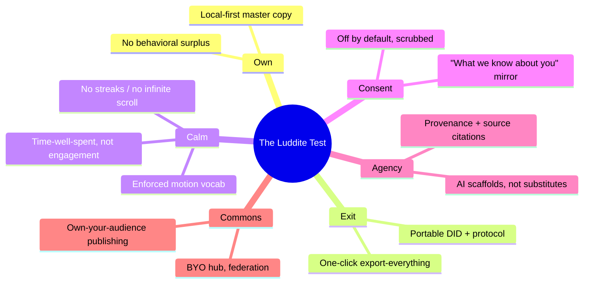
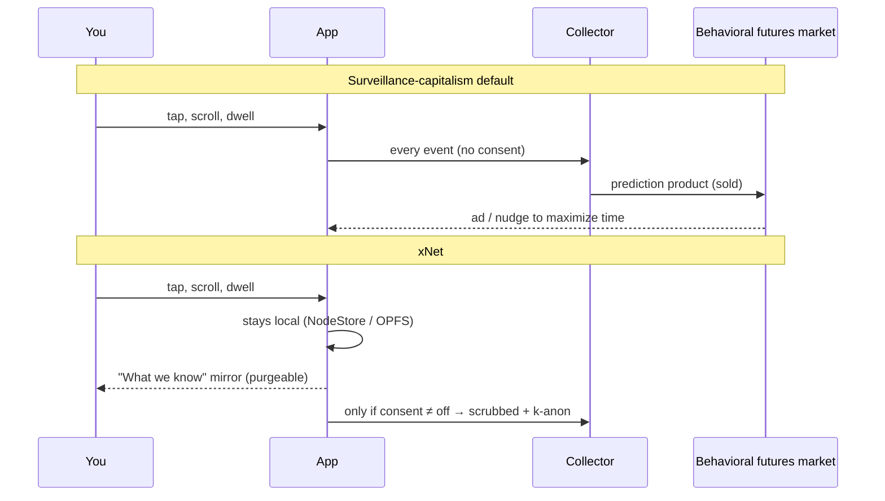
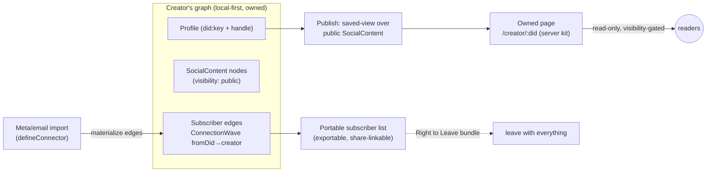

# Mitigating the Harms of the Internet: A Neo‑Luddite Audit of xNet

> _"We're building the alternative social infrastructure needed to make Silicon
> Valley obsolete in our lives. We don't have to engage with them and we can
> live fulfilling, happy, engaging, beautiful lives."_
> — Gowanus, the garbage spokes‑puppet of the Luddite Renaissance,
> interviewed by Hasan Minhaj in _The Gen Z Luddites Rebelling Against Big Tech_

## Problem Statement

The source for this exploration is a Hasan Minhaj video, **_The Gen Z Luddites
Rebelling Against Big Tech_** ([youtube.com/watch?v=rxpV97A5I90](https://youtube.com/watch?v=rxpV97A5I90)).
Framed as a comedic interview with a puppet, it is actually a tight, well‑sourced
indictment of the modern internet. The puppet lays out three "Luddite beefs":

1. **Alienation & loneliness.** Big tech turns people into _"a node in Silicon
   Valley's vast data web,"_ commodified and disconnected. _"We are serving the
   machines that were supposed to serve us."_
2. **Surveillance.** _"We're both the mine and the miner in our own
   exploitation."_ Our attention and desires are the _"natural resource"_;
   _"data privacy is a human right,"_ and _"building anti‑surveillance
   architecture … is not a luxury. It's something we need to be doing now."_
3. **Loss of the commons.** Public, un‑commodified space has been enclosed; the
   movement wants _"social infrastructure … where humans can talk to each other
   face to face."_

Underneath the jokes are real, verifiable references: Shoshana Zuboff's
surveillance capitalism (_"you're not the customer for Facebook … Coca‑Cola
is"_), the historical Luddites as documented by Brian Merchant (_not_
anti‑technology, but anti‑**how it was deployed** to devalue skill and
concentrate power), the MIT "cognitive debt" study on LLM deskilling, the
real‑world graffiti war over the **Friend** AI pendant's subway ads, and the
"apps went from novelty to necessity" lock‑in that makes opting out nearly
impossible.

The video is a **critique**. It smashes machines (literally — the group runs
"SHITPHONE" events where they put devices on trial and destroy them). But every
critique implies a missing constructive answer, and the puppet keeps gesturing
at it: _the alternative infrastructure_. **That is a software thesis.** And it
happens to be, almost line for line, the thesis xNet was founded on
(`docs/VISION.md`: _"Companies own your data → You own your data… Pay with your
privacy → Pay with value, not data… Vendor lock‑in → Portable,
user‑controlled"_).

**This document asks a sharp question: if a thoughtful neo‑Luddite audited xNet,
would it pass? Where does the codebase already embody the answer, where is the
stance merely _implicit_ (and therefore invisible and undefended), and what
should we build to make "software that serves instead of extracts" a legible,
testable, shippable commitment rather than a vibe?**

## Executive Summary

The good news, established by a thorough codebase audit (below): **xNet is
already, structurally, the kind of technology the video is asking for.** It is
local‑first (you own the master copy), portable (signed, hash‑chained change log
+ DID identity that works on any hub), calm (an enforced motion vocabulary and a
"cozy/calm" theme), consent‑gated (telemetry is off by default, scrubbed, and
k‑anonymized), and **free of the engagement‑maximizing machinery** the critique
targets — feeds are chronological, notifications are rule‑based (not ML‑ranked),
there is no infinite scroll, no streaks, no behavioral‑surplus ad model.

The bad news: **none of this is legible.** The anti‑surveillance architecture the
puppet demands exists in `packages/`, but a user can't _see_ it, a skeptic can't
_test_ it, and a CI run can't _defend_ it from drift. xNet has the moral
position of the Luddite Renaissance and none of its rhetoric or receipts.

The recommendation is a staged program — **"The Luddite Test"** — that turns the
existing architecture into an explicit, enforced, user‑visible commitment across
six axes: **Own, Exit, Calm, Consent, Agency, Commons.** Concretely:

- **A Humane Internet Charter** (`docs/CHARTER.md` + a site page) that states the
  commitments, paired with a **`scripts/check-humane-patterns.mjs`** CI lint
  (sibling to `check-motion-vocab.mjs`) that bans dark patterns mechanically.
- **A "Right to Leave" panel** — a real, celebrated "Delete Day" button: export
  _everything_ (graph + blobs + identity) and walk, with no dark‑pattern
  friction. This directly answers the video's lock‑in beef.
- **A "What We Know About You" mirror** — because xNet keeps no behavioral
  surplus, it can do the move no surveillance company can: show you literally
  every derived artifact (vectors, AI memory, telemetry buffer) and let you purge
  any of it. The inverse of _"we're both the mine and the miner."_
- **Calm‑by‑default + a "time‑well‑spent" surface** that celebrates _less_ use,
  not more.
- **Anti‑deskilling AI defaults** that scaffold rather than substitute, cite
  sources, and disclose when the machine is doing your thinking — a direct answer
  to the MIT cognitive‑debt finding.
- **"Own your audience"** publishing — the video's collective‑action ask
  (creators leaving Meta for an owned page + portable subscriber list) as a
  product feature.

Crucially, we should **avoid the trap the video itself names**: _"the aesthetic
of revolt … gets sold back to you as a commodity… you could easily see Apple
selling their own dumb phone."_ The goal is not a "neo‑Luddite edition" gimmick.
It is to make ordinary, well‑built, honest software — and to prove it.

## Current State In The Repository

xNet's harm mitigation is layered from the storage engine up. The table maps each
"beef" in the video to the code that already addresses it.

| Video critique | xNet's structural answer | Primary code |
| --- | --- | --- |
| _"You're not the customer… Coca‑Cola is"_ (ad/surplus model) | No ad model; no behavioral‑futures market; you own the master copy | `packages/data/src/store/store.ts`, `packages/sqlite/src/adapters/web.ts` (OPFS) |
| _"Apps went from novelty to necessity"_ (lock‑in) | Portable protocol + DID identity + offline‑first; client works with no hub | `packages/sync/src/change.ts`, `packages/identity/src/keys.ts`, `packages/runtime/src/sync/offline-queue.ts` |
| _"We're both the mine and the miner"_ (surveillance) | Telemetry off by default, PII‑scrubbed, k‑anonymized; consent spine | `packages/telemetry/src/consent/manager.ts`, `packages/telemetry/src/collection/scrubbing.ts`, `bucketing.ts` |
| _"These technologies don't have love for you"_ (dark patterns) | Enforced calm motion vocabulary; cozy theme; no engagement ranking | `packages/ui/src/motion/Presence.tsx`, `scripts/check-motion-vocab.mjs`, `packages/social/src/feeds/defaults.ts` |
| _"Over‑reliance on tech is deskilling us"_ (cognitive debt) | AI is BYO/local‑first, provenance‑tiered, retrieval cites sources | `packages/brain/src/retrieve.ts`, `packages/plugins/src/ai/runtime.ts`, `packages/trust/src/index.ts` |
| _"Building anti‑surveillance architecture"_ | SSRF guard + capability‑gated outbound fetch; per‑schema authz | `packages/core/src/utils/ssrf.ts`, `packages/plugins/src/ecosystem/network-endowment.ts`, `packages/data/src/auth/evaluator.ts` |

### 1. Data ownership & local‑first (answers "the mine and the miner")

The client treats the local copy as **primary**. NodeStore
(`packages/data/src/store/store.ts`) is an event‑sourced LWW engine persisting to
OPFS‑backed SQLite in the browser (`packages/sqlite/src/adapters/web.ts`),
better‑sqlite3 on Electron, and Expo SQLite on mobile. Durable storage works
**without an app install** (`docs/explorations/0172_[x]_DURABLE_STORAGE_WITHOUT_APP_INSTALL.md`).
This is Ink & Switch "local‑first" by construction: the user holds the master,
the server is a secondary convenience.

### 2. Decentralized, BYO, optional sync (answers lock‑in)

The hub is **optional and user‑ownable**. `packages/hub/src/cli.ts` is a
`xnet-hub start` command — a standard Hono/Node server anyone can self‑host. The
client points at whatever `signalingUrl` it likes
(`packages/runtime/src/sync/connection-manager.ts`) and **keeps working offline**
via an offline write queue (`packages/runtime/src/sync/offline-queue.ts`).
Identity is a portable `did:key` (`packages/identity/src/keys.ts`) — the **same
keypair works on any hub**, so there is no "account transfer" and no platform
that can hold your social graph hostage.

### 3. The portable protocol (answers "make Silicon Valley obsolete")

The wire format is a signed, hash‑chained, LWW **change log** — not an opaque
vendor blob. `packages/sync/src/change.ts` defines `Change<T>` with a protocol
version, BLAKE3 content hash, Ed25519 (+ ML‑DSA) signature, Lamport time, and
`parentHash`; `packages/sync/src/chain.ts` validates the tamper‑evident chain and
detects forks. The whole thing is specified and re‑implementable
(`docs/explorations/0200_[x]_PORTABLE_XNET_PROTOCOL_BOUNDARIES_AND_STANDARD.md`,
with a Python reference kernel and golden vectors). Portability isn't a feature
bolted on; it's the substrate.

### 4. Export & "right to leave" (partial)

Pieces exist but are scattered: per‑table JSON/CSV export
(`packages/data/src/database/export/json-export.ts`, `csv-export.ts`), an
AI‑workspace exporter that bundles pages/databases/canvases/config/manifest
(`packages/plugins/src/services/ai-workspace-exporter.ts`), and hub backup
upload/download (`packages/hub/src/routes/backup.ts`). What is **missing** is a
single, legible, celebrated "export everything and go" flow — the product analog
of the movement's _Delete Day_.

### 5. Consent & anti‑surveillance posture (answers beef #2 directly)

`packages/telemetry/src/consent/manager.ts` gates **all** analytics behind tiers
that **default to off** (`off → local → crashes → anonymous → identified`).
Before anything leaves the device it is PII‑scrubbed
(`packages/telemetry/src/collection/scrubbing.ts` — paths, emails, IPs, tokens,
UUIDs, DIDs) and **k‑anonymity bucketed**
(`packages/telemetry/src/collection/bucketing.ts`) so a single user can't be
fingerprinted. Outbound network access is governed by a literal‑host SSRF guard
(`packages/core/src/utils/ssrf.ts`) and a capability‑checked `guardedFetch`
(`packages/plugins/src/ecosystem/network-endowment.ts`). Per‑schema authorization
with a parent‑chain‑walking resolver (`packages/data/src/auth/evaluator.ts`,
`space-cascade.ts`) means access is gated, not assumed.
(`docs/explorations/0210_[x]_ERROR_MONITORING_PRIVACY_ANALYTICS_AND_CONSENT_ACROSS_SURFACES.md`.)

### 6. Calm, non‑extractive UX (answers "they don't have love for you")

- **Motion** is a closed vocabulary (`packages/ui/src/theme/motion.css`,
  `packages/ui/src/motion/Presence.tsx`) with a CI gate that bans the footguns of
  manipulative animation — `transition-all`, raw durations, `ease-bounce`,
  arbitrary keyframes (`scripts/check-motion-vocab.mjs`,
  `docs/explorations/0199_[_]_ELEGANT_COMPOSABLE_MOTION_SYSTEM.md`). `<Presence>`
  respects `prefers-reduced-motion`.
- **Theme** offers a "cozy/calm" warm‑paper variant and a density axis
  (`packages/ui/src/theme/ThemeProvider.tsx`,
  `docs/explorations/0232_[_]_COZY_CALM_AND_AGENT_FIRST_A_DELIGHTFUL_PLACE_TO_SPEND_THE_DAY.md`).
- **Feeds** are chronological, not engagement‑ranked
  (`packages/social/src/feeds/defaults.ts`); no infinite scroll, just
  virtualization (`packages/react/src/components/SavedViewVisualFeed.tsx`).
- **Notifications** are rule‑based with explicit priority order, a watermark +
  snooze model, and a hard inbox cap — _not_ ML‑ranked compulsion engineering
  (`packages/comms/src/notify/rules.ts`, `inbox.ts`).
- **Onboarding** is skippable and progressive; coachmarks are one‑at‑a‑time and
  dismissible (`packages/react/src/onboarding/OnboardingFlow.tsx`,
  `apps/web/src/coachmarks/`).

### 7. AI that augments rather than extracts (answers cognitive debt)

AI is **BYO and local‑capable**: WebLLM in‑browser, Ollama local, or a metered
managed provider (`packages/plugins/src/ai/runtime.ts`, `managed-provider.ts`).
The "second brain" is a **governed GraphRAG retriever**: keyword entry → bounded
graph expansion → **authorization filtering** → cited results
(`packages/brain/src/retrieve.ts`, `expand.ts`,
`docs/explorations/0211_[x]_AI_SECOND_BRAIN_GRAPHRAG_MEMORY_AND_TIERING.md`).
Vectors are opt‑in (`packages/vectors/src/index.ts`). Provenance tiers
(`packages/trust/src/index.ts`) already distinguish `ai-generated` from
`authored` content — the seed of an anti‑deskilling disclosure surface.



## External Research

- **Surveillance capitalism — Shoshana Zuboff.** The unilateral claiming of
  private experience as free raw material → _behavioral surplus_ → _prediction
  products_ sold into _behavioral futures markets_. The video's _"we're both the
  mine and the miner"_ is Zuboff in a sock puppet. xNet's structural answer is to
  have **no surplus to sell**: there is no third‑party customer, and the master
  copy is local. ([Harvard Gazette](https://news.harvard.edu/gazette/story/2019/03/harvard-professor-says-surveillance-capitalism-is-undermining-democracy/))
- **The real Luddites — Brian Merchant, _Blood in the Machine_.** Correcting the
  record: Luddites were skilled technologists, _not_ anti‑machine. They opposed
  the **deployment** of machines to deskill workers and concentrate wealth, and
  proposed policy (retraining funded by taxing automators). Merchant's lesson:
  organized labor wins; the writers' and actors' strikes are modern proof. The
  puppet quotes the historical definition verbatim — against _"machinery hurtful
  to commonality."_ ([LA Review of Books](https://lareviewofbooks.org/article/inspiration-from-the-luddites-on-brian-merchants-blood-in-the-machine/),
  [TIME](https://time.com/6317437/luddites-ai-blood-in-the-machine-merchant/))
- **Local‑first software — Ink & Switch.** Seven ideals: Fast, Multi‑Device,
  Offline, Collaboration, **Longevity** (works after the company is gone),
  **Privacy** (E2E), **User Control** (no company can restrict what you do with
  the software). This is a near‑perfect spec for "anti‑lock‑in," and xNet already
  implements most of it. ([inkandswitch.com/essay/local-first](https://www.inkandswitch.com/essay/local-first/))
- **Calm technology — Weiser & Brown (1995), Amber Case (2014).** _"The scarce
  resource of the 21st century… will be attention."_ Principles: use the
  periphery; require the smallest possible amount of attention; the right amount
  of technology is the minimum needed. This is the design north star for the
  "Calm" axis. ([Calm Tech Institute](https://www.calmtech.institute/calm-tech-principles))
- **MIT Media Lab, "Your Brain on ChatGPT" (cognitive debt).** EEG study: LLM
  users showed the weakest neural connectivity and **lowest ownership** of their
  own essays, and didn't recover baseline engagement when later asked to work
  unaided. The video cites this to argue _"over‑reliance on technology is
  deskilling us."_ Implication for xNet AI: default to **scaffolding, not
  substitution**, and disclose authorship. ([arXiv:2506.08872](https://arxiv.org/abs/2506.08872),
  [brainonllm.com](https://www.brainonllm.com/))
- **The "Friend" pendant backlash (real).** Avi Schiffmann's $1M, ~11,000‑ad NYC
  subway campaign for an always‑listening AI pendant was defaced with
  _"SURVEILLANCE CAPITALISM"_ and _"GET REAL FRIENDS."_ The video's "Friends of
  Friend AI" protest is reportage, not invention. The product's terms reportedly
  grant passive audio/video + biometric capture for AI training — a clean example
  of the harm xNet's consent/SSRF/local‑first posture exists to refuse.
  ([Daily Dot](https://www.dailydot.com/news/friend-ai-graffiti-new-york-cit/),
  [Prism](https://prismreports.org/2026/02/24/ai-boycott-friend-subway-ads/))
- **Decentralized social prior art.** AT Protocol (portable PDS + algorithmic
  choice), Nostr (key‑based identity, relay mobility), ActivityPub (mature W3C
  federation), Solid (personal data pods). All wrestle with the same
  portability/identity problems xNet solves with a signed change log + `did:key`.
  Useful as interop targets and as evidence the design space is converging.
  ([Soapbox comparison](https://soapbox.pub/blog/comparing-protocols),
  [Bluesky/ATProto paper](https://arxiv.org/html/2402.03239v2))
- **Digital minimalism / dumbphones (the demand side).** The Gen‑Z dumbphone and
  "offline club" trend — boundary‑setting, not nostalgia — is the consumer
  appetite this exploration's features address. ([The Conversation](https://theconversation.com/gen-z-goes-retro-why-the-younger-generation-is-ditching-smartphones-for-dumb-phones-204992))

## Key Findings

1. **xNet is the constructive answer the video can't articulate.** The puppet can
   protest and smash, but "build the alternative social infrastructure" is a
   software job. xNet's VISION.md is, almost word for word, the inverse of
   Zuboff's surveillance capitalism. The alignment is not a stretch; it is the
   founding premise.
2. **The Luddites were never anti‑technology — and neither is this audit.** Their
   definition (_"machinery hurtful to commonality"_) is a precise test: tech that
   deskills, surveils, and concentrates power fails; tech that is owned, portable,
   and calm passes. xNet is squarely in the "good Luddite" camp. We should _say
   so_, and back it with receipts.
3. **The harms have a common root: extraction.** Surveillance, attention‑mining,
   lock‑in, and deskilling are four faces of one move — capturing user value
   (data, attention, dependence) for the platform. xNet's defenses already attack
   the root (no surplus, no engagement ranking, no lock‑in, augmenting AI), but
   piecemeal and invisibly.
4. **The biggest gap is _legibility_, not capability.** A privacy‑respecting app
   that can't prove it is, to a skeptic, indistinguishable from one that lies.
   The Friend founder _wanted_ the backlash because outrage is engagement; xNet's
   counter is the opposite of spectacle — verifiable receipts.
5. **Software cannot fix loneliness, and pretending to is itself a harm.** The
   honest scope: xNet is the **anti‑surveillance substrate** and **owned
   commons**, not a replacement for touching grass. The most radical humane
   feature may be one that helps you _close the laptop_ — designing for departure,
   not retention.
6. **The commodification trap is real and named.** _"The aesthetic of revolt gets
   sold back to you."_ A "neo‑Luddite edition" skin would be exactly the failure
   mode the video mocks. Build honest defaults; don't sell rebellion.

## Options And Tradeoffs



**Option A — Stay implicit (status quo).** Keep building good defaults; say
nothing. _Pro:_ zero cost, no marketing risk. _Con:_ the stance is invisible and
undefended; a future PR can quietly add a streak counter or an engagement feed and
nothing stops it. No differentiation. **Rejected** — invisibility is the core
problem.

**Option B — Make it legible (Charter + enforcement).** A `docs/CHARTER.md`,
a site page, and a `check-humane-patterns.mjs` CI lint that mechanically bans dark
patterns. _Pro:_ cheap, high leverage, turns architecture into an enforceable
position, prevents drift. _Con:_ a charter you don't live up to is worse than
none — must be paired with real receipts. **Recommended (foundation).**

**Option C — Build the anti‑harm feature set.** Right‑to‑Leave, What‑We‑Know
mirror, calm/time‑well‑spent, anti‑deskilling AI, own‑your‑audience. _Pro:_
concrete user value; each feature is a "receipt" that makes Option B honest.
_Con:_ real engineering; some (own‑your‑audience) are large. **Recommended
(staged).**

**Option D — "Neo‑Luddite edition" / movement marketing.** Skin the app in
revolt aesthetics, court the offline‑club scene. _Pro:_ attention. _Con:_ this is
**precisely** the commodification the video ridicules; performative, alienates
pragmatic users, ages badly. **Rejected.**

## Recommendation

Adopt **"The Luddite Test"**: six commitments, each with a principle, the
existing code that backs it, the gap, and a _machine‑checkable_ validation. Ship
**Option B as the spine** and **Option C in three waves**. Refuse Option D.



### The six commitments

| # | Commitment | Backed by (today) | Gap → Action |
| --- | --- | --- | --- |
| 1 | **Own** — you hold the master copy; we keep no surplus | NodeStore + OPFS; no ad model | Make it _stated_: Charter §1 + a "your data lives here" indicator |
| 2 | **Exit** — leaving is one click and loses nothing | export/* + backup routes + DID | Build the **Right‑to‑Leave** panel (Wave 1) |
| 3 | **Calm** — we compete for your wellbeing, not your time | motion vocab + chrono feeds + rule‑based notifs | `check-humane-patterns.mjs` + **time‑well‑spent** surface (Wave 1) |
| 4 | **Consent** — nothing leaves without permission, and you can see everything we derive | consent spine + scrub + k‑anon | **What‑We‑Know mirror** (Wave 2) |
| 5 | **Agency** — AI makes you more capable, not less | governed brain + provenance tiers | **Anti‑deskilling defaults** + authorship disclosure (Wave 2) |
| 6 | **Commons** — you own your audience and your space | server kit + share links + federation | **Own‑your‑audience** publishing (Wave 3) |

### Wave plan

- **Wave 1 (foundation + quick proofs):** `docs/CHARTER.md` + site page;
  `scripts/check-humane-patterns.mjs` CI gate; **Right‑to‑Leave** export‑and‑go
  panel; **time‑well‑spent** "enough for today" surface. _These make Option B
  honest immediately._
- **Wave 2 (transparency + agency):** **What‑We‑Know mirror** (vectors, AI
  memory, telemetry buffer — viewable and purgeable); **anti‑deskilling AI**
  defaults (scaffold mode, source citations, `ai-generated` provenance badge in
  the editor).
- **Wave 3 (commons):** **Own‑your‑audience** publishing — publish from your
  graph to an owned page with a portable, DID‑based subscriber list; document the
  "leave Meta, keep your audience" path the video's collective‑action ask
  describes.

## Example Code

These sketches show how each commitment lands on _existing_ seams. They are
illustrative, not final.

### 1. `check-humane-patterns.mjs` — dark patterns as CI failures

Modeled on `scripts/check-motion-vocab.mjs`. Bans the machinery of compulsion the
same way the motion lint bans `transition-all`.

```js
// scripts/check-humane-patterns.mjs — fails CI on dark-pattern primitives.
import { readFileSync } from 'node:fs';
import { globSync } from 'glob';

const BANS = [
  // [pattern, why] — extraction primitives we refuse to ship.
  [/\binfinite[-_]?scroll\b/i, 'infinite scroll — design for an end, not a void'],
  [/\b(streak|combo)Count\b/, 'streak counters weaponize loss aversion'],
  [/setInterval\([^,]+,\s*(?:[1-9]\d{0,3})\)/, 'sub-5s polling = compulsion loop'],
  [/confirmSham|areYouSureYouWantToMissOut/i, 'confirmshaming'],
  [/badge(Count)?\s*=\s*(?!0\b)\d{3,}/, 'manufactured red-dot anxiety'],
];

const ALLOW = /\/\*\s*humane-ok:(.+?)\*\//; // requires a written justification
let violations = 0;
for (const file of globSync('packages/**/src/**/*.{ts,tsx}', { ignore: '**/*.test.*' })) {
  const src = readFileSync(file, 'utf8');
  if (ALLOW.test(src)) continue;
  for (const [re, why] of BANS) {
    if (re.test(src)) { console.error(`✗ ${file}: ${why}`); violations++; }
  }
}
if (violations) {
  console.error(`\n${violations} humane-pattern violation(s). See docs/CHARTER.md.`);
  process.exit(1);
}
console.log('✓ no dark patterns detected');
```

### 2. Right‑to‑Leave — a real "Delete Day" button

Composes the export pieces that already exist into one legible, no‑friction flow.

```ts
// packages/plugins/src/services/right-to-leave.ts
import { exportWorkspace } from './ai-workspace-exporter';      // pages/db/canvas/config
import { exportAllTablesJson } from '@xnetjs/data/database/export/json-export';
import { exportIdentityBundle } from '@xnetjs/identity';        // did:key + recovery

/** Everything you'd need to recreate yourself elsewhere — zero lock-in. */
export async function leaveWithEverything(ctx: LeaveContext): Promise<Blob> {
  const bundle = await zip({
    'workspace.xnet.json': await exportWorkspace(ctx.store),     // graph + blobs
    'tables/': await exportAllTablesJson(ctx.store),
    'identity.did.json': await exportIdentityBundle(ctx.identity),
    'README.md': LEAVE_README,   // how to re-import on any hub or self-host
  });
  // Note: no "are you sure you'll miss out?" — leaving is a right, not a funnel.
  return bundle;
}

/** Optional, irreversible, and honest: stop feeding the system. */
export async function deleteDay(ctx: LeaveContext, opts: { keepLocal: boolean }) {
  await ctx.hub?.purgeRemoteCopies(ctx.identity.did);  // tombstone on every hub
  if (!opts.keepLocal) await ctx.store.destroyLocal();  // wipe OPFS too
  ctx.telemetry.record('account.left', { tier: 'crashes' }); // never identifies who
}
```

### 3. "What We Know About You" mirror — the move no surveillance company can make

```ts
// packages/react/src/privacy/derived-mirror.ts
// Because xNet keeps no behavioral surplus, it can enumerate *everything* derived.
export async function describeWhatWeKnow(ctx: MirrorContext): Promise<DerivedItem[]> {
  return [
    ...(await ctx.vectors.list()).map(v => ({
      kind: 'embedding', of: v.nodeId, model: v.model,
      whereItLives: v.local ? 'this device' : 'your hub',
      purge: () => ctx.vectors.delete(v.id),
    })),
    ...(await ctx.brain.memory.list()).map(m => ({
      kind: 'ai-memory', summary: m.text, tier: m.tier,
      purge: () => ctx.brain.memory.forget(m.id),
    })),
    ...ctx.telemetry.bufferedReports().map(r => ({
      kind: 'pending-telemetry', payload: r.scrubbed, // already PII-scrubbed + bucketed
      purge: () => ctx.telemetry.drop(r.id),
    })),
  ];
  // There is no fourth category. That absence is the product.
}
```

### 4. Anti‑deskilling AI default — scaffold, disclose, cite

```ts
// packages/plugins/src/ai/runtime.ts (augment existing AiAgentRuntime)
export interface AiAssistOptions {
  /** Default 'scaffold': the model proposes & cites; the human writes & owns. */
  mode?: 'scaffold' | 'draft';            // 'draft' requires explicit opt-in
}

async function assist(prompt: string, opts: AiAssistOptions = {}) {
  const mode = opts.mode ?? 'scaffold';
  const { answer, sources } = await brain.retrieveAndAnswer(prompt); // GraphRAG, cited
  return {
    answer,
    sources,                               // always shown — "show your work"
    provenance: 'ai-generated' as const,   // packages/trust tier → editor badge
    // Cognitive-debt guard: in scaffold mode we surface an outline + citations,
    // not finished prose, so the user stays the author (MIT 2506.08872).
    cognitiveDebtNote: mode === 'draft'
      ? 'You asked the model to write this. It will be marked AI-authored.'
      : undefined,
  };
}
```

### Surveillance vs. xNet — the data‑flow contrast



## Risks And Open Questions

- **Charter‑washing.** A commitments doc you don't honor is _worse_ than silence
  — it invites exactly the "you're not the Luddite you think you are" dunk the
  puppet lands on Hasan. **Mitigation:** every commitment ships with a CI test or
  a user‑visible receipt before it goes on the site.
- **Commodification.** Even sincere humane‑tech branding can read as the
  "aesthetic of revolt sold back." **Mitigation:** lead with defaults and
  receipts; keep marketing understated; no "rebel" skin.
- **The honesty of "Exit."** Right‑to‑Leave is only credible if re‑import on a
  competing/self‑hosted stack actually works. **Open question:** do we test
  round‑trip import against a vanilla `xnet-hub` _and_ at least one external
  target (ATProto PDS?) in CI?
- **Calm vs. growth tension.** A "time‑well‑spent / enough for today" surface
  deliberately suppresses engagement metrics that a managed‑cloud business might
  want to grow. **Open question:** can the cozy/managed tiers
  (`packages/entitlements`) be honestly aligned so the business model never needs
  the surplus we refuse to collect? (VISION.md says "pay with value, not data" —
  this is where we prove it.)
- **AI scope creep.** Brain memory, vectors, and managed AI are the _only_ places
  xNet derives anything about a user; they must stay inside the "What We Know"
  mirror as features grow, or the mirror lies by omission. **Mitigation:** a test
  asserting every derived‑data producer registers with the mirror.
- **Federation & moderation.** "Own your audience" + BYO hubs reopen the
  hard decentralized‑moderation problems (cf. Nostr/ATProto). xNet has labeler
  trust (`packages/abuse/src/labeler-trust.ts`) but the commons work must not
  regress safety.
- **We can't fix loneliness.** Overclaiming would itself be a harm. The doc and
  any copy must scope xNet to the _substrate_ and explicitly cede that real
  connection is offline.

## Implementation Checklist

**Wave 1 — Foundation & quick proofs**
- [x] Write `docs/CHARTER.md` — the six commitments (Own, Exit, Calm, Consent, Agency, Commons), each linking to the code that backs it.
- [ ] Add a "Why xNet / Our commitments" page to the marketing site, single‑sourced (remember `sidebar.mjs` + `build:llms` for new docs).
- [x] Implement `scripts/check-humane-patterns.mjs`; wire it into the `lint`/CI job alongside `check-motion-vocab.mjs`.
- [x] Add the `/* humane-ok: <reason> */` escape‑hatch convention and document it in the Charter.
- [x] Build `packages/plugins/src/services/right-to-leave.ts` (`leaveWithEverything` + `deleteDay`) composing existing export/backup/identity code.
- [ ] Add a **Settings → "Your data & leaving"** panel: shows where data lives (local vs hub), one‑click full export, and an honest Delete‑Day flow (no confirmshaming).
- [x] Add a **time‑well‑spent** surface (optional, off by default): a calm "enough for today" wind‑down affordance; never a streak.

**Wave 2 — Transparency & agency**
- [ ] Build `describeWhatWeKnow` + a **Settings → "What we know about you"** mirror over vectors, brain memory, and the telemetry buffer, each item purgeable. _(engine + registry + telemetry source + completeness test landed; Settings UI and vectors/brain adapters deferred.)_
- [x] Add a registry assertion: every derived‑data producer (vectors/brain/telemetry) must surface in the mirror (test‑enforced).
- [x] Add `mode: 'scaffold' | 'draft'` to `AiAgentRuntime`; default `scaffold`; require explicit opt‑in for `draft`.
- [ ] Surface AI source citations in the assistant UI; render an `ai-generated` provenance badge in the editor using `packages/trust` tiers.

**Wave 3 — Commons**
- [x] Design **own‑your‑audience** publishing: publish from the graph to an owned page (`@xnetjs/server` / share‑links) with a portable, DID‑based subscriber list.
- [x] Document the "leave Meta, keep your audience" migration path; provide an importer for an existing follower/email list.
- [x] Evaluate an interop export target (ATProto PDS or ActivityPub actor) for the Right‑to‑Leave bundle.

**Cross‑cutting**
- [x] Add a changeset for any publishable `packages/*` touched (per repo policy).
- [x] Update `docs/VISION.md` to reference the Charter as the operational expression of its principles.

## Validation Checklist

- [x] **Lint proves Calm:** `check-humane-patterns.mjs` fails a deliberately‑planted infinite‑scroll/streak PR, and passes `main`.
- [ ] **Exit round‑trips:** a CI test exports a seeded workspace via `leaveWithEverything`, re‑imports it into a fresh `xnet-hub`, and asserts node/blob/identity parity.
- [ ] **Delete‑Day is real:** after `deleteDay({keepLocal:false})`, OPFS is empty and the hub returns tombstones for the DID; the only telemetry emitted is an anonymous, non‑identifying `account.left`.
- [x] **Mirror is complete:** a test enumerates all derived‑data producers and asserts each appears in `describeWhatWeKnow`; purging an item actually deletes it from its store.
- [x] **Consent default holds:** with telemetry tier `off`, a network spy asserts **zero** outbound analytics across a full session (extends `0210` consent tests).
- [ ] **AI discloses:** generating in `scaffold` mode yields citations + an `ai-generated` provenance badge; `draft` mode is unreachable without explicit opt‑in (test).
- [x] **No surplus exists:** a grep/test confirms there is no third‑party analytics/ad SDK and no un‑scrubbed PII path off device.
- [x] **Charter honesty audit:** every claim in `docs/CHARTER.md` links to either a passing test or a user‑visible surface — no unbacked promises.
- [x] **Calm regression:** feeds remain chronological and notifications rule‑based (snapshot/contract tests on `packages/social/src/feeds/defaults.ts` and `packages/comms/src/notify/rules.ts`).

## Appendix: Wave 3 Design — Commons (own your audience, migration, exit interop)

Wave 3 of the Implementation Checklist is **design/evaluation**, not a build: it
asks how xNet would let a creator _own their audience_ (the video's
collective‑action ask — _"move to my personal website where there's a mailing
list… if those people take a stand and get off meta, then culture will
follow"_). This appendix is that design, grounded in the seams that already
exist, so a later implementation wave can start from a plan rather than a blank
page.

### The thesis: a subscriber is an edge you own, not a number a platform rents you

On Meta, your audience is a count in someone else's database; you can't export
the _graph_, only a CSV they choose to give you. In xNet a subscriber is a
**signed `did:key → did:key` edge in your own graph** — portable by the same
mechanics as everything else (Charter §Exit). Nothing about "audience" needs a
new trust model; it's the existing connection edge pointed at a creator.



### 1. Own‑your‑audience publishing (design)

Compose four seams that already exist; no new kernel:

- **Publish surface — owned page.** A creator page is a public, visibility‑gated
  render of a saved view over their own `SocialContentSchema`
  ([`packages/social/src/schemas/content.ts`](../../packages/social/src/schemas/content.ts),
  [`packages/social/src/feeds/defaults.ts`](../../packages/social/src/feeds/defaults.ts)).
  Serve it with the BYO‑backend kit in `custodial`/`signed` trust mode and an
  `AuthorizeReadHook` that only emits `visibility: 'public'` nodes to anonymous
  readers ([`packages/server/src/index.ts`](../../packages/server/src/index.ts),
  `packages/server/src/read.ts`). For a fully static "personal website," the
  data‑module pattern the marketing site already uses
  ([`site/src/data/changelog.ts`](../../site/src/data/changelog.ts) — single
  source → page + JSON Feed + RSS) renders the same view without a live server.
- **Identity — the page is yours.** The page is keyed by the creator's portable
  `did:key` ([`packages/identity/src/did.ts`](../../packages/identity/src/did.ts)),
  resolvable via [`packages/network/src/resolution/did.ts`](../../packages/network/src/resolution/did.ts)
  (`/dids/{did}`). A greenfield `GET /creator/:did` route (the public profile
  route doesn't exist yet) is the only new endpoint.
- **Subscriber list — a portable edge set.** Reuse `ConnectionWaveSchema`
  (`fromDid → toDid`, status) from
  [`packages/social/src/connect/schemas.ts`](../../packages/social/src/connect/schemas.ts)
  as the subscribe edge (subscriber's DID → creator's DID). The list is just a
  query over those edges — exportable in the Right‑to‑Leave bundle and shareable
  read‑only via a UCAN share link
  ([`packages/identity/src/sharing/create-share.ts`](../../packages/identity/src/sharing/create-share.ts)).
- **Anti‑commodification guardrail.** The video warns the "aesthetic of revolt
  gets sold back." So: no "verified creator" upsell, no follower‑count vanity
  surface (that's a §Calm dark pattern — the humane lint already bans engagement
  counters), and the subscriber list is the creator's data, never xNet's.

### 2. "Leave Meta, keep your audience" — migration (design)

The hard part of leaving a platform is the audience you'd abandon. Make import a
first‑class `defineConnector`
([`packages/plugins/src/connectors/define-connector.ts`](../../packages/plugins/src/connectors/define-connector.ts)),
mirroring the existing platform importers
([`packages/social/src/importers/instagram.ts`](../../packages/social/src/importers/instagram.ts),
shared helpers in [`packages/social/src/import/core.ts`](../../packages/social/src/import/core.ts)):

- **`MetaFollowerImporter`** — read a Meta data export's `followers`/`following`
  buckets → one `SocialActor`
  ([`packages/social/src/schemas/actor.ts`](../../packages/social/src/schemas/actor.ts))
  per follower + a `ConnectionWave` edge into the creator's space. Handles
  normalize via `normalizeHandle()`; ids are deterministic (`createSocialNodeId`)
  so re‑import is idempotent (LWW upsert).
- **`EmailListImporter`** — a CSV of emails → pending subscriber edges with an
  `email` claim, so the creator can later send a one‑time "I've moved to my own
  page" message off‑platform. Emails are PII → stored local‑first, never synced
  to a shared hub by default, and excluded from any export that leaves the
  device unless the creator opts in.
- **Honest framing.** Imported followers are _leads, not consent_: a `pending`
  edge until the subscriber re‑opts‑in on the new page (mirrors the double‑opt‑in
  `ConnectionWave` flow). No silent re‑subscription — that would be the exact
  manipulation the charter refuses.

### 3. Exit interop target — evaluation (decision)

Should the Right‑to‑Leave bundle (Wave 2) target an external protocol so a
departing user lands somewhere live, not just a zip?

| Target | Fit for "leave with your audience" | Cost | Verdict |
| --- | --- | --- | --- |
| **AT Protocol (PDS)** | Strong: portable DID + account migration + a real `app.bsky.graph.follow` analog for the subscriber edge; a PDS is the closest thing to "your own hub with a public profile." | Medium: map `did:key` ↔ `did:plc`/`did:web`, emit a CAR/records export. | **Recommended first target.** |
| **ActivityPub (Fediverse)** | Good for reach (mature, federated), but identity is server‑bound (`@user@host`) — moving servers needs `Move` activity and loses portability xNet already has. | Medium‑high: actor + outbox generation. | Second; better as a _publishing_ bridge than an identity export. |
| **Nostr** | Identity model is a near‑match (key = account), censorship‑resistant relays ≈ multi‑hub. | Low‑medium: events are simple. | Good lightweight option; weaker structured‑content story. |
| **Solid (pods)** | Philosophically aligned (your data in your pod) but thin adoption and no native social‑graph semantics. | High relative to payoff. | Not now. |

**Decision:** target **AT Protocol** for the first interop export — it's the only
option that carries _both_ the content and the portable subscriber graph, and its
DID/account‑migration model maps cleanly onto xNet's existing `did:key`. Ship it
as an optional exporter behind the Right‑to‑Leave bundle (`@xnetjs/plugins`),
keeping ActivityPub/Nostr as future publishing bridges. Round‑trip parity (export
→ import into a vanilla PDS) becomes the "Exit round‑trips" validation gate.

### Why this is design, not build

These three items deliberately stop at a grounded plan: each names the real seams,
the one greenfield piece (`GET /creator/:did`), and an explicit decision (ATProto).
Building them is a future wave — but the path no longer requires discovery, and the
anti‑commodification guardrails are written down before any code exists.

## References

**The source video & its real‑world references**
- Hasan Minhaj — _The Gen Z Luddites Rebelling Against Big Tech_: [youtube.com/watch?v=rxpV97A5I90](https://youtube.com/watch?v=rxpV97A5I90)
- "Friend" AI pendant subway‑ad backlash: [Daily Dot](https://www.dailydot.com/news/friend-ai-graffiti-new-york-cit/), [Prism](https://prismreports.org/2026/02/24/ai-boycott-friend-subway-ads/)
- MIT Media Lab — _Your Brain on ChatGPT: Accumulation of Cognitive Debt…_: [arXiv:2506.08872](https://arxiv.org/abs/2506.08872), [brainonllm.com](https://www.brainonllm.com/)

**Theory & prior art**
- Shoshana Zuboff — _The Age of Surveillance Capitalism_: [Harvard Gazette](https://news.harvard.edu/gazette/story/2019/03/harvard-professor-says-surveillance-capitalism-is-undermining-democracy/)
- Brian Merchant — _Blood in the Machine_: [LARB](https://lareviewofbooks.org/article/inspiration-from-the-luddites-on-brian-merchants-blood-in-the-machine/), [TIME](https://time.com/6317437/luddites-ai-blood-in-the-machine-merchant/)
- Ink & Switch — _Local‑first software_: [inkandswitch.com/essay/local-first](https://www.inkandswitch.com/essay/local-first/)
- Weiser & Brown / Amber Case — _Calm Technology_: [calmtech.institute/calm-tech-principles](https://www.calmtech.institute/calm-tech-principles)
- Decentralized social protocols: [Soapbox: Nostr vs Fediverse vs Bluesky](https://soapbox.pub/blog/comparing-protocols), [Bluesky/ATProto](https://arxiv.org/html/2402.03239v2)
- Gen‑Z dumbphone / digital‑minimalism trend: [The Conversation](https://theconversation.com/gen-z-goes-retro-why-the-younger-generation-is-ditching-smartphones-for-dumb-phones-204992)

**xNet codebase**
- Vision & boundaries: `docs/VISION.md`; `docs/explorations/0200_[x]_PORTABLE_XNET_PROTOCOL_BOUNDARIES_AND_STANDARD.md`
- Local‑first storage: `packages/data/src/store/store.ts`, `packages/sqlite/src/adapters/web.ts`, `docs/explorations/0172_[x]_DURABLE_STORAGE_WITHOUT_APP_INSTALL.md`
- Protocol: `packages/sync/src/change.ts`, `packages/sync/src/chain.ts`
- BYO hub & sync: `packages/hub/src/cli.ts`, `packages/runtime/src/sync/offline-queue.ts`, `packages/identity/src/keys.ts`
- Export: `packages/data/src/database/export/json-export.ts`, `packages/plugins/src/services/ai-workspace-exporter.ts`, `packages/hub/src/routes/backup.ts`
- Consent & privacy: `packages/telemetry/src/consent/manager.ts`, `packages/telemetry/src/collection/scrubbing.ts`, `bucketing.ts`, `packages/core/src/utils/ssrf.ts`, `docs/explorations/0210_[x]_ERROR_MONITORING_PRIVACY_ANALYTICS_AND_CONSENT_ACROSS_SURFACES.md`
- Calm UX: `packages/ui/src/motion/Presence.tsx`, `scripts/check-motion-vocab.mjs`, `docs/explorations/0199_[_]_ELEGANT_COMPOSABLE_MOTION_SYSTEM.md`, `docs/explorations/0232_[_]_COZY_CALM_AND_AGENT_FIRST_A_DELIGHTFUL_PLACE_TO_SPEND_THE_DAY.md`
- Feeds & notifications: `packages/social/src/feeds/defaults.ts`, `packages/comms/src/notify/rules.ts`
- AI & trust: `packages/brain/src/retrieve.ts`, `packages/plugins/src/ai/runtime.ts`, `packages/trust/src/index.ts`, `docs/explorations/0211_[x]_AI_SECOND_BRAIN_GRAPHRAG_MEMORY_AND_TIERING.md`
- Authorization: `packages/data/src/auth/evaluator.ts`, `packages/data/src/auth/space-cascade.ts`
