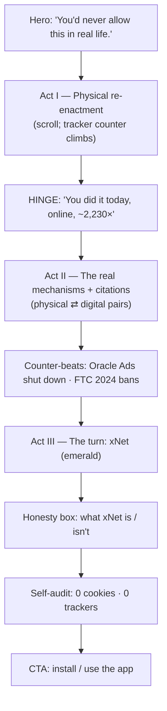
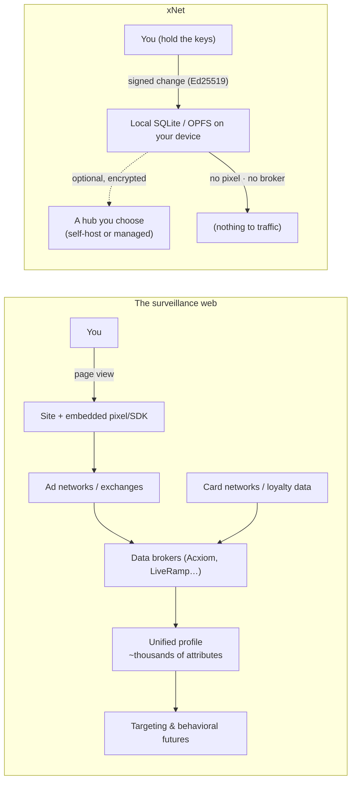

# The Followed — A Surveillance‑Reckoning Landing Page for xNet

> Turning the everyday absurdity of internet tracking into xNet's strongest
> argument: _you would never tolerate this in the physical world — so why do you
> tolerate it online?_

## Problem Statement

xNet's homepage leads with a true but **abstract** promise — "Your data. Your
devices. Your rules." (`site/src/pages/index.astro`). It is a developer‑shaped
value proposition: local‑first, offline, peer‑to‑peer, three React hooks. It
tells you _what xNet is_. It does not make you _feel the thing xNet is a reaction
to._

The thing xNet is a reaction to is **surveillance capitalism** — the now‑normal
arrangement in which nearly every site and app you touch reports you to an
advertising/data‑broker ecosystem you cannot see, did not consent to in any
meaningful way, and cannot opt out of. The reason this is hard to sell against is
precisely that it is invisible. Nobody feels the Meta Pixel fire. Nobody sees
the bid request.

The user's framing is the unlock: **make the invisible physical.** If the exact
same data collection happened in the brick‑and‑mortar world — a greeter clipping
a tracker to your collar at the door, logging every shelf you linger at, selling
the dossier to the mall across the street — we would call it dystopian and ban
it. Online, we call it Tuesday.

This exploration designs a new marketing page (working name **"The Followed"**,
route `/why` or `/followed`) that:

1. Dramatizes digital tracking as a **physical‑world re‑enactment** (scrolly
   narrative), then performs the reveal: _this is literally the internet, right
   now._
2. Backs every claim with **sourced, current facts** (2024–2026), with the
   over‑claims the popular narrative gets wrong explicitly corrected.
3. Pivots to xNet as the structural alternative — and makes only claims the
   **codebase actually supports**, including honest caveats.
4. Ends with a proof‑of‑practice the page can make about _itself_: this page set
   **0 cookies** and called **0 third‑party trackers**.

## Executive Summary

- **Build a standalone narrative page**, not a homepage rewrite. The homepage
  sells the product to builders; "The Followed" sells the _worldview_ to humans
  and links into the product. It reuses the existing Astro section/component
  idiom (`site/src/components/sections/`, `Base.astro`, Tailwind color‑coding).
- **Creative spine: a two‑act re‑enactment.** Act I walks the reader through "a
  normal afternoon" in a world where online tracking is made physical
  (scroll‑driven, a visible "tracker count" ticking up). Act II rips the set
  away: each physical absurdity is annotated with the real online mechanism and a
  citation. Act III is the turn — xNet — and the page's own honesty.
- **Facts are a data module, not prose** — mirror the repo's existing
  `site/src/data/compare.ts` convention where every claim carries a `sourceUrl`,
  validated at build time. This keeps the page defensible and updatable.
- **Truth discipline is the whole game.** The strongest version of this page is
  the one a hostile ad‑tech engineer can't refute. That means: correct the Target
  "father" myth, _don't_ say Google killed cookies (they reversed in 2024–25),
  separate the €1.2B GDPR fine from the €200M DMA fine, and never claim xNet is
  "100% encrypted / anonymous / serverless" because the code says otherwise.
- **The killer proof point is self‑referential and already true:** xNet's own
  site uses cookieless Plausible and ships no ad SDKs. The page can truthfully
  audit _itself_ in the footer — a live contrast no surveillance‑funded
  competitor can copy.

## Current State In The Repository

### The site is Astro + Starlight + Tailwind, page‑per‑file

- Framework: Astro 5 with `@astrojs/starlight`, `@astrojs/tailwind`
  (`site/astro.config.mjs`, `site/package.json`). Site is `https://xnet.fyi`.
- Marketing pages are flat `.astro` files in `site/src/pages/` — `index.astro`,
  `compare.astro`, `cloud/index.astro`, `open.astro`, `status.astro`,
  `download.astro`, `react.astro`, plus legal pages (`privacy.astro`,
  `terms.astro`, `acceptable-use.astro`, `subprocessors.astro`). Adding a page is
  literally adding a file — **marketing pages need no sidebar entry** (only docs
  under `src/content/docs/` are gated by `site/src/sidebar.mjs`).
- Every marketing page follows the same shell:

  ```astro
  ---
  import Base from '../layouts/Base.astro'
  import Nav from '../components/sections/Nav.astro'
  import Footer from '../components/sections/Footer.astro'
  ---
  <Base title="…" description="…">
    <Nav />
    <main> … </main>
    <Footer />
  </Base>
  ```

### The component + token system to reuse

- Reusable sections live in `site/src/components/sections/` (`Hero.astro`,
  `WhatIsXNet.astro`, `TheApp.astro`, `UnderTheHood.astro`, `Landscape.astro`,
  `GetStarted.astro`, `Footer.astro`, `Nav.astro` …). UI atoms in
  `site/src/components/ui/` (`SectionHeader.astro`, `Badge.astro`,
  `CodeBlock.astro`, `ThemeToggle.astro`).
- Design tokens are CSS variables defined in `site/src/layouts/Base.astro`
  (`--lp-surface`, `--lp-border`, `--lp-code-*`), dark mode via `.dark` class
  (`site/tailwind.config.mjs`, `darkMode: 'class'`). Brand palette is
  Tailwind‑native and **color‑coded by meaning**: indigo = SDK/build, emerald =
  app/local‑first, purple = protocol/vision, plus amber/pink/cyan/rose/sky for
  feature cards. For "The Followed", an **amber→red** accent for the surveillance
  act and **emerald** for the xNet turn fits the established semantics.
- `Base.astro` already ships a scroll‑reveal primitive: `.animate-on-scroll`
  - IntersectionObserver with staggered `nth-child` delays. That is exactly the
    mechanism the scrolly narrative needs — **no new animation library required**
    (and it respects the repo's motion‑vocabulary CI gate; see memory
    `0199-motion-system`).

### Facts‑as‑data with build‑time validation (the pattern to copy)

- `site/src/data/compare.ts` encodes a 100+ project landscape where **every
  footnote carries a `sourceUrl`**, and `site/scripts/validate-compare.ts`
  fails the build if a citation is missing. The full build runs
  `validate:compare && validate:changelog && validate:plugins && build:llms &&
astro build` — validators gate the deploy.
- This is the convention "The Followed" should adopt: a
  `site/src/data/surveillance.ts` module of claims, each `{ stat, source,
sourceUrl }`, plus a `site/scripts/validate-surveillance.ts` that asserts every
  claim has a live‑looking URL. Defensibility becomes a build invariant, not a
  reviewer's memory.

### Existing privacy messaging (don't duplicate — escalate)

The repo already says the right things, quietly, in legal/utility pages:

- `site/src/pages/privacy.astro`: _"Your data is yours. xNet is local‑first by
  default,"_ _"We don't sell your data,"_ _"We don't track you,"_ _"No cookies,
  no cross‑site tracking"_ (cookieless Plausible).
- `site/src/pages/terms.astro`: _"You own your data — we make no claim to
  anything you create."_
- `site/src/pages/cloud/index.astro`: _"A hub that is yours alone,"_ _"You hold
  the keys,"_ billing identity separated from data identity.
- Homepage `index.astro` hero: _"Your data. Your devices. Your rules."_

"The Followed" is the **emotional front door** to all of this. It should link
_out_ to `privacy.astro` and `compare.astro` rather than restate them.

### What xNet can truthfully claim (sourced from code)

| Claim the page wants to make                    | Code support                                                                                           | Verdict                                                   |
| ----------------------------------------------- | ------------------------------------------------------------------------------------------------------ | --------------------------------------------------------- |
| Data lives on your device                       | SQLite + OPFS web adapter, native on desktop/mobile (`packages/storage/`, `apps/web/src/App.tsx`)      | ✅ true                                                   |
| Works with no server at all                     | Hub URL optional; dev defaults to "no hub" (`apps/web/src/App.tsx`)                                    | ✅ true                                                   |
| You hold the keys / self‑sovereign identity     | `did:key` + Ed25519, passkeys, UCAN (`packages/identity/`)                                             | ✅ true                                                   |
| Every change is signed by _you_                 | Ed25519‑signed, BLAKE3 hash‑chained, Lamport‑ordered Change (`packages/sync/`, `docs/specs/protocol/`) | ✅ true                                                   |
| No ads, no pixel, no broker                     | No ad/tracking SDKs in tree; not ad‑funded                                                             | ✅ true                                                   |
| No tracking by default                          | One consent spine, default tier `off` (`apps/web/src/lib/consent.ts`, `packages/telemetry/`)           | ✅ true                                                   |
| Open & auditable                                | MIT SDK/protocol; spec + golden vectors + Rust/Python/Swift kernels (`conformance/`)                   | ✅ true (cloud is FSL→Apache‑2.0 in 2 yrs)                |
| End‑to‑end encrypted everything                 | Encryption is **per‑node / opt‑in**, public props exist by design                                      | ⚠️ overclaim — say "can be E2E encrypted; you control it" |
| 100% serverless / nobody can ever see your data | Hub is optional but holds (encrypted) backups when used                                                | ⚠️ overclaim — say "no server _required_"                 |
| Completely anonymous                            | Identified telemetry tier uses a (hashed) DID — pseudonymous, not anonymous                            | ⚠️ overclaim                                              |

The honesty box at the bottom of the page is not a weakness — it is the
_proof_ that xNet's privacy is architectural, not a marketing promise. It is the
single most credibility‑building element on the page.

## External Research

All figures below were independently gathered and adversarially fact‑checked
(2024–2026 sources). **Accuracy flags are called out inline** — these are the
exact places competing privacy pitches get sloppy and lose credibility.

### How tracking actually works (the mechanisms to dramatize)

- **You're reported to thousands of companies.** A Jan‑2024 Consumer
  Reports/The Markup study (709 volunteers' Facebook data archives) found the
  _average_ user had data sent to Meta by **2,230 companies**; one user's archive
  named 7,000+. Across the panel, **186,892 distinct companies** had sent data to
  Meta. Top sender: data broker LiveRamp (96% of participants). _Flag: the panel
  self‑selected for privacy‑aware users, so treat as directional, not a
  population mean._ — The Markup, 2024.
- **Tag ubiquity.** Google Tag Manager is on ~**73.5%** of the top 1M sites
  (W3Techs) — the delivery vehicle for Analytics + ad pixels. Meta Pixel is on
  ~9% of all sites and ~23% of the top 10k. _Flag: the widely‑repeated "Meta
  Pixel is on 30% of the web" conflates methodologies — use the W3Techs ~9% and
  lead with the 2,230‑companies stat instead._
- **Shadow profiles.** The Meta Pixel transmits visitor data to Meta whether or
  not the visitor has a Facebook account; Meta has acknowledged holding non‑user
  data. The Markup's "Pixel Hunt" documented sensitive _health_ data (conditions,
  appointments) leaking via pixels — including for people with no Meta account.
- **Fingerprinting (the cookie you can't delete).** EFF's Cover Your Tracks
  research: **83.6%** of browsers are uniquely identifiable with no plugins;
  ~**94%** with Flash/Java present. Combining browser + device signals identifies
  ~**99%** of users with no cookie set. 2024 academic crawls confirm
  fingerprinting deployed for tracking across publisher networks.
- **Online ↔ offline linkage.** Bloomberg (Aug 2018): Google secretly paid
  Mastercard for transaction data covering ~2B cards, powering "Store Sales
  Measurement" — did an ad click become an in‑store purchase within 30 days?
  Never disclosed to cardholders. _Flag: only merchant + total were shared, not
  itemized baskets — say that precisely._

### The retail / financial data trade (the "credit card" thread)

- **Mastercard** runs an ongoing transaction‑insights business (Data &
  Services / Mastercard Economics Institute) selling aggregated/modeled data.
- **Visa** _shut down_ Visa Ad Solutions (its ad‑targeting data product) in
  Sept 2021. _Flag: don't say "Visa stopped selling data" — it exited
  ad‑targeting but launched a new retailer data product in 2024._
- **Retail media is now enormous.** US retail‑media ad spend hit **$58.8B in
  2025**; global retail media was **~$140B in 2024**. The loyalty card you swipe
  for a discount is the raw input. Amazon ~77% of US retail media; Walmart's ad
  arm $4.4B (FY24); Kroger media +$1.35B profit (2024); Target Roundel ~$649M.
- **Target's pregnancy model (the canonical story).** _Verified core:_ Charles
  Duhigg, NYT Magazine, Feb 2012 — statistician Andrew Pole built a Guest‑ID
  pregnancy‑prediction model from ~25 product categories (unscented lotion,
  cotton balls, supplements), estimating due dates, then _camouflaged_ baby
  coupons among unrelated items. _Flag — the famous "angry father at the store"
  anecdote is NOT verified:_ Duhigg relayed it from an anonymous employee; later
  fact‑checks (KDnuggets, 2014) call it likely apocryphal. **Present the
  capability as real and the anecdote as folklore.**

### Data brokers — the cross‑affiliate glue

- **Acxiom** claims data on ~2.5B consumers and up to ~10,000 attributes per ID
  (covering ~98% of US households). _Flag: vendor‑marketing figure, not audited —
  hedge with "Acxiom claims."_
- **FTC 2014 baseline** ("Data Brokers: A Call for Transparency"): one broker
  held **700 billion data elements**; another added **3 billion new data points
  per month**. Congress still hasn't passed broker‑transparency law (2025).
- **Oracle Advertising is dead** — fully shut down **Sept 30, 2024** (revenue
  collapsed ~$2B → ~$300M amid GDPR/cookie pressure). _Flag: never reference it
  in the present tense._ This is itself a hopeful data point: the surveillance
  model is not invincible.
- **FTC enforcement wave, Jan 2024:** first‑ever ban on selling _sensitive
  location data_ (X‑Mode/Outlogic); actions vs InMarket and Kochava (SDKs
  harvesting location from ordinary apps).

### Why it feels normal online (the page's thesis)

- **Surveillance capitalism** — Shoshana Zuboff (2019): human experience claimed
  "as free raw material… fabricated into prediction products… sold in… behavioral
  futures markets." The defining frame.
- **Scale.** Global ad spend crossed **$1T in 2025** (>75% digital). Google
  (~$214B) + Meta (~$196B) ad revenue together exceed half of global digital ads;
  eMarketer projects Meta to pass Google in 2026. The economic gravity behind
  "free" services.
- **Regulation, accurately:**
  - **€1.2B GDPR fine** vs Meta (May 2023) — for unlawful **EU→US data
    transfers**. _Distinct from_ the **€200M DMA fine** (April 2025) over Meta's
    "pay or consent" model. _Flag: do not conflate them._
  - **Google did NOT kill third‑party cookies.** Announced deprecation, delayed
    repeatedly, then **reversed in July 2024**, and in **April 2025** dropped even
    the choice prompt. As of 2025–26, third‑party cookies still work normally in
    Chrome. _Flag: any "cookies are going away" copy is factually wrong._
  - US federal privacy law (APRA, H.R. 8818) **died** in the 118th Congress
    (markup cancelled June 2024). The patchwork (CCPA/CPRA + state laws) persists.

### Prior art for the _form_ of the page

- **Apple "Privacy. That's iPhone."** / _A Day in the Life of Your Data_ — the
  gold standard for dramatizing tracking for a general audience; narrative,
  concrete, calm.
- **Mozilla "Data Detox" / "Privacy Not Included"**, **EFF "Cover Your
  Tracks"** (live fingerprinting demo), **The Markup "Blacklight"** (scan any URL
  for its trackers live). These prove the _interactive‑audit_ device works.
- **DuckDuckGo / Proton / Brave** marketing — adjacent privacy‑brand voice;
  note they sell a _tool_, xNet sells a _substrate_ (own the data, not just hide
  from trackers). That is the differentiated angle.

## Key Findings

1. **Invisibility is the enemy; physicalization is the weapon.** The reason
   surveillance feels acceptable online is sensory, not intellectual. The page's
   job is to restore the senses, then collapse the analogy. ("You just watched a
   stranger clip a tag to your jacket. That happened 2,230 times last year. You
   never felt one.")
2. **Credibility is the conversion mechanism.** This audience is allergic to
   fear‑mongering and FUD. Every soft or wrong number (Target father story, "30%
   of the web," "Google killed cookies") hands a skeptic a reason to dismiss the
   whole page. The corrected, cited version is _more_ alarming _and_
   bulletproof — accuracy is a feature, not a tax.
3. **xNet's answer is structural, which is rare and sellable.** Most privacy
   pitches are subtractive (block, hide, delete — DuckDuckGo, an ad blocker).
   xNet is _additive_: the data is yours by construction (you sign every change
   with a key only you hold; it lives on your disk; the network is optional).
   "Don't get tracked" is a tool; "there's nothing to traffic in the first place"
   is an architecture. Lead with the architecture.
4. **The page can practice what it preaches, visibly.** Because the site is
   genuinely cookieless and ad‑SDK‑free, "The Followed" can end with a live
   **self‑audit** ("This page: 0 cookies, 0 third‑party requests, 0 trackers")
   that a Meta/Google‑funded competitor structurally cannot reproduce. Strongest
   possible mic‑drop.
5. **It must avoid two failure modes:** (a) _doomer paralysis_ — all problem, no
   exit; fixed by giving Act III real agency and a one‑command start; (b)
   _over‑claim_ — promising xNet is magic privacy dust; fixed by the honesty box
   and the "what xNet is / isn't" table grounded in code.

## Options And Tradeoffs

### A. Where the page lives

| Option                                                              | Pros                                                                                                                        | Cons                                                             |
| ------------------------------------------------------------------- | --------------------------------------------------------------------------------------------------------------------------- | ---------------------------------------------------------------- |
| **A1. New standalone page `/why` (or `/followed`)** _(recommended)_ | Doesn't disturb the builder‑focused homepage; shareable as its own artifact; can be loud without diluting product messaging | One more page to maintain; needs a Nav/Footer entry              |
| A2. Rewrite the homepage hero around it                             | Maximum reach                                                                                                               | Buries the developer CTA the homepage exists to serve; high risk |
| A3. A blog/manifesto post                                           | Cheapest                                                                                                                    | Lower production value; not a durable conversion surface         |

### B. Creative device (the "make it physical" mechanism)

| Option                                                                                                                  | Pros                                                                                               | Cons                                                                 |
| ----------------------------------------------------------------------------------------------------------------------- | -------------------------------------------------------------------------------------------------- | -------------------------------------------------------------------- |
| **B1. Two‑act scrolly re‑enactment** _(recommended)_ — Act I physical story, Act II reveal‑with‑citations, Act III xNet | Emotional → rational → actionable arc; reuses `.animate-on-scroll`; degrades gracefully without JS | Most design/copy effort                                              |
| B2. Side‑by‑side "Physical world vs. The internet" table                                                                | Cheap, skimmable, very shareable                                                                   | Lower emotional punch; reads like a comparison, not an experience    |
| B3. Live tracker‑audit widget (à la Blacklight) of a sample site                                                        | Visceral, interactive, true                                                                        | Engineering + privacy/legal care to scan a third‑party site; flakey  |
| B4. "Your receipt" — a generated faux‑dossier of "what they think they know"                                            | Personal, sticky                                                                                   | Risks feeling gimmicky or creepy‑in‑a‑bad‑way; hard to keep accurate |

B1 is the spine; **fold B2 in** as the Act‑II annotation layout and **borrow
B3's spirit** only for the _self‑audit of xNet's own page_ (safe, true, no
third‑party scanning).

### C. Tone

| Option                                                                                                     | Pros                                                     | Cons                                                                                       |
| ---------------------------------------------------------------------------------------------------------- | -------------------------------------------------------- | ------------------------------------------------------------------------------------------ |
| C1. Aggressive / dystopian‑thriller                                                                        | High arousal, shareable                                  | Easy to read as FUD; ages badly; clashes with xNet's "cozy/calm" direction (memory `0232`) |
| **C2. Calm, concrete, a little wry** _(recommended)_ — Apple‑grade restraint, let the facts do the scaring | Credible, durable, on‑brand; invites rather than hectors | Requires disciplined copywriting                                                           |
| C3. Wonky / academic                                                                                       | Maximum credibility                                      | Loses the general audience the physical analogy is meant to reach                          |

### D. Fact governance

| Option                                                                                                                                     | Pros                                                             | Cons                                   |
| ------------------------------------------------------------------------------------------------------------------------------------------ | ---------------------------------------------------------------- | -------------------------------------- |
| **D1. `surveillance.ts` data module + `validate-surveillance.ts` build gate** _(recommended)_ — mirrors `compare.ts`/`validate-compare.ts` | Citations are a build invariant; easy to refresh as figures move | A little upfront scaffolding           |
| D2. Inline prose with footnotes                                                                                                            | Fast                                                             | Citations rot silently; no enforcement |

## Recommendation

Ship **`/why` ("The Followed")** as a standalone Astro page composed of new
section components, in the established idiom:

1. **Act I — "An ordinary afternoon" (physicalized tracking).** Scroll‑driven.
   The reader walks through a day; at each beat a tracker visibly attaches and a
   counter climbs. _You enter a shop. A greeter clips a numbered tag to your
   collar — "just for analytics." It notes the three jackets you touched and put
   back. At the next shop, a different chain, the tag is already there; the
   greeter nods like she knows you. By evening you're wearing 47 tags and a
   stranger three states away is selling the list of everywhere you paused._
   Calm voice (C2), amber→red accent.

2. **The reveal (hinge).** One full‑bleed line: **"You'd call this dystopian.
   You did it today — online — about 2,230 times."** Then the set falls away.

3. **Act II — "This is the internet, right now."** The same beats, re‑annotated
   with the real mechanism + citation, laid out as the B2 "physical ⇄ digital"
   pairs, sourced from `surveillance.ts`: the pixel/tag (2,230 companies), the
   tag‑you‑can't‑remove (fingerprinting, 99%), the cross‑chain dossier (data
   brokers; Acxiom's claimed 10k attributes), the loyalty‑card‑as‑sensor
   (retail media $140B; Target's model — anecdote flagged as folklore), the
   online↔offline link (Google–Mastercard). Include the **hopeful** beats too
   (Oracle Advertising shut down; FTC's 2024 location‑data bans) so it isn't pure
   doom.

4. **The turn — "It doesn't have to be built this way."** Emerald. xNet as the
   structural alternative, each claim grounded and linked: data on _your_ device
   (local‑first), keys only _you_ hold (`did:key`/Ed25519/passkeys), every change
   signed by _you_ (the hash‑chained log), no pixel/no broker/not ad‑funded,
   tracking _off by default_ (the consent spine), open & verifiable (MIT +
   conformance vectors). Link to `compare.astro`, `privacy.astro`, `/app`.

5. **The honesty box — "What xNet is, and isn't."** The ⚠️ rows from the table
   above, in xNet's own voice. _"We won't tell you it's magic. Encryption is
   yours to switch on. A hub, if you use one, holds encrypted backups. Telemetry
   is opt‑in and scrubbed — and off until you say otherwise. Here's the source
   code; go check."_ This _earns_ the rest of the page.

6. **The self‑audit footer + CTA.** _"This page set **0 cookies** and made **0
   third‑party requests**. No pixel fired. Nothing about your visit left your
   browser."_ (True today; assert via the build gate / a tiny runtime check.)
   Then: `pnpm add @xnetjs/react @xnetjs/data` and "Use the app — free, offline,
   private."

Adopt **D1** (data module + validator) and **C2** (calm). Keep all motion on the
existing `.animate-on-scroll` primitive to stay inside the motion‑vocab CI gate.

### Narrative arc



### The two data models, side by side (a diagram the page itself can render)



## Example Code

### 1. The facts module — `site/src/data/surveillance.ts`

Mirrors the `compare.ts` citation convention so the build gate can enforce
sources. Note the explicit `caveat` field — it's how the accuracy flags survive
into the rendered page.

```ts
// site/src/data/surveillance.ts
export interface Claim {
  id: string
  /** The physical-world re-enactment beat (Act I voice). */
  physical: string
  /** The real online mechanism (Act II voice). */
  digital: string
  /** Headline stat, kept short. */
  stat: string
  source: string
  sourceUrl: string
  /** Accuracy hedge rendered as fine print; '' if none. */
  caveat?: string
  tone: 'alarm' | 'hope'
}

export const updated = 'June 2026'

export const CLAIMS: Claim[] = [
  {
    id: 'reported-to-thousands',
    physical:
      'A greeter clips a numbered tag to your collar. By the next shop, a different chain, it is already there.',
    digital:
      'Embedded pixels and SDKs report your visit to companies you have never heard of — often before you click anything.',
    stat: 'The average person’s data reached Meta from 2,230 companies in three years.',
    source: 'Consumer Reports / The Markup, 2024',
    sourceUrl:
      'https://themarkup.org/privacy/2024/01/17/each-facebook-user-is-monitored-by-thousands-of-companies-study-indicates',
    caveat: 'Panel self-selected for privacy-aware users; treat as directional.',
    tone: 'alarm'
  },
  {
    id: 'fingerprint',
    physical: 'They swap the clip-on tag for one stitched into your coat. You cannot take it off.',
    digital: 'Fingerprinting identifies you from screen, fonts, GPU and more — no cookie to clear.',
    stat: '~99% of users are uniquely identifiable from browser + device signals.',
    source: 'EFF Cover Your Tracks; 2024 crawls',
    sourceUrl: 'https://coveryourtracks.eff.org/',
    tone: 'alarm'
  },
  {
    id: 'brokers',
    physical: 'Every chain pools its tags into one ledger about you, sold to anyone.',
    digital: 'Data brokers fuse loyalty, web, location and public records into one profile.',
    stat: 'Acxiom claims up to ~10,000 attributes on ~2.5B people.',
    source: 'Acxiom marketing; FTC 2014 baseline',
    sourceUrl:
      'https://www.ftc.gov/reports/data-brokers-call-transparency-accountability-report-federal-trade-commission-may-2014',
    caveat: 'Acxiom’s own figure, not independently audited.',
    tone: 'alarm'
  },
  {
    id: 'loyalty-sensor',
    physical: 'The discount card in your wallet is really a logger for every basket.',
    digital:
      'Retailers turned purchase data into ad networks. Target once modeled pregnancy from ~25 product categories.',
    stat: 'Retail media was ~$140B in ad revenue globally in 2024.',
    source: 'eMarketer; Duhigg, NYT 2012',
    sourceUrl: 'https://www.nytimes.com/2012/02/19/magazine/shopping-habits.html',
    caveat:
      'The model is real; the famous “angry father” anecdote was second-hand and is likely apocryphal.',
    tone: 'alarm'
  },
  {
    id: 'online-offline',
    physical:
      'The mall quietly matches the ad you saw this morning to the card you swiped tonight.',
    digital: 'Google secretly bought Mastercard data to link ad clicks to in-store purchases.',
    stat: 'Covered ~2B cards; never disclosed to cardholders.',
    source: 'Bloomberg, 2018',
    sourceUrl:
      'https://www.bloomberg.com/news/articles/2018-08-30/google-and-mastercard-cut-a-secret-ad-deal-to-track-retail-sales',
    caveat: 'Only merchant + total were shared, not itemized baskets.',
    tone: 'alarm'
  },
  {
    id: 'oracle-dead',
    physical: 'One of the biggest tag-buyers in the mall just went out of business.',
    digital: 'Oracle shut down its entire advertising/data business on Sept 30, 2024.',
    stat: 'Ad-data revenue collapsed from ~$2B (2022) to ~$300M.',
    source: 'Adweek / Oracle EOL FAQ, 2024',
    sourceUrl: 'https://www.adweek.com/programmatic/oracle-is-shutting-down-its-ad-business/',
    tone: 'hope'
  }
]
```

### 2. The validator — `site/scripts/validate-surveillance.ts`

```ts
// site/scripts/validate-surveillance.ts  (wire into package.json before astro build)
import { CLAIMS } from '../src/data/surveillance.ts'

let failed = false
for (const c of CLAIMS) {
  if (!c.sourceUrl?.startsWith('https://')) {
    console.error(`✗ claim "${c.id}" is missing an https sourceUrl`)
    failed = true
  }
  if (!c.source?.trim()) {
    console.error(`✗ claim "${c.id}" is missing a human-readable source`)
    failed = true
  }
}
if (failed) {
  console.error('\nEvery surveillance claim must carry a citation. See compare.ts precedent.')
  process.exit(1)
}
console.log(`✓ ${CLAIMS.length} surveillance claims all cited`)
```

```jsonc
// site/package.json — extend the existing gated build
{
  "scripts": {
    "validate:surveillance": "tsx scripts/validate-surveillance.ts",
    "build": "pnpm validate:compare && pnpm validate:changelog && pnpm validate:plugins && pnpm validate:surveillance && pnpm build:llms && astro build"
  }
}
```

### 3. The page shell — `site/src/pages/why.astro`

```astro
---
import Base from '../layouts/Base.astro'
import Nav from '../components/sections/Nav.astro'
import Footer from '../components/sections/Footer.astro'
import FollowedHero from '../components/followed/FollowedHero.astro'
import PhysicalAct from '../components/followed/PhysicalAct.astro'   // Act I, scrolly
import RevealHinge from '../components/followed/RevealHinge.astro'
import MechanismGrid from '../components/followed/MechanismGrid.astro' // Act II, from CLAIMS
import TheTurn from '../components/followed/TheTurn.astro'            // Act III, xNet (emerald)
import HonestyBox from '../components/followed/HonestyBox.astro'
import SelfAudit from '../components/followed/SelfAudit.astro'
import { CLAIMS } from '../data/surveillance.ts'
---
<Base
  title="The Followed — you'd never allow this in the real world"
  description="The level of tracking we accept online would be dystopian if it were physical. Here's exactly how it works — and how xNet is built so there's nothing to traffic."
>
  <Nav />
  <main>
    <FollowedHero />
    <PhysicalAct claims={CLAIMS.filter((c) => c.tone === 'alarm')} />
    <RevealHinge />
    <MechanismGrid claims={CLAIMS} />
    <TheTurn />
    <HonestyBox />
    <SelfAudit />
  </main>
  <Footer />
</Base>
```

### 4. The self‑audit (true today; cheap to keep true)

```astro
---
// site/src/components/followed/SelfAudit.astro
---
<section class="mx-auto max-w-3xl px-6 py-20 text-center animate-on-scroll">
  <p class="font-mono text-sm text-emerald-600 dark:text-emerald-400">
    This page set <b>0 cookies</b> · made <b>0 third-party requests</b> · fired <b>0 trackers</b>.
  </p>
  <p class="mt-2 text-xs text-gray-500">
    Verify it yourself: open devtools → Network. Nothing about your visit left your browser.
  </p>
</section>
<script>
  // Belt-and-suspenders: if anything ever regresses, say so instead of lying.
  const thirdParty = performance
    .getEntriesByType('resource')
    .filter((e) => new URL(e.name).host !== location.host)
  if (thirdParty.length > 0 || document.cookie) {
    console.warn('[self-audit] page is no longer tracker-free', { thirdParty, cookie: document.cookie })
  }
</script>
```

## Risks And Open Questions

- **Over‑claiming about xNet (highest risk).** The page must not imply universal
  E2E encryption, zero servers, or anonymity. Mitigation: the honesty box is
  mandatory, not optional, and the ⚠️ table rows ship verbatim. A privacy page
  that overclaims is worse than no page.
- **Fact rot.** Ad‑tech numbers move quarterly (ad‑spend totals, Meta‑vs‑Google
  ordering, fine amounts). Mitigation: D1 data module + `updated` stamp; prefer
  durable, structural claims ("brokers fuse your data") over volatile ones where
  possible.
- **Tone misfire → FUD.** If it reads as a doom‑scroll, the privacy‑literate
  audience tunes out. Mitigation: C2 calm voice, the `tone: 'hope'` counter‑beats
  (Oracle/FTC), and a concrete exit in Act III.
- **Self‑audit regression.** If someone later adds an embed (a YouTube video, a
  font CDN) the "0 third‑party requests" claim silently becomes a lie.
  Mitigation: the runtime warning above + ideally a Playwright assertion in the
  visual‑capture/e2e layer that `/why` makes no cross‑origin requests.
- **Legal/brand voice.** Naming Meta/Google/Mastercard/Acxiom factually with
  citations is fair comment, but copy should stay descriptive, not accusatory of
  unproven illegality. Mitigation: cite, attribute ("Bloomberg reported"), and
  route claims through the sourced data module.
- **Scope creep into a live scanner.** B3 (scan an arbitrary URL's trackers) is
  tempting but a maintenance/privacy hazard. Keep the interactive surface to
  _XNet's own_ self‑audit. Open question: is a _static, pre‑recorded_ Blacklight‑
  style screenshot of a well‑known site's tracker list worth including? (Lower
  risk than live scanning; decide in design.)
- **Open question — placement & funnel.** Does `/why` link primarily to `/app`
  (consumer) or to the SDK (`#developers`)? Likely a soft both, but the primary
  CTA should match the page's human (non‑developer) audience → "Use the app."
- **Open question — does this belong in Nav, or only as a shared link?** A
  loud anti‑surveillance page in the top nav shifts the whole site's tone; may
  warrant buy‑in (cf. memory `0223`, where a busy marketing experiment was
  reverted). Recommend launching it discoverable from the footer + homepage, and
  promoting to Nav only after it lands well.

## Implementation Checklist

- [x] Add `site/src/data/surveillance.ts` (the `CLAIMS` module) with every claim
      carrying `source` + `sourceUrl` and accuracy `caveat`s where flagged.
- [x] Add `site/scripts/validate-surveillance.ts` and wire `validate:surveillance`
      into `site/package.json`'s gated `build` script (before `astro build`).
- [x] Create `site/src/components/followed/` section components: `FollowedHero`,
      `PhysicalAct` (Act I scrolly, `.animate-on-scroll`), `RevealHinge`,
      `MechanismGrid` (Act II, renders `CLAIMS`), `TheTurn` (Act III, emerald),
      `HonestyBox`, `SelfAudit`.
- [x] Add `site/src/pages/why.astro` composing the above with `Base`/`Nav`/`Footer`.
- [x] Copy pass in the calm C2 voice; physical‑world beats and online annotations
      paired 1:1 with the data module.
- [x] Honesty box renders the ⚠️ "is / isn't" rows in xNet's own voice, linking
      to source files / `privacy.astro` / `compare.astro`.
- [x] Self‑audit section + runtime warning; keep amber→red (alarm) / emerald
      (xNet) accents consistent with existing token semantics.
- [x] Link in from `Footer.astro` (Product or Resources column) and a homepage
      entry point; **defer** Nav promotion pending reception.
- [x] Confirm all motion uses the approved `.animate-on-scroll` primitive
      (passes `check-motion-vocab.mjs`).
- [x] Run `/changeset` if any publishable `packages/*` changed — likely **none**
      (site‑only), so no changeset expected.

## Validation Checklist

- [x] `pnpm --filter site build` succeeds with `validate:surveillance` green and
      `llms-full` generated.
- [x] Every on‑page stat traces to a `sourceUrl` in `surveillance.ts`; spot‑check
      the six accuracy flags are honored (Target anecdote framed as folklore; no
      "Google killed cookies"; €1.2B vs €200M kept distinct; "Meta Pixel 30%"
      avoided; Oracle Ads past‑tense; Visa nuance).
- [x] None of the ⚠️ overclaim rows appear as unqualified xNet promises anywhere
      on the page.
- [x] Network tab on `/why` shows **0 cross‑origin requests** and **0 cookies**
      (self‑audit truthful); runtime warning silent.
- [x] Page works with **JavaScript disabled** (scrolly degrades to static
      sections; all copy + citations readable).
- [x] Light/dark both legible; APCA/contrast acceptable (cf. memory `0232`
      no‑regression discipline); mobile layout intact.
- [x] (Optional) Playwright/e2e or visual‑capture assertion that `/why` issues no
      third‑party requests, to prevent future regression of the self‑audit claim.
- [x] Reads as _invitation_, not FUD: at least one `tone:'hope'` beat present and
      Act III offers a concrete, one‑command exit.

## References

### Codebase

- `site/src/pages/index.astro` — current homepage / hero voice.
- `site/src/pages/privacy.astro`, `terms.astro`, `cloud/index.astro` — existing
  ownership/privacy copy to link rather than restate.
- `site/src/pages/compare.astro` + `site/src/data/compare.ts` +
  `site/scripts/validate-compare.ts` — the cited‑data + build‑gate pattern to
  mirror.
- `site/src/components/sections/`, `site/src/components/ui/` — reusable section
  and atom components.
- `site/src/layouts/Base.astro` — tokens (`--lp-*`), `.animate-on-scroll`
  primitive, cookieless analytics.
- `site/tailwind.config.mjs`, `site/astro.config.mjs`, `site/package.json` —
  styling, integrations, gated build order.
- xNet ground truth: `README.md`, `docs/VISION.md`,
  `docs/specs/protocol/00-overview.md`, `packages/storage/`, `packages/sync/`,
  `packages/identity/`, `packages/telemetry/`, `apps/web/src/lib/consent.ts`,
  `apps/web/src/App.tsx`, `conformance/`.

### External (sourced, 2024–2026)

- The Markup / Consumer Reports — "Each Facebook User Is Monitored by Thousands
  of Companies" (2024): https://themarkup.org/privacy/2024/01/17/each-facebook-user-is-monitored-by-thousands-of-companies-study-indicates
- W3Techs — Tag Manager / Meta Pixel usage: https://w3techs.com/technologies/overview/tag_manager
- EFF — Cover Your Tracks (fingerprinting): https://coveryourtracks.eff.org/
- NYT Magazine — Duhigg, "How Companies Learn Your Secrets" (Target, 2012):
  https://www.nytimes.com/2012/02/19/magazine/shopping-habits.html
- KDnuggets — Target pregnancy story fact‑check (2014):
  https://www.kdnuggets.com/2014/05/target-predict-teen-pregnancy-inside-story.html
- Bloomberg — Google–Mastercard secret ad deal (2018):
  https://www.bloomberg.com/news/articles/2018-08-30/google-and-mastercard-cut-a-secret-ad-deal-to-track-retail-sales
- FTC — "Data Brokers: A Call for Transparency and Accountability" (2014):
  https://www.ftc.gov/reports/data-brokers-call-transparency-accountability-report-federal-trade-commission-may-2014
- FTC — X‑Mode/Outlogic sensitive‑location action (2024):
  https://www.ftc.gov/news-events/news/press-releases/2024/01/ftc-order-prohibits-data-broker-x-mode-social-outlogic-selling-sensitive-location-data
- Adweek / Oracle EOL — Oracle Advertising shutdown (2024):
  https://www.adweek.com/programmatic/oracle-is-shutting-down-its-ad-business/
- eMarketer — retail media + global ad spend (2024–2025):
  https://www.emarketer.com/content/retail-media-ad-spending-forecast-trends-h2-2025
- IAPP — Meta €1.2B GDPR fine (2023):
  https://iapp.org/news/a/meta-fined-gdpr-record-1-2-billion-euros-in-data-transfer-case
- European Commission — Meta €200M DMA "pay or consent" decision (2025):
  https://ec.europa.eu/commission/presscorner/detail/en/ip_25_1085
- OneTrust — Google drops third‑party cookie deprecation (2024–2025):
  https://www.onetrust.com/blog/google-drops-plans-for-third-party-cookie-choice-prompt-in-chrome/
- Shoshana Zuboff — _The Age of Surveillance Capitalism_ (2019).
- Form prior art: Apple "A Day in the Life of Your Data"; The Markup
  "Blacklight"; Mozilla "Privacy Not Included"; EFF "Cover Your Tracks".
