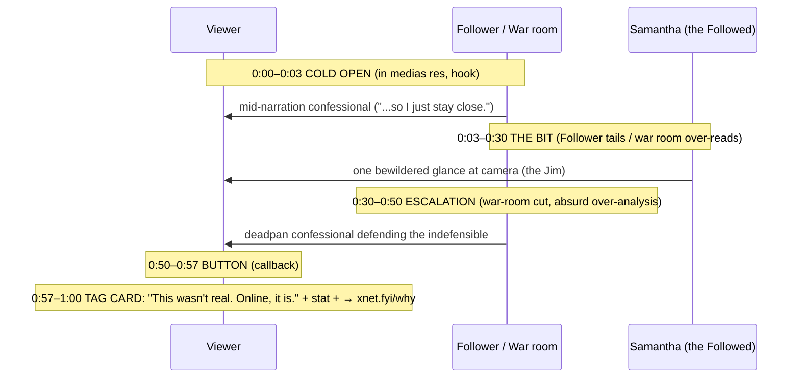
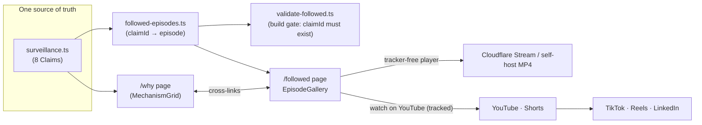

# The Followed — A Mockumentary Video Series From The `/why` Page

> Take the just-shipped [`/why`](../../site/src/pages/why.astro) landing page
> ("The Followed") and extend it into a short-form **mockumentary comedy series**
> — *The Office* / *Parks and Rec* deadpan — that dramatizes online surveillance
> by performing it physically: a cheerful man with a clipboard and a stopwatch
> tails a shopper through a pharmacy, narrating everything she picks up, while a
> windowless room of analysts over-reads her vitamins to guess if she's pregnant.

## Problem Statement

Exploration [0234](0234_[x]_THE_FOLLOWED_A_SURVEILLANCE_RECKONING_LANDING_PAGE.md)
shipped a page that makes invisible tracking *legible* by re-enacting it in the
physical world. It works because the absurdity is sensory: you can finally *see*
the thing. But a page is read by people who already clicked a privacy link. The
idea wants a wider on-ramp — something a developer forwards to another developer
framed as *"this is funny,"* not *"this is my company's video."*

The user's pitch is exactly that on-ramp: **a mockumentary series**. The comic
engine is the same literalization the page uses, escalated with two devices the
page can't do — **performance** (a clueless Follower, deadpan confessionals) and
**a war room** (a symposium of PhDs lavishing absurd attention on one woman's
mundane basket). The closest ancestors — CollegeHumor's *If Google Was A Guy*,
Apple's *Tracked* ad, DuckDuckGo's *Watching You* — prove the metaphor lands.
Nobody has done it as a **series**, deadpan, tied to a privacy product with a
real stake in the joke.

This exploration designs that series: the format and writing rules, an 8-episode
season mapped **1:1 to the page's cited claims**, the production and distribution
plan grounded in 2026 cost/format reality, and the **in-repo scaffold** (an
`/followed` episodes page + a validated `followed-episodes.ts` data module +
a tracker-free video player) so the website half can ship now and the films drop
in as they're produced.

## Executive Summary

- **One season, eight episodes, one source of truth.** Each episode dramatizes
  exactly one claim already in
  [`site/src/data/surveillance.ts`](../../site/src/data/surveillance.ts) (the
  data behind `/why`). A new `followed-episodes.ts` references `claimId`, and a
  build-gate validator (mirroring `validate-surveillance.ts`) enforces the 1:1
  link. The page and the series can never drift.
- **Format: deadpan single-camera mockumentary, 45–60s primary cut.** Recurring
  cast — *the Follower* (a contractor in a polo with a "Data Optimization
  Partner" lanyard), *the Audience Insights war room* (analysts who treat a
  woman's lotion like the Zapruder film), and *the Followed* (Samantha — the
  sympathetic human the apparatus swarms). Talking-head confessionals, cold
  opens in medias res.
- **Hard writing rules, drawn from the research flags.** (1) The apparatus is the
  butt of every joke — **never** the person being surveilled. (2) Satirize the
  **behavior/category**, not named brands — funnier *and* legally cleaner ("Data
  Optimization Partner," not "Google"). (3) The pregnancy episode mocks the
  analysts' over-reading; it never asserts the (mythologized) Target "father"
  anecdote as fact — consistent with the folklore caveat already in the data.
- **Production: scripts-first, then a one-day batch shoot.** Write all 8 scripts
  now (cheap, validatable), ship an audio **table-read pilot** to de-risk the
  writing, then batch-film live-action (one store + one war-room set, two
  recurring actors → all 8 in 1–2 days, ~$8–18k). Reserve AI video (Veo 3 / Kling
  for talking-heads and war-room data inserts) as a cost lever, not the spine —
  2026 AI still fumbles two-character physical comedy.
- **Distribution honors the brand's own thesis.** YouTube/Shorts + LinkedIn +
  TikTok/Reels for reach (privacy brands all use YouTube; acknowledge the
  trade-off out loud). On our **own** site, embed a **tracker-free** player
  (Cloudflare Stream or self-hosted MP4) — *not* a YouTube iframe, and **not**
  `youtube-nocookie` (it still writes a device id before play). The contrast —
  "watch it tracking-free here, or on YouTube where even this video gets tracked"
  — *is* the punchline, and keeps the `/why` self-audit honest.

## Current State In The Repository

### The page this grows out of (the shared spine)

[`site/src/data/surveillance.ts`](../../site/src/data/surveillance.ts) is the
single source of truth — 8 `Claim`s, each `{ id, moment, physical, digital, stat,
source, sourceUrl, caveat?, tone }`, validated at build time by
[`site/scripts/validate-surveillance.ts`](../../site/scripts/validate-surveillance.ts)
(https sources required; ≥1 `tone: 'hope'`). The page composes them through
seven components in `site/src/components/followed/` (`FollowedHero`,
`PhysicalAct`, `RevealHinge`, `MechanismGrid`, `TheTurn`, `HonestyBox`,
`SelfAudit`). The series reuses this `claimId` set verbatim — the episodes *are*
the claims, performed.

The 8 claims, which become the 8 episodes:

| `claimId` | Moment | Tone | The mechanism (Act II of `/why`) |
| --- | --- | --- | --- |
| `reported-to-thousands` | 8:02 AM | alarm | Pixels report your visit to ~2,230 companies |
| `shadow-profile` | 8:31 AM | alarm | You're profiled even with no account |
| `fingerprint` | 11:47 AM | alarm | Identified ~99% with no cookie to clear |
| `loyalty-sensor` | 2:15 PM | alarm | Purchase data → life-event inference (Target) |
| `online-offline` | 6:40 PM | alarm | Ad view matched to in-store card swipe |
| `brokers` | 9:58 PM | alarm | Dossier fused + licensed across the ecosystem |
| `oracle-dead` | next morning | **hope** | An ad-data giant shut down |
| `ftc-bans` | and then | **hope** | Regulators banned sensitive-location sales |

### How the site already renders video (the pattern to reuse)

[`site/src/components/changelog/Gallery.astro`](../../site/src/components/changelog/Gallery.astro)
already renders self-hosted MP4 with privacy-sane defaults — the exact pattern an
episodes page needs:

```astro
<video class="cl-video" poster={video.poster}
       controls muted loop playsinline preload="none" aria-label={video.alt}>
  <source src={video.mp4} type="video/mp4" />
</video>
```

`preload="none"` means nothing downloads until the viewer clicks — important for
the page's tracker-free posture. The data shape
([`site/src/lib/changelog-gallery.ts`](../../site/src/lib/changelog-gallery.ts))
is `{ mp4, poster, alt }`, sourced from a manifest under `xnet.fyi/visuals/...`.

### Data-module + validator convention (the pattern to mirror)

`compare.ts` + `validate-compare.ts`, `changelog.ts` + `validate-changelog.ts`,
`surveillance.ts` + `validate-surveillance.ts` — every data set carries a
build-time gate wired into `site/package.json`'s chained `build`:

```
validate:compare && validate:changelog && validate:plugins && validate:surveillance && build:llms && astro build
```

We add `validate:followed` to this chain.

### Static assets, analytics, third-party posture

[`site/src/layouts/Base.astro`](../../site/src/layouts/Base.astro) loads **no**
third-party scripts except optional cookieless Plausible (gated on
`PUBLIC_ANALYTICS_DOMAIN`, off in dev/preview). There is **no CSP** (Astro SSG, no
server headers) and **no existing third-party embed anywhere on the site**. The
`/why` page's `SelfAudit` asserts *"0 third-party requests."* **Implication: an
episodes page must not embed a YouTube/Vimeo iframe** — it would silently break
the site's entire credibility claim. Self-host MP4 under `site/public/videos/` or
proxy Cloudflare Stream. `site/public/` already holds `images/` etc.; add
`videos/followed/`.

### Wiring + production tooling that exists

- New marketing pages are just files in `site/src/pages/` (no sidebar gate);
  link them from
  [`Nav.astro`](../../site/src/components/sections/Nav.astro) /
  [`Footer.astro`](../../site/src/components/sections/Footer.astro) (where
  `/why` already lives under `resourceLinks`).
- The **visual-capture** system (`.github/workflows/visual-capture.yml`,
  `scripts/visuals/`, ffmpeg in `scripts/visuals/lib/ffmpeg.mjs`) records UI
  *flows* to MP4 — it's for app screencasts, **not** reusable for hand-produced
  comedy, but it proves the repo already ffmpeg-encodes and gh-pages-hosts MP4,
  so a `videos/followed/` pipeline is well-trodden ground.

## External Research

(Full citations in **References**. Accuracy flags are inline — they change the
writing, not just the footnotes.)

### Prior art — the metaphor is proven, the series is open

- **CollegeHumor / Dropout — *If Google Was A Guy* (2014).** The canonical
  ancestor: an abstract surveillance relationship literalized as one guy in a
  room. Single location, ~2–3 min, character-reactive, near-zero budget, viral,
  multiple sequels. **Our differentiator:** it kept the target generic ("Google"
  as all search) and never used a *second* location — our **war room** is a
  genuine formal addition (an escalation cut the ancestor lacks).
- **Apple — *Tracked* (2021, ~90s).** A man walks London trailed by a growing
  crowd of trackers narrating his life; turning on App Tracking Transparency
  vanishes them. The most-resourced brand in tech validated *our exact physical
  device.* We differ by genre (deadpan mockumentary series vs. earnest stylized
  spot) — adjacent, not derivative. Cite as internal proof-of-concept.
- **DuckDuckGo — *Watching You*.** Surveillance-as-comedy-of-manners, set to a
  cover of "Every Breath You Take." A privacy competitor already runs this play
  in short form.
- **John Oliver — Data Brokers (2022, ~20 min).** Comedy that escalates to a real
  stunt (buying Congress's data). Different length/format from ours, but the
  "real *and* absurd at once" energy is the tone target; our war room is the
  low-budget version of that escalation.
- **Tom Scott — *Welcome to Life* (2012).** Proof a single concept + voice, zero
  crew, scales. Validates the **scripts-first / table-read** pilot path.
- **"Do Not Track" (2015, Peabody).** Made surveillance *personal* and won major
  awards web-native, no broadcast — proof the subject travels far without a
  network.

### Format mechanics (Office / Parks-and-Rec, compressed to <60s)

The engine is the **epistemic gap**: characters don't see how they look; we do;
the doc camera maintains the gap. Tools: talking-head confessionals, cold opens
(30–90s, self-contained), crew acknowledgment (the Jim glance), handheld grammar.
Parks shot ~2:1 raw-to-cut. **Compression rule:** a <60s episode = *one cold
open* — a single confessional + a button/callback, no B-plot. The Follower
premise is self-explanatory, so no world-building is needed; the war room
supplies the confessional + escalation. Vertical 9:16 is *native* to
talking-heads and single-POV surveillance shots. Hook by ~second 1.5; open in
medias res (the Follower already mid-narration).

### Production reality & cost tiers (2026)

- **Live-action**, social short-form ≈ **$500–$3,000 / finished minute**.
  Entry-grade 90s ≈ $2–5k/ep; **batch-filming 6–8 eps in one day on one
  store + one war-room set with two recurring actors drops per-ep cost 40–60%**
  → ~$8–18k for the season. *Our concept is about the most batch-friendly comedy
  format possible.*
- **Animation/motion-graphics** ≈ $3–15k+/min — wrong tool (mockumentary lives
  on human faces) except for **war-room screen overlays / data-viz inserts**.
- **AI video (2026):** Veo 3.1 (native synced dialogue audio, lip-sync <120ms but
  clean on ~25% of first tries), Kling 3.0 (cheap, 4K, multi-shot consistency),
  Seedance (phoneme lip-sync), Sora 2 (best physics; note OpenAI is sunsetting the
  Sora app April 2026, API later). **All still fumble fingers, props, and
  two-character comedic timing.** Verdict: usable for **talking-head confessionals
  and war-room/data inserts**, *not* the in-store two-hander. Hybrid (AI war room
  + live in-store) ≈ 30–40% cost cut.
- **Scripts-first / table read** = the genuinely cheap pilot (mics + an hour).

### Privacy-preserving distribution (the honest version)

- **`youtube-nocookie` is marketing, not engineering** — it writes a
  `yt-remote-device-id` to Local Storage *before* play and sets cookies on play;
  IP still goes to Google every request. For a privacy brand, calling it
  "privacy-respecting" would be a self-own. **Do not embed it on-site.**
- **On-site:** **Cloudflare Stream** (~$5/1k min stored, $1/1k min delivered; no
  viewer tracking; no recommender) or **self-hosted MP4** (full control;
  bandwidth scales — Cloudflare zero-egress helps). Both keep the page clean.
- **Reach:** every privacy brand (Proton's two-channel strategy, DuckDuckGo's
  107M YouTube views on 9 videos) ships on YouTube and **acknowledges the
  trade-off**. **LinkedIn** native video (added 2025, ~5× text reach, low
  competition) is the highest-leverage channel for a B2B/dev tool.
- **Specs:** 9:16 master cross-posts everywhere; 16:9 cut for YouTube/site SEO;
  **captions mandatory** (~85% watch sound-off — and a muted joke is a dead
  joke); 30–60s beats 90s on completion-rate algorithms.

### The five flags that shape the writing

1. **Target "angry father" is mythologized** (secondhand, never verified). The
   *behavior* (purchase→health inference) is real and documented; the *anecdote*
   is folklore — matches our existing data caveat. Mock the analysts' overreach;
   don't narrate the father story as fact.
2. **`youtube-nocookie` ≠ private.** (above)
3. **Naming Google/Meta:** parody of a named brand is defensible fair use, but a
   small company invites a nuisance C&D regardless of merit. **Name the behavior**
   ("Data Optimization Partner," "Audience Insights") — funnier *and* safer. FTC
   explicitly permits truthful comparative advertising if we ever do name names.
4. **Don't make the surveilled the butt.** Reproductive-status inference is a real
   harm in the current US legal climate; the *Follower and the war room* look
   ridiculous, never Samantha.
5. **<60s beats 90s** algorithmically — primary cut tight, 90s "director's cut"
   for YouTube/site.

## Key Findings

1. **The series is a content layer over the data the page already ships.** No new
   "truth" to maintain — the episodes are a second rendering of `surveillance.ts`.
   A validator makes that structural, so the funniest possible version still
   can't drift from the cited facts.
2. **The website work and the film work are separable.** We can ship the
   `/followed` page, data module, validator, and a tracker-free player **now**,
   with poster stills + script loglines, and let actual episodes land one at a
   time. The repo deliverable doesn't block on a shoot.
3. **The format's strengths are exactly short-form's strengths.** Deadpan
   talking-heads and single-POV "surveillance cam" shots are vertically native;
   one premise needs no setup; one store + one war room batch-shoots a whole
   season. This is unusually cheap for scripted comedy.
4. **The brand's credibility is the comedy's safety rail — and vice versa.** The
   jokes only work because xNet has a real stake (we're not borrowing a cause).
   And the discipline that keeps `/why` honest (cite everything; mock the
   apparatus; don't overclaim) is the same discipline that keeps the comedy from
   curdling into cringe or a lawsuit.
5. **The distribution trade-off is itself a bit.** "Tracking-free here; tracked on
   YouTube — yes, even this video" is on-message, not an apology. It keeps the
   `/why` self-audit intact and turns a compromise into a punchline.

## The Season (8 episodes, 1:1 with the claims)

Recurring cast: **the Follower** (cheerful contractor, lanyard reads *Data
Optimization Partner*, clipboard, stopwatch — Dwight-by-way-of-mall-cop); **the
Audience Insights war room** (analysts at *Lumen Insights*, a generic ad-tech
firm, tagline *"We just want to get to know you"*); **the Followed** (Samantha —
sympathetic, bewildered, ordinary). Every episode ends on a 3-second card:
*"This wasn't real. Online, it is."* + the claim's `stat` + `source` + `→
xnet.fyi/why`.

| # | Episode | `claimId` | Premise (comic target = the apparatus) |
| --- | --- | --- | --- |
| 1 | **Welcome Aboard** | `reported-to-thousands` | Follower greets Samantha at the pharmacy door, clips on a numbered tag, radios "live one" — a call-center of 2,230 cheers. |
| 2 | **She's Not a Member** | `shadow-profile` | She declines the loyalty card. They follow anyway, *offended* that declining is itself suspicious. File her under a number. |
| 3 | **The Coat** | `fingerprint` | She ditches the tag; a "gait specialist" re-IDs her by shoes + coat lining. "You can change the tag. You can't change the walk." |
| 4 | **Maybe She's Pregnant** *(PILOT)* | `loyalty-sensor` | The war room treats vitamins + unscented lotion like the Zapruder film, convenes a symposium, predicts a due date, mails coupons "camouflaged" between lawn-mower ads. |
| 5 | **Closing the Loop** | `online-offline` | A "Loop Closure Officer" matches the poster she glanced at this morning to tonight's card swipe; the room erupts over a 0.02% lift. |
| 6 | **The Auction** | `brokers` | Samantha's dossier is auctioned; a folksy buyer three states away wins "the whole Samantha." |
| 7 | **Restructuring** *(hope)* | `oracle-dead` | The firm folds. The Follower, laid off, gives a wistful confessional with his clipboard in a banker's box. |
| 8 | **New Rules** *(hope)* | `ftc-bans` | A regulator bans following people into clinics; the room mopes; Samantha walks out free → the xNet turn. |

The season arc mirrors `/why`: six alarm beats, two hope beats, ending on the
turn and CTA.

### Episode beat structure (the <60s template)



### How it ties together on the site



## Options And Tradeoffs

### A. Production tier (how the films get made)

| Option | Pros | Cons |
| --- | --- | --- |
| **A1. Scripts-first → table-read pilot → live-action batch** *(recommended)* | De-risks writing for ~$0; batch shoot is cheap for this format; human faces = the comedy | Needs a shoot day, 2 actors, a location |
| A2. Full live-action up front | Highest quality | $$ before any signal that it lands |
| A3. AI-generated (Veo/Kling) | Cheapest per clip; no shoot | 2026 AI fumbles two-hander physical comedy; uncanny close-ups kill deadpan |
| A4. Hybrid (live in-store + AI/motion war-room inserts) | 30–40% cheaper; AI does what it's good at | Two pipelines to manage; consistency work |

### B. On-site hosting (must not break the `/why` self-audit)

| Option | Pros | Cons |
| --- | --- | --- |
| **B1. Cloudflare Stream (proxied) or self-hosted MP4** *(recommended)* | Zero viewer tracking; keeps "0 third-party requests" honest; reuses `Gallery.astro` `<video>` | Bandwidth/§cost; no built-in discovery |
| B2. `youtube-nocookie` iframe | Easy, free hosting | **Still tracks** (device id pre-play); self-own for a privacy brand; breaks self-audit |
| B3. Vimeo "hide from Vimeo" | Less tracking than YT; embeddable | Vimeo still collects; paid; not zero |

### C. Reach distribution

| Option | Pros | Cons |
| --- | --- | --- |
| **C1. YouTube + Shorts + LinkedIn + TikTok/Reels, trade-off acknowledged** *(recommended)* | Where the audience is; LinkedIn = best B2B/dev leverage; every privacy brand does this | The YouTube irony (mitigated by making it the bit) |
| C2. On-site / PeerTube only (purist) | Values-pure | Near-zero discovery; the joke never travels |

### D. Who/what gets named

| Option | Pros | Cons |
| --- | --- | --- |
| **D1. Name the behavior/category** ("Data Optimization Partner," "Lumen Insights") *(recommended)* | Funnier (bureaucratic deadpan); legally clean; ages well | Slightly less immediately legible |
| D2. Name Google/Meta directly | Instantly legible; strong parody fair-use claim | Nuisance-C&D risk for a small co.; can read as punching-down-by-association |

### E. In-repo scope (what `/implement` should actually build)

| Option | Pros | Cons |
| --- | --- | --- |
| **E1. Ship the page + data + validator + player + scripts now; videos later** *(recommended)* | Unblocks the web deliverable; scripts are real, reviewable work; placeholders degrade gracefully | A "coming soon" state until films land |
| E2. Wait for finished videos to build anything | Launches "complete" | Blocks everything on a shoot; nothing to review |

## Recommendation

Ship in two tracks.

**Track 1 — in-repo, now (the buildable part):**

1. `site/src/data/followed-episodes.ts` — the 8 episodes, each with `claimId`
   into `surveillance.ts`, logline, status (`scripted | filmed | published`), and
   optional `video { mp4, poster, alt }` (left empty until a film exists).
2. `site/scripts/validate-followed.ts` — build gate: every `claimId` resolves,
   ids unique, any present media URL is https/absolute, status enum valid, and a
   gentle **1:1 coverage** check (warn, don't fail, while the season is in
   progress). Wire `validate:followed` into the chained `build`.
3. `site/src/components/followed/EpisodeGallery.astro` + `EpisodeCard.astro` —
   reuse the `Gallery.astro` `<video>` pattern; a card shows poster + logline +
   the cited stat + a "Watch tracking-free / Watch on YouTube" pair; episodes
   without a film show a "Scripted — filming soon" state.
4. `site/src/pages/followed.astro` — composes a short hero + the gallery; cross-
   links to `/why`. Add `/why`'s `TheTurn`-style CTA at the bottom.
5. Link from `Footer.astro` (`resourceLinks`, next to "Why xNet") and a small
   prompt on `/why`. Defer a top-`Nav` slot until there's a real episode.
6. Commit the **8 scripts** as `docs/followed/EP-NN-*.md` (or a `scripts/` field)
   — the genuinely cheap, reviewable creative deliverable, written to the rules.

**Track 2 — production, out-of-band (humans, not the repo):** record the
table-read pilot of **Ep 4 "Maybe She's Pregnant"** (the user's favorite and the
sharpest satire of the apparatus); if it lands, batch-shoot the season on one
store + one war-room set; publish to YouTube/LinkedIn; drop MP4s into
`site/public/videos/followed/` and flip each episode's `status` to `published`.

Adopt **A1 + B1 + C1 + D1 + E1**. The keystone is that **the data module and
validator make the comedy structurally honest** — the same move that made `/why`
defensible.

## Example Code

### 1. `site/src/data/followed-episodes.ts`

```ts
// Each episode dramatizes exactly one claim from surveillance.ts. The shared
// claimId is the contract: validate-followed.ts fails the build if it dangles.
import type { Claim } from './surveillance'
import { CLAIMS } from './surveillance'

export type EpisodeStatus = 'scripted' | 'filmed' | 'published'

export interface EpisodeVideo {
  /** Tracker-free source: absolute path under /videos/followed or an https URL. */
  mp4: string
  poster: string
  alt: string
  /** Optional reach mirror; rendered as "watch on YouTube (tracked)". */
  youtube?: string
  /** Seconds, for display. */
  duration?: number
}

export interface Episode {
  id: string // e.g. 'ep4-maybe-shes-pregnant'
  number: number
  title: string
  /** Must equal a Claim.id in surveillance.ts. */
  claimId: string
  logline: string
  /** Who the joke is on — a standing reminder of writing-rule #1. */
  comicTarget: string
  status: EpisodeStatus
  video?: EpisodeVideo
}

export const updated = 'June 2026'

export const EPISODES: Episode[] = [
  {
    id: 'ep1-welcome-aboard',
    number: 1,
    title: 'Welcome Aboard',
    claimId: 'reported-to-thousands',
    logline:
      'A cheerful contractor clips a numbered tag to Samantha at the pharmacy door and radios "live one" — a call-center of thousands erupts.',
    comicTarget: 'the Follower and the cheering call-center',
    status: 'scripted',
  },
  {
    id: 'ep4-maybe-shes-pregnant',
    number: 4,
    title: 'Maybe She’s Pregnant',
    claimId: 'loyalty-sensor',
    logline:
      'The war room convenes a symposium over Samantha’s vitamins and unscented lotion, predicts a due date, and mails coupons camouflaged between lawn-mower ads.',
    comicTarget: 'the over-reading analysts — never Samantha',
    status: 'scripted',
  },
  // …ep2, ep3, ep5, ep6, ep7 (oracle-dead), ep8 (ftc-bans)
]

/** Convenience: resolve an episode's backing claim. */
export function claimFor(ep: Episode): Claim | undefined {
  return CLAIMS.find((c) => c.id === ep.claimId)
}
```

### 2. `site/scripts/validate-followed.ts` (wire `validate:followed` into `build`)

```ts
import type { Episode } from '../src/data/followed-episodes'
import { EPISODES } from '../src/data/followed-episodes'
import { CLAIMS } from '../src/data/surveillance'

const STATUSES = new Set(['scripted', 'filmed', 'published'])
const claimIds = new Set(CLAIMS.map((c) => c.id))
const errors: string[] = []
const seen = new Set<string>()

function ok(url: string): boolean {
  return url.startsWith('/') || url.startsWith('https://')
}

for (const ep of EPISODES) {
  const tag = ep.id || `#${ep.number}`
  if (seen.has(ep.id)) errors.push(`[${tag}] duplicate id`)
  seen.add(ep.id)
  if (!ep.title?.trim()) errors.push(`[${tag}] missing title`)
  if (!ep.logline?.trim()) errors.push(`[${tag}] missing logline`)
  if (!STATUSES.has(ep.status)) errors.push(`[${tag}] bad status "${ep.status}"`)
  if (!claimIds.has(ep.claimId)) errors.push(`[${tag}] claimId "${ep.claimId}" not in surveillance.ts`)
  if (ep.status === 'published' && !ep.video?.mp4) errors.push(`[${tag}] published but no video.mp4`)
  if (ep.video) {
    if (!ok(ep.video.mp4)) errors.push(`[${tag}] video.mp4 must be https/absolute`)
    if (!ok(ep.video.poster)) errors.push(`[${tag}] video.poster must be https/absolute`)
    // Tracker-free posture: never self-host a YouTube embed; youtube is reach-only.
    if (/youtu\.?be/.test(ep.video.mp4)) errors.push(`[${tag}] video.mp4 must not be a YouTube URL (keep /followed tracker-free)`)
  }
}

if (errors.length) {
  console.error(`followed-episodes.ts validation failed (${errors.length}):`)
  for (const e of errors) console.error(`  - ${e}`)
  process.exit(1)
}

// Soft coverage signal while the season is in progress — informational, not fatal.
const covered = new Set(EPISODES.map((e) => e.claimId))
const missing = [...claimIds].filter((id) => !covered.has(id))
if (missing.length) console.log(`followed-episodes.ts: ${EPISODES.length} episode(s); claims awaiting an episode: ${missing.join(', ')}`)
console.log(`followed-episodes.ts OK: ${EPISODES.length} episode(s), all tied to real claims`)
```

### 3. Pilot script — Ep 4, *"Maybe She's Pregnant"* (the apparatus is the butt)

```text
COLD OPEN — INT. "LUMEN INSIGHTS" WAR ROOM — DAY
A windowless room. Eight ANALYSTS in fleece vests stare at one slide:
a receipt. DR. BRANDT (40s, twirling his beard) addresses the camera.

  DR. BRANDT (confessional)
  People think we need a lot to know you. We don't. We need... lotion.

CUT TO: the slide. A single line item glows: UNSCENTED LOTION.

  ANALYST #2
  Unscented. (beat) She's hiding something from her own nose.

  ANALYST #3
  Or someone else's.

They lean in. Someone gasps. A laser pointer trembles.

  DR. BRANDT
  Cross-reference the vitamins.

A junior analyst sprints in with a printout like it's a biopsy.

  DR. BRANDT (cont'd)
  Prenatal? (whispered) ...Folate.

The room erupts in scholarly murmuring. Someone writes "DUE: OCTOBER?"
on the glass. A beard is stroked so hard it's basically applause.

  DR. BRANDT (confessional)
  We're not saying she's pregnant. We're saying the lotion is.

INT. PHARMACY — CONTINUOUS
SAMANTHA, 30s, normal, picks up lotion because her hands are dry.
She glances at camera. Just once. (The Jim.)

  SAMANTHA (confessional, baffled)
  ...It was on sale?

BUTTON: A mail truck dumps a coupon book on her porch: a $2 lawn-mower
blade, a $1 birdseed, and — page 14, tiny — newborn diapers.

TAG CARD (3s):
  "This wasn't real. Online, it is.
   Retailers turned purchase histories into ad businesses;
   one modeled pregnancy from ~25 products.
   — eMarketer; Duhigg, NYT 2012
   There's another way → xnet.fyi/why"
```

*(Writing note in the script header: the Target "father" anecdote is folklore —
the symposium's over-reading is the joke; we never narrate the anecdote as fact.
Mirrors the `caveat` on the `loyalty-sensor` claim.)*

### 4. Tracker-free player card (sketch)

```astro
---
import { EPISODES, claimFor } from '../../data/followed-episodes'
---
{EPISODES.map((ep) => {
  const claim = claimFor(ep)
  return (
    <article class="rounded-xl border border-amber-500/20 bg-amber-500/[0.03] p-5">
      {ep.video ? (
        <video class="w-full rounded-lg" poster={ep.video.poster}
               controls muted loop playsinline preload="none" aria-label={ep.video.alt}>
          <source src={ep.video.mp4} type="video/mp4" />
        </video>
      ) : (
        <div class="rounded-lg border border-dashed border-amber-500/30 p-8 text-center text-sm text-gray-500">
          Episode {ep.number} — scripted, filming soon
        </div>
      )}
      <h3 class="mt-4 font-semibold">{ep.number}. {ep.title}</h3>
      <p class="mt-1 text-sm text-gray-500">{ep.logline}</p>
      {claim && <p class="mt-3 text-sm font-medium text-amber-500">{claim.stat}</p>}
      <div class="mt-2 flex gap-4 text-xs">
        {claim && <a href={claim.sourceUrl} rel="noopener noreferrer" target="_blank" class="underline decoration-dotted">{claim.source}</a>}
        {ep.video?.youtube && <a href={ep.video.youtube} rel="noopener noreferrer" target="_blank" class="text-gray-400">Watch on YouTube (tracked) ↗</a>}
      </div>
    </article>
  )
})}
```

## Risks And Open Questions

- **Breaking the `/why` "0 third-party requests" self-audit.** A YouTube iframe
  anywhere on `/followed` (or `youtube-nocookie`) re-introduces third-party
  tracking and undercuts the whole brand. *Mitigation:* tracker-free player
  on-site (B1); the validator rejects YouTube URLs in `video.mp4`; keep YouTube as
  an outbound *link*, labeled "(tracked)."
- **Cringe / try-hard (the dominant failure mode of brand comedy).** Devs smell
  inauthenticity. *Mitigation:* the table-read pilot gate — if only the marketing
  team laughs, it doesn't ship. The "would a dev share this as *funny*, not as
  *our ad*" test. xNet's real stake is the safety rail.
- **Punching at a real harm.** Reproductive-status inference isn't abstract.
  *Mitigation:* writing-rule #1 in the data model (`comicTarget`) and in every
  script header — Samantha is sympathetic; the apparatus is ridiculous.
- **Factual drift from the page.** A funnier line that overstates a stat.
  *Mitigation:* the tag card pulls `stat`/`source` *from the claim*, not from the
  script; the validator binds episode↔claim.
- **Legal nuisance if we name brands.** *Mitigation:* D1 (name the behavior). Keep
  a documented option to name names later under FTC comparative-ad rules if we
  decide the legibility is worth it.
- **Budget vs. ROI for a dev tool.** A season is real money/time. *Mitigation:*
  scripts + pilot are cheap; only greenlight the batch shoot on pilot signal;
  LinkedIn-first keeps it close to the buyer.
- **AI-video temptation.** Cheap but uncanny for two-handers in 2026. *Open
  question:* is an all-AI "war room" inserts pass good enough to halve cost
  without breaking the deadpan? Test in the pilot.
- **Open question — does `/followed` want a top-`Nav` slot,** or stay a
  footer/`/why` cross-link until there's ≥1 published episode? (Recommend the
  latter; promote on launch — cf. the cautious rollout of `/why`.)
- **Open question — season cadence and the "hope" landing.** Do we release 1/week
  (with cutdowns between) and end on Ep 8's xNet turn, or front-load the pilot and
  let signal decide? Sequencing affects whether the arc reads as designed.

## Implementation Checklist

*In-repo (Track 1) — buildable now:*

- [ ] Add `site/src/data/followed-episodes.ts` (8 episodes, each `claimId` into
      `surveillance.ts`, `status`, `comicTarget`, optional `video`).
- [ ] Add `site/scripts/validate-followed.ts` (claimId resolves, unique ids,
      status enum, https/absolute media, **no YouTube in `video.mp4`**, soft 1:1
      coverage log) and wire `validate:followed` into `site/package.json` `build`.
- [ ] Add `site/src/components/followed/EpisodeGallery.astro` +
      `EpisodeCard.astro`, reusing the `Gallery.astro` `<video>` pattern
      (`preload="none"`, captions track when available) and a graceful
      "scripted — filming soon" empty state.
- [ ] Add `site/src/pages/followed.astro` (hero + gallery + `/why`-style CTA),
      cross-linked with `/why`.
- [ ] Link `/followed` from `Footer.astro` `resourceLinks` and add a prompt on
      `/why`; **defer** top-`Nav` until an episode is published.
- [ ] Commit the **8 scripts** as `docs/followed/EP-NN-<slug>.md`, each with a
      header stating the comic target + the relevant claim `caveat` (esp. Ep 4).
- [ ] Create `site/public/videos/followed/` with poster placeholders so cards
      render before films exist.
- [ ] `pnpm --filter site build` green with the new validator; no changeset
      (site/docs only).

*Production (Track 2) — out-of-band, humans:*

- [ ] Record the **table-read pilot** of Ep 4; circulate for the "is it actually
      funny" gate.
- [ ] On signal: batch-shoot the season (one store + one war-room set, two
      recurring actors); produce 9:16 master + 16:9 cut + burned-in captions.
- [ ] Set up the tracker-free host (Cloudflare Stream or self-host) and the
      YouTube/LinkedIn channels.
- [ ] Drop MP4s/posters into `site/public/videos/followed/`, fill each `video`,
      flip `status` to `published`.

## Validation Checklist

- [ ] `validate:followed` fails on a dangling `claimId`, a duplicate id, a
      `published` episode with no `video.mp4`, and any YouTube URL in `video.mp4`
      (prove each with a temporary bad entry, then revert).
- [ ] `/followed` page makes **0 third-party requests** and sets **0 cookies**
      (same bar as `/why`; verify in the Network tab) — YouTube appears only as an
      outbound labeled link.
- [ ] Every on-card stat/source is pulled from the bound claim (change a claim's
      `stat`; the card updates without editing the episode).
- [ ] Page is readable with JS disabled and on mobile (9:16-friendly cards);
      captions present on any published video.
- [ ] Each script header names the comic target as the *apparatus*; Ep 4 carries
      the folklore caveat and never asserts the anecdote as fact.
- [ ] Pilot passes the "a developer would share this as *funny*" test with ≥N
      outside viewers before any batch-shoot spend.
- [ ] Light/dark legible; cross-links `/why ↔ /followed` resolve; CTA points to
      the app.

## References

### Codebase

- `site/src/data/surveillance.ts`, `site/scripts/validate-surveillance.ts` — the
  shared, validated claim set (the season backbone).
- `site/src/pages/why.astro`, `site/src/components/followed/*` — the page this
  extends; reuse tone, tokens, `SelfAudit`'s tracker-free posture.
- `site/src/components/changelog/Gallery.astro`,
  `site/src/lib/changelog-gallery.ts` — the `<video>` rendering + `{mp4,poster,
  alt}` model to reuse.
- `site/src/data/compare.ts` + `site/scripts/validate-compare.ts`,
  `site/src/data/changelog.ts` + `site/scripts/validate-changelog.ts` — the
  data-module + build-gate convention.
- `site/src/layouts/Base.astro` (cookieless analytics, no CSP, no third-party),
  `site/src/components/sections/{Nav,Footer}.astro`, `site/package.json`
  (chained `build`), `site/public/` (asset hosting),
  `.github/workflows/visual-capture.yml` + `scripts/visuals/` (existing ffmpeg/MP4
  pipeline precedent).

### External (cited, 2024–2026)

- CollegeHumor — *If Google Was A Guy* (full series):
  https://www.youtube.com/watch?v=Cxqca4RQd_M
- Apple — *Tracked* (2021), analysis:
  https://www.fastcompany.com/90638821/apples-newest-ad-perfectly-visualizes-how-its-app-tracking-transparency-privacy-feature-stops-companies-from-stalking-you
- DuckDuckGo — *Watching You* TV spot:
  https://www.ispot.tv/ad/blTx/duckduckgo-watching-you
- Last Week Tonight — Data Brokers (2022):
  https://www.youtube.com/watch?v=wqn3gR1WTcA
- Tom Scott — *Welcome to Life* (2012):
  https://www.youtube.com/watch?v=IFe9wiDfb0E
- *Do Not Track* (2015), MIT Docubase:
  https://docubase.mit.edu/project/do-not-track/
- Proton — YouTube/thought-leadership strategy:
  https://proton.me/blog/protons-new-youtube-channel-aims-to-arm-you-with-information
- `youtube-nocookie` still tracks (Local Storage device id):
  https://cloudfour.com/thinks/youtube-no-cookies-adds-cookies/
- Cloudflare Stream vs. Vimeo (privacy/cost):
  https://www.wappalyzer.com/compare/cloudflare-stream-vs-vimeo/
- Target pregnancy story — debunk/context (folklore caveat):
  https://www.kdnuggets.com/2014/05/target-predict-teen-pregnancy-inside-story.html
- FTC — Statement of Policy Regarding Comparative Advertising:
  https://www.ftc.gov/legal-library/browse/statement-policy-regarding-comparative-advertising
- Parody vs. satire fair-use (name the behavior, not the brand):
  https://copyrightalliance.org/faqs/parody-considered-fair-use-satire-isnt/
- Video production cost (2026):
  https://vidico.com/news/video-production-cost/
- AI video state of the art (2026), Veo/Sora/Kling/Seedance:
  https://lensgo.ai/blog/veo-3-vs-sora-2-vs-kling-2-best-ai-video-model-2026
- Short-form strategy (2026), LinkedIn native video, sound-off/captions:
  https://www.opus.pro/blog/short-form-video-strategy-2026
