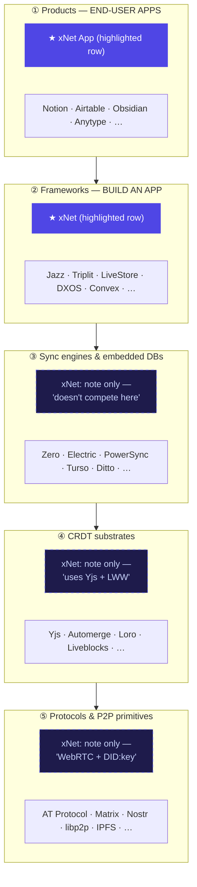
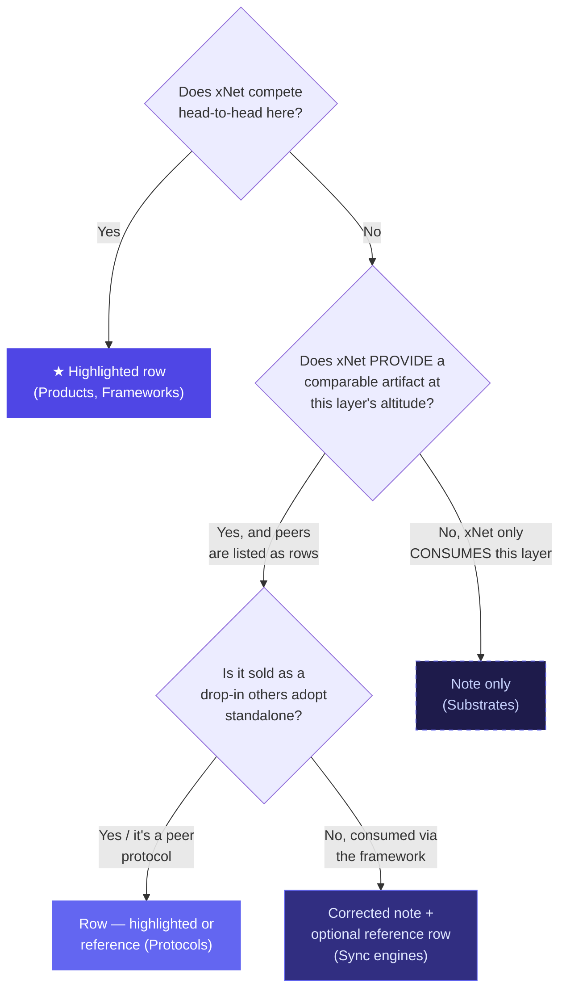

# Compare Page — Should xNet Be Listed Under Sync Engines And Protocols?

## Problem Statement

The `/compare` page ("The Local-First Landscape") groups the ecosystem into
**five layers** and shows xNet as a *highlighted row* in two of them (Products,
Frameworks). In the other three — **Sync engines & embedded databases**,
**CRDT substrates**, and **Protocols & P2P primitives** — xNet is *not* a row.
Instead it appears only as a one-line indigo callout (`xnetNote`) explaining how
it relates to that layer.

The question raised: **on the compare page, shouldn't xNet be listed under sync
engines and protocols?** xNet ships a P2P sync engine and a written, conformance-
tested wire protocol — so why is it a footnote in exactly the two layers that
describe those things?

This exploration draws the line precisely: where xNet genuinely *competes*, where
it is a *consumer* of a layer's primitives, where it is a *peer*, and where it is
itself a *provider* — and recommends how each layer should represent it so the
page is internally consistent and matches xNet's own marketing claims elsewhere
on the site.

## Executive Summary

**Short answer: the *Protocols* layer should include xNet (strong, concrete
case). The *Sync engines* layer should *not* gain a competing xNet row — but its
current rationale is factually wrong and must be fixed.**

Two findings drive this:

1. **Protocols layer — clear inconsistency.** xNet's own landing page
   ([`OpenProtocol.astro`](site/src/components/sections/OpenProtocol.astro))
   markets xNet as *"An open protocol, not just an app… Like Matrix or the AT
   Protocol, the spec is separate from any one codebase."* Both **Matrix** and
   **AT Protocol** are rows in the compare page's Protocols layer
   ([`compare.ts:1032-1083`](site/src/data/compare.ts)). xNet is not. The
   compare page's `xnetNote` describes xNet only as a *consumer* of primitives
   ("WebRTC for transport and DID:key + UCAN for identity"), silently omitting
   that xNet *is itself* a protocol at the same altitude as the two projects it
   benchmarks against on the home page. There is a normative spec
   ([`docs/specs/protocol/`](docs/specs/protocol)), a four-layer protocol model
   (L0–L3), golden conformance vectors
   ([`conformance/vectors/replication/`](conformance/vectors/replication)), and
   a reference Python kernel. This is the headline fix.

2. **Sync-engines layer — weak rationale, but adding a row is the wrong fix.**
   The layer's `xnetNote` says *"xNet doesn't compete here — it brings its own
   store"* ([`compare.ts:696`](site/src/data/compare.ts)). But **Ditto**
   ("Ditto mesh (CRDT store)") and **Turso** ("SQLite embedded replicas") *also*
   bring their own store and **are** listed in this very layer. xNet's own
   roadmap lists *"P2P sync engine (Yjs + Lamport clocks)"* under **Built**
   ([`roadmap.ts:33`](site/src/data/roadmap.ts)). So "brings its own store" is
   not a real exclusion criterion. The honest distinction is *consumability*:
   Zero/Electric/PowerSync/Turso/Ditto are sold as **drop-in data layers you put
   under someone else's app**; xNet's store+sync is consumed **as the framework**
   (it's already a highlighted row in Frameworks). The fix is to **correct the
   note**, not to stuff xNet into a third table where it would read as
   over-claiming.

**Net recommendation:** adopt a principled *representation taxonomy* (competing
row → reference row → chip → note) and apply it per layer. Concretely: **add an
xNet row to Protocols**, **rewrite the Sync-engines note** (and tighten that
layer's framing so Ditto/Turso stop contradicting it), and leave Substrates
as-is (xNet is a genuine consumer there).

## Current State In The Repository

### The five-layer model and where xNet appears today

Single source of truth: [`site/src/data/compare.ts`](site/src/data/compare.ts),
rendered by
[`CompareLayerSection.astro`](site/src/components/compare/CompareLayerSection.astro)
into [`compare.astro`](site/src/pages/compare.astro). Validated at build by
[`scripts/validate-compare.ts`](site/scripts/validate-compare.ts).

| # | Layer (`id`) | xNet today | Mechanism |
|---|---|---|---|
| 1 | Products (`products`) | **Highlighted row** ("xNet App", pre-release) | `highlight: true` row, [`compare.ts:80-104`](site/src/data/compare.ts) |
| 2 | App frameworks (`frameworks`) | **Highlighted row** ("xNet", pre-release) | `highlight: true` row, [`compare.ts:386-408`](site/src/data/compare.ts) |
| 3 | Sync engines & embedded databases (`sync`) | **Note only** — *"doesn't compete here — it brings its own store"* | `xnetNote` via intro, [`compare.ts:695-696`](site/src/data/compare.ts) |
| 4 | CRDT & collaboration substrates (`substrates`) | **Note only** — *"uses Yjs… own Lamport-clock LWW layer"* | `xnetNote`, [`compare.ts:904-905`](site/src/data/compare.ts) |
| 5 | Protocols & P2P primitives (`protocols`) | **Note only** — *"sits at the application layer: WebRTC… DID:key + UCAN"* | `xnetNote`, [`compare.ts:1022-1023`](site/src/data/compare.ts) |



### What the `sync` layer actually contains (the inconsistency)

Intro ([`compare.ts:695-696`](site/src/data/compare.ts)):

> "Engines that sync an existing database or backend into clients. **xNet
> doesn't compete here — it brings its own store** — but if you already have
> Postgres or SQLite, these are the tools to evaluate."

Yet the rows include two projects that *bring their own store*:

- **Ditto** — `source: 'Ditto mesh (CRDT store)'`, `conflict: 'CRDTs'`,
  offline writes yes ([`compare.ts:794-810`](site/src/data/compare.ts)). This is
  an embedded CRDT database with P2P mesh sync — architecturally the closest
  analogue to xNet in the entire table.
- **Turso** — `source: 'SQLite (embedded replicas)'`
  ([`compare.ts:777-793`](site/src/data/compare.ts)). An embedded database, not a
  sync-onto-your-Postgres engine.

So the stated exclusion criterion ("brings its own store") is contradicted by the
layer's own membership. The *title* even says "**& embedded databases**."

### What xNet actually ships (the affirmative case)

- **A P2P sync engine** — listed under **Built** in
  [`roadmap.ts:33`](site/src/data/roadmap.ts): *"P2P sync engine (Yjs + Lamport
  clocks)"*. Packages exist: [`packages/sync`](packages/sync),
  [`packages/runtime`](packages/runtime) (`createXNetClient` + liveQuery store),
  [`packages/sdk`](packages/sdk).
- **A written, multi-layer protocol** — marketed on the home page by
  [`OpenProtocol.astro`](site/src/components/sections/OpenProtocol.astro):

  > "An open protocol, not just an app… **Like Matrix or the AT Protocol**, the
  > spec is separate from any one codebase."

  with four layers: **L0 Primitives** (DID:key, Ed25519, XChaCha20-Poly1305,
  X25519, BLAKE3, UCAN), **L1 Data Model** (the Node, the signed Change,
  byte-exact canonicalization), **L2 Replication** (wire messages, signed Yjs
  envelope, version handshake — bound to WebSocket and libp2p), **L3
  Authorization** (schema rules, role resolvers, grants, UCAN tokens).
- **A normative spec + conformance corpus** — designed in
  [`docs/explorations/0200_[x]_PORTABLE_XNET_PROTOCOL_BOUNDARIES_AND_STANDARD.md`](docs/explorations/0200_[x]_PORTABLE_XNET_PROTOCOL_BOUNDARIES_AND_STANDARD.md);
  `CURRENT_PROTOCOL_VERSION = 3` at
  [`packages/sync/src/change.ts:24`](packages/sync/src/change.ts); golden vectors
  under [`conformance/vectors/`](conformance/vectors); a ~100-line Python kernel
  reproduces DIDs and verifies TypeScript-signed changes byte-for-byte.

The compare page's protocols `xnetNote` mentions *none* of this — it frames xNet
purely as a *user* of WebRTC + DID, which is exactly the L0 row of xNet's own
protocol stack, not the whole stack.

### Guardrails any change must satisfy

From the data-module header ([`compare.ts:1-12`](site/src/data/compare.ts)) and
[`validate-compare.ts`](site/scripts/validate-compare.ts):

- Every project row needs `name`, HTTPS `url`, `maturity`, `license`, `bestFor`,
  and a `dims` entry for **every** column key in its layer (except `license` /
  `bestFor`, which resolve from top-level fields).
- *"Never state a competitor status claim without a sourced footnote."*
- *"xNet rows must match `site/src/data/roadmap.ts` — 'shipped' means listed
  under Built there."* → a Protocols row may only claim what's Built; **hub-to-hub
  federation is "Then" (future), not Built** ([`roadmap.ts`](site/src/data/roadmap.ts)),
  so the row must be careful to claim a *protocol/sync* capability, not
  *federation*.
- Footnotes: no duplicates, no dangling refs, no unused — validated.
- Names unique within a layer.

## External Research

The compare page's five-layer split is a defensible, fairly standard cut of the
local-first landscape (cf. the categories used by localfirst.fm,
[awesome-local-first](https://github.com/alexanderop/awesome-local-first), and
Convex's [object-sync-engine](https://stack.convex.dev/object-sync-engine)
write-up). Two observations from the wider field are directly relevant:

1. **"Sync engine" and "embedded database with its own store" are routinely
   lumped together.** Turso/libSQL, Ditto, OrbitDB, GUN, cr-sqlite, PGlite are
   all discussed under "sync / local data layer" even though several bring their
   own store rather than syncing an existing backend. So the compare page's
   decision to put Ditto/Turso in the sync layer is normal — which means the
   *note* ("brings its own store" = excluded) is the part that's out of step, not
   the membership.

2. **Categories overlap by nature; a project can legitimately appear at multiple
   layers.** Jazz, DXOS, and Convex are simultaneously "frameworks" *and* ship
   their own sync engine; Yjs is both a "CRDT library" and (with providers) a
   sync stack. The landscape has no clean partition. This cuts both ways: it's
   *defensible* to list xNet at more than one layer, **and** it's defensible to
   list it once at its primary altitude and cross-reference. The deciding factor
   should be **consistency with how peers in each table are treated**, not a
   purity rule.

The takeaway: there is no objective "correct" number of layers xNet belongs to —
but the page must apply the *same* rule to xNet that it applies to AT Protocol,
Matrix, Ditto, and Turso. Today it doesn't.

## Key Findings

1. **The Protocols omission contradicts xNet's own marketing.** The home page
   benchmarks xNet against Matrix and AT Protocol *as protocols*; the compare
   page lists Matrix and AT Protocol but not xNet. A reader who visits both pages
   sees a direct contradiction. (Strongest argument for change.)

2. **The Sync-engines note is factually self-contradicting.** "Brings its own
   store" can't be the exclusion reason when Ditto and Turso — both in the
   table — bring their own store.

3. **xNet ships the relevant capability in both cases.** A "P2P sync engine" is
   in the Built roadmap; a normative protocol spec + conformance vectors + Python
   kernel exist. The affirmative facts are real and citable.

4. **But "more rows" is not automatically better.** The page's credibility rests
   on visible restraint — *"we maintain this ourselves, so treat it as informed
   but opinionated"* and *"every path below is a good choice… including the ones
   that aren't xNet"* ([`compare.astro`](site/src/pages/compare.astro)). Listing
   xNet a 3rd/4th/5th time, highlighted in indigo, risks reading as
   self-promotion stuffed into every table — the opposite of the trust the page
   is engineered to earn.

5. **The right unit of analysis is xNet's *relationship* to each layer**, which
   differs: competitor (1,2), provider/peer (5), provider-but-not-drop-in (3),
   consumer (4). A single representation mechanism (`highlight` row) can't express
   that — the page needs a richer vocabulary.

## Options And Tradeoffs

### A representation taxonomy

Rather than a binary "row vs note," define four representations and a rule for
picking one:



### Option 1 — Status quo (notes only in layers 3–5)

- **Pros:** maximal restraint; no risk of looking self-promotional; least work.
- **Cons:** leaves the two real inconsistencies in place (Protocols omission vs
  home page; "brings its own store" vs Ditto/Turso). A sharp reader notices.

### Option 2 — Add xNet as a highlighted row in *both* sync and protocols

- **Pros:** directly answers the literal question; symmetric with layers 1–2.
- **Cons:** in the Sync layer xNet isn't a drop-in sync engine for an *existing*
  backend (its whole pitch is "bring the whole stack"), so the row would need so
  many caveats it'd mislead; five highlighted indigo rows reads as stuffing;
  validation requires full `dims` + sourced footnotes for claims that, for sync,
  partly overlap the Frameworks row (duplication).

### Option 3 — Protocols gets a row; Sync gets a corrected note (recommended)

- Add xNet to **Protocols** as a row (it genuinely is a peer protocol to AT
  Proto/Matrix, by xNet's own framing).
- **Rewrite** the Sync note to be accurate ("xNet has its own sync engine + store
  — see Frameworks — so it isn't a drop-in sync layer for an existing Postgres/
  SQLite backend") and **tighten the layer framing** so Ditto/Turso (own-store
  embedded DBs) no longer contradict it.
- Leave **Substrates** as a note (xNet is a true consumer of Yjs there).
- **Pros:** fixes both real defects; keeps restraint where xNet is a
  consumer/non-drop-in; aligns the page with the home page; each change is backed
  by a shipped, citable artifact.
- **Cons:** asymmetry ("why a row in protocols but not sync?") must be legible —
  handled by the corrected sync note, which explains exactly that.

### Sub-decision: should the Protocols row be `highlight: true`?

| | Highlighted row | Plain "reference" row (no `highlight`) |
|---|---|---|
| Signal | "this is us, and we belong here" | "for completeness/honesty, here's where we sit" |
| Trust risk | higher (indigo in a "primitives" table) | lower; reads as candor |
| Consistency | matches layers 1–2 | matches "we're a peer, not the hero of this table" |

**Recommendation: highlighted row.** xNet's own site explicitly positions it
*as* a protocol alongside Matrix/AT Proto, so claiming the row is honest, and the
`highlight` keeps the "this is xNet" convention consistent across the page. Pair
it with an upgraded `xnetNote` that states the dual relationship (consumer of L0
primitives **and** provider of L1–L3 protocol) so the row doesn't overclaim.

## Recommendation

Adopt **Option 3**. Apply the representation taxonomy as:

| Layer | Relationship | Representation | Action |
|---|---|---|---|
| Products | Competitor | ★ Highlighted row | keep |
| Frameworks | Competitor | ★ Highlighted row | keep |
| Sync engines & embedded DBs | Provider, **not** drop-in | **Corrected note** (+ tighten layer framing) | **change** |
| CRDT substrates | Consumer | Note only | keep |
| Protocols & P2P primitives | **Peer protocol** | **★ Highlighted row** + upgraded note | **change** |

Then mirror the change anywhere the protocols framing is echoed (the page's
"Need a primitive → Federated social" guide card and the "Where xNet fits"
tradeoffs both currently treat protocols as not-xNet — keep those honest, but the
home page's Matrix/AT-Proto comparison is the anchor the compare page must stop
contradicting).

## Example Code

All edits are in [`site/src/data/compare.ts`](site/src/data/compare.ts); the
renderer and validator need no changes (a highlighted row + footnotes are already
supported).

### 1. Protocols layer — add the xNet row + upgrade the note

```ts
// Layer 5: protocols — replace xnetNote and prepend an xNet row.
xnetNote:
  'xNet both consumes and provides at this layer: it builds on WebRTC, ' +
  'DID:key and UCAN as primitives (L0), and is itself a written, ' +
  'conformance-tested protocol (L1 data model · L2 replication · L3 ' +
  'authorization) that anyone can re-implement — like AT Protocol or Matrix.',
// …
projects: [
  {
    name: 'xNet',
    url: 'https://github.com/crs48/xNet',
    highlight: true,
    maturity: 'pre-release',
    license: 'MIT / Apache-2.0',
    bestFor: 'Owning a typed knowledge graph — protocol separate from any one app',
    dims: {
      scope: 'App + data protocol',
      dataModel: { v: 'Signed, hash-chained LWW change log', fn: 'xnet-kernel' },
      sync: 'WebRTC / WebSocket; libp2p-capable; optional Hub relay',
      identity: 'DID:key + UCAN'
    },
    footnotes: ['xnet-kernel'],
  },
  // …existing AT Protocol, Nostr, ActivityPub, Matrix, … rows
],
footnotes: [
  {
    id: 'xnet-kernel',
    text:
      'xNet’s interop kernel is a signed, hash-chained, last-write-wins ' +
      'change log over schema-typed nodes (not Yjs, which travels as an opaque ' +
      'document body). A normative spec ships with a language-agnostic ' +
      'conformance corpus and a reference Python kernel. Hub-to-hub federation ' +
      'is on the roadmap, not yet shipped.',
    sourceUrl: 'https://github.com/crs48/xNet/tree/main/docs/specs/protocol',
  },
  // …existing footnotes
],
```

> Note on validation: the Protocols columns are `scope · dataModel · sync ·
> identity · bestFor` ([`compare.ts:1025-1031`](site/src/data/compare.ts)) — the
> row above supplies all four `dims` keys (`bestFor` resolves from the top-level
> field), so [`validate-compare.ts`](site/scripts/validate-compare.ts) passes.
> The maturity (`pre-release`) and the federation caveat keep the row inside the
> "must match roadmap Built" rule.

### 2. Sync-engines layer — correct the note, don't add a row

```ts
// Layer 3: sync — make the exclusion criterion accurate.
intro:
  'Engines and embedded databases that move data between clients and a ' +
  'backend. Some sync onto an existing Postgres/SQLite (Zero, Electric, ' +
  'PowerSync); others bring their own store (Turso, Ditto). xNet ships its ' +
  'own sync engine and store too — but you adopt it as a framework ' +
  '(see above), not as a drop-in sync layer under an existing app. If you ' +
  'already have a database, these are the tools to evaluate.',
```

(Optional, if a fuller comparison is wanted later: add a single **non-highlighted
reference row** for xNet here with `bestFor: 'Own-store sync — adopted as a
framework, not a drop-in'` and a footnote pointing at the Frameworks row. Default
recommendation is the note-only correction above, to avoid duplicating the
Frameworks entry.)

```mermaid
sequenceDiagram
    participant V as Visitor
    participant H as Home page (/)
    participant C as Compare page (/compare)
    Note over H: OpenProtocol section:<br/>"xNet is a protocol<br/>like Matrix / AT Proto"
    V->>H: reads protocol pitch
    V->>C: scrolls to Protocols layer
    rect rgb(60,20,20)
    Note over C: TODAY — lists Matrix & AT Proto,<br/>omits xNet → contradiction
    end
    rect rgb(20,50,30)
    Note over C: AFTER — xNet row + note:<br/>"consumer of L0, provider of L1–L3"<br/>→ consistent
    end
```



## Risks And Open Questions

- **Over-claiming risk.** Adding xNet to a "primitives" table can read as
  self-promotion. Mitigation: the upgraded note explicitly frames xNet as both
  consumer *and* provider, the row is `pre-release`, and the footnote states
  federation is not yet shipped.
- **Roadmap drift.** The row must claim *protocol/sync* (Built), not *federation*
  (Then). If the row's wording creeps toward "federates with the fediverse," it
  violates the "match roadmap Built" rule. Keep the federation caveat in the
  footnote.
- **Asymmetry legibility.** "Row in Protocols but only a note in Sync" must be
  self-explaining. The corrected sync intro does this; verify it reads cleanly.
- **License accuracy.** Confirm the protocol/repo license string for the row
  (`MIT` for the app vs `MIT / Apache-2.0` for the spec) against the actual spec
  license before shipping.
- **Open question — should xNet also appear in Substrates?** Recommendation: no.
  xNet's Lamport-LWW layer is not a standalone CRDT library you'd adopt; it's an
  internal part of the kernel. The consumer-only note is correct there. Revisit
  only if that layer is ever extracted and published as `@xnetjs/*`.
- **Open question — highlight vs reference row in Protocols.** Defaulted to
  highlight for consistency; a reviewer prioritizing maximal humility could
  downgrade to a plain row. Either passes validation.

## Implementation Checklist

- [ ] Add the `xNet` row to the `protocols` layer in
      [`compare.ts`](site/src/data/compare.ts) with all four `dims` keys
      (`scope`, `dataModel`, `sync`, `identity`) + `bestFor`.
- [ ] Add the `xnet-kernel` footnote with a `sourceUrl` to the normative spec
      ([`docs/specs/protocol/`](docs/specs/protocol)) and reference it from the
      row (`footnotes: ['xnet-kernel']`).
- [ ] Replace the `protocols` `xnetNote` with the consumer-**and**-provider
      wording.
- [ ] Rewrite the `sync` layer `intro` so "own-store" projects (Turso, Ditto)
      no longer contradict the xNet note; make the exclusion criterion
      "drop-in under an existing app," not "brings its own store."
- [ ] Confirm the row's `license` string and `maturity` match reality and the
      roadmap (`pre-release`; claim protocol/sync, not federation).
- [ ] Decide highlight vs reference row for the Protocols entry (default:
      `highlight: true`).
- [ ] Leave Substrates unchanged; note the decision in the PR description.
- [ ] (Optional) Re-check the "Need a primitive → Federated social" guide card
      and the "Where xNet fits" tradeoffs in
      [`compare.astro`](site/src/pages/compare.astro) for consistency with the
      new protocols framing.

## Validation Checklist

- [ ] `pnpm --filter site build` succeeds and
      [`validate-compare.ts`](site/scripts/validate-compare.ts) prints the
      updated `compare.ts OK: 5 layers, N rows, M chips` (N increments by 1).
- [ ] No validation errors for missing `dims`, dangling/unused footnotes, or
      duplicate names within the Protocols layer.
- [ ] The Protocols table renders the xNet row with the indigo highlight, the
      maturity badge, and a working footnote superscript → source link
      (desktop table + mobile card + extended-dimensions view all correct).
- [ ] Visual check: xNet row sits naturally among AT Protocol / Matrix; the
      upgraded note reads as candid, not boastful.
- [ ] Cross-page consistency: the compare Protocols layer no longer contradicts
      [`OpenProtocol.astro`](site/src/components/sections/OpenProtocol.astro)
      (both now treat xNet as a protocol peer to Matrix / AT Protocol).
- [ ] The sync-layer note no longer contradicts the presence of Ditto/Turso.
- [ ] Every claim in the new row/footnote maps to a **Built** roadmap item or is
      explicitly marked as roadmap (federation).
- [ ] `rowCount` (derived) and the hero "Projects compared" stat update
      automatically and read correctly.

## References

- [`site/src/data/compare.ts`](site/src/data/compare.ts) — compare data (source of truth)
- [`site/src/components/compare/CompareLayerSection.astro`](site/src/components/compare/CompareLayerSection.astro) — renderer (`xnetNote`, `highlight`, footnotes)
- [`site/src/pages/compare.astro`](site/src/pages/compare.astro) — page (decision guide, "Where xNet fits")
- [`site/scripts/validate-compare.ts`](site/scripts/validate-compare.ts) — build-time validation gate
- [`site/src/components/sections/OpenProtocol.astro`](site/src/components/sections/OpenProtocol.astro) — "An open protocol… like Matrix or the AT Protocol"
- [`site/src/data/roadmap.ts`](site/src/data/roadmap.ts) — Built includes "P2P sync engine"; federation is "Then"
- [`docs/explorations/0200_[x]_PORTABLE_XNET_PROTOCOL_BOUNDARIES_AND_STANDARD.md`](docs/explorations/0200_[x]_PORTABLE_XNET_PROTOCOL_BOUNDARIES_AND_STANDARD.md) — the L0–L3 protocol model, kernel, conformance corpus
- [`packages/sync/src/change.ts`](packages/sync/src/change.ts) — `CURRENT_PROTOCOL_VERSION` and the signed Change record
- [`docs/explorations/0203_[_]_CHANGELOG_PR_SOURCE_OF_TRUTH.md`](docs/explorations) → see also the compare-page data-module single-sourcing convention
- [awesome-local-first](https://github.com/alexanderop/awesome-local-first) — landscape categorization
- [Convex — An Object Sync Engine for Local-first Apps](https://stack.convex.dev/object-sync-engine) — sync-engine framing
- [Best CRDT Libraries 2025 — Velt](https://velt.dev/blog/best-crdt-libraries-real-time-data-sync) — CRDT/substrate landscape
