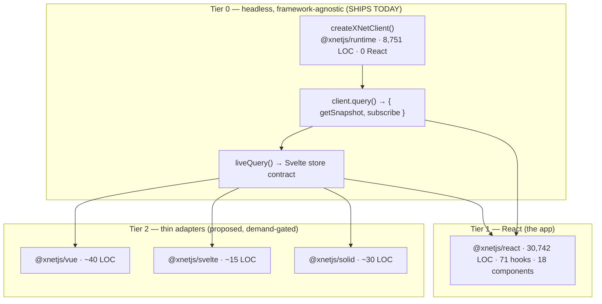
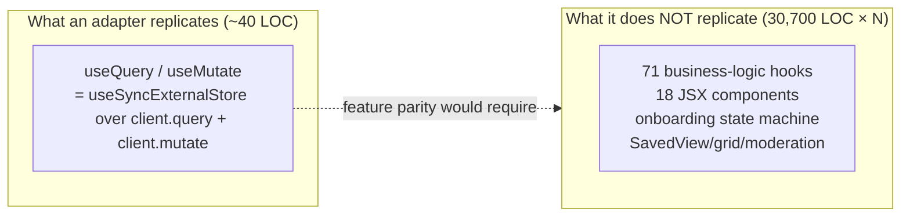
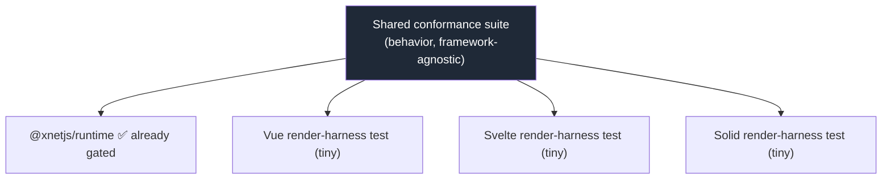
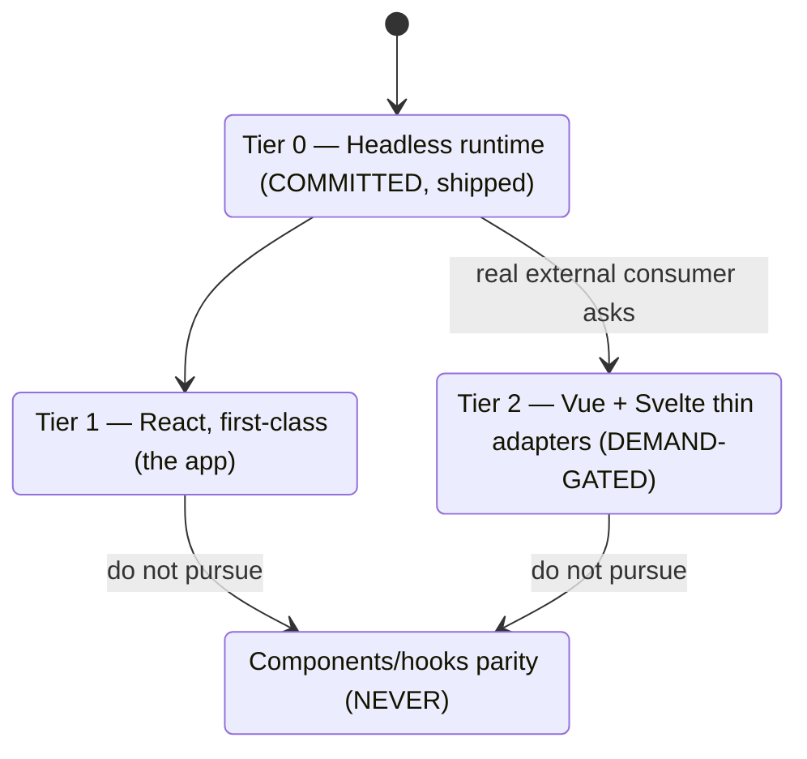
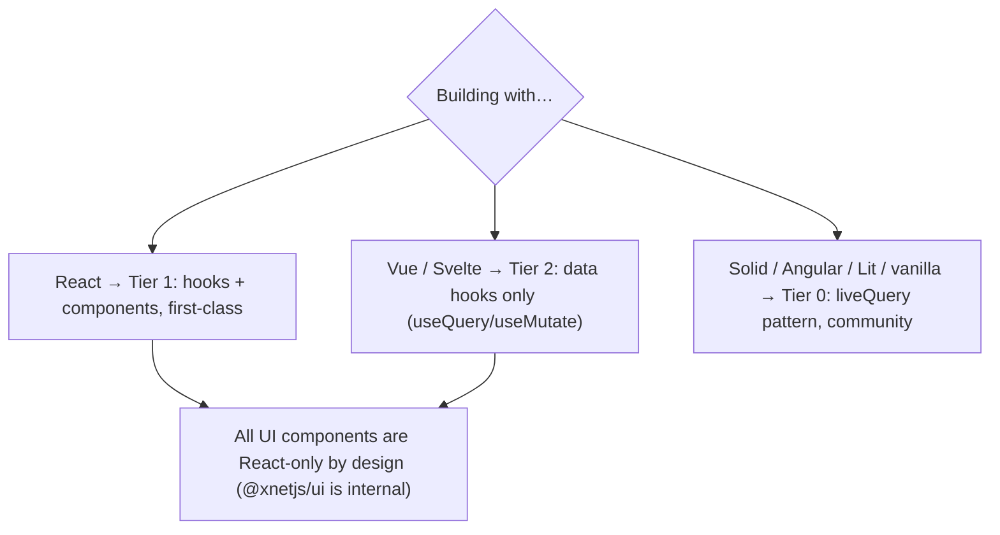

# Vue, Svelte, And Other Frameworks: What "Support" Actually Costs

## Problem Statement

We support React today. It would be nice to add Vue, Svelte, and maybe Solid /
Angular / Lit to the list of frameworks xNet "supports." But there's a catch the
prompt names directly: **if maintenance and validation of those frameworks is
non-trivial, it may make more sense to support only React.**

Two clarifications scope this exploration sharply:

1. **The main app stays React.** We are not porting `apps/web`. All the actual
   React components (canvas, editor, grid, onboarding) remain React. The only
   thing in question is the *framework adapter layer* — the `useQuery` /
   `useMutate` binding that lets a Vue or Svelte developer read and write xNet
   data idiomatically.
2. **This is a decision doc, not a build plan.** The companion exploration
   [0186](0186_%5B_%5D_MULTI_FRAMEWORK_AND_DEPLOYMENT_TARGETS.md) already mapped
   the full multi-target surface (UI frameworks + Electron/RN/worker + raw
   Swift/Kotlin) and concluded "the JS-framework adapters are nearly free." This
   doc zooms into *only* the UI-framework axis and pressure-tests that "nearly
   free" claim against the part 0186 under-weighted: **the carrying cost of
   saying a framework is supported.**

The real question is not "*can* we bind Vue/Svelte to the runtime?" (we can,
trivially — the seam was built for it). It is: **what contract do we promise per
framework, and what is the recurring validation + maintenance tax of promising
it?**

## Executive Summary

- **"Support" conflates two very different products.** Binding the *data layer*
  to another framework is genuinely ~40 lines. Achieving *feature parity* (the
  hooks + components a real app uses) is **30,742 lines of `@xnetjs/react`** —
  per framework. These are not the same offer, and the gap between them is where
  every multi-framework project dies.
- **The reactive seam already exists and is tiny.** `createXNetClient()`
  ([client.ts](../../packages/runtime/src/client.ts)) is fully React-free, and
  `client.query()` returns the universal `{ getSnapshot, subscribe }` contract.
  `liveQuery()` ([live-query.ts](../../packages/runtime/src/live-query.ts))
  already implements the **Svelte store contract** and is documented as
  bind-in-place for Vue/Solid/Angular/vanilla. Across all of `@xnetjs/react`,
  **only 2 files touch `useSyncExternalStore`** — the binding is a rounding error;
  everything else is business logic and JSX.
- **Authoring cost ≈ free; validation cost ≠ free.** Writing a Vue `useQuery` is
  an afternoon. *Keeping it honest forever* is the tax: a per-framework CI test
  project + testing-library + vite plugin, a peerDependency version matrix
  (React 18/19, Vue 3.x, **Svelte 4-stores vs 5-runes**, Solid, Angular signals),
  a published package in the OIDC/provenance release pipeline with changeset
  discipline, and docs/examples that rot if unattended. TanStack Query — the
  reference implementation of this pattern — pays a documented "all adapters
  lockstep with core on majors" tax, with a full-time team.
- **The component ecosystem is not even a shipped product.** `@xnetjs/ui` is
  `private: true`; only the *data hooks* (`@xnetjs/react`) are published. So
  "port the components" was never on the table — there's nothing public to port.
  That makes the honest offer obvious: **support the headless runtime for
  everyone; support React components for the app only.**
- **Recommendation — a written, demand-gated support tier policy:**
  - **Tier 0 (committed, already done): `@xnetjs/runtime`** — headless,
    conformance-gated, the contract every framework binds to. *This* is "xNet
    works with any framework," and it ships today with a vanilla example.
  - **Tier 1 (first-class): React** — full ecosystem; the app dogfoods it.
  - **Tier 2 (thin, opt-in, demand-gated): Vue + Svelte** — data-binding adapters
    only (`useQuery`/`useMutate` ↔ ref/store/rune), ~40 lines each, validated by a
    **single shared conformance suite** run through each framework's renderer.
    Ship a package only when a real external consumer asks. Solid/Angular/Lit:
    document the pattern, ship on request.
  - **Never:** port hooks or components to other frameworks.
- **Future-proof on the contract, not the idioms.** Keep `{ getSnapshot,
  subscribe }`. When the TC39 **Signals** proposal (Stage 1, co-designed by the
  Vue/Svelte/Solid/Angular/Preact authors) lands, a single `liveSignal` collapses
  most adapters. Don't over-invest in per-framework reactivity dialects that a
  language standard is about to absorb.

One line: **the data-layer binding is real and cheap and we should document it as
"use xNet from any framework" today; publishing and validating a *fleet* of
framework packages is the expensive part, so gate it on demand and cap it at thin
Vue + Svelte adapters — the app, and first-class component support, stay React.**

## Current State In The Repository

### The seam was deliberately built for this

The framework-agnostic runtime already exists and was designed, explicitly, so
that "React, the CLI, and other-framework layers are thin adapters over this
surface" ([runtime/index.ts](../../packages/runtime/src/index.ts)):

- **`createXNetClient()`** ([client.ts](../../packages/runtime/src/client.ts), in
  an 8,751-LOC package that imports React **nowhere**) constructs and owns the
  full runtime — `NodeStore` → `DataBridge` → optional `SyncManager` /
  `PluginRegistry` / `UndoManager` — and exposes `query`, `fetch`, `get`,
  `mutate.{create,update,delete,restore,transaction}`, `auth`, `can`,
  `node.acquire`, `sign`, `verify`, `on`, `destroy`.
- **`client.query(schema, options)`** returns a
  `QuerySubscription { getSnapshot, subscribe }` — the *exact* shape
  `useSyncExternalStore` consumes, and the exact shape every other framework's
  external-store primitive consumes.
- **`liveQuery()`** ([live-query.ts](../../packages/runtime/src/live-query.ts))
  already adapts that pair into the **Svelte store contract**
  (`subscribe(run) => unsubscribe`, called immediately + on every change). Its
  own docblock spells out the plan: *"trivially consumable from Vue (`shallowRef`
  + `watchSyncEffect`), Solid, Angular, or plain JS."*



### The two meanings of "support" — by the numbers

The crux. `@xnetjs/react` is large, but almost none of it is *framework binding*:

| Measure | Value | What it means |
| --- | --- | --- |
| `@xnetjs/react` total | **30,742 LOC** | the full React product |
| Hooks | **71** | `useQuery`, `useMutate`, `useNode`, `useComments`, `useDatabase`, `useTasks`, `useHistory`, `useGrants`, onboarding, moderation… |
| Components | **18** | `SavedViewRunner`, `OnboardingFlow`, `HubStatusIndicator`, `ErrorBoundary`… |
| Files touching `useSyncExternalStore` | **2** | the *entire* reactive binding to the data layer |
| `@xnetjs/runtime` (headless) | **8,751 LOC** | already framework-free |

So "supporting React" is really two products stacked: a ~2-file reactive binding,
and a 30,000-line application toolkit built on top of it. A Vue/Svelte adapter can
replicate the first for ~40 lines. Replicating the second means re-writing
`useComments`, `useDatabase`, `useTasks`, the SavedView tables, and the onboarding
state machine in Vue *and* Svelte *and* Solid — i.e. re-writing the app N times.



### `@xnetjs/react` hooks are thin over the bridge (binding) but deep in logic (parity)

- `useQuery` ([useQuery.ts](../../packages/react/src/hooks/useQuery.ts)) is, at
  its core, `useSyncExternalStore(subscription.subscribe, subscription.getSnapshot)`
  + a `flattenNode` step + telemetry/tracing/instrumentation context.
- `useMutate` ([useMutate.ts](../../packages/react/src/hooks/useMutate.ts), 562
  LOC) is 11 `bridge.*` call sites wrapped in typed ergonomics and optimistic
  state. The *binding* is trivial; the *types and UX* are the bulk.
- The other 69 hooks (`useComments`, `useDatabase`, `useTasks`,
  `useModeratedComments`, `useReactionCounters`, `useGrants`, …) compose
  `useQuery`/`useMutate` with **React state machines and JSX** — that is genuine,
  framework-specific application code, not data binding.

### Publishing reality (the maintenance surface)

- **`@xnetjs/runtime` is publishable** (`private: false`) — the correct
  peer-dependency target for any adapter.
- **`@xnetjs/sdk` is `private: true`** and in the changeset `ignore` list — it's a
  convenience umbrella, *not* a published artifact; adapters must not depend on it.
- **`@xnetjs/ui` is `private: true`** — the component kit isn't even shipped, which
  is why "porting components" is a non-question: there's no public component
  product, only `@xnetjs/react`'s data hooks.
- **`@xnetjs/react` is in the changeset `fixed` lockstep group** (versions in step
  with `core`/`data`/`sync`/…). A new framework adapter would sit in *periphery*
  (independent versioning) — but every published package still enters the
  automated **conventional-commit → OIDC + provenance** release pipeline
  ([0220](0220_%5Bx%5D_AUTOMATED_NPM_PACKAGE_PUBLISHING_AND_CONVENTIONAL_VERSIONING.md)),
  with per-diff semver judgement enforced by the Stop hook.
- **Validation is a fixed matrix today**: vitest projects are `unit`, `dom`,
  `integration`, `editor`, `data-bridge`, `runtime`, `labs`
  ([vitest.config.ts](../../vitest.config.ts)). Each new UI framework needs *its
  own* project + render harness: Svelte → `@sveltejs/vite-plugin-svelte` +
  `@testing-library/svelte`; Solid → `vite-plugin-solid` + babel preset; Vue →
  `@vue/test-utils`; Angular → its own toolchain. That's the recurring tax, and
  it's mostly validation, not authoring.

## External Research

- **TanStack Query is the proof and the cautionary tale.** It supports React,
  Vue, Solid, Svelte, Angular, Lit, and Preact over a single `@tanstack/query-core`
  — exactly the "headless core + thin adapters" shape xNet already has. The
  documented maintenance constraint: *"in a monorepo where react/vue/solid/svelte
  and angular adapters all have to be on the same major version, the version of
  query-core has to match the versions of the adapters."* That lockstep-on-majors
  coordination is the steady-state cost — paid by a funded, full-time team.
  ([TanStack Query](https://tanstack.com/query/latest),
  [framework integration](https://deepwiki.com/TanStack/query),
  [Angular Query feedback](https://github.com/TanStack/query/discussions/6293))
- **Svelte 5 moved the idiomatic target.** Stores are **not** deprecated and the
  `subscribe` store contract still works — so `liveQuery` keeps working unchanged
  on Svelte 5. *But* runes (`$state`/`$derived`) are now idiomatic, and "most of
  the reasons you used stores are gone." A *good* Svelte adapter therefore wants a
  runes-based surface too, not just the store — i.e., the maintained surface
  doubled even though nothing broke. This is precisely the silent validation tax.
  ([Svelte 5 migration](https://svelte.dev/docs/svelte/v5-migration-guide),
  [introducing runes](https://svelte.dev/blog/runes),
  [why stores stay](https://github.com/sveltejs/svelte/discussions/15885))
- **TC39 Signals (Stage 1) is coming for exactly this fragmentation.** The
  proposal is co-designed by maintainers of Angular, Vue, Svelte, Solid, Preact,
  MobX, Qwik, RxJS, and more, with the explicit goal that *"library authors write
  code using signals that works natively with any component or rendering library
  that understands the standard."* If/when it ships, a single `Signal.State`-backed
  `liveSignal` could replace most per-framework adapters. The strategic read:
  invest in the **contract** (`getSnapshot`/`subscribe`, already Signal-watchable),
  not in N reactivity dialects with a standardization expiry date.
  ([tc39/proposal-signals](https://github.com/tc39/proposal-signals),
  [Lit Signals](https://lit.dev/docs/data/signals/),
  [standard signals 2026](https://tasukehub.com/articles/standard-signals-2026))
- **Almost nobody ships N first-class framework adapters as a side project.** The
  projects that do (TanStack, ag-Grid, Zag.js, Lit-for-React) are either funded
  teams or deliberately headless-by-design with paper-thin per-framework shims and
  a shared conformance suite. The lesson is consistent: **make the core the
  product; keep adapters thin and behavior-tested once.**

## Key Findings

| # | Finding | Evidence | Implication |
| - | --- | --- | --- |
| 1 | The reactive binding is ~2 files; the rest of React is app code | 2 `useSyncExternalStore` files of 30,742 LOC | "support data binding" ≠ "support the ecosystem" |
| 2 | The headless contract already exists and targets non-React | [live-query.ts](../../packages/runtime/src/live-query.ts), [client.ts](../../packages/runtime/src/client.ts) | Tier 0 "any framework" support is *already shipped* |
| 3 | Authoring an adapter is ~40 LOC; validating it forever is the cost | [vitest.config.ts](../../vitest.config.ts) projects; per-framework harness | budget the tax, not the line count |
| 4 | The component kit isn't a published product | `@xnetjs/ui` `private:true` | "port components" is a non-goal by construction |
| 5 | Every published package joins the release + semver pipeline | [0220](0220_%5Bx%5D_AUTOMATED_NPM_PACKAGE_PUBLISHING_AND_CONVENTIONAL_VERSIONING.md), changeset `fixed`/`ignore` | each adapter is a permanent versioning liability |
| 6 | Svelte 5 didn't break stores but doubled the idiomatic surface | runes vs store contract | "supported" silently means "maintain two surfaces" |
| 7 | A language-level Signals standard may obsolete per-framework idioms | TC39 Signals Stage 1 | invest in the contract, defer dialect-specific polish |
| 8 | TanStack pays a real lockstep-on-majors tax with a full-time team | TanStack monorepo constraint | N-framework parity is a staffing decision, not a coding one |

## Options And Tradeoffs

### Dimension A — What does "support" *mean*?

| Option | Scope | Cost | Verdict |
| --- | --- | --- | --- |
| **A1. Headless contract only** | Document `createXNetClient` + `liveQuery`; users bind themselves | ~0 (exists) | **Floor.** Already true; just needs docs + a vanilla example |
| **A2. Thin data-binding adapters** | `useQuery`/`useMutate` ↔ ref/store/signal, *no components* | ~40 LOC + 1 test project per framework | **The realistic ceiling** for non-React |
| **A3. Feature parity** | Re-implement the 71 hooks + 18 components per framework | 30,700 LOC × N, forever | **Never.** This is re-writing the app N times |

### Dimension B — Which frameworks, if any?

| Framework | Binding cost | Demand signal | Recommendation |
| --- | --- | --- | --- |
| **Svelte** | ~0 (`liveQuery` *is* a Svelte store) | high; cleanest fit | **Tier 2 first** — almost free, plus a runes surface |
| **Vue** | ~40 LOC (`shallowRef` + `onScopeDispose`) | high | **Tier 2** — ship alongside Svelte |
| **Solid** | ~30 LOC (`from()`) | medium | Document pattern; ship on request |
| **Angular** | heavier (`toSignal` + DI + RxJS ergonomics) | lower | **Defer** until real demand |
| **Lit / vanilla** | trivial (subscribe directly) | low | Cover in the vanilla doc; no package |

### Dimension C — Packaging strategy

| Option | Pros | Cons |
| --- | --- | --- |
| **C1. One package per framework** (`@xnetjs/vue`, `@xnetjs/svelte`) | idiomatic; independent semver; mirrors TanStack | N packages in the release pipeline |
| **C2. One `@xnetjs/adapters` with subpath exports** (`/vue`, `/svelte`) | single version + shared test harness | all framework peerDeps in one manifest; heavy install graph; one framework's breaking major forces a bump for all |
| **C3. Docs-only** (no packages; show the 40 lines) | zero publishing surface | every consumer copies the same boilerplate; no idiomatic install |

**Lean: C3 now → C1 on demand.** Start docs-only (Tier 0). Promote a framework to
its own thin package the moment a real external consumer needs it — never
speculatively.

### Dimension D — How to make validation O(1) instead of O(N)

The killer cost is *N test suites that can drift apart*. Borrow TanStack's move:
**one framework-agnostic conformance suite** that asserts the behavioral contract
(mutate → live query updates; unsubscribe stops updates; auth denial surfaces;
`destroy()` is clean) directly against `createXNetClient` + `liveQuery`. Each
adapter then needs only a *tiny* render-harness test ("the ref/store/signal
reflects the snapshot and re-renders") — not a re-test of xNet semantics. Behavior
is validated once; the per-framework surface stays a thin shim.



## Recommendation

Adopt a **written, demand-gated support-tier policy** and keep the app on React.
This matches the prompt's instinct ("maybe just React") while leaving the cheap,
already-built door open — and, crucially, it *names* what we will and won't carry,
so "supported" never silently inflates into "feature parity."



1. **Ship Tier 0 as the official answer now (days, near-zero risk).** Write a
   "Use xNet from any framework" docs page anchored on `createXNetClient` +
   `liveQuery`, with a **vanilla** example and a copy-paste Vue + Svelte snippet.
   This *is* "we support other frameworks" — honestly, today — with no new package
   to maintain. Add the shared **conformance suite** (Dimension D) so the contract
   is executable.
2. **Hold Tier 2 packages until demand is real.** Do **not** speculatively publish
   `@xnetjs/vue`/`@xnetjs/svelte`. When an external consumer (or our own docs/demo
   need) materializes, promote the snippet to a thin package — Svelte first (it's
   ~15 lines: re-export `liveQuery`, add a runes helper), Vue second. Each ships
   with only a render-harness test; the conformance suite already covers behavior.
3. **Cap the offer explicitly.** The support matrix in the docs states: **Tier 0
   runtime = every framework; Tier 1 React = first-class, includes components;
   Tier 2 Vue/Svelte = data binding only, no components; everything else =
   community pattern.** Setting this expectation is the single most valuable
   artifact here — it prevents "you support Vue" from being read as "Vue has the
   grid, onboarding, and SavedView."
4. **Default to React for everything we build.** App, demos, marketing, internal
   tools — all React. Other frameworks consume the runtime; we do not consume them.
5. **Future-proof on the contract.** Keep `{ getSnapshot, subscribe }` as the one
   true seam. Track TC39 Signals; when it stabilizes, add a `liveSignal` and let it
   subsume the per-framework adapters rather than deepening them.

**Net:** support is real but *layered*. The expensive interpretation (parity) is
explicitly off the table; the cheap interpretation (data binding) is already built
and just needs documenting; the middle (published Vue/Svelte packages) is opt-in
and demand-gated so we never pay validation tax ahead of value.

## Example Code

### The whole binding, per framework (Tier 2)

```ts
// @xnetjs/svelte — liveQuery already IS a Svelte store.
export { liveQuery } from '@xnetjs/runtime'
export function mutate(client) {
  return client.mutate // { create, update, delete, restore, transaction }
}

// Optional Svelte 5 runes surface (idiomatic post-5):
import { liveQuery } from '@xnetjs/runtime'
export function queryRune(client, schema, options) {
  const lq = liveQuery(client, schema, options)
  let value = $state(lq.get())
  $effect(() => lq.subscribe((v) => (value = v))) // returns unsubscribe
  return () => value
}
```

```svelte
<!-- A Svelte component, zero React -->
<script>
  import { liveQuery } from '@xnetjs/svelte'
  import { TaskSchema } from '@my/schemas'
  export let client
  const tasks = liveQuery(client, TaskSchema, { where: { status: 'todo' } })
</script>

{#each $tasks ?? [] as task}
  <li>{task.properties.title}</li>
{/each}
```

```ts
// @xnetjs/vue
import { shallowRef, onScopeDispose } from 'vue'
import { liveQuery } from '@xnetjs/runtime'

export function useQuery(client, schema, options) {
  const lq = liveQuery(client, schema, options)
  const data = shallowRef(lq.get())
  const stop = lq.subscribe((v) => (data.value = v))
  onScopeDispose(() => {
    stop()
    lq.destroy()
  })
  return data // Ref<NodeState[] | null>
}

export function useMutate(client) {
  return client.mutate
}
```

```ts
// @xnetjs/solid
import { from } from 'solid-js'
import { liveQuery } from '@xnetjs/runtime'

export function createQuery(client, schema, options) {
  const lq = liveQuery(client, schema, options)
  return from((set) => {
    const stop = lq.subscribe(set)
    return () => {
      stop()
      lq.destroy()
    }
  })
}
```

```ts
// Vanilla / Lit / anything — no adapter package at all (Tier 0 docs)
const client = await createXNetClient({ authorDID, signingKey })
const tasks = liveQuery(client, TaskSchema, { where: { status: 'todo' } })
const stop = tasks.subscribe((rows) => render(rows ?? []))
await client.mutate.create(TaskSchema, { title: 'Ship it' }) // re-renders
// later: stop(); tasks.destroy(); await client.destroy()
```

### Binding lifecycle (Vue, illustrative)

```mermaid
sequenceDiagram
    participant V as Vue component
    participant A as useQuery (adapter)
    participant LQ as liveQuery
    participant C as createXNetClient
    V->>A: useQuery(client, TaskSchema, opts)
    A->>LQ: liveQuery(client, schema, opts)
    LQ->>C: client.query(schema, opts) → { getSnapshot, subscribe }
    A->>LQ: subscribe(run) ; shallowRef(getSnapshot())
    Note over V: render rows
    V-->>C: client.mutate.create(TaskSchema, …)
    C-->>LQ: subscription fires
    LQ-->>A: run(newSnapshot)
    A-->>V: ref.value = rows → re-render
    V->>A: onScopeDispose → stop(); lq.destroy()
```

### The shared conformance suite (validate behavior once)

```ts
// packages/runtime/src/adapter-conformance.ts — framework-agnostic
export async function runAdapterConformance(makeClient) {
  const client = await makeClient()
  const lq = liveQuery(client, TaskSchema)
  const seen: (NodeState[] | null)[] = []
  const stop = lq.subscribe((v) => seen.push(v))

  await client.mutate.create(TaskSchema, { title: 'A' }) // live update
  // assert: last snapshot contains 'A'
  stop()
  await client.mutate.create(TaskSchema, { title: 'B' }) // no update after stop
  // assert: no snapshot contains 'B'
  lq.destroy()
  await client.destroy() // clean teardown, idempotent
}
```

### The support matrix to publish (the most important artifact)



## Risks And Open Questions

- **"Supported" inflating to "parity."** The biggest risk is social, not
  technical: announcing "Vue support" makes users expect the grid, onboarding, and
  SavedView in Vue. **Mitigation:** lead with the tier matrix; label Tier 2 "data
  binding, no components" everywhere.
- **Per-framework version drift.** React 18/19, Vue 3.x, Svelte 4-stores vs
  5-runes, Solid, Angular signals — each major is a coordination event (TanStack's
  lockstep tax). **Mitigation:** keep adapters in *periphery* (independent semver),
  thin enough that a peer bump is a one-line change, and demand-gated so we only
  carry what's used.
- **Svelte dual-surface.** Stores still work, but idiomatic Svelte 5 wants runes —
  so a "good" Svelte adapter maintains two surfaces. **Mitigation:** ship the store
  re-export (free) first; add the runes helper only if Svelte demand is real.
- **CI weight.** Each framework adds a vitest project + plugin + testing-library to
  install and run. **Mitigation:** the shared conformance suite keeps behavioral
  tests at O(1); per-framework harness tests stay tiny.
- **Adapter depends on the wrong package.** `@xnetjs/sdk` is `private`/ignored;
  only `@xnetjs/runtime` is published. **Mitigation:** adapters peer-depend on
  `@xnetjs/runtime`.
- **Signals timing.** TC39 Signals is Stage 1 — could be years, could stall.
  **Mitigation:** don't block on it; just don't over-engineer per-framework
  reactivity that it would replace.
- **Open question — is there *any* external demand today?** If no concrete
  consumer wants Vue/Svelte, the correct amount of code to publish is **zero**
  (ship Tier 0 docs only). The decision to publish a package should be triggered by
  a named consumer, not by this doc.
- **Open question — do we want a public component story at all?** `@xnetjs/ui` is
  private. If we ever wanted framework-neutral components, **web components**
  (Lit-authored, consumable everywhere) would be the only sane single-source path —
  a much larger, separate exploration, explicitly out of scope here.

## Implementation Checklist

Tier 0 (do now — near-zero risk, high leverage):

- [x] Add a "Use xNet from any framework" docs page: `createXNetClient` +
      `liveQuery`, with **vanilla**, Vue, and Svelte snippets.
- [x] Publish the **support-tier matrix** (Tier 0/1/2 + "components are React-only")
      in docs and the `@xnetjs/runtime` README.
- [x] Add `runAdapterConformance(makeClient)` to `@xnetjs/runtime` (or a test
      helper) asserting: live update on mutate, no update after unsubscribe, auth
      denial surfaces, idempotent `destroy()`.
- [x] Wire the conformance suite into the existing `runtime` vitest project.

**Tier 2 — deferred (demand-gated; not in this PR).** Per the recommendation,
these ship only when a named external consumer asks. The Tier 0 conformance suite
already covers their behaviour, so each is a thin add when the time comes:

- `@xnetjs/svelte` — re-export `liveQuery` + `mutate(client)` (+ optional runes
  helper); peer-depend on `@xnetjs/runtime`; render-harness test via
  `@testing-library/svelte`.
- `@xnetjs/vue` — `useQuery` (`shallowRef` + `onScopeDispose`) + `useMutate`;
  render-harness test via `@vue/test-utils`.
- `@xnetjs/solid` — `createQuery` via `from()` + `createMutation`; ship only on
  explicit request.
- Add a vitest project + plugin for each shipped framework; register the package
  in the workspace and (periphery) release config.
- Changeset per new package; confirm it lands in _periphery_ (independent), not
  the `fixed` lockstep group.

**Non-goals (decided against).**

- Porting any of the 71 hooks or 18 components to Vue/Svelte/Solid.
- Moving the app off React.
- Publishing speculative framework packages with no consumer.

## Validation Checklist

- [x] A **vanilla** sample (no framework) renders a live list that updates on
      `client.mutate` — proves Tier 0 end-to-end (the `runAdapterConformance`
      `live-query:immediate-and-update` check).
- [x] The shared conformance suite passes against `createXNetClient` + `liveQuery`
      in the `runtime` project (green in CI).
- [x] The support-tier matrix is live in docs; Tier 2 pages explicitly say "data
      binding only, components are React."
- [x] The existing React app + test suites stay green (the runtime contract is
      unchanged; this work is purely additive — a new export + new files).

Deferred (validate when a Tier 2 adapter ships):

- If shipped: a **Svelte** and a **Vue** sample each render a live list that
  updates on mutate and stops on unsubscribe — adapter render-harness tests green,
  no React imported.
- Each shipped adapter peer-depends on `@xnetjs/runtime` (not `@xnetjs/sdk`), and
  `pnpm` resolves the framework peer at the documented version range.
- Adding an adapter does **not** bump the `fixed` core group (it lands in
  periphery); the release pipeline publishes it with provenance. _(This PR already
  demonstrates the pattern: the `@xnetjs/runtime` changeset is a periphery minor,
  not a `fixed`-group bump.)_

## References

- Runtime seam: [@xnetjs/runtime](../../packages/runtime),
  [client.ts](../../packages/runtime/src/client.ts),
  [live-query.ts](../../packages/runtime/src/live-query.ts),
  [runtime/index.ts](../../packages/runtime/src/index.ts)
- React surface: [@xnetjs/react index](../../packages/react/src/index.ts),
  [useQuery.ts](../../packages/react/src/hooks/useQuery.ts),
  [useMutate.ts](../../packages/react/src/hooks/useMutate.ts),
  [context.ts](../../packages/react/src/context.ts)
- SDK umbrella: [@xnetjs/sdk index](../../packages/sdk/src/index.ts)
- Release + validation infra: [vitest.config.ts](../../vitest.config.ts),
  [.changeset/config.json](../../.changeset/config.json),
  [0220 automated publishing](0220_%5Bx%5D_AUTOMATED_NPM_PACKAGE_PUBLISHING_AND_CONVENTIONAL_VERSIONING.md)
- Companion explorations:
  [0185 framework-agnostic data model SDK](0185_%5B_%5D_FRAMEWORK_AGNOSTIC_DATA_MODEL_SDK.md),
  [0186 multi-framework & deployment targets](0186_%5B_%5D_MULTI_FRAMEWORK_AND_DEPLOYMENT_TARGETS.md),
  [0210 native Swift SDK & portable multi-language core](0210_%5B_%5D_NATIVE_SWIFT_SDK_AND_PORTABLE_MULTI_LANGUAGE_CORE.md)
- External — adapters: [TanStack Query](https://tanstack.com/query/latest),
  [TanStack/query GitHub](https://github.com/TanStack/query),
  [framework integration](https://deepwiki.com/TanStack/query),
  [Angular Query feedback](https://github.com/TanStack/query/discussions/6293)
- External — Svelte 5: [migration guide](https://svelte.dev/docs/svelte/v5-migration-guide),
  [introducing runes](https://svelte.dev/blog/runes),
  [why stores stay](https://github.com/sveltejs/svelte/discussions/15885)
- External — Vue/Solid reactivity:
  [Vue reactivity in depth](https://vuejs.org/guide/extras/reactivity-in-depth),
  [Solid `from()`](https://www.solidjs.com/docs/latest/api#from)
- External — Signals convergence:
  [tc39/proposal-signals](https://github.com/tc39/proposal-signals),
  [Lit Signals](https://lit.dev/docs/data/signals/),
  [standard signals 2026](https://tasukehub.com/articles/standard-signals-2026)
