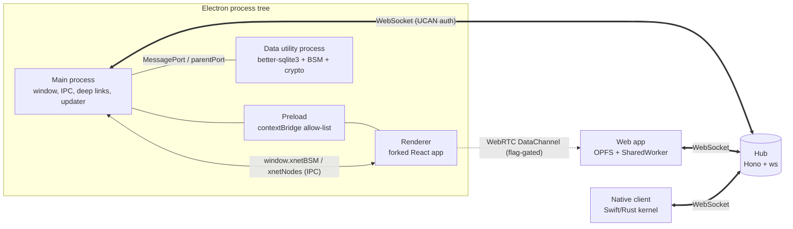
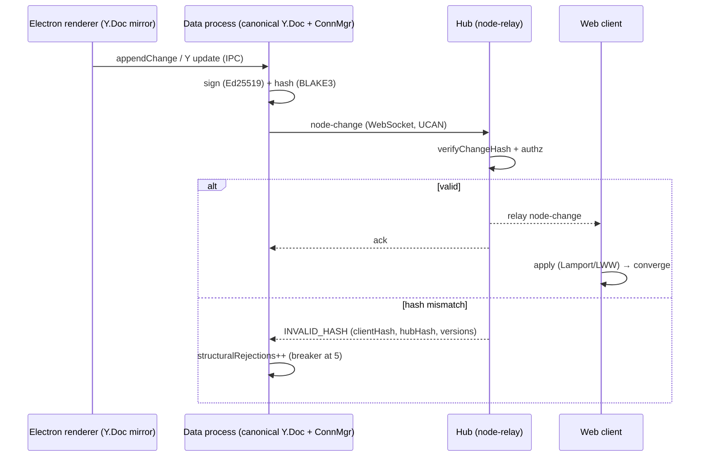
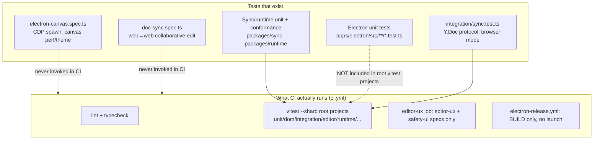
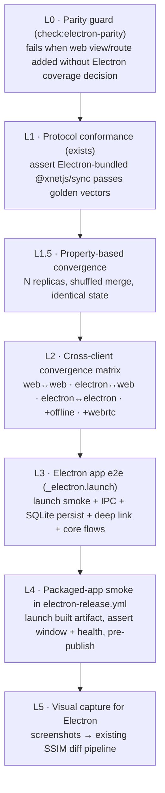

# Electron Desktop: Parity, Sync, and Automated Deep Testing

> Status: unchecked. Goal: validate that the Electron desktop app is up to
> date with the web app, that it connects/syncs/peers correctly against the
> hub and other clients, and that we can prove all of this **automatically**
> in CI rather than by hand.

## Problem Statement

The ask, paraphrased:

> "Validate that the Electron app is up to date with the web app and that it is
> bug-free and functions effectively. Do deep testing of how it connects to the
> hub, how it syncs, how it works peer-to-peer, and how it interoperates with
> the web app and a desktop/native client — ideally as automated as possible."

There are really **four** questions hiding in there, and they have very
different answers today:

1. **Parity** — is the Electron renderer feature-equivalent to the web app?
2. **Correctness** — is the Electron app itself bug-free across its core flows?
3. **Interop** — does Electron ⇄ hub ⇄ web ⇄ native converge on the same state,
   including offline and peer-to-peer paths?
4. **Automation** — can we assert (1)–(3) continuously in CI, on a packaged
   build, without a human driving a mouse?

The short version of the findings: **the protocol/sync foundation is shared and
solid, but the Electron _renderer_ is a hand-forked subset of the web app with
no parity enforcement, and none of the existing Electron or cross-client e2e
tests actually run in CI.** The packaged app is built by
[`electron-release.yml`](../../.github/workflows/electron-release.yml) and shipped
to GitHub Releases without ever being launched in a test.

## Executive Summary

| Dimension                                                    | State today                                                 | Confidence we'd catch a regression in CI                      |
| ------------------------------------------------------------ | ----------------------------------------------------------- | ------------------------------------------------------------- |
| Shared protocol kernel (`@xnetjs/sync`, identity, hash/sign) | Genuinely shared, golden-vector conformance suite exists    | **High** (vectors run in `runtime` project)                   |
| Electron ↔ hub ↔ web convergence                             | Works in principle (same kernel); one web↔web e2e exists    | **None** — `doc-sync.spec.ts` is not in CI                    |
| Electron renderer ↔ web feature parity                       | Forked subset (8-state shell vs 26 routes), drift unguarded | **None** — no parity test exists                              |
| Electron app correctness (launch, IPC, SQLite, deep links)   | Decent unit tests; one CDP canvas e2e                       | **Low** — unit suite is not wired into root CI; e2e not in CI |
| Packaged-app smoke (the thing users download)                | Built and released untested                                 | **None**                                                      |
| Peer-to-peer (WebRTC direct sync)                            | Implemented, flag-gated (`VITE_XNET_ENABLE_WEBRTC`)         | **None** in Electron path                                     |

**Recommendation (detailed below):** stand up a six-layer automated pyramid and
a cheap parity guard, reusing infrastructure that already exists:

- **L0 Parity guard** — a `check:electron-parity` script that fails when the web
  app grows a view/route the Electron renderer lacks (or when a forked component
  drifts in its shared-package imports).
- **L1 Protocol conformance** — already exists; assert the Electron-bundled
  `@xnetjs/sync` passes the same golden vectors.
- **L2 Cross-client convergence harness** — generalize
  [`doc-sync.spec.ts`](../../tests/e2e/src/doc-sync.spec.ts) into a matrix
  (web↔web, **electron↔web**, electron↔electron, +offline +WebRTC) and run it in CI.
- **L3 Electron e2e via Playwright `_electron`** — replace the bespoke
  CDP-spawn harness with the first-class `_electron.launch()` API for app-launch
  smoke + core flows, on macOS and Linux runners.
- **L4 Packaged-app smoke** — in `electron-release.yml`, launch the built
  artifact and assert the window loads and reaches a healthy state before publish.
- **L5 Visual capture for Electron** — feed Electron screenshots into the
  existing SSIM diff pipeline (`scripts/visuals/`).

## Current State In The Repository

### Process & build model

The Electron app lives at [`apps/electron/`](../../apps/electron). It is built
with **electron-vite** (`electron.vite.config.ts`) into three bundles —
main, preload, renderer — plus a fourth **utility process** for data:

- **Main** — [`apps/electron/src/main/index.ts`](../../apps/electron/src/main/index.ts):
  `BrowserWindow` creation, `xnet://` deep-link protocol, utility-process spawn,
  IPC wiring, `electron-updater` auto-update.
- **Preload** — [`apps/electron/src/preload/index.ts`](../../apps/electron/src/preload/index.ts):
  compiled to CJS, sandboxed, exposes a whitelisted `contextBridge` surface
  (`window.xnet`, `window.xnetBSM`, `window.xnetNodes`, `window.xnetServices`,
  `window.xnetLocalAPI`, `window.xnetTunnel`, `window.xnetAgentBridge`,
  `window.xnetSocialImport`).
- **Renderer** — [`apps/electron/src/renderer/`](../../apps/electron/src/renderer):
  a **separate** React app (`App.tsx`, `main.tsx`, ~28 components).
- **Data utility process** — [`apps/electron/src/data-process/`](../../apps/electron/src/data-process):
  `better-sqlite3` storage, sync (BSM), crypto in a worker thread.

Security posture is correct-by-default ([`main/index.ts`](../../apps/electron/src/main/index.ts)):

```ts
webPreferences: {
  preload: join(__dirname, '../preload/index.cjs'),
  sandbox: true,
  contextIsolation: true,
  nodeIntegration: false
}
```

The renderer URL is chosen by environment — dev loads the electron-vite dev
server, prod loads the built file:

```ts
// dev: http://localhost:${process.env.VITE_PORT || '5177'}
// prod: mainWindow.loadFile(join(__dirname, '../renderer/index.html'))
```



### The shared protocol kernel (the good news)

The sync contract is **genuinely shared** and language-portable, which is why
cross-client interop is on solid footing even though the UIs diverge:

- Change record, canonicalization, hash & signature —
  [`packages/sync/src/change.ts`](../../packages/sync/src/change.ts):
  BLAKE3 content id (`cid:blake3:…`), recursive lexicographic key sort,
  Ed25519 signature over the UTF-8 bytes of the hash string.
- Hash chain / fork detection — [`packages/sync/src/chain.ts`](../../packages/sync/src/chain.ts).
- Lamport clock + deterministic tie-break — [`packages/sync/src/clock.ts`](../../packages/sync/src/clock.ts)
  (UTF-16 code-unit order on `authorDID`, never `localeCompare`).
- Golden conformance vectors — [`conformance/vectors/`](../../conformance/vectors)
  with reference verifiers in TS, Python, Swift, Rust; the normative spec lives
  in [`docs/specs/protocol/`](../../docs/specs/protocol). The drift guard is
  `packages/runtime/src/conformance.test.ts` (runs in the `runtime` vitest project).

### Client connection, offline, and the skew circuit-breaker

- Multiplexed client WebSocket + reconnect/backoff —
  [`packages/runtime/src/sync/connection-manager.ts`](../../packages/runtime/src/sync/connection-manager.ts).
- Node-store sync provider with the **protocol-skew circuit breaker**
  (halts outbound after 5 consecutive `INVALID_HASH`/`INVALID_SIGNATURE`/`INVALID_CHANGE`
  rejections) — [`packages/runtime/src/sync/node-store-sync-provider.ts`](../../packages/runtime/src/sync/node-store-sync-provider.ts).
- Offline queue (enqueue while disconnected, drain on reconnect) —
  [`packages/runtime/src/sync/offline-queue.ts`](../../packages/runtime/src/sync/offline-queue.ts).
- Hub-side validation that raises `INVALID_HASH` with both hashes + protocol
  versions — [`packages/hub/src/services/node-relay.ts`](../../packages/hub/src/services/node-relay.ts).

In Electron, the renderer doesn't own the socket — it proxies through the main
process via [`apps/electron/src/renderer/lib/ipc-sync-manager.ts`](../../apps/electron/src/renderer/lib/ipc-sync-manager.ts)
(`window.xnetBSM`), and the canonical `Y.Doc` + `ConnectionManager` live in the
data process. That extra IPC hop is Electron-specific surface that the web app
never exercises — and therefore needs its own tests.



### "Peer-to-peer" — what it actually means here

Two distinct things wear the "P2P" label:

- **Signaling** is always hub-mediated (room rosters/awareness via
  `packages/hub/src/services/signaling.ts`).
- **Data path** is hub-relay by default; **optional direct WebRTC** sync is
  available via [`packages/network/src/providers/ywebrtc.ts`](../../packages/network/src/providers/ywebrtc.ts),
  gated by `VITE_XNET_ENABLE_WEBRTC` and `transport: 'auto' | 'webrtc' | 'ws'`,
  with WS fallback on ICE/auth failure.
- A **libp2p** node ([`packages/network/src/node.ts`](../../packages/network/src/node.ts))
  exists for future decentralized discovery but is **not** wired into the live
  sync path (bootstrap peers are stubs).

So "test it peer-to-peer" concretely means: (a) hub-relay convergence, and
(b) WebRTC-direct convergence with WS fallback — both of which need an
automated harness that can flip the transport flag.

### The parity problem (the bad news)

The Electron renderer is **not** the web app loaded in a window — it is a
separate, hand-maintained React app:

|                                                                        | Web (`apps/web/src`)                             | Electron (`apps/electron/src/renderer`)             |
| ---------------------------------------------------------------------- | ------------------------------------------------ | --------------------------------------------------- |
| Source files (non-test)                                                | ~280                                             | ~39                                                 |
| Components                                                             | ~84 + `routes/` + `workbench/`                   | ~28                                                 |
| Navigation                                                             | TanStack Router, ~26 routes (`routeTree.gen.ts`) | hardcoded 8-state `ShellState` machine in `App.tsx` |
| Comms / chat                                                           | `apps/web/src/comms/` (~40 files)                | **absent**                                          |
| Coachmarks, what's-new, workbench shell                                | present                                          | **absent**                                          |
| CRM / finance / analytics / dashboard / map / person / discover routes | present                                          | **absent**                                          |

Three tiers of sharing, with increasing drift risk:

1. **Tier 1 — truly shared:** both apps import `@xnetjs/views`, `@xnetjs/editor`,
   `@xnetjs/ui`, `@xnetjs/canvas`, `@xnetjs/react`. Core grid/editor logic is
   common. Low drift risk.
2. **Tier 2 — forked wrappers:** `PageView.tsx` and `DatabaseView.tsx` exist in
   **both** `apps/web/src/components/` and `apps/electron/src/renderer/components/`
   with different imports (web wires context panels, drag-drop, comments, summary
   bar; Electron is stripped down). Medium drift risk.
3. **Tier 3 — full fork:** `CanvasView.tsx` is ~1.7k lines on web and ~3.2k on
   Electron — effectively a separate implementation with desktop-only menus, IPC
   share sessions, and cloud-connect handling. High drift risk.

**There is no test, lint, or CI check that asserts the Electron renderer keeps
up with the web app or with shared views.** Parity is maintained by memory.

### What automation exists today — and what runs in CI



Concrete, verified gaps:

- **Electron unit tests are orphaned from CI.** Root
  [`vitest.config.ts`](../../vitest.config.ts) defines projects whose `include`
  globs cover `packages/*` and `apps/web/src` — but **not** `apps/electron/src`.
  The Electron suite only runs through `apps/electron/vitest.config.ts` (which
  needs `deps:node` native rebuild) and is never invoked by CI's sharded
  `vitest run --shard` job in [`ci.yml`](../../.github/workflows/ci.yml).
- **The Electron e2e never runs in CI.** [`ci.yml`](../../.github/workflows/ci.yml)'s
  `editor-ux` job runs only `editor-ux.spec.ts`, `editor-ux-mobile.spec.ts`,
  `safety-ui.spec.ts`. The bespoke [`electron-canvas.spec.ts`](../../tests/e2e/src/electron-canvas.spec.ts)
  (which spawns `electron-vite dev`, waits on a CDP port, and drives canvas via
  `chromium.connectOverCDP`) is local/manual only.
- **The cross-client sync e2e never runs in CI.** [`doc-sync.spec.ts`](../../tests/e2e/src/doc-sync.spec.ts)
  spins up an in-process hub + Vite harness + two browser contexts — exactly the
  shape we want — but is not in any workflow.
- **The packaged app is shipped untested.** [`electron-release.yml`](../../.github/workflows/electron-release.yml)
  builds DMG/ZIP/NSIS/AppImage/DEB, signs/notarizes, and publishes a GitHub
  Release with **no step that launches the artifact**.

The good news is the building blocks are all here: a test-bypass identity
(`packages/identity/src/passkey/test-bypass.ts`, `localStorage 'xnet:test:bypass'`
/ `XNET_TEST_BYPASS=true`), an in-process hub harness, deterministic canvas test
harnesses on `window.__xnetCanvasTestHarness`, and an SSIM visual pipeline.

## External Research

- **Playwright has a first-class Electron class** (`_electron.launch({ args: ['.'] })`)
  that drives both main and renderer processes; it's the documented path and
  removes our bespoke "spawn dev server + poll CDP port + `connectOverCDP`"
  scaffolding. `connectOverCDP` is better reserved for attaching to an
  already-running instance during debugging. Best practices: avoid hard waits,
  test both dev and packaged modes, capture screenshots/video on failure.
  ([Playwright Electron docs](https://playwright.dev/docs/api/class-electron),
  [Electron automated testing](https://www.electronjs.org/docs/latest/tutorial/automated-testing),
  [Simon Willison's TIL: Electron + Playwright + GitHub Actions](https://til.simonwillison.net/electron/testing-electron-playwright))
- **WebdriverIO's Electron Service** auto-detects Electron Forge/Builder/unpackaged
  apps, manages Chromedriver, and (9.19.1+) auto-configures `Xvfb` for headless
  Linux. It's the more "batteries-included" desktop option but adds a second
  test framework to a repo already standardized on Playwright/Vitest.
  ([WebdriverIO Electron](https://webdriver.io/docs/desktop-testing/electron/),
  [Electron Service](https://webdriver.io/docs/wdio-electron-service/))
- **CRDT convergence testing** is best done with property-based / model-checking
  approaches: create N replicas, apply disjoint op sets, merge in many orders,
  assert identical state. This validates the algebra cheaply, complementing the
  heavier full-stack e2e. ([Automated Parameterized Verification of CRDTs](https://arxiv.org/pdf/1905.05684),
  [Met: model-checking-driven explorative testing of CRDTs](https://arxiv.org/pdf/2204.14129))
- **CI for Electron** runs fine cross-platform; Linux needs a virtual display
  (`xvfb-run` or the WDIO autoXvfb option). macOS/Windows runners launch the GUI
  headfully. ([Electron testing on GitHub Actions](https://til.simonwillison.net/electron/testing-electron-playwright))

## Key Findings

1. **The kernel is shared; the shell is forked.** Interop bugs are unlikely to
   come from the protocol (one codebase, conformance-tested) and very likely to
   come from the Electron-specific seams: the renderer↔data-process IPC bridge,
   SQLite persistence, deep links, and the forked Tier-2/Tier-3 components.
2. **Parity is unenforced and already broken.** Electron is a deliberate subset
   today, which is a legitimate product choice — but "up to date with the web
   app" is currently unverifiable. We need to either (a) declare the intended
   subset and guard it, or (b) converge the architectures so Electron reuses the
   web shell.
3. **The automation that would answer the user's question exists but is dark.**
   `doc-sync.spec.ts` and `electron-canvas.spec.ts` are 80% of a great suite and
   run for nobody. Wiring them into CI is the highest-leverage move.
4. **Peer-to-peer is testable but only via the WebRTC flag**, and that path has
   zero coverage in the Electron context.
5. **The release artifact is the least-tested thing we ship.** A 60-second
   launch-smoke would catch the worst class of bug (the app that won't open
   because of a native-module rebuild or ASAR/path issue).

## Options And Tradeoffs

### A. Electron driver for e2e

| Option                                                         | Pros                                                                                                | Cons                                                                                                | Verdict                       |
| -------------------------------------------------------------- | --------------------------------------------------------------------------------------------------- | --------------------------------------------------------------------------------------------------- | ----------------------------- |
| **Keep bespoke CDP spawn** (`electron-canvas.spec.ts` pattern) | Already written; works against `electron-vite dev`                                                  | Fragile (port polling, process trees, manual teardown); only tests dev mode, never the packaged app | Retire for new work           |
| **Playwright `_electron.launch()`**                            | First-class API; drives main+renderer; same Playwright we already use; can launch the **built** app | "Experimental" label; Linux needs xvfb                                                              | **Recommended**               |
| **WebdriverIO Electron Service**                               | Auto Chromedriver, auto-xvfb, Forge/Builder aware                                                   | Adds a second framework + config surface; overlaps Playwright                                       | Only if we outgrow Playwright |

### B. Parity strategy

| Option                                                                           | Pros                                                                                                                 | Cons                                                              | Verdict                                   |
| -------------------------------------------------------------------------------- | -------------------------------------------------------------------------------------------------------------------- | ----------------------------------------------------------------- | ----------------------------------------- |
| **Manual (status quo)**                                                          | Zero cost                                                                                                            | Drift is invisible; the user's exact concern                      | No                                        |
| **Static parity guard** (`check:electron-parity`)                                | Cheap, fast, runs in `lint`; catches "web added a view Electron lacks" + "forked component's shared imports drifted" | Doesn't prove runtime behavior                                    | **Recommended now**                       |
| **Converge architectures** (Electron renders the web shell / shared route table) | Eliminates the fork class entirely; one UI to test                                                                   | Large refactor; loses some desktop-tailored UX; risks regressions | **Recommended as the north star**, phased |

### C. Sync/interop coverage

| Option                                                 | Pros                                              | Cons                                  | Verdict                                    |
| ------------------------------------------------------ | ------------------------------------------------- | ------------------------------------- | ------------------------------------------ |
| **Property-based convergence** (in-process replicas)   | Fast, exhaustive on the algebra; no GUI           | Doesn't exercise IPC/SQLite/transport | Add as L1.5                                |
| **Full-stack convergence matrix** (hub + real clients) | Proves the real seams incl. Electron IPC + WebRTC | Slower, heavier in CI                 | **Recommended** for the headline guarantee |

## Recommendation

Adopt a **six-layer pyramid + parity guard**, built almost entirely from parts
already in the repo, and gate the release on a packaged smoke. Sequence by
leverage:



Why this order: L0 and L1 are nearly free and directly answer "is it up to
date / is the contract intact." L2 is the headline "does it all sync smoothly"
guarantee and reuses `doc-sync.spec.ts`. L3 replaces the fragile CDP harness
with the supported API and answers "is the app bug-free." L4 closes the
"shipped untested" hole. L5 is polish.

For the **parity north star**, open a separate track to converge the renderer
onto the web shell (shared route table / shared view registry) so the Tier-2/3
forks collapse. Until then, the L0 guard makes drift a conscious decision.

## Example Code

### L0 — parity guard (`scripts/check-electron-parity.mjs`)

```js
// Fails CI when the web app exposes a top-level view the Electron renderer
// neither implements nor explicitly waives. Keep ELECTRON_WAIVED honest:
// each entry is a deliberate "desktop intentionally omits this" decision.
import { readdirSync, readFileSync } from 'node:fs'

const WEB_ROUTES = 'apps/web/src/routes'
const ELECTRON_APP = 'apps/electron/src/renderer/App.tsx'

// Views the desktop app deliberately does not ship (review on every bump).
const ELECTRON_WAIVED = new Set(['analytics', 'discover', 'channel', 'crm', 'finance'])

const webViews = readdirSync(WEB_ROUTES)
  .filter((f) => f.endsWith('.tsx') && !f.startsWith('__'))
  .map((f) => f.replace(/\.(lazy\.)?tsx$/, '').split('.')[0])

const electronSrc = readFileSync(ELECTRON_APP, 'utf8')
const missing = [...new Set(webViews)].filter(
  (v) => !ELECTRON_WAIVED.has(v) && !electronSrc.includes(v)
)

if (missing.length) {
  console.error(
    `Electron renderer is missing web views with no waiver:\n  ${missing.join('\n  ')}\n` +
      `Either implement them in apps/electron/src/renderer or add to ELECTRON_WAIVED with a reason.`
  )
  process.exit(1)
}
console.log(
  `electron-parity OK · ${webViews.length} web views checked, ${ELECTRON_WAIVED.size} waived`
)
```

Wire into [`ci.yml`](../../.github/workflows/ci.yml) `lint` job alongside the
existing `check:motion-vocab` / `check:humane-patterns` gates. A second pass can
diff the shared-package import lists of forked Tier-2 components
(`apps/web/.../DatabaseView.tsx` vs `apps/electron/.../DatabaseView.tsx`) and
warn when one gains a `@xnetjs/*` import the other lacks.

### L2 — cross-client convergence matrix (Playwright)

```ts
// tests/e2e/src/sync-matrix.spec.ts — generalize doc-sync.spec.ts.
// Each client is either a web harness page or an _electron renderer page;
// both speak the same hub. Assert text converges in both directions.
import { _electron as electron, expect, test } from '@playwright/test'

type Client = 'web' | 'electron'
const MATRIX: Array<[Client, Client]> = [
  ['web', 'web'],
  ['electron', 'web'],
  ['electron', 'electron']
]

for (const [a, b] of MATRIX) {
  for (const transport of ['ws', 'webrtc'] as const) {
    test(`converges: ${a} ⇄ ${b} over ${transport}`, async () => {
      const hub = await startInProcessHub({ port: 0, auth: false, storage: 'memory' })
      const docId = 'shared-doc'
      const c1 = await openClient(a, { hub: hub.wsUrl, user: 1, docId, transport })
      const c2 = await openClient(b, { hub: hub.wsUrl, user: 2, docId, transport })

      await c1.type('hello from one')
      await expect.poll(() => c2.text()).toContain('hello from one')

      await c2.type(' and two')
      await expect.poll(() => c1.text()).toContain('and two')

      // Offline → reconnect catch-up
      await c1.goOffline()
      await c1.type(' offline edit')
      await c1.goOnline()
      await expect.poll(() => c2.text()).toContain('offline edit')

      await Promise.all([c1.close(), c2.close(), hub.stop()])
    })
  }
}
```

`openClient('electron', …)` uses `electron.launch({ args: ['apps/electron'], env: { XNET_TEST_BYPASS: 'true', XNET_HUB_URL: hub.wsUrl, VITE_XNET_ENABLE_WEBRTC: transport === 'webrtc' ? 'true' : 'false' } })` and returns the
first window; `openClient('web', …)` reuses the existing Vite harness.

### L3 — Electron launch smoke with `_electron`

```ts
import { _electron as electron, expect, test } from '@playwright/test'

test('Electron app launches, loads renderer, and persists to SQLite', async () => {
  const app = await electron.launch({
    args: ['apps/electron'], // built main entry; or out/main/index.js for packaged
    env: { ...process.env, XNET_TEST_BYPASS: 'true', XNET_PROFILE: 'e2e-smoke' }
  })
  const win = await app.firstWindow()
  await expect(win.locator('#root')).toBeVisible()
  await expect(win.getByText(/Initializing/)).toHaveCount(0, { timeout: 30_000 })

  // Create a node, restart, assert it survived (proves data-process SQLite).
  await win.evaluate(() => window.xnetNodes.setNode(/* … */))
  await app.close()

  const app2 = await electron.launch({
    args: ['apps/electron'],
    env: { XNET_PROFILE: 'e2e-smoke' }
  })
  const win2 = await app2.firstWindow()
  await expect.poll(() => win2.evaluate(() => window.xnetNodes.countNodes())).toBeGreaterThan(0)
  await app2.close()
})
```

### L4 — packaged-app smoke step in `electron-release.yml`

```yaml
- name: Smoke-test packaged app
  run: |
    # Linux example; macOS/Windows resolve the binary inside the artifact.
    xvfb-run --auto-servernum pnpm --filter @xnetjs/e2e-tests exec \
      playwright test src/packaged-smoke.spec.ts --project=electron
  env:
    XNET_PACKAGED_BINARY: ${{ steps.build.outputs.binary-path }}
```

The spec points `electron.launch({ executablePath: process.env.XNET_PACKAGED_BINARY })`
at the built binary, asserts the window opens and reaches a healthy state, then
exits non-zero on failure — blocking the publish step.

## Risks And Open Questions

- **Native-module rebuild in CI.** `better-sqlite3`, `usearch`, `sharp` must
  match Electron's Node ABI (`deps:electron`). This is slow and a common CI
  flake source; cache the rebuilt modules (the repo already caches better-sqlite3
  for other jobs).
- **Linux headless.** GUI launch needs `xvfb-run` (or WDIO autoXvfb). Decide the
  CI OS matrix: Linux is cheapest; macOS is closest to the primary target but
  burns more minutes; Windows has the most path/signing quirks.
- **WebRTC in CI.** Direct peer connections can be flaky on hosted runners
  (NAT/ICE). Mitigate by using loopback signaling + the WS fallback assertion,
  and treat the WebRTC matrix cell as "best effort / allowed to fall back to WS,
  must still converge."
- **Parity guard false-confidence.** A static import/route check proves presence,
  not correctness. It's a tripwire, not a behavior test — pair it with L2/L3.
- **Is the subset intentional?** Product decision needed: is Electron meant to be
  a focused canvas/page/database desktop tool (in which case codify the waiver
  list), or a full peer of the web app (in which case prioritize shell
  convergence)? This determines whether L0's waiver list or the north-star
  refactor is the real deliverable. _(Recommend deciding before building L0.)_

  **Decision (recorded during implementation):** Electron ships as a **focused
  canvas / page / database desktop tool**, not a full peer of the web app today.
  Comms, CRM, finance, analytics, dashboards, discover/person/space/tag, labs,
  maps, and the standalone tasks/requests surfaces are **deliberately waived** on
  desktop for now. The L0 parity guard
  ([`scripts/check-electron-parity.mjs`](../../scripts/check-electron-parity.mjs))
  therefore encodes a `WAIVED` list of intentionally-omitted views plus a
  `COVERED` list of views the desktop ships; a _new_ web route that lands in
  neither list fails CI, forcing a conscious "implement it on desktop or waive
  it" decision. Full shell convergence remains the north-star follow-up but is
  out of scope for this first PR.

### Implementation note — what this PR actually shipped

This first PR implements the cheap, high-value, **verifiable-in-CI** layers
(L0 + L0b parity guard, L1 shared-kernel pin, L1.5 property-based convergence,
and the CI plumbing that runs the Electron unit suite). The heavy
GUI/full-stack layers — **L2** (electron↔web e2e matrix), **L3** (`_electron`
launch smoke), **L4** (packaged-app smoke gate), and **L5** (Electron visual
capture) — are deferred to a dedicated follow-up because they require Electron
native-module rebuild caching plus a headless-GUI (`xvfb`) CI job whose flake
profile warrants its own review. Their checklist boxes are intentionally left
unchecked, so this exploration stays `[_]` until that follow-up lands.

- **Native/Swift client in the matrix.** The Swift/Rust kernel proves L0/L1
  conformance today but isn't a GUI client; including it in L2 means a headless
  CLI client harness, not a window. Scope it as a follow-up.
- **Flake budget.** Full-stack e2e is inherently flakier than unit tests; adopt
  `--fail-on-flaky-tests` (already used by the editor-ux job) and quarantine
  rather than retry-to-green.

## Implementation Checklist

- [x] **Decide the product intent** (focused subset vs full peer) and record it
      in this doc; it gates L0's waiver list vs the convergence refactor.
- [x] **L0:** add `scripts/check-electron-parity.mjs` + `check:electron-parity`
      npm script; wire into `ci.yml` `lint` job; seed the waiver list with the
      currently-omitted views and a one-line reason each.
- [x] **L0b:** extend the guard to diff shared-package imports of Tier-2 forked
      components (`PageView`, `DatabaseView`) and warn on divergence.
- [ ] **CI plumbing:** add `apps/electron/src/**/*.test.{ts,tsx}` to a root
      vitest project (or a dedicated `electron` project) so the existing Electron
      unit suite runs in CI; cache the Electron native-module rebuild.
- [x] **L1:** add an assertion that the Electron-bundled `@xnetjs/sync` resolves
      to the same version that passes `conformance.test.ts` (guard against a
      stale bundled kernel).
- [x] **L1.5:** add a property-based convergence test (N in-process replicas,
      shuffled merge order, assert identical state) under `packages/sync` or
      `packages/runtime`.
- [ ] **L2:** generalize `doc-sync.spec.ts` into `sync-matrix.spec.ts` with the
      web/electron × ws/webrtc × online/offline matrix; add an `electron`
      Playwright project; run on the chosen OS matrix.
- [ ] **L3:** rewrite the Electron e2e onto `_electron.launch()` (launch smoke +
      IPC + SQLite-persist-across-restart + deep-link `xnet://` + core canvas/
      page/database flows); retire the CDP-spawn scaffolding in
      `electron-canvas.spec.ts`.
- [ ] **L4:** add a packaged-app smoke spec + a gating job in
      `electron-release.yml` that launches the built binary before publish.
- [ ] **L5:** add Electron routes/screens to the visual-capture set so Electron
      screenshots flow through the existing SSIM diff + sticky PR comment.
- [ ] **Changeset:** none required (tests/CI/docs only) unless a publishable
      `packages/*` is modified (e.g. adding a convergence test helper export).

## Validation Checklist

- [ ] `pnpm check:electron-parity` passes locally and in CI; deliberately adding
      a web route without coverage makes it fail.
- [ ] The Electron unit suite (`apps/electron/src/**`) shows up in a CI test job
      summary (not just locally).
- [ ] `conformance.test.ts` passes with the kernel version Electron actually
      bundles (`pnpm why @xnetjs/sync` inside `apps/electron` matches).
- [ ] `sync-matrix.spec.ts` is green for all cells: web↔web, electron↔web,
      electron↔electron, each over ws and (best-effort) webrtc, including the
      offline→reconnect catch-up assertion.
- [ ] L3 launch-smoke proves: window renders, no console errors at boot, a node
      created in one launch is present after restart (SQLite durability), and an
      `xnet://` deep link routes correctly.
- [ ] `electron-release.yml` fails the release if the packaged binary won't
      launch or doesn't reach a healthy state.
- [ ] A forced regression (e.g. break the IPC node store) is caught by L3, and a
      forced protocol skew (bump a hashed field on one side) trips the
      `INVALID_HASH` breaker and fails L2 — confirming the tests have teeth.
- [ ] CI wall-clock for the new Electron jobs is acceptable (target < ~15 min)
      with native-module caching enabled.

## References

### In-repo

- Electron app: [`apps/electron/`](../../apps/electron) — `main/index.ts`,
  `preload/index.ts`, `renderer/`, `data-process/`, `electron.vite.config.ts`,
  `electron-builder.json5`.
- Forked renderer components: [`apps/electron/src/renderer/components/`](../../apps/electron/src/renderer/components)
  vs [`apps/web/src/components/`](../../apps/web/src/components).
- Sync kernel: [`packages/sync/src/change.ts`](../../packages/sync/src/change.ts),
  [`chain.ts`](../../packages/sync/src/chain.ts), [`clock.ts`](../../packages/sync/src/clock.ts).
- Client sync: [`packages/runtime/src/sync/connection-manager.ts`](../../packages/runtime/src/sync/connection-manager.ts),
  [`node-store-sync-provider.ts`](../../packages/runtime/src/sync/node-store-sync-provider.ts),
  [`offline-queue.ts`](../../packages/runtime/src/sync/offline-queue.ts).
- Electron sync bridge: [`apps/electron/src/renderer/lib/ipc-sync-manager.ts`](../../apps/electron/src/renderer/lib/ipc-sync-manager.ts).
- Hub: [`packages/hub/src/server.ts`](../../packages/hub/src/server.ts),
  [`services/node-relay.ts`](../../packages/hub/src/services/node-relay.ts).
- P2P: [`packages/network/src/providers/ywebrtc.ts`](../../packages/network/src/providers/ywebrtc.ts),
  [`packages/network/src/node.ts`](../../packages/network/src/node.ts).
- Conformance: [`conformance/vectors/`](../../conformance/vectors),
  [`docs/specs/protocol/`](../../docs/specs/protocol),
  `packages/runtime/src/conformance.test.ts`.
- Existing e2e: [`tests/e2e/src/doc-sync.spec.ts`](../../tests/e2e/src/doc-sync.spec.ts),
  [`tests/e2e/src/electron-canvas.spec.ts`](../../tests/e2e/src/electron-canvas.spec.ts),
  [`tests/e2e/playwright.config.ts`](../../tests/e2e/playwright.config.ts).
- Test bypass: [`packages/identity/src/passkey/test-bypass.ts`](../../packages/identity/src/passkey/test-bypass.ts),
  [`apps/web/src/lib/storage-scope.ts`](../../apps/web/src/lib/storage-scope.ts).
- CI: [`.github/workflows/ci.yml`](../../.github/workflows/ci.yml),
  [`electron-release.yml`](../../.github/workflows/electron-release.yml),
  [`visual-capture.yml`](../../.github/workflows/visual-capture.yml).
- Root test config: [`vitest.config.ts`](../../vitest.config.ts).

### External

- [Playwright — Electron class (`_electron.launch`)](https://playwright.dev/docs/api/class-electron)
- [Playwright — ElectronApplication](https://playwright.dev/docs/api/class-electronapplication)
- [Electron — Automated Testing](https://www.electronjs.org/docs/latest/tutorial/automated-testing)
- [Simon Willison — Testing Electron apps with Playwright and GitHub Actions](https://til.simonwillison.net/electron/testing-electron-playwright)
- [WebdriverIO — Desktop testing: Electron](https://webdriver.io/docs/desktop-testing/electron/)
- [WebdriverIO — Electron Service](https://webdriver.io/docs/wdio-electron-service/)
- [Automated Parameterized Verification of CRDTs (arXiv)](https://arxiv.org/pdf/1905.05684)
- [Met: Model Checking-Driven Explorative Testing of CRDTs (arXiv)](https://arxiv.org/pdf/2204.14129)
