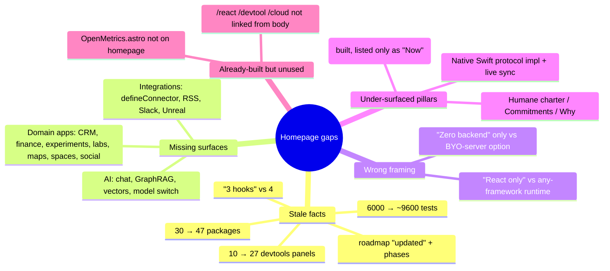
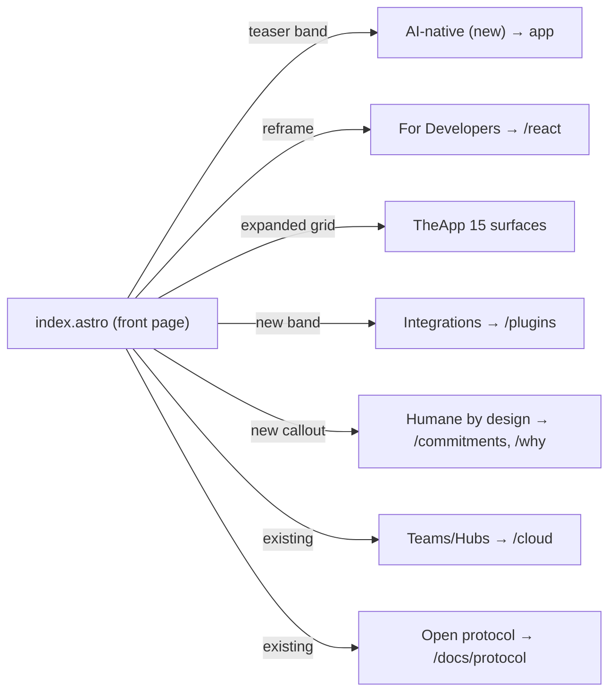
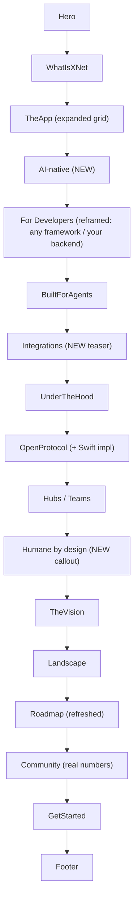

# Landing Page Refresh To Current Repository State

> Status: unchecked · Author: exploration agent · Date: 2026-06-27
> Scope: `site/src/pages/index.astro` and its section components.

## Problem Statement

The marketing homepage (`site/src/pages/index.astro` + `site/src/components/sections/*`)
was last given a substantive content refresh on **2026‑06‑12** ("landing refresh —
real workbench screenshots, 8‑tool grid, agents section") with a small protocol
callout added **2026‑06‑17**. Since then, roughly two weeks of merged work has
shipped entire **new product surfaces** that the homepage body never mentions, and
the numbers it does cite have drifted out of date.

The homepage today tells a 2026‑06‑17 story: _"local‑first productivity app + 3 React
hooks + open protocol."_ The repository today is materially larger:

- **47 packages** (homepage says "30 packages"), **~9,600 test cases** (homepage says
  "6,000+"), a **27‑panel devtools suite** (homepage/Community says "10‑panel").
- An **AI‑native** app surface — chat assistant, GraphRAG retrieval, in‑browser
  vectors, managed model switching — with **zero** representation in the page body.
- A **framework‑agnostic runtime** (`@xnetjs/runtime`, shipped #302) and a
  **bring‑your‑own‑server kit** (`@xnetjs/server`) that contradict the page's
  "React‑only / zero‑backend" framing.
- Whole **domain apps** (CRM, finance/ledger, experiments, labs, maps, spaces,
  social‑import) absent from the "8‑tool" app grid.
- An **integrations/connectors** layer (`defineConnector`, RSS/GitHub/Notion/
  Airtable/Linear, Slack‑compat, Unreal) — no section at all.
- A **Humane Internet Charter** brand pillar (Commitments, Right‑to‑Leave, "what we
  know", the _Why / The Followed_ page) that exists as standalone pages but is only
  reachable from the nav, never argued in the homepage narrative.

The newer dedicated pages — `/react`, `/devtool`, `/cloud`, `/commitments`, `/why` —
are good, but the homepage doesn't route to most of them from its body, so a visitor
who scrolls the front page leaves with a picture of the project that is ~6 weeks
behind reality.

This exploration audits the gap precisely and recommends a **targeted refresh** (fix
the stale facts, add 3–4 grounded sections, expand the app grid, single‑source the
metrics) rather than a from‑scratch redesign.

## Executive Summary

**Recommendation: Option B — a targeted, data‑driven refresh that keeps the existing
narrative spine.** Concretely:

1. **Single‑source the metrics.** Introduce `site/src/data/siteMetrics.ts` (package
   count, publishable count, test‑case count, devtools panel count, supported‑platform
   list) so "30 packages / 6,000 tests / 10 panels" can never silently rot again.
   Wire it into Hero/Community/Roadmap.
2. **Add an "AI‑native" section** to the body (the eyebrow already says AI‑native; the
   body never delivers). Ground it in `apps/web/src/workbench/views/AiChatPanel.tsx`,
   `ai-graph-retriever.ts`, `ai-vector-*.ts`, `@xnetjs/brain`, `@xnetjs/vectors`, and
   the managed OpenRouter path.
3. **Reframe "For Developers" from React‑only to "any framework, your backend."**
   Surface `@xnetjs/runtime` + the conformance suite (#302) and link the existing
   `/react` BYO‑server fork. Keep React as the first‑class binding; do **not**
   over‑promise Vue/Svelte (Tier 2 is demand‑gated per exploration 0237).
4. **Expand `TheApp` tool grid** to include CRM, Finance, Experiments, Labs, Maps,
   Spaces, and Social‑import/Discover — the routes already exist in `apps/web/src/routes`.
5. **Add an "Integrations / Connectors" section** (or fold into the agents/ecosystem
   band) grounded in `packages/plugins/src/connectors/*`.
6. **Add a "Humane by design" callout** that links `/commitments` and `/why`, naming
   the six pillars (Own, Exit, Calm, Consent, Agency, Commons).
7. **Refresh the roadmap** (`site/src/data/roadmap.ts`): promote Cloud/agents items
   that are now built, bump counts, update `updated`.
8. **Optionally surface live metrics** by mounting the already‑built but unused
   `OpenMetrics.astro` (or a slim strip of it) on the homepage.

All new claims must follow the repo's existing citation discipline (see
`site/src/data/surveillance.ts` / `compare.ts`, both build‑time validated).

## Current State In The Repository

### Homepage composition

`site/src/pages/index.astro` renders these sections in order:

| #   | Section component      | Theme                                                                                 | Staleness signal                                           |
| --- | ---------------------- | ------------------------------------------------------------------------------------- | ---------------------------------------------------------- |
| 1   | `Hero.astro`           | "Your data. Your devices. Your rules." 3 CTAs + `pnpm add @xnetjs/react @xnetjs/data` | "3 hooks" copy; React‑only                                 |
| 2   | `WhatIsXNet.astro`     | 3 layers: App / SDK / Protocol                                                        | OK, but "SDK Layer = React hooks"                          |
| 3   | `TheApp.astro`         | 8‑tool grid + workbench screenshot                                                    | Missing CRM/finance/experiments/labs/maps/spaces/social    |
| 4   | `ForDevelopers.astro`  | "Build with 3 React hooks", "Zero backend"                                            | Contradicts `@xnetjs/runtime` + `@xnetjs/server`           |
| 5   | `BuiltForAgents.astro` | Files‑first, SKILL.md, ~9× cheaper than MCP                                           | Solid; could link connectors                               |
| 6   | `UnderTheHood.astro`   | Sync / Security / Identity / Storage pillars                                          | Mostly current                                             |
| 7   | `OpenProtocol.astro`   | L0–L3 + Python kernel conformance                                                     | Missing the **native Swift** impl + live sync              |
| 8   | `Hubs.astro`           | Team hub features (9 cards)                                                           | Current                                                    |
| 9   | `TheVision.astro`      | Tesla Warp / mycelium metaphor                                                        | Evergreen                                                  |
| 10  | `Landscape.astro`      | "Why local‑first" + compare table                                                     | Current (data‑driven via `compare.ts`)                     |
| 11  | `Roadmap.astro`        | Timeline from `roadmap.ts`                                                            | Counts + phase assignment stale                            |
| 12  | `Community.astro`      | "What's working now" (10 bullets)                                                     | "30 packages / 6,000 tests / 10‑panel devtools"            |
| 13  | `GetStarted.astro`     | 3 paths                                                                               | "React app" framing                                        |
| 14  | `Footer.astro`         | Link columns                                                                          | Already links /cloud, /react, /devtool, /why, /commitments |

`OpenMetrics.astro` **exists in the sections folder but is not imported by
`index.astro`** — it currently only feeds `/open`. It's a ready‑made honest‑numbers
strip.

### What shipped since the last homepage refresh (ground truth)

From `apps/web/src/routes/`, the app now has these surfaces (not just docs/db/canvas):

```
crm.tsx  finance.tsx  experiments.tsx  lab.$labId.tsx  map.$mapId.tsx
space.$spaceId.tsx  social-import.tsx  discover.tsx  channel.$channelId.tsx
dashboard.$dashboardId.tsx  analytics.tsx  person.$did.tsx  tasks.tsx ...
```

AI surface (none of it on the homepage):

- `apps/web/src/workbench/views/AiChatPanel.tsx` — in‑app assistant.
- `apps/web/src/workbench/views/ai-graph-retriever.ts` — GraphRAG over the node graph.
- `apps/web/src/workbench/views/ai-vector-search.ts` / `ai-vector-storage.ts` —
  opt‑in in‑browser semantic search (`@xnetjs/vectors`, HNSW).
- `@xnetjs/brain` (GraphRAG), managed OpenRouter provider → hub `/ai/chat` (metered),
  model picker, BYO‑cloud Anthropic path.

Framework/backend surface:

- `@xnetjs/runtime` — `createXNetClient()` usable from any framework, with
  `runAdapterConformance` shared suite (exploration 0237, PR #302).
- `@xnetjs/server` — BYO‑backend kit, trust spectrum `server | custodial | signed`
  (exploration 0223). Already showcased on `site/src/pages/react.astro`.

Integrations/connectors:

- `packages/plugins/src/connectors/{define-connector,api-connectors,rss,slack-migration,cli-wrap}.ts`
- `@xnetjs/slack-compat`, `@xnetjs/unreal` (first `defineConnector` consumers).

Humane/values:

- `site/src/pages/commitments.astro` + `site/src/data/commitments.ts`
  (pillars: **Own, Exit, Calm, Consent, Agency, Commons**).
- `site/src/pages/why.astro` ("Why xNet — you'd never allow this in the real world",
  _The Followed_), data in `site/src/data/surveillance.ts` (build‑time validated).

Recent changelog fragments (`site/src/data/changelog/`) corroborate the deltas:
`use-xnet-from-any-framework-validated`, `xnet-now-listed-as-a-protocol-on-the-com`,
`see-exactly-what-we-know-about-you`, `take-everything-and-go`,
`new-why-xnet-page-makes-the-case-against`, `a-gentle-nudge-to-call-it-a-day`,
`the-assistant-now-scaffolds-by-default`, `maps-live-database-query-layers`.

### Verified numbers (2026‑06‑27)

| Metric           | Homepage today                              | Actual                                                         |
| ---------------- | ------------------------------------------- | -------------------------------------------------------------- |
| Packages         | "30 packages"                               | **47** (`ls -d packages/*/`)                                   |
| Publishable libs | —                                           | **18** (`scripts/changeset/publishable-pathspec.mjs`)          |
| Test cases       | "6,000+"                                    | **~9,612** (`grep -roE '\b(it\|test)\(' **/*.test.ts*`)        |
| Devtools panels  | "10‑panel" / README "15‑panel"              | **27** panel dirs (`packages/devtools/src/panels`)             |
| Hooks            | "3 hooks" (Hero) vs 4 shown (ForDevelopers) | 4 keystone + `useInfiniteQuery/useComments/useHistory/useUndo` |

## External Research

**2026 hero conventions.** High‑performing developer landing pages keep the H1 under
~8 words, lead with the visitor's pain in the first line, and _show_ the product within
3–5 seconds (Notion/Linear/Framer use product‑workflow visuals over prose). A single,
repeated CTA beats a wall of equal‑weight buttons. xNet's hero already does the
3‑word H1 ("Your data. Your devices. Your rules.") and a workbench screenshot — the
problem is **completeness below the fold**, not the hero itself.

**Local‑first competitor positioning.**

- **Zero (Rocicorp)** — "Instant Queries By Default"; query‑driven sync; just hit 1.0
  (2026‑06). Single sharp value prop.
- **Jazz.tools** — "The database that syncs", "batteries‑included local‑first" — an
  _integrated_ stack rather than a sync layer in front of Postgres.
- **ElectricSQL / PowerSync** — explicitly sync layers in front of an existing
  database ("shapes").

xNet's differentiated wedge versus all of these is breadth + values: it is
simultaneously (a) a finished productivity app you can live in, (b) a framework‑agnostic
local‑first runtime, (c) a re‑implementable open protocol, and (d) an explicitly
_humane / no‑surveillance_ product. No single competitor occupies all four corners —
but the homepage currently only argues (a)+(b‑React)+(c). The refresh should make the
**AI‑native** and **humane** corners legible, because those are the hardest to copy.

**Honesty as conversion.** xNet already practices sourced‑claim discipline
(`surveillance.ts`, `compare.ts` validate every claim at build). Carrying _visibly
real_ numbers ("9,612 tests across 47 packages, see /open") is on‑brand and more
persuasive than round marketing figures — lean into it rather than inflating.

## Key Findings



1. **Numbers rot is the highest‑confidence, lowest‑risk fix** and currently makes the
   project look ~40% smaller than it is.
2. **The single biggest _narrative_ gap is AI.** The page's own eyebrow was changed to
   "AI‑native" (commit `fe584524f`) but the body never substantiates it.
3. **The framework story is actively wrong now.** "P2P sync with no server code" and
   "React" are presented as the _only_ path; both `@xnetjs/runtime` (any framework) and
   `@xnetjs/server` (your backend) are first‑class shipped paths.
4. **`TheApp` undersells the app by ~half.** Eight tools shown; ~15 real surfaces exist.
5. **The humane positioning is a moat the homepage hides.** It's the corner competitors
   can't trivially match, yet it's nav‑only.
6. **Most target pages already exist** (`/react`, `/devtool`, `/cloud`, `/commitments`,
   `/why`) — this is mostly a _wiring + summarizing_ job, not net‑new page building.

## Options And Tradeoffs

### Option A — Minimal fact‑fix

Update only the stale numbers and roadmap items; touch no structure.

- ✅ ~1 hour, near‑zero risk, unblocks the worst inaccuracies.
- ❌ Leaves AI / any‑framework / BYO‑server / domains / humane invisible. The page still
  tells a June‑17 story.

### Option B — Targeted refresh (recommended)

Fact‑fix **plus** add ~3–4 grounded sections, expand `TheApp`, single‑source metrics,
and wire the body to the existing `/react`, `/cloud`, `/why` pages. Keep the section
order and visual language; reuse `SectionHeader`/`CodeBlock`/card patterns.

- ✅ Brings the page to current reality; reuses existing components and pages; each
  addition is independently shippable and citable.
- ✅ Data‑driven additions (metrics module, expanded `tools[]`, roadmap edits) resist
  future rot.
- ⚠️ Page gets longer — must watch information density and keep one primary CTA per band.

### Option C — Full IA redesign

Re‑think the homepage as a hub that dispatches to audience pages (build / use / believe),
restructure the scroll, possibly new hero.

- ✅ Could tighten the now‑sprawling story into 3 clear audiences.
- ❌ High effort, higher regression risk, and the recent perf/"performative UI" revert
  (#268→#269, commit `b1bd261ba`) is a caution that big visual swings here get reverted.
  Not warranted just to reflect current state.

### Sub‑decision: one long page vs. hub‑and‑spoke

The dedicated pages already exist, so prefer **summarize‑and‑link**: each new homepage
band is a tight teaser (2–4 cards + one CTA) that hands off to the deep page (`/react`,
`/cloud`, `/why`, `/plugins`, `/devtool`). This caps homepage growth while still closing
the coverage gap.



## Recommendation

Ship **Option B** as a sequence of small, independently reviewable PRs so the homepage
is never broken mid‑refresh and each claim lands with its citation:

1. **PR‑1 (facts):** add `siteMetrics.ts`, wire Hero/Community/Roadmap, fix
   30→47 / 6,000→9,600 / 10→27, reconcile "3 hooks", bump `roadmap.ts` (`updated`,
   promote built items).
2. **PR‑2 (app grid):** expand `TheApp.tools[]` to the real surfaces; refresh the
   subtitle.
3. **PR‑3 (developers reframe):** rewrite `ForDevelopers` lead to "any framework, your
   backend," add a runtime/BYO‑server pair of cards linking `/react`; keep React hooks
   as the hero example.
4. **PR‑4 (AI‑native):** new `BuiltWithAI.astro` band.
5. **PR‑5 (integrations + humane):** `Integrations.astro` teaser + a "Humane by design"
   callout linking `/commitments` and `/why`. Optionally mount `OpenMetrics` strip.

Order matters: PR‑1 is pure truth‑repair and can merge immediately; the rest add
surface area.

## Example Code

### 1. Single‑source the metrics (`site/src/data/siteMetrics.ts`)

```ts
/**
 * One source of truth for the "how big is this" numbers used across the site.
 * Keep these honest — they are cross-checked against the repo in
 * scripts (see Validation Checklist). Bump when a milestone crosses a round number.
 */
export const siteMetrics = {
  packages: 47, // ls -d packages/*/ | wc -l
  publishableLibs: 18, // node scripts/changeset/publishable-pathspec.mjs
  tests: 9600, // grep -roE '\b(it|test)\(' **/*.test.ts* | wc -l  (round down)
  devtoolsPanels: 27, // packages/devtools/src/panels
  platforms: ['Web (PWA)', 'Desktop (Electron)', 'Mobile (Expo, soon)']
} as const

export const testsLabel = `${siteMetrics.tests.toLocaleString()}+ tests`
export const packagesLabel = `${siteMetrics.packages} packages`
```

Then in `Community.astro` / `roadmap.ts`:

```astro
import { siteMetrics, testsLabel, packagesLabel } from '../../data/siteMetrics'
// "9,600+ tests across 47 packages"
const working = [`${testsLabel} passing across ${packagesLabel}`, /* ... */]
```

> Better still: replace the literals with a tiny build step that derives them, so the
> module is generated, not hand‑maintained. A `site/scripts/collect-metrics.mjs`
> invoked from `prebuild` keeps them exact.

### 2. Expand the app grid (`TheApp.astro` `tools[]`)

Add to the existing array (same `colorMap` pattern):

```ts
{ title: 'AI assistant', icon: 'spark', color: 'violet',
  description: 'A built-in assistant that retrieves over your own graph (GraphRAG) and scaffolds content — grounded in your workspace, not a stranger’s cloud.' },
{ title: 'CRM & contacts', icon: 'people', color: 'cyan',
  description: 'People, companies, deals and a per-person dashboard — a relational CRM that is just nodes in your store.' },
{ title: 'Finance', icon: 'ledger', color: 'emerald',
  description: 'Double-entry accounting with accounts, transactions and postings — money kept as exact integer minor units.' },
{ title: 'Experiments', icon: 'beaker', color: 'amber',
  description: 'A habit / metric tracker with streaks and trend math — run experiments on yourself and your team.' },
{ title: 'Maps', icon: 'map', color: 'sky',
  description: 'Live, query-driven map layers over your data on a satellite/vector basemap.' },
{ title: 'Labs', icon: 'code', color: 'pink',
  description: 'A sandboxed code surface to compute over your nodes, on a tiered runtime ladder.' },
```

### 3. Reframe "For Developers" — any framework, your backend

A new pair of cards under the React example (links the page that already exists):

```astro
<div class="mt-12 grid gap-6 sm:grid-cols-2 max-w-4xl mx-auto">
  <a href="/react#byo" class="rounded-xl border border-indigo-500/20 bg-indigo-500/[0.03] p-6">
    <h3 class="text-lg font-semibold text-indigo-400">Any framework</h3>
    <p class="mt-2 text-sm text-gray-500 dark:text-gray-400">
      <code>@xnetjs/runtime</code> — <code>createXNetClient()</code> works from any
      framework, a worker, a CLI or a Node service. A shared conformance suite keeps
      every binding honest. React ships first‑class; Vue/Svelte adapters are a two‑file
      port when demand calls for it.
    </p>
  </a>
  <a href="/react#byo" class="rounded-xl border border-emerald-500/20 bg-emerald-500/[0.03] p-6">
    <h3 class="text-lg font-semibold text-emerald-400">…or your own backend</h3>
    <p class="mt-2 text-sm text-gray-500 dark:text-gray-400">
      Prefer your existing database and auth? <code>@xnetjs/server</code> maps your
      session model onto the data layer (<code>authenticate / authorizeRead /
      authorizeWrite</code>) across a <em>server / custodial / signed</em> trust spectrum.
    </p>
  </a>
</div>
```

> Keep the existing "Zero backend" P2P pitch — just present it as _one_ of three
> backends (P2P · managed Hub · your server), not the only one.

### 4. New `BuiltWithAI.astro` band (sketch)

```astro
---
import SectionHeader from '../ui/SectionHeader.astro'
const points = [
  { t: 'Grounded in your graph', d: 'GraphRAG retrieval walks your own nodes and edges — answers cite your data, not a generic model.' },
  { t: 'Search that runs on-device', d: 'Opt-in in-browser vectors (HNSW) give semantic + hybrid search with nothing leaving the device.' },
  { t: 'Bring a key or use managed', d: 'Point at your own provider, or use the metered managed gateway with a model picker.' },
  { t: 'Marked, not hidden', d: 'AI-generated content is badged in the editor — the assistant assists, it does not impersonate you.' },
]
---
<section id="ai" class="border-y border-border/50 bg-surface/10 py-24 lg:py-32">
  <div class="mx-auto max-w-6xl px-6">
    <SectionHeader title="An assistant that lives in your data — not the other way around"
      subtitle="xNet is AI-native: retrieval over your own knowledge graph, optional on-device vectors, and a clear line between you and the model."
      align="center" />
    <!-- 4 cards from points[] + CTA to /app and /docs -->
  </div>
</section>
```

### 5. "Humane by design" callout (links existing pages)

```astro
<section id="humane" class="py-20">
  <div class="mx-auto max-w-4xl px-6 rounded-2xl border border-border bg-surface/30 p-8 text-center">
    <h2 class="text-2xl font-bold">Built to be left.</h2>
    <p class="mt-3 text-gray-500 dark:text-gray-400">
      Six commitments — <strong>Own, Exit, Calm, Consent, Agency, Commons</strong>.
      No surveillance, a one-click "take everything and go", and a page that shows you
      exactly what we know about you.
    </p>
    <div class="mt-6 flex justify-center gap-4">
      <a href="/commitments" class="rounded-lg bg-indigo-600 px-5 py-2.5 text-sm text-white">Our commitments</a>
      <a href="/why" class="rounded-lg border border-border px-5 py-2.5 text-sm">Why this matters</a>
    </div>
  </div>
</section>
```

### Proposed section order (after refresh)



## Risks And Open Questions

- **Claim accuracy / overreach.** Every new number and capability claim must be true
  _today_ and ideally citable. Follow the `surveillance.ts` precedent: where a claim is
  load‑bearing, source it; where it could be read as over‑promising (e.g. Vue/Svelte
  "support"), hedge to match exploration 0237's Tier‑0/1/2 reality (runtime is
  cross‑framework; full React components are React‑only; Vue/Svelte bindings are
  demand‑gated). **Do not imply a shipped Vue/Svelte app.**
- **Page length / density.** Adding ~4 bands risks a sprawling scroll. Mitigate with
  the teaser‑and‑link pattern and one primary CTA per band; consider collapsing
  `TheVision` + `Landscape` if the page feels long.
- **Mobile status.** Expo app exists but Roadmap still says "coming soon." Keep "soon"
  until there's a real download — don't let the platform strip imply GA.
- **"Built" vs "Now" honesty in the roadmap.** Cloud is substantially built (staging
  deployed, live dashboard, billing) but not GA. Decide whether it moves to "Built"
  with a "staging" qualifier or stays "Now." Prefer precise wording over a binary flip.
- **Screenshot freshness.** `TheApp` uses `workbench-light/dark.png`. If the workbench
  chrome changed materially, regenerate; otherwise leave (out of scope to chase pixels).
- **Metrics maintenance.** Hand‑maintained numbers will rot again. Strongly prefer the
  generated `siteMetrics` approach over literals.
- **Performative‑UI caution.** The recent revert (#268→#269) shows the owner dislikes
  busy/animated marketing. Keep additions calm and content‑first; reuse existing card
  styles, avoid new motion.
- **Open question:** should the homepage de‑emphasize the long‑horizon "decentralized
  data layer" vision in favor of what ships today (app + AI + framework + humane), given
  competitors win on a single sharp prop? Leaning yes on _prominence_ (lead with real,
  keep vision lower) but not on removal.

## Implementation Checklist

- [x] Add `site/src/data/siteMetrics.ts` (or generate via `site/scripts/collect-metrics.mjs` in `prebuild`).
- [x] Replace stale literals: `30 packages`→47, `6,000+ tests`→~9,600, `10‑panel`→27 in `Community.astro` and `roadmap.ts`.
- [x] Reconcile "3 hooks" (Hero) with the 4 keystone hooks shown elsewhere.
- [ ] Expand `TheApp.astro` `tools[]` with AI assistant, CRM, Finance, Experiments, Maps, Labs (and add the matching inline SVG icons). Update the section subtitle.
- [ ] Reframe `ForDevelopers.astro`: lead = "any framework, your backend"; add runtime + BYO‑server cards linking `/react`; keep P2P as one of three backends.
- [ ] Add `BuiltWithAI.astro`; import it into `index.astro` after `TheApp`.
- [ ] Add `Integrations.astro` teaser (defineConnector, RSS/GitHub/Notion/Airtable/Linear, Slack, Unreal) linking `/plugins`; or extend `BuiltForAgents` with a connectors card.
- [ ] Add "Humane by design" callout linking `/commitments` and `/why`; name the six pillars.
- [ ] Extend `OpenProtocol.astro` to mention the native Swift implementation + live Swift↔hub sync alongside the Python kernel.
- [ ] Refresh `roadmap.ts`: bump `updated`, promote now‑built items (agents surface, dashboards, Cloud staging), re‑balance Now/Next.
- [ ] (Optional) Mount a slim `OpenMetrics` strip on the homepage for live, honest numbers.
- [ ] Re‑order `index.astro` imports/usage to the proposed flow.
- [ ] Source any load‑bearing new claims; hedge framework‑support wording to match exploration 0237.

## Validation Checklist

- [ ] `pnpm --filter site build` passes (includes `validate-surveillance` / `compare` gates).
- [ ] Numbers on the page match the repo: re‑run `ls -d packages/*/ | wc -l`, the test‑case grep, and the devtools panel count; they equal what's rendered.
- [ ] No remaining "30 packages", "6,000", or "10‑panel" strings on the homepage (`grep` the section dir).
- [ ] Every internal link added resolves to an existing page/anchor (`/react`, `/cloud`, `/commitments`, `/why`, `/plugins`, `/devtool`, `#ai`, `#integrations`, `#humane`).
- [ ] `pnpm build:llms` / sidebar build still passes if any docs links were added (per repo convention for new doc pages).
- [ ] Lint passes (eslint **and** prettier) and any motion stays within the motion‑vocab gate (`check-motion-vocab.mjs`).
- [ ] Preview the homepage in light **and** dark mode; the expanded grid and new bands render without overflow on mobile width.
- [ ] No changeset required (site is an app, not a publishable `packages/*` lib) — confirm the Stop hook is satisfied.
- [ ] Framework wording reviewed against exploration 0237 so nothing implies a shipped Vue/Svelte app.

## References

### In‑repo

- `site/src/pages/index.astro` — homepage composition.
- `site/src/components/sections/*.astro` — all section components (incl. unused `OpenMetrics.astro`).
- `site/src/data/{roadmap,compare,commitments,surveillance,metrics,status}.ts` — data modules + citation discipline.
- `site/src/pages/{react,devtool,cloud,commitments,why}.astro` — existing deep pages to link from the body.
- `apps/web/src/routes/*` — ground truth for the app surface (crm/finance/experiments/lab/map/space/social‑import/discover/channel/analytics).
- `apps/web/src/workbench/views/{AiChatPanel.tsx,ai-graph-retriever.ts,ai-vector-*.ts}` — AI surface.
- `packages/plugins/src/connectors/*` — connectors/integrations.
- `packages/runtime`, `packages/server`, `packages/brain`, `packages/vectors` — newly surfaced capabilities.
- `scripts/changeset/publishable-pathspec.mjs` — publishable set (18 libs).

### Explorations

- `0237_[x]_VUE_SVELTE_AND_OTHER_FRAMEWORKS_…` — Tier‑0/1/2 framework policy (don't over‑promise).
- `0223_[_]_XNET_REACT_WITH_YOUR_OWN_SERVER_AND_AUTH.md` — BYO‑server kit.
- `0224_[_]_REACT_LANDING_PAGE_DEVTOOLS_SHOWCASE_AND_SERVER_DOCS.md` — the /react + /devtool pages.
- `0234_[x]_THE_FOLLOWED_A_SURVEILLANCE_RECKONING_LANDING_PAGE.md` & `0234_[_]_MITIGATING_INTERNET_HARMS…` — humane charter + /why.
- `0211/0208/0192` — AI second brain (GraphRAG), managed OpenRouter, BYO‑cloud.
- `0210` — native Swift core + live sync; `0200` — portable protocol spec / Python kernel.

### External

- Zero (Rocicorp) — https://zero.rocicorp.dev/ (single sharp "Instant Queries By Default"; 1.0, 2026‑06).
- Jazz — https://jazz.tools/ ("the database that syncs"; batteries‑included local‑first).
- ElectricSQL vs PowerSync vs Zero (2026) — https://trybuildpilot.com/648-electric-sql-vs-powersync-vs-zero-2026.
- Hero/landing best practices (2026) — https://blog.logrocket.com/ux-design/hero-section-examples-best-practices/ ; https://lovable.dev/guides/landing-page-best-practices-convert.
