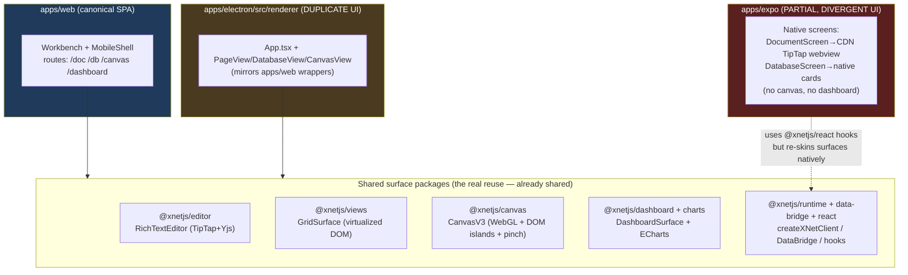
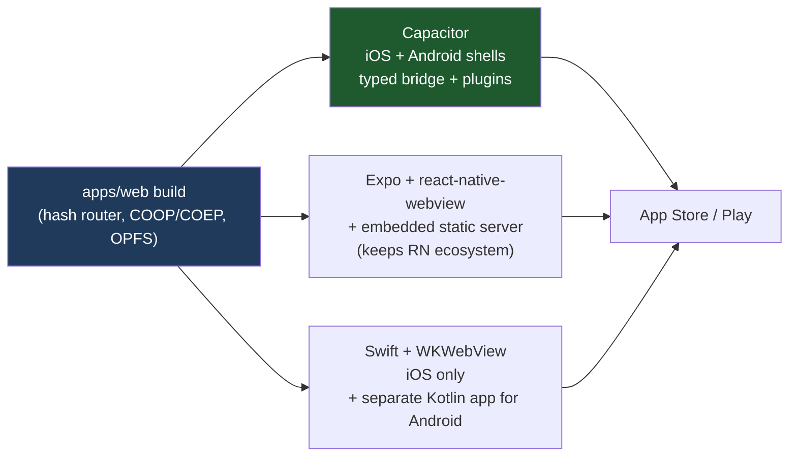
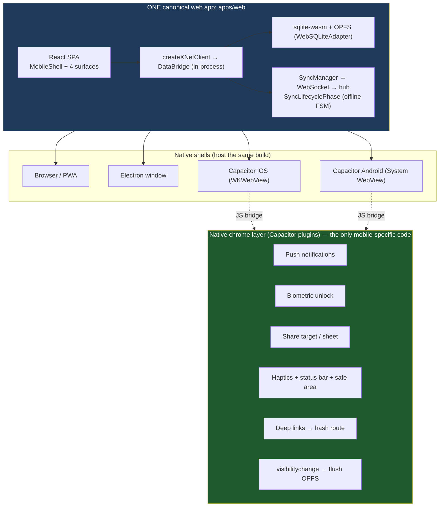
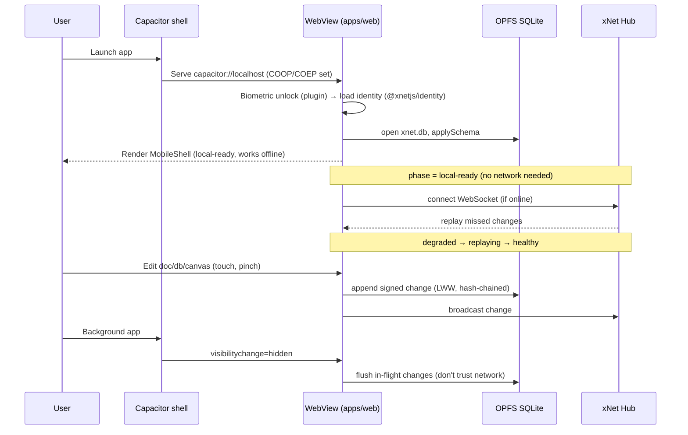
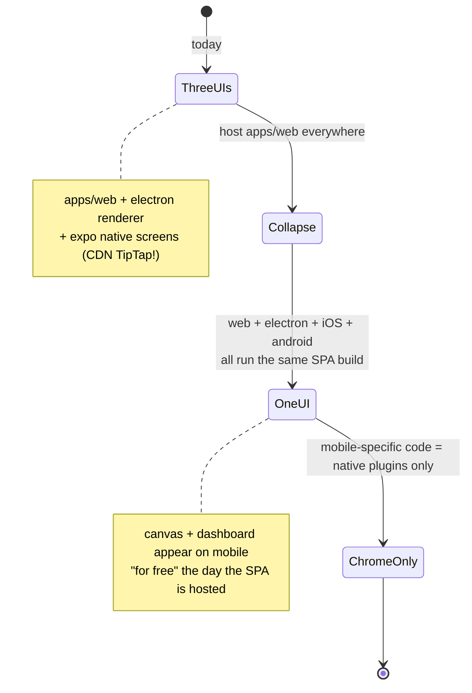

# Mobile App Parity: Host the Web UI in a Thin Native Webview Shell

> Status: exploration / unchecked. Recommends a container strategy and an
> automation plan to bring iOS + Android to parity with web and Electron by
> **hosting the one canonical web SPA in a webview**, not by re-implementing
> surfaces natively.

## Problem Statement

We want the mobile app to reach feature parity with web and Electron across
all four major surfaces — **document, database, canvas, dashboard** — with as
little duplicate work as possible. The explicit ask:

- Reuse the existing web UI inside a webview for each surface, rather than
  re-implementing documents/databases/canvas in React Native or Swift.
- Wrap that webview in a native shell that supplies the "major chrome"
  (navigation, OS integration) and makes touch/keyboard/scroll feel native.
- Everything must work **offline** and **sync when online**.
- Decide the container: **Expo + react-native-webview**, **Capacitor**, or
  **native Swift + WKWebView** — optimizing for least duplication and the
  lowest-friction entry point, while staying open to "just use Swift if it's
  meaningfully faster or simpler."
- **Automate** the build and, critically, the **testing** of all surfaces.

## Executive Summary

The codebase is already _architected_ for this — we just haven't pointed the
mobile container at the real web app yet. Three facts decide the design:

1. **The web SPA already has a webview-hosting mode.** `apps/web` builds with
   `VITE_USE_HASH_ROUTER=true` (`apps/web/src/App.tsx:66`), already renders a
   touch-first `MobileShell` under 768px (`apps/web/src/workbench/`), already
   runs SQLite via **sqlite-wasm + OPFS**, and already has an offline→online
   sync state machine (`SyncLifecyclePhase` in
   `packages/sync/src/sync-runtime.ts`). All four surfaces are pure
   DOM/WebGL/Canvas React that already handle pointer + pinch + touch.

2. **We currently maintain three divergent UIs**, which is the duplication the
   user wants to stop:
   - `apps/web` — the canonical React SPA.
   - `apps/electron/src/renderer/*` — a **second full React UI** that
     re-implements `PageView`/`DatabaseView`/`CanvasView` wrappers.
   - `apps/expo/src/screens/*` — a **third, partial** native UI that
     re-implements the document editor by loading **TipTap from a CDN inside an
     inline HTML string** (`apps/expo/src/components/WebViewEditor.tsx`) and the
     database as native cards. Canvas and dashboard don't exist on mobile at all.

3. **The data/runtime layer is framework- and transport-agnostic.**
   `@xnetjs/runtime`'s `createXNetClient` + the `DataBridge` seam already abstract
   in-process vs. worker vs. native transports. Hosting the SPA in a webview that
   runs its **own** sqlite-wasm/OPFS needs _zero_ new bridge code.

**Recommendation: adopt Capacitor as the mobile container and host the
unmodified `apps/web` build inside it.** Capacitor serves the build from
`capacitor://localhost` — a real HTTP origin where we can set COOP/COEP headers,
which unlocks `SharedArrayBuffer` and the full-speed OPFS SQLite backend _inside
the webview_ — generates **both** iOS and Android projects from one config, and
exposes a typed native bridge + plugin ecosystem (push, biometrics, share,
haptics) sufficient for App Store "minimum functionality." This keeps **one**
data layer, **one** UI, and reduces mobile-specific code to a thin native chrome
shell plus a handful of capability plugins.

The current Expo "native screens" path is the anti-pattern; we should retire it.
Swift + WKWebView is rejected as the primary path because it is iOS-only and
doubles the shell work for Android with no parity benefit for a webview wrapper.

## Current State In The Repository

### The three UIs (the duplication to collapse)



The heavy surfaces _are_ already shared packages. What is duplicated is the
**app-level composition + shell**: `apps/web` and `apps/electron/src/renderer`
each maintain their own `PageView`/`DatabaseView`/`CanvasView`/`DashboardView`
wrappers, and `apps/expo` re-skins documents and databases natively. The mobile
effort is the moment to establish "**the SPA is the UI; shells only host it.**"

### What the web app already gives us for free

| Capability              | Where                                                                                                                        | Why it matters for mobile webview                                   |
| ----------------------- | ---------------------------------------------------------------------------------------------------------------------------- | ------------------------------------------------------------------- |
| Hash-router build mode  | `apps/web/src/App.tsx:66` (`VITE_USE_HASH_ROUTER`)                                                                           | SPA routing works under `file://`/custom-scheme hosting             |
| Compact/touch shell     | `apps/web/src/workbench/MobileShell.tsx`, `use-layout-mode.ts` (<768px)                                                      | Bottom nav, edge `Sheet`s, content-first chrome already built       |
| sqlite-wasm + OPFS      | `@xnetjs/sqlite/web` (`WebSQLiteAdapter`), wired in `apps/web/src/App.tsx`                                                   | Local-first DB runs _inside_ the webview — no native DB bridge      |
| PWA + Workbox precache  | `apps/web/vite.config.ts` (`VitePWA`, WASM in `includeAssets`)                                                               | Offline asset loading; same bytes a webview can ship                |
| Offline→online sync FSM | `packages/sync/src/sync-runtime.ts` (`SyncLifecyclePhase`)                                                                   | `local-ready` → `degraded` → `replaying` → `healthy` already exists |
| Touch-ready surfaces    | GridSurface `PointerSensor`+`TouchSensor`; CanvasV3 `pinch-zoom.ts`; editor `utils/mobile.ts` (`isIOS`, `getSafeAreaInsets`) | Gestures/safe-areas handled in-app, not by the shell                |
| Mobile e2e projects     | `tests/e2e/playwright.config.ts` (`mobile-webkit` iPhone 14, `mobile-chromium` Pixel 7, `hasTouch`)                          | A test substrate for the web UI at phone size already exists        |

### The runtime seam (why no data re-implementation is needed)

`createXNetClient` (`packages/runtime/src/client.ts`) owns `store`, `bridge`,
`syncManager`, `undo`, `auth`; it accepts an optional custom `DataBridge` but, by
default, builds an in-process one. `DataBridge`
(`packages/data-bridge/src/types.ts`) already has three implementations —
`MainThreadBridge` (in-process), `WorkerBridge` (postMessage/Comlink),
`NativeBridge` (RN/expo). React hooks (`useQuery`/`useMutate`/`useNode`) bind to
whatever bridge the provider supplies via `useSyncExternalStore`.

**Consequence:** if the webview runs its own sqlite-wasm/OPFS (as `apps/web`
already does), the hosted SPA needs _no_ bridge to native at all for data — it is
simply the web app, byte-for-byte, in a native window. Native code only supplies
_OS-integration chrome_, not the data path.

### The current Expo app: a catalogue of what to undo

- `apps/expo/App.tsx` / `src/context/XNetProvider.tsx` — **two** competing
  providers; the local one re-implements identity with a _simplified, non-DID_
  `did:key:z<hex>` instead of `@xnetjs/identity`'s real Ed25519/base58btc DID.
- `src/components/WebViewEditor.tsx` — a webview that loads **TipTap 2.1.13 from
  unpkg**, i.e. a _fourth_ editor implementation, network-dependent, not our
  `@xnetjs/editor`, no Yjs collaboration, content not even persisted
  (`handleContentChange` is a no-op in `DocumentScreen.tsx`).
- `src/screens/DatabaseScreen.tsx` — native card UI on top of the real
  `useGridDatabase` hook; correct data, but a bespoke surface to maintain.
- No canvas, no dashboard, no hub sync (`App.tsx` deep-link comment: "Expo has
  no hub sync yet").

This validates the thesis: the native-screen approach is already drifting and
incomplete. Hosting the real SPA replaces all of it.

## External Research

Synthesis of current (2025–2026) prior art on wrapping an existing local-first
SPA in a native shell. Full notes with sources at the end.

### The crux: cross-origin isolation for full-speed SQLite

The high-performance sqlite-wasm backend (`OPFS-SyncAccessHandle`) needs
`SharedArrayBuffer`, which needs a **cross-origin isolated** context
(`COOP: same-origin` + `COEP: require-corp` response headers). You cannot set
HTTP headers on `file://`. This single constraint orders the container options:

| Container                     | Local serving                             | Can set COOP/COEP?                                                      | SAB + sync OPFS?                                        | Both platforms from one config? |
| ----------------------------- | ----------------------------------------- | ----------------------------------------------------------------------- | ------------------------------------------------------- | ------------------------------- |
| **Capacitor**                 | `capacitor://localhost` (embedded server) | **Yes** (`server.responseHeaders`)                                      | **Yes, out of the box**                                 | **Yes** (iOS + Android)         |
| Expo + `react-native-webview` | `file://` by default                      | No (needs an embedded static server, e.g. `react-native-static-server`) | Only with extra native server; else async-OPFS fallback | Yes (iOS + Android)             |
| Swift + WKWebView             | `WKURLSchemeHandler` (`app://`)           | Yes (handler sets headers)                                              | Yes                                                     | **No — iOS only**               |

If you skip cross-origin isolation, sqlite-wasm still works via the **async-OPFS
VFS** (no `SharedArrayBuffer`), just with lower I/O throughput, or `absurd-sql`
over IndexedDB as a deeper fallback. So storage is never _blocked_ in a
webview — but Capacitor gets us the fast path for free.

### Storage durability in mobile webviews (2025–2026)

| Feature                  | iOS WKWebView   | Android System WebView |
| ------------------------ | --------------- | ---------------------- |
| OPFS (basic)             | iOS 15.2+       | Chrome 102+            |
| `createSyncAccessHandle` | **iOS 16.4+**   | Chrome 108+            |
| SharedArrayBuffer        | needs COOP+COEP | needs COOP+COEP        |

Android System WebView updates via Play independently of OS version, so Chrome
108+ coverage is high on Android 10+. iOS 16.4+ is a safe 2026 floor. OPFS lives
in the persistent storage bucket and is **not** subject to the aggressive
eviction that historically plagued IndexedDB on iOS — the right home for the DB.

### App Store guideline 4.2 ("minimum functionality")

Apple reviews function, not which wrapper library you used. A full-screen
"just a website" is the rejection risk. A **local-first, offline-capable** app
with native integration is a well-trodden approval path. Concrete signals to add
natively: push notifications, biometric unlock, native share sheet, an
offline/sync-status indicator, haptics. xNet's P2P sync/peer indicator and hash-
chain verification are genuine non-Safari features worth citing in review notes.

### Testing webview hybrids

- **Maestro** — best fit. One declarative YAML flow drives **both** native views
  and **WebView DOM** elements (no Appium-style context switching). Has
  `stopNetwork`/network controls for offline+sync flows. Pairs with EAS Build /
  Fastlane and Maestro Cloud for CI.
- **Appium** — most powerful (switch into `WEBVIEW_*` context, full WebDriver
  selectors) but highest setup cost; keep as an escape hatch.
- **Detox** — RN-oriented, webview support is secondary/brittle here.
- **Playwright** — cannot drive a native shell, but _can_ exhaustively test the
  **web SPA** at mobile viewports (we already do). It owns the bottom of the
  pyramid; Maestro owns the top.

## Key Findings

1. **"Reuse the webview per surface" is already the cheap path** because the
   surfaces are shared packages and the SPA already has a mobile shell + hash
   router + OPFS + sync FSM. The unlock is _hosting `apps/web` whole_, not
   per-surface webviews stitched into native screens.
2. **Per-surface native webviews (the current Expo model) are more work, not
   less.** Each native screen must re-wire data, navigation, presence, blobs,
   and safe-areas. Hosting the whole SPA inherits all of it once.
3. **The container decision is really the COOP/COEP decision.** Capacitor solves
   it by construction; Expo+WebView needs an embedded static server to match;
   Swift solves it but only for iOS.
4. **No native data layer is required.** Keep sqlite-wasm/OPFS in the webview.
   `expo-sqlite`/`better-sqlite3` native adapters remain useful for _non-webview_
   contexts (a future native module, CLI, Electron) but are not on the mobile
   critical path.
5. **Native chrome is a small, bounded surface**: status bar/safe-area, deep
   links, push, biometric unlock, share target, haptics, background-flush on
   `visibilitychange`. Everything else is the SPA.
6. **Automated testing has a clean three-layer story**, and layer 1 already runs
   in CI.

## Options And Tradeoffs

### Container options



**Option A — Capacitor (recommended).**
_Pros:_ zero changes to the web build; `capacitor://localhost` gives COOP/COEP →
fast OPFS SQLite in-webview; one config emits iOS **and** Android; typed bridge;
mature plugins (push, biometrics, share, haptics, status-bar, deep links);
trivial dev loop (`npm run build && npx cap sync`); lowest net new code.
_Cons:_ a new dependency/toolchain to learn; native shell is thinner than RN, so
truly custom native screens (if ever wanted) are less idiomatic than RN.

**Option B — Expo + react-native-webview hosting `apps/web`.**
Reframed from the _current_ Expo app: delete the native screens, host the real
SPA in one webview. _Pros:_ salvages existing Expo/EAS investment; RN ecosystem
for native chrome; familiar entry point for JS devs. _Cons:_ `file://` blocks
COOP/COEP, so full-speed OPFS needs an **embedded static server**
(`react-native-static-server`) or you accept async-OPFS; string-based
`postMessage` bridge; more moving parts than Capacitor for the same result.

**Option C — Swift + WKWebView (+ Kotlin for Android).**
_Pros:_ deepest iOS integration; `WKURLSchemeHandler` sets COOP/COEP cleanly;
no JS shell layer. _Cons:_ **iOS only** — Android needs a parallel Kotlin/WebView
app, doubling shell maintenance for a wrapper that has little native UI. Not
"simpler" for a cross-platform webview wrapper; simpler only if iOS-only and
heavy native UI were the goal. Rejected as primary; revisit only if a native-
heavy iOS-first product emerges.

### Storage strategy inside the container

| Strategy                                               | Duplication                | Perf  | When                                                     |
| ------------------------------------------------------ | -------------------------- | ----- | -------------------------------------------------------- |
| **sqlite-wasm + OPFS in webview (sync, COOP/COEP)**    | **none** (== web)          | best  | **Capacitor default; recommended**                       |
| sqlite-wasm + async OPFS (no SAB)                      | none                       | good  | iOS <16.4 fallback / Expo without static server          |
| Native SQLite (`expo-sqlite`) bridged over postMessage | high (bespoke query proxy) | mixed | avoid for mobile; keep adapter for native-module futures |

### UI composition strategy

- **Host whole SPA (recommended):** native shell renders one webview at the SPA
  root; the in-app `MobileShell` is the chrome. Native chrome = OS plugins only.
- **Native nav + per-surface webviews:** native tab bar, each tab a webview at
  `/doc/$id` etc. More native feel, but re-introduces navigation/state seams and
  multiple webview/OPFS contexts. Only worth it if a tab genuinely needs native.

## Recommendation

Adopt **Capacitor**, host the **unmodified `apps/web`** build, keep **one data
layer** (sqlite-wasm/OPFS) and **one UI** (the SPA + `MobileShell`), and add a
**thin native chrome layer** via Capacitor plugins. Retire the Expo native
screens. Treat Swift/WKWebView as a non-goal unless an iOS-native-heavy product
appears.

### Target architecture



### Boot, offline, and sync inside the webview



The offline→online transitions are not new work — `SyncLifecyclePhase`
(`packages/sync/src/sync-runtime.ts`) already models
`local-ready → connecting → healthy → degraded → replaying`. The shell only adds
the **background-flush** trigger and reconnect-on-foreground.

### Why this is the least duplicate work



Canvas and dashboard — which **don't exist** in the Expo app today — light up on
mobile the moment the SPA is hosted, with no new mobile code.

## Example Code

### 1. Web build profile for the mobile container

```jsonc
// apps/web/package.json — add a mobile-targeted build
{
  "scripts": {
    "build:mobile": "VITE_USE_HASH_ROUTER=true VITE_TARGET=capacitor tsc && vite build --outDir dist-mobile"
  }
}
```

```ts
// apps/web/src/lib/platform.ts (new) — detect the native shell at runtime
import { Capacitor } from '@capacitor/core'
export const isNativeShell = () => Capacitor.isNativePlatform()
export const nativePlatform = () => Capacitor.getPlatform() // 'ios' | 'android' | 'web'
```

### 2. Capacitor config — the COOP/COEP unlock

```ts
// apps/mobile/capacitor.config.ts (new app)
import type { CapacitorConfig } from '@capacitor/cli'

const config: CapacitorConfig = {
  appId: 'io.xnet.app',
  appName: 'xNet',
  webDir: '../../apps/web/dist-mobile',
  server: {
    // capacitor://localhost is a real origin → headers are honored →
    // SharedArrayBuffer → full-speed OPFS-SyncAccessHandle SQLite.
    androidScheme: 'https',
    responseHeaders: {
      'Cross-Origin-Opener-Policy': 'same-origin',
      'Cross-Origin-Embedder-Policy': 'require-corp'
    }
  },
  ios: { contentInset: 'always' },
  plugins: {
    /* PushNotifications, Haptics, Share, App (deep links), etc. */
  }
}
export default config
```

### 3. The entire native chrome layer (sketch)

```ts
// apps/web/src/native/chrome.ts (new) — runs inside the webview, talks to plugins
import { App } from '@capacitor/app'
import { Haptics, ImpactStyle } from '@capacitor/haptics'
import { isNativeShell } from '../lib/platform'

export function installNativeChrome(router: { navigate(to: string): void }) {
  if (!isNativeShell()) return
  // Deep links: xnet://doc/<id> → hash route
  App.addListener('appUrlOpen', ({ url }) => {
    const path = new URL(url).pathname // /doc/<id>
    router.navigate(`#${path}`)
  })
  // Flush local DB when backgrounded (don't trust the network in background)
  App.addListener('appStateChange', ({ isActive }) => {
    if (!isActive) document.dispatchEvent(new Event('xnet:flush'))
  })
  // Light haptic on commit
  document.addEventListener('xnet:committed', () => {
    void Haptics.impact({ style: ImpactStyle.Light })
  })
}
```

That is essentially the whole mobile-specific code budget: a config file, a
platform shim, and a chrome installer. No re-implemented surfaces.

### 4. Maestro flow exercising a webview surface offline

```yaml
# tests/mobile/flows/database-offline.yaml
appId: io.xnet.app
---
- launchApp
- tapOn: 'New Database' # finds the DOM button inside the webview
- tapOn: 'add-row-fab'
- inputText: 'Offline row'
- stopApp # relaunch to prove OPFS persistence
- launchApp
- assertVisible: 'Offline row'
- runFlow:
    when: { platform: iOS }
    commands:
      - setAirplaneMode: enabled # edit offline…
      - tapOn: 'add-row-fab'
      - inputText: 'Made offline'
      - setAirplaneMode: disabled # …then prove it syncs
      - assertVisible: 'synced' # native/web sync-status indicator
```

## Risks And Open Questions

- **iOS <16.4 throughput.** Sync-OPFS needs 16.4+. Below that, detect
  `FileSystemSyncAccessHandle` and fall back to async-OPFS. Decide the minimum
  iOS target (recommend 16.4 floor, async fallback below).
- **WebGL canvas on low-RAM phones.** CanvasV3's DOM-island budget may need a
  mobile tier; PDF island rendering is heavy. Profile on a baseline device.
- **Keyboard + scroll fighting.** TipTap's mobile keyboard, `Sheet` overlays, and
  webview overscroll need real-device tuning (`bounces`/`overscroll-behavior`,
  safe-area insets already exist in `editor/utils/mobile.ts`).
- **Two webview-hosting switches.** We now have `VITE_USE_HASH_ROUTER` _and_
  Capacitor's server routing; pick one (hash router is the safer cross-shell
  default) and document it.
- **Electron renderer divergence.** This exploration argues the same "host the
  SPA" principle should eventually collapse `apps/electron/src/renderer` onto
  `apps/web` too. Out of scope here, but the duplication is real — track it.
- **Identity unification.** The Expo app's simplified DID must be replaced by
  `@xnetjs/identity` (Ed25519/base58btc) stored in the OS keychain via a secure-
  storage plugin, so mobile identities are valid hub/sync identities.
- **Push + background sync limits.** iOS aggressively suspends background JS;
  rely on push to wake + foreground replay, not long-lived background sockets.
- **App Store 4.2.** Front-load native integrations (push, biometrics, share,
  sync-status) and cite P2P/hash-chain features in review notes.
- **Container migration cost.** Adopting Capacitor means the existing Expo app is
  superseded. Confirm we're willing to retire it rather than maintain both.

## Implementation Checklist

### Phase 0 — Decide & spike

- [ ] Confirm container decision (Capacitor recommended) and minimum OS targets
      (iOS 16.4, Android 10 / Chrome 108).
- [ ] Spike: build `apps/web` with `VITE_USE_HASH_ROUTER=true`, wrap in a throwaway
      Capacitor project, verify **all four surfaces** render + persist on a real
      iPhone and Android device.
- [ ] Verify cross-origin isolation: `crossOriginIsolated === true` and OPFS
      `createSyncAccessHandle` available inside the webview.

### Phase 1 — Canonical mobile build

- [ ] Add `apps/web` `build:mobile` profile (hash router, `dist-mobile`).
- [ ] Add `apps/web/src/lib/platform.ts` (Capacitor detection).
- [x] Add async-OPFS capability detection + fallback path for iOS <16.4.

### Phase 2 — Capacitor shell (`apps/mobile`)

- [ ] Scaffold `apps/mobile` with `capacitor.config.ts` (COOP/COEP headers,
      `webDir` → `apps/web/dist-mobile`); `npx cap add ios android`.
- [ ] Wire `pnpm` workspace + Turbo task so `build:mobile` runs before `cap sync`.
- [ ] Retire `apps/expo` native screens (or convert `apps/expo` to host the SPA via
      `react-native-webview` + static server if RN ecosystem is required).

### Phase 3 — Native chrome layer

- [ ] `apps/web/src/native/chrome.ts`: deep links, background flush, haptics.
- [ ] Secure storage plugin → real `@xnetjs/identity` DID in keychain/keystore.
- [ ] Biometric unlock gate before identity load.
- [ ] Push notifications registration + token → hub; foreground replay on tap.
- [ ] Native share target → create node; share sheet out.
- [ ] Status bar / safe-area / splash polish; honor `getSafeAreaInsets()`.

### Phase 4 — Sync & offline hardening

- [ ] Background-flush on `visibilitychange=hidden`; reconnect on foreground.
- [ ] Surface `SyncLifecyclePhase` in a native-visible sync-status indicator.
- [ ] Network-loss/restore handling tuned for mobile radios.

### Phase 5 — Build & test automation

- [ ] CI: macOS runner (iOS simulator) + ubuntu+KVM (Android emulator); or EAS
      Build / Fastlane producing `.ipa`/`.apk` from the shared web build.
- [ ] Maestro flows for each surface (doc, db, canvas, dashboard) + offline +
      relaunch-persistence + sync; run in CI (optionally Maestro Cloud).
- [ ] Extend Playwright `mobile-webkit`/`mobile-chromium` coverage to all four
      surfaces (fast layer-1 gate on every PR).
- [ ] Add a mobile target to `runAdapterConformance` for the in-webview client.

## Validation Checklist

- [ ] All four surfaces (document, database, canvas, dashboard) render and are
      editable on a physical iPhone (16.4+) and Android (10+) device.
- [ ] `crossOriginIsolated === true` and SQLite uses the sync-OPFS backend in the
      webview (or documented async fallback below iOS 16.4).
- [ ] Create content fully offline (airplane mode), relaunch the app, content
      persists (proves OPFS durability, not just in-memory).
- [ ] Going online replays offline edits to the hub and pulls remote edits
      (round-trip with a second device/web client on the same identity).
- [ ] Touch interactions verified: TipTap selection/keyboard, grid cell edit +
      column resize, canvas pan/pinch-zoom, dashboard tile drag.
- [ ] Deep link `xnet://doc/<id>` opens the right document via hash route.
- [ ] Biometric unlock gates app open; identity is a valid `@xnetjs/identity` DID
      accepted by the hub.
- [ ] Push notification wakes the app and foreground replay syncs.
- [ ] Maestro suite green in CI on both platforms; Playwright mobile projects green.
- [ ] App Store/Play internal-track build accepted (4.2 minimum-functionality
      smoke: native push/biometric/share present).
- [ ] No new duplicate UI: mobile ships the `apps/web` build, not a forked renderer.

## References

### Internal (cite-as-code)

- `apps/web/src/App.tsx:66` — `VITE_USE_HASH_ROUTER` hash-router build switch.
- `apps/web/src/workbench/MobileShell.tsx`, `use-layout-mode.ts` — compact shell.
- `apps/web/vite.config.ts` — `VitePWA`, WASM precache, manifest.
- `packages/sqlite/src/adapters/web.ts` — `WebSQLiteAdapter` (sqlite-wasm + OPFS).
- `packages/sqlite/src/adapters/expo.ts` / `electron.ts` — platform adapters.
- `packages/runtime/src/client.ts` — `createXNetClient`, `CreateXNetClientOptions.dataBridge`.
- `packages/data-bridge/src/types.ts` — `DataBridge`; `main-thread`/`worker`/`native` bridges.
- `packages/sync/src/sync-runtime.ts` — `SyncLifecyclePhase` offline→online FSM.
- `packages/identity/src/did.ts` — real `createDID` / `identityFromPrivateKey`.
- `packages/canvas/src/renderer/pinch-zoom.ts` — touch pinch math.
- `packages/views/src/grid/GridSurface.tsx` — `PointerSensor`+`TouchSensor` grid.
- `packages/editor/src/utils/mobile.ts` — `isIOS`/`getSafeAreaInsets`.
- `apps/electron/src/renderer/*` — the duplicate renderer to eventually collapse.
- `apps/expo/src/components/WebViewEditor.tsx` — CDN-TipTap anti-pattern to retire.
- `tests/e2e/playwright.config.ts` — existing `mobile-webkit`/`mobile-chromium`.
- Related: `0237_[x]_VUE_SVELTE_AND_OTHER_FRAMEWORKS_WHAT_SUPPORT_ACTUALLY_COSTS.md`,
  `0185_[x]_..._FRAMEWORK_AGNOSTIC_RUNTIME` (`@xnetjs/runtime`), mobile adaptive
  shell (PR #156).

### External

- Capacitor config / local server headers — https://capacitorjs.com/docs/config
- sqlite.org WASM, OPFS backends — https://sqlite.org/wasm
- `@capacitor-community/sqlite` — https://github.com/capacitor-community/sqlite
- `react-native-static-server` — https://github.com/birdofpreyru/react-native-static-server
- `react-native-webview` — https://github.com/react-native-webview/react-native-webview
- Maestro (webview + network) — https://maestro.mobile.dev
- Apple App Review Guideline 4.2 — https://developer.apple.com/app-store/review/guidelines/#minimum-functionality
- OPFS / `createSyncAccessHandle` support — https://caniuse.com/mdn-api_filesystemsyncaccesshandle
