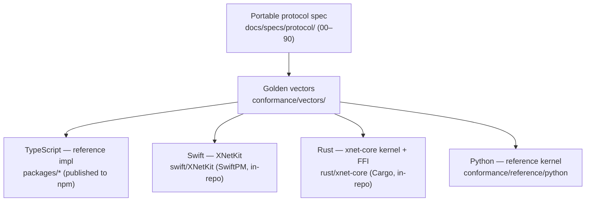
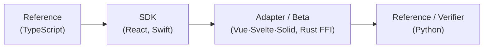
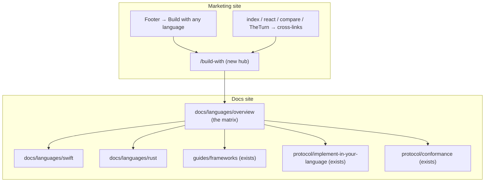
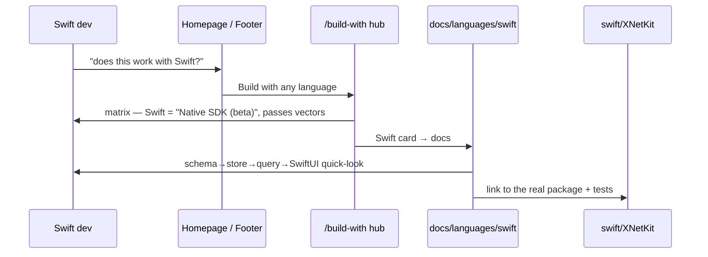

# Multi-Language And Multi-Framework Docs: A "Build With Anything" Surface

## Problem Statement

xNet now has real implementations in more than one language and binds to more
than one UI framework — but the documentation site and the marketing site barely
say so. The ask:

1. **Docs site** — add multi-framework / multi-language documentation, including
   **Rust** and **Swift** (which have real code), **Svelte/Vue/Solid** (the JS UI
   frameworks from [0237](0237_%5Bx%5D_VUE_SVELTE_AND_OTHER_FRAMEWORKS_WHAT_SUPPORT_ACTUALLY_COSTS.md)),
   and whatever else we actually support.
2. **Marketing site** — add a page that showcases all the languages/frameworks
   you can build xNet apps in.
3. **Footer** — add a link to that page (the "all the other frameworks we
   support" entry point).
4. **Cross-links** — sprinkle links to these pages where it makes sense across
   the site (homepage, the React page, Compare, the Protocol overview, …).

The trap to avoid: **overpromising.** "Support" spans a stable npm reference, a
native Swift SDK, a portable Rust kernel, a ~100-line Python verifier, and
demand-gated JS adapters. They are at wildly different maturity levels. The doc
must present an honest, layered matrix — not a logo wall implying every cell is
production-ready.

## Executive Summary

- **There are two different "multi-X" stories, and the site conflates / omits
  both.** They must be presented as distinct axes:
  - **Axis A — Languages (protocol interop).** TypeScript (reference),
    **Swift** ([`swift/XNetKit`](../../swift/XNetKit)), **Rust**
    ([`rust/xnet-core`](../../rust/xnet-core)), **Python**
    ([`conformance/reference/python`](../../conformance/reference/python)). These
    implement the **portable protocol** ([`docs/specs/protocol/`](../../docs/specs/protocol))
    and pass the **shared golden vectors** ([`conformance/vectors/`](../../conformance/vectors)).
  - **Axis B — JS UI frameworks (runtime binding).** React (first-class, incl.
    components), Vue / Svelte / Solid (data-binding only, demand-gated) — the
    [0237](0237_%5Bx%5D_VUE_SVELTE_AND_OTHER_FRAMEWORKS_WHAT_SUPPORT_ACTUALLY_COSTS.md)
    tier policy, already documented at
    [`guides/frameworks.mdx`](../../site/src/content/docs/docs/guides/frameworks.mdx).
- **The code is real and substantial, but invisible on the site.**
  `swift/XNetKit` is a native SwiftUI-binding SDK (schemas, `NodeStore`, query,
  `LiveQueryModel`, SQLite persistence); `rust/xnet-core` is a portable kernel +
  C/UniFFI binding surface that can back native SDKs; both pass `conformance/vectors`.
  Yet the **only** site mention is one sentence in a marketing component
  ([`TheTurn.astro:30`](../../site/src/components/followed/TheTurn.astro): "golden
  test vectors reproduced in Rust, Python and Swift"). No docs pages, no SDK
  landing, no footer link.
- **The docs already have the protocol-interop scaffolding** — "The Protocol"
  sidebar group includes [`implement-in-your-language.mdx`](../../site/src/content/docs/docs/protocol/implement-in-your-language.mdx)
  and [`conformance.mdx`](../../site/src/content/docs/docs/protocol/conformance.mdx).
  What's missing is **per-language SDK pages** (Swift, Rust) and a **hub** that
  ties languages + frameworks together.
- **The marketing site already has the pattern** — [`react.astro`](../../site/src/pages/react.astro)
  is a per-framework landing page (Base + Nav + `SectionHeader`/`CodeBlock`/`CodeTabs`
  + Footer). A `/build-with` hub page mirrors it.
- **Recommendation:** add a **"Languages & SDKs"** docs group (Overview matrix +
  Swift + Rust pages, reusing the existing implement-it/conformance/frameworks
  pages), a single **`/build-with` marketing hub** with a maturity-labeled matrix
  and per-language cards, **one footer link** ("Build with any language" → `/build-with`)
  plus two direct SDK links, and targeted cross-links from the homepage, React
  page, Compare, and Protocol overview. **Do not** spin up a separate marketing
  page per language yet — gate those on demand exactly like the JS adapters.
  Every page carries an explicit **maturity badge** so nothing is oversold.

One line: **surface what already exists — honestly tiered — through one docs group,
one marketing hub, one footer link, and a few cross-links; don't manufacture
support we don't have, and don't sprawl into per-language marketing pages before
there's demand.**

## Current State In The Repository

### Axis A — the languages that already exist



- **TypeScript** — the reference implementation; the full runtime/SDK published to
  npm (`@xnetjs/runtime`, `@xnetjs/react`, …). The source of truth the vectors are
  generated from ([`packages/runtime/src/conformance.test.ts`](../../packages/runtime/src/conformance.test.ts)).
- **Swift — [`swift/XNetKit`](../../swift/XNetKit)** — a *native* Swift SDK: define
  schemas in Swift, `NodeStore` with signed-change + LWW fold, `Query`,
  `LiveQueryModel` (`@Observable`, the SwiftUI analogue of `useQuery`), and
  `SQLiteChangeLog` persistence. Built on the conformance-pinned kernel; products
  include `xnet-demo` and `xnet-sync-demo`. Per the package note, the Yjs body +
  full live hub transport are scoped out of *this slice* (see
  [exploration 0210](0210_%5B_%5D_NATIVE_SWIFT_SDK_AND_PORTABLE_MULTI_LANGUAGE_CORE.md)).
- **Rust — [`rust/xnet-core`](../../rust/xnet-core)** — a portable interop kernel
  (L0/L1 identity + canonical-JSON BLAKE3 change hash + Ed25519 + LWW, plus L2/L3
  decision functions) with a C/UniFFI **binding surface** ([`src/ffi.rs`](../../rust/xnet-core/src/ffi.rs))
  meant to back the Swift/Kotlin/.NET SDKs. Uses *deterministic* RFC-8032 Ed25519,
  so it can **regenerate** golden vectors, not just verify them. `cargo test` runs
  the shared corpus.
- **Python — [`conformance/reference/python`](../../conformance/reference/python)**
  — a ~100-line kernel + `verify_vectors.py`. A *verifier / teaching reference*,
  not an app SDK.

Maturity is genuinely uneven — and the site says almost none of it.

### Axis B — the JS UI frameworks (already documented)

[0237](0237_%5Bx%5D_VUE_SVELTE_AND_OTHER_FRAMEWORKS_WHAT_SUPPORT_ACTUALLY_COSTS.md)
shipped the policy and the guide
([`guides/frameworks.mdx`](../../site/src/content/docs/docs/guides/frameworks.mdx)):
React (Tier 1, hooks **and** components), Vue/Svelte/Solid (Tier 2, data-binding
adapters, **demand-gated**), plus `runAdapterConformance` as the executable
contract. This axis is in good shape in docs; it just isn't *discoverable* from
marketing or cross-linked.

### The site surfaces that need to change

| Surface | File | Today |
| --- | --- | --- |
| Docs sidebar (single source) | [`site/src/sidebar.mjs`](../../site/src/sidebar.mjs) | "The Protocol" has implement-it + conformance; "Guides" has frameworks. No per-language SDK pages. |
| Docs: protocol interop | [`protocol/implement-in-your-language.mdx`](../../site/src/content/docs/docs/protocol/implement-in-your-language.mdx), [`protocol/conformance.mdx`](../../site/src/content/docs/docs/protocol/conformance.mdx) | Language-agnostic "build a 2nd impl"; references the Python kernel. No Swift/Rust SDK usage pages. |
| Docs: JS frameworks | [`guides/frameworks.mdx`](../../site/src/content/docs/docs/guides/frameworks.mdx) | Good; not cross-linked from marketing. |
| Marketing pages | [`site/src/pages/`](../../site/src/pages) (`react.astro`, `index.astro`, `compare.astro`, `why.astro`, …) | A per-framework page exists for **React only**. |
| Footer | [`components/sections/Footer.astro`](../../site/src/components/sections/Footer.astro) | "Develop" column → "xNet for React". No multi-language/-framework entry. |
| Existing claim | [`components/followed/TheTurn.astro:30`](../../site/src/components/followed/TheTurn.astro) | "golden test vectors reproduced in **Rust, Python and Swift**" — claim exists, links nowhere. |

The single-source sidebar invariant matters: the `build:llms` step fails if a
content file is listed in neither `sidebar.mjs` nor its exclusion list, so **every
new docs page must be added to `sidebar.mjs`** (learned in 0237; see also
[`scripts/build-llms-full.ts`](../../site/scripts/build-llms-full.ts)).

## External Research

- **Automerge is the closest prior art and the model to copy.** It is "built for
  JavaScript and Rust, with ports/bindings for Swift, Python, C, Java, and more,"
  and its docs site presents a **JS-first tutorial + per-language sections** rather
  than pretending all languages are equal. xNet's shape is nearly identical (TS
  reference + Rust kernel + Swift SDK + Python verifier), so a JS-first docs hub
  with clearly-labeled per-language pages is the proven pattern
  ([automerge.org](https://automerge.org/),
  [automerge GitHub](https://github.com/automerge/automerge)).
- **Local-first peers advertise language/framework reach as a top-level value.**
  ElectricSQL, Jazz, PowerSync, and Ditto all foreground "works with X, Y, Z" on
  their landing pages and keep a maturity/"experimental" label on the newer
  bindings. The directories (awesome-local-first, crdt.tech/implementations,
  lofi.so) are essentially language/framework matrices — discoverability is the
  product ([awesome-local-first](https://github.com/alexanderop/awesome-local-first),
  [crdt.tech implementations](https://crdt.tech/implementations),
  [lofi.so directory](https://lofi.so/directory/projects)).
- **Maturity honesty is a documented norm.** Automerge/others tag non-reference
  bindings "experimental" or pin a version; the credibility cost of a broken
  "supported" promise is high for a trust-led project. xNet's differentiator is
  *verifiability* (golden vectors), so the docs should **lead with conformance**
  ("these languages pass the same vectors") rather than feature-parity claims.

## Key Findings

| # | Finding | Evidence | Implication |
| - | --- | --- | --- |
| 1 | Real Swift + Rust + Python implementations exist, invisible on the site | [`swift/XNetKit`](../../swift/XNetKit), [`rust/xnet-core`](../../rust/xnet-core), [`conformance/reference/python`](../../conformance/reference/python) | add per-language docs + a hub; the content is *grounded*, not aspirational |
| 2 | Maturity is uneven (npm reference vs in-repo SDK vs kernel vs verifier) | package manifests; SwiftPM/Cargo, not published registries | every surface needs an explicit maturity badge |
| 3 | The protocol-interop docs scaffolding already exists | implement-it + conformance pages | extend, don't reinvent; per-language pages slot beside them |
| 4 | The JS-framework axis is already documented but not discoverable | [`guides/frameworks.mdx`](../../site/src/content/docs/docs/guides/frameworks.mdx) | cross-link it from the hub + marketing, don't rewrite it |
| 5 | The marketing page pattern is established (React) | [`react.astro`](../../site/src/pages/react.astro) | a `/build-with` hub is a known-shape page |
| 6 | Marketing already claims Rust/Python/Swift but links nowhere | [`TheTurn.astro:30`](../../site/src/components/followed/TheTurn.astro) | wire the existing claim to a real destination |
| 7 | New docs pages must be registered in the single-source sidebar | [`sidebar.mjs`](../../site/src/sidebar.mjs), `build:llms` gate | sidebar edit is part of every page add (or llms build fails) |
| 8 | Conformance/verifiability is the credible framing | [`conformance/vectors`](../../conformance/vectors), golden-vector tests | "same vectors pass" beats "fully supported" |

## Options And Tradeoffs

### A — Where do the per-language docs live?

| Option | Pros | Cons |
| --- | --- | --- |
| **A1. New "Languages & SDKs" sidebar group** (Overview matrix, Swift, Rust, + links to implement-it/conformance/frameworks) | one obvious home for "what can I build in?"; mirrors Automerge | one more top-level group |
| **A2. Fold per-language pages into "The Protocol"** | no new group; near conformance | buries SDK usage under protocol internals; protocol ≠ "use the Swift SDK" |
| **A3. Per-language pages scattered in Guides** | minimal structure | undiscoverable; no matrix |

**Lean: A1.** A dedicated group is how users shop for "can I use my language?"
Keep `implement-in-your-language` + `conformance` where they are (protocol) and
*link* to them from the new group's overview.

### B — Marketing: hub vs per-language pages

| Option | Pros | Cons |
| --- | --- | --- |
| **B1. One `/build-with` hub** (matrix + per-language cards → docs) | single page to maintain; honest matrix in one place; demand-gated deep pages | less SEO juice per language |
| **B2. A marketing page per language** (`/swift`, `/rust`, `/svelte`, mirroring `/react`) | strong per-language SEO; rich story each | N pages to keep truthful; most cells aren't mature enough to headline |
| **B3. Just expand the homepage** | least work | homepage already dense; no room for a matrix |

**Lean: B1 now, B2 on demand.** Ship the hub; promote a language to its own
landing page only when its SDK is mature enough to headline (today only React
clears that bar — and already has `/react`).

### C — Footer treatment

| Option | Pros | Cons |
| --- | --- | --- |
| **C1. One link in "Develop" → `/build-with`** + 2 direct (Swift, Rust) | matches the ask ("a link in the footer"); low churn | modest |
| **C2. New "SDKs" footer column** (TS, React, Swift, Rust, Frameworks) | most discoverable | footer grid is `lg:grid-cols-7`; needs layout change; risks logo-wall overpromise |

**Lean: C1.** The prompt asks for *a* link. Add "Build with any language" →
`/build-with` to the Develop column, plus direct "Swift SDK" and "Rust core"
links. Defer a full column unless the matrix grows.

### D — How to label maturity (the anti-overpromise lever)

A small, shared vocabulary used on every surface:



| Badge | Meaning | Applies to |
| --- | --- | --- |
| **Reference** | the canonical impl; vectors generated here | TypeScript |
| **Stable SDK** | first-class, app-ready | React |
| **Native SDK (beta)** | real, conformance-pinned, evolving | Swift (XNetKit) |
| **Core / FFI (beta)** | kernel + binding surface, not a full app SDK | Rust (xnet-core) |
| **Adapter (demand-gated)** | thin data binding, published on request | Vue, Svelte, Solid |
| **Reference kernel** | verifier / teaching impl | Python |

Leading with these badges is what keeps the matrix honest.

## Recommendation

Ship four things, all grounded in code that already exists, all maturity-labeled.



1. **Docs — new "Languages & SDKs" group** in `sidebar.mjs`:
   - `docs/languages/overview` — the **maturity matrix** (Axis A languages + Axis
     B frameworks), each row linking out. Leads with "all pass the same
     [golden vectors](/docs/protocol/conformance/)."
   - `docs/languages/swift` — XNetKit quick-look (schema → store → query →
     `LiveQueryModel`), install via SwiftPM, scope/status box, link to
     `swift/XNetKit`.
   - `docs/languages/rust` — xnet-core kernel + FFI, `cargo test` conformance,
     "backs native SDKs" framing, link to `rust/xnet-core`.
   - Reuse existing `guides/frameworks` (JS), `protocol/implement-in-your-language`
     (Python + any language), `protocol/conformance` — cross-linked, not copied.
2. **Marketing — one `/build-with` hub** (`site/src/pages/build-with.astro`),
   mirroring `react.astro`: hero "Build xNet apps in any language," the maturity
   matrix, per-language cards (TS, React, Swift, Rust, JS frameworks, Python) each
   linking into the docs group, and a "verifiable: same golden vectors" trust note.
3. **Footer** — add to the **Develop** column: "Build with any language" →
   `/build-with`; plus "Swift SDK" → `/docs/languages/swift/` and "Rust core" →
   `/docs/languages/rust/`.
4. **Cross-links** — homepage (a "use your language" strip), `react.astro` ("Not
   React? See every SDK → /build-with"), `compare.astro` (verifiability row →
   conformance), `protocol/overview` → languages overview, and wire the existing
   [`TheTurn.astro:30`](../../site/src/components/followed/TheTurn.astro)
   Rust/Python/Swift sentence to `/build-with`.

Sequence a Swift developer would experience:



## Example Code

### Docs sidebar — new group (`site/src/sidebar.mjs`)

```js
{
  label: 'Languages & SDKs',
  collapsed: true,
  items: [
    { slug: 'docs/languages/overview', label: 'Overview & matrix' },
    { slug: 'docs/guides/frameworks', label: 'JavaScript frameworks' }, // exists
    { slug: 'docs/languages/swift' },
    { slug: 'docs/languages/rust' },
    { slug: 'docs/protocol/implement-in-your-language', label: 'Any language' }, // exists
    { slug: 'docs/protocol/conformance', label: 'Conformance vectors' }      // exists
  ]
}
```

(Slugs already present elsewhere can appear in two groups, or be referenced via
the overview page's links — confirm the `build:llms` "every file listed once"
expectation; if it requires uniqueness, link rather than re-list.)

### Footer — `developLinks` (`site/src/components/sections/Footer.astro`)

```js
const developLinks = [
  { label: 'XNet for React', href: '/react' },
  { label: 'Build with any language', href: '/build-with' }, // NEW — the ask
  { label: 'Swift SDK', href: '/docs/languages/swift/' },     // NEW
  { label: 'Rust core', href: '/docs/languages/rust/' },      // NEW
  { label: 'DevTools', href: '/devtool' },
  { label: 'React Hooks', href: '/docs/hooks/overview/' },
  { label: 'Your own server', href: '/docs/guides/server/' },
]
```

### Marketing hub skeleton (`site/src/pages/build-with.astro`)

```astro
---
import Base from '../layouts/Base.astro'
import Nav from '../components/sections/Nav.astro'
import Footer from '../components/sections/Footer.astro'
import SectionHeader from '../components/ui/SectionHeader.astro'
import CodeTabs from '../components/ui/CodeTabs.astro'

const matrix = [
  { name: 'TypeScript', badge: 'Reference', href: '/docs/quickstart/' },
  { name: 'React',      badge: 'Stable SDK', href: '/react' },
  { name: 'Swift',      badge: 'Native SDK · beta', href: '/docs/languages/swift/' },
  { name: 'Rust',       badge: 'Core · beta', href: '/docs/languages/rust/' },
  { name: 'Vue / Svelte / Solid', badge: 'Adapter · on demand', href: '/docs/guides/frameworks/' },
  { name: 'Python',     badge: 'Reference kernel', href: '/docs/protocol/implement-in-your-language/' },
]
---
<Base title="Build xNet apps in any language" description="React, Swift, Rust, Vue, Svelte — one protocol, verified by the same golden vectors.">
  <Nav />
  <SectionHeader title="One protocol. Your language."
    subtitle="Every implementation passes the same golden vectors — you don't have to trust us, you can check." />
  <!-- matrix.map(...) → cards with name + maturity badge + link -->
  <!-- CodeTabs: TS / Swift / Rust 'create a Task' side by side -->
  <Footer />
</Base>
```

### Swift docs page — grounded quick-look (`docs/languages/swift.mdx`)

```swift
import XNetKit

let me = Identity()                       // Ed25519 did:key
let Task = Schema(name: "Task", namespace: "xnet://xnet.fyi/") {
  text("title", required: true); select("status", options: ["todo","done"], default: "todo")
}
let store = NodeStore(identity: me, persistence: SQLiteChangeLog(path: dbPath))
let t = store.create(Task, ["title": "Ship docs"])
store.update(t.id, ["status": "done"])
let open = store.query(Query(Task, where: .equals("status","todo")))
// LiveQueryModel is @Observable — the SwiftUI analogue of useQuery.
```

## Risks And Open Questions

- **Overpromising maturity.** The dominant risk. Mitigation: maturity badge on
  every row/page; lead with "passes the same golden vectors" (true, verifiable)
  not "fully supported"; explicit scope boxes (e.g., Swift's Yjs/live-sync caveat
  from `Package.swift`).
- **Docs drift from code.** Per-language pages can rot as `swift/XNetKit` /
  `rust/xnet-core` evolve. Mitigation: keep pages thin (quick-look + link to the
  real package/tests as the source of truth); consider a doctest/snippet-extraction
  follow-up; the conformance suite already guards the *behavior*.
- **Published vs in-repo.** Swift (SwiftPM) and Rust (Cargo) are **in-repo, not on
  registries**; only TS is on npm. Install instructions must say "add the package
  from the repo / path" honestly, and an open question is whether to publish
  XNetKit / `xnet-core` to SwiftPM index / crates.io (separate decision).
- **Sidebar single-listing.** `build:llms` expects each content file accounted
  for; re-listing an existing slug in a second group may need link-instead-of-list.
  Verify against [`build-llms-full.ts`](../../site/scripts/build-llms-full.ts).
- **Footer grid.** Adding links keeps the existing `lg:grid-cols-7`; a *new
  column* would require layout work — out of scope for "a link."
- **Don't resurrect demand-gated sprawl.** Per-language *marketing* pages and the
  Vue/Svelte/Solid *packages* stay demand-gated (0237). This exploration adds
  **docs + one hub + links**, not new published SDKs.
- **Kotlin/.NET.** `rust/xnet-core`'s FFI is designed to back them, but they don't
  exist yet — the matrix should show them only as "planned," if at all.

## Implementation Checklist

Docs:

- [x] Add a **"Languages & SDKs"** group to `site/src/sidebar.mjs` (overview,
      frameworks*, swift, rust, implement-it*, conformance* — `*` = existing).
- [x] `docs/languages/overview.mdx` — the maturity matrix (Axis A + Axis B), each
      row linking out; lead with golden-vector verifiability.
- [x] `docs/languages/swift.mdx` — XNetKit quick-look + SwiftPM install + scope box
      + link to [`swift/XNetKit`](../../swift/XNetKit).
- [x] `docs/languages/rust.mdx` — xnet-core kernel + FFI + `cargo test` conformance
      + "backs native SDKs" + link to [`rust/xnet-core`](../../rust/xnet-core).
- [x] Add a maturity-badge legend (shared snippet/section) and apply it on each page.
- [x] Cross-link `protocol/overview` and `guides/frameworks` to the new overview.
- [x] Run `pnpm --filter site build:llms` — passes with the new pages listed.

Marketing:

- [x] `site/src/pages/build-with.astro` — hub mirroring `react.astro` (matrix +
      per-language cards + TS/Swift/Rust code tabs + verifiability note).
- [x] Footer: add "Build with any language" (+ "Swift SDK", "Rust core") to
      `developLinks`.
- [x] Cross-links: homepage strip; `react.astro` "Not React? →"; `compare.astro`
      verifiability row; wire `TheTurn.astro` Rust/Python/Swift sentence to `/build-with`.
- [x] Add `/build-with` to the marketing nav if appropriate (or leave footer-only).

Out of scope (demand-gated / separate decisions):

- Publishing XNetKit to SwiftPM index / `xnet-core` to crates.io.
- Per-language marketing landing pages (`/swift`, `/rust`, `/svelte`).
- Publishing the Vue/Svelte/Solid adapter packages.

## Validation Checklist

- [x] `pnpm --filter site build:llms` succeeds (no "content not listed" error) and
      the new pages appear in `llms-full.txt`.
- [x] `pnpm --filter site build` (astro build) succeeds; `/build-with` renders.
- [x] Every language/framework row shows a **maturity badge**; no cell is labeled
      "supported" without qualification.
- [x] Each per-language page links to the **real** package (`swift/XNetKit`,
      `rust/xnet-core`) and to the **conformance** page.
- [x] The footer "Build with any language" link resolves to `/build-with`.
- [x] Cross-links resolve (homepage, react, compare, protocol overview, TheTurn).
- [x] The Swift and Rust code snippets in docs match the real APIs (compile/`cargo
      test` / `swift build` as a spot check, or are copied from passing tests).
- [x] No claim contradicts a package's stated scope (e.g., Swift Yjs/live-sync
      caveat preserved).
- [x] Internal link check / existing site link validation passes in CI.

## References

- Code (Axis A): [`swift/XNetKit`](../../swift/XNetKit),
  [`rust/xnet-core`](../../rust/xnet-core),
  [`conformance/reference/python`](../../conformance/reference/python),
  [`conformance/vectors`](../../conformance/vectors),
  [`docs/specs/protocol`](../../docs/specs/protocol)
- Docs (existing): [`protocol/implement-in-your-language.mdx`](../../site/src/content/docs/docs/protocol/implement-in-your-language.mdx),
  [`protocol/conformance.mdx`](../../site/src/content/docs/docs/protocol/conformance.mdx),
  [`guides/frameworks.mdx`](../../site/src/content/docs/docs/guides/frameworks.mdx),
  [`sidebar.mjs`](../../site/src/sidebar.mjs),
  [`build-llms-full.ts`](../../site/scripts/build-llms-full.ts)
- Marketing: [`pages/react.astro`](../../site/src/pages/react.astro),
  [`pages/index.astro`](../../site/src/pages/index.astro),
  [`pages/compare.astro`](../../site/src/pages/compare.astro),
  [`components/sections/Footer.astro`](../../site/src/components/sections/Footer.astro),
  [`components/followed/TheTurn.astro`](../../site/src/components/followed/TheTurn.astro)
- Companion explorations:
  [0237 framework support tiers](0237_%5Bx%5D_VUE_SVELTE_AND_OTHER_FRAMEWORKS_WHAT_SUPPORT_ACTUALLY_COSTS.md),
  [0210 native Swift SDK + portable multi-language core](0210_%5B_%5D_NATIVE_SWIFT_SDK_AND_PORTABLE_MULTI_LANGUAGE_CORE.md),
  [0186 multi-framework & deployment targets](0186_%5B_%5D_MULTI_FRAMEWORK_AND_DEPLOYMENT_TARGETS.md),
  [0200 portable protocol boundaries & standard](0200_%5Bx%5D_PORTABLE_XNET_PROTOCOL_BOUNDARIES_AND_STANDARD.md)
- External: [Automerge](https://automerge.org/),
  [Automerge GitHub](https://github.com/automerge/automerge),
  [awesome-local-first](https://github.com/alexanderop/awesome-local-first),
  [crdt.tech implementations](https://crdt.tech/implementations),
  [lofi.so directory](https://lofi.so/directory/projects)
