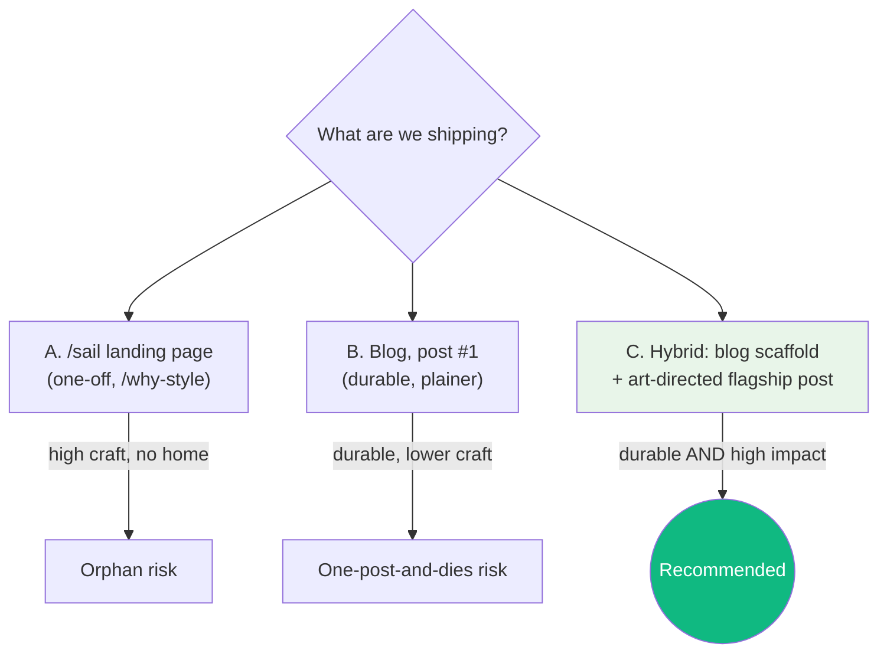
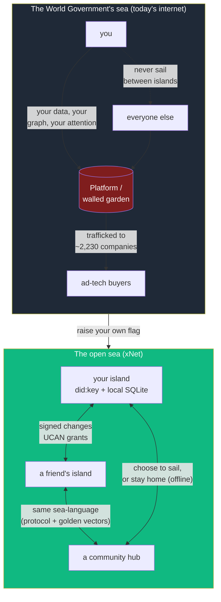
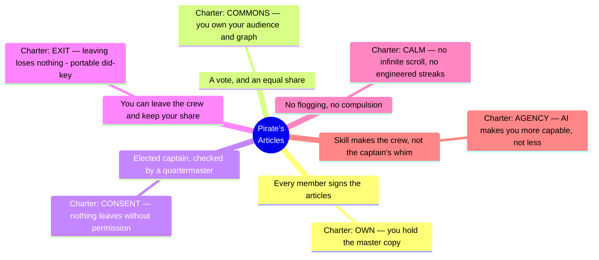
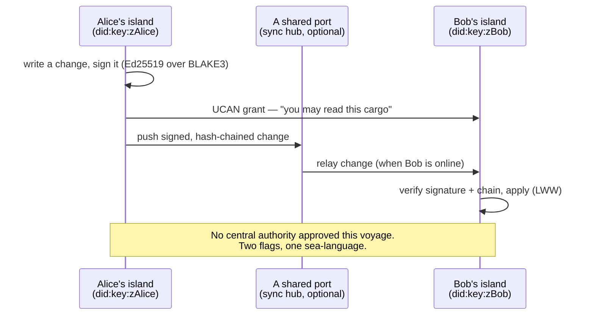

# A Great Pirate Age — One Piece, the Ethos of Piracy, and the Case for xNet

> _"I don't wanna conquer anything. I just think the guy with the most
> freedom in this whole ocean is the Pirate King."_ — Monkey D. Luffy,
> One Piece, Ch. 507

## Problem Statement

The user wants a **blog post / landing page** that draws out the deep
resonance between xNet and _One Piece_ — Eiichiro Oda's "Great Pirate Age": a
world of scattered, hard-to-reach islands; a World Government that monopolizes
information, power, and resources; ordinary people who never sail beyond their
home island and never meet anyone unlike themselves; and the few who develop
their own inner strength to live by their own rules — some villains, some
heroes, all _ungoverned_.

The brief asks three things of the piece:

1. **Map the metaphor honestly** — One Piece's world and the real Golden Age of
   Piracy onto xNet's architecture and ethos, without romanticizing either.
2. **Answer the human question** — what drove people to piracy then, what drives
   someone to xNet now, and how do we point at the _heroic_ kind of defiance
   (Luffy's freedom-not-domination) rather than the predatory kind?
3. **Decide the vessel** — there is no blog today. Should this be a one-off
   art-directed landing page (like the existing `/why` page), the inaugural post
   of a new blog, or both?

This exploration grounds the narrative in the repo's _actual_ values and code so
the post is true, not just evocative — and specs the smallest real blog we could
ship to house it.

## Executive Summary

- **The metaphor is unusually exact**, and we should use it. xNet's literal
  architecture — a **signed, hash‑chained change log** where every change is
  signed by your own key — _is_ a captain keeping a ship's log under their own
  flag. The protocol's golden-vector conformance corpus _is_ the shared sea-lane
  that lets independent islands sail to each other. The `/why` page's thesis
  ("you are what's being trafficked") _is_ the inversion that makes piracy the
  honest choice: in today's internet, **you are the cargo**, and raising your own
  flag is how you stop being plundered.
- **Be honest about real pirates** — they were not all heroes. They were mostly
  former merchant sailors and Navy men fleeing lethal conditions, plus a large
  share of escaped enslaved people; aboard, many ran radically **egalitarian
  democracies** (elected captains, written articles, equal shares). But they also
  still trafficked and sold human beings. The post should borrow the
  _self-governance and freedom-from-extraction_, and explicitly **not** the
  plunder — exactly the honesty discipline the `/why` page's "Honesty Box"
  already models.
- **Lead with Luffy, not Blackbeard.** Decentralization is value-neutral: it
  frees dissidents and bad actors alike. xNet's answer is not a World Government
  that decides for everyone, but **tools to choose your own waters** (opt-in
  labelers, subjective moderation, provenance/trust — the 0177 discovery & safety
  work). The hero we align with wants freedom and wants his friends' dreams to
  come true — which is precisely the **Commons** and **Calm** commitments of the
  Charter.
- **Recommended vessel: start a small blog, and make this the flagship post** —
  but ship it as an _essay that references_ One Piece as cultural criticism, not a
  product re-skinned in someone else's trademarked IP. Use original art and the
  generic "Great Pirate Age" framing; reference Oda's work the way an essay
  references a film. (See [Risks](#risks-and-open-questions).)

## Current State In The Repository

### There is no blog — but there is a proven template for this exact tone

The marketing site is Astro 5 + Starlight + Tailwind
([`site/astro.config.mjs`](../../site/astro.config.mjs)). Marketing pages are
flat `.astro` files under [`site/src/pages/`](../../site/src/pages/) (index, why,
compare, build-with, open, status, plugins, react, cloud, …). **No `blog/`
route and no `blog` content collection exist yet.** The only content collection
is docs ([`site/src/content/docs/`](../../site/src/content/docs/)); the changelog
is a hand-rolled data collection rendered at
[`site/src/pages/changelog/`](../../site/src/pages/changelog/).

The closest existing artifact to what we want is **"The Followed"** — the
surveillance-reckoning landing page from
[exploration 0234](./0234_[x]_THE_FOLLOWED_A_SURVEILLANCE_RECKONING_LANDING_PAGE.md):

- **Live page:** [`site/src/pages/why.astro`](../../site/src/pages/why.astro)
- **Sourced claims (every stat cited):**
  [`site/src/data/surveillance.ts`](../../site/src/data/surveillance.ts)
- **Build-time validator:**
  [`site/scripts/validate-surveillance.ts`](../../site/scripts/validate-surveillance.ts)
- **Components:** [`site/src/components/followed/`](../../site/src/components/followed/)

Its structure (Act I physical re-enactment → the hinge "you did it today, ~2,230×"
→ mechanism grid → "The Turn" to xNet → **Honesty Box** of what xNet is/isn't →
self-audit "this page: 0 cookies, 0 trackers") is the dramaturgy our pirate post
should echo. Headline copy already in the repo:

- Homepage hero: **"Your data. Your devices. Your rules."**
  ([`site/src/components/sections/Hero.astro`](../../site/src/components/sections/Hero.astro))
- `/why` title: **"Why xNet — you'd never allow this in the real world."**

### The Charter is already a pirate's articles

[`docs/CHARTER.md`](../../docs/CHARTER.md) — the "Humane Internet Charter" — reads,
structurally, like a **pirate ship's written articles**: a short list of binding
commitments the crew agrees to, each with a _receipt_. Verbatim:

> The test we hold ourselves to is the historical Luddites' own definition: we
> refuse to ship _"machinery hurtful to commonality"_ — technology deployed to
> deskill, surveil, or concentrate power.

The six commitments — **Own, Exit, Calm, Consent, Agency, Commons** — map almost
one-to-one onto the pirate articles (below). Two are worth quoting now:

- **Exit:** _"You can take everything and go. Identity is a portable `did:key`
  that works on any hub; the wire format is an open, signed, hash‑chained change
  log, not a vendor blob; the client works fully offline with no hub at all."_
- **Commons:** _"Your social graph and your audience belong to you, not to a
  platform that rents them back. Hubs are user‑ownable and federated."_

The Charter is enforced, not just declared:
[`scripts/check-humane-patterns.mjs`](../../scripts/check-humane-patterns.mjs) is a
CI gate that **bans** behavioral-surplus SDKs (`google-analytics`, `fbevents`,
`mixpanel`, `@segment/`, …) and dark-pattern primitives (`infinite-scroll`,
`streakCount`, `confirmshaming`). The "we don't build the machinery of
compulsion" promise is a build failure if violated. That is our "we sail by our
own articles, and here's the proof."

### The architecture literally is a captain's log under your own flag

From the protocol spec ([`docs/specs/protocol/`](../../docs/specs/protocol/)) and
the package graph:

| Pirate primitive                         | xNet reality                                                                                                        | Code                                                                                                                         |
| ---------------------------------------- | ------------------------------------------------------------------------------------------------------------------- | ---------------------------------------------------------------------------------------------------------------------------- |
| Your own flag (Jolly Roger)              | A self-generated `did:key` (Ed25519); no registry, no central authority issues it                                   | [`packages/identity/src/keys.ts`](../../packages/identity/src/keys.ts)                                                       |
| Signing the ship's log with your mark    | Every `Change<T>` is an Ed25519 signature over a BLAKE3 hash, chained to its parent                                 | [`packages/sync/src/change.ts`](../../packages/sync/src/change.ts)                                                           |
| A log that can't be quietly rewritten    | Hash-chained, append-only; old entries stay cryptographically verifiable even after you leave                       | `packages/sync`                                                                                                              |
| Sailing alone, no home port required     | Local-first SQLite over OPFS is the _primary_ copy; works fully offline                                             | [`packages/data/src/store/store.ts`](../../packages/data/src/store/store.ts)                                                 |
| Choosing which port to dock at           | BYO sync hub — self-host, managed, or none                                                                          | [`packages/hub/src/cli.ts`](../../packages/hub/src/cli.ts)                                                                   |
| A shared sea-language between crews      | One normative protocol + a language-agnostic **golden-vector** conformance corpus (TS, Rust, Swift, Python kernels) | [`conformance/`](../../conformance/), [`docs/specs/protocol/90-conformance.md`](../../docs/specs/protocol/90-conformance.md) |
| Letters of marque / shared treasure maps | UCAN capability grants — you sign permission for another island to see specific cargo                               | `packages/identity` (UCAN)                                                                                                   |

The VISION's own metaphors are already in this register — the mycelial-network /
"data should work like soil" passage in
[`site/src/components/sections/TheVision.astro`](../../site/src/components/sections/TheVision.astro),
and the "walled gardens → federated, interoperable" table in
[`docs/VISION.md`](../../docs/VISION.md). One Piece's "disparate islands" is the
same idea with masts.

### Adjacent ethos work the post can lean on

- **Cozy / Calm / agent-first** ([0232](./0232_[_]_COZY_CALM_AND_AGENT_FIRST_A_DELIGHTFUL_PLACE_TO_SPEND_THE_DAY.md)) —
  "a delightful place to spend the day." This is the _party-with-everyone_,
  Thousand-Sunny-as-home register of Luffy's crew, not the grim-cyberpunk one.
- **Discovery & safety milestones**
  ([0177](./0177_[_]_DISCOVERY_AND_SAFETY_REMAINING_WORK_PLAN.md)) — blocklist / labeler /
  ranking / explainer. This is our honest answer to "decentralization frees
  villains too": choose your own waters, don't appoint a World Government.
- **Commitments page** ([`site/src/pages/commitments.astro`](../../site/src/pages/commitments.astro),
  data in [`site/src/data/commitments.ts`](../../site/src/data/commitments.ts)) —
  the rendered Charter; a natural "ship's articles" link target from the post.

## External Research

### One Piece — what the "Great Pirate Age" actually means

- The era is sparked by a **single act of disclosure**: the World Government
  executes Gol D. Roger to deter piracy, but his final words — that his treasure
  is out there for anyone bold enough to find it — do the opposite, sending
  countless people to sea. _The control move backfires; openness wins._
- The **Will of "D."** is, thematically, a thread of inherited defiance against a
  power that **erased history** — the "Void Century" the World Government
  scrubbed from the record (and the destruction of the scholars of Ohara for
  trying to read it). The story's deepest villainy is _information control and the
  deletion of inconvenient truth_, not swordfights.
- **Luffy's dream is not conquest.** In Ch. 507 he tells the world he doesn't want
  to rule, tax, or command — "the guy with the most freedom in this whole ocean
  is the Pirate King." Oda frames Luffy as the embodiment of a childlike freedom
  everyone quietly craves. The crew's purpose is to help each member reach their
  _own_ dream and to throw a good party doing it.

Sources: [One Piece Wiki — Gol D. Roger](https://onepiece.fandom.com/wiki/Gol_D._Roger),
[Game Rant — The Great Pirate Era, Explained](https://gamerant.com/one-piece-the-great-pirate-era-explained/),
[Screen Rant — Luffy's REAL dream](https://screenrant.com/one-piece-1060-luffy-dream-not-pirate-king/),
[Game Rant — What it means to be King of the Pirates](https://gamerant.com/one-piece-what-mean-king-of-the-pirates/).

### Real pirates — who they were, and the honest nuance

This is the part the brief specifically asks about, and the truth is more
interesting than the myth:

- **Who they were:** mostly former merchant sailors and Royal Navy men fleeing
  conditions that were, by the numbers, lethal — wage-cutting, floggings, and
  mortality rates rivaling the slave ships. When pirates took a merchantman, part
  of its crew often _volunteered_ to join. Naval sailors deserted to "serve under
  the black flag." A large share were **escaped enslaved people** — by some
  estimates up to a third of the ~10,000 Golden Age pirates — and on some ships
  they could vote, bear arms, and take an equal share.
- **How they governed themselves:** the radical part. Crews **elected** their
  captain and a quartermaster whose job was to _check_ the captain; they wrote
  **articles** (a constitution) that every member signed; they split plunder
  near-equally and even ran a rough workers'-compensation scheme. Historian
  Marcus Rediker calls it _"one of the most egalitarian plans for the disposition
  of resources to be found anywhere in the early eighteenth century."_
- **The nuance — not heroes:** the same crews frequently still **trafficked and
  sold** enslaved people; freeing them was the exception, not the rule. Piracy
  was a genuinely freer and more egalitarian order _for its members_, built in
  defiance of an extractive empire — and it was also violent and complicit. Both
  are true. **We borrow the self-governance, not the plunder.**

Sources: [Royal Museums Greenwich — Golden Age of Piracy](https://www.rmg.co.uk/stories/maritime-history/pirates-history-golden-age-piracy),
[HNN — 5 Ways Pirate Ships Functioned as a True Democracy](https://www.historynewsnetwork.org/article/5-ways-pirate-ships-functioned-as-a-true-democracy),
[Marcus Rediker, _Villains of All Nations_](https://archive.org/details/villainsofallnat0000redi),
[Golden Age of Piracy — Pirates and Slavery](https://goldenageofpiracy.org/culture/pirates-and-slavery).

### The inversion that makes the metaphor honest

The post's sharpest move comes free from the existing `/why` page: the modern
"World Government" (ad-tech / surveillance capitalism) doesn't just hoard the
treasure — **it traffics in _you_.** The `/why` data module documents ~2,230
companies reporting an average person's data to a single platform over three
years, ~99% browser-fingerprint identifiability, and a ~$140B retail-media
apparatus ([`site/src/data/surveillance.ts`](../../site/src/data/surveillance.ts)).
So the figure-ground flips: the "respectable" merchant order is the one built on
plunder, and **raising your own flag is how you stop being the cargo.** Choosing
xNet is not theft — it is _refusing to be stolen from_.

## Key Findings

1. **The metaphor is load-bearing, not decorative.** "Sign your own log,"
   "choose your own port," "a shared sea-language between independent islands,"
   and "you are the cargo" are all _literal_ descriptions of the codebase, not
   stretched analogies.
2. **Honesty is the brand.** The repo's distinctive voice (Charter receipts,
   `/why` Honesty Box, "a commitment with no receipt is just marketing") demands
   the post refuse to romanticize pirates. That refusal is itself the most
   on-brand thing about it.
3. **Luffy is the correct protagonist** because his dream is freedom + enabling
   others' dreams, which is exactly Commons + Calm + the cozy ethos — and it
   sidesteps the "decentralization empowers villains" trap by being about
   _self-determination_, not domination.
4. **The honest counter-argument must be answered, not hidden:** an ungoverned
   sea has pirates of both kinds. xNet's answer is choose-your-own-waters
   (labelers, provenance, subjective moderation), and the post is stronger for
   stating it plainly.
5. **The vessel question has a clean answer:** marketing pages live in
   `site/src/pages/` and are _not_ subject to the docs `sidebar.mjs` + `build:llms`
   gate (that gate is docs-only). A blog as `site/src/pages/blog/` + a `blog`
   content collection mirrors the existing changelog pattern and is low-risk.

## Options And Tradeoffs

### A. One-off art-directed landing page (`/sail` or `/grand-line`)

Clone the `/why` playbook: a single, scrolly, art-directed page. **Pro:**
highest craft ceiling; matches a proven format; no new infra. **Con:** no home
for a _second_ idea; the user explicitly floated "maybe start a blog"; a one-off
essay-as-landing-page can feel like an orphan.

### B. Start a real blog; this is post #1

New `blog` content collection + index + RSS, reusing changelog conventions.
**Pro:** gives the project a durable voice surface; the pirate essay is a strong
opener; cheap to extend. **Con:** more surface to design (index card layout, post
layout, RSS); risk of a blog that gets one post and dies.

### C. Hybrid (recommended): minimal blog scaffold + a flagship post with a few art-directed components

Ship the smallest credible blog (collection + index + post layout + RSS), and
make the pirate piece the flagship — an MDX post that can embed 2–3 bespoke
components (a hero, the mapping table as a styled component, an Honesty Box)
without the full `/why` production budget. **Pro:** durable home _and_ a
high-impact debut; reuses changelog patterns; leaves a clean path for future
posts. **Con:** slightly more than A; needs a content schema decision.



### Naming / framing options

| Title direction                       | Vibe                  | Note                                |
| ------------------------------------- | --------------------- | ----------------------------------- |
| "A Great Pirate Age for the Internet" | Confident, generic    | Safest re: IP; reads as essay       |
| "You Are the Cargo"                   | Sharp, `/why`-aligned | Strong, ties to surveillance thesis |
| "Raise Your Own Flag"                 | CTA-ish, ownership    | Good section/CTA header             |
| "Why We Sail"                         | Warm, manifesto       | Pairs with the Charter              |

## Recommendation

**Ship Option C.** Start a small blog and make this the flagship essay, framed
as **"A Great Pirate Age for the Internet"** (with "You Are the Cargo" as the
turn). Treat One Piece as the essay's _lens_ — quoted and credited as cultural
criticism — not as product branding. Concretely:

1. **Narrative spine** (mirrors `/why`'s dramaturgy):
   - _Hook_ — the Great Pirate Age begins with an act of openness backfiring on a
     power that tried to suppress it (Roger's words). The internet's local-first
     moment is the same shape.
   - _The two seas_ — the World Government's controlled, siloed sea (you never
     leave your island; you never meet anyone unlike you — the filter bubble) vs.
     the open sea of federated islands that _can_ choose to sail to each other.
   - _Who the pirates really were_ — the honest history. Self-governance, not
     plunder. (This is the credibility beat — the post's Honesty Box-in-prose.)
   - _The inversion_ — today you are the cargo (cite `/why`). Piracy here means
     refusing to be trafficked.
   - _Sign your own log_ — the architecture beat: your flag (`did:key`), your
     signed log (`Change<T>`), your choice of port (BYO hub), the shared
     sea-language (the protocol + conformance corpus).
   - _Which pirate to be_ — Luffy, not Blackbeard. Freedom and friends' dreams,
     not domination. Tie to **Commons / Calm / Cozy** and to the choose-your-own-
     waters safety stance.
   - _Raise your own flag_ — CTA to the app, the Charter/commitments, build-with.
2. **Vessel** — minimal `blog` content collection (`title`, `description`,
   `pubDate`, `tags`, optional `hero`), `site/src/pages/blog/index.astro`,
   `site/src/pages/blog/[...slug].astro`, and a `blog/rss.xml.ts`. Link from the
   footer nav.
3. **IP discipline** — original art only (lean on the existing cosmic-X brand);
   no One Piece logos/character art; quotes attributed; a one-line "not affiliated
   with or endorsed by the creators of One Piece" footer note.

## Example Code

### The two seas (diagram for the post)



### The pirate articles → the Charter (the mapping the post is built on)



### Sailing between islands (what "federation" actually is)



### Minimal blog content collection (the vessel)

```ts
// site/src/content.config.ts  (add a `blog` collection)
import { defineCollection, z } from 'astro:content'

const blog = defineCollection({
  type: 'content',
  schema: z.object({
    title: z.string(),
    description: z.string(),
    pubDate: z.coerce.date(),
    tags: z.array(z.string()).default([]),
    hero: z.string().optional(), // path to original art in /public
    draft: z.boolean().default(false)
  })
})

export const collections = { /* …existing docs…, */ blog }
```

```astro
---
// site/src/pages/blog/[...slug].astro
import { getCollection } from 'astro:content'
import BaseLayout from '../../layouts/BaseLayout.astro'

export async function getStaticPaths() {
  const posts = await getCollection('blog', (p) => !p.data.draft)
  return posts.map((post) => ({ params: { slug: post.slug }, props: { post } }))
}
const { post } = Astro.props
const { Content } = await post.render()
---
<BaseLayout title={post.data.title} description={post.data.description}>
  <article class="prose mx-auto max-w-2xl px-4 py-16">
    <h1>{post.data.title}</h1>
    <Content />
  </article>
</BaseLayout>
```

## Risks And Open Questions

- **Intellectual-property risk (most important).** _One Piece_ and its
  characters/logos are Toei/Shueisha trademarks. Writing an **essay that
  references and quotes** the work as cultural criticism is ordinary commentary;
  **branding the product** around it (One Piece art, character likenesses, the
  logo, implying endorsement) is not. Mitigation: original art only; brief,
  attributed quotes; a "not affiliated / not endorsed" disclaimer; keep the
  product-facing title generic ("A Great Pirate Age for the Internet"). _Open
  question:_ does the user want a legal skim before publishing? Recommended: yes,
  a quick one, given it's public marketing.
- **Romanticization risk.** If the honest-history beat is cut for length, the
  post whitewashes real cruelty and undercuts the brand's credibility. The
  honesty beat is **load-bearing**, not optional.
- **"Decentralization frees villains too."** A real objection; answer it in-line
  (choose-your-own-waters: labelers/provenance/subjective moderation, the 0177
  work) rather than dodging.
- **Tone calibration.** The cozy/calm direction (0232) says _warm_, not
  grimdark-cyberpunk. Pirate ≠ edgelord. The register is Thousand-Sunny-with-
  friends, not skull-and-crossbones menace.
- **Blog scope creep.** A blog implies a cadence. _Open question:_ is the user
  committing to ongoing posts, or is this a one-and-maybe-more? Option C is
  designed to be cheap if it stays at one post.
- **Audience fit.** Does the One Piece lens land with the developer/sovereignty
  audience, or narrow it? Mitigation: the essay stands on its own for readers who
  don't know the anime (the real-pirate history and the surveillance inversion
  carry it); the One Piece references are a bonus layer, not a prerequisite.

## Implementation Checklist

- [ ] Decide vessel with the user: confirm **Option C** (blog + flagship post)
      vs. A (one-off landing page).
- [ ] Confirm the IP framing and get a quick legal skim sign-off before publish.
- [x] Add a `blog` content collection to
      [`site/src/content.config.ts`](../../site/src/content.config.ts) (schema
      above).
- [x] Create `site/src/pages/blog/index.astro` (card list, newest first) and
      `site/src/pages/blog/[...slug].astro` (post layout).
- [x] Add `site/src/pages/blog/rss.xml.ts` (reuse the changelog RSS pattern in
      [`site/src/pages/changelog.xml.ts`](../../site/src/pages/changelog.xml.ts)).
- [x] Add a **Blog** link to the footer/nav
      ([`site/src/components/sections/Footer.astro`](../../site/src/components/sections/Footer.astro)).
- [ ] Write the flagship MDX post following the seven-beat spine in
      [Recommendation](#recommendation).
- [ ] Build 2–3 lightweight components: a hero, a styled "pirate articles →
      Charter" mapping, and an in-prose **Honesty Box** (reuse `/why` component
      idioms from [`site/src/components/followed/`](../../site/src/components/followed/)).
- [ ] Source/commission **original** hero art (lean on the cosmic-X brand
      assets); no third-party IP.
- [ ] Cross-link the post to `/why`, `/commitments`, and `/build-with`.
- [ ] Add a "not affiliated with / not endorsed by the creators of One Piece"
      footer note on the post.

## Validation Checklist

- [ ] `pnpm --filter site build` succeeds; `/blog` and the post route render.
- [ ] RSS validates (`/blog/rss.xml` well-formed; items have title/link/pubDate).
- [ ] Self-audit parity with `/why`: the post page ships **0 third-party
      trackers / 0 ad SDKs** (the humane-patterns gate already enforces this
      repo-wide).
- [ ] Every factual claim in the post is cited (pirate history, surveillance
      stats, One Piece references) — apply the `/why` "every claim sourced"
      discipline; consider a `site/src/data/pirates.ts` claims module if stats
      grow.
- [ ] Honest-history beat is present and not cut: the post explicitly declines to
      paint real pirates as pure heroes.
- [ ] Mobile + dark-mode pass (the site's existing responsive checks).
- [ ] A reader who has never seen One Piece still understands and is moved by the
      essay (test with one such reader).
- [ ] Legal/IP sign-off recorded before publish.

## References

### Repository

- [`docs/CHARTER.md`](../../docs/CHARTER.md) — the six commitments (the "articles")
- [`docs/VISION.md`](../../docs/VISION.md) — walled gardens → federated; mycelium/soil
- [`site/src/pages/why.astro`](../../site/src/pages/why.astro) +
  [`site/src/data/surveillance.ts`](../../site/src/data/surveillance.ts) — "The Followed"
- [`scripts/check-humane-patterns.mjs`](../../scripts/check-humane-patterns.mjs) — the enforced no-surplus gate
- [`packages/identity/src/keys.ts`](../../packages/identity/src/keys.ts) — your flag (`did:key`)
- [`packages/sync/src/change.ts`](../../packages/sync/src/change.ts) — your signed, hash-chained log
- [`packages/hub/src/cli.ts`](../../packages/hub/src/cli.ts) — choose your own port
- [`docs/specs/protocol/`](../../docs/specs/protocol/) + [`conformance/`](../../conformance/) — the shared sea-language
- [exploration 0234](./0234_[x]_THE_FOLLOWED_A_SURVEILLANCE_RECKONING_LANDING_PAGE.md) — the template for this tone
- [exploration 0232](./0232_[_]_COZY_CALM_AND_AGENT_FIRST_A_DELIGHTFUL_PLACE_TO_SPEND_THE_DAY.md) — warm, not grimdark

### One Piece

- [One Piece Wiki — Gol D. Roger](https://onepiece.fandom.com/wiki/Gol_D._Roger)
- [Game Rant — The Great Pirate Era, Explained](https://gamerant.com/one-piece-the-great-pirate-era-explained/)
- [Screen Rant — Luffy's REAL Dream](https://screenrant.com/one-piece-1060-luffy-dream-not-pirate-king/)
- [Game Rant — What It Means To Be King of the Pirates](https://gamerant.com/one-piece-what-mean-king-of-the-pirates/)

### Real Golden Age of Piracy

- [Royal Museums Greenwich — History of the Golden Age of Piracy](https://www.rmg.co.uk/stories/maritime-history/pirates-history-golden-age-piracy)
- [History News Network — 5 Ways Pirate Ships Functioned as a True Democracy](https://www.historynewsnetwork.org/article/5-ways-pirate-ships-functioned-as-a-true-democracy)
- [Marcus Rediker — _Villains of All Nations: Atlantic Pirates in the Golden Age_](https://archive.org/details/villainsofallnat0000redi)
- [Golden Age of Piracy — Pirates and Slavery](https://goldenageofpiracy.org/culture/pirates-and-slavery)
- [EIU Historia — Black Pirates in the Golden Age](https://www.eiu.edu/historia/Yangas2014.pdf)
