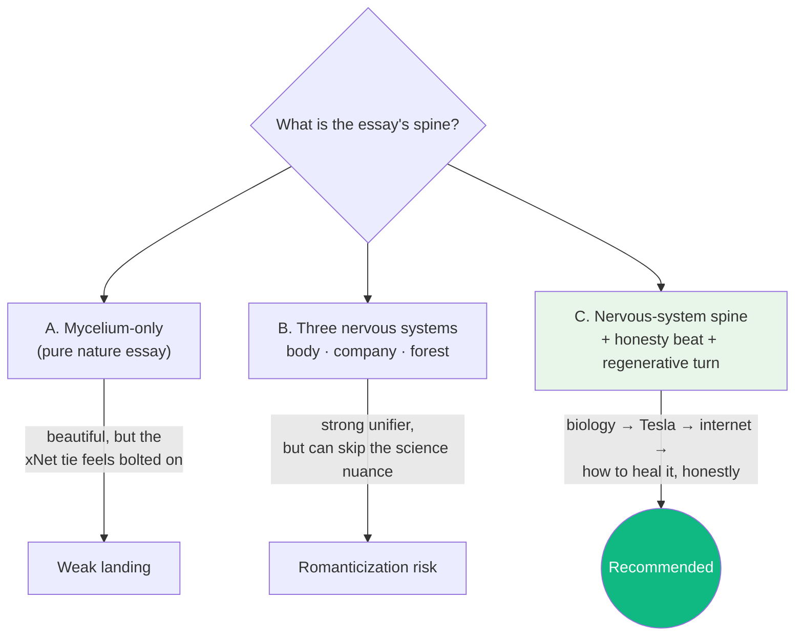
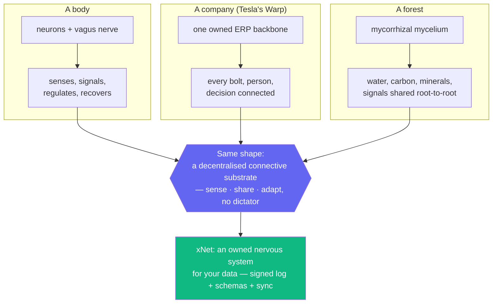
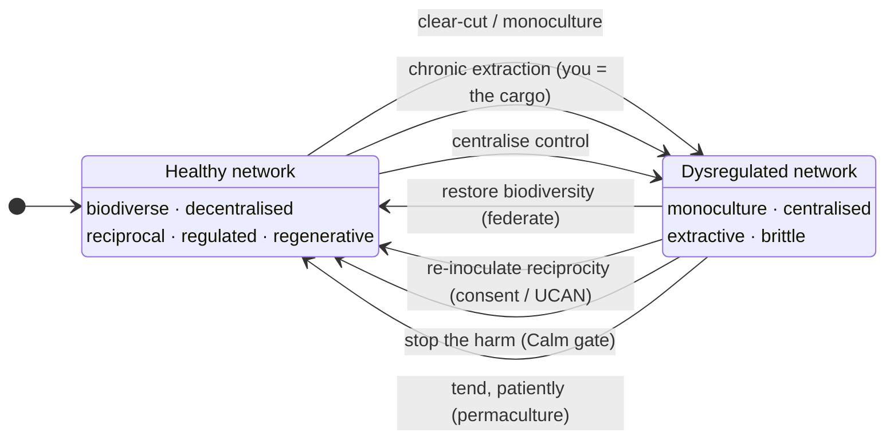
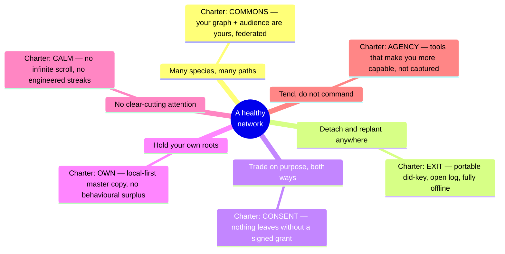

# Data Should Work Like Soil — Mycelial Networks, the Forest's Nervous System, and the Case for xNet

> _"Beneath every forest, a mycelial network connects the trees — sharing
> water, nutrients, signals. Data should work like soil: an open foundation
> that lets everything grow."_ — [`site/src/components/sections/TheVision.astro`](../../site/src/components/sections/TheVision.astro)

## Problem Statement

The first blog post — [_A Great Pirate Age for the Internet_](../../site/src/pages/blog/a-great-pirate-age.astro)
([exploration 0239](./0239_[x]_A_GREAT_PIRATE_AGE_ONE_PIECE_AND_THE_XNET_ETHOS.md)) —
landed well. The brief now: write the **second** blog post, in the same essay
register, on **mycelial networks**.

The user's ask, distilled:

1. **Go deep into the biology.** Forestry, rainforests, the planet, permaculture;
   the actual life cycle of mycelium; how the mycorrhizal network connects trees,
   plants, animals, and whole ecosystems into a living web — "a fibre-optic web
   that permeates the substrate of the soil."
2. **Make it a "nervous system" essay.** A body has a nervous system. A company
   has one (the user points specifically at **Tesla's Warp ERP** — already quoted
   in our own [`TheVision.astro`](../../site/src/components/sections/TheVision.astro)).
   A forest has one (the mycelial network). What does a _healthy_ nervous system
   look like; what happens when it is **dysregulated** — by outside intervention,
   by extraction, by **monoculture** and the loss of biodiversity; and how do you
   bring a damaged one — a forest, a body, a company, an internet — back to health
   with **care, attention, and permaculture principles**?
3. **Tie it to xNet** (and, where it earns it, back to the One Piece post and the
   [`/why`](../../site/src/pages/why.astro) — "the Y" — page).

This exploration grounds that essay in (a) the repository's _actual_ architecture
and existing copy, and (b) honest mycology — including the part where the popular
"Wood Wide Web" story has been seriously challenged since 2023. As with the pirate
piece, the honesty is the point: we borrow the **architecture**, not the fairy
tale.

## Executive Summary

- **The metaphor is already in our own marketing — we are completing a thought we
  started.** The homepage's _The Vision_ section literally says Tesla owns its
  nervous system (Warp) and we don't own ours, then pivots to "beneath every
  forest, a mycelial network… data should work like soil"
  ([`TheVision.astro:44-58`](../../site/src/components/sections/TheVision.astro)).
  The blog post is the long-form version of that 90-word paragraph. It is not a
  reach; it is a payoff.
- **Three nervous systems, one shape.** A body's nervous system, a company's ERP,
  and a forest's mycelial network are the same idea at three scales: a
  **decentralised connective substrate** that lets a whole sense, signal, share
  resources, and adapt as one — without a dictator in the middle. xNet is
  infrastructure for that substrate: a **signed, hash-chained change log + shared
  schemas + opt-in sync** is, structurally, mycelium for your data.
- **Health vs. dysfunction has a precise, transferable definition.** Healthy =
  **biodiverse, decentralised, reciprocal, regulated, regenerative**. Dysfunctional
  = **monoculture, centralised, extractive, dysregulated, brittle**. That single
  axis describes an old-growth forest vs. a clear-cut plantation, a regulated
  nervous system vs. one stuck in fight-or-flight (high allostatic load, collapsed
  vagal tone), and an open protocol vs. a surveillance platform — and it maps
  cleanly onto the [Humane Charter](../../docs/CHARTER.md) commitments we already
  ship and enforce.
- **Be honest about the science (this is the brand).** Mycorrhizal symbiosis —
  trees trading photosynthetic carbon for fungal water and minerals — is textbook,
  and mycelium is one of the planet's largest living carbon pools. But the
  romantic claims (a forest-wide "internet" where wise "mother trees" knowingly
  nurse their kin through fungal cables) **outran the field evidence**, and a
  2023 wave of papers said so, citing positive-citation bias. The post must take
  from mycelium what is real — a reciprocal, decentralised, redundant exchange
  network — and explicitly decline the anthropomorphic myth, exactly as the
  pirate post declined to paint real pirates as heroes (the
  [`HonestPirate`](../../site/src/components/blog/HonestPirate.astro) beat).
- **Recommended vessel: identical to post #1.** A hand-authored, art-directed
  `.astro` page at `site/src/pages/blog/data-should-work-like-soil.astro`, one new
  entry in [`site/src/data/blog.ts`](../../site/src/data/blog.ts), three small
  bespoke components (a mycelial hero, a "three nervous systems" panel, and a
  "what the science actually says" honesty box), and a changelog entry. Zero new
  infrastructure; the index and RSS pick it up for free.

## Current State In The Repository

### We already told this story — in 90 words, on the homepage

The single most important fact for this post: **the metaphor is not new to xNet.**
[`site/src/components/sections/TheVision.astro`](../../site/src/components/sections/TheVision.astro)
(rendered on the homepage) contains, verbatim:

> Tesla built Warp — their own ERP connecting every bolt, every person, every
> decision. … **They own their nervous system and can adapt it as needed. We don't
> own ours.**
>
> Beneath every forest, a mycelial network connects the trees — sharing water,
> nutrients, signals. **Data should work like soil: an open foundation that lets
> everything grow.**
>
> xNet is an open protocol for local-first apps where data flows freely between
> devices, users, and applications. Not blockchain. Not Web3. Just good
> architecture that puts you in control.

The "What this enables" cards under it — _Apps that work together_, _Data
portability_, _Community schemas_ ("like npm for data types"), _Decentralized
social_ — are already the four functions of a healthy mycelial network: transport,
exit, shared language, and connection. The blog post is the essay this paragraph
has been waiting for. [`docs/VISION.md`](../../docs/VISION.md) carries the same
register (walled gardens → federated, interoperable).

### We have a deep, unshipped forestry/permaculture body of research

The forest framing is not decorative either — there is a substantial design corpus
in the repo treating xNet as the **ERP for regenerative agriculture**, and it is
shot through with exactly the vocabulary this post needs:

- [`docs/research/regenerative-farming-erp.md`](../../docs/research/regenerative-farming-erp.md)
  — a full landscape study (farmOS, PFAF, Practical Plants, GODAN/AgMIP) plus
  proposed schemas. It includes a **7-layer food-forest model with an explicit
  8th `mycelial` layer** ("fungi: shiitake, oyster, wine cap"), a `SoilTest`
  schema with `mycorrhizal_colonization` and `fungal_to_bacterial_ratio` fields, a
  `BiodiversityIndex` (Shannon/Simpson), and a candid section on **monoculture
  harms** ("biodiversity loss, pest outbreaks, low disturbance resilience, soil
  degradation").
- [`docs/plans/plan04GlobalFarmingERP/`](../../docs/plans/plan04GlobalFarmingERP/)
  — `01-farming-schemas.md`, `02-species-database.md`, `07-forest-map-view.md`.
- [`docs/plans/plan03ERP/`](../../docs/plans/plan03ERP/) — the general ERP arc.

**Honest caveat for the post:** these are _research and plans_, not shipped
packages (a `grep` for `ForestLayer`/`Guild`/`LandZone` in `packages/` finds
nothing implemented yet). So the essay should frame the forestry ERP as a
**documented application of** the shipped substrate, not as a feature that exists
today. The substrate itself — identity, sync, schemas, local-first storage — _is_
shipped, and that is what the mycelium metaphor maps onto.

### The shipped architecture is, structurally, mycelium

The same primitives the pirate post mapped to "flags and ships'-logs" map just as
exactly to "hyphae and soil":

| Forest / mycelial primitive                                                       | xNet reality                                                                                       | Code                                                                                                                          |
| --------------------------------------------------------------------------------- | -------------------------------------------------------------------------------------------------- | --------------------------------------------------------------------------------------------------------------------------- |
| A spore — a self-contained start, no central nursery issues it                    | A self-generated `did:key` (Ed25519); no registry, no authority                                    | [`packages/identity/src/keys.ts`](../../packages/identity/src/keys.ts)                                                       |
| A hypha carrying a signed packet of nutrient from one root to another             | Each `Change<T>` is an Ed25519 signature over a BLAKE3 hash, chained to its parent                  | [`packages/sync/src/change.ts`](../../packages/sync/src/change.ts)                                                           |
| The root system — your own living copy, alive even when disconnected from the net | Local-first SQLite over OPFS is the _primary_ copy; works fully offline                             | [`packages/data/src/store/store.ts`](../../packages/data/src/store/store.ts)                                                 |
| A node in the network you choose to fuse with (or not)                            | BYO sync hub — self-host, managed, or none                                                          | [`packages/hub/src/cli.ts`](../../packages/hub/src/cli.ts)                                                                   |
| The shared biochemistry that lets different species trade at all                  | One normative protocol + a language-agnostic **golden-vector** conformance corpus                  | [`docs/specs/protocol/`](../../docs/specs/protocol/), [`conformance/`](../../conformance/)                                   |
| Reciprocal exchange — carbon out, nitrogen in, _on purpose_                       | UCAN capability grants — you sign permission for another root to draw on specific data              | `packages/identity` (UCAN)                                                                                                   |
| Soil as an open commons that lets everything grow                                 | Schemas as a shared substrate — "like npm for data types," composable and user-extensible          | [`packages/data/src/schema/`](../../packages/data/src/schema/), [exploration 0188](./0188_[_]_EXTENSIBLE_SCHEMAS_AND_UNIVERSAL_DATABASE_VIEW.md) |

### The Charter already encodes "what keeps a network healthy"

[`docs/CHARTER.md`](../../docs/CHARTER.md) (the Humane Internet Charter) and its
rendered form ([`site/src/pages/commitments.astro`](../../site/src/pages/commitments.astro),
data in [`site/src/data/commitments.ts`](../../site/src/data/commitments.ts)) read,
for this post, like a **soil-health protocol**:

- **Own / Exit / Commons** → the network is _yours_ and _decentralised_; you can
  detach your root ball and replant it anywhere (`did:key` is portable; the wire
  format is an open log, not a vendor blob).
- **Consent** → exchange is _reciprocal and permissioned_, like the carbon-for-
  minerals trade, not extraction.
- **Calm** → no clear-cutting your attention.
  [`scripts/check-humane-patterns.mjs`](../../scripts/check-humane-patterns.mjs) is
  a CI gate that **bans** behavioural-surplus SDKs (`google-analytics`,
  `fbevents`, `mixpanel`, `@segment/`) and dark-pattern primitives
  (`infinite-scroll`, `streakCount`, `confirmshaming`). That is, literally, "we do
  not deploy the machinery that keeps your nervous system dysregulated," enforced
  as a build failure.

### The vessel is proven

The blog shipped in [PR #308](https://github.com/crs48/xNet/pull/308) ([exploration 0239](./0239_[x]_A_GREAT_PIRATE_AGE_ONE_PIECE_AND_THE_XNET_ETHOS.md)).
There is **no MDX/content-collection**; each post is a hand-authored `.astro` page
plus metadata in a single data module:

- Metadata + helpers: [`site/src/data/blog.ts`](../../site/src/data/blog.ts)
  (`posts[]`, `publishedPosts()`, `postBySlug()`, `formatPostDate()`).
- Index: [`site/src/pages/blog/index.astro`](../../site/src/pages/blog/index.astro).
- Feed: [`site/src/pages/blog/rss.xml.ts`](../../site/src/pages/blog/rss.xml.ts).
- Post: [`site/src/pages/blog/a-great-pirate-age.astro`](../../site/src/pages/blog/a-great-pirate-age.astro)
  using bespoke components [`PirateHero`](../../site/src/components/blog/PirateHero.astro),
  [`ArticlesMap`](../../site/src/components/blog/ArticlesMap.astro),
  [`HonestPirate`](../../site/src/components/blog/HonestPirate.astro).
- Nav + footer already link `/blog`
  ([`Nav.astro:16`](../../site/src/components/sections/Nav.astro),
  [`Footer.astro:30`](../../site/src/components/sections/Footer.astro)).
- Launch announced via a changelog data file
  ([`site/src/data/changelog/2026-06-27-the-xnet-blog-is-live.json`](../../site/src/data/changelog/2026-06-27-the-xnet-blog-is-live.json)).

Adding post #2 means: one new `.astro` page, one object pushed to `posts[]`, a few
components, and (optionally) a changelog entry. The index and RSS update
automatically. `BlogTag` already includes `'philosophy'` and `'essay'`; we may
want to add a `'nature'` or `'ecology'` tag to the union.

## External Research

### What mycelium actually is, and does (the well-established part)

- **The organism.** Mycorrhizal fungi grow as **mycelium** — networks of tubular
  cells; an individual thread is a **hypha**. Mycelium forages the soil for water
  and mineral nutrients and trades them at the root interface. Roughly **90% of
  plant species** form mycorrhizal partnerships; the symbiosis is ~400 million
  years old and is widely credited with helping plants colonise land.
  ([SPUN — Mycorrhizal Fungi Explainer](https://www.spun.earth/networks/mycorrhizal-fungi))
- **The trade.** The fungus delivers soil nutrients (chiefly **nitrogen and
  phosphorus**) and water; the plant pays in **carbon** fixed from the atmosphere
  by photosynthesis. Plants route a large share of recently fixed carbon —
  estimates of **20–40% of photosynthates** for some associations — to their
  fungal partners and the soil.
  ([Wisconsin Horticulture — Mycorrhizae](https://hort.extension.wisc.edu/articles/mycorrhizae/),
  [Plant & Soil — extramatrical mycelium & carbon cycling](https://link.springer.com/article/10.1007/s11104-013-1630-3))
- **The scale.** Hyphal networks can reach **up to ~2,000 m of mycelium per cubic
  centimetre of soil**, and ectomycorrhizal hyphae can exceed **30% of total soil
  microbial biomass**. Mycelium is a **globally significant carbon pool** — a 2023
  _Current Biology_ analysis estimates the equivalent of **~13 Gt of CO₂** is
  routed annually from plants into mycorrhizal mycelium, and the fine threads
  physically **bind soil aggregates**, protecting stored carbon.
  ([Mycorrhizal mycelium as a global carbon pool, _Current Biology_ 2023](https://www.cell.com/current-biology/fulltext/S0960-9822(23)00167-7))
- **Life cycle, briefly.** Spore → germination → hyphae → mycelium colonising
  roots (forming the symbiotic interface) → resource exchange → fruiting body
  (mushroom) → spores again. The mycelium itself is a **long-term survival and
  soil-fertility structure**, persisting beyond any individual root or fruiting
  body. ([Lifespan & functionality of mycorrhizal mycelium, _Sci. Reports_ 2018](https://www.nature.com/articles/s41598-018-28354-5))
- **It really is being mapped like an internet.** [SPUN](https://www.spun.earth/)
  (the Society for the Protection of Underground Networks) is literally building a
  global atlas of Earth's mycorrhizal networks — a poetic real-world parallel to
  "map the network, then protect it."

### Where the popular story breaks down (the honesty beat)

The phrase **"Wood Wide Web"** and the **"mother tree"** narrative — old trees
deliberately sending resources to their saplings through a forest-spanning fungal
internet — became cultural touchstones (Suzanne Simard's _Finding the Mother
Tree_; Merlin Sheldrake's _Entangled Life_; Richard Powers' _The Overstory_). But
beginning in **2023**, a series of peer-reviewed papers argued the science had been
oversold:

- **Karst, Jones & Hoeksema (2023), _Nature Ecology & Evolution_** — "Positive
  citation bias and overinterpreted results lead to misinformation about common
  mycorrhizal networks in forests." Three widely repeated claims — that CMNs are
  widespread in forests, that they reliably benefit seedlings, and that mother
  trees preferentially nurture kin — were found to outrun the actual field
  evidence, amplified by citation bias.
  ([summary, _Inverse_](https://www.inverse.com/science/wood-wide-web-debunk-study))
- **Henriksson et al. (2023), _New Phytologist_** — "Re-examining the evidence for
  the mother tree hypothesis." Concludes the field support for resource-sharing via
  ectomycorrhizal networks is weaker and more equivocal than the popular telling.
  ([New Phytologist](https://nph.onlinelibrary.wiley.com/doi/10.1111/nph.18935))
- **"Mother trees, altruistic fungi, and the perils of plant personification"**
  (_Trends in Plant Science_, 2023) — a caution specifically against
  anthropomorphising the network.
  ([ScienceDirect](https://www.sciencedirect.com/science/article/abs/pii/S1360138523002728))
- **Simard responded** — "I stand by my research" — and published a 2024/2025
  rebuttal, so this is a live scientific debate, not a settled debunking.
  ([Frontiers — response to questions about CMNs](https://www.frontiersin.org/journals/forests-and-global-change/articles/10.3389/ffgc.2024.1512518/full))

**What survives the critique, and is enough for our metaphor:** mycorrhizal
symbiosis is real and ubiquitous; carbon-for-nutrient exchange is real; mycelium is
a vast, redundant, decentralised soil network and a major carbon store. What is
contested is the **anthropomorphism** — the conscious, altruistic, forest-as-single-
mind story. We take the **architecture** (reciprocal, decentralised, redundant
exchange) and leave the **fairy tale** (wise mothers, a literal hive mind). That is
the same discipline as the pirate essay.

### Monoculture, dysregulation, and what "unhealthy" looks like

- **Monoculture degrades the underground network.** Converting diverse forest to
  single-species plantation reduces soil **fungal richness** and **soil
  multifunctionality**; fungal diversity is the _primary predictor_ of soil
  function. Natural regeneration recovers fungal communities toward old-growth
  composition; monocultures largely do not, and **biodiversity decline raises the
  likelihood of plantation collapse** (pests, drought, soil acidification).
  ([_Geoderma_ — fungal diversity drives soil multifunctionality](https://www.sciencedirect.com/science/article/abs/pii/S0929139325005037),
  [long-term monoculture vs. natural regeneration, _Environmental Management_ 2023](https://link.springer.com/article/10.1007/s00267-023-01917-7),
  [monoculture impacts mediated by soil acidification, bioRxiv 2025](https://www.biorxiv.org/content/10.1101/2025.05.27.656426.full.pdf))
- **The body's nervous system tells the same story.** Chronic stress without
  recovery raises **allostatic load** ("wear and tear"), shows up as **reduced
  heart-rate variability** and depleted **vagal tone**, and the longer the system
  stays in heightened arousal the harder it is to return to a regulated
  (parasympathetic) state. Crucially, **isolation suppresses vagal tone** while
  safe social connection restores it — a direct analogue to biodiversity and
  connection in an ecosystem.
  ([Allostatic load](https://neuvanalife.com/blogs/blog/allostatic-load-understanding-stress-and-its-effects),
  [nervous-system regulation](https://superpower.com/guides/nervous-system-regulation-what-it-means-and-how-to-do-it))
- **The company's nervous system.** Tesla's **Warp** ERP — built in-house by a
  small team starting ~2012 — is repeatedly described as the company's "central
  nervous system": one vertically integrated backbone unifying supply chain,
  manufacturing, finance, and sales, enabling rapid iteration with no vendor
  dependency. The strategic point our own copy makes: **most companies rent their
  nervous system** from SaaS vendors who also harvest it; Tesla owns and adapts
  theirs.
  ([Tesla's custom ERP, Medium](https://medium.com/@joshiabhi777/the-untold-story-of-teslas-custom-erp-system-why-building-warp-was-a-genius-move-5538abeca454),
  [Warp overview](https://grokipedia.com/page/warp-erp-system))

### How you heal a damaged network (the regenerative turn)

Restoration ecology gives the post its hopeful ending, and it rhymes with both
nervous-system recovery and platform-exit:

- **Stop the harm, then rebuild diversity.** The best outcomes come from acting on
  several soil properties at once — **microbial diversity, nutrient cycling, and
  physical structure** — not a single silver bullet.
  ([ecological restoration review, _PMC_](https://pmc.ncbi.nlm.nih.gov/articles/PMC11885172/))
- **Re-inoculate with native fungi, and use consortia not monocultures.**
  Arbuscular mycorrhizal fungi improve soil, raise above- and below-ground
  biodiversity, lift seedling survival on stressed soils, and can **drive
  succession and resist invasives** — and **native, early-seral, multi-species**
  inoculants outperform exotic single-species ones.
  ([AMF in restoration of degraded lands, _PMC_](https://www.ncbi.nlm.nih.gov/pmc/articles/PMC4960231/))
- **Permaculture is the design language.** Mollison and Holmgren's principles —
  diversity, redundancy, work with succession, feed the soil, slow patient care —
  are exactly the regenerative practices the restoration literature now endorses
  ([regenerative methods review, _Sci. Total Environ._ 2025](https://www.sciencedirect.com/science/article/pii/S0048969725015669)).
  Robin Wall Kimmerer's _Braiding Sweetgrass_ supplies the reciprocity frame; the
  unifying move is **tending, not commanding**.

## Key Findings

1. **This post completes an argument the homepage already makes.** The Warp/ERP →
   mycelium → "data should work like soil" paragraph in
   [`TheVision.astro`](../../site/src/components/sections/TheVision.astro) is the
   thesis in miniature. The essay is its expansion, which makes it maximally on-
   brand and low-risk.
2. **"Nervous system" is the load-bearing unifier, not "mushrooms."** The strongest
   spine is _one shape at three scales_ (body, company, forest) — a decentralised
   connective substrate — because it lets the post move from biology to Tesla to
   the internet without seams, and it ends on agency ("own your nervous system").
3. **Healthy/unhealthy reduces to a single axis** —
   **biodiverse·decentralised·reciprocal·regulated·regenerative** vs.
   **monoculture·centralised·extractive·dysregulated·brittle** — and that axis maps
   one-to-one onto the [Charter](../../docs/CHARTER.md) and onto the surveillance
   thesis of [`/why`](../../site/src/pages/why.astro). The architecture _is_ the
   ethics.
4. **Honesty about the "Wood Wide Web" is mandatory, and it's a feature.** The 2023
   critiques are real; quietly riding the romantic version would betray the exact
   discipline the brand is built on (Charter receipts, the
   [`HonestPirate`](../../site/src/components/blog/HonestPirate.astro) box). The
   honesty beat _strengthens_ the piece.
5. **It pairs with the pirate post by inversion.** Post #1 looked _up_ — the open
   sea, scattered islands, flags, ships' logs. Post #2 looks _down_ — the soil,
   roots, hyphae, the substrate. Same federation shape (autonomous nodes, voluntary
   reciprocal connection, no centre), opposite vantage. "Last time, the sea. This
   time, look down."
6. **Vessel is solved.** Reuse the post #1 pattern exactly; no new infra, no
   `sidebar.mjs`/`build:llms` gate (that's docs-only). Marketing pages live in
   `site/src/pages/`.

## Options And Tradeoffs

### Framing / spine



- **A. Mycelium-only.** Gorgeous, but the One Piece post earned its xNet landing by
  being _about_ governance; a pure-nature essay risks a bolted-on "…and that's like
  our database!" ending.
- **B. Three nervous systems.** The right unifier (body/company/forest), and it
  uses our own Tesla copy. Risk: if you skip the science nuance to keep momentum,
  you romanticize the Wood Wide Web and lose credibility.
- **C. (Recommended) Nervous-system spine + honesty beat + regenerative turn.**
  Body→company→forest establishes the shape; an honesty box ("what the science
  actually says") earns trust; the regenerative ending ("you heal a network by
  tending it, with biodiversity and reciprocity") delivers both the emotional and
  the product payoff (own your nervous system; data as soil).

### Title / slug

| Title direction                       | Vibe                          | Note                                                                     |
| ------------------------------------- | ----------------------------- | ------------------------------------------------------------------------ |
| **"Data Should Work Like Soil"**      | Grounded, humble, on-brand    | **Recommended.** Lifts our own [`TheVision.astro`](../../site/src/components/sections/TheVision.astro) line; sets up "soil = substrate." Slug `data-should-work-like-soil`. |
| "The Underground"                     | Complements pirate "open sea" | Nice above/below pairing; a touch oblique alone                          |
| "The Forest Has a Nervous System"     | Direct, essay-ish             | Clear, but leads with metaphor not payoff                                |
| "What the Mycelium Knows"             | Lyrical                       | Risks leaning into the personification we're trying to avoid             |

### Vessel (settled, but stated for completeness)

| Option                                   | Verdict                                                                 |
| ---------------------------------------- | ---------------------------------------------------------------------- |
| Reuse post #1 `.astro` + `blog.ts` grain | **Recommended.** Proven, zero new infra, consistent craft.             |
| Introduce an MDX content collection now  | Rejected. Premature; post #1 deliberately avoided MDX.                  |
| One-off landing page outside `/blog`     | Rejected. We _have_ a blog now; this is what it's for.                  |

## Recommendation

**Ship Option C as the second blog post, titled _"Data Should Work Like Soil,"_**
reusing the post #1 vessel. Treat the science with the same honesty discipline as
the pirate history. Concretely, a seven-beat spine that mirrors (and inverts) the
pirate post:

1. **Hook — look down.** The pirate essay looked up at the open sea. Now look down:
   under every forest floor runs a network older than any human one — a
   "fibre-optic web in the substrate." Set the scene with real mycology.
2. **What the network really does.** The life cycle and the trade: spore → hypha →
   mycelium → the carbon-for-nutrients exchange at the root → fruiting → spore. The
   honest facts (scale, carbon pool, ~90% of plants). This is the credibility floor.
3. **Honesty box — what the science actually says.** The "Wood Wide Web" /
   "mother tree" story is contested (2023 papers; Simard's rebuttal). We take the
   _architecture_ (reciprocal, decentralised, redundant), not the _fairy tale_
   (conscious altruism, a forest hive-mind). Modeled on
   [`HonestPirate`](../../site/src/components/blog/HonestPirate.astro).
4. **Three nervous systems, one shape.** Body (vagal tone, allostatic load),
   company (Tesla's Warp — quote our own homepage), forest (the mycelial net). All
   three: a decentralised connective substrate that lets a whole sense, share, and
   adapt. Health = biodiverse/decentralised/reciprocal/regulated/regenerative.
5. **What dysregulation looks like — and who profits from yours.** Monoculture and
   clear-cutting; chronic stress and collapsed HRV; renting your company's nervous
   system to a vendor who also harvests it. The internet's version: a monoculture
   of a few platforms, an attention economy engineered to keep your nervous system
   dysregulated, and — the [`/why`](../../site/src/pages/why.astro) inversion —
   **you are the cargo** (tie back to post #1).
6. **Data should work like soil — the architecture beat.** xNet as mycelium: your
   spore (`did:key`), your living root copy (local-first), signed packets along the
   hyphae (`Change<T>`), reciprocal permissioned trade (UCAN), the shared
   biochemistry (open protocol + conformance), and soil-as-commons (extensible
   schemas, "npm for data types"). Own your nervous system; don't rent it.
7. **How you bring a network back — tending, not commanding.** Restoration
   ecology + permaculture + nervous-system regulation as one move: stop the
   extraction, restore biodiversity (federate; many hubs, many apps), re-inoculate
   with reciprocity and consent, and be patient. Map to the
   [Charter](../../docs/CHARTER.md) (Calm/Commons/Consent/Exit). CTA: use the app,
   read the commitments, build on the open substrate. Close by naming the pairing
   with the pirate post (sea above, soil below — same open world).

Plus the same **IP/honesty hygiene**: original inline-SVG art only; every factual
claim cited (mycology, nervous-system, Tesla, monoculture); a brief note that the
"Wood Wide Web" is a contested popular term, not settled science.

## Example Code

### Three nervous systems, one shape (diagram for the post)



### Healthy vs. dysregulated (the single axis)



### The reciprocal trade (mycelium ⟷ xNet sync)

```mermaid
sequenceDiagram
    participant T as Tree (your device)
    participant M as Mycelium (sync substrate)
    participant N as Neighbour (a peer you chose)
    T->>T: photosynthesize → write a change, sign it (Ed25519/BLAKE3)
    T->>N: consent grant (UCAN) — "you may draw on this"
    T->>M: push signed, hash-chained packet
    M->>N: relay along the hyphae (when reachable)
    N->>N: verify signature + chain, apply (LWW); send minerals back
    Note over T,N: Reciprocal and on purpose. No central nursery<br/>approves the exchange. Redundant paths, no single point of failure.
```

### The forest's "articles" → the Charter (what keeps a network healthy)



### Adding post #2 (the vessel — mirrors post #1 exactly)

```ts
// site/src/data/blog.ts — push one object onto posts[]
{
  slug: 'data-should-work-like-soil',
  title: 'Data Should Work Like Soil',
  description:
    'Beneath every forest runs a fungal network — the original internet. ' +
    'What mycelium, the human nervous system, and Tesla’s Warp teach us about ' +
    'building one worth living in — and how to heal one that’s sick.',
  pubDate: '2026-07-04T16:00:00Z',
  author: 'xNet',
  tags: ['essay', 'philosophy', 'nature'], // add 'nature' | 'ecology' to BlogTag
  readingMinutes: 12
}
```

```astro
---
// site/src/pages/blog/data-should-work-like-soil.astro  (same shape as post #1)
import Base from '../../layouts/Base.astro'
import Nav from '../../components/sections/Nav.astro'
import Footer from '../../components/sections/Footer.astro'
import MycelialHero from '../../components/blog/MycelialHero.astro'      // new
import ThreeNervousSystems from '../../components/blog/ThreeNervousSystems.astro' // new
import HonestMycelium from '../../components/blog/HonestMycelium.astro'  // new
import { postBySlug, formatPostDate } from '../../data/blog'

const post = postBySlug('data-should-work-like-soil')!
---
<Base title={`${post.title} — xNet`} description={post.description}>
  <Nav />
  <main>
    <MycelialHero title={post.title} deck={post.description}
      date={formatPostDate(post.pubDate)} readingMinutes={post.readingMinutes} tags={post.tags} />
    <article class="prose prose-lg mx-auto max-w-3xl px-6 py-16 dark:prose-invert">
      <!-- seven beats; <ThreeNervousSystems/> and <HonestMycelium/> embedded -->
    </article>
  </main>
  <Footer />
</Base>
```

The `MycelialHero` reuses the [`PirateHero`](../../site/src/components/blog/PirateHero.astro)
idiom (inline SVG, no third-party assets) but inverts it: the cosmic-X glows
_beneath_ a soil line, with dotted hyphae branching to nodes — the underground
twin of the pirate sea-lanes.

## Risks And Open Questions

- **Romanticization / scientific overreach (most important).** The "Wood Wide Web"
  is contested. If the honesty box is cut for length, the post peddles a fairy tale
  and forfeits the brand's credibility. **The honesty beat is load-bearing**, not
  optional — same rule as the pirate history.
- **Metaphor sprawl.** Body + company + forest + internet + One Piece + Tesla is a
  lot of threads. Mitigation: the "one shape at three scales" spine is the rope
  that ties them; cut anything that doesn't hang from it. Keep the One Piece
  callback to a single inversion line ("sea above, soil below").
- **Claiming the forestry ERP exists.** The permaculture/forest schemas are
  _research and plans_ ([`docs/research/regenerative-farming-erp.md`](../../docs/research/regenerative-farming-erp.md),
  [`docs/plans/plan04GlobalFarmingERP/`](../../docs/plans/plan04GlobalFarmingERP/)),
  not shipped packages. Frame them as a documented _application_ of the substrate,
  not a current feature.
- **Tesla as exemplar.** Invoking a politically polarising company. Mitigation:
  keep it strictly architectural (own vs. rent your nervous system), echoing the
  even-handed framing already in [`TheVision.astro`](../../site/src/components/sections/TheVision.astro)
  ("Love them or hate them…").
- **Wellness-metaphor drift.** "Nervous-system regulation" is having a cultural
  moment and can read as woo. Mitigation: anchor in concrete physiology
  (allostatic load, HRV, vagal tone) with citations; avoid therapeutic claims.
- **Cadence.** Two posts imply a series. _Open question:_ is there a third in view
  (the trilogy could be sea / soil / sky, or pirate / forest / ?), or is this a
  loose anthology? Option C is cheap if it stays at two.

## Implementation Checklist

- [ ] Confirm title **"Data Should Work Like Soil"** + slug `data-should-work-like-soil`
      (alt: "The Underground").
- [ ] Add `'nature'` (and/or `'ecology'`) to the `BlogTag` union in
      [`site/src/data/blog.ts`](../../site/src/data/blog.ts) and push the post #2
      metadata object onto `posts[]`.
- [ ] Create `site/src/pages/blog/data-should-work-like-soil.astro` following the
      seven-beat spine in [Recommendation](#recommendation), mirroring
      [`a-great-pirate-age.astro`](../../site/src/pages/blog/a-great-pirate-age.astro).
- [ ] Build `site/src/components/blog/MycelialHero.astro` (original inline-SVG;
      cosmic-X beneath a soil line, branching hyphae; no third-party assets).
- [ ] Build `site/src/components/blog/ThreeNervousSystems.astro` (body · company ·
      forest → one shape), reusing the `not-prose` card idiom from
      [`ArticlesMap`](../../site/src/components/blog/ArticlesMap.astro).
- [ ] Build `site/src/components/blog/HonestMycelium.astro` (what the science
      actually says: take the architecture, leave the myth), mirroring
      [`HonestPirate`](../../site/src/components/blog/HonestPirate.astro).
- [ ] Write the prose: real mycology + life cycle; the 2023 honesty beat; the
      three-nervous-systems unifier; the dysregulation/"you are the cargo" turn
      (link [`/why`](../../site/src/pages/why.astro)); the "data should work like
      soil" architecture beat; the regenerative ending.
- [ ] Cross-link: [`/why`](../../site/src/pages/why.astro),
      [`/commitments`](../../site/src/pages/commitments.astro),
      [`/build-with`](../../site/src/pages/build-with.astro), the homepage
      _Vision_ section, and the pirate post (the inversion callback).
- [ ] Cite every claim (mycology, nervous-system physiology, Tesla Warp, monoculture
      research); add the "Wood Wide Web is a contested popular term" note. Consider a
      `site/src/data/mycelium.ts` claims module if the stats grow (mirrors
      [`surveillance.ts`](../../site/src/data/surveillance.ts)).
- [ ] Add the not-affiliated/independent-essay footer note (Tesla/Toei trademarks
      referenced as commentary; original art only), per the post #1 pattern.
- [ ] (Optional) Add a changelog entry mirroring
      [`2026-06-27-the-xnet-blog-is-live.json`](../../site/src/data/changelog/2026-06-27-the-xnet-blog-is-live.json)
      announcing post #2.

## Validation Checklist

- [ ] `pnpm --filter site build` succeeds; `/blog` lists post #2 newest-first and
      `/blog/data-should-work-like-soil` renders.
- [ ] `/blog/rss.xml` stays well-formed and includes the new item (title, link,
      pubDate, description).
- [ ] Self-audit parity with post #1: the page ships **0 third-party trackers / 0 ad
      SDKs** (the [`check-humane-patterns.mjs`](../../scripts/check-humane-patterns.mjs)
      gate enforces this repo-wide); hero art is inline SVG, no external requests.
- [ ] Every factual claim is sourced; the honesty box about the contested "Wood
      Wide Web" is present and not cut.
- [ ] A reader who knows nothing about mycology (or One Piece) still follows and is
      moved — the nervous-system spine carries it.
- [ ] Mobile + dark-mode pass (existing responsive checks); `prose`/`not-prose`
      boundaries render correctly as in post #1.
- [ ] Lint/format: remember `site/` is **not** covered by the root eslint/prettier
      ([memory: multi-language docs gotcha]); run the site's own checks.
- [ ] The forestry-ERP material is framed as research/plans, not a shipped feature.

## References

### Repository

- [`site/src/components/sections/TheVision.astro`](../../site/src/components/sections/TheVision.astro) — the Warp/ERP → mycelium → "data should work like soil" paragraph (the thesis)
- [`docs/VISION.md`](../../docs/VISION.md) — walled gardens → federated; the broader vision
- [`docs/research/regenerative-farming-erp.md`](../../docs/research/regenerative-farming-erp.md) — forest layers (incl. `mycelial`), `SoilTest.mycorrhizal_colonization`, `BiodiversityIndex`, monoculture harms
- [`docs/plans/plan04GlobalFarmingERP/`](../../docs/plans/plan04GlobalFarmingERP/) and [`docs/plans/plan03ERP/`](../../docs/plans/plan03ERP/) — the ERP/farming arc
- [`site/src/pages/blog/a-great-pirate-age.astro`](../../site/src/pages/blog/a-great-pirate-age.astro) + [`site/src/data/blog.ts`](../../site/src/data/blog.ts) — the proven vessel
- [`site/src/components/blog/`](../../site/src/components/blog/) — `PirateHero`, `ArticlesMap`, `HonestPirate` component idioms to mirror
- [`docs/CHARTER.md`](../../docs/CHARTER.md) + [`site/src/data/commitments.ts`](../../site/src/data/commitments.ts) — the soil-health protocol (Own/Exit/Commons/Consent/Calm/Agency)
- [`scripts/check-humane-patterns.mjs`](../../scripts/check-humane-patterns.mjs) — the enforced "no clear-cutting attention" gate
- [`packages/identity/src/keys.ts`](../../packages/identity/src/keys.ts), [`packages/sync/src/change.ts`](../../packages/sync/src/change.ts), [`packages/data/src/store/store.ts`](../../packages/data/src/store/store.ts), [`packages/hub/src/cli.ts`](../../packages/hub/src/cli.ts) — spore, hypha, root, node
- [`site/src/pages/why.astro`](../../site/src/pages/why.astro) + [`site/src/data/surveillance.ts`](../../site/src/data/surveillance.ts) — "you are the cargo"
- [exploration 0239](./0239_[x]_A_GREAT_PIRATE_AGE_ONE_PIECE_AND_THE_XNET_ETHOS.md) — post #1, the format and tone

### Mycology (the well-established part)

- [SPUN — Mycorrhizal Fungi Explainer](https://www.spun.earth/networks/mycorrhizal-fungi) and [SPUN](https://www.spun.earth/) (mapping Earth's underground networks)
- [Mycorrhizal mycelium as a global carbon pool — _Current Biology_ (2023)](https://www.cell.com/current-biology/fulltext/S0960-9822(23)00167-7)
- [Production and turnover of extramatrical mycelium & carbon cycling — _Plant and Soil_](https://link.springer.com/article/10.1007/s11104-013-1630-3)
- [Lifespan and functionality of mycorrhizal mycelium — _Scientific Reports_ (2018)](https://www.nature.com/articles/s41598-018-28354-5)
- [Mycorrhizae — Wisconsin Horticulture](https://hort.extension.wisc.edu/articles/mycorrhizae/)

### The "Wood Wide Web" debate (the honesty beat)

- [Karst, Jones & Hoeksema (2023), _Nature Ecology & Evolution_ — positive citation bias / overinterpreted CMN claims (summary)](https://www.inverse.com/science/wood-wide-web-debunk-study)
- [Henriksson et al. (2023), _New Phytologist_ — re-examining the mother tree hypothesis](https://nph.onlinelibrary.wiley.com/doi/10.1111/nph.18935)
- [Mother trees, altruistic fungi, and the perils of plant personification — _Trends in Plant Science_ (2023)](https://www.sciencedirect.com/science/article/abs/pii/S1360138523002728)
- [Simard et al. — response to questions about common mycorrhizal networks — _Frontiers_ (2024)](https://www.frontiersin.org/journals/forests-and-global-change/articles/10.3389/ffgc.2024.1512518/full)
- [Suzanne Simard — research overview](https://suzannesimard.com/research/)

### Monoculture, restoration, and the nervous system

- [Fungal diversity drives soil multifunctionality — _Geoderma_](https://www.sciencedirect.com/science/article/abs/pii/S0929139325005037)
- [Long-term soil fungal structure: monoculture vs. natural regeneration — _Environmental Management_ (2023)](https://link.springer.com/article/10.1007/s00267-023-01917-7)
- [Monoculture-plantation impacts mediated by soil acidification — bioRxiv (2025)](https://www.biorxiv.org/content/10.1101/2025.05.27.656426.full.pdf)
- [Arbuscular mycorrhizal fungi in restoration of degraded lands — _PMC_](https://www.ncbi.nlm.nih.gov/pmc/articles/PMC4960231/)
- [Ecological restoration via soil microbiomics — _PMC_ (2025)](https://pmc.ncbi.nlm.nih.gov/articles/PMC11885172/)
- [Regenerating rural soil — 15-year systematic review — _Science of the Total Environment_ (2025)](https://www.sciencedirect.com/science/article/pii/S0048969725015669)
- [Allostatic load — understanding stress](https://neuvanalife.com/blogs/blog/allostatic-load-understanding-stress-and-its-effects) and [nervous-system regulation](https://superpower.com/guides/nervous-system-regulation-what-it-means-and-how-to-do-it)

### Tesla's Warp (the company's nervous system)

- [The untold story of Tesla's custom ERP "Warp" — Medium](https://medium.com/@joshiabhi777/the-untold-story-of-teslas-custom-erp-system-why-building-warp-was-a-genius-move-5538abeca454)
- [Warp (ERP) overview — Grokipedia](https://grokipedia.com/page/warp-erp-system)

### Cultural / further reading

- Suzanne Simard, _Finding the Mother Tree_ · Merlin Sheldrake, _Entangled Life_ · Robin Wall Kimmerer, _Braiding Sweetgrass_ · Bill Mollison & David Holmgren (permaculture principles)
