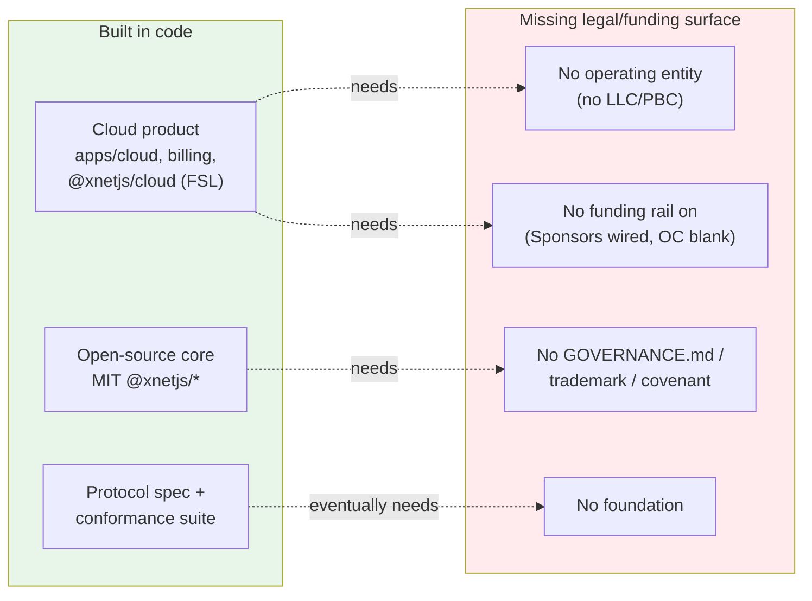
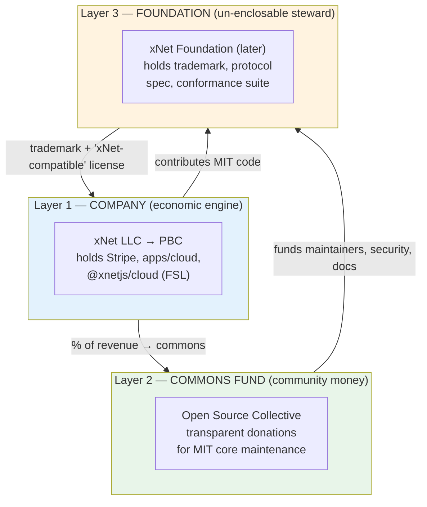
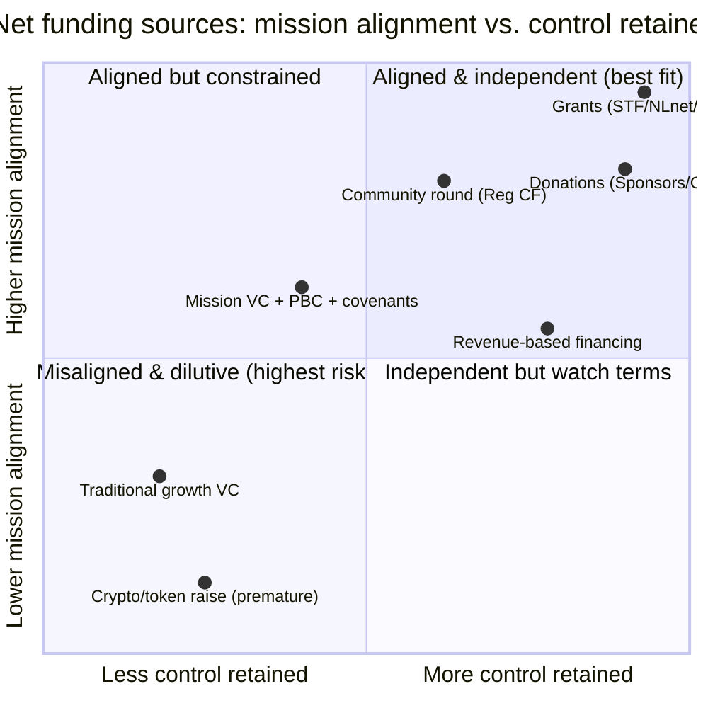
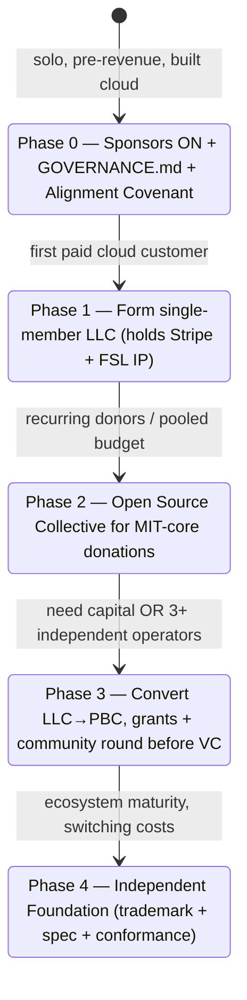
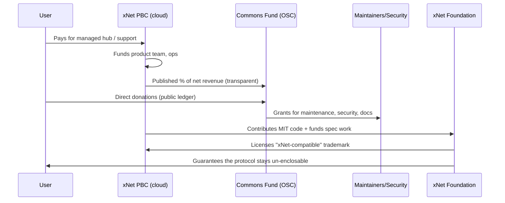

# 0241 — Open Collective, Foundation, Or Company? A Practical Legal & Funding Structure For xNet

> **Status:** Exploration
> **Date:** 2026-06-27
> **Author:** Claude (Opus 4.8)
> **Tags:** governance, legal-structure, open-collective, fiscal-host, foundation, pbc, llc,
> fundraising, venture-capital, donations, steward-ownership, sustainability, mission-alignment

> ⚠️ **This is a strategic product/governance exploration, not legal, tax, securities, or
> investment advice.** Forming an entity, accepting donations through a fiscal host, transferring
> IP, issuing securities, or raising capital all require experienced counsel licensed in the
> relevant jurisdiction. Treat every recommendation here as "questions to take to a lawyer,"
> not "instructions to execute."

## Problem Statement

xNet wants to do three things that pull in different directions:

1. **Accept donations** for the open-source work (an Open Collective, GitHub Sponsors, or similar).
2. **Build a revenue-generating cloud hosting business** — the managed-hub / billing / AI-metering
   machinery that already exists in code (`apps/cloud`, `@xnetjs/billing`, `@xnetjs/cloud`).
3. **Keep the open-source commons credibly un-enclosable** — ideally stewarded by something
   foundation-shaped, so adopters trust the protocol can't be captured after they commit.

The founder's actual questions, verbatim and answered in this doc:

- Does an **Open Collective** make sense?
- Does a **foundation** make sense?
- Does an **LLC or C-corporation** make sense?
- **Could all three coexist and interrelate?** What does the money-flow look like?
- Should xNet **raise money** at all — and would **VC** be a conflict of interest with the mission?
  Could xNet instead raise **community funds** or **donations** in a way that *is* aligned?

This builds directly on **[0145 — Legal Organizing Structures](./0145_[_]_FOUNDATION_MODELS_LEGAL_ORGANIZING_STRUCTURES_FOR_XNET_MISSION_ALIGNED_GOVERNANCE.md)**,
which mapped the full entity landscape (PBC, C-corp, 501(c)(3), 501(c)(6), CIC, stichting, AISBL,
Swiss foundation, DAO, steward-ownership). 0145 is the *map*. **0241 is the decision** — the
specific, sequenced answer for a solo, pre-revenue founder whose cloud business already exists in
code but has no legal wrapper around it.

## Executive Summary

**The honest one-paragraph answer:** Yes, all three can coexist — and the standard, battle-tested
shape is **a for-profit operating company that runs the cloud business, an open-source commons that
the company contributes to but does not own, and (eventually) a foundation that stewards the
protocol so the commons can't be enclosed.** But you do not form all three on day one. You form the
*minimum legal surface that today's reality requires*, and you let the rest be triggered by real
milestones. Today's reality is: a solo founder, pre-revenue, with a built-but-unincorporated cloud
product and an MIT core that people are starting to find.

The recommended sequence:

| Phase | Trigger | What to stand up |
| ----- | ------- | ---------------- |
| **0 — Now** | You're reading this | Turn on **GitHub Sponsors** (already wired) + write a 1-page **`GOVERNANCE.md` / funding policy + Alignment Covenant**. Cost: ~$0, one afternoon. |
| **1 — First dollar of cloud revenue** | You charge anyone for hosting | Form a **single-member LLC** (Delaware or home-state) to hold the Stripe account, `apps/cloud`, and `@xnetjs/cloud` (FSL). Default-alive bootstrapping. |
| **2 — Community wants to fund the commons** | Recurring donors, or you want a *transparent, poolable* commons budget you can pay contractors from | Open a **collective on Open Source Collective** (the 501(c)(6) fiscal host) for the **MIT core only**, separate from company revenue. |
| **3 — You need real capital, or real neutrality** | A raise becomes necessary, or 3+ independent hub operators appear | Convert the LLC to a **Delaware Public Benefit Corporation**; consider a **community round (Reg CF)** before or alongside any VC; design the **Foundation** asset map. |
| **4 — Ecosystem maturity** | Multiple operators, institutional adopters, switching costs | Launch an **independent Foundation** that holds the trademark + protocol spec + conformance suite. |

**On Open Collective specifically:** Yes, it makes sense — but for the **commons donations**, *not*
for the cloud business, and you must know the 2024 history: **Open Collective Foundation (the
501(c)(3) host) dissolved at the end of 2024**, but **Open Source Collective (the 501(c)(6) host for
open-source projects) is alive and accepting projects.** Use that one — or just start with GitHub
Sponsors (already configured for `crs48`) and graduate to a fiscal host when you actually have a
pooled budget to manage.

**On raising money:** VC is **not inherently a conflict** with xNet's values. The conflict is a
*specific, well-documented failure mode* — when growth stalls, investors push to "raise the rake,"
and the easiest lever is **relicensing the open core to block competitors** (HashiCorp→BSL,
Redis→SSPL, Elastic→SSPL). Every one of those triggered a community fork. You can **structurally
defuse** that pressure: keep the commons legally *outside* the company, use a PBC, lean on FSL's
automatic-open clause, and write board covenants. xNet is also unusually well-suited to **non-VC
capital** — donations, grants (Sovereign Tech Fund, NLnet/NGI fit a privacy/decentralization
project almost perfectly), revenue-based financing, and a Reg CF community round. **Recommendation:
bootstrap to default-alive first; if you raise, raise mission-aligned and community capital before
traditional VC, and only inside a PBC with the commons already walled off.**

## Current State In The Repository

xNet is in an unusual and important position: **the commercial product is largely built, but there
is no legal entity, no governance doc, and no funding rail switched on.** The structure question is
not theoretical — there is a Stripe integration looking for a bank account.

### What already exists (the company side, in code)

| Surface | Evidence in repo | Implication |
| ------- | ---------------- | ----------- |
| Managed cloud control plane | [`apps/cloud/`](../../apps/cloud) (Dockerfile, FSL `LICENSE`), staging live at `cloud-staging.xnet.fyi` (memory 0205) | A real SaaS exists; it needs an operating entity to invoice from. |
| Billing | [`packages/billing/`](../../packages/billing/src) — Stripe + BTCPay + Stripe Connect, HMAC webhooks | Payment rails are wired; "merchant of record" / tax obligations attach to *someone*. |
| Cloud business logic | [`@xnetjs/cloud`](../../packages/cloud) — **FSL-1.1-Apache-2.0**, `private: true` | Already source-available-but-not-open; the deliberate commercial moat. |
| Plans, quotas, metering | AI metering + spend caps (memory 0201/0208), plan upgrade/downgrade (memory 0216), `@xnetjs/entitlements` | Usage-based revenue model is implemented. |
| Paid plugin marketplace | `@xnetjs/licenses` (Ed25519 DID-bound licenses), Stripe Connect (memory 0196) | A second revenue line + payouts to third parties (which has its own tax/legal weight). |

### What already exists (the commons side)

| Surface | Evidence | Implication |
| ------- | -------- | ----------- |
| Open-source core | [`LICENSE`](../../LICENSE) = **MIT**, `Copyright (c) 2026 Chris Smothers`; ~20 published `@xnetjs/*` packages with `license: MIT` | The commons is real and permissively licensed — easy to adopt, easy to fork. |
| Mission, written down | [`docs/VISION.md`](../VISION.md), [`docs/CHARTER.md`](../CHARTER.md) ("Own, Exit, Calm, Consent, Agency, Commons") | xNet has an unusually explicit, *receipt-backed* value system — the thing a structure must protect. |
| Protocol spec + conformance | `docs/specs/protocol/` + `conformance/` (referenced in VISION.md), `xnet/1.0` | The single most foundation-worthy asset already exists. |
| Contributor onramp | [`CONTRIBUTING.md`](../../CONTRIBUTING.md) | But **no `GOVERNANCE.md`, no CLA/DCO policy, no trademark policy.** |

### What's missing (the gap this doc addresses)



**Funding config today:** [`.github/FUNDING.yml`](../../.github/FUNDING.yml) has `github: crs48` and
`buy_me_a_coffee: crs48` set, with `open_collective`, `patreon`, `liberapay`, `polar`, `tidelift`,
and `thanks_dev` left as blank placeholders. So GitHub Sponsors and Buy Me a Coffee are one toggle
away; Open Collective is a deliberate open question — exactly the founder's first question.

**Single-vendor reality:** The copyright is held by one person ("Chris Smothers"). There is no CLA,
so contributor IP currently flows under the inbound=outbound MIT default. This matters for *any*
future relicensing or asset transfer to a foundation — clean now, gets harder with every outside
contributor.

## External Research

(Full citations in [References](#references). 0145 already covered the entity-law fundamentals on
2026-06-03; this section adds what 0145 did **not** cover — Open Collective mechanics, the 2024
fiscal-host turmoil, and the 2022–2026 wave of COSS funding/relicensing precedents.)

### Open Collective is two things, and the 2024 history matters

"Open Collective" conflates a **software platform** (transparent budgets, public ledgers) with the
**legal fiscal hosts** that actually hold the money. A *collective* never holds funds; its *fiscal
host* does, in its own bank account, and assumes the legal/tax responsibility. Money flows
**donor → fiscal host's account (held for the collective) → transparent budget → approved payouts**
(Stripe/PayPal/Wise). Host fees are typically ~**5%** (platform contributions) to ~**8%** (bank
transfers), **plus** payment-processor fees.

The 2024 turmoil that scares people off — and the correct reading of it:

- **Open Collective Foundation (OCF)** — a **501(c)(3)** fiscal host — **dissolved at the end of
  2024** (sponsorship ended Sept 30, 2024; full dissolution Dec 31, 2024), affecting 600+
  collectives. Its charitable-host model proved financially unsustainable.
- **Open Source Collective (OSC)** — a **separate 501(c)(6)** that hosts *open-source* projects — is
  **fully operational and accepting projects in 2025–2026.** OCF ≠ OSC. Only the charity died.
- The **platform** itself moved (Oct 1, 2024) from Open Collective Inc. to a new community-governed
  nonprofit consortium (**OFi Consortium**, a 501(c)(6)) with a for-profit operating subsidiary
  (**OFi Technologies LLC**). OSC is a founding member; for OSC-hosted projects, "nothing changes."

**Two caveats that bite a project like xNet specifically:**

1. **FSL is not OSI-approved.** OSC (and stricter hosts like Software Freedom Conservancy, SPI,
   NumFOCUS) require an OSI-approved license. **Only xNet's MIT core qualifies** — the FSL cloud
   package would not be hostable there. This is *fine* — you only want the commons under the host
   anyway — but it sharpens the boundary.
2. **For-profit-backed eligibility is a gray area.** OSC's published criteria don't explicitly bar a
   project that also has a company behind it, but they don't explicitly bless single-vendor projects
   either. **Confirm directly with OSC before committing.**

Donations to an OSC-hosted collective are **not tax-deductible as charity** (501(c)(6), not (c)(3)),
though they may be deductible as ordinary business expenses for some donors. And OSC funds **can**
pay contractors and even employees — useful for funding maintenance.

### The donation-rail landscape

| Rail | Fee | Legal entity? | Best for xNet when |
| ---- | --- | ------------- | ------------------ |
| **GitHub Sponsors** | 0% (personal), up to 6% (org) | No | **Now.** Zero-overhead recurring sponsorship to the founder. Already wired. |
| **Buy Me a Coffee** | ~5% | No | Casual one-off tips. Already wired. |
| **Open Source Collective** | ~5–8% + processor | Yes (501(c)(6) host) | You want a *transparent, pooled* commons budget you can pay contributors from. |
| **Liberapay** | 0% + processor | EU nonprofit | Ideologically pure, fee-free recurring — fits the values brand. |
| **Polar.sh** | ~5% + 50¢ (merchant of record, handles sales tax) | Acts as MoR | Selling *cloud licenses/subscriptions* — i.e. the company side, not donations. |
| **thanks.dev** | 0% + Stripe | No | Usage/dependency-graph funding. |
| **SFC / SPI / NumFOCUS** | ~5% + heavy legal/trademark/governance services | Yes (501(c)(3)) | A future, mission-pure, OSI-licensed foundation-grade home (FSL component disqualifies today). |

**Transparency is Open Collective's superpower and its catch:** every transaction is public. For a
values-driven *commons*, that builds trust. For a *commercial business*, public payouts are a
feature you probably don't want — another reason to keep the cloud company off Open Collective.

### COSS funding & relicensing precedents (2022–2026) — the cautionary tales

The recurring failure pattern: **raise capital → grow on a permissive license → growth pressure →
relicense the core to block cloud competitors → community forks the commons out from under you.**

- **HashiCorp** relicensed to BSL (Aug 2023) → the **OpenTofu** fork landed under the Linux
  Foundation within weeks → IBM acquired HashiCorp for **$6.4B** (closed Feb 2025). Relicensing did
  not preserve community control; it arguably accelerated the loss of it.
- **Redis** went SSPL/RSALv2 (Mar 2024) → **Valkey** fork (Linux Foundation, backed by AWS/Google/
  Oracle) within weeks → Redis **reverted to AGPL** in May 2025 after the backlash.
- **Elastic** went SSPL (2021) → AWS forked **OpenSearch** → Elastic **returned to open source
  (AGPL) in Aug 2024**, conceding the move caused "market confusion."

The common thread, in the words of Redis's own CEO: cloud providers "reap the profits… without
proportional contributions back" — but the relicensing fix "hurt our relationship with the
community." GitLab's founder names the mechanism structurally: low-rake open-source businesses face
pressure to "raise the rake," *intensified after going public.*

### The middle path xNet already chose: Fair Source / FSL

Sentry's **Functional Source License** (Nov 2023) and the **Fair Source** movement (fair.io, Aug
2024) are the deliberate compromise: source is readable/modifiable, *competing* commercial use is
blocked, and each release **auto-converts to a true open-source license (Apache/MIT) after 2 years**
("Delayed Open Source Publication"). **xNet's `@xnetjs/cloud` is already `FSL-1.1-Apache-2.0`** —
meaning the founder has *already made the central licensing decision* that HashiCorp/Redis got
dragged through publicly. The cloud code protects the business now and joins the commons on a
timer. (Caveat: Fair Source is explicitly **not** OSI "open source," and some in the community
reject the framing.)

### Mission-aligned funding that worked

- **Bluesky** — a **PBC** — raised **$8M seed** (2023) and a **$15M Series A led by Blockchain
  Capital** (Oct 2024). It pre-empted the obvious conflict in the announcement: "the app and the AT
  Protocol do not use blockchains or cryptocurrency, and we will not hyperfinancialize the social
  experience." Taking crypto-VC money did not (so far) force protocol enclosure — *because the
  protocol is open and separable.*
- **Mastodon** (Jan 2025) moved from a single person's control to a **nonprofit**, explicitly
  refusing VC and the "control of a single wealthy individual," targeting a **€5M** donation-funded
  budget.
- **Ghost** — a **bootstrapped nonprofit foundation**, ~**$10.8M ARR**, *no VC* — "the company can
  never be bought or sold, and 100% of revenue is reinvested." The clearest proof a mission infra
  business can fund itself.
- **Signal Foundation** — 501(c)(3) seeded by Brian Acton's **$50M nil-interest loan**; projects
  ~$50M/yr to operate. Meredith Whittaker: "as a nonprofit we don't have investors… urging us to
  'sacrifice a little privacy.'"
- **Element/Matrix** — the cautionary nonprofit case: Element raised a **$30M Series B** (2021), but
  the **Matrix.org Foundation hit a funding crisis** (2024, ~£900K projected costs vs. ~£364K
  revenue), and the commercial-vs-foundation tension drove an **AGPL relicensing.**
- **GitLab** — the counter-example that matters most: VC-backed, open-core, **IPO'd at >$17B
  *without* relicensing away from open source.** The conflict is *contingent, not inevitable.*

### Non-VC and community capital

- **Regulation Crowdfunding (Reg CF):** up to **$5M/year** from the public (Wefunder, Republic).
  "Community rounds" let your actual users own a piece — values-aligned and a marketing event. (e.g.
  Mercury's $5M community round.)
- **Revenue-based financing** (Capchase, Lighter Capital, Founderpath): non-dilutive, repaid as a %
  of revenue — but requires *existing* revenue, so it's a Phase-3+ tool.
- **Steward-ownership / perpetual-purpose trust** (Purpose Foundation; Patagonia's 2022 move):
  control is locked to the mission and can't be sold; financing via capped/redeemable returns. The
  strongest mission lock, the hardest VC fit.
- **Grants** — *the most under-rated path for xNet specifically:* the **Sovereign Tech Fund**
  (Germany, ~€24.9M across 60+ projects), **NLnet/NGI** (EU; €5K–€50K grants, privacy/
  decentralization focus), and **Open Technology Fund** (US, anti-surveillance) all fund *exactly*
  what xNet is — open, privacy-preserving, decentralization infrastructure. Non-dilutive, mission-
  validating, no enclosure pressure.

## Key Findings

1. **You already made the hardest decision.** Choosing **MIT core + FSL cloud** is the same
   open-core boundary HashiCorp and Redis tore themselves apart trying to draw *after* taking money.
   xNet drew it up front. The structure should *ratify* that boundary, not relitigate it.
2. **The cleanest legal boundary is commons-assets vs. commercial-service-assets, and xNet's package
   licenses already encode it.** MIT `@xnetjs/*` = commons. FSL `@xnetjs/cloud` + `apps/cloud` +
   billing = company. The entity design just puts a legal wrapper around lines the `package.json`
   files already draw.
3. **Open Collective is a "commons" tool, not a "company" tool.** Use it (via Open Source Collective)
   for transparent community donations to the MIT core — never route cloud revenue through it.
4. **The 2024 OCF dissolution is a red herring for xNet.** The *charity* host died; the
   *open-source* host (OSC) lives. But confirm for-profit-backed eligibility with OSC, and remember
   FSL code can't live there.
5. **An LLC is the right *first* entity, not the C-corp.** It's cheap, fast, holds the Stripe
   account and FSL IP, and converts cleanly to a PBC later. A C-corp/PBC is premature before you
   raise or hire.
6. **VC is not the conflict; *enclosure pressure* is.** The danger is the specific moment growth
   stalls and the path of least resistance is relicensing the commons. That pressure is
   *structurally* defusable.
7. **xNet is unusually grant-eligible.** Sovereign Tech Fund / NLnet / OTF exist to fund precisely
   this. Pursue grants *before* equity — non-dilutive, mission-validating, zero enclosure risk.
8. **A community round (Reg CF) beats traditional VC on values** — your users become owners — but
   it's a Phase-3 tool that needs traction to fill.
9. **The foundation should be deferred, but the *promises* it will keep should be written now.** A
   one-page Alignment Covenant + governance doc costs nothing and is the cheapest trust you'll ever
   buy. A premature foundation is governance theater with no ecosystem to govern (the
   Matrix.org-underfunded failure mode).
10. **Default-alive first.** Ghost and Plausible prove mission infra can self-fund. Raising is an
    option to *exercise deliberately*, not a default to drift into.

## Options And Tradeoffs

### The three layers, and why they don't compete

The founder's framing ("Open Collective OR foundation OR company?") contains a false choice. These
are **three different layers solving three different problems**, and the mature answer uses all
three — staggered in time:



- **Company** answers *"how do we make money and pay people?"* → cloud hosting revenue.
- **Commons fund** answers *"how does the community chip in transparently?"* → donations.
- **Foundation** answers *"how do adopters trust the protocol can't be captured?"* → stewardship.

### The asset split, mapped to xNet's actual packages

This is the single most important design decision, and the repo has already half-made it:

| → goes to the **COMPANY** (revenue/control) | → stays/goes to the **COMMONS** (trust) |
| ------------------------------------------- | --------------------------------------- |
| `apps/cloud` (control plane) | MIT `@xnetjs/*` core (data, sync, crypto, identity, react, runtime…) |
| `@xnetjs/cloud` — **FSL** | `docs/specs/protocol/` + `conformance/` |
| `@xnetjs/billing`, Stripe/Connect | The `xnet://` namespace rules + schema profiles |
| Managed hub hosting, SLAs, support | Self-hosting path (`@xnetjs/hub`, `@xnetjs/server`) |
| Paid plugin marketplace economics (`@xnetjs/licenses`) | The **trademark** "xNet" + "xNet-compatible" mark *(→ Foundation eventually)* |
| Enterprise/compliance add-ons | Export/migration tools (Charter §2 "Exit") |

The **danger zone** (0145's insight) is the middle: assets that are *both* revenue and trust — the
official hub registry, the compatibility trademark, the marketplace rules, federated-search
defaults. Those are the assets that eventually justify the Foundation. Until then, *document the
intent to neutralize them* in the Alignment Covenant.

### Option A — Stay a sole proprietor / personal project (do nothing)

- **Pros:** zero cost, zero overhead, maximum speed.
- **Cons:** the moment you charge for cloud hosting, you have **unlimited personal liability** and
  comingled personal/business finances; no clean home for the Stripe account; donations route to a
  person, not a project. Untenable the day cloud revenue starts.
- **Verdict:** fine *only* until the first paid customer or first non-trivial donation.

### Option B — LLC only (bootstrapped company, donations via GitHub Sponsors)

- **Pros:** cheap (~$50–$500 to form + registered-agent fees), liability shield, holds Stripe + FSL
  IP, pass-through tax, converts to PBC later. GitHub Sponsors needs no entity at all.
- **Cons:** weaker mission *signal* than a PBC; not the structure VCs expect; donations to a personal
  Sponsors account aren't a transparent *commons* budget.
- **Verdict:** **the right Phase-1 default.** Default-alive, minimal surface.

### Option C — LLC + Open Source Collective (company + transparent commons fund)

- **Pros:** clean separation — company earns, commons fund receives donations *transparently* and can
  pay contributors; the public ledger is itself a trust artifact; matches the values brand.
- **Cons:** OSC eligibility for a for-profit-backed project is unconfirmed (gray area); ~5–8% fees;
  radical transparency on the commons side; two things to administer.
- **Verdict:** **the right Phase-2 default**, once there's a pooled budget worth the overhead.

### Option D — PBC now (skip the LLC)

- **Pros:** strongest early mission signal; director balancing duties (users/public benefit, not just
  stockholders); the structure aligned investors and a community round expect.
- **Cons:** more formation cost and ongoing compliance (biennial benefit report) than an LLC;
  premature before you raise or hire; a PBC *permits but does not compel* mission-balancing — it's
  not self-enforcing.
- **Verdict:** **the right Phase-3 move** — convert LLC→PBC at the moment you raise, not before.

### Option E — Foundation-first (501(c)(3)/(c)(6) owns everything)

- **Pros:** maximum trust; donation/grant eligibility; no shareholders demanding extraction.
- **Cons:** a charity is a *terrible* container for a fast-moving paid cloud business (UBIT, private-
  benefit constraints, can't raise equity normally, grant-cycle instability); premature governance
  with no ecosystem; the Matrix.org underfunding trap.
- **Verdict:** **wrong as a primary container; right as a deferred Layer-3 steward** for the protocol
  only.

### Option F — Steward-ownership / perpetual-purpose trust

- **Pros:** the deepest possible mission lock; control can never be sold; the ultimate answer to "can
  this be enclosed?" → "no, structurally."
- **Cons:** nonstandard, specialized legal setup, hard to raise venture capital against, constrains
  liquidity and equity-based hiring.
- **Verdict:** **a serious long-term option if xNet chooses durable independence over venture
  scale.** Keep on the map; not a Phase-1 decision.

### The fundraising spectrum: alignment vs. dilution/control-loss



### When does VC genuinely conflict — and when is it aligned?

This is the founder's deepest question, so it deserves a direct table rather than a vibe:

| Factor | VC **conflicts** when… | VC can be **aligned** when… |
| ------ | ---------------------- | --------------------------- |
| Commons ownership | The open core is owned by the company, so it's a relicensing lever under pressure | The commons is legally *outside* the company (foundation/host), so it can't be the pressure valve |
| Entity | Plain C-corp, directors owe only stockholders | PBC with a public-benefit purpose + balancing duties |
| Investor | "Growth-at-all-costs" fund that needs a 100× outcome | Mission-aligned fund, capped/structured returns, infra-patient capital |
| License | Permissive core with no enclosure protection → pressure to relicense | FSL/AGPL already neutralizes cloud free-riding, removing the *reason* to relicense |
| Terms | Liquidation/control terms that force an exit | Covenants protecting open-source + self-hosting; community-round component |
| Timing | Raised before product-market fit, then forced to chase rake | Raised from a position of default-alive strength, to accelerate not to survive |

The lesson from HashiCorp (conflict) vs. GitLab (aligned) and Bluesky (aligned-so-far): **the
conflict is contingent on structure, not on the word "VC."** xNet's FSL choice plus a walled-off
commons removes the two biggest levers of conflict *before* any term sheet.

## Recommendation

**Do the cheap, reversible, high-trust things now. Defer the expensive, hard-to-reverse things
behind real triggers. Bootstrap to default-alive. If you raise, raise mission-aligned and community
capital before traditional VC, and only after the commons is walled off.**



### Phase 0 — This week (≈$0, one afternoon)

1. **Turn on GitHub Sponsors** for `crs48` (the `FUNDING.yml` line already exists). Lowest-friction
   donation rail; no entity required.
2. **Write `GOVERNANCE.md` + a one-page "xNet Alignment Covenant"** stating what stays open forever
   (MIT core, protocol spec, self-hosting, export/migration, conformance) and what may be commercial
   (managed hosting, support, compliance, FSL cloud). This is the cheapest trust you'll ever buy.
3. **Adopt a DCO** (`Signed-off-by`) for contributions — keeps future relicensing/foundation
   transfer clean while you still hold ~all the copyright.
4. **Decide the trademark intent** (even just a sentence): "xNet" the name will eventually be
   foundation-stewarded; the code is free to fork, the *name* protects users from confusion.

### Phase 1 — At first cloud dollar (≈$50–$800 + a few hours of counsel)

5. **Form a single-member LLC** (home state is simplest; Delaware if you anticipate a future raise).
   Move the **Stripe account, `apps/cloud`, and `@xnetjs/cloud`** under it. This is the liability
   shield + clean books the moment money moves.
6. **Keep bootstrapping.** Aim for default-alive on cloud revenue before considering any raise.
7. **Apply for grants now** — Sovereign Tech Fund, NLnet/NGI, OTF. Non-dilutive, mission-validating,
   and xNet is a textbook fit. This can fund the commons *without* any of the above.

### Phase 2 — When the community wants in (a few hours)

8. **Confirm eligibility with Open Source Collective**, then open a collective for the **MIT core**.
   Route community donations there (transparent ledger), keep it strictly separate from company
   revenue, and use it to pay contributors for maintenance/security/docs.
9. **Publish a commons-allocation policy:** a transparent % of net cloud revenue flows to the
   collective. Even a small, visible number is a strong signal.

### Phase 3 — If/when you raise (counsel-heavy)

10. **Convert LLC → Delaware PBC** with a public-benefit purpose drafted from the Charter.
11. **Sequence the raise: grants → community round (Reg CF, your users become owners) → mission-
    aligned VC.** Only take traditional growth VC if those don't fill the need, and only with board
    covenants protecting the open core + self-hosting.
12. **Wall off the commons before the raise** so it can never be the relicensing pressure valve.

### Phase 4 — At ecosystem maturity (counsel-heavy)

13. **Stand up the independent Foundation** (form per 0145's analysis — likely 501(c)(6)/AISBL/CIC
    depending on who shows up) to hold the trademark, protocol spec, and conformance suite, with
    independent directors and operator/contributor seats.

### What NOT to do

- ❌ Don't route cloud revenue through Open Collective (transparency + charity constraints are wrong
  for a business).
- ❌ Don't form a foundation first / put everything in a 501(c)(3) (Matrix.org underfunding trap).
- ❌ Don't take traditional VC before product-market fit or before the commons is walled off.
- ❌ Don't do a token/DAO raise (premature; securities risk; repels the enterprise/family adopters
  the values brand targets — see 0145 + 0143).
- ❌ Don't relicense the MIT core to "protect revenue" — that's what FSL on the *cloud* package
  already does, the right way.

## Example Code / Artifacts

### `.github/FUNDING.yml` (Phase 0 → Phase 2)

```yaml
# Phase 0: just GitHub Sponsors (already half-done in the repo)
github: crs48
buy_me_a_coffee: crs48

# Phase 2: add the Open Source Collective slug once the collective exists
# open_collective: xnet
# Optionally a values-pure, fee-free recurring rail:
# liberapay: xnet
```

### `GOVERNANCE.md` skeleton (Phase 0)

```markdown
# xNet Governance & Alignment Covenant

## What is, and will remain, open (the commons)
- The MIT-licensed `@xnetjs/*` core packages
- The `xnet/1.0` protocol spec (`docs/specs/protocol/`) and conformance corpus
- The self-hosting path (`@xnetjs/hub`, `@xnetjs/server`) and full data export/migration
- These will never be relicensed to restrict self-hosting, forking, or interop.

## What may be commercial (the company)
- Managed hub hosting, support, SLAs, compliance add-ons
- The FSL-licensed `@xnetjs/cloud` control plane (auto-opens 2 years per release)
- The paid plugin marketplace economics

## Money & transparency
- Cloud revenue funds the company and a published % flows to the commons fund.
- Community donations are held transparently (Open Source Collective) and spent
  on maintenance, security, and docs — visible in a public ledger.

## Trademark
- The code is free to fork. The name "xNet" / "xNet-compatible" mark exists to
  protect users from confusion and will be stewarded by an independent
  foundation as the ecosystem matures.

## How this stays honest
- Any change that would weaken a commitment above must update this file and
  explain itself in the same PR. (Mirrors docs/CHARTER.md.)
```

### Money-flow at steady state (Phase 3+)



## Risks And Open Questions

1. **OSC for-profit-backed eligibility (must verify).** Open Source Collective's criteria don't
   clearly cover a project with a company behind it. *Action: email OSC before relying on it; fall
   back to GitHub Sponsors + a later self-formed entity if rejected.*
2. **FSL is not OSI-approved.** Strict fiscal sponsors (SFC/SPI/NumFOCUS) and OSI-purist community
   members may not accept the project as "open source." *Mitigation: only the MIT core seeks those
   homes; be precise in language ("source-available" for the cloud package).*
3. **Transparency cuts both ways.** Open Collective publishes payouts. Fine for the commons; keep
   *all* company financials off it.
4. **Single-copyright-holder window is closing.** Relicensing or transferring IP to a foundation is
   trivial now and gets harder with each outside contributor. *Action: adopt a DCO now; decide CLA
   vs. DCO before contributor growth.*
5. **PBC is not self-enforcing.** A PBC *permits* mission-balancing but doesn't compel it; caps and
   covenants can be unwound (cf. OpenAI). Real lock-in needs an added instrument (covenants,
   foundation control of key assets, or steward-ownership). *Open question: how much lock-in does
   the founder actually want vs. flexibility to raise?*
6. **Grant dependency risk.** OTF in particular is politically volatile; grants are non-recurring.
   Treat grants as runway, not a business model.
7. **Jurisdiction.** Home-state LLC vs. Delaware; US-only vs. eventual EU entity for European
   operators/grants. *Defer to Phase 3, but NLnet/EU grants may nudge toward an EU presence earlier.*
8. **Tax & securities.** Stripe Connect payouts (marketplace), BTCPay crypto handling, AI-metering
   revenue recognition, and any Reg CF raise all have tax/securities implications that need counsel.
9. **Founder bandwidth.** A solo founder running a cloud business + commons + (later) foundation is a
   lot. Each layer should be triggered by *capacity*, not just opportunity.

## Implementation Checklist

### Phase 0 — Now (no entity, no counsel required)
- [ ] Enable **GitHub Sponsors** for `crs48`; confirm the `FUNDING.yml` renders a Sponsor button.
- [ ] Write **`GOVERNANCE.md`** + **Alignment Covenant** (skeleton above) and link it from
      `README.md` and `docs/CHARTER.md`.
- [ ] Adopt **DCO** (`Signed-off-by`) in `CONTRIBUTING.md`; add a DCO check or note.
- [ ] Add a one-line **trademark-intent** statement to `GOVERNANCE.md`.
- [ ] Decide and document **commons vs. commercial asset boundary** (table above) explicitly.

### Phase 1 — First cloud dollar (light counsel)
- [ ] Form a **single-member LLC** (choose home-state vs. Delaware with counsel).
- [ ] Open a **business bank account**; move the **Stripe** account under the LLC.
- [ ] Assign **`apps/cloud` + `@xnetjs/cloud` + billing** to the LLC; document the assignment.
- [ ] Draft simple **Terms/Privacy** for paid cloud (build on exploration 0215).
- [ ] **Apply to Sovereign Tech Fund, NLnet/NGI, and OTF.**

### Phase 2 — Commons fund (light)
- [ ] **Confirm eligibility with Open Source Collective** (email; document the answer).
- [ ] Open the **collective for the MIT core**; set `open_collective` in `FUNDING.yml`.
- [ ] Publish a **commons-allocation policy** (transparent % of net cloud revenue).
- [ ] First **public-ledger payout** to a maintenance/security/docs task.

### Phase 3 — Raise readiness (counsel-heavy)
- [ ] Engage **startup + securities counsel**.
- [ ] **Convert LLC → Delaware PBC**; draft public-benefit purpose from the Charter.
- [ ] **Wall off the commons** (foundation pre-incorporation or irrevocable license) *before* raising.
- [ ] Run **grants → community round (Reg CF) → mission VC** in that order, as needed.
- [ ] Negotiate **open-source/self-hosting covenants** into any investment docs.

### Phase 4 — Foundation (counsel-heavy)
- [ ] Choose the **foundation form** per 0145 (501(c)(6)/AISBL/CIC) based on who shows up.
- [ ] Define the **foundation asset map** (trademark, spec, conformance).
- [ ] Recruit **independent directors + operator/contributor seats**; publish conflict-of-interest
      rules.
- [ ] **Transfer/assign** trademark + spec stewardship; license the mark back to the PBC.

## Validation Checklist

- [ ] A newcomer reading `GOVERNANCE.md` can state in one sentence what's open forever and what's
      paid.
- [ ] No cloud revenue ever flows through the donation/commons rail (separation auditable).
- [ ] The MIT core is never relicensed to restrict self-hosting (the HashiCorp/Redis failure mode is
      structurally prevented).
- [ ] Donations land in a **transparent, public ledger** the community can inspect.
- [ ] The company can pay the founder/contractors from cloud revenue **with a liability shield** in
      place.
- [ ] At least one **non-dilutive grant** application submitted before any equity conversation.
- [ ] Any raise happens **inside a PBC with the commons already walled off**, with open-source
      covenants in the docs.
- [ ] The founder can answer "could xNet be enclosed after I take money?" with a structural "no,"
      not a promise.

## References

### Internal (this repository)
- [`docs/CHARTER.md`](../CHARTER.md) — the Humane Internet Charter (Own, Exit, Calm, Consent, Agency,
  Commons): the values a structure must protect.
- [`docs/VISION.md`](../VISION.md) — "Open by default (MIT), open protocols, no vendor lock-in."
- [0145 — Foundation & Legal Organizing Structures](./0145_[_]_FOUNDATION_MODELS_LEGAL_ORGANIZING_STRUCTURES_FOR_XNET_MISSION_ALIGNED_GOVERNANCE.md)
  — the full entity-landscape map this doc decides within.
- [0144 — Monetization Aligned With Open Federation](./0144_[_]_POTENTIAL_MONETIZATION_ROUTES_ALIGNED_WITH_OPEN_FEDERATION.md)
  — "charge for operations, not for the right to self-host."
- [0132 — Economic Models For Hosting Federated Hubs](./0132_[_]_ECONOMIC_MODELS_FOR_HOSTING_FEDERATED_HUBS.md)
  — layered hub service economy.
- [0057 — Usage-Based Donation Distribution](./0057_[_]_USAGE_BASED_DONATIONS.md) — proportional
  donation flow to maintainers.
- [0143 — Public Markets / Crypto / Web3](./0143_[_]_WHY_MIGHT_PUBLIC_MARKETS_INVEST_IN_XNET_THINK_CRYPTO_AND_WEB3_AND_BLOCKCHAIN.md)
  — "crypto-ready before crypto-native."
- [`LICENSE`](../../LICENSE) (MIT) · [`packages/cloud/LICENSE`](../../packages/cloud/LICENSE)
  (FSL-1.1-Apache-2.0) · [`.github/FUNDING.yml`](../../.github/FUNDING.yml) ·
  [`CONTRIBUTING.md`](../../CONTRIBUTING.md).

### Open Collective & fiscal hosting
- Open Collective — fiscal hosting overview: https://opencollective.com/fiscal-hosting
- Open Source Collective (active 501(c)(6) host): https://oscollective.org/ ·
  acceptance criteria: https://docs.oscollective.org/interested-in-joining-osc/acceptance-criteria
- OCF dissolution announcement (2024): https://blog.opencollective.com/open-collective-official-statement-ocf-dissolution/
- OFi Consortium / OFi Technologies transition (Oct 2024): https://oficonsortium.org/ ·
  https://opencollective.com/opensource/updates/open-source-collective-welcomes-ofico-but-what-does-this-mean-for-our-collectives
- Host fees: https://docs.opencollective.com/help/fiscal-hosts/fiscal-host-fees ·
  501(c)(6) donation tax treatment: https://www.irs.gov/charities-non-profits/other-non-profits/tax-treatment-of-donations-501c6-organizations
- GitHub Sponsors fees: https://docs.github.com/en/sponsors/sponsoring-open-source-contributors/about-sponsorships-fees-and-taxes
- Polar.sh: https://polar.sh/ · Liberapay, thanks.dev, Buy Me a Coffee comparisons:
  https://donatr.ee/blog/github-sponsors-alternatives/
- Software Freedom Conservancy (apply): https://sfconservancy.org/projects/apply/

### Licensing precedents (Fair Source / relicensing)
- Functional Source License: https://fsl.software/ · Sentry's introduction:
  https://blog.sentry.io/introducing-the-functional-source-license-freedom-without-free-riding/
- Fair Source: https://fair.io/about/ · Sentry "is now fair source":
  https://blog.sentry.io/sentry-is-now-fair-source/
- HashiCorp → BSL: https://www.hashicorp.com/en/blog/hashicorp-adopts-business-source-license ·
  OpenTofu under Linux Foundation: https://www.linuxfoundation.org/press/announcing-opentofu ·
  IBM closes $6.4B acquisition: https://techcrunch.com/2025/02/27/ibm-closes-6-4b-hashicorp-acquisition/
- Redis → AGPL return (after SSPL): https://redis.io/blog/agplv3/ · Valkey fork:
  https://www.linuxfoundation.org/press/linux-foundation-launches-open-source-valkey-community
- Elastic returns to open source: https://www.elastic.co/blog/elasticsearch-is-open-source-again
- BSL (Monty Widenius): https://mariadb.com/bsl11/

### Funding precedents & paths
- Bluesky Series A (Blockchain Capital, $15M): https://bsky.social/about/blog/10-24-2024-series-a ·
  seed ($8M): https://techcrunch.com/2023/07/05/bluesky-announces-its-8m-seed-round-first-paid-service-custom-domains/
- Mastodon → nonprofit: https://blog.joinmastodon.org/2025/01/the-people-should-own-the-town-square/
- Ghost (bootstrapped nonprofit): https://ghost.org/about/
- Signal Foundation ($50M Acton loan): https://techcrunch.com/2018/02/21/signal-expands-into-the-signal-foundation-with-50m-from-whatsapp-co-founder-brian-acton/ ·
  "Signal is expensive": https://signal.org/blog/signal-is-expensive/
- Matrix.org Foundation funding crisis (2024): https://matrix.org/blog/2024/01/2024-roadmap-and-fundraiser/
- GitLab (VC + open-core, no relicensing): https://en.wikipedia.org/wiki/GitLab_Inc.
- Plausible (bootstrapped AGPL): https://plausible.io/blog/bootstrapping-saas
- Open core "raise the rake" thesis (Sijbrandij/OCV): https://www.opencoreventures.com/blog/hashicorp-switching-to-bsl-shows-a-need-for-open-charter-companies
- Delaware PBC duties (ABA): https://www.americanbar.org/groups/business_law/resources/newsletters/delaware-public-benefit-corporations/
- Steward-ownership (Purpose): https://purpose-economy.org/en/ · Patagonia → Purpose Trust:
  https://www.patagoniaworks.com/press/2022/9/14/patagonias-next-chapter-earth-is-now-our-only-shareholder
- Exit to Community (CU Boulder MEDLab): https://www.colorado.edu/lab/medlab/exit-to-community ·
  Zebras Unite: https://medium.com/zebras-unite/zebras-unite-to-fix-what-unicorns-broke-f1095a2dc55c
- Grants: Sovereign Tech Fund — https://www.phoronix.com/news/STF-Two-Years-24.9M-USD ·
  NLnet/NGI Zero — https://nlnet.nl/entrust/ · Open Technology Fund —
  https://en.wikipedia.org/wiki/Open_Technology_Fund
- Reg CF community rounds (Wefunder): https://wefunder.com/ · Mercury community round:
  https://mercury.com/blog/community-round-learnings
