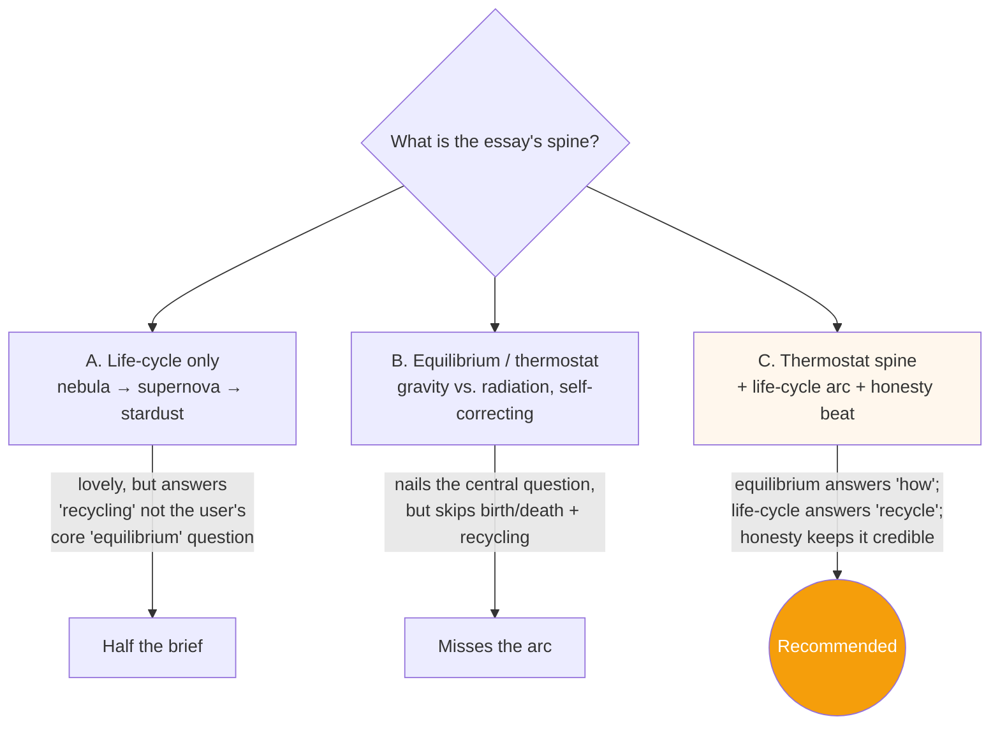
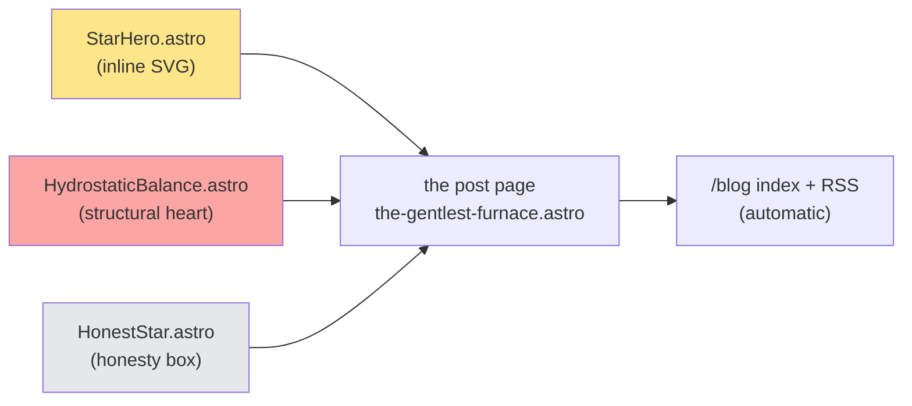
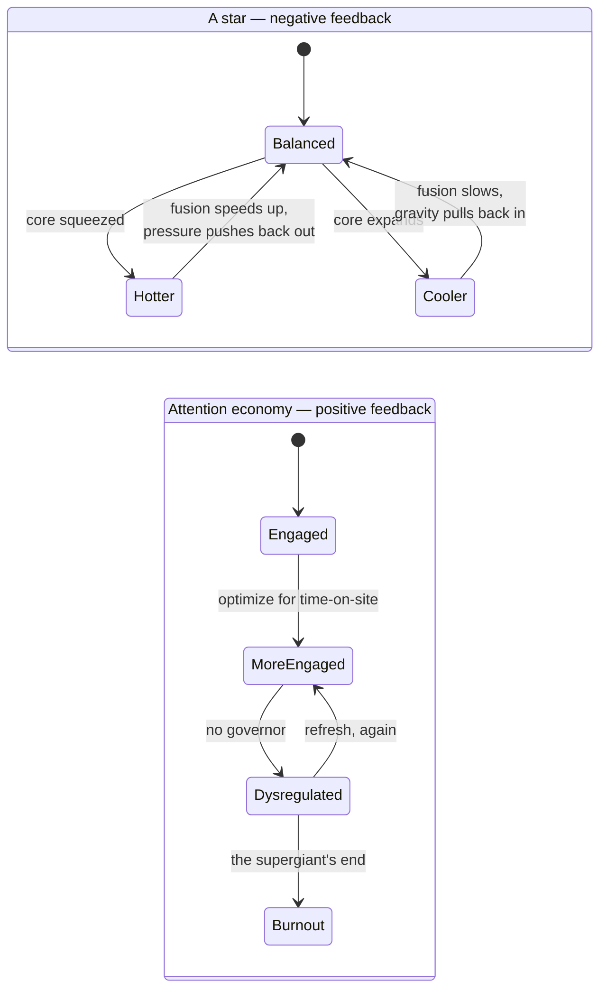
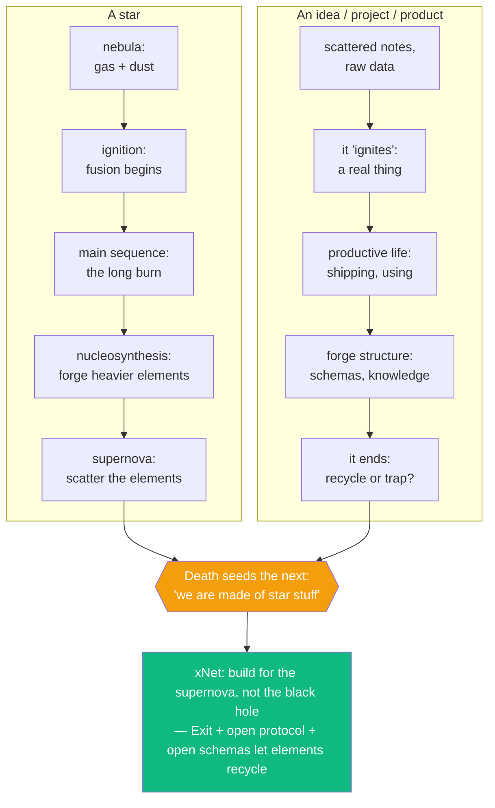
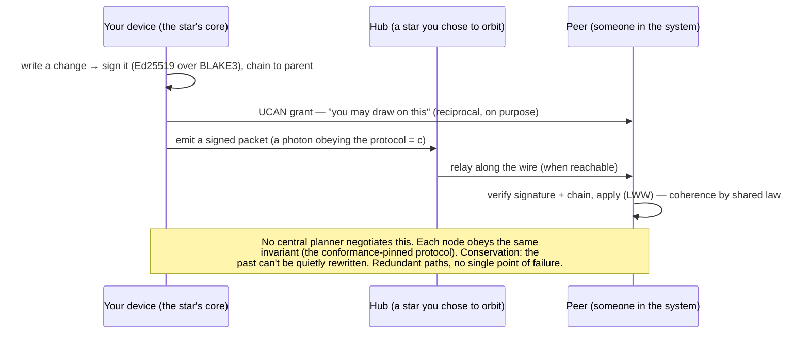
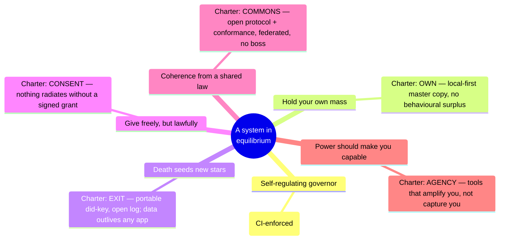

# The Gentlest Furnace — Stellar Equilibrium, the Life Cycle of Information, and How xNet Burns Long Instead of Burning Out

> _"They own their nervous system and can adapt it as needed. We don't own
> ours… Data should work like soil: an open foundation that lets everything
> grow."_ — [`site/src/components/sections/TheVision.astro`](../../site/src/components/sections/TheVision.astro)
>
> This is the third essay. The first looked **up**, at an open sea. The second
> looked **down**, into the soil. This one looks **up again — all the way up.**

## Problem Statement

The first two blog posts landed well, and the user wants a **third** in the same
essay register. The metaphor this time is the **life cycle of stars**, used to
think about the life cycle of ideas, information, projects, products, and our
relationship to technology. The user's brief, distilled from their own words:

1. **The stellar life cycle ↔ the life cycle of information.** Stars form
   (accretion), live (fusion in equilibrium), and die (supernova / shedding their
   shells) — and in dying they **seed** the next generation. That arc maps onto
   how ideas, projects, and products are born from scattered raw material, do
   their productive work, and then end — but in ending, **recycle**: digested,
   composted, or spread into the wider world. "A constant fusion going on where
   we're constantly accreting more energy, more data, more stuff, but we're also
   digesting old stuff, recycling it, or spreading it."
2. **The physics of information: atoms → electrons → photons.** Information used
   to move as **matter** — carvings, clay, books, sigils made of raw material.
   Now it moves as **electrons** down copper and as **photons** down glass and
   through the vacuum of space. Each step is faster, lighter, subtler, and costs
   **less energy**. As a species we have "tapped into more of the fast-moving,
   subtle nature of our environment."
3. **But the subtle layer made us anxious.** As we moved up the energy ladder we
   became "more mental," and we adapted ourselves to **attention loops** that are
   "all-consuming of our attention, our awareness, our time" — destructive to our
   biology, well-being, and communities.
4. **The star as the model of equilibrium.** A star is stable. It is gentle from
   here. It provides for a whole system. It "doesn't burn itself out and it
   doesn't go dim either — it doesn't explode and it doesn't freeze." **What gives
   a star that equilibrium, and how do we find a similar equilibrium** in a
   digital world that isn't yet attuned to our biology, our nervous systems, or to
   incentive structures aligned with every stakeholder?
5. **The alignment puzzle.** "In a fusion reactor, in the sun, there doesn't feel
   like there's as much misalignment… it looks chaotic from the outside, but
   internally it's quite coherent and stable." How does a star get that
   coherence — and what is the analog for a human system riddled with misaligned
   incentives?

This exploration grounds that essay in (a) the repository's actual architecture
and existing copy, and (b) honest astrophysics — including the part where the
romantic "calm, eternal, harmonious sun" story is, like the "Wood Wide Web,"
half-true and easy to oversell. As with the pirate history and the mycelial
science, **the honesty is the brand**: we borrow the **mechanism**, not the
fairy tale.

## Executive Summary

- **There is a single load-bearing idea, and it answers the user's central
  question directly: a star is stable because of a _thermostat_.** A star sits in
  **hydrostatic equilibrium** — the inward crush of gravity exactly balanced by
  the outward push of radiation/gas pressure — and that balance is _self-
  correcting_ via a **negative feedback loop**: squeeze the core and it heats,
  fusion speeds up, pressure rises, and it pushes back out; let it expand and it
  cools, fusion slows, and gravity pulls it back. A star doesn't explode and
  doesn't freeze because it has a **governor**. This is the essay's spine, and it
  maps one-to-one onto xNet's design choices.
- **The attention economy is the opposite control system: a runaway _positive_
  feedback loop.** Engagement begets engagement begets dysregulation — a system
  with the governor removed. In stellar terms it is not a calm main-sequence
  star; it is a **massive star**: it burns enormously bright, and it **burns
  out** fast and detonates. "Burning out" is not a metaphor we reach for by
  accident — it is the literal fate of a star with too much throughput and no
  brake. The essay's turn: the platforms optimize you into a supergiant; xNet is
  built to let you be a **dwarf that lasts**.
- **The gentleness has a stunning, citable mechanism — and it _is_ the thesis.**
  The Sun's core produces only about **~276 W/m³**, a power density closer to a
  **compost heap or a reptile's metabolism** than to a bomb. The Sun is
  overwhelming only because it is **vast and slow**, not because it is locally
  intense. The lesson for technology that wants to carry huge information without
  frying the people in it: **don't maximize local intensity; be large, patient,
  and bounded.** That is, precisely, local-first + calm-by-default.
- **The life-cycle arc is the second spine, and it's the same federation story
  from below the waves and below the soil, told now from the sky.** Nebula →
  ignition → a long main-sequence burn → nucleosynthesis (forging heavier
  elements) → death that **seeds new stars**. Ideas and projects do the same: raw
  material accretes, ignites, does its work, ends — and its "elements" must be
  free to scatter into the commons and seed what's next. **"We are made of star
  stuff"** becomes a product principle: when an app dies, your data must not die
  with it. That is **Exit** + the open protocol + open schemas, already shipped.
- **Coherence-without-a-boss is real physics, and it's the federation payoff.** A
  star is coherent not because a central planner negotiates its trillion-trillion
  particles into agreement, but because they **all obey one shared law**. xNet's
  analog is concrete: an **open protocol pinned to a corpus of golden-vector
  conformance tests** ([`conformance/`](../../conformance/),
  [`docs/specs/protocol/`](../../docs/specs/protocol/)) — a shared invariant every
  implementation in every language obeys, which is how independent nodes cohere
  without an authority in the middle. Coherence through a shared law, not a
  central nursery — the same move the pirate and soil posts made.
- **Be honest about the star (this is the brand).** The mechanism — hydrostatic
  equilibrium as a self-regulating thermostat — is textbook physics. But the
  romantic gloss (the Sun as serene, eternal, wise, harmoniously aligned) is
  oversold: the Sun's surface is **violence** (flares, coronal mass ejections, a
  15-million-kelvin core); the equilibrium is **temporary** (in ~5 billion years
  it swells to a red giant and may engulf the Earth; Earth's surface life likely
  ends in ~1 billion years as the Sun brightens); the "alignment" is **blind
  physics**, not cooperation; and the gentleness is **specific to small stars** —
  big ones burn out. We keep the mechanism and decline the myth, exactly as
  [`HonestPirate`](../../site/src/components/blog/HonestPirate.astro) and
  [`HonestMycelium`](../../site/src/components/blog/HonestMycelium.astro) did.
- **Recommended vessel: identical to posts #1 and #2.** A hand-authored,
  art-directed `.astro` page at `site/src/pages/blog/the-gentlest-furnace.astro`,
  one new entry in [`site/src/data/blog.ts`](../../site/src/data/blog.ts), three
  bespoke inline-SVG components (a star hero, a "hydrostatic equilibrium vs. the
  runaway loop" panel, and an honesty box), plus an optional changelog entry.
  Zero new infrastructure; the index and RSS pick it up for free. A new
  `'cosmos'` (or `'physics'`) `BlogTag` is the only type change.

## Current State In The Repository

### The brand is already a star — we've just never said so out loud

The single most useful fact for this post: **xNet's own visual identity is a
glowing star.** The brand icon is the **"cosmic-X"** — a glowing X
([memory: brand icon cosmic-X], shipped in PR #70 across web/site/expo/electron),
and the homepage hero already paints with starlight. From the Explore pass:

- [`site/src/components/sections/Hero.astro`](../../site/src/components/sections/Hero.astro)
  — headline **"Your data. Your devices. Your rules."**, set over a **radial
  glow** (`rounded-full bg-indigo-500/[0.07] blur-[120px]`) and a **pulsing
  indicator** (`animate-ping`). That radial glow is, visually, a star's corona.
- Both prior blog heroes already build their art _around the cosmic-X as a
  luminous core_:
  [`PirateHero.astro`](../../site/src/components/blog/PirateHero.astro) flies "an
  xNet cosmic-X flag over a sea of scattered islands," **complete with a
  starfield**; [`MycelialHero.astro`](../../site/src/components/blog/MycelialHero.astro)
  makes "the cosmic-X glow as one luminous node in a branching mycelial web."

So post #3 doesn't introduce the star — it **finally names the thing the logo has
been all along.** The hero can let the cosmic-X _be_ the star: a core in
hydrostatic balance, gravity in and radiation out.

### We already told the "own your nervous system" story — stars complete the trilogy of metaphors

[`site/src/components/sections/TheVision.astro`](../../site/src/components/sections/TheVision.astro)
(homepage) makes the thesis in miniature, and post #2 already expanded its
**mycelium** clause. Its **Tesla/Warp** clause — _"They own their nervous system
and can adapt it as needed. We don't own ours."_ — pairs naturally with the
star's self-regulation: a star **owns its own thermostat**. The three posts then
read as one argument from three vantages:

| Post | Vantage | Natural element | Federation read |
| --- | --- | --- | --- |
| #1 — _A Great Pirate Age_ | Look **up** at the sea | Scattered islands, sea-lanes, flags | Autonomous ports, voluntary routes, no empire |
| #2 — _Data Should Work Like Soil_ | Look **down** into soil | Roots, hyphae, the mycelial web | Reciprocal exchange, no central nursery |
| #3 — _The Gentlest Furnace_ | Look **up and out** at the sky | Stars, orbits, starlight | Many suns, you choose which to orbit; coherence by shared law |

### The shipped architecture maps cleanly onto stellar physics

The same primitives the pirate post mapped to "flags and ships'-logs" and the
soil post mapped to "spores and hyphae" map just as exactly to "gravity and
photons." (Paths confirmed via the Explore pass.)

| Stellar / physics primitive | xNet reality | Code |
| --- | --- | --- |
| **A nebula collapsing under gravity** into a body with its own mass | Scattered data pulled into a single **local-first store** — the gravity well that holds _your_ stuff first | [`packages/data/src/store/store.ts`](../../packages/data/src/store/store.ts), [`packages/sqlite/src/adapters/web.ts`](../../packages/sqlite/src/adapters/web.ts) (event-sourced LWW over OPFS SQLite) |
| **Ignition** — a self-contained seed that lights without a central authority | A self-generated `did:key` (Ed25519); no registry issues it, none can revoke it | [`packages/identity/`](../../packages/identity/) (`did.ts`, `key-bundle.ts`) |
| **Conservation laws** — energy is neither created nor destroyed; the past can't be quietly undone | Every `Change<T>` is **Ed25519-signed over a BLAKE3 hash, chained to its parent**, Lamport-ordered — an append-only record no one can rewrite, not even us | [`packages/sync/src/change.ts`](../../packages/sync/src/change.ts) |
| **Photons carrying energy across the vacuum**, all obeying _c_ | Signed change packets travel device→hub→peer over **one normative wire format** any implementation must match | [`docs/specs/protocol/`](../../docs/specs/protocol/) + golden vectors in [`conformance/`](../../conformance/) |
| **Nucleosynthesis** — fusing light elements into heavier, more valuable ones | **Schemas** compose raw fields into richer structures — "npm for data types," composable and user-extensible | [`packages/data/`](../../packages/data/) (`defineSchema()`), [exploration 0188](./0188_[_]_EXTENSIBLE_SCHEMAS_AND_UNIVERSAL_DATABASE_VIEW.md) |
| **A star you choose to orbit** (or none) | **BYO sync hub** — self-host, managed, or fully offline | [`packages/hub/`](../../packages/hub/) |
| **Reciprocal radiation** — a star gives to its whole system, freely but lawfully | **UCAN capability grants** — you sign permission for a peer to draw on specific data; deliberate, revocable, not extracted | [`packages/identity/src/ucan.ts`](../../packages/identity/src/ucan.ts) |
| **Recycling stardust** — a dying star returns enriched material to the medium, seeding new stars | **Open protocol + open schemas + Exit/export**; **compaction/snapshots/tombstones** digest old changes so the network stays light | [`packages/sync/src/yjs-integrity.ts`](../../packages/sync/src/yjs-integrity.ts) (compaction thresholds, snapshots), `pruneVersionHistory()` in [`packages/data/`](../../packages/data/) |
| **The thermostat / hydrostatic equilibrium** — a governor that prevents both collapse and runaway | The **Calm gate**: a CI check that _bans_ the runaway-loop machinery (infinite scroll, streaks) + local-first (no constant pull to a server) + bounded query windows | [`scripts/check-humane-patterns.mjs`](../../scripts/check-humane-patterns.mjs); bounded window in [memory: useQuery perf frontier] |

### The Charter is already a set of "conservation laws"

[`docs/CHARTER.md`](../../docs/CHARTER.md) and its rendered form
([`site/src/pages/commitments.astro`](../../site/src/pages/commitments.astro),
data in [`site/src/data/commitments.ts`](../../site/src/data/commitments.ts)) read,
for this post, like the **invariants a healthy energy system obeys**. The six
commitments, verbatim from the data module:

- **Own** — "You hold the master copy." _(enforced — no third-party ad/analytics SDKs)_
- **Exit** — "Leaving is your right, and it loses nothing." _(architectural — portable protocol + identity)_ → **this is "we are made of star stuff": your data outlives any one app.**
- **Calm** — "We compete for your wellbeing, not your time." _(enforced — a CI gate bans dark-pattern primitives)_ → **this is the thermostat.**
- **Consent** — "Nothing leaves without permission." _(enforced — off by default)_ → **reciprocal radiation.**
- **Agency** — "AI makes you more capable, not less." _(architectural — scaffold-by-default, provenance-tagged)_
- **Commons** — "You own your audience and your space." _(building — BYO hub today)_

And the Calm commitment is **enforced as a build failure**.
[`scripts/check-humane-patterns.mjs`](../../scripts/check-humane-patterns.mjs)
bans, by regex, the exact mechanics of a runaway feedback loop (quoted from the
Explore pass):

- **`infinite scroll`** → _"design for an end — virtualize a bounded window instead of an endless feed"_
- **`streak counter`** (`streakCount`, `dailyStreak`, …) → _"streaks weaponize loss aversion"_
- **`confirmshaming`** → _"let the user decline plainly"_
- **third-party ad/analytics SDKs** (`google-analytics`, `fbevents`, `mixpanel`, `@segment/`, `amplitude`, `hotjar`, `fullstory`, …) → _"no behavioral-surplus pipeline"_

That is, almost literally, _"we do not install the positive-feedback machinery
that keeps your nervous system revved past equilibrium,"_ enforced in CI.

### "You are the cargo" — the dysregulation receipts already exist

[`site/src/pages/why.astro`](../../site/src/pages/why.astro) + data in
[`site/src/data/surveillance.ts`](../../site/src/data/surveillance.ts) hold the
cited figures the dysregulation beat needs: an average person's data reached one
platform from **2,230 separate companies over three years**
(`COMPANIES_PER_USER = 2230`; Consumer Reports / The Markup, 2024, with the
honest caveat that the panel self-selected for privacy-aware users), and
combining browser + device signals can fingerprint **~99% of users with no cookie
at all** (EFF Cover Your Tracks). This is the system **running you hot on
purpose** — the supergiant business model.

### The cold-start work is, structurally, "be gentle per unit"

A run of performance explorations is the engineering expression of the
compost-heap lesson — reduce intensity, spread the work, don't block the user in a
hot loop:
[`0204_[x]_FAST_LOCAL_FIRST_COLD_START_AND_CACHE_HYDRATION.md`](./0204_[x]_FAST_LOCAL_FIRST_COLD_START_AND_CACHE_HYDRATION.md),
plus boot-stall / parallel-reads work (0227–0229). Useful as a quiet footnote
that the gentleness is engineered, not just asserted.

### The vessel is proven (twice)

There is **no MDX/content collection**; each post is a hand-authored `.astro`
page + metadata in [`site/src/data/blog.ts`](../../site/src/data/blog.ts)
(`posts[]`, `publishedPosts()`, `postBySlug()`, `formatPostDate()`), rendered by
the index ([`site/src/pages/blog/index.astro`](../../site/src/pages/blog/index.astro))
and the feed ([`site/src/pages/blog/rss.xml.ts`](../../site/src/pages/blog/rss.xml.ts)).
Posts #1 and #2 each shipped **three bespoke components** (a hero, a structural
"heart" card, an honesty box). `BlogTag` currently is
`'essay' | 'philosophy' | 'privacy' | 'decentralization' | 'protocol' | 'nature'`
— add `'cosmos'` (or `'physics'`).

> **Gotcha to carry forward** ([memory: 0240 mycelial blog]): the changelog has a
> generator — `scripts/changelog/new.mjs` writes into `site/src/data/changelog/`.
> If you announce the post, use the generator **or** hand-author one file, **not
> both**, or you get duplicate cards.

## External Research

### How a star actually stays stable (the well-established mechanism)

- **Hydrostatic equilibrium.** At every layer of a stable star, the inward pull
  of gravity is balanced by outward gas + radiation pressure. Pressure rises with
  depth because deeper layers carry more weight, which means temperature rises
  toward the core — and the core's fusion supplies the heat that maintains the
  pressure. ([Teach Astronomy — Hydrostatic Equilibrium](https://www.teachastronomy.com/textbook/Properties-of-Stars/Hydrostatic-Equilibrium/),
  [CliffsNotes — Hydrostatic Equilibrium](https://www.cliffsnotes.com/study-guides/astronomy/the-structure-of-stars/hydrostatic-equilibrium))
- **The self-regulating thermostat (the key to the whole essay).** The balance is
  _self-correcting_. If gravity momentarily wins, the core contracts and heats,
  fusion **speeds up**, pressure rises, and the star pushes back out; if pressure
  wins, the star expands and cools, fusion **slows**, and gravity pulls it back.
  "Any slight deviation from this equilibrium will immediately lead to a rapid
  reaction to restore it." A star is, functionally, a **negative-feedback
  governor**. ([UMass — The Sun and Stellar Structure](https://people.umass.edu/wqd/strobel/starsun/strsunb.htm),
  [Teach Astronomy](https://www.teachastronomy.com/textbook/Properties-of-Stars/Hydrostatic-Equilibrium/))
- **The gentleness paradox (the thesis fact).** The Sun's core fusion power
  density is only **~276 W/m³** — "more nearly approximating reptile metabolism
  than a thermonuclear bomb," comparable to an active **compost heap**. The Sun's
  staggering total output (~3.8 × 10²⁶ W) comes from its **size**, not from local
  intensity. ([Physics Forums — 276 W/m³ in the Sun's core](https://www.physicsforums.com/threads/power-in-suns-core-comparing-10-26-w-to-276-w-m-3.781399/);
  the compost-heap comparison is widely cited from the Sun's fusion-power figures)

### The stellar life cycle (the second spine)

- **Birth from a nebula.** Stars condense from collapsing clouds of gas and dust.
  Gravity pulls the cloud together; it spins and heats into a **protostar**; when
  the core reaches ~15 million K, **fusion ignites** and it settles onto the
  **main sequence**. ([Lumen — Stellar Life Cycle](https://courses.lumenlearning.com/suny-earthscience/chapter/stellar-life-cycle/),
  [NASA — Life Cycles of Stars](https://imagine.gsfc.nasa.gov/educators/lessons/xray_spectra/background-lifecycles.html))
- **The long productive life.** Stars spend **most** of their lives on the main
  sequence, fusing hydrogen into helium — a long, stable, productive phase.
- **Death that creates.** Low-mass stars shed planetary nebulae and leave white
  dwarfs; massive stars detonate as **supernovae**. Either way the outer layers
  are **ejected into space**, enriching the galaxy with elements forged in the
  star (**stellar nucleosynthesis** — up to iron in cores, heavier elements in
  supernovae). Those elements "foster the creation of new stars and planets." The
  death seeds the next generation — the literal, cited basis for "we are made of
  star stuff." ([NASA](https://imagine.gsfc.nasa.gov/educators/lessons/xray_spectra/background-lifecycles.html),
  [Lumen](https://courses.lumenlearning.com/suny-earthscience/chapter/stellar-life-cycle/))

### The physics of information: atoms → electrons → photons

- **Information is physical, and it has a price.** **Landauer's principle** (Rolf
  Landauer, 1961): erasing one bit of information has a minimum thermodynamic
  cost of **k_B·T·ln 2** of energy, released as heat. Information processing is
  bound to thermodynamics — "information is physical." ([Landauer Principle — PMC review](https://pmc.ncbi.nlm.nih.gov/articles/PMC7514250/),
  [Quantum Zeitgeist — the Landauer limit](https://quantumzeitgeist.com/landauer-limit-why-erasing-a-bit-generates-heat/))
- **The historical ladder the user described is real.** Information moved first as
  **matter** (stone, clay tablets, parchment, books — "cumbersome to store and
  transport"), then the printing press slashed the cost of copying, then it moved
  as **electrons** (telegraph, copper), and now as **photons**: fiber-optic
  systems carry **>99% of the world's transmitted data**, a laser converting
  signals into "photons — tiny particles of electromagnetic energy" sent down
  hair-thin glass. Each rung is faster, lighter, and cheaper per bit; radio and
  light even cross the **vacuum of space**. ([Medium — Evolution of Data Storage](https://medium.com/predict/the-evolution-of-data-storage-from-clay-tablets-to-quantum-computing-c1d8cc3cf8df),
  [Corning — How optical fiber works](https://www.corning.com/emea/en/innovation/the-glass-age/science-of-glass/how-it-works-optical-fiber.html))

### Where the romantic story breaks down (the honesty beat)

The "calm, eternal, harmonious sun" is as oversold as the "Wood Wide Web," and
the post must say so:

- **The Sun is not serene — it is violence at a safe distance.** A 15-million-
  kelvin core; a surface that throws **solar flares** and **coronal mass
  ejections**. The calm we feel is a function of **scale and 150 million km of
  distance**, not the absence of fury. ([UMass — Stellar Structure](https://people.umass.edu/wqd/strobel/starsun/strsunb.htm))
- **The equilibrium is temporary, and it ends in fire.** In ~5 billion years the
  Sun swells into a **red giant** ~200× its size and may engulf the inner planets;
  Earth's surface life likely ends far sooner — in roughly **1 billion years**, as
  the steadily brightening Sun boils the oceans. "The end of the red giant phase
  is typically the most violent time in a star's life." Stability is a **phase,
  not a permanent virtue**. ([The Conversation — 1 billion years left](https://theconversation.com/the-sun-wont-die-for-5-billion-years-so-why-do-humans-have-only-1-billion-years-left-on-earth-37379),
  [Space.com — Red giant stars](https://www.space.com/22471-red-giant-stars.html),
  [Quanta — when the Sun eats the Earth](https://www.quantamagazine.org/new-clues-for-what-will-happen-when-the-sun-eats-the-earth-20231220/))
- **The "alignment" is blind physics, not cooperation.** A star's coherence isn't
  a harmonious community of agreeing particles; it's a vast number of particles
  all obeying the **same law** (gravity + the feedback loop) with no negotiation,
  no stakeholders, no central planner. Don't anthropomorphize "the star found
  peace." (The honesty discipline mirrors
  [_"Mother trees, altruistic fungi, and the perils of plant personification"_](https://www.sciencedirect.com/science/article/abs/pii/S1360138523002728)
  from post #2.)
- **The gentleness is specific to small, slow stars — big ones burn out.**
  Luminosity scales steeply with mass (≈ mass³–⁴). A 10-solar-mass star is
  ~10,000× brighter and lives only ~**20 million years**; a 60-solar-mass star,
  ~**3 million**, then detonates. A **0.1-solar-mass red dwarf** can burn for up
  to **~10 trillion years**. "Live fast and die young," literally. The
  attention-economy creature is the supergiant; the model to emulate is the
  **dwarf that lasts**. ([Astronomy.com — red/brown dwarf lifetimes](https://www.astronomy.com/science/if-supermassive-stars-burn-their-fuel-in-millions-of-years-and-solar-mass-stars-like-our-sun-last-billions-of-years-then-how-long-is-the-life-of-a-red-or-brown-dwarf-star/),
  [Space.com — Main sequence stars](https://www.space.com/22437-main-sequence-star.html))

**What survives the critique, and is enough for our metaphor:** hydrostatic
equilibrium as a **self-regulating negative-feedback thermostat**; the
**nebula→fusion→nucleosynthesis→seeding** life cycle; **coherence from a shared
law, not a planner**; and the **size-not-intensity** source of the Sun's
gentleness. We take the **mechanism** and decline the **myth** (serene, eternal,
wise, harmoniously aligned). Same discipline as the two prior posts.

### The dysregulation we feel (continuity with post #2)

The body-side science carries straight over from
[exploration 0240](./0240_[x]_DATA_SHOULD_WORK_LIKE_SOIL_THE_MYCELIAL_NETWORK_AND_THE_NERVOUS_SYSTEM_OF_XNET.md):
chronic stress without recovery raises **allostatic load**, shows up as reduced
**heart-rate variability** and depleted **vagal tone**, and the longer the system
stays revved the harder it is to climb back to calm. A nervous system stuck "on"
is a star with a broken thermostat. (Cited there; reuse, don't re-litigate.)

## Key Findings

1. **The thermostat is the spine.** The user's literal question — "what gives a
   star equilibrium, and how do we find a similar one?" — has a precise,
   transferable answer: a **negative-feedback governor balancing two opposing
   forces.** Everything in the essay should hang from that rope. It is also the
   single most _accurate_ part of the metaphor, which keeps the brand honest.
2. **The attention economy is the named antagonist, and it's a real control-
   systems contrast, not a vibe.** Runaway **positive** feedback (engagement →
   engagement) vs. self-correcting **negative** feedback (the star). "Burnout" is
   the literal supergiant fate. This makes the critique rigorous rather than
   moralizing.
3. **"Gentle because vast and slow" (~276 W/m³) is the most surprising, most
   sticky, most on-strategy fact in the whole piece.** It reframes calm not as
   doing-less but as **not maximizing local intensity** — which is exactly what
   local-first + bounded feeds are. Lead the hero or the close with it.
4. **The life-cycle arc gives the post its hope and its product payoff.** Ideas,
   projects, and products are _supposed_ to die; the question is whether their
   elements are **trapped** (a black hole — extraction) or **recycled** (a
   supernova seeding new stars — Exit + open protocol + open schemas). "We are
   made of star stuff" = your data outlives any one app.
5. **Coherence-from-a-shared-law is the cleanest statement yet of why an open
   protocol beats a central authority.** A star needs no boss; it needs an
   invariant. xNet's invariant is the **conformance-pinned protocol**. This
   directly answers the user's "misalignment / everyone churning on the same
   problem" thread — and it's literally true of the codebase.
6. **Honesty about the romantic sun is mandatory and is a feature.** Violent,
   temporary, blind, size-specific. Riding the serene-eternal-sun fairy tale would
   betray the same discipline that made posts #1 and #2 credible.
7. **It completes a trilogy by elevation: sea (up) → soil (down) → sky (up and
   out).** Same federation shape, three vantages. The brand icon being a star
   means the third post _names what the logo always was_.
8. **Vessel is solved — reuse posts #1/#2 exactly.** No new infra; `site/` is not
   under root eslint/prettier ([memory]); marketing pages live in
   `site/src/pages/`. Mind the changelog-generator dup gotcha.

## Options And Tradeoffs

### Framing / spine



- **A. Life-cycle only.** Covers the user's "accrete / digest / recycle / spread"
  thread beautifully, but under-answers their _emphasized_ question — what gives a
  star its **equilibrium** — and risks a bolted-on "…and that's like our
  database!" ending.
- **B. Thermostat only.** Directly answers "how does a star stay stable and how do
  we," and gives the sharpest attention-economy contrast — but drops the birth /
  death / recycling arc the user clearly loves.
- **C. (Recommended) Thermostat spine + life-cycle arc + honesty beat.** The
  thermostat is the through-line (answers _how_); the life cycle is the secondary
  movement (answers _recycle/seed_); the honesty box earns trust; the close
  delivers both payoffs — _find your equilibrium_ (Calm/local-first) and _let
  things recycle_ (Exit/open protocol).

### Title / slug

| Title direction | Vibe | Note |
| --- | --- | --- |
| **"The Gentlest Furnace"** | Paradox, warm, distinctive | **Recommended.** Lifts the ~276 W/m³ / compost-heap thesis; sets up "huge energy, gentle from here." Slug `the-gentlest-furnace`. |
| "How to Burn Without Burning Out" | Direct, self-helpy | Most legible promise; pairs the thermostat + supergiant burnout. Strong populist alt. Slug `burn-without-burning-out`. |
| "Made of Star Stuff" | Lyrical, Sagan echo | Leads with the recycling/Exit payoff; slightly less about equilibrium. |
| "The Long Burn" | Short, trilogy-symmetric (Sea/Soil/Stars) | Clean, but a touch oblique alone. |
| "What the Sun Knows" | Mirrors post #2's lyric register | Risks the personification the honesty beat is built to avoid. |

### Vessel (settled; stated for completeness)

| Option | Verdict |
| --- | --- |
| Reuse posts #1/#2 `.astro` + `blog.ts` grain | **Recommended.** Proven twice, zero new infra, consistent craft. |
| Introduce an MDX content collection now | Rejected. Premature; the blog deliberately avoids MDX. |
| One-off landing page outside `/blog` | Rejected. We have a blog; this is what it's for. |

## Recommendation

**Ship Option C as the third blog post, titled _"The Gentlest Furnace,"_** reusing
the posts #1/#2 vessel, with the same honesty discipline. A **seven-beat spine**
that mirrors the prior posts and completes the elevation trilogy:

1. **Hook — look up, all the way up.** Post #1 set sail; post #2 put down roots;
   now look up. The thing in our own logo has been a star all along. The Sun
   carries the energy of a billion bombs and yet feels _calm_ from here — and that
   calm is not an accident. Open on the **~276 W/m³ / compost-heap** paradox: the
   Sun is gentle not because it's weak but because it's **vast and slow**.
2. **What keeps it from exploding or freezing — the thermostat.** Hydrostatic
   equilibrium: gravity in, radiation out, balanced by a **self-correcting
   negative-feedback loop**. Squeeze it → it heats → it pushes back; let it go →
   it cools → it pulls back in. The user's exact words — "it doesn't explode and
   it doesn't freeze" — answered with real physics.
3. **The physics of information: atoms → electrons → photons.** The ladder we
   climbed — clay and books (matter) → copper (electrons) → glass and radio
   (photons, even through vacuum), each rung lighter, faster, cheaper per bit
   (Landauer; fiber carries >99% of the world's data). We tapped the subtle,
   fast layer of the world.
4. **But we climbed the energy ladder and left our nervous systems behind.** The
   subtle layer made us "more mental," and we wired ourselves into **attention
   loops** — a **runaway _positive_-feedback** machine, the opposite of the star's
   governor. In stellar terms it's not a calm dwarf; it's a **supergiant**: burns
   bright, burns _you_, dies young. The receipts: **2,230 companies**,
   **~99% fingerprintable** ([`/why`](../../site/src/pages/why.astro)) — the
   system running you hot on purpose. **You are the fuel.** (Callback to the
   pirate "you are the cargo.")
5. **Honesty box — an honest star.** The serene-eternal-harmonious Sun is
   oversold: it's **violent** up close (flares, CMEs, a 15-MK core); its
   equilibrium is **temporary** (red giant in ~5 Gyr; Earth's surface life gone in
   ~1 Gyr); its "alignment" is **blind physics, not cooperation**; and the
   gentleness is **specific to small stars** — big ones burn out. We keep the
   **mechanism** (a self-regulating governor; coherence from a shared law; size,
   not intensity) and leave the **myth**. Modeled on
   [`HonestPirate`](../../site/src/components/blog/HonestPirate.astro) /
   [`HonestMycelium`](../../site/src/components/blog/HonestMycelium.astro).
6. **How a star is coherent without a boss — and how we build that.** A star
   needs no central planner; its trillion-trillion particles **all obey one law**.
   xNet's law is an **open protocol pinned to golden-vector conformance tests** —
   the shared invariant that lets independent nodes, apps, and languages cohere
   with no authority in the middle. This is the user's "misalignment" thread
   answered: **alignment comes from a shared invariant, not from a stakeholder
   negotiation.** Then the architecture beat: your gravity well (local-first
   store), your ignition (`did:key`), conservation laws (signed, hash-chained
   log), photons obeying _c_ (the wire format), nucleosynthesis (composable
   schemas), the sun you choose to orbit (BYO hub), reciprocal radiation (UCAN
   consent). **Own your thermostat; don't rent it.**
7. **Finding equilibrium — and letting things recycle.** Two payoffs braided:
   - **Install a governor.** Calm by default (no infinite scroll, no streaks —
     enforced in CI), local-first (no constant pull to a server), bounded windows.
     **Be vast and slow, not locally intense.** That's how you carry enormous
     information without frying the person carrying it.
   - **Accept the life cycle; build for the supernova, not the black hole.** Ideas
     and projects are _meant_ to end. The only question is whether their elements
     are **trapped** (extraction) or **scattered into the commons to seed the next
     star** (Exit + open protocol + open schemas; compaction digesting the old).
     **We are made of star stuff** → your data outlives any one app.
   - **CTA + trilogy close:** use the app, read the commitments, build on the open
     substrate. "We set out to sea; we put down roots; now we've named the star.
     Same open world — just look up."

Plus the same **IP/honesty hygiene**: original inline-SVG art only; every factual
claim cited (the 276 W/m³ figure, Landauer, the life cycle, the red-giant
timeline, the mass–lifetime relation, Tesla Warp framing); a note that the
"serene, eternal sun" is a popular gloss, not the physics.

### Components to build (three, for parity with #1/#2)



- **`StarHero.astro`** — the cosmic-X _as_ a star in hydrostatic balance: a glowing
  core with two opposing arrow sets (gravity inward, radiation outward) and a
  faint starfield; optionally a thin life-cycle ribbon (nebula → star → planetary
  nebula). The trilogy's third vantage — looking up and out. Inline SVG only,
  reusing the [`PirateHero`](../../site/src/components/blog/PirateHero.astro) /
  [`MycelialHero`](../../site/src/components/blog/MycelialHero.astro) gradient idiom.
- **`HydrostaticBalance.astro`** — the structural heart (mirrors
  [`ThreeNervousSystems`](../../site/src/components/blog/ThreeNervousSystems.astro)):
  a `not-prose` card contrasting **the star's self-correcting governor** with
  **the attention economy's runaway loop**, landing the single axis
  _self-regulating · bounded · long-lived_ vs. _runaway · maximal · burns out_.
- **`HonestStar.astro`** — the honesty box (mirrors
  [`HonestMycelium`](../../site/src/components/blog/HonestMycelium.astro)): violent,
  temporary, blind, size-specific — what we keep vs. what we decline.

## Example Code

### The thermostat vs. the runaway loop (the post's central contrast)



### Three life cycles, one arc (a star · an idea · a product)



### Reciprocal radiation — a change packet travels like a photon



### A star's "conservation laws" → the Charter



### Adding post #3 (the vessel — mirrors #1/#2 exactly)

```ts
// site/src/data/blog.ts — add 'cosmos' to BlogTag, push one object onto posts[]
{
  slug: 'the-gentlest-furnace',
  title: 'The Gentlest Furnace',
  description:
    'A star carries the energy of a billion bombs and still feels calm from ' +
    'here. What hydrostatic equilibrium — the thermostat that keeps a star ' +
    'from exploding or going cold — teaches us about information, attention, ' +
    'and building technology that burns long instead of burning out.',
  pubDate: '2026-07-11T15:00:00Z', // newest-first ordering is by pubDate
  author: 'xNet',
  tags: ['essay', 'philosophy', 'cosmos'], // add 'cosmos' (or 'physics') to BlogTag
  readingMinutes: 12
}
```

```astro
---
// site/src/pages/blog/the-gentlest-furnace.astro  (same shape as #1/#2)
import Base from '../../layouts/Base.astro'
import Nav from '../../components/sections/Nav.astro'
import Footer from '../../components/sections/Footer.astro'
import StarHero from '../../components/blog/StarHero.astro'                 // new
import HydrostaticBalance from '../../components/blog/HydrostaticBalance.astro' // new
import HonestStar from '../../components/blog/HonestStar.astro'            // new
import { postBySlug, formatPostDate } from '../../data/blog'

const post = postBySlug('the-gentlest-furnace')!
---
<Base title={`${post.title} — xNet`} description={post.description}>
  <Nav />
  <main>
    <StarHero title={post.title} deck={post.description}
      date={formatPostDate(post.pubDate)} readingMinutes={post.readingMinutes} tags={post.tags} />
    <article class="prose prose-lg mx-auto max-w-3xl px-6 py-16 dark:prose-invert
      prose-headings:tracking-tight prose-a:text-amber-600 dark:prose-a:text-amber-400">
      <!-- seven beats; <HydrostaticBalance/> and <HonestStar/> embedded -->
    </article>
  </main>
  <Footer />
</Base>
```

> Note the prose accent shifts per post for identity (pirate = indigo, soil =
> emerald, star = **amber/gold**). Keep the inline-SVG-only rule so the page ships
> **zero** third-party requests (Self-Audit parity with #1/#2).

## Risks And Open Questions

- **Romanticization / scientific overreach (most important).** The serene-eternal-
  harmonious Sun is a popular gloss; the real Sun is violent, temporary, blind,
  and its gentleness is size-specific. If the honesty box is cut for length, the
  post peddles a fairy tale and forfeits the brand's credibility. **The honesty
  beat is load-bearing**, exactly as in #1/#2.
- **"Burn out" cuts both ways.** The supergiant framing is the antagonist, but the
  title family ("The Gentlest Furnace," "burn") must not accidentally valorize
  burning. Keep the verb tied to the **dwarf-that-lasts**, not the supergiant.
- **Metaphor sprawl.** Equilibrium + life cycle + Landauer + atoms/electrons/
  photons + attention economy + nervous system + Tesla + the prior two posts is a
  lot of threads. Mitigation: the **thermostat** is the rope; the **life-cycle
  arc** is the one secondary movement; cut anything that hangs from neither. Keep
  the trilogy callbacks to a couple of lines ("sea, soil, now sky").
- **Physics nitpicks.** Astrophysics readers will catch loose claims. Mitigation:
  cite the specifics (276 W/m³; ~15 MK core; red giant in ~5 Gyr / surface life
  ~1 Gyr; mass³–⁴ luminosity; 10 trillion-year red dwarfs) and phrase the
  thermostat as the standard negative-feedback account.
- **Tesla as exemplar.** Politically polarizing. Mitigation: keep it strictly
  architectural ("own vs. rent your thermostat/nervous system"), echoing the
  even-handed "love them or hate them" framing already in
  [`TheVision.astro`](../../site/src/components/sections/TheVision.astro).
- **Wellness-metaphor drift.** "Nervous-system regulation / equilibrium" is having
  a cultural moment and can read as woo. Mitigation: anchor in control-systems
  language (negative vs. positive feedback, governors) and cited physiology;
  avoid therapeutic claims.
- **Don't claim a fusion/energy _product_ exists.** xNet has no energy features;
  the star is a **lens**, not a roadmap. Frame all architecture mappings as
  analogy onto the **shipped** substrate (identity, signed log, local-first,
  schemas, hub, protocol).
- **Cadence / series identity.** Three posts is now a trilogy (sea / soil / sky).
  _Open question:_ brand it explicitly as a trilogy (and stop), or keep it a loose
  anthology open to a fourth? Recommend stating the trilogy in the close but not
  over-committing.

## Implementation Checklist

- [x] Confirm title **"The Gentlest Furnace"** + slug `the-gentlest-furnace`
      (alt: "How to Burn Without Burning Out" / `burn-without-burning-out`).
- [x] Add `'cosmos'` (and/or `'physics'`) to the `BlogTag` union in
      [`site/src/data/blog.ts`](../../site/src/data/blog.ts) and push the post #3
      metadata object onto `posts[]` (pubDate newest).
- [x] Create `site/src/pages/blog/the-gentlest-furnace.astro` following the
      seven-beat spine in [Recommendation](#recommendation), mirroring
      [`data-should-work-like-soil.astro`](../../site/src/pages/blog/data-should-work-like-soil.astro).
- [x] Build `site/src/components/blog/StarHero.astro` (original inline SVG; the
      cosmic-X as a star in hydrostatic balance, gravity-in/radiation-out arrows,
      starfield; no third-party assets).
- [x] Build `site/src/components/blog/HydrostaticBalance.astro` (the star's
      governor vs. the attention economy's runaway loop → one axis), reusing the
      `not-prose` card idiom from
      [`ThreeNervousSystems`](../../site/src/components/blog/ThreeNervousSystems.astro).
- [x] Build `site/src/components/blog/HonestStar.astro` (violent · temporary ·
      blind · size-specific — keep the mechanism, leave the myth), mirroring
      [`HonestMycelium`](../../site/src/components/blog/HonestMycelium.astro).
- [x] Write the prose: the 276 W/m³ gentleness paradox; hydrostatic equilibrium as
      a thermostat; atoms→electrons→photons + Landauer; the runaway-loop /
      "you are the fuel" turn (link [`/why`](../../site/src/pages/why.astro)); the
      honesty beat; coherence-from-a-shared-law + the architecture mapping; the
      "find equilibrium / build for the supernova" close.
- [x] Cross-link: [`/why`](../../site/src/pages/why.astro),
      [`/commitments`](../../site/src/pages/commitments.astro),
      [`/build-with`](../../site/src/pages/build-with.astro), the homepage
      _Vision_ section, and **both** prior posts (the trilogy callback).
- [x] Cite every claim (276 W/m³ / compost heap; hydrostatic equilibrium;
      Landauer; fiber >99%; nebula→supernova→nucleosynthesis; red giant ~5 Gyr /
      surface life ~1 Gyr; mass³–⁴ + red-dwarf 10-Tyr lifetimes; Tesla Warp).
      Consider a `site/src/data/cosmos.ts` claims module if stats grow (mirrors
      [`surveillance.ts`](../../site/src/data/surveillance.ts)).
- [x] Add the not-affiliated / independent-essay footer note (Tesla referenced as
      commentary; "serene eternal sun" is a popular gloss; original art only), per
      the #1/#2 pattern.
- [x] (Optional) Announce via the changelog — use **either**
      `node scripts/changelog/new.mjs` **or** a single hand-authored file in
      `site/src/data/changelog/`, **not both** ([memory: 0240 dup-card gotcha]).

## Validation Checklist

- [x] `pnpm --filter site build` succeeds; `/blog` lists post #3 newest-first and
      `/blog/the-gentlest-furnace` renders.
- [x] `/blog/rss.xml` stays well-formed and includes the new item (title, link,
      pubDate, description).
- [x] Self-audit parity with #1/#2: the page ships **0 third-party trackers / 0 ad
      SDKs** (the [`check-humane-patterns.mjs`](../../scripts/check-humane-patterns.mjs)
      gate enforces this repo-wide); hero art is inline SVG, no external requests.
- [x] Every factual claim is sourced; the honesty box about the
      violent/temporary/blind/size-specific star is present and not cut.
- [x] A reader who knows no astrophysics still follows and is moved — the
      thermostat spine carries it; jargon (hydrostatic equilibrium, nucleosynthesis,
      Landauer) is defined in plain words on first use.
- [x] Mobile + dark-mode pass; `prose`/`not-prose` boundaries render correctly as
      in #1/#2; amber accent reads in both themes.
- [x] Lint/format: `site/` is **not** covered by root eslint/prettier
      ([memory: multi-language docs gotcha]); run the site's own checks.
- [x] All architecture mappings are framed as analogy onto the **shipped**
      substrate — no implication that xNet has energy/fusion features.
- [x] Trilogy callbacks to posts #1/#2 resolve (links live; "sea / soil / sky"
      framing coherent).

## References

### Repository

- [`site/src/components/sections/Hero.astro`](../../site/src/components/sections/Hero.astro) — "Your data. Your devices. Your rules." over a radial glow (a star's corona)
- [`site/src/components/sections/TheVision.astro`](../../site/src/components/sections/TheVision.astro) — Tesla/Warp "own your nervous system" + "data should work like soil"
- [`site/src/pages/blog/a-great-pirate-age.astro`](../../site/src/pages/blog/a-great-pirate-age.astro), [`site/src/pages/blog/data-should-work-like-soil.astro`](../../site/src/pages/blog/data-should-work-like-soil.astro) + [`site/src/data/blog.ts`](../../site/src/data/blog.ts) — the proven vessel and the two prior posts
- [`site/src/components/blog/`](../../site/src/components/blog/) — `PirateHero`, `MycelialHero`, `ThreeNervousSystems`, `HonestPirate`, `HonestMycelium` idioms to mirror
- [`docs/CHARTER.md`](../../docs/CHARTER.md) + [`site/src/data/commitments.ts`](../../site/src/data/commitments.ts) — the "conservation laws" (Own/Exit/Calm/Consent/Agency/Commons)
- [`scripts/check-humane-patterns.mjs`](../../scripts/check-humane-patterns.mjs) — the enforced "no runaway-loop" gate (infinite scroll, streaks, confirmshaming, ad/analytics SDKs)
- [`packages/identity/`](../../packages/identity/) (`did.ts`, `ucan.ts`), [`packages/sync/src/change.ts`](../../packages/sync/src/change.ts), [`packages/sync/src/yjs-integrity.ts`](../../packages/sync/src/yjs-integrity.ts), [`packages/data/src/store/store.ts`](../../packages/data/src/store/store.ts), [`packages/hub/`](../../packages/hub/) — ignition, reciprocal radiation, conservation laws, recycling, gravity well, the sun you orbit
- [`docs/specs/protocol/`](../../docs/specs/protocol/) + [`conformance/`](../../conformance/) — the shared invariant (coherence without a boss)
- [`site/src/pages/why.astro`](../../site/src/pages/why.astro) + [`site/src/data/surveillance.ts`](../../site/src/data/surveillance.ts) — "you are the fuel" (2,230 companies; ~99% fingerprintable)
- [`0204_[x]_FAST_LOCAL_FIRST_COLD_START_AND_CACHE_HYDRATION.md`](./0204_[x]_FAST_LOCAL_FIRST_COLD_START_AND_CACHE_HYDRATION.md) — "gentle per unit" engineered, not asserted
- [exploration 0239](./0239_[x]_A_GREAT_PIRATE_AGE_ONE_PIECE_AND_THE_XNET_ETHOS.md) and [exploration 0240](./0240_[x]_DATA_SHOULD_WORK_LIKE_SOIL_THE_MYCELIAL_NETWORK_AND_THE_NERVOUS_SYSTEM_OF_XNET.md) — posts #1/#2, the format, tone, and honesty discipline

### Stellar physics (the well-established mechanism)

- [Teach Astronomy — Hydrostatic Equilibrium](https://www.teachastronomy.com/textbook/Properties-of-Stars/Hydrostatic-Equilibrium/) and [CliffsNotes — Hydrostatic Equilibrium](https://www.cliffsnotes.com/study-guides/astronomy/the-structure-of-stars/hydrostatic-equilibrium)
- [UMass — The Sun and Stellar Structure](https://people.umass.edu/wqd/strobel/starsun/strsunb.htm) — the self-regulating thermostat
- [Physics Forums — Sun's core ~276 W/m³](https://www.physicsforums.com/threads/power-in-suns-core-comparing-10-26-w-to-276-w-m-3.781399/) — the gentleness-by-size paradox (compost-heap power density)
- [NASA — Life Cycles of Stars](https://imagine.gsfc.nasa.gov/educators/lessons/xray_spectra/background-lifecycles.html) and [Lumen — Stellar Life Cycle](https://courses.lumenlearning.com/suny-earthscience/chapter/stellar-life-cycle/) — nebula → main sequence → supernova → nucleosynthesis → seeding

### The honesty beat (what's oversold)

- [The Conversation — the Sun won't die for 5 Gyr, but Earth has ~1 Gyr](https://theconversation.com/the-sun-wont-die-for-5-billion-years-so-why-do-humans-have-only-1-billion-years-left-on-earth-37379)
- [Space.com — Red giant stars & the future of the Sun](https://www.space.com/22471-red-giant-stars.html) and [Quanta — when the Sun eats the Earth](https://www.quantamagazine.org/new-clues-for-what-will-happen-when-the-sun-eats-the-earth-20231220/)
- [Astronomy.com — red/brown dwarf lifetimes (up to ~10 trillion years)](https://www.astronomy.com/science/if-supermassive-stars-burn-their-fuel-in-millions-of-years-and-solar-mass-stars-like-our-sun-last-billions-of-years-then-how-long-is-the-life-of-a-red-or-brown-dwarf-star/) and [Space.com — Main sequence stars (mass–lifetime)](https://www.space.com/22437-main-sequence-star.html) — big stars burn out; small stars last

### The physics of information

- [Landauer Principle — review, PMC](https://pmc.ncbi.nlm.nih.gov/articles/PMC7514250/) and [Quantum Zeitgeist — the Landauer limit (k_B·T·ln 2)](https://quantumzeitgeist.com/landauer-limit-why-erasing-a-bit-generates-heat/) — "information is physical," and it has an energy cost
- [Corning — How optical fiber works (photons; >99% of transmitted data)](https://www.corning.com/emea/en/innovation/the-glass-age/science-of-glass/how-it-works-optical-fiber.html) and [Medium — Evolution of Data Storage: clay tablets → quantum](https://medium.com/predict/the-evolution-of-data-storage-from-clay-tablets-to-quantum-computing-c1d8cc3cf8df) — the atoms → electrons → photons ladder

### Cultural / further reading

- Carl Sagan, _Cosmos_ ("we are made of star stuff") · the prior-post canon: Robin Wall Kimmerer, _Braiding Sweetgrass_ (reciprocity) · the attention-economy critique carried from [exploration 0240](./0240_[x]_DATA_SHOULD_WORK_LIKE_SOIL_THE_MYCELIAL_NETWORK_AND_THE_NERVOUS_SYSTEM_OF_XNET.md) (allostatic load, vagal tone, HRV)
