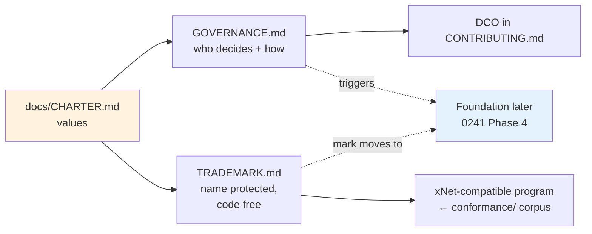
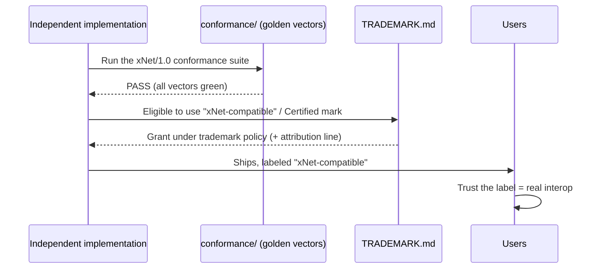

# 0242 — What A `GOVERNANCE.md` And `TRADEMARK.md` Might Look Like

> **Status:** Exploration
> **Date:** 2026-06-27
> **Author:** Claude (Opus 4.8)
> **Tags:** governance, trademark, brand, bdfl, conformance, dco, contributor-ladder,
> open-source, mission-alignment, foundation

> ⚠️ **Strategic/product exploration, not legal advice.** A trademark policy in particular has real
> legal effect; before publishing `TRADEMARK.md` as binding, have counsel review it, and register
> the word mark if you intend to enforce the `@xnetjs` scope or a "compatible" program. Treat the
> drafts below as well-researched starting points, not filed documents.

## Problem Statement

[Exploration 0241](./0241_[_]_OPEN_COLLECTIVE_FOUNDATION_OR_COMPANY_LEGAL_AND_FUNDING_STRUCTURE.md)
(merged in [#313](https://github.com/crs48/xNet/pull/313)) recommends, as its **Phase 0** (do-now,
≈$0, one afternoon), writing a `GOVERNANCE.md` + Alignment Covenant, adopting a **DCO**, and
stating a **trademark intent** — the cheapest trust a project can buy. This exploration answers the
obvious follow-up: **what would those documents actually say?**

The constraints make this non-obvious:

- xNet is a **solo, single-copyright-holder** project today. A governance doc that pretends a
  committee exists would be theater — but having *no* written governance is its own kind of
  illegibility ("who decides? can I become a maintainer? what happens if you get hit by a bus?").
- The README says xNet is **"one product, one brand,"** *and* that **"this repository is one
  implementation of xNet… an open protocol you can re-implement in any language… and
  interoperate."** Those two sentences are in productive tension: the **code** must be forkable and
  re-implementable, but the **name** must stay legible so users aren't confused about what's
  official. That is precisely the problem a trademark policy exists to solve.
- The values are explicit ([`docs/CHARTER.md`](../CHARTER.md): Own, Exit, Calm, Consent, Agency,
  Commons). The governance and trademark docs must *embody* those values, not contradict them — a
  project whose Charter promises "Exit" cannot have a trademark policy that pulls a Mozilla/IceWeasel
  on its own downstreams.

So: **what is the honest, minimal, values-aligned shape of each document at the solo/BDFL stage,
written so it scales to shared governance and an independent foundation later without being rewritten
from scratch?**

## Executive Summary

**Write both now. They are cheap, reversible, and high-trust, and the research gives us proven
templates to adapt.** Full drafts are in [Example Code](#example-code--the-actual-drafts).

- **`GOVERNANCE.md` — honest BDFL with a ladder and triggers.** State plainly that the founder is the
  **BDFL today** (the legitimate model for this stage — Vue, early Python, Linux all ran this way),
  define a **contributor → maintainer → steering** role ladder that is *mostly aspirational now*,
  specify **lazy consensus → consensus-seeking → BDFL tiebreak** decision-making, and name the
  **trigger points** (lifted from 0241) at which governance graduates to shared and then
  foundation-stewarded control. Crucially: name a **succession/bus-factor** plan. This makes the
  solo reality legible without inventing fake committees.

- **`TRADEMARK.md` — liberal, MTG-based, with a conformance carve-out.** Build on the **Model
  Trademark Guidelines** (CC-BY, copy-and-adapt). The spine: *the code is free to fork; the **name**
  is protected only to prevent user confusion.* Allow truthful **"compatible with xNet" / "for
  xNet"** references and downstream packaging that keeps the name (the anti-Mozilla/IceWeasel rule);
  reserve the `@xnetjs` npm scope and the official logo; require permission for product names, modified
  builds under the name, domains, and merchandise. The keystone: an **"xNet-compatible / xNet
  Certified"** program modeled on **CNCF's Certified Kubernetes** — independent implementations that
  **pass the existing `conformance/` corpus** may use the compatibility mark. xNet *already has the
  conformance suite*, so this is buildable, not hypothetical.

- **Adopt the DCO, not a CLA.** A `Signed-off-by` Developer Certificate of Origin is the
  zero-friction, good-faith default while the founder is the sole copyright holder; defer any
  CLA/IP-assignment question to the eventual foundation transfer (0241 Phase 4), which handles it
  anyway.

- **Avoid the two failure modes the research surfaced.** Don't over-restrict (the **Rust 2023**
  trademark-policy backlash — never ban crate suffixes, meetups, or honest references). Don't
  concentrate the mark in one commercial entity indefinitely (the **WordPress/WP Engine 2024**
  weaponization) — pre-commit, in writing, that the mark moves to an independent foundation.



## Current State In The Repository

| Surface | State today | Implication |
| ------- | ----------- | ----------- |
| `GOVERNANCE.md` | **Absent** | No legible answer to "who decides / how do I become a maintainer / bus factor." |
| `TRADEMARK.md` | **Absent** | The name "xNet" + `@xnetjs` scope are undefended and the "compatible" path is undefined. |
| `CODE_OF_CONDUCT.md` | **Absent** | Governance docs conventionally point at a CoC; none exists to point to. |
| [`CONTRIBUTING.md`](../../CONTRIBUTING.md) | Exists, **purely technical** (setup, code style, Conventional Commits, PR flow) | No DCO/CLA, no roles, no decision process — room to add a DCO line. |
| [`LICENSE`](../../LICENSE) | **MIT**, `Copyright (c) 2026 Chris Smothers` | Single copyright holder → relicensing/transfer is trivial *now*; DCO keeps it clean. |
| [`packages/cloud/LICENSE`](../../packages/cloud/LICENSE) | **FSL-1.1-Apache-2.0** | Commercial moat already drawn; governance/trademark must respect the commons/commercial split. |
| Protocol spec + conformance | `docs/specs/protocol/` (normative, `xnet/1.0`) + [`conformance/`](../../conformance) (golden vectors + second-language kernel), per [`README.md`](../../README.md) | **The single most important asset for a trademark "compatible" program already exists.** |
| Brand assets | `@xnetjs` npm scope; `xnet.fyi`; cosmic-X favicon (`apps/web/public/favicon.svg`, `site/public/favicon.svg`, brand-icon work in PR #70) | Concrete marks a `TRADEMARK.md` would enumerate. |
| README positioning | "one product, one brand" **and** "this repository is one implementation… re-implement in any language… interoperate" | The exact code-free/name-protected tension a trademark policy resolves. |
| Values | [`docs/CHARTER.md`](../CHARTER.md), [`docs/VISION.md`](../VISION.md) | The substance both docs must embody (esp. "Exit," "Commons"). |

**Net:** xNet has written down its *values* (Charter) and its *protocol* (spec + conformance), but
not its *governance* or its *brand rules*. The two missing docs sit exactly between those.

## External Research

(Full citations in [References](#references).)

### Governance: anatomy, ladder, and the honest minimum

**The recurring `GOVERNANCE.md` anatomy** (seven sections): roles/membership tiers; decision-making
process; adding/removing maintainers; a Code-of-Conduct pointer; conflict resolution; an amendment
process; and the relationship to any parent org/foundation. GitHub's **Minimal Viable Governance
(MVG)** template is the cleanest embodiment (*Roles; Decisions; How We Work; Trademarks;
Amendments*), and it deliberately splits **org-level** docs (CHARTER, STEERING-COMMITTEE,
TRADEMARKS) from **project-level** docs (GOVERNANCE, MAINTAINERS, CONTRIBUTING, LICENSE) — you write
the project-level ones now and defer the org-level ones to incorporation.

**The maturity ladder** (each legitimate at a different stage):

- **BDFL / founder-led** — Vue adopted the "Benevolent Dictator Governance Model" verbatim ("the
  general strategic line is drawn by the project lead… they have the last word," tempered by "the
  community always has the ability to fork"). Early Python and Linux were BDFL *by practice, not
  document.* The cautionary note: Guido stepped down in 2018 after the PEP 572 fight, naming no
  successor — a single-point-of-failure lesson that argues for writing down **succession** even at
  the BDFL stage.
- **Meritocracy / "the Apache Way"** — user → contributor → committer → PMC; lazy consensus
  ("silence gives assent"); votes −1…+1 with a justified **−1 as a binding veto** on code changes.
- **Council / steering committee** — Python's 5-person Steering Council (PEP 13), Rust's Leadership
  Council (RFC 3392, 2023, formed *after* the 2021 moderation-team mass resignation), Node.js TSC.
- **Foundation-stewarded** — CNCF/OpenJS hold IP and trademarks vendor-neutrally; the mark is
  transferred to the foundation at that stage.

**The honest minimum** (opensource.guide): "there is no right time to write down your project's
governance… start writing down what you can," specifically *how someone becomes a maintainer.* So:
write a short BDFL `GOVERNANCE.md` now (Roles, Decisions, Maintainer add/remove, Amendments,
Succession), point to a CoC, and **state the trigger for moving to shared governance** — defer the
org-level charter/steering/antitrust docs to incorporation.

**Decision mechanics worth copying, defined crisply:**

- **Lazy consensus** (Apache): announce intent publicly; proceed in **72 hours unless someone
  objects**; be ready to roll back.
- **Consensus-seeking** (Node.js): moderator asks "any objections?"; **only if consensus fails do
  voting members vote** (simple majority). IETF RFC 7282 frames this as *rough consensus* —
  "not majority rule and not unanimity."
- **Two-maintainer approval** (Kubernetes): a change needs an approver *in addition* to the
  reviewer; new members need **2 sponsors from different employers**.
- **Tie-break**: under a BDFL/council, that body is the final authority; councils otherwise keep an
  **odd number** or give the chair a casting vote.

**Contributor ladder** (copyable from CNCF's `CONTRIBUTOR_LADDER.md`): Community Participant →
Contributor → Member (2 sponsors + active months) → Reviewer (scoped approval) → Maintainer, with
**inactivity → Emeritus** (and a fast path back). Node.js auto-emerituses a collaborator after 12
months without a landed commit.

**DCO vs CLA.** A **DCO** is a per-commit `Signed-off-by` attestation (developercertificate.org) —
no contract, no copyright assignment; the lightweight industry default (Linux, Docker, Git, GitLab;
the OpenInfra Foundation even switched CLA→DCO in 2025). A **CLA** is a signed agreement that can
grant relicensing rights without re-contacting contributors — the mechanism that enabled some
"left open source" relicensings, and widely seen as contributor-hostile friction. **For a sole
copyright holder today, DCO now is correct;** the foundation handles any IP aggregation later.

### Trademark: the template, the doctrine, the models, the cautionary tales

**The canonical template — Model Trademark Guidelines** (modeltrademarkguidelines.org, Pamela
Chestek et al.), written "by and for FOSS communities," published **CC-BY** so the text can be
copied and adapted, with companion Commentary explaining each clause's legal rationale. Its
fill-in-the-blanks structure: (1) the mark(s) covered; (2) the FOSS-friendly goal/commitment; (3)
uses that need **no** permission (incl. unmodified redistribution + nominative reference); (4) uses
that **require** permission; (5) uses **never** allowed; (6) logo usage; (7) domain/trade names
(treated restrictively); (8) how to request permission.

**The core doctrine — "code is free, the name is protected."** A FOSS license frees the *code*; the
*trademark* is a separate right that prevents confusion about what's official. **Nominative fair
use** lets anyone refer to the project by its true name but not imply endorsement (Linux Foundation:
fair use "does not permit you to state or imply that the owner of a mark produces, endorses, or
supports your… products").

**Models to copy:**

- **Python (PSF)** — the *liberal* exemplar: "stating accurately that software… is compatible with
  the Python programming language… is always allowed… for non-commercial and commercial uses,"
  even with unaltered logos; permission needed for product/company names, modified logos,
  merchandise.
- **CNCF / Certified Kubernetes** — the keystone for xNet: the trademark is tied to a **conformance
  test suite**; only implementations that **pass** may use the "Certified Kubernetes" logo and
  combine the mark with a product name (e.g. "XYZ Kubernetes Engine"), with ® and an attribution
  line required. *This is the gold standard for "use the mark only if you actually conform" — and
  xNet already has the conformance corpus.*
- **Linux** — Torvalds owns the mark; the Linux Mark Institute grants a **free, perpetual, worldwide
  sublicense** in exchange for attribution and not challenging ownership. Shows a permissive
  enforcement posture.

**Cautionary tales:**

- **Rust 2023** — the draft trademark policy was attacked as over-restrictive (discouraging "Rust"
  in crate names, restricting it in event/repo names); the Foundation conceded the process failed
  and apologized. **Lesson: never restrict normal community behavior** (suffixes, meetups, honest
  references).
- **Mozilla → Debian/IceWeasel** — Mozilla's trademark forbade Debian's patched builds from using
  "Firefox," forcing a decade-long rename. **Lesson: explicitly allow downstream packaging/patches
  to keep the name**, or you recreate IceWeasel — which would directly violate xNet's "Exit"/commons
  ethos.
- **WordPress / WP Engine 2024** — the mark, held by the WordPress Foundation but exclusively
  licensed to Automattic with one person controlling distribution, was used as a ~$32M/yr demand and
  a site-breaking ban. **Lesson: a mark concentrated in one commercial entity can be weaponized;
  pre-commit to moving it to an independent foundation with a neutral, non-discriminatory policy
  before commercial pressure arrives.**

**npm enforcement reality:** npm only acts on `@xnetjs` scope disputes backed by a **registered
trademark**, via GitHub's trademark-violation form — so registering the word mark is what makes the
scope reservation enforceable rather than aspirational.

## Key Findings

1. **The solo stage is not a reason to skip these docs — it's a reason to write them honestly.** A
   BDFL `GOVERNANCE.md` that says "the founder decides, here's the ladder when others arrive, here's
   the bus-factor plan" is *more* credible than silence, and far more credible than a fake committee.
2. **xNet's biggest trademark asset already exists.** The `conformance/` corpus + `xnet/1.0` spec
   make a CNCF-style **"xNet-compatible"** program buildable today — the conformance suite *is* the
   objective test that gates the mark. This turns "one product, one brand" + "re-implement the
   protocol" from a contradiction into a **certification pipeline.**
3. **The two documents are values instruments, not just legal ones.** "Exit" (Charter §2) forbids an
   IceWeasel; "Commons" (§6) forbids a WP-Engine-style enclosure. The trademark policy is where those
   promises become enforceable brand rules.
4. **Liberal beats restrictive, and the failures are well-documented.** Rust 2023 shows the cost of
   over-restriction; the safe default is PSF-style permissiveness + a narrow, conformance-gated
   "certified" lane.
5. **DCO now, CLA never (or only at foundation transfer).** With one copyright holder, DCO is pure
   upside; a CLA would import contributor-hostile friction for a relicensing power xNet's FSL/MIT
   split is explicitly designed *not* to need.
6. **Write once, scale by substitution.** Both drafts are authored so that "the founder (BDFL)"
   becomes "the Steering Committee" and "the maintainers hold the mark" becomes "the xNet Foundation
   holds the mark" by editing a few nouns — no rewrite when 0241's triggers fire.
7. **Registration is the enforcement prerequisite.** Without a registered word mark, both the
   `@xnetjs` reservation and the "certified" program are honor-system. Registration is the one
   step here that genuinely needs counsel + money.

## Options And Tradeoffs

### Governance document

| Option | Pros | Cons | Verdict |
| ------ | ---- | ---- | ------- |
| **A. No doc (implicit BDFL)** | Zero effort; matches reality | Illegible; no maintainer path; no bus factor; weak trust signal | The status quo; insufficient per 0241 Phase 0 |
| **B. Honest BDFL doc + ladder + triggers** | Legible, credible, scales by substitution, names succession | Must resist the temptation to over-formalize | **Recommended** |
| **C. Council/steering now** | Looks mature | Theater — no community to seat; premature-governance failure mode (0145/0241) | Defer to trigger |

### Trademark document

| Option | Pros | Cons | Verdict |
| ------ | ---- | ---- | ------- |
| **A. No policy** | Nothing to write | Name + scope undefended; "compatible" undefined; npm unenforceable | Insufficient |
| **B. MTG-based liberal + conformance carve-out** | Proven template; values-aligned; turns the conformance corpus into a brand asset; foundation-ready | Needs counsel + registration to enforce | **Recommended** |
| **C. Restrictive (control-first)** | Maximal brand control | Recreates Rust 2023 / IceWeasel; violates "Exit"/"Commons"; community backlash | Anti-pattern — avoid |

### Contribution IP: DCO vs CLA

| | DCO (`Signed-off-by`) | CLA |
| --- | --- | --- |
| Friction | Near-zero | High (sign before contributing) |
| Grants relicensing power | No | Yes |
| Fits sole-copyright-holder today | ✅ | Overkill |
| Industry trend | ✅ (Linux, Docker, GitLab, OpenInfra 2025) | Declining for community projects |
| **Verdict** | **Recommended now** | Only via foundation transfer, if ever |

### How the docs interrelate and evolve

```mermaid
stateDiagram-v2
    [*] --> BDFL: today (solo, sole copyright)
    BDFL --> SharedMaint: 3+ recurring non-founder maintainers
    SharedMaint --> Steering: external operators / org adoption
    Steering --> Foundation: ecosystem maturity (0241 Phase 4)

    BDFL: GOVERNANCE = founder decides + ladder + DCO + succession
    SharedMaint: add lazy-consensus + two-maintainer rule, MAINTAINERS.md
    Steering: steering body, formal RFC process
    Foundation: mark + spec + conformance move to Foundation; neutral trademark licensing
    note right of BDFL
      TRADEMARK.md written now;
      "mark held by founder, will
       transfer to Foundation" clause
    end note
    note right of Foundation
      substitute nouns:
      founder→committee,
      maintainers→Foundation
    end note
```



## Recommendation

**Write `GOVERNANCE.md`, `TRADEMARK.md`, a short `CODE_OF_CONDUCT.md` pointer, and add a DCO line to
`CONTRIBUTING.md` — now, in one sitting — using the drafts below.** Then do the one thing that needs
money and counsel: **start the word-mark registration** so the trademark policy is enforceable rather
than aspirational. Defer everything org-level (steering committee, foundation, CLA) to 0241's
triggers.

Concretely, in priority order:

1. Land `GOVERNANCE.md` (BDFL-honest, draft below) + link it from `README.md`.
2. Land `TRADEMARK.md` (MTG-based, conformance carve-out, draft below) + link from `README.md`
   footer and `site/` footer.
3. Adopt **DCO**: add the clause + `Signed-off-by` requirement to `CONTRIBUTING.md`; optionally add a
   lightweight DCO check.
4. Add `CODE_OF_CONDUCT.md` (Contributor Covenant 2.1) so governance can point at it.
5. **Engage counsel to register the "xNet" word mark**; until registered, mark `TRADEMARK.md` as a
   **policy of intent** and say so.
6. Stub the **"xNet-compatible" conformance program** page that points at `conformance/` — even a
   "coming soon, here's the test corpus" is a strong signal.

## Example Code — The Actual Drafts

> These are starting drafts to adapt, not filed legal documents. The trademark draft especially
> should be counsel-reviewed before being treated as binding.

### Draft `GOVERNANCE.md`

````markdown
# xNet Governance

> How decisions get made, who makes them, and how that changes as xNet grows.
> This document is intentionally small. It describes how xNet is run **today** and
> the concrete triggers at which it grows up. It is the operational complement to
> [`docs/CHARTER.md`](./docs/CHARTER.md) (what we promise) and
> [`docs/explorations/0241_…LEGAL_AND_FUNDING_STRUCTURE.md`](./docs/explorations) (where
> the entity story is heading).

## Today: founder-led (BDFL)

xNet is currently maintained by its founder, who acts as **BDFL** ("benevolent
dictator for life") — the final decision-maker on technical direction, releases,
and what ships. This is honest about the project's size: there is a small number
of maintainers, and pretending otherwise would be theater.

Two things keep BDFL legitimate here:

1. **The code is MIT and the protocol is open.** If you disagree with a decision,
   you can fork the code or re-implement the protocol and interoperate. The right
   to leave is real (see Charter §2, "Exit").
2. **This document commits to growing past BDFL** on the triggers below.

## Roles

These tiers exist so the path is legible. Most are aspirational at xNet's current
size — they describe how you climb the ladder as the project grows.

| Role | Can | Becomes this by |
| ---- | --- | --------------- |
| **User** | File issues, ask questions, propose ideas | Using xNet |
| **Contributor** | Open PRs, review, discuss | Landing a PR |
| **Maintainer** | Merge PRs in their area, triage, release | Sustained, high-quality contribution + invitation by existing maintainers (2 maintainers, or the BDFL while there is one) |
| **Steering** *(future)* | Set cross-cutting direction | Created on Trigger 2 below |

Maintainers are listed in [`MAINTAINERS.md`](./MAINTAINERS.md). A maintainer who is
inactive for **12 months** moves to **Emeritus** (a fast path back on return).

## How decisions are made

We prefer the lightest process that works:

1. **Lazy consensus.** For most changes, open a PR or issue. If no one objects
   within a reasonable window (about **72 hours** for non-trivial proposals),
   it's approved. Silence means assent. Be ready to revert.
2. **Consensus-seeking.** For contested or cross-cutting changes, we discuss until
   objections are resolved or clearly outweighed (rough consensus — not a vote
   count, not unanimity).
3. **Tie-break.** While xNet has a BDFL, the BDFL has the final word. Once a
   Steering body exists (Trigger 2), it breaks ties by simple majority and is kept
   an odd size.

Big or breaking changes to the **protocol** (`docs/specs/protocol/`, `xnet/1.0`)
follow a written proposal in `docs/` and require explicit maintainer sign-off,
because other implementations depend on it.

## Contributing & provenance

See [`CONTRIBUTING.md`](./CONTRIBUTING.md). Contributions are accepted under the
project's licenses (MIT for the core; FSL for `@xnetjs/cloud`) on an
**inbound = outbound** basis, certified per-commit by the **Developer Certificate
of Origin** (`Signed-off-by:`). xNet does **not** require a CLA or copyright
assignment.

## Code of Conduct

Participation is governed by [`CODE_OF_CONDUCT.md`](./CODE_OF_CONDUCT.md). Reports
go to the contact listed there.

## Trademark & brand

The xNet name, logo, and `@xnetjs` scope are governed by
[`TRADEMARK.md`](./TRADEMARK.md). The code is free to fork; the name exists to keep
"what's official" legible.

## Succession (bus factor)

If the founder becomes unavailable, maintainership and control of the `@xnetjs`
npm scope, the `xnet.fyi` domain, and the trademark pass to the active maintainers
listed in `MAINTAINERS.md`, who may continue the project and/or accelerate the
foundation transfer below. Access credentials are documented for at least one
trusted second party. *(Until there is a second maintainer, this is the founder's
explicit intent on record; it becomes operational as soon as `MAINTAINERS.md` has
a second name.)*

## How governance grows (triggers)

Lifted from exploration 0241. We commit to *acting* on these, not just listing them:

| Trigger | Change |
| ------- | ------ |
| **3+ recurring non-founder maintainers** | Add `MAINTAINERS.md` with areas; adopt the two-maintainer-approval rule; BDFL steps back from routine merges |
| **External hub operators / org adoption** | Stand up a **Steering** group; formalize the protocol-RFC process |
| **Ecosystem maturity** (0241 Phase 4) | Transfer trademark + protocol spec + conformance suite to an independent **xNet Foundation**; this document's "BDFL" becomes "Steering Committee" and "maintainers hold the mark" becomes "the Foundation holds the mark" |

## Changing this document

Changes to `GOVERNANCE.md` follow the same decision process above and must be made
in a PR that explains itself. While xNet has a BDFL, the BDFL approves governance
changes; afterward, the Steering body does.
````

### Draft `TRADEMARK.md`

````markdown
# xNet Trademark & Brand Usage Policy

> **The code is free. The name keeps things honest.**
> xNet's software is open source (MIT for the core) and the xNet protocol is open
> for anyone to re-implement. This policy is *not* about restricting that — it
> exists so people can tell what is **official xNet** and what is independent, so
> the name stays trustworthy. Adapted from the
> [Model Trademark Guidelines](https://modeltrademarkguidelines.org/) (CC-BY).
>
> **Status:** policy of intent. The "xNet" word mark is held today by the project
> founder; registration is in progress, and the mark will transfer to an
> independent **xNet Foundation** as the project matures (see `GOVERNANCE.md`).
> We pre-commit now to licensing it on fair, non-discriminatory terms — no
> single company will be able to weaponize it.

## Marks this policy covers

- The **xNet** word mark.
- The **xNet logo** (the cosmic-X icon and wordmark).
- The **`@xnetjs`** npm scope.

## Our commitment

We want a thriving ecosystem of forks, re-implementations, integrations, hubs, and
apps. You do **not** need our permission for the large majority of honest uses
below. We will never use this policy to stop you from forking the code, running
your own hub, or re-implementing the protocol (Charter §2 "Exit", §6 "Commons").

## Uses that need NO permission

- **Truthful references.** Say that your software is **"compatible with xNet,"**
  **"for xNet,"** **"built on xNet,"** or **"works with xNet."** Use the name to
  refer to the actual project in articles, talks, docs, and comparisons (nominative
  fair use).
- **Redistribute unmodified official builds** under the name xNet.
- **Community.** Run user groups, meetups, tutorials, courses, and conferences
  about xNet, including using "xNet" in the event or group name (e.g. "Berlin xNet
  Meetup"). We will *not* restrict this.
- **Downstream packaging.** Distribute xNet through a package manager or OS distro,
  including with the patches normally needed to build/integrate, and **keep the
  name xNet.** (We will never pull a "rename it or remove our patches" — see the
  Firefox/IceWeasel anti-pattern.)
- **Name-with-suffix for ecosystem packages** is fine: `something-xnet`,
  `xnet-plugin-foo`. (We will not nitpick suffixes — see the Rust 2023 lesson.)

## Uses that DO need permission

Email **trademark@xnet.fyi** for:

- A **product or company name** that contains "xNet" (e.g. naming your company
  "xNet Inc." or your product "xNet Pro").
- A **modified/forked build distributed *under the xNet name*** (forks are welcome —
  just give a materially modified distribution its own name, then say it's
  "compatible with xNet").
- **Domain names or social handles** that contain the mark in a way that could look
  official.
- **Merchandise** using the name or logo.
- Any claim of being **"official," "certified," or "endorsed."**

## The "xNet-compatible" / "xNet Certified" program

Independent implementations of the xNet protocol may describe themselves as
**"xNet-compatible"** — and use the **xNet Certified** mark — if they **pass the
published conformance suite** ([`conformance/`](./conformance), spec
`docs/specs/protocol/`, `xnet/1.0`). This is how "one protocol, many
implementations" stays trustworthy: the mark means *it actually interoperates.*

When using the certified mark, on first prominent use include the ® once registered
and the line:

> "xNet is a trademark of the xNet project, used pursuant to the xNet trademark
> policy."

*(Modeled on CNCF's Certified Kubernetes program.)*

## Logo usage

Use the logo **unaltered** — no recoloring, distortion, stretching, or adding
elements. Don't use it as your own app/product icon. Brand assets and clear-space
rules: `xnet.fyi/brand` *(to be published)*.

## npm scope

The **`@xnetjs`** scope is reserved for official packages. Publish forks and
community packages under your own scope (you may use an `xnet`/`-xnet` suffix in the
*package name* to indicate compatibility). Scope disputes are handled per npm's
trademark policy.

## Questions / requests

Email **trademark@xnet.fyi**. We aim to say "yes" wherever we can — this policy
protects users from confusion, not the community from participating.

## Changes

This policy may evolve (e.g. when the mark transfers to the xNet Foundation). Changes
follow `GOVERNANCE.md`. We will not make it *more* restrictive without a strong,
stated reason.
````

### `CONTRIBUTING.md` — DCO addition

```markdown
## Developer Certificate of Origin (DCO)

xNet uses the [Developer Certificate of Origin](https://developercertificate.org/).
By adding a `Signed-off-by` line to each commit, you certify you wrote the patch or
otherwise have the right to submit it under the project's licenses. There is **no
CLA** and no copyright assignment.

Sign off automatically with:

    git commit -s -m "feat(scope): your change"

The `Signed-off-by: Your Name <you@example.com>` line must match your commit author.
```

### `README.md` footer wiring (and `site/` footer)

```markdown
## Project

- [Governance](./GOVERNANCE.md) · [Trademark & Brand](./TRADEMARK.md) ·
  [Code of Conduct](./CODE_OF_CONDUCT.md) · [Charter](./docs/CHARTER.md)
- The code is MIT (core) / FSL (`@xnetjs/cloud`). The **xNet** name and logo are
  trademarks — see the trademark policy. Independent implementations that pass the
  [conformance suite](./conformance) may call themselves **"xNet-compatible."**
```

### The conformance → trademark pipeline



## Risks And Open Questions

1. **Registration is the real prerequisite.** Until the "xNet" word mark is
   registered, both the `@xnetjs` reservation and the certified program are
   honor-system; npm/GitHub act on scope disputes only with a registered mark.
   *Action: counsel + filing; meanwhile label `TRADEMARK.md` as "policy of intent."*
2. **Name availability.** "xNet" / "X-Net" is a short, common-ish string; a
   clearance search may turn up conflicts that constrain registration. *Open
   question for counsel.*
3. **Over-restriction backlash (Rust 2023).** Keep the policy liberal; resist
   adding control clauses. Every "needs permission" item is a place the community
   can feel policed — keep that list short and obviously about confusion.
4. **Mark concentration (WP Engine 2024).** The "will transfer to a Foundation +
   non-discriminatory licensing" pre-commitment must be honored; otherwise the
   policy itself becomes the enclosure risk it warns about. Ties to 0241 Phase 4.
5. **Conformance program is real work.** "xNet-compatible" is only meaningful if the
   conformance suite is comprehensive and maintained; a weak suite makes the mark
   meaningless. *Scope the program before advertising it.*
6. **BDFL succession is currently a promise, not a mechanism.** It only becomes
   operational with a second maintainer + documented credential handoff. *Don't
   over-claim it.*
7. **CoC enforcement needs a human.** Adopting Contributor Covenant is easy; staffing
   reports is the real commitment at solo stage. *State the contact honestly.*
8. **Single contact email + brand page are referenced but not yet real**
   (`trademark@xnet.fyi`, `xnet.fyi/brand`). *Create them or mark as TODO.*

## Implementation Checklist

- [x] Add `GOVERNANCE.md` (BDFL-honest draft above); link from `README.md`.
- [ ] Add `TRADEMARK.md` (MTG-based draft above) marked **"policy of intent"** until
      registration; link from `README.md` + `site/` footer.
- [ ] Add `CODE_OF_CONDUCT.md` (Contributor Covenant 2.1) with a real contact.
- [ ] Add the **DCO** section to `CONTRIBUTING.md`; document `git commit -s`.
- [ ] (Optional) Add a lightweight **DCO check** (GitHub Action or `commit-msg` hook)
      and/or a `MAINTAINERS.md` stub.
- [ ] Add the **Project** footer block to `README.md` (governance/trademark/CoC links
      + "xNet-compatible" line).
- [ ] Create `trademark@xnet.fyi` (alias) and a stub `xnet.fyi/brand` page (or mark
      as TODO in the docs).
- [ ] Stub an **"xNet-compatible / conformance"** page pointing at `conformance/`.
- [ ] Engage counsel: **clearance search + word-mark registration** for "xNet";
      decide jurisdiction(s).
- [ ] Cross-link these from `docs/CHARTER.md` (governance/brand are how Exit + Commons
      are enforced).

## Validation Checklist

- [ ] A newcomer can answer, from `GOVERNANCE.md` alone: *who decides, how do I
      become a maintainer, what happens if the founder disappears.*
- [ ] A would-be forker can tell from `TRADEMARK.md` exactly what they may do
      **without asking** (fork, re-implement, say "compatible with xNet," package
      downstream keeping the name).
- [ ] No clause in `TRADEMARK.md` would have triggered the Rust-2023 or
      Mozilla/IceWeasel backlash (no banned suffixes, meetups, honest references, or
      downstream renames).
- [ ] The "xNet-compatible" claim is objectively testable (it maps to a real
      `conformance/` pass), not a subjective grant.
- [ ] Both docs scale by **noun substitution** (founder→committee, maintainers→
      Foundation) without a rewrite when 0241's triggers fire.
- [ ] DCO sign-off is documented and (optionally) checked; no CLA friction is
      introduced.
- [ ] The trademark policy's "will move to a Foundation, non-discriminatory
      licensing" pledge is consistent with 0241 Phase 4 and `docs/CHARTER.md`.
- [ ] `GOVERNANCE.md`, `TRADEMARK.md`, `CODE_OF_CONDUCT.md` are all linked from
      `README.md`.

## References

### Internal
- [0241 — Legal & Funding Structure](./0241_[_]_OPEN_COLLECTIVE_FOUNDATION_OR_COMPANY_LEGAL_AND_FUNDING_STRUCTURE.md)
  (Phase 0 calls for these docs; Phase 4 moves the mark to a foundation).
- [0145 — Foundation & Legal Organizing Structures](./0145_[_]_FOUNDATION_MODELS_LEGAL_ORGANIZING_STRUCTURES_FOR_XNET_MISSION_ALIGNED_GOVERNANCE.md)
  (trademark/conformance as foundation surfaces; premature-governance failure mode).
- [`docs/CHARTER.md`](../CHARTER.md) — Own/Exit/Calm/Consent/Agency/Commons.
- [`CONTRIBUTING.md`](../../CONTRIBUTING.md) · [`LICENSE`](../../LICENSE) (MIT) ·
  [`packages/cloud/LICENSE`](../../packages/cloud/LICENSE) (FSL) ·
  [`conformance/`](../../conformance) · `docs/specs/protocol/`.

### Governance
- GitHub Minimal Viable Governance: https://github.com/github/MVG
- opensource.guide — Leadership & Governance: https://opensource.guide/leadership-and-governance/
- Vue "Benevolent Dictator" charter: https://github.com/vuejs/governance/blob/master/Team-Charter.md
- Node.js GOVERNANCE: https://github.com/nodejs/node/blob/main/GOVERNANCE.md
- Python PEP 13 (governance) / PEP 8016 (steering council):
  https://peps.python.org/pep-0013/ · https://peps.python.org/pep-8016/
- Rust RFC 3392 (Leadership Council): https://rust-lang.github.io/rfcs/3392-leadership-council.html
- Apache voting / lazy consensus: https://www.apache.org/foundation/voting.html ·
  https://community.apache.org/committers/lazyConsensus.html
- IETF RFC 7282 "On Consensus and Humming": https://www.rfc-editor.org/rfc/rfc7282
- Kubernetes community membership: https://github.com/kubernetes/community/blob/master/community-membership.md
- CNCF contributor-ladder template: https://github.com/cncf/project-template/blob/main/CONTRIBUTOR_LADDER.md
- Developer Certificate of Origin: https://developercertificate.org/ ·
  DCO vs CLA: https://opensource.com/article/18/3/cla-vs-dco-whats-difference ·
  OpenInfra CLA→DCO (2025): https://openinfra.org/dco/

### Trademark
- Model Trademark Guidelines (CC-BY): https://modeltrademarkguidelines.org/index.php/Model_Trademark_Guidelines
- SFC on trademarks & Rust history: https://sfconservancy.org/blog/2023/jul/27/trademark-history-and-rust/
- Linux Foundation trademark usage: https://www.linuxfoundation.org/legal/trademark-usage ·
  Linux Mark sublicense: https://www.linuxfoundation.org/legal/the-linux-mark
- Python Software Foundation Trademark Usage Policy: https://www.python.org/psf/trademarks/
- Rust 2023 draft-policy backlash + response:
  https://devclass.com/2023/04/11/dont-call-it-rust-community-complains-about-draft-trademark-policy-restricting-use-of-word-marks/ ·
  https://blog.rust-lang.org/inside-rust/2023/04/12/trademark-policy-draft-feedback.html
- CNCF Certified Kubernetes (conformance + mark):
  https://www.cncf.io/announcements/2017/11/13/cloud-native-computing-foundation-launches-certified-kubernetes-program-32-conformant-distributions-platforms/ ·
  terms: https://github.com/cncf/k8s-conformance/blob/master/terms-conditions/Certified_Kubernetes_Terms.md
- Debian–Mozilla (IceWeasel): https://en.wikipedia.org/wiki/Debian%E2%80%93Mozilla_trademark_dispute
- WordPress vs WP Engine (2024) explainer: https://techcrunch.com/2025/01/12/wordpress-vs-wp-engine-drama-explained/
- npm disputes policy: https://docs.npmjs.com/policies/disputes/
- Contributor Covenant 2.1: https://www.contributor-covenant.org/version/2/1/code_of_conduct/
