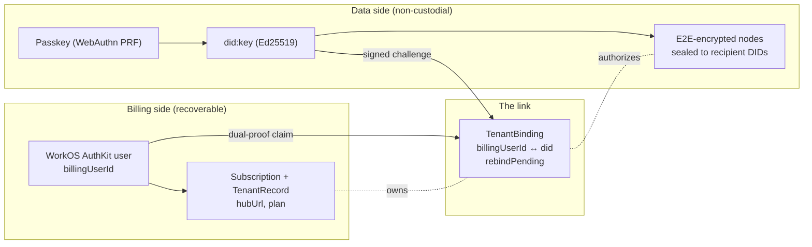
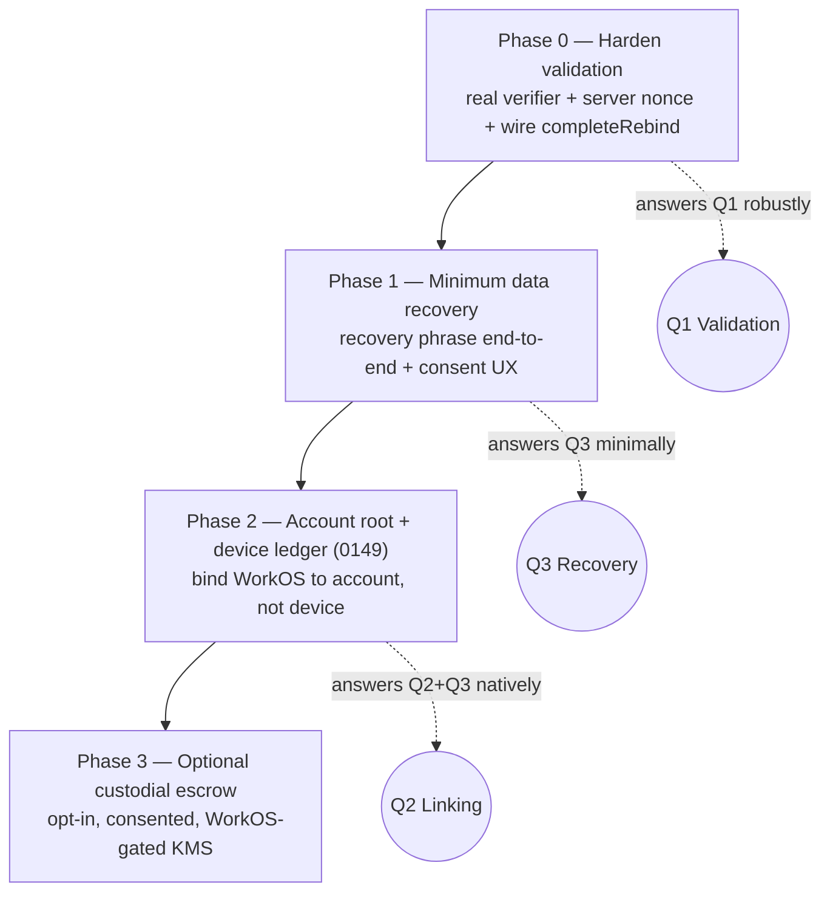

# Account Validation And Recovery For xNet Cloud: Binding The Payer To The Passkey

> **Status:** Exploration
> **Date:** 2026-06-28
> **Author:** Claude
> **Tags:** identity, passkeys, account-recovery, multi-device, workos, did, ucan,
> cloud, billing, key-wrapping

## Problem Statement

xNet Cloud has **two different identities for the same human**, and they are
authenticated in two different places:

- **Billing identity** — you _sign up and pay_ through **WorkOS AuthKit** (email /
  SSO). This is custodial and recoverable: WorkOS can always get you back into your
  billing account.
- **Data identity** — you _log into your workspace_ with a **passkey** that derives a
  self-sovereign `did:key`. This is non-custodial: it owns the encrypted data, and by
  design nobody can recover it for you.

That split raises three concrete questions the prompt asks us to answer:

1. **Validation.** When someone unlocks an xNet workspace with a passkey, how do we
   know they are the same person who is _paying_ for it through WorkOS?
2. **Linking.** How do we durably connect the WorkOS billing identity to the passkey
   DID, such that neither half can be moved by an attacker holding only one?
3. **Recovery & multi-device.** How does a paying user get their workspace back if
   they lose their passkey, or add a second device — **reusing existing xNet
   primitives** rather than inventing a parallel auth stack, while still bridging the
   cloud auth model and the xNet auth model?

## Executive Summary

**Most of the answer to questions 1 and 2 already exists in the repo** and is
partially wired. `@xnetjs/cloud/identity`
([`binding.ts`](../../packages/cloud/src/identity/binding.ts)) defines a
`TenantBinding` that links a WorkOS `billingUserId` to a passkey `did`, created by a
**dual-proof** bind (`bindIdentities`), with **billing-only account recovery**
(`recoverPaidAccount` / `completeRebind`). The control plane and the cloud server
expose this via an **RFC 8628 device-grant "claim your hub" flow**
([`apps/web/src/lib/cloud-claim.ts`](../../apps/web/src/lib/cloud-claim.ts),
[`apps/cloud/src/server.ts`](../../apps/cloud/src/server.ts) `/device/*`, `/claim`).
That flow _is_ the validation handshake: a WorkOS-authenticated dashboard session
approves a short code shown by the passkey app, and the control plane stamps the DID
onto the tenant.

The gaps are specific and fixable:

- **The DID-challenge verifier is a stub.** `devDidVerifier` in
  [`apps/cloud/src/index.ts:182`](../../apps/cloud/src/index.ts) only checks the
  challenge is _well-formed_ — it never verifies the signature, and the nonce is
  **client-supplied** (replayable). `TODO(0175)` is right there in the code.
- **`completeRebind` is exported but never wired.** The post-recovery rebind
  currently re-uses `bindDataIdentity` → `bindIdentities`, bypassing the
  `rebindPending` guard.
- **There is no _data-side_ recovery in the app.** `recoverPaidAccount` gets your
  _hub and subscription_ back, but **not your encrypted data** — that was sealed to
  the old DID. The native data-recovery primitives **already exist** in
  [`packages/identity/src/seed-recovery.ts`](../../packages/identity/src/seed-recovery.ts)
  (mnemonic, Shamir social recovery, encrypted backup) and the onboarding state
  machine even has `recovery-phrase` / `qr-scan` states
  ([`packages/react/src/onboarding/machine.ts`](../../packages/react/src/onboarding/machine.ts)),
  but they are not connected to a real "save / restore my workspace" experience.
- **The binding pins to a single device DID, not to an account.** The unbuilt
  data-plane **account/device ledger** from
  [`0149`](./0149_[_]_IDENTITY_AND_ACCOUNT_RECOVERY.md) is the missing native
  primitive that makes "add a device" and "lost passkey" _ledger operations_ instead
  of full re-binds.

**Recommendation:** harden the validation handshake (real signature + server nonce),
expose account recovery in the dashboard, wire the recovery phrase as the
minimum-viable data recovery, and then **bind WorkOS to a stable account root (0149)
rather than to one device DID**, so device add/loss reuses the same primitives the
payment already points at. Offer custodial key-escrow only as an explicit, consented
opt-in for users who want Apple-style full recoverability.

## Current State In The Repository

### The two-identity model is already designed and half-built

The design lineage is explicit. [`0174`](./0174_[_]_MANAGED_HOSTING_AS_OPEN_CORE_IN_THE_PUBLIC_MONOREPO.md)
introduced the **deliberate two-identity split** (custodial billing identity owns the
subscription + hub; non-custodial passkey DID owns the encrypted data), layered on top
of the data-plane **account/device ledger** from [`0149`](./0149_[_]_IDENTITY_AND_ACCOUNT_RECOVERY.md).
[`0192`](./0192_[_]_XNET_CLOUD_ONBOARDING_AND_UI_HOSTING.md) added the device-grant
claim flow.

The binding is the load-bearing type
([`packages/cloud/src/identity/binding.ts:33`](../../packages/cloud/src/identity/binding.ts)):

```ts
export interface TenantBinding {
  tenantId: string
  /** WorkOS user id (custodial billing identity). */
  billingUserId: string
  /** Bound data identity; empty string while a rebind is pending after recovery. */
  did: string
  createdAt: number
  /** Last time BOTH proofs were verified together. */
  verifiedAt: number
  /** True after `recoverPaidAccount` until a new DID is bound via `completeRebind`. */
  rebindPending: boolean
}
```

Creation requires **dual proof** — a proven WorkOS session _and_ a verifying DID
challenge (`binding.ts:89`):

```ts
export async function bindIdentities(store, verifyDid, args): Promise<TenantBinding> {
  if (!(await verifyDid(args.challenge))) {
    throw new Error('DID challenge failed; refusing to bind')
  }
  const existing = await store.get(args.tenantId)
  if (existing && existing.billingUserId !== args.billingUserId) {
    throw new Error('Tenant is already bound to a different billing account')
  }
  // ...write { billingUserId, did: challenge.did, rebindPending: false }
}
```

The `DidChallenge` is `{ did, nonce, signature }` (`binding.ts:18`), and the verifier
is **injected** so the cloud package stays free of crypto deps
(`DidChallengeVerifier`, `binding.ts:31`).

### Validation today: the device-grant "claim your hub" flow

Because the app never embeds WorkOS, validation runs through an RFC 8628-shaped device
grant ([`apps/web/src/lib/cloud-claim.ts`](../../apps/web/src/lib/cloud-claim.ts)):

| Step                                                                     | Code                                                                                          | What proves what                                                    |
| ------------------------------------------------------------------------ | --------------------------------------------------------------------------------------------- | ------------------------------------------------------------------- |
| App creates passkey DID locally, calls `POST /device/start` with the DID | `cloud-claim.ts:35`, `server.ts:436`                                                          | nothing yet — just registers a `deviceCode`/`userCode`              |
| User opens the signed-in cloud dashboard and approves the `userCode`     | `server.ts:476` `/claim` (gated by `session(c)`)                                              | **billing proof** — only the WorkOS-authenticated payer can approve |
| App polls `POST /device/token` with a signed `DidChallenge`              | `cloud-claim.ts:50`, `server.ts:450`                                                          | **data proof** — the app controls the DID's private key             |
| Control plane binds the DID to the approver's `billingUserId`            | `server.ts:464` → `controlPlane.bindDataIdentity` (`control-plane.ts:305`) → `bindIdentities` | both proofs verified together → `TenantBinding` written             |

The control plane stamps the DID onto the `TenantRecord` (`control-plane.ts:317`),
and from then on the **hub** authenticates the DID via UCAN sessions keyed by DID
([`packages/hub/src/auth/ucan.ts`](../../packages/hub/src/auth/ucan.ts)). So the
runtime answer to "is this passkey-holder the payer?" is: _they were, at claim time,
cryptographically tied to a WorkOS-authenticated approval, and that link lives in the
binding store._

### Account recovery today: built on the billing side, absent on the data side

The control plane already has billing-only recovery (`control-plane.ts:533`):

```ts
async recoverAccount(billingUserId: string): Promise<{ tenant: TenantRecord }> {
  const binding = await recoverPaidAccount(this.deps.bindings, { billingUserId, ... })
  // ...clears tenant.did, keeps subscription + hub
}
```

exposed at `POST /internal/account/recover` (`server.ts:577`). `recoverPaidAccount`
clears `did`, sets `rebindPending: true`, and leaves the subscription and hub intact
(`binding.ts:120`). **But its own docstring is the catch:** _"Billing recovery never
recovers the old encrypted data — that needs a data-side recovery method."_

### The data-side primitives exist but are not wired

[`packages/identity/src/seed-recovery.ts`](../../packages/identity/src/seed-recovery.ts)
already exports everything needed to re-derive the **same DID** on a new device, and
it is re-exported from the package root
([`packages/identity/src/index.ts:48`](../../packages/identity/src/index.ts)):

- `deriveKeysFromSeed(mnemonic)` → deterministic `{ did, signingKey, encryptionKey, backupKey }`
- `createKeyBackup` / `recoverFromBackup` → encrypted blob keyed by a mnemonic-derived `backupKey`
- `createRecoveryShares` / `recoverFromShares` → Shamir k-of-n social recovery

And `@xnetjs/identity/passkey` already supports **passive cross-device passkey
discovery** (`discoverExistingPasskey`, `unlockDiscoveredPasskey` in
[`discovery.ts`](../../packages/identity/src/passkey/discovery.ts)) which, on a synced
passkey (iCloud Keychain / Google Password Manager), yields the **same PRF → same seed
→ same DID** with zero new code.

The onboarding machine already routes to these
([`machine.ts:9`](../../packages/react/src/onboarding/machine.ts)):
`welcome → import-identity → qr-scan / recovery-phrase → connecting-hub`, with an
`ImportIdentityScreen`. What's missing is the _end-to-end wiring_: a "save your
recovery phrase" moment, an export/import that survives passkey loss, and Electron
parity ([`apps/electron/src/main/secure-seed.ts`](../../apps/electron/src/main/secure-seed.ts)
already stores a seed in the OS keychain).

### How data is protected at rest (why "recover the account" ≠ "recover the data")

Authorization is **encryption-first**: `computeRecipients`
([`packages/data/src/auth/recipients.ts`](../../packages/data/src/auth/recipients.ts))
resolves which DIDs may decrypt a node (creator + role members + grantees), and the
`EncryptionLayer`
([`auth-migrator.ts:9`](../../packages/data/src/auth/auth-migrator.ts)) seals node
properties to those recipient keys. The hub relays opaque Yjs updates
([`relay.ts`](../../packages/hub/src/services/relay.ts)) — it is a sync substrate, not
a plaintext store. **Consequence:** a _new_ DID minted after a passkey loss is not a
recipient of the _old_ data, so it cannot read it. Recovering data means recovering the
_key_, not the account — which is exactly why the data-side primitives matter.



## External Research

- **WebAuthn / passkeys & PRF.** Passkeys are scoped to a relying-party ID. Synced
  passkeys (iCloud Keychain, Google Password Manager, Windows Hello, 1Password) can
  carry a credential — and, where supported, a **PRF** output — across a user's own
  devices, which is what makes "same passkey → same DID" work _within one ecosystem_.
  PRF-on-synced-credentials is now broadly available (Apple platforms since iOS 18 /
  macOS 15, Chrome/Google Password Manager), but it is **not guaranteed cross-ecosystem**
  (Apple → Windows), and enterprise policy can force device-bound credentials. This is
  the same conclusion 0149 reached: _a synced passkey is a great onboarding path, not a
  durable account model._
- **Account vs. data recovery is a known split.** The pattern "custodial, recoverable
  account that owns the subscription, bound to a non-custodial key that owns the
  encrypted data" appears across the industry: **Signal's PIN/registration lock + SVR**
  (account recoverable, message history is not), **Apple iCloud account vs. Advanced
  Data Protection recovery key/contact**, **Web3Auth / passkey-wallets** (social-login
  account, MPC-shared keys), and **1Password's account password + Secret Key + Emergency
  Kit**. The recurring lesson: keep the two recoveries _separate and clearly labelled_,
  and never let "I recovered my login" silently imply "I recovered my data."
- **RFC 8628 (OAuth Device Authorization Grant).** The exact shape the claim flow
  borrows: a device with no browser shows a short user code; a second, fully
  authenticated device approves it. xNet uses it to bridge the WorkOS-only dashboard
  and the WorkOS-free app.
- **Shamir Secret Sharing / social recovery.** Argent/Loopring-style guardian recovery
  and SSS-based seed splitting are the established "recover without a single secret"
  designs; `seed-recovery.ts` already implements GF(256) SSS.
- **Key-wrapping for multi-device.** The standard non-phrase way to add a device:
  the existing device wraps a content/account key to the new device's public key
  (sealed box). xNet's `computeRecipients` + recipient model is exactly this primitive,
  already used for sharing.

## Key Findings

1. **Validation is already a dual-proof handshake** — billing approval (WorkOS
   session) + DID challenge, joined in the device-grant flow. The architecture is
   sound; the **verification is stubbed**.
2. **The nonce is not server-issued.** `/device/start` returns no nonce; the app
   supplies `challenge.nonce` itself at poll time (`cloud-claim.ts:50`). Without a
   server-minted, single-use nonce bound to the device code, a captured challenge is
   replayable. This must be fixed alongside real signature verification.
3. **Two recoveries, often conflated, must stay distinct:** _account/hub recovery_
   (custodial, billing-side, built) and _data/identity recovery_ (non-custodial,
   data-side, primitives exist but unwired).
4. **The binding's biggest limitation is that it pins to one device DID.** Lose that
   passkey and you must _rebind_ (a fresh DID) and _lose data access_. If WorkOS instead
   bound to a **stable account root** (0149) that admits/revokes per-device DIDs, then
   "add a device" and "lost passkey" become ledger edits under the identity the payment
   already references.
5. **Everything needed for the minimum data-recovery path already ships** in
   `@xnetjs/identity`; the work is product wiring + consent UX, not new crypto.
6. **`completeRebind` is dead code today.** Either wire it (so post-recovery binds
   enforce `rebindPending`) or delete it; right now the recovery loop silently goes
   through the ordinary bind path.

## Options And Tradeoffs

### Axis A — How a returning/new device regains the _data identity_

| Option                                 | Native primitive                                            | UX                       | Cross-ecosystem      | Privacy                            | New code          |
| -------------------------------------- | ----------------------------------------------------------- | ------------------------ | -------------------- | ---------------------------------- | ----------------- |
| **A1. Passkey sync**                   | `discoverExistingPasskey` / PRF                             | Seamless (Touch ID)      | ❌ Apple↔Windows gap | Full (key never leaves device set) | ~none             |
| **A2. Recovery phrase (mnemonic)**     | `deriveKeysFromSeed`                                        | User must store 12 words | ✅ works anywhere    | Full                               | low (wiring)      |
| **A3. Social recovery (Shamir)**       | `createRecoveryShares` / `recoverFromShares`                | k-of-n guardians         | ✅                   | Full                               | medium            |
| **A4. Device-link via account ledger** | 0149 ledger + key-wrapping (`computeRecipients` sealed box) | Approve on old device    | ✅                   | Full (no escrow)                   | high (build 0149) |
| **A5. Custodial key escrow**           | wrap recovery key to cloud KMS gated by WorkOS              | "just works" recovery    | ✅                   | **Trades privacy**                 | medium            |

A1+A2 are the pragmatic floor (and A1 already exists). A4 is the principled long-term
answer. A5 is the only path that gives WorkOS-style "the vendor can restore your data"
— it must be **opt-in and loudly consented**, because it breaks the non-custodial
guarantee that is the whole point of the data identity.

### Axis B — What WorkOS binds to

| Option                            | What `TenantBinding.did` references       | "Add device"                                  | "Lost passkey"                                                             | Effort     |
| --------------------------------- | ----------------------------------------- | --------------------------------------------- | -------------------------------------------------------------------------- | ---------- |
| **B1. Single device DID (today)** | one passkey DID                           | full rebind, data lost                        | full rebind, data lost                                                     | shipped    |
| **B2. Account root (0149)**       | stable `xnet:account:*` / account DID doc | ledger admits new device DID; data re-wrapped | revoke lost device, admit new one; data survives if any key/phrase remains | build 0149 |

B2 is strictly better for the user's questions but depends on building the 0149
account/device ledger. B1 → B2 is a clean migration: the binding type barely changes
(swap `did` for an account subject; per-device DIDs hang off the ledger).

### Axis C — Hardening the validation handshake (orthogonal, do regardless)

- **C1. Real verifier:** replace `devDidVerifier` with one that calls
  `@xnetjs/identity` to verify the Ed25519 signature against the `did:key` public key
  (`parseDID` + `verifyWithBundle`/`verifyUCAN`).
- **C2. Server-issued nonce:** `/device/start` mints a single-use nonce bound to the
  `deviceCode`; `/device/token` requires the signature to be over _that_ nonce.
- **C3. Bind audience:** sign the challenge over `{ nonce, did, tenantId, cloudOrigin }`
  so a signature captured for one tenant/origin can't be replayed at another.

## Recommendation

Adopt a **four-phase** plan that maximizes reuse of existing primitives and keeps the
two recoveries explicitly separate.



**Phase 0 — Harden the handshake (answers Q1 fully).** Implement C1–C3. Expose
`recoverAccount` in the signed-in dashboard (not just `/internal`). Decide
`completeRebind`: route post-recovery binds through it so the `rebindPending` guard is
enforced, and have `/device/token` choose `bindDataIdentity` vs `completeRebind` based
on the binding state. This makes "the passkey-holder is the payer" a _verified_
cryptographic fact, not a well-formedness check.

**Phase 1 — Recovery phrase as the minimum data recovery (answers Q3 minimally).**
Wire `seed-recovery.ts` through the onboarding `recovery-phrase` path and add a
Settings → Security "Save your recovery phrase" moment (Electron uses `secure-seed`).
Surface a blunt, consented statement: _"xNet Cloud can always restore your account and
hub. It cannot restore your encrypted data unless you save this recovery phrase."_ This
is the smallest honest answer to "I lost my passkey."

**Phase 2 — Bind WorkOS to an account root, not a device (answers Q2 + Q3 natively).**
Build the 0149 account/device ledger as schema-native, signed, synced xNet content
(`Account` root + `Device` records + `RecoveryMethod`). Change `TenantBinding.did` to
reference the **account subject**; per-device passkey DIDs are admitted/revoked in the
ledger, and adding a device **re-wraps the workspace content key** to the new device via
the existing recipient/sealed-box primitive. Now "add a device" and "lost passkey" are
ledger operations under the same identity the subscription points at — the cloud↔xNet
interop the prompt wants, with almost no net-new auth surface.

**Phase 3 — Optional custodial escrow (only for users who ask).** For teams that want
WorkOS-grade "the vendor can get my data back," offer **opt-in** escrow: wrap the
account recovery key to a cloud KMS key released only to a verified WorkOS billing
session (or to a printed recovery key / enterprise admin). Off by default; every word of
the consent copy must say it trades the privacy guarantee for recoverability.

The throughline: **billing authority is anchored in WorkOS (recoverable); data
authority is anchored in the account root + device ledger (sovereign); the device-grant
claim is the one-time, dual-proof handshake that ties them — and the recovery phrase /
ledger / optional escrow are the only ways data crosses a passkey loss.**

## Example Code

### Phase 0 — a real DID-challenge verifier with a server-issued nonce

```ts
// apps/cloud/src/identity/verify-did.ts  (replaces devDidVerifier)
import { parseDID } from '@xnetjs/identity'
import { verify as ed25519Verify } from '@noble/ed25519'
import type { DidChallenge, DidChallengeVerifier } from '@xnetjs/cloud/identity'

export interface NonceStore {
  issue(deviceCode: string): Promise<string> // single-use, TTL-bound
  consume(nonce: string): Promise<{ deviceCode: string } | null>
}

/** Verify the signature is over the server-issued nonce + audience, by the DID's key. */
export function makeDidVerifier(
  nonces: NonceStore,
  audience: { tenantId?: string; cloudOrigin: string }
): DidChallengeVerifier {
  return async (challenge: DidChallenge): Promise<boolean> => {
    const claim = await nonces.consume(challenge.nonce) // single-use → no replay
    if (!claim) return false
    const publicKey = parseDID(challenge.did) // did:key → Ed25519 pubkey
    if (!publicKey) return false
    // Sign over a bound message, not the bare nonce.
    const msg = new TextEncoder().encode(
      JSON.stringify({ nonce: challenge.nonce, did: challenge.did, ...audience })
    )
    const sig = Buffer.from(challenge.signature, 'base64url')
    return ed25519Verify(sig, msg, publicKey).catch(() => false)
  }
}
```

```ts
// apps/cloud/src/server.ts — /device/start now mints a nonce bound to the deviceCode
app.post('/device/start', async (c) => {
  const { did } = await c.req.json()
  if (!did) return c.json({ error: 'missing_did' }, 400)
  const grant = devices.start(did, now())
  const nonce = await nonces.issue(grant.deviceCode) // ← server-issued, single-use
  return c.json({
    deviceCode: grant.deviceCode,
    userCode: grant.userCode,
    nonce, // ← app signs THIS
    verificationUri: `${base}/claim`,
    intervalSec: 2,
    expiresInSec: 600
  })
})
```

### Phase 0 — route post-recovery binds through `completeRebind`

```ts
// control-plane.ts — pick the right bind based on binding state
async bindDataIdentity(args: { billingUserId: string; challenge: DidChallenge }) {
  const tenant = await this.deps.tenants.get(tenantIdForBilling(args.billingUserId))
  if (!tenant) throw new Error('No tenant for billing account')
  const existing = await this.deps.bindings.get(tenant.tenantId)
  const bind = existing?.rebindPending ? completeRebind : bindIdentities  // ← guarded
  await bind(this.deps.bindings, this.deps.verifyDid, {
    tenantId: tenant.tenantId,
    billingUserId: args.billingUserId,
    challenge: args.challenge
  })
  const updated = { ...tenant, did: args.challenge.did }
  await this.deps.tenants.put(updated)
  return updated
}
```

### Phase 1 — recovery phrase: same DID, anywhere (no escrow)

```ts
import { deriveKeysFromSeed } from '@xnetjs/identity'

// On a brand-new device after losing the passkey:
const { did, signingKey, encryptionKey } = deriveKeysFromSeed(userTyped12Words)
// `did` is the SAME did the workspace data was sealed to → the user can decrypt again.
// They then enroll a fresh local passkey that wraps THIS key bundle (not a new one).
```

### Phase 2 — the account-root binding (sketch)

```ts
// TenantBinding pins to a stable account subject; devices hang off the 0149 ledger.
export interface TenantBinding {
  tenantId: string
  billingUserId: string // WorkOS — custodial
  account: string // xnet:account:* / account DID doc — stable
  rebindPending: boolean // now means "account needs re-attestation", rare
  createdAt: number
  verifiedAt: number
}

// Adding a device = a ledger edit signed by an existing device, which re-wraps the
// workspace content key to the new device's X25519 key (existing recipient primitive).
async function admitDevice(account: AccountLedger, existing: KeyBundle, newDeviceDid: DID) {
  const record = account.signDeviceAdmission(existing, { did: newDeviceDid, role: 'device' })
  await account.append(record) // synced, signed, revocable
  await rewrapContentKeysTo(newDeviceDid) // computeRecipients / sealed box
}
```

## Risks And Open Questions

- **Is managed-hub data truly E2E-encrypted to the DID, or hub-readable?** The repo
  leans E2E (`computeRecipients` + `EncryptionLayer`, opaque relay). If a future
  managed tier instead holds hub-readable plaintext, then re-binding a new DID _keeps_
  data and most of Axis A collapses — but the privacy guarantee changes materially.
  **This fork should be decided explicitly and documented**, because it dictates whether
  data recovery is even a problem.
- **PRF portability.** A2/A1 lean on PRF being stable across a user's synced devices.
  This is true within Apple and within Google ecosystems today, but cross-ecosystem and
  enterprise-policy cases need the recovery phrase / ledger fallback — don't market
  "passkey sync just works" without that caveat.
- **Recovery-phrase UX is where users get hurt.** A phrase nobody saves is a phrase
  nobody has. Consider nudging A3 (social recovery) or A5 (opt-in escrow) for
  non-technical users, and make the "you will lose data without this" copy unmissable.
- **Escrow blast radius.** Any custodial escrow (A5) means a compromised WorkOS account
  (or a coerced/served vendor) can reach data. Scope it tightly, log it, and keep it
  off by default.
- **Multi-seat / org workspaces.** This doc assumes one payer ↔ one workspace. WorkOS
  Organizations + SCIM (noted as future in [`workos.ts`](../../packages/cloud/src/identity/workos.ts))
  will need the binding to be one-billing-org ↔ many-member-DIDs, which the
  account-ledger model (B2) handles more naturally than the single-DID model.
- **Nonce store durability.** The Phase-0 nonce store must be single-use and survive
  control-plane restarts (Firestore-backed), or recovery becomes flaky under deploys.

## Implementation Checklist

- [x] **P0.1** Replace `devDidVerifier` (`apps/cloud/src/index.ts:182`) with a real
      Ed25519 verifier via `@xnetjs/identity` (`parseDID` + signature check).
- [x] **P0.2** Add a server-issued, single-use, TTL-bound nonce to `/device/start`;
      require the signature to be over `{ nonce, did, tenantId, cloudOrigin }`.
- [x] **P0.3** Add a Firestore-backed `NonceStore`; wire it through `buildControlPlane`.
- [x] **P0.4** Route post-recovery binds through `completeRebind` (or delete it);
      `/device/token` selects bind vs. rebind from `rebindPending`.
- [x] **P0.5** Expose `recoverAccount` in the signed-in dashboard with a confirmation
      step (currently only `POST /internal/account/recover`).
- [x] **P1.1** Wire `seed-recovery.ts` through onboarding `recovery-phrase` / `qr-scan`
      and `ImportIdentityScreen`.
- [x] **P1.2** Add Settings → Security "Save / view recovery phrase" with consent copy
      distinguishing account vs. data recovery; Electron uses `secure-seed`.
- [x] **P1.3** On enroll, derive the local passkey bundle so it wraps the
      recovery-phrase-derived key (passkey unlock and phrase recovery yield the _same_ DID).
- [ ] **P1.4** Surface passkey-sync recovery (A1) explicitly in the import flow using
      `discoverExistingPasskey` / `unlockDiscoveredPasskey`.
- [x] **P2.1** Build the 0149 `Account` / `Device` / `RecoveryMethod` schemas
      (schema-native, signed, synced) with revocation + epochs.
- [x] **P2.2** Migrate `TenantBinding.did` → `TenantBinding.account`; keep a back-compat
      read path for single-DID bindings.
- [x] **P2.3** Implement `admitDevice` / `revokeDevice` with content-key re-wrap via
      `computeRecipients` / sealed box.
- [ ] **P3.1** (Opt-in) Implement WorkOS-gated KMS key-escrow for the account recovery
      key; default off; full consent + audit logging.

## Validation Checklist

- [x] A forged/replayed `DidChallenge` (reused nonce, wrong key, swapped tenant) is
      **rejected** by the new verifier (unit + contract tests beside
      `workos.contract.test.ts`).
- [x] A signature over a _different_ tenant's nonce fails (`tenantId` binding works).
- [x] End-to-end: passkey app → `/device/start` → dashboard approve → `/device/token`
      binds the DID and returns the hub URL (extend `control-plane.test.ts`).
- [x] After `recoverAccount`, the tenant/hub/subscription survive, `did` is cleared,
      `rebindPending` is true, and a new device can `completeRebind` while a stale challenge
      cannot.
- [x] Recovery phrase round-trips: `deriveKeysFromSeed(export())` reproduces the **same
      DID**, and that DID can decrypt previously-sealed nodes.
- [x] A _fresh, unrelated_ DID **cannot** decrypt old nodes (privacy guarantee holds).
- [ ] Synced-passkey path (A1) on the same ecosystem returns the same DID without a
      phrase.
- [x] (P2) Admitting a new device grants data access via re-wrap; revoking a device
      removes future access; the ledger is signed and tamper-evident.
- [ ] (P3) Escrow is unreachable without a verified WorkOS session and is absent unless
      explicitly enabled; every use is logged.

## References

- Repo — binding & recovery: [`packages/cloud/src/identity/binding.ts`](../../packages/cloud/src/identity/binding.ts),
  [`provider.ts`](../../packages/cloud/src/identity/provider.ts),
  [`workos.ts`](../../packages/cloud/src/identity/workos.ts)
- Repo — claim flow: [`apps/web/src/lib/cloud-claim.ts`](../../apps/web/src/lib/cloud-claim.ts),
  [`apps/cloud/src/server.ts`](../../apps/cloud/src/server.ts),
  [`apps/cloud/src/control-plane.ts`](../../apps/cloud/src/control-plane.ts),
  [`apps/cloud/src/index.ts`](../../apps/cloud/src/index.ts)
- Repo — data identity & recovery primitives:
  [`packages/identity/src/passkey/`](../../packages/identity/src/passkey/),
  [`seed-recovery.ts`](../../packages/identity/src/seed-recovery.ts),
  [`packages/identity/src/index.ts`](../../packages/identity/src/index.ts)
- Repo — encryption-first authz: [`packages/data/src/auth/recipients.ts`](../../packages/data/src/auth/recipients.ts),
  [`auth-migrator.ts`](../../packages/data/src/auth/auth-migrator.ts),
  [`packages/hub/src/auth/ucan.ts`](../../packages/hub/src/auth/ucan.ts)
- Repo — onboarding: [`packages/react/src/onboarding/machine.ts`](../../packages/react/src/onboarding/machine.ts),
  [`apps/electron/src/main/secure-seed.ts`](../../apps/electron/src/main/secure-seed.ts)
- Prior explorations: [`0149`](./0149_[_]_IDENTITY_AND_ACCOUNT_RECOVERY.md) (account/device ledger),
  [`0174`](./0174_[_]_MANAGED_HOSTING_AS_OPEN_CORE_IN_THE_PUBLIC_MONOREPO.md) (two-identity model),
  [`0175`](./0175_[_]_MANAGED_HUB_FLEET_DEPLOYMENT_AND_AI_GATEWAY.md),
  [`0192`](./0192_[_]_XNET_CLOUD_ONBOARDING_AND_UI_HOSTING.md) (device-grant claim)
- Standards / prior art: RFC 8628 (OAuth Device Authorization Grant); WebAuthn Level 3
  PRF extension; Shamir Secret Sharing; Signal SVR (secure value recovery); Apple
  Advanced Data Protection (recovery key / recovery contact); 1Password Secret Key +
  Emergency Kit; Web3Auth passkey wallets.

```

```
