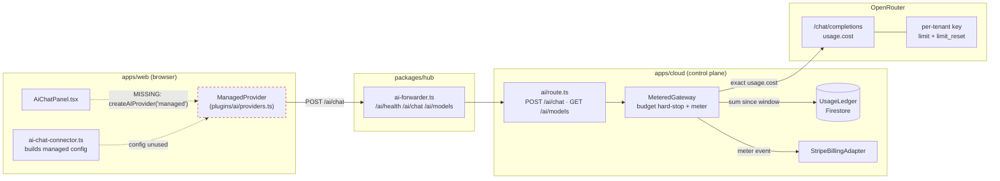
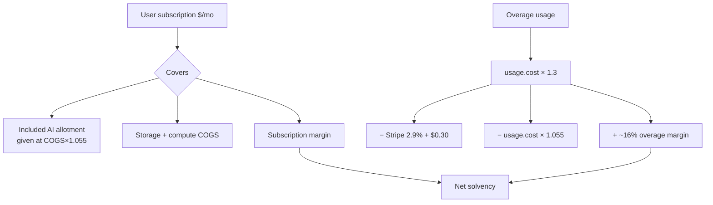
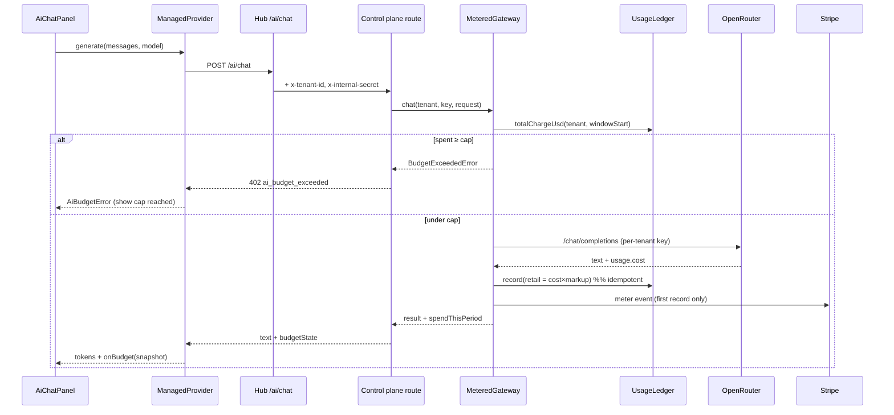
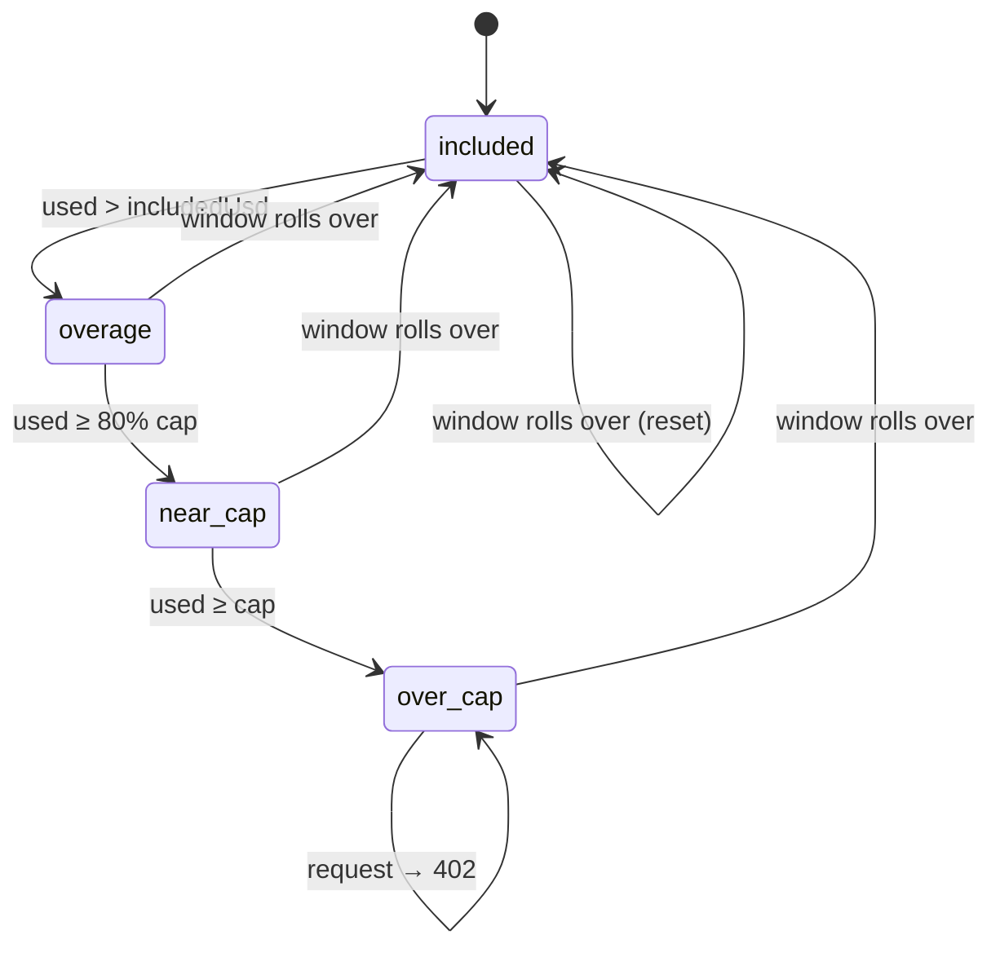
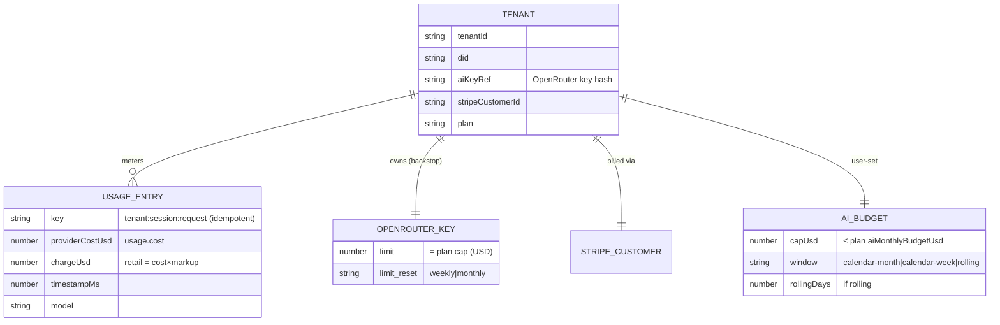

# OpenRouter Deep Integration: Model Toggles, Margin‑Safe Billing, and User Spend Caps

> Status: unimplemented (`[_]`). Sequel to
> [0200](0200_[_]_CLOUD_BILLING_AI_METERING_AND_RUN_IN_PUBLIC_DASHBOARD.md),
> [0201](0201_[_]_OPENROUTER_LITELLM_METERED_AI_AND_CREDITS_BILLING.md), and
> [0208](0208_[x]_OPENROUTER_MANAGED_AI_MODEL_SWITCHING_AND_CLIENT_WIRING.md).
> Where 0208 wired the _connector detection_ and 0201 chose the _gateway_, this
> exploration finishes the job: a working model picker in the UI, billing that is
> **provably above cost**, and a user‑settable spend cap (weekly / monthly /
> custom) that hard‑stops at the limit.

## Problem Statement

We want managed AI in xNet Cloud to be **fully usable, fully controllable, and
fully solvent**. Concretely the user asked for five things:

1. **Get OpenRouter "fully working"** end‑to‑end — not just server scaffolding,
   but a real chat experience that calls the managed gateway.
2. **Billing that works** — every call metered and invoiced correctly.
3. **Never lose money on API credits** — the retail price must provably exceed
   our true cost of goods sold (COGS), accounting for OpenRouter's fees, Stripe's
   fees, and the free allotment we give away.
4. **Let people toggle between models in the UI** and have "full control over
   what model they're using and how much they're getting billed for it."
5. **User‑set spend limits** — "this is how much I'm willing to spend in a week
   or a month" — and **cut them off when they hit it.**

The surprising finding (see _Current State_) is that **~80% of the server spine
already exists and is merged** — the metered gateway, the OpenRouter cost path,
the ledger, the Stripe meter, the plan‑gated catalog, even a client
`ManagedProvider` class. What's missing is the **last mile**: the client never
instantiates the provider, there is no model‑picker UI, the spend cap is
**monthly‑only** (the user explicitly wants weekly/custom), the margin math has
never been pinned to OpenRouter's _actual_ fee structure, and the budget‑alert
notifier is unwired.

## Executive Summary

- **Adopt a two‑layer enforcement model.** The user‑facing budget (weekly /
  monthly / rolling‑custom, any amount ≤ plan cap) is enforced by xNet's
  **ledger window** — flexible and instant. The **OpenRouter per‑tenant key
  `limit`** is a coarse, provider‑enforced **backstop** sized to the plan's
  monthly cap, protecting xNet's credit balance even if our own service has a
  bug. Keep them consistent; never rely on only one.
- **Bill off ground truth, not estimates.** OpenRouter now _always_ returns
  `usage.cost` (the exact USD it billed our account, caching/reasoning discounts
  already applied) — even on streaming, in the final SSE chunk. The repo already
  reads this in `OpenRouterGatewayClient`. The static price table becomes a
  _conservative emergency fallback_, never the primary path.
- **Make the markup provably margin‑positive.** True COGS for $1 of `usage.cost`
  is **~$1.055** once OpenRouter's 5.5% credit‑purchase fee is amortized. Retail
  is `usage.cost × markup`. With the default **1.3× markup** and Stripe's metered
  fee, net margin on overage is **~+16% of retail** — positive, but the _included
  free allotment_ (e.g. $2/mo on a $4.17/mo Personal plan) is the real risk and
  must be covered by the subscription, validated by a **floor‑margin CI test**.
- **Ship the product surface:** a `createAIProvider('managed', …)` factory that
  finally instantiates the existing `ManagedProvider`; a model picker fed by the
  already‑built `GET /ai/models`; a live budget gauge driven by the existing
  `onBudget` callback; and a dashboard cap control wired to the existing
  `setAiCap` (generalized to `setAiBudget(cap, window)`).
- **Wire the alert notifier** to the existing `crossedThresholds()` (50/80/95/100%)
  and **add a streaming path** so the chat feels native.

## Current State In The Repository

The server is far more complete than the product. Here is the seam‑by‑seam map.

### Gateway & cost (the OpenRouter calls themselves)

- `packages/cloud/src/ai/openrouter-gateway.ts` — `OpenRouterGatewayClient`
  implements `ChatGateway.chat()`, POSTs to `/chat/completions`, sets the
  per‑tenant key as the Bearer, supports model‑layer fallback (`models: [primary,
…fallbacks]`), and reads back **`usage.cost`** as `providerCostUsd`. The header
  comment already notes `usage:{include:true}` is now a deprecated no‑op and cost
  is always returned. **No streaming** (`chat()` is unary only).
- `packages/cloud/src/ai/gateway.ts` — `GatewayClient` / `ChatGateway` /
  `ChatRequest` / `ChatResult`, the OpenAI‑compatible abstraction (also used by
  the LiteLLM fallback).
- `packages/cloud/src/ai/openrouter-keys.ts` — `OpenRouterKeyManager` provisions
  a per‑tenant key via `POST /keys` with `limit: maxBudgetUsd` and
  **`limit_reset: 'monthly'` (hard‑coded)**; returns the secret `key` plus
  `data.hash` (surfaced as `VirtualKey.manageId`). `update()`/`remove()` address
  the key by hash.

### Metering, pricing & budget (the money math)

- `packages/cloud/src/ai/metered-gateway.ts` — `MeteredGateway` is the
  **defense‑in‑depth hard stop**: it sums `ledger.totalChargeUsd(tenantId,
periodStartMs)`, throws `BudgetExceededError` _before_ any provider call if
  `spent >= budget`, then meters the successful call. `periodStartMsFor` is
  injectable (this is the seam we generalize for weekly/custom windows).
- `packages/cloud/src/ai/metering.ts` — `meterUsage()` bridges a call into the
  ledger + Stripe meter idempotently (only emits the meter event on first record).
- `packages/cloud/src/billing/pricing.ts` — pure math:
  `computeChargeFromCostUsd(providerCostUsd, markup)` (the ground‑truth path) and
  `computeChargeUsd(in, out, pricing)` (the token‑estimate fallback). **Cardinal
  rule: always `ceil8` round‑up; throw if `markup < 1`** so we never undercharge.
- `apps/cloud/src/ai/pricing.ts` — `PROVIDER_RATES` (June‑2026 list prices) +
  `markupFromEnv()`; default markup **1.3×**, clamped `≥ 1`, overridable via
  `AI_MARKUP`. The comment already says the markup is "sized to absorb
  OpenRouter's ~5.5% credit‑purchase fee + Stripe fees."
- `packages/cloud/src/billing/budget.ts` — `aiBudgetStatus()` →
  `included|overage|near-cap|over-cap`, and `crossedThresholds()` (50/80/95/100%).
  **The notifier that would email on a crossing is not wired.**
- `packages/cloud/src/billing/ledger.ts` — `UsageLedger` /`MemoryUsageLedger`,
  idempotent by `tenant:session:request`, `totalChargeUsd(tenant, sinceMs)` and
  `entries(tenant, sinceMs)`. Durable impl: `apps/cloud/src/stores/usage-ledger.ts`
  (Firestore `usage` collection).
- `packages/cloud/src/billing/billing.ts` — `StripeBillingAdapter` /
  `FakeStripeBilling` (Stripe Billing Meters; idempotent by identifier).
- `packages/cloud/src/cost/reconcile.ts` — `measuredCogs()` /
  `reconcileTenantMargin()` compute **measured per‑tenant margin** (revenue −
  COGS). Built, but not surfaced on any dashboard.
- `packages/cloud/src/cost/pricing.ts` — `UNIT_COSTS` + `PLAN_PRICING`
  (`personal` $50/yr ≈ $4.17/mo, `family`, `team` $96/yr, …) and `estimateCogs()`.

### Entitlements & plans (the limits)

- `packages/entitlements/src/plans.ts` — per‑plan `aiEnabled`, `includedAiUsd`,
  `aiMonthlyBudgetUsd` (hard cap), `aiModels` policy, `aiDefaultModel`.
  Allowlists: `CHEAP_AI_MODELS` (`openrouter/auto`, Haiku, gpt‑4o‑mini, Gemini
  Flash) and `STANDARD_AI_MODELS` (+ Sonnet, gpt‑4o, Gemini Pro); richer plans
  get `'all'`. `aiModelAllowed(policy, model)` is the gate. Example values —
  Personal: included **$2**, cap **$25**, default `anthropic/claude-haiku-4-5`.

### Control plane & routes (the seam)

- `apps/cloud/src/ai/route.ts` — `POST /ai/chat` (budget hard‑stop → meter →
  Stripe; returns `spendThisPeriodUsd`, `includedUsd`, `budgetUsd`, `budgetState`,
  and a `402 ai_budget_exceeded` when over cap) and **`GET /ai/models`** (the
  plan‑gated catalog that is meant to drive the picker, already returning
  `inUsdPerM` / `contextLength` / `modality`).
- `apps/cloud/src/control-plane.ts` — `currentPeriodStartMs()` = **UTC calendar
  month only**; `setAiCap(tenantId, capUsd)` self‑serve cap clamped to
  `≤ aiMonthlyBudgetUsd`; stores `aiCapUsd` on the `TenantRecord`. Enforcement
  uses `min(aiCapUsd ?? ∞, planCap)`.
- `apps/cloud/src/ai/wiring.ts` — picks `OpenRouterGatewayClient` vs
  `GatewayClient` from `AI_GATEWAY_PROVIDER`/base‑URL; builds `OpenRouterKeyManager`
  **only if `OPENROUTER_MANAGEMENT_KEY` is set** (env var not yet in
  `.env.*` templates).
- `packages/hub/src/features/ai-forwarder.ts` — `aiForwarderFeature()` mounts
  `/ai/health`, `/ai/chat`, `/ai/models`, injecting `x-tenant-id` +
  `x-internal-secret` so the tenant's virtual key never reaches the hub.
- `apps/cloud/src/dashboard.ts` — `aiUsageCard()` renders used/included/cap.
  **Display‑only; no control to set the cap or window.**

### Client (the product surface — mostly _not_ wired)

- `packages/plugins/src/ai/providers.ts` — **`ManagedProvider` already exists**
  (around line 1093): POSTs to `/ai/chat`, turns `402` into a typed
  `AiBudgetError`, emits a `ManagedBudgetSnapshot` via an `onBudget` callback,
  and even has a `stream()` method. **But nothing constructs it** — there is no
  `createAIProvider('managed', …)` branch.
- `apps/web/src/workbench/views/ai-chat-connector.ts` — `providerConfigForConnector()`
  _builds_ a `{type:'managed', options:{baseUrl, model}}` config… that is then
  never passed to a factory. Settings persist in `localStorage` (`xnet:ai-model`,
  `xnet:ai-tier`).
- `apps/web/src/workbench/views/AiChatPanel.tsx` — the chat panel; detects
  connectors and ranks `'managed'` as tier 0, but renders **no model dropdown**
  and **no budget gauge**.
- `packages/plugins/src/ai/connectors/detect.ts` — `detectConnectors()` probes
  `GET /ai/health` for `{ ok:true, managed:true }`.



## External Research

OpenRouter's 2026 API is a near‑perfect fit; the key facts (verified June 2026):

### Usage accounting is automatic and exact

- Every completion response now **always** includes a `usage` object —
  `prompt_tokens`, `completion_tokens`, `total_tokens`, and **`cost`** (total
  charged to your account, in credits where **1 credit = $1 USD**), plus
  `prompt_tokens_details.cached_tokens` / `cache_write_tokens` and
  `completion_tokens_details.reasoning_tokens`. The legacy `usage:{include:true}`
  and `stream_options:{include_usage:true}` flags are **deprecated no‑ops**.
- For **streaming**, the usage (including `cost`) arrives in the **last SSE
  message** — so we can stream tokens _and_ still meter off ground truth.
- A `/api/v1/generation?id=…` endpoint returns stats by id, but note
  `upstream_inference_cost` is **only populated for BYOK** requests; for our
  managed (xNet‑account) requests, `usage.cost` is the number that matters.

### Provisioning keys natively support weekly/monthly resets

- `POST /api/v1/keys` (with a **Provisioning/Management key** — which itself
  cannot make completions) accepts `name`, `limit` (USD), and **`limit_reset` ∈
  {`daily`, `weekly`, `monthly`, `null`}**. Resets fire at **midnight UTC**;
  weeks are **Monday–Sunday**. Response returns `key` (shown once), `data.hash`,
  `data.usage`, `data.limit`, `data.limit_remaining`, and
  `data.usage_daily/weekly/monthly`.
- `GET /api/v1/key` returns `limit`, `limit_remaining`, `usage`,
  `is_free_tier`, `limit_reset` — usable for **reconciliation** of our ledger
  against OpenRouter's own counter.

### Economics — where the money actually leaks

| Cost lever              | Rate                                 | Who charges it                             |
| ----------------------- | ------------------------------------ | ------------------------------------------ |
| Model tokens            | **pass‑through, 0% markup**          | Provider (via OpenRouter)                  |
| **Credit purchase fee** | **5.5% (min $0.80) card; 5% crypto** | OpenRouter, when xNet tops up credits      |
| BYOK fee                | 5% after 1M free req/mo              | OpenRouter (N/A — we're managed, not BYOK) |
| Stripe metered invoice  | **2.9% + $0.30**                     | Stripe, on the overage we bill the user    |

The critical, easy‑to‑miss item: **OpenRouter does not mark up tokens — it makes
its money on the 5.5% credit top‑up fee.** So our true COGS for `$X` of
`usage.cost` is **`X × 1.055`** (amortized; buy credits in bulk to dodge the
$0.80 minimum). Any markup model that forgets this is quietly ~5.5% thinner than
it looks.

Prior art for the "user sets a budget, app cuts them off" pattern (OpenAI usage
limits, Anthropic workspace spend limits, Cursor/Replit credit meters) converges
on the same shape we already have: a **prepaid/metered ledger + a hard stop +
threshold emails**. Our differentiator is **per‑user, user‑chosen window**
(weekly/monthly/rolling) rather than a fixed calendar month.

## Key Findings

1. **The server is ~80% done; the product is ~5% done.** The single highest‑
   leverage missing line of code is a `createAIProvider('managed')` factory
   branch — without it the entire client path is dark despite `ManagedProvider`
   existing.
2. **Ground‑truth billing is already the design** — `usage.cost` flows through
   `providerCostUsd` → `computeChargeFromCostUsd`. Caching/reasoning discounts
   are automatically respected. We should _lean in_ and demote the static table.
3. **Weekly/custom windows are the real gap for the user's ask.**
   `currentPeriodStartMs` and `setAiCap` are monthly‑only;
   `OpenRouterKeyManager` hard‑codes `limit_reset:'monthly'`. But OpenRouter
   _natively_ supports weekly, and `MeteredGateway.periodStartMsFor` is already
   injectable — so the generalization is small and well‑seamed.
4. **Two different "limits" must not be conflated.** The **plan cap**
   (`aiMonthlyBudgetUsd`, protects xNet) and the **user's self‑set cap** (their
   budgeting, ≤ plan cap) are distinct controls with distinct owners.
5. **The included free allotment — not the per‑token markup — is the margin
   risk.** A Personal user can burn the full **$2/mo** included against a
   **$4.17/mo** subscription; that's $2.11 COGS, leaving the subscription to
   cover the rest. Overage is comfortably positive; _the giveaway_ is what a
   floor‑margin test must police.
6. **Defense‑in‑depth is free here.** The OpenRouter key `limit` is enforced by
   OpenRouter regardless of our code; setting it = the plan cap means a bug in
   our ledger can never run our credit balance away beyond the plan cap.

## Options And Tradeoffs

### A. Spend‑limit enforcement layer

| Option                              | How                                                                                   | Pros                                                                                                | Cons                                                                                                                           |
| ----------------------------------- | ------------------------------------------------------------------------------------- | --------------------------------------------------------------------------------------------------- | ------------------------------------------------------------------------------------------------------------------------------ |
| **A1. OpenRouter key `limit` only** | Set per‑tenant key `limit` + `limit_reset`                                            | Provider‑enforced; survives our bugs                                                                | One reset period per key; calendar‑aligned only; no rolling/custom; re‑provision to change period; no "included vs cap" nuance |
| **A2. xNet ledger window only**     | `totalChargeUsd(tenant, windowStart)` hard‑stop                                       | Any window (weekly/monthly/rolling/custom); instant change; included‑tier aware; per‑message gating | If our service is bypassed/buggy, nothing stops spend                                                                          |
| **A3. Both (recommended)**          | Ledger window = user‑facing control; key `limit` = coarse monthly backstop = plan cap | Flexibility _and_ a hard provider floor                                                             | Two counters to keep roughly consistent (reconcile via `GET /api/v1/key`)                                                      |

→ **A3.** The ledger is the product; the key limit is the seatbelt.

### B. Budget window semantics

| Option                     | Behavior                   | Note                                                                                                                            |
| -------------------------- | -------------------------- | ------------------------------------------------------------------------------------------------------------------------------- |
| **Calendar month** (today) | Resets 1st UTC             | Matches the Stripe invoice period; keep as default                                                                              |
| **Calendar week**          | Mon–Sun UTC                | Matches OpenRouter's weekly reset → key backstop stays aligned                                                                  |
| **Rolling N days**         | `sum since now − N·86400s` | Most intuitive for "spend in a week"; **no OpenRouter‑native equivalent** → ledger‑only, key backstop falls back to monthly cap |

→ Offer **all three**; default **calendar month**. Model it as a
`BudgetWindow` discriminated union so the math is one pure function.

### C. Pricing / charge model

| Option                         | Mechanism                                      | Verdict                                                                    |
| ------------------------------ | ---------------------------------------------- | -------------------------------------------------------------------------- |
| Token estimate × markup        | `computeChargeUsd` from `PROVIDER_RATES`       | **Fallback only** — drifts from real cost, mishandles caching              |
| **Cost‑plus off `usage.cost`** | `computeChargeFromCostUsd(usage.cost, markup)` | **Primary** — exact, caching‑safe, already built                           |
| Flat credits (prepaid)         | Sell "xNet credits"; debit retail per call     | Good for crypto/un‑banked later; defer (overlaps `@xnetjs/billing` BTCPay) |

→ **Cost‑plus off `usage.cost`**, static table as conservative fallback, prepaid
credits as a later option for the crypto path.

### D. Charging mechanism

| Option                             | Verdict                                                               |
| ---------------------------------- | --------------------------------------------------------------------- |
| **Stripe metered overage** (today) | **Keep** — `StripeBillingAdapter` + Billing Meters already idempotent |
| Prepaid balance debit              | Later, for BTCPay/crypto users who can't be post‑billed               |

### E. Model exposure in the UI

| Option                                    | Verdict                                                                                                 |
| ----------------------------------------- | ------------------------------------------------------------------------------------------------------- |
| Full OpenRouter catalog (300+)            | Overwhelming; includes `:free` variants with data‑training + rate‑limit caveats                         |
| **Curated, plan‑gated allowlist** (today) | **Keep & surface** — `aiModels` policy already gates `/ai/models`; exclude `:free` from managed catalog |

## Recommendation

Ship a single coherent slice — **"managed AI you can steer and a budget you
set"** — in this order:

1. **Wire the client (highest leverage).** Add `createAIProvider('managed', cfg)`
   that constructs `ManagedProvider`, and call it from `AiChatPanel`. This alone
   turns the lights on.
2. **Generalize the budget to a window.** Introduce `BudgetWindow`
   (`{kind:'calendar-month'|'calendar-week'|'rolling', days?}`), a pure
   `windowStartMs(window, now)`, and replace `setAiCap(cap)` with
   `setAiBudget({capUsd, window})` (still clamped `≤ aiMonthlyBudgetUsd`). Feed
   `windowStartMs` into `MeteredGateway.periodStartMsFor`. Set the OpenRouter key
   `limit_reset` to `weekly` when the user picks a weekly window, else `monthly`,
   with `limit = planCap` as the backstop.
3. **Build the model picker + budget gauge** in `AiChatPanel`: a dropdown fed by
   `GET /ai/models` showing **retail** $/Mtok (`provider_rate × markup`), context,
   and modality; a live "used / included / cap" gauge driven by the existing
   `onBudget` snapshot; per‑message retail cost; and a graceful `AiBudgetError`
   state ("You've hit your $X weekly limit — raise it in Settings or wait until
   reset").
4. **Add the dashboard cap control** wired to `setAiBudget` (amount + window).
5. **Pin the margin.** Add an `EFFECTIVE_COGS_MULTIPLIER` (default **1.055**) to
   the reconciliation so measured margin counts the credit‑purchase fee; add a
   **floor‑margin CI test** that fails if any plan's worst‑case (full included
   allotment on its priciest allowed model) drives margin ≤ 0; exclude `:free`
   and price‑unknown models from the managed catalog.
6. **Wire the notifier** to `crossedThresholds()` (email at 50/80/95/100%).
7. **Add streaming** (server SSE proxy that meters off the final usage chunk).

Items 1–4 deliver the user's literal request; 5–7 make it solvent and pleasant.

### The money math, pinned

For `$C` of `usage.cost` on an **overage** dollar (beyond the included tier),
billed via Stripe at markup `m = 1.3`:

```
revenue            = C · m                       = 1.300·C
OpenRouter COGS    = C · 1.055  (5.5% top-up fee) = 1.055·C
Stripe % fee       = C · m · 0.029               = 0.0377·C
                                                  -----------
net margin         ≈ (1.300 − 1.055 − 0.0377)·C  = +0.207·C
                   ≈ 16% of retail, +$0.21 per $1 of model cost
```

Positive at 1.3×. The **floor** for break‑even (ignoring the fixed Stripe $0.30,
which annual billing amortizes) is `m ≥ 1.055 / (1 − 0.029) ≈ 1.086`, so 1.3×
leaves real headroom. **The included allotment is the watch item:** for Personal,
worst case is $2 of Opus‑class tokens at COGS `$2 × 1.055 = $2.11` consumed from
a `$50/yr ≈ $4.17/mo` plan — still gross‑positive after infra COGS, but the
floor‑margin test must assert it for _every_ plan × _priciest allowed model_.



## Example Code

### 1. The missing factory branch (turns the lights on)

```ts
// packages/plugins/src/ai/providers.ts
export function createAIProvider(config: AIProviderConfig): AIProvider {
  switch (config.type) {
    case 'managed':
      // The class already exists — it was just never constructed.
      return new ManagedProvider({
        baseUrl: config.options.baseUrl ?? '',
        ...(config.options.model ? { model: config.options.model } : {}),
        ...(config.options.onBudget ? { onBudget: config.options.onBudget } : {})
      })
    case 'anthropic':
      return new AnthropicProvider(config.options)
    // …existing cases
    default:
      throw new Error(`unknown provider type: ${config.type}`)
  }
}
```

### 2. Generalize the budget to a window (pure + testable)

```ts
// packages/cloud/src/billing/window.ts  (new)
export type BudgetWindow =
  | { kind: 'calendar-month' }
  | { kind: 'calendar-week' } // Mon 00:00 UTC, matches OpenRouter weekly
  | { kind: 'rolling'; days: number } // "spend in the last N days"

/** Start (ms) of the window containing `nowMs`. Pure — exhaustively unit-tested. */
export function windowStartMs(w: BudgetWindow, nowMs: number): number {
  const d = new Date(nowMs)
  switch (w.kind) {
    case 'calendar-month':
      return Date.UTC(d.getUTCFullYear(), d.getUTCMonth(), 1)
    case 'calendar-week': {
      const dayMs = 86_400_000
      const dow = (d.getUTCDay() + 6) % 7 // 0 = Monday
      const midnight = Date.UTC(d.getUTCFullYear(), d.getUTCMonth(), d.getUTCDate())
      return midnight - dow * dayMs
    }
    case 'rolling':
      return nowMs - w.days * 86_400_000
  }
}

/** OpenRouter's key reset that best backstops this window (rolling → monthly). */
export function keyResetFor(w: BudgetWindow): 'weekly' | 'monthly' {
  return w.kind === 'calendar-week' ? 'weekly' : 'monthly'
}
```

```ts
// apps/cloud/src/control-plane.ts  — generalize setAiCap
async setAiBudget(
  tenantId: string,
  budget: { capUsd: number; window: BudgetWindow } | undefined
): Promise<TenantRecord> {
  const record = await this.deps.tenants.get(tenantId)
  if (!record) throw new Error(`Unknown tenant: ${tenantId}`)
  let aiBudget: TenantRecord['aiBudget']
  if (budget) {
    if (!Number.isFinite(budget.capUsd) || budget.capUsd < 0)
      throw new Error(`Invalid AI cap: ${budget.capUsd}`)
    // User cap can only ever be *tighter* than the plan's monthly cap.
    aiBudget = {
      capUsd: Math.min(budget.capUsd, record.entitlements.aiMonthlyBudgetUsd),
      window: budget.window
    }
    // Keep the provider-side backstop aligned (best-effort; ledger is source of truth).
    await this.deps.keys?.update(record.aiKeyRef, {
      maxBudgetUsd: record.entitlements.aiMonthlyBudgetUsd,
      limitReset: keyResetFor(budget.window)
    })
  }
  const updated: TenantRecord = { ...record, aiBudget }
  await this.deps.tenants.put(updated)
  return updated
}
```

```ts
// route wiring — feed the window into the existing injectable seam
const gateway = new MeteredGateway({
  /* …existing deps… */
  budgetUsdFor: async () => t.budgetUsd, // min(userCap, planCap)
  periodStartMsFor: async () => windowStartMs(t.budgetWindow, now())
})
```

### 3. `OpenRouterKeyManager` — parameterize the reset (small change)

```ts
// packages/cloud/src/ai/openrouter-keys.ts
export interface CreateVirtualKeyInput {
  alias: string
  maxBudgetUsd: number
  limitReset?: 'daily' | 'weekly' | 'monthly'   // NEW (default 'monthly')
}

async create(input: CreateVirtualKeyInput): Promise<VirtualKey> {
  const data = (await this.call('POST', '/keys', {
    name: input.alias,
    limit: input.maxBudgetUsd,
    limit_reset: input.limitReset ?? 'monthly'
  })) as CreateKeyResponse
  // …unchanged
}
```

### 4. Model picker row (retail price, not COGS)

```tsx
// apps/web/src/workbench/views/ModelPicker.tsx (new)
function priceLabel(m: ModelCard): string {
  // Server already returns provider list price; multiply by the public markup
  // so users see what *they* pay, never our COGS.
  if (m.inUsdPerM == null) return '—'
  const inP = (m.inUsdPerM * PUBLIC_MARKUP).toFixed(2)
  const outP = ((m.outUsdPerM ?? m.inUsdPerM) * PUBLIC_MARKUP).toFixed(2)
  return `$${inP} in / $${outP} out per 1M`
}
// <select> grouped by m.family; on change → persist localStorage 'xnet:ai-model'
// and rebuild the provider via createAIProvider('managed', { …, model }).
```

### 5. Budget gauge from the snapshot the provider already emits

```tsx
// AiChatPanel.tsx
const [budget, setBudget] = useState<ManagedBudgetSnapshot | null>(null)
const provider = useMemo(
  () =>
    createAIProvider({
      type: 'managed',
      options: { baseUrl, model, onBudget: setBudget }
    }),
  [baseUrl, model]
)

// render: used / included / cap bar, color by budget.budgetState
//   'near-cap' → amber, 'over-cap' → red + disable send
// on AiBudgetError → "You've hit your $X {weekly|monthly} limit — reset {when}."
```

### Sequence: one metered, budget‑checked call



### Budget state machine (per window)



### Data model



## Risks And Open Questions

- **Window↔invoice mismatch.** A _weekly_ or _rolling_ user cap does not align
  with Stripe's monthly invoice. The cap governs _access_ (when we stop calling);
  the invoice still totals the calendar month. We must make this explicit in the
  UI ("your weekly limit controls usage; billing is monthly").
- **OpenRouter weekly resets are calendar (Mon–Sun UTC), not rolling.** A
  rolling user window can't be backstopped exactly by the key; for rolling we
  fall back to a `monthly` key limit = plan cap (still a valid seatbelt).
- **Concurrent‑request overshoot.** Two in‑flight calls can both pass the
  pre‑check and land slightly over the cap. Acceptable (bounded by one call's
  cost); the OpenRouter key is the absolute ceiling. Note it; don't over‑engineer
  a lock.
- **Static‑table drift.** If `usage.cost` is ever absent, the fallback table can
  diverge from reality (esp. with caching). Bias the fallback **high** and alert
  when the fallback path is hit so we notice.
- **`:free` and price‑unknown models.** Exclude from the managed catalog —
  free variants carry data‑training and rate‑limit caveats and `inUsdPerM:null`
  breaks the price display and the floor‑margin test.
- **Credit top‑up automation.** If xNet's master OpenRouter balance hits zero,
  _every_ tenant 402s. Need a low‑balance alert (`GET /api/v1/credits`) and
  ideally auto‑top‑up — buy in **bulk** to amortize the $0.80 minimum fee.
- **Included‑allotment abuse.** Someone could spin up many Personal plans to
  farm the free $2 on premium models. Keep cheap models as the _default_; the
  floor‑margin test bounds the worst case; watch per‑tenant margin in
  `reconcile.ts`.
- **Management key handling.** `OPENROUTER_MANAGEMENT_KEY` is a high‑privilege
  secret (mints keys). It is not yet in `.env.*` templates or the deploy secret
  store; it must never be logged and never reach a hub.
- **Open question — surface raw cost or retail only?** Recommend showing
  **retail only** to users (what they pay); keep COGS/margin on the operator
  dashboard via `reconcile.ts`.

## Implementation Checklist

- [ ] Add `createAIProvider('managed', cfg)` branch in
      `packages/plugins/src/ai/providers.ts` and call it from `AiChatPanel.tsx`
      (pass `onBudget`).
- [x] New `packages/cloud/src/billing/window.ts`: `BudgetWindow`,
      `windowStartMs()`, `keyResetFor()`; exhaustive unit tests (month/week/rolling,
      UTC + DST‑free boundaries).
- [ ] Replace `currentPeriodStartMs` usage and `setAiCap` with
      `setAiBudget({capUsd, window})` on `control-plane.ts`; persist
      `aiBudget` on `TenantRecord`; keep clamp `≤ aiMonthlyBudgetUsd`.
- [ ] Feed `windowStartMs(window, now)` into `MeteredGateway.periodStartMsFor`
      via the route; `budgetUsd = min(userCap, planCap)`.
- [x] Parameterize `OpenRouterKeyManager.create/update` with
      `limitReset` (default `monthly`); set `limit = planCap` at provision and
      `limit_reset = keyResetFor(window)` on budget change.
- [ ] Build `ModelPicker` UI fed by `GET /ai/models`, showing **retail** $/Mtok,
      context, modality; persist `xnet:ai-model`; rebuild provider on change.
- [ ] Build the live budget gauge in `AiChatPanel` from `ManagedBudgetSnapshot`;
      color by `budgetState`; disable send + show reset time on `AiBudgetError`.
- [ ] Add a dashboard cap control (`apps/cloud/src/dashboard.ts`) → amount +
      window selector → `setAiBudget`.
- [x] Margin: add `EFFECTIVE_COGS_MULTIPLIER` (default `1.055`) to
      `cost/reconcile.ts`; add a **floor‑margin CI test** over every plan ×
      priciest allowed model × full included allotment; exclude `:free` /
      `inUsdPerM:null` from the managed catalog.
- [ ] Wire a notifier to `crossedThresholds()` (50/80/95/100%) — email via the
      existing transport; idempotent per (tenant, window, threshold).
- [ ] Add a streaming path: server SSE proxy for `/ai/chat` that meters off the
      **final** usage chunk; `ManagedProvider.stream()` consumes it.
- [ ] Add `OPENROUTER_MANAGEMENT_KEY` to `.env.staging`/`.env.production`
      templates + deploy secret store; low‑balance alert via `GET /api/v1/credits`;
      ops doc on bulk credit top‑up.
- [ ] Reconcile job: compare ledger window total vs `GET /api/v1/key`
      `usage`/`limit_remaining`; alert on drift > tolerance.
- [ ] Changeset(s) for the publishable packages touched (`@xnetjs/cloud`,
      `@xnetjs/entitlements`, `@xnetjs/plugins`) per repo policy.

## Validation Checklist

- [x] Unit: `windowStartMs` correct for calendar‑month, calendar‑week (Mon
      boundary, year wrap), and rolling‑N across UTC midnight.
- [ ] Unit: `computeChargeFromCostUsd` never undercharges (round‑up) and rejects
      `markup < 1` (already true — keep covered).
- [x] Unit/property: floor‑margin test fails if any plan’s worst case
      (`includedAiUsd` of its priciest allowed model at COGS×1.055) yields
      margin ≤ 0.
- [ ] Integration: a chat under cap returns text + `budgetState`; a chat at cap
      returns `402 ai_budget_exceeded` with **no** OpenRouter call (assert the
      fake gateway was not invoked).
- [ ] Integration: setting a **$5 weekly** cap stops the 6th $1 call within the
      week and resets the following Monday (fake clock).
- [ ] Integration: streaming call meters the same retail charge as the unary
      path for identical `usage.cost`.
- [ ] Integration: idempotency — replaying the same `(session, request)` records
      once and emits one Stripe meter event.
- [ ] E2E (web): model picker lists only plan‑allowed models with retail prices;
      switching models persists and re‑bills correctly; gauge turns amber at 80%
      and red + disabled at 100%.
- [ ] Ops: low‑balance alert fires before the master OpenRouter balance hits 0;
      reconcile job shows ledger vs OpenRouter `usage` within tolerance.
- [ ] Margin reconciliation dashboard shows positive measured margin for a
      simulated heavy‑AI tenant.

## References

- OpenRouter — Usage Accounting (cost always returned; streaming final chunk):
  https://openrouter.ai/docs/cookbook/administration/usage-accounting
- OpenRouter — Provisioning / Management API keys (`limit`, `limit_reset`
  daily/weekly/monthly): https://openrouter.ai/docs/features/provisioning-api-keys
- OpenRouter — Create API key endpoint:
  https://openrouter.ai/docs/api/api-reference/api-keys/create-keys
- OpenRouter — Limits / `GET /api/v1/key`:
  https://openrouter.ai/docs/api/reference/limits
- OpenRouter — Pricing & fees (5.5% credit purchase, 5% crypto, BYOK 5%):
  https://openrouter.ai/pricing and https://openrouter.ai/docs/faq
- Prior xNet explorations:
  `0200_[_]_CLOUD_BILLING_AI_METERING_AND_RUN_IN_PUBLIC_DASHBOARD.md`,
  `0201_[_]_OPENROUTER_LITELLM_METERED_AI_AND_CREDITS_BILLING.md`,
  `0208_[x]_OPENROUTER_MANAGED_AI_MODEL_SWITCHING_AND_CLIENT_WIRING.md`,
  `0216_[x]_SEAMLESS_CLOUD_PLAN_UPGRADE_DOWNGRADE_AND_OVER_QUOTA_GUARDRAILS.md`.
- Key code seams: `packages/cloud/src/ai/{openrouter-gateway,openrouter-keys,
metered-gateway,metering}.ts`, `packages/cloud/src/billing/{pricing,budget,
ledger,billing}.ts`, `packages/cloud/src/cost/reconcile.ts`,
  `apps/cloud/src/ai/{route,pricing,wiring}.ts`,
  `apps/cloud/src/control-plane.ts`, `packages/entitlements/src/plans.ts`,
  `packages/hub/src/features/ai-forwarder.ts`,
  `packages/plugins/src/ai/providers.ts`,
  `apps/web/src/workbench/views/{AiChatPanel.tsx,ai-chat-connector.ts}`.
