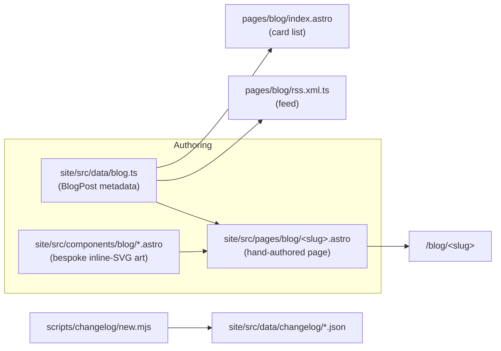
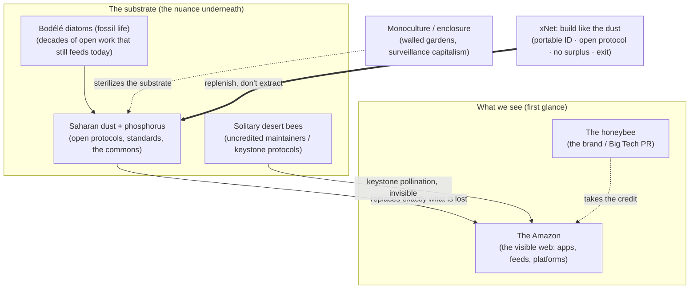

# The Desert That Feeds the Forest — Dust, Bees, and the Invisible Substrate

> Exploration for blog post **#4** in the xNet essay series. Sibling to
> [`0239` — A Great Pirate Age](./0239_[x]_A_GREAT_PIRATE_AGE_ONE_PIECE_AND_THE_XNET_ETHOS.md) (the sea),
> [`0240` — Data Should Work Like Soil](./0240_[x]_DATA_SHOULD_WORK_LIKE_SOIL_THE_MYCELIAL_NETWORK_AND_THE_NERVOUS_SYSTEM_OF_XNET.md) (the soil),
> and [`0241` — The Gentlest Furnace](./0241_[x]_THE_GENTLEST_FURNACE_STELLAR_EQUILIBRIUM_AND_THE_LIFE_CYCLE_OF_INFORMATION.md) (the star).
> This one looks **across**: at the wind that carries a dead desert over an
> ocean to keep a living forest alive.

## Problem Statement

The prompt: take the transcript of a YouTube video — *"They Dropped Millions of
Frozen Bees into the Sahara. 1 Year Later, the Results Are Unbelievable!"*
([`L4GfxOmQkGY`](https://www.youtube.com/watch?v=L4GfxOmQkGY)) — and turn its
metaphors into a blog post. The metaphors the user cares about:

- **Desert bees** — solitary pollinators that lie unseen for years and do
  essential work nobody watches.
- **The Sahara fertilizing the rainforest** — the most lifeless place on Earth
  keeping the most alive place on Earth alive, across an ocean.
- **Not noticing the important thing at first glance** — ecosystems are already
  doing something load-bearing that we don't see, don't value, and don't credit,
  because the visible surface hides the substrate that makes it possible.

…and to tie that to **xNet, the open web, big tech, and how they interrelate.**

There is a twist worth naming up front, because it is the essay's whole spine:
**the source video is itself the metaphor.** It is AI-generated clickbait from a
channel called *Discovery World* — 15 minutes, 1.5M views, fake keyword-stuffed
"chapters" (`01:28 Frozen Bees / 03:33 desert / 05:12 Sahara`), narrating an
experiment that never happened. You cannot make the Sahara bloom by airlifting
frozen bees; that is fiction dressed as a nature documentary. And yet buried
inside that hollow surface are two *real*, beautiful, well-documented phenomena —
the dust bridge and the keystone bee — that the viewer (and the user) correctly
intuited as important. **The slick surface is not where the truth is. The truth
is in the nuance underneath, the part nobody optimizes for a thumbnail.** That is
exactly the lesson the essay carries into the web.

## Executive Summary

**Recommendation: write it, as essay #4, titled _"The Desert That Feeds the
Forest."_** It is the strongest entry in the series since the soil piece, because
the core ecological fact is genuinely astonishing *and* maps onto the open-web
thesis with almost no forcing:

- **The fact.** Every year ~**27.7 million tons** of Saharan dust settle on the
  Amazon basin after crossing the Atlantic. The dust carries roughly **22,000
  tons of phosphorus** — within an order of magnitude of *exactly* what the
  Amazon loses to rain runoff each year. The forest's soil is ancient and
  phosphorus-poor; without the resupply it would slowly starve. And the dust's
  richest source is the **Bodélé Depression** in Chad: the bed of a lake that
  dried up ~5,000–8,000 years ago, whose phosphorus comes from the fossils of
  **dead diatoms** — microscopic life that died millennia ago and now, as dust,
  keeps a living rainforest breathing. *Death feeding life; the invisible
  keeping the visible alive; a "wasteland" that turns out to be the supply line.*
- **The bee.** Most bees are not honeybees. They are **solitary** — no hive, no
  honey, no brand — and desert species lie dormant underground through drought,
  emerging only after rare rain to do the pollination that holds the whole food
  web together. They are **keystone species**: small in number, invisible in
  operation, catastrophic in absence. The charismatic honeybee gets the PR; the
  uncredited solitaries do the load-bearing work.
- **The web mapping.** The open web *is* the Sahara and the solitary bee. Open
  protocols (HTTP, RSS, email, DNS, ActivityPub), open-source maintainers, shared
  standards — the "boring," seemingly dead substrate — are the dust and the
  pollination that keep the *visible* web (apps, platforms, the feed) alive. Big
  Tech is the **monoculture plantation**: lush at a glance, but it strip-mines the
  commons it depends on and replenishes nothing. Nadia Eghbal's *Roads and
  Bridges* already named open-source maintainers the **"keystone species" of
  digital infrastructure**, whose labor is "invisible precisely because it works"
  — visible only when it breaks (Heartbleed). **xNet's wager is to build like the
  dust, not the plantation:** infrastructure that replenishes (portable identity,
  an open hash-chained protocol, no behavioral surplus, a real exit) instead of
  extracting.

The piece slots cleanly into the established blog machinery (`.astro` page +
`blog.ts` metadata + auto-RSS + a hand-drawn inline-SVG hero), reuses the
`'nature'` tag, and continues the series' recurring "look up / look down / look
across" opening device.

## Current State In The Repository

The blog is a small, well-grooved system. A new post is **one data entry + one
art-directed page + (optionally) one or two bespoke SVG components**, and the
index and feed update themselves.



What exists today (verified):

- **Metadata, single-sourced** — [`site/src/data/blog.ts`](../../site/src/data/blog.ts).
  `BlogPost` type, the `posts[]` array (currently 3), `publishedPosts()`,
  `postBySlug()`, `formatPostDate()`. **`BlogTag` is a closed union** —
  `'essay' | 'philosophy' | 'privacy' | 'decentralization' | 'protocol' |
  'nature' | 'cosmos'`. This post reuses `['essay', 'philosophy', 'nature']`
  (same as the soil piece) — **no new tag needed**, which avoids touching the
  index/RSS tag styling.
- **The pages** — [`site/src/pages/blog/`](../../site/src/pages/blog/):
  `index.astro`, `rss.xml.ts`, and one `.astro` per post
  (`a-great-pirate-age`, `data-should-work-like-soil`, `the-gentlest-furnace`).
  Each page imports `postBySlug(slug)!`, renders a bespoke hero, then an
  `<article class="prose …">` body. See
  [`the-gentlest-furnace.astro`](../../site/src/pages/blog/the-gentlest-furnace.astro)
  for the canonical shape.
- **Bespoke art, all inline SVG** —
  [`site/src/components/blog/`](../../site/src/components/blog/): each post ships a
  `*Hero` (`PirateHero`, `MycelialHero`, `StarHero`), an `Honest*` self-audit
  panel (`HonestPirate`, `HonestMycelium`, `HonestStar`), and usually one
  signature diagram (`HydrostaticBalance`, `ThreeNervousSystems`). **Critical
  convention (Self-Audit parity): no third-party assets — every illustration is
  inline SVG so the page ships nothing external** (see the comment header in
  [`MycelialHero.astro`](../../site/src/components/blog/MycelialHero.astro)). The
  cosmic-X logo recurs as the bright node in every hero.
- **The recurring opening device.** Each post opens by recalling the prior ones.
  The star piece begins: *"The first time, we looked up — at an open sea of
  scattered islands… The second time, we looked down — under the forest floor…
  This time, look up again. All the way up… to a star."* Essay #4 must continue
  the figure: **we've looked up at the sea, down at the soil, up at the star —
  now look _across_, at the wind.**
- **Changelog** — the blog launch is recorded at
  [`site/src/data/changelog/2026-06-27-the-xnet-blog-is-live.json`](../../site/src/data/changelog/2026-06-27-the-xnet-blog-is-live.json).
  **Gotcha (from prior posts): use `scripts/changelog/new.mjs` to generate a
  changelog fragment — do not hand-author a duplicate** (the script owns the
  filename/format; `site/` is outside the root eslint/prettier config).

The thesis the essay argues for is **already the project's stated position**, so
the post is non-fiction about xNet, not aspiration:

- [`docs/CHARTER.md`](../../docs/CHARTER.md) — *"Software that serves instead of
  extracts."* Commitments map 1:1 to the metaphor:
  - **Own** — local store is the master copy; **no behavioral surplus**
    ([`packages/data/src/store/store.ts`](../../packages/data/src/store/store.ts)),
    a CI gate bans third-party analytics/ad SDKs
    ([`scripts/check-humane-patterns.mjs`](../../scripts/check-humane-patterns.mjs)).
  - **Exit** — portable `did:key`
    ([`packages/identity/src/keys.ts`](../../packages/identity/src/keys.ts)),
    open signed hash-chained change log
    ([`packages/sync/src/change.ts`](../../packages/sync/src/change.ts)),
    offline-first
    ([`packages/runtime/src/sync/offline-queue.ts`](../../packages/runtime/src/sync/offline-queue.ts)).
  - **Calm** — no engagement ranking, chronological feeds, rule-based
    notifications.
- [`docs/VISION.md`](../../docs/VISION.md) and the surveillance-capitalism data
  module [`site/src/data/surveillance.ts`](../../site/src/data/surveillance.ts)
  supply the "Big Tech monoculture / extraction" framing.
- The open protocol itself — [`0200` portable protocol spec](./0200_[x]_PORTABLE_PROTOCOL_SPEC.md)
  (kernel = signed, hash-chained, LWW change log; BLAKE3) — is the literal
  "dust": a shared, copyable substrate no platform owns.

## External Research

### The dust bridge (real, and exact)

- **Quantity & balance.** NASA used the CALIPSO satellite (2007–2013) to make the
  first satellite-based estimate of the transatlantic dust transport: on average
  **182 million tons** of dust leave West Africa each year past longitude 15°W;
  **~27.7 million tons** fall on the **Amazon basin**. That dust carries
  **~22,000 tons of phosphorus per year — close to the amount the Amazon loses to
  rain and flooding**, so the desert resupplies almost exactly the deficit. (NASA
  Goddard; Yu et al., *Geophysical Research Letters*, 2015.)
- **The source is fossil life.** The phosphorus is concentrated in the **Bodélé
  Depression** in Chad — the bed of the former **Mega-Lake Chad**, dry for
  ~5,000–8,000 years. Its dust is rich in phosphorus because it is largely the
  remains of **dead diatoms** (microscopic freshwater organisms) from when the
  Sahara was green. So: *a dead lake's fossil plankton, blown across an ocean,
  fertilizes the world's most productive forest.*
- **Why it matters.** Amazon soils are old and deeply weathered; phosphorus is the
  limiting nutrient, washed out by heavy rain about as fast as it arrives. The
  forest is not self-sufficient — it is **subsidized from a place that looks
  dead.** Pull the subsidy and the loss is slow, distant, and easy to misattribute
  — exactly the failure mode that makes invisible infrastructure dangerous to
  neglect.

### The bee (most bees are not the bee you picture)

- **Solitary, not social.** The large majority of bee species are **solitary** —
  no hive, no honey, no colony, no PR. Desert species (e.g. the **desert pallid
  bee**, *Centris pallida*; many *Halictidae*) wait out drought dormant
  underground and **emerge in response to rain and bloom**, then pollinate.
- **Keystone, invisible.** Pollination is a **keystone process**: bees are
  "glue holding nature's design together," and their removal cascades up through
  plants, insects, birds, and mammals. The work is invisible because it works —
  we notice it only by its absence (collapsing yields, silent springs).
- **The brand vs. the labor.** The honeybee is the mascot of "save the bees,"
  but it is a managed, semi-domesticated species; the unmanaged solitary
  pollinators do enormous uncredited work and are the ones quietly disappearing.
  (USDA-ARS *Tellus*; Xerces Society; Dar et al., *Entomological Research*, 2025.)

### The web's invisible substrate (the bridge to xNet)

- **Nadia Eghbal, _Roads and Bridges: The Unseen Labor Behind Our Digital
  Infrastructure_ (Ford Foundation, 2016).** The defining text. Open-source
  maintainers are the **"keystone species" of digital infrastructure**; their
  labor is **"unseen precisely because it works"** and becomes visible only in
  catastrophic failure (**Heartbleed**). Open code is a **public good**
  (non-excludable, non-rivalrous), but the **attention to maintain it is finite
  and depletable** — a classic commons that gets strip-mined.
- **The tragedy/comedy of the commons.** Platforms extract enormous commercial
  value from unpaid maintainer labor and open standards while replenishing little.
  (cf. xkcd 2347 "Dependency" — the entire edifice resting on one unpaid project
  in Nebraska.)
- **Enclosure.** Walled gardens (the monoculture) look productive and are, for a
  while — but they sterilize the substrate: killing interop, RSS, open APIs, the
  link itself. The decay is slow and easy to misattribute (the "dead internet,"
  link rot, the death of the small web), exactly like a forest cut off from its
  dust.

## Key Findings

1. **The user conflated two real phenomena, and the conflation is a gift.** The
   video is about (fictional) "frozen bees in the Sahara"; the user named "desert
   bees" *and* "the Sahara fertilizing the rainforest." These are two distinct
   real things (keystone pollinators; the transatlantic dust bridge). The essay
   can hold **both** under one roof: *the invisible substrate that keeps the
   visible alive.*
2. **The clickbait video is the perfect cold open.** "Not noticing the important
   thing at first glance" is literally enacted by the source: a 1.5M-view AI
   "documentary" whose surface is engineered for the click and whose actual
   content is hollow — while the *real* science it gestures at is more astonishing
   than the fiction. **First glance vs. nuance** is the whole essay; the medium is
   the message.
3. **The mapping is unusually clean** (see table below) — death-feeds-life,
   keystone-but-invisible, exact-replenishment, brand-vs-labor, and
   visible-only-in-failure all have crisp web analogues. Low forcing risk.
4. **It is non-fiction about xNet.** Every "we should build like the dust" claim
   has a receipt in the Charter and the code. The post can be assertive without
   overclaiming — which the humane-patterns lint and the Charter's "no commitment
   without a receipt" ethos both demand.
5. **Zero new infrastructure.** Reuses `'nature'`, the page+data+RSS pattern, and
   the inline-SVG/Self-Audit convention. The only new code is one page and 2–3
   small SVG components.

### The mapping

| Ecology (the desert & the bee) | Open web / xNet |
| --- | --- |
| The Sahara — *looks* dead | Open protocols, RSS, email, DNS, OSS maintainers — *look* boring/inert |
| The Amazon — *looks* self-sufficiently alive | The visible web: apps, platforms, the feed |
| 27.7M tons of dust / 22k tons phosphorus a year | Standards, specs, unpaid labor, the shared commons flowing *upward* |
| Bodélé diatoms — fossil life, dead millennia | Decades of accumulated open work; dead projects whose ideas still feed new ones |
| Dust replaces *exactly* the Amazon's annual loss | The commons silently replenishing what platforms strip-mine |
| Solitary desert bee — no hive, no honey, no brand | The uncredited maintainer; the keystone protocol |
| The honeybee — the mascot, the PR | Big Tech platforms taking credit for pollination they don't do |
| Keystone species — few, invisible, irreplaceable | Maintainers (Eghbal): "remove them and it collapses" |
| Heartbleed-style "visible only when it breaks" | Infrastructure noticed only in catastrophic failure |
| Monoculture plantation — lush, but sterilizes its substrate | Walled gardens / surveillance capitalism / enclosure |
| Cut the dust → the forest starves slowly, far away | Enclose the commons → the web decays slowly, misattributed |
| Build like the dust: replenish, don't extract | xNet: portable ID, open protocol, no surplus, real exit |



## Options And Tradeoffs

### Framing options (which spine carries the essay)

| Option | Spine | Pros | Cons |
| --- | --- | --- | --- |
| **A. The dust bridge** (recommended primary) | A dead desert feeds a living forest, across an ocean, replacing exactly what's lost | Astonishing, exact, well-cited; "death feeds life" is profound; maps perfectly to "commons feeds platforms" | Need to keep the bee thread from feeling bolted on |
| **B. The solitary bee** | The uncredited keystone worker vs. the branded mascot | Cleanest map to "maintainers vs. Big Tech"; emotionally direct | Less astonishing on its own; "save the bees" is a worn image |
| **C. First glance vs. nuance** (the meta layer) | The clickbait video itself: hollow surface, real truth underneath | Self-aware, fresh, indicts the attention economy directly | Risk of being *about media* rather than *about ecology*; could feel clever-clever |
| **D. All three, braided** (recommended structure) | Open on the video (C) → dust (A) → bee (B) → web → xNet | Uses the best of each; the video cold-open earns the ecology, which earns the thesis | Longest; needs disciplined transitions |

**Recommendation: D — braid all three, with the dust bridge (A) as the
centerpiece.** Open on the video as the "first glance," descend into the two real
phenomena as the "nuance," then turn the lens on the web and land on xNet.

### Title options

| Title | Read |
| --- | --- |
| **The Desert That Feeds the Forest** (recommended) | Clear, paradoxical, series-consistent (evocative noun phrase); names the central marvel |
| What the Desert Knows | More poetic, less concrete |
| The Invisible Harvest | Bee-forward; a touch generic |
| A Dead Lake Feeds a Living Forest | Most astonishing literal framing; long |
| The Long Wind | Atmospheric; too oblique for the index card |

### Tag options

- **Reuse `['essay', 'philosophy', 'nature']`** (recommended; identical to the
  soil post — no `BlogTag` union change, no index/RSS styling work).
- Add a new `'ecology'` or `'commons'` tag → touches the union and the tag
  rendering; not worth it for one post.

### Art options (inline SVG, Self-Audit parity)

- **`DustHero`** (recommended) — a wide composition: Africa's bulge at left, a
  warm dust plume arcing **across** a dark ocean to a green canopy at right, the
  **cosmic-X glowing as a single dust mote** mid-Atlantic (echoing the "X as the
  bright node" motif from every prior hero). Reuses the `MycelialHero` structure.
- **`DustBridge`** (recommended signature diagram) — the series' "one diagram"
  slot (cf. `HydrostaticBalance`, `ThreeNervousSystems`): an annotated
  cross-section of the cycle — *Bodélé (fossil diatoms) → uplift → Atlantic
  crossing → Amazon deposition → runoff loss → balance* — with the web labels
  paralleled underneath.
- **`HonestDesert`** (recommended self-audit panel) — the `Honest*` slot: states
  plainly what's true vs. simplified (the dust↔phosphorus balance is
  approximate-not-exact; the "frozen bees" video is fiction; "save the bees"
  usually means the wrong bee), keeping faith with the Charter's "honesty about
  the gap is itself a commitment."

## Recommendation

Write **essay #4: _"The Desert That Feeds the Forest."_** Structure D (braided),
dust bridge centered, ~12–14 minute read (in line with #2/#3), tags
`['essay','philosophy','nature']`, slug `the-desert-that-feeds-the-forest`.

Narrative arc:

1. **Cold open — the first glance.** The clickbait video: frozen bees, the
   Sahara, 1.5M views, a thumbnail engineered for your thumb. It's fiction. But
   it's pointing, clumsily, at something real — and the real thing is stranger
   than the lie. *Look past the surface.*
2. **Look across — the dust.** We looked up at the sea, down at the soil, up at
   the star; now look *across*. 27.7M tons of dust a year; the Bodélé diatoms; the
   forest that is secretly subsidized by the desert; the balance that is almost
   exact. **Death feeds life. The wasteland is the supply line.**
3. **The bee nobody watches.** Most bees aren't the bee on the poster. The
   solitary desert bee — dormant, unbranded, keystone. The honeybee gets the
   mascot; the solitaries do the work and quietly vanish.
4. **The web is a forest that forgot its desert.** The visible web feels
   self-sufficient. It isn't. It runs on dust: open protocols, RSS, email, DNS,
   and the unpaid keystone maintainers Eghbal wrote about — invisible *because*
   they work, noticed only when they break (Heartbleed). Big Tech is the
   monoculture: lush, extractive, sterilizing the substrate it lives on. Enclosure
   doesn't kill the forest tomorrow; it cuts the dust, and the forest starves
   slowly, far from the cause.
5. **Build like the dust.** xNet's bet, with receipts: be the substrate that
   replenishes, not the plantation that extracts. Own (no surplus), Exit (portable
   ID + open hash-chained protocol), Calm (no engagement machine). The cosmic-X as
   one dust mote in a wind that belongs to no one.
6. **Close — the turn.** The important thing is rarely the thing on the surface.
   It's the dust you can't see, the bee you never watch, the protocol nobody
   thanks. Notice it. Then go build something that feeds the forest instead of
   farming it.

Concrete next step after this exploration is approved: implement the page,
metadata, and three SVG components; regenerate a changelog fragment; verify the
index card, the post route, and the RSS feed.

## Example Code

### 1) Metadata entry — prepend to `posts[]` in `site/src/data/blog.ts`

```ts
{
  slug: 'the-desert-that-feeds-the-forest',
  title: 'The Desert That Feeds the Forest',
  description:
    'Every year, a dead desert blows across an ocean and feeds the most ' +
    'alive place on Earth — replacing almost exactly what the rainforest ' +
    'loses. What Saharan dust, solitary bees, and the maintainers nobody ' +
    'thanks teach us about the invisible substrate the open web runs on.',
  pubDate: '2026-06-29T00:00:00Z', // set to actual publish instant at ship time
  author: 'xNet',
  tags: ['essay', 'philosophy', 'nature'],
  readingMinutes: 13
},
```

> The `posts` array is rendered newest-first by `pubDate`; the index card and the
> RSS feed pick this up automatically. No edits to `index.astro` or `rss.xml.ts`
> are required.

### 2) Page skeleton — `site/src/pages/blog/the-desert-that-feeds-the-forest.astro`

```astro
---
import Base from '../../layouts/Base.astro'
import Nav from '../../components/sections/Nav.astro'
import Footer from '../../components/sections/Footer.astro'
import DustHero from '../../components/blog/DustHero.astro'
import DustBridge from '../../components/blog/DustBridge.astro'
import HonestDesert from '../../components/blog/HonestDesert.astro'
import { postBySlug, formatPostDate } from '../../data/blog'

const post = postBySlug('the-desert-that-feeds-the-forest')!
---

<Base title={`${post.title} — xNet`} description={post.description}>
  <Nav />
  <main>
    <DustHero
      title={post.title}
      deck={post.description}
      date={formatPostDate(post.pubDate)}
      readingMinutes={post.readingMinutes}
      tags={post.tags}
    />
    <article
      class="prose prose-lg mx-auto max-w-3xl px-6 py-16 dark:prose-invert prose-headings:tracking-tight prose-a:text-amber-600 dark:prose-a:text-amber-400"
    >
      <!-- §1 the first glance (the video) … -->
      <!-- §2 look across (the dust) … --> <DustBridge />
      <!-- §3 the bee nobody watches … -->
      <!-- §4 the web is a forest that forgot its desert … -->
      <!-- §5 build like the dust (Charter receipts) … -->
      <HonestDesert />
      <!-- §6 the turn … -->
    </article>
    <Footer />
  </main>
</Base>
```

### 3) Hero component contract — `site/src/components/blog/DustHero.astro`

Mirror `MycelialHero.astro`'s prop contract exactly so the page wiring is
identical; only the artwork changes.

```astro
---
// Original art for blog post #4 (exploration 0244). Where MycelialHero looked
// DOWN into soil and StarHero looked UP at a star, this looks ACROSS: a warm
// dust plume arcs over a dark ocean from the African bulge (left) to a green
// canopy (right). The cosmic-X glows as a single dust mote mid-Atlantic — the
// recurring "X as the brightest node" motif. All inline SVG; ships nothing
// third-party (Self-Audit parity).
interface Props {
  title: string
  deck: string
  date: string
  readingMinutes: number
  tags: string[]
}
const { title, deck, date, readingMinutes, tags } = Astro.props
// …hand-placed plume path, ocean gradient, canopy blobs, cosmic-X mote…
---
```

## Risks And Open Questions

- **Scientific precision.** "Exactly replaces what's lost" is a *headline*, not a
  measurement — the balance is approximate and the phosphorus-bioavailability
  fraction is debated. **Mitigation:** say "close to" / "roughly," and disclose
  the simplification in `HonestDesert`. Cite NASA + Yu et al. (2015) by name.
- **The video is fiction — don't launder it.** The post must not imply the
  "frozen bees in the Sahara" experiment was real. **Mitigation:** name it as
  clickbait in §1; that honesty *is* the hook ("not noticing… at first glance").
- **Metaphor fatigue.** Four nature/cosmos essays in a row (soil, star, now
  desert). **Mitigation:** the "look across / the wind" axis is genuinely new
  (interconnection across distance, not a single system), and the meta layer (the
  clickbait video) gives it a different texture from #2/#3.
- **"Save the bees" cliché.** Overused. **Mitigation:** subvert it immediately —
  most bees aren't the bee on the poster; the mascot isn't the worker.
- **Forcing the xNet turn.** The pivot from ecology to product can clunk.
  **Mitigation:** lead with receipts (Charter §Own/§Exit/§Calm, real file paths),
  keep the pitch to one disciplined section, end on the metaphor not the feature
  list.
- **Open question — publish cadence.** #2 and #3 published minutes apart on
  2026-06-28. Should #4 wait, to avoid burying the others? (Recommend spacing it a
  day or more; set `pubDate` accordingly.)
- **Open question — link out or stay self-contained?** Prior posts are essays with
  few external links. Recommend a short, sober "Sources" coda (NASA, Eghbal) since
  this one leans on hard numbers — but keep the body link-light to preserve the
  reading flow.
- **Transcript caveat.** The verbatim transcript could not be extracted — YouTube
  now returns empty `timedtext` bodies for this video and transcript mirrors sit
  behind Cloudflare. We captured the title, the full description, runtime (913s),
  channel (*Discovery World*), and the keyword-stuffed fake chapters, which is
  enough to characterize it accurately. The essay does not depend on quoting it.

## Implementation Checklist

- [ ] Add the `BlogPost` entry to [`site/src/data/blog.ts`](../../site/src/data/blog.ts)
      (slug `the-desert-that-feeds-the-forest`, tags `['essay','philosophy','nature']`).
- [ ] Create `site/src/components/blog/DustHero.astro` (inline SVG; dust plume
      arcing **across** an ocean; cosmic-X as a mid-Atlantic mote; mirror
      `MycelialHero`'s prop contract).
- [ ] Create `site/src/components/blog/DustBridge.astro` (the signature diagram:
      Bodélé → Atlantic → Amazon → runoff → balance, with web labels paralleled).
- [ ] Create `site/src/components/blog/HonestDesert.astro` (self-audit panel:
      the balance is approximate; the video is fiction; "save the bees" ≠ the
      keystone bee).
- [ ] Write `site/src/pages/blog/the-desert-that-feeds-the-forest.astro` following
      Structure D, weaving in Charter receipts (§Own/§Exit/§Calm) and real file
      paths.
- [ ] Continue the recurring opener ("…up at the sea, down at the soil, up at the
      star — now look **across**, at the wind").
- [ ] Keep all art **inline SVG** — no third-party assets (Self-Audit parity).
- [ ] Add a short "Sources" coda (NASA Goddard / Yu et al. 2015; Eghbal, *Roads
      and Bridges*) since the post uses hard figures.
- [ ] Generate a changelog fragment via `node scripts/changelog/new.mjs`
      (do **not** hand-author the JSON).
- [ ] Confirm whether `site/` needs a separate lint/format pass (it is outside the
      root eslint/prettier config — see prior blog posts).
- [ ] No `docs/sidebar.mjs` / `build:llms` changes — the blog is not part of the
      docs sidebar.
- [ ] **No changeset required** — `site/` is not a publishable `packages/*`
      library (per `CLAUDE.md`).

## Validation Checklist

- [ ] `pnpm --filter site dev` (or the repo's site dev script): `/blog/the-desert-that-feeds-the-forest`
      renders; hero, `DustBridge`, and `HonestDesert` display correctly in light
      and dark mode.
- [ ] `/blog` index lists the new card newest-first with the right date, reading
      time, and tags.
- [ ] `/blog/rss.xml` includes the new post (title, description, link, pubDate)
      and validates as well-formed RSS.
- [ ] Build passes: `pnpm --filter site build` with no broken imports or type
      errors (`postBySlug('the-desert-that-feeds-the-forest')` resolves).
- [ ] No external network assets requested by the page (DevTools Network tab clean
      — Self-Audit parity holds).
- [ ] Social/OG: `Base` title/description populate; no hero image required (text
      OG is fine, matching #3).
- [ ] Read-through proof: capture a screenshot of the hero + one body section for
      the PR (per the repo's visual-capture convention).
- [ ] Prose check: the post never implies the "frozen bees" experiment was real;
      scientific claims are hedged ("close to," "roughly"); the `HonestDesert`
      panel discloses simplifications.
- [ ] Reading time in `blog.ts` matches the finished length (±1 min).

## References

### xNet (in-repo)

- [`site/src/data/blog.ts`](../../site/src/data/blog.ts) — `BlogPost` type, `posts[]`, helpers, `BlogTag` union.
- [`site/src/pages/blog/the-gentlest-furnace.astro`](../../site/src/pages/blog/the-gentlest-furnace.astro) — canonical page shape + the recurring opener.
- [`site/src/components/blog/MycelialHero.astro`](../../site/src/components/blog/MycelialHero.astro) — hero prop contract + Self-Audit (inline-SVG) convention.
- [`site/src/pages/blog/rss.xml.ts`](../../site/src/pages/blog/rss.xml.ts) / [`index.astro`](../../site/src/pages/blog/index.astro) — auto-rendered feed + index.
- [`docs/CHARTER.md`](../../docs/CHARTER.md) — Own / Exit / Calm commitments with code receipts.
- [`docs/VISION.md`](../../docs/VISION.md), [`site/src/data/surveillance.ts`](../../site/src/data/surveillance.ts) — extraction/monoculture framing.
- [`0200` Portable Protocol Spec](./0200_[x]_PORTABLE_PROTOCOL_SPEC.md) — the open, copyable substrate ("the dust").
- Series: [`0239`](./0239_[x]_A_GREAT_PIRATE_AGE_ONE_PIECE_AND_THE_XNET_ETHOS.md) · [`0240`](./0240_[x]_DATA_SHOULD_WORK_LIKE_SOIL_THE_MYCELIAL_NETWORK_AND_THE_NERVOUS_SYSTEM_OF_XNET.md) · [`0241`](./0241_[x]_THE_GENTLEST_FURNACE_STELLAR_EQUILIBRIUM_AND_THE_LIFE_CYCLE_OF_INFORMATION.md).

### The dust bridge

- NASA Goddard — *NASA Satellite Reveals How Much Saharan Dust Feeds Amazon's Plants* (CALIPSO): <https://www.nasa.gov/centers-and-facilities/goddard/nasa-satellite-reveals-how-much-saharan-dust-feeds-amazons-plants/>
- NASA Scientific Visualization Studio — *CALIPSO observes Saharan dust crossing the Atlantic*: <https://svs.gsfc.nasa.gov/4273/>
- ScienceDaily — *Massive amounts of Saharan dust fertilize the Amazon rainforest* (Yu et al., 2015): <https://www.sciencedaily.com/releases/2015/02/150224102847.htm>
- EarthSky — *Saharan dust feeds Amazon rainforest, perfectly*: <https://earthsky.org/earth/saharan-dust-feeds-amazon-rainforest-perfectly/>
- Mongabay — *How the Sahara keeps the Amazon rainforest going*: <https://news.mongabay.com/2015/03/how-the-sahara-keeps-the-amazon-rainforest-going/>

### The bee

- USDA-ARS *Tellus* — *Specialized Bees Power Desert Ecosystems*: <https://tellus.ars.usda.gov/stories/articles/specialized-bees-power-desert-ecosystems>
- *Buzzing towards Resilience: …the Desert Pallid Bee, Centris pallida…* (PMC): <https://www.ncbi.nlm.nih.gov/pmc/articles/PMC11508805/>
- Dar et al. (2025), *Solitary Bees as Vital Bioindicators* — *Entomological Research*: <https://onlinelibrary.wiley.com/doi/10.1111/1748-5967.70047>

### The invisible web

- Nadia Eghbal — *Roads and Bridges: The Unseen Labor Behind Our Digital Infrastructure* (Ford Foundation, 2016): <https://www.fordfoundation.org/media/2976/roads-and-bridges-the-unseen-labor-behind-our-digital-infrastructure.pdf>
- xkcd 2347, *Dependency* — the load-bearing unpaid maintainer: <https://xkcd.com/2347/>

### Source video

- *They Dropped Millions of Frozen Bees into the Sahara…* — **Discovery World**, 2026-05-17, 913s, ~1.5M views. AI-generated clickbait; premise is fiction; real phenomena above are what it gestures at. <https://www.youtube.com/watch?v=L4GfxOmQkGY>
