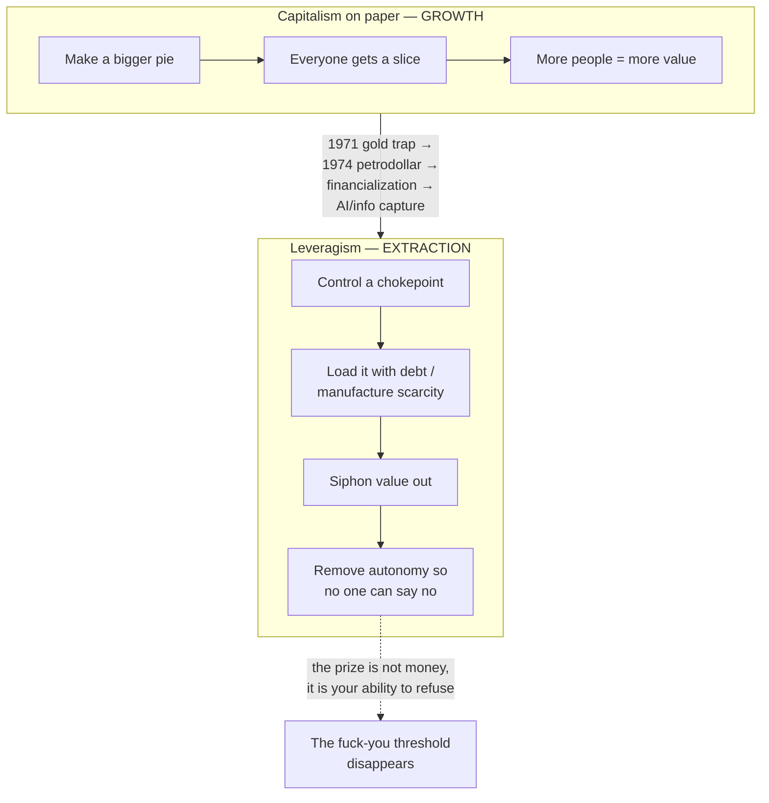
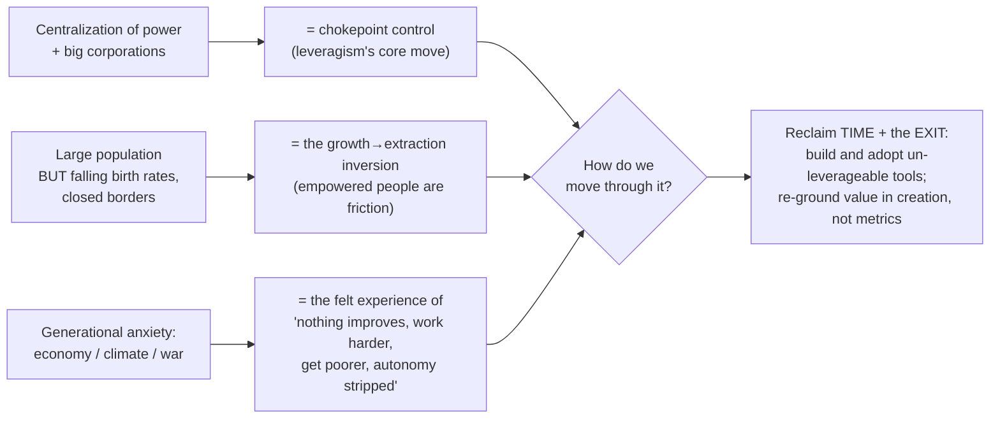
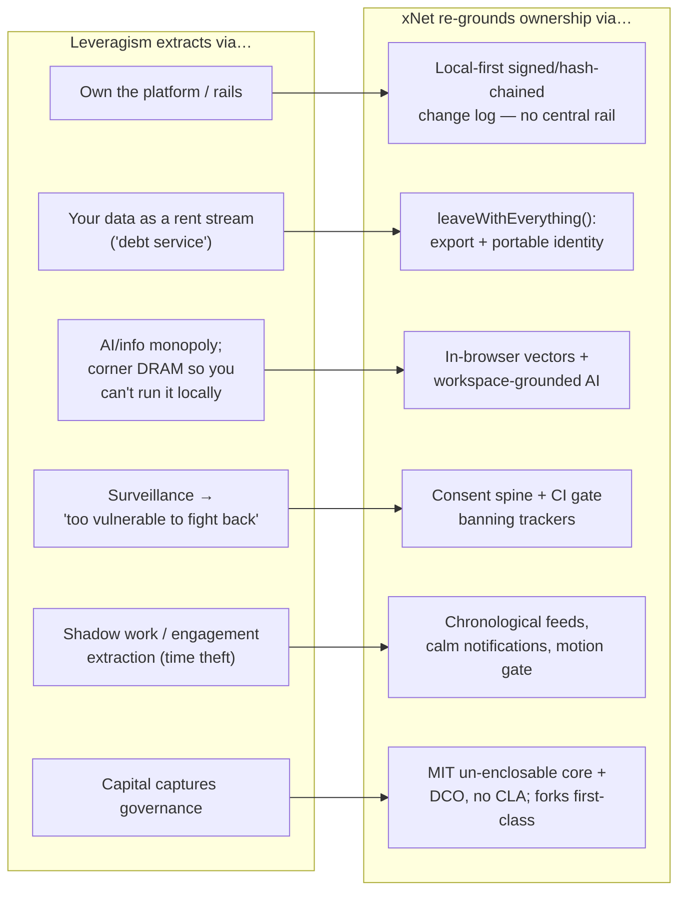
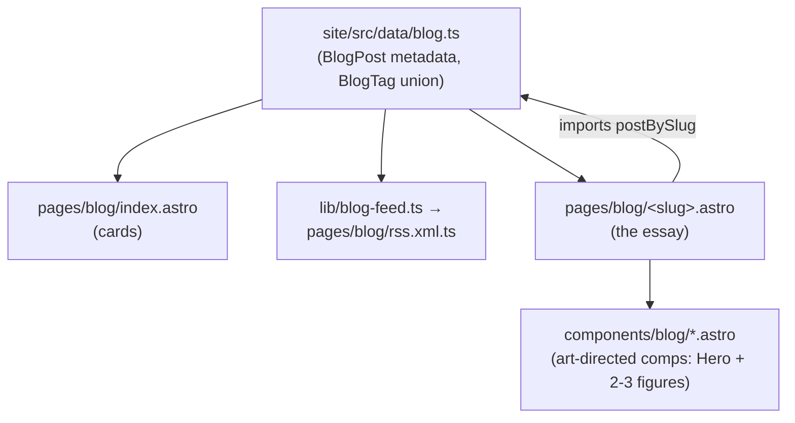

# Leveragism and the Local-First Exit: Benn Jordan, the Extraction Economy, and What xNet Is For

> _"Please don't encourage us to create a completely free and open decentralized
> internet. What the hell are we going to do without this system you provided?"_
> — Benn Jordan, sarcastically voicing leveragism's nightmare, in
> [_The Richest Country Is Pretty Mid Now_](https://www.youtube.com/watch?v=4FZy1lBNykA)

## Problem Statement

A user asked us to take Benn Jordan's 43-minute video essay _The Richest Country
Is Pretty Mid Now_ (published June 2026) and connect it to xNet **and** to the
present moment — "centralization of power, a lot of big corporations, a large
global population, but declining birth rates and generational anxiety around the
economy and climate and war and so much stuff. And generally, how we might move
through all of that."

That is a tall order, because the obvious failure mode is to write a vibes essay
that name-drops a YouTuber and gestures at xNet. This exploration does the
opposite: it takes Jordan's actual argument seriously, maps its specific
mechanisms onto **code that exists in this repository today**, names the parts
of his diagnosis that xNet does _not_ address, and recommends a concrete,
checkable deliverable — the fifth post in the site's essay series — in xNet's
established calm, evergreen voice rather than its source's partisan one.

The deeper question the prompt is really asking: **if Jordan is right that the
economy is shifting from growth to extraction, and that the prize is no longer
your money but your autonomy — what is a piece of software actually for?** xNet
has an answer, and it's more specific than "decentralization good."

## Executive Summary

- **Jordan's thesis ("leveragism").** Capitalism on paper depends on _growth_ —
  a bigger pie everyone shares. American capitalism stopped following that paper
  decades ago and now runs on _leverage_: controlling chokepoints (housing,
  retail debt, oil-denominated dollars, and now **information and AI**) to
  _extract_ value rather than create it. The tell: "Try and think of one, just
  one general thing in your life that has improved in the last 10 years." His
  punchline is that the endgame "isn't happening to steal your money. It's
  happening to steal your autonomy."
- **The single best bridge to xNet** is a sentence Jordan delivers as the
  oppressor's nightmare: a _"completely free and open decentralized internet."_
  That is not a metaphor we're stretching to fit — it is, almost verbatim, the
  charter of this project (`docs/CHARTER.md`). xNet is one buildable instance of
  the thing leveragism is structured to prevent.
- **The mapping is mechanism-for-mechanism, not thematic.** "Private equity sees
  a debt service" → xNet treats your data as _yours and exportable_
  (`right-to-leave.ts`). AI as an IP-theft chokepoint that corners DRAM so you
  _can't_ run models locally → xNet runs vectors **in your browser**
  (`packages/vectors/`) and grounds AI in your own workspace
  (`packages/brain/`). Surveillance as the lever that makes you "too vulnerable
  to fight back" → a consent spine that gates _all_ telemetry and a CI gate that
  _bans_ third-party trackers (`scripts/check-humane-patterns.mjs`).
- **The intellectual spine** is older than Jordan: Albert O. Hirschman's _Exit,
  Voice, and Loyalty_ (1970). Leveragism's real innovation is removing **Exit**,
  which renders **Voice** powerless. xNet's whole architecture is an Exit
  machine. This framing keeps the essay evergreen and non-partisan.
- **The present-moment puzzle the user named — declining birth rates while
  power centralizes — is literally a question Jordan asks on screen**: "Why
  would so many capitalists support closed borders and contribute to political
  campaigns that lower the population?" Under _growth_ you want more consumers;
  under _leverage_ you want fewer empowered people and more manufactured
  scarcity. We surface this as _his lens_, not settled fact.
- **Recommendation:** Ship **blog post #5** (`site/src/pages/blog/`), provisional
  title _"The Right to Say No"_, tags `['essay','philosophy','decentralization']`
  (optionally a new `'economics'` tag), plus 2–3 art-directed `.astro`
  comps. Keep this exploration as the research substrate. **Do not** relitigate
  Jordan's specific political claims; extract the structural argument.

## The Source: Benn Jordan's "Leveragism"

Benn Jordan is a musician and electronic artist turned tech/privacy essayist
(known for anti-surveillance work, e.g. on Flock cameras, and a prior viral
essay, _You Are Witnessing the Death of American Capitalism_). This video is the
sequel. The transcript was retrieved in full; the chapter structure _is_ the
argument:

| Time | Chapter | The move |
| --- | --- | --- |
| 0:00 | About Capitalism | Capitalism-on-paper needs growth; nobody's read the paper in decades. The New Deal (Glass-Steagall, FDIC) was FDR redefining capitalism so it couldn't cannibalize itself. |
| 3:53 | Political Leverage | Power stopped coming from making things and started coming from controlling rules and rails. |
| 6:01 | The Gold Trap | Bretton Woods (1944): USD pegged to gold, the world pegged to USD — the "exorbitant privilege." America prints, imports, and exports its debt as Treasuries. |
| 8:00 | The Rug Pull | The Nixon Shock (Aug 15 1971) ends gold convertibility after de Gaulle's France calls the bluff and ships its gold home. Stagflation, oil shocks, social chaos. |
| 11:34 | The Bond Trap | The petrodollar (~1974): a quiet US–Saudi deal — oil priced only in USD + US military protection — forces every nation to hoard dollars. America is back on "the chariot of asymmetrical leverage." |
| 15:23 | Classical Leverage | Leverage explained via housing; Soros's _reflexivity_ (1987); **Blackstone/Invitation Homes** post-2008 algorithmically overpaying to price families out. "Private equity sees a debt service." |
| 19:00 | Debts R' Us | The **Toys R Us** LBO (KKR/Bain/Vornado): not about toys, about "using the company as a debt service" — $470M in fees/dividend recaps while it rotted. |
| 20:32 | AI Circlejerk | The same play applied to _information_: Nvidia↔OpenAI↔Microsoft↔CoreWeave circular deals; cornering ~40% of DRAM so you can't run AI locally; Google replacing search with Gemini and regurgitating others' IP ahead of the source link. "Tech will have done to intellectual property what private equity did to Toys R Us." |
| 22:45 | My Awesome Trip To Israel | Gemini fabricated that Jordan visited Israel to interview IDF soldiers (he's a vocal Palestinian-statehood supporter). ~45% of AI news answers were erroneous (BBC/EBU). Google's legal defense: "no evidence anyone didn't know they were hallucinations." |
| 29:09 | Authoritarian Leverage | When one actor's purchasing power rivals a whole city, it becomes "more valuable to remove billions from [the community] than to add billions to it." Growth inverts into extraction; xenophobia becomes a tool to manufacture scarcity. |
| 35:01 | Siphoning Your 401K | Passive index funds are _legally required_ to track the NASDAQ-100; the IPO "seasoning period" was cut from 3 months to 15 days for the SpaceX IPO, so on **July 6 2026** your 401k is contractually forced to buy possibly-propped stock. Rent, groceries, power all up; "working harder and earning more while getting poorer." |
| 39:02 | Time and the Smokescreen of Numbers | The real theory: it's about autonomy, not money. _Shadow work_ (Illich) outsources unpaid labor to you "under the guise of convenience." The asset to hoard is **time**. "We were greedy about the wrong thing." |

The closing lines are the emotional core, and they're where xNet lives:

- _"Economic happiness is defined solely by having just enough income to say
  'fuck you' when you're mistreated."_ (the **fuck-you threshold**)
- _"This isn't happening to steal your money. It's happening to steal your
  autonomy."_
- _"Please don't encourage us to create a completely free and open decentralized
  internet."_
- _"Thanks for listening to my economic manifesto. And as always, whatever you
  do, keep creating."_

### The shape of the argument



Note the inversion at the center: under growth, a larger, freer population is an
_asset_ (more makers, more consumers). Under leverage, an empowered population is
a _liability_ — people who can say no are friction in an extraction machine.
That single inversion is what makes Jordan's closed-borders / declining-population
question answerable, and it's what makes the user's "present moment" cohere.

## The Present Moment

The user's framing maps onto leveragism almost one-to-one. We present these as
Jordan's lens applied to the macro mood — sharp, contestable, useful:



- **Centralization & big corporations** are leveragism's chokepoint control made
  visible. xNet's scope is precise: it attacks the chokepoint in the
  **information/data layer** — not housing, not your 401k.
- **Large population, falling birth rates, closed borders.** Jordan asks it
  outright: "Why would so many capitalists support closed borders and contribute
  to political campaigns that lower the population?" His answer is the inversion
  above. (We flag this as a provocative lens, not demographic fact — birth-rate
  decline has many drivers: urbanization, women's education and autonomy, cost
  of living, contraception access. But the _felt_ economics — "I can't afford a
  kid in this" — is exactly the autonomy-loss leveragism predicts.)
- **Generational anxiety** is the subjective signature of extraction: a decade
  where "nothing improved" while the Dow nearly tripled. Climate and war sit on
  top as the existential surcharge.
- **"How we move through it"** is the whole point of the prompt, and Jordan's
  own prescription is unusually constructive for a doom essay: hoard _time_, keep
  creating, fund resistance to surveillance, and — his exact words — build "a
  completely free and open decentralized internet." That is a software program.
  It is, specifically, xNet's program.

## Current State In The Repository

xNet is not a metaphor for the exit — it's an implementation of one. The mapping
below is mechanism-for-mechanism, every path verified to exist today.

### Leveragism mechanism → xNet countermove



**1. Chokepoint control → there is no central rail to own.**
The kernel is a signed, hash-chained, last-write-wins **change log** (BLAKE3),
not a platform you rent access to:
- `docs/specs/protocol/00-overview.md` … `05-schema-evolution.md` — the portable
  protocol spec, with `90-conformance.md` and the `xpp/` proposal track.
- `packages/sync/src/change.ts` — the `Change` type (signatures + chain
  integrity); `packages/crypto/src/hashing.ts` — BLAKE3.
- `conformance/vectors/` — golden vectors (authz, change, lww, replication) and
  `conformance/reference/python/xnet_kernel.py` + the Swift kernel — so the
  protocol is reproducible by anyone, in any language. A spec with golden
  vectors can be re-implemented; it cannot be acquired.

**2. "Private equity sees a debt service" → your data is yours, and leaving
loses nothing.**
The opposite of a rent stream is an exit:
- `packages/plugins/src/services/right-to-leave.ts` — `leaveWithEverything()`,
  tested in `right-to-leave.test.ts`.
- `packages/data/src/database/export/json-export.ts` + `csv-export.ts` — full
  workspace export.
- `packages/identity/src/keys.ts` / `did.ts` — portable `did:key` identity you
  carry between hubs.
- `docs/CHARTER.md` — the **Exit** principle ("leaving is your right, and it
  loses nothing").

**3. AI as an IP-theft chokepoint → AI grounded in your data, runnable locally.**
Jordan's sharpest point is that OpenAI cornered DRAM so consumers _can't_ run AI
locally. xNet's bet is the reverse:
- `packages/vectors/src/hnsw.ts` / `embedding.ts` / `search.ts` — vector search
  **in the browser**, no data-center round-trip.
- `packages/brain/src/retrieve.ts` / `indexer.ts` — governed GraphRAG over _your_
  workspace; the model is pointed at your data, not trained on everyone's.
- `packages/plugins/src/ai/runtime.ts` — scaffold mode (you write, the assistant
  cites) with `ai-generated` provenance; `packages/trust/src/index.ts` —
  provenance tiers so regurgitation is _labeled_, not laundered.
- `packages/plugins/src/ai/providers.ts` — BYO/Ollama/OpenRouter, so you're never
  locked to one vendor's chokepoint.

**4. Surveillance as the autonomy lever → consent-gated, tracker-free by CI.**
"How much more will it take to make you too vulnerable to fight back?"
- `packages/telemetry/src/consent/manager.ts` — the consent spine gating all
  telemetry; `collection/bucketing.ts` (k-anonymity), `tracing/hash.ts`
  (DID-hashing), `collection/scrubbing.ts` (PII removal).
- `scripts/check-humane-patterns.mjs` — a CI gate that **bans** Sentry/Plausible/
  ad SDKs and dark patterns in `packages/` and `apps/`. The value is enforced,
  not aspirational.
- `packages/core/src/utils/ssrf.ts` — governed outbound fetch.

**5. Shadow work / time theft → calm, agent-first, no engagement extraction.**
- `packages/social/src/feeds/defaults.ts` — chronological by default, no
  engagement ranking.
- `packages/comms/src/notify/rules.ts` — rule-based notifications (priority,
  watermark, snooze, hard cap) — no red-dot anxiety.
- `scripts/check-motion-vocab.mjs` — bans manipulative animation. See exploration
  `0232_[_]_COZY_CALM_AND_AGENT_FIRST_A_DELIGHTFUL_PLACE_TO_SPEND_THE_DAY.md`.

**6. Capital captures governance → an un-enclosable commons.**
- `LICENSE` (MIT core) + `CONTRIBUTING.md` (DCO, _no CLA_) — the core can't be
  bought back; contributions stay un-enclosed.
- `packages/cloud/LICENSE` (FSL-1.1-Apache-2.0, converts to Apache-2.0) +
  `packages/entitlements/LICENSE` (MIT) — the commercial layer is time-bombed
  open.
- `GOVERNANCE.md`, `TRADEMARK.md` — fork-friendly by policy. See explorations
  `0241_[_]_OPEN_COLLECTIVE…`, `0242_[x]_GOVERNANCE_AND_TRADEMARK…`,
  `0243_[_]_ACCOUNT_VALIDATION_AND_RECOVERY…`.

### The blog deliverable, as it actually works

The site has **no MDX**; essays are hand-authored, art-directed `.astro` pages
with metadata single-sourced from a data module (`site/src/data/blog.ts`). Three
posts ship today (`a-great-pirate-age`, `data-should-work-like-soil`,
`the-gentlest-furnace`); a fourth (desert dust, exploration 0244) is written-up
but unimplemented.



## External Research

Jordan's essay stands on a real intellectual lineage. Anchoring the post in it
keeps it credible and evergreen:

- **Albert O. Hirschman — _Exit, Voice, and Loyalty_ (1970).** The master key.
  When a firm/state declines, members respond with **Exit** (leave) or **Voice**
  (complain). Voice only has power when Exit is credible. Leveragism's true
  innovation is removing Exit — from housing, from platforms, from your data —
  so Voice becomes theater. xNet is an Exit machine; `right-to-leave.ts` is
  literally named for it. _This is the through-line we recommend for the post._
- **Yanis Varoufakis — _Technofeudalism_ (2023).** Argues capitalism already
  died and was replaced by "cloud fiefs" that extract rent via platforms — an
  academic twin of Jordan's "what comes after capitalism." Useful counterpart
  and citation.
- **Cory Doctorow — "enshittification" (2022–).** The platform-decay mechanism
  (good to users → good to business customers → value extracted) is leveragism
  at the product layer. xNet's anti-pattern CI gate is, in effect, an
  anti-enshittification clause.
- **Ivan Illich — _Shadow Work_ (1981).** The actual origin of Jordan's term:
  unpaid labor capitalism offloads onto the household/consumer. Self-checkout and
  flat-pack furniture are the folk examples; "fill out this form / train our AI
  for free" is the digital one.
- **Kahneman & Killingsworth — "Income and emotional well-being: a conflict
  resolved" (PNAS 2023).** The exact paper Jordan cites. It reconciled Kahneman &
  Deaton's 2010 "$75k plateau" with Killingsworth's 2021 "it keeps rising":
  for most people well-being rises with income, but there's an unhappy minority
  for whom it plateaus. Jordan's "fuck-you threshold" gloss is his own, but the
  paper is real and the point — money buys the ability to refuse — is sound.
- **Bronnie Ware — _The Top Five Regrets of the Dying_ (2011).** "I wish I'd had
  the courage to live a life true to myself" — Jordan's closer and the bridge to
  "the asset is time."
- **Economic facts referenced (verifiable):** Bretton Woods 1944 ($35/oz);
  Nixon Shock Aug 15 1971; the petrodollar arrangement ~1974 (note: the
  existence of a _formal secret_ US–Saudi treaty is historically contested —
  present it as a widely-discussed framing, not settled record); Soros's
  reflexivity (_The Alchemy of Finance_, 1987); Blackstone/Invitation Homes
  single-family-rental rollup post-2008; Toys R Us LBO (2005) → bankruptcy
  (2017–18); BBC/EBU 2025 study finding ~45% of AI assistant news answers had
  significant issues.
- **Prior xNet essays** establish the house voice we must match: metaphor-forward,
  calm, non-partisan, evergreen (`a-great-pirate-age.astro` — "you are the
  cargo"; `data-should-work-like-soil.astro`; `the-gentlest-furnace.astro`).

## Key Findings

1. **The connection is unusually literal.** Jordan names "a completely free and
   open decentralized internet" as the system leveragism exists to prevent. xNet
   is a buildable instance of exactly that. We are not forcing a fit.
2. **The mapping is structural, not thematic.** Each extraction mechanism
   (chokepoint, debt-service, AI monopoly, surveillance, shadow work, capture)
   has a named, shipping countermove in this repo. That's what makes the essay
   defensible rather than aspirational.
3. **Exit > Voice is the right spine.** Hirschman elevates the essay above a hot
   take. Leveragism removes Exit; xNet restores it. The code feature is even
   _called_ `right-to-leave`.
4. **The birth-rate puzzle is Jordan's, and it resolves the user's framing.** The
   growth→extraction inversion is what makes "centralization + declining
   population" coherent instead of paradoxical.
5. **xNet's honest scope is narrow and that's a feature.** It fixes the
   information/data chokepoint. It does nothing about your rent or your 401k. The
   essay must say so — overclaiming would be its own kind of dishonesty, and the
   house voice has earned trust by being precise.
6. **Source voice ≠ house voice.** Jordan is funny, profane, and partisan (names
   names, takes sides on Israel/Palestine, US electoral specifics). The xNet
   blog is calm and evergreen. The deliverable must _extract the structural
   argument_ and leave the partisanship in the source.

## Options And Tradeoffs

What should this exploration actually produce? Four candidates:

### Option A — Blog post #5 in the essay series _(recommended)_
A hand-authored `.astro` essay that takes leveragism's structural argument and
answers it with the local-first exit, in the house voice.

- **Pros:** Matches the established, repeated pattern (four prior "connect an
  outside idea to xNet" explorations all shipped as essays). Public-facing.
  Evergreen. Reinforces the series. Reuses a proven pipeline.
- **Cons:** Editorial risk — must defuse the partisan/profane source without
  gutting its force. Requires 2–3 new art-directed comps.

### Option B — Exploration only (this document), no shipped artifact
- **Pros:** Cheapest; preserves the analysis; lets a human decide on tone later.
- **Cons:** Leaves the user's clear creative intent (connect it, move through it)
  unrealized. Breaks the series cadence.

### Option C — A standalone "manifesto"/landing page (like `surveillance.ts`)
- **Pros:** Higher production value; could anchor a campaign.
- **Cons:** Heavier; overlaps the Charter; risks reading as reactive/topical
  rather than evergreen. Better as a later escalation if the essay lands.

### Option D — A product surface (an in-app "your exit" panel)
Make the argument _operable_: a one-click "leave with everything" + "what we know
about you" mirror in the app.

- **Pros:** Puts the thesis in the product, not just prose. `right-to-leave.ts`
  already exists to back it; the "what we know" mirror is already scoped in
  exploration 0234.
- **Cons:** Much larger; a separate track. Worth flagging as a sequel, not this
  turn's deliverable.

| Option | Effort | Public impact | Series fit | Risk |
| --- | --- | --- | --- | --- |
| A — Blog post #5 | Medium | High | Perfect | Editorial tone |
| B — Exploration only | Done | Low | Breaks cadence | None |
| C — Manifesto page | High | High | Off-grain | Reads topical |
| D — Product "exit" panel | High | Medium | New track | Scope |

## Recommendation

**Ship Option A — blog post #5 — and keep this exploration as its research
substrate. Flag Option D (the in-app "exit" panel) as the natural sequel.**

Editorial guardrails for the post:

- **Spine:** Hirschman's Exit/Voice. Leveragism removes Exit; local-first
  software hands it back. Title the through-line around _refusal_ /
  _the right to say no_.
- **Voice:** xNet-calm and evergreen. Use leveragism's _structure_, not its
  targets. No politicians, no Israel/Palestine, no SpaceX-IPO date that will age
  in a month. Credit Jordan generously and link the video.
- **Honesty:** State plainly that xNet addresses the _information_ chokepoint,
  not housing or retirement. The fix is partial and that's the truth.
- **Close on Jordan's own constructive note:** time, creation, exit. "Keep
  creating" rhymes with the series and with the Charter.

Provisional metadata:

- **Slug:** `the-right-to-say-no` (resonates with `right-to-leave.ts`).
- **Title:** _The Right to Say No_ (alt: _Owning the Exit_, _The Asset Is Time_,
  _What Comes After the Platform_).
- **Deck:** "An economist on YouTube says the game changed from growth to
  extraction, and the real prize is your autonomy. He's mostly right. Here's the
  part software can actually give back."
- **Tags:** `['essay','philosophy','decentralization']`. _Optional:_ add an
  `'economics'` tag to the `BlogTag` union (one-line change in `blog.ts`), since
  this is the series' first economics-anchored piece.
- **Reading time:** ~12 min (series norm).
- **Comps (3):** a **lever/fulcrum** figure (a small actor moving a huge mass);
  a **growth-pie vs siphoned-pie** diptych; an **exit door** figure (a
  local-first node holding its own signed log vs a platform holding it hostage).

## Example Code

### 1. `site/src/data/blog.ts` — prepend the new post

```ts
export type BlogTag =
  | 'essay'
  | 'philosophy'
  | 'privacy'
  | 'decentralization'
  | 'protocol'
  | 'nature'
  | 'cosmos'
  | 'economics' // ← optional: first economics-anchored essay

export const posts: BlogPost[] = [
  {
    slug: 'the-right-to-say-no',
    title: 'The Right to Say No',
    description:
      "An economist on YouTube says the game changed from growth to extraction, and the real prize isn't your money — it's your autonomy. He's mostly right. Here's the part software can actually give back.",
    pubDate: '2026-06-28T18:00:00Z', // stamp at author time
    author: 'xNet',
    tags: ['essay', 'philosophy', 'decentralization'], // + 'economics' if added
    readingMinutes: 12
  },
  // …existing posts unchanged
]
```

### 2. `site/src/pages/blog/the-right-to-say-no.astro` — page scaffold

```astro
---
import Base from '../../layouts/Base.astro'
import Nav from '../../components/sections/Nav.astro'
import Footer from '../../components/sections/Footer.astro'
import LeverHero from '../../components/blog/LeverHero.astro'
import GrowthVsSiphon from '../../components/blog/GrowthVsSiphon.astro'
import TheExitDoor from '../../components/blog/TheExitDoor.astro'
import { postBySlug, formatPostDate } from '../../data/blog'

const post = postBySlug('the-right-to-say-no')!
---

<Base title={`${post.title} — xNet`} description={post.description}>
  <Nav />
  <main>
    <LeverHero
      title={post.title}
      deck={post.description}
      date={formatPostDate(post.pubDate)}
      readingMinutes={post.readingMinutes}
      tags={post.tags}
    />
    <article class="prose prose-lg mx-auto max-w-3xl px-6 py-16 dark:prose-invert prose-headings:tracking-tight prose-a:text-indigo-600 dark:prose-a:text-indigo-400">
      <!-- §1 The decade nothing improved (open on Jordan's question + credit/link) -->
      <!-- §2 Growth vs leverage (the inversion) → <GrowthVsSiphon /> -->
      <!-- §3 Exit, Voice, and Loyalty (Hirschman = the spine) -->
      <!-- §4 The information chokepoint: data as debt-service, AI as Toys R Us -->
      <!-- §5 What software can give back → <TheExitDoor /> (right-to-leave, in-browser AI, consent) -->
      <!-- §6 The honest limit: this fixes the data layer, not your rent -->
      <!-- §7 The asset is time → keep creating (close on Jordan's constructive note) -->
    </article>
    <Footer />
  </main>
</Base>
```

### 3. A comp sketch — `components/blog/GrowthVsSiphon.astro` (inline SVG figure)

```astro
---
// Two pies: one growing and shared, one being drained into a single wedge.
---
<figure class="my-12">
  <svg viewBox="0 0 640 260" role="img"
       aria-label="Two economies: a growing shared pie versus a siphoned one">
    <!-- left: growth — concentric rings, evenly sliced -->
    <!-- right: extraction — one wedge draining the rest into a funnel -->
  </svg>
  <figcaption class="mt-3 text-center text-sm opacity-70">
    Growth shares a bigger pie. Leverage drains a fixed one.
  </figcaption>
</figure>
```

## Risks And Open Questions

- **Tone / partisanship.** The source is profane and names names; the series is
  calm and evergreen. _Mitigation:_ extract structure, not targets; ban
  date-stamped specifics; credit Jordan and link the video so readers get the
  spicier original.
- **Overclaiming.** xNet does not fix housing, retirement, or the petrodollar.
  _Mitigation:_ §6 says so explicitly; the recommendation makes honesty a
  guardrail.
- **"Isn't xNet just another platform?"** The strongest critique. _Mitigation:_
  lean on the verifiable differences — MIT/DCO un-enclosable core, golden-vector
  protocol anyone can re-implement, `leaveWithEverything()`, CI-banned trackers.
  Exit is the proof, not the promise.
- **Factual contestability.** The "secret petrodollar treaty" framing is
  historically debated; some figures are Jordan's rhetorical gloss. _Mitigation:_
  the essay cites mechanisms (financialization, LBOs, platform rent), not
  Jordan's most contestable specifics; this doc footnotes the caveats.
- **Birth-rate claim.** Attributing demographic decline to elite strategy is a
  strong, contestable lens. _Mitigation:_ present as Jordan's provocation +
  acknowledge multi-causality (already done above).
- **Permission for a public artifact.** Prior essays shipped on this cadence, but
  a human may want to approve tone before publish. _Open question:_ ship as
  `draft: true` first?
- **Tag choice.** Add `'economics'` to the union or reuse existing tags? Low
  stakes; recommend adding it — this is the series' first economics piece.
- **No changeset needed.** This is a docs-only exploration; the blog lives under
  `site/` (not a publishable `packages/*` lib), so neither this doc nor the
  eventual post triggers the changeset Stop hook.

## Implementation Checklist

- [ ] Save/transcribe the source for the record (done: full transcript retrieved
      via the YouTube transcript panel; key quotes captured in this doc).
- [ ] Decide deliverable scope with the user: blog post #5 now (Option A) vs.
      exploration-only (Option B).
- [ ] (If A) Add the `the-right-to-say-no` entry to `site/src/data/blog.ts`
      (optionally extend `BlogTag` with `'economics'`).
- [ ] Draft `site/src/pages/blog/the-right-to-say-no.astro` in the house voice,
      following the §1–§7 outline; credit + link the video.
- [ ] Build 2–3 art-directed comps under `site/src/components/blog/`
      (`LeverHero`, `GrowthVsSiphon`, `TheExitDoor`).
- [ ] Verify the post renders on `/blog` (index card), in `rss.xml`, and at
      `/blog/the-right-to-say-no`.
- [ ] Run the site build + any humane-pattern / motion-vocab lints that cover
      `site/`.
- [ ] (Optional) Add a changelog entry via `scripts/changelog/new.mjs` — do
      **not** hand-author a duplicate fragment.
- [ ] (Optional) Mark `draft: true` for a tone review pass before publish.
- [ ] (Sequel, separate turn) Scope Option D: an in-app "Your Exit" panel wiring
      `leaveWithEverything()` + the "what we know" mirror (exploration 0234).

## Validation Checklist

- [ ] The essay's argument is reconstructable from the chapter map and quotes
      here without re-watching the video.
- [ ] Every xNet claim in the post points at a path that exists (spot-check
      against the "Current State" section).
- [ ] The post states xNet's _limited_ scope (information layer only) in plain
      language.
- [ ] No partisan names, no date-stamped specifics that will age out.
- [ ] Hirschman's Exit/Voice appears as the spine, with the `right-to-leave.ts`
      resonance made explicit.
- [ ] `publishedPosts()` orders it newest-first; the RSS feed validates; the
      index card shows correct tags/date/read-time.
- [ ] Build is green; no new tracker/analytics SDKs introduced (humane-pattern
      gate passes).
- [ ] A skeptical reader's "isn't this just another platform?" is answered with
      verifiable exit mechanics, not promises.

## References

**Primary source**
- Benn Jordan — _The Richest Country Is Pretty Mid Now_ (YouTube, June 2026):
  <https://www.youtube.com/watch?v=4FZy1lBNykA> (full transcript retrieved).
- Benn Jordan — _You Are Witnessing the Death of American Capitalism_ (prequel).
- Benn Jordan: <https://www.bennjordan.com/>.

**Intellectual lineage**
- Albert O. Hirschman, _Exit, Voice, and Loyalty_ (1970).
- Yanis Varoufakis, _Technofeudalism: What Killed Capitalism_ (2023).
- Cory Doctorow, "enshittification" (2022–).
- Ivan Illich, _Shadow Work_ (1981).
- George Soros, _The Alchemy of Finance_ (1987) — reflexivity.
- Kahneman & Killingsworth, "Income and emotional well-being: a conflict
  resolved," _PNAS_ (2023); Kahneman & Deaton (2010); Killingsworth (2021).
- Bronnie Ware, _The Top Five Regrets of the Dying_ (2011).
- BBC / European Broadcasting Union study on AI assistants and news (2025).

**xNet code & docs cited**
- `docs/CHARTER.md`, `docs/VISION.md`, `GOVERNANCE.md`, `TRADEMARK.md`,
  `CONTRIBUTING.md`, `LICENSE`.
- `docs/specs/protocol/00-overview.md` … `90-conformance.md`; `conformance/`.
- `packages/sync/src/change.ts`, `packages/crypto/src/hashing.ts`.
- `packages/plugins/src/services/right-to-leave.ts`;
  `packages/data/src/database/export/{json,csv}-export.ts`;
  `packages/identity/src/{keys,did}.ts`.
- `packages/telemetry/src/consent/manager.ts`,
  `packages/telemetry/src/collection/bucketing.ts`,
  `scripts/check-humane-patterns.mjs`, `scripts/check-motion-vocab.mjs`.
- `packages/brain/src/{retrieve,indexer}.ts`,
  `packages/vectors/src/{hnsw,embedding,search}.ts`,
  `packages/plugins/src/ai/{runtime,providers}.ts`, `packages/trust/src/index.ts`.
- `packages/social/src/feeds/defaults.ts`, `packages/comms/src/notify/rules.ts`.
- `packages/cloud/LICENSE` (FSL-1.1-Apache-2.0), `packages/entitlements/LICENSE`.
- Blog pipeline: `site/src/data/blog.ts`, `site/src/lib/blog-feed.ts`,
  `site/src/pages/blog/{index,rss.xml,a-great-pirate-age,data-should-work-like-soil,the-gentlest-furnace}.{astro,ts}`.

**Related explorations**
- `0239_[x]_A_GREAT_PIRATE_AGE…`, `0240_[x]_DATA_SHOULD_WORK_LIKE_SOIL…`,
  `0241_[x]_THE_GENTLEST_FURNACE…`, `0244_[…]_DESERT…` (the essay series).
- `0232_[_]_COZY_CALM_AND_AGENT_FIRST…`, `0234_[_]_MITIGATING_INTERNET_HARMS…`
  (calm/anti-extraction surfaces, the "what we know" mirror).
- `0241_[_]_OPEN_COLLECTIVE…`, `0242_[x]_GOVERNANCE_AND_TRADEMARK…`,
  `0243_[_]_ACCOUNT_VALIDATION_AND_RECOVERY…` (the un-enclosable commons).
