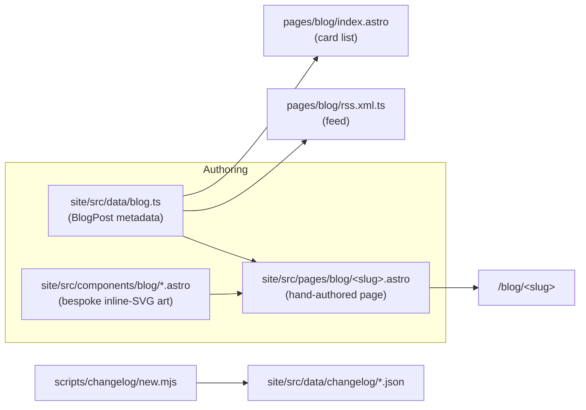
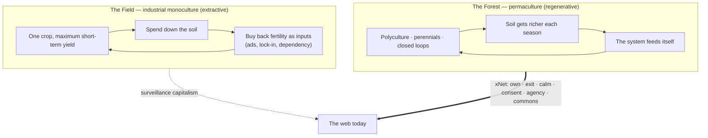

# Permaculture for the Open Web — Regenerating the Digital Commons

> Exploration for blog post **#6** in the xNet essay series. The earlier nature
> pieces looked at a single living system — the soil beneath the forest
> ([`0240`](./0240_[x]_DATA_SHOULD_WORK_LIKE_SOIL_THE_MYCELIAL_NETWORK_AND_THE_NERVOUS_SYSTEM_OF_XNET.md)),
> a desert feeding one across an ocean
> ([`0244`](./0244_[x]_THE_DESERT_THAT_FEEDS_THE_FOREST_DUST_BEES_AND_THE_INVISIBLE_SUBSTRATE.md)).
> This one is about the **discipline** — the design system humans use to *grow*
> living systems on purpose. Per the brief, it leans less on the series' running
> recap and stands more on its own; the nods to prior posts are glancing, not
> structural.

## Problem Statement

Write an essay that takes **permaculture** — the design discipline for
regenerative agriculture — seriously as a *framework*, walks its actual ethics
and principles in real depth, and shows how each one marries to xNet and the
xNet principles (the Humane Internet Charter). The throughline the user wants:
**the same principles that regenerate depleted land can regenerate the depleted
digital commons.** Big Tech is farming the web like industrial monoculture —
high yield now, exhausted soil later. xNet is the wager that you can build the
web the way a permaculturist builds land: as a polyculture that gets *richer*
the longer it runs.

The trap to avoid: a listicle ("12 principles, 12 features!") or metaphor that
flatters itself. Permaculture is a genuinely rigorous design language *and* a
contested one, and the analogy to software strains in specific, nameable places.
The essay has to earn the mapping, ground it in real code, and be honest about
where it breaks — which is exactly the Charter's own ethic ("a commitment with
no receipt is just marketing").

## Executive Summary

**Recommendation: write it, as essay #6, titled _"The Forest and the Field."_**
This is the strongest possible capstone to the nature thread because permaculture
is not another metaphor *for* the web — it is a **design methodology** that the
project already, unwittingly, follows. The mapping is unusually tight: the
Charter's six commitments and permaculture's three ethics / twelve principles are
the same ideas in two vocabularies.

- **The reframe.** Permaculture's whole move is *regenerative* over *extractive*.
  Industrial agriculture maximizes a single crop's short-term yield by spending
  down the soil, then buying back fertility as inputs (fertilizer, pesticide,
  irrigation) — a treadmill of dependency. Permaculture designs a system that
  **leaves the land richer than it found it**: polyculture, perennials, closed
  loops, no waste. Surveillance capitalism is monoculture agriculture for human
  attention and data; xNet is the food forest.
- **The discipline is real.** David Holmgren and Bill Mollison's framework is
  **3 ethics** (Earth Care, People Care, Fair Share / return of surplus) and
  **12 design principles** ("observe and interact," "catch and store energy,"
  "produce no waste," "use small and slow solutions," "use and value diversity,"
  "use edges and value the marginal," and so on). Each has a crisp, non-mystical
  meaning — and a startlingly direct xNet receipt.
- **It is non-fiction about xNet.** Every "we should build like a forest" claim
  has a file behind it. The local store as the master copy *is* "catch and store
  energy." No behavioral surplus *is* "produce no waste." Portable identity + the
  open change log *is* "use renewable resources." The humane-patterns CI gate
  *is* "apply self-regulation and accept feedback." See
  [`docs/CHARTER.md`](../CHARTER.md) and the table in **Key Findings**.
- **The commons turn.** The essay can close the loop the prior posts opened: the
  "tragedy of the commons" (Hardin) is not destiny. Elinor Ostrom won a Nobel
  showing communities govern shared resources without enclosure; Carol Rose named
  the "comedy of the commons" — resources that get *more* valuable the more they
  are shared (languages, roads, protocols). The open web is a comedy commons that
  Big Tech is trying to enclose. xNet's federation, fork-ability, and governance
  are commons-governance, not charity.
- **Honest about the strain.** Code isn't scarce the way soil is; software
  "ecosystems" don't self-heal (left-pad, XZ Utils, Log4Shell); ecological
  language can launder power ("Google is just a climax species" excuses
  regulatory capture); permaculture's own evidence base is thinner than its
  confidence. The self-audit panel says all of this out loud.

It slots into the existing blog machinery with **zero new infrastructure** —
one data entry, one art-directed `.astro` page, and three inline-SVG components
(hero, the signature "principle wheel" diagram, the honesty panel). It reuses
the `'nature'` tag and follows the inline-SVG / Self-Audit convention.

## Current State In The Repository

The blog is a small, well-grooved system: a new post is **one metadata entry +
one page + a few bespoke SVG components**, and the index and feed update
themselves.



What exists today (verified):

- **Metadata, single-sourced** — [`site/src/data/blog.ts`](../../site/src/data/blog.ts).
  `BlogPost` type, the `posts[]` array (currently **5**), `publishedPosts()`,
  `postBySlug()`, `formatPostDate()`. `BlogTag` is a closed union — `'essay' |
  'philosophy' | 'privacy' | 'decentralization' | 'protocol' | 'nature' |
  'cosmos' | 'economics'`. This post reuses `['essay', 'philosophy', 'nature']`
  (same as the soil and desert pieces) — **no new tag required**, which avoids
  touching the index/RSS tag styling.
- **The pages** — [`site/src/pages/blog/`](../../site/src/pages/blog/):
  `index.astro`, `rss.xml.ts`, and one `.astro` per post. The canonical shape is
  `postBySlug(slug)!` → a bespoke hero → an `<article class="prose …">` body. See
  [`the-desert-that-feeds-the-forest.astro`](../../site/src/pages/blog/the-desert-that-feeds-the-forest.astro).
- **Bespoke art, all inline SVG** —
  [`site/src/components/blog/`](../../site/src/components/blog/): each post ships a
  `*Hero` (`MycelialHero`, `StarHero`, `DustHero`, `LeverHero`), usually one
  signature diagram (`HydrostaticBalance`, `ThreeNervousSystems`, `DustBridge`,
  `GrowthVsLeverage`), and an `Honest*` self-audit panel (`HonestMycelium`,
  `HonestDesert`, `HonestExit`). **Critical convention: no third-party assets —
  every illustration is inline SVG so the page ships nothing external**, and the
  cosmic-X logo recurs as the bright node in every hero.
- **The honesty beat.** [`HonestDesert.astro`](../../site/src/components/blog/HonestDesert.astro)
  is the template: a two-column "what it isn't / what it is" table that states
  plainly what's real and what's tidied for the headline. Every post has one.
- **The recurring opener — and the instruction to soften it.** Each prior post
  opens by recapping the series ("The first time, we looked up… The second time,
  we looked down…"). By #5 ([`the-right-to-say-no`](../../site/src/pages/blog/the-right-to-say-no.astro))
  this recap had grown to three sentences. The brief explicitly asks this post to
  **stand more on its own and reference the others subtly** — so the opener
  should drop the heavy enumerated recap in favor of a single glancing line.

The thesis is **already the project's stated position**, so the post is
non-fiction, not aspiration. The receipts live in:

- [`docs/CHARTER.md`](../CHARTER.md) — *"Software that serves instead of
  extracts."* Six commitments, each with a code/CI receipt: **Own**, **Exit**,
  **Calm**, **Consent**, **Agency**, **Commons**. These are the "xNet principles"
  the brief refers to, and they map almost one-to-one onto permaculture's ethics
  and principles (see the table below).
- [`docs/VISION.md`](../VISION.md) — the extraction / monoculture framing.
- [`docs/GOVERNANCE.md`](../../GOVERNANCE.md), [`docs/TRADEMARK.md`](../../TRADEMARK.md)
  — commons governance: the code is free to fork; the name only protects users
  from confusion, never from leaving.
- [`0200` Portable Protocol Spec](./0200_[x]_PORTABLE_XNET_PROTOCOL_BOUNDARIES_AND_STANDARD.md) — the
  signed, hash-chained, LWW change log: a shared, copyable substrate no platform
  owns (the literal seed stock).

## External Research

### The framework (canonical, verified)

**Three ethics** (Holmgren, *Permaculture: Principles & Pathways Beyond
Sustainability*, 2002): **Earth Care**, **People Care**, and a third that
Holmgren frames as **Fair Share / Return of Surplus** (Mollison's older wording
was "setting limits to population and consumption" — worth naming the difference,
since one is self-restraint and the other is active reinvestment).

**Twelve design principles** (Holmgren 2002), each with its proverb:

| # | Principle | Proverb | Meaning (one line) |
| --- | --- | --- | --- |
| 1 | Observe and interact | "Beauty is in the eye of the beholder" | Understand a system before acting on it |
| 2 | Catch and store energy | "Make hay while the sun shines" | Capture abundance now for use in scarcity |
| 3 | Obtain a yield | "You can't work on an empty stomach" | A design must actually feed its keepers, or it won't be kept |
| 4 | Apply self-regulation and accept feedback | "The sins of the fathers…" | Build self-correcting systems; heed what the system tells you |
| 5 | Use and value renewable resources and services | "Let nature take its course" | Prefer what replenishes itself over what depletes |
| 6 | Produce no waste | "Waste not, want not" | Waste is an unused resource; close the loop |
| 7 | Design from patterns to details | "Can't see the forest for the trees" | Get the big pattern right first; details follow |
| 8 | Integrate rather than segregate | "Many hands make light work" | Relationships between elements do the work |
| 9 | Use small and slow solutions | "Slow and steady wins the race" | Human-scale, maintainable, durable over dramatic |
| 10 | Use and value diversity | "Don't put all your eggs in one basket" | Diversity is resilience |
| 11 | Use edges and value the marginal | "Don't go with the well-beaten path" | The boundary (ecotone) is the most productive zone |
| 12 | Creatively use and respond to change | "Vision is seeing things as they will be" | Design for change; turn disruption into opportunity |

Supporting concepts with strong software analogues: **zones & sectors** (place by
frequency of use / by incoming energies), **guilds** (mutually supporting
assemblies; the "Three Sisters"), **stacking functions** (each element does many
jobs; each job is backed by many elements — redundancy), the **edge effect**
(ecotones are the richest zones), **succession** (annual pioneers → perennial
food forest), **closing the loop** (compost/mulch), and Mollison's koans **"the
problem is the solution"** ("you don't have a snail problem, you have a duck
deficiency") and **"the yield is theoretically unlimited"** (yield includes
relationships, knowledge, soil built — not just crop).

### Prior art — permaculture meets computing

The essay is working at a real frontier: there is **no single canonical
"digital permaculture" text**, but several adjacent movements are worth a subtle
nod and a citation:

- **Permacomputing** — the most rigorous existing application. Viznut
  (Ville-Matias Heikkilä), *Permacomputing* (2020), and the
  [permacomputing.net](https://permacomputing.net) wiki apply permaculture
  principles directly to computing: minimize resource use, favor longevity and
  repairability, "small and slow," produce no waste. The **Hundred Rabbits**
  collective (Devine Lu Linvega, [100r.co](https://100r.co)) live it — building
  durable tools that run on minimal hardware off a sailboat.
- **Digital gardens** — Maggie Appleton's "A Brief History & Ethos of the
  Digital Garden" and Tom Critchlow's "Of Digital Streams, Campfires and
  Gardens" popularized the *tending/growing* metaphor for personal knowledge
  sites (vs. the chronological performance of a "stream").
- **Low-tech / solar web** — Kris De Decker's [Low-Tech Magazine](https://solar.lowtechmagazine.com)
  runs on a solar server that goes offline when the sun doesn't shine ("catch and
  store energy," literally); Tega Brain et al.'s **Solar Protocol** routes traffic
  to whichever server is currently in sunlight.
- **Small Tech / Small Web** — Aral Balkan's Small Technology Foundation frames
  personal, peer-to-peer, non-extractive tools against Big Tech monoculture — the
  polyculture/monoculture distinction in different words.

### The commons (the closing frame)

- **Garrett Hardin**, *The Tragedy of the Commons* (Science, 1968): unmanaged
  open-access resources get over-exploited. Often quoted as if it were a law.
- **Elinor Ostrom**, *Governing the Commons* (1990; Nobel 2009): empirically, it
  isn't a law. Communities routinely self-govern shared resources via **8 design
  principles** (clear boundaries, locally-tuned rules, collective choice,
  monitoring, graduated sanctions, cheap conflict resolution, recognized right to
  organize, nested governance). Hardin's tragedy is the *un-governed* special
  case.
- **Carol Rose**, *The Comedy of the Commons* (Univ. Chicago Law Review, 1986):
  some resources — public squares, languages, networks, **protocols** — *increase*
  in value with use. For these, enclosure is the loss, not the cure.
- **Nadia Eghbal (Asparouhova)**, *Roads and Bridges* (2016) / *Working in
  Public* (2020): open-source maintainers are critical, mostly-invisible
  infrastructure; the commons is real but its upkeep (maintainer attention) is
  finite and depletable. (A subtle bridge to the desert essay's "keystone, but
  invisible.")

### Critiques — so we don't oversell

Permaculture has real critics: its productivity claims are **thin on
peer-reviewed evidence**, it is **definitionally vague** (methodology? technique?
movement? brand?), it carries some **guru culture** and a commercialized 72-hour
certificate, and its **scalability** to feed billions is contested (Toby
Hemenway, an insider, worried it had drifted to affluent homesteading). The
essay should borrow permaculture's *design intuitions* without claiming it as
settled science.

## Key Findings

1. **Permaculture is a methodology, not a metaphor — and that's the unlock.**
   The prior nature posts borrowed an *image* (soil, dust). This one borrows a
   *design language* that already describes how xNet is built. That makes the
   essay assertive non-fiction rather than poetry: the principles are a checklist
   the project happens to pass.
2. **The Charter and the principles are isomorphic.** Six commitments,
   three ethics, twelve principles — the same ideas. The mapping below is tight
   enough that the risk is the reader thinking it's *too* neat, not that it's
   forced. (Mitigation: the honesty panel + naming where it strains.)
3. **The extractive/regenerative axis is the spine.** Monoculture vs. food
   forest is the cleanest one-sentence statement of the whole xNet thesis the
   series has produced: *don't farm the web to exhaustion and buy back fertility
   as ads — grow a web that feeds itself.*
4. **The commons close completes the arc.** Hardin → Ostrom → Rose lets the post
   end on something concrete and hopeful (governance, not just critique), and it's
   genuinely backed by [`GOVERNANCE.md`](../../GOVERNANCE.md) /
   [`TRADEMARK.md`](../../TRADEMARK.md) and federation.
5. **Zero new infrastructure.** Reuses `'nature'`, the page + data + RSS pattern,
   and the inline-SVG / Self-Audit convention. New code = one page + three SVG
   components.

### The mapping (the heart of the essay)

The three ethics → the Charter's posture:

| Permaculture ethic | xNet expression | Receipt |
| --- | --- | --- |
| **Earth Care** | Don't run the machinery of extraction; local-first means less data-center gravity, no engagement furnace burning attention as fuel | Charter §3 Calm; humane-patterns gate bans dark patterns ([`scripts/check-humane-patterns.mjs`](../../scripts/check-humane-patterns.mjs)) |
| **People Care** | Compete for wellbeing, not time; AI scaffolds instead of deskilling | Charter §3 Calm, §5 Agency; the Humane Charter itself |
| **Fair Share / return of surplus** | Give back to the commons; keep *your* surplus (no behavioral surplus harvested from you); MIT core + open funding | Charter §1 Own, §6 Commons; [`GOVERNANCE.md`](../../GOVERNANCE.md) |

The twelve principles → xNet receipts:

| # | Principle | xNet receipt (file / charter §) |
| --- | --- | --- |
| 1 | Observe and interact | Consent **off by default**; observe before you extract — telemetry sends nothing until you choose ([`packages/telemetry/src/consent/manager.ts`](../../packages/telemetry/src/consent/manager.ts), §4) |
| 2 | Catch and store energy | Your data lives on **your** device first; the local store is the master copy, offline-capable ([`packages/data/src/store/store.ts`](../../packages/data/src/store/store.ts), [`packages/runtime/src/sync/offline-queue.ts`](../../packages/runtime/src/sync/offline-queue.ts), §1) |
| 3 | Obtain a yield | It's working software you can use today, not a manifesto — and you obtain the yield of your **own** audience/space, not a rented one (§6 Commons) |
| 4 | Apply self-regulation and accept feedback | Rule-based notifications with a hard cap; CI gates that fail the build when a dark pattern or manipulative animation creeps in ([`scripts/check-humane-patterns.mjs`](../../scripts/check-humane-patterns.mjs), [`scripts/check-motion-vocab.mjs`](../../scripts/check-motion-vocab.mjs), [`packages/comms/src/notify/rules.ts`](../../packages/comms/src/notify/rules.ts), §3) |
| 5 | Use and value renewable resources | Open, copyable standards instead of proprietary lock-in: portable `did:key` + an open, signed, hash-chained change log ([`packages/identity/src/keys.ts`](../../packages/identity/src/keys.ts), [`packages/sync/src/change.ts`](../../packages/sync/src/change.ts), [`0200`](./0200_[x]_PORTABLE_XNET_PROTOCOL_BOUNDARIES_AND_STANDARD.md), §2) |
| 6 | Produce no waste | **No behavioral surplus** — the exhaust surveillance capitalism harvests, xNet never makes; and export means nothing is stranded when you leave ([`scripts/check-humane-patterns.mjs`](../../scripts/check-humane-patterns.mjs) `surplus` rules, [`packages/data/src/database/export/json-export.ts`](../../packages/data/src/database/export/json-export.ts), §1/§4) |
| 7 | Design from patterns to details | Kernel-first: the change log is the pattern, apps are the details; "everything is a plugin" ([`packages/sync/src/change.ts`](../../packages/sync/src/change.ts), [`0200`](./0200_[x]_PORTABLE_XNET_PROTOCOL_BOUNDARIES_AND_STANDARD.md)) |
| 8 | Integrate rather than segregate | Federation + BYO hub + connectors instead of a walled silo ([`packages/hub/src/cli.ts`](../../packages/hub/src/cli.ts), §6) |
| 9 | Use small and slow solutions | Local-first, human-scale hubs, a calm motion vocabulary — the small web, not hyperscale ([`packages/hub/src/cli.ts`](../../packages/hub/src/cli.ts), [`docs/MOTION.md`](../MOTION.md)) |
| 10 | Use and value diversity | Polyculture: multi-framework support (Tier 0/1/2, [`0237`](./0237_[x]_VUE_SVELTE_AND_OTHER_FRAMEWORKS_WHAT_SUPPORT_ACTUALLY_COSTS.md)) and multi-language SDKs (Swift/Rust/Python) — and the freedom to fork ([`TRADEMARK.md`](../../TRADEMARK.md)) |
| 11 | Use edges and value the marginal | Edge-first — the user's device *is* the edge, where the data lives and the compute runs; value the people a platform won't serve and the maintainers nobody thanks |
| 12 | Creatively use and respond to change | The Right to Leave: portable identity lets you respond when a platform turns extractive — migrate instead of being captured ([`packages/identity/src/keys.ts`](../../packages/identity/src/keys.ts), §2 Exit) |



## Options And Tradeoffs

### Framing options (which spine carries it)

| Option | Spine | Pros | Cons |
| --- | --- | --- | --- |
| **A. The Field vs. the Forest** (recommended) | Monoculture (extractive Big Tech) vs. food forest (regenerative xNet); walk the ethics + principles as the design language of the forest | Cleanest statement of the whole thesis; lets the 12 principles structure the middle; "regenerate, don't extract" is the user's exact ask | Must avoid the listicle feel — group the principles, don't march them |
| **B. Permaculture 101 → xNet** | Teach the framework first, then apply | Honors "go in depth into the principles"; educational | Risks front-loading a textbook before the payoff |
| **C. The commons** | Hardin → Ostrom → Rose; enclosure vs. governance | Strong, concrete ending | Narrower; better as the *close* than the spine |
| **D. Permacomputing lineage** | Situate xNet in the permacomputing/small-web movement | Honest about prior art | Too inside-baseball for a general essay; better as a subtle nod |

**Recommendation: A, with B folded in and C as the close.** Open on the field
vs. the forest, teach the ethics + a curated walk of the principles *as you map
them* (so the teaching and the payoff arrive together), and land on the commons
(governance, not just critique).

### Structuring the "12 principles" middle (the depth the brief wants)

Marching all twelve in order is a slog. Group them into **four movements**, each
a short section that teaches 2–4 principles and cashes them out in xNet at once:

1. **Store what you grow** — *Catch and store energy · Produce no waste · Use
   renewable resources.* (Own; no behavioral surplus; open standards.)
2. **Let it regulate itself** — *Observe and interact · Apply self-regulation and
   accept feedback · Small and slow.* (Consent off by default; the CI gates;
   calm.)
3. **Plant a polyculture** — *Use and value diversity · Integrate rather than
   segregate · Design from patterns to details.* (Multi-framework/language;
   federation; kernel-first.)
4. **Tend the edges, design for change** — *Use edges and value the marginal ·
   Creatively use and respond to change · Obtain a yield.* (Edge-first; the Right
   to Leave; usable today.)

This covers all twelve, in depth, without a numbered checklist, and the four
movements give the prose a rhythm.

### Title options

| Title | Read |
| --- | --- |
| **The Forest and the Field** (recommended) | Series-consistent evocative noun phrase; names the monoculture↔polyculture contrast that *is* the thesis |
| A Permaculture for the Open Web | Most descriptive; names the framework outright; a touch academic |
| Leave It Richer Than You Found It | Foregrounds the regenerative ethic; warm; less concrete |
| Grow a Web That Feeds Itself | Active, inviting; slightly slogan-y |
| Design Like a Forest | Short, punchy; a bit generic |

### Tag options

- **Reuse `['essay', 'philosophy', 'nature']`** (recommended — identical to the
  soil and desert posts; no `BlogTag` union change, no styling work).
- A new `'commons'` tag is thematically apt but touches the union + tag rendering
  for a single post — not worth it.

### Art options (inline SVG, Self-Audit parity)

- **`ForestHero`** (recommended) — a single wide composition split left/right: a
  flat, tilled **monocrop row** (one species, bare soil, a tractor's straight
  line) on the left; a layered **food forest** (canopy → understory → shrub →
  herb → root, many species) on the right; the **cosmic-X glows as the sun**
  feeding the forest (the recurring "X as the brightest node" motif). Mirror
  `DustHero`'s prop contract.
- **`PrincipleWheel`** (recommended signature diagram) — the series' "one
  diagram" slot. Holmgren's principles are traditionally drawn as a 12-petal
  flower/mandala; render a 12-segment wheel, each segment a principle, each
  annotated with its xNet receipt. The cosmic-X at the hub. This is the visual
  that makes the mapping legible at a glance.
- **`HonestGarden`** (recommended self-audit) — the `Honest*` slot, modeled on
  `HonestDesert`: code isn't scarce like soil (so "yield"/"waste" are
  redefinitions, said plainly); software ecosystems don't self-heal (left-pad, XZ,
  Log4Shell — they need active maintenance); ecological metaphors can naturalize
  power; permaculture's own evidence base is contested.

## Recommendation

Write **essay #6: _"The Forest and the Field."_** Structure A (field vs. forest),
the twelve principles grouped into four movements, the commons as the close,
~13–15 minute read, tags `['essay', 'philosophy', 'nature']`, slug
`the-forest-and-the-field`.

Narrative arc:

1. **Cold open — the field.** A monocrop field looks like the picture of
   productivity: endless, uniform, efficient. It is also a slow-motion
   liability — bare soil between rows, fertility trucked in by the ton, one pest
   away from collapse, the land a little poorer every year. That field is the
   business model of the modern web. (One glancing line acknowledges the series'
   earlier ground — we've been down in this soil before — then moves on.)
2. **The other way to farm.** Permaculture, briefly and seriously: three ethics,
   twelve principles, one idea — *regenerate, don't extract.* Leave the land
   richer than you found it. The key distinction: **sustainable** = do less harm;
   **regenerative** = actively heal.
3. **Four movements** (the depth): store what you grow → let it regulate itself →
   plant a polyculture → tend the edges and design for change. Each teaches its
   principles and cashes them out in xNet with receipts (the Charter §§ and real
   file paths), without a numbered checklist.
4. **The commons isn't doomed.** Hardin said shared things get destroyed; Ostrom
   showed communities govern them well; Rose showed some things (languages,
   protocols) get *richer* the more they're shared. The open web is a comedy
   commons being enclosed. xNet's federation, governance, and fork-ability are how
   you keep a commons a commons.
5. **Honest garden.** Where the metaphor strains (the self-audit panel).
6. **Close — plant the forest.** You don't reform a monoculture by arguing with
   it across the fence. You plant a forest next to it, and you wait, and the
   forest wins on time because it's the only one of the two that builds soil.
   Build the web that feeds itself. Leave it richer than you found it.

Concrete next step after approval: implement the page, metadata, and three SVG
components; regenerate a changelog fragment; verify the index card, the post
route, and the RSS feed.

## Example Code

### 1) Metadata entry — prepend to `posts[]` in `site/src/data/blog.ts`

```ts
{
  slug: 'the-forest-and-the-field',
  title: 'The Forest and the Field',
  description:
    'Industrial agriculture farms the soil to exhaustion and buys back ' +
    'fertility as inputs. Surveillance capitalism does the same to the web. ' +
    'Permaculture is the discipline for growing land that feeds itself — and ' +
    'its principles are, almost line for line, how you regenerate a digital ' +
    'commons instead of strip-mining one.',
  pubDate: '2026-06-30T15:00:00Z', // set to the actual publish instant at ship time
  author: 'xNet',
  tags: ['essay', 'philosophy', 'nature'],
  readingMinutes: 14
},
```

> The `posts` array renders newest-first by `pubDate`; the index card and the RSS
> feed pick this up automatically. No edits to `index.astro` or `rss.xml.ts`.

### 2) Page skeleton — `site/src/pages/blog/the-forest-and-the-field.astro`

```astro
---
import Base from '../../layouts/Base.astro'
import Nav from '../../components/sections/Nav.astro'
import Footer from '../../components/sections/Footer.astro'
import ForestHero from '../../components/blog/ForestHero.astro'
import PrincipleWheel from '../../components/blog/PrincipleWheel.astro'
import HonestGarden from '../../components/blog/HonestGarden.astro'
import { postBySlug, formatPostDate } from '../../data/blog'

const post = postBySlug('the-forest-and-the-field')!
---

<Base title={`${post.title} — xNet`} description={post.description}>
  <Nav />
  <main>
    <ForestHero
      title={post.title}
      deck={post.description}
      date={formatPostDate(post.pubDate)}
      readingMinutes={post.readingMinutes}
      tags={post.tags}
    />
    <article
      class="prose prose-lg mx-auto max-w-3xl px-6 py-16 dark:prose-invert prose-headings:tracking-tight prose-a:text-emerald-600 dark:prose-a:text-emerald-400"
    >
      <!-- §1 the field (monoculture = surveillance capitalism) … -->
      <!-- §2 the other way to farm (3 ethics, 12 principles, regenerate) … -->
      <!-- §3 four movements; receipts woven in --> <PrincipleWheel />
      <!-- §4 the commons isn't doomed (Hardin → Ostrom → Rose) … -->
      <HonestGarden />
      <!-- §5 close: plant the forest … -->
    </article>
    <Footer />
  </main>
</Base>
```

### 3) Hero component contract — `site/src/components/blog/ForestHero.astro`

Mirror `DustHero.astro`'s prop contract exactly so the page wiring is identical;
only the artwork changes.

```astro
---
// Original art for blog post #6 (exploration 0246). A wide split composition:
// a flat tilled monocrop row at left (one species, bare soil, a straight line),
// a layered food forest at right (canopy → understory → shrub → herb → root,
// many species). The cosmic-X glows as the sun feeding the forest — the
// recurring "X as the brightest node" motif. All inline SVG; ships nothing
// third-party (Self-Audit parity).
interface Props {
  title: string
  deck: string
  date: string
  readingMinutes: number
  tags: string[]
}
const { title, deck, date, readingMinutes, tags } = Astro.props
// …hand-placed monocrop rows, layered canopy blobs, sun-as-cosmic-X…
---
```

### 4) Signature diagram contract — `site/src/components/blog/PrincipleWheel.astro`

```astro
---
// The series' "one diagram" slot (cf. HydrostaticBalance, DustBridge). Holmgren's
// 12 permaculture principles are traditionally drawn as a 12-petal flower; here a
// 12-segment wheel, each segment a principle annotated with its xNet receipt
// (Charter § + the move it maps to). Cosmic-X at the hub. Inline SVG only.
const principles = [
  { n: 1, name: 'Observe & interact', xnet: 'Consent off by default (§4)' },
  { n: 2, name: 'Catch & store energy', xnet: 'Your device holds the master copy (§1)' },
  { n: 3, name: 'Obtain a yield', xnet: 'Working software; own your audience (§6)' },
  // … principles 4–12, each with its receipt …
]
---
```

## Risks And Open Questions

- **The listicle trap.** Twelve principles invite a march. **Mitigation:** the
  four-movements grouping; teach-and-cash-out together; the wheel carries the
  one-to-one mapping so the prose doesn't have to enumerate.
- **Too-neat mapping.** A reader may distrust how cleanly the Charter lines up
  with the principles. **Mitigation:** name it in the prose ("this is suspiciously
  tidy; here's where it isn't"), and let `HonestGarden` carry the strain.
- **The analogy genuinely strains** (from the research): (a) code isn't scarce
  like soil, so "yield" and "waste" are *redefinitions*, not equivalences; (b)
  software ecosystems don't biologically self-heal — left-pad, XZ Utils, and
  Log4Shell prove they need active maintenance; (c) ecological language can
  *naturalize power* (calling a monopoly a "climax species" launders capture as
  succession); (d) permaculture's own evidence base is contested. **Mitigation:**
  put all four in the self-audit, plainly.
- **Don't oversell permaculture as science.** Borrow the design intuitions, not
  the productivity claims. **Mitigation:** the critique paragraph in External
  Research feeds the honesty panel.
- **Metaphor fatigue.** This is the third nature essay (soil, desert, now the
  forest). **Mitigation:** the brief's own instruction — soften the recurring
  recap, let it stand alone; and the *discipline* angle (a how-to, not an image)
  is a genuinely different texture.
- **Subtlety of references (the explicit ask).** Earlier posts open with a
  three-sentence series recap. **Mitigation:** one glancing line at most ("we've
  spent time in this soil before"); link the prior posts in a quiet "Sources /
  further reading" coda rather than in the body.
- **Open question — cadence.** #4 and #5 published within a day. Space #6 at least
  a day or two so it isn't buried; set `pubDate` accordingly.
- **Open question — link out or stay self-contained?** This post leans on named
  thinkers (Holmgren, Ostrom, Rose, Eghbal, the permacomputing crowd). Recommend
  a short sober "Sources" coda (so credit is given) while keeping the body
  link-light to preserve flow — matching prior posts.

## Implementation Checklist

- [ ] Add the `BlogPost` entry to [`site/src/data/blog.ts`](../../site/src/data/blog.ts)
      (slug `the-forest-and-the-field`, tags `['essay','philosophy','nature']`).
- [ ] Create `site/src/components/blog/ForestHero.astro` (inline SVG; monocrop
      row vs. layered food forest; cosmic-X as the sun; mirror `DustHero`'s prop
      contract).
- [ ] Create `site/src/components/blog/PrincipleWheel.astro` (the signature
      diagram: 12-segment wheel, each principle annotated with its xNet receipt).
- [ ] Create `site/src/components/blog/HonestGarden.astro` (self-audit: code isn't
      scarce; ecosystems don't self-heal — left-pad/XZ/Log4Shell; metaphors
      naturalize power; permaculture's evidence base is contested).
- [ ] Write `site/src/pages/blog/the-forest-and-the-field.astro` following
      Structure A, with the four-movements middle and Charter receipts (real file
      paths + §§).
- [ ] **Soften the opener** — one glancing nod to the series, not the enumerated
      recap; keep the post standing on its own (per the brief).
- [ ] Keep all art **inline SVG** — no third-party assets (Self-Audit parity);
      cosmic-X recurs as the bright node.
- [ ] Add a short "Sources" coda (Holmgren 2002; Ostrom 1990; Rose 1986; Eghbal;
      permacomputing.net / Hundred Rabbits) since the post credits named thinkers.
- [ ] Generate a changelog fragment via
      `node scripts/changelog/new.mjs --title "New essay: The Forest and the Field" --tags site`
      (do **not** hand-author the JSON).
- [ ] `site/` is outside the root eslint/prettier config — format within the site
      workspace if needed.
- [ ] No `docs/sidebar.mjs` / `build:llms` changes — the blog is not in the docs
      sidebar.
- [ ] **No changeset required** — `site/` is not a publishable `packages/*`
      library (per `CLAUDE.md`).

## Validation Checklist

- [ ] Site dev server: `/blog/the-forest-and-the-field` renders; hero,
      `PrincipleWheel`, and `HonestGarden` display correctly in light and dark
      mode.
- [ ] `/blog` index lists the new card newest-first with the right date, reading
      time, and tags.
- [ ] `/blog/rss.xml` includes the new post (title, description, link, pubDate)
      and validates as well-formed RSS.
- [ ] Build passes: `pnpm --filter site build` with no broken imports or type
      errors (`postBySlug('the-forest-and-the-field')` resolves).
- [ ] No external network assets requested by the page (DevTools Network clean —
      Self-Audit parity holds).
- [ ] Social/OG: `Base` title/description populate; text OG is fine (matching the
      prior posts; no hero image required).
- [ ] Every code/charter receipt cited in the body resolves to a real path/section
      (spot-check the file links in the mapping table).
- [ ] Prose check: the post never claims permaculture as settled science; the
      analogy's strains are disclosed in `HonestGarden`; the references to prior
      posts are subtle (no enumerated recap).
- [ ] Reading time in `blog.ts` matches the finished length (±1 min).
- [ ] Read-through proof: capture a screenshot of the hero + the principle wheel
      for the PR (per the repo's visual-capture convention).

## References

### xNet (in-repo)

- [`site/src/data/blog.ts`](../../site/src/data/blog.ts) — `BlogPost` type, `posts[]`, helpers, `BlogTag` union.
- [`site/src/pages/blog/the-desert-that-feeds-the-forest.astro`](../../site/src/pages/blog/the-desert-that-feeds-the-forest.astro) — canonical page shape.
- [`site/src/components/blog/DustHero.astro`](../../site/src/components/blog/DustHero.astro) / [`HonestDesert.astro`](../../site/src/components/blog/HonestDesert.astro) — hero prop contract + the honesty-panel pattern (inline-SVG / Self-Audit convention).
- [`docs/CHARTER.md`](../CHARTER.md) — the six commitments (Own / Exit / Calm / Consent / Agency / Commons) with code receipts; the "xNet principles."
- [`docs/VISION.md`](../VISION.md) — the extraction / monoculture framing.
- [`GOVERNANCE.md`](../../GOVERNANCE.md), [`TRADEMARK.md`](../../TRADEMARK.md) — commons governance + free-to-fork.
- [`0200` Portable Protocol Spec](./0200_[x]_PORTABLE_XNET_PROTOCOL_BOUNDARIES_AND_STANDARD.md) — the open, copyable substrate (the seed stock).
- Sibling nature essays: [`0240` Data Should Work Like Soil](./0240_[x]_DATA_SHOULD_WORK_LIKE_SOIL_THE_MYCELIAL_NETWORK_AND_THE_NERVOUS_SYSTEM_OF_XNET.md) · [`0244` The Desert That Feeds the Forest](./0244_[x]_THE_DESERT_THAT_FEEDS_THE_FOREST_DUST_BEES_AND_THE_INVISIBLE_SUBSTRATE.md).

### Permaculture (the framework)

- David Holmgren, *Permaculture: Principles & Pathways Beyond Sustainability* (Holmgren Design Services, 2002) — the 3 ethics and 12 principles. Principle list + proverbs: <https://permacultureprinciples.com/principles/>
- Bill Mollison, *Permaculture: A Designer's Manual* (Tagari, 1988) — "the problem is the solution"; the older third-ethic wording.

### Permaculture meets computing (prior art)

- Viznut (Ville-Matias Heikkilä), *Permacomputing* (2020): <http://viznut.fi/texts-en/permacomputing.html>; community wiki: <https://permacomputing.net>
- Hundred Rabbits (Devine Lu Linvega): <https://100r.co>
- Maggie Appleton, *A Brief History & Ethos of the Digital Garden*: <https://maggieappleton.com/garden-history>
- Low-Tech Magazine (solar-powered server), Kris De Decker: <https://solar.lowtechmagazine.com>
- Solar Protocol (Tega Brain et al.): <https://solarprotocol.net>
- Small Technology Foundation (Aral Balkan): <https://small-tech.org>

### The commons

- Garrett Hardin, *The Tragedy of the Commons*, Science 162 (1968).
- Elinor Ostrom, *Governing the Commons* (Cambridge University Press, 1990) — the 8 design principles for self-governed commons.
- Carol M. Rose, *The Comedy of the Commons*, Univ. Chicago Law Review 53(3): 711–781 (1986).
- Nadia Eghbal (Asparouhova), *Roads and Bridges* (Ford Foundation, 2016): <https://www.fordfoundation.org/media/2976/roads-and-bridges-the-unseen-labor-behind-our-digital-infrastructure.pdf>; *Working in Public* (Stripe Press, 2020).
