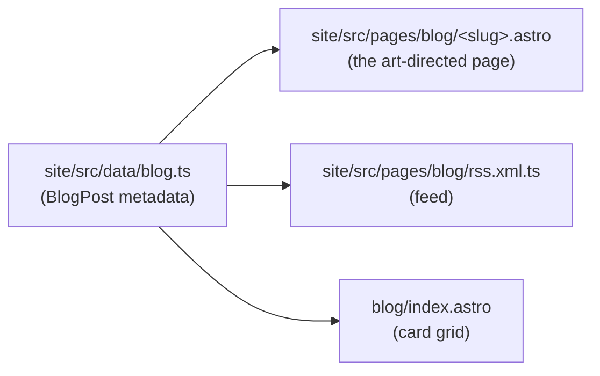
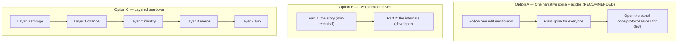
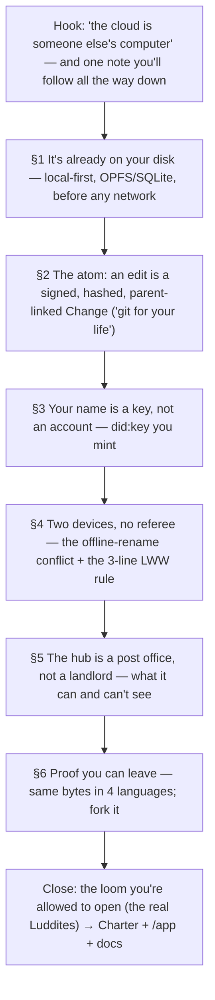
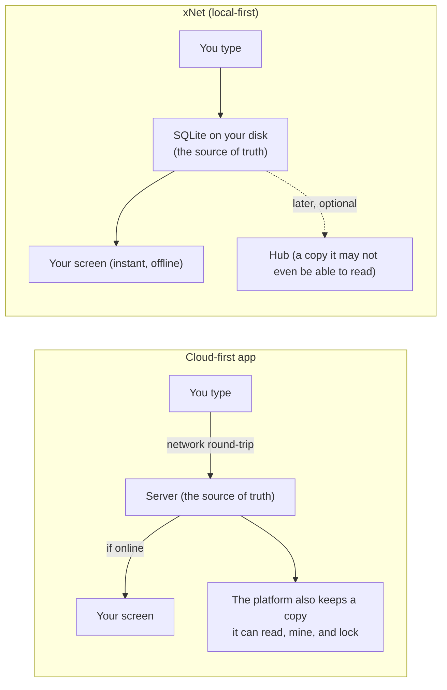
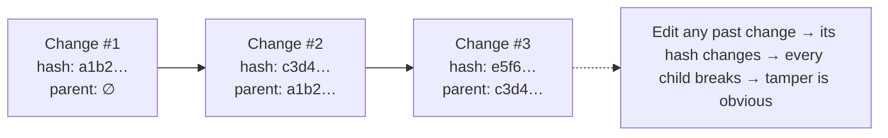
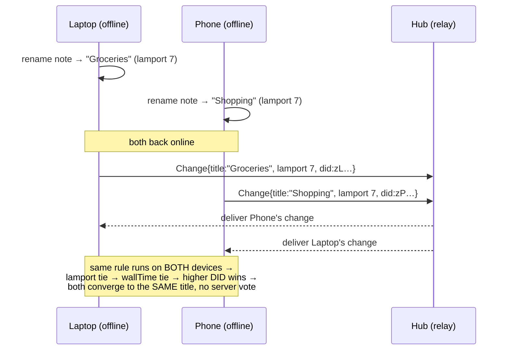

# A Deep-Dive Blog Post: How xNet Actually Works Under the Hood

> Working title: **"The Loom You're Allowed to Open"**
> (alternates: _"Follow One Keystroke Home"_, _"No Black Boxes"_, _"A Machine You Can Read"_)

## Problem Statement

The xNet blog has six published essays, and every one of them is an
_analogy_ — pirates, mycelium, a star's thermostat, Saharan dust, a
musician's "leveragism", a food forest (see `site/src/data/blog.ts`).
They are beautiful and they are doing the philosophical work: _why_ the
extractive web is bad and _why_ an owned, local-first web is worth
wanting. None of them ever shows you the machine.

That is a gap. A real, sceptical reader — especially a developer —
eventually asks the unglamorous question the essays keep deferring:
**"Okay, but how does it actually work?"** And the answer matters to
non-developers too, because "you own your data" is just a slogan until
someone shows you the part of the architecture where ownership is
literally true and the part where a platform would normally cheat.

So: what would a single blog post look like that **takes a reader all
the way through the internals of xNet** — the change log, the
signatures, the merge, the hub, the identity — while staying readable
for a normal person, rewarding a developer with real code, and tying
the whole machine back to the open-web / neo-Luddite project the rest
of the series is about?

This document designs that post: its spine, its audience strategy, the
exact internals it should cover (with verified file paths), the
diagrams and snippets it should carry, the comparison to the rest of
the decentralisation landscape, and — critically — the **rendering
work** needed, because the blog's current `.astro` pipeline does _not_
render mermaid or syntax-highlighted code the way the post needs.

## Executive Summary

- **Recommended shape: a "two-track" essay** with a single concrete
  spine — _follow one edit, one note, from a keystroke to a second
  device_ — narrated in plain language, with optional "Open the panel"
  asides carrying the code and the protocol detail. A normal user reads
  the spine and gets a true mental model; a developer reads the asides
  and gets the real types. Nobody is bored and nobody is lost.

- **The machine is genuinely good copy.** Each internal layer has a
  one-sentence human hook _and_ a real artifact behind it:
  - Local-first → your note is a row in a SQLite file **on your disk**,
    written before any network exists (`packages/sqlite`, OPFS).
  - The atom → an edit is a **signed, hashed, parent-linked `Change`**,
    i.e. "git for your life" (`packages/sync/src/change.ts`).
  - Identity → a `did:key` you **mint from a keypair**, not an account a
    server **issues** you (`packages/identity/src/did.ts`).
  - Agreement → two devices converge with **no server refereeing**, via a
    three-line last-write-wins rule (`packages/data/src/store/store.ts`).
  - The hub → a **dumb relay**, not a landlord; what it can and can't see
    (`packages/hub`, `packages/crypto/src/envelope.ts`).
  - Proof of exit → the same bytes verify in **four languages**; you can
    fork the whole thing (`conformance/`, `rust/xnet-core`, Swift/Python).

- **Rendering is the real implementation cost, not the prose.** Blog
  posts are hand-authored `.astro` pages; mermaid only renders today in
  the MDX **docs** (via `rehypeMermaidPre` in `site/astro.config.mjs` +
  client Mermaid.js). The post wants both diagrams _and_ code. The
  recommendation is a small, reusable trio of blog components —
  `<Mermaid>`, `<CodeFigure>`, and an "`<Aside>`/`<Peek>`" disclosure —
  rather than converting the blog to MDX (which would break the
  art-directed `.astro` grain the series is built on).

- **The post should not duplicate the docs — it should be the on-ramp
  to them.** `site/src/content/docs/docs/protocol/*` and
  `concepts/sync-architecture.mdx` already carry the rigorous version
  with their own mermaid. The blog post earns the reader's trust and
  then hands them off with "the full spec lives here" links.

- **Differentiator to make explicit:** xNet is _not_ another federation
  protocol fighting ActivityPub/AT-Proto/Nostr for the social graph.
  Its kernel is a **local-first, signed change log** — closer to
  "git + CRDT + did:key" than to "Mastodon but ours". That framing is
  the post's most defensible claim and its clearest tie to the Luddite
  thesis: _a machine the worker is allowed to open, understand, and
  keep._

## Current State In The Repository

### The blog pipeline (where the post will live)

The blog is deliberately **not** a markdown/MDX content collection. From
the source-of-truth comment in `site/src/data/blog.ts:1`:

> The site has no MDX/content-collection blog; marketing content is
> authored as `.astro` pages + data modules… each post is a
> hand-authored, art-directed `.astro` page under
> `site/src/pages/blog/<slug>.astro`.

So a post is three things kept in sync:



Each post imports bespoke components for its "diagrams" — they are
**hand-built HTML/SVG cards**, not mermaid. Examples in
`site/src/components/blog/`: `ThreeNervousSystems.astro`,
`HydrostaticBalance.astro`, `GrowthVsLeverage.astro`, `PrincipleWheel.astro`,
plus a per-post `Hero` and an `Honest*` self-critique card. The idiom is
a `not-prose` bordered "surface" card (see
`ThreeNervousSystems.astro:28`).

**Implication:** the visual language of the blog is bespoke, not
diagrams-as-code. We will deliberately introduce mermaid here (the user
asked for it, and it's the right tool for sequence/flow diagrams), but
we keep the bespoke-card idiom for the one or two comparisons where art
direction beats a generated graph (e.g. the "what the hub can see"
trust-boundary card).

### What the blog pipeline can and can't render today

| Capability               | Docs (MDX)                                                          | Blog (`.astro`)                                                     | Needed by this post   |
| ------------------------ | ------------------------------------------------------------------- | ------------------------------------------------------------------- | --------------------- |
| Mermaid diagrams         | ✅ `rehypeMermaidPre` + client Mermaid.js (`site/astro.config.mjs`) | ❌ not wired                                                        | ✅ several            |
| Syntax-highlighted code  | ✅ Starlight `expressiveCode` (one-light/one-dark-pro)              | ⚠️ only the `CodeTabs.astro` / `<Code>` primitive, not used in blog | ✅ 4–6 short snippets |
| Bespoke SVG/HTML figures | n/a                                                                 | ✅ established idiom                                                | ✅ 1–2                |

`site/astro.config.mjs` already contains the lightweight
`rehypeMermaidPre` plugin (it rewrites ` ```mermaid ` fences to
`<pre class="mermaid">` for a client renderer, _"Replaces rehype-mermaid
(which drags in playwright as a transitive dep)"_). That client renderer
is wired for the **docs** route, not the blog. Re-using the same
approach in a small `<Mermaid>` blog component is the cheap path.

### The internals the post will explain (all verified)

**1. The atom — a `Change`.** `packages/sync/src/change.ts:38`

```ts
export interface Change<T = unknown> {
  protocolVersion?: number // 3 = hybrid Ed25519 + ML-DSA (post-quantum)
  id: string // nanoid
  type: string // "node-change"
  payload: T // only the properties that changed (sparse)
  hash: ContentId // "cid:blake3:<hex>"
  parentHash: ContentId | null // the link in the chain
  authorDID: DID // did:key of whoever made it
  signature: Uint8Array // Ed25519 over the hash
  wallTime: number // display clock (not used for ordering)
  lamport: number // logical clock (used for ordering)
}
```

**2. Hash + sign.** `packages/sync/src/change.ts:195` and `:228`. The
hash is canonical-JSON (recursively sorted keys, no whitespace) →
**BLAKE3** → `cid:blake3:…` (`packages/crypto/src/hashing.ts:14`, default
algorithm `blake3`). The signature is **Ed25519 over the UTF-8 bytes of
the hash string** — deterministic (RFC 8032), so it's byte-identical
across implementations:

```ts
export function signChange<T>(unsigned, signingKey) {
  const hash = computeChangeHash(unsigned) // canonical JSON → BLAKE3
  const signature = sign(new TextEncoder().encode(hash), signingKey) // Ed25519
  return { ...unsigned, hash, signature }
}
```

**3. The merge — last-write-wins, no referee.**
`packages/data/src/store/store.ts:2472`. Conflict resolution is _per
property_ and is three deterministic lines:

```ts
private shouldReplace(existing, incoming): boolean {
  if (incoming.lamport !== existing.lamport) return incoming.lamport > existing.lamport
  if (incoming.wallTime !== existing.wallTime) return incoming.wallTime > existing.wallTime
  return incoming.author > existing.author   // DID tiebreak, code-unit order (deterministic)
}
```

The `> ` on the DID is a **code-unit string comparison, never
`localeCompare`** — that's what makes every device, in every language,
pick the same winner. (See the memory
`fractional-sortkey-collation-invariant` and the golden vector
`conformance/vectors/lww/0003-tie-author-breaks.json`.)

**4. Identity you mint.** `packages/identity/src/did.ts:14`. A user's id
_is_ their public key, base58-encoded with a 2-byte Ed25519 multicodec
prefix — no registrar, nothing to revoke:

```ts
const ED25519_PREFIX = new Uint8Array([0xed, 0x01])
export function createDID(publicKey: Uint8Array): DID {
  const prefixed = new Uint8Array([...ED25519_PREFIX, ...publicKey])
  return `did:key:${base58btc.encode(prefixed)}` as DID // did:key:z6Mk…
}
```

**5. Local storage first.** `packages/sqlite/src/adapters/opfs-capability.ts`
(`detectOpfsCapability`), `apps/web/src/App.tsx` boot sequence. Data is
written to a single `/xnet.db` SQLite file in the browser's **Origin
Private File System** _before_ any hub exists, and the first paint does
**not** wait on the hub (memory: `local-first-doc-load`,
exploration 0188 — `acquire()` is fire-and-forget).

**6. The hub is a relay.** `packages/hub` (Hono + WebSocket; one
multiplexed connection, room-per-document). It orders and forwards
signed changes and verifies signatures; it is trusted for
**availability**, not for **privacy**. `packages/crypto/src/envelope.ts`
provides per-recipient content-key wrapping (X25519 → XChaCha20-Poly1305)
for the encrypted path. The structural-rejection circuit breaker
(`INVALID_HASH`/`INVALID_SIGNATURE` flood guard) lives in
`packages/runtime/src/sync/node-store-sync-provider.ts:32` (memory:
`sync-hash-skew-guard`).

**7. Proof it's portable.** `conformance/vectors/{change,lww,identity,
replication,authz}` are normative golden vectors; reference kernels exist
in `conformance/reference/python`, `conformance/reference/swift`, and
`rust/xnet-core/src/lib.rs`. Same bytes, same hash, same signature, four
languages. This is the "you can actually leave / fork" claim made
concrete.

### Docs that already exist (hand off, don't duplicate)

- `site/src/content/docs/docs/protocol/overview.mdx`, `replication.mdx`,
  `authorization.mdx`
- `site/src/content/docs/docs/architecture/overview.mdx`,
  `package-graph.mdx`
- `site/src/content/docs/docs/concepts/sync-architecture.mdx` (four-layer
  diagram, peer scoring, batching), `concepts/network.mdx`
- `site/src/content/docs/docs/guides/{identity,sync,hub,versioning}.mdx`

The blog post is the _trailhead_; these are the _map_.

## External Research

### The local-first canon (the post's intellectual home)

The Ink & Switch essay _"Local-first software: you own your data, in
spite of the cloud"_ (Kleppmann et al., 2019) defines **seven ideals**:
_fast, multi-device, offline, collaboration, longevity, privacy, user
control_. xNet is an almost line-for-line implementation of that
manifesto, which the post should name explicitly — it gives the work a
lineage and a sceptical reader a citation. CRDTs (and the
Automerge/Yjs line of work) are the merge technology that makes ideals
3–4 possible without a central referee.

A useful honesty point for the post: xNet's **kernel** is _not_ a CRDT in
the Automerge sense — it's a **signed, hash-chained, last-write-wins
change log** (Yjs is layered on top, optionally, for rich-text
documents). That's a deliberate design choice — LWW is portable,
deterministic, and trivially auditable across languages, at the cost of
the fine-grained text-merge magic a sequence CRDT gives you. The post
can be straight about that trade.

### The decentralisation landscape (the "how others do it" comparison)

The user asked for comparison to "other systems out there". The cleanest
framing is that xNet is solving a **different problem** than the social
protocols, and the comparison table makes that legible:

| System                     | Where your **identity** lives                        | Where your **data** lives           | The kernel                              | Works fully **offline**? |
| -------------------------- | ---------------------------------------------------- | ----------------------------------- | --------------------------------------- | ------------------------ |
| Big-tech cloud             | An account the platform issues                       | The platform's servers              | Proprietary                             | No                       |
| **ActivityPub / Mastodon** | On your home **server** (move = new account, mostly) | On your home server                 | Message-passing between servers         | No                       |
| **AT Protocol / Bluesky**  | A portable DID, but resolution leans on infra        | Your PDS (a host you pick)          | Repos + relays + app-views              | No                       |
| **Nostr**                  | A raw keypair (very portable)                        | Whatever **relays** keep            | Signed events to relays                 | No (relay-dependent)     |
| **xNet**                   | A `did:key` you mint locally                         | **Your device first** (OPFS/SQLite) | Signed, hash-chained **LWW change log** | **Yes**                  |

Findings worth citing: ActivityPub/AT-Proto typically anchor identity to
a **server/host**, which is the thing that breaks when the host changes
policy or dies; Nostr separates identity into a raw keypair (closest to
xNet's `did:key`) but leans on relays for availability; AT-Proto has hit
real **scaling/availability** limits under load. xNet's distinguishing
move is putting the **master copy on the edge device** and treating the
hub as replaceable — the social-graph protocols are largely
server-to-server, online-first systems. (Sources below.)

### The Luddites (the thematic spine)

The popular meaning of "Luddite" — _anti-technology_ — is historically
wrong, and that wrongness is the post's best closing move. The Luddites
were skilled artisans who **welcomed tools that helped them** and broke
only the frames being used to _degrade their autonomy and wages_ (E.P.
Thompson's "moral economy"). They targeted specific owners, often with
warning. Their fight wasn't machine-vs-human; it was **who the machine
is for, and whether the worker is allowed to understand and own it.**

That is exactly xNet's thesis stated in iron: a black-box platform is the
power loom the worker isn't allowed to open; xNet is **a loom you can
open, read, repair, and keep.** The deep-dive _is_ the politics — being
able to show you the whole machine, line by line, is the argument.

## Key Findings

1. **The internals are unusually narratable.** Almost every layer maps to
   a one-line human metaphor that's also literally true: "git for your
   notes" (the change log), "your id is your key, not your account"
   (did:key), "no server decides who wins" (LWW), "the hub is a post
   office, not a landlord" (relay). The post mostly needs to _get out of
   the way_ of the machine.

2. **A single running example beats six separate explanations.** Follow
   one edit — _you rename a note "Groceries" while offline; your phone,
   also offline, had renamed it "Shopping"_ — through storage → change →
   sync → merge. The conflict is the payoff: the post can _show_ the
   three-line rule pick a deterministic winner with no server involved.

3. **Two-track structure solves the dual-audience problem.** Plain-spoken
   spine + collapsible/visually-distinct "Open the panel" asides for
   code and protocol detail. The normal user is never blocked by a type
   signature; the developer is never patronised.

4. **Rendering, not writing, is the work.** Mermaid + code don't render in
   the blog today. This needs ~3 small reusable components, not a blog
   re-platforming.

5. **Don't re-explain the docs.** Protocol/architecture/sync docs already
   exist with their own diagrams. The post should be shorter and braver
   than the docs, then link out.

6. **The post de-risks the slogans.** "You own your data" and "leaving
   loses nothing" are charter commitments (`site/src/data/commitments.ts`);
   this post is where they stop being marketing and become a thing you
   can audit. That's a strategically valuable asset for the project, not
   just content.

## Options And Tradeoffs

### A. Overall structure



| Option                | Strength                                                                                         | Weakness                                                                            |
| --------------------- | ------------------------------------------------------------------------------------------------ | ----------------------------------------------------------------------------------- |
| **A. Spine + asides** | One story; both audiences served continuously; the conflict-resolution payoff lands for everyone | Needs the disclosure/aside component; careful pacing                                |
| B. Two halves         | Easy to write; clean audience split                                                              | Non-devs bounce at the seam; devs skim the first half; "two posts stapled together" |
| C. Layered teardown   | Maximally complete; mirrors the docs                                                             | Reads like documentation; loses the human; the docs already do this                 |

**Choose A.** It's the only one that honours the user's actual ask —
"compelling for a developer _and_ a normal user … small amounts of code
… not so overwhelming it feels just for developers."

### B. How to render code + diagrams

| Option                                       | What it is                                                                                                                   | Trade                                                                                                    |
| -------------------------------------------- | ---------------------------------------------------------------------------------------------------------------------------- | -------------------------------------------------------------------------------------------------------- |
| **B1. Add 3 blog components (RECOMMENDED)**  | `<Mermaid>` (reuse `rehypeMermaidPre`'s client approach), `<CodeFigure>` (Astro `<Code>`/Shiki), `<Peek>` (disclosure aside) | A little component work; keeps the art-directed `.astro` grain; fully reusable by future technical posts |
| B2. Convert this one post to MDX             | Get docs-style mermaid + expressiveCode for free                                                                             | Forks the blog's authoring model; two pipelines to maintain; loses the bespoke hero/honest-card idiom    |
| B3. Bespoke hand-drawn SVG only (no mermaid) | Matches existing blog figures perfectly                                                                                      | Slow to author; the user explicitly asked for mermaid; sequence diagrams are painful by hand             |

**Choose B1**, with **one or two** bespoke cards (B3) reserved for the
trust-boundary "what the hub sees" figure where art direction earns its
keep.

### C. Depth of code

- **Too shallow:** no real types → developers feel sold to.
- **Too deep:** full function bodies → normal users drown; the post
  becomes the docs.
- **Recommended dosage: 4–6 snippets, each 5–12 lines, each in a
  `<Peek>` aside, each followed immediately by one plain-English
  sentence.** The `Change` interface, `signChange`, the three-line
  `shouldReplace`, `createDID`, and a tiny conformance-vector JSON are
  the five that carry their weight.

### D. Framing relative to other protocols

- **Recommended:** "different problem, not a competitor" — the
  comparison table above, with one honest paragraph each on AT-Proto,
  ActivityPub, Nostr. Avoid dunking; the credibility comes from being
  fair. xNet's edge is local-first + portable identity + a forkable
  kernel, and the table shows it without trash-talk.

## Recommendation

Write **one** post, slug **`the-loom-you-can-read`** (or
`how-xnet-works`), tagged `['essay', 'protocol', 'decentralization']`,
~14–16 minutes, structured as **Option A** (spine + asides), rendered via
**Option B1** (three new blog components + one bespoke trust card), with
**Option C**'s code dosage (5 short snippets) and **Option D**'s fair
comparison table.

### Proposed outline



1. **Hook (everyone).** "The cloud is just someone else's computer." Set
   up the one note we'll follow. Promise: by the end you'll have seen
   _every_ place your data lives and _every_ place a normal app would
   quietly betray you.
2. **§1 It's already on your disk.** OPFS/SQLite; first paint doesn't wait
   on a server. _Diagram: cloud-first vs local-first._ Human line: "Your
   note exists before the internet does."
3. **§2 The atom.** The `Change` — signed, hashed, `parentHash`-linked.
   "It's git, for everything you make." _Peek: the `Change` interface +
   `signChange`. Diagram: the hash chain._
4. **§3 Your name is a key.** `did:key`; minted, not issued; nothing to
   revoke. _Peek: `createDID`._ Compare to account-on-a-server.
5. **§4 Two devices, no referee.** The offline-rename conflict. Walk the
   three-line rule; show it's deterministic everywhere. _Peek:
   `shouldReplace`. Diagram: sequence diagram of the merge._ This is the
   emotional/intellectual climax — ownership made mechanical.
6. **§5 The hub is a post office.** Relay, not landlord; verifies
   signatures, orders, forwards; the encrypted path means it can be blind.
   _Bespoke card: the trust boundary — what the hub sees vs can't._
7. **§6 Proof you can leave.** Golden vectors; Rust/Swift/Python kernels;
   fork the repo. _Peek: a 6-line conformance vector JSON._ "Exit isn't a
   feature we added; it's a property of the format."
8. **Close (everyone).** The real Luddites — pro-autonomy, anti-black-box.
   xNet is the loom you can open. Links to `/commitments`, `/app`,
   `/build-with`, and the protocol docs.

## Example Code

These are the diagrams and snippets the post would actually carry. They
double as a spec for the `<Mermaid>` / `<CodeFigure>` / `<Peek>`
components.

### Diagram: cloud-first vs local-first (§1)



### Peek: the atom (§2) — `packages/sync/src/change.ts:38`

```ts
export interface Change<T = unknown> {
  id: string
  payload: T // just the fields that changed
  hash: ContentId // "cid:blake3:…" — fingerprint of this change
  parentHash: ContentId | null // the previous change's fingerprint
  authorDID: DID // who made it
  signature: Uint8Array // Ed25519 — proves it was them, unforgeably
  lamport: number // a logical clock for ordering
}
```

> One sentence under it: _Every change points at the one before it by its
> fingerprint, and is signed by its author — so the whole history is a
> tamper-evident chain, exactly like git's commits._

### Diagram: the hash chain (§2)



### Diagram: the merge, no referee (§4)



### Peek: the rule that decides (§4) — `packages/data/src/store/store.ts:2472`

```ts
private shouldReplace(existing, incoming): boolean {
  if (incoming.lamport  !== existing.lamport)  return incoming.lamport  > existing.lamport
  if (incoming.wallTime !== existing.wallTime) return incoming.wallTime > existing.wallTime
  return incoming.author > existing.author   // last resort: compare the keys themselves
}
```

> _Three lines. No server. Because it's pure and deterministic, every
> device runs it and lands on the same answer — that's what "no referee"
> means._

### Bespoke card: the trust boundary (§5)

A hand-built `not-prose` card (idiom of `ThreeNervousSystems.astro`),
two columns:

- **What the hub can see (unencrypted path):** the ordering of changes,
  who authored them (DIDs), timestamps, and — today, for the plaintext
  path — property values it relays.
- **What the hub can never do:** forge your signature, silently reorder
  history (the chain breaks), or read content on the **encrypted path**
  (per-recipient X25519-wrapped content keys —
  `packages/crypto/src/envelope.ts:126`). It's trusted for _delivery_,
  not for _truth_ or _privacy_.

### Peek: proof of exit (§6) — a conformance vector

```json
{
  "description": "first change for a Page node",
  "expected": {
    "hash": "cid:blake3:76fdfa20339e3cc223d0f19fae7b153278263cb98d142d257fb74199626cb980",
    "signatureBase64": "UcVsz+shSANmz77Y/l7fzT4MCuf0xM9E5/B0okWKCPIJsNUbQmgEsW8LJ6MPT3nwokwuMZx2MRtF+vgA5yE2AQ=="
  }
}
```

> _This exact test passes against the TypeScript, Rust, Swift, and Python
> implementations. The format isn't ours; it's a fact you can re-derive.
> That's why leaving can't be taken away._

## Risks And Open Questions

- **Scope creep into documentation.** The biggest risk is the post
  becoming a fourth copy of the protocol docs. Mitigation: hard cap of 5
  snippets, the running-example discipline, and explicit "full spec →
  docs" hand-offs.
- **Mermaid theming + dark mode.** The blog uses Tailwind `dark:`
  variants and a warm palette; Mermaid's default theme will clash.
  Mermaid needs `theme: 'base'` with CSS-variable theming, and the client
  init must run after the post mounts. Verify against
  `site/src/styles` tokens.
- **Accuracy drift.** Code excerpts will rot as the kernel evolves (e.g.
  the hub's plaintext-vs-encrypted path is actively changing — see
  exploration 0243 and the envelope work). Mitigation: cite file paths,
  keep snippets minimal, and add the post to whatever the fact-check pass
  covers (memory: `0247-blog-fact-check`).
- **The hub-can-see-plaintext caveat.** Be honest: the _current_ default
  path relays property values the hub can read; the encrypted-envelope
  path exists but isn't the universal default yet. The post must not
  overclaim end-to-end encryption. State the trust model precisely:
  trusted for availability and ordering, and _blind on the encrypted
  path_, with the plaintext path called out plainly. (This is itself
  on-brand — the `Honest*` self-critique card idiom.)
- **"CRDT" precision.** Don't call the kernel a CRDT; it's an LWW change
  log with optional Yjs documents on top. Getting this wrong loses the
  exact audience the post is courting.
- **Length.** Six internals + comparison + Luddite close could sprawl past
  18 minutes. The spine + asides structure lets a normal reader skip the
  asides, but the _prose_ spine still has to stay tight.
- **Open question: slug/title.** `the-loom-you-can-read` (thematic, fits
  the series) vs `how-xnet-works` (SEO/discoverability). Possibly ship the
  evocative title with the plain one as the `<h1>` deck. Decide with the
  maintainer.
- **Open question: post vs docs primacy.** Should this live in the blog
  (narrative, art-directed) or become a flagship `concepts/how-it-works`
  doc? Recommendation: blog, because the audience is the _undecided_
  reader, not the implementer — but cross-link hard.

## Implementation Checklist

- [ ] Decide slug + title with maintainer (`the-loom-you-can-read` vs
      `how-xnet-works`).
- [x] Add `<Mermaid>` blog component (`site/src/components/blog/Mermaid.astro`)
      that renders a `<pre class="mermaid">` + a client init script,
      reusing the docs' Mermaid.js approach; theme it to the blog's
      tokens incl. dark mode.
- [x] Add `<CodeFigure>` blog component wrapping Astro `<Code>` (Shiki,
      one-light/one-dark-pro to match docs `expressiveCode`).
- [x] Add `<Peek>` disclosure/aside component (visually distinct "open the
      panel for developers" affordance) so non-devs can skip code.
- [ ] Author `site/src/pages/blog/<slug>.astro` following the spine
      outline (§1–§6 + hook + close).
- [ ] Build the bespoke `TrustBoundary.astro` card (idiom of
      `ThreeNervousSystems.astro`).
- [ ] Build a per-post hero (idiom of `ForestHero.astro` /
      `MycelialHero.astro`) — loom/frame visual motif.
- [ ] Add an `Honest*` self-critique card (e.g. `HonestMachine.astro`):
      the hub-sees-plaintext caveat, "not a CRDT", "not a federation
      competitor".
- [ ] Add the `BlogPost` entry to `site/src/data/blog.ts` (slug, title,
      description, pubDate, `tags: ['essay','protocol','decentralization']`,
      `readingMinutes`).
- [ ] Verify it appears in `blog/index.astro` and `blog/rss.xml.ts`.
- [ ] Cross-link to `/commitments`, `/app`, `/build-with`, and the
      protocol/sync docs; add a "Sources" list (Ink & Switch, Thompson on
      the Luddites, the protocol comparisons).
- [ ] Confirm every code excerpt against its source file path at author
      time; keep each ≤12 lines.
- [ ] (If the series convention applies) add the companion-essays link
      block at the foot, like `the-forest-and-the-field.astro:349`.
- [ ] No changeset needed (site/blog content is not a publishable
      `packages/*` library) — confirm against
      `scripts/changeset/publishable-pathspec.mjs`.

## Validation Checklist

- [ ] `pnpm --filter site build` succeeds (runs `validate:*` + `astro
    build`); the new page, index card, and RSS item all render.
- [ ] Mermaid diagrams render in **both** light and dark mode with no
      contrast failures; no layout shift on load.
- [ ] Code blocks are syntax-highlighted and horizontally scroll (don't
      overflow) on mobile widths.
- [ ] `<Peek>` asides are collapsible/skippable; reading the spine alone
      yields a coherent, complete story (test by reading with all asides
      closed).
- [ ] A non-technical reader can answer "where does my data live?" and
      "what can the hub see?" after one read (hallway test).
- [ ] A developer finds the `Change`, `shouldReplace`, and `createDID`
      excerpts accurate to the current source.
- [ ] No overclaim: the post states the hub trust model precisely
      (availability + ordering; blind only on the encrypted path) and
      does not assert universal E2E encryption.
- [ ] The kernel is described as an LWW signed change log (with optional
      Yjs docs), **not** as a CRDT.
- [ ] Lighthouse/perf: the added Mermaid client script is lazy/deferred
      and doesn't regress the blog index or post load budget.
- [ ] Links to docs/commitments/app resolve; "Sources" list is complete
      and correct.

## References

### Repository

- `site/src/data/blog.ts` — blog metadata + authoring conventions
- `site/src/pages/blog/the-forest-and-the-field.astro` — current post idiom
- `site/src/components/blog/ThreeNervousSystems.astro` — bespoke-card idiom
- `site/astro.config.mjs` — `rehypeMermaidPre`, Starlight `expressiveCode`
- `packages/sync/src/change.ts` — `Change`, `computeChangeHash`,
  `signChange`, `verifyChange`, `recomputeChangeHash`
- `packages/crypto/src/hashing.ts` — BLAKE3 (`cid:blake3:…`)
- `packages/crypto/src/envelope.ts` — X25519 content-key wrapping
- `packages/data/src/store/store.ts` — `shouldReplace` (LWW), materialisation
- `packages/identity/src/did.ts` — `did:key` minting
- `packages/sqlite/src/adapters/opfs-capability.ts` — OPFS detection
- `apps/web/src/App.tsx` — boot sequence (local-first first paint)
- `packages/hub/` — relay server; `packages/runtime/src/sync/node-store-sync-provider.ts`
  — flood-guard circuit breaker
- `conformance/vectors/*`, `conformance/reference/{python,swift}`,
  `rust/xnet-core/src/lib.rs` — cross-language proof
- `site/src/content/docs/docs/{protocol,architecture,concepts,guides}/*` —
  the rigorous docs to link out to
- `site/src/data/commitments.ts` / `docs/CHARTER.md` — the six commitments

### External

- Kleppmann, Wiggins, van Hardenberg, McGranaghan — _Local-first
  software: you own your data, in spite of the cloud_, Ink & Switch (2019)
  — https://www.inkandswitch.com/essay/local-first/
- _Comparing local-first frameworks and approaches_ (CRDT/Automerge/Yjs
  landscape) — https://neon.com/blog/comparing-local-first-frameworks-and-approaches
- _Nostr vs. Fediverse vs. Bluesky: A Comparison of Decentralized Social
  Protocols_ — https://soapbox.pub/blog/comparing-protocols
- AT Protocol — https://en.wikipedia.org/wiki/AT_Protocol
- E.P. Thompson, _The Making of the English Working Class_ (the Luddites'
  "moral economy"); _The Future Encyclopedia of Luddism_, MIT Press Reader
  — https://thereader.mitpress.mit.edu/the-future-encyclopedia-of-luddism/
- B. Merchant, _Blood in the Machine_ (the real Luddite history) — summary
  via TIME — https://time.com/6317437/luddites-ai-blood-in-the-machine-merchant/
- BLAKE3 — https://github.com/BLAKE3-team/BLAKE3 ; Ed25519 / RFC 8032 ;
  `did:key` method — https://w3c-ccg.github.io/did-method-key/

```

```
