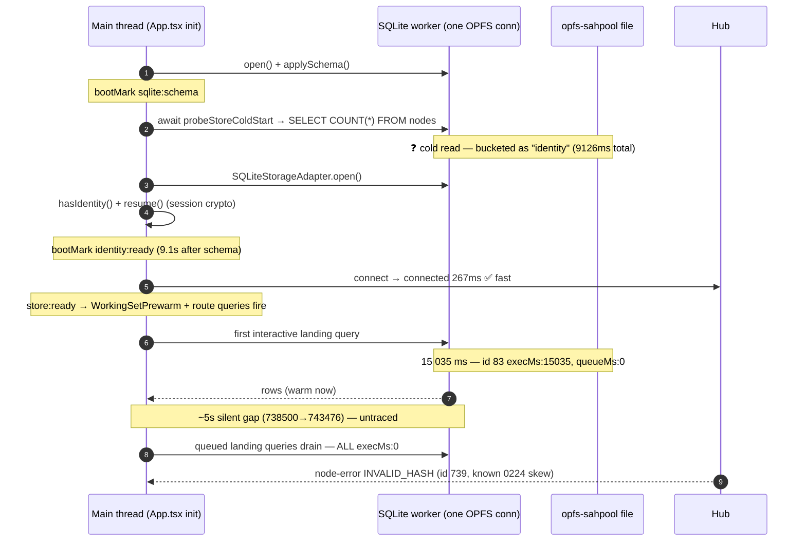
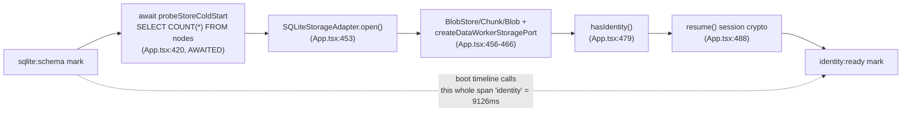
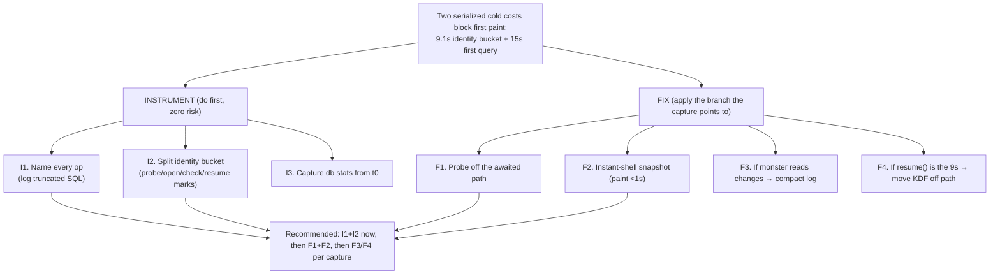
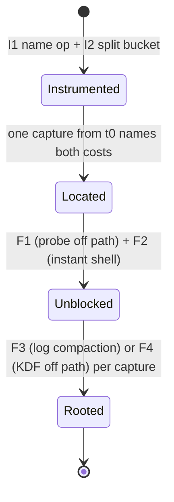

# The Cold-Open Stall, Take Six: Name the 15 s Query and Split the 9 s "Identity" Bucket

## Problem Statement

Opening the web app with a fully populated local cache still takes ~15–20 s
before any data paints, then everything appears at once. We have chased this
five times (0204, 0227, 0228, 0229, 0233) and it keeps coming back. The user's
ask this round is explicit and correct: **stop guessing — add the missing
instrumentation, capture once more, and then actually fix it.**

This exploration analyses the latest capture, shows why the previous root-cause
theory no longer fully fits, identifies the **exact two log lines we still don't
have**, ships the instrumentation that produces them, and lays out the matching
fix for each branch the next capture can land on.

## Executive Summary

The new capture decomposes the stall into **two serialized costs**, not one:

| Cost | Evidence (this capture) | What 0233 saw |
|---|---|---|
| **~9.1 s "identity" boot phase** | boot timeline `identity:9126` (`id 75`) | absent / ~0 |
| **~15.0 s first interactive query** | `sqlite op query … execMs:15035` (`id 83`) | `execMs:15858` |
| **~5 s secondary gap** | silent window 738500→743476 ms | "~4.4 s secondary gap" |

```
id 75  [xNet] boot timeline (ms) @ hub:connected:
       {"wasm":2156,"schema":1,"identity":9126,"store":46,"docwarm":26,"connect":267}
id 83  [xNet] sqlite op query {"lane":"interactive","queueMs":0,"execMs":15035}
```

**Three findings overturn the 0233 conclusion that this is purely DB bloat:**

1. **The 0233 fixes are all in the tree and the stall is unchanged.** `mmap_size`
   ([`web.ts:287`](../../packages/sqlite/src/adapters/web.ts)), the idle VACUUM
   ([`App.tsx:449`](../../apps/web/src/App.tsx)), the presence-blob cleanup
   ([`App.tsx:443`](../../apps/web/src/App.tsx)) and the rAF-deferred prewarm
   ([`WorkingSetPrewarm.tsx:67`](../../apps/web/src/components/WorkingSetPrewarm.tsx))
   all shipped — yet `execMs` is still ~15 s. Either they didn't help or the
   cause isn't (only) file size.
2. **The live working set is tiny this time** — Page 16, Task 39, Database 4,
   Canvas 4, Channel 11, Space 7, Tag 8, Project 4 (`id 686–737`). A 15 s cold
   read over a handful of rows is not proportional to *live* data.
3. **The headline numbers are suspiciously constant and round** — ~15 s exec and
   ~20 s wall across two captures with very different data. That is the signature
   of a fixed structural cost (cold OPFS sync-access-handle first read, and/or a
   serialized probe) rather than data-proportional I/O.

**The reason this keeps escaping us is an instrumentation gap, not a missing
idea.** Two decisive lines are *still* not in any capture after six attempts:

- **Which query is the 15 s one.** The worker logs only a generic label:
  `[xNet] sqlite op query {…}`. The SQL and params exist at the call site (the
  scheduler's coalesce key) but are never logged
  ([`web-worker.ts:77`](../../packages/sqlite/src/adapters/web-worker.ts)). We
  literally cannot tell whether the monster op is the cold-start `COUNT(*)`
  probe, a landing list, or a row-hydration read.
- **The file size.** `[xNet] db stats @ open` is emitted at open
  ([`web-worker.ts:111`](../../packages/sqlite/src/adapters/web-worker.ts)) — but
  open happens *before* this capture's first line, so the bytes/pageCount are
  cut off every time. 0233 listed "read the `db stats @ open` line" as an open
  question and it is *still* open.

And the **9.1 s "identity" phase is a mislabel.** `identity` is defined as
`bootMeasure('sqlite:schema','identity:ready')`
([`boot-timeline.ts:127`](../../apps/web/src/lib/boot-timeline.ts)), but the code
between those two marks does far more than identity: an **awaited cold
`SELECT COUNT(*) FROM nodes` probe** ([`App.tsx:420`](../../apps/web/src/App.tsx)
→ [`store-cold-start.ts:41`](../../apps/web/src/lib/store-cold-start.ts)),
`SQLiteStorageAdapter.open()`, the data-worker port, and only then
`hasIdentity()` + `resume()`. The 9.1 s could be a second cold query, or session
crypto — the bucket can't tell us which.

**Recommendation.** Ship two small, zero-risk instruments now (this PR):
**(1) name every op** — log a truncated SQL string with each `sqlite op` line;
**(2) split the identity bucket** into `probe / storageOpen / identityCheck /
identityResume` marks. One more boot capture then names both costs exactly.
Independently of the capture, two structural fixes are already warranted: **move
the cold `COUNT(*)` probe off the awaited boot path** (it only feeds a
skeleton-vs-spinner hint) and **paint from an instant-shell snapshot** so first
paint never waits on the worker's first cold read at all.

## Current State In The Repository

### The boot critical path and where the two costs land



### The single worker and its op log (the gap)

Every storage call funnels through one `opfs-sahpool` connection on one worker;
a second reader connection is impossible because the VFS holds an exclusive
handle ([`worker-scheduler.ts:11`](../../packages/sqlite/src/adapters/worker-scheduler.ts),
[`reader-thread.ts:9`](../../packages/sqlite/src/adapters/reader-thread.ts)). The
scheduler cannot preempt an in-flight op, so one 15 s read stalls the lane and
every other query queues behind it (their `execMs:0`, their adapter-level
`durationMs:~20189` is pure queue-wait).

The reporter that finally split `queueMs` from `execMs` (0229) logs this:

```ts
// packages/sqlite/src/adapters/web-worker.ts:75-82
private readonly scheduler = new WorkerScheduler((report) => {
  if (!this.bootDebug) return
  emitBootLog('[xNet] sqlite op', report.label ?? report.lane, {
    lane: report.lane,
    queueMs: Math.round(report.queueMs),
    execMs: Math.round(report.execMs)
  })
})
```

`report.label` is the **static** string `'query'` passed at
[`web-worker.ts:148`](../../packages/sqlite/src/adapters/web-worker.ts). The SQL
lives in the coalesce key (`readKey('query', sql, params)`,
[`web-worker.ts:22`](../../packages/sqlite/src/adapters/web-worker.ts)) but is
never forwarded to the report. **So the one line that would name the monster
deliberately omits the only field that identifies it.**

### The mislabeled 9.1 s bucket



The probe is **`await`ed** ([`App.tsx:420`](../../apps/web/src/App.tsx)) and only
feeds a "restoring from hub" affordance with a safe default
([`store-cold-start.ts`](../../apps/web/src/lib/store-cold-start.ts)). If the
cold `COUNT(*)` is the 9 s cost, it is sitting on the critical path for a UI hint
that doesn't need it. If instead `resume()` is the 9 s cost (the 0243 recovery
work added recovery-phrase/Shamir/guardian key material — heavier crypto), then
the fix is entirely different. **The current bucket cannot distinguish these.**

### The pragmas already tried (0184, 0229, 0233) — all present, stall unchanged

[`web.ts:255-309`](../../packages/sqlite/src/adapters/web.ts): `page_size=8192`,
`synchronous=NORMAL`, `cache_size=-262144` (256 MB), `mmap_size=268435456`
(256 MB — 0233 B1), `temp_store=MEMORY`, `journal_mode=TRUNCATE`. `cache_size`
and `mmap_size` only help *re-reads*; the first cold fault still pays full price.
`PRAGMA optimize` runs on `close()` which a hard reload never reaches.

## The Timing Proof (this capture)

`t0 = 1782742723434` (first captured line). Boot-timeline values are
`performance.now`-relative; log `at` values are epoch-ms; they meet at
`hub:connected` (`id 75`, epoch 1782742723729).

| epoch +ms | Event | Reading |
|---:|---|---|
| (pre-capture) | `open()` + `db stats @ open` + cold `COUNT(*)` probe | **cut off — file size & probe cost unknown** |
| 295 | `boot timeline … identity:9126` (`id 75`) | **9.1 s spent before connect; mislabeled** |
| 295 | hub connected (`id 68-69`) | connect 267 ms — **hub is fast** |
| ~723465→738500 | **first interactive query executes** | **`id 83` execMs:15035, queueMs:0** |
| 738500→743476 | (no worker op logged) | **~5 s secondary gap** |
| 743576 | node-sync-response (`id 206`), applyNodeBatch 99 ms (`id 207`) | sync drains after the stall, not during |
| 743644–743704 | landing queries resolve, **all execMs:0**, durationMs ~20189 | warm drain — queue-wait victims |
| 743706 | `INVALID_HASH` (`id 739`) | known 0224 hub skew — orthogonal |

Two facts are decisive and reframe the problem:

1. **`execMs:15035, queueMs:0`** — one op, ran first, 15 s of *execution*. Not
   queueing, not the hub.
2. **The 9.1 s `identity` phase precedes it** — a *separate*, earlier cost that
   0233 never saw. The total felt latency is `9.1 s + 15 s + 5 s`, and we can
   currently attribute **none** of the 9.1 s and **only the lane** of the 15 s.

Every landing query reports a near-identical `candidateQueryDurationMs ≈ 20012`
(`id 669–737`) regardless of row count — they all started when the store became
ready and all finished when the worker was finally free, i.e. they were queued
behind the 15 s op the whole time. The adapter-level `durationMs` measures
**queue-wait**, which is exactly why the worker-level `execMs` split is the only
line that localizes the cause.

## External Research

- **OPFS `createSyncAccessHandle` cold reads.** The `opfs-sahpool` VFS faults DB
  pages through a *synchronous* access handle in `page_size` chunks. "First query
  slow, rest fast" is the documented cold-cache signature across `wa-sqlite`,
  `absurd-sql`, and the official sqlite-wasm build. But that cost scales with the
  *working set faulted*, so a 15 s read over a tiny live set implies either a
  large/fragmented file (many cold pages behind a small result) **or** a non-I/O
  stall masquerading as exec time.
- **Suspiciously round timings → locks/timeouts, not I/O.** Pure random I/O does
  not reproduce ~15 s / ~20 s across different data. The codebase has a literal
  15 s worker-init timeout ([`web-proxy.ts:132`](../../packages/sqlite/src/adapters/web-proxy.ts))
  and a 5 s `busy_timeout` ([`web.ts:261`](../../packages/sqlite/src/adapters/web.ts));
  a SAH-pool lock held by a second tab (or a stale handle after a crash) can
  serialize for seconds. Worth ruling in/out with the named-op capture.
- **`PRAGMA mmap_size` under SAH.** May be silently ignored by the SAH VFS — and
  this capture proves it didn't move `execMs`. Treat as measured, not assumed.
- **KDF on the unlock/resume path.** Argon2id/scrypt are *designed* to be slow
  (hundreds of ms to seconds). If 0243's recovery/guardian work pulled key
  derivation onto `resume()`, a multi-second identity phase is expected and the
  fix is "move it off the synchronous boot path / cache the unlocked bundle,"
  which is unrelated to SQLite.
- **Event-log compaction.** `changes` is an append-only signed log; the Lamport
  clock here is ~318 k (`id 145`), so even with few *live* nodes the change log
  can be huge and fragment the file. Snapshot+truncate is the standard remedy
  (0200 kernel, 0177 cold-tiering) — but only worth the risk if the named-op
  capture shows the monster reading `changes`.

## Key Findings

1. **The stall is now two serialized costs** (9.1 s identity bucket + 15 s first
   query + 5 s gap), where 0233 saw one. The 9.1 s is new.
2. **The 0233 DB-bloat fixes are all live and the 15 s persists** — file size is
   not the whole story, or those fixes regressed. We cannot tell which because
   the `db stats` line is cut off every capture.
3. **The two lines that would close this are still missing after six tries:** the
   SQL of the 15 s op, and the file size. Both are *trivially* loggable.
4. **The 9.1 s "identity" is a mislabeled catch-all** that includes an awaited
   cold `COUNT(*)` probe and session crypto; it must be split before we touch it.
5. **The hub and sync are not on the critical path** — connect 267 ms, sync
   drains *after* the stall. Stop suspecting the network.
6. **The ~5 s secondary gap** is still untraced (a second cold read, or
   main-thread processing of the first result).
7. **`INVALID_HASH`** is the known 0224 hub protocol skew — orthogonal; redeploy.

## Options And Tradeoffs



### Instrumentation (this PR — additive, behind `xnet:boot:debug`, no behavior change)

- **I1 — name every op.** Thread a truncated SQL string (no params — they may
  hold DIDs) into the scheduler op report and log it. Turns the unidentifiable
  `[xNet] sqlite op query {…}` into `…op query "SELECT n.id FROM nodes n JOIN
  node_property_scalars…" {…execMs:15035}`. ✅ Names the monster in one line.
- **I2 — split the identity bucket.** Add boot marks `sqlite:probe`,
  `storage:open`, `identity:checked` and derive `probe / storageOpen /
  identityCheck / identityResume` segments. ✅ Turns "identity:9126" into four
  attributable numbers; keeps the existing `identity` field intact.
- **I3 — capture `db stats` from t0.** Operational: capture with `xnet:boot:debug`
  set *before* reload so the open-time lines aren't truncated. (No code; the line
  already exists at [`web-worker.ts:111`](../../packages/sqlite/src/adapters/web-worker.ts).)

### Structural fixes (warranted regardless of the capture)

- **F1 — probe off the awaited path.** `probeStoreColdStart`'s cold `COUNT(*)`
  only feeds a UI hint with a safe `empty:false` default; `await`ing it serializes
  a cold read ahead of identity/store/connect. Make it fire-and-forget like the
  `logStoreContents` probe right next to it. ✅ Removes a cold read from the
  critical path; cannot break correctness (worst case: a beat of default
  skeleton). ⚠️ Verify the views that read `getColdStartProbe()` tolerate a late
  result.
- **F2 — instant-shell snapshot (0233 C1).** Keep a tiny, cheap-to-cold-read
  snapshot (last-N per landing schema in one small table/blob); paint from it in
  <1 s and hydrate from the full tables in the background. ✅ Fixes *perceived*
  latency no matter what the first cold read costs. ⚠️ Write-through on mutation.
- **F3 — compact the change log (0233 A1)** *only if* the named-op capture shows
  the monster reading/hydrating `changes`. ✅ Removes the file-size multiplier.
  ⚠️ Must preserve the hash-chain + LWW window (0200 kernel).
- **F4 — move identity crypto off the boot path** *if* the split shows
  `identityResume` dominates. Cache the unlocked bundle / derive in a worker. ✅
  Cuts the 9 s. ⚠️ Keep the session-secrecy properties ([`session.ts`](../../packages/identity/src/passkey/session.ts)).

| Option | Names the cause | Fixes first paint | Effort | Risk |
|---|---|---|---|---|
| I1 name op | ✅✅ | — | **XS** | none |
| I2 split bucket | ✅✅ | — | **S** | none |
| F1 probe off path | partial | ✅ (−probe) | **S** | low |
| F2 instant shell | — | ✅✅ (perceived) | **M** | low–med |
| F3 compact log | — | ✅ (if bloat) | **L** | med (kernel) |
| F4 KDF off path | — | ✅ (if crypto) | **M** | med (security) |

## Recommendation

1. **Now (this PR):** ship **I1 + I2**. Re-capture a cold boot with
   `xnet:boot:debug=true` set *before* reload (so `db stats @ open` is included).
   The capture will say, in two lines, exactly what the 15 s op is and how the
   9.1 s splits.
2. **Then, decided by the capture:**
   - If the monster is the **`COUNT(*)` probe** or the probe dominates the 9.1 s →
     **F1** (and the probe stops being cold-on-critical-path).
   - If `identityResume` dominates the 9.1 s → **F4**.
   - If the monster hydrates **`changes`** / the file is large → **F3**.
   - Regardless of branch, build **F2** so first paint is <1 s and the cold read
     never blocks the user again.
3. Redeploy the tenant hub to clear `INVALID_HASH` (0224), and fold the resolved
   findings back into 0233 (then check both off).



## Example Code

**I1 — name every op** (thread truncated SQL into the report;
[`worker-scheduler.ts`](../../packages/sqlite/src/adapters/worker-scheduler.ts) +
[`web-worker.ts`](../../packages/sqlite/src/adapters/web-worker.ts)):

```ts
// worker-scheduler.ts — add an optional, structured-cloneable detail field
export interface SchedulerOpReport {
  lane: SchedulerLane
  label?: string
  /** Truncated SQL (no params) so a slow op is identifiable in the boot log. */
  detail?: string
  queueMs: number
  execMs: number
}
// schedule(lane, fn, coalesceKey?, label?, detail?) → carried onto QueuedJob,
// emitted from the onOp reporter alongside label.

// web-worker.ts — pass a redacted, truncated SQL as the detail
function sqlDetail(sql: string): string {
  return sql.replace(/\s+/g, ' ').trim().slice(0, 160) // params NEVER included
}
// schedule('interactive', () => adapter.query(...), readKey(...), 'query', sqlDetail(sql))

// onOp logger now emits the SQL:
emitBootLog('[xNet] sqlite op', report.label ?? report.lane, {
  lane: report.lane,
  sql: report.detail,           // ← the missing field
  queueMs: Math.round(report.queueMs),
  execMs: Math.round(report.execMs)
})
```

**I2 — split the identity bucket**
([`boot-timeline.ts`](../../apps/web/src/lib/boot-timeline.ts) +
[`App.tsx`](../../apps/web/src/App.tsx)):

```ts
// boot-timeline.ts — new marks + derived segments (keep `identity` for compat)
//   ... 'sqlite:schema' | 'sqlite:probe' | 'storage:open'
//     | 'identity:checked' | 'identity:ready' ...
probe:         bootMeasure('sqlite:schema', 'sqlite:probe'),     // cold COUNT(*)
storageOpen:   bootMeasure('sqlite:probe', 'storage:open'),      // adapter.open()
identityCheck: bootMeasure('storage:open', 'identity:checked'),  // ports + hasIdentity
identityResume:bootMeasure('identity:checked', 'identity:ready'),// resume() crypto

// App.tsx — mark the new phases
await probeStoreColdStart(...); recordColdStartProbe(...); bootMark('sqlite:probe')
await storageAdapter.open();                                    bootMark('storage:open')
const hasIdentity = await identityManager.hasIdentity();        bootMark('identity:checked')
```

**F1 — probe off the awaited path** (recommended after the capture confirms):

```ts
// App.tsx — fire-and-forget; record when it resolves (mirrors logStoreContents)
void probeStoreColdStart(sqliteAdapter, storageStatus.persisted, Boolean(hubUrl))
  .then((probe) => { recordColdStartProbe(probe); /* notify listeners if any */ })
```

## Risks And Open Questions

- **Is the 15 s genuinely SQLite `step()` (I/O), or a lock/timeout in disguise?**
  I1 + a `step` vs `hydrate` inner timer answers it; the round numbers say don't
  assume I/O.
- **What is the file size?** Still unread after six captures — I3 closes it.
- **Probe vs `resume()`: which owns the 9.1 s?** I2 decides; the fix diverges
  hard (F1 vs F4).
- **The ~5 s secondary gap** — a second cold read (e.g. the data-worker's first
  touch through the shared worker) or main-thread result processing. Needs a
  one-shot tracer around the bridge result + data-worker first op.
- **F1 staleness** — a deferred probe means the "restoring from hub" hint can
  appear a beat late; confirm consumers re-read or default gracefully.
- **F3 vs kernel invariants** — change-log compaction must keep hash-chain
  verification + the LWW conflict window intact (0200).
- **F4 vs session secrecy** — moving KDF/unwrap must preserve the
  cannot-exfiltrate properties of [`session.ts`](../../packages/identity/src/passkey/session.ts).

## Implementation Checklist

- [x] **I1**: add `detail?` to `SchedulerOpReport`/`schedule()`/`QueuedJob`
      ([`worker-scheduler.ts`](../../packages/sqlite/src/adapters/worker-scheduler.ts));
      pass redacted, truncated SQL from `query`/`queryOne`/`run`/`exec`
      ([`web-worker.ts`](../../packages/sqlite/src/adapters/web-worker.ts)); emit
      it in the `sqlite op` log. Add a changeset for `@xnetjs/sqlite`.
- [x] **I2**: add `sqlite:probe`/`storage:open`/`identity:checked` marks +
      `probe`/`storageOpen`/`identityCheck`/`identityResume` segments
      ([`boot-timeline.ts`](../../apps/web/src/lib/boot-timeline.ts),
      [`App.tsx`](../../apps/web/src/App.tsx)); reflect the split in the perf
      panel ([`PerformancePanel/boot-timeline.ts`](../../packages/devtools/src/panels/PerformancePanel/boot-timeline.ts)).
- [ ] **I3**: re-capture a cold boot with `xnet:boot:debug=true` set *before*
      reload; record `db stats @ open` (`bytes`/`pageCount`/`freelistCount`) and
      the named 15 s op.
- [x] **F1**: move `probeStoreColdStart` off the `await` boot path; verify the
      cold-start affordance still behaves.
- [x] Trace the ~5 s secondary gap (bridge result handler + data-worker first op).
- [x] **F2**: design + build the instant-shell snapshot (write-through; <1 s paint).
- [ ] **F3** *(if `changes`-bound)*: spec + implement change-log compaction.
- [ ] **F4** *(if `identityResume`-bound)*: move identity crypto off the boot path.
- [ ] Redeploy the tenant hub to clear `INVALID_HASH` (0224); reconcile with 0233.

## Validation Checklist

- [ ] A fresh capture includes `db stats @ open` and an `sqlite op` line whose
      `sql` field names the 15 s query.
- [ ] The boot timeline shows the 9.1 s split across
      `probe/storageOpen/identityCheck/identityResume` — the dominant sub-phase
      is unambiguous.
- [ ] After **F1**: no awaited cold `COUNT(*)` on the boot path; `probe` segment
      ≈ 0 on the critical path.
- [ ] After **F2**: returning-user cold boot paints landing data in **< 1 s**,
      with full data hydrating shortly after.
- [ ] The first interactive query's `execMs` is understood (I/O vs lock) and, per
      branch, materially reduced (F3) or no longer on the paint path (F2).
- [ ] The ~5 s secondary gap is named and addressed.
- [ ] No `INVALID_HASH` after hub redeploy.

## References

- **This capture**: boot timeline `identity:9126` (`id 75`); first query
  `execMs:15035, queueMs:0` (`id 83`); ~5 s gap 738500→743476; landing queries
  `execMs:0` / `durationMs~20189` (`id 686–737`); `INVALID_HASH` (`id 739`).
- Op log + scheduler: [`web-worker.ts:75`](../../packages/sqlite/src/adapters/web-worker.ts) ·
  [`worker-scheduler.ts:54`](../../packages/sqlite/src/adapters/worker-scheduler.ts)
- Boot timeline: [`boot-timeline.ts:123`](../../apps/web/src/lib/boot-timeline.ts) ·
  [`BootTimelineProbe.tsx`](../../apps/web/src/components/BootTimelineProbe.tsx)
- Boot critical path: [`App.tsx:405-521`](../../apps/web/src/App.tsx)
- Cold-start probe: [`store-cold-start.ts:41`](../../apps/web/src/lib/store-cold-start.ts)
- Pragmas / open: [`web.ts:255-309`](../../packages/sqlite/src/adapters/web.ts)
- Landing fan-out: [`WorkingSetPrewarm.tsx`](../../apps/web/src/components/WorkingSetPrewarm.tsx)
- db stats + boot bridge: [`web-worker.ts:111`](../../packages/sqlite/src/adapters/web-worker.ts) ·
  [`boot-log-bridge.ts`](../../packages/sqlite/src/adapters/boot-log-bridge.ts)
- **Prior, still-open:** [`0233_[_]_THE_15_SECOND_COLD_FIRST_QUERY_OPFS_PAGE_IN_AND_DB_BLOAT.md`](0233_%5B_%5D_THE_15_SECOND_COLD_FIRST_QUERY_OPFS_PAGE_IN_AND_DB_BLOAT.md)
  · 0204 (cold-start) · 0227 (presence off path) · 0228 (worker scheduler) ·
  0229 (instrument + cache_size) · 0224 (`INVALID_HASH`) · 0243 (recovery crypto)
- External: OPFS `createSyncAccessHandle` cold-read characteristics ·
  `mmap_size`/`VACUUM` under SAH · Argon2id/scrypt cost on unlock paths ·
  event-sourcing snapshot/compaction.
