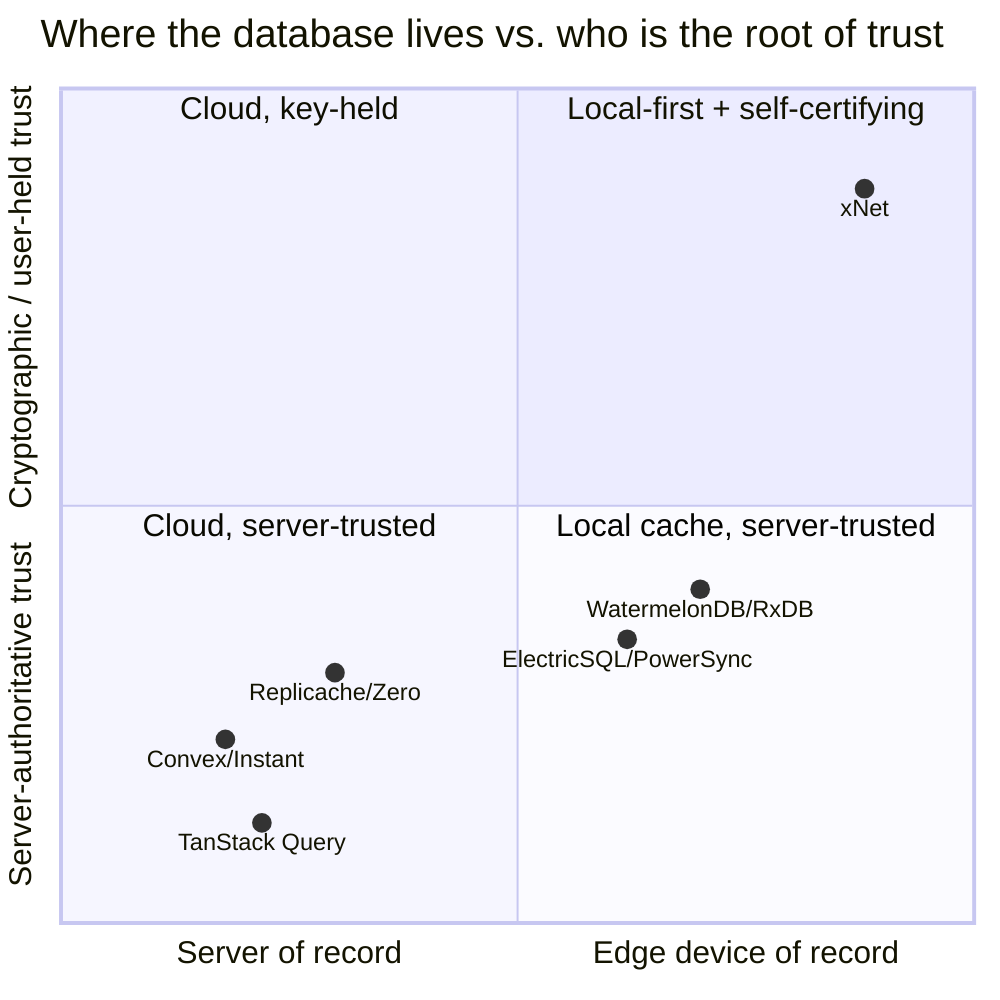
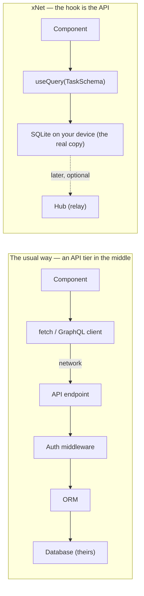
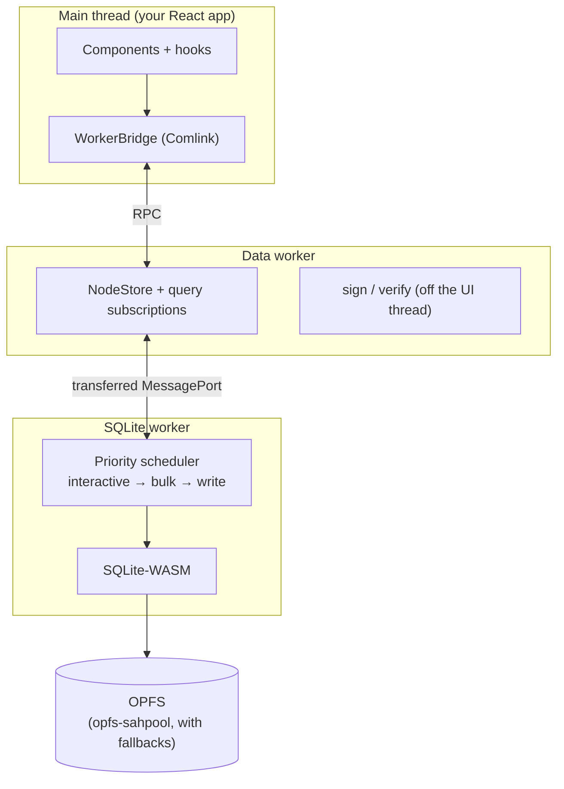
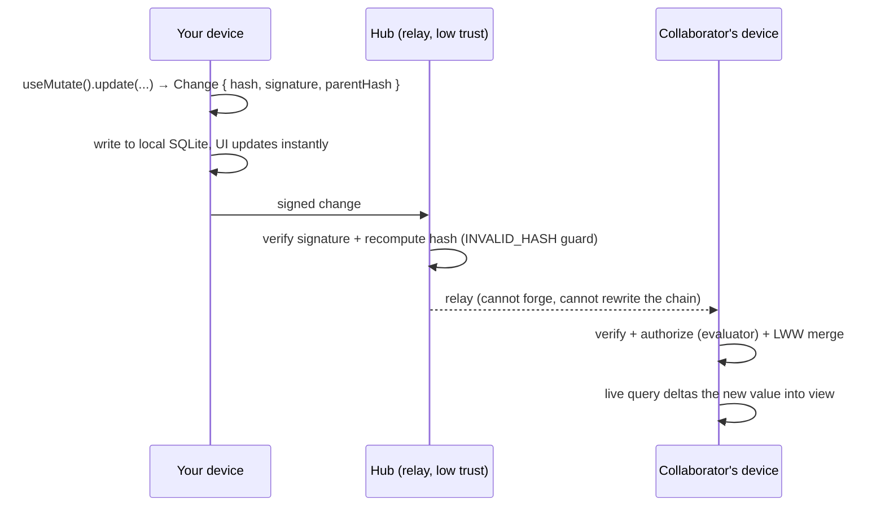

# Blog Post: "The Tip of the Hook" — xNet's React Hooks as the Whole API

## Problem Statement

We shipped our first technical deep-dive — **"The Loom You Can Read"**
(blog #7, exploration
[0248](0248_[x]_DEEP_DIVE_BLOG_POST_HOW_XNET_ACTUALLY_WORKS_UNDER_THE_HOOD.md)) —
which followed a single note, "Buy milk," through the kernel: the signed
change log, the `did:key` identity, the three-line merge, the post-office
hub. That essay answered **"where does my data live and who can read it?"**
for a general audience.

There's a second deep-dive the project has been missing, aimed squarely at
**developers**: a tour of the thing they actually touch — the **React
hooks** — and the argument that, in xNet, *the hooks are the API*. You write
`useQuery(TaskSchema)` in a component and you get a live, local, offline-first,
cryptographically-authorized, remotely-mirrored database query, with no
endpoint to define, no auth middleware to write, no websocket to wire, no
cache to invalidate, no worker to spawn. The convenience isn't that the
machinery is missing — it's that it's correct by default and you're allowed
to open it.

The brief (verbatim intent): *"dig into how powerful and convenient it is to
basically specify your whole API in the client, including authentication and
authorization, and then trust that it's cryptographically secure and that the
data streams and views materialize as needed; run full database queries against
your local database that also get mirrored against remote databases and merge
in new data as needed … a little tour of the hooks, expose some code, show
mermaid diagrams, then go a layer deeper and explain what's actually going on
behind the surface — web workers, SQLite, parallelization — to keep the
database fast without the developer wiring it up. It just kind of works no
matter what."*

This exploration specifies that post: title, slug, arc, the exact code
excerpts (grounded in real files), the mermaid diagrams, and the build/registration
mechanics — so it can be implemented to the same bar as #7.

## Executive Summary

- **Write blog post #8: "The Tip of the Hook."** The title is a pun on *tip
  of the iceberg* + *React hook*: a `useQuery` is eight readable lines on the
  surface; beneath it sits a signed change log, a SQLite database in a web
  worker, a priority scheduler, and a sync engine you never had to assemble.
- **Reuse the #7 primitives verbatim**: `Mermaid`, `CodeFigure`, `Peek`
  (`site/src/components/blog/`). Author as a hand-written `.astro` page (the
  blog has no MDX), single-source metadata through `site/src/data/blog.ts`,
  and add one bespoke hero/art pair (`HookHero` + `HookArt`) in the established
  iceberg motif.
- **Two-track structure**, exactly like #7: a plain-language spine any
  developer can read straight through, with `Peek` panels carrying the code
  and protocol detail for the curious.
- **Arc** (surface → depth, matching the brief):
  1. *There is no API* — you write a component, not an endpoint.
  2. *A tour of the hooks* — `useQuery` / `useMutate` / `useNode` /
     `useInfiniteQuery`.
  3. *The schema is the API — including authorization* — `defineSchema` with
     declarative roles + actions.
  4. *Why you can trust it* — every write is a signed, hash-chained change;
     the hub verifies and the authorizer gates before anything materializes.
  5. *How a view materializes* — `useSyncExternalStore` + the query cache +
     bounded-delta incremental maintenance.
  6. *The layer beneath* — SQLite-WASM in a worker, OPFS, the priority
     scheduler, the pragmas, "it works on any device."
  7. *Local-first, mirrored to remote* — query the local DB instantly; remote
     changes merge in via LWW and the live view updates in place.
  8. *It just works* — the list of things you never had to build.
- **Stay honest** (the #7 bar): describe what's live today. Local queries are
  *live* (in-memory deltas as the local store changes, including when synced
  remote changes land); the `live`/`stream` *hub-push* execution modes are
  defined but **not yet active** — do not imply server-push subscriptions.
- Tags `['essay', 'protocol', 'decentralization']` (same family as #7);
  ~14-minute read; en-GB spelling to match the series.

## Current State In The Repository

### Blog infrastructure (how a post is built)

- Posts are hand-authored `.astro` pages under
  [site/src/pages/blog/](site/src/pages/blog/), **not** MDX or a content
  collection. Metadata is single-sourced in
  [site/src/data/blog.ts](site/src/data/blog.ts) (the `BlogPost` interface +
  `posts[]` array; `publishedPosts()`, `postBySlug()`, `formatPostDate()`).
- `BlogTag` is a closed union in
  [site/src/data/blog.ts:23](site/src/data/blog.ts): `essay | philosophy |
  privacy | decentralization | protocol | nature | cosmos | economics`. No
  new tag is required.
- The index page
  [site/src/pages/blog/index.astro](site/src/pages/blog/index.astro) renders
  cards from `publishedPosts()` and maps each slug to its hero art in the
  `heroArt` record (`index.astro:18`). A new post must be registered there.
- The feed endpoint
  [site/src/pages/blog/rss.xml.ts](site/src/pages/blog/rss.xml.ts) calls
  `buildBlogRss(publishedPosts())`
  ([site/src/lib/blog-feed.ts](site/src/lib/blog-feed.ts)); the sitemap is
  auto-generated by `@astrojs/sitemap`. Both pick up a new post for free once
  it's in `posts[]`.

### The deep-dive primitives (reuse, don't rebuild)

- [Mermaid.astro](site/src/components/blog/Mermaid.astro) — client-rendered
  diagram; `code` printed with `set:text` so `-->`/`{}`/`<br/>` survive; loads
  `mermaid@11` from a CDN, deferred, dark-mode aware. Props: `{ code, caption? }`.
- [CodeFigure.astro](site/src/components/blog/CodeFigure.astro) — pre-tokenized
  HTML (`tok-keyword` / `tok-type` / `tok-function` / `tok-string` /
  `tok-comment` spans, built with frontmatter `kw/ty/fn/st/cm` helpers), file
  label, copy button. Props: `{ code, filename?, caption? }`.
- [Peek.astro](site/src/components/blog/Peek.astro) — native `<details>`
  disclosure, no JS; lets a reader skim past closed panels. Props: `{ label?,
  open? }`.
- Hero pattern: [LoomHero.astro](site/src/components/blog/LoomHero.astro)
  layers title/deck/date/tags over [LoomArt.astro](site/src/components/blog/LoomArt.astro)
  (full-bleed inline SVG, the cosmic-X as the brightest element). #7's
  bespoke explainer cards (`TrustBoundary`, `HonestMachine`) are *optional*
  precedent — this post can land with just `Peek` + `CodeFigure` + `Mermaid`.

### The hooks (the surface — `packages/react`)

| Hook | File | Shape |
| --- | --- | --- |
| `useQuery` | [useQuery.ts:395](packages/react/src/hooks/useQuery.ts) | `(schema)` → list, `(schema, id)` → single, `(schema, filter)` → filtered. Returns `{ data, status, loading, isLive, source, reload, … }` over `useSyncExternalStore`. |
| `useMutate` | [useMutate.ts:258](packages/react/src/hooks/useMutate.ts) | `{ create, update, remove, restore, mutate, bulk, isPending }`. Local-first, synchronous UI update. |
| `useNode` | [useNode.ts:239](packages/react/src/hooks/useNode.ts) | single node + `Y.Doc` for collaborative editing + presence/awareness + sync status. |
| `useInfiniteQuery` | [useInfiniteQuery.ts:110](packages/react/src/hooks/useInfiniteQuery.ts) | a **growing `limit + orderBy` window** (not frozen cursor pages); `fetchNextPage()` grows it; every loaded row stays live. |
| `useIdentity` | [useIdentity.ts](packages/react/src/hooks/useIdentity.ts) | `{ identity, isAuthenticated, did }`. |
| `useAuthTrace` | [useAuthTrace.ts:56](packages/react/src/hooks/useAuthTrace.ts) | why an action was allowed/denied (roles, grants, reasons). |

The query-spec object — `where`, `orderBy`, `limit`/`offset`/`page`,
`spatial`, `search`, `materializedView`, `mode`, `source`, `enabled` — lives
in [packages/data-bridge/src/types.ts:103](packages/data-bridge/src/types.ts)
(`QueryFilter<P>`), normalized to a `QueryDescriptor` and serialized to a
stable cache key by
[query-descriptor.ts](packages/data-bridge/src/query-descriptor.ts).

### The schema is the API — including authorization

- Authorization is declared **in the schema**, in client code:
  [packages/data/src/auth/builders.ts](packages/data/src/auth/builders.ts)
  exposes `allow()`/`deny()`/`and`/`or`/`not` and the role resolvers
  `role.creator()`, `role.property()`, `role.relation()`, `role.members()`.
  Presets in [presets.ts](packages/data/src/auth/presets.ts): `private()`,
  `publicRead()`, `collaborative()`, `team()`.
- Enforced by
  [packages/data/src/auth/evaluator.ts](packages/data/src/auth/evaluator.ts)
  (role resolution → expression eval → grant/UCAN checks → field rules →
  decision cache, with a `MAX_CONTAINER_DEPTH = 32` cap on membership cascade).
  Validated at definition time by
  [validate.ts](packages/data/src/auth/validate.ts) (e.g.
  `AUTH_SCHEMA_UNSAFE_PUBLIC_MUTATION` rejects `PUBLIC` on write/delete/share).
- All 24 content schemas carry authz + a coverage test (PR #139).

### Why you can trust it — the crypto kernel

- A write becomes a `Change`: `{ id, payload, hash, parentHash, authorDID,
  signature, lamport, … }`
  ([packages/sync/src/change.ts:188](packages/sync/src/change.ts)).
  `computeChangeHash()` = canonical JSON (sorted keys) → **BLAKE3**;
  `signChange()` signs the hash with **Ed25519**; `verifyChangeHash()` /
  `validateChain()` recompute and refuse tampered or orphaned changes
  ([integrity.ts](packages/sync/src/integrity.ts),
  [chain.ts](packages/sync/src/chain.ts) — the `INVALID_HASH` guard).
- Identity is a key, not an account:
  [packages/crypto/src/key-resolution.ts:317](packages/crypto/src/key-resolution.ts)
  `createDIDFromEd25519PublicKey()` → `did:key:z6Mk…`; signing in
  [signing.ts](packages/crypto/src/signing.ts) (`@noble/curves`), with hybrid
  post-quantum levels (Ed25519 + ML-DSA) in
  [hybrid-signing.ts](packages/crypto/src/hybrid-signing.ts).
- Before remote changes materialize, the store verifies + authorizes:
  [packages/data/src/store/store.ts:145](packages/data/src/store/store.ts)
  wires an `authEvaluator` and a read authorizer
  (`setNodeReadAuthorizer`) plus an `onUnauthorizedRemoteChange` hook.

### How a view materializes (live queries)

- `useQuery` builds a `QuerySubscription` (`getSnapshot`, `getMetadata`,
  `subscribe`) and feeds it to React's `useSyncExternalStore`
  ([useQuery.ts:452](packages/react/src/hooks/useQuery.ts)).
- The bridge backs it with a `QueryCache`
  ([packages/data-bridge/src/query-cache.ts](packages/data-bridge/src/query-cache.ts))
  — LRU (`DEFAULT_MAX_SIZE = 100`), weak subscribers, materialized result +
  `BoundedQueryWorkingSet`.
- **Bounded-delta incremental maintenance**: for `limit + orderBy, offset 0,
  no cursor` queries the bridge over-fetches `BOUNDED_QUERY_OVERFETCH = 25`
  spare rows and applies edits in memory; it only reloads when a burst exceeds
  `BULK_STORE_CHANGE_RELOAD_THRESHOLD = 250`
  ([query-descriptor.ts:42](packages/data-bridge/src/query-descriptor.ts),
  [main-thread-bridge.ts:94](packages/data-bridge/src/main-thread-bridge.ts)).
- **Identity reuse**: unchanged `NodeState` keep their reference
  (`reuseEquivalentNodeReferences`), and a `WeakMap` caches the flattened
  `FlatNode` ([useQuery.ts:214](packages/react/src/hooks/useQuery.ts)), so
  memoized rows skip re-rendering.

### The layer beneath (the deep part of the iceberg)

- **SQLite-WASM in a web worker.** `@sqlite.org/sqlite-wasm` is initialized in
  [packages/sqlite/src/adapters/web.ts:138](packages/sqlite/src/adapters/web.ts);
  persistence via the **OPFS SAH-pool VFS** (`installOpfsSAHPoolVfs`, name
  `opfs-sahpool`), with an **async-OPFS** fallback and an **in-memory** last
  resort. Capability detection:
  [opfs-capability.ts:67](packages/sqlite/src/adapters/opfs-capability.ts)
  (`detectOpfsCapability`) — this is the "works on any device/context" seam.
- **Performance pragmas** (`web.ts:254`): 8 KiB pages, `cache_size = -262144`
  (256 MB), `mmap_size` 256 MB, `temp_store = MEMORY`, `journal_mode =
  TRUNCATE`.
- **Two workers, talking directly.** The SQLite worker
  ([web-worker.ts](packages/sqlite/src/adapters/web-worker.ts)) and the data
  worker
  ([data-bridge/src/worker/data-worker.ts](packages/data-bridge/src/worker/data-worker.ts))
  are exposed over **Comlink**; a transferred `MessagePort`
  ([worker-bridge.ts:84](packages/data-bridge/src/worker-bridge.ts)) lets the
  data worker call SQLite without a main-thread hop. Signing/verification run
  in the worker, off the UI thread.
- **Priority scheduler.**
  [worker-scheduler.ts](packages/sqlite/src/adapters/worker-scheduler.ts):
  three lanes drained `interactive → bulk → write`, with read **coalescing**
  (identical concurrent reads share one promise) and per-op `queueMs/execMs`
  telemetry. A single OPFS connection is serial, but interactive reads never
  starve behind a bulk import.
- **Update batching** to the worker at ~one frame (`UPDATE_BATCH_WAIT = 16`,
  max `100`) ([worker-bridge.ts:48](packages/data-bridge/src/worker-bridge.ts)).

### Local-first, mirrored to remote

- Reads hit the local SQLite first. The router
  [remote-query-execution.ts:23](packages/data-bridge/src/remote-query-execution.ts)
  (`routeRemoteNodeQuery`, thresholds: local ≤ 10k rows, hybrid ≥ 100k,
  `searchToRemote`/`spatialToRemote`) decides when to involve the hub.
- Execution modes ([types.ts:89](packages/data-bridge/src/types.ts)): `local`,
  `local-then-remote` (load local now, refresh from hub in the background),
  `remote`, and `live`/`stream` (**defined but not yet active** — the honesty
  caveat).
- Merge is LWW on `{ lamport, author }` per property
  ([packages/data/src/store/types.ts](packages/data/src/store/types.ts)); when
  a synced change lands in the local store, the live query deltas the change
  into the visible set — "new data merges in as needed," no refetch.

### No release artifacts needed

`site/` and `docs/` are not publishable `packages/*` (see
`scripts/changeset/publishable-pathspec.mjs`), so **no changeset** is
required. The PR still needs a `changelog-section` fragment (precedent: blog
#7's `02534b07 docs(changelog): add fragment for The Loom You Can Read`).

## External Research

The post should situate xNet among the local-first / sync-engine field —
both to be credible and to sharpen what's distinct (the *cryptographic*
enforcement of a client-declared API).

- **Ink & Switch, "Local-first software" (2019)** — the canonical seven
  ideals (fast, multi-device, offline, collaborative, long-lived, private,
  user-controlled). xNet's hooks are an attempt to make those ideals the
  *default* of a `useQuery` call. (Already cited in #7.)
- **Replicache / Rocicorp Zero** — the closest DX cousin: client-side
  queries, a server-authoritative sync, optimistic mutations. Zero ships a
  `useQuery`-style reactive client over a query cache. Difference: Replicache/
  Zero trust a server for authority and permissions (Zero's read/write
  *permissions* run on the server); xNet pushes authorization into a *signed,
  hash-chained* log so no server is the root of trust.
- **Convex / InstantDB** — reactive "DB-as-hooks" (`useQuery`) with a
  hosted backend. Beautiful DX, but the database and auth are the vendor's
  service; offline is partial. xNet's master copy is the local SQLite and the
  identity is a `did:key`.
- **ElectricSQL / PowerSync** — sync a server Postgres into a local SQLite,
  reactive queries against the local copy. Architecturally the nearest to
  xNet's "full DB queries locally, mirrored remotely." Difference: they
  centre a Postgres of record and shape-based partial replication; xNet
  centres the *edge* device and a portable, signed change log.
- **RxDB / WatermelonDB / TinyBase** — local reactive databases with
  pluggable replication; WatermelonDB famously runs queries off the main
  thread for large datasets — direct prior art for xNet's worker + SQLite
  approach. None bake in cryptographic identity/authz.
- **TanStack Query / SWR** — popularized the `useQuery` hook *ergonomics*
  xNet borrows, but they cache *remote* fetches; there is no local database
  or offline write path. Worth a one-line nod: xNet keeps the ergonomics,
  swaps the backend for your own disk.
- **Linear's sync engine** (engineering talks) — the reference for "feels
  instant because it's local; sync is a background detail." Good rhetorical
  anchor for the "it just works" close.
- **Browser substrate**: SQLite-WASM + **OPFS** (`installOpfsSAHPoolVfs`,
  sync access handles), **Comlink** for worker RPC, and
  `useSyncExternalStore` (React 18) for tear-free external stores — all real,
  linkable primitives the post can name to show "this is plain engineering,
  not magic."



## Key Findings

1. **The hook *is* the API.** There is no endpoint, schema-stitching layer,
   or resolver between the component and the data. The "API surface" a
   developer designs is the set of schemas + the hooks that read/write them —
   all client-side, all type-safe.
2. **Authorization is co-located with the data shape** and declarative
   (`allow('editor','owner')`), not a separate middleware tier. The same
   definition is what the evaluator enforces and what `useAuthTrace` explains.
3. **Trust is mathematical, not positional.** Because every change is signed
   (Ed25519) and hash-chained (BLAKE3), the client-declared rules are
   *enforceable without trusting the transport or the hub*. This is the
   crux that separates xNet from the Convex/Replicache family.
4. **Views are live by construction.** `useSyncExternalStore` + a bounded
   working set means edits (local or just-synced) flow into the visible list
   as in-memory deltas, with object-identity reuse so React re-renders only
   what changed.
5. **The performance machinery is invisible but openable.** A worker-hosted
   SQLite, OPFS persistence with graceful fallback, a priority scheduler, and
   frame-batched RPC are all there — the developer wrote none of it, and can
   read all of it.
6. **Honesty boundary.** Local queries are live today; hub-push `live`/
   `stream` modes are scaffolded but inactive. The post must say so, in the
   #7 tradition.

## Options And Tradeoffs

### A. Framing of the post

| Option | Pros | Cons |
| --- | --- | --- |
| **A1. Iceberg tour (recommended)** — surface hooks → dive to workers/SQLite/crypto, mirroring the brief | Matches the ask exactly; the "tip vs. depth" metaphor carries the whole piece; parallels #7's structure | Long; must resist becoming an API reference |
| A2. Pure tutorial ("build a task app in 20 lines") | Concrete, copy-pasteable | Undersells the depth; reads like docs, not an essay |
| A3. Comparison-led ("xNet vs. Convex vs. Electric") | SEO-friendly, sharp | Risks being a competitor takedown; ages fast |

### B. How much code

| Option | Pros | Cons |
| --- | --- | --- |
| **B1. Spine + `Peek` panels (recommended)** — prose readable alone, code optional | Proven in #7; serves both audiences | More authoring care (each panel must stand alone) |
| B2. Code-forward (snippets inline) | Developer-dense | Loses the non-spec reader; wall-of-code feel |

### C. New components

| Option | Pros | Cons |
| --- | --- | --- |
| **C1. Reuse `Mermaid`/`CodeFigure`/`Peek` + one `HookHero`/`HookArt` (recommended)** | Minimal new surface; consistent look; one art asset per post is the established convention | Need one tasteful SVG |
| C2. Also build bespoke explainer cards (à la `TrustBoundary`) | Richer visuals | More scope; not required to land the argument |

### D. Tag

Reuse `['essay', 'protocol', 'decentralization']` (the #7 set) — avoids
touching the `BlogTag` union and keeps the two deep-dives visually paired. A
new `'developers'`/`'engineering'` tag is tempting but unnecessary scope.

## Recommendation

Ship **A1 + B1 + C1 + D**: "The Tip of the Hook," an iceberg-motif,
two-track deep-dive that tours the hooks on the surface and dives to the
worker/SQLite/crypto machinery beneath, reusing the #7 primitives plus one
`HookHero`/`HookArt` pair. ~14-minute read, en-GB, `['essay', 'protocol',
'decentralization']`, dated just after #7 so it sorts on top.

Diagrams (4) and code panels (≈6) below are the build target.

### Diagram 1 — there is no API tier (flowchart)



### Diagram 2 — how a view materializes (sequence)

```mermaid
sequenceDiagram
  participant C as Component
  participant H as useQuery
  participant Br as DataBridge + QueryCache
  participant W as Data worker
  participant S as SQLite worker (OPFS)
  C->>H: useQuery(TaskSchema, { where:{ status:'todo' } })
  H->>Br: subscribe(descriptor)
  Br->>W: load (first time only)
  W->>S: SELECT … (off the main thread)
  S-->>W: rows
  W-->>Br: snapshot
  Br-->>H: getSnapshot()
  H-->>C: render
  Note over Br,W: an edit lands (local or just-synced)
  W-->>Br: bounded delta (≤250 → in place; else reload)
  Br-->>H: notify
  H-->>C: re-render only the changed rows
```

### Diagram 3 — the worker architecture (flowchart)



### Diagram 4 — write → sign → verify → authorize → merge (sequence)



## Example Code

The page is a `.astro` file following
[the-loom-you-can-read.astro](site/src/pages/blog/the-loom-you-can-read.astro)
exactly: import `Base`/`Nav`/`Footer` + `HookHero` + the three primitives +
`postBySlug`; define `kw/ty/fn/st/cm` highlight helpers; build the code
strings and mermaid sources in frontmatter; lay out the spine with `<Peek>`
+ `<CodeFigure>` and `<Mermaid>` between sections.

Representative panels (each ≤ ~12 lines, verified against source at author
time):

**The surface — a whole feature in two hooks** (idiom of
`useQuery.test.tsx` / `useMutate.test.tsx`):

```tsx
function Tasks() {
  const { data: tasks, loading } = useQuery(TaskSchema, {
    where: { status: 'todo' },
    orderBy: { createdAt: 'desc' }
  })
  const { create } = useMutate()
  if (loading) return <Spinner />
  return (
    <List
      items={tasks}                                   // live, local, authorized
      onAdd={(title) => create(TaskSchema, { title, status: 'todo' })}
    />
  )
}
```

**The schema is the API — auth included** (from
[builders.ts](packages/data/src/auth/builders.ts) /
[presets.ts](packages/data/src/auth/presets.ts)):

```ts
const TaskSchema = defineSchema('Task', {
  properties: { title: text(), status: select(['todo', 'doing', 'done']) },
  authorization: {
    roles:   { owner: role.creator(), editor: role.property('editors') },
    actions: {
      read:   allow('editor', 'owner'),
      write:  allow('editor', 'owner'),
      delete: allow('owner')
    }
  }
})
```

**The atom of trust** (trimmed from
[change.ts](packages/sync/src/change.ts) — *cross-reference #7, don't
re-explain*) and the **materialization contract** (from
[types.ts](packages/data-bridge/src/types.ts)):

```ts
interface QuerySubscription<P> {
  getSnapshot(): NodeState[] | null   // synchronous read from the cache
  subscribe(cb: () => void): () => void  // React calls this
}
// useQuery feeds exactly this to React's useSyncExternalStore.
```

**The depth — SQLite, off the main thread, on any device** (from
[web.ts](packages/sqlite/src/adapters/web.ts)):

```ts
this.poolUtil = await sqlite3.installOpfsSAHPoolVfs({ name: 'opfs-sahpool' })
this.db = new this.poolUtil.OpfsSAHPoolDb(dbPath, 'c')
this.execSync('PRAGMA cache_size = -262144')   // 256 MB page cache
this.execSync('PRAGMA mmap_size  = 268435456') // fault pages via the OS
this.execSync('PRAGMA journal_mode = TRUNCATE') // fastest durable on OPFS
```

**The scheduler — interactive reads never starve** (from
[worker-scheduler.ts](packages/sqlite/src/adapters/worker-scheduler.ts)):

```ts
const LANE_ORDER = ['interactive', 'bulk', 'write'] as const
// identical concurrent reads coalesce into a single execution
```

## Risks And Open Questions

- **Overclaiming "live".** `live`/`stream` hub-push modes are inactive. Frame
  liveness as *local-store-driven* (incl. synced changes landing locally), not
  server push. **Mitigation:** an explicit one-paragraph honesty note, #7-style.
- **API drift.** Hook signatures and constants (`BOUNDED_QUERY_OVERFETCH = 25`,
  `BULK_…_THRESHOLD = 250`, scheduler lanes, pragmas) must be re-checked at
  author time; keep excerpts trimmed and link the real file paths.
- **`defineSchema` exact surface.** The post's schema snippet must match the
  current builder signature (`text()`, `select()`, `role.*`). Verify against
  `packages/data/src/auth/builders.ts` and a real schema before publishing.
- **Mermaid `quadrantChart` support.** The External-Research quadrant uses a
  newer Mermaid chart type; the blog loads `mermaid@11` (supports it), but if
  it renders poorly, fall back to the comparison **table** (below) in the post.
- **Tone.** Keep it an essay, not docs or a competitor hit-piece. The
  comparison stays generous ("they solve a related problem").
- **Reading-time accuracy.** Set `readingMinutes` from the final draft (~14).
- **en-GB.** Match the series ("materialise", "behaviour", "colour").

Comparison table (post-ready fallback / inclusion):

| Approach | DB of record | Identity | Authorization enforced by | Offline writes |
| --- | --- | --- | --- | --- |
| TanStack Query / SWR | none (remote cache) | the app's server | the server | no |
| Convex / InstantDB | vendor cloud | vendor account | vendor backend | partial |
| Replicache / Zero | your server | your server's auth | the server | yes (optimistic) |
| ElectricSQL / PowerSync | server Postgres | your server's auth | the server / rules | yes |
| **xNet** | **local SQLite (yours)** | **`did:key` you mint** | **signed, hash-chained changes (math)** | **yes, first-class** |

## Implementation Checklist

- [x] Confirm slug `the-tip-of-the-hook`, title "The Tip of the Hook", tags
      `['essay','protocol','decentralization']` with maintainer; pick a
      `pubDate` just after #7 so it sorts newest-first.
- [x] Add `site/src/components/blog/HookArt.astro` — full-bleed inline SVG in
      the iceberg motif (small lit tip above a waterline, a large faceted mass
      below with faint "machinery" strata, the cosmic-X as the brightest
      element in the deep). Mirror `LoomArt.astro`'s `class` prop + gradients.
- [x] Add `site/src/components/blog/HookHero.astro` — layers
      title/deck/date/tags over `HookArt` (clone `LoomHero.astro`).
- [x] Author `site/src/pages/blog/the-tip-of-the-hook.astro` following the
      8-beat spine, with `kw/ty/fn/st/cm` helpers, ≈6 `CodeFigure` panels
      inside `Peek`, and the 4 `Mermaid` diagrams above.
- [x] Verify every code excerpt against its source file at author time and
      keep each ≤ ~12 lines (hooks, `defineSchema`, `QuerySubscription`,
      pragmas, scheduler).
- [x] Add the `BlogPost` entry to `site/src/data/blog.ts` (slug, title,
      description/deck, pubDate, author `'xNet'`, tags, `readingMinutes`).
- [x] Register `HookArt` for the slug in the `heroArt` map in
      `site/src/pages/blog/index.astro`.
- [x] Add a "Sources" list (Ink & Switch local-first; Replicache/Zero;
      Convex/Instant; ElectricSQL/PowerSync; WatermelonDB; React
      `useSyncExternalStore`; SQLite-WASM/OPFS; Comlink) + companion-essay
      link to `/blog/the-loom-you-can-read` and `/build-with`, `/app`,
      `/docs/*`.
- [x] Add an explicit honesty note on `live`/`stream` modes being
      scaffolded-not-active and "live" meaning local-store-driven.
- [x] Confirm no changeset is needed (site content, not a publishable
      `packages/*`) via `scripts/changeset/publishable-pathspec.mjs`.

## Validation Checklist

- [x] `pnpm --filter site build` succeeds (runs `validate:*` + `astro build`);
      the page, the index card, and the RSS item all render.
- [x] The post appears in `publishedPosts()` ordering (newest-first, on top)
      and in `/blog/rss.xml`.
- [x] All four Mermaid diagrams render in **both** light and dark mode with no
      contrast failures and no layout shift; if `quadrantChart` misrenders,
      the comparison table is used instead.
- [x] Code panels are syntax-highlighted, horizontally scroll on mobile, and
      every `Peek` is collapsible — reading the spine with all panels closed
      yields a coherent piece.
- [x] A developer finds the `useQuery`/`useMutate` usage, the `defineSchema`
      authz block, the `QuerySubscription` contract, the OPFS/pragma lines, and
      the scheduler lanes accurate to current source.
- [x] No overclaim: liveness is described as local-store-driven; `live`/
      `stream` hub-push is stated as not-yet-active; the kernel is an LWW
      signed change log (not a CRDT).
- [x] Internal links (`/app`, `/build-with`, `/blog/the-loom-you-can-read`,
      `/docs/*`) resolve; the External-Research comparison is fair and current.
- [x] en-GB spelling throughout; `readingMinutes` matches the final draft.

## References

- This repo:
  - Hooks: [useQuery.ts](packages/react/src/hooks/useQuery.ts),
    [useMutate.ts](packages/react/src/hooks/useMutate.ts),
    [useNode.ts](packages/react/src/hooks/useNode.ts),
    [useInfiniteQuery.ts](packages/react/src/hooks/useInfiniteQuery.ts),
    [useAuthTrace.ts](packages/react/src/hooks/useAuthTrace.ts).
  - Query spec + materialization:
    [data-bridge/src/types.ts](packages/data-bridge/src/types.ts),
    [query-descriptor.ts](packages/data-bridge/src/query-descriptor.ts),
    [query-cache.ts](packages/data-bridge/src/query-cache.ts),
    [main-thread-bridge.ts](packages/data-bridge/src/main-thread-bridge.ts),
    [remote-query-execution.ts](packages/data-bridge/src/remote-query-execution.ts).
  - Workers + SQLite:
    [sqlite/src/adapters/web.ts](packages/sqlite/src/adapters/web.ts),
    [web-worker.ts](packages/sqlite/src/adapters/web-worker.ts),
    [worker-scheduler.ts](packages/sqlite/src/adapters/worker-scheduler.ts),
    [opfs-capability.ts](packages/sqlite/src/adapters/opfs-capability.ts),
    [worker-bridge.ts](packages/data-bridge/src/worker-bridge.ts).
  - Auth + crypto:
    [auth/builders.ts](packages/data/src/auth/builders.ts),
    [auth/evaluator.ts](packages/data/src/auth/evaluator.ts),
    [auth/presets.ts](packages/data/src/auth/presets.ts),
    [sync/src/change.ts](packages/sync/src/change.ts),
    [crypto/src/key-resolution.ts](packages/crypto/src/key-resolution.ts),
    [data/src/store/store.ts](packages/data/src/store/store.ts).
  - Blog: [data/blog.ts](site/src/data/blog.ts),
    [blog/index.astro](site/src/pages/blog/index.astro),
    [components/blog/Mermaid.astro](site/src/components/blog/Mermaid.astro),
    [CodeFigure.astro](site/src/components/blog/CodeFigure.astro),
    [Peek.astro](site/src/components/blog/Peek.astro),
    [LoomHero.astro](site/src/components/blog/LoomHero.astro),
    [LoomArt.astro](site/src/components/blog/LoomArt.astro).
  - Companion exploration:
    [0248](0248_[x]_DEEP_DIVE_BLOG_POST_HOW_XNET_ACTUALLY_WORKS_UNDER_THE_HOOD.md);
    perf frontier:
    [0182](0182_[_]_USEQUERY_USEMUTATE_PERFORMANCE_FRONTIER.md).
- External:
  - Kleppmann et al., "Local-first software" — https://www.inkandswitch.com/essay/local-first/
  - Rocicorp Replicache / Zero — https://replicache.dev/ , https://zero.rocicorp.dev/
  - Convex — https://docs.convex.dev/ ; InstantDB — https://www.instantdb.com/
  - ElectricSQL — https://electric-sql.com/ ; PowerSync — https://www.powersync.com/
  - WatermelonDB — https://watermelondb.dev/ ; RxDB — https://rxdb.info/
  - React `useSyncExternalStore` — https://react.dev/reference/react/useSyncExternalStore
  - SQLite Wasm + OPFS — https://sqlite.org/wasm/doc/trunk/persistence.md
  - Comlink — https://github.com/GoogleChromeLabs/comlink
