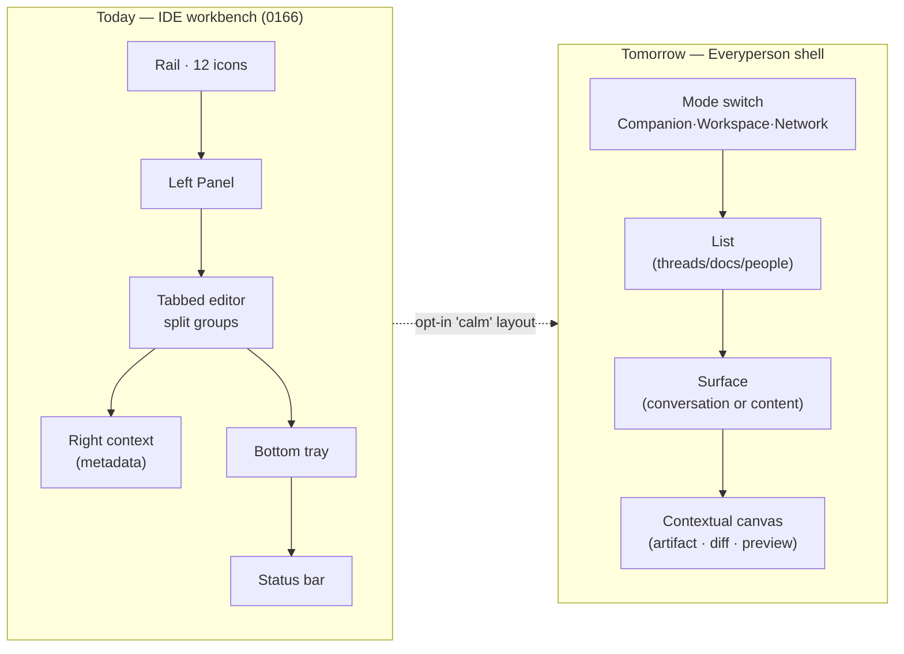
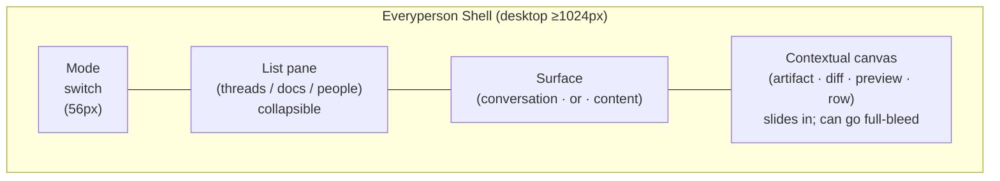
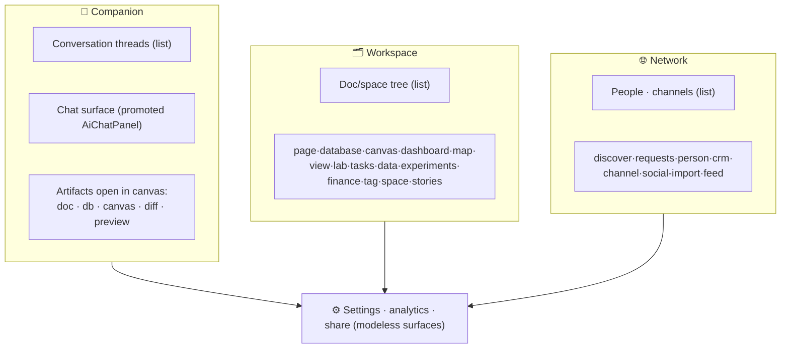
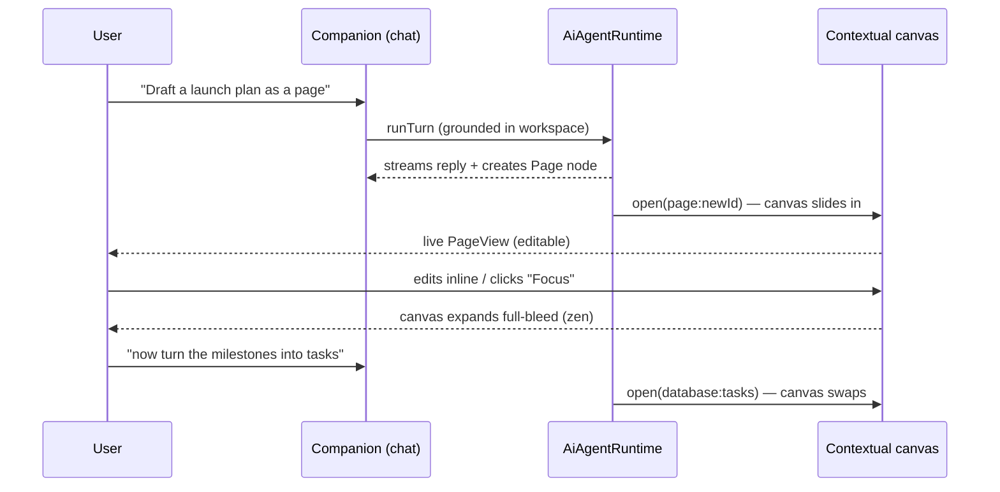
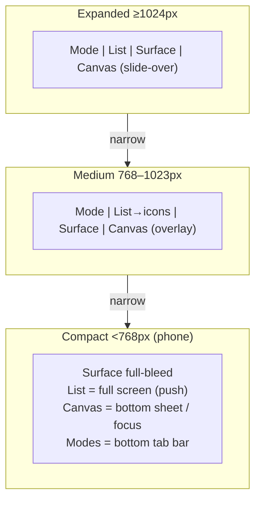
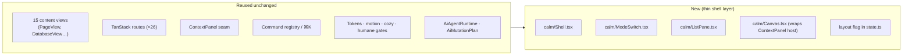

# The Everyperson Shell — A Claude-Desktop UI/UX for xNet (Desktop + Mobile)

## Problem Statement

xNet's shell is an IDE. The current workbench (exploration
[0166](0166_[x]_MINIMAL_WORKBENCH_SHELL_REDESIGN.md)) is a faithful, well-built
copy of VS Code's anatomy: a 44px icon **Rail**, a resizable **Left Panel**, a
**tabbed editor** with split groups and preview tabs, a **Bottom tray**, a
**Right context panel**, and a 24px **Status Bar**
([`apps/web/src/workbench/Workbench.tsx`](apps/web/src/workbench/Workbench.tsx)).
It is precise and powerful — and it asks the user to think like a developer.
There are tabs to manage, panels to toggle (`Mod+B`, `Mod+\`, `Mod+J`),
splitpanes to arrange, a zen mode, a focus ring (`F6`), and twelve icons in the
rail before you've done anything.

The user's reference point is the **Claude desktop app**: two calm regions — a
left sidebar for threads and a main conversation — and a **contextual right
panel** that opens *only when there's something to work on* (an artifact, a diff,
a document, a preview). Three top-level ways to work — **Chat**, **Cowork**, and
**Code** — each minimal, each adapting its chrome to its task. The complexity is
*there* (panes you can drag, diff viewers, terminals) but it stays **one
keystroke away** rather than always on screen.

Exploration [0232](0232_[_]_COZY_CALM_AND_AGENT_FIRST_A_DELIGHTFUL_PLACE_TO_SPEND_THE_DAY.md)
already named Claude Desktop as the north star and warmed the *surface* — a
`cozy` theme variant, a `comfortable` density, a display serif, an agent
"Companion." But 0232 explicitly **kept the IDE skeleton** ("the 0166 doctrine
stays the default; warmth is a choice"). This exploration asks the harder
question 0232 deferred:

> What if we re-architected the **shell itself** — not just its colors — around
> the Claude-Desktop grammar of *navigator · conversation · contextual canvas*,
> so xNet feels like a calm place an every-person wants to be, and the
> **mobile** app is the *same* design language rather than a separate
> sheet-driven shell?

## Executive Summary

The good news, again: **we don't need a rewrite.** The hard part — 15 content
views (`PageView`, `DatabaseView`, `CanvasView`, …), a router-authoritative
surface, a contextual panel that auto-populates from the active view, a deep
grounded AI runtime — already exists. What's wrong is the **composition**: the
arrangement reads as an IDE, and there are *two* shells to maintain (desktop grid
+ `MobileShell` sheets) that don't share a mental model.

The recommendation is a new **Everyperson Shell**: a single adaptive shell built
on the Claude-Desktop grammar, shipped as an **opt-in layout** (`layout: 'calm'`
vs the existing `layout: 'workbench'`), default for new users, with the
multi-pane workbench preserved one toggle away for power users — exactly the
opt-in doctrine 0166→0232 established for *theme*, now applied to *layout*.

Three structural moves:

1. **Three modes, not twelve icons.** Replace the dense Rail with a slim
   **mode switcher** for the three things xNet actually is — **Companion** (talk
   to your agent), **Workspace** (your pages/databases/canvases/tasks), and
   **Network** (people, channels, discover, CRM). Settings + identity at the
   bottom. This is xNet's analog of Chat / Cowork / Code.
2. **Conversation + contextual canvas.** In every mode the body is **two
   regions**: a left **list** (threads, documents, or people) and a main
   **surface**. A **contextual canvas** slides in from the right *only when
   there is an artifact to work on* — a page to edit, a diff to review, a
   database row, a map — and can expand to full-bleed **focus**. This is the
   Claude "artifact opens on the right" pattern, and it maps almost 1:1 onto our
   existing `ContextPanel` seam (we *invert* it: the canvas hosts the *content
   view*, the metadata moves into the conversation/inspector).
3. **One language, desktop → mobile.** The same three regions **reflow** by
   width instead of forking into a separate shell: desktop shows
   list + surface + canvas; tablet collapses the list to icons; phone makes the
   three modes a **bottom tab bar**, the list a full screen, and the canvas a
   bottom sheet — *the same components*, the same grammar, no `MobileShell`
   special case.



The throughline: **xNet should open like a conversation with a capable
collaborator, not like a code editor** — and it should feel like *one product*
whether you're at a 27″ display or a phone on the train.

## Current State In The Repository

### The shell is a VS Code clone (0166)

[`apps/web/src/workbench/Workbench.tsx`](apps/web/src/workbench/Workbench.tsx)
composes the desktop grid: `Rail` → `LeftPanelSlot` →
`center (editor + BottomPanelSlot)` → `RightPanelSlot` → `StatusBar`, all on
`react-resizable-panels`. Key pieces:

- **Rail** ([`Rail.tsx`](apps/web/src/workbench/Rail.tsx)) — a 44px icon strip
  with Search + six left-view items (`Explorer, Chats, Tasks, Today, Data, AI`) +
  CRM/Discover/Requests + plugin items + identity + settings. **Twelve+ targets
  before you do anything.** AI is *one of six* equal items behind a `Sparkles`
  glyph.
- **Tabbed editor** ([`tabs.ts`](apps/web/src/workbench/tabs.ts),
  [`TabBar.tsx`](apps/web/src/workbench/TabBar.tsx),
  [`EditorArea.tsx`](apps/web/src/workbench/EditorArea.tsx)) — preview tabs
  (single-click italic, double-click promote), split groups (`Mod+|`,
  `Mod+1/2`), pinned tabs, MRU recents. Pure VS Code muscle memory.
- **Right ContextPanel**
  ([`ContextPanel.tsx`](apps/web/src/workbench/ContextPanel.tsx),
  [`context-panel.tsx`](apps/web/src/workbench/context-panel.tsx)) — the active
  view publishes sections (`Properties`, `Comments`, `Backlinks`; database row
  detail; canvas selection) via a `useContextPanel(ownerId, sections)`
  contribution. **This is already a contextual right panel — it just shows
  *metadata*, not the *work product*.**
- **State** ([`state.ts`](apps/web/src/workbench/state.ts)) — a Zustand store
  (`xnet:workbench:v1`) holding `mode: 'default' | 'zen'`, `left/right/bottom`
  panel booleans, editor `groups`, tabs, pins, recents, shelf, `startupTab`.
- **Commands** ([`commands.ts`](apps/web/src/workbench/commands.ts)) —
  `toggleLeftPanel` `Mod+B`, `toggleRightPanel` `Mod+\`, `toggleBottomPanel`
  `Mod+J`, `zen` `Mod+.`, `splitEditor` `Mod+|`, `newPage` `Mod+T`, focus-ring
  `F6`. IDE keymap.

### There are *two* shells, not one

[`use-layout-mode.ts`](apps/web/src/workbench/use-layout-mode.ts) splits the
world at **768px** (`compact | medium | expanded`). Below it,
[`MobileShell.tsx`](apps/web/src/workbench/MobileShell.tsx) is a *separate*
composition: a 48px top bar, a full-bleed `EditorArea`, a 5-item `BottomNav`
(`Explorer, Search, New, Tasks, Settings`), and the Left/Right/Bottom panels
re-expressed as **Sheets**. It cleverly *reuses* the desktop bodies
(`EditorArea`, `PanelViewHost`, `ContextPanel`) — but the **arrangement and the
navigation model differ**, so the two don't feel like one product, and every new
shell affordance must be built twice. The expo native app
([`apps/expo/src/navigation/AppNavigator.tsx`](apps/expo/src/navigation/AppNavigator.tsx))
is a *third* model — React Navigation stacks over Home/Document/Database/Settings
screens.

### The home is a file list, not a welcome

[`apps/web/src/routes/index.tsx`](apps/web/src/routes/index.tsx) renders **"All
Documents"** — a flat list of pages/databases/canvases with a `New` menu. Cold,
file-manager-shaped. (It also still speaks the *legacy* token vocabulary —
`border-border`, `bg-primary`, `text-muted-foreground` — which alias onto the
0166 ramp in [`tokens.css`](packages/ui/src/theme/tokens.css) but reveal two
coexisting naming layers.)

### The 26 destinations any redesign must absorb

The shell currently routes **26** top-level surfaces
([`apps/web/src/routes/`](apps/web/src/routes/)). Fifteen are *tab-backed
content* (`doc, db, canvas, dashboard, map, view, channel, tag, person, lab,
space, tasks, data, experiments, crm, finance`); the rest are *chrome surfaces*
(`/` home, `discover`, `requests`, `settings`, `analytics`, `welcome`, `share`,
`social-import`, `stories`). **A "two-panel" redesign cannot delete these — it
must give each a home in the new grammar.** The mapping is the crux of this
exploration (see [Recommendation](#recommendation)).

### The design language already supports opt-in variants

- **Tokens** ([`tokens.css`](packages/ui/src/theme/tokens.css)) — one APCA-tuned
  monochrome ramp (`--surface-0/1/2`, `--ink-1/2/3`, `--hairline`,
  `--accent-ink`), "chrome may not have hue; hue belongs to data." Variants layer
  via `html[data-variant='…']` (`linear`, `true-black`, and from 0232 `cozy`).
- **Density** — `--rail-width`, `--density-pad`, `--font-ui-size` flip under
  `[data-density='comfortable']` (0232).
- **Motion** ([`motion.css`](packages/ui/src/theme/motion.css)) — "two laws"
  (enter slow+decelerate, exit fast+accelerate), a fixed vocabulary
  (`fade/scale/slide/collapse/pop`), enforced by
  [`scripts/check-motion-vocab.mjs`](scripts/check-motion-vocab.mjs)
  (bans `transition-all`, raw durations, `ease-bounce`).
- **Humane charter** (exploration
  [0234](0234_[_]_MITIGATING_INTERNET_HARMS_A_NEO_LUDDITE_AUDIT_OF_XNET.md)) —
  `check-humane-patterns.mjs`, chronological feeds, capped notifications, a
  `WinddownOverlay`, "right to leave." **Any new shell must keep passing these
  gates** (e.g. no infinite-scroll dark patterns, no badge-count anxiety).

The substrate for an opt-in *layout* variant is therefore identical to the one
that already ships an opt-in *theme* variant. That is the whole reason this is
incremental, not a rewrite.

### The UI primitives the new grammar needs already exist

`packages/ui` ships ~73 components, including **every primitive the calm shell
and its responsive reflow require**: `Sheet` + `BottomNav` (the phone canvas and
mode bar), `Tabs` (canvas Artifact/Inspector), `Command`/`CommandPalette` (the
`⌘K` power surface), `TreeView` (the Workspace doc tree), `ResponsiveSidebar`/
`ResponsiveDialog`/`ResponsiveTable`, `Skeleton`/`EmptyState` (calm loading), and
`<Presence>` ([`packages/ui/src/motion/Presence.tsx`](packages/ui/src/motion/Presence.tsx))
— the universal enter/exit wrapper the canvas slide-in should use. Breakpoints
come from `useMediaQuery` (`useIsMobile/Tablet/Desktop`) and runtime theming from
`ThemeProvider` (`variant`/`density` axes — a `layout` axis is the natural
sibling, though layout is *composition*, so it lives in the workbench store, not
CSS). **We assemble, we don't build.**

## External Research

### How the Claude desktop app is actually structured

From Anthropic's own docs and the April 2026 redesign writeups:

- **Three modes** — **Chat** (minimal conversation; quick entry, dictation,
  connectors), **Cowork** (sustained research/analysis; the sidebar shows "the
  task come together: sources it's drawing from, files taking shape, progress
  through the plan"), and **Code** (full dev environment; Ask / Code / Plan
  stances). Each mode *adapts its chrome to its workflow* rather than imposing
  one layout. ([navigating-the-claude-desktop-app](https://claude.com/resources/tutorials/navigating-the-claude-desktop-app))
- **Layout philosophy** — "show what matters and give control where you need
  it." Sidebar = navigation + task/session list + status filters; main panel =
  the active conversation/task; **contextual panels** (diffs, artifacts,
  previews) surface *within the working area as needed* rather than living on
  screen permanently.
- **Artifacts** — when Claude produces substantial standalone content (code,
  HTML, SVG, Mermaid, a React component, formatted Markdown), **a side panel
  opens with a live preview** that can be rendered, edited, and exported.
- **Code panes** — chat, diff, preview, terminal, file, plan, tasks, subagent —
  are **drag-and-drop**, repositionable, resizable, saved *per repo*. Power is
  present but **arranged by the user**, default layout is sane. Side chats
  (`⌘+;`) branch without polluting the main thread; sessions auto-archive when a
  PR merges. ([claude-code-desktop-redesign](https://claude.com/blog/claude-code-desktop-redesign))

The pattern that matters for xNet: **conversation is the default surface; the
"workspace" (artifact/diff/preview) is summoned contextually and can grow to
fill the screen when you want to focus on it.** That's the inverse of our
current "content is center, AI is a buried side panel."

### Conversation-first, but hybrid

Conversational-UI research is consistent: the strongest pattern is **not** chat
*replacing* UI, but a **two-column hybrid** — navigation/threads left, a
conversation that can render **structured UI** (cards, buttons, embedded views)
right — letting users switch between typing and clicking by whatever's fastest.
([Built In](https://builtin.com/articles/design-conversation-first-web-experiences),
[aiuxdesign.guide](https://www.aiuxdesign.guide/patterns/conversational-ui),
[designproject.io — four stages of AI-native UI](https://designproject.io/blog/ai-ux-beyond-chatbot/))

### Progressive disclosure resolves "everyperson *and* power user"

The classic tension — simple for newcomers, deep for experts — is solved by
**progressive disclosure**: show the few most-important options first, reveal
specialized power on request. NN/g's canonical example *is* Linear's `⌘K`
("power lives one keystroke away, the surface stays clean") and Notion's database
views ("the table is the summary; click a row, the full record opens").
([NN/g](https://www.nngroup.com/articles/progressive-disclosure/),
[IxDF](https://ixdf.org/literature/topics/progressive-disclosure)) This is the
license to make the *default* calm while keeping splitpanes, multi-tab, and the
full workbench available behind a toggle/command.

### Prior art to borrow specifics from

| Product | Borrow |
| --- | --- |
| **Claude Desktop** | Three modes; conversation default; artifact-opens-right; contextual not permanent chrome; session auto-archive |
| **Linear** | `⌘K` as the power surface; clean default; keyboard-first but mouse-friendly |
| **Notion** | Table-as-summary → row-as-detail (progressive disclosure for our databases); a warm, document-first home |
| **Things / Craft / Bear** | Calm consumer typography, generous whitespace, "a room you want to be in" |
| **Apple HIG** | Deference (content over chrome), depth (the canvas slides over, not replaces), spring on direct manipulation only |

## Key Findings

1. **The contextual right panel already exists** — `ContextPanel` +
   `useContextPanel` is the exact seam Claude uses for artifacts. We don't build
   it; we **re-purpose** it to host the *content view* (the work product), not
   just metadata.
2. **Every content view is already a self-contained component** —
   `ViewHost`/`HOSTED_VIEWS` proves `PageView(docId)`, `DatabaseView(docId)`,
   etc. mount standalone. The new shell can host them **unchanged**; only the
   frame around them changes. This is what makes a non-rewrite possible.
3. **Routing is authoritative and decoupled from layout** — the store reconciles
   to the URL (`syncRouteToTabs`), so we can swap the *visual* shell while
   keeping all 26 routes, deep links, and back/forward intact.
4. **We already ship opt-in variants** — `data-variant`/`data-density` prove the
   pattern for shipping a second mood without disturbing the first. A
   `layout: 'calm' | 'workbench'` setting is the same move at the composition
   layer.
5. **Mobile is a fork today** — `MobileShell` is a *parallel* shell. The biggest
   integration win is **collapsing desktop + mobile into one responsive grammar**
   so there's one product and one codebase of shell affordances.
6. **The AI is buried and reply-only** — 0232 diagnosed this; the new shell
   makes the Companion a **first-class mode**, which is also the cleanest home
   for the already-built (but hidden) `AiMutationPlan` plan→approve→apply flow.
7. **Humane gates constrain the redesign in a *good* way** — no badge anxiety, no
   infinite scroll, chronological feeds, wind-down. The calm shell should *lean
   into* these, not fight them.

## Options And Tradeoffs

### Axis 1 — How to introduce the new shell

| Option | What it is | Pros | Cons |
| --- | --- | --- | --- |
| **A. Opt-in `calm` layout, default for new users** ✅ | New shell composition alongside the workbench; a setting/command flips between them; reuses all views | Zero risk to power users; reversible; ships incrementally; mirrors the proven variant doctrine | Two shells to maintain during transition; must keep both green |
| **B. Big-bang replacement** | Delete the workbench grid, ship only the calm shell | One shell; forces clarity | High risk across 26 routes; alienates the VS-Code muscle memory the repo deliberately built; hard to stage |
| **C. Evolve the workbench in place** | Promote AI to center, shrink rail to modes, demote tabs — but keep one shell | One shell, gradual | Half-measures read as neither IDE nor calm; the tab/splitpane DNA fights the conversation model |

### Axis 2 — What the primary surface is

| Option | What it is | Pros | Cons |
| --- | --- | --- | --- |
| **D. Conversation-default, content-on-demand** ✅ | Companion mode is the landing; content opens as a contextual canvas; Workspace mode for direct browsing | Matches Claude; everyperson-friendly; foregrounds the agent | Direct editors must feel first-class too (mitigated: Workspace mode + full-bleed focus) |
| **E. Content-default, AI-on-demand (today, dressed up)** | Keep content center, make AI a nicer side panel | Least change | Doesn't deliver the requested feeling; AI stays secondary |
| **F. Two equal panes always (chat ‖ content)** | Permanent split like some AI IDEs | Always-available AI | Cramped on laptops/phones; not minimal; high cognitive load |

### Axis 3 — The top-level navigation metaphor

| Option | What it is | Pros | Cons |
| --- | --- | --- | --- |
| **G. Three modes: Companion · Workspace · Network** ✅ | xNet's analog of Chat/Cowork/Code | Maps to what xNet *is* (agent + content + people); collapses the 12-icon rail; same on mobile as a tab bar | Requires assigning all 26 routes to a mode |
| **H. Keep the flat rail, restyle it** | Same items, warmer | Cheap | Still 12 targets; still IDE-shaped |
| **I. Pure command-bar (no persistent nav)** | Everything via `⌘K` | Ultra-minimal | Too sparse for newcomers; discoverability cliff |

### Axis 4 — Desktop ↔ mobile

| Option | What it is | Pros | Cons |
| --- | --- | --- | --- |
| **J. One responsive shell (regions reflow by width)** ✅ | The three regions adapt; modes become a bottom tab bar on phones; canvas becomes a sheet | One product, one mental model, one codebase of affordances; the seamless feel the user asked for | Must design the reflow rules carefully; retire `MobileShell` gradually |
| **K. Keep separate `MobileShell`** | Status quo | Already works | Two shells diverge; every affordance built twice |

**Chosen: A + D + G + J** — an opt-in `calm` layout, conversation-default with
an on-demand canvas, three modes, one responsive grammar. It's the only
combination that delivers the requested *feeling* and the *seamless desktop↔mobile
integration* while respecting the disciplined system and shipping incrementally.

## Recommendation

Build the **Everyperson Shell** as a new composition under
`apps/web/src/workbench/calm/` (sibling to the existing files), selected by a new
`layout` field in the workbench store, **default `'calm'` for new identities**,
with **`'workbench'` one command away** (`View: Switch to Pro layout`, also in
Settings). Reuse every existing view, the router, the `ContextPanel` seam, the
command registry, and the theme/motion/humane systems unchanged.

### The shell grammar



- **Mode switch** (replaces `Rail`): three primary modes + Settings/identity at
  the bottom. Calm, labeled-on-hover, no badge counts on the primary modes
  (humane charter). `⌘K` palette is the power surface for everything else.
- **List pane** (replaces `Explorer`/left views): content depends on the mode —
  conversation **threads** (Companion), a **document/space tree** (Workspace),
  **people/channels** (Network). Collapsible to a hairline (`⌘\` or click the
  mode again — preserves VS-Code muscle memory).
- **Surface**: the main region. In Companion it's the **conversation**
  (the promoted `AiChatPanel` → full Companion). In Workspace/Network it's a
  **content view or list** (today's `EditorArea` body, minus the tab strip by
  default).
- **Contextual canvas** (re-purposes `ContextPanel`): opens when there's an
  artifact to work on. The agent opening a page, you clicking a database row, a
  diff to review, a map, a dashboard — all render *here*, and a **focus** button
  expands it to full-bleed (today's `zen`). Metadata (properties/comments/
  backlinks) becomes an **inspector tab** within the canvas, not a separate panel.

### The three modes and where the 26 routes live



Every current route keeps its URL; it simply renders **inside** the mode's
surface or the canvas. Singletons (`tasks`, `data`, `crm`, `finance`) become the
default surface of their mode's relevant section. Nothing is deleted.

### How an artifact opens (the Claude move)



This is the existing `AiMutationPlan` **plan → approve → apply** lifecycle (built
but hidden, per 0232) finally given a home: the plan renders as a review card in
the conversation; approving it applies and **opens the result in the canvas**.

### One responsive grammar (desktop → mobile)



The phone layout is **the same three regions and the same three modes**, not a
separate shell: modes drop to a thumb-reach **bottom tab bar**, the list becomes
a full screen you push into, and the canvas is a **bottom sheet** that can go
full-screen focus — reusing the `Sheet`/`BottomNav` primitives `MobileShell`
already uses, but now expressing the *same* navigation model as desktop. This is
the path to retiring `MobileShell` and unifying with the
[mobile webview shell (0238)](0238_[_]_MOBILE_APP_PARITY_HOSTING_THE_WEB_UI_IN_A_NATIVE_WEBVIEW_SHELL.md);
the expo native app can adopt the same three-mode model.

### Why this is incremental, not a rewrite



### Phased delivery

- **Phase 0 — Foundations.** Add `layout: 'calm' | 'workbench'` to the store +
  a `View: Switch layout` command + Settings toggle. Scaffold
  `workbench/calm/Shell.tsx` rendering today's content for one mode only behind a
  flag. No user-visible default change yet.
- **Phase 1 — Companion mode.** Promote `AiChatPanel` to a full conversation
  surface (threads list + composer + streaming "thinking" copy from 0232).
  Wire **artifact-opens-in-canvas** via the existing `ContextPanel` host. Ship
  behind the flag.
- **Phase 2 — Workspace mode.** Document/space tree in the list; content views in
  the surface; **focus** (reuse `zen`) and the metadata inspector in the canvas.
  Make `calm` the **default for new identities**.
- **Phase 3 — Network mode.** People/channels/discover/CRM under one mode with a
  calm, chronological, humane feed.
- **Phase 4 — One responsive grammar.** Make the three regions reflow to the
  bottom-tab phone layout; **retire `MobileShell`** when parity is proven;
  align the expo app's navigation to the three modes.
- **Phase 5 — Plan→approve→apply.** Surface `AiMutationPlan` as a review card in
  Companion; approving opens the result in the canvas (the 0232 Movement-3
  payoff, now with a natural home).

## Example Code

A sketch of the layout flag and the shell entry point (illustrative, not final):

```ts
// apps/web/src/workbench/state.ts — add to WorkbenchState
type ShellLayout = 'calm' | 'workbench'
type Mode = 'companion' | 'workspace' | 'network'

interface CalmState {
  layout: ShellLayout            // default 'calm' for new identities
  mode: Mode                     // active primary mode
  listOpen: boolean              // collapsible list pane
  canvas: { open: boolean; focus: boolean } // contextual canvas + full-bleed
}

// setLayout / setMode / toggleList / openCanvas(target) / setCanvasFocus(b)
```

```tsx
// apps/web/src/workbench/Workbench.tsx — branch on the layout flag
export function Workbench({ children }: { children: ReactNode }) {
  const compact = useIsCompact()
  const layout = useWorkbench((s) => s.layout)
  if (layout === 'calm') return <CalmShell compact={compact}>{children}</CalmShell>
  // existing power-user path, unchanged:
  return compact ? <MobileShell>{children}</MobileShell> : <DesktopWorkbench>{children}</DesktopWorkbench>
}
```

```tsx
// apps/web/src/workbench/calm/Shell.tsx — the three-region grammar (desktop)
export function CalmShell({ children, compact }: { children: ReactNode; compact: boolean }) {
  const { mode, listOpen, canvas } = useWorkbench(selectCalm)
  if (compact) return <CalmMobile mode={mode}>{children}</CalmMobile> // same modes, bottom-tab reflow
  return (
    <div className="flex h-dvh">
      <ModeSwitch />                                  {/* replaces Rail */}
      {listOpen && <ListPane mode={mode} />}          {/* threads / docs / people */}
      <Surface mode={mode}>{children}</Surface>       {/* conversation or content */}
      {canvas.open && <Canvas focus={canvas.focus} />}{/* re-purposed ContextPanel host */}
    </div>
  )
}
```

```tsx
// The canvas hosts the *content view*, not just metadata — inverting today's
// ContextPanel. Metadata becomes an inspector tab alongside the artifact.
function Canvas({ focus }: { focus: boolean }) {
  const target = useWorkbench((s) => s.canvas.target) // e.g. { type: 'page', id }
  return (
    <aside className={focus ? 'fixed inset-0 z-40 bg-surface-0' : 'w-[clamp(360px,42vw,720px)]'}>
      <CanvasTabs />            {/* Artifact · Inspector(properties/comments/backlinks) */}
      <HostedView target={target} /> {/* reuses ViewHost's HOSTED_VIEWS map */}
    </aside>
  )
}
```

## Risks And Open Questions

- **Two shells during transition.** `calm` + `workbench` both have to stay green
  (and `MobileShell` until Phase 4). Mitigation: shared view components +
  Playwright matrices per layout; treat `workbench` as frozen-but-supported.
- **Power-user revolt.** Tabs, splitpanes, focus-ring, zen are deliberate (0166).
  Mitigation: `workbench` stays a first-class toggle; `calm` adds `⌘K`,
  full-bleed focus, and keeps the keymap where it maps.
- **Direct editing must not feel second-class.** Conversation-default risks
  making "I just want to write a doc" feel indirect. Mitigation: Workspace mode +
  clicking a doc opens it directly in a full-bleed canvas; the conversation is
  *available*, not *mandatory*.
- **Route-to-mode assignment is opinionated.** Where does `tag`/`stories`/`lab`
  live? Open question — needs a concrete route→mode table reviewed against real
  usage. Singletons and edge surfaces (`analytics`, `share`) may be **modeless**
  (full-window) rather than forced into a mode.
- **Mobile parity is a known hard problem** (0238). The canvas-as-sheet and
  list-as-push must handle the Base UI backdrop tap-through bug `MobileShell`
  already documents.
- **Humane gates.** The Network feed must stay chronological/capped; the
  Companion must respect wind-down and not become an engagement loop. Run
  `check-humane-patterns.mjs` against the new shell.
- **Token vocabulary cleanup.** The calm shell is the moment to retire legacy
  `border-border`/`bg-primary` usage in favor of `surface/ink` (or formally bless
  the aliases). Out of scope to *force*, but the new files should be exemplary.
- **Discoverability vs minimalism.** Three modes + `⌘K` must not hide the 26
  surfaces so well that users can't find them. Mitigation: a searchable
  "Everything" view + onboarding coachmarks (0206) retargeted to modes.

## Implementation Checklist

- [x] **Phase 0:** Add `layout: 'calm' | 'workbench'`, `mode`, `listOpen`,
  `canvas` to [`state.ts`](apps/web/src/workbench/state.ts) (persist v2; migrate
  v1).
- [x] **Phase 0:** `View: Switch layout` command + Settings toggle; default
  `calm` for identities with no persisted layout.
- [x] **Phase 0:** Scaffold `workbench/calm/Shell.tsx`, `ModeSwitch.tsx`,
  `ListPane.tsx`, `Surface.tsx`, `Canvas.tsx`; branch in
  [`Workbench.tsx`](apps/web/src/workbench/Workbench.tsx).
- [x] **Phase 1:** Promote `AiChatPanel` → full Companion surface (threads list,
  composer, streaming "thinking" microcopy); reuse `AiAgentRuntime`.
- [x] **Phase 1:** `openCanvas(target)` hosts content views via the existing
  `ContextPanel`/`ViewHost` `HOSTED_VIEWS` map; `focus` reuses `zen`.
- [x] **Phase 2:** Workspace list (doc/space tree from `Explorer` parts);
  route content views into the surface; metadata → canvas **Inspector** tab.
- [x] **Phase 2:** Make `calm` the default for new identities; keep `workbench`
  reachable.
- [x] **Phase 2:** Define + implement the **route→mode** table for all 26 routes
  (incl. modeless surfaces).
- [x] **Phase 3:** Network mode (discover/requests/person/crm/channel) with a
  chronological, humane feed.
- [x] **Phase 4:** Responsive reflow → bottom-tab phone layout; **retire
  `MobileShell`** behind a flag once parity passes.
- [ ] **Phase 4:** Align expo `AppNavigator` to the three modes.
- [ ] **Phase 5:** Surface `AiMutationPlan` plan→approve→apply as a Companion
  review card that opens results in the canvas.
- [ ] Onboarding coachmarks (0206) retargeted to modes; `⌘K` "Everything"
  search for discoverability.

## Validation Checklist

- [x] **Parity:** every one of the 26 routes is reachable and renders correctly
  in `calm` (deep links, back/forward, share links intact).
- [x] **Toggle:** switching `calm ↔ workbench` is lossless (same active content,
  no data loss, persisted per identity).
- [x] **Responsive:** the same three modes + grammar verified at 1440 / 900 /
  390px via Playwright + `preview_resize`; no separate-shell regressions; canvas
  sheet has no backdrop tap-through.
- [ ] **Agent flow:** "draft a page / make tasks" opens the artifact in the
  canvas; `focus` goes full-bleed and restores; plan→approve→apply works.
- [x] **Humane gates:** `check-humane-patterns.mjs` and `check-motion-vocab.mjs`
  pass on all `calm/` files; Network feed is chronological/capped; wind-down
  honored; no badge-count anxiety on primary modes.
- [x] **A11y:** one `<main>` landmark; full keyboard nav (mode switch, list,
  surface, canvas) and focus ring; `prefers-reduced-motion` respected.
- [x] **Theme:** `calm` shell looks right under default + `cozy` variant + dark +
  `true-black` + `comfortable` density; uses `surface/ink` tokens only.
- [ ] **Perf:** no boot-timeline regression (0204/0212); canvas mount is lazy;
  conversation streaming stays smooth.
- [ ] **Tests green:** new shell unit/integration tests; existing workbench
  tests still pass (both layouts supported).

## References

### Repository
- [`apps/web/src/workbench/Workbench.tsx`](apps/web/src/workbench/Workbench.tsx) · [`Rail.tsx`](apps/web/src/workbench/Rail.tsx) · [`MobileShell.tsx`](apps/web/src/workbench/MobileShell.tsx) · [`ContextPanel.tsx`](apps/web/src/workbench/ContextPanel.tsx) · [`EditorArea.tsx`](apps/web/src/workbench/EditorArea.tsx) · [`ViewHost.tsx`](apps/web/src/workbench/ViewHost.tsx) · [`tabs.ts`](apps/web/src/workbench/tabs.ts) · [`state.ts`](apps/web/src/workbench/state.ts) · [`commands.ts`](apps/web/src/workbench/commands.ts) · [`use-layout-mode.ts`](apps/web/src/workbench/use-layout-mode.ts)
- [`apps/web/src/workbench/views/AiChatPanel.tsx`](apps/web/src/workbench/views/AiChatPanel.tsx) · [`context-panel.tsx`](apps/web/src/workbench/context-panel.tsx) · [`contributions.tsx`](apps/web/src/workbench/contributions.tsx)
- [`apps/web/src/routes/`](apps/web/src/routes/) (26 routes) · [`index.tsx`](apps/web/src/routes/index.tsx) · [`welcome.tsx`](apps/web/src/routes/welcome.tsx)
- [`packages/ui/src/theme/tokens.css`](packages/ui/src/theme/tokens.css) · [`motion.css`](packages/ui/src/theme/motion.css) · [`scripts/check-motion-vocab.mjs`](scripts/check-motion-vocab.mjs) · `scripts/check-humane-patterns.mjs`
- [`apps/expo/src/navigation/AppNavigator.tsx`](apps/expo/src/navigation/AppNavigator.tsx)

### Prior explorations
- [0166 — Minimal Workbench Shell Redesign](0166_[x]_MINIMAL_WORKBENCH_SHELL_REDESIGN.md) (the current IDE shell)
- [0232 — Cozy, Calm, and Agent-First](0232_[_]_COZY_CALM_AND_AGENT_FIRST_A_DELIGHTFUL_PLACE_TO_SPEND_THE_DAY.md) (warmth + Companion; this doc is its structural sibling)
- [0234 — Neo-Luddite Humane Audit](0234_[_]_MITIGATING_INTERNET_HARMS_A_NEO_LUDDITE_AUDIT_OF_XNET.md) (charter gates the new shell must keep passing)
- [0238 — Mobile App Parity (webview shell)](0238_[_]_MOBILE_APP_PARITY_HOSTING_THE_WEB_UI_IN_A_NATIVE_WEBVIEW_SHELL.md)
- 0196 — Mobile Adaptive Shell (origin of `MobileShell`; `apps/web/src/workbench/MobileShell.tsx`)

### External
- [Navigating the Claude desktop app — Chat, Cowork, Code](https://claude.com/resources/tutorials/navigating-the-claude-desktop-app)
- [Redesigning Claude Code on desktop for parallel agents](https://claude.com/blog/claude-code-desktop-redesign)
- [Claude Code Desktop — Anthropic docs](https://code.claude.com/docs/en/desktop)
- [NN/g — Progressive Disclosure](https://www.nngroup.com/articles/progressive-disclosure/) · [IxDF — Progressive Disclosure](https://ixdf.org/literature/topics/progressive-disclosure)
- [Built In — Designing conversation-first web experiences](https://builtin.com/articles/design-conversation-first-web-experiences) · [AI UX Design Guide — Conversational UI](https://www.aiuxdesign.guide/patterns/conversational-ui) · [designproject.io — Four stages of AI-native UI](https://designproject.io/blog/ai-ux-beyond-chatbot/)
