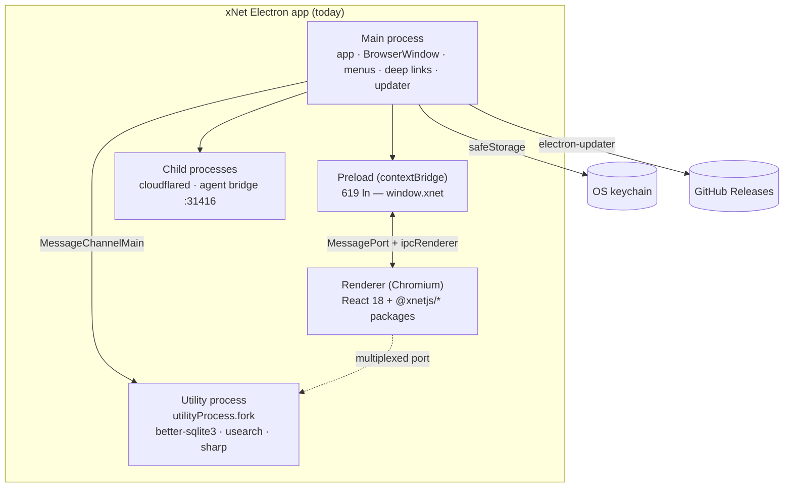
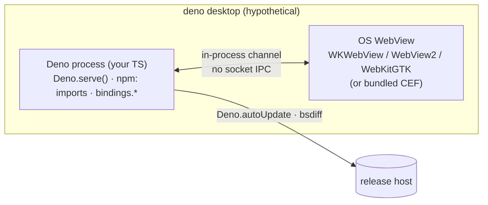
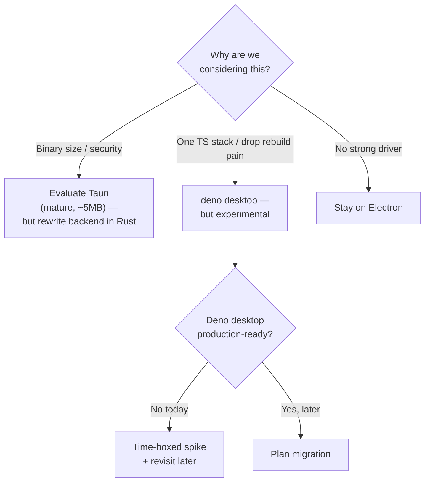
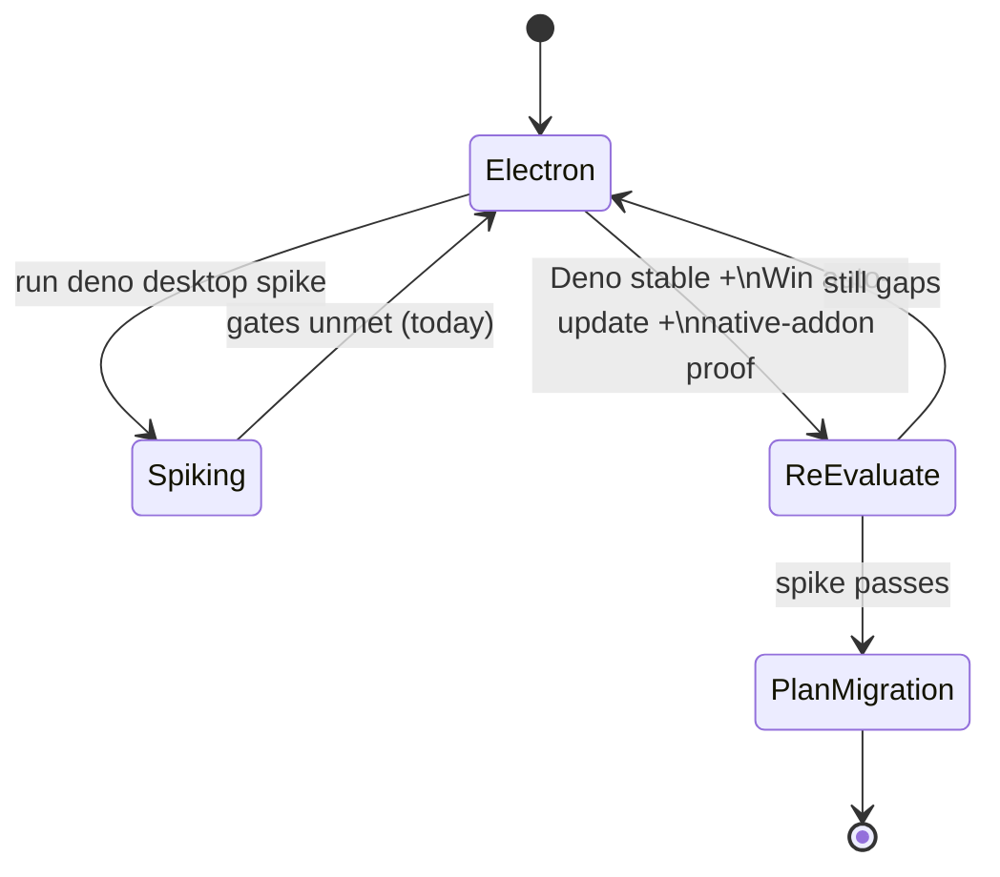

# Electron → Deno Desktop: Should We Switch?

> Status: `[_]` exploration. Prompt: *"should we switch from electron to deno
> desktop?"* (<https://docs.deno.com/runtime/desktop/>).
> Date: 2026-06-29.

## Problem Statement

Deno 2.9 (released 2026-06-25) shipped an experimental `deno desktop` command
that turns a Deno project — "anything from a single TypeScript file to a Next.js
app" — into a self-contained desktop binary, using the OS webview by default and
**in-process bindings instead of socket IPC**. Its pitch is aimed squarely at
Electron's pain points: huge binaries, native-module rebuild hell, no built-in
update story.

xNet ships a real Electron desktop app today (`apps/electron`, ~7k lines of
main/preload/data-process code, the *primary development target* per its README).
The question: is the appeal of a single-stack TypeScript runtime with smaller
binaries worth migrating off a mature, deeply-integrated Electron foundation —
now, later, or never?

## Executive Summary

**Recommendation: do not switch now. Stay on Electron.** Decouple from
Electron-specific APIs where cheap, run a *time-boxed spike* of `deno desktop`
wrapping the existing `apps/web` SPA to gather real numbers, and re-evaluate when
Deno desktop reaches three gates: **(1) stable (not experimental), (2) Windows
auto-update + MSI, (3) a proven native-addon story for `better-sqlite3`-class
modules.**

Three findings drive this:

1. **Deno desktop is experimental.** Deno's own docs say config keys and APIs
   "may still change" and to "treat `deno desktop` as a capable preview, not a
   production target." It needs `deno upgrade canary` to even try today.
2. **It can't yet ship what we already ship.** No Windows auto-update, no MSI, no
   Linux `.deb`/`.rpm`. We currently ship Windows NSIS + Linux AppImage/deb with
   `electron-updater` GitHub-Releases auto-update across all three platforms
   (`apps/electron/electron-builder.json5`, `apps/electron/src/main/updater.ts`).
   Migrating *loses* shipping capability on day one.
3. **Our architecture is Electron-shaped.** A separate SQLite **utility process**
   (`utilityProcess.fork` + `MessageChannelMain`), a 619-line `contextBridge`
   preload, `safeStorage` keychain encryption, deep-link protocol registration,
   and three native node addons (`better-sqlite3`, `usearch`, `sharp`). Deno
   desktop's in-process binding model is a *different* architecture, not a drop-in
   swap.

The upside is real and worth tracking — smaller binaries, no `@electron/rebuild`
step, one TS stack, cross-compile from one machine — but the cost/risk today is
high and the maturity is low.

## Current State In The Repository

xNet has **two** web frontends sharing the `@xnetjs/*` packages:

- `apps/electron/src/renderer/` — the Electron renderer (React 18 + TanStack
  Router + Tailwind).
- `apps/web/src/` — a Vite SPA that also powers the **Capacitor mobile webview
  shell** (`apps/web/src/native/`, see exploration 0238) and the new "everyperson
  calm shell" (`apps/web/src/workbench/calm/`, 0250).

The Electron app is not a thin wrapper — it carries substantial native logic:

| Surface | File(s) | What it does | Electron API |
| --- | --- | --- | --- |
| Main entry | `apps/electron/src/main/index.ts` (326 ln) | window, lifecycle, deep links, wiring | `app`, `BrowserWindow` |
| **Data process** | `apps/electron/src/main/data-process-manager.ts` (582 ln) + `src/data-process/data-service.ts` (1894 ln) | SQLite in a **separate process**, crash-restart, port multiplexing | `utilityProcess.fork`, `MessageChannelMain` |
| Preload bridge | `apps/electron/src/preload/index.ts` (619 ln) | exposes `window.xnet`, marshals MessagePorts | `contextBridge`, `ipcRenderer` |
| Secure seed | `apps/electron/src/main/secure-seed.ts` | encrypts the mnemonic at rest | `safeStorage` |
| Auto-update | `apps/electron/src/main/updater.ts` (166 ln) | GitHub Releases | `electron-updater` |
| Menus | `apps/electron/src/main/menu.ts` | native menu bar | `Menu`, `shell` |
| Cloudflare tunnel | `apps/electron/src/main/cloudflare-tunnel-manager.ts` (417 ln) | spawns `cloudflared` child process | `node:child_process` |
| Local API server | `apps/electron/src/main/local-api.ts` (302 ln) | HTTP control surface | `node:http`-ish |
| Agent bridge | `apps/electron/src/main/agent-bridge-manager.ts` | drives `:31416` BYO-agent daemon | child process |
| Social import | `apps/electron/src/main/social-import-ipc.ts` (608 ln) | archive ingest | fs/IPC |
| Packaging | `apps/electron/electron-builder.json5` | dmg/zip, NSIS, AppImage/deb | `electron-builder` |

Native addons (rebuilt per-platform via `pnpm dlx @electron/rebuild -f -w
better-sqlite3,usearch,sharp`):

- **`better-sqlite3`** — the storage engine (`src/main/storage.ts`,
  `src/data-process/`). Synchronous, node-gyp built.
- **`usearch`** — in-browser/in-process vector index for `@xnetjs/brain` GraphRAG
  (known to break Vite → externalized; see memory 0211).
- **`sharp`** — image processing.



The defining trait: **SQLite runs in its own OS process**, and the renderer talks
to it over a multiplexed `MessagePort`. This is an Electron-specific concurrency
model (`utilityProcess` + `MessageChannelMain`), chosen so heavy DB work never
blocks the UI thread.

## External Research

`deno desktop` shipped in **Deno 2.9** (2026-06-25), explicitly experimental.



Key facts (Deno docs + 2.9 blog + third-party comparisons):

- **Rendering:** OS webview by default (WKWebView / WebView2 / WebKitGTK) →
  ~40 MB binaries; optional bundled **CEF (Chromium)** for pixel-identical
  rendering → ~150–308 MB.
- **Backend↔UI:** **in-process bindings** (`bindings.<name>()`,
  `Deno.BrowserWindow`, `Deno.serve()` auto-bound to the webview) instead of
  socket IPC.
- **Framework auto-detect:** Next.js, Astro, Fresh, Remix, Nuxt, SvelteKit,
  SolidStart, TanStack Start, **Vite SSR**.
- **Node/npm compat:** "full Node compatibility… including `npm:` imports in your
  handlers." Native node-gyp addons are *not* explicitly addressed.
- **Auto-update:** built-in bsdiff patching + rollback — **but no Windows
  auto-update**, no MSI, no `.deb`/`.rpm` outputs yet.
- **Signing:** macOS "ad-hoc by default"; one-step notarization not yet available.
- **Maturity:** "the command, config keys, and TypeScript APIs may still change…
  treat `deno desktop` as a capable preview, not a production target."

### Framework landscape (from Deno's own comparison page + 2026 surveys)

| Aspect | Electron | Deno Desktop | Tauri v2 | Electrobun | Wails |
| --- | --- | --- | --- | --- | --- |
| Language | JS/TS (Node) | JS/TS (Deno) | Rust + web | JS/TS (Bun) | Go + web |
| Web engine | Bundled Chromium | OS WebView / CEF | OS WebView | OS WebView | OS WebView |
| App size | ~100 MB+ | ~40 MB / ~150 MB (CEF) | ~2–10 MB | ~61 MB | ~5–10 MB |
| Backend↔UI | socket IPC | **in-process** | socket IPC | socket IPC | bindings |
| npm ecosystem | ✅ native | ✅ (`npm:`) | ❌ | ✅ | ❌ |
| Native node addons (`better-sqlite3`) | ✅ (`@electron/rebuild`) | ⚠️ unproven | ❌ (use `rusqlite`) | ⚠️ | ❌ |
| Built-in auto-update | via `electron-updater` | ✅ (no Windows yet) | ✅ (plugin) | ✅ | ⚠️ |
| Signing/notarization | mature | ad-hoc/manual | maturing | early | maturing |
| Maturity | **production, years** | **experimental (2.9)** | production | early | production |

The honest read: if the *only* goal were "leave Chromium-bloat behind," **Tauri**
is the mature option — but it throws away the entire JS backend ecosystem
(`better-sqlite3`, `usearch`, `sharp`, all `@xnetjs/*` node code) for Rust. Deno
desktop is the only contender that keeps the JS-everywhere story *and* shrinks the
binary — it's just a month old.

## Key Findings

1. **The webview-vs-Chromium tradeoff cuts against us.** Electron's bundled
   Chromium guarantees one rendering engine everywhere — xNet's editor, infinite
   canvas, charts, mermaid, and APCA-tuned theming are tested against it. Deno's
   default OS-webview backend means three engines (WKWebView/WebView2/WebKitGTK)
   with different CSS/JS quirks. To keep parity we'd opt into **CEF**, which puts
   the binary back at ~150–308 MB — erasing most of the size win that motivated
   the switch.
2. **The data-process architecture doesn't port 1:1.** Our deliberate choice to
   run SQLite in `utilityProcess.fork` with `MessageChannelMain` multiplexing
   (`data-process-manager.ts`) has no direct Deno desktop equivalent. Deno's model
   is in-process bindings; heavy DB work would move onto the Deno thread or into a
   Web Worker, and the entire 619-line preload bridge + `service-ipc` would be
   rewritten against `bindings.*`. This is a re-architecture, not a port.
3. **Native addons are the make-or-break unknown.** `better-sqlite3`, `usearch`,
   and `sharp` are node-gyp/node-api native modules. Deno's npm compat covers
   *most* packages, but gyp-built addons are exactly the fragile edge. If
   `better-sqlite3` doesn't load cleanly under `deno desktop`, the migration is
   dead until we either swap the storage engine (e.g. Deno's built-in
   `node:sqlite`/`Deno.openKv`, or a Wasm SQLite) or wait for upstream support.
4. **We'd lose shipping capability on day one.** No Windows auto-update + no MSI +
   no `.deb`/`.rpm` is a regression against `electron-builder.json5` +
   `updater.ts`, which already cover all three OSes.
5. **The renderer is the cheap part; the shell is the expensive part.** Because
   `apps/web` is already a Vite SPA reusing every `@xnetjs/*` package, the UI
   layer could likely run under Deno desktop with little change. ~90% of the
   migration cost is the *native shell*: data process, IPC bridge, keychain,
   updater, deep links, menus, tunnel/agent child processes.
6. **Strategic upside is genuine.** Killing the `@electron/rebuild` step, one TS
   runtime for app + hub + tooling, cross-compile from one machine, and ~40 MB
   binaries (if OS-webview parity holds) are all things we'd want — *eventually*.

## Options And Tradeoffs



### Option A — Switch to Deno desktop now (full migration)
- **Pros:** smallest possible diff to the *UI*; one TS stack; future-proof bet.
- **Cons:** experimental runtime; unproven `better-sqlite3`; lose Windows
  auto-update/MSI/deb/rpm; full re-architecture of data process + IPC bridge;
  signing/notarization regress. **Reject** — betting production on a preview.

### Option B — Stay on Electron, change nothing
- **Pros:** zero cost/risk; everything works and ships.
- **Cons:** keeps `@electron/rebuild` friction and ~100 MB binaries; no
  exploration of a credible future path. **Acceptable but incurious.**

### Option C — Stay on Electron, decouple + time-boxed Deno spike *(recommended)*
- **Pros:** zero shipping risk; produces *real numbers* (does `better-sqlite3`
  load? what binary size? does the canvas/editor render under WKWebView?); the
  decoupling work (abstract `window.xnet` behind a host interface) pays off
  regardless and also helps the Capacitor/`apps/web` shell.
- **Cons:** spike is throwaway; some engineering time. **Best risk/reward.**

### Option D — Leave Electron, but choose Tauri instead
- **Pros:** mature, tiny (~5 MB), strong security model.
- **Cons:** Rust backend; abandons `better-sqlite3`/`usearch`/`sharp` and all
  node-side `@xnetjs/*` logic; largest rewrite. Only justified if binary
  size/security is the *dominant* requirement, which it isn't today. **Hold as
  the comparison baseline, not the plan.**

## Recommendation

**Option C.** Concretely:

1. **Do not migrate.** Electron remains the primary desktop target for the
   foreseeable future.
2. **Decouple the renderer from Electron** by formalizing a `DesktopHost`
   interface (the shape already implied by `window.xnet`) so the UI doesn't import
   Electron concepts directly. This is independently useful for the Capacitor
   shell (`apps/web/src/native/`) and any future host.
3. **Run a 2–3 day spike**: `deno upgrade canary`, point `deno desktop` at the
   `apps/web` Vite build, and answer the three gating questions empirically:
   (a) does `better-sqlite3` (and `usearch`/`sharp`) load? (b) what's the binary
   size with OS-webview vs CEF? (c) does the editor/canvas/charts/mermaid render
   correctly under WKWebView/WebView2/WebKitGTK?
4. **Define re-evaluation gates** (below) and revisit when Deno desktop clears
   them — likely several Deno releases out.



**Re-evaluation gates (all three required):**
- [ ] `deno desktop` is **no longer experimental** (stable command + config + TS API).
- [ ] **Windows auto-update + MSI** and **Linux `.deb`/`.rpm`** are supported (parity with `electron-builder.json5`).
- [ ] `better-sqlite3` (or an equivalent we accept, e.g. `node:sqlite`) **loads and passes** `data-service.security.test.ts` + `sqlite-batch.test.ts` under Deno desktop.

## Example Code

The cheap, useful, do-it-now part — a host abstraction so the UI stops depending
on Electron directly:

```ts
// packages/.../desktop-host.ts — runtime-agnostic surface the renderer talks to.
export interface DesktopHost {
  getProfile(): Promise<Profile>
  seed: {
    set(mnemonic: string): Promise<void>
    get(): Promise<string | null>
    clear(): Promise<void>
  }
  onCloudConnect(cb: (p: CloudConnectPayload) => void): () => void
  // …the rest of today's window.xnet surface
}

// Electron adapter (wraps the existing contextBridge bridge)
export const electronHost: DesktopHost = {
  getProfile: () => window.xnet.getProfile(),
  seed: {
    set: (m) => window.xnet.setSeedPhrase(m),
    get: () => window.xnet.getSeedPhrase(),
    clear: () => window.xnet.clearSeedPhrase(),
  },
  onCloudConnect: (cb) => window.xnet.onCloudConnect(cb),
}

// A future Deno desktop adapter would bind the same interface to `bindings.*`,
// with NO changes to the React UI:
// export const denoHost: DesktopHost = { getProfile: () => bindings.getProfile(), ... }
```

Spike entry point (throwaway, against the existing Vite SPA):

```ts
// spike/deno-desktop/main.ts — does the stack even boot under Deno?
import Database from "npm:better-sqlite3"; // ← the critical experiment

const db = new Database(":memory:");
db.exec("create table t(x)"); // if this throws, the migration is blocked

Deno.serve((req) => {
  // serve the apps/web build; deno desktop binds this to the OS webview
  return new Response("…");
});
// run: deno desktop spike/deno-desktop/main.ts   (requires deno canary)
```

## Risks And Open Questions

- **`better-sqlite3` under Deno** — the single biggest unknown. If it fails, do we
  accept `node:sqlite`, a Wasm SQLite (e.g. wa-sqlite/sqlite-wasm), or block?
  Note the storage layer assumes *synchronous* better-sqlite3 semantics
  (`sqlite-batch.ts`) — a swap could ripple.
- **Rendering parity across three webviews** — our editor, canvas, charts, and
  APCA theming are Chromium-tuned. CEF restores parity but restores the binary
  size too.
- **Losing the separate data process** — moving SQLite in-process risks UI jank
  on heavy workspaces; would need a Worker-based equivalent.
- **Signing/notarization** — macOS hardened-runtime + entitlements
  (`build/entitlements.mac.plist`) and Windows signing are mature on Electron and
  immature on Deno desktop.
- **`cloudflared` + agent-bridge child processes** — both spawn external binaries;
  need verification under Deno's permission model (`--allow-run`).
- **`usearch`/`sharp`** — same native-addon risk as better-sqlite3.
- **Two frontends, one shell?** — would a Deno migration be the moment to collapse
  `apps/electron/src/renderer` onto `apps/web` to avoid maintaining two? (Probably
  yes, but that's a separate decision.)
- **Maturity churn** — building on an experimental command means absorbing
  breaking changes to config keys and APIs.

## Implementation Checklist

> This is *not* a migration plan — it's the decouple-and-learn plan that Option C
> calls for. The migration plan only gets written if the re-evaluation gates pass.

- [ ] Write `DesktopHost` interface capturing today's `window.xnet` surface
      (audit `apps/electron/src/preload/index.ts`).
- [ ] Add `electronHost` adapter; route renderer calls through it instead of
      `window.xnet` directly.
- [ ] Confirm the Capacitor/`apps/web` path can implement the same interface
      (reuse for `apps/web/src/native/`).
- [ ] Create `spike/deno-desktop/` (gitignored or clearly throwaway): `deno
      upgrade canary`, `deno desktop` against the `apps/web` Vite build.
- [ ] Spike test 1 — load `npm:better-sqlite3`, run a CREATE/INSERT/SELECT.
- [ ] Spike test 2 — load `npm:usearch` and `npm:sharp`.
- [ ] Spike test 3 — render the editor, infinite canvas, charts, and mermaid;
      screenshot on macOS (WKWebView) and note discrepancies.
- [ ] Spike test 4 — measure binary size: OS-webview vs CEF backend.
- [ ] Record findings as a follow-up note in this doc; decide go/hold.
- [ ] File the three re-evaluation gates as a tracked issue with a review date.

## Validation Checklist

- [ ] `DesktopHost` indirection ships with **no behavioral change** to the
      Electron app (existing `apps/electron` tests still green:
      `data-process-manager.test.ts`, `secure-seed.test.ts`, `deep-link.test.ts`).
- [ ] Spike produces a **clear yes/no** on `better-sqlite3` loading under Deno.
- [ ] Spike produces **measured binary sizes** for both backends (not estimates).
- [ ] Spike produces **screenshots** proving (or disproving) render parity for the
      editor/canvas under at least one OS webview.
- [ ] Decision recorded: stay-on-Electron reaffirmed *or* gates-to-watch issue
      opened with owner + revisit date.
- [ ] No changeset required (apps + spike are private/non-publishable; the
      `DesktopHost` interface, if it lands in a publishable `packages/*`, gets a
      `minor` changeset).

## References

- [Deno Desktop — official docs](https://docs.deno.com/runtime/desktop/)
- [Deno Desktop — comparison with other tools](https://docs.deno.com/runtime/desktop/comparison/)
- [Deno 2.9 release blog](https://deno.com/blog/v2.9)
- [Desktop Apps from Web: Tauri vs Electron vs Deno vs Wails (2026)](https://www.digitalapplied.com/blog/desktop-apps-web-stack-tauri-electron-deno-wails-2026)
- [Deno Desktop v2.9 Released — Stefano Salvucci](https://www.stefanosalvucci.com/en/blog/deno-desktop-launches-in-v2-9)
- [Deno Desktop — Ankur Sethi](https://ankursethi.com/blog/deno-desktop/)
- [Deno Desktop Lets You Build Native Apps with TypeScript — Developers Digest](https://www.developersdigest.tech/blog/deno-desktop-native-apps-2026)
- Repo: `apps/electron/` (main `src/main/index.ts`, data process
  `src/main/data-process-manager.ts` + `src/data-process/`, preload
  `src/preload/index.ts`, updater `src/main/updater.ts`, packaging
  `electron-builder.json5`).
- Related explorations: `0238_*_MOBILE_WEBVIEW_SHELL` (Capacitor/`apps/web`),
  `0250_*` everyperson calm shell, `0211_*` brain/usearch, `0204_*` cold-start
  perf.
