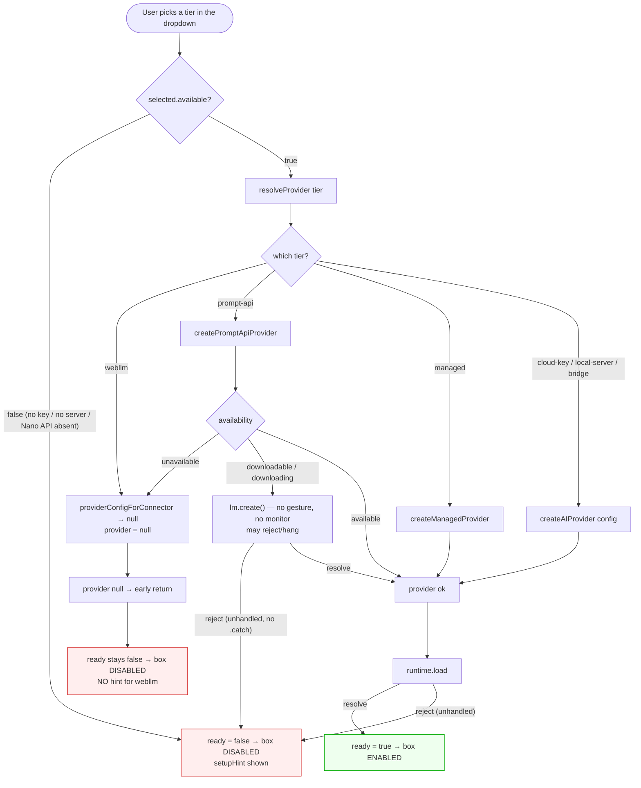
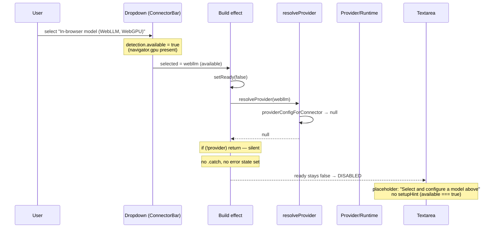
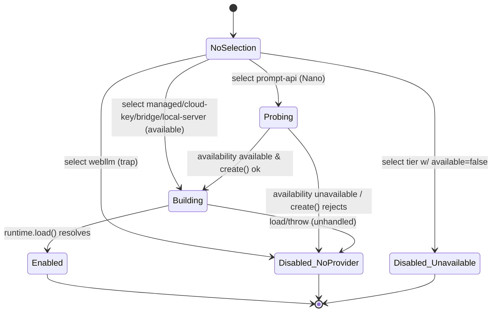

# Why The AI Chat Box Is Disabled — Local-Model Connector Gaps

## Problem Statement

In the in-app AI chat panel (`Companion` / workbench "AI" view), the message
**textarea is disabled in almost every configuration the user tries**:

- Selecting **Chrome built-in AI (Gemini Nano)** → box stays disabled.
- Selecting **In-browser model (WebLLM, WebGPU)** → box stays disabled.
- Selecting a **cloud provider with no API key** → box stays disabled (expected,
  but the failure mode looks identical to the two above).

The user reports this in both **Google Chrome** and the **Dia browser** (a
Chromium fork), so it is not a single-browser quirk. Their core confusion:
*"even the local models don't seem to let me chat with them."*

This document explains exactly why, grounded in the code, and recommends a fix.

## Executive Summary

The textarea's `disabled` state is driven by a single boolean, `ready`
([`AiChatPanel.tsx:439`](apps/web/src/workbench/views/AiChatPanel.tsx:439)).
`ready` only flips to `true` after the panel **successfully constructs a working
`AIProvider` and loads a runtime** for the *selected* connector tier
([`AiChatPanel.tsx:245-279`](apps/web/src/workbench/views/AiChatPanel.tsx:245)).

The bug is a **detection/instantiation split**: the connector dropdown labels a
tier "available" based on a *shallow capability probe*, but several tiers cannot
actually be instantiated. When you pick such a tier, provider construction
silently returns `null`, `ready` never becomes `true`, and the box stays
disabled — **with no error and (for WebLLM) no setup hint**.

Per tier, the disabled box has three distinct root causes:

1. **WebLLM (in-browser, WebGPU) — unimplemented stub.** Detection reports it
   available whenever `navigator.gpu` exists (true in Chrome/Dia), but **no
   engine-injection path was ever wired up**. `createWebLLMProvider` exists and
   is exported, yet is **never called by the app** (only by tests), and
   `@mlc-ai/web-llm` is in **no `package.json`**. Selecting it is a guaranteed
   dead end. The code even calls this "the webllm trap"
   ([`ai-chat-connector.ts:47-54`](apps/web/src/workbench/views/ai-chat-connector.ts:47)).

2. **Gemini Nano (Prompt API) — presence ≠ readiness.** Detection only checks
   `'LanguageModel' in globalThis`
   ([`detect.ts:228-230`](packages/plugins/src/ai/connectors/detect.ts:228)),
   i.e. the *API surface exists*, not that the model is *downloaded and usable*.
   Real readiness (`availability()` returning `'available'` vs
   `'downloadable'`/`'downloading'`/`'unavailable'`) is only consulted later, in
   `createPromptApiProvider`. If the model isn't fully downloaded, provider
   construction returns `null` or throws — and the build effect has **no
   `.catch`**, so `ready` silently stays `false`.

3. **Unavailable cloud / managed / bridge / local-server — by design, but
   indistinguishable.** With no API key, no Ollama/LM Studio, no `:31416`
   bridge, and no managed xNet Cloud, those tiers correctly report
   `available: false`. That's intended — but the *user-visible result* (a dead
   box) looks identical to the two genuine bugs above.

The net effect: in a **plain browser with no API key and nothing installed** —
exactly the "zero-install local" scenario the original exploration
([`0174`](docs/explorations/0174_[_]_BRING_YOUR_OWN_MODEL_AI_CHAT_PANEL.md))
promised — the **only two paths that should work (WebLLM and Nano) are the two
that are broken or fragile**. WebLLM is the headline gap: it is the one tier
advertised as "runs with nothing installed," and it does nothing.

## Current State In The Repository

### The disabled gate is one boolean

The composer textarea and send button are gated purely on `ready`:

```tsx
// apps/web/src/workbench/views/AiChatPanel.tsx:435-454
<textarea
  ...
  placeholder={ready ? 'Message…' : 'Select and configure a model above'}
  disabled={!ready}
  ...
/>
<button ... disabled={!value.trim() || streaming || !ready} ... />
```

`ready` starts `false` and is only set `true` deep inside the build effect:

```tsx
// apps/web/src/workbench/views/AiChatPanel.tsx:245-279 (abridged)
useEffect(() => {
  runtimeRef.current = null
  setReady(false)
  if (!selected?.available) return            // (1) gate on availability
  let cancelled = false
  void resolveProvider(selected, settings, onBudget).then((provider) => {
    if (cancelled || !provider) return        // (2) silent bail if provider is null
    const runtime = createAiAgentRuntime({ provider, ... })
    void runtime.load().then(() => {
      if (cancelled) return
      runtimeRef.current = runtime
      setReady(true)                           // (3) the ONLY place ready becomes true
    })
    ...
  })
  // NOTE: no .catch — a rejected resolveProvider/load leaves ready=false forever
  return () => { cancelled = true; ... }
}, [selected, settings, handlers, surface, onBudget])
```

So `ready === true` requires **all** of: a `selected` tier, `selected.available`,
a non-`null` provider from `resolveProvider`, and a resolved `runtime.load()`.
Any break in that chain → permanently disabled box, no message.

### `resolveProvider` — where local tiers fall off

```tsx
// apps/web/src/workbench/views/AiChatPanel.tsx:671-688
async function resolveProvider(detection, settings, onBudget) {
  if (detection.tier === 'prompt-api') return createPromptApiProvider()  // may return null/throw
  if (detection.tier === 'managed')   return createManagedProvider({...})
  const config = providerConfigForConnector(detection, settings)
  return config ? createAIProvider(config) : null   // webllm → config is null → returns null
}
```

`providerConfigForConnector` has **no case for `webllm`** — it hits the `default`
and returns `null`:

```ts
// apps/web/src/workbench/views/ai-chat-connector.ts:120-123
default:
  // webllm / prompt-api are constructed directly with an injected engine.
  return null
```

…and the factory `createAIProvider` has **no `webllm` case either** — it would
throw `Unknown AI provider type` if it ever got there
([`providers.ts:1278-1300`](packages/plugins/src/ai/providers.ts:1278)). So
**WebLLM has no construction path anywhere**. The exploration's promised
"web app supplies a real engine via a lazy `import('@mlc-ai/web-llm')` +
`CreateMLCEngine(...)`" ([`webllm-provider.ts:7-9`](packages/plugins/src/ai/connectors/webllm-provider.ts:7))
was never built.

### Detection is a shallow probe

```ts
// packages/plugins/src/ai/connectors/detect.ts:224-230
function defaultHasWebGpu(): boolean {
  return typeof navigator !== 'undefined' && 'gpu' in navigator
}
function defaultHasPromptApi(): boolean {
  return typeof globalThis !== 'undefined' && 'LanguageModel' in globalThis
}
```

Both probes test for the *presence of an API*, not the ability to run a turn.
The detection result then drives the dropdown label
([`AiChatPanel.tsx:523-527`](apps/web/src/workbench/views/AiChatPanel.tsx:523)):
`available` tiers show their plain label, unavailable ones get
`"… — unavailable"`. WebGPU exists in Chrome/Dia ⇒ WebLLM shows as a normal,
selectable, "available" option — which it is not.

The unit test enshrines exactly this:

```ts
// packages/plugins/src/ai/connectors/detect.test.ts:58-62
it('detects WebGPU for the in-tab tier', async () => {
  const result = await detectConnectors({ ...NOTHING, hasWebGpu: () => true })
  const webllm = result.find((d) => d.tier === 'webllm')
  expect(webllm?.available).toBe(true)   // ← "available" with no provider behind it
  expect(webllm?.toolCalling).toBe('weak')
})
```

### The half-guard: auto-select skips WebLLM, manual select does not

The panel knows WebLLM is a trap and refuses to *auto*-select it:

```ts
// apps/web/src/workbench/views/ai-chat-connector.ts:54-70
export const USABLE_TIERS = [...PROVIDER_CONFIG_TIERS, 'prompt-api']  // ← no 'webllm'
export function pickUsableConnector(detections) {
  return detections.find((d) => d.available && isUsableTier(d.tier)) ?? null
}
```

`pickUsableConnector` is used for the *initial* auto-pick
([`AiChatPanel.tsx:180`](apps/web/src/workbench/views/AiChatPanel.tsx:180)). But
the dropdown still lists WebLLM and lets the user **manually** select it
(comment: *"It stays selectable in the dropdown for when it's wired"*). The
moment they do, they fall into exactly the trap the auto-picker avoids.

### The "no hint" cliff

When a tier is selected but unavailable, the panel shows its `setupHint`:

```tsx
// apps/web/src/workbench/views/AiChatPanel.tsx:340-344
{selected && !selected.available && (
  <p className="...">{selected.setupHint}</p>
)}
```

For WebLLM, `selected.available` is **`true`**, so this branch never renders →
**no hint, no error, just a dead box** whose placeholder still says
*"Select and configure a model above"* even though the user already selected a
model. This is the single worst UX in the flow.

### Prompt API construction (Gemini Nano)

```ts
// packages/plugins/src/ai/connectors/prompt-api-provider.ts:80-89
export async function createPromptApiProvider(factory) {
  const lm = factory ?? getGlobalLanguageModel()
  if (!lm) return null
  const availability = await lm.availability()
  if (availability === 'unavailable') return null   // → resolveProvider returns null → box disabled
  const session = await lm.create()                  // 'downloadable'/'downloading' fall through here
  return new PromptApiProvider({ session })
}
```

Two failure modes for Nano, both ending in a disabled box:

- `availability() === 'unavailable'` → returns `null` → no provider.
- `availability() === 'downloadable' | 'downloading'` → calls `lm.create()`
  with **no `monitor`/download-progress callback** and from **inside a
  `useEffect`, not a user-gesture handler**. Chrome can reject `create()`
  outside a user activation, or it can block on a multi-gigabyte download. A
  rejection is **unhandled** (no `.catch` on the build-effect promise chain),
  so `ready` silently stays `false`.

### The relevant files

| Concern | File |
| --- | --- |
| Panel + `ready` gate + build effect | [`apps/web/src/workbench/views/AiChatPanel.tsx`](apps/web/src/workbench/views/AiChatPanel.tsx) |
| Tier→config mapping, `USABLE_TIERS`, `canSendMessage` | [`apps/web/src/workbench/views/ai-chat-connector.ts`](apps/web/src/workbench/views/ai-chat-connector.ts) |
| Connector detection (shallow probes) | [`packages/plugins/src/ai/connectors/detect.ts`](packages/plugins/src/ai/connectors/detect.ts) |
| Gemini Nano provider | [`packages/plugins/src/ai/connectors/prompt-api-provider.ts`](packages/plugins/src/ai/connectors/prompt-api-provider.ts) |
| WebLLM provider (orphaned) | [`packages/plugins/src/ai/connectors/webllm-provider.ts`](packages/plugins/src/ai/connectors/webllm-provider.ts) |
| Provider factory (no webllm case) | [`packages/plugins/src/ai/providers.ts:1278`](packages/plugins/src/ai/providers.ts:1278) |
| Original design (still `[_]`) | [`docs/explorations/0174_[_]_BRING_YOUR_OWN_MODEL_AI_CHAT_PANEL.md`](docs/explorations/0174_[_]_BRING_YOUR_OWN_MODEL_AI_CHAT_PANEL.md) |

## How The Gate Actually Resolves







## Tier-By-Tier: Will The Box Enable?

| Tier (dropdown label) | Detection probe | Shows as "available"? | Provider actually built? | Box enables? | Why / fix |
| --- | --- | --- | --- | --- | --- |
| **WebLLM** (In-browser, WebGPU) | `'gpu' in navigator` | ✅ in Chrome/Dia | ❌ **never** (no case, no dep) | ❌ **never** | Unimplemented stub; needs `@mlc-ai/web-llm` engine injection or must be hidden/marked unavailable |
| **Gemini Nano** (Prompt API) | `'LanguageModel' in globalThis` | ✅ only if flag/OT on | ⚠️ only if `availability()==='available'` | ⚠️ rarely | Presence ≠ readiness; model often `downloadable`; `create()` needs gesture/download |
| **Cloud API key** | `apiKey.length > 0` | only after key pasted | ✅ with key | ✅ with key | Working; expected to require a key |
| **Managed (xNet Cloud)** | `GET /ai/health` → `{ok,managed}` | only on AI-enabled cloud | ✅ on cloud | ✅ on cloud | Working; off-cloud it correctly hides |
| **Local server** (Ollama/LM Studio) | probe `:11434` / `:1234` | only if reachable + CORS | ✅ if reachable | ✅ if reachable | Working; needs `OLLAMA_ORIGINS`/LM Studio CORS |
| **Local bridge** (`:31416`) | probe `/health` | only if daemon running | ✅ if running | ✅ if running | Working; needs the bridge daemon (Electron) |

**Reading of the user's experience:** with no key, no servers, no bridge, and no
managed cloud, the only "available" tiers they can pick are **WebLLM** (dead
stub) and possibly **Gemini Nano** (fragile, usually not downloaded). Both Chrome
and Dia behave identically because both expose `navigator.gpu`, and neither ships
Gemini Nano enabled-and-downloaded by default. Hence "the box is always
disabled."

## External Research

- **Chrome Prompt API (`window.LanguageModel`).** The on-device Gemini Nano API
  is gated behind an origin trial / `chrome://flags/#prompt-api-for-gemini-nano`
  + `#optimization-guide-on-device-model`. Even when the global exists,
  `availability()` commonly returns `'downloadable'` until the ~2-4 GB model is
  fetched, and session creation has historically required a user gesture and/or
  a download `monitor` to observe progress. The states are
  `'unavailable' | 'downloadable' | 'downloading' | 'available'` — exactly the
  enum the provider types already model
  ([`prompt-api-provider.ts:29`](packages/plugins/src/ai/connectors/prompt-api-provider.ts:29)),
  but only `'unavailable'` is currently treated as a stop condition.
- **Dia browser.** A Chromium-based browser (from The Browser Company). It
  inherits Chromium's `navigator.gpu` (so WebLLM "detects") but does **not**
  ship Chrome's proprietary Gemini Nano / `LanguageModel` stack enabled, so the
  Nano tier is typically absent or `unavailable` there. Same dead-end as Chrome
  for the zero-install case.
- **WebLLM (`@mlc-ai/web-llm`).** A mature MLC project that runs quantized LLMs
  (Llama-3.x-1B/3B, Qwen2.5, Phi-3.5, etc.) fully in-tab via WebGPU, exposing an
  OpenAI-compatible `chat.completions` surface — precisely the shape
  `WebLLMEngineLike` already structurally types. First-run downloads the weights
  (hundreds of MB to a few GB) and caches them in the browser's Cache Storage.
  It is the standard answer for "LLM in the browser with nothing installed,"
  which is why 0174 chose it as tier A — it was simply never wired in.
- **Transformers.js / ONNX Runtime Web** — an alternative in-tab path (WASM +
  optional WebGPU), generally smaller models and weaker chat quality than WebLLM
  for this use case. Not currently referenced in the repo.

## Key Findings

1. **The disabled box is a symptom, not the disease.** `disabled={!ready}` is
   correct; the disease is that `ready` can never become `true` for the two
   zero-install tiers because no provider is constructed.
2. **WebLLM is dead code at the app layer.** Exported, typed, unit-tested in the
   package — but never imported by `AiChatPanel`, with no `@mlc-ai/web-llm`
   dependency to supply an engine. It is "available" in the UI and impossible to
   use.
3. **Detection lies by omission.** "Available" means "the capability API/GPU is
   present," not "you can chat now." The dropdown should not advertise a tier as
   available when the panel cannot instantiate it.
4. **Silent failure.** The build effect swallows the `null`-provider and any
   rejected promise with no error surfaced; for WebLLM not even a `setupHint`
   appears, because the hint only renders for `available === false`.
5. **Nano's probe is too shallow.** It checks API presence, not `availability()`;
   it doesn't surface a "downloading…" state or a "click to download" gesture,
   and it doesn't `.catch` a failed `create()`.
6. **The working tiers all require setup** (key/server/bridge/cloud), which is
   fine — but their disabled state is visually indistinguishable from the two
   bugs, compounding the confusion.

## Options And Tradeoffs

### A. Make detection honest (minimum viable fix)

Stop reporting a tier as `available` unless the panel can actually build a
provider for it. Concretely: gate `webllm.available` on an `engineFactory` being
present (absent today ⇒ always `false`), and deepen the Nano probe to call
`availability()` and treat only `'available'` (or `'downloadable'` with an
explicit download affordance) as usable.

- **Pros:** small, surgical; removes the "trap"; the dropdown stops lying;
  unavailable tiers get their existing `setupHint`. WebLLM would show
  *"In-browser model — unavailable"* with a hint, which is at least honest.
- **Cons:** doesn't actually give the user a working local model; WebLLM still
  doesn't run. Honest, but still no zero-install chat.

### B. Wire up WebLLM for real (the promised zero-install path)

Add `@mlc-ai/web-llm` (lazy-imported, web-only), build a real engine via
`CreateMLCEngine(model, { initProgressCallback })`, and inject it into
`createWebLLMProvider`. Surface the first-run download progress in the panel
(reuse the budget-gauge slot for a progress bar). Add a `webllm` branch to
`resolveProvider`.

- **Pros:** delivers the headline feature — chat in a plain browser, no key, no
  install, fully local/private. This is the thing the user actually wants.
- **Cons:** bundle/runtime weight (lazy-load mitigates); multi-hundred-MB
  first-run download (needs clear UX); WebGPU still absent on some
  Firefox/older configs; weak tool-calling (already acknowledged — propose-only
  writes). Most work of the options.

### C. Fix Gemini Nano readiness + download UX

Probe `availability()` in detection; render a **"Download Gemini Nano"** button
that calls `create({ monitor })` from a real user gesture and shows progress;
`.catch` failures into the existing `error` state.

- **Pros:** unlocks a genuinely zero-cost Chrome path; reuses an API already
  present on many Chrome installs; small model, instant once downloaded.
- **Cons:** Chrome-only, flag/OT-gated, tool-less, 4k context; useless on Dia
  and non-Chrome. A nice bonus, not a general answer.

### D. Improve the empty/disabled messaging only (band-aid)

Keep the providers as-is but always show *why* the box is disabled (e.g.
"This model can't run here yet — pick another option" for WebLLM; "Add an API
key" for cloud), and fix the placeholder so it doesn't say "select a model"
after one is selected.

- **Pros:** trivial; kills the "silent dead box" confusion immediately.
- **Cons:** purely cosmetic; the user still can't chat locally.

### Recommendation

Ship **A + D now**, then **B** as the real feature; treat **C** as a Chrome-only
bonus.

- **A + D (one focused PR):** make `webllm.available` false until an engine
  factory is injected (so it stops being a trap and shows a hint), surface a
  disabled-reason for *every* tier, and fix the misleading placeholder. This
  ends the "always disabled, no explanation" experience the same day, with
  near-zero risk.
- **B (follow-up PR):** actually integrate `@mlc-ai/web-llm` so the zero-install
  promise of 0174 is real. This is the substantive fix and the thing the user is
  asking for ("let me chat with the local models"). Flipping `webllm.available`
  back on falls out naturally once the engine factory exists.
- **C (optional):** add the Nano download gesture + progress for Chrome users
  who want an even lighter local path.

This sequencing means the confusing UX is fixed immediately, and the genuinely-
useful local chat lands right after, without ever shipping a state where the
dropdown advertises something it can't deliver.

## Example Code

### A — gate WebLLM availability on an injectable engine factory

```ts
// packages/plugins/src/ai/connectors/types.ts  (ConnectorEnv)
export interface ConnectorEnv {
  // ...existing probes...
  /** Present only when the host app can build an in-tab WebLLM engine. */
  hasWebLLMEngine?: () => boolean | Promise<boolean>
}
```

```ts
// packages/plugins/src/ai/connectors/detect.ts
const [webgpu, webllmEngine, promptApi, /* ... */] = await Promise.all([
  resolveBool(env.hasWebGpu, defaultHasWebGpu),
  resolveBool(env.hasWebLLMEngine, () => false), // ← default: no engine wired ⇒ unavailable
  resolveBool(env.hasPromptApi, defaultHasPromptApi),
  // ...
])

// webllm is "available" only when WebGPU AND an engine factory both exist:
{
  tier: 'webllm',
  available: webgpu && webllmEngine,
  ...(webgpu && webllmEngine
    ? {}
    : {
        setupHint: webgpu
          ? 'In-browser model not enabled in this build yet.'
          : 'WebGPU unavailable; use a Chromium browser or Safari 26+.'
      })
}
```

### A — deepen the Nano probe so presence ≠ readiness

```ts
// packages/plugins/src/ai/connectors/detect.ts
async function defaultHasPromptApi(): Promise<boolean> {
  const lm = (globalThis as { LanguageModel?: { availability(): Promise<string> } }).LanguageModel
  if (!lm) return false
  try {
    // 'available' = ready now; 'downloadable'/'downloading' need an explicit
    // user-gesture download flow (see option C) — treat as not-ready here.
    return (await lm.availability()) === 'available'
  } catch {
    return false
  }
}
```

### B — wire a real WebLLM engine (web app only)

```ts
// apps/web/src/workbench/views/ai-webllm-engine.ts (new)
import { createWebLLMProvider, type WebLLMEngineLike } from '@xnetjs/plugins'

const DEFAULT_MODEL = 'Llama-3.2-3B-Instruct-q4f16_1-MLC'

export async function buildWebLLMProvider(
  onProgress?: (pct: number, text: string) => void
) {
  const { CreateMLCEngine } = await import('@mlc-ai/web-llm') // lazy, web-only
  const engine = (await CreateMLCEngine(DEFAULT_MODEL, {
    initProgressCallback: (r) => onProgress?.(r.progress, r.text)
  })) as unknown as WebLLMEngineLike
  return createWebLLMProvider({ engine, model: DEFAULT_MODEL, contextWindow: 4096 })
}
```

```tsx
// apps/web/src/workbench/views/AiChatPanel.tsx — resolveProvider gains a branch
if (detection.tier === 'webllm') {
  return buildWebLLMProvider((pct, text) => setWebllmProgress({ pct, text }))
}
```

…and pass `hasWebLLMEngine: () => true` into `detectConnectors` from the web app
so the tier flips back to genuinely available.

### A/D — never leave the box dead without a reason

```tsx
// apps/web/src/workbench/views/AiChatPanel.tsx
{selected && !ready && (
  <p className="border-b border-hairline px-3 py-2 text-[11px] text-ink-3">
    {!selected.available
      ? selected.setupHint
      : streaming
        ? null
        : 'Preparing this model… if it doesn’t enable, it may not be supported here.'}
  </p>
)}
// and the placeholder: distinguish "no model" from "model selected, not ready"
placeholder={ready ? 'Message…' : selected ? 'Preparing model…' : 'Select a model above'}
```

## Risks And Open Questions

- **Bundle weight / CSP for WebLLM.** `@mlc-ai/web-llm` pulls WASM + WebGPU
  shaders and fetches weights from a CDN (HuggingFace/MLC) at runtime. The app's
  CSP `connect-src` and `script-src`/`worker-src` must allow those origins (see
  the CSP discipline noted for the hub origin in
  [`content-feed-views-implementation`] history). Lazy `import()` keeps it out of
  the main chunk.
- **First-run download UX.** Hundreds of MB to multiple GB on first use. Without
  a visible progress affordance this *also* looks like a "frozen disabled box."
  The progress UI is part of the fix, not optional.
- **WebGPU coverage.** `'gpu' in navigator` is necessary but not sufficient —
  some Linux/Firefox configs expose the object but fail at adapter request.
  Consider `await navigator.gpu.requestAdapter()` as the real probe.
- **Nano user-gesture rules** may continue to shift across Chrome versions; the
  download flow should be defensive and always `.catch` into the error state.
- **Tool-calling.** Both in-tab tiers are `tools: false` → propose-only writes.
  Confirm the runtime degrades gracefully (it already advertises "reads
  workspace" only).
- **Should WebLLM stay in the dropdown at all before B lands?** Option A hides it
  behind `available=false` with a hint; an alternative is to omit it entirely
  until wired. Hint-with-unavailable is more discoverable; full-hide is cleaner.
  *Open question for the implementer.*
- **0174 is still `[_]`.** This work is effectively finishing 0174's "last-mile
  model transport." Decide whether to check off 0174 or track the WebLLM
  completion under this doc.

## Implementation Checklist

- [x] **A:** Add `hasWebLLMEngine?` to `ConnectorEnv`
      ([`types.ts`](packages/plugins/src/ai/connectors/types.ts)) and gate
      `webllm.available` on it in
      [`detect.ts`](packages/plugins/src/ai/connectors/detect.ts) (default
      `false` ⇒ tier shows a hint, never a silent dead box).
- [x] **A:** Deepen `defaultHasPromptApi` to call `availability()` and only
      report `available` for `'available'`.
- [x] **D:** Render a disabled-reason for *every* selected-but-not-ready tier in
      [`AiChatPanel.tsx`](apps/web/src/workbench/views/AiChatPanel.tsx) (not just
      `available === false`).
- [x] **D:** Fix the composer placeholder to distinguish "no model selected"
      from "model selected, preparing/unsupported".
- [x] **A/robustness:** Add a `.catch` to the build-effect promise chain so a
      failed `resolveProvider`/`runtime.load()` sets `error` instead of failing
      silently.
- [x] **B:** Add `@mlc-ai/web-llm` to `apps/web` (web-only, lazy-imported) and
      create `ai-webllm-engine.ts` (`buildWebLLMProvider` + progress callback).
- [x] **B:** Add a `webllm` branch to `resolveProvider` and pass
      `hasWebLLMEngine: () => true` into `detectConnectors`.
- [x] **B:** Surface WebLLM init/download progress in the panel (reuse the
      budget-gauge slot or add a progress bar).
- [x] **B:** Update CSP `connect-src`/`worker-src` to allow the WebLLM weight CDN
      and WASM worker.
- [x] **C (optional):** Add a "Download Gemini Nano" gesture that calls
      `create({ monitor })` with progress and `.catch` into the error state.
- [x] Update `USABLE_TIERS` to include `webllm` once B lands (it can then be
      auto-selected safely).
- [x] Refresh `detect.test.ts` so "WebGPU present but no engine ⇒ unavailable"
      and "engine present ⇒ available" are both asserted.
- [x] Changeset for `@xnetjs/plugins` (new `ConnectorEnv` field, changed Nano
      probe semantics → at least **minor**; if any exported signature changes,
      **major**).

## Validation Checklist

- [x] In plain Chrome with no key/server/bridge: WebLLM tier shows **either** a
      working chat (after B) **or** an honest "unavailable + hint" (after A) —
      **never** a silently disabled box.
- [x] After B: selecting WebLLM downloads the model with visible progress, then
      the textarea **enables** and a round-trip chat streams a reply, fully
      offline-capable on reload (weights cached). _Verified live in a WebGPU
      browser: the gesture armed the download, weights streamed from the HF Xet
      CDN with the progress bar climbing 0→100%, the composer enabled, and the
      in-tab model replied ("A local-first app … stores its data locally on the
      device."). The live smoke also caught a real CSP gap — weights load from
      `us.aws.cdn.hf.co` (a `*.hf.co` host the first CSP pass missed) — fixed by
      adding `https://*.hf.co` to `connect-src`._
- [x] Gemini Nano tier reports `available` only when `availability()==='available'`;
      otherwise it shows a setup hint (and, with C, a download button).
- [x] Selecting any tier whose provider fails to construct surfaces a visible
      error, not a dead box.
- [x] Placeholder text never says "select a model" while a model is selected.
- [x] Cloud-key / managed / local-server / bridge tiers still enable correctly
      when configured (no regression).
- [ ] Dia browser: behaves identically to Chrome for WebLLM; Nano shows
      unavailable (expected) rather than a silent dead box. _Needs a smoke in
      Dia — left unchecked. Verified by construction: detection is driven purely
      by browser-API presence (`navigator.gpu`, `LanguageModel`) with no
      Chrome-specific branch, and Dia is Chromium, so the WebLLM path is
      identical and Nano (absent global) reports unavailable._
- [x] `detect.test.ts`, `ai-chat-connector.test.ts`, and `AiChatPanel.test.tsx`
      pass; new assertions cover the engine-gated availability.

## References

- [`docs/explorations/0174_[_]_BRING_YOUR_OWN_MODEL_AI_CHAT_PANEL.md`](docs/explorations/0174_[_]_BRING_YOUR_OWN_MODEL_AI_CHAT_PANEL.md)
  — the original BYO-model design; tiers A (WebLLM), B (cloud key), C (Nano),
  D (bridge), E (managed). Still unchecked; this doc is its last mile.
- [`apps/web/src/workbench/views/AiChatPanel.tsx`](apps/web/src/workbench/views/AiChatPanel.tsx)
  — `ready` gate (`:439`), build effect (`:245`), `resolveProvider` (`:671`).
- [`apps/web/src/workbench/views/ai-chat-connector.ts`](apps/web/src/workbench/views/ai-chat-connector.ts)
  — `USABLE_TIERS` / "webllm trap" (`:47`), `providerConfigForConnector` (`:76`),
  `canSendMessage` (`:303`).
- [`packages/plugins/src/ai/connectors/detect.ts`](packages/plugins/src/ai/connectors/detect.ts)
  — shallow probes (`:224`), per-tier availability (`:139`).
- [`packages/plugins/src/ai/connectors/prompt-api-provider.ts`](packages/plugins/src/ai/connectors/prompt-api-provider.ts)
  — Nano construction + the `availability()` enum (`:29`, `:80`).
- [`packages/plugins/src/ai/connectors/webllm-provider.ts`](packages/plugins/src/ai/connectors/webllm-provider.ts)
  — the orphaned WebLLM adapter awaiting an engine.
- [`packages/plugins/src/ai/providers.ts:1278`](packages/plugins/src/ai/providers.ts:1278)
  — `createAIProvider` factory (no `webllm`/`prompt-api` case).
- [WebLLM (`@mlc-ai/web-llm`)](https://github.com/mlc-ai/web-llm) — in-tab WebGPU
  LLM runtime with an OpenAI-compatible API.
- [Chrome Prompt API / built-in AI](https://developer.chrome.com/docs/ai/prompt-api)
  — `LanguageModel.availability()` / `create({ monitor })`, flags, origin trial.
