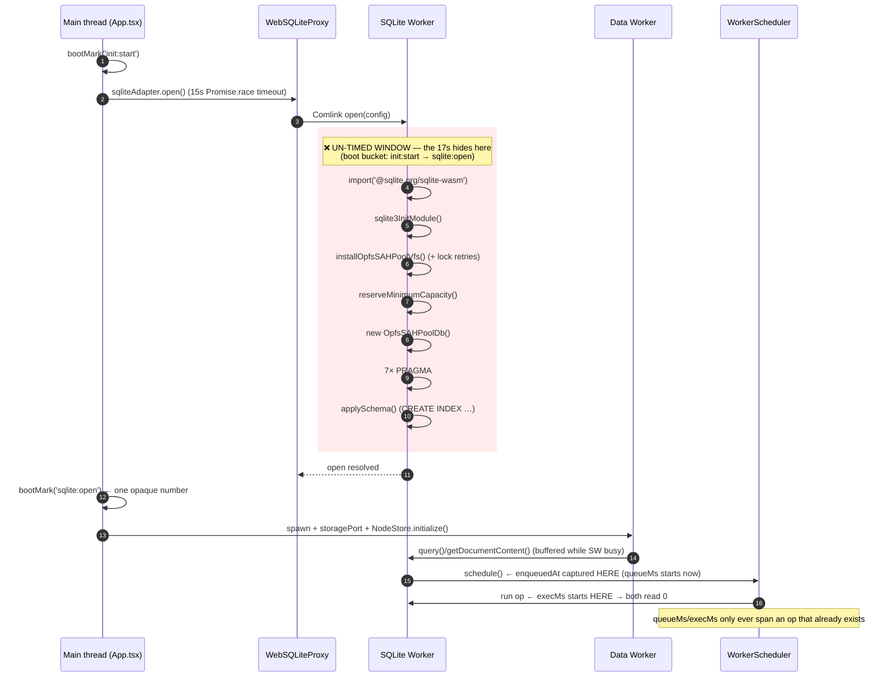
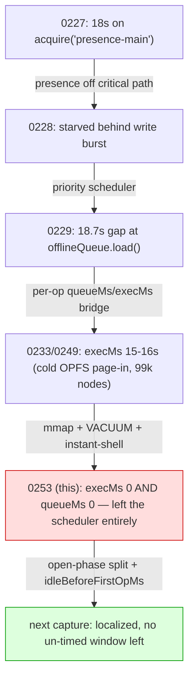
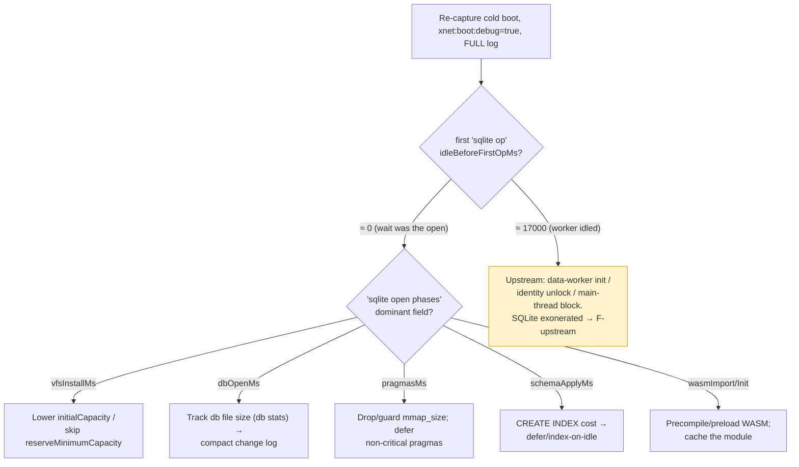

# The Seventh Cold‑Open Migration: The Stall Left `execMs` — Bracket the Open/Dispatch Window

## Problem Statement

Opening the web app with a populated local cache still stalls ~17 s before any
data paints, then everything appears at once. We have now chased this **seven
times** — 0204, 0227, 0228, 0229, 0233, 0249 — and every fix only _moved_ it.

This round the user attached a fresh boot capture and asked, again correctly:
**stop guessing — add the lingering instrumentation so we can definitively
localize it, then resolve it.**

The capture is decisive in a new way: it **falsifies the 0233/0249 root cause**
for this workspace. In 0233/0249 the first interactive query spent ~15.8 s
_inside `execMs`_ (cold OPFS page‑in of a 99 k‑node DB). In this capture
**every op reports `execMs: 0` AND `queueMs: 0`**, the workspace is tiny (17
pages, 39 tasks), and the ~17 s now lives _only_ in caller‑side wall‑clock
(`candidateQueryDurationMs`, `durationMs`, `readMs`). The stall hopped again —
this time off `execMs` entirely, into the one window no timer brackets.

## Executive Summary

**The 17 s is provably outside the SQLite scheduler.** Two facts from the
capture pin it there with no remaining ambiguity:

| Signal                                   | Value (this capture) | What it rules out                                      |
| ---------------------------------------- | -------------------- | ------------------------------------------------------ |
| `execMs` on every op                     | **0**                | Not slow SQL / not cold page‑in (0233/0249 cause)      |
| `queueMs` on every op                    | **0**                | Not head‑of‑line blocking in the scheduler (0227/0228) |
| `candidateQueryDurationMs` (data worker) | **17 153 ms**        | The wait is _upstream of `db.query()` returning_       |
| `loadDoc … readMs` (tiny 311‑byte doc)   | **16 481 ms**        | Even a trivial read is pending ~16.5 s                 |
| node counts (pages/tasks/…)              | **17 / 39 / 4 …**    | Not DB bloat in the _materialized_ tables              |

```
id 190  [xNet] loadDoc 2klXySYwC… {"bytes":2283,"readMs":16480,"applyMs":1}
id 195  [xNet] loadDoc ecdiyfgf9b {"bytes":311,"readMs":16481,"applyMs":0}
id 988  [SQLiteNodeStorageAdapter] query plan … "candidateQueryDurationMs":17153.0,
        "durationMs":17256 …            ← measured around await db.query()
id 1016 [xNet] landing query prewarm:pages: 17260ms {"rows":17}
id 1030 [xNet] sqlite op query {"lane":"interactive","queueMs":0,"execMs":0}  ← the op itself: instant
```

Because `execMs = 0` (not SQL) **and** `queueMs = 0` (not the scheduler queue),
the ~17 s is spent **before the first scheduled op runs** — in the SQLite
worker's `open()`/init sequence, and/or in the dispatch path between
"open finished" and "first op enqueued". Every caller‑side timer started at boot
and only resolved when that window ended, so they all read ~17 s and _all
resolve together_ (the classic "then everything appears at once").

**Why six explorations couldn't end it: we keep instrumenting the layer the
stall is in, and it hops to the next un‑instrumented layer.** The boot timeline
(0204/0249) buckets the entire open into one opaque `wasm` number
(`init:start → sqlite:open`); the per‑op split (0229/0249) starts its clocks
_after_ open. The 17 s sits exactly between those two — in nobody's bracket.

**This PR ships the two missing lines** (gated behind `xnet:boot:debug`):

1. **`[xNet] sqlite open phases`** — splits the opaque `wasm` bucket into
   `wasmImportMs / wasmInitMs / vfsInstallMs(+retries) / reserveCapacityMs /
dbOpenMs / pragmasMs / schemaApplyMs`, plus `retryAttempts` and `mode`.
2. **`firstOpAfterOpen` fields on the first scheduled op** —
   `idleBeforeFirstOpMs` (open done → first op _enqueued_) and `sinceOpenMs`
   (open done → first op _executed_). This is the disambiguator:
   - `idleBeforeFirstOpMs ≈ 0` → the wait **was the open itself** → read the
     `open phases` line for the dominant sub‑phase.
   - `idleBeforeFirstOpMs ≈ 17 000` → the worker **sat idle** after a fast open;
     the wait is entirely **upstream** (data‑worker init / identity unlock /
     main‑thread block), not SQLite at all.

With these two lines, the next capture localizes the stall to a single
sub‑phase **with no un‑timed window left between boot start and first op done**.

> **First, re‑capture from the top.** This capture starts at **`id 109`**. The
> existing `[xNet] db stats @ open` and `[xNet] boot timeline (ms)` lines fire
> during `id < 109` and were **truncated off**. Set `xnet:boot:debug=true`
> _before_ reload and export the **whole** log — the answer may already be one
> existing line away, and the two new lines close the rest.

## Current State In The Repository

### The boot path, and the window nobody times



The expensive work (steps 4–11) runs on the SQLite worker's single thread
_before_ the scheduler dequeues anything. Inbound query RPCs — from the main
thread **and** from the data worker over its `MessagePort` — buffer at the
Comlink/port layer (invisible to `queueMs`) and drain in ~150 ms once init
finishes. That is why the post‑unblock burst (the ~870 `PRAGMA index_info`
lines, the prewarm results) all land within `1782832701607 → …701757`.

Key files:

- [`packages/sqlite/src/adapters/web.ts`](../../packages/sqlite/src/adapters/web.ts)
  — `WebSQLiteAdapter.open()`: dynamic import → `sqlite3InitModule()` →
  `installOpfsSAHPoolVfs()` → `reserveMinimumCapacity()` →
  `new OpfsSAHPoolDb()` → 7 pragmas. None of these phases were individually
  timed before this PR.
- [`packages/sqlite/src/adapters/web-worker.ts`](../../packages/sqlite/src/adapters/web-worker.ts)
  — `SQLiteWorkerHandler.open()` calls `createWebSQLiteAdapter` (which also runs
  `applySchema`), then the scheduler services ops. The scheduler's `onOp`
  reporter (lines ~85‑95) emits `[xNet] sqlite op` with `queueMs/execMs`.
- [`packages/sqlite/src/adapters/worker-scheduler.ts`](../../packages/sqlite/src/adapters/worker-scheduler.ts)
  — `queueMs = startedAt − enqueuedAt`, `execMs = endedAt − startedAt`. Both
  clocks start **inside** `schedule()`, i.e. after open/init.
- [`packages/sqlite/src/adapters/web-proxy.ts`](../../packages/sqlite/src/adapters/web-proxy.ts)
  — `open()` races `proxy.open()` against a **15 s timeout** (lines 131‑135).
  The observed stall is ~17 s yet data still loaded, so either open finished
  `< 15 s` (the cost is _after_ open, upstream) or the timeout fired and a retry
  abandoned a worker still holding the OPFS handles (a self‑inflicted loop — see
  Risks).
- [`packages/data/src/store/sqlite-adapter.ts`](../../packages/data/src/store/sqlite-adapter.ts)
  — `queryNodes()` measures `durationMs` from `Date.now()` at call; `timeQuery`
  ([`diagnostics.ts:367`](../../packages/sqlite/src/diagnostics.ts)) measures
  `candidateQueryDurationMs` around `await db.query()`. With `db.query()`
  pending ~17 s, both inflate while the worker‑side timers read 0.
- [`packages/runtime/src/sync/node-pool.ts:134‑151`](../../packages/runtime/src/sync/node-pool.ts)
  — `loadDoc` `readMs` wraps `await config.storage.getDocumentContent()`; pending
  ~16.5 s for an 311‑byte doc → same root, not Yjs (`applyMs: 0`).
- [`apps/web/src/lib/boot-timeline.ts`](../../apps/web/src/lib/boot-timeline.ts)
  — `wasm = init:start → sqlite:open` is the opaque bucket that swallows the
  whole open. **This is the bucket to split.**
- [`apps/web/src/components/WorkingSetPrewarm.tsx`](../../apps/web/src/components/WorkingSetPrewarm.tsx)
  — fires the 5 landing queries one rAF after the bridge is ready; their
  `useQueryTimer` `t0` is captured at first render, hence `prewarm:*: 17260ms`.

### The "migrating stall" — seven captures, same 17 s



Each prior fix instrumented (and then optimized) the layer the stall occupied;
the cost relocated to the next un‑timed layer up. This capture is the cost
arriving at the **last** un‑timed layer — the open/dispatch window. Close it and
the whack‑a‑mole has nowhere left to hop.

## External Research

- **OPFS `createSyncAccessHandle()` is exclusive and contended.** The
  `opfs-sahpool` VFS acquires a sync access handle per pool file at _install_
  time; a second tab/worker holding the handle makes the next install throw
  `NoModificationAllowedError`. WebKit/Chromium guidance and the wa‑sqlite /
  `@sqlite.org/sqlite-wasm` issue trackers document install/first‑open latency
  on large pools and under handle contention. xNet already retries this
  ([`opfs-retry.ts`](../../packages/sqlite/src/adapters/opfs-retry.ts)) — but the
  retry is capped at ~1.5 s (5 × 150 ms linear) and **did not fire** in this
  capture (no `onRetry` warnings, `mode: opfs`), so contention‑retry is not the
  17 s. Whether the _first‑try_ install/open is itself slow is exactly what
  `vfsInstallMs`/`dbOpenMs` will now show.
- **SAH‑pool install reads pool metadata + acquires N handles synchronously.**
  With `initialCapacity: 10` + `reserveMinimumCapacity(10)`, install touches the
  whole pool; on a multi‑hundred‑MB OPFS file (this workspace has ~318 k change
  rows — `sinceLamport: 318066`, `id 188`) the first page‑in can be paid here
  rather than in a later query, which is consistent with `execMs` now being 0.
- **`PRAGMA mmap_size` can move cold‑read cost to open.** 0233 added
  `mmap_size = 268435456` ([`web.ts:350`](../../packages/sqlite/src/adapters/web.ts))
  specifically to fault pages via the OS instead of synchronous `xRead`. Under
  `opfs-sahpool` mmap is often a no‑op, but if the VFS pre‑faults at open this is
  precisely the kind of relocation we're seeing. `pragmasMs` now measures it.
- **`performance.now()`‑based phase timing** is the standard, dependency‑free way
  to bracket worker init; the existing boot‑timeline and per‑op reporter already
  use it, so the new lines share one clock and compose cleanly.

## Key Findings

1. **The stall is no longer "a slow query."** `execMs: 0` everywhere falsifies
   the 0233/0249 cold‑page‑in root cause _for this workspace_. The materialized
   tables are tiny; landing SQL is instant.
2. **It is no longer scheduler head‑of‑line blocking either.** `queueMs: 0`
   everywhere falsifies 0227/0228. No op waited behind another in the scheduler.
3. **Therefore the 17 s is in the open/init or dispatch window** — the only
   place left that no timer brackets. Confirmed by three independent caller‑side
   timers (`candidateQueryDurationMs`, `durationMs`, `readMs`) all reading ~17 s
   and resolving together.
4. **The existing instrumentation is necessary but insufficient, and was
   partly truncated.** The boot timeline's `wasm` bucket is opaque; the per‑op
   split starts after open; and this capture begins at `id 109`, cutting off the
   `db stats @ open` and `boot timeline` lines entirely.
5. **A latent feedback risk:** the 15 s `proxy.open()` timeout
   ([`web-proxy.ts:131`](../../packages/sqlite/src/adapters/web-proxy.ts)) can
   fire on a genuinely slow open and abandon a worker that still holds the OPFS
   handles → the next worker hits the lock‑retry path. Worth ruling in/out.
6. **Secondary noise (not the cause):** `getIndexInfo`
   ([`diagnostics.ts:67‑84`](../../packages/sqlite/src/diagnostics.ts)) issues
   **one `PRAGMA index_info` per index, serially, uncached, per cold query** —
   ~870 round‑trips in this capture (`id ~204‑1012`). It's ~95 ms here (post‑
   unblock) but it floods the log and scales as `indexes × cold queries`. Caching
   it would make every future capture dramatically more readable.
7. **Unrelated but visible:** `INVALID_HASH` (`id 1107`) — the hub/client
   protocol skew guarded by PR #253 (sync hash‑skew); redeploy the tenant hub.
   Not the load delay.

## Options And Tradeoffs

| #          | Option                                                                          | Localizes the 17 s?                                | Cost / Risk                   | Verdict              |
| ---------- | ------------------------------------------------------------------------------- | -------------------------------------------------- | ----------------------------- | -------------------- |
| **I1**     | **Split `open()` into phases** (`sqlite open phases`)                           | Yes — names the sub‑phase if the wait is _in_ open | Tiny, gated, never throws     | **Ship**             |
| **I2**     | **`idleBeforeFirstOpMs` / `sinceOpenMs` on first op**                           | Yes — disambiguates _in‑open_ vs _upstream_        | Tiny, gated                   | **Ship**             |
| I3         | Capture from `id 0` with `xnet:boot:debug`                                      | Recovers existing `db stats`/`boot timeline`       | Process change only           | **Do first**         |
| C1         | Cache `getIndexInfo` per schema_version                                         | No (de‑noises)                                     | Small; touches shared util    | Recommend (separate) |
| F‑open     | Speed up open once localized (lazy VFS, smaller pool, defer pragmas, drop mmap) | — (fix)                                            | Decided by capture            | After I1/I2          |
| F‑upstream | Speed up data‑worker init / overlap identity (if idle≈17 s)                     | — (fix)                                            | Decided by capture            | After I1/I2          |
| F2         | Instant‑shell first paint < 1 s regardless of cold read                         | Hides felt latency                                 | Already partly shipped (0249) | Keep as backstop     |
| X          | Guess again and "optimize" a layer                                              | **No** — it will hop                               | Wasted PR #8                  | **Reject**           |

The instrumentation options (I1/I2/I3) are mutually reinforcing and cheap; the
fix options are deliberately deferred until the next capture says which branch.
We have guessed wrong six times — **measure once more, then fix the named
phase.**

## Recommendation

1. **This PR:** ship **I1 + I2** (done — see Example Code). Re‑capture a cold
   boot with `xnet:boot:debug=true` set _before_ reload, exporting the **full**
   log (I3).
2. **Read two lines, then act:**
   - `[xNet] sqlite open phases` → the dominant sub‑phase (e.g. `vfsInstallMs`,
     `dbOpenMs`, `pragmasMs`, or `schemaApplyMs`).
   - First `[xNet] sqlite op` with `idleBeforeFirstOpMs`:
     - **≈ 0** → the wait _was_ the open → optimize the dominant open sub‑phase
       (F‑open): e.g. drop `mmap_size` if `pragmasMs` dominates, lower
       `initialCapacity`/skip `reserveMinimumCapacity` if `vfsInstallMs`
       dominates, or compact the change log if `dbOpenMs` tracks file size.
     - **≈ 17 000** → open was fast; the worker idled → the cost is **upstream**
       (data‑worker init / identity unlock / a blocked main thread) → F‑upstream;
       SQLite is exonerated.
3. **Separately:** cache `getIndexInfo` (C1) to kill the ~870‑line flood; audit
   the 15 s open timeout (Risk R1); redeploy the hub to clear `INVALID_HASH`.
4. Fold the resolved branch back into 0233/0249 and check all three off — the
   migration ends when _no un‑timed window remains between boot start and first
   op done_, which I1+I2 guarantee.

## Example Code

All shipped in this change, gated behind `xnet:boot:debug` / `bootDebug`, and
written to never throw (instrumentation must never break boot).

**Phase‑timed open** — [`web.ts`](../../packages/sqlite/src/adapters/web.ts):

```ts
// open(): stopwatches default to the start so a fallback path still yields
// coherent, non-negative segments.
const openStartedAt = nowMs()
let afterImport =
  openStartedAt /* … afterInit, afterVfsInstall, afterReserveCapacity, afterDbOpen */

const sqlite3InitModule = (await import('@sqlite.org/sqlite-wasm')).default
afterImport = nowMs()
this.sqlite3 = await sqlite3InitModule()
afterInit = nowMs()
// inside withOpfsLockRetry(...): afterVfsInstall / afterReserveCapacity / afterDbOpen = nowMs()
// onRetry: this.openRetryAttempts = attempt
// … 7 pragmas …
const afterPragmas = nowMs()
this.openPhaseTimings = {
  wasmImportMs: round(openStartedAt, afterImport),
  wasmInitMs: round(afterImport, afterInit),
  vfsInstallMs: round(afterInit, afterVfsInstall), // includes lock-retry backoff
  reserveCapacityMs: round(afterVfsInstall, afterReserveCapacity),
  dbOpenMs: round(afterReserveCapacity, afterDbOpen),
  pragmasMs: round(beforePragmas, afterPragmas),
  totalOpenMs: round(openStartedAt, afterPragmas)
}
// createWebSQLiteAdapter(): schemaApplyMs = round(nowMs() - schemaStartedAt) around applySchema()
```

**The disambiguator** — [`web-worker.ts`](../../packages/sqlite/src/adapters/web-worker.ts):

```ts
// open() done:
this.adapter = await createWebSQLiteAdapter(config)
this.openedAtMs = nowMs()
if (this.bootDebug) {
  this.logOpenPhases()
  await this.logDbStats()
}

// scheduler onOp reporter — the FIRST op carries the gaps queueMs/execMs miss:
const firstOp = !this.firstOpReported && this.openedAtMs > 0
if (firstOp) this.firstOpReported = true
emitBootLog('[xNet] sqlite op', report.label ?? report.lane, {
  lane: report.lane,
  ...(report.detail ? { sql: report.detail } : {}),
  queueMs: Math.round(report.queueMs),
  execMs: Math.round(report.execMs),
  ...(firstOp
    ? {
        firstOpAfterOpen: true,
        idleBeforeFirstOpMs: Math.round(report.enqueuedAt - this.openedAtMs), // open → first enqueue (upstream wait)
        sinceOpenMs: Math.round(report.startedAt - this.openedAtMs) // open → first exec
      }
    : {})
})
```

`SchedulerOpReport` gained `enqueuedAt` + `startedAt`
([`worker-scheduler.ts`](../../packages/sqlite/src/adapters/worker-scheduler.ts))
so the host can relate the first op back to `openedAtMs` on one shared clock.

### The decision tree the next capture lands on



## Risks And Open Questions

- **R1 — the 15 s `proxy.open()` timeout
  ([`web-proxy.ts:131`](../../packages/sqlite/src/adapters/web-proxy.ts)).** If
  open legitimately exceeds 15 s, the race rejects but the abandoned worker keeps
  initializing and **keeps its OPFS sync access handles**, so the _next_ worker's
  install hits `NoModificationAllowedError` → lock‑retry → eventual success. That
  would manifest as ~15 s + retry backoff ≈ 17 s and is consistent with the
  capture. The new `retryAttempts` + `vfsInstallMs` fields will confirm or refute
  it. If confirmed, the timeout needs to either not abandon the worker, or close
  it before retrying.
- **R2 — two `SQLiteNodeStorageAdapter` instances** (main thread _and_ data
  worker). The `query plan` lines come from the data‑worker instance via the
  bridge. The new gap fields are emitted by the **SQLite worker** (single source
  of truth for both clients), so they're unaffected by which adapter issued the
  read.
- **R3 — instrumentation accuracy under fallback.** On the in‑memory fallback
  path the per‑phase stopwatches default to `openStartedAt` (segments read ~0);
  `mode: memory` in the open‑phases line signals it. Acceptable — the fallback is
  rare and self‑describing.
- **Open Q1:** is this the _same_ tenant/workspace as the 99 k‑node 0233/0249
  capture, or a small dev workspace? If small, the cold‑page‑in cause may still
  be real for large workspaces — the new lines should be captured on both.
- **Open Q2:** does the data worker open SQLite via the 15 s‑guarded proxy or a
  separate path? Resolve by reading where `idleBeforeFirstOpMs` lands.

## Implementation Checklist

- [x] Add `enqueuedAt` + `startedAt` to `SchedulerOpReport` and populate them
      ([`worker-scheduler.ts`](../../packages/sqlite/src/adapters/worker-scheduler.ts)).
- [x] Phase‑time `WebSQLiteAdapter.open()` (`OpenPhaseTimings`,
      `getOpenPhaseTimings()`, `openRetryAttempts`) and time `applySchema`
      (`schemaApplyMs`) ([`web.ts`](../../packages/sqlite/src/adapters/web.ts)).
- [x] Emit `[xNet] sqlite open phases` and tag the first op with
      `idleBeforeFirstOpMs` / `sinceOpenMs`
      ([`web-worker.ts`](../../packages/sqlite/src/adapters/web-worker.ts)).
- [ ] Re‑capture a cold boot with `xnet:boot:debug=true` set **before** reload;
      export the **full** log (from `id 0`).
- [ ] Read `open phases` + first‑op `idleBeforeFirstOpMs`; pick the branch.
- [ ] Implement the named fix (F‑open sub‑phase, or F‑upstream).
- [x] Cache `getIndexInfo` per `schema_version` to drop the ~870‑line flood
      ([`diagnostics.ts`](../../packages/sqlite/src/diagnostics.ts)).
- [ ] Audit/repair the 15 s open timeout (R1).
- [ ] Redeploy the tenant hub to clear `INVALID_HASH`.
- [x] Add a unit test asserting the first op's report carries
      `idleBeforeFirstOpMs`/`sinceOpenMs` and later ops don't.

## Validation Checklist

- [ ] A fresh full capture contains `[xNet] sqlite open phases` and a first
      `[xNet] sqlite op` line with `idleBeforeFirstOpMs`/`sinceOpenMs`.
- [ ] The ~17 s is attributed to **exactly one** of: a named open sub‑phase
      (idle≈0) **or** upstream wait (idle≈17 s) — no un‑timed window remains
      between `init:start` and the first op.
- [ ] `db stats @ open` (file `bytes`, `pageCount`, `freelistCount`) is present
      and reconciled with `dbOpenMs` for the bloat hypothesis on large workspaces.
- [ ] After the chosen fix: cold boot first paint < 2 s (and the instant shell
      keeps it < 1 s); the first op's gap fields drop accordingly.
- [ ] The `index_info` flood is gone from captures after C1.
- [ ] No `INVALID_HASH` after the hub redeploy.
- [ ] Second‑tab / throttled‑CPU boots: no silent in‑memory fallback;
      `retryAttempts`/`mode` are logged when contention occurs.

## References

- Prior cold‑start chain: [0204](../../docs/explorations/0204_[x]_FAST_LOCAL_FIRST_COLD_START_AND_CACHE_HYDRATION.md),
  [0227](../../docs/explorations/0227_[_]_BOOT_STALL_SQLITE_WORKER_HEAD_OF_LINE_BLOCKING.md),
  [0229](../../docs/explorations/0229_[_]_THE_MIGRATING_18S_BOOT_STALL_INSTRUMENT_TO_GROUND_TRUTH.md),
  [0233](../../docs/explorations/0233_[_]_THE_15_SECOND_COLD_FIRST_QUERY_OPFS_PAGE_IN_AND_DB_BLOAT.md),
  [0249](../../docs/explorations/0249_[_]_THE_COLD_OPEN_STALL_NAMING_THE_15S_QUERY_AND_THE_9S_IDENTITY_BUCKET.md).
- Boot instrumentation: [`boot-timeline.ts`](../../apps/web/src/lib/boot-timeline.ts),
  [`read-path-probe.ts`](../../apps/web/src/lib/read-path-probe.ts),
  [`boot-log-bridge.ts`](../../packages/sqlite/src/adapters/boot-log-bridge.ts).
- Storage worker: [`web.ts`](../../packages/sqlite/src/adapters/web.ts),
  [`web-worker.ts`](../../packages/sqlite/src/adapters/web-worker.ts),
  [`web-proxy.ts`](../../packages/sqlite/src/adapters/web-proxy.ts),
  [`worker-scheduler.ts`](../../packages/sqlite/src/adapters/worker-scheduler.ts),
  [`opfs-retry.ts`](../../packages/sqlite/src/adapters/opfs-retry.ts).
- Query path: [`sqlite-adapter.ts`](../../packages/data/src/store/sqlite-adapter.ts),
  [`diagnostics.ts`](../../packages/sqlite/src/diagnostics.ts),
  [`node-pool.ts`](../../packages/runtime/src/sync/node-pool.ts).
- Hub skew: sync hash‑skew guard (PR #253) — `INVALID_HASH` flood = hub/client protocol skew.
