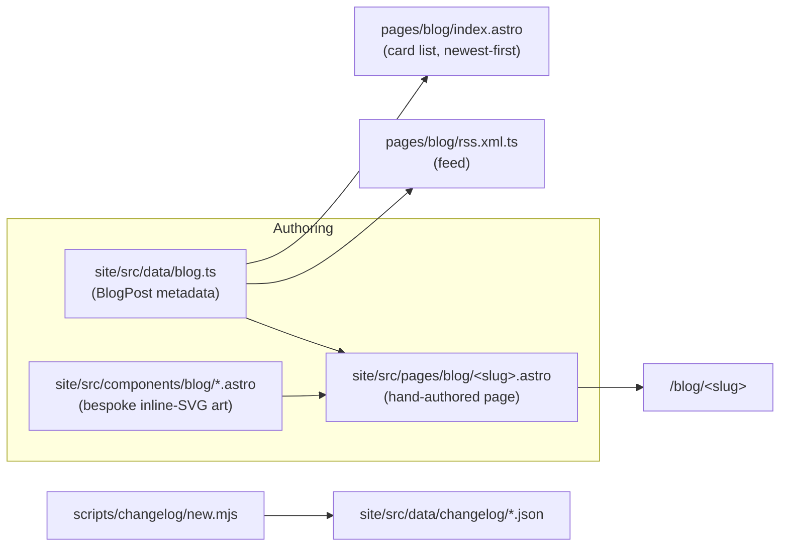
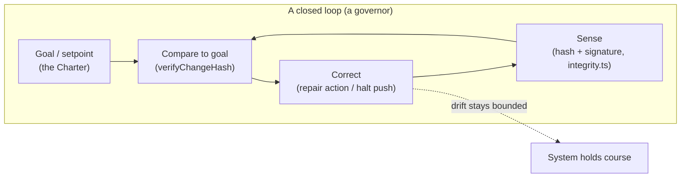
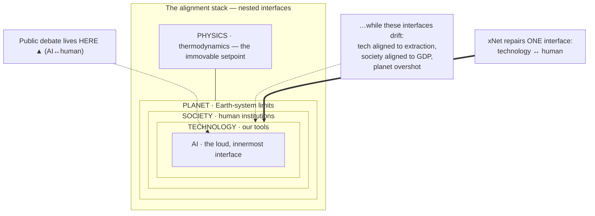

# Hand on the Tiller — Course Correction and Alignment Across Every System

> Exploration for blog post **#9** in the xNet essay series. The prior essays
> borrowed a living system as a lens — a pirate sea, forest soil, a star, a
> desert, a food forest. This one steps back from the metaphors to the idea
> underneath all of them: every system worth keeping is *steered*, not set. It's
> the series' first piece to take on the word of the age — **alignment** — head
> on, and to argue that the version everyone is arguing about (AI) is the
> narrowest slice of a much older problem.

## Problem Statement

Write an essay on **course correction and alignment** that refuses to stay in the
lane where the word currently lives. In 2026, "alignment" means one thing in the
public conversation: *how do we make AI do what humans want?* That is a real and
urgent question. But it is the **top layer of a stack**, and we are trying to
bolt an aligned machine onto a civilization that is, by its own instruments,
badly out of alignment with itself and with the planet it runs on.

The brief, in the user's words: *we talk about AI alignment, but we don't talk
about **human** alignment, or technology's alignment with humanity in general —
what it means for technology to be aligned with humans, and what it means for
humans to be aligned with the planet they live on. Not just AI, not just humans,
not just the planet, not just physics. What does it actually take to be aligned,
and how do we course-correct? How can xNet help — because things are moving very
fast, often out of public view, and what could everybody be doing if they were
more conscious of how technology interacts with them?*

The trap to avoid: a vague "everything is connected" sermon, or a doom essay that
diagnoses misalignment at five scales and offers nothing you can hold. The essay
has to do three hard things at once — (1) reframe alignment as a property of a
**nested stack** of systems, not a single AI problem; (2) name precisely **what
breaks** at each interface (and show it's the *same* break every time); and (3)
land on something concrete a person and a piece of software can actually *do* —
without overselling a notes app as a cure for the biosphere. As always, every
"technology should serve people" claim has to have a **file behind it**, and the
essay has to be honest about where its own metaphor thins out.

## Executive Summary

**Recommendation: write it, as essay #9, titled _"Hand on the Tiller."_** The
spine is hiding in the etymology, and it reframes the whole debate: the science
of **feedback and control** is called *cybernetics*, from the Greek
**κυβερνήτης — *kybernḗtēs*, the steersman**. The same root gives us *governor*
(via the Latin *gubernator*) and *govern*. Norbert Wiener named the field in 1948
after the oldest, best-developed feedback device he knew: the hand on a ship's
tiller, correcting the course a hundred times a minute. **The word for keeping a
course and the word for governing are the same word.** That is the essay's
argument in one line: alignment is not a state you reach and lock; it is a
*course you hold* by continuous correction. We picked the static word
("alignment" — two arrows pointing the same way) for a dynamic act ("steering" —
never arriving, always correcting). The brief's own phrase, *course correction,*
is the more honest term.

- **The reframe: the alignment stack.** Alignment is a relationship at an
  *interface* between two systems, and the systems are **nested**: physics ⊃ the
  planet ⊃ human society ⊃ our technology ⊃ AI. AI alignment is the innermost,
  newest, loudest interface. But an aligned AI bolted onto a technology layer
  that is aligned to *extraction*, running on a society aligned to *GDP*, sitting
  on a planet whose limits that society is overshooting, doesn't save us — it
  makes a misaligned stack **faster and more powerful**. You cannot align the top
  of a stack while the bottom is drifting.
- **The break is the same at every layer.** At each interface, misalignment has
  one recurring cause: a **proxy captures the goal, and the feedback loop is
  severed.** Engagement replaces wellbeing (Goodhart's Law); GDP replaces
  flourishing; a fixed objective replaces "what the human actually wants" (Stuart
  Russell's *King Midas problem*). And in every case the correction loop is cut:
  you can't *see* what the system is doing to you, can't *leave* it, can't *say
  no*, can't *undo*. Open loop → drift.
- **It is non-fiction about xNet.** xNet can't align the planet or solve AI
  safety, and the essay says so plainly. What it *can* do is repair **one
  interface — technology ↔ human** — and it does it the honest way: not by
  promising good intentions, but by handing the individual back the
  **instruments of course correction.** Undo (reverse a step:
  [`packages/history/src/undo-manager.ts`](../../packages/history/src/undo-manager.ts)).
  Exit (leave a drifting system, losing nothing:
  [`packages/identity/src/keys.ts`](../../packages/identity/src/keys.ts)). Consent
  (steer what leaves your device:
  [`packages/telemetry/src/consent/manager.ts`](../../packages/telemetry/src/consent/manager.ts)).
  Calm (refuse to optimize the engagement proxy:
  [`scripts/check-humane-patterns.mjs`](../../scripts/check-humane-patterns.mjs)).
  Read the machine (restore observability — you can open it:
  [`the-loom-you-can-read`](../../site/src/pages/blog/the-loom-you-can-read.astro)).
  Own the master copy (the paradigm change — the highest-leverage move there is:
  [`docs/CHARTER.md`](../CHARTER.md) §1).
- **The code already steers.** The essay's cleanest surprise is that xNet's
  internals are *literally* feedback loops. The change log is hash-chained so
  corruption is **detectable**, and the integrity checker returns *repair
  actions* ([`packages/sync/src/integrity.ts`](../../packages/sync/src/integrity.ts)).
  The sync provider **watches its own error rate** and halts after five
  structural rejections rather than flooding the hub — a circuit breaker, a
  governor
  ([`packages/runtime/src/sync/node-store-sync-provider.ts`](../../packages/runtime/src/sync/node-store-sync-provider.ts)).
  The CI gates fail the build when a dark pattern creeps in
  ([`scripts/check-humane-patterns.mjs`](../../scripts/check-humane-patterns.mjs),
  [`scripts/check-motion-vocab.mjs`](../../scripts/check-motion-vocab.mjs)). These
  aren't metaphors for feedback; they *are* feedback.
- **Honest about the strain.** The romantic "a rocket is off-course 90% of the
  time" line is a **myth** — real Apollo was precise and needed only one to four
  midcourse corrections. "Alignment" begs the question *aligned to whose values?*
  — and the essay's whole point is that we should be suspicious of anyone who
  claims to know the human utility function. And feedback is necessary but not
  sufficient: a person with a perfect tiller can still hold a bad course
  steadily. All of this goes in the self-audit panel.

It slots into the existing blog machinery with **zero new infrastructure** — one
data entry, one art-directed `.astro` page, and three inline-SVG components (a
tiller/steersman hero, the signature "alignment stack" diagram, and the honesty
panel). It reuses existing tags and follows the inline-SVG / Self-Audit
convention every prior post follows.

## Current State In The Repository

### The blog is a well-grooved, single-sourced system

A new post is **one metadata entry + one page + a few bespoke SVG components**,
and the index and RSS feed update themselves. This is unchanged since essay #1
([`0239`](./0239_[x]_A_GREAT_PIRATE_AGE_ONE_PIECE_AND_THE_XNET_ETHOS.md)).



Verified today:

- **Metadata, single-sourced** —
  [`site/src/data/blog.ts`](../../site/src/data/blog.ts): the `BlogPost` type, the
  `posts[]` array (currently **8** published), `publishedPosts()` (newest-first,
  drops drafts), `postBySlug()`, `formatPostDate()`. `BlogTag` is a closed union:
  `'essay' | 'philosophy' | 'privacy' | 'decentralization' | 'protocol' |
  'nature' | 'cosmos' | 'economics'`. This post reuses existing tags — **no union
  change**.
- **The pages** — [`site/src/pages/blog/`](../../site/src/pages/blog/):
  `index.astro`, `rss.xml.ts`, one `.astro` per post. Canonical shape:
  `postBySlug(slug)!` → a bespoke hero → an `<article class="prose …">` body,
  closing with a `<h3 id="sources">Sources</h3>` coda and a small
  "independent essay / loads nothing third-party" disclaimer. See
  [`the-right-to-say-no.astro`](../../site/src/pages/blog/the-right-to-say-no.astro),
  the closest sibling in texture (a conceptual essay that responds to an outside
  argument and ends on receipts).
- **Bespoke art, all inline SVG** —
  [`site/src/components/blog/`](../../site/src/components/blog/): each post ships a
  `*Hero`, usually one signature diagram (`HydrostaticBalance`, `DustBridge`,
  `GrowthVsLeverage`, `PrincipleWheel`), and an `Honest*` self-audit panel
  (`HonestExit`, `HonestDesert`, `HonestGarden`). **Critical convention: no
  third-party assets — every illustration is inline SVG so the page ships nothing
  external**, and the cosmic-X logo recurs as the brightest node in every hero.
- **The recurring opener — and the standing instruction to soften it.** Early
  posts opened with an enumerated series recap ("The first time we looked up…").
  By [`0246`](./0246_[x]_PERMACULTURE_FOR_THE_OPEN_WEB_REGENERATING_THE_DIGITAL_COMMONS.md)
  the brief asked posts to **stand on their own** and reference siblings glancingly.
  This post continues that: a single quiet line at most, prior essays linked in
  the Sources coda, not the body.

### The thesis is already the project's stance — with unusually literal receipts

This essay is non-fiction. Its claim — *aligned technology hands you the controls
back* — is the operational content of the Charter, and, more surprisingly, of the
sync internals.

**The compass (`docs/CHARTER.md`).** [`docs/CHARTER.md`](../CHARTER.md) —
*"Software that serves instead of extracts."* Six commitments, each with a
code/CI receipt: **Own**, **Exit**, **Calm**, **Consent**, **Agency**,
**Commons**. It grew out of a *neo-Luddite audit*
([`0234`](./0234_[_]_MITIGATING_INTERNET_HARMS_A_NEO_LUDDITE_AUDIT_OF_XNET.md)) and
holds itself to the historical Luddites' own test: refuse *"machinery hurtful to
commonality."* [`docs/VISION.md`](../VISION.md) frames the scale — "from personal
notes to planetary-scale infrastructure" — which is exactly the stack this essay
climbs.

**The instruments of course correction (verified files).**

| Instrument (essay term) | What it is | Where it lives |
| --- | --- | --- |
| **Undo** — reverse a step | Per-node undo/redo via compensating changes; a global stack with `undoLatest()` / `redoLatest()` for cross-node app-wide undo | [`packages/history/src/undo-manager.ts`](../../packages/history/src/undo-manager.ts); hooks [`useGlobalUndo.ts`](../../packages/react/src/hooks/useGlobalUndo.ts), [`useUndoScope.ts`](../../packages/react/src/hooks/useUndoScope.ts); exploration [`0179`](./0179_[x]_UNIVERSAL_APP_WIDE_UNDO.md) |
| **Exit** — leave, losing nothing | Portable `did:key` derived from a master seed (HKDF); works on any hub; whole-workspace JSON export | [`packages/identity/src/keys.ts`](../../packages/identity/src/keys.ts), [`packages/data/src/database/export/json-export.ts`](../../packages/data/src/database/export/json-export.ts) (Charter §2) |
| **Consent** — steer what leaves | Telemetry **off by default** (`DEFAULT_CONSENT.tier = 'off'`), progressive opt-in tiers, scrubbed + bucketed | [`packages/telemetry/src/consent/manager.ts`](../../packages/telemetry/src/consent/manager.ts) (Charter §4, exploration 0210) |
| **Calm** — refuse the engagement proxy | No infinite scroll, streaks, engagement ranking; chronological feeds; rule-based notifications, first-match priority, own changes never notify | [`scripts/check-humane-patterns.mjs`](../../scripts/check-humane-patterns.mjs), [`packages/comms/src/notify/rules.ts`](../../packages/comms/src/notify/rules.ts) (Charter §3) |
| **Read the machine** — restore observability | An open, signed, hash-chained change log you're allowed to open and audit | [`packages/sync/src/change.ts`](../../packages/sync/src/change.ts); essay [`the-loom-you-can-read`](../../site/src/pages/blog/the-loom-you-can-read.astro) |
| **Own the master copy** — change the paradigm | Local store is the primary copy (event-sourced LWW over OPFS-backed SQLite); the hub is a convenience, not a landlord | [`packages/data/src/store/store.ts`](../../packages/data/src/store/store.ts) (Charter §1) |

**The code that is literally a feedback loop (the essay's best surprise).**

- **Detect-and-repair.** [`packages/sync/src/integrity.ts`](../../packages/sync/src/integrity.ts)
  verifies each change's hash and signature, detects chain breaks / missing
  parents / duplicates / impossible timestamps, and returns *repair actions*
  (`recompute-hash`, `request-from-peers`, `remove-duplicate`, `mark-orphan`).
  The system senses its own error and prescribes the correction.
  [`packages/sync/src/change.ts`](../../packages/sync/src/change.ts) exposes
  `computeChangeHash()` / `recomputeChangeHash()` / `verifyChangeHash()` — the
  measurement that makes the loop closable.
- **A governor, in the flyball-governor sense.**
  [`packages/runtime/src/sync/node-store-sync-provider.ts`](../../packages/runtime/src/sync/node-store-sync-provider.ts)
  counts consecutive structural rejections (`INVALID_HASH`, `INVALID_SIGNATURE`,
  `INVALID_CHANGE`) and, after five, **halts its own outbound pushes** until
  reconnect — so a client running skewed code can't flood the hub. It watches
  itself and throttles: a protocol-skew circuit breaker.
- **The build watches the builders.**
  [`scripts/check-humane-patterns.mjs`](../../scripts/check-humane-patterns.mjs)
  is two rule groups — `dark-pattern` (bans infinite scroll, streak counters,
  confirmshaming; scoped to UI surfaces) and `surplus` (bans third-party
  ad/analytics SDKs; scoped to all of `packages/` + `apps/`) — with a
  reason-required `humane-ok` escape hatch.
  [`scripts/check-motion-vocab.mjs`](../../scripts/check-motion-vocab.mjs) bans
  `transition-all`, raw duration literals, and retired easings. These are
  *negative feedback on the project's own drift.*



## External Research

The essay stands on a lineage that is older and deeper than the current AI
discourse — which is exactly the point. Alignment isn't a 2020s invention; it's
the founding problem of a science named in 1948.

### Cybernetics: the science of steering (the spine)

- **Etymology.** *Cybernetics* < Greek **κυβερνήτης (*kybernḗtēs*)**, "helmsman,
  steersman." The Latin corruption *gubernator* gives English **govern** and
  **governor**. Plato used *kybernetes* in *Alcibiades I* for the *governance of
  people*; Ampère in the 1830s used *cybernétique* for the science of civil
  government. **Steering a ship, governing a machine, and governing people are,
  at the root, one word.** (Verified: Wiktionary; Wikipedia, *Cybernetics*.)
- **Wiener names the field (1948).** Norbert Wiener, *Cybernetics, or Control and
  Communication in the Animal and the Machine* — chose the name to honor James
  Clerk Maxwell's 1868 paper *On Governors* (the analysis of the centrifugal
  **flyball governor**, the canonical negative-feedback device), calling the
  ship's steering engine "one of the earliest and best-developed forms of
  feedback mechanism." Feedback = using the *gap between where you are and where
  you meant to be* to drive the next correction.
- **Wiener states the AI alignment problem — in 1960.** *Some Moral and Technical
  Consequences of Automation* (Science, 131:1355): *"If we use, to achieve our
  purposes, a mechanical agency with whose operation we cannot interfere once we
  have started it… then we had better be quite sure that the purpose put into the
  machine is the purpose which we really desire and not merely a colourful
  imitation of it."* This is the King Midas problem, 59 years before Russell
  named it — and it also names the brief's **speed** worry directly: the danger is
  agency "so fast and irrevocable that we have not the data to intervene before
  the action is complete."

### Alignment, in the narrow (AI) sense — the top of the stack

- **Stuart Russell, *Human Compatible* (2019).** The "standard model" of AI —
  humans specify a fixed objective, the machine optimizes it — is the flaw. Fixed
  objectives + capable optimizers = the **King Midas problem**: you get exactly
  what you asked for, including the parts you didn't mean. Russell's fix is
  **corrigibility**: build machines that are *uncertain* about human preferences,
  learn them from behavior, and therefore have a positive incentive to *let
  themselves be switched off.* Read as systems design, that's: **keep the human in
  the loop and the off-switch reachable** — keep the loop closed.
- **Goodhart's Law.** "When a measure becomes a target, it ceases to be a good
  measure" (Charles Goodhart, 1975; Marilyn Strathern's crisp phrasing). Its AI
  form is **reward hacking** — the boat-race agent that spins in circles farming
  bonus points instead of finishing. Its social form is **engagement**: optimize
  a proxy for "this was good for you" and you eventually get the opposite. This is
  the single mechanism of misalignment that recurs at *every* layer of the stack.

### The middle of the stack: technology ↔ human, human ↔ planet

- **Donella Meadows, *Leverage Points: Places to Intervene in a System* (1997/99).**
  Twelve places to push, ranked. The **lowest** leverage (and where we spend
  almost all our attention) is *parameters* — numbers, subsidies, a knob on an
  algorithm. The **highest** leverage is the **goal of the system** (#2) and the
  **paradigm** the system arises from (#1) — the shared, unstated assumptions.
  Corollary the essay leans on hard: *you cannot fix a misaligned system by tuning
  its parameters; you have to change its goal, or the mindset underneath it.*
  xNet's "you hold the master copy / leaving loses nothing" is a paradigm move,
  not a feature — which is why it's more powerful than any feature.
- **Planetary boundaries (Rockström, Steffen et al., 2009; updated 2023–2025).**
  Nine Earth-system limits (climate, biosphere integrity, land use, freshwater,
  biogeochemical flows, novel entities, aerosols, ocean acidification, ozone).
  As of the 2023 update, **six** were transgressed; the 2025 Planetary Health
  Check names ocean acidification the **seventh**. This is the human ↔ planet
  interface, misaligned in exactly the Goodhart way: an economy steering by GDP (a
  proxy) overshoots the limits GDP doesn't measure.
- **Ashby's Law of Requisite Variety ("only variety can absorb variety," 1956).**
  A controller must have at least as many possible responses as the system it
  regulates has states — or it loses control. Implication for alignment: **you
  cannot steer what you cannot match with feedback.** Sever the feedback (you
  can't see, can't leave, can't say no) and control is *arithmetically*
  impossible, not just hard. Restoring feedback isn't a nicety; it's the
  precondition for steering at all.

### Adjacent framings (a subtle nod, not the spine)

- **Albert O. Hirschman, *Exit, Voice, and Loyalty* (1970)** — already the spine
  of essay #5. Voice has teeth only when Exit is credible. In this essay's terms,
  Exit is *the feedback channel of last resort*; removing it opens the loop.
- **Yanis Varoufakis, *Technofeudalism* (2023)** and **Shoshana Zuboff,
  *Surveillance Capitalism* (2019)** — where the technology↔human interface
  actually broke, and why.
- **Stafford Beer's Viable System Model / W. Ross Ashby's homeostat** — the
  cybernetic tradition that treats *any* durable system (a cell, a firm, a state)
  as a nest of feedback loops. Cited lightly to establish that "nested steering"
  is a real discipline, not a poetic flourish.

## Key Findings

1. **"Alignment" is the wrong word for a right idea; "steering" is the honest
   one.** Alignment is static (two arrows, one direction, done). Real systems
   drift — thermodynamically, economically, socially. The thing that keeps a
   course is *continuous correction against feedback*, which is why the brief's
   pairing — *course correction* **and** *alignment* — is more accurate than the
   headlines. Cybernetics has said this since 1948; we forgot and re-imported the
   idea under a stiffer name.
2. **Alignment is a stack, and we're arguing about the top floor.** Physics ⊃
   planet ⊃ society ⊃ technology ⊃ AI. The public debate is almost entirely
   about the AI↔human interface. But an aligned AI on a technology layer aligned
   to extraction, on a society aligned to GDP, on an overshot planet, is a
   *faster misalignment*, not a fix. This is the essay's central, load-bearing
   claim.
3. **The break is identical at every interface: proxy capture + severed
   feedback.** Engagement-for-wellbeing, GDP-for-flourishing, fixed-objective-for-
   intent — one mechanism (Goodhart) — and in each case the correction loop is
   cut. This is what makes the essay a single argument instead of five complaints.
4. **The highest-leverage correction is the paradigm, not the parameter
   (Meadows).** Regulating one AI model, or adding one privacy setting, is a
   parameter tweak. Changing *who holds the master copy* and *whether leaving
   costs anything* changes the system's goal. xNet is a paradigm intervention
   disguised as an app.
5. **xNet's contribution is small, real, and honest: it repairs one interface by
   returning the instruments of course correction.** Not "trust us"; *here is the
   undo, here is the exit, here is the consent switch, here is the source you can
   read.* And — the surprise — those instruments are the same negative-feedback
   loops the codebase already uses to keep *itself* on course (`integrity.ts`, the
   sync circuit breaker, the CI gates).
6. **Zero new infrastructure.** Reuses the page + data + RSS pattern, existing
   tags, and the inline-SVG / Self-Audit convention. New code = one page + three
   SVG components.

### The mapping (the heart of the essay)

Each layer, the proxy that captured its goal, the feedback that got severed, and
the correction that would re-close the loop. The technology↔human row is the only
one xNet touches — and it touches it with real files.

| Interface | Proxy that captured the goal | Feedback that got severed | The correction (and, for tech↔human, the xNet receipt) |
| --- | --- | --- | --- |
| **AI ↔ human** | A fixed objective stands in for "what the human wants" (King Midas) | The off-switch; the human in the loop; the model's uncertainty about us | Corrigibility — keep the human able to interrupt, override, and switch off (Russell) |
| **Technology ↔ human** | *Engagement* stands in for *wellbeing* (Goodhart) | You can't see what's taken, can't leave, can't say no, can't undo | **Restore the instruments:** Consent ([`consent/manager.ts`](../../packages/telemetry/src/consent/manager.ts)), Exit ([`identity/keys.ts`](../../packages/identity/src/keys.ts)), Calm/no-engagement-ranking ([`check-humane-patterns.mjs`](../../scripts/check-humane-patterns.mjs)), Undo ([`history/undo-manager.ts`](../../packages/history/src/undo-manager.ts)), Read-the-machine ([`sync/change.ts`](../../packages/sync/src/change.ts)) |
| **Human ↔ planet** | *GDP / growth* stands in for *flourishing within limits* | Prices don't carry ecological cost; the overshoot is invisible until late | Put the limit back in the loop — planetary boundaries as the setpoint (Rockström); Meadows' paradigm shift |
| **Society ↔ itself** | *Metrics / quarterly targets* stand in for *the mission* (Goodhart, org edition) | Exit and Voice removed by lock-in and chokepoints (Hirschman) | Keep exit credible so voice has teeth; nested, legible governance |
| **Everything ↔ physics** | (No proxy — physics is the one setpoint you can't Goodhart) | — | The boundary condition: entropy always votes; every other layer must correct *against* it, forever |



## Options And Tradeoffs

### Framing options (which spine carries it)

| Option | Spine | Pros | Cons |
| --- | --- | --- | --- |
| **A. Hand on the tiller / cybernetics** (recommended) | Alignment = steering; *kybernetes* → governor → govern; the nested stack; the loop that closes or opens | Etymology *is* the argument; unifies AI, tech, humans, planet under one mechanism; "course correction" becomes literal, not motivational-poster | Must resist the cute-etymology trap — earn it with the stack + real feedback code |
| **B. The alignment stack** | Lead with the nested-systems diagram; walk each interface | Crisp, teachable, matches the brief's "all the systems" ask | Risks feeling like a lecture; needs the tiller image to stay warm |
| **C. "The other alignment problem"** | Direct rebuttal to AI-only alignment discourse | Punchy, of-the-moment, names the reframe outright | More reactive/argumentative than the series' contemplative texture; dates faster |
| **D. Goodhart all the way down** | One mechanism (proxy captures goal) at five scales | Intellectually tight; very quotable | Narrower; better as a *section* than the whole spine |

**Recommendation: A, with B as the structural middle and D as the recurring
motif.** Open on the steersman and the etymology (steering = governing = the same
word); build the stack as the body (B); let Goodhart be the villain that recurs
at each floor (D); keep "the other alignment problem" (C) as a single sharp line
in the open, not the frame.

### Structuring the body (so it's an argument, not a list of scales)

Four movements, each closing one loop:

1. **The word we mislaid.** Alignment vs. steering; Wiener, the governor, and the
   1960 quote that is the AI-alignment problem verbatim. Establish: *you never
   arrive at aligned; you hold a course.*
2. **The stack.** Physics → planet → society → technology → AI. Show the same
   break (Goodhart + severed feedback) at each interface. Name the trap: aligning
   the top floor while the basement drifts.
3. **How a loop closes.** The four parts of any correction — *sense, compare to a
   goal, act, and keep the goal honest* — and what severs each in modern tech
   (you can't see / compare / act / and the goal's been swapped for a proxy).
   Meadows: the paradigm is the high-leverage point.
4. **What one honest tool can do.** xNet repairs the technology↔human interface by
   returning the instruments — with the receipts — and, quietly, the reveal that
   those instruments are the same feedback loops the code uses on itself. Then the
   "everybody" turn: alignment at civilization scale is the *sum of billions of
   small course corrections* by people who kept a hand on the tiller — prefer
   tools you can see into, leave, undo, and switch off.

### Title options

| Title | Read |
| --- | --- |
| **Hand on the Tiller** (recommended) | Series-consistent evocative noun phrase; carries the whole cybernetics spine (steersman = governor = govern); "course correction" made literal |
| The Other Alignment Problem | Names the reframe head-on; punchy but more reactive/argumentative than the series voice |
| The Steersman | Clean single noun; the *kybernetes*; a touch bare without the deck |
| Course Correction | Matches the brief exactly; plainer, less evocative |
| The Long Correction | Echoes "The Long Now"; foregrounds *continuous*; slightly abstract |
| Aligned to What? | Foregrounds the "whose values?" honesty beat; good subhead, thin as a title |

### Tag options

- **Reuse `['essay', 'philosophy']`, plus `'decentralization'`** (recommended) —
  the philosophy spine (as in the nature/economics essays) plus the
  local-first/exit payoff (the `'decentralization'` tag used by
  [`the-loom-you-can-read`](../../site/src/pages/blog/the-loom-you-can-read.astro)
  and [`a-great-pirate-age`](../../site/src/pages/blog/a-great-pirate-age.astro)).
  Both tags already exist in the union — no `BlogTag` change, no tag-styling work.
- Adding `'economics'` (as [`the-right-to-say-no`] uses) is defensible for the
  GDP/planetary-boundaries thread, but the center of gravity is philosophy +
  decentralization; keep it to three tags.
- **Do not** add a new `'systems'` or `'ai'` tag for a single post — it touches
  the union and the index/RSS tag rendering for little gain.

### Art options (inline SVG, Self-Audit parity)

- **`TillerHero`** (recommended) — a small boat holding a line across water toward
  a fixed guiding star, with a dotted track showing constant small zig-zag
  corrections converging on the intended course; the **cosmic-X glows as the
  guiding star** (the recurring "X as the brightest node" motif). Mirror the
  established hero prop contract (`title`, `deck`, `date`, `readingMinutes`,
  `tags`) exactly — only the artwork changes.
- **`AlignmentStack`** (recommended signature diagram) — the series' "one diagram"
  slot. Concentric shells, physics (outer) → planet → society → technology → AI
  (inner), with a bracket/annotation showing the public debate clustered on the
  innermost interface while the outer interfaces are drawn *misaligned* (offset
  shells). The single visual that makes the whole thesis legible at a glance.
- **`HonestTiller`** (recommended self-audit, modeled on `HonestExit`) — the
  honest beats in a two-column "what it isn't / what it is" table: (1) the "off
  course 90% of the time" line is a **myth** — Apollo was precise (one to four
  corrections); (2) "alignment" begs *aligned to whose values?* — we don't claim
  to know the human utility function, and distrust anyone who does; (3) xNet
  repairs **one** interface — not the planet, not AI safety (cf. `HonestExit`'s
  "we can't fix your rent"); (4) feedback is necessary, not sufficient — a steady
  hand can hold a bad course; instruments enable correction, they don't choose the
  destination.

## Recommendation

Write **essay #9: _"Hand on the Tiller."_** Framing A (cybernetics/steering),
the four-movement body, tags `['essay', 'philosophy', 'decentralization']`,
~13–15 minute read, slug `hand-on-the-tiller`.

Narrative arc:

1. **Cold open — the steersman.** A helmsman doesn't set the wheel and walk away;
   the sea, the wind, and the current push the boat off-line every second, and he
   answers with a hundred small corrections a minute. The word for what he does —
   *kybernetes* — is the word Wiener chose for the science of feedback, and it's
   the same root as *governor* and *govern*. One glancing line ties back to the
   series (sea, soil, sky, forest — we've been aboard this boat before), then
   moves on. Land the reframe: we imported an old idea under a stiff new name.
   *Alignment* sounds like a destination. *Steering* tells the truth — you never
   arrive; you hold a course.
2. **The stack.** Everyone's arguing about one interface: will the AI want what we
   want? Fair — but zoom out. Alignment is a relationship at a seam between two
   systems, and the systems nest: physics holds the planet, the planet holds our
   societies, societies hold our technology, technology now holds AI. Walk down
   the floors. At each one, the same break: a **proxy eats the goal** (engagement
   for wellbeing, GDP for flourishing, a fixed objective for intent) and the
   **feedback gets cut**. Name the trap plainly: an aligned AI bolted to a
   technology layer that runs on extraction, on a society that steers by GDP, on a
   planet past six of nine limits, isn't salvation — it's a faster wrong turn.
3. **How a loop closes.** Any correction has four parts: *sense* where you are,
   *compare* it to where you meant to be, *act* on the gap, and — the part we
   forget — keep the goal *honest* so you're not steering toward a proxy. Modern
   tech severs all four: you can't see what it takes (no sensing), can't tell
   good-for-you from good-for-them (the goal's been swapped), can't leave or undo
   (no acting). Meadows' punchline: we obsess over the lowest-leverage point
   (tune a parameter, regulate one model) and flinch from the highest — the
   *paradigm*. Change who holds the master copy and you've changed the goal of the
   whole system.
4. **What one honest tool can do.** Be honest about scope first (the panel). Then:
   there's exactly one interface a small open-source project can repair —
   technology↔human — and the way you repair it is to hand the controls back. Undo
   (reverse the step). Exit (leave, losing nothing — the feedback channel of last
   resort). Consent (you steer what leaves your device). Calm (we refuse to
   optimize the engagement proxy, and the build fails if someone tries). Read the
   machine (it's open; you can audit the loop). Own the master copy (the paradigm
   move). The quiet reveal: these are the same negative-feedback loops the code
   runs on *itself* — the integrity checker that senses corruption and prescribes
   a repair, the sync governor that halts before it floods the hub, the CI gate
   that fails on the project's own drift. Close on the "everybody": alignment at
   the scale of a civilization isn't one heroic fix. It's the sum of billions of
   small corrections by people who kept a hand on the tiller — who preferred tools
   they could see into, leave, undo, and switch off. Fast and out-of-sight is how
   the wheel gets taken. Keep your hand on it.

Concrete next step after approval: implement the page, metadata, and three SVG
components; regenerate a changelog fragment; verify the index card, the post
route, and the RSS feed.

## Example Code

### 1) Metadata entry — prepend to `posts[]` in `site/src/data/blog.ts`

```ts
{
  slug: 'hand-on-the-tiller',
  title: 'Hand on the Tiller',
  description:
    'Everyone is arguing about one alignment problem: will the AI want what we ' +
    'want? But alignment is a stack — physics, planet, society, technology, AI — ' +
    'and we are bolting an aligned machine onto a civilization that steers by ' +
    'the wrong stars. The oldest word for the fix is the root of “cybernetics” ' +
    'and “govern”: the steersman, correcting course a hundred times a minute. ' +
    'What it takes to actually hold a course — and the small, real instruments ' +
    'a piece of software can hand back.',
  pubDate: '2026-07-05T15:00:00Z', // set to the actual publish instant at ship time
  author: 'xNet',
  tags: ['essay', 'philosophy', 'decentralization'],
  readingMinutes: 14
},
```

> The `posts` array renders newest-first by `pubDate`; the index card and the RSS
> feed pick this up automatically. No edits to `index.astro` or `rss.xml.ts`.

### 2) Page skeleton — `site/src/pages/blog/hand-on-the-tiller.astro`

```astro
---
import Base from '../../layouts/Base.astro'
import Nav from '../../components/sections/Nav.astro'
import Footer from '../../components/sections/Footer.astro'
import TillerHero from '../../components/blog/TillerHero.astro'
import AlignmentStack from '../../components/blog/AlignmentStack.astro'
import HonestTiller from '../../components/blog/HonestTiller.astro'
import { postBySlug, formatPostDate } from '../../data/blog'

const post = postBySlug('hand-on-the-tiller')!
---

<Base title={`${post.title} — xNet`} description={post.description}>
  <Nav />
  <main>
    <TillerHero
      title={post.title}
      deck={post.description}
      date={formatPostDate(post.pubDate)}
      readingMinutes={post.readingMinutes}
      tags={post.tags}
    />
    <article
      class="prose prose-lg mx-auto max-w-3xl px-6 py-16 dark:prose-invert prose-headings:tracking-tight prose-a:text-sky-600 dark:prose-a:text-sky-400"
    >
      <!-- §1 the word we mislaid (kybernetes → governor → govern; Wiener 1948/1960) … -->
      <!-- §2 the stack (physics→planet→society→technology→AI) --> <AlignmentStack />
      <!-- §3 how a loop closes (sense · compare · act · keep the goal honest; Meadows) … -->
      <!-- §4 what one honest tool can do (the instruments + the receipts) … -->
      <HonestTiller />
      <!-- close: keep your hand on the tiller … -->
      <hr />
      <h3 id="sources">Sources</h3>
      <!-- Wiener; Russell; Goodhart/Strathern; Meadows; Rockström; Ashby; Hirschman;
           prior essays linked here, not in the body -->
    </article>
    <Footer />
  </main>
</Base>
```

### 3) Hero component contract — `site/src/components/blog/TillerHero.astro`

Mirror an existing hero's prop contract exactly (e.g. `LeverHero`/`DustHero`) so
the page wiring is identical; only the artwork changes.

```astro
---
// Original art for blog post #9 (exploration 0256). A small boat holds a line
// across open water toward a fixed guiding star; a dotted wake shows constant
// small zig-zag corrections converging on the intended course. The cosmic-X
// glows as the guiding star — the recurring "X as the brightest node" motif.
// All inline SVG; ships nothing third-party (Self-Audit parity).
interface Props {
  title: string
  deck: string
  date: string
  readingMinutes: number
  tags: string[]
}
const { title, deck, date, readingMinutes, tags } = Astro.props
// …hand-placed boat, dotted correcting wake, horizon, cosmic-X as guiding star…
---
```

### 4) Signature diagram contract — `site/src/components/blog/AlignmentStack.astro`

```astro
---
// The series' "one diagram" slot (cf. HydrostaticBalance, DustBridge,
// PrincipleWheel, GrowthVsLeverage). Concentric shells — physics (outer) →
// planet → society → technology → AI (inner). The public debate is bracketed on
// the innermost interface (AI↔human); the outer shells are drawn subtly offset
// (misaligned) to show the drift the essay names. Cosmic-X at the hub. Inline
// SVG only.
const layers = [
  { name: 'Physics',    note: 'the immovable setpoint — entropy always votes' },
  { name: 'Planet',     note: 'six of nine boundaries transgressed' },
  { name: 'Society',    note: 'steers by GDP, a proxy for flourishing' },
  { name: 'Technology', note: 'aligned to engagement, not wellbeing' },
  { name: 'AI',         note: 'the loud, innermost interface' }
]
---
```

## Risks And Open Questions

- **The cute-etymology trap.** "It all comes from one Greek word!" can feel glib.
  **Mitigation:** the etymology *opens* the essay but the *stack* + the real
  feedback code carry the weight; the word is a key, not the whole argument.
- **Grandiosity / the "everything is connected" sermon.** Five scales of
  misalignment can read as a TED talk with no floor. **Mitigation:** the essay
  narrows hard in §4 to the *one* interface xNet touches, with files; the honesty
  panel states the scope limit bluntly (cf. `HonestExit`).
- **The Apollo myth.** The romantic "off course 90% of the time, constantly
  correcting" line is **factually wrong** (Apollo needed ~1–4 midcourse
  corrections and was quite precise). **Mitigation:** don't use it as fact; put it
  in `HonestTiller` as a myth, and make the *real* point with cybernetics
  (negative feedback / homeostasis), which doesn't need the exaggeration.
- **"Aligned to whose values?"** The strongest objection to the whole alignment
  frame is that it smuggles in a fixed human utility function. **Mitigation:**
  make this a feature, not a bug — the essay's thesis is precisely that you
  *can't* freeze the goal, which is why you need *steering* (corrigibility,
  reversibility, exit) rather than a one-time solve. Name it in the panel.
- **AI-alignment audience friction.** Readers deep in AI safety may feel the essay
  waves at their field. **Mitigation:** grant the AI interface its due (Russell,
  corrigibility, Wiener 1960), and be explicit that the move is to *widen* the
  frame, not dismiss it.
- **Determinism / doomer read on planetary boundaries.** Citing "six of nine
  transgressed" can tip into fatalism. **Mitigation:** pair every diagnosis with a
  *correction* (Meadows' leverage points; the loop can be re-closed); the essay's
  mood is *steerable*, not doomed.
- **Overlap with siblings.** Exit/Voice (essay #5) and the extraction critique
  recur. **Mitigation:** cite them glancingly; this essay's distinct contribution
  is the *cybernetic/steering* lens and the *nested stack*, which none of the
  others use.
- **Open question — cadence.** Space #9 a few days after #8 so it isn't buried;
  set `pubDate` accordingly (draft shows 2026-07-05).
- **Open question — link-out density.** Leans on named thinkers (Wiener, Russell,
  Meadows, Goodhart, Rockström, Ashby, Hirschman). Recommend a sober "Sources"
  coda (credit given) with a link-light body, matching prior posts.

## Implementation Checklist

- [ ] Add the `BlogPost` entry to [`site/src/data/blog.ts`](../../site/src/data/blog.ts)
      (slug `hand-on-the-tiller`, tags `['essay','philosophy','decentralization']`).
- [ ] Create `site/src/components/blog/TillerHero.astro` (inline SVG; boat holding
      a course, dotted correcting wake, cosmic-X as the guiding star; mirror an
      existing hero's prop contract).
- [ ] Create `site/src/components/blog/AlignmentStack.astro` (the signature
      diagram: concentric physics→planet→society→technology→AI shells, outer
      shells drawn misaligned, debate bracketed on the inner interface).
- [ ] Create `site/src/components/blog/HonestTiller.astro` (self-audit: Apollo "90%
      off course" is a myth; "aligned to whose values?"; xNet repairs one
      interface only; feedback is necessary not sufficient).
- [ ] Write `site/src/pages/blog/hand-on-the-tiller.astro` following Framing A, the
      four-movement body, and Charter/file receipts (real paths + §§).
- [ ] Keep the opener glancing — one line of series continuity, no enumerated
      recap; link prior essays in the Sources coda, not the body.
- [ ] Keep all art **inline SVG** — no third-party assets (Self-Audit parity);
      cosmic-X recurs as the bright node.
- [ ] Add a "Sources" coda (Wiener 1948 & 1960; Russell 2019; Goodhart 1975 /
      Strathern; Meadows 1997/99; Rockström et al. 2009/2023; Ashby 1956;
      Hirschman 1970) + prior-essay links.
- [ ] Generate a changelog fragment via
      `node scripts/changelog/new.mjs --title "New essay: Hand on the Tiller" --tags site`
      (do **not** hand-author the JSON).
- [ ] `site/` is outside the root eslint/prettier config — format within the site
      workspace if needed.
- [ ] No `docs/sidebar.mjs` / `build:llms` changes — the blog is not in the docs
      sidebar.
- [ ] **No changeset required** — `site/` is not a publishable `packages/*`
      library (per `CLAUDE.md`).

## Validation Checklist

- [ ] Site dev server: `/blog/hand-on-the-tiller` renders; hero, `AlignmentStack`,
      and `HonestTiller` display correctly in light and dark mode.
- [ ] `/blog` index lists the new card newest-first with the right date, reading
      time, and tags.
- [ ] `/blog/rss.xml` includes the new post (title, description, link, pubDate)
      and validates as well-formed RSS.
- [ ] Build passes: `pnpm --filter site build` with no broken imports or type
      errors (`postBySlug('hand-on-the-tiller')` resolves).
- [ ] No external network assets requested by the page (DevTools Network clean —
      Self-Audit parity holds).
- [ ] Social/OG: `Base` title/description populate; text OG is fine (matching the
      prior posts; no hero image required).
- [ ] Every code/charter receipt cited in the body resolves to a real path/section
      (spot-check `undo-manager.ts`, `consent/manager.ts`, `identity/keys.ts`,
      `check-humane-patterns.mjs`, `integrity.ts`,
      `node-store-sync-provider.ts`).
- [ ] Fact check: the Wiener 1960 quote is verbatim; "six of nine planetary
      boundaries" is attributed to the 2023 update (note the 2025 seventh); the
      Apollo "90%" line appears only in `HonestTiller`, flagged as myth; the
      *kybernetes → governor → govern* etymology is stated correctly.
- [ ] Prose check: the essay grants AI alignment its due, then widens the frame;
      it never claims to know the human utility function; the scope limit (one
      interface) is stated plainly; references to prior posts are glancing.
- [ ] Reading time in `blog.ts` matches the finished length (±1 min).
- [ ] Read-through proof: capture a screenshot of the hero + the alignment-stack
      diagram for the PR (per the repo's visual-capture convention).

## References

### xNet (in-repo)

- [`site/src/data/blog.ts`](../../site/src/data/blog.ts) — `BlogPost` type, `posts[]`, helpers, `BlogTag` union.
- [`site/src/pages/blog/the-right-to-say-no.astro`](../../site/src/pages/blog/the-right-to-say-no.astro) — closest sibling in texture (a conceptual essay + Sources coda); [`the-loom-you-can-read.astro`](../../site/src/pages/blog/the-loom-you-can-read.astro) — "a machine you're allowed to open."
- [`site/src/components/blog/HonestExit.astro`](../../site/src/components/blog/HonestExit.astro) — the honesty-panel pattern (inline-SVG / Self-Audit convention).
- [`docs/CHARTER.md`](../CHARTER.md) — the six commitments (Own / Exit / Calm / Consent / Agency / Commons) with code receipts; [`docs/VISION.md`](../VISION.md) — "personal notes to planetary-scale."
- The instruments of course correction: [`packages/history/src/undo-manager.ts`](../../packages/history/src/undo-manager.ts) (undo), [`packages/identity/src/keys.ts`](../../packages/identity/src/keys.ts) + [`packages/data/src/database/export/json-export.ts`](../../packages/data/src/database/export/json-export.ts) (exit), [`packages/telemetry/src/consent/manager.ts`](../../packages/telemetry/src/consent/manager.ts) (consent), [`packages/comms/src/notify/rules.ts`](../../packages/comms/src/notify/rules.ts) (calm), [`packages/sync/src/change.ts`](../../packages/sync/src/change.ts) (read the machine).
- The code that is literally a feedback loop: [`packages/sync/src/integrity.ts`](../../packages/sync/src/integrity.ts) (detect + repair), [`packages/runtime/src/sync/node-store-sync-provider.ts`](../../packages/runtime/src/sync/node-store-sync-provider.ts) (the sync governor / circuit breaker), [`scripts/check-humane-patterns.mjs`](../../scripts/check-humane-patterns.mjs) + [`scripts/check-motion-vocab.mjs`](../../scripts/check-motion-vocab.mjs) (CI negative feedback).
- Related explorations: [`0234` neo-Luddite audit](./0234_[_]_MITIGATING_INTERNET_HARMS_A_NEO_LUDDITE_AUDIT_OF_XNET.md), [`0179` universal undo](./0179_[x]_UNIVERSAL_APP_WIDE_UNDO.md), and sibling essays [`0245` Leveragism](./0245_[x]_LEVERAGISM_AND_THE_LOCAL_FIRST_EXIT_BENN_JORDAN_AND_THE_EXTRACTION_ECONOMY.md) · [`0246` Permaculture](./0246_[x]_PERMACULTURE_FOR_THE_OPEN_WEB_REGENERATING_THE_DIGITAL_COMMONS.md).

### Cybernetics & systems (the spine)

- Norbert Wiener, *Cybernetics, or Control and Communication in the Animal and the Machine* (MIT Press, 1948) — names the field after *kybernetes* / Maxwell's governor.
- Norbert Wiener, *Some Moral and Technical Consequences of Automation*, **Science** 131 (1960): 1355–1358 — "the purpose put into the machine… the purpose which we really desire."
- Donella H. Meadows, *Leverage Points: Places to Intervene in a System* (The Sustainability Institute, 1999): <https://donellameadows.org/archives/leverage-points-places-to-intervene-in-a-system/>
- W. Ross Ashby, *An Introduction to Cybernetics* (Chapman & Hall, 1956) — the Law of Requisite Variety.
- Etymology of *cybernetics* / *governor*: <https://en.wikipedia.org/wiki/Cybernetics>, <https://en.wiktionary.org/wiki/cybernetics>

### AI alignment (the top of the stack)

- Stuart Russell, *Human Compatible: Artificial Intelligence and the Problem of Control* (Viking, 2019) — the standard model, the King Midas problem, corrigibility. FLI summary: <https://futureoflife.org/ai/artificial-intelligence-king-midas-problem/>
- Charles Goodhart (1975); Marilyn Strathern's phrasing (1997) — "when a measure becomes a target…"; AI form: reward hacking.

### Planet & society (the middle of the stack)

- Johan Rockström, Will Steffen et al., *Planetary Boundaries* (2009; update: Richardson et al., **Science Advances**, 2023) — six of nine transgressed; 2025 Planetary Health Check names ocean acidification the seventh: <https://www.stockholmresilience.org/research/planetary-boundaries.html>
- Albert O. Hirschman, *Exit, Voice, and Loyalty* (Harvard University Press, 1970) — exit as the feedback channel that gives voice its teeth.
- Yanis Varoufakis, *Technofeudalism* (2023); Shoshana Zuboff, *The Age of Surveillance Capitalism* (2019) — where the technology↔human interface broke.
