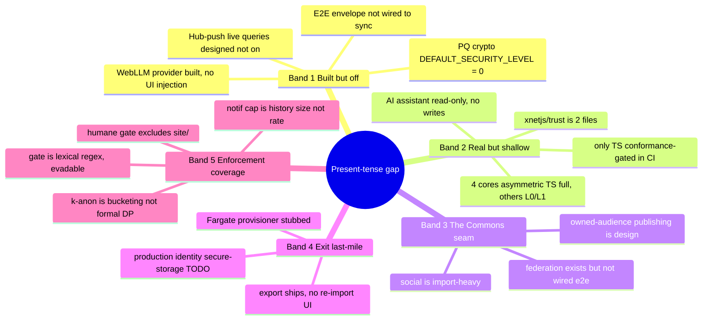
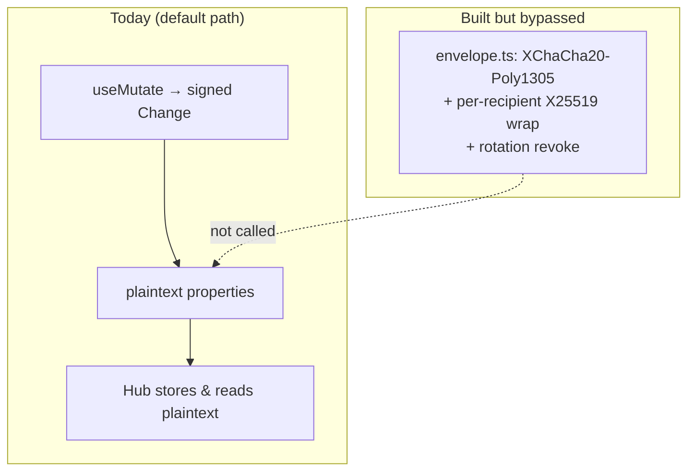
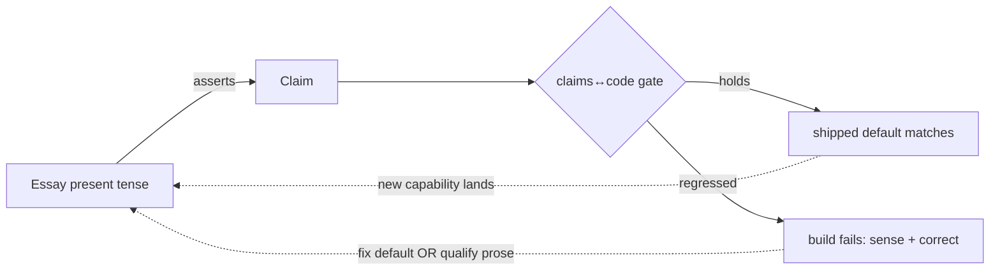

# Closing the Last Mile: Aligning the Code With the Ethos

> A deep introspection into the gaps between what xNet's essays *say* it is
> and what the code actually *does* — and a prioritised program to close them.

## Problem Statement

xNet now has nine long blog essays that, between them, constitute the most
complete statement of its vision, ethos, and spirit that exists anywhere —
more complete than the README, the docs, or the Charter. They promise, in
vivid present tense, a specific kind of software: local-first, self-sovereign,
un-leavable-by-nobody, calm, non-extractive, and *readable all the way down*.

The question this exploration answers is blunt: **where does the code fail to
live up to the essays, and what is the highest-leverage way to close the
distance?**

The honest surprise of the audit is that the answer is *not* "the essays are
hype." xNet's public writing is unusually candid — the Charter tags every
commitment with how it is kept, the comparison page discloses roadmap items and
even names when a competitor is the better choice, and the two developer essays
(`the-loom-you-can-read`, `the-tip-of-the-hook`) each pause to admit their own
caveats. The gap is subtler and more interesting than dishonesty. It has a
single recurring shape, and once you see it you cannot un-see it:

> **The essays' romantic present tense runs one step ahead of the code's
> defaults and last-mile wiring.**

The vision says *"the hub can't even read your content."* The code says *"here
is a complete, tested end-to-end encryption envelope that we have not yet
plugged in, so by default the hub can."* That is the whole exploration in one
sentence, repeated across six subsystems.

## Executive Summary

We read all nine essays and the Charter, then verified their concrete claims
against the repository with a fleet of code audits. Findings:

- **The kernel is real.** Every load-bearing technical claim in the two
  developer essays checks out at the cited path: local-first SQLite in OPFS, a
  signed BLAKE3-hash-chained `Change`, a self-sovereign `did:key`, a
  three-line deterministic LWW merge, a priority scheduler, golden vectors, and
  a hub that provably cannot forge or rewrite history. The loom essay is a fair
  description of the machine.
- **The humane promises are enforced, not asserted.** The "fails the build"
  claim is true: a required CI gate bans dark-pattern primitives and ad SDKs;
  chronological feeds, rule-based notifications, and off-by-default telemetry
  are each backed by regression tests. This is the strongest alignment in the
  whole project.
- **In several places the code is *ahead* of the essays.** Post-quantum
  ML-DSA hybrid signing, in-browser semantic vectors, PII scrubbing + range
  bucketing, and a "what we know about you" purge mirror all exist and are
  tested — and the essays *undersell* them.
- **The gaps cluster into five bands** (detailed below), and every one of them
  is a *last-mile* gap — something built-but-not-wired, real-but-shallow, or
  shipped-in-one-direction-only — rather than a research problem. The single
  most consequential is that **end-to-end encryption is fully built and fully
  bypassed by default.**
- **The weakest seam is the one an entire essay is about.** "Your audience and
  your graph belong to you" (the pirate essay) maps to the Charter's *Commons*
  commitment, which is the only one self-labelled `building`. The social
  package is import-heavy; the *owned-audience publishing* loop is still design.

The recommendation is therefore not "build more" but **"close the loops":** flip
the honest defaults, wire the finished-but-dark subsystems to the tiller, and —
in the spirit of the tiller essay itself — add a *claims↔code conformance gate*
so that an essay written in the present tense cannot drift ahead of a shipped
default without the build noticing.

## Current State In The Repository

### The vision, distilled from nine essays

| Essay | Core promise it makes to the reader |
|---|---|
| A Great Pirate Age | Your flag (`did:key`), your log, your choice of port; **your audience and graph belong to you** |
| Data Should Work Like Soil | Decentralised, reciprocal, revocable sharing; schemas as a commons; "own your nervous system, don't rent it" |
| The Gentlest Furnace | Calm as **negative feedback**; the attention economy is positive feedback / burnout; a system with a governor |
| The Right to Say No | **Leaving loses nothing**; exit as the feedback channel of last resort; AI you can run yourself |
| The Forest and the Field | Regenerative not merely sustainable; "produce no waste" (no behavioural surplus); enforced limits |
| The Loom You Can Read | The kernel, opened: local-first, signed hash chain, `did:key`, LWW, the hub as a low-trust post office, golden vectors |
| The Tip of the Hook | "The hook is the API"; schema-declared authorization enforced by maths; a real DB in a worker |
| The Forest and the Field / Tiller | **Alignment is steering**; keep the loop closed (sense, compare, act, keep the goal honest); the code runs feedback loops on itself |

The Charter (`site/src/data/commitments.ts`, mirroring `docs/CHARTER.md`)
compresses all of this into six commitments, each carrying an unusually honest
**backing label**:

```text
Own     → enforced       (no third-party ad/analytics SDKs can be added)
Exit    → architectural  (portable protocol + portable identity)
Calm    → enforced       (a CI gate bans dark-pattern primitives)
Consent → enforced       (consent-gated, tested off-by-default)
Agency  → architectural  (scaffold-by-default, provenance-tagged)
Commons → building       (BYO hub today; owned-audience publishing in design)
```

That the project ships this self-scoring is the meta-point: xNet already has a
vocabulary for the gap. This exploration mostly fills it in with evidence.

### What holds up (the spine is real)

Every one of these was verified against the code at the path the essays cite:

- **Local-first storage.** SQLite (WASM) in a Web Worker, persisted to OPFS via
  the SAH pool VFS with tuned pragmas — `packages/sqlite/src/adapters/web.ts`.
  A three-lane priority scheduler (`interactive → bulk → write`) exists exactly
  as described — `packages/sqlite/src/adapters/worker-scheduler.ts:27`.
- **The signed change.** `Change<T>` carries `hash`, `parentHash`, `authorDID`,
  `signature`, `lamport` — `packages/sync/src/change.ts`. Hashing is BLAKE3;
  signing is Ed25519; both are verified.
- **Self-sovereign identity.** `createDID()` is the `0xed01`-prefixed, base58btc
  public key, verbatim — `packages/identity/src/did.ts:14`.
- **No referee.** The LWW rule (lamport, then wallTime, then author key) is a
  real, total, deterministic `shouldReplace()` — `packages/data/src/store/store.ts:2472`.
- **The hub cannot cheat.** Incoming changes are rejected on bad hash
  (`INVALID_HASH`) or bad signature (`INVALID_SIGNATURE`) *server-side* —
  `packages/hub/src/services/node-relay.ts:94-119`. The trust-boundary claim is
  true.
- **Revocable grants.** `isGrantActive()` honours `revokedAt`/`expiresAt`;
  envelope key-rotation excludes removed recipients — `packages/data/src/auth/grants.ts:22`.
- **The door is a shipped function.** "Leave with everything" dumps every
  IndexedDB store plus a portable `did:key` and a README —
  `apps/web/src/lib/browser-export.ts:43`, `packages/plugins/src/services/right-to-leave.ts`.
- **Universal undo.** One global `UndoManager` over the NodeStore, proven
  app-wide across surfaces — `packages/history/src/undo-manager.ts`,
  `tests/integration/src/global-undo.test.tsx`.
- **Humane-by-build is not theatre.** `scripts/check-humane-patterns.mjs` runs
  in the required `lint` job and fails on infinite-scroll, streak counters,
  confirmshaming, and ad/analytics SDKs (`gtag`, `fbq`, `mixpanel`, …).
  Chronological feeds (`packages/social/src/feeds/charter-calm-feeds.test.ts`),
  deterministic rule-based notifications (`packages/comms/src/notify/charter-calm-rules.test.ts`),
  and off-by-default telemetry (`packages/telemetry/test/charter-consent-default.test.ts`)
  are each regression-tested.
- **Consent with real scrubbing.** Telemetry defaults to `tier: 'off'`; PII
  (paths, emails, IPs, UUIDs, DIDs) is scrubbed and values are range-bucketed;
  a `describeWhatWeKnow()` mirror lets the user enumerate and purge every
  derived artifact — `packages/telemetry/src/dignity/derived-mirror.ts`.

### Where the code is ahead of the vision (worth crediting)

Introspection that only finds shortfalls is flattering the essays. The audit
found the opposite too:

- **Post-quantum crypto.** `CURRENT_PROTOCOL_VERSION = 3` describes hybrid
  Ed25519 + ML-DSA signatures, and the machinery is built and tested
  (`packages/crypto/src/hybrid-signing.ts`, `hybrid-keygen.ts`, using
  `@noble/post-quantum`). The essays only ever mention Ed25519.
- **In-browser semantic recall** genuinely runs on-device (Xenova transformers
  + an HNSW index) — `packages/vectors/src`.
- **Provenance tagging** (`AI_GENERATED_PROVENANCE = 'ai-generated'`) and a
  scaffold-mode "cite your sources" system prompt are already in the runtime —
  `packages/plugins/src/ai/runtime.ts`.

### The five gap bands



**Band 1 — Built but switched off (the last-mile flips).**

- **End-to-end encryption.** `packages/crypto/src/envelope.ts` is a complete,
  tested E2E system: XChaCha20-Poly1305 content encryption, per-recipient
  X25519 key wrapping, and rotation-based revocation. It is *not called from the
  sync path.* The hub stores `payload.properties` in plaintext and even reads
  them (e.g. mention extraction in `node-relay.ts`). So the loom essay's
  strongest sentence — "on the encrypted path it can't even read your content" —
  is **true in code and false by default.** The essay's own footnote admits it;
  the compare page footnote calls E2EE "on the roadmap." This is the single
  highest-value gap because it is a *wiring* task, not a crypto task.
- **Post-quantum default.** The hybrid machinery exists but
  `DEFAULT_SECURITY_LEVEL = 0` (`packages/crypto/src/security-level.ts:96`),
  whose own comment reads: *"upgrading is just changing DEFAULT_SECURITY_LEVEL."*
- **Hub-push live queries.** The hook essay is explicit: "designed and named in
  the code but not switched on yet."
- **Local models.** The WebLLM provider is fully implemented and flagged
  `privacy: 'local'` (`packages/plugins/src/ai/connectors/webllm-provider.ts`),
  but `USABLE_TIERS` excludes it — detectable, not instantiable
  (`apps/web/src/workbench/views/ai-chat-connector.ts`). "AI you can run
  yourself" is BYO-key/Ollama/bridge today, not in-tab.

**Band 2 — Real but shallow (asymmetric polish).**

- **Four language cores.** All four exist, but only TypeScript is complete *and*
  CI-gated. Rust (`rust/xnet-core`) is a full L0–L3 kernel but runs no CI job;
  Swift (`swift/XNetKit`) and Python (`conformance/reference/python`) implement
  L0+L1 (identity + signing) only — no L2 replication. So "this exact case
  passes against TypeScript, Rust, Swift, and Python" is accurate *only for the
  identity/change vectors*, and cross-language drift is currently undetected.
- **The assistant.** Grounded, provenance-tagged, citation-prompted — but
  **read-only**; writes/tool-execution are "the next step"
  (`apps/web/src/workbench/views/AiChatPanel.tsx`). "An assistant grounded in
  your workspace" is a read-only context pack, not yet an agent.
- **`@xnetjs/trust`** is two files despite the extensibility-fabric plan to make
  it the shared trust spine.

**Band 3 — The Commons seam (the weakest, and the most essay-laden).** The
pirate essay's emotional core — you own your audience — is the one commitment
the Charter itself marks `building`. `packages/social` is dominated by
*importers* (X, TikTok, Instagram, Reddit, YouTube, OpenAI, Claude, Grok); the
"a subscriber is a signed edge in your own graph" *publishing* loop is design.
A real federation service exists (`packages/hub/src/services/federation.ts`,
544 lines, UCAN-gated) — more than the marketing implies — but owned-audience
publishing is not wired end-to-end on top of it.

**Band 4 — Exit's last mile.** Export ships; **re-import has no UI** (format is
documented only) — the door opens outward but not back in. The AWS Fargate
provisioner throws `NotImplementedError`
(`packages/cloud/src/provisioner/adapters/fargate-litestream.ts`; Cloud Run
works). Production identity secure-storage is a TODO in the shipping apps
(`apps/electron/src/renderer/main.tsx:162` uses a deterministic dev seed) — the
strongest identity claim ("a key only you hold") has an unfinished last mile in
exactly the place a user's key must live.

**Band 5 — Enforcement coverage.** The humane gate is real but (a) **excludes
`site/`** — so the essays preaching "no infinite scroll" live on the one surface
the gate does not scan; (b) is **lexical** (regex on identifiers) and evadable
by renaming; (c) covers only *default* feeds, not user-defined engagement
orderings; (d) the notification "hard cap" is a 500-entry *ack history* bound,
not a send-rate limit; and (e) "k-anonymized" telemetry is range *bucketing*,
not formal differential privacy with a minimum group size.

## External Research

- **Local-first, as a standard to be judged against.** Ink & Switch's
  "Local-first software: you own your data, in spite of the cloud" (Kleppmann et
  al., 2019) — the essays cite it — lists seven ideals. xNet clears the hard
  ones (works offline, network optional, longevity via open format) but the
  *"security and privacy by default"* ideal is precisely the one that Band 1's
  un-wired encryption fails. The literature says the ideal is default E2E; xNet
  has the parts and not the default.
- **E2E as a solved-elsewhere problem.** The MLS protocol (RFC 9420) and the
  Matrix/Signal deployments show per-recipient key wrapping + rotation at
  production scale — the same shape as `envelope.ts`. The remaining work is
  integration and key-distribution UX, not primitives.
- **Conformance as a discipline.** Mature multi-language protocols (e.g. the
  CommonMark spec suite, Wasm's test suite, `did:key` test vectors) treat "every
  implementation runs the same vectors in CI" as the thing that *makes* the
  claim of interop true. xNet has the vectors (`conformance/vectors`, 25 cases)
  but runs them in CI for one language, which is the difference between "four
  implementations" and "one implementation and three demos."
- **Anonymity, precisely.** k-anonymity (Sweeney, 2002) and differential
  privacy (Dwork) both require a *guarantee about group size or noise*, which
  bucketing alone does not provide. The Charter's "k-anonymized" is aspirational
  vocabulary for a real-but-weaker mechanism; the honest word is "bucketed."
- **Permacomputing / Hundred Rabbits** (cited by the permaculture essay) argue
  that *small, legible, low-dependency* systems are the regenerative ones — a
  useful lens for Band 2/Band 4: the fix for "shallow" is not more surface but
  more *finished* surface.

## Key Findings

1. **The gap is uniform in shape.** Six unrelated subsystems fail the same way:
   a capability is *built and tested* but *not the default / not wired / not
   gated*. This is unusually good news — uniform gaps have uniform fixes.
2. **Honesty is a shipped feature, and it is load-bearing.** The Charter's
   `enforced`/`architectural`/`building` labels, the compare footnotes, and the
   essays' own caveats mean xNet is *already steering by the gap*. The failure
   mode to guard against is not lying; it is **drift** — an essay's present tense
   silently outrunning a default that used to match it.
3. **The most-quoted promise has the least-wired backing.** "The hub can't read
   your content" is the emotional payload of the loom essay and the cloud page's
   "we hold encrypted bytes we cannot read," yet it is the one big claim that is
   false by default. Fixing it retires the largest honesty-debt in the project.
4. **The Commons commitment is the real frontier.** Everything else is
   last-mile; owned-audience publishing is the one place where meaningful *new*
   product must be built to match an essay.
5. **The enforcement gate should cover the storytellers.** It is a small irony
   with a small fix: run the humane check over `site/` too.

## Options And Tradeoffs

### For the flagship gap — E2E encryption



| Option | What it means | Trade-off |
|---|---|---|
| **A. Encrypt-by-default everywhere** | Wire `envelope.ts` into the sync path for all content | Kills server-side full-text search & mention extraction & managed AI unless re-architected (blind indexing / client-side FTS). Highest honesty, highest cost. |
| **B. Per-Space "sealed" toggle (recommended)** | Opt-in encryption at the Space level; the essays/compare page describe *exactly this today* | Matches the honest present tense; preserves search/AI on unsealed Spaces; makes "the encrypted path" a real user choice rather than a footnote. |
| **C. Leave as-is, sharpen the prose** | Downgrade the essays to future tense | Cheapest, but spends the honesty capital that is xNet's differentiator. |

Recommendation: **B**, then move toward A for a "sealed workspace" tier, with
the compare footnote updated from "on the roadmap" to "available per-Space."

### For the recurring drift risk — a claims↔code gate

The tiller essay's own thesis is that you keep a goal honest by *sensing the gap
and correcting.* Apply it to the marketing itself: a CI check that treats
present-tense capability claims as assertions to be verified against shipped
defaults.

| Option | Trade-off |
|---|---|
| **Manual essay review at release** | Zero infra; drifts the moment attention lapses. |
| **A machine-readable claims ledger + test (recommended)** | Each big claim is tagged with the default/flag/file that must hold; a test fails if the backing regresses. Turns "honesty" from a virtue into a gate — the same move that made "Calm" credible. |

### For the four cores

Gate all four on the shared vectors in CI (Rust is closest — it already passes
L0–L3), or narrow the essay's claim to "identity + change verify in four
languages; full sync in TypeScript today." Recommendation: **CI-gate Rust now**
(cheap, high-signal), keep Swift/Python as documented L0/L1 references, and
qualify the essay accordingly.

## Recommendation

Adopt a single framing — **"close the loops"** — and a prioritised program. Each
item turns an essay's present tense into a shipped default, or turns a Charter
`building`/`architectural` backing into `enforced`.

**Tier 0 — Retire the biggest honesty-debt (this quarter).**
1. Wire `envelope.ts` into the sync path behind a **per-Space "sealed" toggle**;
   update the compare footnote and the loom essay from "roadmap" to "per-Space."
2. Add a **claims↔code conformance test** (see Example Code) covering the five
   or six load-bearing present-tense claims. This is the cybernetic governor for
   everything below.
3. Extend `check-humane-patterns.mjs` scope to include `site/`.

**Tier 1 — Flip the built-but-off defaults.**
4. Decide and document the post-quantum posture; if the answer is "on," raise
   `DEFAULT_SECURITY_LEVEL` and add the vector coverage.
5. Wire the WebLLM engine-injection path so `webllm` can enter `USABLE_TIERS`
   (finishes exploration 0252's "AI you can run yourself").
6. CI-gate the Rust core against `conformance/vectors`; re-word the four-cores
   claim to match what is gated.

**Tier 2 — Finish the exits.**
7. Ship a **re-import UI** for the export bundle — the door that swings both
   ways.
8. Complete production identity **secure storage** in Electron/mobile (retire
   the `main.tsx:162` TODO); this backs the project's strongest identity claim.

**Tier 3 — Build the Commons (the one true new-product item).**
9. Design and ship **owned-audience publishing**: a subscriber as a signed edge
   in the author's graph, on top of the existing federation service; move the
   `Commons` backing from `building` toward `architectural`.
10. Make the AI assistant **act** (approval-gated writes), moving `Agency` from a
    read-only context pack toward the essays' "propose, you approve."

**Explicitly deferred / accept-and-disclose.** Fargate provisioner (Cloud Run
suffices; disclose AWS is not self-serve); formal DP for telemetry (bucketing is
honest — change the Charter word from "k-anonymized" to "scrubbed and
bucketed"); notification send-rate limiting (document that the cap is history
size).



## Example Code

A minimal claims↔code conformance test — the governor that keeps the essays
from drifting ahead of the defaults. It lives beside the other charter tests and
runs in the required `test` job.

```ts
// packages/telemetry/test/charter-claims-ledger.test.ts  (illustrative)
// Each entry ties a load-bearing, present-tense public claim to the code fact
// that must remain true for it. If a default regresses, this fails the build.
import { DEFAULT_CONSENT } from '@xnetjs/telemetry'
import { DEFAULT_SECURITY_LEVEL } from '@xnetjs/crypto'
import { USABLE_TIERS } from '../../../apps/web/src/workbench/views/ai-chat-connector'

type Claim = {
  id: string
  source: string          // where the public claim is made
  backing: 'enforced' | 'architectural' | 'building'
  assert: () => void      // the code fact that must hold (or be knowingly pending)
}

const CLAIMS: Claim[] = [
  {
    id: 'consent-off-by-default',
    source: 'commitments.ts#Consent · the-forest-and-the-field',
    backing: 'enforced',
    assert: () => expect(DEFAULT_CONSENT.tier).toBe('off'),
  },
  {
    id: 'pq-posture-is-declared',
    source: 'change.ts CURRENT_PROTOCOL_VERSION=3',
    backing: 'architectural',
    // The essay does not promise PQ-by-default, so 0 is allowed — but the day
    // someone flips it, this test documents the intent instead of surprising us.
    assert: () => expect([0, 1, 2]).toContain(DEFAULT_SECURITY_LEVEL),
  },
  {
    id: 'run-it-yourself-is-honest',
    source: 'the-right-to-say-no: "AI you can run yourself"',
    backing: 'building',
    // Fails LOUDLY if we ever ship the essay's present tense without wiring the
    // in-tab tier — forcing prose and code to move together.
    assert: () =>
      expect(
        USABLE_TIERS.includes('webllm') || CLAIM_PENDING('webllm-engine-injection'),
      ).toBe(true),
  },
]

for (const c of CLAIMS) {
  it(`[${c.backing}] ${c.id} — ${c.source}`, c.assert)
}
```

And the shape of the Tier-0 encryption wiring — the point is that no new crypto
is needed, only a call site:

```ts
// packages/runtime/src/sync/sync-manager.ts  (illustrative)
import { createEncryptedEnvelope } from '@xnetjs/crypto'

async function prepareOutbound(change: Change, space: SpaceState) {
  if (!space.sealed) return change                    // today's plaintext path
  const recipients = await space.memberDIDs()         // grants already resolve these
  return {
    ...change,
    payload: await createEncryptedEnvelope(change.payload, recipients), // built + tested
  }
}
```

## Risks And Open Questions

- **Encryption vs. server-side features is a genuine architecture fork.**
  Managed AI and hub full-text search need plaintext. A per-Space "sealed"
  toggle is honest but bifurcates the feature matrix; blind-index FTS and
  client-side search are follow-on work. Do we accept "sealed Spaces lose
  server search" as the documented trade?
- **Is post-quantum-by-default worth the size/perf cost now?** ML-DSA signatures
  are large. The right answer may be "hybrid for identity keys, Ed25519 for
  high-volume changes" — needs a benchmark decision, not a flag flip.
- **Owned-audience publishing invites the moderation problem** the pirate essay
  raises ("an open sea carries everyone"). Building the publish loop means
  building the labels/moderation-you-run surface alongside it (some exists:
  `abuse`, labeler from 0177).
- **Does a claims-ledger gate calcify the prose?** It must allow `building`
  claims to declare themselves pending (see `CLAIM_PENDING` above), or it will
  punish honesty. The gate should enforce *disclosure*, not *completeness*.
- **The lexical humane gate is evadable.** Broadening it toward semantic checks
  risks false positives; the pragmatic answer is coverage (add `site/`) plus
  code review, not a cleverer regex.

## Implementation Checklist

- [ ] Wire `createEncryptedEnvelope` into `packages/runtime/src/sync/sync-manager.ts` behind a per-Space `sealed` flag.
- [ ] Add a `sealed` toggle to Space settings UI and resolve recipients from existing grants.
- [ ] Update the compare footnote (`site/src/data/compare.ts`) and the loom essay caveat from "roadmap" to "per-Space, available."
- [x] Add `packages/telemetry/test/charter-claims-ledger.test.ts` (or a dedicated `conformance/claims/` suite) tying each load-bearing present-tense claim to a code fact, with a `CLAIM_PENDING` allowance for `building` items.
- [x] Extend `scripts/check-humane-patterns.mjs` `SURPLUS_ROOTS`/`DARK_DIR_MARKERS` to include `site/src`.
- [x] Add a CI job that runs `conformance/vectors` against `rust/xnet-core`; wire it into the required checks.
- [x] Decide the post-quantum default; document it in `docs/CHARTER.md` and, if "on," raise `DEFAULT_SECURITY_LEVEL` with vector coverage.
- [ ] Finish the WebLLM engine-injection path so `webllm` enters `USABLE_TIERS` (ref exploration 0252).
- [ ] Build a re-import UI that loads an export bundle back into a fresh workspace.
- [ ] Replace the deterministic dev identity seed with OS secure-storage in Electron (`apps/electron/src/renderer/main.tsx:162`) and mobile.
- [ ] Design owned-audience publishing (subscriber = signed edge) atop `packages/hub/src/services/federation.ts`; write it up as its own exploration.
- [ ] Wire approval-gated AI writes in `AiChatPanel.tsx`; verify citations render in the UI.
- [x] Change the Charter's "k-anonymized" wording to "scrubbed and bucketed" unless a formal group-size guarantee is added.

## Validation Checklist

- [ ] A change written into a `sealed` Space is stored at the hub as ciphertext; a hub-side read of `payload.properties` yields no plaintext (add a `node-relay` test asserting this).
- [ ] Removing a recipient from a sealed Space provably prevents them decrypting subsequent changes (extend `envelope.test.ts` coverage to the sync path).
- [ ] The claims-ledger test fails when `DEFAULT_CONSENT.tier` is flipped away from `off`, when a default feed gains an engagement `orderBy`, or when a `building` claim's `CLAIM_PENDING` marker is removed without wiring.
- [ ] `check-humane-patterns` flags a deliberately-planted `infinite-scroll` string inside `site/src`.
- [ ] The Rust conformance CI job passes the same `conformance/vectors` the TypeScript job does, and fails on an intentional kernel divergence.
- [ ] With `webllm` selected, a prompt completes fully in-tab with no network egress (verify via devtools network trace).
- [ ] An exported bundle re-imports into a clean profile and reproduces the original node set (round-trip test).
- [ ] Every essay's present-tense capability sentence maps to either a passing claims-ledger entry or an explicit future-tense qualification.

## References

- xNet essays: `site/src/pages/blog/{a-great-pirate-age,data-should-work-like-soil,the-gentlest-furnace,the-right-to-say-no,the-forest-and-the-field,the-loom-you-can-read,the-tip-of-the-hook,hand-on-the-tiller}.astro`
- Charter: `site/src/data/commitments.ts`, `docs/CHARTER.md`
- Kernel: `packages/sync/src/change.ts`, `packages/identity/src/did.ts`, `packages/data/src/store/store.ts:2472`, `packages/sqlite/src/adapters/{web.ts,worker-scheduler.ts}`
- Trust boundary: `packages/hub/src/services/node-relay.ts:94-119`, `packages/hub/src/services/federation.ts`
- Encryption (built, not wired): `packages/crypto/src/envelope.ts`, `packages/crypto/src/security-level.ts:96`, `packages/crypto/src/hybrid-signing.ts`
- Exit: `apps/web/src/lib/browser-export.ts`, `packages/plugins/src/services/right-to-leave.ts`, `packages/history/src/undo-manager.ts`, root `LICENSE`, `packages/cloud/LICENSE`
- Humane enforcement: `scripts/check-humane-patterns.mjs`, `.github/workflows/ci.yml`, `packages/social/src/feeds/charter-calm-feeds.test.ts`, `packages/comms/src/notify/{rules.ts,charter-calm-rules.test.ts,inbox.ts}`, `packages/telemetry/` (consent + scrubbing + bucketing tests, `dignity/derived-mirror.ts`)
- AI / local models: `packages/vectors/src`, `packages/plugins/src/ai/runtime.ts`, `packages/plugins/src/ai/connectors/{webllm-provider.ts,prompt-api-provider.ts}`, `apps/web/src/workbench/views/{AiChatPanel.tsx,ai-chat-connector.ts}`
- Multi-language: `rust/xnet-core`, `swift/XNetKit`, `conformance/reference/python`, `conformance/vectors`
- Prior art: Kleppmann et al., "Local-first software" (Ink & Switch, 2019); MLS RFC 9420; Sweeney, "k-anonymity" (2002); Dwork, "Differential Privacy" (2006); permacomputing.net / 100r.co
- Related explorations: `0234` (Humane Charter), `0243` (recovery/identity), `0252` (AI chat / local models), `0255` (cloud go-live), `0256` (Hand on the Tiller)
