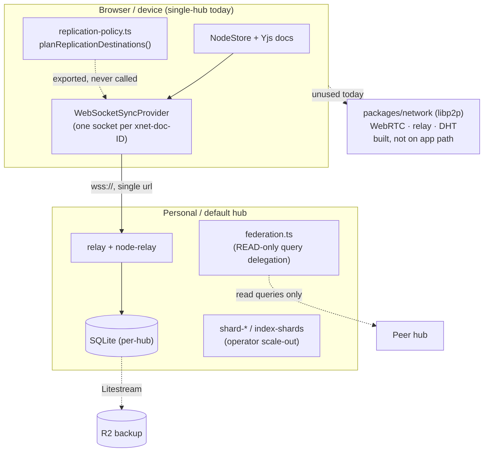
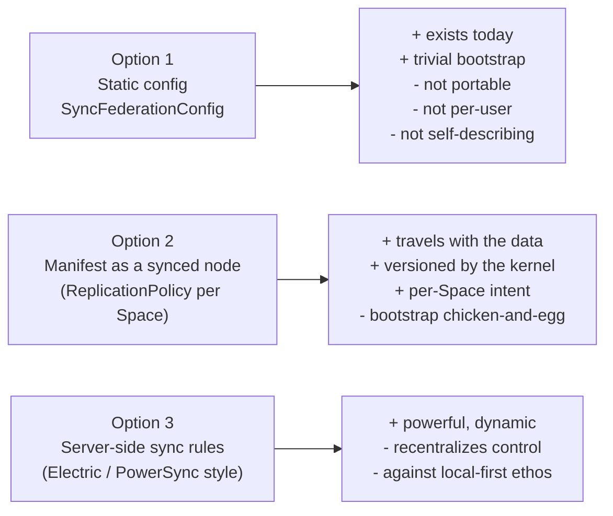
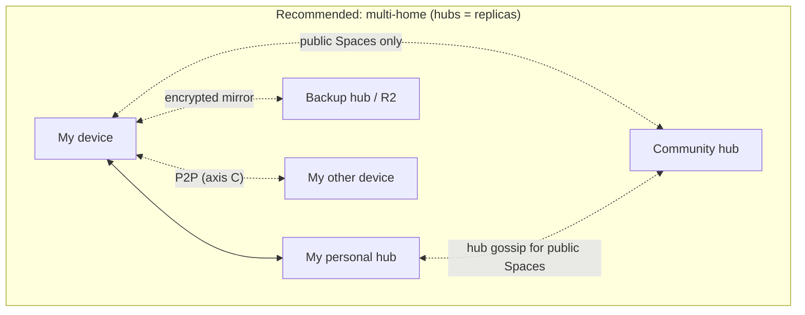

# Multi-Home Sync — Federated Hubs, Community Hubs, Peers, and the Replication Manifest

## Problem Statement

We want xNet to support, eventually, a full spectrum of "multiplayer":

- **Personal hubs** — a hub I run for myself (my always-on backup + relay).
- **Community / federated hubs** — shared hubs run by a group, a company, or the
  commons, holding data that many people touch.
- **Peer-to-peer / multi-device** — my laptop, phone, and tablet syncing directly
  with each other, hub or no hub.

The user's questions, verbatim in spirit:

> As soon as you introduce multiple hubs, what issues do you hit? Are you backing
> up **all** data to **both** hubs? Do you **selectively** back up to each hub? How
> do we maintain the **manifest of what goes where**? Is it already baked into our
> existing primitives, or do we need something new? And can we make multiplayer feel
> genuinely good while staying **coherent**?

This document maps what the repository already has, what the prior art teaches, and
recommends a concrete path that stays true to xNet's local-first, signed-change-log
kernel.

## Executive Summary

**The hard problem — correctness under concurrent, partitioned, multi-writer sync —
is already solved by our kernel.** Per the portable-protocol work
([`0200_[x]_PORTABLE_XNET_PROTOCOL_BOUNDARIES_AND_STANDARD.md`](0200_[x]_PORTABLE_XNET_PROTOCOL_BOUNDARIES_AND_STANDARD.md)),
the ground truth is a **signed, hash-chained, Lamport-ordered, last-writer-wins change
log**, with Yjs providing CRDT text/structure inside individual nodes. A change is
content-addressed (`cid:blake3:…`) and idempotent: applying it twice is a no-op, and
any two replicas that hold the same set of changes converge to the same state. **That
makes "sync the same data to N places" safe by construction.** You cannot corrupt state
by backing up to two hubs; worst case you do redundant work.

So the interesting work is **not** consistency. It is six things the kernel does _not_
give us for free:

1. **Routing / the manifest** — deciding _which_ changes go to _which_ destination.
2. **Client orchestration** — holding more than one connection and fanning writes out.
3. **Anti-entropy / completeness** — knowing a replica actually has _everything_ for a
   scope (not just "we exchanged some updates").
4. **Device identity** — a stable per-device identity so hubs and peers can trust
   "this really is my phone."
5. **Trust boundaries** — a community hub enforcing membership, and holding data it may
   not be allowed to _read_.
6. **UX coherence** — presenting "your data lives in several places" without confusion.

**Three different things get called "multi-hub." They must not be conflated:**

| Axis                                | What it means                                                                                                    | Repo status                                                                                                                                                  |
| ----------------------------------- | ---------------------------------------------------------------------------------------------------------------- | ------------------------------------------------------------------------------------------------------------------------------------------------------------ |
| **(A) Operator scale-out**          | Split _one logical hub_ across many machines for scale                                                           | Substantial infra exists: `shard-router`, `shard-ingest`, `shard-rebalancer`, `index-shards`, plus **read-only** query federation (`services/federation.ts`) |
| **(B) User multi-home replication** | The _same_ data lives on my personal hub **and** a community hub **and** a backup — and I choose what goes where | **Policy model exists but is wired to nothing** (`replication-policy.ts`)                                                                                    |
| **(C) Device-to-device P2P**        | My devices sync directly, hub-optional                                                                           | libp2p stack exists (`packages/network`) but is **detached from the app's actual sync path**                                                                 |

The user's question is mostly **axis (B)**, with (C) as the "multi-device" flavour.
Our recommendation: **adopt "one logical dataset, many physical replicas."** Hubs and
peers are _mirrors_, not shards of a single source of truth. Make the **Space the unit
of replication** (it is already our security boundary), **wire up the dormant
`planReplicationDestinations` planner**, store the **manifest as a synced node** so it
travels with the data, and add the three missing runtime pieces (multi-connection
orchestrator, anti-entropy, device DID).

## Current State In The Repository

### The kernel is already multi-master

`packages/sync/src/change.ts` and `chain.ts` define the substrate:

- `Change<T>` (`change.ts:38`) — `id`, `hash: ContentId` (`cid:blake3:…`),
  `parentHash`, `authorDID`, `signature`, `wallTime`, `lamport`, optional batch fields.
- `computeChangeHash` (`change.ts:195`) — canonical JSON → BLAKE3, content-addressed.
- `signChange` (`change.ts:228`) — Ed25519 (plus ML-DSA-65 post-quantum envelopes in
  the Yjs path).
- Deterministic ordering (`chain.ts:20`): `lamport`, then `wallTime`, then `authorDID`
  as a code-unit tie-break — **no locale, no wall-clock trust required for
  convergence**.
- `detectFork` (`chain.ts:110`) — a non-null parent with >1 child is a fork; forks are
  detected and traceable, not silently lost.
- Dedup by hash on ingest (`provider.ts:280`, `requestChangesFromAll`).

Yjs is the CRDT _inside_ a node; `YjsChange` (`yjs-change.ts:19`) wraps a Yjs binary
update inside the same signed `Change<T>` envelope. **Yjs is a payload type, not the
transport.**

**Implication:** replicating to two hubs cannot diverge state. Whoever ends up with the
same change set converges. This is the single most important fact in this document.

### The transport reality: single hub, one socket per document

The client actually syncs through `WebSocketSyncProvider`
(`packages/runtime/src/sync/WebSocketSyncProvider.ts:135`), created **per node** in
`packages/react/src/hooks/useNode.ts:822`:

```ts
const provider = new WebSocketSyncProvider(doc, {
  url: signalingServers[0], // <-- only ever the FIRST hub
  room: `xnet-doc-${id}`, // <-- one room per node
  authorDID: syncAuthorDID ?? did ?? undefined,
  signingKey: syncSigningKey ?? undefined,
  replication: syncConfig
})
```

Two facts fall out of this:

1. **The app is single-hub.** `apps/web/src/App.tsx` resolves a single `hubUrl`
   (`resolveConfiguredHubUrl`, `App.tsx:99`); `VITE_HUB_URL` is singular
   (`lib/hub-url.ts:18`); `signalingServers[0]` uses only the first entry even when an
   array is available.
2. **The `replication` config is only half-used.** `WebSocketSyncProvider` imports
   `resolveSyncReplicationPolicy` (`WebSocketSyncProvider.ts:27`) — which reads only the
   **`compatibility`** half of `SyncReplicationConfig` (the "require signed
   replication" toggle). The **`federation`** half — the entire multi-hub routing model
   — is **never consulted anywhere in the runtime.**

### The dormant primitive: a complete multi-hub routing planner

`packages/sync/src/replication-policy.ts` is a fully-built, fully-tested, exported —
and entirely **unconsumed** — routing engine. It already models exactly the
"selective backup + manifest" the user asks about:

```ts
export type SyncFederationHub = {
  id: string
  url: string
  priority?: number
  kinds?: readonly ('system' | 'user')[] // a hub can accept only some namespaces
  disabled?: boolean
}

export type SyncFederationNamespacePolicy = {
  namespace: string // exact | prefix | '*'
  includeHubIds?: readonly string[] // route this namespace to these hubs
  excludeHubIds?: readonly string[] // …minus these
  minHubs?: number // "I want at least N replicas"
  maxHubs?: number // "…but no more than N"
}

export type SyncFederationConfig = {
  hubs?: readonly SyncFederationHub[]
  namespacePolicies?: readonly SyncFederationNamespacePolicy[]
  defaultSystemHubIds?: readonly string[]
  defaultUserHubIds?: readonly string[]
}
```

`planReplicationDestinations({ namespace, config })` (`replication-policy.ts:164`)
returns a `ReplicationPlan` — the ordered list of destination hubs for a namespace,
with `diagnostics` (`no_hubs_configured`, `minimum_hubs_not_satisfied`,
`hub_kind_mismatch`, …) and a full `trace`. `simulateSyncPolicyRevision`
(`replication-policy.ts:296`) even diffs two policies (added/removed/retained hubs) so a
UI could preview a change before applying it.

**Grep confirms it is imported only by `index.ts` (re-export) and its own test**
(`replication-policy.test.ts`). It is a designed answer waiting for a caller.

The one gap in the model: it routes **namespaces** (strings like
`xnet://did:key:zAlice/sys/schema/`), but the runtime addresses **per-node rooms**
(`xnet-doc-<nanoid>`). Nothing maps nodes → namespaces. **That missing mapping is where
Spaces come in** (below).

### The hub layer: operator-scale federation exists; write-replication does not

`packages/hub` is a Node WebSocket + HTTP (Hono) server with **one SQLite DB per hub**;
a "room" is `xnet-doc-<docId>` and 1:1 with a node. What it _already_ has that looks
like federation is really **axis (A), operator scale-out**:

- **Read-only query federation** — `services/federation.ts`, `federation-health.ts`,
  `routes/federation.ts`. A hub can delegate a _search_ to peer hubs
  (`FederationQueryRequest` → `FederatedResult`) under a signed UCAN, with a per-peer
  `trustLevel: 'full' | 'metadata'`. **This moves query results, not writes.** No hub
  pushes change-log data into another hub.
- **Sharding** — `shard-router.ts`, `shard-ingest.ts`, `shard-rebalancer.ts`,
  `index-shards.ts`. A consistent-hash registry assigns `{ primaryHub, replicaHub }`
  per shard, but the actual data movement is **control-plane orchestrated**, and this is
  about scaling _one logical namespace_, not a user choosing to mirror to a community
  hub.
- **Backup is Litestream → R2**, not hub-to-hub (see managed-fleet
  [`0175`](0175_[_]_MANAGED_HUB_FLEET_DEPLOYMENT_AND_AI_GATEWAY.md) and the cloud-HA
  work). The backup target is object storage, not a second hub.

Authorization is UCAN + a `grant_index` + **Space membership** (`services/share-access.ts`),
with share-link roles (`read`/`comment`/`write`) overriding wildcard capabilities.

### Identity & addressing — the stable and the hub-local

From `packages/identity`:

- **User DID** = `did:key:z6Mk…`, deterministically derived from an Ed25519 public key
  (`did.ts:14`). **Stable and portable across hubs and devices** — the one identifier
  that already federates cleanly. Key bundle is hybrid (Ed25519 + X25519 + ML-DSA-65 +
  ML-KEM-768), so post-quantum recipients are already representable.
- **Node / Space IDs** = random nanoids (hub-local, _not_ content-addressed, _not_
  DID-scoped). Two hubs importing the "same" Space get different IDs unless federation
  metadata pins identity.
- **Device / session identity** = an **ephemeral** 8-char peerId
  (`runtime/src/sync/sync-manager.ts:327`), regenerated every tab/session. **There is no
  persistent device DID.** This is a real gap for multi-device trust and revocation.

**Spaces are the natural unit of replication.** `packages/data/src/schema/schemas/space.ts`
defines a Space as a **security boundary** with `kind ∈ {personal, workspace,
organization, team, community, family}`. Every content node carries a single `space`
relation ("its security home"); membership is a `SpaceMembership` edge with a
**deterministic id** `spacemember:<spaceId>:<did>` (`space-membership.ts:60`); roles
cascade to children (`space-authorization.ts`). A Space is exactly the object a user
would point at and say "replicate _this_ to the community hub."

### The P2P stack exists but is off to the side

`packages/network` is a real libp2p node (`types.ts:10`): WebRTC + WebSocket +
circuit-relay transports, Noise encryption, yamux muxing, bootstrap + optional
Kademlia DHT discovery, a `/xnet/sync/1.0.0` protocol, a y-webrtc provider, and a
DID→endpoint resolver (`resolution/did.ts`, HTTP against a central registry). It also
has mature abuse controls: connection gater, token-bucket rate limiter, GossipSub-style
peer scoring, auto-blocker, access lists, and a **recipient-scoped** authorized sync
provider (`PUBLIC_RECIPIENT`). **But the app does not use this path** — it uses the hub
WebSocket relay. The P2P substrate is built and idle, much like the routing planner.

### One diagram: where the pieces sit today



## External Research

- **Matrix federation.** A room is a **DAG of signed events**; _no server owns it_.
  Servers replicate with eventual consistency and resolve forks deterministically;
  joining replicates current state, then both sides exchange new events. This is almost
  exactly our change-DAG, and is the best mental model for a **community hub**: many
  homeservers (hubs) hold overlapping copies of the same room (Space) and converge.
  ([spec.matrix.org](https://spec.matrix.org/latest/),
  [Matrix Event Graph RDT analysis](https://arxiv.org/pdf/2011.06488))
- **Willow protocol.** Data is addressed by a 4-D coordinate:
  `(namespace, subspace, path, timestamp)`. Peers replicate by selecting **areas / 3-D
  ranges** — filter on _any_ dimension and you get partial replication for free. This is
  a more expressive version of our `namespace` string, and argues for evolving our
  routing key from a flat string toward `(space, author, path)`.
  ([willowprotocol.org](https://willowprotocol.org/specs/data-model/index.html))
- **Beelay / Keyhive (Ink & Switch).** Beelay syncs _collections_ of Automerge docs by
  **set reconciliation** (Rateless Invertible Bloom Lookup Tables) so a server can hold
  and relay **encrypted** data it cannot read; Keyhive is the local-first access-control
  layer. This is the reference design for our two missing pieces: **anti-entropy** and
  **zero-knowledge community hubs**.
  ([Beelay protocol](https://github.com/automerge/beelay/blob/main/docs/protocol.md),
  [Keyhive notebook](https://www.inkandswitch.com/keyhive/notebook/))
- **p2panda / namakemono.** Append-only logs + capabilities + group encryption over
  unstable/ephemeral links — a modular P2P toolkit proving the personal-hub-optional
  path is viable. ([p2panda.org](https://p2panda.org/))
- **ElectricSQL Shapes & PowerSync Sync Rules.** The industrial pattern for "what syncs
  where": the server defines **buckets** via a _parameter query_ (which buckets a client
  gets, from its JWT) + a _data query_ (what's in a bucket). This is precisely the
  "manifest" concept — and a caution: both put the rules **on the server**, which we
  should resist doing exclusively, because it re-centralizes control.
  ([PowerSync sync rules](https://www.powersync.com/blog/sync-rules-from-first-principles-partial-replication-to-sqlite),
  [Electric](https://github.com/electric-sql/electric))

The convergent lesson across all five: **selective replication is a first-class,
declarative object** — a coordinate range (Willow), a bucket (PowerSync), a room DAG
(Matrix). We already have the routing object (`SyncFederationConfig`); we need to make
it (a) _live data_, and (b) _actually consulted_.

## Key Findings

1. **Correctness is free; routing is the work.** The CRDT + hash-chained log means
   multi-home replication cannot corrupt state. We are building plumbing and UX, not a
   consensus protocol.
2. **The manifest is ~80% built and 0% wired.** `replication-policy.ts` already answers
   "back up all vs selectively," "min/max replicas," "which hub accepts what." Nothing
   calls it.
3. **There is an addressing gap.** Policy speaks _namespaces_; the runtime speaks
   _per-node rooms_. **Space is the missing bridge** — it is our only object that is a
   security boundary, has deterministic membership, and contains content.
4. **Read-federation ≠ write-replication.** The hub can already delegate _queries_ to
   peers; it cannot _replicate change data_ to an independent hub. Community hubs need
   the latter.
5. **Device identity is missing.** User DIDs federate; devices are ephemeral. Multi-
   device trust and revocation need a stable device DID.
6. **The zero-knowledge substrate already exists.** Recipient-scoped envelopes
   (`PUBLIC_RECIPIENT`, authorized sync provider) mean a community hub can hold
   ciphertext it can't read — but that collides with server-side search/query
   federation, forcing a **trusted vs zero-knowledge hub** distinction.
7. **Two idle assets** (the routing planner and the libp2p stack) mean axis (B) and
   axis (C) are mostly _integration_ work, not greenfield.

## Options And Tradeoffs

### Where does the manifest live?



- **Option 1 — static `SyncFederationConfig`.** Already exists; ideal as the _default_
  and _bootstrap_. Downsides: it is device-local config, not user data; it can't express
  "this specific Space goes to the community hub."
- **Option 2 — manifest as data (recommended core).** A `ReplicationPolicy` node
  attached to a Space, itself synced through the normal change log. It travels with the
  data, is versioned and signed like everything else, and lets the _owner_ declare
  intent. The one wrinkle is bootstrap (you must sync the manifest before you know where
  to sync) — solved by keeping a small **well-known system namespace** replicated to
  every configured hub by the static default.
- **Option 3 — server-side rules.** Powerful for dynamic partial replication, but it
  moves the authority from the user to the hub. Keep it out of the core; a hub may
  _offer_ a bucket view for scale, but it must never be the source of the user's intent.

**Recommendation: hybrid — Option 2 for user intent, Option 1 as default/bootstrap,
Space as the unit.**

### What is the unit of replication?

| Unit                           | Pros                                                                                                      | Cons                                                               |
| ------------------------------ | --------------------------------------------------------------------------------------------------------- | ------------------------------------------------------------------ |
| **Per-node**                   | maximal granularity                                                                                       | manifest explosion; N-connection blowup; unusable UX               |
| **Per-Space** (recommended)    | already a security boundary; deterministic membership; roles cascade; content has single `space` relation | needs a Space→namespace mapping (small, mechanical)                |
| **Per-namespace** (DID prefix) | matches the planner's current key                                                                         | nanoid node IDs aren't namespaced, so you still need Space mapping |

Spaces win: a Space is the object a human already reasons about ("my family space,"
"the community space"), and it is the object the authz system already gates.

### Topology & fan-out



- **Client fan-out (do first).** The client opens one connection per destination hub and
  broadcasts each change to the plan's destinations. Simple; reuses today's transport;
  dedup-on-ingest already exists. Cost: N× sockets/battery, and one socket **per node ×
  per hub** with today's per-doc rooms (see Risks — this needs a bulk channel).
- **Hub gossip (do later, for public/community).** Write to one hub; hubs replicate the
  change log among themselves (Matrix-style). Fewer client connections, but needs a
  hub-to-hub _write_ protocol and inter-hub trust. Best reserved for **public** Spaces
  where the community hub is authoritative-ish.

### Completeness / anti-entropy

- **Have:** Yjs state-vector diffing _per document_ (sync-step1/step2). Answers "are
  these two copies of _this doc_ equal?"
- **Need:** cross-scope **set reconciliation** ("does hub B have _every_ change for this
  Space?"). Without it, "is my backup complete?" is unanswerable. Beelay's RIBLT is the
  reference; a simpler first cut is a per-scope **change-set digest** (a rolling hash /
  Merkle-ish summary over change hashes) exchanged on connect.

### Trusted vs zero-knowledge hubs

- **Trusted hub** (personal, team): holds plaintext, can index, search, serve public
  views, participate in query federation.
- **Zero-knowledge hub** (untrusted community mirror, backup): holds only
  recipient-scoped ciphertext; can relay and store but cannot read, search, or serve
  rendered views. The recipient-envelope substrate already exists; the policy must let a
  Space declare which class each destination is.

## Recommendation

Adopt one sentence as the north star: **"One logical dataset, many physical replicas."**
Hubs and peers are mirrors of the user's change log, not owners of shards of it. The
user thinks in terms of _"where does this Space live?"_, never _"which hub is
authoritative?"_.

Concretely:

1. **Make the Space the replication scope.** Add a Space→namespace mapping so the
   existing planner has real inputs (a Space's namespace = `xnet://<ownerDID>/space/<spaceId>/`).
2. **Wire up the planner.** Build a `MultiHubSyncManager` in `@xnetjs/runtime` that
   consumes `planReplicationDestinations` and maintains one provider per (hub × room),
   fanning out writes and deduping ingest.
3. **Store the manifest as data.** A `ReplicationPolicy` node per Space (Option 2),
   bootstrapped by the static default (Option 1) via a well-known system namespace.
4. **Add the missing runtime pieces:** a stable **device DID**, a per-scope
   **anti-entropy digest**, and a **trusted/zero-knowledge** flag per destination.
5. **Later:** hub-to-hub gossip for public Spaces; light up the libp2p path (axis C) as
   an _additional transport_ gated by the _same_ policy — so P2P is "just another
   destination," not a separate system.
6. **UX coherence:** a per-Space **"Where this lives"** control with a safe default
   (everything → your personal hub + local device; public Spaces additionally → the
   community hub). Show replica health ("3/3 replicas up to date"), never make the user
   pick a hub to _read_ from (read from all, dedup), and surface the
   `simulateSyncPolicyRevision` diff before any change.

### Answering the user's questions directly

- **"Back up all data to both hubs?"** By _default_ yes to your own personal hub(s) —
  full mirror, safe by construction. For community/backup hubs, _selective_ is the
  default (you don't dump your private life onto a shared machine).
- **"Selectively back up to each hub?"** Yes — that is exactly
  `SyncFederationNamespacePolicy` (`includeHubIds`/`excludeHubIds`/`minHubs`/`maxHubs`),
  keyed by Space.
- **"How do we maintain the manifest?"** As a signed, synced `ReplicationPolicy` node
  per Space (travels with the data), with the static `SyncFederationConfig` as the
  bootstrap default.
- **"Baked into our primitives, or something new?"** ~70% baked. The **kernel**
  (multi-master log), the **routing model** (`replication-policy.ts`), the
  **security boundary** (Space + membership), and the **encrypted-mirror substrate**
  (recipient envelopes) exist. What is genuinely new: the **runtime orchestrator**, the
  **manifest-as-node**, **anti-entropy**, **device DID**, and **hub-to-hub write
  gossip**.

## Example Code

A Space→namespace mapping plus a `MultiHubSyncManager` that finally consumes the
dormant planner. Sketch, not final:

```ts
// packages/runtime/src/sync/replication-scope.ts
import type { SyncReplicationConfig } from '@xnetjs/sync'

/** A Space is the unit of replication. Its namespace keys the routing policy. */
export function spaceNamespace(ownerDID: string, spaceId: string): string {
  return `xnet://${ownerDID}/space/${spaceId}/`
}

/** System data (schemas, authz) rides a well-known namespace replicated everywhere. */
export function systemNamespace(ownerDID: string): string {
  return `xnet://${ownerDID}/sys/`
}
```

```ts
// packages/runtime/src/sync/MultiHubSyncManager.ts
import { planReplicationDestinations, type SyncReplicationConfig, type Change } from '@xnetjs/sync'
import { WebSocketSyncProvider } from './WebSocketSyncProvider'
import * as Y from 'yjs'

type HubId = string

export class MultiHubSyncManager {
  // one provider per (hub, room); today rooms are per-node
  private providers = new Map<`${HubId}::${string}`, WebSocketSyncProvider>()

  constructor(
    private readonly config: SyncReplicationConfig, // .federation is finally used
    private readonly identity: { authorDID: string; signingKey: Uint8Array }
  ) {}

  /** Attach a Yjs doc for a node that belongs to `namespace` (i.e. its Space). */
  attach(doc: Y.Doc, nodeId: string, namespace: string): void {
    const plan = planReplicationDestinations({ namespace, config: this.config })
    if (plan.diagnostics.some((d) => d.code === 'minimum_hubs_not_satisfied')) {
      // surface to UX: "this Space wants N replicas but only M are reachable"
    }
    for (const dest of plan.destinations) {
      const key = `${dest.hubId}::${nodeId}` as const
      if (this.providers.has(key)) continue
      this.providers.set(
        key,
        new WebSocketSyncProvider(doc, {
          url: dest.url,
          room: `xnet-doc-${nodeId}`,
          authorDID: this.identity.authorDID,
          signingKey: this.identity.signingKey,
          replication: this.config
        })
      )
    }
    // Providers that dropped out of the new plan get torn down here.
  }

  // Reads fan in from every replica; ingest already dedups by change.hash,
  // so holding the same change on 3 hubs is idempotent.
}
```

```ts
// A manifest that is itself synced data (Option 2). One per Space.
// schemaId: 'xnet://xnet.fyi/ReplicationPolicy@1.0.0'
interface ReplicationPolicyNode {
  space: string // relation -> Space (the scope)
  destinations: Array<{
    hubId: string
    url: string
    trust: 'trusted' | 'zero-knowledge'
    minReplicas?: number
  }>
  // routes system+content of this Space; bootstrapped by static default config
}
```

The point: **`planReplicationDestinations` is production-ready today**; the whole of
"selective multi-hub backup" is a caller plus a Space→namespace shim plus a manifest
node schema.

## Risks And Open Questions

- **Compaction vs anti-entropy (real collision).** Change-log compaction
  ([`0254`](0254_[_]_COMPACT_THE_CHANGE_LOG_SNAPSHOT_THE_STATE_KEEP_THE_TAIL.md)) and
  the Litestream VACUUM path in the cloud-HA work both _rewrite/prune_ the log. Two
  replicas that compacted differently will have **different raw change sets** for the
  _same live state_. Anti-entropy must reconcile on **live-value lineage**, not raw log
  equality, or a fully-synced backup will look "incomplete." This must be designed in
  from day one, not bolted on.
- **Split-brain writes.** The same DID writing to two hubs while partitioned converges
  (good) but LWW may _drop_ a concurrent field write (expected LWW semantics). Yjs
  fields merge; scalar LWW fields pick a winner. This is acceptable but must be
  **explained**, and "last write wins" losers should be recoverable from the fork
  history (`detectFork`).
- **Omission / malicious hubs.** The hash chain detects _tampering_ of content, not
  _withholding_. A hostile community hub can silently drop changes. Mitigation:
  multiple replicas + anti-entropy digests + the ability to cross-check a scope's digest
  against a hub you trust.
- **Encrypted mirror ↔ search tension.** A zero-knowledge community hub cannot index or
  serve query federation over data it can't read. We must pick, per destination, whether
  it is a _trusted_ (plaintext, searchable) or _zero-knowledge_ (ciphertext, relay-only)
  replica, and reflect that in the manifest and the UI.
- **Connection explosion.** One WebSocket **per node × per hub** is untenable at scale
  (a Space with 500 nodes × 3 hubs = 1,500 sockets). This forces a **hub-level bulk /
  multiplexed sync channel** (one connection per hub carrying all of a Space's rooms) —
  arguably a prerequisite, not a follow-up. It also intersects the cold-open work
  ([`0249`/`0254`](0254_[_]_COMPACT_THE_CHANGE_LOG_SNAPSHOT_THE_STATE_KEEP_THE_TAIL.md)).
- **Device DID lifecycle.** Provisioning (derive from a per-device key), attestation
  (bind to the user DID), and **revocation** (lost phone) all need design; a revoked
  device must lose sync rights on every hub.
- **Billing & quotas.** Managed hubs are per-tenant with entitlements
  ([`0175`](0175_[_]_MANAGED_HUB_FLEET_DEPLOYMENT_AND_AI_GATEWAY.md)). "Which hub pays to
  store which Space" becomes a real product question the manifest must encode.
- **Manifest bootstrap.** Chicken-and-egg: you need the manifest to know where to sync,
  but the manifest is synced data. Resolved by the static-default system namespace, but
  the handshake needs to fetch the manifest _first_ on cold connect.

## Implementation Checklist

- [x] Add `ReplicationScope` = Space; implement `spaceNamespace()` / `systemNamespace()`
      mapping (`packages/runtime/src/sync/replication-scope.ts`).
- [ ] Define the `ReplicationPolicy` node schema (`xnet://xnet.fyi/ReplicationPolicy@1.0.0`),
      attached to a Space; add to the schema registry + dev-tools seed coverage.
- [x] Build `MultiHubSyncManager` in `@xnetjs/runtime` that calls
      `planReplicationDestinations` and manages one provider per (hub × room).
- [ ] Have `useNode` / `sync-manager` route through `MultiHubSyncManager` instead of a
      single `WebSocketSyncProvider` on `signalingServers[0]`.
- [ ] Bootstrap: keep the static `SyncFederationConfig` as the default, replicate the
      system namespace to every configured hub, fetch the manifest on connect.
- [ ] Add a **per-hub multiplexed bulk sync channel** (one socket per hub carrying all of
      a Space's rooms) to avoid per-node socket blowup.
- [ ] Add a per-scope **anti-entropy digest** exchange on connect; reconcile on
      **live-value lineage** so compaction differences don't read as missing data.
- [ ] Introduce a **stable device DID** (persisted per device) + attestation to the user
      DID + a revocation path enforced at every hub.
- [ ] Add a `trust: 'trusted' | 'zero-knowledge'` flag per destination; gate plaintext
      vs recipient-encrypted replication and search/query-federation accordingly.
- [ ] Build the **"Where this lives"** per-Space UI: default (personal hub + local),
      replica-health indicator, `simulateSyncPolicyRevision` preview before apply.
- [ ] (Later) Hub-to-hub **write gossip** for public Spaces, building on
      `services/federation.ts` + `discovery` + the shard registry.
- [ ] (Later) Light up `packages/network` (libp2p) as an _additional_ destination type
      behind the same policy, so P2P multi-device is "just another replica."

## Validation Checklist

- [ ] **Convergence:** three replicas (2 hubs + 1 device), random partitions and
      concurrent edits → all reach byte-identical state (extend
      `multi-level-integration.test.ts`).
- [x] **Selective routing:** a private Space routes only to the personal hub; a public
      Space routes to personal + community; assert the community hub never receives the
      private Space's changes.
- [ ] **min/maxHubs honored:** `minReplicas: 2` with one hub down surfaces the
      `minimum_hubs_not_satisfied` diagnostic in the UI; recovers when it returns.
- [ ] **Idempotent multi-home:** the same change delivered via two hubs is applied once
      (dedup by `change.hash`); no duplicate nodes.
- [ ] **Anti-entropy completeness:** after a hub is offline during writes, reconnect →
      digest exchange pulls exactly the missing changes; a _compacted_ replica still
      validates as complete (no false "missing").
- [ ] **Zero-knowledge mirror:** a `zero-knowledge` community hub stores ciphertext,
      cannot answer a query-federation request over that Space, and a trusted replica
      still can.
- [ ] **Device revocation:** revoking a device DID stops its sync on every hub within a
      bounded window.
- [ ] **Manifest as data:** editing the `ReplicationPolicy` node on device A changes
      where device B replicates, after the manifest itself syncs.
- [ ] **UX coherence:** reads never require picking a hub; replica health is visible;
      a policy change shows an accurate added/removed-hub diff before applying.

## References

**Code (this repo):**

- `packages/sync/src/replication-policy.ts` — the dormant routing planner
  (`SyncFederationConfig`, `planReplicationDestinations`, `simulateSyncPolicyRevision`).
- `packages/sync/src/change.ts`, `chain.ts` — signed, hash-chained, LWW kernel + fork
  detection.
- `packages/runtime/src/sync/WebSocketSyncProvider.ts` — single-hub transport; only the
  `compatibility` half of the replication config is consulted.
- `packages/react/src/hooks/useNode.ts:822` — where the per-node provider is created on
  `signalingServers[0]`.
- `packages/hub/src/services/federation.ts`, `federation-health.ts`, `routes/federation.ts`
  — **read-only** query federation.
- `packages/hub/src/services/shard-router.ts`, `shard-ingest.ts`, `shard-rebalancer.ts`,
  `index-shards.ts` — operator-scale sharding.
- `packages/data/src/schema/schemas/space.ts`, `space-membership.ts`,
  `space-authorization.ts` — the security boundary / replication-unit candidate.
- `packages/identity/src/did.ts` — stable user DID derivation.
- `packages/runtime/src/sync/sync-manager.ts:327` — ephemeral session peerId (device-DID
  gap).
- `packages/network/` — idle libp2p P2P stack (WebRTC/relay/DHT, recipient-scoped sync).

**Related explorations:**

- [`0200_[x]_PORTABLE_XNET_PROTOCOL_BOUNDARIES_AND_STANDARD.md`](0200_[x]_PORTABLE_XNET_PROTOCOL_BOUNDARIES_AND_STANDARD.md)
  — the kernel = signed/hash-chained/LWW change log.
- [`0181_[_]_SPACES_AS_NESTED_GROUPINGS_AND_SCHEMA_AUTHORIZATION.md`](0181_[_]_SPACES_AS_NESTED_GROUPINGS_AND_SCHEMA_AUTHORIZATION.md)
  and [`0179`](0179_[_]_SPACES_GROUPS_AND_UNIFIED_SHARING.md) — Spaces & cascading authz.
- [`0175_[_]_MANAGED_HUB_FLEET_DEPLOYMENT_AND_AI_GATEWAY.md`](0175_[_]_MANAGED_HUB_FLEET_DEPLOYMENT_AND_AI_GATEWAY.md)
  — per-tenant managed hubs, Litestream → R2.
- [`0254_[_]_COMPACT_THE_CHANGE_LOG_SNAPSHOT_THE_STATE_KEEP_THE_TAIL.md`](0254_[_]_COMPACT_THE_CHANGE_LOG_SNAPSHOT_THE_STATE_KEEP_THE_TAIL.md)
  — compaction, which collides with anti-entropy.

**External prior art:**

- Matrix Server-Server API / event-graph DAT — <https://spec.matrix.org/latest/> ·
  <https://arxiv.org/pdf/2011.06488>
- Willow protocol data model — <https://willowprotocol.org/specs/data-model/index.html>
- Beelay sync protocol (Automerge) — <https://github.com/automerge/beelay/blob/main/docs/protocol.md>
- Keyhive local-first access control (Ink & Switch) — <https://www.inkandswitch.com/keyhive/notebook/>
- p2panda / namakemono — <https://p2panda.org/>
- PowerSync sync rules — <https://www.powersync.com/blog/sync-rules-from-first-principles-partial-replication-to-sqlite>
- ElectricSQL — <https://github.com/electric-sql/electric>
