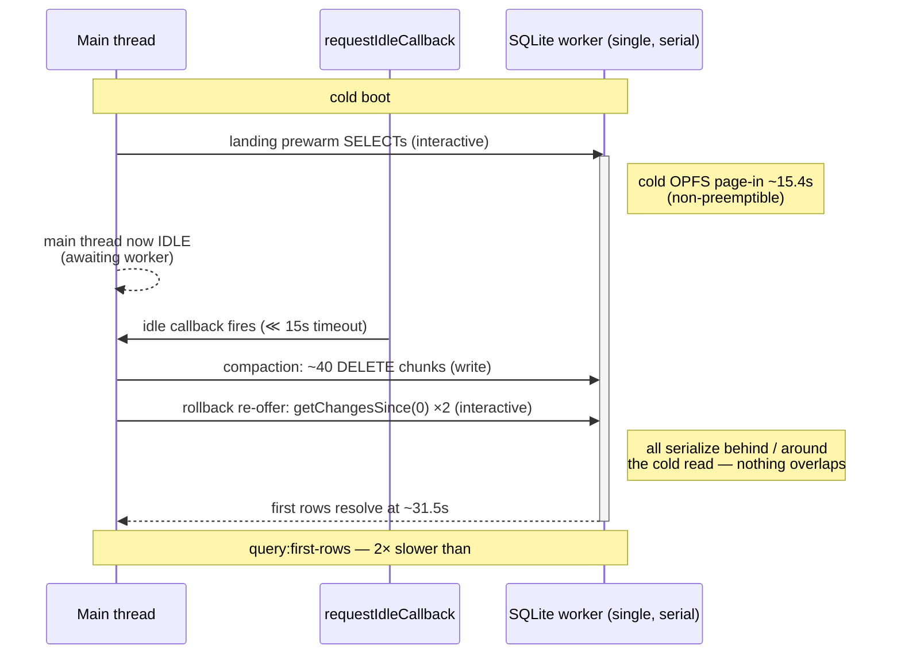

# Compaction Starves The Cold‑Open: Schedule It Off The Boot Path

## Problem Statement

Exploration 0254 designed change‑log compaction as **the durable cold‑open fix**,
and Phase 1 shipped in **#360** (client‑only superseded‑history GC, idle‑scheduled).
A fresh capture with #360 deployed shows the opposite of the goal:

> **The cold‑open got ~2× WORSE — the first landing query now takes 31.5 s (was ~15.8 s).**

The compaction _logic_ is correct — it computed the right watermark and deleted the
right rows — but it runs **during the cold‑boot read burst** and **monopolises the
single SQLite worker**, so the landing queries it was meant to speed up wait ~15.8 s
in the worker queue _behind_ the compaction before they even start their own ~15.4 s
cold read. On top of that, the #360 rollback guard mis‑fired against a reset tenant
hub and re‑offered the entire 318k‑row log twice.

This is a regression, and it is a _scheduling/cost_ problem, not a correctness one.
The fix is to get compaction **off the boot critical path** and make each pass cheap.

## Executive Summary

The capture (build with #355/#356/#360) shows three compounding costs, all on the
one SQLite worker, all during boot:

| Signal (from the capture)                                                    | Value                             | Meaning                                              |
| ---------------------------------------------------------------------------- | --------------------------------- | ---------------------------------------------------- |
| `landing query prewarm:pages`                                                | **31 504 ms**                     | first data paints ~31.5 s in (was ~15.8 s)           |
| query plan `durationMs` / `candidateQueryDurationMs`                         | **31 218 / 15 384 ms**            | ~15.8 s **queue wait** + ~15.4 s cold read           |
| `change-log compaction {wsafe, deleted}`                                     | **317938 / 250000**               | correct watermark; hit the **250k `maxRows` cap**    |
| `DELETE FROM changes …` write ops                                            | **~40+ chunks**, ~170–680 ms each | ~11 s of exclusive worker time, spanning ~23 s       |
| `SELECT … FROM changes` (getChangesSince(0))                                 | **execMs 3183 + 3078**            | two full‑log deserializes from the rollback re‑offer |
| `hub high-water mark 0 is below the confirmed cursor 318066 (hub rollback?)` | id 376                            | rollback guard fired against an empty/reset hub      |
| `INVALID_HASH` rejections → breaker trips                                    | ids 488–568                       | the re‑offer flood is rejected wholesale (0224 skew) |

The `candidateQueryDurationMs: 15384` is the _same_ ~15.4 s cold OPFS page‑in as
before — expected, because on the **first** compaction boot the file is still the big
424k‑row file (the reclaiming `VACUUM` hasn't run yet). Compaction didn't remove that
cost; it **added ~15.8 s of queue starvation on top of it.**

Three root causes:

1. **`requestIdleCallback` fires during the boot read burst.** It tracks _main‑thread_
   idle, but the bottleneck is the _SQLite worker_. The main thread is idle (waiting on
   worker round‑trips) exactly while the worker is saturated, so the idle callback runs
   the compaction right into the busiest window.
2. **The pass is far too big for one boot.** `maxRows: 250000` + a per‑chunk correlated
   `NOT EXISTS`/`MAX` subquery ⇒ ~40+ back‑to‑back `DELETE`s (~11 s of exclusive worker
   time). Because reads and writes share the one worker connection, those `DELETE`s
   delay every interactive landing read.
3. **The rollback guard (#360) mis‑fires and floods.** A reset tenant hub returns
   `highWaterMark 0`; the guard reads `0 < 318066` as a rollback and re‑offers the whole
   log via `getChangesSince(0)` (two ~3 s full‑log deserializes) into a hub that rejects
   every change with `INVALID_HASH` — precisely the flood #356 fought.

## Current State In The Repository

### What #360 shipped

- **The prune** — `SQLiteNodeStorageAdapter.pruneSupersededChanges(wsafe, {chunk=5000,
maxRows=250000})` ([`sqlite-adapter.ts`](../../packages/data/src/store/sqlite-adapter.ts)):
  a chunked `DELETE FROM changes WHERE hash IN (SELECT … WHERE lamport_time < ? AND
lamport_time < (SELECT MAX(...) …) AND NOT EXISTS (SELECT 1 FROM node_properties …)
LIMIT ?)`, looping until a chunk deletes `< limit` or `maxRows` is hit, `await`ing a
  `setTimeout(0)` between chunks.
- **The scheduler** — `scheduleChangeLogCompaction(nodeStorage, sqliteAdapter)`
  ([`change-log-compaction.ts`](../../apps/web/src/lib/change-log-compaction.ts)):
  `requestIdleCallback(run, { timeout: 15000 })` (fallback `setTimeout(run, 5000)`),
  gated on storage≠memory + `getMinConfirmedSyncCursor()>0` + the `xnet:compact:changes`
  kill switch; `wsafe = cursor − 128`; on `deleted>0` it removes `xnet:db-vacuumed:v1`
  to **re‑arm the idle `VACUUM`**.
- **The rollback guard** — `NodeStoreSyncProvider.handleSyncResponse`
  ([`node-store-sync-provider.ts`](../../packages/runtime/src/sync/node-store-sync-provider.ts)):
  `if (response.highWaterMark < this.lastSyncedLamport && this.pushedThrough >
response.highWaterMark) { …; this.pushedThrough = response.highWaterMark; void
this.syncLocalChanges() }`.

### Where it's wired into boot

`scheduleChangeLogCompaction(nodeStorage, sqliteAdapter)` is called in the boot
sequence in [`App.tsx`](../../apps/web/src/App.tsx), right after `nodeStorage` is
constructed and alongside the one‑time `scheduleOneTimeVacuum` — i.e. **before** the
landing/prewarm read burst has completed. `db-vacuum.ts`'s `VACUUM` is a whole‑file
rewrite on the same worker, so re‑arming it means the _next_ boot also pays a heavy
worker cost.

### The mechanism, confirmed in code

**There is exactly one SQLite connection on one Web Worker, and it runs ops strictly
serially with no preemption.** `WebSQLiteProxy` spawns a single `Worker`
([`web-proxy.ts:88`](../../packages/sqlite/src/adapters/web-proxy.ts)); the worker holds
one `OpfsSAHPoolDb` ([`web.ts:186`](../../packages/sqlite/src/adapters/web.ts)); the
scheduler's `pump()` loop runs one job to completion before dequeuing the next
([`worker-scheduler.ts:140`](../../packages/sqlite/src/adapters/worker-scheduler.ts),
comment: _"jobs run strictly one-at-a-time (no preemption of an in-flight op)"_). The
lanes (`interactive → bulk → write`) **reorder** but cannot **parallelize**:

> On a single serial worker, any heavy background work during boot **adds directly to
> cold‑open wall‑clock**. Priority scheduling stops a write _queue_ from starving reads
> (cheap `PRAGMA` reads did interleave in the capture), but it cannot make the
> compaction's ~11 s of `DELETE` and the re‑offer's ~6 s of full‑log scans overlap the
> ~15.4 s cold read. Nothing overlaps — so the worker's boot workload roughly doubled,
> and so did the wall clock.

**`requestIdleCallback` fires _into_ that busy window.** It measures **main‑thread**
idle, not **worker** idle — and the main thread goes idle the instant a landing query
is dispatched to the worker (the query is an async round‑trip, so the main thread has
nothing to do). So the callback runs _immediately_, well before its 15 s `timeout`,
right on top of the worker's cold read. `scheduleChangeLogCompaction`,
`scheduleOneTimeVacuum`, and `scheduleStalePresenceCleanup` all share this flaw and are
all called in `App.tsx`'s init effect **before** `WorkingSetPrewarm` even issues the
landing burst.

**The first‑paint signal exists but isn't awaitable.** `query:first-rows`
([`boot-timeline.ts`](../../apps/web/src/lib/boot-timeline.ts)) is marked when the first
landing rows render, but there is no promise/event to await it — only a pollable
`bootMarkAt('query:first-rows')`. Any "run after boot settles" gate must add one.

**The VACUUM re‑arm is a second regression.** `db-vacuum.ts` sets `xnet:db-vacuumed:v1`
**once per origin and never clears it** — deliberately, because `VACUUM` is a whole‑file
rewrite on the same worker. #360's compaction `removeItem`s that flag on every prune,
so the **next** boot runs a full `VACUUM` on the still‑large file — another multi‑second
worker occupation on the boot path.



## Key Findings

1. **Compaction is correct but catastrophically scheduled.** Right watermark
   (`wsafe 317938`), right rows (`deleted 250000`), wrong time and wrong size.
2. **`requestIdleCallback` is the wrong idle signal** for worker‑bound work — it can't
   see the worker, and the main thread is idle exactly when the worker is busy.
3. **A single serial worker means no background compaction can be "free" during boot** —
   it always adds to first‑paint. It must run only once the boot read burst has fully
   drained _and_ the worker is quiescent.
4. **`maxRows: 250000` is far too large for one pass** — it guarantees ~11 s of serial
   `DELETE`. Reclaim must be tiny per pass and spread across many boots.
5. **The rollback guard re‑offers the whole log into a hub that can't accept it** —
   `highWaterMark 0` (empty/reset hub) and a tripped `INVALID_HASH` breaker both mean
   "do not flood," yet it ran `getChangesSince(0)` twice.
6. **Re‑arming `VACUUM` every prune** breaks the one‑time invariant and slows the next
   boot too.

## Options And Tradeoffs

| Option                                          | What                                                                                                                                                                                        | Pro                                                                  | Con                                                                                                                                                                                                                        |
| ----------------------------------------------- | ------------------------------------------------------------------------------------------------------------------------------------------------------------------------------------------- | -------------------------------------------------------------------- | -------------------------------------------------------------------------------------------------------------------------------------------------------------------------------------------------------------------------- |
| **A. Kill‑switch default‑off** (mitigation)     | Invert `xnet:compact:changes` so compaction is opt‑in                                                                                                                                       | Instantly restores the #356 baseline; ~1‑line, no `packages/*` churn | Abandons the durable win until B lands                                                                                                                                                                                     |
| **B. Gate + shrink + fix guard** (the real fix) | Run only after a new `bootSettled()` + worker‑idle probe; `maxRows` ≈ 2–5k, loop‑until‑dry across boots; per‑chunk idle yield with deadline; stop re‑arming full VACUUM; guard the re‑offer | Keeps the durable fix; off the boot path; bounded per‑pass cost      | More work; full reclaim takes many boots                                                                                                                                                                                   |
| **C. Parallel connection / data‑worker**        | Run compaction on a second SQLite connection                                                                                                                                                | True parallelism                                                     | **Impossible** — `opfs-sahpool` holds an _exclusive_ sync access handle per file ([`web.ts`](../../packages/sqlite/src/adapters/web.ts)); a second connection to the same file can't open. Must time‑share the one worker. |
| **D. Hub‑side / offline compaction**            | Do it away from the interactive worker entirely                                                                                                                                             | Zero client boot cost                                                | Large; this is the 0254 follow‑up (signed‑snapshot bootstrap), not a quick fix                                                                                                                                             |

## Recommendation

**Ship A now, then B.**

1. **A (immediate hotfix):** make compaction **opt‑in** — default off, enabled only when
   `localStorage['xnet:compact:changes'] === 'on'`. Cold‑open returns to the ~15.8 s
   #356 baseline (survivable) while B is built. `apps/web`‑only; no changeset.
2. **B (Phase 1.1), in order of leverage:**
   1. **Add `bootSettled(): Promise<void>`** to `boot-timeline.ts`, resolved when
      `query:first-rows` is marked. Gate compaction (and ideally VACUUM/presence‑cleanup)
      behind `await bootSettled()` **plus** a trailing idle delay, so it never competes
      with the landing burst.
   2. **Shrink each pass**: `maxRows` ≈ 2 000–5 000, and **loop‑until‑dry across boots**
      (each idle boot prunes a little). Yield between chunks with
      `requestIdleCallback` + an `IdleDeadline.timeRemaining()` check so a slice never
      overruns a frame; bail the moment `document.visibilityState` changes or a real
      interaction arrives.
   3. **Stop re‑arming full VACUUM**: reclaim with `PRAGMA incremental_vacuum` (needs
      `auto_vacuum=INCREMENTAL`) in small steps, or run the one‑shot VACUUM itself gated
      behind `bootSettled()`; do **not** clear `xnet:db-vacuumed:v1` on every prune.
   4. **Fix the rollback guard**: skip the re‑offer entirely when `outboundHalted` or
      when `response.highWaterMark === 0` (empty/reset hub is not a recoverable partial
      rollback); and cap any re‑offer instead of `getChangesSince(0)`.

## Example Code

```ts
// apps/web/src/lib/boot-timeline.ts — make first-paint awaitable
let bootSettledResolve: (() => void) | null = null
const bootSettledPromise = new Promise<void>((r) => (bootSettledResolve = r))
/** Resolves once `query:first-rows` has been marked (first landing data rendered). */
export function bootSettled(): Promise<void> {
  return bootSettledPromise
}
// call inside bootMark('query:first-rows'):  bootSettledResolve?.()
```

```ts
// apps/web/src/lib/change-log-compaction.ts — gate + shrink + yield
export function scheduleChangeLogCompaction(nodeStorage, sqliteAdapter): void {
  if (typeof window === 'undefined') return
  if (localStorage.getItem('xnet:compact:changes') !== 'on') return // A: opt-in
  void (async () => {
    await bootSettled() // never race the landing burst
    await idle({ timeout: 30_000 }) // + a real idle gap after first paint
    if (await notSafe(sqliteAdapter, nodeStorage)) return
    const wsafe = ((await nodeStorage.getMinConfirmedSyncCursor()) ?? 0) - LAMPORT_MARGIN
    if (wsafe <= 0) return
    // small pass; loop-until-dry happens across boots, not in one shot
    const { deleted } = await nodeStorage.pruneSupersededChanges(wsafe, {
      chunk: 1_000,
      maxRows: 4_000
    })
    persistDebug('xnet:compact:last', { wsafe, deleted })
    // do NOT clear the vacuum flag here; reclaim incrementally instead
  })()
}
```

```ts
// packages/runtime/src/sync/node-store-sync-provider.ts — don't flood on reset/halt
if (
  response.highWaterMark > 0 && // 0 = empty/reset hub, not a rollback
  !this.outboundHalted && // breaker tripped ⇒ re-offering is futile
  response.highWaterMark < this.lastSyncedLamport &&
  this.pushedThrough > response.highWaterMark
) {
  this.pushedThrough = response.highWaterMark
  void this.syncLocalChanges()
}
```

## Risks And Open Questions

- **A single DELETE chunk is still non‑preemptible** (~170–680 ms). Even gated and
  small, a 1 000‑row chunk can hitch one frame; keep chunks small and yield generously.
- **Full reclaim now takes many boots** (loop‑until‑dry at ~4 k/boot vs 250 k). That is
  the point — but the file stays large (and cold reads stay ~15 s) until enough passes +
  a VACUUM have run. Sequencing that first reclaiming VACUUM off the boot path is the
  crux; may warrant its own gated one‑shot.
- **Does `bootSettled()` resolve on an empty workspace?** `query:first-rows` marks on
  `allLoaded` even with zero rows, so yes — but verify the mark fires on the error/empty
  paths too, or compaction never runs for some users.
- **Opt‑in default means the affected user must set the flag** to get any benefit; the
  durable win only arrives with B. Acceptable as a mitigation, not an endpoint.

## Implementation Checklist

- [ ] **Hotfix A**: invert `xnet:compact:changes` to opt‑in (default off) in
      `change-log-compaction.ts`; ship as its own fast PR.
- [x] Add `bootSettled(): Promise<void>` to `boot-timeline.ts`, resolved in
      `bootMark('query:first-rows')`.
- [ ] Gate `scheduleChangeLogCompaction` behind `await bootSettled()` + a trailing idle
      delay; add a worker‑idle guard (skip if a heavy op is in flight).
- [ ] Reduce `pruneSupersededChanges` per‑pass `maxRows` to a few thousand; add
      per‑chunk `requestIdleCallback`/deadline yielding; bail on interaction/visibility.
- [ ] Stop clearing `xnet:db-vacuumed:v1` on prune; reclaim via `PRAGMA
    incremental_vacuum` or a `bootSettled()`‑gated one‑shot VACUUM.
- [ ] Rollback guard: skip re‑offer when `outboundHalted` or `highWaterMark === 0`; cap
      any re‑offer (no unbounded `getChangesSince(0)`).
- [ ] Consider gating `scheduleOneTimeVacuum` and `scheduleStalePresenceCleanup` behind
      `bootSettled()` too (same `requestIdleCallback` flaw).
- [ ] `@xnetjs/data` / `@xnetjs/runtime` changesets for the adapter/provider changes.

## Validation Checklist

- [ ] With the flag off, a cold boot shows **no** `DELETE FROM changes` before
      `query:first-rows`, and `landing query prewarm:*` returns to the ~15.8 s baseline.
- [ ] With the flag on, all `DELETE FROM changes` ops timestamp **after**
      `query:first-rows`; `xnet:boot:longblock` shows no new long block attributable to
      compaction.
- [ ] Each compaction pass deletes ≤ the small `maxRows` and completes without a single
      `DELETE` chunk exceeding one frame.
- [ ] Across N idle boots the `changes` row count monotonically shrinks (loop‑until‑dry);
      no boot regresses cold‑open.
- [ ] A `node-sync-response` with `highWaterMark 0` or a tripped breaker produces **no**
      `getChangesSince(0)` re‑offer flood.
- [ ] `xnet:db-vacuumed:v1` is not cleared every prune; the next boot does not run an
      unexpected full VACUUM.

## References

- The saga: [0254](../../docs/explorations/0254_[_]_COMPACT_THE_CHANGE_LOG_SNAPSHOT_THE_STATE_KEEP_THE_TAIL.md)
  (compaction design), [0253](../../docs/explorations/0253_[_]_THE_SEVENTH_COLD_OPEN_MIGRATION_THE_STALL_LEFT_EXECMS.md),
  [0233](../../docs/explorations/0233_[_]_THE_15_SECOND_COLD_FIRST_QUERY_OPFS_PAGE_IN_AND_DB_BLOAT.md).
- Shipped code under review: **#360** —
  [`change-log-compaction.ts`](../../apps/web/src/lib/change-log-compaction.ts),
  [`sqlite-adapter.ts`](../../packages/data/src/store/sqlite-adapter.ts) `pruneSupersededChanges`,
  [`node-store-sync-provider.ts`](../../packages/runtime/src/sync/node-store-sync-provider.ts) rollback guard.
- Worker + scheduler: [`worker-scheduler.ts`](../../packages/sqlite/src/adapters/worker-scheduler.ts),
  [`web-worker.ts`](../../packages/sqlite/src/adapters/web-worker.ts),
  [`db-vacuum.ts`](../../apps/web/src/lib/db-vacuum.ts).
- `INVALID_HASH` skew: sync hash‑skew guard (PR #253 / 0224).
