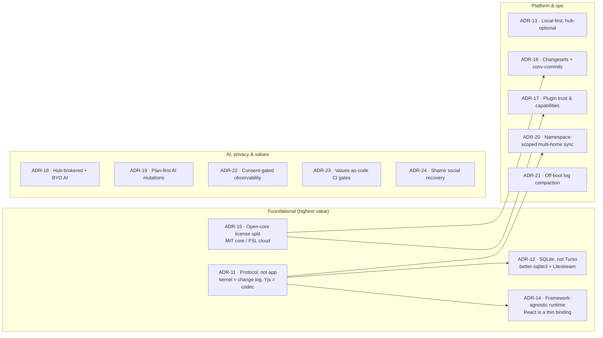
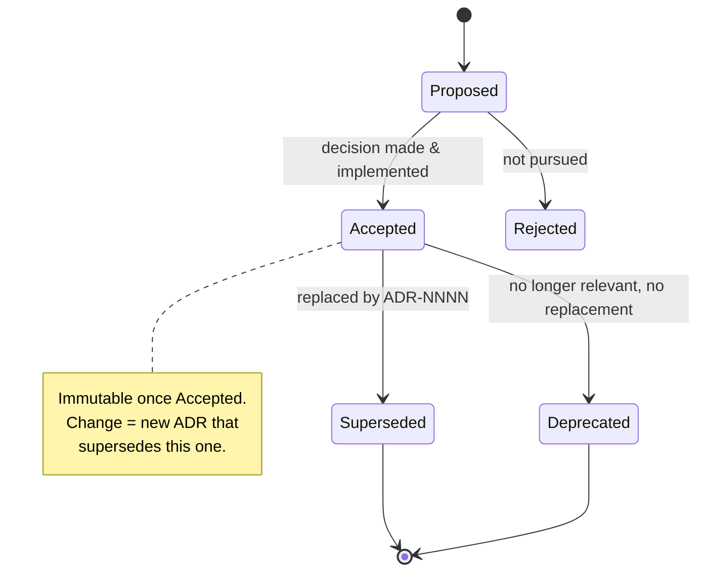
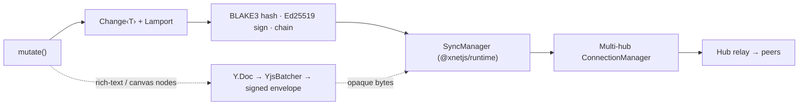

# Architecture Decision Records — Audit And Refresh

> **Status:** Exploration `[_]`
> **Date:** 2026-07-03
> **Author:** Claude
> **Tags:** adr, architecture, decisions, documentation, governance, docs-site, madr, protocol, drift

## Problem Statement

The published **Architecture Decisions** page
([`site/src/content/docs/docs/architecture/decisions.mdx`](../../site/src/content/docs/docs/architecture/decisions.mdx))
lists **ten ADRs** — Yjs-over-Automerge, DID:key, field-level LWW, BLAKE3,
named exports, factory functions, validation-returns, one-way MetaBridge,
multiplexed WebSocket, and BSM-in-Electron-main. It was written on
**2026-02-03** and — per `git log --follow` — has **never been substantively
edited since**; the only commits that touch it are a mechanical `@xnetjs` scope
migration and a docs-path move. Five months and ~80 explorations later, it is a
snapshot of a much younger codebase.

In that window xNet made decisions at least as consequential as the original
ten: it declared itself a **protocol** with a normative four-layer spec, split
its license into an MIT core and an FSL cloud, extracted a **framework-agnostic
runtime** with React demoted to a thin binding, chose **better-sqlite3 +
Litestream over Turso/libSQL** on the merits, wired a **hub-brokered managed-AI**
path plus **BYO local models**, shipped **namespace-scoped multi-home
replication**, made **consent-gated telemetry** and an **enforced humane/motion
vocabulary** load-bearing, and moved compaction **off the boot path**. None of
these appear on the ADR page.

The ask (paraphrased): *review the ADRs on the docs site, cross-check them
against the code and the `docs/explorations/` corpus, and figure out what needs
to be added or updated.* This document is that audit — what is stale, what is
missing, and a durable process so the corpus stops drifting.

## Executive Summary

- **The ten ADRs are mostly still true, but the page is dangerously
  incomplete and one framing is now misleading.** Nine of the ten decisions
  hold as written. The exception in *framing* is ADR-1/ADR-8 (Yjs): the page
  and the architecture overview still present Yjs as the sync substrate, but
  since exploration [0200](0200_%5Bx%5D_PORTABLE_XNET_PROTOCOL_BOUNDARIES_AND_STANDARD.md)
  the **interop kernel is the signed, hash-chained, LWW change log**, and Yjs is
  a *pluggable document codec* that travels as opaque bytes inside an xNet
  envelope. That is the single most important architectural fact about the
  system and it is absent from the decisions page.

- **There are actually three disconnected "decision" surfaces, all stale or
  private.** (1) the public ADR page (10 entries, frozen since Feb); (2) an
  internal [`docs/TRADEOFFS.md`](../../docs/TRADEOFFS.md) with **18** richer
  decisions dated *"January 2026"* and containing a **dead link** to a
  never-created `IDENTITY_MIGRATION_PLAN.md`; and (3) a stray `ADR-001/002/003`
  set buried inside [`docs/plans/plan00Setup/15-enterprise-scale.md`](../../docs/plans/plan00Setup/15-enterprise-scale.md)
  using a *different numbering scheme*. Readers have no single authoritative
  decision log.

- **~14 decisions made since Feb 2026 deserve ADRs.** They are all implemented
  and verified against code (citations throughout). The highest-value additions
  are the **protocol boundary**, the **license split**, the **runtime tier
  model**, and the **SQLite-not-Turso** call — each of which changes how a
  contributor reasons about the whole system.

- **The root cause is process, not content.** ADRs were treated as a one-time
  docs deliverable, never wired into the exploration → implementation flow.
  Explorations (the repo's real decision record) almost never link back to the
  ADR page. The fix is a lightweight **MADR-style status + supersede
  discipline** plus a convention that every implemented exploration that changes
  an architectural invariant either adds or supersedes an ADR.

- **Recommendation:** keep the ten (add a `Status:` line and a couple of
  clarifying cross-links), **add ADR-11…ADR-24** for the post-Feb decisions,
  **fix the two stale architecture pages** (overview sync-path + package-graph),
  **reconcile `TRADEOFFS.md`** into (or under) the ADR corpus and kill its dead
  link, and adopt the immutability/supersede convention so the log stays
  trustworthy going forward.

## Current State In The Repository

### The published ADR page

[`site/src/content/docs/docs/architecture/decisions.mdx`](../../site/src/content/docs/docs/architecture/decisions.mdx)
— reachable in the site sidebar under **Architecture → Architecture Decisions**
([`site/src/sidebar.mjs`](../../site/src/sidebar.mjs) lines 109–117):

| ADR | Decision | Verdict today |
| --- | --- | --- |
| 1 | Yjs over Automerge for rich text | ✅ true, but **framing stale** — Yjs is now a document codec, not the kernel |
| 2 | DID:key (Ed25519) for identity | ✅ current ([TRADEOFFS #11]) |
| 3 | Field-level LWW for structured data | ✅ current — and now **elevated** to the protocol merge rule |
| 4 | BLAKE3 over SHA-256 | ✅ current ([TRADEOFFS #13]); PQ posture undocumented here |
| 5 | Named exports only | ✅ current |
| 6 | Factory functions alongside classes | ✅ current |
| 7 | Validation returns, not exceptions | ✅ current |
| 8 | One-way MetaBridge | ✅ true, but **MetaBridge moved** to `@xnetjs/runtime` |
| 9 | Multiplexed WebSocket | ✅ true, **now extended** to multi-hub |
| 10 | BSM in Electron main process | ✅ true; Deno migration is exploration-only ([0251]) |

No `Status:` field, no dates, no supersede links, no cross-references to the
explorations that decided any of it. `git log --follow` on the file:

```
2496e519 chore(repo): migrate packages to @xnetjs scope     (mechanical rename)
a370feb7 fix(site): move all doc pages under /docs/ prefix   (mechanical move)
3497e938 docs(site): write all 21 remaining doc pages ...     (original authoring, 2026-02-03)
```

### The other two decision surfaces

- [`docs/TRADEOFFS.md`](../../docs/TRADEOFFS.md) — 18 well-structured decisions
  (JSON-blob storage, hybrid Yjs+event-sourcing, y-webrtc signaling, Lamport
  clocks, minimal Node, UCAN, opt-in telemetry tiers, P3A bucketing, local peer
  scoring, read-time computed properties, …). Dated **"January 2026,"** *not*
  published to the site (it lives under `docs/`, not `site/src/content/`), and
  its Identity (#11) and Crypto (#13) entries both point to
  `./IDENTITY_MIGRATION_PLAN.md`, **which does not exist**. This file is the
  richer decision log, and it is invisible to users and rotting.
- [`docs/plans/plan00Setup/15-enterprise-scale.md`](../../docs/plans/plan00Setup/15-enterprise-scale.md)
  lines 688+ — an `ADR-001 / ADR-002 / ADR-003` triple in a *third* numbering
  scheme, scoped to enterprise collaboration/telemetry tiering.

### The decisions the page is missing (all implemented, verified in code)

| Area | Decision | Primary evidence | Exploration |
| --- | --- | --- | --- |
| **Protocol** | xNet is a *protocol*, not an app; interop kernel = signed hash-chained LWW change log; Yjs is a pluggable document codec | `CURRENT_PROTOCOL_VERSION = 3` at [`packages/sync/src/change.ts:23`](../../packages/sync/src/change.ts); [`docs/specs/protocol/`](../../docs/specs/protocol); [`site/.../protocol/overview.mdx`](../../site/src/content/docs/docs/protocol/overview.mdx) | [0200] |
| **Storage** | SQLite everywhere; hub = better-sqlite3 + Litestream → R2; **not** libSQL/Turso | [`packages/hub/package.json`](../../packages/hub/package.json), [`packages/hub/src/storage/litestream.ts`](../../packages/hub/src/storage/litestream.ts) | [0178], [0212] |
| **Runtime** | Framework-agnostic `@xnetjs/runtime` (`createXNetClient`, `liveQuery`); React is a thin T1 binding; SyncManager/NodePool/MetaBridge live in runtime | [`packages/runtime/src/client.ts`](../../packages/runtime/src/client.ts), [`packages/runtime/src/index.ts`](../../packages/runtime/src/index.ts), [`packages/react/src/index.ts`](../../packages/react/src/index.ts) re-exports | [0185], [0237] |
| **Licensing** | Open-core split: MIT core, FSL-1.1 `@xnetjs/cloud`, MIT-but-`private` `@xnetjs/entitlements` as the shared contract | [`packages/cloud/LICENSE`](../../packages/cloud/LICENSE), [`packages/entitlements/package.json`](../../packages/entitlements/package.json), [`packages/hub/src/config.ts`](../../packages/hub/src/config.ts) | [0181] |
| **Release** | Changesets + Conventional Commits; `fixed` 12-pkg core lockstep, periphery independent; OIDC/provenance; coverage enforced by Stop hook | [`.changeset/config.json`](../../.changeset/config.json), [`scripts/changeset/assert-coverage.mjs`](../../scripts/changeset/assert-coverage.mjs) | [0220] |
| **Extensibility** | Provenance → trust-tier model (`@xnetjs/trust`); capability endowments (`guardStore`/`guardedFetch`); Ed25519 DID-bound plugin licenses, fail-closed | [`packages/trust/src/index.ts`](../../packages/trust/src/index.ts), [`packages/plugins/src/ecosystem/`](../../packages/plugins/src/ecosystem), [`packages/licenses/src/index.ts`](../../packages/licenses/src/index.ts) | [0189], [0192], [0194], [0196] |
| **AI** | Managed AI via keyless `ManagedProvider` → hub holds key + meters `usage.cost`; BYO local via WebLLM + Chrome Nano | [`packages/hub/src/features/ai-forwarder.ts`](../../packages/hub/src/features/ai-forwarder.ts), [`packages/plugins/src/ai/`](../../packages/plugins/src/ai) | [0201], [0208], [0244], [0252] |
| **AI safety** | Plan-first AI writes: `AiMutationPlan` validate → preview → apply → audit, with risk levels + scopes | [`docs/AI_SURFACE_CONTRACT.md`](../../docs/AI_SURFACE_CONTRACT.md) | — |
| **Sync** | Namespace-scoped multi-home replication; multiplexed multi-hub manager + policy planner; a Space maps to a namespace | [`packages/sync/src/replication-policy.ts`](../../packages/sync/src/replication-policy.ts), [`packages/runtime/src/sync/replication-scope.ts`](../../packages/runtime/src/sync/replication-scope.ts), [`packages/runtime/src/sync/connection-manager.ts`](../../packages/runtime/src/sync/connection-manager.ts) | [0258] |
| **Perf** | Append-only log with **off-boot** compaction (snapshot + tail), gated by `runWhenBootSettled`; one serial SQLite worker means no bg work is free during boot | [`apps/web/src/lib/change-log-compaction.ts`](../../apps/web/src/lib/change-log-compaction.ts), [`packages/sqlite/src/adapters/worker-scheduler.ts`](../../packages/sqlite/src/adapters/worker-scheduler.ts) | [0204], [0254], [0260] |
| **Privacy** | Consent-gated observability — Sentry + Plausible only with build-time config **and** runtime consent tier | [`apps/web/src/lib/sentry.ts`](../../apps/web/src/lib/sentry.ts), [`apps/web/src/lib/analytics.ts`](../../apps/web/src/lib/analytics.ts), [`packages/telemetry/src/consent/manager.ts`](../../packages/telemetry/src/consent/manager.ts) | [0210] |
| **Values** | Values-as-code CI gates — enforced motion vocabulary + humane-pattern lint; Charter + Right-to-Leave | [`scripts/check-motion-vocab.mjs`](../../scripts/check-motion-vocab.mjs), [`scripts/check-humane-patterns.mjs`](../../scripts/check-humane-patterns.mjs), [`docs/CHARTER.md`](../../docs/CHARTER.md) | [0199], [0234] |
| **Identity** | Social recovery via Shamir guardians; custodial escrow declined as coercible | [`packages/identity/src/recoverable.ts`](../../packages/identity/src/recoverable.ts) | [0243] |
| **Crypto** | Post-quantum posture — Ed25519 today, phased hybrid ML-DSA planned; algorithm-agility seam | [`site/.../concepts/cryptography.mdx`](../../site/src/content/docs/docs/concepts/cryptography.mdx) | [0257] |

### Two architecture pages that drifted alongside the ADRs

1. [`architecture/overview.mdx`](../../site/src/content/docs/docs/architecture/overview.mdx)
   — the **"Sync path"** mermaid shows `Y.Doc update → YjsBatcher → signYjsUpdate
   → ConnectionManager` as *the* sync path. That is the document-codec path, not
   the node/change path, and it reinforces the exact misconception ADR-11 needs
   to correct. It also lists SyncManager/MetaBridge/etc. under `@xnetjs/react`.
2. [`architecture/package-graph.mdx`](../../site/src/content/docs/docs/architecture/package-graph.mdx)
   — the dependency graph and prose omit `@xnetjs/runtime` entirely and still
   say `@xnetjs/react` "contains the SyncManager, NodePool, Registry,
   OfflineQueue, ConnectionManager, MetaBridge." The verification agent confirmed
   these **moved to `@xnetjs/runtime`**; react now re-exports them.

## External Research

The ADR practice is well-codified; the relevant guidance for *this* problem is
about the **status field** and **immutability**:

- **Nygard / adr.github.io / Fowler:** an ADR is a lightweight record of *why*,
  with a lifecycle **Proposed → Accepted → Deprecated | Superseded**. The
  canonical rule: **accepted ADRs are immutable** — you don't rewrite them, you
  write a *new* ADR that supersedes the old one and set the old one's status to
  `Superseded by ADR-NNNN`. "The truth of the architecture is the full chain of
  ADRs, not the latest one."
- **MADR (Markdown ADR):** adds named sections xNet's explorations already use —
  decision drivers, considered options with pros/cons, decision outcome,
  consequences — plus optional metadata (deciders, date, status). xNet's
  exploration template is effectively a super-set of MADR; the ADR page is the
  distilled *outcome* layer.
- **The maintenance failure mode is exactly ours:** "a team that writes ADRs but
  never re-reads them ends up with a system that has quietly drifted away from
  its own decisions." The discipline is to revisit the corpus during reviews and
  supersede what no longer applies — which is precisely this exploration.
- **Tooling:** `adr-tools` (shell) and `log4brains` (static-site generator with a
  status graph) exist, but for a repo that already ships a Starlight docs site
  and single-sources its sidebar, a hand-maintained MDR set + a lint is a better
  fit than a new toolchain.

Sources:
[Fowler — ADR](https://martinfowler.com/bliki/ArchitectureDecisionRecord.html) ·
[adr.github.io](https://adr.github.io/) ·
[MADR template primer](https://ozimmer.ch/practices/2022/11/22/MADRTemplatePrimer.html) ·
[AWS — ADR process](https://docs.aws.amazon.com/prescriptive-guidance/latest/architectural-decision-records/adr-process.html) ·
[Azure Well-Architected — maintain an ADR](https://learn.microsoft.com/en-us/azure/well-architected/architect-role/architecture-decision-record) ·
[Hidekazu Konishi — ADR templates & operations](https://hidekazu-konishi.com/entry/architecture_decision_records_templates_and_operations.html)

## Key Findings

1. **The ADR page is a five-month-old snapshot, not a living log.** Nine of ten
   entries are still correct, which is why the staleness is easy to miss — the
   danger is what's *absent*, not what's wrong.
2. **The most load-bearing fact is missing:** xNet's kernel is the change log,
   not Yjs ([0200]). Both the ADR page and the architecture overview still imply
   the opposite.
3. **Decisions are recorded in three incompatible places** (ADR page,
   `TRADEOFFS.md`, plan-embedded ADR-00x) with three numbering schemes, and
   `TRADEOFFS.md` contains a dead link. There is no single source of truth.
4. **Explorations are the *de facto* decision record** — they contain the
   drivers, options, and rationale — but they never feed the ADR page, so the
   distilled layer starves.
5. **Two adjacent architecture pages drifted with the ADRs** because the
   `@xnetjs/runtime` extraction (SyncManager/MetaBridge/etc.) wasn't reflected
   in docs.
6. **This is fixable cheaply and durably** with a status/supersede convention and
   a one-line "did this change an invariant? add/supersede an ADR" step in the
   exploration-implementation flow.

## Options And Tradeoffs

### A. What discipline should the ADR corpus follow?

| Option | How it works | Pros | Cons |
| --- | --- | --- | --- |
| **A1. Edit-in-place** (status quo) | Rewrite `decisions.mdx` whenever reality changes | One file, always "current" | Destroys history; can't tell what was true when; already failed (frozen 5 months) |
| **A2. Immutable + supersede (MADR)** ✅ | Each ADR gets a `Status`; changed decisions get a *new* ADR that supersedes the old | Trustworthy audit chain; matches how the field works; matches xNet's immutable-log ethos | Slightly more ceremony; page grows over time |
| **A3. External tool (log4brains)** | Generate an ADR micro-site with a status graph | Nice status visualization | New toolchain; duplicates the Starlight site; overkill |

**Recommend A2** — it *is* the append-only-log philosophy applied to decisions,
which is on-brand and the reason the field settled on it.

### B. Where should ADRs live, given three surfaces exist?

| Option | Pros | Cons |
| --- | --- | --- |
| **B1. Keep the public `decisions.mdx` as the one home; fold `TRADEOFFS.md` into it** ✅ | Single source of truth; users see the real decisions; single numbering | One-time migration of 18 tradeoffs into ADR form |
| **B2. Keep `TRADEOFFS.md` internal, publish only highlights** | Less public surface | Perpetuates the three-surface split that caused this |
| **B3. Split ADR file into one-file-per-ADR** | Easier diffs/supersede links; scales | Higher churn against single-page + sidebar single-sourcing; a big-bang refactor |

**Recommend B1 now, B3 later.** Consolidate onto the public page (it's what the
user pointed at), retire/redirect `TRADEOFFS.md` into it, and only split into
per-file ADRs if the single page becomes unwieldy (>~30 entries).

### C. How many new ADRs, and at what altitude?

Not every merged PR is an ADR. The bar: **a decision that constrains how future
contributors build** (an invariant, a boundary, a "don't do X"). Applying that
bar to the post-Feb corpus yields the ~14 additions in the table above. Lower-
altitude choices (specific UI component patterns, individual schema packs)
belong in explorations, not ADRs.

## Recommendation

Adopt a **living ADR log** with four concrete moves:

1. **Refresh the ten existing ADRs in place — metadata only, no content
   rewrites.** Add `Status: Accepted` + an approximate date, and add
   cross-links where framing drifted:
   - ADR-1 → "Scope: Yjs is the *document codec* for rich text & canvas; the
     sync kernel is the change log — see **ADR-11**."
   - ADR-3 → "This LWW rule is normative protocol L1 — see **ADR-11**."
   - ADR-8 → "MetaBridge now lives in `@xnetjs/runtime` — see **ADR-14**."
   - ADR-9 → "Extended to multi-home routing — see **ADR-20**."

2. **Add ADR-11 … ADR-24** (below). Each is implemented and code-cited today, so
   each ships as `Status: Accepted`, except PQ-crypto which is `Proposed`
   (posture, not yet built).

3. **Fix the two drifted architecture pages** so the docs tell one story:
   correct the overview **Sync path** to show the change-log kernel with Yjs as
   a codec branch, and add `@xnetjs/runtime` to the package graph (moving
   SyncManager/NodePool/MetaBridge out of the react description).

4. **Reconcile the decision surfaces and prevent re-drift:**
   - Fold `TRADEOFFS.md`'s 18 entries into the ADR numbering (or mark the file
     `Historical — superseded by /docs/architecture/decisions`), and **fix the
     dead `IDENTITY_MIGRATION_PLAN.md` link** (point it at ADR-11/PQ posture or
     [0257]).
   - Renumber the plan-embedded `ADR-001/002/003` to avoid the clash, or convert
     them to real ADRs.
   - Add one line to the **exploration → implementation** convention: *if an
     implemented exploration changes an architectural invariant, it must add or
     supersede an ADR in the same PR.* Optionally enforce with a soft CI check.

### Proposed new ADRs (ADR-11 … ADR-24)



| # | Title | Status | Supersedes / extends |
| --- | --- | --- | --- |
| 11 | xNet is a protocol; kernel = signed change log, Yjs is a document codec | Accepted | clarifies ADR-1, elevates ADR-3 |
| 12 | SQLite everywhere; hub = better-sqlite3 + Litestream → R2 (not Turso/libSQL) | Accepted | — (re-eval triggers noted) |
| 13 | Local-first, hub-optional — hub never blocks local reads | Accepted | — |
| 14 | Framework-agnostic `@xnetjs/runtime`; React is a thin binding; tiers T0/T1/T2 | Accepted | relocates ADR-8's MetaBridge |
| 15 | Open-core license split — MIT core / FSL cloud / MIT-private entitlements | Accepted | — |
| 16 | Automated releases via Changesets + Conventional Commits | Accepted | — |
| 17 | Plugin trust & capability model — provenance→tier, endowments, DID-bound licenses | Accepted | — |
| 18 | Managed AI via hub broker + BYO local models | Accepted | — |
| 19 | Plan-first AI mutations (AI Surface Contract) | Accepted | — |
| 20 | Namespace-scoped multi-home replication | Accepted | extends ADR-9 |
| 21 | Append-only log with off-boot compaction | Accepted | — |
| 22 | Consent-gated observability (Sentry/Plausible) | Accepted | — |
| 23 | Values-as-code CI gates (motion + humane) | Accepted | — |
| 24 | Social recovery via Shamir guardians; custodial escrow declined | Accepted | — |
| (25) | Post-quantum migration posture (Ed25519 → hybrid ML-DSA) | **Proposed** | future of ADR-4 |

### ADR lifecycle to adopt



## Example Code

### A) The MADR-style template to add to the top of `decisions.mdx`

```markdown
<!-- Template — copy for each new ADR. Once Accepted, do not rewrite; supersede. -->
## ADR-NN: <Short decision title>

**Status:** Proposed | Accepted | Deprecated | Superseded by ADR-MM
**Date:** YYYY-MM
**Context:** <the exploration(s) that decided this, e.g. 0212>

**Decision:** <one sentence>

**Rationale:**
- <driver 1>
- <driver 2>

**Tradeoff:** <what we gave up, and the mitigation>
```

### B) ADR-11, drafted (the keystone addition)

```markdown
## ADR-11: XNet is a protocol; the interop kernel is the change log, not Yjs

**Status:** Accepted
**Date:** 2026-06 (exploration 0200)
**Context:** 0200 — Portable XNet protocol boundaries.

**Decision:** Treat XNet as a versioned, multi-implementation **protocol** whose
normative surface is four layers — L0 primitives, L1 data model, L2 replication,
L3 authorization — with the application profile (L4) explicitly non-normative.
The interop kernel is a **signed, hash-chained, per-property-LWW change log over
schema-typed nodes** (`CURRENT_PROTOCOL_VERSION = 3`,
`packages/sync/src/change.ts`). Yjs is a **pluggable document codec** for the
rich-text/canvas body of certain nodes and travels the wire as opaque bytes
inside an XNet envelope.

**Rationale:**
- A second implementation in any language can forward/store the Yjs blob as an
  octet string and still fully participate in the node graph, identity, authz,
  and sync — the hardest local-first portability problem is off the critical path.
- The spec already exists in `docs/specs/protocol/` with a conformance corpus.

**Tradeoff:** Two merge systems (LWW log + Yjs CRDT) instead of one. Accepted:
they have different conflict semantics and scale profiles (see ADR-1, ADR-3).

**Clarifies ADR-1 and elevates ADR-3.**
```

### C) The corrected "Sync path" for `architecture/overview.mdx`



## Risks And Open Questions

- **Scope creep:** 14 new ADRs is a lot at once. Mitigate by landing them in
  batches (Foundational → Platform → Values) so each PR is reviewable.
- **Single page vs per-file:** at ~25 ADRs the single MDX page gets long. Open
  question: split now (better diffs/supersede links, but fights the
  sidebar/llms single-sourcing) or defer until it hurts. Recommend defer.
- **`TRADEOFFS.md` fate:** fold-in vs mark-historical. Folding is more work but
  ends the three-surface problem for good; recommend fold-in over 1–2 PRs.
- **Namespace vs Space wording:** the routing key is a *namespace*
  (`replication-policy.ts`), while a *Space* is the user-facing unit that maps to
  one (`spaceNamespace()` in `replication-scope.ts`). ADR-20 must state both
  precisely to avoid a new drift.
- **PQ-crypto is posture, not code.** ADR-25 must be `Proposed`, not `Accepted`,
  or it becomes the next thing that's "written but not true."
- **Enforcement:** a hard CI gate ("architectural PRs must touch an ADR") risks
  false positives. Prefer a soft reviewer-checklist item first.

## Implementation Checklist

- [x] Add the MADR template + a short "how we keep these current (immutable,
      supersede-don't-edit)" preface to `decisions.mdx`.
- [x] Add `Status: Accepted` + approx date to ADR-1…ADR-10; add the four
      clarifying cross-links (ADR-1/3/8/9).
- [x] Draft and land **ADR-11** (protocol kernel) — the keystone.
- [x] Land **Foundational** batch: ADR-12 (SQLite/Turso), ADR-14 (runtime),
      ADR-15 (license split).
- [x] Land **Platform** batch: ADR-13, ADR-16, ADR-17, ADR-20, ADR-21.
- [x] Land **Values** batch: ADR-18, ADR-19, ADR-22, ADR-23, ADR-24; add
      ADR-25 as `Proposed`.
- [x] Fix `architecture/overview.mdx` **Sync path** mermaid + package attributions.
- [x] Add `@xnetjs/runtime` to `architecture/package-graph.mdx`; move
      SyncManager/NodePool/MetaBridge prose from react → runtime.
- [x] Reconcile `docs/TRADEOFFS.md`: fold entries into ADR numbering (or mark
      Historical) and **fix the dead `IDENTITY_MIGRATION_PLAN.md` link**.
- [x] Renumber/convert the `ADR-001/002/003` in `plan00Setup/15-enterprise-scale.md`.
- [x] Add the "changed an invariant? add/supersede an ADR" line to the
      exploration/implement convention (and consider a soft CI reminder).

## Validation Checklist

- [x] `pnpm --filter site build` succeeds; ADR page renders with all statuses.
- [x] Every ADR cites at least one real file path or exploration; a script/grep
      confirms no ADR cites a non-existent path (catch dead links like the
      current `IDENTITY_MIGRATION_PLAN.md`).
- [x] The overview **Sync path** no longer implies Yjs is the sync substrate; a
      reader can trace `mutate()` → change log → hub without touching Yjs.
- [x] `architecture/package-graph.mdx` lists `@xnetjs/runtime` and no longer
      attributes SyncManager/MetaBridge to `@xnetjs/react`.
- [x] Searching the repo for "decision record" returns **one** canonical home;
      `TRADEOFFS.md` and the plan-embedded ADRs point to it.
- [x] `orderedDocSlugs` / llms-full build still passes (no unlisted doc pages).
- [x] Spot-check three new ADRs against code with a fresh reader: the cited path
      exists and says what the ADR claims.

## References

**In-repo**
- ADR page — [`site/src/content/docs/docs/architecture/decisions.mdx`](../../site/src/content/docs/docs/architecture/decisions.mdx)
- Internal tradeoffs — [`docs/TRADEOFFS.md`](../../docs/TRADEOFFS.md)
- Architecture overview / package graph — [`architecture/overview.mdx`](../../site/src/content/docs/docs/architecture/overview.mdx), [`architecture/package-graph.mdx`](../../site/src/content/docs/docs/architecture/package-graph.mdx)
- Protocol spec + overview — [`docs/specs/protocol/`](../../docs/specs/protocol), [`protocol/overview.mdx`](../../site/src/content/docs/docs/protocol/overview.mdx)
- AI surface contract — [`docs/AI_SURFACE_CONTRACT.md`](../../docs/AI_SURFACE_CONTRACT.md)
- Sidebar single-source — [`site/src/sidebar.mjs`](../../site/src/sidebar.mjs)

**Explorations cited**
[0178] · [0181] · [0185] · [0188] · [0189] · [0192] · [0194] · [0196] · [0199] ·
[0200] · [0204] · [0208] · [0210] · [0212] · [0220] · [0234] · [0237] · [0243] ·
[0244] · [0251] · [0252] · [0254] · [0257] · [0258] · [0260]

**External**
- [Martin Fowler — Architecture Decision Record](https://martinfowler.com/bliki/ArchitectureDecisionRecord.html)
- [adr.github.io — Architectural Decision Records](https://adr.github.io/)
- [The MADR template, explained and distilled](https://ozimmer.ch/practices/2022/11/22/MADRTemplatePrimer.html)
- [AWS Prescriptive Guidance — ADR process](https://docs.aws.amazon.com/prescriptive-guidance/latest/architectural-decision-records/adr-process.html)
- [Azure Well-Architected — Maintain an ADR](https://learn.microsoft.com/en-us/azure/well-architected/architect-role/architecture-decision-record)
- [Hidekazu Konishi — ADR templates & operational patterns](https://hidekazu-konishi.com/entry/architecture_decision_records_templates_and_operations.html)

<!-- Exploration index shortcuts (relative to docs/explorations/) -->
[0178]: 0178_%5B_%5D_COST_EFFICIENT_SQLITE_HOSTING_NO_LIBSQL_MIGRATION.md
[0181]: 0181_%5Bx%5D_CONSOLIDATE_CLOUD_INTO_ONE_PACKAGE.md
[0185]: 0185_%5B_%5D_FRAMEWORK_AGNOSTIC_DATA_MODEL_SDK.md
[0188]: 0188_%5Bx%5D_SLOW_PAGE_LOADS_HUB_BLOCKS_LOCAL_DOCUMENT_LOAD.md
[0189]: 0189_%5B_%5D_EVERYTHING_AS_PLUGINS_FEATURE_MODULE_PLATFORM.md
[0192]: 0192_%5B_%5D_PLUGIN_ECOSYSTEM_MARKETPLACE_DX_AND_TRUST.md
[0194]: 0194_%5B_%5D_EXTENSIBILITY_FABRIC_PLUGINS_LABS_AI_EDITOR.md
[0196]: 0196_%5B_%5D_PAID_PLUGIN_MARKETPLACE_MONETIZATION_AND_LICENSING.md
[0199]: 0199_%5B_%5D_ELEGANT_COMPOSABLE_MOTION_SYSTEM.md
[0200]: 0200_%5Bx%5D_PORTABLE_XNET_PROTOCOL_BOUNDARIES_AND_STANDARD.md
[0204]: 0204_%5Bx%5D_FAST_LOCAL_FIRST_COLD_START_AND_CACHE_HYDRATION.md
[0208]: 0208_%5Bx%5D_OPENROUTER_MANAGED_AI_MODEL_SWITCHING_AND_CLIENT_WIRING.md
[0210]: 0210_%5Bx%5D_ERROR_MONITORING_PRIVACY_ANALYTICS_AND_CONSENT_ACROSS_SURFACES.md
[0212]: 0212_%5B_%5D_TURSO_DATABASE_VS_SQLITE_ON_THE_MERITS.md
[0220]: 0220_%5Bx%5D_AUTOMATED_NPM_PACKAGE_PUBLISHING_AND_CONVENTIONAL_VERSIONING.md
[0234]: 0234_%5B_%5D_MITIGATING_INTERNET_HARMS_A_NEO_LUDDITE_AUDIT_OF_XNET.md
[0237]: 0237_%5Bx%5D_VUE_SVELTE_AND_OTHER_FRAMEWORKS_WHAT_SUPPORT_ACTUALLY_COSTS.md
[0243]: 0243_%5Bx%5D_ACCOUNT_VALIDATION_AND_RECOVERY_BINDING_THE_PAYER_TO_THE_PASSKEY.md
[0244]: 0244_%5Bx%5D_OPENROUTER_DEEP_INTEGRATION_MARGIN_SAFE_BILLING_AND_USER_SPEND_CAPS.md
[0251]: 0251_%5B_%5D_ELECTRON_TO_DENO_DESKTOP_MIGRATION.md
[0252]: 0252_%5B_%5D_WHY_THE_AI_CHAT_BOX_IS_DISABLED_LOCAL_MODEL_CONNECTOR_GAPS.md
[0254]: 0254_%5B_%5D_COMPACT_THE_CHANGE_LOG_SNAPSHOT_THE_STATE_KEEP_THE_TAIL.md
[0257]: 0257_%5B_%5D_CLOSING_THE_LAST_MILE_ALIGNING_THE_CODE_WITH_THE_ETHOS.md
[0258]: 0258_%5B_%5D_MULTI_HOME_SYNC_FEDERATED_HUBS_PEERS_AND_THE_REPLICATION_MANIFEST.md
[0260]: 0260_%5Bx%5D_COMPACTION_STARVES_THE_COLD_OPEN_SCHEDULE_IT_OFF_THE_BOOT_PATH.md
[TRADEOFFS #11]: ../../docs/TRADEOFFS.md
[TRADEOFFS #12]: ../../docs/TRADEOFFS.md
[TRADEOFFS #13]: ../../docs/TRADEOFFS.md
```
