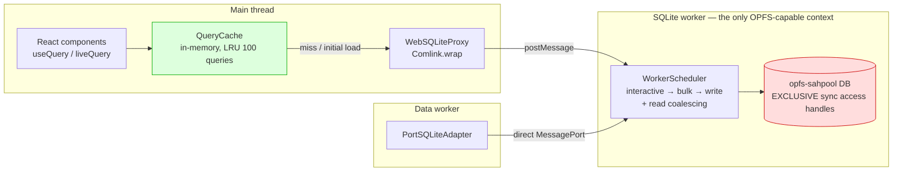
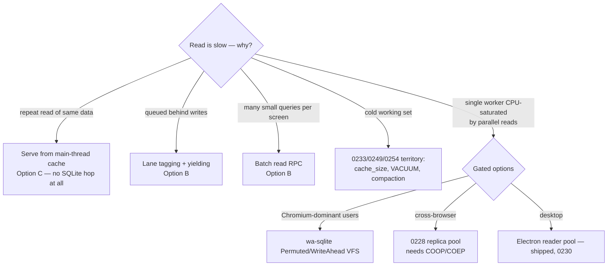
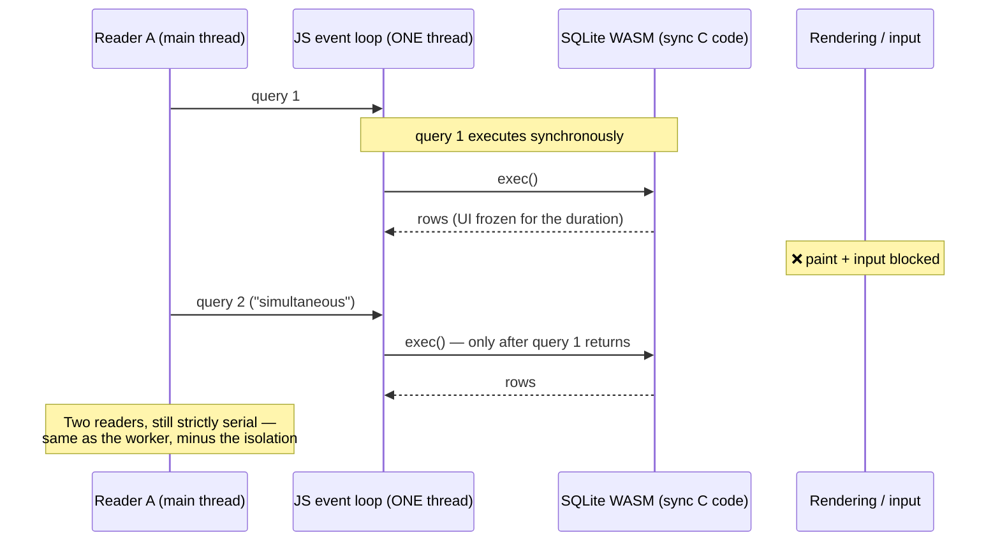

# Main-Thread SQLite And The Multiple-Reader Question

## Problem Statement

The web app's SQLite database lives in a dedicated Web Worker, and every
operation is serialized through that one worker — effectively a single reader.
The question:

> *Would it make more sense to move the database into the main thread? If the
> SQLite database was in the main thread, could we connect multiple readers
> simultaneously, or would we still be limited to a single reader? I'm
> wondering how to improve query speed and read speed.*

This is the third exploration in a series:
[0227](0227_[_]_BOOT_STALL_SQLITE_WORKER_HEAD_OF_LINE_BLOCKING.md) diagnosed
head-of-line blocking on the single worker,
[0228](0228_[_]_PARALLEL_SQLITE_READS_WORKER_POOL_AND_DISPATCHER.md) rejected
"N reader **workers** on one OPFS file" (exclusive handles) and shipped a
priority scheduler instead, and
[0230](0230_[_]_PARALLEL_SQLITE_READERS_IN_ELECTRON_WAL_AND_WORKER_THREADS.md)
built a real WAL reader pool on Electron where the browser constraint doesn't
exist. This document answers the remaining variant — moving the database **to
the main thread** — and surveys what *does* move the needle on read speed.

## Executive Summary

**No — moving SQLite to the main thread would not enable multiple readers, and
it would cost us durable storage.** Three independent facts each individually
kill the idea:

1. **The main thread cannot host the database at all.**
   `FileSystemSyncAccessHandle` — the OPFS primitive that every fast browser
   SQLite VFS (including our `opfs-sahpool`,
   [`packages/sqlite/src/adapters/web.ts:225`](../../packages/sqlite/src/adapters/web.ts))
   is built on — is **only available inside dedicated Web Workers**. Main-thread
   SQLite is limited to `:memory:`, localStorage-backed `kvvfs` (~5 MB), or
   slow async-File-API VFSes. Moving the DB to the main thread means giving up
   OPFS persistence, not gaining readers.

2. **Even if it could, the main thread is still one thread.** SQLite WASM calls
   are synchronous CPU work. Two "simultaneous" readers on the main thread
   execute one after the other — exactly the serialization we have today —
   except now every query also blocks rendering, input handling, and React.
   The single-reader limit is caused by *one thread + one connection + one
   exclusive OPFS handle*, and relocating the thread changes none of the three.

3. **The exclusive-handle wall follows the file, not the thread.** The
   `opfs-sahpool` VFS acquires an **exclusive** sync access handle per database
   file. A second connection — from the main thread, another worker, or another
   tab — is locked out and falls back to `:memory:`
   ([`opfs-retry.ts`](../../packages/sqlite/src/adapters/opfs-retry.ts)). True
   multi-reader OPFS exists only behind Chromium 121+'s `readwrite-unsafe`
   locking mode (wa-sqlite's OPFSPermutedVFS / OPFSWriteAheadVFS) — not in
   Safari or Firefox, so it cannot be our baseline.

What the worker placement *does* cost us is one structured-clone `postMessage`
round-trip per query — typically well under a millisecond to a few ms for large
result sets. What it buys is a UI that never janks on I/O. Every production
local-first system surveyed (Notion, PowerSync, LiveStore, Evolu) keeps
disk-backed SQLite in a worker.

**The real lever for read speed is not thread placement — it's not touching
SQLite at all for hot reads.** The proven pattern (LiveStore, cr-sqlite,
TinyBase) is a main-thread in-memory read layer fed by the worker: we already
have the skeleton of one in the data-bridge `QueryCache`
([`packages/data-bridge/src/query-cache.ts`](../../packages/data-bridge/src/query-cache.ts)),
which serves live queries from memory and applies write deltas without
re-querying. The recommendation is to finish the 0228 Phase-1 residuals (lane
tagging, batching), then deepen the main-thread cache (bigger capacity,
persistent-across-navigation snapshots, coalescing at the bridge), and keep the
Chromium-only parallel-VFS option and the 0228 replica pool as explicitly gated
future phases.

## Current State In The Repository

### Where the database lives

- **One dedicated worker per tab.** `WebSQLiteProxy` spawns it and wraps it in
  Comlink ([`web-proxy.ts:89-92`](../../packages/sqlite/src/adapters/web-proxy.ts)).
  The data worker gets a second `MessagePort` into the *same* worker
  ([`web-proxy.ts:378-384`](../../packages/sqlite/src/adapters/web-proxy.ts),
  `connectPort` in [`web-worker.ts`](../../packages/sqlite/src/adapters/web-worker.ts)) —
  more clients, same single storage thread.
- **SQLite build:** `@sqlite.org/sqlite-wasm` with the `opfs-sahpool` VFS
  (`installOpfsSAHPoolVfs`, [`web.ts:225-230`](../../packages/sqlite/src/adapters/web.ts)),
  falling back to async `OpfsDb` (old iOS) and finally `:memory:`.
- **Pragmas** ([`web.ts:317-377`](../../packages/sqlite/src/adapters/web.ts)):
  `journal_mode=TRUNCATE` (fastest on OPFS; WAL gives no concurrency in WASM —
  see External Research), `synchronous=NORMAL`, `page_size=8192`,
  `cache_size=-262144` (256 MB page cache — the single biggest cold-read win to
  date), `auto_vacuum=INCREMENTAL` (0260 reclaim), `busy_timeout=5000`.

### What already shipped since 0228

- **The Phase-1 scheduler is live.** Every op flows through `WorkerScheduler`
  ([`worker-scheduler.ts`](../../packages/sqlite/src/adapters/worker-scheduler.ts)),
  which drains `interactive → bulk → write` lanes strictly one job at a time
  and **coalesces identical in-flight reads** (same SQL + params → one
  execution, one shared promise). Reads default to the `interactive` lane;
  writes to `write` ([`web-worker.ts:203-233`](../../packages/sqlite/src/adapters/web-worker.ts)).
  Its own header states the invariant this exploration re-confirms: *"a single
  OPFS connection is inherently serial… multiple reader workers on the same DB
  are impossible."*
- **A main-thread read layer already exists (embryonically).** Live queries do
  **not** hit SQLite per render: `MainThreadBridge` holds a `QueryCache`
  (max 100 entries, 30 s-idle LRU) that serves `getSnapshot()` synchronously
  and applies store-change deltas **in memory**, only falling back to a full
  SQL reload for bulk changes (>250 rows)
  ([`main-thread-bridge.ts:140-200`](../../packages/data-bridge/src/main-thread-bridge.ts),
  [`query-cache.ts`](../../packages/data-bridge/src/query-cache.ts)). SQLite is
  consulted on first subscription and on invalidation — the architecture is
  already "reads served from main-thread memory, storage in the worker."
- **Electron got real parallelism** because native SQLite has no OPFS wall:
  WAL + a read-only secondary connection + an auto-sized read-only
  `worker_threads` pool with a least-busy dispatcher for heavy reads
  ([`electron.ts`](../../packages/sqlite/src/adapters/electron.ts),
  [`reader-pool.ts`](../../packages/sqlite/src/adapters/reader-pool.ts),
  [`reader-thread.ts`](../../packages/sqlite/src/adapters/reader-thread.ts);
  exploration 0230). This is the contrast case: multiple readers require
  multiple *connections on multiple threads against a shared-readable file* —
  the browser denies us the third ingredient, not the worker.

### Where read latency actually comes from

| Segment | Warm cost | Notes |
|---|---|---|
| Scheduler queue wait | 0–10 ms | bounded by lanes; a queued write burst can no longer starve reads |
| SQL execution + OPFS I/O | ~1–50 ms | 256 MB page cache means hot pages never touch OPFS |
| Comlink structured clone | ~0.1–20 ms | scales with result-set size, not with placement of SQLite |
| Cold first read | seconds | working-set page faults — attacked by 0233/0249/0253/0254 (VACUUM, compaction, cache/mmap/page-size), **not** a threading problem |

The worker hop is the *smallest* line item. Eliminating it by moving SQLite to
the main thread would trade the smallest cost for losing durability and
blocking paint during the largest one.

## External Research

All claims cited; full URLs in References.

1. **`createSyncAccessHandle()` is worker-only.** MDN: *"This feature is only
   available in Dedicated Web Workers"* — not the main thread, not
   SharedWorkers, not ServiceWorkers. Its synchronous API exists precisely
   because it would otherwise block the UI thread. Consequence: **no
   OPFS-backed SQLite on the main thread**, full stop. Main-thread-capable
   storage is limited to `:memory:`, `kvvfs` (localStorage, ~5 MB), wa-sqlite's
   IDBBatchAtomicVFS (degrades past ~100 MB), or OPFSAnyContextVFS (async File
   API, "very bad" write performance at scale).
2. **Default OPFS locking is exclusive.** A sync access handle *"takes an
   exclusive lock on the file"*. A `mode` option exists — `"read-only"` (many
   read handles) and `"readwrite-unsafe"` (many read-write handles, no mutual
   exclusion) — but is **Chromium-only (Chrome 121+)**; Firefox and Safari have
   not implemented it. Roy Hashimoto (wa-sqlite): *"You can only get real
   concurrency with an OPFS VFS in a browser that supports
   `mode: 'readwrite-unsafe'`."*
3. **VFS concurrency landscape.** Official `opfs-sahpool`: single-connection by
   design, "king of the hill for performance," ~3–4× faster than the `opfs`
   VFS on speedtest1. Official `opfs` VFS: multiple connections *coordinate*
   (retry on `SQLITE_BUSY`) but never read concurrently, and it needs
   COOP/COEP (which production does not set —
   [`coop-coep-headers.ts`](../../apps/web/vite-plugins/coop-coep-headers.ts)
   is dev-only). wa-sqlite's OPFSPermutedVFS and OPFSWriteAheadVFS rebuild
   WAL-like *multi-reader + single-writer* semantics inside the VFS — genuinely
   concurrent readers, but gated on Chromium's `readwrite-unsafe`.
4. **WAL does not rescue the browser.** Since SQLite 3.47, WASM WAL works only
   with `locking_mode=EXCLUSIVE` — which eliminates exactly the
   concurrent-reader benefit WAL exists to provide. PowerSync's May-2026
   survey: *"No mature WAL implementation exists for browsers."* Our
   `journal_mode=TRUNCATE` choice stands.
5. **Nobody runs disk-backed SQLite on the main thread.** Notion (one worker
   per tab, Web-Locks-elected active tab, SAH-pool VFS chosen specifically to
   avoid multi-writer corruption; ~20 % faster navigation), PowerSync and
   LiveStore (Web-Locks leader election, one persisting worker) all keep
   storage in a worker. The **one recommended main-thread pattern is a pure
   in-memory mirror for synchronous reads** — LiveStore ships exactly that: an
   in-memory SQLite replica on the main thread for instant reads, persisted
   SQLite in the leader worker, at a memory cost per tab.
6. **The cheap levers are classic.** Page cache in the WASM heap (hot reads
   never hit OPFS), covering indexes, prepared-statement caching, and
   transaction batching (Hashimoto: 1000 inserts ≈ 220 ms individually vs
   ≈ 1.5 ms in one transaction; OPFS forces up to 4 flushes per write
   transaction). Note `mmap_size` is a no-op in WASM builds — our pragma is
   harmless but inert; the 256 MB `cache_size` is what actually works.

## Key Findings

1. **The premise inverts: the worker is not the limitation — it's the only
   context allowed to hold the database.** Moving SQLite to the main thread is
   not merely unhelpful; with OPFS it is *impossible*, and with non-OPFS
   fallbacks it means losing durable storage or 100 MB-scale performance.
2. **"Multiple readers" requires multiple threads with multiple connections to
   a concurrently-readable file.** The main thread offers one thread; sahpool
   offers one connection; OPFS (outside Chromium's `readwrite-unsafe`) offers
   one handle. Zero of three requirements met — same single reader, plus UI
   jank.
3. **The worker hop costs almost nothing; the serialization discipline was the
   actual 0227 problem and is already fixed** by the shipped lane scheduler +
   read coalescing. Remaining scheduler residuals (caller-side lane tagging,
   yielding inside long bulk ops) are unchecked 0228 items.
4. **We already own the architecture that the state of the art recommends** —
   worker-owned storage + main-thread in-memory read layer (`QueryCache` with
   delta application). Improving read speed means *investing in that cache*,
   not relocating the engine.
5. **True browser read parallelism exists but only as a Chromium fork** in the
   road (wa-sqlite OPFSPermutedVFS / OPFSWriteAheadVFS / OPFSAdaptiveVFS with
   `lockPolicy:'shared'`). It would mean leaving the official SQLite WASM
   distribution and maintaining two VFS paths. Park it behind a measured need.
6. **Electron already has the multi-reader answer** (0230 reader pool) — any
   read workload that is provably parallel-bound has a native home on desktop
   today.

## Options And Tradeoffs

### A. Move SQLite to the main thread — **reject**

- ❌ No OPFS on the main thread → lose durability or fall to async VFSes that
  are strictly slower than today.
- ❌ Still exactly one reader (one JS thread), now sharing time with React,
  layout, and input.
- ❌ Long queries become dropped frames; the 0227-class stall would freeze the
  page instead of delaying a panel.
- ✅ The only gain — removing the postMessage round-trip — is the smallest
  cost segment, and the `QueryCache` already removes it for repeat reads.

### B. Finish the 0228 Phase-1 residuals *(small, do first)*

Caller-side lane tagging (seed/import/sync-apply → `bulk`/`write`), cooperative
yielding inside `applyNodeBatch`-style long ops, and a batch RPC that bundles N
small reads into one round-trip (cuts per-query clone + scheduling overhead for
dashboard fan-outs).

- ✅ Cheap, no architecture change, measurable p95 wins under write bursts.
- ⚠️ Ordering only — no throughput change (by design).

### C. Deepen the main-thread read layer *(the strategic lever)*

Grow `QueryCache` from a per-subscription cache into a deliberate read tier:
raise capacity beyond 100 with size-aware accounting, keep delta-application
the primary path (avoid the >250-change full-reload cliff via keyed partial
reloads), pre-hydrate from `WorkingSetPrewarm`, and optionally snapshot hot
query results so a warm navigation renders before the worker answers.
LiveStore's fuller variant — an in-memory SQLite mirror on the main thread for
arbitrary synchronous SQL — is the extension point if schema-shaped caching
proves insufficient.

- ✅ Hot reads become synchronous main-thread memory hits — faster than *any*
  SQLite placement could ever be; zero risk to the durable store.
- ✅ Aligned with what we already built; incremental.
- ⚠️ Memory budget and invalidation correctness are the engineering cost;
  read-your-writes already handled by store-event deltas.

### D. Chromium-only parallel readers (wa-sqlite Permuted/WriteAhead VFS)

- ✅ The only genuine in-browser multi-reader story that exists.
- ❌ Chrome 121+ only (`readwrite-unsafe`); Safari/Firefox keep the serial
  path → permanent dual-VFS maintenance; leaves the official SQLite WASM
  build; migration risk to the *durable store* for a read-side win.
- Verdict: **defer** until a profiled, Chromium-dominant, read-parallel
  workload demands it — then rebenchmark against C.

### E. Replica reader pool (0228 Phase B) / F. hot-read shard (0228 Phase D)

Unchanged from 0228: real parallelism via replicas (needs COOP/COEP in prod +
delta protocol) or a second DB file for the read projection. Both remain
gated on evidence that the single worker is CPU-saturated by concurrent reads
— which current telemetry does not show.

| Option | Multiple readers? | Read-latency win | Durability risk | Effort | Verdict |
|---|---|---|---|---|---|
| A. Main thread | ❌ (still 1, + jank) | negative | **loses OPFS** | M | reject |
| B. Scheduler residuals + batch RPC | ❌ | p95 under load | none | S | do now |
| C. Main-thread read tier | effectively ✅ (for cached reads) | **largest** | none | M | do next |
| D. Chromium parallel VFS | ✅ (Chromium only) | for cache-miss reads | migration risk | L | defer |
| E/F. Replicas / shard | ✅ / partial | throughput | low | L / M | gated (0228) |

## Recommendation

**Answer the question directly: keep the database in the worker.** The single-
reader ceiling is imposed by the browser's storage model, not by our worker
choice; the main thread is the one context that both *can't* hold the database
and *shouldn't* run its CPU work.

Then improve read speed in this order:

1. **Now (B):** finish 0228 Phase-1 residuals — tag bulk/write callers into
   their lanes, chunk-yield long batch ops, and add a batched read RPC to
   amortize Comlink overhead on multi-query screens.
2. **Next (C):** invest in the main-thread read tier — `QueryCache` capacity +
   partial-reload instead of the bulk-change cliff + prewarm hydration. Measure
   cache hit-rate and `getSnapshot` latency in the perf panel; decide on the
   LiveStore-style full in-memory mirror only with those numbers in hand.
3. **Keep gated:** Chromium `readwrite-unsafe` VFSes (D) and the 0228 replica
   pool (E) stay parked behind a demonstrated read-saturation benchmark.
   Heavy parallel read workloads have a home on Electron's reader pool today.

### Why a read on the main thread wouldn't be "parallel" anyway

## Risks And Open Questions

- **Memory budget for a deeper read tier (C).** Cache growth must be size-aware
  (rows × columns, not entry count); a full LiveStore-style mirror doubles the
  working set per tab. Instrument before committing.
- **Invalidation correctness at higher cache capacity** — the >250-change
  reload cliff exists because per-node delta application was the risky path;
  widening the cache raises the cost of getting deltas wrong. Property-authority
  and query-descriptor edge cases need tests.
- **Is any real workload read-parallel-bound?** No current telemetry shows the
  worker CPU-saturated by concurrent reads; the perf panel should expose
  scheduler lane depth + op timings (0228 checklist item) so D/E stay
  evidence-gated.
- **`mmap_size` pragma is inert in WASM** — harmless, but remove or annotate it
  so future tuning doesn't credit it.
- **Safari/iOS remains the binding constraint** for any VFS adventure; sahpool
  is the only broadly-supported fast path (0228 finding, reconfirmed).

## Implementation Checklist

**Phase B — scheduler residuals + batching (now)**

- [ ] Tag bulk/write call sites: seed, import, sync-apply → `bulk`/`write`
      lanes (today most reads default to `interactive`; verify writes never
      jump lanes).
- [ ] Cooperative yielding inside long batch ops (`applyNodeBatch`, seed
      import) so interactive reads interleave mid-burst.
- [ ] Add a `queryBatch(sql[])` RPC on `SQLiteWorkerHandler` + proxy, and use it
      for multi-query screens (dashboard fan-out, prewarm).
- [ ] Surface scheduler lane depth / op latency in the devtools perf panel
      (carried over from 0228).

**Phase C — main-thread read tier (next)**

- [ ] Add size-aware accounting to `QueryCache` (bytes, not entry count) and
      raise capacity accordingly; expose hit/miss counters.
- [ ] Replace the >250-change full-reload cliff with keyed partial reload
      (re-query only affected descriptors).
- [ ] Hydrate the cache from `WorkingSetPrewarm` results so post-boot
      navigations hit warm entries.
- [ ] Measure: cache hit-rate, `getSnapshot()` p95, worker round-trips per
      navigation — before/after.
- [ ] Decision point: if hit-rate plateaus below target with schema-shaped
      caching, spike a LiveStore-style in-memory SQLite mirror on the main
      thread (worker stays the writer/durable store) and benchmark memory cost.

**Bookkeeping**

- [ ] Annotate (or drop) the inert `mmap_size` pragma in
      `packages/sqlite/src/adapters/web.ts` with a comment that WASM builds
      compile with mmap disabled.
- [ ] Link this doc from 0228/0230 as the "main thread" variant answer.

## Validation Checklist

- [ ] Under a sustained write burst, interactive read p95 stays < 16 ms
      (one frame) with lane tagging complete.
- [ ] Batched RPC reduces worker round-trips on a dashboard screen by ≥ 50 %
      with unchanged results.
- [ ] Main-thread cache hit-rate for repeat navigations ≥ 80 %; warm
      `getSnapshot()` ≤ 1 ms.
- [ ] No regression in read-your-writes: a write followed by a live-query
      snapshot read reflects the write (delta path) in every covered schema.
- [ ] Memory ceiling holds: read-tier growth bounded and observable in the
      perf panel; no OOM on iOS Safari.
- [ ] The durable store still opens via `opfs-sahpool` on Chrome/Safari/Firefox
      (no silent `:memory:` fallback introduced by any change here).

## References

**Repository**

- Worker + VFS: [`packages/sqlite/src/adapters/web.ts`](../../packages/sqlite/src/adapters/web.ts) ·
  [`web-worker.ts`](../../packages/sqlite/src/adapters/web-worker.ts) ·
  [`web-proxy.ts`](../../packages/sqlite/src/adapters/web-proxy.ts) ·
  [`opfs-retry.ts`](../../packages/sqlite/src/adapters/opfs-retry.ts)
- Scheduler (0228 Phase 1, shipped): [`worker-scheduler.ts`](../../packages/sqlite/src/adapters/worker-scheduler.ts)
- Main-thread read layer: [`packages/data-bridge/src/main-thread-bridge.ts`](../../packages/data-bridge/src/main-thread-bridge.ts) ·
  [`query-cache.ts`](../../packages/data-bridge/src/query-cache.ts) ·
  [`packages/runtime/src/live-query.ts`](../../packages/runtime/src/live-query.ts)
- Electron contrast (real reader pool): [`electron.ts`](../../packages/sqlite/src/adapters/electron.ts) ·
  [`reader-pool.ts`](../../packages/sqlite/src/adapters/reader-pool.ts) ·
  [`reader-thread.ts`](../../packages/sqlite/src/adapters/reader-thread.ts)
- Prior explorations: `0227` (head-of-line) · `0228` (worker pool / exclusivity
  wall) · `0230` (Electron readers) · `0226` (materialized views) ·
  `0233`/`0249`/`0253`/`0254`/`0260` (cold-open + compaction series)

**External**

- MDN — [`createSyncAccessHandle`](https://developer.mozilla.org/en-US/docs/Web/API/FileSystemFileHandle/createSyncAccessHandle)
  (worker-only; exclusive lock; `mode` option incl. `readwrite-unsafe`)
- SQLite — [WASM persistence docs](https://sqlite.org/wasm/doc/trunk/persistence.md)
  (sahpool = single-connection; WAL-in-WASM requires `locking_mode=EXCLUSIVE`) ·
  [OPFS concurrency tester](https://wasm-testing.sqlite.org/tests/opfs/concurrency/) ·
  [opfs-wl RFC](https://sqlite.org/forum/info/0d82f3fa26cb584a06561a9d1d4d3e17c10c82391a85cebeca2737a13926e20a)
- wa-sqlite — [VFS comparison](https://github.com/rhashimoto/wa-sqlite/tree/master/src/examples) ·
  [#152 OPFSPermutedVFS](https://github.com/rhashimoto/wa-sqlite/discussions/152) ·
  [#302 "real concurrency only with readwrite-unsafe"](https://github.com/rhashimoto/wa-sqlite/discussions/302) ·
  [#23 write-batching benchmarks](https://github.com/rhashimoto/wa-sqlite/discussions/23)
- PowerSync — [SQLite persistence on the web, May 2026 survey](https://powersync.com/blog/sqlite-persistence-on-the-web)
- Notion — [How we sped up Notion in the browser with WASM SQLite](https://www.notion.com/blog/how-we-sped-up-notion-in-the-browser-with-wasm-sqlite)
- LiveStore — [web adapter](https://docs.livestore.dev/reference/platform-adapters/web-adapter/) ·
  [design decisions (main-thread in-memory mirror)](https://docs.livestore.dev/evaluation/design-decisions/)
- cr-sqlite/vlcn — [reactivity docs](https://www.vlcn.io/docs/cr-sqlite/js/reactivity) ·
  TinyBase — [database persistence](https://tinybase.org/guides/persistence/database-persistence/)
- Chrome Developers — [SQLite WASM backed by OPFS](https://developer.chrome.com/blog/sqlite-wasm-in-the-browser-backed-by-the-origin-private-file-system) ·
  web.dev — [OPFS](https://web.dev/articles/origin-private-file-system)
- caniuse — [SharedWorker (missing on Chrome Android)](https://caniuse.com/sharedworkers)
