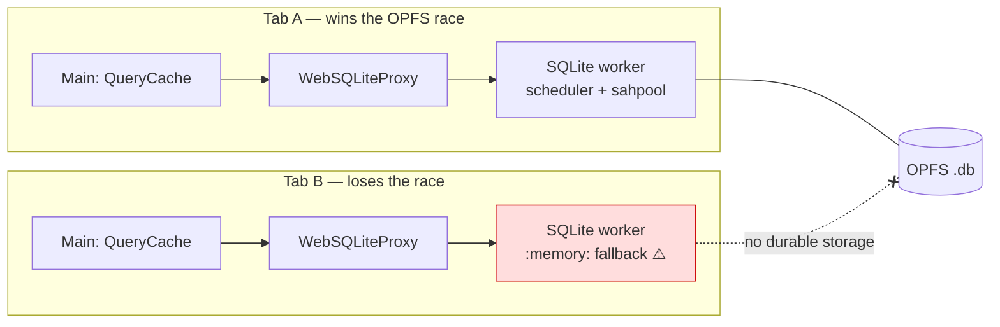
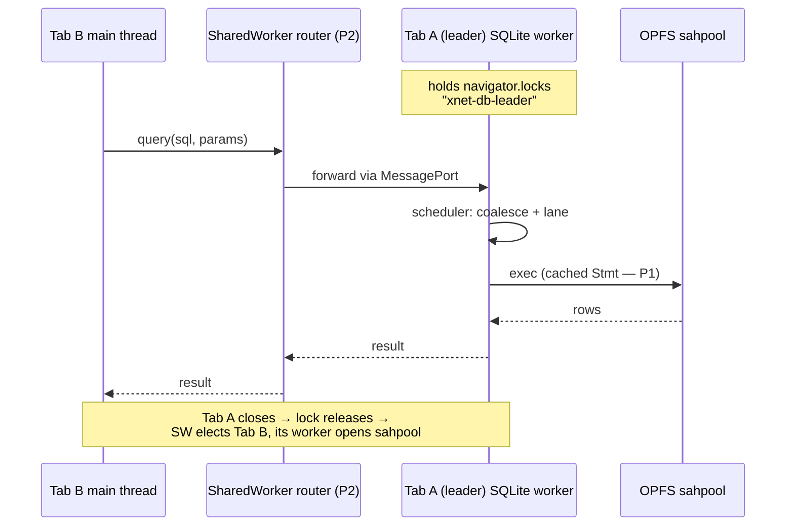

# Our SQLite Worker Queue Vs The Local-First Field: Notion, Linear, LiveStore, PowerSync And Friends

## Problem Statement

Our web app funnels all storage through one Comlink-wrapped SQLite worker with
a priority-lane scheduler ([0227](0227_[_]_BOOT_STALL_SQLITE_WORKER_HEAD_OF_LINE_BLOCKING.md),
[0228](0228_[_]_PARALLEL_SQLITE_READS_WORKER_POOL_AND_DISPATCHER.md),
[0262](0262_[_]_MAIN_THREAD_SQLITE_AND_THE_MULTIPLE_READER_QUESTION.md)). The
question:

> _Compare our SQLite worker queue / worker process implementation to other
> local-first SQLite implementations to see if we could improve in any way —
> open-source projects, and products like Linear and Notion that get fast
> performance out of their infrastructure._

This document puts our hot path side-by-side with the published mechanics of
Notion's WASM SQLite, Linear's sync engine, LiveStore, PowerSync, SQLocal, the
official sqlite-wasm Worker1 protocol, cr-sqlite/vlcn, and Replicache/Zero —
then ranks the deltas by what they'd actually buy us.

## Executive Summary

**Validation first: our topology is the industry-converged design.** A
per-tab dedicated worker + Comlink RPC + `opfs-sahpool` is _exactly_ what
Notion ships (they arrived there after real production corruption with the
multi-connection `opfs` VFS), and what wa-sqlite's maintainer recommends. Our
scheduler's **identical-read coalescing appears in no surveyed system** —
competitors dedupe _emissions_ (result diffs), not _executions_. We are not
behind on the core; we're missing what the fast systems build _around_ it.

Four findings, ranked by impact:

1. **Multi-tab is our worst-in-class gap.** Every serious system elects a
   leader via **Web Locks** and routes other tabs' queries to it (Notion:
   SharedWorker router → active tab's worker; LiveStore: Web-Locks leader
   worker; PowerSync: `navigator.locks` arbitration). We do none of this: a
   second xNet tab loses the OPFS handle race and **silently falls back to a
   non-durable `:memory:` database**
   ([`web.ts:221-310`](../../packages/sqlite/src/adapters/web.ts),
   [`opfs-retry.ts`](../../packages/sqlite/src/adapters/opfs-retry.ts)). No
   `navigator.locks`, no SharedWorker, no BroadcastChannel exists anywhere in
   the storage path today.

2. **Every system that feels instant serves hot reads from main-thread
   memory.** Linear doesn't even have a query layer — an in-memory MobX object
   pool is the truth, IndexedDB is just rehydration. Notion treats SQLite as a
   _second-level cache_ below an in-memory record cache. LiveStore runs a whole
   in-memory SQLite mirror on the main thread; Replicache a versioned B-tree
   (<1 ms reads). Our data-bridge `QueryCache` with delta application is the
   same bet — 0262's "deepen the read tier" recommendation is independently
   confirmed as _the_ pattern, not one option among many.

3. **Our per-op RPC leaves cheap throughput on the table.** The web adapter
   re-prepares every statement (`db.exec()` per call,
   [`web.ts:422-437`](../../packages/sqlite/src/adapters/web.ts)); the data
   layer's `stmtCache` is dead code on web. There is no batched _read_ RPC —
   `transaction(ops)` and `applyNodeBatch` batch writes only — and no
   main-thread dedup before the message is posted. SQLocal demonstrates the
   fix shape: a `BatchMessage` that reuses prepared statements across
   repeated SQL inside one round-trip.

4. **The invalidation frontier is moving from "re-run SQL" to incremental
   view maintenance.** cr-sqlite re-runs per table-change (self-described
   naive); PowerSync re-runs then row-diffs with reference preservation —
   which is precisely what our bridge already does with store-event deltas +
   `reuseEquivalentNodeReferences()`; Rocicorp's Zero maintains query results
   incrementally with no re-query at all. We're mid-pack and structurally
   fine; IVM is a watch-item, not a to-do.

**Recommended path:** (P1) statement-cache + batched-read RPC inside the
existing worker — small, pure win; (P2) **Web-Locks leader election + cross-tab
routing** to fix the `:memory:` second tab — the one place we're objectively
behind the field; (P3) continue the 0262 read-tier work, adopting PowerSync's
hardening details (lease rollback, dead-client cleanup) as part of P2. Adopt
Notion's two tail lessons opportunistically: never block first paint on WASM
init, and consider racing local-vs-hub on p95 devices.

## Current State In The Repository

Established in 0227/0228/0262; new fine detail found for this comparison:

- **Statement handling: re-prepare per call.** `query()`/`run()` use
  `db.exec({sql, bind, rowMode: 'object'})`
  ([`web.ts:422-456`](../../packages/sqlite/src/adapters/web.ts)) — full
  parse+bind+execute each time. The adapter's `prepare()` is _simulated_ (a
  closure re-issuing `query()`, [`web.ts:668-685`](../../packages/sqlite/src/adapters/web.ts));
  the data layer's `stmtCache`
  ([`sqlite-adapter.ts:372,452-459`](../../packages/data/src/store/sqlite-adapter.ts))
  is never hit on hot paths — dead code on web.
- **RPC surface** ([`web-worker.ts`](../../packages/sqlite/src/adapters/web-worker.ts)):
  `query`/`queryOne` (interactive lane, coalesced), `run`/`exec` (write lane),
  `transaction(ops[])` (one RPC, serial ops in one BEGIN/COMMIT),
  `applyNodeBatch` (the real write batch), plus lifecycle/diagnostics. **No
  batched read API**; a multi-panel screen pays one round-trip per query.
- **Result encoding:** structured clone of arrays-of-objects. The data-worker
  snapshot path already has a better idea — binary-encoded snapshots
  **transferred zero-copy** ([`data-worker-host.ts:274-280`](../../packages/data-bridge/src/worker/data-worker-host.ts)) —
  but that runtime is still flagged off by default
  (`localStorage['xnet:runtime']`, default `'main'`,
  [`data-runtime.ts`](../../apps/web/src/lib/data-runtime.ts)).
- **Coalescing scope:** worker-side only; the key
  (`op + sql + JSON.stringify(params)`) is cleared the microtask the promise
  settles ([`worker-scheduler.ts:144-167`](../../packages/sqlite/src/adapters/worker-scheduler.ts)),
  so only same-tick duplicates collapse. There is no main-thread dedup before
  posting.
- **Query patterns are healthy:** live queries compile to one SQL per
  descriptor with a batched ordinal-JOIN hydrate (225 nodes/RPC,
  [`sqlite-adapter.ts:2135-2175`](../../packages/data/src/store/sqlite-adapter.ts)).
  One N+1 exists: `getNode()` = 2 RPCs (node, then properties,
  [`sqlite-adapter.ts:733-741`](../../packages/data/src/store/sqlite-adapter.ts)).
- **Invalidation:** application-level store events → bridge delta application,
  with a >250-change full-reload cliff
  ([`main-thread-bridge.ts:333-345`](../../packages/data-bridge/src/main-thread-bridge.ts)).
  No `sqlite3_update_hook`, no `PRAGMA data_version`.
- **Multi-tab:** none. Tab B retries the SAH pool, then falls back
  `OpfsDb` → `:memory:` and runs non-durable until hub re-sync.



## External Research

Full citations in References; per-system mechanics:

### Notion — the same architecture, plus multi-tab routing

Per-tab dedicated worker with WASM SQLite on **`opfs-sahpool`** (chose it over
the `opfs` VFS because COOP/COEP is "an unrealistic ask" with third-party
iframes), **Comlink** RPC — identical to us. On top: a SharedWorker acts as a
pure **router**; each tab holds an infinitely-open **Web Lock**, its release
tells the SharedWorker the tab died and a new "active tab" worker is elected.
All tabs' queries funnel to the single active worker. They adopted this after
production **corruption** from multi-connection OPFS writes ("multiple rows
with the same ID but different content"). SQLite is a persistent cache _below_
an in-memory record cache — not the hot read path. Two tail lessons with
numbers: loading WASM synchronously _regressed_ initial load (fix: fully
async, never block first paint), and slow-disk p95 devices got _slower_ than
the network (fix: **race SQLite vs the API**, take the first). Net win: 20 %
faster navigation (28–33 % in AU/CN/IN).

### Linear — no SQLite; the read path is an object graph

All hot data is an in-memory **object pool** (`modelLookup`) of
MobX-observable models; property reads are synchronous getters. IndexedDB is
purely a rehydration cache. Boot picks **full / partial / local bootstrap**;
lazy collections hydrate from IDB first with "partial index" markers recording
which subsets were already fetched. Writes mutate memory immediately, then a
durable `_transaction` IDB queue batches GraphQL mutations; a globally
monotonic `lastSyncId` reconciles delta packets. Lesson for us: _the fastest
query layer is no query layer_ — memory is truth, storage is hydration; and a
single monotonic version makes cache reconciliation trivial (our lamport/HWM
plays this role).

### LiveStore — in-memory SQLite mirror on the main thread

Reads are synchronous main-thread SQL against an in-memory mirror; a
Web-Locks-elected **leader worker** owns persistence (OPFS) and sync; a
SharedWorker proxies tabs to the leader. Boot fast-path loads the persisted
snapshot straight into the main-thread DB. Android Chrome (no SharedWorker)
degrades to single-tab mode. Explicit design note: assumes data fits in
memory; extra memory per tab.

### PowerSync — the hardened lease-based queue

The most explicit published lock design: `readLock(fn)`/`writeLock(fn)` wrap a
**lease token** (`requestAccess(write, timeoutMs)` → UUID; every
`execute(token, sql, params)` carries it). Arbitration is an in-process mutex
for one worker, or **`navigator.locks.request('db-lock-<file>')`** when
per-tab workers share one OPFS file. Hardening we should steal when multi-tab
lands: on lease acquisition, if the connection is mid-transaction from a dead
client → **auto `ROLLBACK`**; each client registers a Web Lock whose release
triggers server-side lease reclamation; on remote close, **abort all
outstanding promises** to avoid livelocks. Invalidation: their core extension
batches **`sqlite3_update_hook`** output per write-lease and fans the changed
table list out via MessagePorts + BroadcastChannel. Watched queries come in
three tiers — re-run on table change, re-run + equality gate, and full
row-diff with **reference preservation for unchanged rows** (the published
analogue of our `reuseEquivalentNodeReferences`).

### SQLocal / official Worker1 — RPC design floor and batch pattern

SQLocal: hand-rolled promise-correlated per-call messages (Comlink-equivalent)
plus a **`BatchMessage`** — an array of statements executed in one transaction
in one round-trip, "using prepared statements automatically, which speeds it
up when the batch repeats the same statement with different bind parameters."
Transferable `ArrayBuffer`/`ReadableStream` for import/export; BroadcastChannel
for cross-tab effects. The official sqlite-wasm **Worker1** protocol is the
floor: stateless per-message exec, no cross-message prepared statements,
transactions only within one message — our RPC is already richer than Worker1.

### cr-sqlite / Replicache / Zero — the invalidation spectrum

cr-sqlite: `tables_used` + `sqlite3_update_hook` → re-run every dependent
query on any table change; self-described naive; documented hook footguns
(fires pre-commit, misses `WITHOUT ROWID`, one hook per connection). Roadmap:
differential dataflow. Replicache: in-memory versioned B-tree, subscriptions
re-run only when the write set overlaps the query's recorded **read set**,
emissions only on actual result change (<1 ms reads, >500 MB/s scans). Zero
(ZQL): true **IVM** — queries are standing pipelines updated by row-level
deltas, "no re-query"; queries have TTL because each standing query costs
memory. Spectrum: table-level < read-set < row-diff < IVM. Our store-event
delta application sits at row-diff — respectable; IVM is the frontier to
track, not adopt now.

## Key Findings

1. **Core validated.** Per-tab dedicated worker + Comlink + `opfs-sahpool` is
   Notion's production-proven choice for the same reasons (Safari support, no
   COOP/COEP, corruption avoidance). Nothing in the survey argues for changing
   the engine, VFS, or RPC library.
2. **Our read-coalescing is a genuine differentiator** — no surveyed system
   dedupes executions. Keep it; consider extending the window slightly (it
   clears on settlement, so only same-tick duplicates collapse).
3. **Multi-tab is the objective gap.** The field-standard pattern (Web Locks
   leader + router; wa-sqlite discussion #81 = Notion = LiveStore) exists
   precisely to prevent what we do today: silent non-durable second tabs.
   PowerSync additionally shows the crash-safety details (lease rollback,
   dead-client reclamation, abort-on-remote-close).
4. **Per-op efficiency gaps are real but secondary:** no prepared-statement
   reuse (oo1 `db.exec` re-parses; `sqlite3.oo1.Stmt` via `db.prepare()` is
   available and unused), no batched-read RPC, no main-thread dedup,
   `getNode()` N+1. SQLocal's batch+prepared pattern is the template.
5. **The main-thread read tier is unanimously confirmed** (Linear objects,
   Notion record cache, LiveStore mirror, Replicache B-tree). 0262's Phase C
   is the strategic direction; this survey adds granularity options
   (read-set tracking à la Replicache) and a proven upgrade path (row-diff
   with reference preservation — which we already do).
6. **Tail behavior matters as much as medians** (Notion): async-init so WASM
   never blocks paint (we already open async post-boot — verify), and racing
   local-vs-network on slow-disk devices is a pattern worth a probe given our
   hub can also serve first results.

## Options And Tradeoffs

### A. Statement cache + batched reads inside the current worker _(P1 — small, pure win)_

Switch the web adapter's hot path from `db.exec()` to cached
`sqlite3.oo1.Stmt` handles keyed by SQL (bounded LRU, finalized on close), and
add a `queryBatch(statements[])` RPC executing N reads in one round-trip
(optionally one snapshot transaction), reusing prepared statements across
repeated SQL. Fix `getNode()`'s 2-RPC N+1 with a single joined query.

- ✅ Cuts parse/bind overhead on every hot query; amortizes RPC latency on
  multi-query screens (dashboard, prewarm); zero architecture change.
- ✅ SQLocal proves the pattern; Worker1's limitations don't apply to us.
- ⚠️ Stmt lifecycle discipline (finalize on schema change/close); cache
  invalidation on `resetStorage`.

### B. Web-Locks leader election + cross-tab routing _(P2 — the field-standard fix)_

Adopt the Notion/wa-sqlite-#81 pattern: each tab holds a Web Lock; a tiny
SharedWorker (or BroadcastChannel + `navigator.locks` where SharedWorker is
missing — Android Chrome) routes every tab's storage RPCs to the current
leader tab's SQLite worker; leadership migrates on lock release. Harden with
PowerSync's details: auto-`ROLLBACK` when acquiring a connection left
mid-transaction, reclaim on client-death via lock release, abort outstanding
promises on leader loss.

- ✅ Fixes the silent `:memory:` second tab — durability + shared cache for
  all tabs; removes the reload `NoModificationAllowedError` race as a bonus
  (new leader waits for the lock, not a retry loop).
- ✅ All tabs share one warm page cache and one scheduler (coalescing now
  works across tabs).
- ⚠️ Medium effort: routing layer, leadership handoff (drain scheduler →
  release SAH pool → new leader opens), Android-Chrome fallback path.
- ⚠️ Leader tab pays CPU for other tabs' queries (Notion accepts this).

### C. Keep deepening the main-thread read tier _(P3 — continues 0262)_

Unchanged from 0262 Phase C, now with survey-informed upgrades: track
query **read sets** (schema + descriptor scope) to skip irrelevant deltas
(Replicache), keep row-diff + reference preservation (we and PowerSync agree),
and treat a LiveStore-style full in-memory mirror as the measured escalation.

### D. Update-hook-based invalidation _(defer)_

PowerSync's update-hook batching is elegant, but our invalidation source is
the NodeStore event stream, which already carries schema/property semantics
the hook lacks — and cr-sqlite documents the footguns (pre-commit firing,
`WITHOUT ROWID`). Only worth revisiting if a second writer (outside NodeStore)
ever appears.

### E. IVM / differential dataflow _(watch)_

Zero's ZQL and cr-sqlite's roadmap point where live queries are going. Our
descriptor-scoped delta application is a coarse IVM already; jumping to true
IVM is a research-scale project with no current pain to justify it. Revisit
when live-query volume or write rates make re-hydration measurable.

### F. Notion tail tactics _(opportunistic)_

Verify WASM init never blocks first paint (boot-timeline should show
`sqlite:open` off the critical path for first render); prototype racing
hub-vs-local for first landing query on cold boots where local is cold anyway.

| Option                        | Wins                                | Effort | Risk           | When          |
| ----------------------------- | ----------------------------------- | ------ | -------------- | ------------- |
| A. Stmt cache + batch reads   | per-op latency, screen fan-out      | S      | low            | now           |
| B. Web-Locks leader + routing | multi-tab durability + shared cache | M      | med            | next          |
| C. Read-tier deepening (0262) | hot-read latency → ~0               | M      | low            | ongoing       |
| D. Update hooks               | invalidation decoupling             | M      | med (footguns) | defer         |
| E. IVM                        | no re-query at all                  | XL     | high           | watch         |
| F. Tail tactics               | p95 devices                         | S      | low            | opportunistic |

## Recommendation

Keep the engine, VFS, worker topology, and scheduler — the survey validates
all four. Improve in this order:

1. **P1 (A + F-verify):** prepared-statement cache in
   [`web.ts`](../../packages/sqlite/src/adapters/web.ts), `queryBatch` RPC,
   `getNode()` join, and confirm WASM init is fully off the first-paint
   critical path. These compound with the existing lanes + coalescing.
2. **P2 (B):** Web-Locks leader election with cross-tab routing and
   PowerSync-grade crash safety. This is the only place the field is
   categorically ahead of us, and it converts the multi-tab story from
   "silent data-loss mode" to "shared warm cache."
3. **P3 (C):** continue 0262's read-tier plan with read-set-scoped delta
   routing. Skip D, watch E.



## Example Code

**P1 — statement cache in the web adapter** (sketch; replaces `db.exec` on the
hot path):

```ts
private stmtCache = new Map<string, Stmt>()          // bounded LRU in practice

private getStmt(sql: string): Stmt {
  let stmt = this.stmtCache.get(sql)
  if (!stmt) {
    stmt = this.db.prepare(sql)                       // sqlite3.oo1.Stmt
    this.stmtCache.set(sql, stmt)
  }
  return stmt
}

async query<T extends SQLRow>(sql: string, params?: SQLValue[]): Promise<T[]> {
  const stmt = this.getStmt(sql)
  try {
    if (params?.length) stmt.bind(params)
    const rows: T[] = []
    while (stmt.step()) rows.push(stmt.get({}) as T)  // object row mode
    return rows
  } finally {
    stmt.reset()                                      // NOT finalize — reuse
    stmt.clearBindings()
  }
}
// finalize all cached stmts on close()/resetStorage()/schema change.
```

**P1 — batched read RPC** (one round-trip, prepared reuse across repeats):

```ts
// SQLiteWorkerHandler
async queryBatch(reads: { sql: string; params?: SQLValue[] }[]): Promise<SQLRow[][]> {
  return this.scheduler.schedule('interactive', () =>
    Promise.resolve(reads.map((r) => this.adapter!.querySync(r.sql, r.params)))
  , undefined, 'queryBatch', `${reads.length} stmts`)
}
```

**P2 — leadership skeleton** (Notion/wa-sqlite-#81 pattern):

```ts
navigator.locks.request('xnet-db-leader', { mode: 'exclusive' }, async () => {
  await openSahPoolWorker() // we are the leader now
  announceLeadership(broadcast) // router directs tabs to our port
  await new Promise(() => {}) // hold until tab dies → lock releases
})
// Followers: route RPCs via the router; on leader change, abort in-flight
// promises (PowerSync) and re-issue against the new leader.
```

## Risks And Open Questions

- **Stmt cache lifecycle:** cached `Stmt` handles must be finalized before
  schema migration, `resetStorage()`, and close — leaks hold SAH-pool file
  locks. Bound the cache (e.g. 64 statements, LRU).
- **Leadership handoff atomicity (P2):** the old leader must drain its
  scheduler and release SAH handles before the new leader opens; the existing
  `opfs-retry` backoff becomes the safety net, not the mechanism.
- **SharedWorker coverage:** absent on Chrome for Android — need the
  BroadcastChannel + `navigator.locks` fallback (LiveStore degrades to
  single-tab mode there; acceptable v1).
- **Leader-tab cost:** background tabs' queries execute on the leader's
  worker; Chrome may throttle hidden tabs' workers — verify timers/locks keep
  the leader responsive (PowerSync holds a Web Lock partly to opt out of tab
  freezing).
- **Batch RPC vs coalescing interaction:** a batch bypasses per-query
  coalesce keys; decide whether batch members should consult the coalesce map
  individually (probably yes, cheap).
- **Racing hub-vs-local (F):** needs care with auth and consistency — only
  safe for first-paint reads that the delta stream will reconcile anyway.

## Implementation Checklist

**P1 — worker-internal efficiency (now)**

- [x] Replace `db.exec()` with a bounded prepared-`Stmt` cache in
      `WebSQLiteAdapter.query/queryOne/run`; finalize on close/reset/migration.
- [x] Add `queryBatch(reads[])` to `SQLiteWorkerHandler`, proxy, and
      `PortSQLiteAdapter`; route multi-query screens (dashboard fan-out,
      `WorkingSetPrewarm`) through it.
- [x] Collapse `getNode()` into one joined query (kill the 2-RPC N+1).
- [x] Micro-benchmark: p50/p95 per-query worker time and per-screen total RPC
      count, before/after (extend the `SchedulerOpReport` pipeline).
- [x] Verify via boot-timeline that WASM import/init never blocks first paint.

**P2 — multi-tab leadership (next)**

- [x] Leader election on `navigator.locks` (`xnet-db-leader`); leader owns the
      sahpool worker; followers route via SharedWorker (or
      BroadcastChannel+locks fallback on Android Chrome).
- [x] Cross-tab RPC routing with MessagePort transfer; abort outstanding
      promises on leader loss; re-issue idempotent reads automatically.
- [x] PowerSync-grade hardening: auto-`ROLLBACK` on acquiring a
      mid-transaction connection; reclaim leases on tab death via lock
      release.
- [x] Leadership handoff: drain scheduler → close adapter → release handles →
      new leader opens (replaces the blind retry loop as the primary path).
- [x] Telemetry: count sessions that previously fell back to `:memory:`
      (multi-tab) to size the win.

**P3 — read tier (ongoing, tracked in 0262)**

- [ ] Read-set-scoped delta routing in the bridge (skip deltas for schemas a
      cached query can't observe).
- [ ] Carry over 0262 Phase C items (capacity, partial reload, prewarm
      hydration, hit-rate telemetry).

## Validation Checklist

- [ ] P1: warm per-query worker exec time drops measurably for repeated SQL
      (statement reuse); no leaked Stmt handles across reset/migration tests.
- [ ] P1: dashboard-class screen issues ≥ 50 % fewer worker round-trips via
      `queryBatch` with identical results.
- [ ] P2: two tabs both read/write durably; killing the leader tab migrates
      leadership < 1 s with zero lost writes and all follower promises
      settled (no livelock).
- [ ] P2: reload no longer trips `NoModificationAllowedError` retries (lock
      hand-off replaces backoff in the common case).
- [ ] P2: `:memory:`-fallback session count → ~0 in telemetry.
- [ ] Cross-browser: Safari (no `readwrite-unsafe`, SharedWorker ok) and
      Android Chrome (no SharedWorker) both pass the multi-tab suite in their
      degraded modes.
- [ ] Scheduler invariants hold: lanes + coalescing unchanged under batch RPC
      and cross-tab routing (existing `worker-scheduler.test.ts` extended).

## References

**Repository**

- Hot path: [`packages/sqlite/src/adapters/web.ts`](../../packages/sqlite/src/adapters/web.ts) ·
  [`web-worker.ts`](../../packages/sqlite/src/adapters/web-worker.ts) ·
  [`web-proxy.ts`](../../packages/sqlite/src/adapters/web-proxy.ts) ·
  [`worker-scheduler.ts`](../../packages/sqlite/src/adapters/worker-scheduler.ts) ·
  [`opfs-retry.ts`](../../packages/sqlite/src/adapters/opfs-retry.ts)
- Data layer: [`packages/data/src/store/sqlite-adapter.ts`](../../packages/data/src/store/sqlite-adapter.ts)
  (batched hydrate 2135–2175; `getNode` N+1 733–741; dead `stmtCache` 452–459)
- Bridge/read tier: [`packages/data-bridge/src/main-thread-bridge.ts`](../../packages/data-bridge/src/main-thread-bridge.ts) ·
  [`query-cache.ts`](../../packages/data-bridge/src/query-cache.ts) ·
  [`data-worker-host.ts`](../../packages/data-bridge/src/worker/data-worker-host.ts)
  (binary transferable snapshots) ·
  [`apps/web/src/lib/data-runtime.ts`](../../apps/web/src/lib/data-runtime.ts)
  (worker runtime flag, default `'main'`)
- Prior explorations: `0227` · `0228` · `0229` · `0230` · `0262`

**External**

- Notion — [How we sped up Notion in the browser with WASM SQLite](https://www.notion.com/blog/how-we-sped-up-notion-in-the-browser-with-wasm-sqlite) ·
  [HN thread with Notion engineers](https://news.ycombinator.com/item?id=40949489)
  (SharedWorker-can't-OPFS; SQLite-below-record-cache; race-vs-API)
- Linear — [reverse-linear-sync-engine (CTO-endorsed)](https://github.com/wzhudev/reverse-linear-sync-engine) ·
  [Reverse engineering Linear's sync magic](https://marknotfound.com/posts/reverse-engineering-linears-sync-magic/) ·
  [Scaling the Linear Sync Engine](https://linear.app/now/scaling-the-linear-sync-engine)
- LiveStore — [how-livestore-works](https://github.com/livestorejs/livestore/blob/main/docs/src/content/docs/overview/how-livestore-works.mdx) ·
  [design decisions](https://github.com/livestorejs/livestore/blob/main/docs/src/content/docs/understanding-livestore/design-decisions.md) ·
  [web adapter](https://github.com/livestorejs/livestore/blob/main/docs/src/content/docs/platform-adapters/web-adapter.mdx)
- PowerSync — [powersync-js source: DatabaseClient/DatabaseServer/ConcurrentConnection](https://github.com/powersync-ja/powersync-js) ·
  [SQLite persistence on the web](https://powersync.com/blog/sqlite-persistence-on-the-web) ·
  [watched queries docs](https://docs.powersync.com/usage/use-case-examples/watch-queries)
- SQLocal — [repo](https://github.com/DallasHoff/sqlocal) ·
  [docs](https://sqlocal.dev/guide/introduction) (BatchMessage + auto prepared
  statements) · sqlite-wasm — [Worker1 API](https://sqlite.org/wasm/doc/trunk/api-worker1.md)
- wa-sqlite — [discussion #81: multi-tab Web Locks pattern](https://github.com/rhashimoto/wa-sqlite/discussions/81)
- cr-sqlite/vlcn — [The March to Reactivity](https://vlcn.io/blog/the-march-to-reactivity) ·
  [reactivity docs](https://www.vlcn.io/docs/cr-sqlite/js/reactivity) ·
  [update_hook footguns #309](https://github.com/vlcn-io/cr-sqlite/discussions/309)
- Replicache/Zero — [How Replicache works](https://doc.replicache.dev/concepts/how-it-works) ·
  [Replicache internals](https://tushar.ai/posts/replicache-internals/) ·
  [rocicorp/mono (zql IVM)](https://github.com/rocicorp/mono) ·
  [Zero: reading data](https://zero.rocicorp.dev/docs/reading-data)
- Figma — [WebAssembly cut load time 3x](https://www.figma.com/blog/webassembly-cut-figmas-load-time-by-3x/) ·
  [Incremental frame loading](https://www.figma.com/blog/incremental-frame-loading/)
