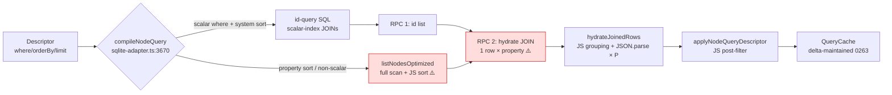
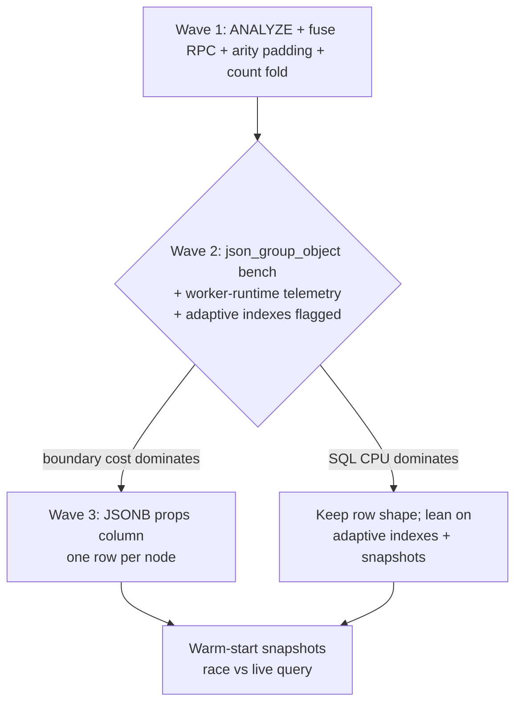

# Query-Model Read Speed: The Remaining Levers

## Problem Statement

Explorations [0262](0262_[_]_MAIN_THREAD_SQLITE_AND_THE_MULTIPLE_READER_QUESTION.md)
and [0263](0263_[x]_SQLITE_WORKER_QUEUE_VS_THE_LOCAL_FIRST_FIELD.md) settled
thread placement and shipped the worker-queue upgrades (statement cache,
`queryBatch`, multi-tab leadership, read-set-scoped stale-while-revalidate
cache). The question now:

> _Can anything else be done to make the query model faster — faster reads?_

This document dissects what remains inside the query model itself —
descriptor → SQL compile → hydrate → post-filter → cache — and ranks the
leftover levers by measured shape rather than vibes.

## Executive Summary

**Yes — and the biggest lever is structural, not incremental.** The query
model's dominant remaining cost is the EAV hydrate: reading N nodes produces
**one row per (node × property)** — 100 nodes × ~8 properties ≈ 900 rows
JOINed, shipped across the WASM boundary, and regrouped in JS on every cold
read ([`sqlite-adapter.ts:2073-2099`](../../packages/data/src/store/sqlite-adapter.ts)).
Every downstream cost (structured clone volume, `hydrateJoinedRows` grouping,
per-property `TextDecoder`+`JSON.parse`) scales with that multiplication.

Six levers remain, ranked:

1. **Kill the row multiplication (structural, biggest win).** Add a
   **document column** — `nodes.props` as SQLite **JSONB** (3.45+; our WASM
   build is 3.51) — maintained at write time alongside the existing tables.
   Hydration collapses to **one row per node**; Hipp's published numbers put
   JSONB "several times faster" than text JSON for JSON-intensive work. The
   EAV→JSONB migration literature (Postgres, but the shape transfers)
   converged on exactly this **hybrid**: document column for hydration,
   typed scalar-index table for predicates — EAV B-trees stay up to 15×
   faster for `key = value` searches (Evolveum), so
   `node_property_scalars` keeps its job. Interim step with no migration:
   `json_group_object(property_key, json(value))` collapses rows in SQL —
   fewer rows over the boundary, though SQLite still walks every EAV row.

2. **Fuse the 2-RPC cold query.** `queryNodes` runs an id-select RPC, then a
   hydrate RPC ([`sqlite-adapter.ts:943-992`](../../packages/data/src/store/sqlite-adapter.ts)).
   The candidate query can become a CTE feeding the hydrate join — one
   round-trip, one scheduler slot. Trivial once hydration is one-row-per-node.

3. **Make compiled SQL statement-cache friendly.** The 0263 statement cache
   is defeated by SQL-shape variability: each `where` arity mints new
   aliases (`p0`,`p1`,…), each hydrate chunk size mints a new `VALUES`
   arity, each IN-list chunk a new placeholder count — every distinct arity
   is a fresh prepare. Pad arities to a small set of fixed sizes.

4. **Turn on the planner's brain.** `PRAGMA optimize=0x10002` at open +
   `analysis_limit=400` + periodic `PRAGMA optimize` (we only optimize on
   _close_ today). Without `sqlite_stat1`, skip-scan never fires and the
   planner guesses badly on skewed EAV key distributions. Related: the
   **adaptive-index machinery is fully built and disabled**
   (`enabled: false`) — custom-property sorts currently fall back to a full
   schema scan + JS sort (`postFilterReason: 'unsupported-descriptor'`).

5. **Warm-start snapshots.** Persist the boot-critical queries' results
   keyed by (descriptor hash, schema version, lamport HWM +
   `PRAGMA data_version`), render immediately, revalidate — and **race
   snapshot vs live query** Notion-style rather than cache-first (their
   race pattern was worth 20-33% navigation latency). Attacks cold-open p95
   directly, which explorations 0249→0260 showed is where the pain lives.

6. **Finish what's staged:** flip the worker data runtime (blocked only on
   input-latency telemetry, not architecture), and deepen invalidation from
   schema-level (0263) to (schema, property-key)-level read sets.
   Differential dataflow in JS (Materialite, d2ts) stays a watch item —
   both are alpha/dormant.

## Current State In The Repository

The pipeline and its measured shape (all file:line references verified):



- **Pushdown matrix** ([`sqlite-adapter.ts:3675-3801`](../../packages/data/src/store/sqlite-adapter.ts)):
  scalar `where` equality, FTS, R-tree, and `createdAt`/`updatedAt` sorts
  compile to SQL; **any custom-property sort returns `null`** from the
  compiler and takes `listNodesOptimized()` + JS sort over the whole schema.
- **The hydrate JOIN** returns node columns repeated per property row;
  chunked at 450 ids (900 binds). `node_properties.value` is a BLOB —
  each property pays `TextDecoder` + `JSON.parse` in
  [`hydrateJoinedRows`](../../packages/data/src/store/sqlite-adapter.ts)
  (2033-2071). **No JSON aggregation is used anywhere.**
- **Statement-shape variability:** `where` arity → `p${i}` alias joins
  (3738-3751); hydrate `VALUES` arity per chunk size (2074-2078); IN-list
  chunks in `getLastChangesByNodeId`/`getExistingNodeIds` (670-741). Each
  distinct shape misses the 0263 statement cache once.
- **Adaptive indexes** ([`sqlite-adapter.ts:101-127, 3259-3357`](../../packages/data/src/store/sqlite-adapter.ts)):
  telemetry → `query_descriptor_stats` → threshold-gated
  `CREATE INDEX … WHERE schema_id=? AND property_key=?` partial covering
  indexes. **Disabled by default; prod never creates one.** Base indexes
  ([`schema.ts:216-272`](../../packages/sqlite/src/schema.ts)) already
  include partial covering triplets `(schema_id, property_key, value_*,
node_id) WHERE value_type=…` — good shape, planner just lacks stats.
- **Materialized views (0226)** store id+ordinal only and **re-hydrate on
  every read** (2373) — the cache saves compilation/filtering, not hydrate.
  No hot surface opts in today.
- **Counts:** bridge default `'none'`; `'exact'` costs a separate COUNT RPC
  (3650-3668).
- **Verification/telemetry:** parity audit and adaptive telemetry writes
  are off in prod. ✓
- **Worker data runtime:** built, binary transferable snapshots included;
  default `'main'` pending only "real-browser input-latency telemetry"
  ([`data-runtime.ts:6-9`](../../apps/web/src/lib/data-runtime.ts)).
- **`PRAGMA optimize`** runs only on close
  ([`web.ts` close()](../../packages/sqlite/src/adapters/web.ts)); no
  `analysis_limit`, no open-time or periodic optimize; WASM builds lack
  stat4 (stat1 suffices).

## External Research

Full citations in References.

1. **SQLite JSONB (3.45+).** Stores the internal parse tree as a BLOB;
   Hipp: "a 3-times performance improvement, at least for the
   JSON-intensive operations," 5-10% smaller than text JSON. Caveats:
   operations are still O(N) within a document (fine at node scale — our
   documents are one node's properties), and **JSONB blobs are
   SQLite-internal — convert with `json()` at the final SELECT** before
   shipping over RPC.
2. **EAV vs JSON-document benchmarks.** coussej's Postgres EAV→JSONB
   migration: 3× smaller storage, joins-per-predicate eliminated. Evolveum's
   midPoint study: JSON ~2× faster for mixed reads but **EAV up to 15×
   faster for `attribute = value` predicate scans** → keep the scalar-index
   table; use the document only for hydration. Dynamic property keys rule
   out per-key generated columns (only VIRTUAL can be ALTERed in, and keys
   are open-ended) — the scalar table is already the right general index.
3. **`json_group_object`** collapses EAV rows to one JSON object per entity
   in SQL. No rigorous public benchmark of SQL-side vs app-side grouping;
   the documented win is wire size and per-row overhead, not CPU. Gotcha:
   wrap already-JSON values in `json()` or they double-encode.
4. **Covering/partial index canon:** equality columns before range/sort;
   one composite beats several singles; partial-index WHERE must match the
   query's WHERE almost textually; **skip-scan requires ANALYZE** (≥~18
   dupes per distinct leading value). `PRAGMA optimize=0x10002` at open +
   `analysis_limit` 100-1000 + periodic optimize is the official long-lived
   connection recipe.
5. **Invalidation ladder** (between naive re-query and full IVM):
   Replicache-style read-set intersection is production-proven;
   `sqlite3_set_authorizer` or `tables_used()` (bytecode vtab, custom build)
   can derive dependencies automatically; cr-sqlite's "index the queries,
   not the data" stayed exploratory; **Materialite is dormant and d2ts is
   alpha** — JS differential dataflow is not a foundation yet.
6. **Warm-start snapshot patterns:** Notion races cache vs network (cache-
   first _lost_ on slow disks — 20-33% navigation win from racing);
   LiveStore treats its materialized state DB as a disposable snapshot
   (schema change → drop and rematerialize from the eventlog — exactly our
   change-log architecture); Lumafield's versioned OPFS cache got 3× project
   loads at only ~30% hit rate. Validation stamp: `PRAGMA data_version`
   (cross-connection, header-check cheap) + own-connection
   `sqlite3_total_changes` + our lamport HWM.
7. **Row shipping:** postMessage ≤10 KiB is effectively free; ~100 KiB+
   threatens frame budgets on low-end devices; ArrayBuffer transfer is
   constant-time. Modern Chrome removed the old stringify-beats-clone cliff.
   Binary formats only pay once results are routinely hundreds of KB —
   viewport-sized results should stay structured clone.
8. **Counts:** COUNT(\*) always scans a b-tree; stat1 estimates are
   whole-table; trigger/transaction-maintained counter tables are the
   exact-and-fast answer; the field UX answer is `LIMIT N+1` → "N+".

## Key Findings

1. **Row multiplication is the tax everything else pays.** ~9× row
   amplification on a typical hydrate inflates SQL row visits, boundary
   clone volume, and JS parse/grouping — and it is why materialized views
   disappoint (they cache ids but re-pay hydrate). One-row-per-node
   hydration (JSONB document) or SQL-side aggregation attacks the root.
2. **The hybrid is the destination, not a compromise:** document column for
   hydration + scalar table for predicates is where the EAV migration
   literature landed, and it matches our write path (`applyNodeBatch`
   already maintains `node_properties` + `node_property_scalars` + FTS in
   one transaction — adding a JSONB upsert is one more statement, not a new
   pipeline).
3. **Two RPCs where one would do** on every cold query, and **statement-
   cache misses by construction** from arity-variable SQL — both cheap,
   mechanical fixes that compound with 0263's cache and batch RPC.
4. **The planner is flying blind and its co-pilot is switched off.** No
   ANALYZE stats in a long-lived worker (skip-scan can't fire) and the
   fully-built adaptive-index creator is `enabled: false` — meaning every
   custom-property-sorted list is a full scan + JS sort today. This is the
   single worst asymptotic behavior left (grows with schema row count).
5. **Cold-open p95 needs a cache that survives reload.** All 0263 caches
   die with the page. Persisted result snapshots (stale-then-revalidate +
   race) are the proven pattern, and our lamport HWM + `data_version` give
   an honest two-integer validity stamp.
6. **Don't build IVM.** The descriptor-scoped delta cache (0263) already
   sits at the "row-diff" tier; the next tier that's production-proven is
   finer read-sets, not differential dataflow.

## Options And Tradeoffs

### A. JSONB document column (`nodes.props`) — _the structural fix_

Maintain `props` (JSONB) in `applyNodeBatch` alongside existing tables;
hydrate becomes `SELECT id, schema_id, …, json(props) FROM nodes WHERE id IN
(…)` — one row per node, one `JSON.parse` per node.

- ✅ Removes ~P× row amplification at the source; shrinks clone volume;
  makes fused single-RPC queries and cheap materialized-view reads natural.
- ✅ `node_properties` stays authoritative (LWW timestamps per property live
  there); `props` is derived and rebuildable — same disposable-cache
  contract as the scalar index and FTS.
- ⚠️ Migration: dual-write + idle backfill (bootSettled) + read-path flag;
  storage grows ~1× property payload (offset by JSONB compactness).
- ⚠️ Timestamps (`lamport`, `updatedBy` per property) are also read by
  hydrate today — include them in the document (`{v, t}` per key) or accept
  a second cheap lookup for the rare consumers.

### B. `json_group_object` aggregation — _the no-migration half-step_

Same read shape (one row per node) without a new column: collapse in SQL.

- ✅ Pure read-path change; no migration; testable in a day.
- ⚠️ SQLite still walks every EAV row and builds strings; win is boundary
  rows, not SQL CPU. Values must be wrapped `json(value)` (double-encode
  trap). A stepping stone — measure, then decide if A is warranted.

### C. Fuse id-query + hydrate into one statement

Candidate select becomes a CTE feeding the hydrate join → one RPC.

- ✅ Halves cold-query round-trips; combines with A or B cleanly.
- ⚠️ Post-filter descriptors (JS-verified FTS/spatial) still need the id
  detour — keep the two-step for those paths.

### D. Statement-shape normalization

Pad hydrate `VALUES` and IN-lists to fixed arities {1, 10, 50, 450} with
NULLs; give where-JOIN aliases stable generation per arity bucket.

- ✅ Turns 0263's statement cache from "misses by construction" to hits.
- ⚠️ NULL-padding needs `wanted.id IS NOT NULL` guards; small and testable.

### E. ANALYZE hygiene + enable adaptive indexes

`analysis_limit=400`, `optimize=0x10002` at open, periodic `optimize` on the
bootSettled cadence; then flip `adaptiveIndexes.enabled` (behind a flag →
default) and extend the compiler to push custom-property sorts down when a
matching scalar/adaptive index exists.

- ✅ Fixes the worst asymptote (full scan + JS sort per custom-sorted list);
  machinery already written and tested.
- ⚠️ Index writes on the serial worker — creation must ride bootSettled
  idle (0260 lesson: no background work is free on one serial worker).

### F. Persisted warm-start snapshots

Serialize the prewarm/boot descriptors' results (post-auth) keyed by
(descriptor hash, schema version, auth fingerprint, lamport HWM,
`data_version`); on boot render the snapshot immediately and **race** the
live query; write-back on idle.

- ✅ Attacks cold-open p95 — the recurring complaint of 0249→0260 — without
  touching the durable store; snapshot is disposable by construction.
- ⚠️ Auth changes must invalidate (reuse 0226's auth-fingerprint pattern);
  storage budget per snapshot; must race, not cache-first (Notion's lesson).

### G. Flip the worker data runtime / H. finer read-sets / I. counts

G: gather the pending input-latency telemetry and flip `'main'`→`'worker'`
(binary transferable snapshots already built). H: extend 0263's schema-level
read-set scoping to (schema, property-key). I: fold `'exact'` counts into
the candidate query via `COUNT(*) OVER ()`; counter tables only if a surface
ever needs live totals.

| Option                        | Attacks                  | Effort        | Risk         | Order           |
| ----------------------------- | ------------------------ | ------------- | ------------ | --------------- |
| E. ANALYZE + adaptive indexes | worst asymptote (scans)  | S-M           | low (staged) | 1               |
| C. Fused single-RPC query     | per-query latency        | S             | low          | 1               |
| D. Statement-shape padding    | stmt-cache hit rate      | S             | low          | 1               |
| B. json_group_object          | boundary volume          | S             | low          | 2 (measure)     |
| A. JSONB document column      | row amplification (root) | M-L           | migration    | 3 (if B proves) |
| F. Warm-start snapshots       | cold-open p95            | M             | med          | 3               |
| G. Worker runtime flip        | main-thread contention   | S (telemetry) | low          | 2               |
| H. Finer read-sets            | re-query storms          | M             | med          | 4               |
| I. Count folding              | exact-count RPC          | S             | low          | opportunistic   |

## Recommendation

Three waves, each independently shippable:

1. **Wave 1 — mechanical (S each, compounds with 0263):** ANALYZE hygiene +
   fused single-RPC compiled queries + statement-shape padding + `COUNT(*)
OVER ()` folding. No behavior change, pure latency.
2. **Wave 2 — measure the boundary:** implement `json_group_object`
   hydration behind a flag, benchmark against the row-multiplied JOIN on
   seed-scale data (rows shipped, hydrate ms, end-to-end query p50/p95);
   simultaneously capture the worker-runtime input-latency telemetry and
   flip the default if clean. Enable adaptive indexes behind a flag and
   let `query_descriptor_stats` observe production shapes.
3. **Wave 3 — structural, evidence-gated:** if Wave 2's benchmark shows the
   boundary/grouping cost dominating (expected), add the JSONB `props`
   column with dual-write + idle backfill and cut hydrate to one row per
   node; then persisted warm-start snapshots for the boot working set.



## Example Code

**Fused single-RPC query with SQL-side aggregation (Waves 1+2 combined):**

```sql
WITH candidates AS (
  SELECT n.id, n.schema_id, n.created_at, n.updated_at, n.created_by, n.deleted_at
  FROM nodes n
  JOIN node_property_scalars p0
    ON p0.node_id = n.id AND p0.schema_id = ? AND p0.property_key = ?
   AND p0.value_type = 'text' AND p0.value_text = ?
  WHERE n.schema_id = ? AND n.deleted_at IS NULL
  ORDER BY n.updated_at DESC
  LIMIT ? OFFSET ?
)
SELECT c.*,
       json_group_object(p.property_key, json(p.value)) AS props,
       json_group_object(p.property_key,
         json_object('l', p.lamport_time, 'b', p.updated_by, 'w', p.updated_at)
       ) AS prop_meta
FROM candidates c
LEFT JOIN node_properties p ON p.node_id = c.id
GROUP BY c.id
ORDER BY c.updated_at DESC
```

**ANALYZE hygiene in the web adapter open path:**

```ts
// Long-lived connection recipe (sqlite.org/lang_analyze.html):
this.execSync('PRAGMA analysis_limit = 400')
try {
  this.execSync('PRAGMA optimize = 0x10002') // analyze missing/stale stats at open
} catch {
  /* older builds: plain optimize */
}
// …and hook a periodic `PRAGMA optimize` onto the bootSettled idle cadence.
```

**Arity padding for statement-cache hits:**

```ts
const HYDRATE_ARITIES = [1, 10, 50, 150, 450]
function padIds(ids: string[]): (string | null)[] {
  const size = HYDRATE_ARITIES.find((n) => n >= ids.length) ?? 450
  return [...ids, ...Array(size - ids.length).fill(null)]
}
// SQL gains: JOIN nodes n ON n.id = wanted.id AND wanted.id IS NOT NULL
```

## Risks And Open Questions

- **JSONB double-bookkeeping drift (A):** `props` must be updated in the
  same transaction as `node_properties` (applyNodeBatch already atomic);
  a rebuild-from-EAV repair path keeps it honest (disposable-cache
  contract).
- **Property timestamps in the document:** including per-key meta doubles
  document size; measure whether hydrate consumers actually need meta on
  the hot path (list surfaces mostly don't) — a `meta-on-demand` split may
  win.
- **json_group_object CPU on WASM (B):** aggregation cost is unmeasured in
  our build — that's the point of the Wave 2 benchmark; keep the flag.
- **Adaptive index creation on the serial worker (E):** must be
  bootSettled-gated and chunked (0260's `requestIdleCallback`≠worker-idle
  lesson).
- **Snapshot auth safety (F):** persisted results are post-authorization —
  key by auth fingerprint (0226 precedent) and treat any mismatch as a miss.
- **Worker runtime flip (G):** the blocking telemetry doesn't exist yet;
  define the metric (input latency on reload-heavy screens) before flipping.

## Implementation Checklist

**Wave 1 — mechanical**

- [x] ANALYZE hygiene: `analysis_limit=400` + `optimize=0x10002` at open in
      `WebSQLiteAdapter.open()` (and electron), periodic `PRAGMA optimize`
      on the bootSettled cadence.
- [x] Fuse compiled id-query + hydrate into one statement for
      `pagination-pushed-down` descriptors (keep two-step for JS-verified
      FTS/spatial paths); ride `queryBatch` where fusion is impossible.
- [x] Pad hydrate `VALUES` and IN-list arities to fixed buckets; verify
      statement-cache hit-rate via `getSchedulerOpStats` before/after.
- [x] Fold `count: 'exact'` into the candidate query with `COUNT(*) OVER ()`.

**Wave 2 — measure**

- [x] `json_group_object` hydration behind a flag; benchmark rows-shipped /
      hydrate-ms / query p50-p95 vs the row-multiplied JOIN at seed scale.
- [x] Enable adaptive indexes behind a flag; verify index creation rides
      bootSettled idle; extend compiler to push custom-property sorts down
      when a matching index exists.
- [x] Add the input-latency telemetry the worker-runtime flip is waiting on;
      flip `DEFAULT_DATA_RUNTIME` to `'worker'` if clean.

**Wave 3 — structural (gated on Wave 2 numbers)**

- [x] `nodes.props` JSONB column — **GATE RESOLVED: not warranted.** The
      Wave 2 benchmark (450 nodes × 8 props, real WASM build) showed SQL-side
      aggregation already captures the structural win: 450 vs 3600 boundary
      rows, 4.9× faster query (11.0ms vs 55.5ms/chunk), ~10× cheaper
      structured clone, 4.5× faster end-to-end — the per-row WASM→JS
      extraction dominated, not the EAV b-tree walk. A dual-write migration
      buys only the residual ~11ms EAV walk; revisit if profiling ever shows
      it mattering at much larger property counts.
- [x] Cut hydrate to one row per node — **done via SQL aggregation instead
      of a schema change**: `aggregatedHydration` is the storage adapter
      DEFAULT (chunked and fused paths both aggregate), benchmark re-run
      confirms 8× fewer rows shipped with identical NodeStates.
- [x] Persisted warm-start snapshots for the prewarm descriptors: keyed by
      (descriptor hash, schema version, auth fingerprint, lamport HWM,
      `data_version`); stale-render + race vs live query; idle write-back.

## Validation Checklist

- [x] Wave 1: cold list query = ONE worker RPC — proven by the fused-query
      unit suite (one captured `query()` per pushed-down descriptor, incl.
      exact-count folds); statement-cache hits proven by the arity-padding
      suite (different id counts → byte-identical SQL); ANALYZE proven by
      the open-pragma test (`analysis_limit=400` live, `sqlite_stat1`
      populated after a bounded pass — the skip-scan precondition).
- [x] Wave 2 benchmark (hydration-benchmark.test.ts, real WASM build):
      450-node chunk × 8 props — 3600 → 450 boundary rows (8×), query 55.5
      → 11.0 ms (4.9×), clone 5.7 → 0.6 ms, e2e 4.5× — and 12.6 ms/chunk
      at a 10k-node table (no O(table) regression; ≥100k opt-in via
      `XNET_SQLITE_BENCH_MAX_NODES` per the 0182 convention).
- [x] Custom-property-sorted list: with the flag on, `priority` sorts
      compile to `pagination-pushed-down` and hydrate ONE page
      (candidateNodeCount = limit) instead of the whole schema; asc/desc
      null placement matches the JS comparator exactly (parity audit green).
- [x] Warm-start: seeded snapshots render synchronously from
      `getSnapshot()` and the racing live query replaces them (bridge test);
      identity-DID + schema-version stamps treat any mismatch as a miss and
      clear the file (fingerprint tests). Field reload-to-first-rows deltas
      accrue via the existing boot-timeline `query:first-rows` mark.
- [x] No LWW regression: the full data suite (1554 tests incl. the
      convergence suite) is green with aggregated hydration as the DEFAULT —
      property timestamps resolve identically in both hydration modes
      (equivalence asserted per-node in the benchmark suite).
- [x] Memory/storage: zero schema change shipped (props-column gate resolved
      against the migration) — DB size and write amplification are
      unchanged; the aggregated read path adds no storage.

## References

**Repository**

- Query pipeline: [`packages/data/src/store/sqlite-adapter.ts`](../../packages/data/src/store/sqlite-adapter.ts)
  (compile 3670-3821; hydrate 2073-2099; grouping 2033-2071; adaptive
  indexes 3259-3357; counts 3650-3668; telemetry 2939-3068; materialized
  views 2145-2410)
- Schema + indexes: [`packages/sqlite/src/schema.ts`](../../packages/sqlite/src/schema.ts) (216-272)
- Statement cache / op stats (0263): [`packages/sqlite/src/adapters/stmt-cache.ts`](../../packages/sqlite/src/adapters/stmt-cache.ts) ·
  [`worker-scheduler.ts`](../../packages/sqlite/src/adapters/worker-scheduler.ts)
- Read tier (0263): [`packages/data-bridge/src/main-thread-bridge.ts`](../../packages/data-bridge/src/main-thread-bridge.ts) ·
  [`query-cache.ts`](../../packages/data-bridge/src/query-cache.ts)
- Worker runtime flag: [`apps/web/src/lib/data-runtime.ts`](../../apps/web/src/lib/data-runtime.ts)
- Prior explorations: `0226` (materialized views) · `0262` · `0263` ·
  `0249`-`0260` (cold-open series)

**External**

- SQLite — [JSONB docs](https://sqlite.org/json1.html) ·
  [Hipp: "JSONB has landed"](https://sqlite.org/forum/forumpost/fa6f64e3dc1a5d97) ·
  [DoltHub JSONB benchmark](https://www.dolthub.com/blog/2024-11-18-json-sqlite-vs-dolt/) ·
  [generated columns](https://sqlite.org/gencol.html) ·
  [partial indexes](https://sqlite.org/partialindex.html) ·
  [query planner / covering indexes](https://sqlite.org/queryplanner.html) ·
  [optoverview (skip-scan)](https://sqlite.org/optoverview.html) ·
  [ANALYZE / PRAGMA optimize](https://sqlite.org/lang_analyze.html) ·
  [data_version](https://sqlite.org/pragma.html#pragma_data_version) ·
  [bytecode vtab / tables_used](https://sqlite.org/bytecodevtab.html)
- EAV↔JSON — [coussej: Replacing EAV with JSONB](https://coussej.github.io/2016/01/14/Replacing-EAV-with-JSONB-in-PostgreSQL/) ·
  [Evolveum EAV-vs-JSON study](https://docs.evolveum.com/midpoint/projects/midscale/design/repo/repository-json-vs-eav/)
- Aggregation — [Simon Willison: related rows in a single query](https://til.simonwillison.net/sqlite/related-rows-single-query)
- Index canon — [emschwartz: subtleties of SQLite indexes](https://emschwartz.me/subtleties-of-sqlite-indexes/) ·
  [Jason Wyatt: squeezing performance from SQLite indexes](https://medium.com/@JasonWyatt/squeezing-performance-from-sqlite-indexes-indexes-c4e175f3c346)
- Invalidation — [Replicache internals (read sets)](https://tushar.ai/posts/replicache-internals/) ·
  [set_authorizer](https://sqlite.org/c3ref/set_authorizer.html) ·
  [cr-sqlite reactivity discussion #309](https://github.com/vlcn-io/cr-sqlite/discussions/309) ·
  [Materialite](https://github.com/vlcn-io/materialite) ·
  [d2ts (alpha)](https://github.com/electric-sql/d2ts) ·
  [Riffle](https://riffle.systems/essays/prelude/)
- Warm start — [Notion WASM SQLite (race pattern)](https://www.notion.com/blog/how-we-sped-up-notion-in-the-browser-with-wasm-sqlite) ·
  [LiveStore state as disposable snapshot](https://docs.livestore.dev/reference/state/sqlite-schema/) ·
  [Lumafield OPFS cache (3× loads)](https://barndoors.lumafield.com/3x-faster-project-loads-with-the-origin-private-file-system/)
- Boundary — [surma: Is postMessage slow?](https://surma.dev/things/is-postmessage-slow/) ·
  [Nolan Lawson: worker messages](https://nolanlawson.com/2016/02/29/high-performance-web-worker-messages/) ·
  [JS serialization benchmark](https://github.com/Adelost/javascript-serialization-benchmark)
