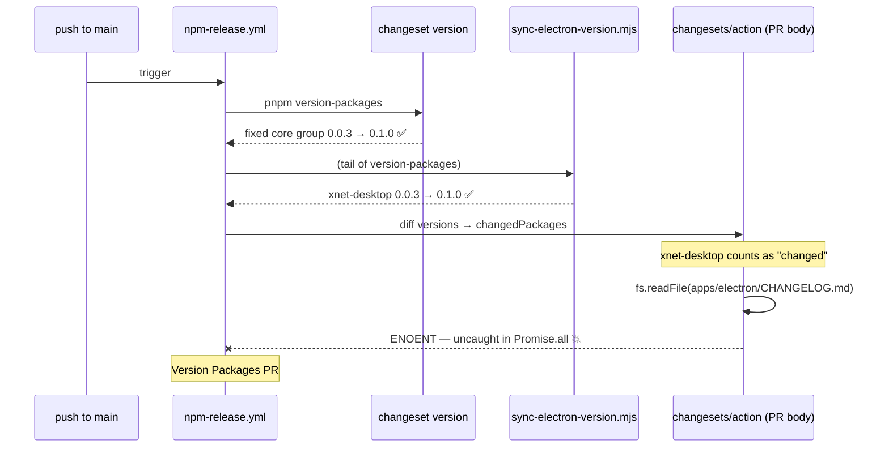
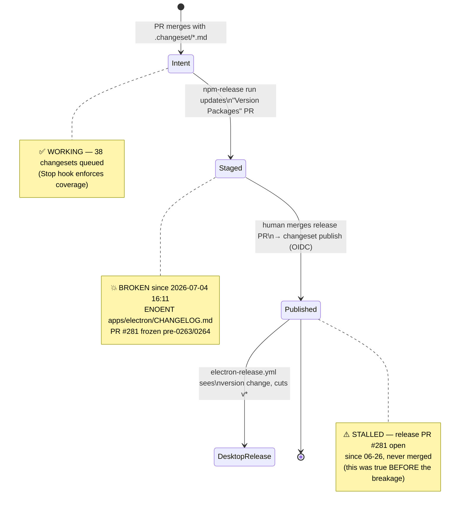

# npm Release Pipeline Stall — Electron Version Sync vs. Missing CHANGELOG.md

## Problem Statement

`@xnetjs/data`, `@xnetjs/data-bridge`, and `@xnetjs/react` (among others)
received substantial updates on main — the 0263 worker-queue work (PR #382)
and the 0264 query-model read-speed work (PR #384) — yet no new npm releases
appeared. The registry still serves `0.0.3` for the entire fixed core group,
published 2026-06-25. Why did the release automation (exploration 0220) not
fire?

## Executive Summary

Two independent things are true, and both are needed to explain the silence:

1. **The release gate is a human merge, by design.** Changesets automation
   never publishes directly from a feature merge. It maintains a standing
   "Version Packages" PR ([#281](https://github.com/crs48/xNet/pull/281),
   open since 2026-06-26) and publishes only when that PR is merged. Nobody
   has merged it since the first release on June 25 — so even a perfectly
   healthy pipeline would have published nothing.

2. **The pipeline is also hard-down.** Since 2026-07-04 16:11 UTC, **every**
   `npm Release` run on main has failed (12 consecutive failures as of
   2026-07-05). PR #373 added `scripts/changeset/sync-electron-version.mjs`
   to the tail of `pnpm version-packages`. It bumps
   `apps/electron/package.json` (`xnet-desktop`) to follow `@xnetjs/core`.
   The `changesets/action` then diffs package versions before/after the
   version command, sees `xnet-desktop` changed, and tries to read
   `apps/electron/CHANGELOG.md` to build the release-PR body. That file has
   never existed (`xnet-desktop` is private and in the changesets `ignore`
   list, so changesets never wrote one), and the `fs.readFile` sits in an
   uncaught `Promise.all` — `ENOENT` crashes the action before it can update
   PR #281.

Net effect: release intent **is** being recorded correctly (~38 unconsumed
`.changeset/*.md` files, including `query-model-read-speed-0264.md` and
`sqlite-worker-queue-0263.md` — the Stop-hook discipline works), but the
Version Packages PR is frozen at its 2026-07-04 15:14 state and can neither
absorb the new changesets nor be trusted for merge.

## Current State In The Repository

- **Workflow**: `.github/workflows/npm-release.yml` — on push to main, runs
  `changesets/action@v1` with `version: pnpm version-packages` and
  `publish: pnpm release`.
- **Root scripts** (`package.json`):
  - `version-packages`: `changeset version && node scripts/changeset/sync-electron-version.mjs`
  - `release`: `pnpm build && changeset publish`
- **The sync script**: `scripts/changeset/sync-electron-version.mjs`
  (added by PR #373) rewrites only the `"version"` field of
  `apps/electron/package.json` to match `packages/core/package.json`, so the
  desktop app "rides the core release train" and `electron-release.yml` cuts
  a matching `v<version>` desktop release after the release PR merges.
- **The gap**: `apps/electron/` has **no `CHANGELOG.md`** (verified —
  directory listing shows only README, build config, src, etc.).
- **Changeset config**: `.changeset/config.json` — `xnet-desktop` is in
  `ignore`; the fixed core group (`core`, `crypto`, `data`, `data-bridge`,
  `react`, …) versions in lockstep.
- **Pending intent**: ~38 files in `.changeset/` awaiting consumption.
- **Stale release PR**: [#281](https://github.com/crs48/xNet/pull/281)
  stages `0.1.0` for the fixed group, last updated 2026-07-04T15:14Z —
  before PRs #380–#384 merged, so it is missing the 0263/0264 release notes.
- **Registry**: `@xnetjs/core|data|data-bridge|react` all at `0.0.3`,
  published 2026-06-25T15:56Z.

### Failure evidence

Latest failing run (28754394094, 2026-07-05T20:47Z), step
"Create release PR or publish":

```
> changeset version && node scripts/changeset/sync-electron-version.mjs
🦋  All files have been updated. Review them and commit at your leisure
sync-electron-version: 0.0.3 -> 0.1.0 (following @xnetjs/core)
Error: ENOENT: no such file or directory, open
  '/home/runner/work/xNet/xNet/apps/electron/CHANGELOG.md'
    at async file:///home/runner/work/_actions/changesets/action/v1/dist/index.js:119:628
    at async Promise.all (index 1)
```

Timeline correlation: last green run 2026-07-04T15:11Z → PR #373 merged
15:48Z → first failure 16:11Z → every push since fails at the same step.



### Why the action reads that file

`changesets/action`'s `runVersion` snapshots every workspace package version
before the version command, re-reads after, and treats any package whose
version changed as "changed" — regardless of whether changesets itself
changed it. For each changed package it does
`fs.readFile(path.join(pkg.dir, "CHANGELOG.md"))` inside a `Promise.all`
(no per-package catch) to extract the changelog entry for the PR body. A
version bumped by a custom script in a package changesets never versioned →
guaranteed ENOENT. This is long-standing upstream behavior
([changesets/action#256](https://github.com/changesets/action/issues/256)).

Notably, `getChangelogEntry` in the action's `utils.ts` tolerates a
changelog **without** a matching version heading (it slices from
`headingStartInfo?.index`, i.e. returns content rather than throwing), and
`runVersion` filters falsy info objects — so the crash is purely about the
**file's existence**, not its contents.

## The Release Lifecycle, and Where It's Stuck



## External Research

- [changesets/action#256](https://github.com/changesets/action/issues/256) —
  the canonical report: the action unconditionally reads `CHANGELOG.md` for
  every version-changed package; packages with changelog generation disabled
  (or bumped by custom scripts) crash it. Open for years; the community
  workaround is to keep a committed `CHANGELOG.md` in such packages.
- [Using Changesets with pnpm](https://pnpm.io/using-changesets) — endorses
  exactly this workflow shape (`version`/`publish` custom commands), which is
  why arbitrary side effects in `version-packages` are visible to the
  action's before/after diff.
- [Versioning private/polyglot packages with changesets](https://github.com/changesets/changesets/discussions/1312)
  — confirms there is no first-class story for "version this package in the
  release PR but don't changelog it"; everyone shims it.

## Key Findings

1. **PR #373 introduced a latent bomb, armed only on the next real release
   cycle.** The sync script is a no-op when versions already match; the
   ENOENT only fires when `changeset version` actually moves core (0.0.3 →
   0.1.0), which is precisely when a release is being staged. It could not
   have been caught by #373's own CI, because CI doesn't run
   `version-packages` with pending changesets.
2. **The failure is silent in practice.** Twelve consecutive red runs on a
   push-triggered workflow that nobody watches; the visible symptom was the
   absence of releases, noticed days later. `.changeset/` piling up
   (38 files) is the on-repo litmus.
3. **Release intent capture is healthy.** The Stop hook + `/changeset`
   discipline produced changesets for 0263/0264; nothing about the authoring
   side needs to change.
4. **Even a green pipeline publishes nothing without a merge.** The manual
   release gate is a changesets feature (batch releases, human review of the
   version diff), but with no cadence policy the gate silently became a
   wall: 10 days of merged work sat staged pre-breakage.
5. **The desktop coupling itself is sound.** Once the release PR merges,
   `changeset publish` handles npm (OIDC, provenance), and
   `electron-release.yml` keys off the committed version bump. Only the
   changelog-file expectation was missed.

## Options And Tradeoffs

| Option                                          | Change                                                                                                                                      | Pros                                                                                                                                                   | Cons                                                                                                                 |
| ----------------------------------------------- | ------------------------------------------------------------------------------------------------------------------------------------------- | ------------------------------------------------------------------------------------------------------------------------------------------------------ | -------------------------------------------------------------------------------------------------------------------- |
| **A. Seed a stub `apps/electron/CHANGELOG.md`** | One-time committed file (`# xnet-desktop`)                                                                                                  | Smallest possible fix; unblocks today                                                                                                                  | Action slices the whole stub into the PR body as the "entry" (junk section); changelog stays permanently empty/wrong |
| **B. Sync script maintains the changelog**      | `sync-electron-version.mjs` creates/prepends a real `## <version>` entry ("Follows @xnetjs/core <version>", PR train context) when it bumps | Fixes ENOENT **and** gives the action a genuine entry to render; desktop gets a changelog for free; self-contained in the file that caused the problem | ~20 lines more script; entry text is boilerplate                                                                     |
| **C. Move the sync out of `version-packages`**  | Separate workflow step after `changesets/action`, committing to the release branch                                                          | Action never sees the bump → no changelog read                                                                                                         | Racy with `commitMode: github-api`; second commit path to the release PR; more moving parts than the bug deserves    |
| **D. Derive desktop version at build time**     | Drop the file bump; `electron-release.yml` reads core's version when tagging                                                                | No version churn in-tree                                                                                                                               | Redesigns #373; loses the "version diff on main" trigger that makes desktop releases observable and idempotent       |
| **E. Wait for upstream fix / fork the action**  | Patch `runVersion` to tolerate missing changelogs                                                                                           | Root-cause fix                                                                                                                                         | Issue #256 has been open for years; forking a release-critical action is worse than the workaround                   |

Orthogonal (the _other_ half of the problem):

| Option                                     | Cadence fix                                                                                     | Notes                                                                                                                                 |
| ------------------------------------------ | ----------------------------------------------------------------------------------------------- | ------------------------------------------------------------------------------------------------------------------------------------- |
| **F. Explicit release cadence policy**     | Merge the Version Packages PR at each milestone / weekly / on demand via a documented checklist | Zero automation risk; keeps human review of version diffs (majors!)                                                                   |
| **G. Auto-merge the release PR**           | Label or scheduled auto-merge once checks pass                                                  | Maximally hands-off, but publishes majors without a human glance — bad fit given "bump from the diff, when unsure bump higher" policy |
| **H. Failure alerting on npm-release.yml** | Notify on workflow failure (or a badge/scheduled check)                                         | Would have converted 12 silent failures into 1 loud one                                                                               |

## Recommendation

**B + F + H.**

1. **Fix (B):** teach `sync-electron-version.mjs` to maintain
   `apps/electron/CHANGELOG.md` — create the file if absent and prepend a
   `## <version>` entry whenever it bumps. This keeps the entire
   #373 mechanism in one script, satisfies the action's file read, and
   renders a truthful line in the release PR instead of stub junk.
2. **Cadence (F):** adopt a lightweight rule — e.g. "merge the Version
   Packages PR after each exploration lands on main, once its CI is green" —
   and record it in `CLAUDE.md` or the release runbook. Keep the human gate;
   majors need eyes.
3. **Alerting (H):** make `npm Release` failures loud (workflow-failure
   notification), so a red release pipeline never again hides behind green
   feature CI.

Then merge the refreshed PR #281 to actually ship `0.1.0` — which also
exercises the full #373 desktop train (npm publish → version bump on main →
`electron-release.yml` cuts `v0.1.0`).

## Example Code

Sketch of the changelog-maintaining addition to
`scripts/changeset/sync-electron-version.mjs` (after the successful
`writeFileSync` of `package.json`):

```js
// changesets/action reads CHANGELOG.md for every package whose version
// changed during `version-packages` (uncaught ENOENT otherwise — see
// changesets/action#256). xnet-desktop is ignored by changesets, so this
// script owns its changelog: prepend a minimal entry for each ride on the
// core train.
const changelogPath = join(root, 'apps/electron/CHANGELOG.md')
let changelog = ''
try {
  changelog = readFileSync(changelogPath, 'utf8')
} catch {
  changelog = '# xnet-desktop\n'
}
const [title, ...rest] = changelog.split(/\n(?=## )/) // keep existing entries
const entry =
  `## ${coreVersion}\n\n` +
  `Desktop shell release riding the @xnetjs/core ${coreVersion} train ` +
  `(no desktop-specific changes are tracked here; see the core packages' ` +
  `changelogs).\n`
writeFileSync(changelogPath, [title.trimEnd(), entry, ...rest].join('\n\n'))
```

## Risks And Open Questions

- **Does the action need a matching heading, or just the file?** Reading of
  the action source says file-only (missing headings degrade gracefully),
  but Option B sidesteps the question by always writing a matching entry.
  Validate locally before trusting the next run.
- **Recovery of the frozen PR:** once green, the next push to main should
  regenerate PR #281's branch (`changeset-release/main`) from scratch —
  confirm it picks up all 38 changesets including 0263/0264, and that the
  electron bump commit lands in the same PR.
- **First merged release after the fix is a minor (0.1.0) across the fixed
  group.** Sanity-check the staged changelogs before merging — the PR body
  already exceeds GitHub's size limit and omits inline changelog text, so
  review the `CHANGELOG.md` diffs in the PR files tab instead.
- **Is 0.1.0 right?** Several queued changesets are minors; if any diff
  since 0.0.3 removed/renamed a public export, policy says major. A quick
  audit of the staged bumps is cheap insurance before the gate opens.

## Implementation Checklist

- [x] Extend `scripts/changeset/sync-electron-version.mjs` to create/prepend
      an `apps/electron/CHANGELOG.md` entry whenever it bumps the version
      (Option B; idempotent — skip when entry for the target version exists).
- [x] Add a unit/smoke test or dry-run mode for the script (bump from a
      fixture, assert package.json + CHANGELOG.md both updated).
- [x] Make `npm Release` failures loud — e.g. a notification step on
      `failure()` in `npm-release.yml` (Option H).
- [x] Document the release cadence: who merges the Version Packages PR, and
      when (Option F) — add to `CLAUDE.md` or `docs/` runbook.
- [ ] Merge the fix to main; watch the next `npm Release` run go green and
      refresh PR #281 with the 0263/0264 changesets.
- [x] Review the staged version bumps (major audit per changeset policy),
      then merge PR #281.

## Validation Checklist

- [x] Local repro: on a scratch branch with pending changesets, run
      `pnpm version-packages` and confirm `apps/electron/CHANGELOG.md` gains
      a `## <version>` entry matching `packages/core/package.json`.
- [ ] Next push to main: `npm Release` run completes; step "Create release
      PR or publish" green; PR #281 updated with a fresh timestamp and the
      0263/0264 release notes, including the electron version+changelog bump.
- [ ] After merging #281: `npm view @xnetjs/core version` → `0.1.0` (and
      data/data-bridge/react in lockstep), with provenance.
- [ ] `electron-release.yml` cuts a `v0.1.0` desktop release on the
      post-merge push (the #373 train end-to-end).
- [ ] `.changeset/` on main contains only `README.md` + `config.json`
      (all intent consumed).

## References

- `.github/workflows/npm-release.yml` — the failing workflow.
- `scripts/changeset/sync-electron-version.mjs` — the version-sync script
  (PR #373).
- `.changeset/config.json` — fixed group + `ignore` list (`xnet-desktop`).
- Failing runs: 28712014143 (first, 2026-07-04T16:11Z) → 28754394094
  (latest checked, 2026-07-05T20:47Z), all at step "Create release PR or
  publish".
- Stale release PR: [#281](https://github.com/crs48/xNet/pull/281);
  last merged release PR: [#263](https://github.com/crs48/xNet/pull/263)
  (2026-06-25).
- [changesets/action#256](https://github.com/changesets/action/issues/256) —
  upstream ENOENT-on-missing-CHANGELOG issue.
- [Using Changesets with pnpm](https://pnpm.io/using-changesets).
- [changesets discussion #1312 — versioning private packages](https://github.com/changesets/changesets/discussions/1312).
- `docs/explorations/0220_[_]_AUTOMATED_NPM_PACKAGE_PUBLISHING_AND_CONVENTIONAL_VERSIONING.md`
  — the release automation this stalls.
