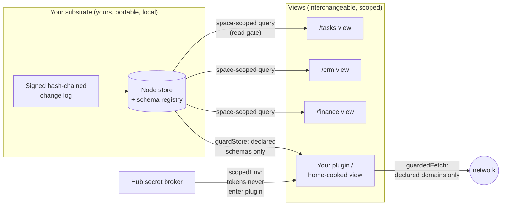
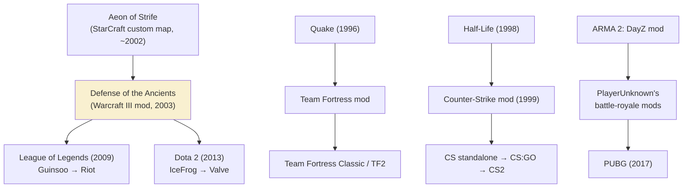
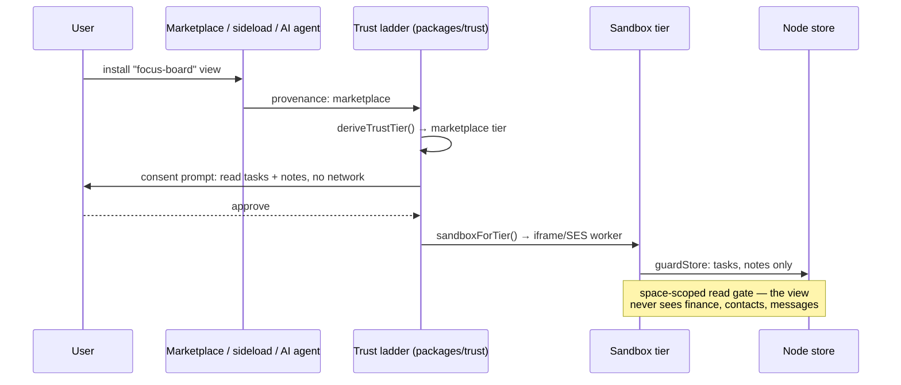

# Moddable Software and the Application as a View Over Your Data

> _"Software must be as easy to change as it is to use."_
> — the [Malleable Systems Collective](https://malleable.systems/mission/)

## Problem Statement

The user wants a blog post about **moddable software** — software the end user
can extend via plugins, mods, or open-source recompilation — and the observation
that this culture has fallen by the wayside in the era of large internet
applications and iPhone-style walled gardens. Old desktop software could be
modded. Games still can, and whole communities and genres grew out of it: DotA
began as a _Warcraft III_ custom map and spawned the entire MOBA genre. That
kind of creativity is structurally impossible in an app you cannot open.

The post should argue for **reintroducing moddability to the web and to
software in general** — safely, with guardrails against malicious intent, and
with the user in control of their information — and weave xNet into that story
through its central architectural bet: **the application is a view over your
data**. Many views can sit over one substrate; each view asks for only the
subset it needs; the views run on your device, so your data never has to leave
it to be useful. The user also wants the AI-age punchline: when custom software
is this cheap to make, why would your software not be as bespoke as possible
(within reason — you still have to maintain it)?

The failure mode to avoid is a nostalgia piece that gestures at game mods and
then hand-waves at xNet. The essay must ground every claim in mechanism —
either a verified historical fact or a file that exists in this repository.

## Executive Summary

- **The mod era did not die of natural causes; it was locked out by
  distribution policy.** Doom shipped its data in moddable WAD files in 1993
  and open-sourced its engine in 1997. Counter-Strike (1999) was a Half-Life
  mod; Team Fortress (1996) a Quake mod; DotA (2003) a _Warcraft III_ map
  descended from StarCraft's _Aeon of Strife_; the battle-royale genre came out
  of an ARMA mod scene. Meanwhile iOS App Review Guideline 2.5.2 forbids apps
  from executing code that "introduces or changes features," and Manifest V3
  removed the API that uBlock Origin needs. The workshop didn't empty out —
  the doors were locked.
- **Every surviving moddable ecosystem has a safety story, and the ones that
  didn't got burned.** Figma runs plugins in a QuickJS VM compiled to Wasm;
  Deno is deny-by-default; Extism sandboxes plugins in Wasm; VS Code isolates
  extensions in a separate host process. The counterexample is _fractureiser_
  (June 2023): compromised CurseForge accounts shipped credential-stealing
  malware inside Minecraft mods with millions of downloads. The lesson is not
  "review everything" (Apple's answer) — it is **capability-scoping**: mods get
  only the authority you hand them.
- **"The app is a view over your data" is the structural precondition of
  moddability.** You cannot mod what you cannot read. When data is trapped
  inside the app, extending the app means begging the vendor; when the app is a
  lens over a substrate you own, extending it means writing another lens.
  Shirky's _situated software_ (2004), Sloan's _home-cooked meal_ (2020), Ink &
  Switch's _malleable software_ (2025), and Obsidian's _file over app_ all
  circle this same inversion.
- **xNet already ships the full mechanism — the gap is narrative, not
  engineering.** The plugin substrate (`packages/plugins/`) enforces
  capability manifests via `guardStore`/`guardedFetch`/`scopedEnv`; the trust
  ladder (`packages/trust/`) maps provenance to sandbox tier; schema lenses
  (`packages/data/src/schema/`) let users extend data shapes without forking;
  Space authorization cascades scope what any view can see; and `/tasks`,
  `/crm`, `/finance` are literally three views over one node store.
- **AI collapses the cost of making the mod, which raises the value of a
  substrate that makes mods safe.** Geoffrey Litt called LLMs "a step change
  in tool support for end-user programming" (2023). The scarce thing is no
  longer the ability to write the bespoke view — it is a place where a
  bespoke, half-vibe-coded view can run **without being handed all your data**.
- **Recommendation:** Ship **blog post #10** at `site/src/pages/blog/`,
  provisional title **"The Workshop and the Walled Garden"**, tags
  `['essay', 'philosophy', 'decentralization']`. Cold-open on the DotA
  lineage, concede the platforms' genuine security rationale, then present
  capability-scoped views-over-data as the synthesis: moddability _and_ safety,
  rather than the false trade between them.

## Current State In The Repository

Every beat the essay wants to make maps to code that exists today. This matters
because the essay's credibility rests on xNet being a working instance of the
argument, not a pitch deck.

### The substrate: one log, many views

- `docs/specs/protocol/00-overview.md` … `05-schema-evolution.md` — the
  portable protocol: a signed (Ed25519), hash-chained, Lamport-ordered LWW
  change log (`packages/sync/src/change.ts`). The data outlives any app that
  renders it — this is the essay's load-bearing fact.
- `packages/react/src/hooks/useQuery.ts` — views subscribe to live, synced
  node queries. `apps/web/src/components/TasksView.tsx`, `CrmView.tsx`, and
  `FinanceView.tsx` are three complete "applications" over the same store —
  the concrete demonstration that an app is a lens, not a silo.
- `packages/data/src/schema/extension.ts`, `lens.ts`, `sidecar.ts` — users
  extend schemas without forking: on-record `ext:` overlays, private sidecar
  attributes, and bidirectional read-time lenses, composed by
  `extension-resolver.ts`. Modding the _data shape_, not just the UI.

### The guardrails: capabilities, not review boards

- `packages/plugins/src/manifest.ts` — plugins declare id, version, pricing,
  and **permissions** up front.
- `packages/plugins/src/ecosystem/capability-guard.ts` — `guardStore` gates
  schema reads/writes to the declared allowlist.
- `packages/plugins/src/ecosystem/network-endowment.ts` — `guardedFetch`
  confines network egress to declared domains (SSRF-guarded).
- `packages/plugins/src/feature-module.ts` — the "everything is a plugin"
  shape: `secrets` brokered by the hub via `scopedEnv` (tokens never enter
  plugin code), `schemaWrite`/`schemaRead`, `network`, `endowments`.
- `packages/trust/src/index.ts` — `deriveTrustTier(provenance)` maps
  `builtin | authored | ai-generated | imported | marketplace | synced` to an
  execution tier; `sandboxForTier()` picks host / SES worker / iframe;
  `requiresCapabilityReprompt()` forces re-consent when a mod arrives via sync.
- `packages/data/src/schema/schemas/space-authorization.ts` + the cascade
  tests in `packages/data/src/auth/space-cascade.test.ts` — authorization is
  schema-native, so **a view receives only the slice it is entitled to**; the
  scoping the essay promises is enforced at the query read gate, not by
  politeness.

### The distribution story

- `apps/web/src/components/MarketplaceView.tsx` +
  `packages/plugins/src/ecosystem/marketplace.ts` — browsable registry,
  consent-gated install, provenance stamping on install
  (`ecosystem/provenance-trust.ts`).
- `packages/licenses/src/` — Ed25519, DID-bound plugin licenses
  (`signPluginLicense`, `verifyPluginLicense`), fail-closed install gate — a
  mod economy where creators can charge without a 30% toll booth.
- `packages/devkit/src/bridge.ts` — the `:31416` agent bridge: your own
  Claude Code / Codex builds mods _for_ your workspace, in worktrees, behind
  validation gates. This is the AI-age "home-cooked meal" kitchen.

### The publishing surface

- `site/src/pages/blog/` — nine hand-authored `.astro` posts (newest: _Hand
  on the Tiller_, 2026-07-03), metadata centralized in
  `site/src/data/blog.ts` (`BlogPost[]`), RSS via `site/src/pages/rss.xml.ts`.
  Existing tags: `essay | philosophy | privacy | decentralization | protocol |
nature | cosmos | economics`. House components from post #7:
  `Mermaid`, `CodeFigure`, `Peek`. House style is en-GB (post-0247 audit).

### Prior explorations this builds on

`0006` (plugin architecture), `0047` (marketplace), `0188` (extensible
schemas), `0189` (feature modules), `0192` (ecosystem & trust), `0194`
(extensibility fabric), `0196` (paid marketplace), `0201` (distribution +
website). This exploration is the _narrative_ capstone over that series — the
essay explains to humans what those eight docs built.



## External Research

### The lineage (dates verified)

| Year        | Artifact                                                                                                                                                              | What it shows                                                |
| ----------- | --------------------------------------------------------------------------------------------------------------------------------------------------------------------- | ------------------------------------------------------------ |
| 1993        | Doom ships data in WAD files; engine source released 1997 (GPL 1999)                                                                                                  | Moddability as a deliberate architecture decision            |
| 1996        | Team Fortress v1.0, a Quake mod; team hired by Valve                                                                                                                  | Mods as talent pipeline                                      |
| 1999        | Counter-Strike, a Half-Life mod (Minh Le, Jess Cliffe); acquired by Valve, standalone 2000                                                                            | A mod out-lived and out-earned most studios                  |
| ~2002       | _Aeon of Strife_, a StarCraft custom map (authorship/date vary by source — hedge in the essay)                                                                        | Genre seed                                                   |
| 2003        | Eul ports the concept to _Warcraft III: Reign of Chaos_ as **Defense of the Ancients**; _DotA Allstars_ flourishes on _The Frozen Throne_ under Guinsoo, then IceFrog | The user's anecdote, verified: DotA was a Warcraft III mod   |
| 2009 / 2013 | Guinsoo → Riot → **League of Legends**; IceFrog → Valve → **Dota 2**                                                                                                  | A mod became a genre (MOBA) and an e-sports economy          |
| 2013–2017   | Brendan Greene's battle-royale mods (ARMA 2 DayZ mod → ARMA 3 → H1Z1 consulting) → **PUBG**                                                                           | The pattern repeats a decade later                           |
| 2025        | Minecraft mods pass **100 billion downloads** on CurseForge                                                                                                           | Mod culture at planetary scale, where it is allowed to exist |



### The enclosure

- **iOS App Review Guideline 2.5.2**: apps "may not download, install, or
  execute code which introduces or changes features or functionality of the
  app" — runtime extensibility is against the rules of the world's largest
  software distribution channel.
- **Manifest V3**: Chrome replaced blocking `webRequest` with static
  `declarativeNetRequest` rule lists; uBlock Origin (~40M users) could only
  ship a reduced "Lite" version; MV2 was switched off in 2024-25. The EFF and
  gorhill's critique: the removed capability is what _protective_ extensions
  need, not what malware primarily exploits.
- **Fairness note for the essay**: both platforms have a genuine security
  rationale — reviewed code and narrow APIs really do shrink the attack
  surface. The essay should concede this honestly, then argue the trade is
  false: capabilities give you the safety without the enclosure.

### The intellectual spine

- **Clay Shirky, "Situated Software" (2004)** — software "designed in and for
  a particular social situation," rejecting the Web School virtues of
  scalability and generality. <http://shirky.com/essays/situated-software/>
- **Robin Sloan, "An app can be a home-cooked meal" (2020)** — his family
  message app has four users and zero churn; "I am the programming equivalent
  of a home cook." <https://www.robinsloan.com/notes/home-cooked-app/>
- **Ink & Switch, "Malleable software" (2025, Litt / Horowitz / van
  Hardenberg / Matthews)** — restoring user agency in a world of locked-down
  apps; a "gentle slope" from using to modifying; "tools, not apps."
  <https://www.inkandswitch.com/essay/malleable-software/> (companion pieces:
  _Local-first software_, 2019; _End-user Programming_.)
- **Steph Ango, "File over app"** — durable artifacts live in files you
  control; apps are ephemeral. <https://stephango.com/file-over-app>
- **Solid (Tim Berners-Lee)** — data in user-owned pods, apps as
  interchangeable views. The same inversion, W3C-flavoured.
  <https://solidproject.org/>
- **Unix philosophy** — McIlroy's "write programs that work together":
  composability as user power, forty years before it needed a manifesto.
- **Geoffrey Litt, "Malleable software in the age of LLMs" (2023)** — LLMs
  are "a step change in tool support for end-user programming"; predicts a
  shift from prefab apps to on-demand personal tools.
  <https://www.geoffreylitt.com/2023/03/25/llm-end-user-programming.html>

### The safety prior art

- **Figma plugins** — started with the Realms shim; after a disclosed
  vulnerability, moved to a QuickJS VM compiled to WebAssembly with
  allowlisted APIs. (Figma blog: _How to build a plugin system on the web and
  also sleep well at night_, 2019.)
- **Extism** — universal Wasm plugin system; fully sandboxed, host SDKs in
  ~15 languages. <https://extism.org/>
- **Deno** — deny-by-default runtime; `--allow-read/net/env` scoped to
  specific resources.
- **Object capabilities** (Mark S. Miller, E / erights.org) — authority flows
  only through unforgeable references; no ambient authority. This is the
  theory xNet's `guardStore`/`guardedFetch`/`scopedEnv` trio implements in
  practice.
- **VS Code** — 60,000+ marketplace extensions running in an isolated
  extension-host process; with Emacs, proof that moddability never died where
  it was allowed to live (developer tools).
- **fractureiser (June 2023)** — compromised CurseForge/Bukkit accounts
  injected multi-stage infostealer malware into Minecraft mods (including
  packs with 4.6M+ downloads), some despite 2FA. The essay's honest
  counterweight: distribution trust alone is insufficient; runtime capability
  scoping is the missing layer.

## Key Findings

1. **The decline of moddability was a policy outcome, not a technical one.**
   The same decades that locked down consumer software saw developer tools
   (VS Code, Emacs) and PC games (Minecraft: 100B mod downloads) thrive on
   moddability. Where it was permitted, it flourished; where distribution
   policy forbade it (iOS 2.5.2, MV3), it vanished. This gives the essay its
   villain without needing a conspiracy: incentives plus a genuine security
   worry produced enclosure.
2. **Safety and moddability are only in tension when data access is
   all-or-nothing.** Apple's model: review the code because once installed it
   can see everything. The capability model: don't trust the code at all —
   scope what it can touch. Figma, Deno, Extism, and object-capability theory
   all converge here, and xNet's trio (`guardStore`, `guardedFetch`,
   `scopedEnv`) plus the provenance→trust→sandbox ladder is a faithful
   implementation.
3. **Views-over-data is what makes "mods" a first-class concept rather than a
   hack.** Game mods worked because the data (WADs, maps, models) was
   separable from the engine. xNet generalizes this: the change log is the
   WAD file; every app is an engine you can swap. Three shipping views over
   one store (`/tasks`, `/crm`, `/finance`) make this concrete without
   hypotheticals.
4. **The AI angle inverts the maintenance objection.** The classic case
   against bespoke software is that you have to maintain it. With an agent
   bridge (`packages/devkit/`) the marginal cost of both _making_ and
   _maintaining_ a personal view collapses — but only if the substrate is
   legible (open schemas, portable log) and the blast radius is bounded
   (capabilities). Bespoke-within-reason becomes rational.
5. **The essay is the tenth post and the capstone of a series-within-a-series.**
   Posts #7 (internals) and #8 (developer deep-dive) explained the machine;
   this one explains _why the machine is shaped that way_. It should
   cross-link both, and reuse their `Mermaid`/`CodeFigure`/`Peek` components.
6. **Honesty requirements:** hedge Aeon of Strife's exact date/author; credit
   the platforms' security rationale; cite fractureiser against our own
   position; concede the maintenance burden ("within reason — you still have
   to maintain it" belongs in the essay, not just this doc); do not claim the
   marketplace has traffic it does not have.

## Options And Tradeoffs

| Option                                                                                                                                                                                        | Shape               | Pros                                                                                         | Cons                                                                     |
| --------------------------------------------------------------------------------------------------------------------------------------------------------------------------------------------- | ------------------- | -------------------------------------------------------------------------------------------- | ------------------------------------------------------------------------ |
| **A. Nostalgia essay** — game mods, communities, what we lost                                                                                                                                 | Cultural history    | Fun, shareable, evergreen                                                                    | No xNet payload; reads as a Polygon retrospective                        |
| **B. Technical deep-dive** — the plugin substrate, trust ladder, capability guards                                                                                                            | Like post #8        | Grounded, differentiating                                                                    | Duplicates #7/#8's register; loses the general reader the topic deserves |
| **C. Cultural essay with a mechanism spine (recommended)** — mod lineage as cold open → enclosure → views-over-data as the precondition → capabilities as the guardrail → AI-age home cooking | Like posts #5/#6/#9 | Serves the user's full brief; every claim backed by a file or a date; invites both audiences | Longest to write; needs careful fact-checking of game history            |
| **D. Docs page instead of blog** — "Extending xNet" guide                                                                                                                                     | Documentation       | Directly useful                                                                              | Ignores the brief; docs already exist per-package                        |

Within Option C, one more choice: how much code to show. Post #9 used zero
code; post #7 was code-heavy. Recommendation: **two `CodeFigure`s maximum** —
a plugin manifest (permissions as consent, legible to non-programmers) and a
tiny lens/view snippet — plus one or two `Mermaid` diagrams. The manifest is
the essay's best exhibit because a reader can _see_ the guardrails.

## Recommendation

Write **blog post #10: "The Workshop and the Walled Garden"** (alternates:
"Software You Can Open"; "The Right to Mod"). Tags
`['essay', 'philosophy', 'decentralization']` — no new tag needed. En-GB
spelling. Structure:

1. **Cold open — the map that became a genre.** A custom map for _Warcraft
   III_ — made by pseudonymous modders named Eul, Guinsoo, IceFrog — became
   DotA, and DotA became the MOBA genre, League of Legends, Dota 2, and a
   billion-dollar e-sports economy. Blizzard shipped the world editor that
   made it possible. Then walk the pattern back (Counter-Strike, Team
   Fortress, Doom WADs) and forward (PUBG, Minecraft's 100 billion mod
   downloads).
2. **The enclosure.** iOS 2.5.2, Manifest V3 / uBlock Origin. Concede the
   security rationale sincerely — fractureiser is real — and name the false
   trade: the platforms answered "untrusted code can see everything" by
   banning the code, not by scoping the seeing.
3. **The precondition.** You cannot mod what you cannot read. Mods worked in
   games because the data was separable from the engine. Situated software
   (Shirky), home-cooked apps (Sloan), file over app (Ango), malleable
   software (Ink & Switch) — everyone circling the same inversion: **own the
   substrate, swap the views.**
4. **The mechanism.** xNet's version, lightly: one signed, portable change
   log; `/tasks`, `/crm`, `/finance` as three interchangeable engines over
   it; a plugin manifest as the whole security model in fifteen legible lines
   (CodeFigure); provenance → trust tier → sandbox (Mermaid); the license
   layer so mod-makers can eat without a 30% toll.
5. **The kitchen.** The AI age makes the mod cheap: Litt's step change,
   Sloan's home cook, the agent bridge as the stocked kitchen. Bespoke within
   reason — because the substrate is legible and the blast radius is scoped,
   the maintenance objection shrinks to its true size.
6. **Close — an invitation.** The workshop and the walled garden were never
   the only two options. Leave the reader with the DotA question: what genre
   doesn't exist yet because the app that would host it can't be opened?



## Example Code

Metadata entry (`site/src/data/blog.ts`):

```ts
{
  slug: 'the-workshop-and-the-walled-garden',
  title: 'The Workshop and the Walled Garden',
  description:
    'DotA was a mod. Counter-Strike was a mod. Then the doors were locked. ' +
    'On moddable software, the application as a view over your data, and ' +
    'guardrails that scope instead of forbid.',
  pubDate: new Date('2026-07-XX'),
  tags: ['essay', 'philosophy', 'decentralization'],
},
```

The essay's central `CodeFigure` — a manifest a non-programmer can read as a
consent form:

```ts
// A "mod" in xNet is a view plus a consent form.
export default defineFeatureModule({
  id: 'focus-board',
  version: '1.0.0',
  capabilities: {
    schemaRead: ['task', 'note'], // sees your tasks and notes…
    schemaWrite: ['task'], // …may tick tasks off…
    network: [], // …and never phones home.
    secrets: [] // No tokens. Nothing to leak.
  },
  mount: (host) => host.render(FocusBoard)
})
```

## Risks And Open Questions

- **Overclaiming the marketplace.** The registry, licensing, and install gate
  exist in code; a thriving third-party mod scene does not (yet). The essay
  must present xNet as _architecture for_ the workshop, not as a bustling one.
- **Game-history pedantry.** MOBA-lineage readers are exacting. Hedge Aeon of
  Strife ("a StarCraft custom map from the early 2000s"), keep the
  Eul→Guinsoo→IceFrog chain, note DotA started on _Reign of Chaos_ and
  flourished on _The Frozen Throne_. All dates above were verified against
  multiple sources.
- **Security humility.** Our sandbox tiers are SES worker / iframe, not a
  Wasm VM like Figma's. That is defensible (and the trust ladder can grow a
  Wasm rung later) but the essay should not imply stronger isolation than
  `sandboxForTier()` provides today.
- **Tone risk.** "Walled garden" essays curdle into grievance easily. The fix
  is the sincere concession (fractureiser, review-board logic) and the
  forward-looking close.
- **Title collision check** — no existing post uses "workshop" or "garden";
  post #6 ("The Forest and the Field") has a similar cadence, which reads as
  series voice rather than repetition. Open question for the user: keep the
  pairing title or go punchier ("Software You Can Open")?
- Should the essay link the live `/plugins` page and MarketplaceView, or hold
  until the registry has more entries? (Recommend: link the docs, soft-pedal
  the storefront.)

## Implementation Checklist

- [x] Draft `site/src/pages/blog/the-workshop-and-the-walled-garden.astro`
      following the six-beat structure above (en-GB, calm/evergreen voice).
- [x] Add the `BlogPost` entry to `site/src/data/blog.ts` (post #10; RSS picks
      it up automatically via `site/src/pages/rss.xml.ts`).
- [x] Reuse post #7's `Mermaid` + `CodeFigure` components: one lineage or
      install-flow diagram, the manifest CodeFigure, at most one more.
- [x] Cross-link posts #7 (internals) and #8 (developer deep-dive), and the
      malleable-software / situated-software / home-cooked-meal sources.
- [x] Fact-check pass against the verified table in this doc (dates, names,
      the Aeon of Strife hedge).
- [x] Art direction: 2–3 comps in the established style (suggestion: a workshop
      pegboard vs. a topiary wall).
- [ ] Changelog fragment via `scripts/changelog/new.mjs` (essays use
      `--tags platform`; do not hand-write the fragment).
- [x] `pnpm` site build + preview screenshot; humane-patterns lint
      (`scripts/check-humane-patterns.mjs`) stays green.
- [ ] Open PR; after merge, check this exploration off
      (`docs(exploration): check off moddable software blog (0267)`).

## Validation Checklist

- [ ] Site builds clean; post renders at `/blog/the-workshop-and-the-walled-garden`
      and appears in the blog index and RSS feed.
- [ ] Every historical claim in the published essay traces to a source in this
      doc's References; every xNet claim traces to a real file path.
- [ ] All external links resolve; internal links to posts #7/#8 resolve.
- [ ] En-GB spelling audit (the 0247 standard) passes.
- [ ] The essay concedes the security rationale and the maintenance burden in
      its own text (grep the draft for "fractureiser" and "maintain").
- [ ] Manifest CodeFigure compiles conceptually against
      `packages/plugins/src/feature-module.ts` (field names match reality).

## References

**Essays and movements**

- Ink & Switch, _Malleable software_ (2025) — <https://www.inkandswitch.com/essay/malleable-software/>
- Ink & Switch, _Local-first software_ (2019) — <https://www.inkandswitch.com/essay/local-first/>
- Ink & Switch, _End-user Programming_ — <https://www.inkandswitch.com/end-user-programming/>
- Clay Shirky, _Situated Software_ (2004) — <http://shirky.com/essays/situated-software/>
- Robin Sloan, _An app can be a home-cooked meal_ (2020) — <https://www.robinsloan.com/notes/home-cooked-app/>
- Steph Ango, _File over app_ (2023) — <https://stephango.com/file-over-app>
- Malleable Systems Collective — <https://malleable.systems/>
- Solid project — <https://solidproject.org/>
- Geoffrey Litt, _Malleable software in the age of LLMs_ (2023) — <https://www.geoffreylitt.com/2023/03/25/llm-end-user-programming.html>

**Game modding history**

- Doom modding / source release — <https://en.wikipedia.org/wiki/Doom_modding>, <https://doomwiki.org/wiki/Doom_source_code>
- Team Fortress — <https://en.wikipedia.org/wiki/Team_Fortress_Classic>
- Counter-Strike — <https://www.moddb.com/mods/counter-strike>
- Defense of the Ancients / MOBA — <https://en.wikipedia.org/wiki/Defense_of_the_Ancients>, <https://en.wikipedia.org/wiki/Multiplayer_online_battle_arena>
- PUBG lineage — <https://en.wikipedia.org/wiki/PlayerUnknown>
- Minecraft 100B CurseForge downloads (2025) — <https://www.sportskeeda.com/minecraft/minecraft-mods-reach-100-billion-downloads-curseforge-marking-huge-milestone>
- Skyrim Creation Kit (2012) — <https://en.uesp.net/wiki/Skyrim_Mod:Creation_Kit>

**Enclosure and safety**

- Apple App Review Guidelines §2.5.2 — <https://developer.apple.com/app-store/review/guidelines/>
- Manifest V3 / uBlock Origin — <https://www.eff.org/deeplinks>, <https://ublockorigin.com/>
- Figma plugin sandbox (2019) — <https://www.figma.com/blog/how-we-built-the-figma-plugin-system/>
- Extism — <https://extism.org/>
- Deno permissions — <https://docs.deno.com/runtime/fundamentals/security/>
- Object-capability model — <https://en.wikipedia.org/wiki/Object-capability_model>
- Wasm Component Model — <https://component-model.bytecodealliance.org/>
- fractureiser (2023) — <https://github.com/trigram-mrp/fractureiser>

**Repository**

- Plugin substrate — `packages/plugins/src/` (`manifest.ts`, `feature-module.ts`, `ecosystem/capability-guard.ts`, `ecosystem/network-endowment.ts`, `ecosystem/provenance-trust.ts`, `ecosystem/marketplace.ts`)
- Trust ladder — `packages/trust/src/index.ts`; labs — `packages/labs/src/trust.ts`
- Licensing — `packages/licenses/src/`
- Extensible schemas — `packages/data/src/schema/` (`extension.ts`, `lens.ts`, `sidecar.ts`, `extension-resolver.ts`)
- Space authorization — `packages/data/src/schema/schemas/space-authorization.ts`, `packages/data/src/auth/space-cascade.test.ts`
- Protocol spec — `docs/specs/protocol/`; `packages/sync/src/change.ts`
- Views — `packages/react/src/hooks/useQuery.ts`; `apps/web/src/components/{TasksView,CrmView,FinanceView}.tsx`
- Agent bridge — `packages/devkit/src/bridge.ts`
- Blog — `site/src/pages/blog/`, `site/src/data/blog.ts`, `site/src/pages/rss.xml.ts`
- Related explorations — 0006, 0047, 0188, 0189, 0192, 0194, 0196, 0201, 0248, 0249, 0256
