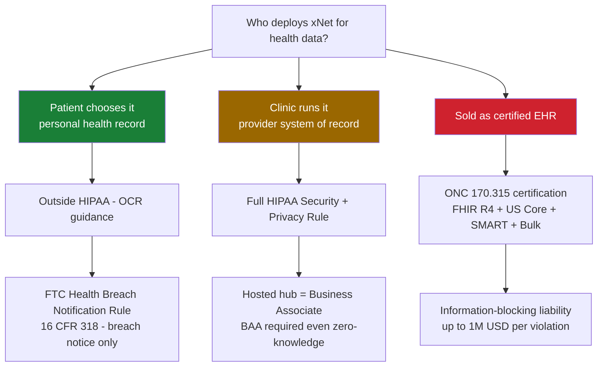
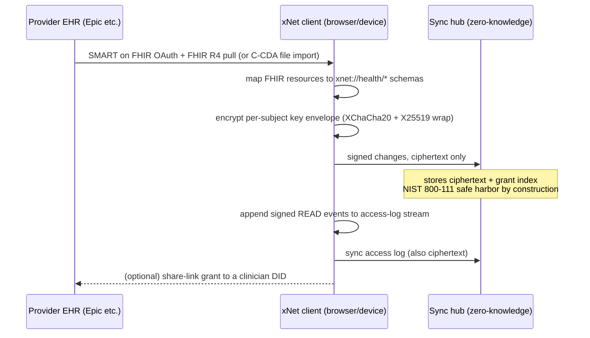
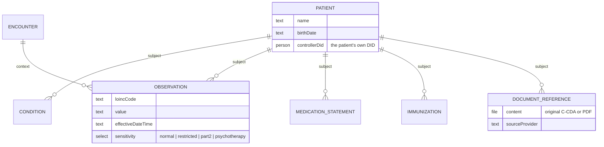
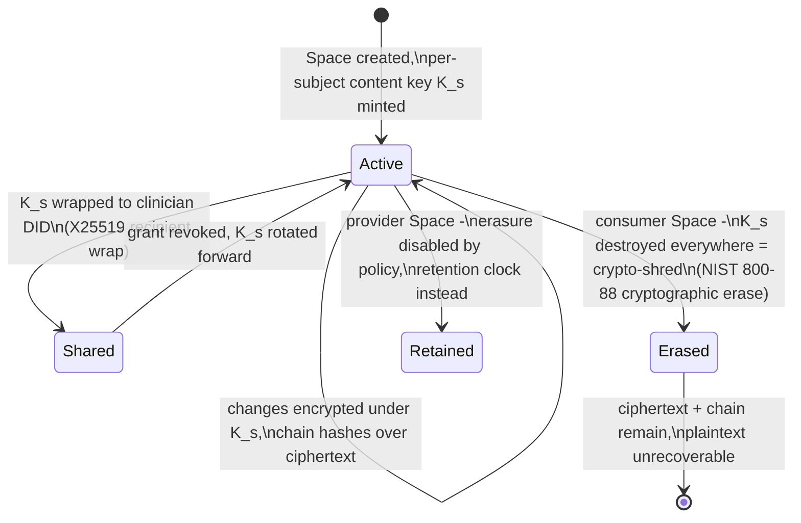

# xNet For Electronic Medical Records — Security And Legality

## Problem Statement

Could xNet — a local-first data platform built on a signed, hash-chained,
LWW change log with optional hub sync — serve as a substrate for
electronic medical records? This is a thought experiment, not a product
plan: what would it actually take, technically and legally, for
protected health information (PHI) to live inside xNet Spaces? Which
parts of the answer are already built, which are wiring gaps, and which
are genuinely hard regulatory walls?

## Executive Summary

The single most important finding is that **"EMR on xNet" is not one
question but two**, split by who deploys it:

1. **Patient-held mode** (a personal health record the *patient* chooses
   to use, pulling their own records from providers): this is **outside
   HIPAA entirely** per explicit OCR guidance. The FTC Health Breach
   Notification Rule applies instead — a far lighter regime (breach
   notification, no Security Rule). This is the Apple Health Records /
   Fasten Health pattern, and xNet is architecturally *better* suited to
   it than either, because the change log gives portability and
   integrity for free.

2. **Provider mode** (a clinic runs xNet as its record system, or xNet
   Cloud hosts a sync hub for a clinic): full HIPAA applies, a BAA is
   required, and — critically — a hosted sync hub is a business
   associate **even if it is end-to-end encrypted and holds zero keys**
   (HHS treats "no-view" cloud services as BAs). Selling into the
   certified-EHR market additionally requires ONC §170.315
   certification (~$200k by OpenEMR's public estimate, though shrinking
   under the 2025 deregulatory proposals).

On the technical side, the codebase audit shows **the gaps are wiring,
not design**. The E2E envelope system (`packages/crypto/src/envelope.ts`),
the authorization DSL and policy evaluator
(`packages/data/src/auth/evaluator.ts`), the immutable audit index
(`packages/history/src/audit-index.ts`), and the signed hash-chained
change log (`packages/sync/src/change.ts`) together read like a
near-literal implementation of the HIPAA Security Rule's technical
safeguards (45 CFR §164.312) — *except* that E2E encryption is not
wired into the sync path by default (the known 0257 "built but switched
off" gap), read-access auditing doesn't exist (only mutation auditing),
and there is no crypto-shredding/redaction story.

**Recommendation:** treat "patient-held PHR" as the only mode worth
pursuing, and treat its four hardening prerequisites — E2E-by-default,
client-side read-access audit stream, per-subject key envelopes
(crypto-shredding), and sensitivity-label segmentation — as generic
platform investments that xNet wants anyway. Provider mode should be
explicitly out of scope until a real design partner appears; certified
EHR mode should be declined.

## Current State In The Repository

What exists today, seam by seam. (Status labels: **BUILT** = works and
tested; **BUILT-UNWIRED** = implemented but not on the default path;
**GAP** = does not exist.)

### Cryptography — BUILT, but E2E is BUILT-UNWIRED

- `packages/crypto/src/envelope.ts` — `EncryptedEnvelope`:
  XChaCha20-Poly1305 content encryption, X25519 per-recipient key
  wrapping, Ed25519 integrity signature. Complete and tested.
- `packages/crypto/src/symmetric.ts`, `signing.ts`, `asymmetric.ts` —
  the underlying primitives.
- `packages/crypto/src/hybrid-signing.ts`, `hybrid-keygen.ts` —
  post-quantum ML-DSA + Ed25519 hybrid signatures, currently at
  `DEFAULT_SECURITY_LEVEL = 0` (Ed25519 only).
- **The 0257 gap:** `computeRecipients()`
  (`packages/data/src/auth/recipients.ts`) → `encryptNodeContent()` is
  *not* wired into the sync path. The hub stores node properties in
  plaintext today and reads them (e.g. mention extraction). See
  `docs/explorations/0257_[_]_CLOSING_THE_LAST_MILE_ALIGNING_THE_CODE_WITH_THE_ETHOS.md`,
  Gap Band 1.

### Authorization — BUILT, cascade partially wired

- `packages/data/src/schema/define.ts` — schemas carry a declarative
  `authorization` block (`role.creator()`, `role.property(name)`,
  `role.relation(rel, targetRole)`, `allow`/`deny`, `PUBLIC`,
  `AUTHENTICATED`).
- `packages/data/src/auth/evaluator.ts` — `DefaultPolicyEvaluator`
  resolves roles with multi-hop relation walking, cycle safety, and
  caching.
- `packages/sync/src/yjs-authorization.ts` — enforcement on the P2P
  sync path.
- **The 0181 gap:** the Space membership resolver
  (`role.members(edgeSchema)`) is designed but unimplemented, so the
  full Space-cascade (clinic → care team → chart) is not yet
  end-to-end enforced across hub, P2P, and E2E paths.

### Audit — mutation auditing BUILT; read auditing GAP

- `packages/history/src/audit-index.ts` — `AuditIndex` supports
  queries by author, time range, schema, operation, property; exposed
  via `packages/react/src/hooks/useAudit.ts` and surfaced in
  `packages/editor/src/components/CanvasCardAuditTrail.tsx`.
- Every mutation flows through the signed change log, so the *write*
  audit trail is tamper-evident by construction.
- **Gap:** nobody logs *reads*. HIPAA audit controls (§164.312(b))
  expect access logging including views, and in an E2E world only the
  client can produce it. The "audit-every-view" idea exists only as a
  design goal in the 0259 admin-telemetry exploration.

### Change log / integrity — BUILT; erasure GAP

- `packages/sync/src/change.ts` — `Change<T>` with SHA-256 hash,
  `parentHash` chaining, author DID, Ed25519 signature, Lamport clock;
  `packages/core/src/updates.ts` + `packages/data/src/updates.ts` for
  sign/verify/apply. Signature verification is mandatory server-side
  (`packages/hub/src/services/node-relay.ts`).
- This is close to a literal implementation of §164.312(c)(1)
  (integrity: "mechanism to authenticate ePHI").
- **Gap:** `packages/history/src/pruning.ts` is coarse-grained; there
  is no per-property redaction and no crypto-shredding (key-destruction
  erasure) mechanism.

### Hub / cloud at rest — plaintext today

- `packages/hub/src/storage/sqlite.ts` — doc state, grant index, share
  links in SQLite; `packages/hub/src/storage/litestream.ts` streams
  backups to R2. **No column-level encryption, no KMS.** The intended
  answer is E2E (encrypt before upload), which makes hub-side
  encryption moot — but only once E2E is actually the default.
- Identity: DID-based with UCAN sessions (`packages/hub/src/auth/ucan.ts`,
  `packages/cloud/src/identity/provider.ts`); billing identity binds to
  the passkey DID via dual proof (`packages/cloud/src/identity/binding.ts`).

### Consent, recovery, schemas

- Consent spine (`packages/telemetry/src/consent/manager.ts`, tiers
  `off → local → crashes → anonymous → identified`, default `off`) with
  PII scrubbing (`packages/telemetry/src/dignity/derived-mirror.ts`) —
  BUILT. A good chassis for privacy-notice/consent UX.
- Recovery: mnemonic seed derivation, key backup, and Shamir social
  recovery are BUILT (`packages/identity/src/seed-recovery.ts`,
  `escrow.ts`) but not wired into onboarding (0243 gap). For medical
  records, unrecoverable keys mean unrecoverable charts — this gap is
  promoted from "nice to have" to "hard prerequisite."
- Schemas: `defineSchema` + sidecar overlays
  (`packages/data/src/schema/sidecar.ts`) + versioned IRIs
  (`xnet://xnet.fyi/Task@1.0.0`) mean FHIR-shaped schemas are a content
  pack, not a platform change. There is nothing medical in
  `packages/data/src/schema/schemas/` today (the only "health" hits are
  hub health checks and federation peer health).

## External Research

### The HIPAA fork: patient-held vs provider-held

OCR guidance is explicit: HIPAA does **not** apply to health data an
individual voluntarily puts into an app that is *not offered by or on
behalf of* a covered entity — even if the data originated in a medical
record. Once a patient directs their record into their chosen app, the
app developer is not a business associate. Instead, the **FTC Health
Breach Notification Rule** (16 CFR Part 318, amended 2024 to sweep in
health apps and to treat unauthorized disclosure as a breach) applies.

Provider-side, the Security Rule's technical safeguards
(45 CFR §164.312) require access control and audit controls, with
encryption "addressable" (implement or document equivalent) — and the
Dec 2024 NPRM proposes making encryption at rest and in transit
**required**. Breach-notification safe harbor: PHI encrypted per NIST
SP 800-111 (at rest) / 800-52 (in transit) with uncompromised keys is
not "unsecured PHI," so its loss is not reportable. Client-held keys
make the entire hub data store safe-harbor material by construction —
but HHS treats even "no-view" cloud providers as business associates,
so a hosted hub for a clinic needs a BAA regardless of E2E.

### Interoperability rails

- Patients have a right of access (§164.524, 30 days) and, more
  usefully, CMS forces payers and (via ONC certification) provider EHRs
  to expose **FHIR R4 + SMART App Launch** patient-access APIs. A
  patient-chosen app needs **no certification** to consume these — this
  is exactly how Apple Health Records and Fasten Health work.
- *Being* a provider's EHR means ONC §170.315 certification —
  FHIR R4 + US Core/USCDI + SMART + Bulk Data (g)(10) and full-EHI
  export (b)(10). OpenEMR publicly pegged its certification effort at
  ~$200k. Information-blocking penalties (up to $1M/violation for
  developers) attach once you're a certified-health-IT developer.
- Notably, §170.315(b)(10) full-EHI export is a *regulatory tailwind*
  for xNet's native shape: "export the whole signed log" is the
  compliance feature incumbents have to bolt on.

### Prior art

- **Apple Health Records** — SMART on FHIR pull to device, encrypted
  under the passcode, Apple never sees clinical data. At-scale proof
  that patient-held + E2E is viable and HIPAA-exempt on the app side.
- **Fasten Health** (`fasten-onprem`) — open-source, self-hosted,
  SQLite-backed personal health record aggregating tens of thousands of
  provider endpoints via SMART on FHIR; a hosted "Connect" service
  handles the OAuth app registrations. The closest existing
  "local-first PHR."
- **Medplum** — open-source FHIR backend with the compliance story done
  right (SOC 2, HIPAA posture, ONC-certified module, explicit
  shared-responsibility model). The reference for what provider-mode
  platform compliance costs.
- **Solid/NHS dementia pilot** — personal pods for health data;
  did not reach production. Cautionary: pods without an interop story
  stall.
- **The gap in the field:** no certified provider-facing EHR is E2E
  encrypted (audit/analytics/HIE obligations push against it). Every
  E2E success is on the patient-held side of the line. That is the
  thesis space.

### Erasure vs append-only logs

GDPR Art. 17 (and consumer expectations) collide with immutable logs.
The accepted industry resolution is **crypto-shredding**: encrypt each
subject's data under its own key, compute chain hashes over
*ciphertext*, and implement erasure as key destruction — the chain
survives, the plaintext is gone everywhere (including backups). The
same primitive is NIST SP 800-88 "cryptographic erase" (an
HHS-recognized destruction method) and the breach-safe-harbor story.
One primitive, three regimes. Conversely, HIPAA has **no** right to
erasure — medical records must be *retained* (state law, 6–10+ years)
— so erasure must be a per-Space policy capability, not a hardwired
behavior.

### Special-category data and the FDA line

- **42 CFR Part 2** (substance-use-disorder records) and
  **psychotherapy notes** (§164.501) both require consent gating
  *stricter* than the rest of the chart — psychotherapy notes are even
  excluded from the patient's own right of access and from
  information-blocking scope. A substrate must support per-node
  sensitivity labels that gate sharing independently of Space
  membership (HL7 "data segmentation for privacy" is the prior art).
- **Minors/proxy access** is a state-by-state field-level-segmentation
  swamp; flag and defer.
- **FDA:** storing, organizing, displaying, and syncing records is
  expressly non-device (FD&C §520(o) carve-outs for EHR/admin
  functions). The line is crossed only if the platform starts issuing
  diagnostic/treatment recommendations — especially patient-facing ones
  (the CDS exemption only covers recommendations *to clinicians* whose
  basis they can independently review). xNet's AI layer must stay on
  the right side of this: summarize and organize, never recommend
  treatment.

## Key Findings

1. **The deployment mode, not the technology, determines the legal
   regime.** Patient-held → FTC HBNR (light). Provider-hosted → full
   HIPAA + BAA, even for a zero-knowledge hub. Certified EHR → add
   §170.315 + information-blocking liability.
2. **xNet's protocol is accidentally HIPAA-integrity-shaped.** The
   signed hash-chained change log is nearly a literal §164.312(c)
   implementation, and full-log export is (b)(10)-shaped.
3. **The four technical gaps are generic platform work, not
   health-specific work:** E2E-by-default (0257 Band 1), read-access
   audit stream, crypto-shredding key envelopes, sensitivity-label
   segmentation. Each is valuable to xNet regardless of EMR ambitions.
4. **Recovery becomes safety-critical.** In a PHR, a lost key is a lost
   medical history. The 0243 recovery-phrase/Shamir work must ship
   before any health positioning.
5. **Read auditing is the one place E2E and HIPAA genuinely fight.**
   The hub can't log what it can't see; the client must emit a signed,
   synced access-log stream. This is novel-ish engineering, but small.
6. **Interop is a client problem, not a certification problem** — in
   patient-held mode. A SMART-on-FHIR client + FHIR→schema mapping
   pack gets real records into xNet with zero certification.
7. **Erasure and retention are opposite policies on the same
   primitive.** Per-subject key envelopes let consumer Spaces offer
   erasure while provider Spaces enforce retention — policy per Space,
   mechanism shared.

## Options And Tradeoffs



### Option A — Patient-held PHR pack ("Fasten pattern")

A `@xnetjs/health` content pack: FHIR-shaped schemas, a SMART-on-FHIR
import connector (the `defineConnector` fabric from 0196 already models
"external service → governed nodes"), and the four platform hardening
items. Ships as an ordinary Space type.

- **Legal burden:** FTC HBNR only (have a breach-notification plan;
  don't lie in marketing). No BAA, no certification.
- **Effort:** the hardening items dominate; the health pack itself is
  schema + connector work. The one operational wart is SMART client
  registration across thousands of provider endpoints — Fasten solved
  this with a small hosted registration broker, which for xNet would be
  a natural (non-PHI-touching) cloud service.
- **Risk:** low. Worst case it's a well-liked niche feature that funded
  four platform improvements.

### Option B — Provider mode for small practices

A clinic self-hosts a hub (or xNet Cloud hosts it under a BAA) and runs
its charts in Spaces. E2E + client keys makes the hub safe-harbor
storage; the clinic is the covered entity and owns most Privacy Rule
obligations.

- **Legal burden:** xNet signs BAAs, maintains a HIPAA compliance
  program (risk analysis, policies, 6-year documentation retention,
  workforce training, breach procedures), and inherits direct Security
  Rule liability. Real but bounded — this is Medplum's cost structure,
  not Epic's.
- **Technical additions over A:** Space membership resolver (0181) for
  clinic role ladders, retention-lock policy (no erasure), emergency
  "break-glass" access procedure (§164.312(a) required), BAA-grade ops
  on the managed fleet (0193/0258 primitives help).
- **Risk:** medium. The compliance program is an ongoing organizational
  cost, and clinics expect billing/claims/e-prescribing integrations
  that are nowhere near xNet's competence.

### Option C — Certified EHR (§170.315)

- **Legal burden:** certification (~$200k floor per OpenEMR),
  information-blocking exposure, annual real-world testing,
  USCDI-version treadmill.
- **Risk:** high, and it drags the roadmap toward healthcare
  enterprise sales. Epic/Oracle hold >62% of the inpatient market;
  the winnable ground is patient-side. **Decline.**

### Option D — Do nothing health-specific

Legitimate, but it forfeits a sharp narrative ("your medical history,
cryptographically yours") that stress-tests exactly the properties xNet
claims to have. The 0257 conformance framing applies: health data is
the adversarial test of "the hub can't read your content."

| | A: PHR pack | B: Provider mode | C: Certified EHR | D: Nothing |
|---|---|---|---|---|
| Legal regime | FTC HBNR | HIPAA + BAA | HIPAA + ONC + info-blocking | n/a |
| New legal artifacts | breach plan | BAA + compliance program | certification + audits | none |
| Platform work reused | 4 hardening items | A + membership resolver + break-glass | B + FHIR server surface | — |
| Health-specific work | schemas + SMART client | + clinic workflows | + USCDI treadmill | — |
| Strategic risk | low | medium | high | opportunity cost |

## Recommendation

**Pursue Option A as a lens, not a launch.** Concretely:

1. **Do the four platform hardening items on their own merits**, in
   this order: (1) E2E-by-default for a Space type ("sealed Space",
   closing 0257 Band 1), (2) recovery-phrase onboarding (0243), (3)
   per-subject key envelopes with crypto-shredding erasure, (4) a
   client-side signed read-access log stream. Each is justified by
   existing roadmap docs; the EMR thought experiment just fixes their
   priority order.
2. **Prototype the health pack as a demo, not a product**: FHIR-shaped
   schemas (Patient, Condition, Observation, MedicationStatement,
   Immunization, DocumentReference) + a manual-import path (FHIR JSON /
   C-CDA export files that every portal already offers) — skipping the
   SMART registration broker until demand is proven. Tier-1 seeders
   make this demoable in the dev-tools Seed panel.
3. **Write the two-regime fork into the docs** so nobody ever
   accidentally markets provider mode: a `docs/` page stating plainly
   that xNet is not a HIPAA-covered service, offers no BAA, and that
   patient-held use is the supported mode.
4. **Revisit Option B only with a design-partner clinic in hand**, and
   treat Option C as declined.

### Target architecture (patient-held mode)







## Example Code

A FHIR-shaped schema in today's `defineSchema` DSL, with the
sensitivity axis that Part 2 / psychotherapy-note segmentation needs:

```ts
// packages/health/src/schemas/observation.ts (hypothetical pack)
import { defineSchema, role, PUBLIC } from '@xnetjs/data';

export const Observation = defineSchema({
  name: 'Observation',
  namespace: 'xnet://health.xnet.fyi',
  version: '1.0.0',
  properties: {
    subject: { type: 'relation', target: 'Patient' },
    encounter: { type: 'relation', target: 'Encounter', optional: true },
    loincCode: { type: 'text' },          // e.g. '8480-6' systolic BP
    value: { type: 'text' },
    unit: { type: 'text', optional: true },
    effectiveDateTime: { type: 'text' },  // ISO 8601
    sourceProvider: { type: 'text', optional: true },
    // segmentation label — gates sharing independently of Space role
    sensitivity: {
      type: 'select',
      options: ['normal', 'restricted', 'part2', 'psychotherapy'],
      default: 'normal',
    },
  },
  authorization: {
    roles: {
      patient: role.relation('subject', role.property('controllerDid')),
      careTeam: role.relation('subject', role.relation('careTeam', role.members('CareTeamMember'))), // needs 0181 membership resolver
    },
    rules: [
      { allow: ['read', 'write'], role: 'patient' },
      // careTeam read is additionally gated by sensitivity at the
      // recipients layer: 'part2'/'psychotherapy' nodes are excluded
      // from computeRecipients() unless a specific consent node exists.
      { allow: ['read'], role: 'careTeam' },
      { deny: ['read'], role: PUBLIC },
    ],
  },
});
```

The sharing/erasure mechanics ride the existing envelope:

```ts
// erasure = crypto-shredding (consumer Spaces only)
// 1. every node in the subject partition is encrypted under K_s
// 2. K_s is wrapped per recipient via computeRecipients() → X25519
// 3. chain hashes are computed over ciphertext (survives shredding)
// 4. erase(subject) = destroy all wraps of K_s, locally and in escrow
//    → NIST 800-88 cryptographic erase; the signed chain stays intact
```

## Risks And Open Questions

- **Marketing is the biggest legal risk, not architecture.** The moment
  xNet is "offered on behalf of" a provider, the HIPAA fork flips. The
  docs page in the recommendation is load-bearing.
- **FTC HBNR still bites.** The 2024 amendment treats *unauthorized
  disclosure* as a breach for health apps. Any future telemetry,
  AI-cloud, or connector feature that touches health-Space content
  needs the consent spine in front of it (it already defaults to
  `off` — keep it that way for health Spaces, hard-coded).
- **AI features sit near the FDA line.** Summarising a chart:
  fine. "You should adjust your dose": device territory, and
  patient-facing recommendations don't get the CDS exemption at all.
  The managed-AI layer (0208/0244) needs a health-Space guardrail.
- **Read-audit stream design is open.** Volume (every render?),
  granularity (node vs property), and whether it syncs by default or
  stays local until the patient shares it — all undesigned.
- **Key rotation on grant revocation** is stated (rotate `K_s`
  forward) but the re-wrap cost over large histories is unmeasured;
  interacts with the 0266 read-perf work.
- **SMART registration broker**: patient-held import at scale needs
  per-EHR OAuth client registrations (Fasten's hosted Connect). Is a
  non-PHI-touching hosted broker acceptable to the project's ethos?
- **Sensitivity-label enforcement point**: labels must gate
  `computeRecipients()` *and* the P2P `YjsAuthGate` — two enforcement
  engines (the known 0181 unification debt) is a compliance hazard, not
  just tech debt, in this domain.
- **Jurisdiction**: this analysis is US-centric. GDPR mode
  (crypto-shredding) is sketched; other regimes (PIPEDA, UK GDPR +
  NHS DSPT) unexamined.

## Implementation Checklist

Platform hardening (valuable independent of health):

- [ ] Wire `computeRecipients()` → `EncryptedEnvelope` into the sync
      path behind a per-Space "sealed" flag (closes 0257 Gap Band 1)
- [ ] Ship recovery-phrase onboarding + Shamir guardian setup flow
      (0243 last mile) — hard prerequisite for any health positioning
- [ ] Introduce per-subject content keys (`K_s`) with chain hashes over
      ciphertext; implement `erase(subject)` as key destruction
- [ ] Client-side signed read-access log stream (new `AccessEvent`
      change type; synced as ciphertext; queryable via `AuditIndex`)
- [ ] Implement the 0181 Space membership resolver
      (`role.members(edgeSchema)`) and unify hub grant-index + policy
      evaluator enforcement

Health pack prototype (demo tier):

- [ ] `@xnetjs/health` schema pack: Patient, Condition, Observation,
      MedicationStatement, Immunization, AllergyIntolerance, Encounter,
      DocumentReference — with `sensitivity` axis on every clinical type
- [ ] FHIR R4 JSON import mapper (file-based: portal-exported FHIR
      bundles and C-CDA) → schema pack nodes
- [ ] Sensitivity labels gate `computeRecipients()` (Part 2 /
      psychotherapy nodes excluded absent a specific consent node)
- [ ] Tier-1 seeder in `packages/devtools/src/seed/seeders/` with a
      realistic synthetic patient (Synthea output is the obvious source)
      and registration in `seed-manifest.ts`
- [ ] Docs page: the two-regime fork; xNet offers no BAA; patient-held
      use only; FTC HBNR breach-notification stance

Explicitly deferred:

- [ ] SMART-on-FHIR live-pull connector + hosted registration broker
      (demand-gated)
- [ ] Provider mode (design-partner-gated): retention lock, break-glass
      access, BAA + compliance program
- [ ] ~~ONC §170.315 certification~~ — declined

## Validation Checklist

- [ ] Sealed-Space E2E: hub database contains zero plaintext property
      values for a health Space (assert via direct SQLite inspection in
      an integration test)
- [ ] Breach-safe-harbor claim: document that at-rest content matches
      NIST 800-111 (XChaCha20-Poly1305, client-held keys) — reviewed by
      actual counsel before any public claim
- [ ] Crypto-shred test: after `erase(subject)`, ciphertext remains,
      chain verification still passes, and no key material for `K_s`
      exists in any store (local, escrow, hub)
- [ ] Read-audit test: rendering a health node emits a signed
      `AccessEvent`; the patient can query "who viewed what, when" in
      the audit UI
- [ ] Segmentation test: a `part2`-labelled node is not wrapped for a
      careTeam DID without a consent node, on both hub and P2P paths
- [ ] Recovery test: fresh device + recovery phrase (or Shamir quorum)
      recovers a sealed health Space end to end
- [ ] FHIR import test: a Synthea-generated bundle round-trips to
      schema-pack nodes and back out as valid FHIR JSON (export parity)
- [ ] Seed coverage: `seed-coverage.test.ts` passes with the health
      schemas registered

## References

Regulatory:

- 45 CFR §164.312 (Security Rule technical safeguards) — https://www.ecfr.gov/current/title-45/subtitle-A/subchapter-C/part-164/subpart-C/section-164.312
- HHS: Covered entities and business associates — https://www.hhs.gov/hipaa/for-professionals/covered-entities/index.html
- OCR health-app developer portal (patient-held exemption) — https://www.hhs.gov/hipaa/for-professionals/special-topics/health-apps/index.html
- OCR "Health App Use Scenarios & HIPAA" — https://www.hhs.gov/sites/default/files/ocr-health-app-developer-scenarios-2-2016.pdf
- HHS breach safe-harbor guidance (NIST 800-111/800-52) — https://www.hhs.gov/hipaa/for-professionals/breach-notification/guidance/index.html
- HHS minimum-necessary guidance — https://www.hhs.gov/hipaa/for-professionals/privacy/guidance/minimum-necessary-requirement/index.html
- FTC Health Breach Notification Rule (16 CFR 318) — https://www.ecfr.gov/current/title-16/chapter-I/subchapter-C/part-318
- FTC 2024 HBNR final rule — https://www.federalregister.gov/documents/2024/05/30/2024-10855/health-breach-notification-rule
- FTC mobile health app interactive tool — https://www.ftc.gov/business-guidance/resources/mobile-health-apps-interactive-tool
- ONC Cures Act final rule (info blocking + §170.315) — https://www.federalregister.gov/documents/2020/05/01/2020-07419/21st-century-cures-act-interoperability-information-blocking-and-the-onc-health-it-certification
- 45 CFR Part 171 (information blocking) — https://www.ecfr.gov/current/title-45/subtitle-A/subchapter-D/part-171
- CMS Interoperability & Patient Access (CMS-9115-F) — https://www.cms.gov/priorities/burden-reduction/overview/interoperability/policies-regulations/cms-interoperability-patient-access-final-rule-cms-9115-f
- 42 CFR Part 2 final rule fact sheet — https://www.hhs.gov/hipaa/for-professionals/regulatory-initiatives/fact-sheet-42-cfr-part-2-final-rule/index.html
- FDA CDS software guidance — https://www.fda.gov/regulatory-information/search-fda-guidance-documents/clinical-decision-support-software

Prior art:

- Medplum — https://www.medplum.com/
- Fasten Health — https://github.com/fastenhealth/fasten-onprem
- Apple Health Records — https://support.apple.com/guide/healthregister/health-app-data-share-with-provider-faq-apd531bc6215/web
- OpenEMR ONC certification effort (~$200k) — https://www.open-emr.org/wiki/index.php/OpenEMR_Certification_ONC_HTI-1_Final_Rule
- Crypto-shredding in event-driven systems — https://event-driven.io/en/gdpr_in_event_driven_architecture/
- Blockchain/GDPR erasure literature review — https://arxiv.org/pdf/2210.04541
- Synthea synthetic patient generator — https://github.com/synthetichealth/synthea

Internal:

- `docs/explorations/0257_[_]_CLOSING_THE_LAST_MILE_ALIGNING_THE_CODE_WITH_THE_ETHOS.md` (E2E built-but-unwired)
- `docs/explorations/0200_[x]_PORTABLE_XNET_PROTOCOL_BOUNDARIES_AND_STANDARD.md` (protocol layers)
- `docs/explorations/0181_[_]_SPACES_AS_NESTED_GROUPINGS_AND_SCHEMA_AUTHORIZATION.md` (membership resolver gap)
- `docs/explorations/0210_[x]_ERROR_MONITORING_PRIVACY_ANALYTICS_AND_CONSENT_ACROSS_SURFACES.md` (consent spine)
- `docs/explorations/0243_[x]_ACCOUNT_VALIDATION_AND_RECOVERY_BINDING_THE_PAYER_TO_THE_PASSKEY.md` (recovery primitives)
