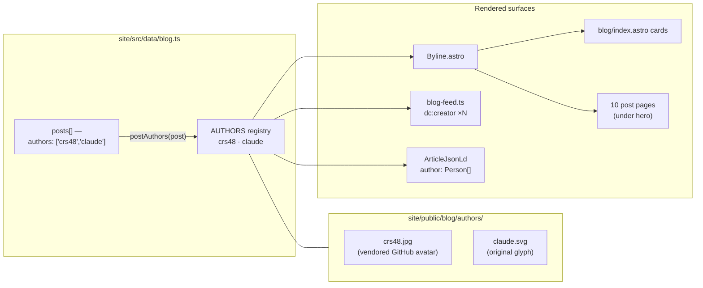
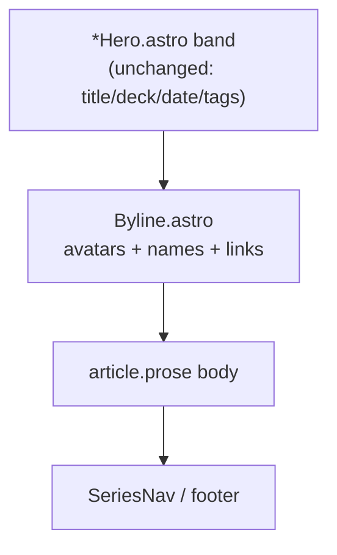

# Blog Post Author Bylines With Avatars

## Problem Statement

Every post on the xNet blog is currently credited to a single anonymous
string — `author: 'xNet'` — that is rendered **nowhere on the site**; it only
survives into the RSS feed's `<author>` element. The posts are in fact written
collaboratively by a human (GitHub: [`crs48`](https://github.com/crs48)) and an
AI agent (Claude, via Claude Code). We want each post to carry a real byline:

- **all** authors of the post, human and AI alike,
- each with a small avatar image,
- the human linked to their GitHub profile (`https://github.com/crs48`),
- Claude credited and linked as the AI co-author.

This is both a credit feature and an honesty feature: the blog repeatedly makes
transparency claims ("this page loads nothing third-party", "all artwork here
is original"), and openly disclosing AI co-authorship is the same posture
applied to the words themselves. It also front-runs labeling expectations that
are becoming table stakes (EU AI Act transparency obligations, platform
"Made with AI" labels).

## Executive Summary

The repo **already contains the exact pattern we need** — the changelog. Its
`ChangelogEntry.authors?: ChangelogContributor[]` field renders each
contributor as a GitHub avatar + profile link
(`site/src/pages/changelog/index.astro:158`). The blog should adopt the same
shape, with two deliberate deviations:

1. **A small author registry instead of freeform strings.** Blog authors are a
   closed set (today: `crs48` and `claude`), each with a display name, an
   optional link, and an avatar. Posts reference authors by id
   (`authors: ['crs48', 'claude']`), so the byline is single-sourced across the
   index page, the post heroes, the RSS feed, and (new) JSON-LD.
2. **Vendored, first-party avatars — not GitHub hotlinks.** Two published
   essays state _"this page loads nothing third-party"_
   (`site/src/pages/blog/hand-on-the-tiller.astro:377`,
   `site/src/pages/blog/the-right-to-say-no.astro:363`). Hotlinking
   `github.com/crs48.png` (as the changelog does) would silently falsify that
   claim. Instead, commit the avatar images under `site/public/blog/authors/`
   — a one-time copy of the GitHub avatar for the human, and an **original SVG
   glyph** for Claude (keeping the "all artwork here is original" claim intact
   and avoiding Anthropic trademark art).

A single new `Byline.astro` component renders the avatar stack + names +
links. It drops into the ten post pages beneath their hero bands (avoiding
surgery on ten bespoke `*Hero.astro` components) and into the blog index
cards. Estimated size: ~1 new component, ~40 lines of data-module change, ~12
small page edits, 2 image assets. Site-only — no publishable package touched,
so no changeset is required.

## Current State In The Repository

### The blog data module — `site/src/data/blog.ts`

- `BlogPost` has `author: string` (line 43, doc-commented "Display author");
  all ten posts hard-code `author: 'xNet'`.
- The blog is deliberately **not** a content collection: each post is a
  hand-authored, art-directed `.astro` page under `site/src/pages/blog/`, and
  `blog.ts` is the single source of metadata for the index page, the RSS feed,
  and each post page (which imports `postBySlug(slug)`).
- Helpers already exist for everything a byline needs to plug into:
  `publishedPosts()` (line 169), `postBySlug()` (line 200), `formatPostDate()`
  (line 205).

### Where `author` is (and isn't) rendered

- **RSS only**: `site/src/lib/blog-feed.ts:42` emits
  `<author>xNet</author>`. (Strictly, RSS 2.0's `<author>` is defined as an
  _email address_ — the current value is already non-conforming; the fix below
  moves to `dc:creator`, which is what every major feed does for names.)
- **Not** on the index cards (`site/src/pages/blog/index.astro:84-93` shows
  date · read-time · tags only).
- **Not** in the hero bands — each post has its own hero component
  (`WorkshopHero.astro`, `TillerHero.astro`, … ten in all under
  `site/src/components/blog/`) whose `Props` are
  `{ title, deck, date, readingMinutes, tags }`.
- **No structured data at all**: `site/src/layouts/Base.astro` emits only
  charset/viewport/description/favicon/title — no OpenGraph, no JSON-LD.

### The prior art we should copy — the changelog

`site/src/data/changelog.ts:70-96` defines:

```ts
/** A GitHub contributor shown on an entry (avatar + link, label is name||login). */
export interface ChangelogContributor {
  login: string
  name?: string
}
// on ChangelogEntry:
authors?: ChangelogContributor[]
/** @deprecated single primary author; superseded by `authors`. */
author?: ChangelogContributor
```

and `site/src/pages/changelog/index.astro:158-176` renders each contributor
as:

```astro
<a href={`https://github.com/${c.login}`} target="_blank" rel="noopener noreferrer">
  
  {c.name ?? c.login}
</a>
```

The changelog fragments confirm the real login in use is **`crs48`**
(lowercase) — matching the user's GitHub profile.

The changelog also models the migration idiom this repo prefers: add the
plural `authors`, keep the old field as a deprecated fallback during the
transition, render `authors?.length ? authors : [legacy]`.

### The constraint the changelog does NOT have

Blog essays make explicit first-party-only claims:

- `hand-on-the-tiller.astro:377` — _"All artwork here is original, and this
  page loads nothing third-party."_
- `the-right-to-say-no.astro:363` — _"…this page loads nothing third-party."_

(Exploration 0267 already tripped over this once, with the Mermaid CDN.) So on
**blog pages** the avatar `` must be served from `xnet.fyi` itself. The
changelog page makes no such claim, so its hotlinks can stay.

## External Research

- **Attribution conventions for AI co-authorship.** Claude Code's own default
  is the git trailer `Co-Authored-By: Claude <noreply@anthropic.com>`, which
  GitHub renders as a co-author chip — the closest existing "Claude in a
  byline" precedent ([Benjamin Lannon](https://lannonbr.com/blog/co-authored-by-claude/),
  [DeployHQ guide](https://www.deployhq.com/blog/how-to-use-git-with-claude-code-understanding-the-co-authored-by-attribution)).
  Some argue `Co-authored-by` overstates the machine's role and prefer a
  footer like _"Written in collaboration with Claude"_
  ([Bence Ferdinandy](https://bence.ferdinandy.com/2025/12/29/dont-abuse-co-authored-by-for-marking-ai-assistance/),
  [fabiorehm.com](https://fabiorehm.com/blog/2026/03/02/our-coding-agent-commits-deserve-better-than-co-authored-by/)).
  The byline label below ("with Claude" rather than an undifferentiated peer
  listing) threads that needle: full disclosure, honest framing.
- **Disclosure is trending mandatory.** Platform labels ("Made with AI") and
  the EU AI Act's transparency obligations (August 2026) push toward visible
  AI-assistance labels on published content. A byline that names Claude _is_
  the disclosure, integrated rather than bolted on.
- **Authorship semantics.** The US Copyright Office's position is that AI
  output is not independently copyrightable and an AI is not a legal author;
  crediting Claude in a byline is a transparency statement, not a rights
  claim ([overview](https://www.javieraguilar.ai/en/blog/claude-coauthor-legal-debate/)).
  Marking the AI author distinctly (an `ai: true` flag rendered as a small
  "AI" affordance or the "with" phrasing) keeps that distinction legible.
- **Multi-author blog mechanics.** Ghost/Medium-style platforms model exactly
  this shape: an author registry (name, avatar, URL) referenced by id from
  posts, rendered as an overlapping avatar stack. schema.org `Article.author`
  accepts an **array** of `Person` objects, each with `name`/`url` — Google's
  article structured-data docs explicitly recommend `author.url` pointing at a
  profile page (a GitHub profile qualifies).
- **GitHub avatar endpoints.** `https://github.com/<login>.png?size=N` is a
  stable redirect to `avatars.githubusercontent.com` — fine to _fetch once_
  and commit; hotlinking is what the third-party claim forbids on blog pages.
- **RSS.** RSS 2.0 `<author>` is specified as an email address; the
  conventional fix for names (and the only sane multi-author story) is
  `<dc:creator>` from the Dublin Core namespace — one element per author.

## Key Findings

1. **This is a small feature with existing in-repo precedent.** The changelog
   already ships avatar-and-link contributor chips keyed by GitHub login; the
   blog needs the same UI plus a registry indirection.
2. **The `author: string` field is dead weight today** — invisible on the
   site, non-conforming in RSS. Replacing it is a cleanup, not just an
   addition.
3. **Hotlinking GitHub avatars is off the table for blog pages** because of
   the published "nothing third-party" claims — avatars must be vendored
   first-party assets.
4. **Claude needs an avatar that we own.** Using Anthropic's logo raises
   trademark questions and would break "all artwork here is original". An
   original inline-SVG glyph (e.g. a spark/asterisk mark in the blog's
   existing palette, in the same hand-drawn spirit as the `*Art.astro`
   pieces) satisfies both.
5. **Heroes shouldn't each grow an `authors` prop.** There are ten bespoke
   `*Hero.astro` components; threading a new prop through all of them is
   10× the churn of dropping one shared `<Byline>` component into each post
   page directly under the hero (or at the top of the `<article>`).
6. **JSON-LD is the free upgrade.** Since we're introducing structured author
   data anyway, emitting an `Article` JSON-LD block per post (authors as
   `Person[]` with `url`) costs ~20 lines and makes the byline machine-
   readable for search engines.

## Options And Tradeoffs

### Option A — Copy the changelog verbatim (hotlinked GitHub avatars)

`authors: ChangelogContributor[]` on `BlogPost`, render
`github.com/<login>.png` chips.

- ✅ Smallest diff; perfectly consistent with the changelog page.
- ❌ **Violates the published "nothing third-party" claim** on blog pages.
- ❌ Claude has no GitHub user avatar we control; `claude[bot]`'s app avatar
  is still a third-party hotlink _and_ Anthropic's mark.
- Verdict: **rejected** — correctness of the site's own claims wins.

### Option B — Author registry + vendored first-party avatars (recommended)

A `BlogAuthor` registry in `blog.ts` (id, name, `href?`, `avatar` path,
`ai?: true`), posts declare `authors: BlogAuthorId[]`, one shared
`Byline.astro`, avatars committed under `site/public/blog/authors/`.

- ✅ Keeps every published transparency claim true.
- ✅ Single-sourced across index, post pages, RSS, JSON-LD (same design grain
  as `blog.ts` itself — "the data module is the single source of truth").
- ✅ Registry makes future authors (guest posts, another agent) one entry.
- ➖ Avatar is a snapshot; if the GitHub avatar changes, the site updates only
  when the committed file is refreshed. Acceptable for a two-author blog.
- ➖ Slightly more code than Option A (a registry + two assets).

### Option C — Migrate the blog to Astro content collections / MDX frontmatter

Model authors in `content.config.ts`, posts as content entries.

- ✅ "Standard" Astro blog architecture; typed frontmatter.
- ❌ The blog's architecture is a **deliberate decision** (documented at the
  top of `blog.ts`): art-directed `.astro` pages + a data module, matching
  `changelog.ts`/`surveillance.ts`. Rewriting ten art-directed pages to get a
  byline is wildly disproportionate.
- Verdict: rejected.

### Sub-decision — Claude's avatar & link

| Choice                                  | Avatar                                  | Link                             | Notes                                                                           |
| --------------------------------------- | --------------------------------------- | -------------------------------- | ------------------------------------------------------------------------------- |
| Anthropic logomark                      | ❌ trademark; breaks "artwork original" | —                                | rejected                                                                        |
| `claude[bot]` GitHub app avatar hotlink | ❌ third-party request                  | github.com/apps/claude           | rejected                                                                        |
| **Original SVG glyph (recommended)**    | ✅ ours, first-party                    | `https://claude.com/claude-code` | a small spark/starburst in the blog palette; honest, distinctive, legally clean |

### Sub-decision — byline phrasing

Render the human author(s) first, then the AI author with a visually distinct
treatment: `crs48 · with Claude`. The `ai: true` flag drives the "with"
separator (and an `AI` micro-badge if desired later). This presents
collaboration honestly without implying legal co-authorship — consistent with
the external debate above, and with how the essays already talk about
human-AI collaboration ("now that anyone can cook").

## Recommendation

**Option B.** Concretely:



Byline placement on a post page (no hero surgery):



Migration follows the changelog idiom: add `authors`, delete the dead
`author: string` in the same pass (it has no renderer to keep compatible —
only the RSS builder, which we're changing anyway).

## Example Code

`site/src/data/blog.ts` additions:

```ts
/** Registered blog authors; posts reference these by id. */
export type BlogAuthorId = 'crs48' | 'claude'

export interface BlogAuthor {
  id: BlogAuthorId
  /** Display name shown in the byline. */
  name: string
  /** Profile link (GitHub for humans; product page for AI agents). */
  href?: string
  /** First-party avatar path under site/public/ — never a hotlink (blog pages
   *  promise "nothing third-party"). */
  avatar: string
  /** Marks an AI co-author; drives the "with …" byline treatment. */
  ai?: boolean
}

export const AUTHORS: Record<BlogAuthorId, BlogAuthor> = {
  crs48: {
    id: 'crs48',
    name: 'crs48',
    href: 'https://github.com/crs48',
    avatar: '/blog/authors/crs48.jpg'
  },
  claude: {
    id: 'claude',
    name: 'Claude',
    href: 'https://claude.com/claude-code',
    avatar: '/blog/authors/claude.svg',
    ai: true
  }
}

// on BlogPost (replacing `author: string`):
/** Authors shown in the byline, humans first. */
authors: BlogAuthorId[]

/** Resolve a post's authors to full registry entries. */
export function postAuthors(post: BlogPost): BlogAuthor[] {
  return post.authors.map((id) => AUTHORS[id])
}
```

`site/src/components/blog/Byline.astro` (sketch):

```astro
---
import { postAuthors, type BlogPost } from '../../data/blog'
interface Props { post: BlogPost }
const authors = postAuthors(Astro.props.post)
---
<div class="flex items-center gap-2 text-sm text-gray-500 dark:text-gray-400">
  <span class="flex -space-x-2">
    {authors.map((a) => (
      
    ))}
  </span>
  {authors.map((a, i) => (
    <>
      {i > 0 && <span aria-hidden="true">{a.ai ? 'with' : '·'}</span>}
      <a href={a.href} target="_blank" rel="noopener noreferrer"
         class="font-medium hover:text-indigo-500">{a.name}</a>
    </>
  ))}
</div>
```

RSS (`site/src/lib/blog-feed.ts`) — declare the Dublin Core namespace on
`<rss>` and emit one creator per author:

```ts
// xmlns:dc="http://purl.org/dc/elements/1.1/" on the <rss> element
...postAuthors(post).map(
  (a) => `      <dc:creator>${escapeXml(a.name)}</dc:creator>`
)
```

JSON-LD on each post page (new tiny component or a slot in `Byline.astro`):

```ts
{
  '@context': 'https://schema.org',
  '@type': 'Article',
  headline: post.title,
  datePublished: post.pubDate,
  author: postAuthors(post).map((a) => ({
    '@type': 'Person',
    name: a.name,
    url: a.href
  }))
}
```

## Risks And Open Questions

- **Avatar staleness.** The vendored `crs48.jpg` is a snapshot of the GitHub
  avatar. Mitigation: it's one file to re-download; not worth automating for
  now.
- **Identity linkage.** The byline publicly ties the blog to the `crs48`
  GitHub account — already true via changelog contributor chips, so no new
  exposure, but worth stating.
- **Claude's schema.org type.** JSON-LD `Person` for an AI is arguably wrong;
  alternatives (`SoftwareApplication`) aren't recognized by Google's article
  author guidance. Pragmatic call: `Person` with a clarifying `url`. Low
  stakes; revisit if rich-result linting complains.
- **Hero contrast.** The byline sits below dark art-directed hero bands on
  some posts and light surfaces on others; the component uses neutral
  body-surface colours (it lives _below_ the band, not on it), so one style
  should fit all ten pages — verify visually on 2–3 posts.
- **Changelog divergence.** After this, the changelog hotlinks GitHub avatars
  while the blog vendors them. Acceptable (different claims on different
  pages), but if we ever add a "nothing third-party" footer site-wide, the
  changelog needs the same vendoring treatment.
- **Back-dating.** Do all ten existing posts get `authors: ['crs48','claude']`?
  Recommendation: yes — they were all written the same way, and uniform
  bylines avoid implying earlier posts were human-only.

## Implementation Checklist

- [x] Add `BlogAuthorId`, `BlogAuthor`, `AUTHORS`, `postAuthors()` to
      `site/src/data/blog.ts`; replace `author: string` with
      `authors: BlogAuthorId[]` on `BlogPost` and set
      `authors: ['crs48', 'claude']` on all ten posts.
- [x] Vendor avatars: download `https://github.com/crs48.png?size=96` →
      `site/public/blog/authors/crs48.jpg`; design an original Claude glyph →
      `site/public/blog/authors/claude.svg`.
- [x] Create `site/src/components/blog/Byline.astro` (avatar stack + linked
      names, "with" separator before AI authors).
- [x] Insert `<Byline post={post} />` in each of the ten post pages, directly
      below the hero band / at the top of the article container.
- [x] Add the byline (compact variant) to the index cards in
      `site/src/pages/blog/index.astro`.
- [ ] Update `site/src/lib/blog-feed.ts`: add `xmlns:dc` to `<rss>`, replace
      `<author>` with per-author `<dc:creator>`.
- [x] Emit `Article` JSON-LD with the author array on each post page (via
      `Byline.astro` or a sibling `ArticleJsonLd.astro`).
- [ ] Sweep for any remaining `post.author` references (`tsc` will catch
      them once the field is renamed).
- [ ] Commit (`feat(site): add author bylines with avatars to blog posts`) —
      site-only, so an empty changeset if the Stop hook demands one.

## Validation Checklist

- [ ] `pnpm --filter site build` (or the site's build task) passes with the
      renamed field — no lingering `post.author` usages.
- [ ] Blog index cards and all ten post pages show the byline with both
      avatars; links open `https://github.com/crs48` and the Claude page.
- [ ] DevTools network panel on `hand-on-the-tiller` and
      `the-right-to-say-no` shows **zero third-party requests** — avatars
      served from the site origin.
- [ ] `/blog/rss.xml` validates (W3C feed validator) with `dc:creator`
      entries for both authors on every item.
- [ ] Google Rich Results test parses the `Article` JSON-LD and lists both
      authors.
- [ ] Byline renders legibly in both light and dark mode on at least one
      dark-hero and one light-hero post.

## References

- `site/src/data/blog.ts` — blog metadata single source (exploration 0239)
- `site/src/data/changelog.ts:70-96`, `site/src/pages/changelog/index.astro:158-176`
  — in-repo contributor avatar/link prior art (login `crs48`)
- `site/src/lib/blog-feed.ts` — RSS builder to migrate to `dc:creator`
- `site/src/pages/blog/hand-on-the-tiller.astro:377`,
  `site/src/pages/blog/the-right-to-say-no.astro:363` — "nothing third-party"
  claims constraining avatar sourcing
- ["Co-Authored-By: Claude" is fine — Benjamin Lannon](https://lannonbr.com/blog/co-authored-by-claude/)
- [Don't abuse Co-authored-by for marking AI assistance — Bence Ferdinandy](https://bence.ferdinandy.com/2025/12/29/dont-abuse-co-authored-by-for-marking-ai-assistance/)
- [Our coding agent commits deserve better than Co-Authored-By — fabiorehm.com](https://fabiorehm.com/blog/2026/03/02/our-coding-agent-commits-deserve-better-than-co-authored-by/)
- [How to use git with Claude Code / co-author attribution — DeployHQ](https://www.deployhq.com/blog/how-to-use-git-with-claude-code-understanding-the-co-authored-by-attribution)
- [Is Claude a Co-Author? The legal debate — Javier Aguilar](https://www.javieraguilar.ai/en/blog/claude-coauthor-legal-debate/)
