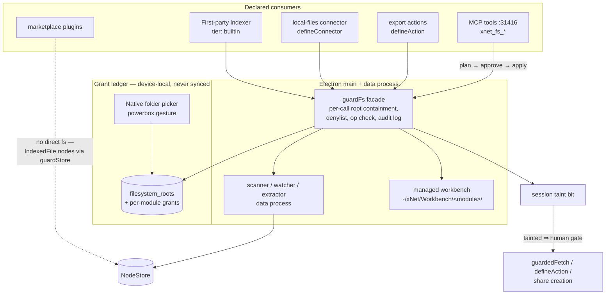
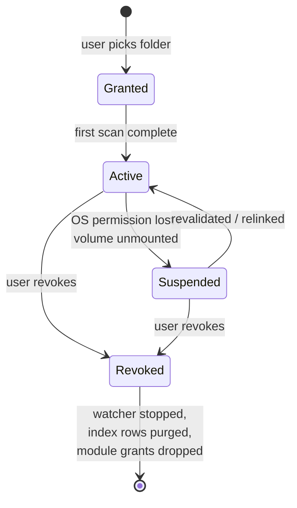

# 0270 - Desktop Filesystem As A Governed Capability

## Problem Statement

What becomes possible if the xNet desktop app can see and touch the user's
file system — and how do we do that without betraying the platform's core
promise ("your data is yours, we can't read it") or turning the workspace
into a prompt-injection-powered exfiltration machine?

Two distinct opportunities hide in the question:

1. **Loading the brain.** The user's real life lives in folders: contracts,
   tax PDFs, screenshots, research papers, repos, exports from every silo.
   If xNet can index granted folders, the "digital brain" stops being only
   what the user manually pastes in and starts being an ambient map of what
   they actually have.
2. **Doing the work.** xNet is growing hands — plugins (0189/0192),
   connectors (0196), outbound actions (0213), in-app AI (0192/0208), and
   the agent bridge that drives the user's own Claude Code/Codex (0194).
   Today those hands can only touch nodes. With a filesystem capability
   they could compose real documents, synthesize analysis across local
   sources, materialize databases as CSVs, maintain a folder of living
   reports — actual artifacts in the user's world, not just in ours.

The user's framing is right about the platform split: this is a
**desktop (Electron) capability**. The browser can approximate a slice of
it on Chromium only; Safari/Firefox get none of it beyond OPFS.

Exploration [0127](0127_[_]_XNET_FILESYSTEM_INTEGRATION_AND_GLOBAL_FILE_NAMESPACE.md)
already designed the *ingestion* half in depth (integration modes A–E,
IndexedFolder/IndexedFile schemas, scanner/watcher pipelines, managed
folder, availability states). It remains unimplemented and remains the
reference design for indexing. What 0127 could **not** design — because the
machinery didn't exist yet — is the *actor* half: how plugins, connectors,
actions, and agents get filesystem powers safely. Since 0127 we shipped the
trust fabric (provenance-derived tiers, `packages/trust`), the FeatureModule
capability manifest + hub secret broker (0189), `guardStore`/`guardedFetch`
(0192), `defineConnector`/`defineAction` (0196/0213), and the MCP server on
`:31416` (0194). This exploration slots the filesystem into that fabric as
one more brokered capability — and works through the security model that
makes it survivable.

## Executive Summary

- **Treat the filesystem exactly like secrets and network: a declared,
  brokered, never-ambient capability.** Plugins declare
  `capabilities.filesystem`; the user maps *specific granted roots* to
  *specific plugins*; enforcement lives in the Electron main/data processes
  behind a `guardFs` facade that mirrors `guardStore`/`guardedFetch`.
  Renderer and plugin code never see absolute paths or file descriptors —
  only opaque root/file IDs and per-call-validated operations.
- **Read and write are different products.** Read = indexing granted roots
  (0127's design, unchanged). Write lands in three progressively-trusted
  forms: (1) a **managed workbench folder** (`~/xNet/…`) that xNet owns and
  plugins write into freely within their own subdirectory; (2) **save-as
  dialogs**, where the OS picker gesture *is* the grant (the macOS powerbox
  model); (3) in-place edits of user files — deferred, requires per-file
  approval with diff preview, and only via the agent plan/apply pattern.
- **Trust tiers map cleanly:** `builtin` modules may implement the scanner
  itself; `user`-tier (authored/AI-generated) plugins may *request* fs
  capability and get per-root consent; `marketplace`-tier plugins get **no
  direct fs access at all** in v1 — they consume indexed nodes through the
  existing `guardStore` surface, which is already scoped and audited.
- **Agents get filesystem tools through the existing `:31416` MCP server**
  (`xnet_fs_search`, `xnet_fs_read`, `xnet_fs_plan_write` →
  `xnet_fs_apply_write`), reusing the plan→approve→apply pattern that
  `xnet_plan_page_patch` established. The **lethal-trifecta rule** is the
  load-bearing safety property: a session that has read local file content
  is *tainted*, and tainted sessions cannot trigger outbound network
  actions (webhooks, `defineAction` dispatches, share links) without
  explicit human approval.
- **Web is not zero, but it is not this.** Chromium's File System Access
  API can power a "lite" folder grant (picker + persisted permission), but
  there are no background watchers, no access without an open tab, and no
  Safari/Firefox support. Design the capability schema so a Chromium-lite
  adapter can implement a subset later; build the real thing on Electron.
- Recommended path: land 0127's Phase 1 (read-only indexing, local-only
  tables) **plus** the capability plumbing (`ModuleCapabilities.filesystem`,
  `guardFs`, consent UI) **plus** the managed workbench write target and
  the four MCP tools. That combination is the smallest thing that delivers
  both halves of the vision — brain-loading *and* work-doing — behind one
  security model.

## Current State In The Repository

What exists today, verified against the tree (2026-07-05):

### Electron shell — hardened, and that's the point

- [apps/electron/src/main/index.ts](../../apps/electron/src/main/index.ts)
  creates the window with `sandbox: true`, `contextIsolation: true`,
  `nodeIntegration: false`. The renderer is a proper sandbox; **all fs
  work must live in main/data processes behind typed IPC.** This matches
  current Electron guidance and is the baseline we must not weaken.
- [apps/electron/src/preload/index.ts](../../apps/electron/src/preload/index.ts)
  exposes a narrow `window.xnet` bridge via `contextBridge` (profile, seed,
  menu events, share payloads, deep links). No fs APIs today — but the
  one-method-per-message pattern is the correct vector for `xnet:fs:*`.
- [apps/electron/src/data-process/data-service.ts](../../apps/electron/src/data-process/data-service.ts)
  is a Node utility process that already owns SQLite
  (`better-sqlite3` via `@xnetjs/sqlite/electron`), the Yjs pool, and blob
  sync — the natural home for a scanner/watcher/extractor, off the main
  process.
- [apps/electron/src/main/cloudflare-tunnel-manager.ts](../../apps/electron/src/main/cloudflare-tunnel-manager.ts)
  spawns and supervises `cloudflared` — precedent for subprocess lifecycle.
  [apps/electron/src/main/agent-bridge-manager.ts](../../apps/electron/src/main/agent-bridge-manager.ts)
  exists but is not fully wired.
- The local API already serves the workspace over loopback (`:31415`), and
  the MCP HTTP transport defaults to `:31416` with pairing token + Origin
  allowlist ([packages/plugins/src/services/mcp-http.ts](../../packages/plugins/src/services/mcp-http.ts)).

### Trust and capability fabric — the slot the filesystem fits into

- [packages/trust/src/index.ts](../../packages/trust/src/index.ts):
  `deriveTrustTier`, `requiresCapabilityReprompt`, `sandboxForTier`. Tiers
  are **provenance-derived, never self-declared**, and re-derived on sync.
- [packages/plugins/src/feature-module.ts](../../packages/plugins/src/feature-module.ts):
  `FeatureModule.capabilities` today declares `secrets`, `schemaWrite`,
  `schemaRead`, `network`, `endowments`. A `filesystem` entry is the
  obvious sixth member.
- [packages/hub/src/features/broker.ts](../../packages/hub/src/features/broker.ts):
  `scopedEnv(moduleId, declaredKeys)` — the enforcement pattern to copy: a
  module physically cannot read what it didn't declare.
- `guardedFetch` (network allowlist + SSRF guard via `assertPublicUrl`) and
  `guardStore` (schema-scoped writes, space-stamped) already wrap every
  connector sync in
  [packages/plugins/src/connectors/sync-runner.ts](../../packages/plugins/src/connectors/sync-runner.ts).
- Widget sandbox tiers are live in production
  ([packages/dashboard/src/sandbox/](../../packages/dashboard/src/sandbox/)):
  first-party in host realm, user tier in SES Compartment (console/JSON/Math
  endowments only), marketplace tier in an opaque-origin iframe.

### Actors that would consume the capability

- Connectors: [packages/plugins/src/connectors/define-connector.ts](../../packages/plugins/src/connectors/define-connector.ts)
  (GitHub/Slack/Unreal in production) — the template for a `local-files`
  connector that pulls an indexed root into nodes.
- Outbound actions: [packages/plugins/src/actions/define-action.ts](../../packages/plugins/src/actions/define-action.ts)
  — trigger-on-schema-change + declared network/secrets; the template for
  "materialize this page to a file on change".
- Agent surface: [packages/plugins/src/services/mcp-server.ts](../../packages/plugins/src/services/mcp-server.ts)
  already exposes `xnet_search`, `xnet_read_page_markdown`,
  `xnet_plan_page_patch` → `xnet_apply_page_markdown` (plan/approve/apply),
  plus [packages/devkit/src/agent.ts](../../packages/devkit/src/agent.ts)
  which spawns the user's own `claude`/`codex` CLI (0194 — never proxies
  their subscription token).

### Data model — close but not sufficient

- `FileRef` ([packages/data/src/schema/properties/file.ts](../../packages/data/src/schema/properties/file.ts))
  is content-addressed (`cid`, `name`, `mimeType`, `size`) and assumes
  bytes were *captured into* the blob store
  ([packages/storage/src/blob-store.ts](../../packages/storage/src/blob-store.ts)).
  There is no path-backed reference type; 0127's
  IndexedFolder/IndexedFile/FileIdentity/FileSnapshot schemas fill that gap.
- Import today = social archive importers
  ([packages/social/src/importers/registry.ts](../../packages/social/src/importers/registry.ts)),
  drag-drop onto canvas (capture, no indexing), JSON/CSV into databases.
  No folder import, no watcher, no export-to-folder.

### Guardrails that constrain the design

- Humane charter (0234) and consent spine (0210): consent-first,
  progressive tiers, failure visible, right to leave. Local paths are
  PII-grade; 0127 already concluded **absolute paths never sync** by
  default.
- Authorization coverage: every new schema must declare authorization
  (usually `spaceCascadeAuthorization()`) or the coverage test fails; the
  devtools seed coverage test will also demand seeded nodes for any new
  registered schema (see `packages/devtools/src/seed/README.md`).

## External Research

### Electron security baseline

The current [Electron security guidance](https://www.electronjs.org/docs/latest/tutorial/security)
is unambiguous: `sandbox: true` + `contextIsolation: true` +
`nodeIntegration: false`, one IPC method per message, validate
`event.senderFrame` on every handler, serve app content from a custom
protocol rather than `file://`. xNet already complies. The consequence for
this design: **the renderer must never gain a general fs API** — not even a
"safe" one — because a compromised renderer is the attack we're budgeting
for. Everything routes through main/data-process handlers that validate
per call. See also [Bishop Fox's "Reasonably Secure Electron"](https://bishopfox.com/blog/reasonably-secure-electron)
on treating the renderer as hostile.

### Tauri's three-tier ACL — the design benchmark

[Tauri v2's security model](https://v2.tauri.app/security/permissions/) is
the strongest prior art for *shape*: **permissions** (on/off per command) ×
**scopes** (parameter validators — glob path allowlists/denylists) ×
**capabilities** (permission+scope sets attached to specific windows). Its
[fs plugin](https://v2.tauri.app/plugin/file-system/) ships glob-scoped
path allow/deny lists per capability. We are not migrating to Tauri, but
`ModuleCapabilities.filesystem` should reproduce this triple: *which
operations* (read/write/watch) × *which scope* (granted root IDs, not
globs — coarser and more legible to users) × *which consumer* (module ID,
enforced by the broker).

### Browser reality — the user's instinct, quantified

The [File System Access API](https://developer.chrome.com/docs/capabilities/web-apis/file-system-access)
(`showDirectoryPicker` + persistable permissions) works in **Chromium
only** (Chrome/Edge 86+). [Firefox and Safari ship only OPFS](https://caniuse.com/native-filesystem-api)
— the private origin filesystem xNet already uses for SQLite. Even on
Chromium: no background access (a tab must be open), permission prompts
re-arm aggressively, no watcher API (polling only), and directory handles
live in IndexedDB per origin. So: a **Chromium-lite adapter** (manual
"re-sync this folder" against a persisted handle) is feasible later; the
ambient, watched, agent-accessible filesystem is desktop-only. Mobile
(0238 Capacitor shell) is a further-degraded tier: document-picker imports
only.

### macOS sandbox & security-scoped bookmarks

If xNet ever ships via the Mac App Store, folder grants must persist as
[security-scoped bookmarks](https://developer.apple.com/documentation/security/accessing-files-from-the-macos-app-sandbox)
(Electron: `app.startAccessingSecurityScopedResource`). The **powerbox
pattern** — the OS file dialog *is* the permission grant — is worth adopting
as UX philosophy even outside the MAS sandbox: a user gesture through a
native picker is the least-ambiguous consent primitive we have. Note
[CVE-2025-31191](https://www.microsoft.com/en-us/security/blog/2025/05/01/analyzing-cve-2025-31191-a-macos-security-scoped-bookmarks-based-sandbox-escape/):
bookmark stores themselves are attack surface — treat the grant ledger as
security-critical state (integrity-protect it; it already must be
device-local).

### The lethal trifecta — the defining threat

[Simon Willison's "lethal trifecta"](https://simonwillison.net/2025/Jun/16/the-lethal-trifecta/):
an agent with (1) access to private data, (2) exposure to untrusted
content, and (3) the ability to communicate externally is structurally
vulnerable to prompt-injection exfiltration — real incidents exist (GitLab
Duo, Writer.com). **A filesystem capability hands xNet's agents legs (1)
and (2) at once**: local files are both maximally private *and* untrusted
content (a downloaded PDF can carry adversarial instructions). xNet already
has leg (3): `defineAction` dispatches, webhooks, share links, managed AI
egress. The mitigation with industry consensus is **taint tracking + policy
gating**: once a session ingests untrusted/private content, block or
human-gate every externally-communicating action. This must be a first-class
invariant of the design, not a docs footnote.

### The vault/sidecar pattern

The Obsidian ecosystem converged on the shape we want for "loading the
brain": plaintext files stay where they are; a **local sidecar index**
(SQLite + FTS + local embeddings) provides retrieval; agents reach it
through [MCP servers over the vault](https://www.rodneydyer.com/your-vault-your-vectors-building-a-local-first-mcp-server-for-obsidian/),
and Claude Desktop's filesystem extension prompts the user to select which
folders are reachable. xNet's version is strictly stronger: the index lives
beside a real node graph, and access is brokered per-plugin rather than
app-global.

## Key Findings

1. **Every piece of enforcement machinery already exists; only the
   capability itself is missing.** The broker pattern (`scopedEnv`), the
   guard pattern (`guardStore`/`guardedFetch`), provenance-derived tiers,
   consent UX (`requiresCapabilityReprompt`), the sandboxed renderer, the
   Node-side data process, and the agent plan/apply loop are all shipped.
   Adding `filesystem` is additive, not architectural.
2. **The renderer-blindness rule from 0127 generalizes to plugins.** 0127
   said the renderer sees opaque root/file IDs, never paths. The same must
   hold for plugin code *wherever it runs* — even hub-side. A plugin gets a
   `ctx.fs` facade whose every call is validated against its granted roots
   in the main/data process; it never receives a path string it could
   smuggle into another channel. Paths are display-time data, resolved by
   trusted code only.
3. **Write access is where the products live and where the risk lives.**
   Reading powers search and context. Writing powers the actual "do work
   for me" promise: compose a report, maintain an exported folder, build an
   analysis artifact. The managed workbench folder makes writing *safe by
   construction* (xNet owns the directory; nothing pre-existing can be
   destroyed) and covers ~80% of the value. In-place edits to arbitrary
   user files are the last 20% and can wait indefinitely.
4. **Marketplace-tier plugins never need raw fs.** Their legitimate use
   cases (visualize my files, summarize a folder) are served by reading
   IndexedFile *nodes* through `guardStore` — already scoped, already
   audited, no new surface. This single decision removes the scariest cell
   of the threat matrix (untrusted third-party code × user filesystem).
5. **The trifecta taint gate is cheap to build here** because all three
   legs already flow through choke points we own: fs reads through
   `guardFs`, untrusted content through extraction, and egress through
   `guardedFetch`/`defineAction`/share creation. A session-scoped taint bit
   checked at the egress choke points is a small patch with an outsized
   safety payoff.
6. **Web support is a scoping decision, not an engineering decision.**
   Define `FsBackend` as an interface; Electron implements all of it,
   Chromium-web implements picker+enumerate+read (no watch, no background),
   Safari/Firefox/mobile implement none of it. Features detect the backend
   capability level exactly the way `detectOpfsCapability` (0238) does.

## Options And Tradeoffs

### Option A — Capture-only (status quo plus)

Drag files in; bytes copy into the blob store; no paths, no index, no
watcher.

- ✅ Zero new attack surface; works in every browser.
- ❌ The brain only knows what's manually fed; no "do work in my world"
  story at all; files go stale the moment they're copied.
- Verdict: this is today. Insufficient for the vision.

### Option B — App-global folder access (the Claude Desktop / Obsidian model)

User grants folders to *the app*; everything inside the app (plugins,
agents, search) can read them.

- ✅ Simple mental model; one consent moment; fastest to ship.
- ❌ Violates xNet's own plugin-trust architecture: a marketplace widget
  and the built-in search would have identical reach. One over-permissive
  grant exposes everything to everything. Doesn't compose with tiers.
- Verdict: right for single-vendor apps, wrong for a platform whose whole
  pitch is governed extensibility.

### Option C — Per-plugin brokered capability (Tauri-shaped)

Grants attach to the *workspace* (roots ledger), but each consumer
(plugin/connector/action/agent tool) must declare `filesystem` and be
mapped to a subset of roots + operations by the user. Enforcement in
main/data process via `guardFs`.

- ✅ Composes with the existing trust fabric; least-privilege by default;
  legible consent ("Let *Tax Helper* read *~/Documents/Taxes*"); audit log
  per module; marketplace tier excludable wholesale.
- ❌ More plumbing (capability type, consent UI, per-call validation);
  consent fatigue risk if scopes are too granular (mitigate: root-level
  grants, not per-file).
- Verdict: **recommended.** The extra plumbing is one new guard in an
  established pattern.

### Option D — Agent-only filesystem (everything through the bridge)

No plugin capability at all; only the `:31416` MCP tools touch files, with
per-action approval.

- ✅ Smallest surface; human-in-the-loop on everything.
- ❌ No ambient indexing (search over your files needs a first-party
  scanner anyway), no connector/action automation ("export on change"
  requires a human click every time). Approval fatigue guarantees users
  rubber-stamp.
- Verdict: right as the *agent* slice of Option C, wrong as the whole.

### Where should filesystem code run?

| Host | Role | Rationale |
| --- | --- | --- |
| Electron **main** | Dialogs, grant ledger, `shell.openPath`/reveal, IPC validation | Only place with native dialog + shell access; keep it thin |
| Electron **data process** | Scanner, watcher, hashing, extraction, FTS writes, `guardFs` execution | Already owns SQLite; crashes don't take the UI; malicious-file parsing stays out of main |
| **Renderer** | UI only; opaque IDs | Sandboxed; must stay blind to paths |
| **Hub (local API / :31416)** | `xnet_fs_*` tools, connector `ctx.fs` | Reuses pairing-token + Origin allowlist; agents already live here |

## Recommendation

Adopt **Option C** with the agent slice of Option D, in this shape:



### The five pillars

1. **One grant ledger, workspace-level, device-local.** Roots are granted
   through the native picker into `filesystem_roots` (local SQLite table
   per 0127 — absolute paths never become node properties, never sync).
   On MAS builds the ledger stores security-scoped bookmarks.
2. **`capabilities.filesystem` on `FeatureModule`,** brokered like
   secrets: declaring it is necessary but not sufficient; the user maps
   granted roots (and `read` | `write` | `watch` ops) to the module at
   install/consent time. `deriveTrustTier` gates eligibility —
   `marketplace` tier is ineligible in v1.
3. **`guardFs`,** the third guard beside `guardStore`/`guardedFetch`:
   resolves opaque IDs to paths, enforces root containment (after
   `realpath` — symlinks are the classic escape), applies the default
   denylist (`.env`, key material, browser profiles, `.git` internals),
   enforces size/time budgets, and appends to a per-module audit log the
   user can inspect.
4. **Write targets in order of trust:** managed workbench subdirectory per
   module (free within it, atomic writes, trash-don't-delete) → save-as
   picker (gesture = grant) → in-place edits (deferred; plan/apply with
   diff preview only).
5. **Trifecta taint gate:** `guardFs.read*` sets a session taint;
   `guardedFetch`, `defineAction.dispatch`, and share-link creation check
   it and require explicit approval when tainted. Approval clears per
   destination, not globally.

### Grant and use, end to end

```mermaid
sequenceDiagram
    participant U as User
    participant R as Renderer (sandboxed)
    participant M as Main process
    participant D as Data process
    participant P as Plugin (tier: user)

    P->>R: manifest declares filesystem: {ops: [read]}
    R->>U: consent sheet — "Tax Helper wants to read a folder you choose"
    U->>M: xnet:fs:chooseFolder (native picker)
    M->>M: ledger.addRoot(path) → rootId; grant(moduleId, rootId, read)
    M-->>R: rootId (opaque)
    P->>D: ctx.fs.list(rootId) / ctx.fs.readText(fileId)
    D->>D: guardFs: module grant? root containment? denylist? budget?
    D-->>P: entries / bounded text
    D->>D: audit log += (module, op, fileId, ts)
    Note over D: taint(session) = true on content read
```

### Root lifecycle



### What this unlocks (the possibility half)

- **Search that knows your life:** FTS over extracted text of granted
  folders beside pages/tasks/messages; file cards on canvas with live
  availability (0127 UX, unchanged).
- **A workspace that produces artifacts:** "summarize these 40 PDFs into a
  memo" writes `memo.md` into the workbench where Finder, Word, and email
  can reach it; a database view exports itself to `~/xNet/Workbench/crm/contacts.csv`
  on every change via `defineAction`.
- **Agents with context and hands:** the bridge agent (0194) can already
  edit pages with approval; with `xnet_fs_*` it can *ground* its work in
  local sources and *deliver* results as files — the home-cooked-software
  story from blog #10 with real I/O.
- **Local-first AI grounding:** granted folders + local index + (optional)
  local models (0252) = ask questions over your documents with zero cloud
  upload — a differentiator the hosted competitors structurally cannot copy.

## Example Code

### Capability declaration and guard

```typescript
// packages/plugins/src/feature-module.ts (extension)
export interface FilesystemCapability {
  /** Operations the module may perform on user-granted roots. */
  ops: Array<'read' | 'write' | 'watch'>
  /** Module always gets its own workbench dir; set false to opt out. */
  workbench?: boolean
}

export interface ModuleCapabilities {
  secrets?: string[]
  schemaWrite?: SchemaIRI[]
  schemaRead?: SchemaIRI[]
  network?: string[]
  endowments?: string[]
  filesystem?: FilesystemCapability   // NEW — consent maps roots at install
}
```

```typescript
// packages/plugins/src/fs/guard-fs.ts (new, mirrors guardStore/guardedFetch)
export interface GuardedFs {
  list(rootId: RootId, opts?: { under?: FileId }): Promise<FsEntry[]>
  stat(fileId: FileId): Promise<FsStat>
  readText(fileId: FileId, opts?: { maxBytes?: number }): Promise<string>
  readBlob(fileId: FileId): Promise<Uint8Array>          // budget-capped
  workbench(): Promise<WorkbenchDir>                     // module-scoped dir
  writeWorkbench(rel: string, data: Uint8Array | string): Promise<FileId>
  saveAs(suggested: string, data: Uint8Array): Promise<FileId | null> // native picker
  watch(rootId: RootId, cb: (ev: FsEvent) => void): Unsubscribe
}

export function guardFs(moduleId: string, deps: GuardFsDeps): GuardedFs {
  const assertGrant = (rootId: RootId, op: FsOp) => {
    if (!deps.ledger.hasGrant(moduleId, rootId, op)) {
      throw new FsCapabilityError(moduleId, rootId, op)
    }
  }
  const resolveContained = async (fileId: FileId) => {
    const { rootId, absPath } = await deps.ledger.resolve(fileId)
    const real = await fs.realpath(absPath)              // symlink escape check
    if (!real.startsWith(deps.ledger.rootRealPath(rootId) + sep)) {
      throw new FsContainmentError(fileId)
    }
    if (deps.denylist.matches(real)) throw new FsDenylistError(fileId)
    return { rootId, real }
  }
  return {
    async readText(fileId, opts) {
      const { rootId, real } = await resolveContained(fileId)
      assertGrant(rootId, 'read')
      deps.audit.log(moduleId, 'readText', fileId)
      deps.taint.mark(deps.session)                      // trifecta leg 1+2
      return deps.io.readTextBounded(real, opts?.maxBytes ?? MAX_EXTRACT_BYTES)
    },
    // …list/stat/readBlob analogous; write ops route to workbench/saveAs only
  }
}
```

### Egress taint gate

```typescript
// packages/plugins/src/actions/define-action.ts (dispatch wrapper, sketch)
async function dispatchWithTrifectaGate(action, event, ctx) {
  if (ctx.taint.isTainted(ctx.session) && !ctx.approvals.has(action.id, event.destination)) {
    await ctx.approvals.request({
      kind: 'tainted-egress',
      module: action.id,
      destination: event.destination,
      summary: 'This session read local files; approve sending data externally.',
    })                                                   // throws if declined
  }
  return action.dispatch(event, ctx)
}
```

### Agent tools (MCP, `:31416`)

```typescript
// packages/plugins/src/services/mcp-server.ts (additions)
xnet_fs_search   // FTS over indexed roots → fileIds + snippets (no paths)
xnet_fs_read     // fileId → bounded text; marks session tainted
xnet_fs_plan_write  // proposed path-in-workbench|saveAs + content → planId + diff
xnet_fs_apply_write // planId → executes after user approval in panel
```

## Risks And Open Questions

- **Prompt-injection residue.** The taint gate covers egress choke points
  we control, but page content synced to collaborators is itself an egress
  path (agent reads hostile PDF → writes "summary" containing exfiltrated
  secrets into a shared page). Mitigation candidates: taint-labelled node
  writes, share-time warnings when tainted-session writes are included.
  Needs its own design pass before agents get `xnet_fs_read` + shared
  spaces simultaneously.
- **Consent fatigue vs. legibility.** Root-level grants keep dialogs rare,
  but "read everything under ~/Documents" is a big grant. The privacy
  preview (0127's settings design) and the per-module audit log are the
  honesty mechanisms — both must ship in v1, not later.
- **Denylist is heuristic.** Secret scanners miss things; users will grant
  folders containing credentials. Extraction-time entropy/secret scanning
  (gitleaks-style patterns) should quarantine hits from FTS and from
  `readText`, with a visible "3 files excluded" indicator.
- **Watcher scale and battery.** 0127's budgets (depth/file caps, backoff,
  pause) are necessary; Chokidar vs native FSEvents/RDCW needs a spike on
  a 500k-file root. The cold-open lesson (0249: `requestIdleCallback` ≠
  worker-idle) applies to scan scheduling in the data process.
- **MAS distribution.** Security-scoped bookmarks change grant-ledger
  persistence and add entitlements; current non-MAS distribution avoids
  this, but the ledger API should abstract it now
  (`ledger.persistGrant` / `ledger.reacquire`).
- **Multi-device semantics.** IndexedFile nodes syncing (metadata-only) to
  a device that lacks the root creates "ghost" files. 0127's availability
  states cover display; grants themselves must remain per-device. Do we
  sync *that a root exists* (name only) for continuity, or nothing? Leaning
  nothing until a concrete need appears.
- **Do marketplace plugins ever get fs?** Possible future: a
  `filesystem:workbench-only` tier (own sandbox dir, no user roots) — safe
  enough in principle, but defer until demand exists.
- **Web-lite adapter demand.** Chromium-only folder grants may be more
  confusion than value ("why does it work on my laptop Chrome but not
  Safari?"). Ship desktop first; decide with usage data.

## Implementation Checklist

Phase 1 — grant ledger + read capability + first-party indexing
(supersedes 0127 Phase 1 by adding the capability plumbing):

- [ ] `filesystem_roots` / `filesystem_entries` / `filesystem_jobs` local
      SQLite tables in the data process (local-only, never synced)
- [ ] Grant ledger in main process: add/list/revoke roots, per-module
      grants, opaque `rootId`/`fileId` minting; `xnet:fs:chooseFolder`,
      `xnet:fs:listRoots`, `xnet:fs:revokeRoot` IPC with sender validation
- [ ] Scanner + extractor in data process (ignore rules, bounded text for
      md/txt/json/csv/pdf-text, BLAKE3 fingerprints, FTS table); no watcher
      yet — manual rescan
- [ ] Secret-scanning quarantine at extraction (pattern pass; quarantined
      files visibly counted, excluded from FTS and `readText`)
- [ ] `capabilities.filesystem` on `FeatureModule` + trust-tier
      eligibility check (`marketplace` ineligible) + consent sheet mapping
      roots→module
- [ ] `guardFs` facade (containment via realpath, denylist, budgets,
      audit log) wired into connector/action contexts beside
      `guardedFetch`/`guardStore`
- [ ] Settings → Files UI: roots list, per-module grants, audit log
      viewer, revoke-and-purge
- [ ] Search integration: indexed-file results + file card (open/reveal
      via `xnet:fs:openFile(fileId)` validated in main)

Phase 2 — write targets + agent tools:

- [ ] Managed workbench `~/xNet/Workbench/<module>/` (atomic writes,
      trash-don't-delete, reveal action)
- [ ] `saveAs` powerbox flow (native save dialog = grant)
- [ ] `defineAction` export template: page→md / database→csv
      materialization on change
- [ ] MCP tools `xnet_fs_search` / `xnet_fs_read` /
      `xnet_fs_plan_write` / `xnet_fs_apply_write` with panel approval UI
- [ ] Session taint bit + egress gate in `guardedFetch`, action dispatch,
      and share creation
- [ ] IndexedFolder/IndexedFile schemas (0127 shapes) for user-promoted
      files only, with `spaceCascadeAuthorization()` + seed coverage
      (Tier-1 seeder or exclusion per `seed-manifest.ts`)

Phase 3 — ambient + polish (demand-gated):

- [ ] Watcher (Chokidar spike vs native; budgets, pause, overflow
      recovery)
- [ ] Local-files `defineConnector` (cadence-based pull of a root into
      nodes)
- [ ] Chromium web-lite `FsBackend` (picker + persisted handle + manual
      resync); capability detection mirrors `detectOpfsCapability`
- [ ] Security-scoped-bookmark ledger backend behind `ledger.persistGrant`
- [ ] In-place edit design pass (diff-preview plan/apply on user files)

## Validation Checklist

- [ ] Renderer cannot obtain an absolute path via any `xnet:fs:*` IPC
      (fuzz the surface; grep IPC payloads for `/Users/`)
- [ ] Symlink inside a granted root pointing outside is refused
      (containment test with `realpath`)
- [ ] A module without `filesystem` capability calling `ctx.fs.*` throws
      `FsCapabilityError`; a module granted root A cannot read root B
- [ ] Marketplace-tier plugin cannot reach `guardFs` at all (tier test)
- [ ] `.env`/key-material fixtures inside a granted root are quarantined:
      absent from FTS, `readText` refuses, UI shows exclusion count
- [ ] Tainted session: `defineAction` dispatch and share creation block
      pending approval; untainted session unaffected
- [ ] `xnet_fs_plan_write` → apply without approval is impossible via
      direct HTTP to `:31416` (pairing token + plan state checked
      server-side)
- [ ] Revoke purges `filesystem_entries` rows and FTS entries for the
      root and drops module grants (verify by row count and search miss)
- [ ] 100k-file root scans within budget without blocking interactive
      queries (read-p95 guard from 0266 stays green during scan)
- [ ] Workbench writes are atomic (kill the data process mid-write; no
      torn files) and deletions land in OS trash
- [ ] Authorization + seed coverage tests pass with the new schemas
- [ ] Web build: all fs features hidden when `FsBackend` reports
      `none` (Safari/Firefox smoke)

## References

### Repository

- [0127 — xNet Filesystem Integration and Global File Namespace](0127_[_]_XNET_FILESYSTEM_INTEGRATION_AND_GLOBAL_FILE_NAMESPACE.md)
  (ingestion design this doc builds on)
- 0189 feature modules / capability broker · 0192 plugin trust substrate ·
  0194 agent bridge · 0196 connectors · 0213 actions · 0210 consent ·
  0234 humane charter (see `docs/explorations/`)
- Key seams: [apps/electron/src/main/index.ts](../../apps/electron/src/main/index.ts),
  [apps/electron/src/data-process/data-service.ts](../../apps/electron/src/data-process/data-service.ts),
  [packages/plugins/src/feature-module.ts](../../packages/plugins/src/feature-module.ts),
  [packages/hub/src/features/broker.ts](../../packages/hub/src/features/broker.ts),
  [packages/plugins/src/connectors/define-connector.ts](../../packages/plugins/src/connectors/define-connector.ts),
  [packages/plugins/src/actions/define-action.ts](../../packages/plugins/src/actions/define-action.ts),
  [packages/plugins/src/services/mcp-server.ts](../../packages/plugins/src/services/mcp-server.ts),
  [packages/trust/src/index.ts](../../packages/trust/src/index.ts),
  [packages/storage/src/blob-store.ts](../../packages/storage/src/blob-store.ts)

### External

- [Electron security tutorial](https://www.electronjs.org/docs/latest/tutorial/security) ·
  [Context isolation](https://www.electronjs.org/docs/latest/tutorial/context-isolation) ·
  [Process sandboxing](https://www.electronjs.org/docs/latest/tutorial/sandbox) ·
  [Bishop Fox — Reasonably Secure Electron](https://bishopfox.com/blog/reasonably-secure-electron)
- [Tauri v2 permissions](https://v2.tauri.app/security/permissions/) ·
  [Tauri capabilities](https://v2.tauri.app/security/capabilities/) ·
  [Tauri fs plugin scopes](https://v2.tauri.app/plugin/file-system/)
- [File System Access API (Chrome)](https://developer.chrome.com/docs/capabilities/web-apis/file-system-access) ·
  [MDN File System API](https://developer.mozilla.org/en-US/docs/Web/API/File_System_API) ·
  [caniuse — native filesystem](https://caniuse.com/native-filesystem-api) ·
  [Cloud Four — the many confusing file system APIs](https://cloudfour.com/thinks/the-many-confusing-file-system-apis/)
- [Apple — accessing files from the macOS App Sandbox](https://developer.apple.com/documentation/security/accessing-files-from-the-macos-app-sandbox) ·
  [Microsoft — CVE-2025-31191 security-scoped bookmarks sandbox escape](https://www.microsoft.com/en-us/security/blog/2025/05/01/analyzing-cve-2025-31191-a-macos-security-scoped-bookmarks-based-sandbox-escape/)
- [Simon Willison — the lethal trifecta](https://simonwillison.net/2025/Jun/16/the-lethal-trifecta/) ·
  [HiddenLayer — defending against the trifecta](https://www.hiddenlayer.com/research/the-lethal-trifecta-and-how-to-defend-against-it)
- [Local-first MCP server over a PKM vault](https://www.rodneydyer.com/your-vault-your-vectors-building-a-local-first-mcp-server-for-obsidian/)
