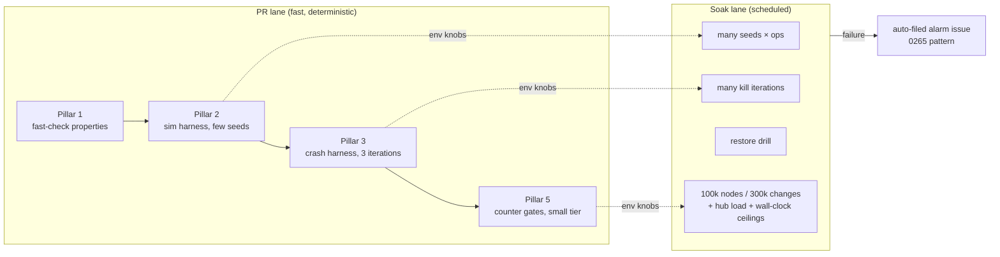
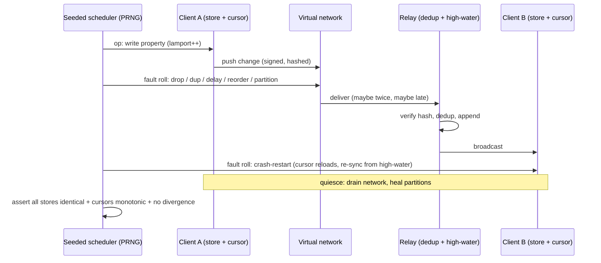
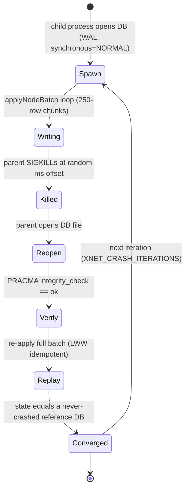

# Durability, Reliability, And Scale: A Testing Program For Every Process

## Problem Statement

xNet is a durability-critical system. User data lives in client-side SQLite
(OPFS in the browser, better-sqlite3 in Electron), replicates through a signed,
hash-chained LWW change log to a hub (better-sqlite3 + Litestream → R2), and is
recoverable only through that log. Every process in that chain — the browser
worker, competing tabs, the Electron utility process, the hub, the backup
pipeline — can crash, lose power, race, or partition at any moment.

We have ~10,000 tests (956 files) that assert _features work_. Almost nothing
asserts _data survives_. There is no fault injection, no crash-consistency
testing, no property-based convergence testing, no restore verification, and no
performance regression gating. The cold-open saga (explorations 0249→0260,
fourteen PRs) showed what happens when scale is discovered in production: a
318k-row `changes` table nobody had ever tested against.

This exploration designs a durability, reliability, and scale testing program
that covers all of the processes, and makes data scalability and performance a
tested property rather than a discovered one.

## Executive Summary

Adopt a **five-pillar program**, each pillar matched to the failure modes it
can actually catch:

1. **Property-based convergence testing** (fast-check) over the protocol's
   pure core — LWW merge, deterministic ordering, hash chaining, fork
   detection. The conformance vectors pin known-good cases; properties pin
   _all_ cases (permutation, duplication, adversarial interleavings).
2. **Deterministic sync simulation** (DST-lite) — N in-memory clients + a
   relay under a seeded virtual network that drops, duplicates, reorders,
   delays, and partitions messages, and crash-restarts clients. Every failure
   reproduces from its seed. This is the Resonate/TigerBeetle pattern scaled
   to what one repo can own; no off-the-shelf TS library exists.
3. **Physical fault injection** — a child-process SIGKILL crash harness over
   the real better-sqlite3 write path (SQLite's own crash-test pattern), an
   adapter-level fault wrapper that kills batches mid-chunk to prove the LWW
   idempotency safety net, and a Playwright spec that reloads the page mid
   write burst.
4. **Verified backup** — a restore drill (backup → restore to scratch →
   `PRAGMA integrity_check` + change-log high-water/head-hash comparison),
   runnable as a test and as a scheduled job. A backup that has never been
   restored is not a backup.
5. **Scale and performance rails** — a deterministic large-dataset generator
   (up to the 318k-change-log regression scale), regression assertions in the
   _deterministic-counter_ currency the repo already trusts (round-trip and
   statement counts, exploration 0271) rather than wall-clock on shared
   runners, plus a nightly **soak workflow** that runs the deep tiers: many
   simulation seeds, many crash iterations, 100k-node scale, hub load, and the
   restore drill.

The harness itself lands in test/CI space (`tests/reliability/`,
`scripts/reliability/`, `.github/workflows/soak.yml`) — no new services, no
vendors. Jepsen, Antithesis, TLA+, and a browser chaos-VFS are surveyed and
deliberately deferred.

**Implementation postscript — the program validated itself before merging.**
Building Pillar 2 immediately surfaced two real, shipped durability defects
(fixed in this same PR, found in this order):

1. **Re-read changes could never verify.** The client `changes` table never
   persisted `id`, `type`, `protocolVersion`, or the batch fields — all part
   of the signed content hash — so the reload-resync push
   (`getChangesSince` → hub) was structurally rejected as INVALID_HASH,
   tripping the 0224 breaker and stranding offline edits made before an app
   restart. (The hub's own `node_changes` table persists every one of these
   fields; the client log simply predated that care.) Fixed with a lossless
   envelope in the payload BLOB — no schema migration, legacy rows keep the
   old fallback.
2. **SQL LWW guards ignored the tiebreak.** The `node_properties` upsert
   guard compared only `lamport_time`, while the in-memory `shouldReplace`
   comparator orders by (lamport → wallTime → author). On same-Lamport
   concurrent edits — the normal two-devices-offline case — arrival order
   decided the persisted winner, so replicas could permanently diverge. The
   0238 convergence tests missed it because they run on the in-memory
   adapter. Fixed in the per-change upsert, the batched path, and both
   native (web/electron) batch adapters.

## Current State In The Repository

### What the system promises (the things worth testing)

- **Protocol core** — `packages/sync/src/change.ts` (protocol v3: BLAKE3
  canonical-JSON hashing, Ed25519 signatures, batch fields) and
  `packages/sync/src/chain.ts` (deterministic ordering by
  lamport → wallTime → authorDID code-unit order, `validateChain()`,
  `detectFork()`). Pure functions — an ideal property-testing substrate.
- **LWW stores** — `packages/data/src/store/store.ts` (`applyNodeBatch`, LWW
  merge) over `packages/data/src/store/sqlite-adapter.ts`;
  `packages/sqlite/src/schema.ts` (SCHEMA_VERSION 7, the `changes` table).
  The load-bearing invariant: upserts guarded by
  `WHERE excluded.lamport_time > node_properties.lamport_time`, so re-applying
  any suffix of the log is a no-op. This idempotency is the safety net for
  every non-atomic path — and nothing tests it under injected failure.
- **Client adapters** — `packages/sqlite/src/adapters/web.ts` (opfs-sahpool in
  a dedicated worker; second tab loses the handle race and silently falls back
  to `:memory:`), `packages/sqlite/src/adapters/electron.ts` (better-sqlite3,
  WAL + `synchronous = NORMAL`, batches chunked at 250 rows per transaction —
  the whole batch is _not_ atomic by design),
  `packages/sqlite/src/adapters/incremental-vacuum-stepping.ts` (cold-open
  work).
- **Sync client** — `packages/runtime/src/sync/node-store-sync-provider.ts`:
  persisted `lastSyncedLamport` cursor, request-sync-first with a 4s timeout,
  outbound throttle (40 msg/s), and the INVALID_HASH structural-rejection
  circuit breaker (5 consecutive → halt outbound) from exploration 0224.
- **Hub** — `packages/hub/src/services/node-relay.ts` (hash + signature
  verification, dedup by hash, high-water mark responses),
  `packages/hub/src/storage/sqlite.ts`, and
  `packages/hub/src/storage/litestream.ts` (`wal_autocheckpoint = 0` when
  Litestream owns the WAL — the 0258 landmine),
  `packages/hub/src/services/backup.ts`.

### What testing exists today

- **Unit/integration**: 7 vitest projects in the root `vitest.config.ts`
  (unit, dom, integration, editor, data-bridge, runtime, labs + electron),
  ~10,095 cases across 956 files. CI shards the suite 3 ways
  (`.github/workflows/ci.yml`), PRs run `--changed`.
- **Conformance vectors**: `conformance/vectors/{identity,change,lww,replication,authz}/`
  pin the protocol L0–L3 byte-for-byte, verified from TypeScript
  (`packages/runtime/src/conformance.test.ts`), Rust, Python, and Swift.
  Example-based only — no generated cases.
- **E2E**: `tests/e2e/src/sync-matrix.spec.ts` (web↔web, electron↔web,
  electron↔electron convergence incl. offline→reconnect, exploration 0238),
  `multitab-sqlite.spec.ts`, `electron-smoke.spec.ts` (persistence across
  restart), plus the editor-ux gate. Mobile Maestro flows exist but are
  manual (`workflow_dispatch`).
- **Benchmarks**: `packages/data/benchmarks/sqlite-node-store.bench.ts`
  (query scaling, env-scaled via `XNET_SQLITE_BENCH_MAX_NODES`),
  `packages/data-bridge/benchmarks/query-performance.bench.ts`,
  `scripts/benchmark-social-batch-writes.ts`. **None run in CI**; no
  regression detection.
- **Deterministic perf counters**: the 0271 work landed round-trip-counting
  regression tests around `packages/data/src/store/sqlite-adapter.ts` and
  `packages/sqlite/src/diagnostics.ts` — the precedent this exploration
  generalises.
- **Scheduled jobs**: only `fallow.yml` (weekly dead-code/health audit) and a
  site-staleness warning. No nightly soak, no restore drill.

### The gaps, concretely

| Gap                          | Risk it leaves open                                                |
| ---------------------------- | ------------------------------------------------------------------ |
| No property-based testing    | Convergence proven only for hand-picked vectors                    |
| No fault injection / chaos   | Breaker, cursor, re-sync paths untested under failure              |
| No crash-consistency testing | Power loss mid-batch never exercised; WAL/NORMAL settings untested |
| No restore verification      | Litestream/backup pipeline trusted, never drilled                  |
| No multi-client load tests   | Hub ingest behaviour under reconnect storms unknown                |
| Benchmarks outside CI        | Regressions like the 318k-row cold-open recur silently             |
| No soak/nightly job          | Deep tiers have nowhere to run                                     |

## External Research

- **Deterministic simulation testing (DST).** FoundationDB (mocked
  network/disk/clock, seeded, ~trillion CPU-hours) and TigerBeetle's VOPR
  (reproducible from `(seed, commit)`) set the bar. No mature TS library
  exists. The transposable pattern for Node is Resonate's: a scheduler
  `tick()` hook, a single seed generating all IDs/choices, invariant asserts
  in the code under test, replay-by-seed
  (journal.resonatehq.io "How we test the Resonate Server"). **Antithesis**
  offers hypervisor-level DST over unmodified binaries — commercial, worth a
  future spike, not a first step.
- **Property-based testing.** fast-check is the TS-native QuickCheck with a
  model-based commands API and shrinking. Precedent that this finds real
  bugs in exactly our domain: Ditto's stateful property tests caught a
  correctness bug in an _academically published_ CRDT optimisation
  (wombat.me "Testing CRDTs in Rust"). The canonical property list for a
  signed LWW log: merge commutativity/associativity/idempotence, convergence
  under arbitrary reordering and duplication, order-independent signature
  verification, identical final state _and head hash_ across N clients.
- **Crash-consistency testing.** SQLite's own harness spawns a child process
  killed at random mid-write, with a crash-test VFS that reorders/corrupts
  unsynced writes, then asserts `PRAGMA integrity_check` on reopen
  (sqlite.org/testing.html; TH3 runs ~2.4M test instances). ALICE (OSDI'14)
  and CrashMonkey generalise this to arbitrary applications. Nobody has
  published a crash-test VFS for the browser/OPFS layer — flagged below as
  future work with upstream-contribution potential. Field data point: a
  production sqlite-wasm OPFS-sahpool deployment of ~8,000 users saw ~0.1–0.2%
  hit `SQLITE_IOERR`/`SQLITE_CORRUPT` (PowerSync, "Current State of SQLite
  Persistence on the Web", May 2026) — corruption recovery is not
  hypothetical.
- **Jepsen-lite.** Full Jepsen (Clojure, LXC/SSH nemeses) is oversized for
  this team. The 80% version: record an operation history from a simulated
  run, check it with a consistency checker matched to the actual guarantee —
  for xNet that guarantee is eventual LWW convergence, so the checker is a
  model-based property, not Porcupine/Elle (which verify
  linearizability/transactional isolation we don't claim).
- **Network chaos.** Toxiproxy (TCP toxics) and toxy (in-process L7) are the
  standard proxies; Playwright `page.route()` covers HTTP but not WebSockets,
  while `context.setOffline()` and page reload/close cover the
  browser-lifecycle faults that matter most to us. A seeded _virtual_ network
  inside the simulation harness subsumes proxy-level chaos for protocol logic.
- **Perf regression in CI.** Wall-clock on shared GitHub runners varies
  20–30%+ (Bencher.dev); CodSpeed gets <1% variance by measuring simulated CPU
  work instead of time, with a Vitest-bench plugin. The free path:
  deterministic counters (round-trips, statements — already the repo's idiom)
  as hard gates, generous wall-clock ceilings only in nightly soak, and
  `github-action-benchmark` for trend lines when we want them.
- **Backup verification.** Litestream ships `restore` (refuses to overwrite —
  a safety rail for drills) and background replica validation. Industry
  cadence: scheduled restore-to-scratch + `PRAGMA integrity_check` + logical
  assertions (row counts, application head-hash), not just "SQLite says OK".
- **Ecosystem.** ElectricSQL ran a dedicated "120 days of hardening"
  reliability sprint and load-tested to 1M concurrent clients; Jazz ships an
  in-memory test sync node as a first-class API (`jazz-tools/testing`) — a
  good ergonomics reference for our harness.

## Key Findings

1. **The protocol core is already a deterministic function library.**
   `change.ts`/`chain.ts`/LWW merge take values and return values — no I/O, no
   clocks (lamport ordering, no wall-clock trust). Property-based testing and
   simulation slot in with zero refactoring. The conformance vectors prove
   four implementations agree on ~a dozen cases; properties extend that to
   millions of generated cases per run.
2. **LWW idempotency is the single safety net for every non-atomic path** —
   chunked `applyNodeBatch`, crash between chunks, cursor loss, re-sync from
   zero. It deserves adversarial testing far more than any feature: if the
   `WHERE excluded.lamport_time >` guard ever regresses, every crash becomes
   data corruption.
3. **Deterministic counters, not wall-clock, are the CI regression currency.**
   The repo already learned this (0271's round-trip-counting tests). Scale
   tests should assert "N nodes cost ≤ K round-trips / statements" as hard
   gates, and leave time-based budgets to the nightly soak with generous
   ceilings.
4. **The riskiest untested failure modes are cheap to test**: SIGKILL
   mid-batch (child process + reopen + `integrity_check`), replay-after-crash
   convergence (re-apply the same batch), hub restart mid-ingest (in-process
   relay restart in the simulation), restore drills (better-sqlite3
   `backup()` + integrity + head-hash compare). None needs new
   infrastructure.
5. **Simulation beats proxies for protocol chaos.** A seeded in-process
   virtual network (drop/dup/reorder/delay/partition/crash) gives perfect
   reproducibility and runs thousands of scenarios per second; toxiproxy-style
   tools add ceremony and nondeterminism for the same coverage at this layer.
   Browser-lifecycle faults (reload mid-write, second-tab handle race) still
   need Playwright because they exercise real OPFS.
6. **A soak lane is the missing home for deep tiers.** PR CI must stay fast;
   seeds×ops, crash iterations, and 100k+-node scale belong in a scheduled
   workflow with env-knob escalation and a failure-alarm issue (the 0265
   release-alarm pattern).

## Options And Tradeoffs

### A. Full Jepsen / Elle / Porcupine

Real-cluster nemeses + history checkers. **Rejected**: xNet claims eventual
LWW convergence, not linearizability or transactional isolation — the checkers
verify guarantees we don't make, and the orchestration cost is Jepsen-sized.
The valuable half (history + checker) survives in Pillar 2 as a convergence
property over simulated histories.

### B. Antithesis (hypervisor DST-as-a-service)

Runs unmodified binaries deterministically, RL-driven fault search. Strongest
tool surveyed; commercial, opaque, and premature before we have in-repo
invariant asserts for it to trip. **Defer** — revisit once Pillars 1–3 exist
(they're also exactly the groundwork Antithesis needs).

### C. fast-check property tests over the pure core

TS-native, zero infra, shrinking + seed replay, direct precedent (Ditto).
Covers merge laws, ordering determinism, chain validation, convergence under
permutation/duplication. **Adopt** — highest value per line of any option.

### D. Hand-rolled deterministic simulation (DST-lite)

Seeded PRNG + virtual clock + virtual network over real store/relay logic.
Medium build cost (~a day), perfect reproducibility, runs in the unit lane.
Risk: harness fidelity drift from the real transport — mitigated by keeping
the sync-matrix e2e as the end-to-end truth. **Adopt.**

### E. Physical fault injection (process kill, adapter faults, browser reload)

The only pillar that tests what the OS/filesystem actually does. SIGKILL
harness over better-sqlite3 with prod pragmas; adapter wrapper failing
mid-chunk; Playwright reload-mid-burst. Bounded iterations on PR, deep loops
in soak. **Adopt.**

### F. Chaos proxies (toxiproxy/toxy) between client and hub

Subsumed by D for protocol logic; browser WS can't be Playwright-routed
anyway. **Defer** — reconsider if multi-hub replication (0258) activates.

### G. Perf gating: SaaS (CodSpeed/Bencher) vs counters + soak

CodSpeed's <1% variance is the right long-term answer for wall-clock micro
benchmarks, but it's a vendor decision. Deterministic counters are free,
already idiomatic here, and catch the class of regression that actually bit us
(round-trip explosions, missing indexes). **Adopt counters + nightly soak
now**; leave SaaS as a follow-up once the bench suite is worth protecting.

### H. Browser chaos-VFS (OPFS SyncAccessHandle fault wrapper)

Port SQLite's crash-test VFS to the OPFS layer: truncate/reorder pre-flush
writes under a seed, reopen, `integrity_check`. High value, genuinely novel
(nothing public exists), but a project of its own touching
`packages/sqlite/src/adapters/web.ts` internals. **Defer to a follow-up
exploration**; noted as an upstream-contribution opportunity.

### Process-coverage matrix

| Process                   | Pillar 1 (PBT) | Pillar 2 (Sim) | Pillar 3 (Faults) | Pillar 4 (Restore) | Pillar 5 (Scale) |
| ------------------------- | :------------: | :------------: | :---------------: | :----------------: | :--------------: |
| Protocol core (sync/data) |       ●        |       ●        |                   |                    |        ●         |
| Browser worker + tabs     |                |   ○ (logic)    |  ● (reload e2e)   |                    |        ●         |
| Electron data process     |                |   ○ (logic)    |    ● (SIGKILL)    |                    |        ●         |
| Hub relay                 |                |  ● (restart)   |         ●         |         ●          |     ● (load)     |
| Backup pipeline           |                |                |                   |         ●          |                  |

● direct coverage ○ covered at the shared-logic layer

## Recommendation

Build the five pillars as a new **`reliability` vitest project** plus a
**nightly soak workflow**, in this order (each step is independently
valuable):



The simulation harness is the centrepiece. Its shape:



And the crash harness:



Scope discipline: everything lands under `tests/reliability/`,
`scripts/reliability/`, `tests/e2e/src/durability.spec.ts`, root
`vitest.config.ts`, and `.github/workflows/soak.yml`. No publishable package
source changes (fault injection wraps adapters from the outside), therefore no
changesets — the PR carries a `ci`-tagged changelog fragment.

## Example Code

Convergence property (Pillar 1, shape only):

```ts
import fc from 'fast-check'

// Any set of changes, delivered to any number of replicas in any order,
// with any duplication, converges to the same state.
it('LWW replicas converge under permutation + duplication', () => {
  fc.assert(
    fc.property(arbChangeSet(), fc.array(arbDeliveryPlan()), (changes, plans) => {
      const states = plans.map((plan) => applyAll(makeStore(), plan.schedule(changes)))
      const heads = states.map(materialize)
      for (const h of heads) expect(h).toEqual(heads[0])
    })
  )
})
```

Simulation step (Pillar 2, core loop):

```ts
const rng = mulberry32(seed)
while (ops-- > 0) {
  const actor = pick(rng, clients)
  switch (weighted(rng, { write: 6, deliver: 8, crash: 1, partition: 1, heal: 2 })) {
    case 'write':
      actor.writeRandomProperty(rng)
      break
    case 'deliver':
      network.deliverOne(rng)
      break // may drop/dup/reorder
    case 'crash':
      actor.crashAndRestart()
      break // cursor reloads from disk model
    case 'partition':
      network.partition(rng)
      break
    case 'heal':
      network.heal()
      break
  }
}
network.drainAll()
expectAllReplicasIdentical(clients, relay) // on failure: print seed for replay
```

Restore drill assertion (Pillar 4):

```ts
db.backup(scratchPath)
const restored = new Database(scratchPath)
expect(restored.pragma('integrity_check', { simple: true })).toBe('ok')
expect(highWater(restored)).toBe(highWater(db))
expect(headHashes(restored)).toEqual(headHashes(db))
```

## Risks And Open Questions

- **Kill-timing flakiness.** Random SIGKILL offsets can land after the batch
  finishes (vacuous pass) or before writes start. Mitigation: seed the offset,
  assert the child was mid-write via a progress pipe, and keep PR iterations
  small with deep loops in soak only.
- **CI time budget.** The reliability project must stay under ~60s in the PR
  lane. All depth is env-knobbed (`XNET_SIM_SEEDS`, `XNET_SIM_OPS`,
  `XNET_CRASH_ITERATIONS`, `XNET_SCALE_NODES`, `XNET_SCALE_CHANGES`) and
  escalated only in soak.
- **Harness fidelity drift.** The simulation's relay model could diverge from
  `node-relay.ts` behaviour. Mitigation: build it on the real
  `packages/hub` relay service where importable; where not, keep the model
  minimal (verify-hash, dedup, high-water) and rely on sync-matrix e2e as the
  transport-level truth.
- **Wall-clock ceilings even in soak** are noisy on shared runners; ceilings
  are set generous (≥5× local p95) and counters remain the hard gate.
- **Litestream itself is not exercised** — the drill verifies the
  backup/restore _logic_ via SQLite's backup API locally; a true
  R2 `litestream restore` drill needs staging credentials and belongs with the
  cloud go-live work (0255/0258). Open question: wire it into the hub's
  deploy environment later.
- **OPFS chaos-VFS deferred** (Option H): the browser storage layer's own
  crash behaviour is tested only via reload e2e for now. Field data says
  corruption happens (~0.1–0.2%); a follow-up exploration should own recovery
  UX + the chaos wrapper together.
- **Second-tab `:memory:` fallback** is a known durability hole (0263). This
  program _detects_ it (multitab spec exists; sim models cursor loss) but the
  fix is 0263's Web-Locks leadership work, not a test.

## Implementation Checklist

- [x] Add `fast-check` as a root devDependency
- [x] Create the `reliability` vitest project (node env, forks pool) in root `vitest.config.ts`, rooted at `tests/reliability/`
- [x] Pillar 1: property tests for deterministic ordering — `orderChanges` permutation invariance and comparator laws (`packages/sync/src/chain.property.test.ts`)
- [x] Pillar 1: property tests for hash/canonicalisation — key-order independence, `verifyChangeHash` round-trip, tamper detection (`packages/sync/src/change.property.test.ts`)
- [x] Pillar 1: property tests for chain validation and fork detection under generated histories including forks and missing parents
- [x] Pillar 1: LWW convergence property — N replicas, arbitrary permutation + duplication of a generated change set converge to identical state (`tests/reliability/lww-convergence.property.test.ts`)
- [x] Pillar 2: deterministic simulation harness under `tests/reliability/sim/` — seeded PRNG, virtual network (drop/dup/reorder/delay/partition), relay with verify-hash/dedup/high-water, client crash-restart with cursor persistence; failures print the seed; depth via `XNET_SIM_SEEDS`/`XNET_SIM_OPS`
- [x] Pillar 2: simulation invariant suite — replica convergence after drain, cursor monotonicity, dedup (no double-apply), determinism check (same seed twice → identical event trace)
- [x] Pillar 3: crash-consistency harness under `tests/reliability/crash/` — child-process writer with prod pragmas (WAL, `synchronous = NORMAL`), parent SIGKILL at seeded offsets mid-write (progress-pipe guarded), reopen → `integrity_check` → LWW replay → equality with never-crashed reference; depth via `XNET_CRASH_ITERATIONS`
- [x] Pillar 3: adapter fault-injection tests — wrap the SQLite adapter to fail at a chosen chunk of `applyNodeBatch`, assert partial state is valid and full re-apply converges (proves the idempotency safety net)
- [x] Pillar 3: browser durability e2e — `tests/e2e/src/durability.spec.ts`: write burst, reload mid-burst, reopen and assert no committed data lost and store converges after re-sync
- [x] Pillar 4: restore drill — `scripts/reliability/restore-drill.mjs` (backup → restore to scratch → `integrity_check`/`quick_check` → high-water + head-hash + row-count comparison) plus a vitest wrapper that runs it against a seeded DB and a negative test on a corrupted copy
- [x] Pillar 5: deterministic scale generator under `tests/reliability/scale/` — seeds N nodes / M change-log rows (PR tier ~5k/20k; env-scaled to 100k/318k) into a real SQLite store
- [x] Pillar 5: scale regression assertions in counter currency — statement/round-trip counts for hot reads at scale (0271 pattern), plus generous wall-clock ceilings that only the soak lane enforces
- [x] Pillar 5: hub load smoke — `scripts/reliability/hub-load.mjs`: in-process hub + M WebSocket clients pushing K changes (reconnect-storm shape), reporting throughput/p95 and asserting convergence; small vitest smoke in the reliability project
- [x] Soak workflow — `.github/workflows/soak.yml` (nightly cron + `workflow_dispatch`): deep sim seeds, deep crash iterations, 100k-node scale tier, hub load, restore drill; uploads artifacts; files/updates an alarm issue on failure (0265 pattern)
- [x] Ensure the reliability project runs in the PR `test` shards and stays under the time budget
- [x] `tests/reliability/README.md` — seeds, replay instructions, env knobs, lane structure
- [x] Changelog fragment (tags: `ci`) for the PR

## Validation Checklist

- [x] `pnpm exec vitest run --project reliability` passes locally at PR-tier depth in under ~60s
- [x] Mutation sanity check: temporarily inverting the LWW comparator (`>` → `>=` or lamport ordering) makes the convergence property fail with a shrunk counterexample
- [x] Determinism check: two simulation runs with the same seed produce identical event traces; a failing seed replays to the same failure
- [x] Crash harness: full local run (≥25 iterations via `XNET_CRASH_ITERATIONS`) with zero `integrity_check` failures and zero post-replay divergence
- [x] Restore drill passes on a seeded DB and fails on a deliberately corrupted copy
- [x] Scale tier at `XNET_SCALE_NODES=100000` runs clean locally; counter assertions match recorded budgets
- [x] Full `pnpm typecheck` and `pnpm test` green; PR CI checks (editor-ux, lint, test 1/3–3/3, typecheck, changelog-section) pass
- [x] Post-merge: trigger `soak.yml` via `workflow_dispatch` and confirm a green run end-to-end

## References

- Explorations: 0200 (portable protocol), 0206 (sync anti-flood, cursors), 0224 (INVALID_HASH breaker), 0238 (sync-matrix e2e), 0249→0260 (cold-open saga, 318k-row change log), 0263 (worker queue, multi-tab gap), 0264/0266 (read-speed levers), 0271 (round-trip-counting regression tests), 0258 (multi-home sync; Litestream landmine), 0265 (failure-alarm issue pattern)
- Code: `packages/sync/src/{change,chain}.ts`, `packages/data/src/store/{store,sqlite-adapter}.ts`, `packages/sqlite/src/adapters/{web,electron}.ts`, `packages/runtime/src/sync/node-store-sync-provider.ts`, `packages/hub/src/services/node-relay.ts`, `packages/hub/src/storage/litestream.ts`, `conformance/`, `tests/e2e/src/sync-matrix.spec.ts`
- TigerBeetle VOPR — github.com/tigerbeetle/tigerbeetle `docs/internals/vopr.md`
- Resonate, "How we test the Resonate Server" — journal.resonatehq.io
- Antithesis docs — antithesis.com/docs
- fast-check model-based testing — fast-check.dev/docs/advanced/model-based-testing
- Ditto / Russell Brown, "Testing CRDTs, From Theory to Practice" — wombat.me/posts/testing-crdts
- SQLite, "How SQLite Is Tested" — sqlite.org/testing.html
- ALICE — USENIX OSDI'14, "All File Systems Are Not Created Equal"
- PowerSync, "The Current State of SQLite Persistence on the Web" (May 2026)
- Litestream restore/verification — litestream.io/reference/restore
- CodSpeed, "Benchmarks in CI: Escaping the Cloud Chaos"; Bencher.dev prior-art notes
- ElectricSQL, "120 days of hardening" reliability sprint (Aug 2025)
- Jepsen (jepsen.io), Elle (VLDB'21), Porcupine (github.com/anishathalye/porcupine)
