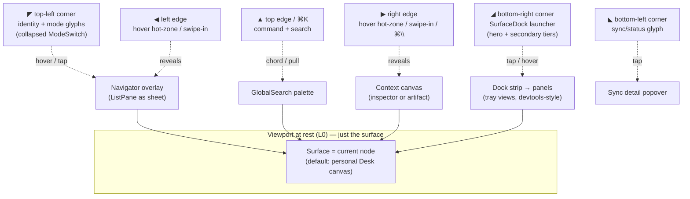
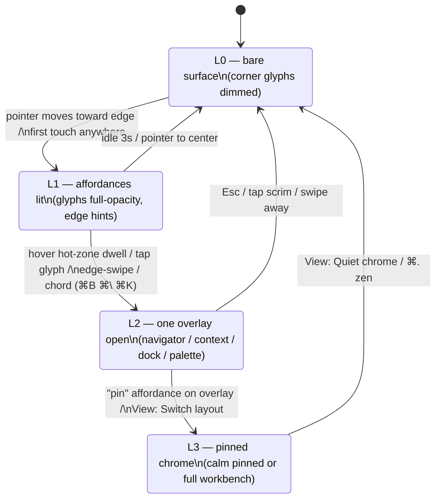
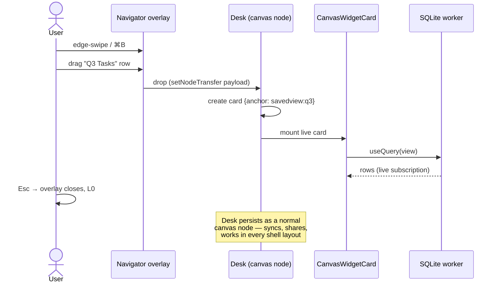

# Quiet Surface — Reinventing the Primary Workspace as a Blank Sheet That Builds Up

## Problem Statement

The primary workspace UX should feel like a clean sheet of paper: the default
screen is _almost nothing_ — a document, or a bounded canvas — and the user
compiles pieces onto the work surface as they need them. Richness lives at the
edges and corners: affordances that sit quietly (like the devtools widget in
the bottom-right) and expand into deep capability on hover, tap, swipe, or
keystroke. The same grammar must work on a laptop (hover, keyboard) and on a
phone (thumb, long-press, sheets).

Today the app boots into chrome-first compositions: the workbench is an
IDE-grade multi-pane grid, and even the calm shell (exploration 0250) paints a
mode switch, a list pane, and a document-list home before the user has asked
for anything. The question this exploration answers: **how do we invert that —
surface first, chrome summoned — without losing any of the workbench's power,
and without forking the view layer?**

## Executive Summary

- **Don't build a third shell. Add a `chrome` axis to the calm shell** —
  `pinned` (today's behavior) vs `quiet` (chrome auto-hides into corner glyphs
  and summonable edges). This mirrors how `density` was added as an orthogonal
  axis to color variants in 0232, and reuses every existing panel boolean,
  command, and view.
- **Make home a real node, not a route-component.** The `startupTab`
  mechanism (0166) already redirects `/` to a chosen surface. Auto-provision a
  personal **Desk** — a bounded-but-growable canvas node — and make it the
  default startup surface. "Building up your workspace" = pinning live views
  onto the Desk, which `@xnetjs/canvas` + `CanvasWidgetCard` already support.
- **Generalize the devtools dock pattern into an app-level edge grammar.**
  The devtools panel registry's hero/secondary tier system
  (`packages/devtools/src/panels/panel-registry.ts`) is exactly the
  progressive-disclosure machinery the app shell needs; lift the pattern (not
  the code) into a `SurfaceDock` registry that FeatureModules contribute to.
- **Every pointer affordance gets a declared touch twin** (hover-reveal ↔
  long-press; edge-hover ↔ edge-swipe/bottom-sheet; corner glyph ↔ FAB), and
  every affordance is also reachable from ⌘K. This is the single strongest
  lesson from the prior art (Notion's hover-gutter → keyboard-toolbar swap;
  tldraw's bottom toolbar; NN/g on bottom sheets).
- **Bounded, not infinite.** Muse — the deepest research prior art — retreated
  from a truly infinite canvas to bounded "flex boards" for orientation. The
  Desk starts one screen big and grows on demand, with a zoom-to-fit home
  anchor. Chrome is _summonable_, never _absent_.
- **No tldraw.** Its SDK now requires a production license (~$6k/yr
  commercial, watermarked hobby tier). `@xnetjs/canvas` already does culled
  rendering of live React cards; it is the MIT-clean substrate.

## Current State In The Repository

### The three-layer shell today

`apps/web/src/workbench/Workbench.tsx` (199 lines) routes between:

| Layer            | File                                                                                                               | Composition                                                                                                                      |
| ---------------- | ------------------------------------------------------------------------------------------------------------------ | -------------------------------------------------------------------------------------------------------------------------------- |
| Workbench (grid) | `apps/web/src/workbench/` (`Rail.tsx`, `EditorArea.tsx`, `ContextPanel.tsx`, `PanelViewHost.tsx`, `StatusBar.tsx`) | 44px rail · left panel · tabbed/splittable center · right context panel · bottom tray · status bar, via `react-resizable-panels` |
| Calm (default)   | `apps/web/src/workbench/calm/CalmShell.tsx`                                                                        | `ModeSwitch` (4rem) · `ListPane` (17rem) · `CalmSurface` (router outlet) · contextual `Canvas` (24rem right panel)               |
| Mobile           | `apps/web/src/workbench/MobileShell.tsx`, `calm/CalmMobile.tsx`                                                    | top bar · full-bleed surface · bottom tabs; panels become edge/bottom `Sheet`s with the `armed` backdrop pattern                 |

Load-bearing facts for this exploration:

- **The calm shell already reuses workbench state** — `left.open`/`right.open`
  drive ListPane/Canvas, so ⌘B / ⌘\ / ⌘. work identically in both layouts
  (`apps/web/src/workbench/state.ts`, zustand + `persist`). A `quiet` chrome
  mode inherits all of this for free.
- **Zen mode is a working precedent for chrome-free rendering**: `mode: 'zen'`
  hides everything but the surface and snapshots panel state for restore
  (`zenSnapshot`). Quiet chrome is "zen with a way back at the edges."
- **Route → mode table** (`calm/modes.ts`): three modes (Companion /
  Workspace / Network) own path prefixes; settings/analytics/share/welcome are
  modeless. Quiet chrome does not change this table.
- **`use-layout-mode.ts`** gives the breakpoints: `compact < 768px`,
  `medium 768–1023`, `expanded ≥ 1024` — the hinge for choosing hover vs
  touch affordances.

### The corner-widget prototype: devtools

`packages/devtools/src/panels/Shell.tsx` + `panel-registry.ts` implement
exactly the target interaction, scoped to developers:

- A **tier system**: 4 `hero` panels always visible in the strip (Data,
  Changes, Logs, Performance); ~12 `secondary` panels behind a "More" menu and
  a ⌘⇧P palette (`CommandPalette/DevToolsPalette.tsx`).
- Registry metadata (`id`, `label`, `icon`, `tier`, `group`, `keywords`) makes
  the disclosure _data-driven_ — the shell renders whatever is registered.

This is the pattern to lift to the app shell: registered, tiered, palette-
searchable edge content.

### The surface primitives already exist

- **Canvas**: `packages/canvas` is a full infinite-canvas engine — shapes,
  connectors, frames, mind maps, PDF pages, object ingestion, undo, theme
  tokens. `apps/web/src/components/CanvasView.tsx` renders it, and
  `CanvasWidgetCard` (`@xnetjs/dashboard`) already hosts **live dashboard
  widgets as canvas cards** under a `DashboardRuntimeProvider`. Obsidian-style
  "canvas card = live view of a real node" is not a build, it's a wiring job.
- **Document**: the page editor (`apps/web/src/components/PageView.tsx`,
  `packages/editor`) has inline slash commands and page embeds — the
  document-as-surface half of the vision.
- **Home is already indirect**: `apps/web/src/routes/index.tsx` honors
  `startupTab` (exploration 0166) and redirects `/` to any chosen node before
  painting the document list. A Desk node just becomes the default value.
- **Command spine**: `GlobalSearch.tsx` (⌘K/⌘P, cmdk) + the global
  `getCommandRegistry()` from `@xnetjs/plugins` — every summoned edge must
  also be a command here.
- **Contribution system**: `packages/plugins/src/feature-module.ts` +
  `contributions.tsx` already let features contribute rail items, commands,
  and context-panel sections; a new `surfaceDock` contribution point slots in
  beside them.
- **Motion + theme discipline**: the enforced motion vocabulary
  (`packages/ui/src/theme/motion.css` — enter: ease-out/normal, exit:
  ease-in/fast) and the `variant`/`density` axes (`ThemeProvider.tsx`, 0232)
  give quiet chrome its animation and "paper" feel without new tokens.

### What fights the vision today

- `/` paints a utilitarian **document list** with header buttons and promo
  link-cards — the opposite of a blank sheet.
- Calm still pins ~21rem of chrome (ModeSwitch + ListPane) on first paint.
- Nothing maps **edge gestures** (hover hot-zones, swipes) to panel state;
  panels open only via buttons and chords.
- The devtools corner grammar is private to devtools.

## External Research

### Prior art on minimal-chrome canvases

- **Muse (Ink & Switch)** is the deepest study: _"No chrome. Avoid toolbars,
  buttons, or other administrative debris."_ Tools were selected by stylus
  grip rather than toolbars; zoom replaced open/close. Two honest failures to
  learn from: gesture space exhausts as operations grow, and — critically —
  **Muse rejected the fully infinite canvas**, shipping bounded-but-growable
  _flex boards_ because "infinite is not fully desirable" for orientation
  (memos: _Infinite canvas_, _Flex boards_).
- **tldraw** moved its toolbar to the bottom edge (thumb-parity with mobile),
  turns the style panel into a modal on phones, and exposes a breakpoint hook
  so one UI degrades gracefully. Every UI zone is replaceable — but the SDK
  **requires a production license key** (hobby tier = watermark; commercial
  reported ~$6k/yr as of the 4.0 changes, Sept 2025).
- **Excalidraw / Apple Freeform / FigJam**: one toolbar, contextual panels
  only on selection. Excalidraw's refusal of organizational chrome spawned a
  third-party extension ecosystem adding sidebars back — minimalism bites back
  when orientation chrome is _absent_ rather than _summonable_.
- **Scrintal** re-added a persistent "My Desk" home button; **Heptabase /
  Obsidian Canvas** make the card a real document so the canvas is optional
  arrangement, not the container. Obsidian Canvas cards are live, two-way
  views of vault notes — the exact analog of `CanvasWidgetCard` over xNet
  nodes.

### Progressive-disclosure patterns with evidence

- **Notion's ladder** is the canonical blank-document disclosure: empty page →
  hover gutter (`⋮⋮` + `+`) → `/` command catalog → selection toolbar → side
  panel. On mobile the hover tier is _replaced_ by a persistent toolbar above
  the keyboard — the clearest statement of the "declared touch twin" rule.
- **Arc's auto-hiding sidebar**: ⌘S toggle + reveal on edge-hover. Lesson from
  user pushback: hidden chrome disorients unless the reveal affordance is
  discoverable and instant.
- **Command palettes as primary navigation** (Arc, Superhuman, Raycast): one
  keyboard entry point substitutes for persistent IA, and the palette _teaches_
  chords inline — xNet's `GlobalSearch` already does this.
- **Marking/radial menus** (Kurtenbach & Buxton): novice sees a radial popup on
  long-press/press-and-hold; expert flicks blind — up to **3.5× faster** than
  linear menus, reliable to ~8 items × 2 levels. One of the only chrome-free
  affordances with true pointer/touch parity.
- **Bottom sheets** (NN/g): "a form of progressive disclosure invoked by user
  interaction… not suited for always-needed tools" — the mobile twin of the
  desktop hover panel. Thumb-zone research: primary actions belong
  lower-center; 44pt/48dp minimum targets.

### Failure modes of "blank canvas" and their mitigations

| Failure mode                                                     | Evidence                                                                                        | Mitigation adopted here                                                                                        |
| ---------------------------------------------------------------- | ----------------------------------------------------------------------------------------------- | -------------------------------------------------------------------------------------------------------------- |
| Blank-canvas paralysis                                           | Miro ships 2,500+ templates; FigJam ships facilitation frameworks                               | Desk seeds: gentle starter chips + template picker in the empty state                                          |
| Lost in space / navigation                                       | Muse flex-boards memo; "1-D scrolling beats 2-D wandering" (HN, _Evolving the Infinite Canvas_) | Bounded-but-growable Desk, zoom-to-fit **home anchor**, minimap only if needed                                 |
| Ambiguous structure ("forty cards is just forty cards" — Coyier) | Canvases fail when the system doesn't understand items                                          | Cards are _live xNet nodes_ with schemas — the system can re-layout, filter, and query them                    |
| Non-responsive spatial layouts                                   | Spatial arrangements don't reflow to phones                                                     | Desk has a **list projection** on compact (cards in recency/pin order), spatial layout is a ≥768px enhancement |
| Hidden chrome disorients                                         | Arc HN feedback; Excalidraw extension ecosystem                                                 | Corner glyphs never fully disappear (dim, don't vanish); every edge is also a ⌘K command; first-run coachmark  |
| Screen-reader opacity                                            | Unstructured canvases are inaccessible                                                          | List projection doubles as the accessible/semantic order                                                       |

### Library notes

- **Do not adopt tldraw** (license gate; `@xnetjs/canvas` already exists and
  has culling + live React cards).
- `dnd-kit` (already the ecosystem default) for pin-drag interactions;
  bottom-sheet/edge-sheet machinery already exists in `MobileShell`.
- If a plain zoomable-DOM surface is ever wanted for the document-mode home,
  `react-zoom-pan-pinch` (MIT) is the fallback — but the Desk should be the
  existing canvas node type.

## Key Findings

1. **The gap is composition, not capability.** Every primitive the vision
   needs — canvas engine, live widget cards, slash-command documents, command
   palette, panel state, sheets, motion vocabulary, contribution registry —
   already exists. Nothing new needs to be invented at the data or view layer;
   the shell needs a fourth _disclosure posture_, not a fourth shell.
2. **The devtools dock is the in-repo proof** that "quiet corner → rich
   surface" works: tiered registry + palette + collapsed strip. The app shell
   should be _the same idea pointed at users_.
3. **`startupTab` makes "home is a node" a one-line policy change**, and a
   canvas node with `CanvasWidgetCard`s makes "compile pieces onto the
   surface" a seeding + drag-affordance job.
4. **The research consensus is bounded + summonable**: bounded canvas (Muse),
   summonable orientation chrome (Arc/Scrintal), semantic cards (Obsidian/
   Coyier), keyboard escape hatch always (palettes), declared touch twins
   (Notion/tldraw/NN/g).
5. **Escape must be a ladder, not a cliff**: Esc walks disclosure back one
   level at a time until only the surface remains — the same grammar
   `useZenEscape` already implements for zen.

## Options And Tradeoffs

### Option A — Quiet chrome as a new axis on the calm shell (recommended)

Add `chrome: 'pinned' | 'quiet'` to the workbench store. In quiet, the
ModeSwitch collapses to a corner glyph cluster, ListPane/Canvas render as
overlays summoned by edge hover/swipe/chord, and the surface owns 100% of the
viewport at rest.

- **Pros**: zero view forking; all commands/state/routes intact; users toggle
  posture per taste (like density); calm stays the safe default during
  rollout; smallest diff.
- **Cons**: overlay panels need new hot-zone + dismissal plumbing; two
  postures to test.

### Option B — Document-first home ("the sheet of paper is a page")

Home is a personal page; workspace builds up via slash commands, embeds, and
page-task blocks. iA-Writer stillness.

- **Pros**: strongest "blank sheet" feel; text-first; trivially responsive;
  screen-reader native.
- **Cons**: "compile pieces onto a surface" becomes vertical-only; spatial
  arrangement (the moodboard/desk feel) is lost; live widgets in a document
  flow are layout-fragile.

### Option C — Canvas-first home ("the Desk")

Home is a personal canvas node; pieces are cards — live views of real nodes
via `CanvasWidgetCard`, plus notes/shapes.

- **Pros**: matches the "work surface" metaphor exactly; spatial memory;
  already-built engine; cards are semantic (query/re-layout possible).
- **Cons**: blank-canvas paralysis risk (needs seeds); spatial layout doesn't
  reflow on phones (needs list projection); canvas perf with many live cards
  needs a widget budget.

### Option D — Full docking workspace (dockview-style tiling)

User-composed tiled panels, VS-Code-like.

- **Pros**: maximal composability.
- **Cons**: contradicts the brief — docking chrome is the _opposite_ of a
  blank sheet; duplicates the existing workbench grid; heaviest build.
  **Rejected.**

**Resolution: A + C, with B as a supported choice.** Quiet chrome (A) is the
posture; the Desk (C) is the default startup surface _within_ it. Because home
is just `startupTab`, a user who prefers a page as their home (B) sets it so —
the shell doesn't care. D is rejected.

## Recommendation

Ship **Quiet Surface** in five phases, each independently landable:

### The target grammar



Corners hold _glyphs_ (dimmed at rest, never removed); edges hold _hot zones_
(desktop hover) and _swipe targets_ (mobile). Everything summoned is also a
⌘K command and a keyboard chord — three roads to every drawer.

### The disclosure ladder



Esc always walks down the ladder — the contract `useZenEscape` already
establishes.

### The touch-twin contract (hard rule, enforced in review)

| Desktop affordance                               | Mobile twin                                                | Keyboard road         |
| ------------------------------------------------ | ---------------------------------------------------------- | --------------------- |
| Left edge hover hot-zone → navigator overlay     | Left edge-swipe → Sheet (exists in `CalmMobile`)           | ⌘B / ⌘K "Navigator"   |
| Right edge hover → context canvas                | Right edge-swipe → bottom Sheet                            | ⌘\ / ⌘K "Context"     |
| Bottom-right dock launcher (hover expands strip) | FAB, thumb-zone, opens bottom sheet dock                   | ⌘J / ⌘K "Dock: …"     |
| Hover a Desk card → card toolbar                 | Long-press card → radial/action sheet                      | Enter on focused card |
| Top-left glyph cluster (modes)                   | Bottom tab bar, auto-hides on scroll, reveals on scroll-up | ⌘1/2/3 / ⌘K "Mode: …" |

### The Desk

A per-identity canvas node (deterministic id, seeded like the devtools seed
manifest) set as the default `startupTab`:

- **Bounded, grows on demand** (Muse flex boards): starts one viewport large;
  dragging a card past the edge grows it; **Home** button = zoom-to-fit.
- **Pin anything**: navigator rows, search results, and tab context menus get
  "Pin to Desk" (command + drag via `setNodeTransfer`, which canvas ingestion
  already accepts). Pinned nodes render as `CanvasWidgetCard` live views —
  Obsidian-style two-way cards over real nodes.
- **Empty state ≠ blank**: three dimmed starter chips (New page · Pin
  something · Browse templates) that vanish after first real content —
  paralysis mitigation without clutter.
- **Compact projection**: below 768px the Desk renders as an ordered list
  (pins first, then recency) — the spatial layout is a desktop enhancement,
  and the list is the screen-reader order. This also sidesteps canvas-on-touch
  gesture conflicts at phase 1.



### The SurfaceDock (generalized devtools grammar)

A new contribution point in `@xnetjs/plugins` mirroring the devtools registry:
`{ id, label, icon, tier: 'hero' | 'secondary', group, keywords, component }`.
The bottom-right launcher renders hero items as a one-tap strip; secondary
items live behind "More" + the palette. Initial residents: the existing tray
views (Shelf, Capture, Notifications, Sync, Console) — moved, not rebuilt.
Devtools keeps its own widget; visually they become siblings.

### What quiet mode explicitly does _not_ do

- No new routes, no new view components, no changes to `modes.ts`.
- No tldraw or other new canvas dependency.
- No removal of calm-pinned or the workbench grid — `View: Switch layout`
  gains a third option and the ladder's L3 keeps both.

## Example Code

Store axis (`apps/web/src/workbench/state.ts`):

```ts
export type ChromePosture = 'pinned' | 'quiet'

interface WorkbenchState {
  // …existing…
  chrome: ChromePosture // default 'pinned'; flips to 'quiet' after rollout
  discloseLevel: 0 | 1 | 2 // L3 is represented by layout/mode, not here
  setChrome: (c: ChromePosture) => void
}
```

Edge hot-zone (desktop) — a thin fixed strip that arms the overlay; pure CSS
opacity for the L0→L1 glyph dim, motion vocabulary for the overlay itself:

```tsx
function EdgeHotZone({ side, onSummon }: { side: 'left' | 'right'; onSummon: () => void }) {
  const timer = useRef<number>()
  return (
    <div
      aria-hidden
      className={`fixed inset-y-0 ${side}-0 w-2 z-40`}
      onPointerEnter={() => {
        timer.current = window.setTimeout(onSummon, 180)
      }}
      onPointerLeave={() => window.clearTimeout(timer.current)}
    />
  )
}
```

Quiet composition sketch (`calm/QuietChrome.tsx`, wrapping the same children
`CalmShell` renders today):

```tsx
export function QuietChrome({ children }: { children: ReactNode }) {
  const { left, right, setPanelOpen } = useWorkbench(/* existing actions */)
  return (
    <div className="relative h-full">
      <CalmSurface>{children}</CalmSurface>
      <EdgeHotZone side="left" onSummon={() => setPanelOpen('left', true)} />
      <EdgeHotZone side="right" onSummon={() => setPanelOpen('right', true)} />
      <CornerGlyphs /> {/* modes + identity, top-left */}
      <SurfaceDockLauncher /> {/* bottom-right */}
      <SyncGlyph /> {/* bottom-left, reuses SyncStatus */}
      {left.open && (
        <Overlay side="left" motion="slide-right" onDismiss={() => setPanelOpen('left', false)}>
          <ListPane mode={activeMode} /> {/* unchanged component */}
        </Overlay>
      )}
      {right.open && (
        <Overlay side="right" motion="slide-left" onDismiss={() => setPanelOpen('right', false)}>
          <Canvas /> {/* unchanged component */}
        </Overlay>
      )}
    </div>
  )
}
```

Desk provisioning (mirrors devtools seed determinism):

```ts
const DESK_ID = deterministicId(`desk:${identity.did}`)
async function ensureDesk(mutate: Mutate) {
  await mutate(CanvasSchema).upsert({ id: DESK_ID, title: 'Desk', bounded: true })
  useWorkbench.getState().setStartupTab({ nodeType: 'canvas', nodeId: DESK_ID })
}
```

## Risks And Open Questions

- **Discoverability vs quiet** is the central tension. Mitigations: glyphs dim
  rather than vanish; a one-time coachmark (the `seenTips` machinery exists);
  the palette lists every summonable. Measure: can a first-run user open the
  navigator within 30 seconds?
- **Hover hot-zones vs canvas edge gestures**: on the Desk, pointer-near-edge
  may mean "pan" not "summon." Rule: hot zones require pointer _dwell_
  (~180ms) and are suppressed while a canvas drag/pan is active.
- **Live-card budget**: dozens of `CanvasWidgetCard`s = dozens of live
  queries. The canvas engine culls off-viewport cards, but query
  subscriptions should pause for culled cards (needs a hook in
  `DashboardRuntimeProvider`); cap initial widget count and measure against
  the 0266 read-speed budget.
- **Does quiet become the default?** Proposal: land behind `View: Quiet
chrome`, dogfood, then flip default for _new_ identities only (existing
  users keep their persisted posture) — same conservative flip as 0250's
  calm default.
- **Radial/marking menu** (long-press on cards): high ceiling (3.5× expert
  speed) but new interaction machinery; deferred to phase 5, behind a flag.
- **Multi-Space Desks**: one Desk per identity, or per Space (0258 makes
  Space the replication unit)? Start with per-identity; a per-Space Desk is
  just another canvas node + `startupTab` policy later.
- **Electron/mobile shells**: Capacitor webview (0238) inherits the compact
  behavior; verify safe-area insets for corner glyphs (tldraw's HomeBar
  lesson).

## Implementation Checklist

### Phase 1 — Quiet posture (chrome axis)

- [x] Add `chrome: 'pinned' | 'quiet'` + `discloseLevel` to `apps/web/src/workbench/state.ts` (persisted; default `pinned`)
- [x] `QuietChrome` composition in `apps/web/src/workbench/calm/` rendering existing `CalmSurface`/`ListPane`/`Canvas` as overlays
- [x] `EdgeHotZone` (dwell-armed) + `Overlay` using motion vocabulary (`slide-*`, scrim, Esc/scrim dismissal walking the ladder)
- [x] `CornerGlyphs` — collapsed ModeSwitch (modes + identity + settings), L0 dim / L1 lit on pointer intent
- [x] `SyncGlyph` bottom-left reusing `SyncStatus` popover
- [x] Commands: `View: Quiet chrome`, `View: Pinned chrome` in the command registry; ⌘K entries for every summonable
- [x] Mobile: quiet posture in `CalmMobile` — bottom tab bar auto-hides on scroll-down, reveals on scroll-up; edge-swipes already summon sheets
- [x] Coachmark (one-time, `seenTips`) pointing at the corners

### Phase 2 — The Desk

- [x] Deterministic per-identity Desk canvas provisioning + default `startupTab` for fresh identities
- [x] Bounded-canvas mode in `packages/canvas` (grow-on-drag-past-edge, zoom-to-fit Home anchor)
- [x] "Pin to Desk" command + context-menu item + drag-from-navigator (`setNodeTransfer` → canvas ingestion)
- [x] Pinned nodes render as `CanvasWidgetCard` live views (page/db/view/task cards)
- [x] Empty-state starter chips (New page · Pin something · Templates), removed after first content
- [x] Compact (<768px) list projection of the Desk (pins first, recency order) — also the a11y/screen-reader order
- [x] Pause live queries for culled cards (hook in `DashboardRuntimeProvider`)

### Phase 3 — SurfaceDock (generalized devtools grammar)

- [x] `surfaceDock` contribution point in `@xnetjs/plugins` (`tier: hero | secondary`, group, keywords) — pattern from `packages/devtools/src/panels/panel-registry.ts`
- [x] Bottom-right launcher: hero strip on hover/tap, "More" + palette for secondary; FAB + bottom sheet on compact
- [x] Migrate tray views (Shelf, Capture, Notifications, Sync, Console) from `PanelViewHost('bottom')` to SurfaceDock in quiet posture
- [x] Changeset for `@xnetjs/plugins` (new contribution point — minor)

### Phase 4 — Rollout

- [x] e2e specs: disclosure ladder (hover/swipe/chord/Esc), pin-to-desk flow, startup-to-Desk
- [x] Dogfood period; then default `chrome: 'quiet'` for **new** identities only
- [x] Docs page + changelog fragment (`scripts/changelog/new.mjs`)

### Phase 5 — Optional depth

- [x] Long-press radial menu on Desk cards (flagged), per marking-menu research (≤8 items, 1 level)
- [x] Desk templates in the seed/template picker
- [x] Per-Space Desks (post-0258 multi-home decision) — **decided: per-identity only for now.** A per-Space Desk is just another deterministic canvas id plus a `startupTab` policy, so nothing here blocks it; revisit once 0258's deferred multi-home work lands and Spaces are the unit users actually inhabit.

## Validation Checklist

- [ ] Fresh identity boots to the Desk with **zero panels open** and ≤4 dimmed glyphs — nothing else on screen
- [ ] Every summonable surface reachable three ways: pointer/touch, chord, ⌘K (audit table checked into the e2e spec)
- [ ] Esc from any L2 overlay returns to L0; repeated Esc never dead-ends
- [ ] Every hover affordance has a functioning touch twin at <768px (manual matrix: Chrome desktop, iOS Safari, Android Chrome, Electron)
- [ ] Desk with 50 pinned live cards: 60fps pan, culled cards' queries paused (perf trace attached to PR)
- [ ] Screen reader traverses the Desk via the list projection in a sensible order
- [ ] Motion enforcer (`check-motion-vocab.mjs`) and humane-patterns lint pass; APCA contrast on dimmed glyphs still ≥ Lc 60
- [ ] Layout switch round-trips: quiet → pinned → workbench → quiet without losing tabs, panel views, or Desk state
- [ ] Boot timeline: quiet shell first paint ≤ current calm shell (no regression vs 0249/0266 budgets)
- [ ] Existing users see no change until they opt in (persisted posture respected)

## References

**In-repo**

- `apps/web/src/workbench/calm/CalmShell.tsx`, `calm/modes.ts`, `calm/CalmMobile.tsx` — calm grammar (exploration 0250)
- `apps/web/src/workbench/state.ts`, `use-layout-mode.ts`, `MobileShell.tsx` — panel state, breakpoints, sheet patterns
- `packages/devtools/src/panels/Shell.tsx`, `panel-registry.ts` — the corner-dock/tier prototype
- `packages/canvas`, `apps/web/src/components/CanvasView.tsx`, `CanvasWidgetCard` (`@xnetjs/dashboard`) — the Desk substrate
- `apps/web/src/routes/index.tsx` (`startupTab`, 0166) — home-as-node hook
- `packages/ui/src/theme/` — motion vocabulary, variant/density axes (0232)
- Explorations: 0250 (calm shell), 0232 (cozy/density), 0231 (page editor), 0196 (mobile shell), 0166 (startup tab)

**External**

- Ink & Switch, _Muse: designing a studio for ideas_ — <https://www.inkandswitch.com/muse/>
- Muse memos: _Infinite canvas_ — <https://museapp.com/memos/2020-12-infinite-canvas/>; _Flex boards_ — <https://museapp.com/memos/2021-03-flex-boards/>
- Ink & Switch, _Malleable software_ (2025) — <https://www.inkandswitch.com/essay/malleable-software/>
- tldraw UI + licensing — <https://tldraw.dev/docs/user-interface>, <https://tldraw.dev/community/license>, <https://tldraw.dev/pricing>
- Notion editing basics / slash commands — <https://www.notion.com/help/writing-and-editing-basics>
- NN/g, _Bottom sheets_ — <https://www.nngroup.com/articles/bottom-sheet/>
- Kurtenbach & Buxton, marking menus — <https://www.microsoft.com/en-us/research/wp-content/uploads/2016/08/marking-menus-93.pdf>; Don Hopkins retrospective — <https://donhopkins.medium.com/pie-menus-936fed383ff1>
- Arc sidebar design lessons — <https://blakecrosley.com/guides/design/arc>
- Superhuman, _How to build a remarkable command palette_ — <https://blog.superhuman.com/how-to-build-a-remarkable-command-palette/>
- Chris Coyier, _Infinite Canvas_ — <https://chriscoyier.net/2022/12/26/infinite-canvas/>
- HN, _Evolving the Infinite Canvas_ — <https://news.ycombinator.com/item?id=38773991>
- Obsidian Canvas live cards — <https://www.obsibrain.com/blog/obsidian-canvas-complete-guide>
