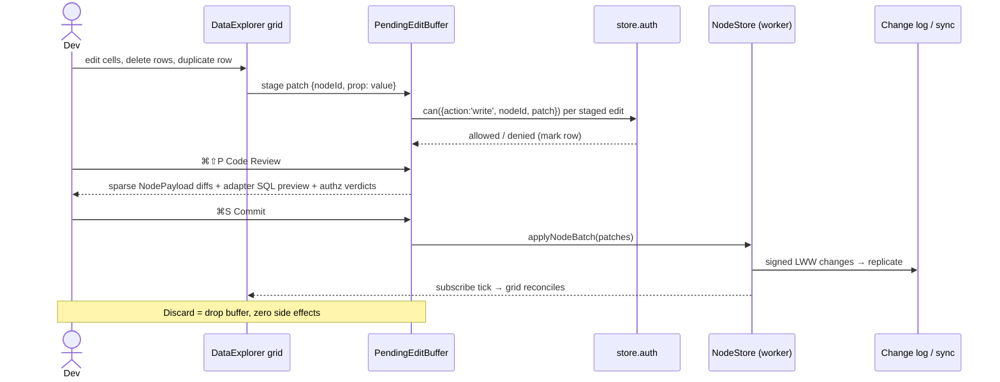
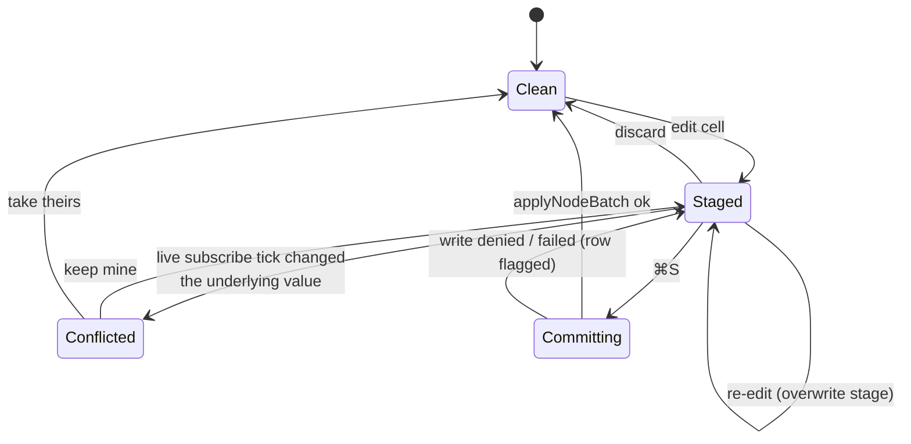

# TablePlus-Grade Data Tab: Bringing Desktop DB-GUI Ergonomics To Devtools And Databases

## Problem Statement

TablePlus (<https://tableplus.com/>) is the benchmark desktop database GUI:
a fast native client with inline-editable grids, staged edits with a
"Code Review" of pending SQL before commit, a smart multi-tab query editor,
filter builders that show their generated SQL, foreign-key row jumping,
import/export, and keyboard-driven object navigation.

xNet has two adjacent surfaces that could deliver most of that experience:

1. **The devtools Data tab** (`packages/devtools/src/panels/DataExplorer/`) —
   a schema-aware node browser over the live NodeStore.
2. **The user-facing Database content type**
   (`apps/web/src/components/DatabaseView.tsx` + `packages/views/src/grid/`) —
   the Airtable-like grid over `DatabaseField`/`DatabaseRow` nodes.

This exploration asks: **which TablePlus features make sense in a local-first,
CRDT-replicated, schema-native store — and how do we get there without
breaking the sync model?** The answer is not "clone TablePlus"; several of its
signature features change meaning (for better and worse) when the "database"
is a signed LWW change log materialized into wa-sqlite in a worker.

## Executive Summary

- **~60–70% of TablePlus's SQLite-relevant surface already exists** in some
  form: a virtualized editable grid with multi-cell selection, clipboard,
  undo/redo and keyboard map (`packages/views/src/grid/`), filter/sort
  toolbars with persisted view prefs, CSV/JSON import/export
  (`packages/data/src/database/import/`, `.../export/`), schema introspection
  (SchemaRegistry panel), and a query-plan inspector that already shows the
  generated SQL and index usage — something TablePlus itself doesn't do for
  grid filters.
- **The three signature gaps** are (1) a **raw SQL workbench** (the internal
  seam exists: `port-sqlite-adapter.ts` proxies `exec`/`query` to the SQLite
  worker, but nothing exposes it), (2) **staged edits with Code Review** —
  which in xNet should preview *change-log entries*, not SQL, and is arguably
  *more* valuable here because a bad write replicates to every peer — and
  (3) **relation (FK) row-jump** navigation.
- **The hard constraint: raw SQL writes must be forbidden (or loudly
  quarantined).** A direct `UPDATE nodes SET …` bypasses the change log, never
  syncs, and gets silently clobbered by the next LWW merge — exactly the
  divergence class the 0272 simulation harness caught. The SQL workbench must
  default to `PRAGMA query_only` semantics.
- **Recommendation: extend in-house rather than embed.** Outerbase Studio is
  AGPL (license-contagious), Prisma `studio-core` carries branding terms, and
  we already own a mature grid. The plan is four phases: quick wins
  (copy-as-X, duplicate row, export, relation jump) → read-only SQL workbench
  → staged-edit Code Review → navigation/backup polish.

## Current State In The Repository

### Layered architecture

```mermaid
flowchart TD
    subgraph Devtools["packages/devtools (Data tab)"]
        DE[DataExplorer.tsx]
        UDE[useDataExplorer.ts]
        GA[grid-adapter.ts]
        CP[useCellPermissions.ts]
        VP[view-prefs.ts]
        SQLP[SQLitePanel]
        QD[QueryDebugger]
        MW[MigrationWizard]
        PAL[CommandPalette]
    end
    subgraph Views["packages/views/src/grid"]
        GS[GridSurface.tsx<br/>virtualized, editable]
        GT[GridToolbar.tsx<br/>sort/filter/density/columns]
        GP[GridPeek.tsx<br/>row detail]
        CB[clipboard.ts + keymap.ts]
    end
    subgraph Data["packages/data"]
        NS[NodeStore<br/>store.query / list / subscribe / auth]
        SA[sqlite-adapter.ts<br/>FTS5, R-tree, materialized views,<br/>EXPLAIN plan metadata]
        IE[database/import + export<br/>CSV / JSON / NDJSON]
        SR[schema/registry.ts]
    end
    subgraph Bridge["packages/data-bridge"]
        WB[WorkerBridge / Comlink RPC]
        PSA[worker/port-sqlite-adapter.ts<br/>exec&#40;sql&#41; — internal only]
    end
    SQLW[(SQLite worker<br/>wa-sqlite / OPFS)]

    DE --> UDE --> NS
    DE --> GS
    GS --> GT & GP & CB
    NS --> WB --> PSA --> SQLW
    NS --> SR
    SA -.query planning / SQL generation.-> PSA
    MW -.schema migrations.-> SR
```



### What each surface can do today

**Devtools Data tab** (`packages/devtools/src/panels/DataExplorer/DataExplorer.tsx`,
`useDataExplorer.ts`, `grid-adapter.ts`, `useCellPermissions.ts`,
`view-prefs.ts`):

- Schema picker with live per-schema counts; 500-row live window via
  `store.subscribe`; include-deleted toggle.
- `GridToolbar` sort chips + filter builder + density + column visibility +
  full-text search, persisted per schema in localStorage (`view-prefs.ts`).
- Opt-in inline editing when a concrete schema is selected, with **per-cell
  authorization locks** (`store.auth.can` / `store.auth.explain`) and an
  AuthTrace pane explaining *why* a cell is read-only — beyond anything
  TablePlus offers.
- A **query plan inspector**: strategy, generated SQL, params, indexes used,
  `EXPLAIN QUERY PLAN` details, timing (`NodeQueryPlanMetadata` from
  `packages/data/src/store/query.ts`).

**SQLitePanel** (`packages/devtools/src/panels/SQLitePanel/`): storage-mode
detection (OPFS vs memory), debug-log toggle, captured logs. **No SQL editor.**

**The grid** (`packages/views/src/grid/`): TanStack-Virtual virtualization,
range/row/column selection, type-aware cell editors, copy/paste/fill-down,
insert/delete rows, undo/redo (`state.ts` `GridCommand` set), row peek,
cell comments, summary bar. `clipboard.ts` and `keymap.ts` are the natural
homes for "copy rows as X" and TablePlus-style shortcuts.

**DatabaseView** (`apps/web/src/components/DatabaseView.tsx`,
`packages/react/src/hooks/useGridDatabase.ts`): multi-view tabs
(table/board/list/gallery/calendar/timeline), field CRUD + type changes,
select options, grouping, summaries, comments, attachments, **CSV/JSON import
with type inference and CSV/JSON/NDJSON export**
(`packages/data/src/database/import/csv-parser.ts`,
`.../export/csv-export.ts`, `.../export/json-export.ts`).

**Query layer** (`packages/data/src/store/query.ts`): `where`, `orderBy`,
`limit/offset` **and** keyset cursor (`after`), `count: 'exact' | 'estimate'`,
FTS `search`, spatial queries, materialized views with TTL — a strictly richer
query descriptor than what the Data tab currently exposes.

**Raw SQL seam** (`packages/data-bridge/src/worker/port-sqlite-adapter.ts`):
the worker-side adapter proxies `exec(sql)` / statements to the SQLite worker
(`BEGIN IMMEDIATE`/`COMMIT`/`ROLLBACK` all flow through it) and already does
introspection (`PRAGMA table_info(...)`, `sqlite_master` queries). Nothing
exposes this over the WorkerBridge RPC to devtools — that is the missing pipe,
not missing capability.

## External Research

### TablePlus feature inventory (SQLite-relevant subset)

Verified against <https://docs.tableplus.com/>:

| Category | TablePlus behavior |
|---|---|
| Staged edits | Nothing hits the DB until `⌘S`; explicit Discard; **Code Review** (`⌘⇧P`) shows generated SQL of all pending changes |
| Safe mode | 5 tiers, from silent to confirm-everything-except-SELECT |
| Grid | Inline edit everywhere (incl. query results), row sidebar editor, `⌘D` duplicate, spreadsheet paste, middle-click **Quick Look** value viewer (JSON/BLOB pretty-print), 300-row pages |
| Filters | Column+operator+value rows, stackable, **shows generated SQL**, quick-filter from cell, column-visibility filter |
| Query editor | Autocomplete (tables/columns/keywords), run selection, multi-statement → **result tabs**, history, **favorites with keyword-bound snippets**, streaming results, SQL reformatter, split panes |
| Structure | Column add/edit/default/PK staged like data edits; Definition shows `CREATE TABLE`; indexes/triggers/constraints views |
| FK navigation | Arrow on FK cells jumps to the referenced row (row-jump, not ER diagram) |
| Import/export | CSV + SQL import; CSV/JSON/SQL export; **copy rows as** text/JSON/HTML/Markdown/CSV/INSERT |
| Navigation | **Open Anything** (`⌘P`) fuzzy jump to any object; console log of executed queries |
| Misc | Backup/restore, dark mode, remappable keymap, JS plugin API, LLM plugin |

Not applicable to an embedded local store: SSH tunnels, TLS, connection
keychains, user management, process kill, multi-driver matrix. The *analogue*
of connection management is choosing among Spaces/OPFS databases and tagging
environments.

### Prior art for embeddable data browsers

| Tool | License | Embeddable? | Notes |
|---|---|---|---|
| Outerbase Studio (ex-libSQL Studio) | **AGPL-3.0** | iframe API | Closest feature clone of the TablePlus staging model in a browser; AGPL is contagious for source embedding |
| Prisma `@prisma/studio-core` | Apache-2.0 (+branding terms) | React component with pluggable query executor | Best *architectural* reference: executor interface ≈ our WorkerBridge |
| Drizzle Studio web component | Closed source | technically | UX reference only |
| Beekeeper Studio | GPLv3 | no (Electron app) | OSS TablePlus analogue |
| Glide Data Grid | MIT | yes | Canvas grid; only relevant if `GridSurface` hit a perf wall — it hasn't |
| Datasette | Apache-2.0 | server, not component | Faceted read-only exploration prior art |

Conclusion: nothing embeddable is license-clean *and* better than what
`packages/views/src/grid/` already is. Build on our own grid.

## Key Findings

1. **The gap is thinner than it looks.** Sorting, filtering, editing,
   import/export, virtualization, schema introspection, plan inspection, and
   per-cell authz all exist. What's missing is mostly *plumbing and chrome*:
   expose the query descriptor's full power (cursors, counts, FTS) in the Data
   tab, expose the internal SQL path read-only, and add clipboard/navigation
   conveniences.

2. **"Commit/Code Review" translates to change-log preview, and it's a
   headline feature here.** In TablePlus, staged edits protect a server DB.
   In xNet, every committed edit becomes a signed change that **replicates to
   all peers** — the blast radius is bigger, so the review affordance is worth
   more. The preview should show the exact sparse `NodePayload` patches
   (per-property LWW writes) that will be emitted, optionally alongside the
   SQL the adapter will run. Today the Data tab's edit mode writes
   immediately; DatabaseView writes immediately by design (collaborative
   Airtable semantics — staging would be wrong *there*).

3. **Raw SQL must be read-only by default — this is a correctness rule, not a
   taste choice.** Writes that bypass `NodeStore` never enter the change log:
   they don't sync, they break the hash chain's view of state, and LWW will
   silently revert them on the next merge (the exact divergence family the
   0272 sim harness surfaced). A SQL workbench is safe and hugely useful for
   *reads* (debugging indexes, FTS, the `changes` table itself); "unsafe
   mode" writes should require an explicit, scary, session-scoped opt-in and
   be documented as local-only surgery.

4. **Two surfaces, two products — don't merge them.**
   - The **devtools Data tab** should become the TablePlus analogue: power
     tool over *all* nodes + raw SQLite, read-mostly, staged writes,
     plan-transparent.
   - **DatabaseView** should absorb only the user-legible conveniences
     (duplicate row, copy-as, relation jump, quick-look) and keep live
     collaborative semantics.

5. **Structure editing ≠ ALTER TABLE.** In xNet the logical schema is the
   Schema registry + extensible-schema overlays (0188), and the physical
   SQLite schema is owned by the adapter/migrations. A TablePlus-style
   Structure tab should *view* physical DDL (`sqlite_master`, `PRAGMA
   table_info/index_list`) but *edit* at the schema layer, delegating to the
   existing MigrationWizard flow. (Related landmine from 0272: `applySchema`
   never runs `SCHEMA_MIGRATIONS` — any structure UI must not assume ALTERs
   apply.)

6. **Autocomplete is cheap.** `sqlite_master` + `pragma_table_info` are
   already queried by the adapter; the Schema registry gives typed property
   lists for node-level querying. A CodeMirror SQL editor with a schema
   completion source covers TablePlus's headline editor feature in a few
   hundred lines.

## Options And Tradeoffs

### Option A — Embed a third-party studio (Outerbase iframe / Prisma studio-core)

- ➕ Fastest path to a full query workbench.
- ➖ Outerbase is AGPL (incompatible with MIT core distribution posture);
  Prisma requires visible branding and its grid is weaker than ours.
- ➖ Neither understands schemas-as-nodes, per-cell authz, the change log, or
  the worker bridge; both assume they own the database.
- ➖ Duplicate grid/filter UX inside devtools.

### Option B — Raw-SQL-first: make SQLitePanel a mini TablePlus over wa-sqlite

- ➕ Maximum debugging power; simple mental model for SQL natives.
- ➖ Centers the *wrong abstraction*: the physical tables (`nodes`, `changes`,
  FTS shadow tables) are an implementation detail; editing them corrupts sync
  (Finding 3).
- ➖ Leaves the node-level Data tab — the surface people actually use —
  unimproved.

### Option C — Node-first with a read-only SQL workbench annex (recommended)

- Extend DataExplorer toward TablePlus parity at the **node/schema level**
  (staged edits, copy-as, relation jump, richer filters, export), and add a
  **read-only SQL workbench** tab backed by a new guarded RPC.
- ➕ Respects the sync model; reuses `GridSurface`; the plan inspector already
  bridges node-queries to SQL, making the two levels feel like one tool.
- ➖ More incremental work than embedding; staged-edit layer is net-new state
  machinery.

### Option D — Do it all in DatabaseView instead

- ➖ Wrong audience: DatabaseView is collaborative end-user software; staged
  commits and SQL panes conflict with its live-editing semantics and the
  humane-patterns posture (0234). Only the small conveniences belong there.

**Choice: C**, with a curated subset of Phase-1 conveniences also landing in
DatabaseView.

## Recommendation

Adopt **Option C** in four phases. The staged-edit Code Review flow:



Pending-edit lifecycle (per cell):



The `Conflicted` state is the one TablePlus never needed: the store is live
and multi-writer, so a staged cell whose base value changes underneath must
surface a keep-mine/take-theirs choice rather than silently last-write-win.

**SQL workbench safety design** (Phase 2): add a devtools-only RPC
(e.g. `bridge.debug.sql({ sql, params })`) that

1. runs on a dedicated connection/session with `PRAGMA query_only = ON`
   (wa-sqlite honors it; any write statement then fails hard), and
2. classifies statements client-side to label the button Run vs. blocked, and
3. streams rows with a cap + "load more" (mirroring TablePlus streaming
   results), and
4. logs every executed statement to the existing devtools console-log channel
   (TablePlus's console-log analogue), and
5. is compiled out / gated the same way other devtools instrumentation is —
   never reachable from production app code paths.

An optional "unsafe writes" toggle can exist later, but per Finding 3 it
should be session-scoped, require typing a confirmation phrase, and stamp a
warning that un-logged writes will not sync and may be reverted by LWW.

## Example Code

Guarded read-only SQL RPC (sketch; worker side sits next to
`packages/data-bridge/src/worker/port-sqlite-adapter.ts`):

```ts
// packages/data-bridge/src/worker/debug-sql.ts
export interface DebugSqlRequest {
  sql: string
  params?: unknown[]
  maxRows?: number // default 500, hard cap 10_000
}

export interface DebugSqlResult {
  columns: string[]
  rows: unknown[][]
  truncated: boolean
  durationMs: number
}

export async function runDebugSql(
  adapter: PortSqliteAdapter,
  req: DebugSqlRequest,
): Promise<DebugSqlResult> {
  // Dedicated session: reads can never mutate, whatever the SQL says.
  await adapter.exec('PRAGMA query_only = ON')
  try {
    const started = performance.now()
    const { columns, rows } = await adapter.queryWithColumns(
      req.sql,
      req.params ?? [],
      { maxRows: Math.min(req.maxRows ?? 500, 10_000) },
    )
    return {
      columns,
      rows: rows.slice(0, req.maxRows ?? 500),
      truncated: rows.length > (req.maxRows ?? 500),
      durationMs: performance.now() - started,
    }
  } finally {
    await adapter.exec('PRAGMA query_only = OFF')
  }
}
```

Copy-rows-as (drops straight into `packages/views/src/grid/clipboard.ts`):

```ts
export type CopyRowsFormat = 'tsv' | 'csv' | 'json' | 'markdown' | 'insert'

export function serializeRows(
  fields: GridField[],
  rows: GridRow[],
  format: CopyRowsFormat,
  opts?: { table?: string },
): string {
  switch (format) {
    case 'json':
      return JSON.stringify(
        rows.map((r) => Object.fromEntries(fields.map((f) => [f.name, r.cells[f.id]]))),
        null,
        2,
      )
    case 'markdown': {
      const head = `| ${fields.map((f) => f.name).join(' | ')} |`
      const sep = `| ${fields.map(() => '---').join(' | ')} |`
      const body = rows.map((r) => `| ${fields.map((f) => fmt(r.cells[f.id])).join(' | ')} |`)
      return [head, sep, ...body].join('\n')
    }
    case 'insert':
      return rows
        .map(
          (r) =>
            `INSERT INTO ${opts?.table ?? 'nodes'} (${fields.map((f) => f.name).join(', ')}) ` +
            `VALUES (${fields.map((f) => sqlLiteral(r.cells[f.id])).join(', ')});`,
        )
        .join('\n')
    // csv / tsv fall through to the existing exporters in @xnetjs/data
  }
}
```

## Risks And Open Questions

- **Un-logged writes are the cardinal sin.** Every write path added by this
  work must terminate in `NodeStore` mutations. The read-only pragma guard
  needs a regression test that proves `INSERT/UPDATE/DELETE/ALTER` through the
  debug RPC fail.
- **Staged-edit conflict UX** against a live store is novel; the `Conflicted`
  state needs real design (and the buffer must key off the LWW per-property
  timestamps it read at stage time, not just values).
- **`PRAGMA query_only` session scoping**: the adapter multiplexes one
  connection. If a dedicated debug connection isn't feasible in the SAH-pool
  worker (OPFS SAH is exclusive — see 0262), the guard must serialize debug
  statements against store writes or classify statements instead. Needs a
  spike.
- **Authorization-aware raw SQL is impossible**: SQL bypasses read-authz
  filtering, so the workbench can show rows the Data tab would hide. That's
  acceptable for a *devtools* (developer-operator) surface but must be labeled,
  and it reinforces keeping the workbench out of any user-facing build.
- **Performance of staged authz checks**: `store.auth.can` per staged cell is
  async; batching exists in `useCellPermissions.ts` but a 500-row paste needs
  a bulk path.
- **Structure editing scope creep**: viewing DDL is Phase 2; *editing*
  physical schema stays out of scope (MigrationWizard owns that), and the
  0272 `applySchema`/`SCHEMA_MIGRATIONS` landmine should be fixed before any
  UI implies ALTERs work.
- **Open question**: should query favorites/history be localStorage
  (devtools-local, like `view-prefs.ts`) or nodes (synced, shareable)?
  Recommendation: localStorage first; nodes only if teams ask for shared
  snippets.
- **Open question**: does Open Anything belong in the devtools CommandPalette
  (exists today) or the app-level palette? Devtools first.

## Implementation Checklist

### Phase 1 — Grid conveniences (devtools Data tab + DatabaseView where noted)

- [ ] `serializeRows` copy-as {TSV, CSV, JSON, Markdown, SQL-INSERT} in
      `packages/views/src/grid/clipboard.ts` + context-menu/keymap entries
      (also DatabaseView)
- [ ] Duplicate row (`⌘D`) as a `GridCommand` in `packages/views/src/grid/state.ts`
      (also DatabaseView)
- [ ] Quick Look: promote `GridPeek` cell view with pretty-printed JSON and a
      middle-click/space shortcut (also DatabaseView)
- [ ] Relation/FK jump: render relation-typed properties in
      `grid-adapter.ts` as links that switch schema + focus the target node;
      breadcrumb back-stack in `useDataExplorer.ts`
- [ ] CSV/JSON export from DataExplorer toolbar reusing
      `packages/data/src/database/export/` over the current filtered window,
      with an "export full query" path using keyset pagination
- [ ] Expose `count: 'exact'`, keyset `after` paging ("load next 500"), and
      FTS search fields in the Data tab query descriptor

### Phase 2 — Read-only SQL workbench

- [ ] Spike: dedicated debug session vs statement classification under the
      SAH-exclusive OPFS worker; pick the enforcement mechanism
- [ ] `debug.sql` RPC in `packages/data-bridge` (worker + bridge + types),
      devtools-gated, row-capped, duration-reported
- [ ] Regression tests: every write-statement class fails through the RPC
- [ ] New "SQL" tab in SQLitePanel (or a promoted panel): CodeMirror editor,
      multi-statement run → result tabs, run-selection, cancel
- [ ] Autocomplete source from `sqlite_master` + `pragma_table_info` +
      SQL keywords
- [ ] Query history (ring buffer) + favorites with names, persisted like
      `view-prefs.ts`
- [ ] Execution log wired into the existing devtools Logs channel
- [ ] Structure *viewer*: per-table DDL (`sqlite_master.sql`), columns, indexes
      (`PRAGMA index_list/index_info`), linking "edit" affordances to
      MigrationWizard instead of ALTER

### Phase 3 — Staged edits + Code Review (devtools Data tab only)

- [ ] `PendingEditBuffer` keyed by `(nodeId, property)` storing staged value +
      base LWW stamp; grid renders staged cells distinctly
- [ ] Stage-time authz verdicts via a batched `store.auth.can` path
- [ ] Code Review pane (`⌘⇧P`): sparse `NodePayload` diff per node, adapter
      SQL preview where available, authz verdicts, conflict badges
- [ ] Commit (`⌘S`) via a single `applyNodeBatch`; Discard clears the buffer
- [ ] Conflict detection on subscribe ticks → keep-mine/take-theirs UI
- [ ] Safe-mode toggle: read-only ⇄ staged-writes (default staged; direct
      immediate-write mode removed)
- [ ] Test: committing a staged buffer emits byte-identical changes to the
      equivalent direct edits

### Phase 4 — Navigation, backup, polish

- [ ] Open Anything: extend devtools CommandPalette to fuzzy-match schemas,
      nodes (by title), saved queries, panels
- [ ] Backup: "Download snapshot" via `VACUUM INTO` a temp OPFS file →
      download; document restore path (import into a fresh profile)
- [ ] Multi-tab workspace state for the SQL workbench (tabs persist like
      `view-prefs.ts`)
- [ ] Keyboard-shortcut audit against `keymap.ts` — cover TablePlus's core
      set (⌘S, ⌘D, ⌘⇧P, ⌘P, ⌘F, ⌘I, space-peek)
- [ ] Docs page: "The Data tab as a database GUI" with the sync-safety
      rationale for read-only SQL

## Validation Checklist

- [ ] Debug-SQL guard test suite green: `INSERT/UPDATE/DELETE/DROP/ALTER/
      PRAGMA journal_mode` all rejected; `SELECT/EXPLAIN/PRAGMA table_info`
      allowed
- [ ] Sync sim (0272 harness) run with a staged-commit workload: replicas
      converge, no `INVALID_HASH`, change log identical to direct-edit run
- [ ] Copy-as-INSERT of a row round-trips through the SQL workbench parse
      (statement classification recognizes it as a write and blocks it)
- [ ] CSV export → import round-trip preserves types on a seeded Database
      (`seed-coverage.test.ts` fixtures)
- [ ] 10k-row schema: grid paging via keyset `after` keeps first-interaction
      under the 0266 read-latency budgets; no full-table scans in plan
      inspector for filtered views
- [ ] Per-cell authz: staged edits on locked cells are rejected at stage time,
      not at commit time
- [ ] Devtools bundle: SQL workbench code-split; zero size impact on
      production app builds
- [ ] Manual pass: relation jump ↔ back-stack, ⌘⇧P review, discard leaves
      zero changes in the change log

## References

- TablePlus docs: <https://docs.tableplus.com/> (commit/Code Review, safe
  mode, filters, query editor, import/export, Open Anything)
- Outerbase Studio: <https://github.com/outerbase/studio> (AGPL-3.0, iframe embed)
- Prisma Studio embedding: <https://www.prisma.io/docs/postgres/database/prisma-studio/embedding-studio>
- Glide Data Grid: <https://github.com/glideapps/glide-data-grid> (MIT)
- Datasette: <https://github.com/simonw/datasette>
- Repo: `packages/devtools/src/panels/DataExplorer/`,
  `packages/views/src/grid/`, `packages/data/src/store/query.ts`,
  `packages/data/src/database/{import,export}/`,
  `packages/data-bridge/src/worker/port-sqlite-adapter.ts`,
  `apps/web/src/components/DatabaseView.tsx`
- Related explorations: 0188 (extensible schemas), 0262 (OPFS SAH
  exclusivity), 0266 (read-speed budgets), 0272 (durability/sim harness —
  divergence class + `applySchema` landmine)
